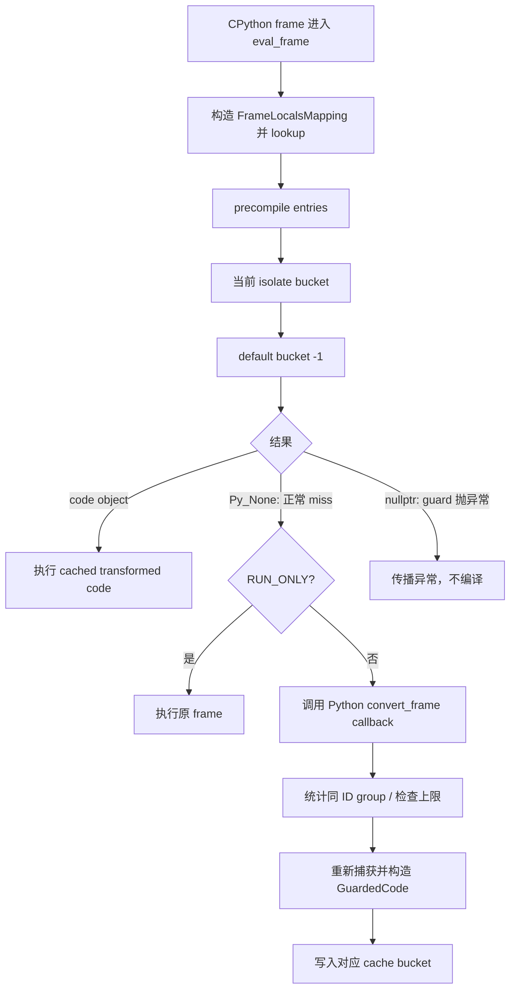

# B07 · Guards、Cache Lookup 与 Recompilation

> 卷别：B · TorchDynamo 捕获  
> 固定源码：PyTorch `e8f97c1a6ef8cbcdd0a946606bc1e924e4f07e52`  
> 前置：[[b06_output_graph_side_effects_and_graph_emission_analysis]]  
> 后续：[[b08_graph_break_resume_functions_and_partial_graphs_analysis]]  
> 最后更新：2026-07-28

## 1. 为什么 compiled graph必须有 guards

捕获时只观察到一次具体执行，却常做了超出纯Tensor数据流的假设：

- `self.training`值不变；
- 某个函数/对象identity不变；
- tensor dtype/device/rank/layout满足特化；
- shape满足静态值或符号约束；
- globals、default device、grad mode、dispatch mode不变；
- Python容器的结构/键顺序仍适用；
- alias和mutation关系没有改变。

没有 guards，系统会把一次执行中成立的假设错误地推广到所有调用。

**核心结论**：guard定义的是一个 compiled artifact的运行时适用域；recompilation是发现
当前输入落在现有适用域之外后，为新域构造另一个artifact。

## 2. Guard不是FX graph的边

FX graph描述区域内部的值依赖；guard在进入 transformed code前检查 Python frame环境。
两者关系是：

```text
runtime frame
  → guard manager检查“捕获假设仍成立吗”
  → 若成立，执行包含compiled graph调用的transformed code
  → 若不成立，尝试下一个CacheEntry或重新捕获
```

guard可能引用一个Source路径，但不是正向/反向FX图间的边，也不是普通GraphNode。

## 3. Guard从哪里产生

主要来源：

- VariableBuilder按Python值类别安装；
- Source访问路径决定如何重新取值；
- shape environment产生符号表达式guards；
- OutputGraph记录global/dispatcher/module状态；
- alias/identity跟踪产生duplicate或ID guards；
- backend/AOT层可以补充约束。

`CheckFunctionManager`读取 `output_graph.guards`，对guards排序并构造guard manager
（`torch/_dynamo/guards.py:4501-4524` 与
`torch/_dynamo/guards.py:4575-4580`）。

排序用于稳定构建与执行组织，不代表它在对FX nodes做topological traversal。

## 4. CacheEntry保存什么

每个entry至少绑定：

- guard manager；
- transformed user bytecode；
- compile id；
- backend；
- root/diff guard manager；
- owner ExtraState与bucket id。

见 `torch/csrc/dynamo/cache_entry.h:44-64`。

这说明一个cache key不是预先哈希出的简单tuple。Dynamo一级cache更像：

```text
同一 code object 下的一组候选 specialization
→ 逐项运行可执行 guard predicate
→ 第一个通过者提供 transformed code
```

## 5. Lookup的精确顺序

对当前 isolate bucket：

1. 顺序扫描entry list；
2. 先检查backend是否相同/相等；
3. 再运行root guard manager；
4. 首个成功entry命中；
5. 若都失败则miss。

核心代码见 `torch/csrc/dynamo/extra_state.cpp:203-225` 与
`torch/csrc/dynamo/extra_state.cpp:226-248`。

若开启isolated recompiles，则自己的bucket miss后再查默认bucket
（`torch/csrc/dynamo/extra_state.cpp:292-317`）。

## 6. Recompile的判定不是“cache里已经有任意entry”

同一 code object可被许多不同module实例调用，每个实例通过 `ID_MATCH`形成独立entry。
这不应被当作“同一对象不停重编译”。`compute_cache_size`因此分别统计：

- 当前region总entries；
- 与当前frame拥有相同ID-matched objects的entries；
- 所有regions总entries。

结构和计数见 `torch/_dynamo/cache_size.py:72-90`、
`torch/_dynamo/cache_size.py:92-106` 与
`torch/_dynamo/cache_size.py:142-162`。

`is_recompilation`关注同一ID group是否将超过1，而非裸entry总数
（`torch/_dynamo/cache_size.py:165-175`）。

## 7. 两层重编译上限

当前机制至少有：

- `recompile_limit`：同一region、同一ID-matched对象组的上限；
- `accumulated_recompile_limit`：同一code object跨regions的全局安全上限；
- compile id的额外兜底，处理guard manager失效导致cache不增长但持续编译的情况。

判断逻辑见 `torch/_dynamo/cache_size.py:178-196`。

达到上限时，普通partial模式可把该region策略设为 `RUN_ONLY`；fullgraph则必须硬失败，不能
静默回退（`torch/_dynamo/convert_frame.py:2037-2052`）。

## 8. Guard failure、cache miss和compile failure的区别

| 事件 | 含义 | 典型后续 |
|---|---|---|
| guard failure | 某个entry不适用 | 继续查下一entry |
| cache miss | 所有候选均不适用 | 新捕获、eager或报错 |
| recompile | miss后为相同code新建specialization | entry增长 |
| graph break | 捕获某条Python路径时切分区域 | partial graph + resume |
| backend failure | backend不能编译已捕获FX graph | 报错/由策略回退 |

将所有慢调用都叫“recompile”会掩盖真实层次。

## 9. Guard invalidation与“dead”

guard可能通过weakref观察被 `ID_MATCH`的对象。对象死亡后：

- 对应guard/entry可能失效或被清理；
- cache size不能只靠list长度判断历史编译次数；
- compile id上限用于防止“entry不断失效、list不增长、却持续编译”。

`_has_same_id_matched_objs`比较frame locals中的weakref与entry记录
（`torch/_dynamo/cache_size.py:109-126`、
`torch/_dynamo/cache_size.py:129-139`）。

这里的“dead”是**被guard引用的Python对象不再存活或entry失效**，不是FX node dead。

## 10. 为什么guard manager是树

多个guards常共享访问前缀，例如：

```text
L["self"]
├── type
├── training
└── layer
    ├── weight
    │   ├── dtype
    │   └── size
    └── bias
```

树结构可：

- 共享Source前缀访问；
- 在父检查失败时短路整个子树；
- 用专门C++ accessor/leaf guard降低Python overhead；
- 构造diff guard manager支持unsafe的差异检查路径。

它不是图优化pattern tree；相同的“树”只是因为两者都需要组合结构。

## 11. Cache顺序与LRU

当前容器是list，查找顺序直接影响hit成本。启用LRU时命中项移到前面
（`torch/csrc/dynamo/extra_state.cpp:319-325`），创建entry时插入前或末尾取决于配置
（`torch/csrc/dynamo/extra_state.cpp:380-397`）。

因此稳态复杂度与输入分布相关：

- 热specialization靠前：平均检查少；
- 多形态均匀分布：平均扫描增加；
- 每次都新形态：扫描全部再支付capture/backend；
- guard共享树优化的是单entry内部，不能消除跨entry顺序扫描。

## 12. 源码跟读：一次命中、miss 与重新捕获

把 guard build、C++ lookup 和 Python compile callback放在一条链上，才能避免把所有慢
调用都误称为 recompile：



### 12.1 Guard tree在编译完成时构造

`CheckFunctionManager`从 `output_graph.guards`取得本次捕获累积的 guard集合，同时先更新
已有 entries的 diff guard sources
（`torch/_dynamo/guards.py:4501-4524`）。随后按 `Guard.sort_key`稳定排序，并在
`DisableTorchFunction`作用域中构造 guard manager
（`torch/_dynamo/guards.py:4575-4591`）。

这里先更新旧 entry不是额外优化 pass，而是 cache 共存要求：新 specialization出现后，
已有 entry的差异检查视图也必须知道新的 source集合。排序提供稳定的构造与诊断次序，
guard tree的父子关系则来自共享的 Source访问路径。

### 12.2 C++先查 cache，Python只处理真正的 miss

eval-frame路径先尝试无需完整 guard evaluation的快路；快路不能决定时才构造
`FrameLocalsMapping`并调用 `lookup`
（`torch/csrc/dynamo/eval_frame_cpp.cpp:536-555`）。`lookup`先扫描 precompile entries，
再按“当前 `isolate_recompiles_id`、默认 bucket `-1`”的次序查找
（`torch/csrc/dynamo/extra_state.cpp:274-290`、
`torch/csrc/dynamo/extra_state.cpp:292-317`）。

单个 bucket内部，`lookup_in_list`对每个 entry先比较 backend，再运行 root manager；启用
unsafe skip时改用 diff manager
（`torch/csrc/dynamo/extra_state.cpp:200-225`）。首个有效 entry立即返回；guard执行抛出的
Python异常会把 `guard_error`设为真并返回空指针，而普通“不匹配”继续下一 entry
（`torch/csrc/dynamo/extra_state.cpp:226-248`）。

因此三种返回值的语义不同：

| C++结果 | 含义 | 后续 |
|---|---|---|
| code object | 命中 specialization | 直接执行 transformed code |
| `Py_None` | 所有候选正常返回 false | 进入 miss策略 |
| `nullptr` | guard evaluation自身异常 | 传播异常，不能伪装为 miss |

命中后只有启用 LRU才把 entry移到表头
（`torch/csrc/dynamo/extra_state.cpp:319-325`）；这改变下次扫描成本，不改变 guard的适用
域。

### 12.3 `cache miss`不自动等于 `recompile`

eval-frame拿到 code object便执行 cached code
（`torch/csrc/dynamo/eval_frame_cpp.cpp:589-594`）。拿到 `Py_None`才进入 miss路径：
`skip_guard_eval_unsafe`要求硬失败，`RUN_ONLY`执行原 frame；其余情况才调用 Python
callback（`torch/csrc/dynamo/eval_frame_cpp.cpp:597-618`、
`torch/csrc/dynamo/eval_frame_cpp.cpp:620-638`）。

callback侧取得当前 isolate bucket与默认 bucket的 entries，并计算当前 frame相关的
cache size（`torch/_dynamo/convert_frame.py:640-656`）。`compute_cache_size`逐 entry检查
`ID_MATCH`对象是否与当前 frame相同
（`torch/_dynamo/cache_size.py:142-162`）；只有同一 ID group已经有 specialization，
`is_recompilation`才返回真（`torch/_dynamo/cache_size.py:165-175`）。

所以：

- 首次见到某个 code object：cache miss，但不是 recompile；
- 新 module实例有不同 `ID_MATCH`对象：可能新增 entry，但仍不是同一对象的 recompile；
- 同一 ID group的 guard全失败后再捕获：才是这里统计的 recompile；
- `RUN_ONLY`或 unsafe stance：miss后根本不进入正常重编译。

### 12.4 上限为何同时看 entry计数和 compile id

`exceeds_recompile_limit`先检查跨 regions累计上限，再检查当前 region、当前 ID group的
专用上限；最后还用 `frame_compile_id`兜底
（`torch/_dynamo/cache_size.py:178-196`）。最后一项处理 weakref对象死亡导致旧 guard
manager失效、cache长度不增长却仍反复编译的情况。

超过上限后，`fullgraph=True`必须硬失败；普通模式把 frame策略改为 `RUN_ONLY`
（`torch/_dynamo/convert_frame.py:2037-2052`）。这说明“上限”控制的是下一步执行策略，
不是对 FX graph做 DCE，也不是删除已有 compiled artifact。

## 13. 复杂度

设 \(C\) 个entries，第 \(i\) 个entry的guard tree实际访问 \(Q_i\) 个检查节点：

\[
T_{\text{lookup-hit-k}} = O\left(\sum_{i=1}^{k} Q_i\right)
\]

\[
T_{\text{miss}} = O\left(\sum_{i=1}^{C} Q_i\right)
+ T_{\text{capture}}
+ T_{\text{backend}}
\]

空间为：

\[
O\left(\sum_{i=1}^{C}
(\lvert guards_i\rvert+\lvert code_i\rvert+\lvert artifacts_i\rvert)
\lvert frame\_state\rvert\right)
\]

backend artifact可能由更深cache共享，不能简单按Dynamo entries相乘。

## 14. 常见误解

- **“guard是图里if节点。”** guard在cache dispatch边界检查frame假设。
- **“任何shape变化都会重编译。”** 已有动态entry可能覆盖新shape。
- **“entry越多就一定超过recompile_limit。”** limit按region和ID group统计，并有累计上限。
- **“guard failure就是错误。”** 它通常只是候选specialization不适用。
- **“dead node由反向图是否连边决定。”** FX DCE、autograd liveness和guard weakref死亡是
  三种不同概念。

## 配套 Demo

本页对应卷级入口 `tools/labs_torch_compile/demo_b_dynamo_capture.py` 的 `guards_recompile` 用例。默认以 CUDA 为验收设备：

```powershell
python -B tools\labs_torch_compile\demo_b_dynamo_capture.py `
  --case guards_recompile --device cuda `
  --output-dir tools\labs_torch_compile\artifacts\volume_demos\b07
```

先用 `--list --json` 查看用例声明的能力要求。无 CUDA 的机器可把 `--device` 改为 `cpu` 探索设备无关机制；CUDA/Triton/多卡专属用例会返回 `BLOCKED`，且不会执行用例正文。不要把 `BLOCKED` 写成 `PASS`。

重点读取 `summary.json` 与 `guards_recompile/result.json`：`status` 区分 `PASS/BLOCKED/FAIL`，`environment` 固化运行环境，`observations` 保存本页机制的实测字段，`artifacts` 指向图代码、日志、trace 或进程证据。`PASS` 只表示该次运行中的断言通过，不外推到其他 PyTorch 版本、shape、dtype 或硬件。

## Related Pages

- [[00_torch_compile_end_to_end_index]]
- [[b03_eval_frame_callback_and_code_cache_analysis]]
- [[b05_variable_tracker_source_and_python_object_model_analysis]]
- [[b09_dynamic_shapes_generalization_and_fallback_analysis]]
- [[d04_compile_cache_hierarchy_keys_and_invalidation_analysis]]
- [[guard_failure_and_recompile_diagnosis_analysis]]
