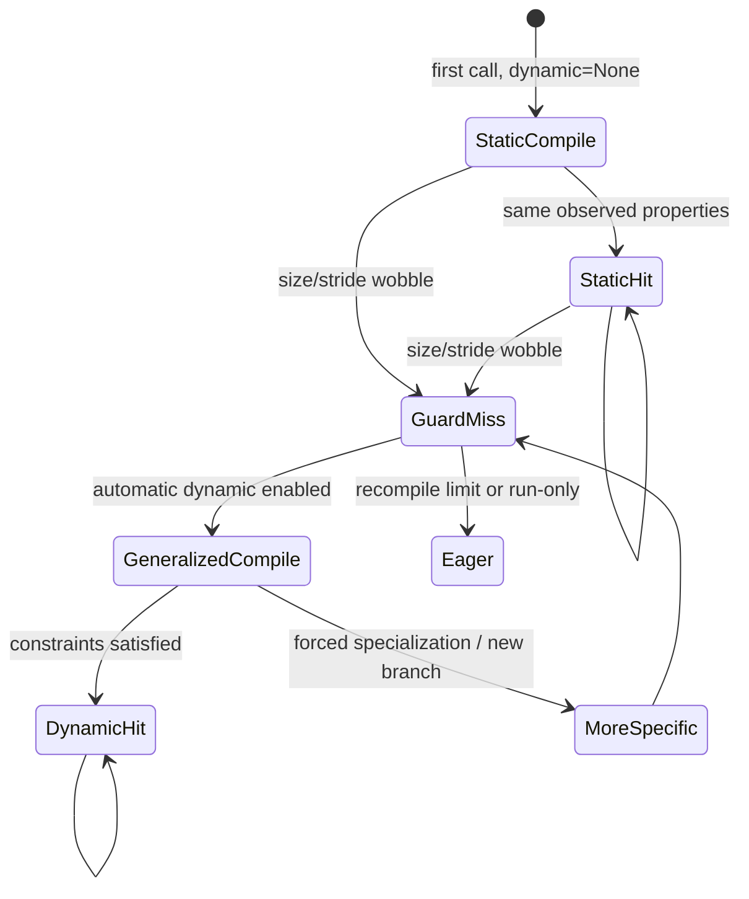

# B09 · Dynamic Shapes、自动泛化与回退边界

> 卷别：B · TorchDynamo 捕获  
> 固定源码：PyTorch `e8f97c1a6ef8cbcdd0a946606bc1e924e4f07e52`  
> 前置：[[b08_graph_break_resume_functions_and_partial_graphs_analysis]]  
> 后续：[[b10_backend_contract_and_custom_backend_analysis]]  
> 最后更新：2026-07-28

## 1. 为什么“shape动态”不是一个布尔事实

一个Tensor的shape相关状态至少包括：

- rank是否固定；
- 每一维是静态值、backed symbol、unbacked symbol还是duck symbol；
- stride怎样随size推导；
- storage offset是否符号化；
- 符号值的范围和等式关系；
- Python控制流是否依据该值分支；
- backend能否为这些表达式生成通用代码。

所以 `dynamic=True`不是“所有尺寸都不guard”，`dynamic=False`也不等于“系统没有
ShapeEnv”。

**核心结论**：动态形状是一套“如何建立符号、怎样约束它、何时仍须特化、guard失败后
怎样泛化”的策略链。

## 2. 三种公开策略

公开API定义：

- `dynamic=False`：始终specialize，不生成动态kernel；
- `dynamic=True`：第一次就尽量生成通用动态kernel；
- `dynamic=None`：先静态，发现尺寸变化后自动泛化。

见 `torch/__init__.py:3175-3181`。

默认配置 `assume_static_by_default=True`，只有显式标动态或自动策略识别出的维度才分配
相应符号（`torch/_dynamo/config.py:171-186`）。

## 3. `frame_state`为什么挂在 code object上

自动泛化必须比较多次调用：

```text
call 1: x.size(0)=8
call 2: x.size(0)=16
```

第一次捕获时不知道8是否恒定。第二次guard miss后，需要记住“同一Source的这一维发生
wobble”。`ExtraState.frame_state`跨不同frame共享，源码注释明确说它用于检测automatic
dynamic shape dims（`torch/csrc/dynamo/cache_entry.h:26-32`）。

这不是正反向图的连接，也不是FX node metadata；它是code-object级的跨调用观察状态。

## 4. 如何记录尺寸和stride变化

`record_automatic_dynamic`读取example Tensor的size/stride，并把stride按可推导关系编码为
`FrameStateSizeEntry`，再交给 `process_automatic_dynamic`
（`torch/_dynamo/variables/builder.py:4404-4433`）。

后续调用若同一Source的value变化，frame state可把对应size/stride维度标为dynamic。
重新捕获时，VariableBuilder读取这些标记创建更一般的 symbolic context。

## 5. 符号化优先级

对每一维，当前决策同时考虑：

- `mark_dynamic`、`mark_static`、`mark_unbacked`；
- `dynamic_shapes`显式spec/export constraints；
- automatic dynamic记录；
- dynamic/unbacked source配置；
- nested int；
- `assume_static_by_default`。

源码先读取显式dim markings
（`torch/_dynamo/variables/builder.py:4688-4700`），再合并automatic dynamic size/stride
（`torch/_dynamo/variables/builder.py:4721-4749`），最终选择
`UNBACKED/DYNAMIC/STATIC/DUCK`（`torch/_dynamo/variables/builder.py:4799-4828`）。

“显式用户约束优先于自动猜测”是关键设计原则。

## 6. `mark_dynamic`实际做了什么

`mark_dynamic(t, index, min, max, ...)`在Tensor对象上记录：

- dynamic indices；
- 每一维range；
-可选hint override；
- 可选specialization predicates。

写入逻辑见 `torch/_dynamo/decorators.py:1236-1263`。

它必须在 `torch.compile`调用之前执行；tracing中调用会明确失败
（`torch/_dynamo/decorators.py:1190-1207`）。

原因是标记是**输入捕获策略**，不是图内运行时Tensor op。

## 7. Backed与unbacked symbol

### Backed symbol

有example value作为hint，运行时通常来自Tensor size/stride或scalar input。编译时可以在
需要时使用hint做启发式选择，同时生成符号约束和guards。

### Unbacked symbol

来自数据依赖结果，捕获时没有可靠concrete hint，例如某些nonzero长度。它要求图和backend
不能偷偷依赖某个样例值，并需要更严格的range/guard推理。

`fullgraph=True`当前还会启用一些unbacked语义相关捕获设置，公开doc明确提到
scalar outputs和dynamic output-shape ops（`torch/__init__.py:3170-3174`）。

## 8. 动态entry为何仍有guards

动态只放宽某些值维度。仍可能guard：

- rank；
- dtype/device/layout；
- stride关系；
-符号range、整除和等式；
- branch选择；
- module状态；
- Python对象identity；
- alias与global state。

例如把batch维设为symbol并不意味着任何batch都合法；kernel可能要求范围、alignment或
特定branch条件。

## 9. 自动泛化的状态机



不是所有miss都可通过shape泛化解决；若原因是Python object identity、dtype或数据相关
branch，可能生成另一个specialization或直接break/fallback。

## 10. 为什么动态可能更慢

动态shape可减少specialization数量 \(S\)，但会增加：

- symbol和constraint创建；
- shape guards与runtime expressions；
- backend IR复杂度；
- 通用kernel的indexing/branch；
- 某些specialization-based fusion/autotune机会损失。

因此总成本近似：

\[
T =
\sum_{j=1}^{S} T_{\text{compile},j}
\sum_{i=1}^{N}
(T_{\text{guard},i}+T_{\text{shape-expr},i}+T_{\text{kernel},i})
\]

动态策略优化的是整个输入分布下的总成本，不是单个kernel的理论最短路径。

## 11. 泛化失败的典型原因

- 用户代码把size转为Python值并做不可捕获操作；
- shape决定不同Python对象/容器结构；
- backend强制specialize某个symbol；
- op缺少dynamic meta/fake支持；
- data-dependent output产生unbacked symbol但下游要求hint；
- range约束彼此冲突；
- layout/stride变化不满足原符号关系；
- recompile limit先被其他guard原因消耗。

此时要区分是Dynamo没有符号化、ShapeEnv产生guard、AOT分区限制还是Inductor codegen限制。

## 12. 复杂度

令 \(D\) 为symbolic dimensions数、\(E\)为symbolic expression/constraint数：

- frame-state比较约随输入Tensor维度线性增长；
- guard生成与shape expression规模至少为 \(O(D+E)\)；
- constraint simplification实际成本取决于表达式结构，不能保证简单线性；
-静态策略空间可能随输入形态产生 \(S\) 个compiled entries；
-动态策略把一部分 \(S\) 转换为更大的单graph/guard/kernel成本。

评估时应同时记录compiled graph数、guard failure原因、symbol数量和稳态kernel性能。

## 13. 常见误解

- **“dynamic=True就不会重编译。”** dtype、rank、layout、branch等仍可触发。
- **“dynamic=None等于dynamic=True。”** 前者通常先静态再在wobble后泛化。
- **“mark_dynamic是图内op。”** 它在捕获前给输入附加策略metadata。
- **“符号shape没有具体值。”** backed symbol通常有hint，但正确性不能依赖未guard的hint。
- **“动态shape只影响Dynamo。”** ShapeEnv、AOTAutograd、Inductor和kernel都消费相关信息。

## Related Pages

- [[00_torch_compile_end_to_end_index]]
- [[b07_guards_cache_lookup_and_recompilation_analysis]]
- [[b08_graph_break_resume_functions_and_partial_graphs_analysis]]
- [[04_symbolic_shapes_guards_and_graph_reuse]]
- [[d04_compile_cache_hierarchy_keys_and_invalidation_analysis]]
- [[e07_compile_latency_cache_and_steady_state_performance_analysis]]
