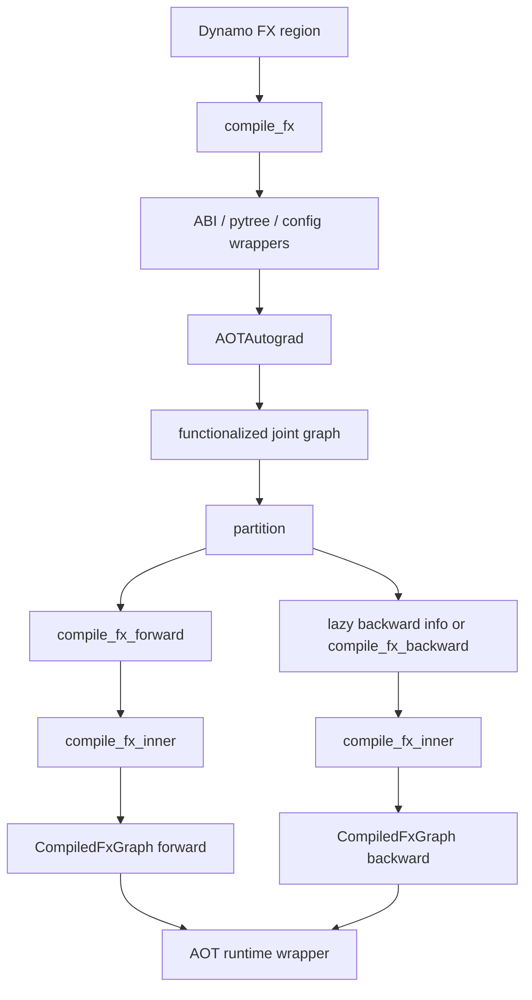

# D01 · Inductor `compile_fx` 的端到端编排

> 卷别：D · 编译产物、缓存与运行时  
> 固定源码：PyTorch `e8f97c1a6ef8cbcdd0a946606bc1e924e4f07e52`  
> 前置：[[21_codegen_kernel_mapping_autotuning_and_provenance]]  
> 后续：[[d02_aot_runtime_wrappers_and_lazy_backward_compile_analysis]]  
> 最后更新：2026-07-28

## 1. 为什么入口位于Inductor，却先调用AOTAutograd

Dynamo交给默认backend的是一个可能包含训练语义、mutation和高级ATen/Python target的FX
region。Inductor lowering更适合消费：

- functionalized graph；
- decomposition后的算子；
- 显式forward/backward；
- flat inputs/outputs；
- 已知mutation、alias和saved-value ABI。

因此默认backend不是直接：

```text
Dynamo FX → GraphLowering
```

而是：

```text
Dynamo FX
→ compile_fx总编排
→ AOTAutograd capture/functionalization/partition
→ forward compiler / backward compiler
→ compile_fx_inner
→ GraphLowering/Scheduler/codegen
→ OutputCode
```

**核心结论**：`compile_fx`是Inductor backend的端到端orchestrator；`compile_fx_inner`
才更接近“编译一张已经准备好的fw/bw FX graph”。

## 2. 源码对所有权的明确声明

`compile_fx` docstring说明：

- 它负责调用AOTAutograd；
- 最终通过callback回到 `inner_compile`；
- 它接管输入GraphModule所有权并可能原地修改。

见 `torch/_inductor/compile_fx.py:2889-2907`。

所以调用方若需保留原GraphModule，必须复制；不能假设跨此边界Node identity或metadata原样
保持。

## 3. 入口先处理配置递归与worker预热

`config_patches`通过递归调用把配置作用域同时包住：

- 当前forward编译；
- 可能在 `compile_fx`返回后才发生的lazy backward编译。

源码将patched `inner_compile`再包装一层，正是为了backward延迟执行仍看见相同配置
（`torch/_inductor/compile_fx.py:2925-2941`）。

CUDA/XPU输入还会尽早唤醒AsyncCompile pool，以便与前端/AOT工作重叠
（`torch/_inductor/compile_fx.py:2943-2948`）。

## 4. Wrapper归一化为何发生在主编译前

`_maybe_wrap_and_compile_fx_main`在实际工作前递归处理：

- graph output不是tuple；
- Dynamo export的PyTreeCodeGen；
- 嵌套Python input结构；
- AOTI/CPP/FX wrapper等模式。

最后才进入 `_compile_fx_main`，见 `torch/_inductor/compile_fx.py:3030-3056` 与
`torch/_inductor/compile_fx.py:3058-3070`。

这是为了让核心pipeline面对稳定的flat/tuple ABI，而不是在每个pass里重复处理用户pytree。

## 5. Forward compiler负责什么

`compile_fx_forward`接收AOT partition后的fw graph。inference路径还会：

- 记录joint-pass前后artifact；
- 保存output stack trace；
- 在pass前记录原始output stride；
- 运行joint graph passes。

见 `torch/_inductor/compile_fx.py:2609-2638`、
`torch/_inductor/compile_fx.py:2639-2639` 与
`torch/_inductor/compile_fx.py:2644-2673`。

随后它计算fixed args、user-visible outputs、static inputs、cudagraph配置，并调用
`inner_compile`。训练forward的outputs除了用户结果，还可能包含供backward保存的值。

## 6. Backward compiler为何单独加锁和选择static inputs

`compile_fx_backward`在全局compile lock下运行，因为backward可能在运行时lazy触发，仍会
访问共享compiler/config/cache状态（`torch/_inductor/compile_fx.py:2762-2780`）。

它还区分：

- partition后从inline代码保存的activations：地址不固定；
- primals/params/buffers：可作为static inputs；
- tangents；
- backward cudagraph override。

选择static input并调用inner compiler见 `torch/_inductor/compile_fx.py:2791-2820`。

## 7. `compile_fx_inner`的作用域

`compile_fx_inner`归一化kwargs并重新建立：

- cpp wrapper config；
- disabled dispatch modes；
- lazy GraphModule策略；
- compiler计时；
- fresh cache context；
- debug context。

然后调用被debug wrapper包住的 `_compile_fx_inner`
（`torch/_inductor/compile_fx.py:857-877` 与
`torch/_inductor/compile_fx.py:901-926`）。

它单独建立fresh-cache/config作用域，是因为lazy backward可能发生在外层 `compile_fx`
上下文退出之后。

## 8. `inner_compile`为何是回调参数

这允许：

- 正常走Inductor；
- 测试时替换为记录/断言compiler；
- compiler bisector关闭某层；
- AOTAutograd分别调用fw/bw compiler；
- config patch装饰延迟backward；
- cache层在inner compile前后插入。

回调结构还解释了“forward和backward是否同时编译”不是固定答案：AOT trace/partition可先
完成，bw lowering可以延迟到第一次backward。

## 9. 产物的层次

一次默认training compile可能产生：

| 层 | 产物 |
|---|---|
| Dynamo | GuardedCode + transformed bytecode |
| AOTAutograd | fw/bw GraphModule + runtime metadata |
| Inductor graph | fw/bw各自的post-grad FX、IR、scheduler |
| Codegen | generated Python/C++/Triton source |
| Code cache | source路径、shared library/kernel artifacts |
| OutputCode | `CompiledFxGraph` boxed callable |
| Runtime | AOT autograd.Function wrapper、可选CUDAGraph wrapper |

某层cache hit只跳过该层定义的工作。

## 10. 状态变化总图



## 11. 不变量与失败边界

- `compile_fx`可修改输入gm，调用方不能依赖原Node identity；
- config必须跨lazy backward保存；
- inference和training forward metadata不同；
- fw/bw分别lowering，不存在跨Graph的Node边；
- output tuple/flat ABI在主pipeline前归一化；
- backward static address假设不能错误覆盖saved activations；
- inner compile要在正确FakeTensor/ShapeEnv上下文运行；
- cache/load后还要执行post-compile包装，不能把序列化对象直接当最终callable。

## 12. 复杂度

设Dynamo region有 \(G\) 个nodes，joint图 \(J\)，partition后 \(F,B\)，backend各阶段成本
为 \(K(F),K(B)\)：

\[
T_{\text{compile}}
=T_{\text{wrap}}
+T_{\text{AOT}}(G,J)
+T_{\text{partition}}(J)
+K(F)
+\mathbf{1}_{\text{bw compiled now}}K(B)
\]

lazy backward把 \(K(B)\)从first forward调用移动到first backward调用，不消灭它。若cache
命中，公式中对应部分变为key构造、lookup、deserialize/load和post-compile成本。

## 13. 常见误解

- **“compile_fx只编译FX。”** 它还编排AOTAutograd和runtime wrappers。
- **“forward编译成功说明backward也已lower。”** lazy backward可能尚未发生。
- **“Dynamo gm就是Inductor post-grad gm。”** 中间有functionalization、decomposition、
  partition和fresh graph。
- **“config context退出后backward用默认配置。”** inner compiler被patch保存，并在lazy路径
  重建上下文。
- **“一份OutputCode代表整个训练step。”** fw/bw可有独立OutputCode与runtime生命周期。

## 配套 Demo

本页对应卷级入口 `labs/demo_d_artifact_runtime.py` 的 `compile_fx_orchestration` 用例。默认以 CUDA 为验收设备：

```powershell
python -B wiki\02_engineering\01_ai_frameworks\19_torch_compile_end_to_end\labs\demo_d_artifact_runtime.py `
  --case compile_fx_orchestration --device cuda `
  --output-dir wiki\02_engineering\01_ai_frameworks\19_torch_compile_end_to_end\labs\artifacts\volume_demos\d01
```

先用 `--list --json` 查看用例声明的能力要求。无 CUDA 的机器可把 `--device` 改为 `cpu` 探索设备无关机制；CUDA/Triton/多卡专属用例会返回 `BLOCKED`，且不会执行用例正文。不要把 `BLOCKED` 写成 `PASS`。

重点读取 `summary.json` 与 `compile_fx_orchestration/result.json`：`status` 区分 `PASS/BLOCKED/FAIL`，`environment` 固化运行环境，`observations` 保存本页机制的实测字段，`artifacts` 指向图代码、日志、trace 或进程证据。`PASS` 只表示该次运行中的断言通过，不外推到其他 PyTorch 版本、shape、dtype 或硬件。

## Related Pages

- [[00_torch_compile_end_to_end_index]]
- [[21_codegen_kernel_mapping_autotuning_and_provenance]]
- [[d02_aot_runtime_wrappers_and_lazy_backward_compile_analysis]]
- [[d03_async_compile_workers_and_module_loading_analysis]]
- [[d04_compile_cache_hierarchy_keys_and_invalidation_analysis]]
- [[09_aotautograd_joint_forward_backward_graphs]]
