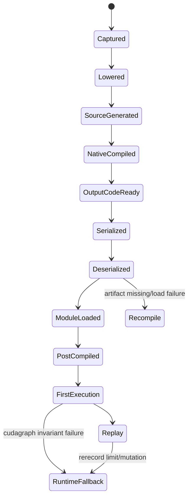

# D07 · Compiled Artifact 生命周期与 Runtime Failure

> 卷别：D · 编译产物、缓存与运行时  
> 固定源码：PyTorch `e8f97c1a6ef8cbcdd0a946606bc1e924e4f07e52`  
> 前置：[[d06_cudagraph_trees_warmup_record_and_replay_analysis]]  
> 后续：[[observability_logs_counters_and_artifact_map_analysis]]  
> 最后更新：2026-07-28

## 1. 为什么“编译成功”仍可能在运行时失败

编译产物不是单个不可变binary，而是一组层叠对象：

- Dynamo transformed code与guards；
- AOT runtime metadata和fw/bw callables；
- `CompiledFxGraph`；
- generated Python wrapper；
- C++ shared library/Triton kernel；
- constants绑定；
- runtime alignment/CUDAGraph wrappers；
- device/stream/memory pool状态。

其中有些在compile-time建立，有些在load-time恢复，有些在first execution才初始化。

**核心结论**：必须把生命周期划分为build、serialize、load、post-compile、first-call和
replay；“artifact文件存在”只证明其中一段完成。

## 2. `CompiledFxGraph`是runtime artifact句柄

它保存serialized metadata和当前进程的 `current_callable`。调用时校验callable存在，再进入
profiler/runtime metrics，最终调用boxed wrapper
（`torch/_inductor/output_code.py:785-813` 与
`torch/_inductor/output_code.py:817-840`）。

所以：

- disk entry可存在但 `current_callable=None`；
- 反序列化后必须load generated module；
- post-compile可再次把callable包装为alignment/CUDAGraph版本；
- 同一serialized graph在不同进程有不同runtime callable identity。

## 3. 生命周期状态机



不是所有backend/device都经过完全相同节点，但诊断时应定位当前失败属于哪个状态转移。

## 4. 序列化边界

native callables和进程内对象不能可靠pickle。`prepare_for_serialization`因此清除：

- compile context；
- `current_callable`；
- recursive apply functions；
- partition runner；

并序列化必要GraphModule metadata
（`torch/_inductor/output_code.py:999-1016`）。

这不是产物丢失，而是明确将“可持久化描述”和“进程内执行句柄”分离。

## 5. Load边界

反序列化后 `after_deserialization`：

- 把source写回content-addressed path；
- 通过PyCodeCache import module；
- 注入constants；
- 取得module `call`；
- 恢复partition runner；
- 若OSError则记录artifact path并失败。

见 `torch/_inductor/output_code.py:1018-1047`、
`torch/_inductor/output_code.py:1048-1048` 与
`torch/_inductor/output_code.py:1049-1057`。

上层FXGraphCache可把load OSError当miss重新编译
（`torch/_inductor/codecache.py:2112-2124`）。

## 6. Post-compile边界

cache序列化的是通用compiled graph描述，不保存本进程的：

- CUDAGraph recordings；
- input alignment wrapper；
- current tracing context output strides；
- 某些customized partition wrappers。

`post_compile`明确在hit和miss后都运行，结果不写回cache
（`torch/_inductor/output_code.py:842-856`）。

因此load成功后仍可能在post-compile因device、mutation或runtime policy选择普通callable或
CUDAGraph wrapper。

## 7. First execution边界

第一次实际执行可能触发：

- lazy backward compile；
- runtime Triton autotune；
- autotune cache write；
- CUDAGraph warmup/record；
- lazy kernel reload；
- device context初始化；
- runtime shape/alignment checks。

`CompiledFxGraph.__call__`专门在first-call autotune bundler活动时恢复compile context并在
调用后结束bundle（`torch/_inductor/output_code.py:805-832`）。

first call latency因此不能简单等于“Dynamo+Inductor compile time”。

## 8. Failure taxonomy

### Guard/capture failure

发生在进入artifact前：Dynamo guard miss、graph break、recompile limit。

### Compile failure

lowering、scheduler、codegen、native compiler、worker。

### Load failure

source/binary丢失、ABI不兼容、directory noexec、import/shared library error。

### Post-compile failure

alignment、constants、CUDAGraph eligibility、device manager。

### Runtime semantic failure

wrong result、illegal memory access、alias/mutation错误、unexpected dtype/layout。

### Runtime policy fallback

CUDAGraph rerecord过多、mutation/address invariant不满足，转普通compiled callable。这不一定
是整个 `torch.compile`退回eager。

## 9. Artifact删除与并发

cache目录可能被：

- 另一个进程清理；
- 作业生命周期脚本回收；
- 容量策略驱逐；
- 容器重启丢失；
- 不同版本共享错误；
- 并发writer尚未完成。

content-addressed write需要atomic rename/锁；reader遇到不完整或丢失artifact应miss/rebuild，
不能执行部分文件。源码通用write使用hash path和atomic write
（`torch/_inductor/codecache.py:547-573`）。

## 10. 进程、设备与fork边界

- worker pools不能跨fork直接复用；
- Python module对象属于当前解释器；
- shared library handle属于当前进程；
- CUDA context、streams、CUDAGraph pool属于device/process；
- remote cache只共享可持久化artifact，不共享live handles；
- distributed ranks可能各自compile/load，也可能通过collective协调部分决策。

把父进程warmup过的live callable直接假设为child可用是高风险做法。

## 11. Reset/clear的恢复语义

不同clear操作：

- 丢弃lookup metadata；
- 清进程内module/future；
- 删除disk source；
- 销毁CUDAGraph tree；
- 重置backend；
- 保留外部compiler/Triton cache。

恢复故障前要先确认是否需要保留repro artifact。粗暴清全部cache可能让问题暂时消失，也会
丢失失效层证据。

## 12. 生产不变量

- artifact必须绑定compiler版本、config、device/toolchain ABI；
- constants和weights来源可验证；
- load失败可安全rebuild或降级；
- first-call compile/autotune不应在不允许的请求时延路径发生；
- CUDAGraph fallback仍保证正确性；
- cache目录权限/exec mount满足平台要求；
- 多进程写入原子；
- remote cache内容有信任和隔离策略；
- 错误指标能区分capture/compile/load/runtime；
- 部署包不得依赖未随包提供的临时文件。

## 13. 复杂度与容量

总冷启动：

\[
T_{\text{cold}}
=T_{\text{capture}}+T_{\text{AOT}}+T_{\text{lower/codegen}}
+T_{\text{native}}+T_{\text{load}}+T_{\text{first-runtime}}
\]

磁盘hit：

\[
T_{\text{disk-hit}}
=T_{\text{key/guard}}+T_{\text{deserialize}}+T_{\text{module-load}}
+T_{\text{post-compile}}+T_{\text{first-runtime}}
\]

稳态：

\[
T_{\text{steady}}
=T_{\text{Dynamo-guards}}+T_{\text{wrapper}}+T_{\text{kernels/replay}}
\]

容量至少包括metadata、source、binary、autotune记录和runtime pools；disk bytes与device
reserved memory必须分开统计。

## 14. 常见误解

- **“编译返回callable后不再发生compiler工作。”** lazy backward/autotune仍可能发生。
- **“cache hit就是零成本。”** 仍有key/guard、deserialize、load和post-compile。
- **“runtime fallback就是回到完整eager。”** 可能只禁用CUDAGraph，继续跑compiled kernels。
- **“删除metadata即可释放CUDA Graph显存。”** runtime tree/pool有独立生命周期。
- **“artifact存在说明该硬件执行过。”** codegen-only、native compile、load、execute必须分别取证。

## 配套 Demo

本页对应卷级入口 `tools/labs_torch_compile/demo_d_artifact_runtime.py` 的 `artifact_lifecycle_failure` 用例。默认以 CUDA 为验收设备：

```powershell
python -B tools\labs_torch_compile\demo_d_artifact_runtime.py `
  --case artifact_lifecycle_failure --device cuda `
  --output-dir tools\labs_torch_compile\artifacts\volume_demos\d07
```

先用 `--list --json` 查看用例声明的能力要求。无 CUDA 的机器可把 `--device` 改为 `cpu` 探索设备无关机制；CUDA/Triton/多卡专属用例会返回 `BLOCKED`，且不会执行用例正文。不要把 `BLOCKED` 写成 `PASS`。

重点读取 `summary.json` 与 `artifact_lifecycle_failure/result.json`：`status` 区分 `PASS/BLOCKED/FAIL`，`environment` 固化运行环境，`observations` 保存本页机制的实测字段，`artifacts` 指向图代码、日志、trace 或进程证据。`PASS` 只表示该次运行中的断言通过，不外推到其他 PyTorch 版本、shape、dtype 或硬件。

## Related Pages

- [[00_torch_compile_end_to_end_index]]
- [[d03_async_compile_workers_and_module_loading_analysis]]
- [[d04_compile_cache_hierarchy_keys_and_invalidation_analysis]]
- [[d06_cudagraph_trees_warmup_record_and_replay_analysis]]
- [[observability_logs_counters_and_artifact_map_analysis]]
- [[production_rollout_fallback_and_monitoring_analysis]]
