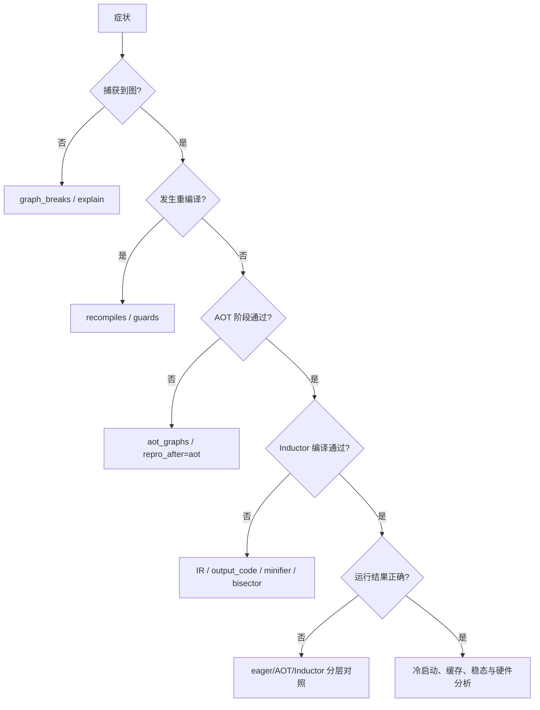

# E01 · 可观测性：Logs、Counters 与 Artifact 地图

> 卷别：E · 调试、正确性与性能  
> 固定源码：PyTorch `e8f97c1a6ef8cbcdd0a946606bc1e924e4f07e52`  
> 前置：[[d07_compiled_artifact_lifecycle_and_runtime_failures_analysis]]  
> 后续：[[e02_dynamo_explain_and_graph_break_diagnosis_analysis]]  
> 最后更新：2026-07-28

## 1. 为什么必须先建立“证据层级”

`torch.compile`的一次用户调用可能经过 Dynamo、AOTAutograd、Inductor、native/Triton
编译、module load、first-call autotune 和 CUDAGraph。只看一段终端输出，常会把：

- 捕获到 FX 误当成已经生成 kernel；
- cache hit 误当成没有任何运行时初始化；
- graph break 误当成 backend 编译失败；
- kernel 数减少误当成端到端一定加速。

**核心结论**：日志是某个阶段发出的观察，artifact 是某一状态的快照，counter 是某类事件
的聚合。三者都不是端到端事实，必须用 `compile_id`、frame、graph、artifact path 和调用轮次
建立关联。

## 2. 日志系统为什么区分 log 与 artifact

注册表把逻辑日志域映射到 Python logger：

- `dynamo`覆盖 Dynamo 和 symbolic-shape logger；
- `aot`覆盖 AOTAutograd；
- `inductor`覆盖 Inductor 与 CUDAGraph Trees；
- `async_compile`和`cache`单独成域；
- DDP、FSDP、DTensor也有独立域。

映射见 `torch/_logging/_registrations.py:15-44` 与
`torch/_logging/_registrations.py:45-62`。

artifact 则是“希望按需打开的特定证据”，例如 graph、guards、recompiles、output code。
它们可以来自同一 logger，却回答不同问题。这个设计避免为了看一张图而打开某个包下全部
debug噪声。

## 3. 从源码阶段到证据的地图

| 要回答的问题 | 首选 artifact/counter | 能证明什么 | 不能证明什么 |
|---|---|---|---|
| Dynamo 捕获了什么 | `graph` / `graph_code` | backend前的 Dynamo FX region | AOT 分区后图、最终 kernel |
| 为什么切图 | `graph_breaks` | graph break 原因与位置 | 所有小图都一定性能差 |
| 为什么重编译 | `recompiles` | 每个旧 entry 的 guard 失败原因 | 新 specialization 最终一定复用 |
| guard 是什么 | `guards` / `verbose_guards` | 已安装的 guard 表达式/结构 | 运行时哪个 guard 失败，需 recompile 日志 |
| fw/bw 是什么 | `aot_graphs` | 分区后的 forward/backward FX | Inductor lowering 后 IR |
| joint graph 是什么 | `aot_joint_graph` | partition 前联合图 | saved/recompute最终选择，需结合分区后图 |
| pass 后图是什么 | `pre_grad_graphs` / `post_grad_graphs` | 特定 pass 边界的 FX | kernel 调度与性能 |
| fusion 前后 IR | `ir_pre_fusion` / `ir_post_fusion` | Inductor调度前后结构 | 实际硬件瓶颈 |
| 最终生成了什么 | `output_code` / `kernel_code` | wrapper与单kernel源码 | binary实际成功加载与运行 |
| CUDAGraph 为何启用/跳过 | `cudagraphs` / `perf_hints` | eligibility和包装决策 | replay实际延迟，仍需测量 |

这些 artifact 的注册语义可分别在
`torch/_logging/_registrations.py:64-93`、
`torch/_logging/_registrations.py:94-99`、
`torch/_logging/_registrations.py:100-129`、
`torch/_logging/_registrations.py:141-167` 和
`torch/_logging/_registrations.py:172-195`核对。

## 4. 图证据必须标注阶段

建议保存 artifact 时同时写入：

```text
frame/code object
→ Dynamo graph index
→ AOT joint graph
→ AOT fw graph / bw graph
→ pre-grad / post-grad graph
→ Inductor IR
→ generated wrapper / kernel
```

同名 FX node 不能跨阶段当作同一对象；图复制、functionalization、decomposition、partition
都会创建新 node identity。阶段未标注的“某节点消失了”没有可审查含义。

## 5. `CompilationMetrics`是一次编译事件的结构化记录

它包含：

- code object、cache size、guard count、graph node/op/input count；
- frame/backend/Inductor/codegen时间；
-失败类型、失败原因和用户栈；
- forward/backward/runtime标记；
- FX/AOT local/remote cache hit/miss；
- Triton、runtime autotune、CUDAGraph等时间。

字段见 `torch/_dynamo/utils.py:1573-1602`、
`torch/_dynamo/utils.py:1603-1605`、
`torch/_dynamo/utils.py:1606-1635` 与
`torch/_dynamo/utils.py:1636-1660`。

记录时，系统从 metrics context 和当前 compile context取得 `compile_id`，补充版本、配置、
异常及cache环境，再产生结构化事件
（`torch/_dynamo/utils.py:1964-1993`、
`torch/_dynamo/utils.py:1994-2021`、
`torch/_dynamo/utils.py:2022-2044`）。

因此它适合回答“哪次编译、哪一段耗时、是否失败”，但不能替代算子级 profiler。

## 6. Dynamo counters 与 Inductor metrics 的作用域

Dynamo `counters`是进程内按类别组织的 `Counter`，适合测试和诊断聚合，不天然是跨进程
生产监控协议（`torch/_dynamo/utils.py:177-206` 与
`torch/_dynamo/utils.py:207-207`）。

Inductor的全局metrics包含 generated kernel、估算bytes、fusion前IR node等
（`torch/_inductor/metrics.py:24-40`）。`reset()`会原地清零或清空相关集合
（`torch/_inductor/metrics.py:66-95` 与
`torch/_inductor/metrics.py:96-98`）。

FX graph cache还会保存一部分metric delta，并在hit时重新应用，避免“cache hit后kernel
count看起来为零”这种统计失真。可缓存字段与delta helper见
`torch/_inductor/metrics.py:101-130` 与
`torch/_inductor/metrics.py:131-137`。

这也说明counter值必须附带：

- reset时点；
-进程/rank；
-冷启动或热缓存；
-调用次数；
-是否发生cache hit。

## 7. 证据包的最小结构

一次可复核调查至少保留：

1. PyTorch commit/version、Python、device、driver/compiler；
2. `torch.compile`参数、Dynamo/AOT/Inductor关键配置；
3. 输入 pytree、dtype、shape、stride、requires-grad、alias关系；
4. eager结果与compiled结果；
5. graph break、recompile与失败栈；
6. 各阶段图和最终code artifact；
7. compilation metrics、cache状态；
8. warmup轮次和计时边界；
9. 若是训练，forward、backward、optimizer三段结果；
10. 若是分布式，rank/world-size/topology和每rank证据。

## 8. 诊断状态机



顺序很重要：未先判断重编译，就不应直接归因于kernel慢；未先验证正确性，也不应把性能
数字作为可接受结果。

## 9. 可观测性的成本与扰动

若图有 \(V\) 个node、生成代码长度为 \(K\)、调用次数为 \(N\)：

- graph/code artifact序列化通常至少 \(O(V+K)\)；
- verbose guard失败重放可能对多个cache entry逐一检查；
- profiler、同步计时可能改变异步设备执行；
- kernel源码、输入meta和stack会显著增大日志；
-分布式全rank采集会把数据量近似乘以rank数。

因此生产环境应把“常开结构化指标”和“按事件采样的重型artifact”分开。

## 10. 常见误解

- **“`TORCH_LOGS`越多越容易定位。”** 无关联键的大量日志反而破坏时间线。
- **“`graph_code`就是最终执行代码。”** 它是 Dynamo FX，不是 Inductor wrapper/kernel。
- **“counter是模型级指标。”** 多数是进程全局累计，需reset和隔离。
- **“cache hit后没有编译相关成本。”** load、post-compile、lazy bw和autotune仍可能发生。
- **“只保留错误字符串就能复现。”** 输入metadata、config和阶段图同样是失败条件。

## Related Pages

- [[00_torch_compile_end_to_end_index]]
- [[d07_compiled_artifact_lifecycle_and_runtime_failures_analysis]]
- [[e02_dynamo_explain_and_graph_break_diagnosis_analysis]]
- [[e03_guard_failure_and_recompile_diagnosis_analysis]]
- [[e04_aotautograd_and_inductor_failure_localization_analysis]]
- [[e07_compile_latency_cache_and_steady_state_performance_analysis]]
