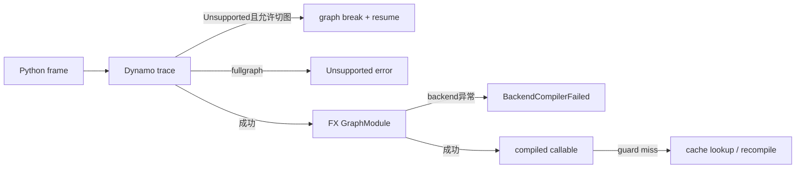

# E02 · Dynamo Explain 与 Graph Break 诊断

> 卷别：E · 调试、正确性与性能  
> 固定源码：PyTorch `e8f97c1a6ef8cbcdd0a946606bc1e924e4f07e52`  
> 前置：[[e01_observability_logs_counters_and_artifact_map_analysis]]  
> 后续：[[e03_guard_failure_and_recompile_diagnosis_analysis]]  
> 最后更新：2026-07-28

## 1. Graph break 的本质

Dynamo对一个 Python frame做符号执行。遇到无法或不应继续建图的操作时，它可以：

- 提交当前可编译region；
- 生成resume bytecode；
- 在 Python 中执行边界操作；
- 从新的位置继续捕获后续region。

所以graph break不是“FX图内部的一条特殊边”，而是一次frame被拆成多个FX
`GraphModule`与Python续执行片段。`fullgraph=True`时，同样的Unsupported通常会上升为硬失败。

## 2. 为什么 `explain`使用一个收集型 backend

`explain(f)`执行前后会reset Dynamo；中间用
`dynamo_graph_accumulating_compiler`收集每个 Dynamo `GraphModule`，backend只返回
`gm.forward`，并通过 guard export callback 收集guards
（`torch/_dynamo/eval_frame.py:1869-1898` 与
`torch/_dynamo/eval_frame.py:1900-1928`）。

这意味着 `explain`主要观察 **Dynamo capture边界**：

- 它不以Inductor优化性能为目的；
- 图数量来自backend被调用的次数；
- `graph_break_count`按 `graph_count - 1`计算；
- 输出是本次实际输入路径的观察，不是所有可能控制流的静态证明。

## 3. `ExplainOutput`具体保存什么

对象包含graphs、graph count、break count、break reasons、op count、每图ops、guards和
compile times（`torch/_dynamo/backends/debugging.py:604-617`）。

字符串输出把break reason和user stack、每图ops、guards依次展开
（`torch/_dynamo/backends/debugging.py:619-646`）。

收集逻辑只把 `call_function` node计入op count，并从
`gm.compile_subgraph_reason`读取break reason
（`torch/_dynamo/backends/debugging.py:650-679`、
`torch/_dynamo/backends/debugging.py:680-681` 与
`torch/_dynamo/backends/debugging.py:682-687`）。

因此：

- `op_count`不是总FX node数；
- placeholder/get_attr/call_module等不在该计数中；
- break count不是“失败次数”的通用定义；
- 图中没有Inductor IR或最终kernel信息。

## 4. Graph break reason 如何形成

`unimplemented(...)`要求调用方提供：

- 稳定、无动态上下文的 `gb_type`；
- 开发者上下文 `context`；
- 面向用户的 `explanation`；
- 可行动的 `hints`；
- 可选原异常和 `skip_frame`。

入口契约见 `torch/_dynamo/exc.py:722-742`。它格式化消息后抛出`Unsupported`
（`torch/_dynamo/exc.py:744-757`）。

`Unsupported`还携带real stack、skip-frame、统计类别、graph-break type和logged状态
（`torch/_dynamo/exc.py:296-321`）。其中 `skip_frame`是重要控制语义，不能被中间异常处理器
随意吞掉。

## 5. Hints 是分类，不是保证

源码预置的提示类别包括：

- 用户程序在eager也可能出错；
- 可能是Dynamo缺陷；
- 属于fundamental、不适合trace的Python行为；
- 理论上可增加trace rule支持；
- 当前break可能由更早的break诱发；
- inference mode或sparse tensor等特定建议。

见 `torch/_dynamo/graph_break_hints.py:1-30` 与
`torch/_dynamo/graph_break_hints.py:31-31`。这些提示帮助确定调查方向，不证明根因已经定位；
尤其“由 earlier break 引发”要求从时间线上第一个break开始处理。

## 6. 一套可执行的定位顺序

### 第一步：确认语义与范围

先在同输入、同状态下验证eager能正确执行。明确你关心的是：

- 必须单图；
- 允许切图但性能差；
- 只在某些输入路径切图；
- 切图后结果错误；
- 切图数量随迭代增长。

### 第二步：定位第一个用户栈

使用 `explain`确认graph数量、首个break reason和user stack，再用`graph_breaks`观察实时
发生位置。优先处理第一个因果break，而不是日志最后一个症状。

### 第三步：判断是否可表达

| 类型 | 典型处置 |
|---|---|
| 数据依赖Python控制流 | 改用可捕获控制流/HOP，或接受break |
| Tensor转Python scalar后分支 | 改写数据流，谨慎使用scalar capture |
| 不透明Python/C extension | 移出编译区、加trace rule或custom op |
| 不受支持副作用 | 缩小作用域或改为显式输入输出 |
| 用户代码本身错误 | 先修eager |
| 编译器应支持但未支持 | 形成最小repro |

### 第四步：比较 `fullgraph=False/True`

默认模式用于观察实际切图；`fullgraph=True`用于把第一个break提升为错误，适合建立
“不得切图”的测试不变量。它不是让不受支持的Python自动进入图。

### 第五步：检查下游影响

切图可能：

- 缩短fusion范围；
- 增加wrapper/Python dispatch；
- 使中间Tensor物化；
- 改变saved tensor或mutation边界；
- 导致后续region输入/guard增加。

因此“break消失”后仍要比较图、正确性和稳态性能。

## 7. Graph break 与其他失败的区别



- Graph break：一次frame内的捕获边界；
- guard miss：已有specialization不适用于新调用；
- backend failure：FX交给后端后编译失败；
- runtime failure：compiled callable执行失败。

四者的修复位置完全不同。

## 8. 复杂度

设一次路径产生 \(G\) 个region，总node为 \(V\)：

- `explain`收集图和遍历`call_function` node约 \(O(V)\)；
- 图数量和break数量的展示为 \(O(G)\)；
- 真实捕获成本还包含每个frame的符号执行、guard构建和Python续执行；
- 多路径覆盖需要对每类输入分别执行，成本不能由一次`explain`推断。

切图的稳态成本近似是每个region的guard与callable调用，再加region间Python执行；它不是
单纯的 \(G\) 倍kernel成本。

## 9. 不变量与验收

- eager语义先成立；
- 首个break有稳定的用户栈和分类；
- 关键路径graph count在重复调用中稳定；
- 不得切图的region用`fullgraph=True`或等效断言约束；
- 修复break后检查guards没有异常膨胀；
- 比较AOT图与kernel，而不止Dynamo图；
- 性能验收包含cold、warm和steady state。

## 10. 常见误解

- **“graph count等于模型中的控制流分支数。”** 它是本次执行中backend收到的region数。
- **“break count为0说明全程序都被编译。”** 只说明观察路径的该frame收集结果。
- **“graph break一定错误。”** 默认模式允许break；是否不可接受取决于契约和性能。
- **“消除所有break一定更快。”** 更大图可能增加编译时间、guard或不利调度。
- **“explain展示的是AOT fw/bw图。”** 它收集的是Dynamo backend输入。

## 配套 Demo

本页对应卷级入口 `labs/demo_e_diagnostics.py` 的 `dynamo_explain` 用例。默认以 CUDA 为验收设备：

```powershell
python -B wiki\02_engineering\01_ai_frameworks\19_torch_compile_end_to_end\labs\demo_e_diagnostics.py `
  --case dynamo_explain --device cuda `
  --output-dir wiki\02_engineering\01_ai_frameworks\19_torch_compile_end_to_end\labs\artifacts\volume_demos\e02
```

先用 `--list --json` 查看用例声明的能力要求。无 CUDA 的机器可把 `--device` 改为 `cpu` 探索设备无关机制；CUDA/Triton/多卡专属用例会返回 `BLOCKED`，且不会执行用例正文。不要把 `BLOCKED` 写成 `PASS`。

重点读取 `summary.json` 与 `dynamo_explain/result.json`：`status` 区分 `PASS/BLOCKED/FAIL`，`environment` 固化运行环境，`observations` 保存本页机制的实测字段，`artifacts` 指向图代码、日志、trace 或进程证据。`PASS` 只表示该次运行中的断言通过，不外推到其他 PyTorch 版本、shape、dtype 或硬件。

## Related Pages

- [[00_torch_compile_end_to_end_index]]
- [[b08_graph_break_resume_functions_and_partial_graphs_analysis]]
- [[b09_dynamic_shapes_generalization_and_fallback_analysis]]
- [[e01_observability_logs_counters_and_artifact_map_analysis]]
- [[e03_guard_failure_and_recompile_diagnosis_analysis]]
- [[e04_aotautograd_and_inductor_failure_localization_analysis]]
