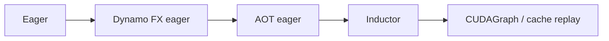

# E06 · Compiled Correctness 验证方法论

> 卷别：E · 调试、正确性与性能  
> 固定源码：PyTorch `e8f97c1a6ef8cbcdd0a946606bc1e924e4f07e52`  
> 前置：[[e05_minifier_repro_and_compiler_bisector_analysis]]  
> 后续：[[e07_compile_latency_cache_and_steady_state_performance_analysis]]  
> 最后更新：2026-07-28

## 1. “输出 allclose”为什么不够

编译正确性至少有六个维度：

1. forward值与结构；
2. backward梯度；
3. 输入、参数、buffer和全局状态的mutation；
4. view/alias/storage identity；
5. exception、RNG、hook、collective等effect和顺序；
6. 跨调用、不同specialization和cache状态的稳定性。

只比较一次forward输出，会漏掉训练状态更新、in-place语义、saved tensor、lazy backward以及
第二次调用才暴露的复用问题。

## 2. Reference 不是“同一对象再跑一次”

eager和compiled两路必须从等价但独立的状态开始：

-深拷贝可复制的module/optimizer state；
-克隆输入并保留requires-grad；
-明确共享alias关系，不能把本应alias的输入独立clone；
-重置RNG；
-清grad；
-控制train/eval、autocast、grad、determinism；
-同步异步device后再读取结果；
-避免第一路mutation污染第二路。

源码的debug helper会复制GraphModule、克隆输入并恢复gradness；若输出需要backward，则把
输出归约为scalar loss再收集结果
（`torch/_dynamo/debug_utils.py:586-615` 与
`torch/_dynamo/debug_utils.py:617-628`）。

## 3. 比较对象矩阵

| 对象 | 比较内容 |
|---|---|
| 输出 pytree | 结构、Tensor metadata、数值、非Tensor值 |
| 输入 | mutation后的值、metadata、storage/alias |
| Parameter | 值、grad、requires-grad |
| Buffer | 值与更新次数 |
| optimizer | state dict、step、参数更新 |
| exception | 类型、发生阶段、必要消息语义 |
| RNG | 后续随机序列或显式state |
| hooks/effects | 次数、顺序、payload |
| distributed | 每rank值、collective序列、全局结果 |

比较alias时，应构建“输出/输入对之间是否共享storage、offset/stride关系”的矩阵，而不只比较
Tensor值。

## 4. 容差如何设计

对浮点Tensor通常使用：

\[
|x-y| \le \text{atol} + \text{rtol}\cdot |y|
\]

但容差应按dtype、算子数值性质和业务误差预算定义：

- fp64/fp32/fp16/bf16不能使用同一容差；
- reduction顺序改变会产生可预期误差；
- NaN相等是否允许要显式决定；
-整数、布尔、shape和索引通常要求精确；
-容差不能随模型规模任意放大到掩盖错误。

`same_two_models`先运行eager reference，并可生成fp64 reference辅助判断低精度误差，再用
配置的tolerance比较（`torch/_dynamo/debug_utils.py:631-658` 与
`torch/_dynamo/debug_utils.py:666-686`）。

fp64 reference是辅助基准，不代表真实低精度程序必须逐位等于fp64。

## 5. Forward、Backward 与 Optimizer 的顺序

训练step应至少比较：

```text
initial state
→ forward outputs/loss
→ backward input/parameter grads
→ optimizer state transition
→ updated parameters/buffers
→ next iteration output
```

下一迭代很重要：某些错误只在mutation后的state、lazy backward compile或cache复用时出现。

Inductor pass numeric check会对pass前后GraphModule重复运行，比较parameters、forward
outputs和gradients
（`torch/_inductor/fx_passes/numeric_utils.py:43-72`、
`torch/_inductor/fx_passes/numeric_utils.py:73-74`、
`torch/_inductor/fx_passes/numeric_utils.py:77-104` 与
`torch/_inductor/fx_passes/numeric_utils.py:107-130`）。

它还可执行optimizer step后比较parameter
（`torch/_inductor/fx_passes/numeric_utils.py:133-159` 与
`torch/_inductor/fx_passes/numeric_utils.py:160-180`）。

## 6. Mutation 与 Alias 的专门验收

需要为每个可变对象记录：

-调用前值和version；
-调用后值和version；
-是否仍是view；
-base/storage identity；
-storage offset、size、stride；
-相互alias是否保持；
-mutation发生次数和可见顺序。

常见错误包括：

- functionalization返回更新值但wrapper未写回；
-输出值正确但view被materialize成copy；
-输入alias模式特殊化错误；
-buffer mutation被DCE或重排；
-saved tensor在反向前被不当覆盖。

这类错误不一定造成首轮数值差异。

## 7. Effect 与异常语义

对有effect的程序，比较：

-print/log/callback/hook是否发生；
-发生次数与相对顺序；
-RNG消耗；
-collective调用顺序；
-异常是在调用前、部分mutation后还是调用后抛出；
-异常后对象是否保持一致状态。

编译器通常不保证所有错误消息逐字符一致，但异常类别和用户可观察状态不能被无意改变。
生产验收应提前定义哪些effect在compile region内允许。

## 8. 多输入与跨状态验证

测试集合应覆盖：

-最小/典型/最大shape；
-动态范围边界和越界；
-contiguous与代表性stride；
-不同dtype/autocast；
-requires-grad组合；
-alias与非alias；
-train/eval；
-空Tensor、零维、极端值、NaN/Inf；
-首次编译、cache hit、recompile后的新entry；
-forward-only与forward+backward；
-单进程与多rank。

不能用一次示例输入证明guard覆盖范围内所有输入正确；至少要按约束边界设计代表类。

## 9. 分层验证与定位



每相邻两层比较，可以把差异收敛到：

-capture/side effects；
-AOT functionalization/partition/runtime；
-Inductor passes/codegen；
-runtime wrapper、cache或CUDAGraph。

`backend_accuracy_fails`会复制图与输入、编译候选并调用`same_two_models`；若候选出现不同
runtime异常，则不把它判成原accuracy failure
（`torch/_dynamo/debug_utils.py:739-768`）。

## 10. 确定性与重复性

numeric check helper设置torch/Python/NumPy seed，并请求deterministic algorithms
（`torch/_inductor/fx_passes/numeric_utils.py:19-35`）。

但确定性测试仍需考虑：

-某些算子没有deterministic实现；
-并行reduction次序变化；
-device异步错误；
-分布式通信时序；
-allocator地址影响；
-autotune与CUDAGraph warmup。

建议把“严格确定性验证”和“统计误差分布验证”分开，不用一次测试兼任二者。

## 11. 复杂度与预算

若有 \(M\) 个输入类、\(S\) 个状态组合、重复 \(R\) 次，每次含forward/backward/optimizer
成本 \(T\)：

\[
T_{\text{validation}}=O(MSRT)
\]

完整笛卡尔积通常不可行，应基于风险做pairwise/边界覆盖，并为alias、mutation、distributed
等高风险机制保留专门用例。CI保留短而稳定的契约集，离线回归运行更广矩阵。

## 12. 验收记录

每个结果应记录：

-reference与candidate层级；
-版本/config/device；
-输入类和状态；
-比较字段与容差；
-是否发生graph break/recompile/cache hit；
-cold/warm/steady调用序号；
-失败artifact和最小repro；
-已知数值差异的批准依据。

## 13. 常见误解

- **“allclose就是正确。”** alias、mutation、grad和effect可能仍错误。
- **“同一module先eager再compiled即可。”** eager可能已修改state。
- **“fp64一定是真理。”** 它是辅助reference，也可能不可构造或改变算法路径。
- **“无异常等于正确。”** silent wrong answer正是编译器最危险的故障。
- **“单次forward通过即可上线训练。”** backward、optimizer和下一step必须验证。

## Related Pages

- [[00_torch_compile_end_to_end_index]]
- [[e04_aotautograd_and_inductor_failure_localization_analysis]]
- [[e05_minifier_repro_and_compiler_bisector_analysis]]
- [[e07_compile_latency_cache_and_steady_state_performance_analysis]]
- [[19_torch_compile_end_to_end/05_graph_effects_alias_mutation_and_order]]
- [[19_torch_compile_end_to_end/16_graph_rewrite_legality_validation_and_complexity]]
