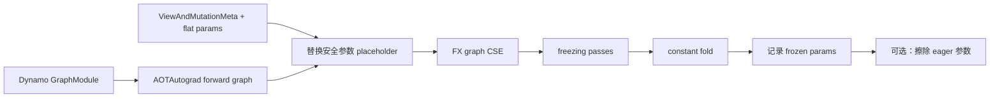

# F08 · Training、Inference、Freezing 与 CUDA Graph 的组合边界

> 卷别：F · 训练、分布式、扩展与部署  
> 固定源码：PyTorch `e8f97c1a6ef8cbcdd0a946606bc1e924e4f07e52`  
> 前置：[[f07_aotinductor_packaging_and_deployment_analysis]]  
> 后续：[[00_torch_compile_end_to_end_index]]  
> 最后更新：2026-07-28

## 1. 先拆开四个经常混用的概念

| 轴 | 它回答的问题 | 它没有自动保证什么 |
|---|---|---|
| training / inference | 是否需要训练语义、反向和可变状态 | 不决定是否使用 CUDA Graph |
| grad mode / AOTAutograd | 是否记录或编译梯度计算 | 不等于 `module.eval()` |
| freezing | 参数能否内联成常量并丢弃 eager 参数 | 不等于通用训练优化 |
| CUDA Graph | 一段 GPU 工作能否捕获后 replay | 不消除 shape、地址和 mutation 约束 |

它们是可组合但不等价的轴。“推理 = eval + no_grad + freeze + cudagraph”只是某些工作负载的
一个组合，不是 API 定义。

## 2. 为什么 training 与 inference 要分路径

训练图包含：

- forward 输出及 saved tensors；
- backward 输入的 tangents；
- 参数梯度、输入梯度；
- optimizer 和 distributed reducer 可能产生的可变状态；
- RNG、AMP、mutation 与跨迭代生命周期。

推理通常不需要 backward，因而可进行更激进的参数常量化、constant folding、输出 layout
处理和内存复用。但 `eval()` 只切换模块行为，`no_grad()`/inference mode 只改变 autograd
记录；二者都不会单独触发 freezing。

## 3. Freezing 为什么必须知道 mutation 与 alias

`replace_params_with_constants` 遍历参数 placeholder，但不会把以下参数替换为常量：

- 会在图内或图外发生 mutation 的输入；
- 被输出 alias 的输入。

它保留这些参数的输入位置，并同步重算 `static_input_indices`
（`torch/_inductor/freezing.py:28-53`、
`torch/_inductor/freezing.py:55-71`）。

设计原因是：

- mutable 参数若内联，更新语义会被错误固定；
- 输出若 alias 参数，常量化可能改变用户可见身份和 lifetime；
- placeholder 数变化后，所有按位置记录的 static-input 元数据必须重编号。

所以 freezing 不是文本级“把 get_attr 换成常量”，而是依赖 AOTAutograd 的
view/mutation metadata 维护语义。

## 4. Freezing 的变换链

`freeze` 明确假设它运行在 Dynamo tracing 之后、AOTAutograd 之后
（`torch/_inductor/freezing.py:74-95`）。内部先把 `view` 调整为 `reshape`，再从
`TracingContext` 取得 forward metadata 和扁平参数
（`torch/_inductor/freezing.py:98-120`）。

替换后执行 FX CSE、freezing passes、constant fold；配置允许时才擦除原 eager module 和
traced graph module 的参数
（`torch/_inductor/freezing.py:125-144`）。

顺序很重要：常量进入图后，CSE/folding 才能看到新的优化机会；反过来先折叠会遗漏。

## 5. Freezing 改变的是所有权与可用性

当 `freezing_discard_parameters` 启用时，原参数会被替换为 `ErasedTensor`。后续尝试运行
eager module 会抛出明确错误，说明参数已为节省内存而丢弃
（`torch/_inductor/freezing.py:147-172`）。

失效逻辑遍历 tracing context 中的 modules，把本层 parameters 和 buffers 替换成
`ErasedTensor`
（`torch/_inductor/freezing.py:175-195`）。

因此 freezing 后不能默认：

- 再切回 eager；
- 原地训练或更新参数；
- 复用同一 module 生成另一种 artifact；
- 把原 module 当作 correctness oracle；
- 由另一个线程读取已擦除参数。

若需要回退或热更新，应保留独立 eager/model state owner，或者构建新版本，而不是依赖已被
失效的对象。

## 6. 为什么 freezing 主要属于 inference

训练需要参数随 optimizer step 变化。把参数内联成常量会让：

- graph 中的值与最新 parameter state 脱节；
- constant-folded 表达式失效；
- optimizer 对参数对象的更新不再影响 compiled result；
- 参数 alias/mutation 契约更难维持。

因此一般训练优化使用 static-input/address specialization，不使用“参数值永远不变”的
freezing 假设。这里的 static 是地址/角色契约，不是数值不可变。

## 7. CUDA Graph 优化的对象是什么

普通 Inductor compiled callable 仍会逐次发起 kernel、allocation 和 runtime 调度。
CUDA Graph 在一次 capture 后 replay GPU 工作，主要减少 CPU launch overhead。它发生在
compiled function 的 post-compile/runtime wrapping 层，而不是把 FX graph 变成另一张
语义图。

默认 `CUDAGraphPolicy` 委托给 `compile_fx.cudagraphify`，并把真正 recording 延迟到第一次
真实调用
（`torch/_inductor/cudagraph_utils.py:84-104`）。

这解释了三个时间：

1. Inductor compile；
2. 首次真实调用中的 warmup/record；
3. 后续 replay。

只测“第一次 compiled call”会把三类成本混在一起。

## 8. 地址不变式：static input 不等于普通输入

传统 `cudagraphify_impl` 明确假设 `static_input_idxs` 对应输入总是同一内存地址
（`torch/_inductor/compile_fx.py:2103-2120`）。

对非 static 输入，它分配固定的 static buffer，并在每次调用前复制值；static 输入则直接
detach 并复用原地址
（`torch/_inductor/compile_fx.py:2126-2146`）。

因此：

- 普通输入可以每次是新 Tensor，但会付 input copy；
- 参数/buffer 等 static 输入避免 copy，却必须保持 data pointer；
- “shape 一样”不代表“地址一样”；
- mutation 是否允许取决于被 mutation 的 buffer 是谁拥有、是否被 graph manager 管理。

runtime invariant 状态显式区分 managed pointer 改变、static input pointer 改变和预期
dead tensor 仍存活
（`torch/_inductor/cudagraph_utils.py:462-483`）。

## 9. Shape、device、allocator 与 mutation 约束

### Device

普通路径要求图中仅有一个 CUDA device；CPU node 或 multiple devices 会产生跳过原因。
partition 模式可以先移除 CPU partition 再判断
（`torch/_inductor/cudagraph_utils.py:343-368`）。

### Allocator

capture pool 依赖 CUDA/HIP caching allocator。allocator 被关闭时即使 capture 表面成功，
pool tracking 也会在 replay 偏离，因此实现会直接跳过
（`torch/_inductor/cudagraph_utils.py:371-388`）。

### Mutation

非 trees 路径不能容忍 mutated inputs，因为 warmup 会把 mutation 应用两次；trees 路径只
允许 mutation 落在 static 或 CUDA-graph-managed inputs
（`torch/_inductor/cudagraph_utils.py:305-333`）。

### Dynamic shape

实现不是用一个 recorded graph 真正覆盖任意尺寸，而是每个 distinct input size 记录一张
新 CUDA Graph；尺寸种类过多会产生额外记录和内存开销
（`torch/_inductor/cudagraph_utils.py:519-545`）。

所以动态 shape 的 Dynamo/Inductor graph 复用成功，不代表 CUDA Graph 只有一个实例。

## 10. CUDAGraph Trees 为什么还要追踪生命周期

单纯把每个 callable 独立 capture，会忽略 graph 间 Tensor 的存活关系和 memory-pool 复用。
Trees 需要知道：

- 哪些 outputs 仍被用户或后续 graph 持有；
- 哪些 managed tensors 应在下一段图前死亡；
- forward output/saved activation 如何流向 backward；
- mutation 是否落在 graph-managed storage；
- 当前调用应沿哪一条 recorded path replay。

这就是 runtime invariant 中出现“expected dead indices before graph are live”的原因，而不只是
data pointer 检查（`torch/_inductor/cudagraph_utils.py:462-481`）。

生命周期不满足时继续复用 pool 可能覆盖仍活着的 Tensor；安全策略应是记录新路径、跳过或
报错，而不是假定 Python GC 会及时释放。

## 11. Forward/Backward 间最容易忽略的地址边界

Backward graph 的输入不只包含参数和 tangents，还可能包含 forward 保存的 activation。
当 forward 被 partition 时，分区之间 inline code 产生的 saved activations 地址并不固定。

因此 backward 编译只把 primals（参数/缓冲区）标为 static；未 partition 时才把
`range(fixed)` 全部标为 static
（`torch/_inductor/compile_fx.py:2791-2804`）。

这是一个关键反例：

> “forward 传给 backward 的 Tensor 都能视为 CUDA Graph static input”是错误的。

正反向虽然有数据依赖，但具体 storage 可能由分区 wrapper 在每次执行时重新产生。图边界、
保存张量语义和物理地址稳定性必须分开推理。

## 12. 组合矩阵

| 场景 | backward | freezing | CUDA Graph | 主要风险 |
|---|---:|---:|---:|---|
| 动态 eager 训练 | 是 | 否 | 通常否 | Python/launch overhead |
| `torch.compile` 训练 | 是 | 否 | 可选 | mutation、saved activation、optimizer/DDP |
| compiled inference | 否 | 可选 | 可选 | shape/address、数值与回退 |
| frozen inference | 否 | 是 | 可选 | 参数所有权、无法回到 eager |
| AOTI deployment | 通常否 | 可选 | 依 artifact/runtime | ABI、target、constant lifetime |
| 动态长度在线推理 | 否 | 可选 | 谨慎 | 每个尺寸记录、内存膨胀 |

表中“可选”不表示一定合法；仍须经过 device、mutation、allocator、shape、address 和
lifetime 检查。

## 13. 正确的决策顺序

1. 先定义语义：训练还是推理，参数/RNG/state 是否更新；
2. 再定义捕获：Dynamo graph、AOT forward/backward、export；
3. 再验证 correctness；
4. 只有参数值稳定且不需要原 eager 对象时才评估 freezing；
5. profiling 证明 launch overhead 显著后再评估 CUDA Graph；
6. 检查 shape bucket、address、mutation、allocator、device 和 lifetime；
7. 分开测 compile、warmup/record 和 steady replay；
8. 为 skip/new recording/fallback 建立监控和容量上限。

先打开所有性能开关再排错，会把语义变化、编译变化和 runtime capture 变化混成同一个问题。

## 14. 失败与回退边界

| 现象 | 优先检查 |
|---|---|
| frozen 模型输出仍像旧权重 | 参数是否已内联、是否错误复用旧 artifact |
| freezing 后 eager 报错 | 是否启用了 discard parameters；这是显式失效语义 |
| CUDA Graph 被跳过 | CPU/multi-device、mutation、allocator、unsupported op |
| 同一 compiled graph 记录很多次 | distinct shape、trees path 或 lifetime 改变 |
| replay 时 pointer mismatch | static input 被替换、managed storage 被外部重建 |
| backward capture 不稳定 | saved activation 是否来自 partition 间 inline code |
| 显存持续增长 | 多 shape recordings、graph pools、活跃 outputs/paths |

skip 是安全边界，不应一律视为 compiler bug。若业务要求必须使用 CUDA Graph，可以选择
hard-error 配置；实现的 skip 记录会累加 counter，并可按配置抛错
（`torch/_inductor/cudagraph_utils.py:400-409`）。

## 15. 性能与内存模型

设 compiled kernel 数为 \(K\)，调用次数为 \(R\)，distinct shape/path 数为 \(H\)，输入复制
字节数为 \(B\)：

- 不使用 CUDA Graph 的 launch 管理成本近似随 \(R \times K\) 增长；
- capture 成本和 graph metadata/pool 占用至少随 \(H\) 增长；
- 非 static 输入每次 replay 前复制成本近似 \(O(B)\)；
- freezing 的常量折叠可减少节点/kernel，但会增加常量 artifact 和常驻内存；
- 保留 eager owner、frozen artifact 与多个 CUDA Graph pool 会同时占用内存。

只有当节省的 launch/计算成本大于 recording、copy 和额外 pool 成本时，组合才有净收益。

## 16. 验证矩阵

至少覆盖：

- train/eval 与 grad/no-grad；
- frozen/non-frozen；
- 参数更新前后；
- single/multiple shapes；
- 相同/new input addresses；
- mutated/non-mutated inputs；
- forward-only/forward-backward；
- partitioned/non-partitioned；
- eager/compiled 数值、alias、mutation 和 RNG 对照；
- 首次编译、首次 capture、steady replay；
- CUDA Graph skip/new-record counters；
- peak/reserved/steady GPU memory；
- 回退与 artifact rollback。

当前知识库所在环境仅观察到 CPU 版 PyTorch，不能把源码审计推导成 CUDA Graph native
执行验证。GPU 结论必须在目标驱动、设备和实际 workload 上补充实测。

## 17. 常见误解

- **“`eval()` 就是 inference mode。”** 二者控制不同状态。
- **“inference 一定会 freeze。”** freezing 是额外、带所有权后果的优化。
- **“static input 的值不能变。”** CUDA Graph 这里首先强调地址稳定；freezing 才强调常量值。
- **“动态 shape 图只 capture 一次。”** CUDA Graph 通常按 distinct size 记录。
- **“所有 input mutation 都禁止。”** Trees 对 static/managed input 有受控例外。
- **“forward saved tensor 在 backward 地址总稳定。”** partition 间 activation 是明确反例。
- **“CUDA Graph 是 FX pass。”** 它主要是 compiled callable 的 runtime capture/replay wrapper。
- **“freezing 后仍能无成本回 eager。”** discard parameters 会有意使原 eager module 不可执行。

## Related Pages

- [[f07_aotinductor_packaging_and_deployment_analysis]]
- [[f02_activation_checkpoint_recompute_and_compile_analysis]]
- [[d06_cudagraph_trees_warmup_record_and_replay_analysis]]
- [[d07_compiled_artifact_lifecycle_and_runtime_failures_analysis]]
- [[e07_compile_latency_cache_and_steady_state_performance_analysis]]
- [[00_torch_compile_end_to_end_index]]
