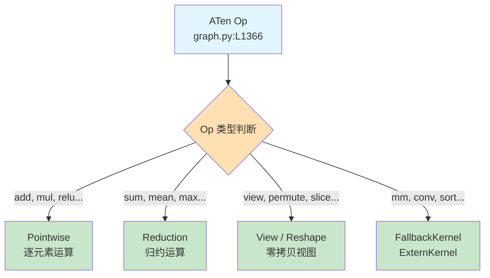
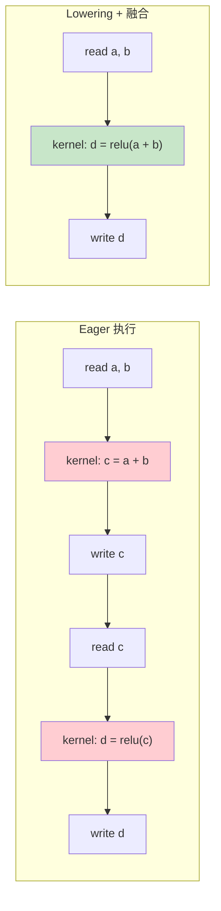
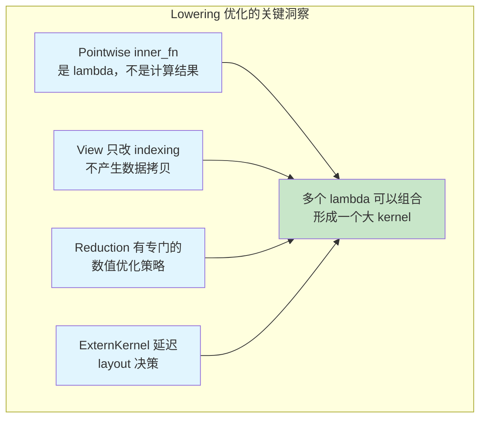
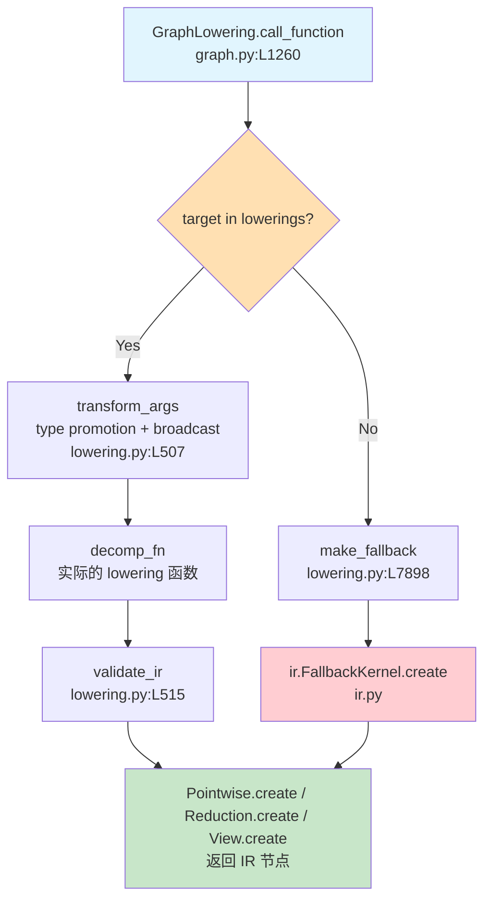
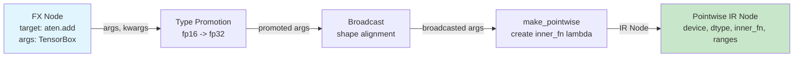

# Code Analysis: Inductor Lowering (`lowering.py`)

## Overview

**Purpose**: 将 FX Graph 中的 ATen 算子翻译为 Inductor 的 IR（中间表示），是 TorchInductor 编译器从"图级别"到"代码生成"的核心桥梁。

**Scope**: `lowering.py` 的完整架构、注册机制、优化策略及与上下游的交互。

**Files Analyzed**:

| File | Lines | Role |
|------|-------|------|
| `torch/_inductor/lowering.py` | L1-L7913 | Lowering 核心：算子注册、IR 转换 |
| `torch/_inductor/graph.py` | L1260-L1366 | 调用方：`call_function` 触发 lowering |
| `torch/_inductor/kernel/mm.py` | L1-L60 | 下游：matmul 等高性能 kernel lowering |
| `torch/_inductor/ir.py` | (参考) | IR 节点定义：Pointwise, Reduction, etc. |

## Architecture Position

```
torch.compile / torch._dynamo
  ↓ (FX Graph with ATen ops)
Decomposition (decomposition.py)
  ↓ (Simplified ATen ops)
Pre-grad passes (pre_grad.py)
  ↓
GraphLowering.call_function (graph.py:L1260)
  ↓
┌─────────────────────────────────────┐
│  lowering.py  ← 本文分析重点         │
│  lowerings[target](*args, **kwargs) │
│  将 ATen op → IR Node               │
└─────────────────────────────────────┘
  ↓ (IR Nodes: Pointwise, Reduction, ExternKernel, etc.)
Post-grad passes (post_grad.py)
  ↓
Scheduler → Codegen (Triton / C++ / etc.)
```

**This component operates at**: ATen → IR 翻译层
**It receives calls from**: `GraphLowering.call_function()` (`graph.py:L1260`)
**It delegates to**: `ir.Pointwise`, `ir.Reduction`, `ir.FallbackKernel`, `kernel/mm.py` 等

## 一、什么是 Lowering?

Lowering（降级/下降）是编译器术语，指将**高层抽象表示**转换为**低层具体表示**的过程。在 TorchInductor 中：

| 层级 | 表示 | 示例 |
|------|------|------|
| **高层** | ATen 算子 (`aten.add`, `aten.mm`) | `torch.add(a, b)` |
| **Lowering** | ← `lowering.py` 做这个转换 → | |
| **低层** | Inductor IR 节点 (`Pointwise`, `Reduction`, `ExternKernel`) | 可融合的循环体 / 外部库调用 |

核心思想：**不是直接为每个 ATen op 生成代码，而是先翻译为 Inductor 自己的 IR，再统一做优化和代码生成。**

## 二、核心组件

### 2.1 注册机制：`lowerings` 字典

**File**: `lowering.py:L114`

```python
lowerings: dict[Union[Callable[..., Any], str], Callable[..., Any]] = {}
```

整个 lowering 系统围绕这个全局字典运转。Key 是 ATen op（如 `aten.add.Tensor`），Value 是 lowering 函数。

`graph.py:L1366` 通过查表调用：
```python
out = lowerings[target](*args, **kwargs)
```

### 2.2 注册 API

| API | File:Line | 用途 | 适用场景 |
|-----|-----------|------|---------|
| `register_lowering()` | L525 | 通用注册装饰器 | 所有 op |
| `register_pointwise()` | L898 | 逐元素 op 快捷注册 | add, mul, relu, sin... |
| `register_foreach_pointwise()` | L1016 | foreach 批量 op | `_foreach_add`, `_foreach_mul` |
| `register_inplace()` | L7249 | 原地 op 注册 | `add_`, `mul_`, `relu_` |
| `fallback_handler()` | L2187 | 回退到 eager 执行 | 不支持的 op |

#### `register_lowering` 的核心流程 (L472-L522)

```python
def _register_lowering(aten_fn, decomp_fn, broadcast, type_promotion_kind, ...):
    @functools.wraps(decomp_fn)
    def wrapped(*args, **kwargs):
        # 1. 类型提升 (type promotion)
        # 2. 广播 (broadcasting)
        args, kwargs = transform_args(args, kwargs, broadcast, type_promotion_kind, ...)
        # 3. 调用实际的 lowering 函数
        out = decomp_fn(*args, **kwargs)
        # 4. IR 验证
        validate_ir(out)
        return out

    aten_fn = get_overloads(aten_fn)  # 处理 OpOverloadPacket
    lowering_dict.update(dict.fromkeys(aten_fn, wrapped))
```

### 2.3 IR 节点输出分类

Lowering 输出四大类 IR 节点：



## 三、Lowering 做了什么优化？

### 3.1 Pointwise 融合基础（最核心的优化）

**原理**: `make_pointwise()` (`L626`) 将逐元素运算表示为 **lambda 函数（inner_fn）**，而非独立的 kernel。

```python
# lowering.py:L705
return Pointwise.create(
    device=device, dtype=dtype,
    inner_fn=inner_fn,  # ← 这是一个 lambda，不是独立计算
    ranges=ranges,
)
```

**为什么能优化**: 多个连续的 Pointwise op 共享同一个 index range 时，可以被 Scheduler 融合到**同一个 Triton kernel** 中，从而：
- 消除中间 tensor 的内存分配（省显存）
- 消除中间结果的读写（省带宽）
- 减少 kernel launch 次数

**示例**: `relu(add(a, b))` — 两次逐元素操作融合为一次：



### 3.2 View 零拷贝（视图操作消除内存拷贝）

**相关代码**:
- `view()` → `View.create()` (L1272)
- `permute()` → `PermuteView.create()` (L1280)
- `squeeze()` → `SqueezeView.create()` (L1088)
- `expand()` → `ExpandView.create()` (L1194)
- `as_strided()` → `ReinterpretView` (L1430)

这些操作在 lowering 后变成 **IR 中的元数据变换**，不产生任何计算，也不拷贝数据。后续 Pointwise 消费这些 view 时，只是修改 indexing 方式。

### 3.3 Reduction 优化

**相关代码**: `make_reduction()` (L6268), `mean()` (L6303), `var_mean_welford_()` (L6362)

| 优化点 | 代码位置 | 描述 |
|--------|---------|------|
| 高精度中间计算 | L6311 | `mean` 对 fp16/bf16 先升到 fp32 再计算 |
| Welford 在线算法 | L6362 | `var_mean` 使用数值稳定的单遍算法 |
| Two-step 退化 | L6346 | 小规模 reduction 用简单双步代替 Welford |
| OnlineSoftmax | L7776 | softmax 的 max 和 sum 单 pass 完成 |

### 3.4 常量折叠 & 常量提升

**相关代码**: `promote_constants()` (L573)

数值常量（int, float, sympy.Basic）被包装为 `ir.Constant` 或 `IndexingConstant`，在代码生成时直接内联为立即数，避免额外的 tensor 创建和读取。

### 3.5 智能 Fallback

**相关代码**: `fallback_handler()` (L2187), `make_fallback()` (L7898)

对于 Inductor 暂不支持原生 lowering 的 op（如 `aten.sort.stable` 大尺寸情况），自动回退到 `ir.FallbackKernel`，调用 ATen 库实现。这保证了**编译永远不会因为缺少 lowering 而失败**。

### 3.6 Foreach 水平融合

**相关代码**: `make_foreach_pointwise()` (L715), `foreach_group_loop()` (L753)

将 `_foreach_add`, `_foreach_mul` 等批量操作中的同类型操作合并到同一个 combo kernel，减少 kernel launch 数。

### 3.7 量化 op 融合

**相关代码**: L1594-L1722

`quantize_per_tensor`, `dequantize_per_channel` 等被 lowering 为 Pointwise，与前后 op 可融合，避免量化/反量化的额外内存往返。

### 3.8 Layout 约束优化

**相关代码**: `maybe_layout_constraints()` (L170), `tag_to_layout_constraint()` (L184)

对需要特定内存布局的 op（如 `mm` 需要连续内存），在 lowering 时插入必要的 stride/layout 要求，让 Scheduler 延迟决策最优布局，减少不必要的拷贝。

## 四、为什么 Lowering 能带来优化？

### 根本原因：延迟执行 + 全局可见性

| 维度 | Eager 模式 | Lowering 后 |
|------|-----------|------------|
| 执行时机 | 每个 op 立即执行 | 先构建 IR，统一优化后执行 |
| 可见范围 | 只看当前 op | 整个计算图 |
| 中间结果 | 必须 materialize | 可以通过 lambda 传递，无需分配 |
| Kernel 边界 | 每个 op 一个 kernel | 可融合相邻 op 为一个 kernel |
| 内存布局 | 每个 op 自己决定 | 全局优化布局决策 |



## 五、自己做 Lowering 要关注的优化点

### 5.1 必须做的基础

| 优化点 | 关键考虑 | 参考代码 |
|--------|---------|---------|
| **逐元素融合** | 所有 pointwise op 表示为 `inner_fn` lambda | `make_pointwise()` L626 |
| **View 零拷贝** | reshape/permute/slice 只改 indexing | `view()` L1272, `permute()` L1280 |
| **类型提升** | 遵循 PyTorch 的类型提升语义 | `transform_args()` L364 |
| **广播** | 正确处理 shape 广播 | `broadcast_symbolic_shapes()` L547 |
| **Fallback 兜底** | 无法 lower 的 op 必须能回退 | `fallback_handler()` L2187 |

### 5.2 高优先级优化

| 优化点 | 为什么重要 | 复杂度 |
|--------|-----------|--------|
| **Reduction 数值稳定性** | fp16 训练中 mean/var 必须高精度 | 中等 |
| **Welford 算法** | 单 pass 计算 variance，省带宽 | 中等 |
| **Foreach 水平融合** | 优化器更新多参数场景 | 中等 |
| **量化 op 内联** | 量化模型中消除不必要的 cast | 中等 |
| **Layout 延迟决策** | 避免不必要的 contiguous 拷贝 | 较高 |

### 5.3 进阶优化

| 优化点 | 场景 | 复杂度 |
|--------|------|--------|
| **OnlineSoftmax** | Attention 计算中的 max+sum 单 pass | 高 |
| **Pointwise cat** | 小 tensor cat 融合为 pointwise | 中等 |
| **FMA 指令** | `addcmul` 中使用 fused multiply-add | 低 |
| **精度仿真** | `emulate_precision_casts` 在 fp32 kernel 中模拟 fp16 行为 | 中等 |
| **Autotuning** | matmul 等高性能 kernel 的多算法选择 | 很高 |

### 5.4 设计模式建议

1. **注册表模式**: 用字典存储 `{op -> lowering_fn}` 映射，方便扩展（`lowerings` dict）
2. **Lambda 延迟计算**: 核心思想，`inner_fn` 只描述"如何计算"，不执行计算
3. **分层 fallback**: 先尝试 native lowering → 不行退化 → 最后 fallback
4. **Symbolic shape**: 用 SymPy 表达式处理 shape，支持动态 shape 编译
5. **Validate 检查**: 每次 lowering 后 `validate_ir(out)` 确保 IR 合法性

## Call Chain



## Data Flow



## Key Design Decisions

| Decision | Implementation | Rationale |
|----------|----------------|-----------|
| Lambda-based IR | `inner_fn` 闭包而非 eager value | 延迟执行允许跨 op 融合 |
| 全局 lowerings 字典 | `dict[Callable, Callable]` | 简单、可扩展、O(1) 查找 |
| fallback 兜底 | `FallbackKernel` 调用 ATen | 保证编译不会因缺少 lowering 而失败 |
| Symbolic shape | 使用 SymPy 表达式 | 支持动态 shape，避免重编译 |
| 类型提升在 lowering 层 | `transform_args` | 统一处理，避免每个 lowering 重复逻辑 |
| View 不产生计算 | 直接返回 metadata 变换 | 最大化零拷贝机会 |

## Beginner Summary

**Lowering 的核心思想用一句话说明**：把 PyTorch 的"立即执行"算子翻译成"描述性"的 IR 节点，让编译器有机会把多个操作合并成一个更高效的 kernel。

### What You Should Know

1. **Lowering 是翻译，不是执行** — 它把 `aten.add(a, b)` 变成一个描述"我要做加法"的 IR 节点（含 lambda），而不是真的算出结果。
2. **逐元素 op → Pointwise IR → 可融合 kernel** — 这是最核心的优化路径。多个 Pointwise 可以合并成一个 Triton kernel，消除中间 tensor 的内存分配和读写。
3. **View 操作是"免费"的** — reshape、permute、slice 在 lowering 后只改变 indexing 方式，不产生任何数据拷贝。
4. **不能 lower 的 op 会 fallback** — 对于复杂/不支持的 op，lowering.py 自动创建 `FallbackKernel`，调用原始的 ATen 库实现，保证正确性。

### Suggested Next Topics

- `ir.py` — 理解 IR 节点（Pointwise, Reduction, Buffer）的具体结构
- `scheduler.py` — 理解如何决定哪些 IR 节点融合到同一个 kernel
- `codegen/triton.py` — 理解融合后的 Triton kernel 代码生成
- `decomposition.py` — 理解哪些 ATen op 在 lowering 之前就被分解了
- `kernel/mm.py` — 理解 matmul 等高性能 kernel 的 autotuning lowering

## Questions & Uncertainties

- `lowering.py` 对 complex tensor 的支持不完整（L2206 警告），需要研究后续改进计划
- 动态 shape（unbacked symbols）的 slice/select lowering 逻辑较复杂（L1349），值得单独深入分析
- OnlineSoftmax 目前不支持 split reduction（L7801），在推理场景可能需要补全

## Related Pages

- [[02_engineering/01_ai_frameworks/index]]
- [[PyTorch_Inductor_Technical_Analysis]]
- [[inductor_codegen_analysis]]
