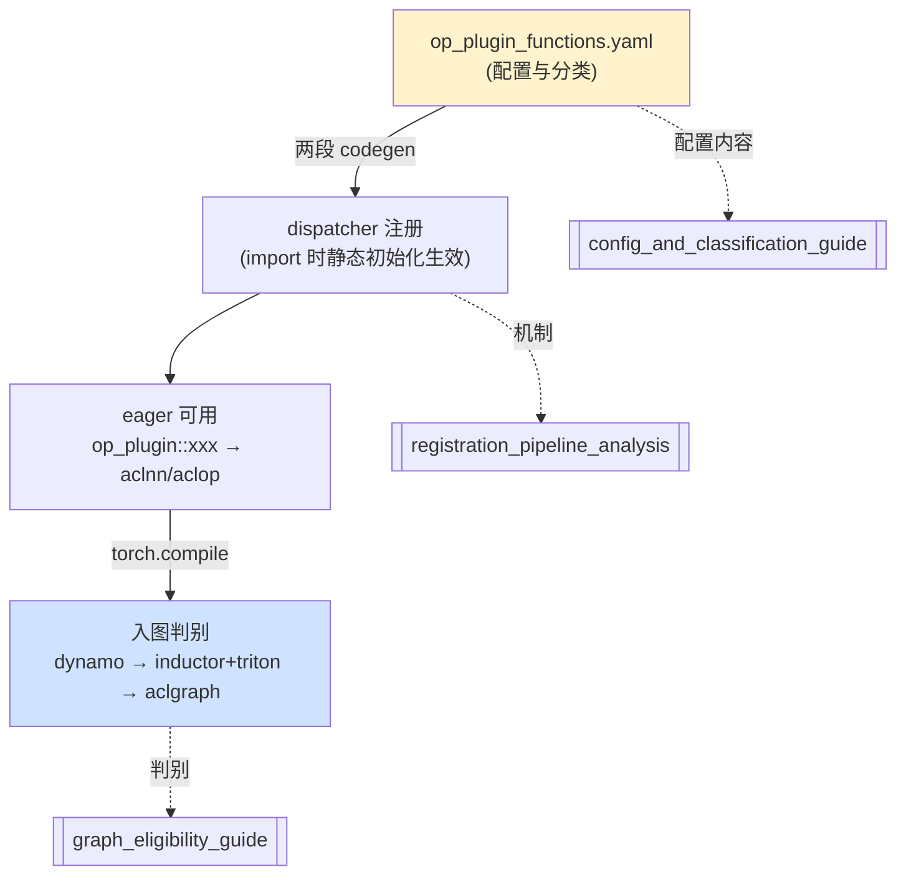

# op-plugin 算子接入 — 目录索引

> torch_npu 的「算子供给侧」：op-plugin 配置与分类、yaml→codegen→dispatcher 的注册链路与生效时机、以及算子能否「入图」的判别。
> 最后更新: 2026-06-12
> 基于版本：`E:\97-codes\pytorch\torch_npu` 当前 checkout（op-plugin `all_version = v2.1 ~ v2.10`）

---

## 这一域回答什么

| 问题 | 看哪篇 |
|------|--------|
| `op_plugin/config/` 每个文件、每个字段什么意思？怎么看一条配置就分类（原生/自定义、aclop/aclnn、手写/结构化、版本）？ | [[op_plugin_config_and_classification_guide]] |
| 上层 `torch.abs` / `torch_npu.npu_xxx` 怎么调用到 op_plugin 的？注册胶水是自动生成的吗？什么时候生效？ | [[op_registration_pipeline_analysis]] |
| 一个算子能不能「入图」？卡在 dynamo / inductor+triton / aclgraph 哪一关？怎么验证？ | [[npu_operator_graph_eligibility_guide]] |

---

## 页面列表

| 页面 | 类型 | 核心主题 |
|------|------|---------|
| [[op_plugin_config_and_classification_guide]] | Guide | config 五文件字段；official/custom/symint/quant 分组（含 symint 正交维度纠正）；acl_op(aclop) vs op_api(aclnn)；gen_opapi 结构化 vs 手写（「过适配」澄清）；四维分类速查表 |
| [[op_registration_pipeline_analysis]] | Analysis | 两段 codegen 串联；生成产物（RegisterNPU.cpp / CustomRegisterSchema.cpp / custom_ops.py）；**TORCH_LIBRARY = 静态初始化「库加载即注册」**；编译期→加载期→运行期时间线；acl_op/op_api 运行时三层选择；两条完整调用链 |
| [[npu_operator_graph_eligibility_guide]] | Guide | 入图四路线；非 torchair 三关递进流水线（dynamo meta / inductor lowering+fallback / aclgraph aclnn-only）；每关判别命令；op_api/acl_op 贯穿主线；三关速查表 |

---

## 一图概览：从 yaml 到入图

---

## 关联域

- [[inductor/index]] —— Inductor 后端（第二关 lowering/fallback 的实现）
- [[cudagraphs/npugraphs/index]] —— NPU Graphs / ACLGraph 深度分析（第三关 capture 的实现）
- [[index]] —— PyTorch Compilation Stack 总索引
