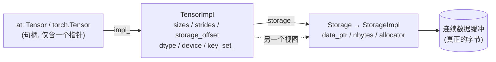
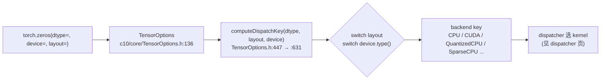

# Tensor 与 Storage Quick Start:动手观察张量的内部表达

> 层次:quick start(用)
> 核验基准:PyTorch upstream `E:\97-codes\pytorch\pytorch`(v2.13.0a0, commit 9922478)
> 最后更新:2026-06-15

**一句话**:一个 `torch.Tensor` 不是一块数据,而是一个**胖指针 + 一组视图元数据**(sizes / strides / storage_offset / dtype / device),指向一块可被多个张量共享的 `Storage` 数据缓冲。本页用最小可跑的 Python(+少量 C++)带你逐项观察这些字段,并用 `data_ptr()` 亲手证明「视图共享、拷贝独立」,最后看 `torch.zeros(dtype=, device=)` 是如何把你的意图换算成一个 dispatch key 的。

心智模型(三层,Python 看到的是最左一层):



- 句柄即 `c10::intrusive_ptr<TensorImpl, UndefinedTensorImpl>`,见 `aten/src/ATen/core/TensorBase.h:928`。空张量的 null 值是 `UndefinedTensorImpl` 单例,不是 `nullptr`。
- 视图元数据全在 `TensorImpl`;数据缓冲在 `Storage`。**改视图 = 改 TensorImpl 字段,不碰 Storage** —— 这是「视图不拷贝」的全部秘密。

---

## 0. 准备一个可观察的张量

```python
import torch

x = torch.arange(12, dtype=torch.int64).reshape(3, 4)
# x =
# [[ 0  1  2  3]
#  [ 4  5  6  7]
#  [ 8  9 10 11]]
```

下面所有观察都基于这个 `x`。

---

## 1. 读三件套:sizes() / strides() / storage_offset()

Python 侧 API → C++ TensorImpl 访问器:

```python
x.shape            # torch.Size([3, 4])      ← sizes()
x.stride()         # (4, 1)                   ← strides()
x.storage_offset() # 0                        ← storage_offset()
x.numel()          # 12
```

- `stride()` 的含义:沿第 i 维走一步,需要在底层缓冲里跳过 `stride[i]` 个**元素**(不是字节)。行主序的 `(3,4)` 张量:跨一行跳 4 个元素,跨一列跳 1 个 —— 所以 `(4, 1)`。
- `storage_offset()` 是「本视图的第一个元素」距离缓冲起点的**元素数**(同样不是字节,见源码 WARNING)。

对应 C++(注意都是「先测 policy、未命中才直读字段」的快路径):

```cpp
// c10/core/TensorImpl.h:615
IntArrayRef sizes() const {
  if (C10_UNLIKELY(matches_policy(SizesStridesPolicy::CustomSizes)))
    return sizes_custom();
  return sizes_and_strides_.sizes_arrayref();   // 命中快路径:直读内联字段
}
// c10/core/TensorImpl.h:749
int64_t storage_offset() const {
  if (C10_UNLIKELY(matches_policy(SizesStridesPolicy::CustomSizes)))
    return storage_offset_custom();
  return storage_offset_;
}
```

- `strides()` 同构,见 `c10/core/TensorImpl.h:783`。
- 这条 `if (C10_UNLIKELY(...))` 只有子类张量(嵌套张量 / Python 张量 / 符号形状 Dynamo)才会命中;普通 eager 张量是零虚调用直读。符号形状走的是 `sizes_default()` / `sym_strides_default()`(`c10/core/TensorImpl.h:631` / `:804`),具体路径上调用 `sym_*` 会抛 `throw_cannot_call_with_symbolic` —— 这层细节属 deep dive。

---

## 2. is_contiguous() 与 memory_format

「连续」= strides 恰好是「按某种内存布局从 sizes 推出来的那一组」。它是一个**缓存的布尔判断**,不是张量的固有属性。

```python
x.is_contiguous()              # True
xt = x.t()                     # 转置 = 视图
xt.stride()                    # (1, 4)   ← 行/列 stride 互换
xt.is_contiguous()             # False    strides 不再是连续布局
xt.contiguous().is_contiguous()# True     这一步才真正拷贝出连续缓冲
```

### memory_format 的四个值(易踩坑:Contiguous=0,Preserve=1)

```cpp
// torch/headeronly/core/MemoryFormat.h:29
enum class MemoryFormat : int8_t {
  Contiguous,    // = 0
  Preserve,      // = 1   ← 不是 0!写默认参数 / FFI 时最易错
  ChannelsLast,  // = 2
  ChannelsLast3d,// = 3
  NumOptions
};
```

`is_contiguous()` 接受一个 `memory_format` 参数,默认 `Contiguous`:

```cpp
// c10/core/TensorImpl.h:856
bool is_contiguous(
    at::MemoryFormat memory_format = at::MemoryFormat::Contiguous) const {
  if (C10_UNLIKELY(matches_policy(SizesStridesPolicy::CustomStrides)))
    return is_contiguous_custom(memory_format);
  return is_contiguous_default(memory_format);
}
```

### channels_last 是「stride 模式」,不是数据搬动

对 4D 张量 `(N,C,H,W)`,channels_last = 物理上按 NHWC 排布;在 NCHW 的索引顺序下表现为一组特定 strides:

```python
y = torch.zeros(1, 3, 2, 2)                              # 默认连续 (NCHW)
y.stride()                                               # (12, 4, 2, 1)
yc = y.contiguous(memory_format=torch.channels_last)
yc.stride()                                              # (12, 1, 6, 3)   ← NHWC 物理布局
yc.is_contiguous()                                       # False  (按默认 Contiguous 判)
yc.is_contiguous(memory_format=torch.channels_last)      # True
```

C++ 侧 channels-last 的判断就是「strides 是否像 channels-last」,见 `c10/core/TensorImpl.h:864`(`is_strides_like_default`)。注意源码顶部注释直说:memory format **绝不能**作为查询张量状态的返回值,它只是告诉算子「输出该怎么排」(`torch/headeronly/core/MemoryFormat.h:9-12`)。

---

## 3. 视图 vs 拷贝:用 data_ptr() 亲手证明别名

这是本页最值得动手的实验。Python 有两个 `data_ptr`:

| 调用 | 含义 | C++ 落点 |
|---|---|---|
| `t.untyped_storage().data_ptr()` | **缓冲基址**(整块数据的起点) | `Storage::data_ptr()` `c10/core/Storage.h:142` |
| `t.data_ptr()` | 本视图首元素地址 = 基址 + `storage_offset * itemsize` | (= 上者 + offset 字节) |

```python
x = torch.arange(12, dtype=torch.int64).reshape(3, 4)

view = x.t()        # 转置:视图,不拷贝
copy = x.clone()    # 克隆:新缓冲

# 视图与原张量共享同一块 Storage —— 基址相等
x.untyped_storage().data_ptr() == view.untyped_storage().data_ptr()   # True
# 拷贝是另一块 Storage —— 基址不等
x.untyped_storage().data_ptr() == copy.untyped_storage().data_ptr()   # False

# 改视图会写回共享缓冲(别名生效),拷贝则不受影响
view[0, 0] = 99
x[0, 0].item()      # 99   ← 原张量被改了
copy[0, 0].item()   # 0    ← 拷贝独立
```

再看 `storage_offset` 怎么体现在地址上:

```python
row1 = x[1]                                  # 取第 1 行:视图
row1.storage_offset()                        # 4   (跳过 4 个元素)
row1.untyped_storage().data_ptr() == x.untyped_storage().data_ptr()  # True  (同一缓冲)
row1.data_ptr() - x.data_ptr()               # 32  = 4 元素 × 8 字节(int64)
```

要直接判断「两个张量是否别名同一块缓冲」,C++ 有专门的自由函数:

```cpp
// c10/core/Storage.h:21
C10_API bool isSharedStorageAlias(const Storage& storage0, const Storage& storage1);
```

其它常用 Storage 观测口(都在 `c10/core/Storage.h`):`data()` `:130`、`nbytes()` `:121`、`device()` `:167`、`use_count()` `:187`(共享所有权计数)。`storage()` 访问器在 `c10/core/TensorImpl.h:1073`(对禁止访问 storage 的张量会抛错)。

> 提示:`.storage()` 返回带类型的旧式 storage,新代码推荐 `.untyped_storage()`(返回 `UntypedStorage`);两者的 `data_ptr()` 都给缓冲基址。官方「哪些算子返回视图」清单见 [PyTorch Tensor Views 文档](https://pytorch.org/docs/stable/tensor_view.html)。

---

## 4. dtype:torch.float32 ↔ ScalarType ↔ TypeMeta

Python 看到的是 `torch.dtype`;TensorImpl 里实际存的是 `caffe2::TypeMeta`;而 `ScalarType` 是对外的 int8 枚举。三者一一对应。

```python
t = torch.zeros(3, dtype=torch.float32)
t.dtype          # torch.float32      ← 对应 C++ ScalarType::Float
t.element_size() # 4                  ← itemsize(),单个元素字节数
```

```cpp
// TensorImpl 存的是 TypeMeta:c10/core/TensorImpl.h:1731
const caffe2::TypeMeta dtype() const { return data_type_; }
// 元素字节数:c10/core/TensorImpl.h:1738
size_t itemsize() const { ...; return data_type_.itemsize(); }

// 枚举本体:torch/headeronly/core/ScalarType.h:258
enum class ScalarType : int8_t { /* Byte, Char, ... Float, Double, ... */ };
// 由枚举直接查元素大小:c10/core/ScalarType.h:45
inline size_t elementSize(ScalarType t) { switch (t) { ... sizeof(ctype) ... } }
```

ScalarType ↔ TypeMeta 的桥接函数(`c10/core/ScalarTypeToTypeMeta.h`):

```cpp
inline caffe2::TypeMeta scalarTypeToTypeMeta(ScalarType s);        // :16
inline ScalarType       typeMetaToScalarType(caffe2::TypeMeta d);  // :23
inline std::optional<ScalarType> optTypeMetaToScalarType(...);     // :30  ← computeDispatchKey 就用它
```

记忆口诀:**对外/枚举用 ScalarType,张量内部存 TypeMeta**,需要往返时走上面三个桥。

---

## 5. device

```python
t = torch.zeros(2, 3, device="cpu")
t.device         # device(type='cpu')
t.device.type    # 'cpu'
t.device.index   # None  (CPU 无 index;CUDA 会是 0/1/...)
```

```cpp
// c10/core/TensorImpl.h:1293
Device device() const {
  if (C10_UNLIKELY(device_policy_)) return device_custom();
  return device_default();
}
```

`Device = DeviceType + index`(结构定义 `c10/core/Device.h:31`)。TensorImpl 内部字段 `device_opt_` 仅对 undefined 张量为 nullopt。切换当前设备用 RAII 的 `DeviceGuard`(`c10/core/DeviceGuard.h:23`),离开作用域自动复位 —— 这属于运行时层,详见 [[01_eager_runtime/02_dispatcher_and_device/index]]。

---

## 6. torch.zeros(dtype=, device=) 如何算出 dispatch key

当你写 `torch.zeros(..., dtype=, device=, layout=)`,工厂函数会先把这些意图打包成一个 `TensorOptions`(`c10/core/TensorOptions.h:136`),再调用 `computeDispatchKey()` 把 `(dtype, layout, device)` 归一化成**单一 backend dispatch key**,决定最终跑哪个后端的 kernel。

```cpp
// 成员转发:c10/core/TensorOptions.h:447
DispatchKey computeDispatchKey() const {
  return c10::computeDispatchKey(
      optTypeMetaToScalarType(dtype_opt()), layout_opt(), device_opt());
}

// 自由函数(声明 :131,定义 :631):先按 layout,再按 device.type() 选 key
inline DispatchKey computeDispatchKey(
    std::optional<ScalarType> dtype, std::optional<Layout> layout,
    std::optional<Device> device) {                 // c10/core/TensorOptions.h:631
  switch (layout_or_default(layout)) {
    case Layout::Strided: {                          // 普通稠密张量
      // isQIntType(dtype) ? DispatchKey::Quantized##device : DispatchKey::device
    }
    case Layout::Sparse:  // -> DispatchKey::Sparse##device
    ...
  }
}
```

按这套 switch 算出来的对照(常见组合):

| layout | device | dtype | 结果 key |
|---|---|---|---|
| Strided | CPU | float32 | `CPU` |
| Strided | CUDA | float32 | `CUDA` |
| Strided | CPU | qint8 | `QuantizedCPU` |
| Sparse | CPU | float32 | `SparseCPU` |

两个关键不变量(写代码/排查时记住):

1. `computeDispatchKey` **只**返回 `dispatchKeyToBackend` 可单射回去的子集,**永不返回 Autograd key**(注释 `c10/core/TensorOptions.h:443-446`)。
2. 张量上存的 `key_set_` 同样**不含 Autograd**(历史上含过,现在不了):

```cpp
// c10/core/TensorImpl.h:3052
// The set of DispatchKeys which describe this tensor.  NB: this
// does NOT include Autograd (historically, it did, but not anymore!)
DispatchKeySet key_set_;
```

Autograd 由独立的 functionality 位管理;dispatcher 在调用时对所有输入张量的 keyset 取并、再选最高优先级派发 —— 这套 functionality 位 vs backend 位的设计,以及为什么这样能避免「平方爆炸」,见 [[10_pytorch_dispatcher_analysis]]。



---

## 7. 速查表:Python API → C++ 落点

| 你想看的 | Python | C++ 锚点 |
|---|---|---|
| 形状 | `t.shape` / `t.size()` | `c10/core/TensorImpl.h:615` |
| 步长 | `t.stride()` | `c10/core/TensorImpl.h:783` |
| 偏移(元素数) | `t.storage_offset()` | `c10/core/TensorImpl.h:749` |
| 是否连续 | `t.is_contiguous(memory_format=...)` | `c10/core/TensorImpl.h:856` |
| memory_format 枚举 | `torch.contiguous_format` / `torch.channels_last` | `torch/headeronly/core/MemoryFormat.h:29` |
| 缓冲基址(证明别名) | `t.untyped_storage().data_ptr()` | `c10/core/Storage.h:142` |
| 视图首元素地址 | `t.data_ptr()` | 基址 + offset×itemsize |
| 是否别名同一缓冲 | (无直接 API) | `c10/core/Storage.h:21` `isSharedStorageAlias` |
| dtype | `t.dtype` | `c10/core/TensorImpl.h:1731`(存 TypeMeta) |
| 元素字节 | `t.element_size()` | `c10/core/TensorImpl.h:1738` / `c10/core/ScalarType.h:45` |
| device | `t.device` | `c10/core/TensorImpl.h:1293` |
| dtype/device → key | (工厂内部) | `c10/core/TensorOptions.h:447` / `:631` |

---

## 8. 深入导航

- [[01_eager_runtime/01_tensor_and_storage/index]] —— 本模块 overview:Tensor / TensorImpl / Storage / intrusive_ptr 全景与字段分布。
- [[10_tensor_impl_and_storage_analysis]] —— deep dive:字段位域、contiguity 缓存刷新链、shallow_copy / 版本计数、SymInt、AutogradMeta 解耦、PyObject 保活等源码级展开。
- [[10_pytorch_dispatcher_analysis]] —— key_set 如何被 dispatcher 取并、functionality 位 vs backend 位。

---

## Related Pages

- [[01_eager_runtime/01_tensor_and_storage/index]]
- [[10_tensor_impl_and_storage_analysis]]
- [[01_eager_runtime/02_dispatcher_and_device/index]]
- [[10_pytorch_dispatcher_analysis]]
- [[02_compile_stack/02_aot_autograd/index]]
- [[01_eager_runtime/03_op_registration/index]]
- [[01_eager_runtime/05_autograd_engine/index]]
