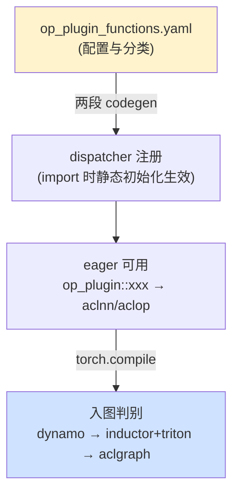

# 07 · op-plugin 算子接入(NPU)— 目录索引

> torch_npu 的「算子供给侧」:op-plugin 配置与分类、yaml→codegen→dispatcher 的注册链路与生效时机、以及算子能否「入图」的判别。
> 核验基准:torch_npu **v2.7.1.post5**;op-plugin `all_version = v2.1 ~ v2.10`
> 最后更新: 2026-06-13

---

## 这一域回答什么

| 问题 | 看哪篇 |
|------|--------|
| `op_plugin/config/` 每个文件、字段什么意思?怎么看一条配置就分类(原生/自定义、aclop/aclnn、手写/结构化、版本)? | [[op_plugin_config_and_classification_guide]] |
| 上层 `torch.abs` / `torch_npu.npu_xxx` 怎么调用到 op_plugin?注册胶水自动生成吗?何时生效? | [[op_registration_pipeline_analysis]] |
| 一个算子能不能「入图」?卡在 dynamo / inductor+triton / aclgraph 哪一关?怎么验证? | [[npu_operator_graph_eligibility_guide]] |

---

## 页面列表(按层次)

> 本索引 +「这一域回答什么」表即本模块 overview;下列页面按 quick start→deep dive 标注。

| 页面 | 层次 | 核心主题 |
|------|------|---------|
| [[op_plugin_config_and_classification_guide]] | quick start | config 五文件字段;official/custom/symint/quant 分组;acl_op(aclop) vs op_api(aclnn);gen_opapi 结构化 vs 手写;四维分类速查表 |
| [[npu_operator_graph_eligibility_guide]] | quick start + deep dive | 入图四路线;非 torchair 三关递进(dynamo meta / inductor lowering+fallback / aclgraph aclnn-only);每关判别命令;三关速查表 |
| [[op_registration_pipeline_analysis]] | deep dive | 两段 codegen 串联;生成产物(RegisterNPU.cpp / CustomRegisterSchema.cpp / custom_ops.py);TORCH_LIBRARY 静态初始化「库加载即注册」;编译→加载→运行期时间线;两条完整调用链 |

---

## 一图概览:从 yaml 到入图

---

## 整体架构

算子的生命周期是一条单向链：在 `op_plugin_functions.yaml` 里**一行声明**（名字、入参、`op_api`/`acl_op` 等元数据）→ **两段 codegen** 据此生成胶水（dispatcher 注册桩 + Python 包装）→ `import torch_npu` 时 `TORCH_LIBRARY` 静态初始化把胶水**挂进 dispatcher**，算子在 **eager** 即可用 → 再经 `torch.compile` 时才逐关判别它**能否入图**（dynamo→inductor+triton→aclgraph）。

理解全域可抓三个**顺序依赖**的维度：

1. **配置维**——yaml 元数据，是一切的源头（[[op_plugin_config_and_classification_guide]]）；
2. **注册维**——codegen 据配置生成胶水、决定 eager 怎么调到 aclnn/aclop（[[op_registration_pipeline_analysis]]）；
3. **入图维**——compile 阶段在前两维之上再叠加额外约束：meta、lowering、aclnn-only（[[npu_operator_graph_eligibility_guide]]）。

三者**层层依赖**：没有①就没有②可生成，没有②算子连 eager 都不可用、更谈不上③的入图——本域三篇正按此顺序展开。

---

## 关联域

- [[01_eager_runtime/02_dispatcher_and_device/index]] — Dispatcher(注册目标)
- [[02_compile_stack/04_inductor/npu/index]] — NPU Inductor(第二关 lowering/fallback 的实现)
- [[03_runtime_graphs/npu/index]] — NPU Graphs / ACLGraph(第三关 capture 的实现)
- [[01_eager_runtime/03_op_registration/index]] — 算子接入总索引
- [[01_pytorch/index]] — 本域总索引
