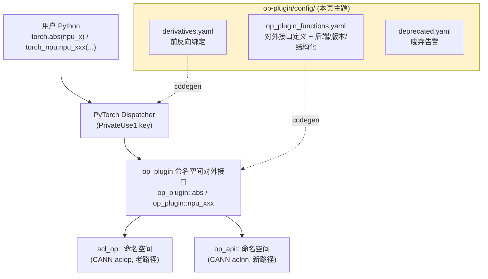
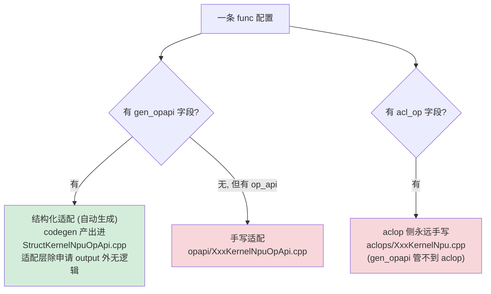

# torch_npu 算子接入：op-plugin 配置与分类指南

> op-plugin 是 torch_npu 的「算子供给侧」。本页讲清 `op_plugin/config/` 五个文件的字段含义，以及如何**看一条 yaml 配置就判断**它是社区原生还是自定义、走 aclop 还是 aclnn、手写适配还是结构化自动生成、支持哪些版本。
>
> 基于版本：`E:\97-codes\pytorch\torch_npu` 当前 checkout（op-plugin `all_version = v2.1 ~ v2.10`）
> 分析日期：2026-06-12
> 源码位置：`op_plugin/` 实际位于 `torch_npu/third_party/op-plugin/op-plugin/op_plugin/`；`torchnpugen/` 位于 torch_npu 仓库根。下文统计数字为当前 checkout 量级，随分支变动。

---

## 目录

1. [op-plugin 在 torch_npu 栈中的位置](#1-op-plugin-在-torch_npu-栈中的位置)
2. [config 目录五个文件](#2-config-目录五个文件)
3. [op_plugin_functions.yaml 字段详解](#3-op_plugin_functionsyaml-字段详解)
4. [两类后端：acl_op(aclop) vs op_api(aclnn)](#4-两类后端acl_opaclop-vs-op_apiaclnn)
5. [三种适配方式与「过适配」的澄清](#5-三种适配方式与过适配的澄清)
6. [顶层分组：official / custom / symint / quant](#6-顶层分组official--custom--symint--quant)
7. [前反向绑定与废弃告警](#7-前反向绑定与废弃告警)
8. [分类速查表：看一条 func 配置就能分类](#8-分类速查表看一条-func-配置就能分类)

---

## 1. op-plugin 在 torch_npu 栈中的位置

torch_npu 把 Ascend NPU 注册成 PyTorch 的 `PrivateUse1` 设备。**op-plugin 仓库负责「算子的实现与对外接口定义」**——它不直接面对用户，而是被 codegen 消费、生成注册胶水后挂进 PyTorch dispatcher（见 [[op_registration_pipeline_analysis]]）。



config 目录就是这套算子接入流程的**声明入口**：每加一个算子或改一个算子的后端/版本支持，都要先动 `op_plugin_functions.yaml`。

---

## 2. config 目录五个文件

| 文件 | 作用 | 关键字段 |
|------|------|---------|
| **op_plugin_functions.yaml** | 核心——所有对外算子接口的定义（当前 checkout 约 1393 条 `func`） | `all_version` / `official` / `custom` / `symint` / `quant` / `func` / `acl_op` / `op_api` / `gen_opapi` |
| **derivatives.yaml** | 前反向绑定（自动微分）。给自定义算子、或与社区绑定逻辑不一致的原生算子配前向↔反向公式 | `name`（前向 schema）/ 各输入的反向公式 / `version` |
| **aclnn_derivatives.yaml** | derivatives 的 aclnn 变体，当前 checkout 基本是空壳（仅注释） | 同 derivatives |
| **deprecated.yaml** | 给要废弃的自定义接口自动生成 `TORCH_WARN_ONCE` 告警 | `name`（含重载名）/ `replace`（替换方案） |
| **README.md** | 官方接入流程文档本身 | — |

> 官方字段说明见 `op_plugin/config/README.md`：yaml 字段 `:30-58`、aclop 适配写法 `:77-139`、aclnn 适配写法 `:175-222`、结构化适配 `:296-391`、废弃告警 `:393-429`。

---

## 3. op_plugin_functions.yaml 字段详解

```yaml
all_version: [v2.1, v2.2, v2.3, v2.4, v2.5, v2.6, v2.7, v2.8, v2.9, v2.10]   # 第 1 行
official:
  - func: abs(Tensor self) -> Tensor          # schema：名称 + 入参 + 返回
    acl_op: all_version                         # 该算子在哪些版本支持 aclop 调用
    op_api: all_version                         # 该算子在哪些版本支持 aclnn 调用
    gen_opapi:                                  # aclnn 侧可结构化自动生成
      structured_inherit: abs.out
custom:
  - func: npu_xxx(Tensor self) -> Tensor        # torch_npu 自定义算子
    op_api: all_version
```

| 字段 | 含义 |
|------|------|
| `all_version` | 当前分支支持的所有 PyTorch 版本（`op_plugin_functions.yaml:1`）。注意 README 示例里带 `v1.11`，但当前文件实际是 `v2.1 ~ v2.10`，说明这是个已裁掉 1.11 的分支。 |
| `func` | 算子 schema，规则与原生 aten 定义一致。 |
| `acl_op:` / `op_api:` | **两类 CANN 后端**，后面填版本：`all_version` / 左闭右闭区间 `[v2.1, newest]` / 枚举 `v2.1, v2.2`。`newest` = `all_version` 里最新版。见 §4。 |
| `gen_opapi:` | 结构化适配标记，仅对 aclnn 侧生效。见 §5。 |
| 同名 func 出现两条 | 同一算子在不同 PyTorch 版本上 schema 不同，用版本字段区分（README `:59-69` 的 `std.correction` 例子）。 |

---

## 4. 两类后端：acl_op(aclop) vs op_api(aclnn)

这是理解整个文件的关键。一个算子在 NPU 上可由两套 CANN 后端实现：

| 字段 | 后端 | 路径 | 调用方式 | 命名空间 | 手写适配目录 |
|------|------|------|---------|---------|------------|
| `acl_op:` | CANN **aclop**（图算子，老路径） | 旧 | `OpCommand().Name().Input().Output().Run()` | `acl_op::` | `op_plugin/ops/aclops/*KernelNpu.cpp` |
| `op_api:` | CANN **aclnn**（单算子 API，新路径） | 新 | `EXEC_NPU_CMD(aclnnXxx, ...)` | `op_api::` | `op_plugin/ops/opapi/*KernelNpuOpApi.cpp` |

证据：`README.md:92-139`（aclop 用 `OpCommand`）对比 `:191-222`（aclnn 用 `EXEC_NPU_CMD`）。

**一个算子可同时支持两者，运行时优先 aclnn、失败回退 aclop**。回退机制是 aclnn kernel 开头的宏：

```cpp
// op_plugin/ops/opapi/AbsKernelNpuOpApi.cpp（概念示例）
at::Tensor& abs_out(const at::Tensor& self, at::Tensor& result) {
    DO_COMPATIBILITY(aclnnAbs, acl_op::abs_out(self, result));  // 查不到 aclnn 符号则回退 acl_op
    EXEC_NPU_CMD(aclnnAbs, self, result);
    return result;
}
```

运行时如何在 aclnn / aclop 间二选一（共三层），详见 [[op_registration_pipeline_analysis]] §7。

**当前 checkout 量级**：仅 aclop ~173 条、仅 aclnn ~391 条、**两者都有 ~828 条（最多）**。手写文件：`aclops/*.cpp` 约 416 个、`opapi/*.cpp` 约 356 个。

---

## 5. 三种适配方式与「过适配」的澄清

**「过适配 / 走适配层」**指：凡是出现在 op_plugin_functions.yaml 里的算子，运行时都会被注册进 dispatcher、路由到 op_plugin 的适配函数（`op_api::xxx` 或 `acl_op::xxx`）。适配函数负责 `CheckOut`（shape/dtype 校验）、`apply_tensor`（申请输出内存）、非连续处理（`format_contiguous`/`format_fresh_view`）、dtype 转换，最后才调 CANN 算子（README `:107-139` 的 `abs_out` 完整示例）。

**所以「哪些算子是过适配的」这个问法，准确答案是：全部都过适配层。** 真正的区别在于 aclnn 侧的实现是**手写**还是**自动生成**：



- **结构化适配**：yaml 配了 `gen_opapi:`，codegen 自动生成（生成模板固定四步：`DO_COMPATIBILITY` 回退 → 算 size/dtype → `apply_tensor` → `EXEC_NPU_CMD`，见 `codegen/struct/struct_codegen.py:38-50`）。判据：aclnn 算子与 aten IR 语义对齐、适配层无额外逻辑。当前 checkout 约 406 条带 `gen_opapi`。
  - 两种写法：完整块（`out:` + `exec:`，约 354 条）；继承写法 `structured_inherit: X.out`（约 52 条，原函数/inplace 继承同名 `.out` 配置）。
- **手写适配**：无 `gen_opapi`，在 `opapi/` 或 `aclops/` 有人工 `.cpp`。

> ⚠️ **关键纪律**：`gen_opapi` **只对 aclnn 侧生效**（`struct_codegen.py:163` 强制要求 `op_api` 存在）。一个 both 算子完全可能「aclop 手写 + aclnn 结构化」——`abs` 就是活例：有 `aclops/AbsKernelNpu.cpp`（手写），但没有 `AbsKernelNpuOpApi.cpp`（aclnn 侧靠 `structured_inherit: abs.out` 自动生成）。

`gen_opapi` 的子字段（README `:303-391`）：`out`（输出，含 `size`/`dtype`/`name`，多输出用 `out0`/`out1`）、`new_params`（新增自定义变量）、`exec`（`EXEC_NPU_CMD` 的参数，可只填 aclnn 名）、`structured_inherit`（继承 `.out` 配置）。

### 手写适配的九类原因（aclnn 算子为什么没被自动生成）

`op_plugin/ops/opapi/` 下共约 356（随版本演进）个手写适配 `.cpp`（含 `sparse/` 子目录与命名变体；严格按 `*KernelNpuOpApi.cpp` 命名约 300）。一个 aclnn 算子要被结构化自动生成，必须满足「**适配层零额外逻辑**」——输出 shape/dtype 直接照搬输入、参数原样转发、单次 `EXEC_NPU_CMD`（`abs` 即如此，所以无手写文件）。适配层只要多出下面任意一类逻辑，`gen_opapi` 的固定四步模板（`DO_COMPATIBILITY` → 算 size/dtype → `apply_tensor` → 一次 `EXEC_NPU_CMD`）就套不出来，只能手写。**拿到一个手写文件，扫这些「判别特征」即可定位它属于哪类、为什么不能自动生成：**

| 原因类别 | 判别特征（先扫这个） | 典型例子 |
|---------|-------------------|---------|
| (a) 自定义 infershape | `*_npu_output_size`、`resize_`、`aclGetViewShape` | `CatKernelNpuOpApi.cpp:40-86`（拼接维累加+剔空）、`NonzeroKernelNpuOpApi.cpp:33-39`（输出行数运行期才知，同步执行再 resize） |
| (b) dtype 提升/cast | `result_type` 被改写、`isFloatingType` 判断、`copy_scalar_to_device` | `DivKernelNpuOpApi.cpp:62-67`（整数除法升 float）、`BitwiseAndKernelNpuOpApi.cpp:100-101`（bool→Long） |
| (c) 多次 aclnn/中间 tensor | 同函数 ≥2 个 `EXEC_NPU_CMD` + 中间 `apply_tensor` | `NativeDropoutKernelNpuOpApi.cpp:61,90`（GenMask + DoMask 两次 + RNG + 副流） |
| (d) 条件分支 | `if(dim()==0)`、可选参数选不同 aclnn | `AddKernelNpuOpApi.cpp:50-67`、`DivKernelNpuOpApi.cpp:96-101`（`rounding_mode`） |
| (e) 非连续/私有 format | `npu_format_cast`、`ACL_FORMAT_FRACTAL_NZ`、`contiguous()`、改 storage desc | `ConvertWeightToINT4PackKernelNpuOpApi.cpp:92-135`、`MaskedSelectKernelNpuOpApi.cpp:87-92` |
| (f) inplace/out + resize | inplace 委托 out、`resize_` 后 `copy_` 回写 | `AddbmmKernelNpuOpApi.cpp:55-62`、`NonzeroKernelNpuOpApi.cpp:46-57` |
| (g) 空/边界/标量特判 | 空 tensor 过滤、`p==0/1` 短路、全空返回 | `CatKernelNpuOpApi.cpp:31-34`、`NativeDropoutKernelNpuOpApi.cpp:110-118` |
| (h) 版本差异 | `#if VERSION_BETWEEN(...)` 包整段（签名随版本变） | `RepeatInterLeaveKernelNpuOpApi.cpp:79,143`（opapi/ 下 40 个文件含此宏） |
| (i) workspace/额外参数 | aclnn 比 aten 多入参、需 expand/占位组 TensorList | `AddbmmKernelNpuOpApi.cpp:33-34`（`cube_math_type`）、`IndexKernelNpuOpApi.cpp:26-40` |

复杂算子常**多类叠加**。例如 `add`（`AddKernelNpuOpApi.cpp`）手写**不是因为 `alpha`**（`alpha` 直接透传给 `aclnnAdd`，`:66`），而是同时踩了 (d) 标量/张量三路分派（`aclnnAdds`/`aclnnAddV3`/`aclnnAdd`，`:50-67`）+ (b) type promotion（`:99`）+ (a) broadcast infershape（`:98`）+ (g) `alpha_check_npu` 特判（`:23-30`）。

> **量级参考**：aclnn 侧约 **406 条走结构化自动生成 + 约 356 个手写**。「aclnn = 自动生成」只对语义与 aten 完全对齐的简单算子成立；`opapi/` 本质是「aclnn 算子里**适配层有活要干**的那批」。

---

## 6. 顶层分组：official / custom / symint / quant

| 分组 | 行号 | 含义 | 量级 |
|------|------|------|------|
| `official` | `:2` | 与社区/原生 PyTorch schema 一致的 aten 算子（名字就是原生 aten 名，如 `abs`、`add.Tensor`）。PyTorch 已有前反向绑定，插件只需提供 NPU 实现。 | ~1030 |
| `autograd` | `:5411` | 需要前反向自动绑定的少量原生算子 | 1 |
| `custom` | `:5415` | torch_npu 自定义算子，**绝大多数带 `npu_` 前缀**（原生 PyTorch 没有），通过 `torch_npu.npu_xxx` 暴露 | ~329 |
| `symint` | `:7039` | 入参包含 `SymInt`/`SymInt[]` 的算子（为支持动态 shape / `torch.compile`） | 24 |
| `quant` | `:7122` | 量化相关 | 9 |

> **关于 symint 的关键纠正**：`symint:` 不是和 official/custom 并列的「第三类业务算子」，而是一个**正交维度**——它里面既有原生算子（`embedding`、`zeros`）也有自定义算子（`npu_gather_sparse_index_backward`）混放。它的唯一作用是告诉 codegen：「这些算子按 `SymInt` 签名生成，函数名加 `_symint` 后缀」（`codegen/struct/struct_codegen.py:117-119` 收集 `SYMINT_OPS`，`:156-161` 加 `_symint` 后缀）。所以判断「原生还是自定义」始终看名字/schema，**不看它在不在 symint 组**。

---

## 7. 前反向绑定与废弃告警

**derivatives.yaml**（与原生 PyTorch 一致，通过 `version` 区分版本）：

```yaml
- name: l1_loss(Tensor self, Tensor target, int reduction=Mean) -> Tensor
  self: l1_loss_backward(grad, self, target, reduction)         # self 输入的梯度公式
  target: l1_loss_backward(grad, self, target, reduction) * -1   # target 输入的梯度公式
  version: [v2.1, newest]
```

`non_differentiable`（该输入不求导）、`auto_linear`（线性算子自动推导）是 PyTorch 原生约定，直接沿用。原生算子若官方已有前反向绑定，插件侧只需适配前向+反向算子并在 yaml 配置即可；自定义算子或绑定逻辑与原生不一致的，需在此显式配置。

**deprecated.yaml**：

```yaml
deprecated:
  - name: npu_nms_rotated                  # 废弃且无替换
  - name: npu_broadcast                    # 废弃且有替换
    replace: 'torch.broadcast_to'
  - name: npu_broadcast.out                # 注意：name 需含重载名
    replace: 'torch.broadcast_to'
```

`name` 须含重载名（如 `npu_broadcast.out`）；生成的 `TORCH_WARN_ONCE` 告警里 `name` 不含重载名（README `:413-429`）。

---

## 8. 分类速查表：看一条 func 配置就能分类

拿到任意一条 `- func: ...`，按四个维度判断：

### (a) 社区原生 vs 自定义
| 看什么 | 判定 |
|--------|------|
| 落在哪个顶层组 | `official`/`autograd`/`quant` → 原生；`custom` → 自定义 |
| 名字有无 `npu_` 前缀 | 有 `npu_` → 几乎必是自定义；标准 aten 名（`abs`/`add.Tensor`）→ 原生 |
| 落在 `symint` 组 | **不能直接判**！再看名字：`npu_` → 自定义，标准 aten 名 → 原生 |

### (b) 走 aclop / aclnn / 两者
| yaml 字段 | 判定 |
|-----------|------|
| 只有 `acl_op:` | 仅 aclop（`OpCommand`） |
| 只有 `op_api:` | 仅 aclnn（`EXEC_NPU_CMD`） |
| 两者都有 | 运行时优先 aclnn、回退 aclop |
| 字段后的版本列表 | 决定该后端在哪些版本可用 |

### (c) 手写适配 vs 结构化自动生成
| yaml 字段 | 判定 |
|-----------|------|
| 有 `gen_opapi:` | aclnn 侧**结构化自动生成**（进 `StructKernelNpuOpApi.cpp`，无手写 `*KernelNpuOpApi.cpp`） |
| └ `structured_inherit: X.out` | 继承同名 `.out` 配置（常见于原函数/inplace） |
| └ `out:` + `exec:` | 完整结构化块 |
| 无 `gen_opapi:` 但有 `op_api:` | aclnn 侧**手写** `opapi/XxxKernelNpuOpApi.cpp` |
| 有 `acl_op:` | aclop 侧**永远手写** `aclops/XxxKernelNpu.cpp` |

### (d) 支持哪些版本
读 `acl_op:`/`op_api:` 后的版本表：`all_version`（第 1 行全部）/ `[v2.1, newest]`（区间到最新）/ `v2.1, v2.2`（仅枚举）。同名 func 出现两条且版本互斥 → 同一算子在不同版本的 schema 差异。

### 套用示例
```yaml
- func: abs(Tensor self) -> Tensor          # (a) official 组 + 标准名 → 原生
    acl_op: all_version                       # (b) 有 acl_op
    op_api: all_version                       #     也有 op_api → 两者都支持，优先 aclnn
    gen_opapi:                                # (c) aclnn 结构化(继承 abs.out)；
      structured_inherit: abs.out             #     但 acl_op 仍手写 AbsKernelNpu.cpp
                                              # (d) 全版本
```
```yaml
- func: npu_gather_sparse_index_backward(Tensor grad, SymInt[] self_sizes, Tensor index) -> Tensor   # symint 组
    op_api: all_version    # (a) npu_ 前缀 → 自定义 (b) 仅 aclnn (c) 无 gen_opapi → 手写 opapi
                           # (d) 全版本；且因在 symint 组 → 额外生成 _symint 变体
```

---

## Related Pages

- [[op_registration_pipeline_analysis]] —— 本页定义的算子，是如何经两段 codegen 生成注册胶水、在 `import torch_npu` 时挂进 dispatcher 的（含 acl_op/op_api 运行时三层选择）
- [[npu_operator_graph_eligibility_guide]] —— 本页的 `op_api`(aclnn) / `acl_op`(aclop) 区分，如何一路决定算子能否「入图」（尤其 aclgraph 只接受 aclnn）
- [[20_npu_lowering_guide]] —— eager 适配之外，算子进入 Inductor 编译路径时的 lowering 行为
- [[01_npu_compile_paths_overview]] —— torch_npu torch.compile 三条后端路径全景
