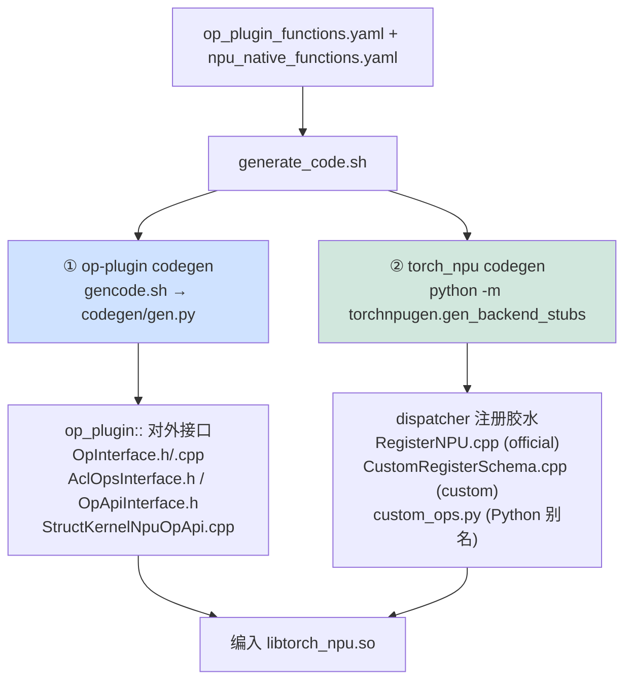
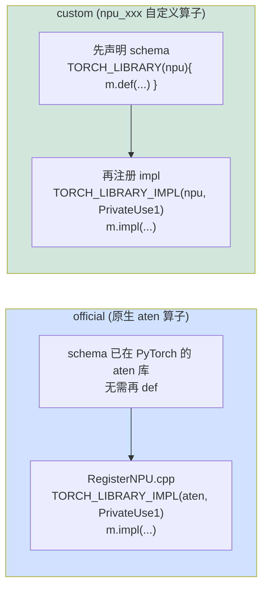
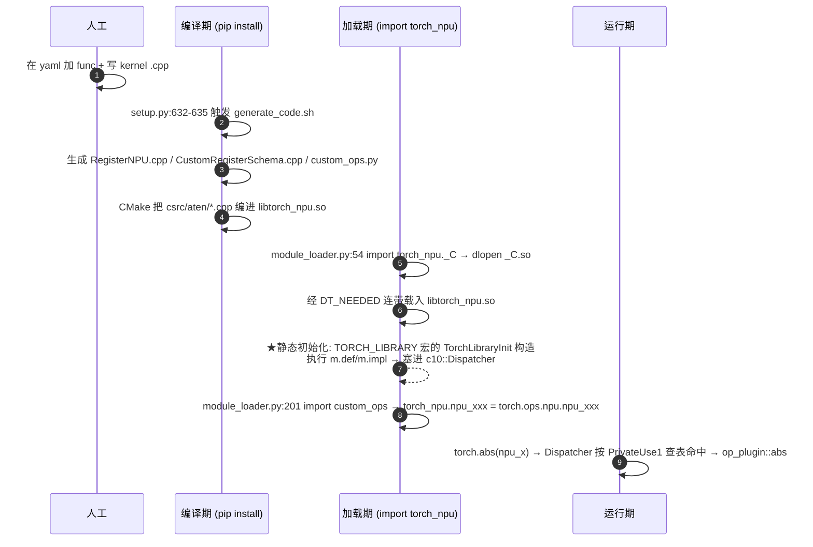
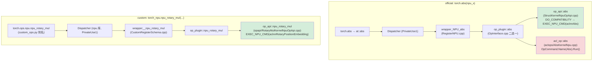

# torch_npu 算子注册链路与生效时机分析

> 一个算子从 `op_plugin_functions.yaml` 的一行声明，到能被 `torch.abs(npu_x)` 调用，中间经历两段 codegen、编进 `libtorch_npu.so`、在 `import torch_npu` 时由 C++ 静态初始化挂进 dispatcher。本页坐实这条「全自动生成胶水 + 库加载即注册」的链路，并回答**注册究竟什么时候生效**。
>
> 基于版本：`E:\97-codes\pytorch\torch_npu` 当前 checkout
> 分析日期：2026-06-12
> 说明：`RegisterNPU.cpp` / `CustomRegisterSchema.cpp` / `custom_ops.py` 是 **build 时生成**的，源码树里不存在；下文用「生成器 + 模板」作为产物形态的证据。

---

## 目录

1. [核心结论：全自动生成，没人手写注册](#1-核心结论全自动生成没人手写注册)
2. [两段 codegen 串联](#2-两段-codegen-串联)
3. [生成产物清单](#3-生成产物清单)
4. [official vs custom 的注册差异](#4-official-vs-custom-的注册差异)
5. [核心机制：TORCH_LIBRARY = 静态初始化「库加载即注册」](#5-核心机制torch_library--静态初始化库加载即注册)
6. [生效时间线：编译期 → 加载期 → 运行期](#6-生效时间线编译期--加载期--运行期)
7. [acl_op / op_api 的运行时三层选择](#7-acl_op--op_api-的运行时三层选择)
8. [两条完整调用链](#8-两条完整调用链)

---

## 1. 核心结论：全自动生成，没人手写注册

接入一个算子，人工只碰两样东西：

1. **yaml 里加一行 `func` 声明**（`op_plugin_functions.yaml`，或原生算子的 `torch_npu/csrc/aten/npu_native_functions.yaml`）
2. **写 kernel 适配 `.cpp`**（`aclops/` 或 `opapi/`；若是结构化算子连这个都自动生成，见 [[op_plugin_config_and_classification_guide]] §5）

其余全是 codegen 产物：`wrapper_NPU_xxx` 函数、`TORCH_LIBRARY` / `TORCH_LIBRARY_IMPL` 注册块、`custom_ops.py` 里的 Python 别名。**1393 个算子逐个手写注册既不现实也必漏**——这正是两段 codegen 存在的理由。

---

## 2. 两段 codegen 串联

总入口 `generate_code.sh`（被 `setup.py:632-635` 在 build 时触发，`build_mode != clean` 即跑；底层是 `setup.py:198-205` 的 `subprocess.call(["bash", generate_code.sh, ...])`）：



- **第 1 段 op-plugin codegen**（`generate_code.sh:16-20` → `gencode.sh`）：核心 `codegen/gen.py`（`parse_native_yaml` `:385-407`、`gen_return` `:252-382`）生成 `op_plugin::xxx` 的对外接口与函数体——在 acl_op/op_api 间二选一。`codegen/gen_op_plugin_functions.py:36-58` 把 yaml 的 `acl_op:`/`op_api:` 解析成 `impl_ns`，决定生成哪种分发体。
- **第 2 段 torch_npu codegen**（`generate_code.sh:28-33`）：`torchnpugen/gen_backend_stubs.py` 把 `op_plugin::xxx` 注册进 PyTorch dispatcher。

---

## 3. 生成产物清单

**op-plugin 侧**（模板在 `codegen/templates/`）：

| 产物 | 作用 |
|------|------|
| `AclOpsInterface.h` / `OpApiInterface.h` | `acl_op::` / `op_api::` 命名空间函数声明 |
| `OpInterface.h` / `OpInterface.cpp` | 对外总接口 `op_plugin::xxx` 的声明与**函数体**（acl_op/op_api 二选一，体由 `gen.py:305-324` 生成） |
| `StructKernelNpuOpApi.cpp` | 结构化算子（带 `gen_opapi`）的自动生成实现 |

**torch_npu 侧**（输出到 `torch_npu/csrc/aten/`）：

| 产物 | 作用 | 证据 |
|------|------|------|
| `RegisterNPU.cpp` | **official 算子**注册：`TORCH_LIBRARY_IMPL(aten, PrivateUse1, m)` + `m.impl("abs", TORCH_FN(wrapper_NPU_abs))` | `gen_backend_stubs.py:491-514`；`true_backend='PrivateUse1'` `:217` |
| `CustomRegisterSchema.cpp` | **custom 算子**：`TORCH_LIBRARY(npu, m){ m.def(...) }` + `TORCH_LIBRARY_IMPL(npu, PrivateUse1/AutogradPrivateUse1, m)` | 模板 `:44/:53/:62`；`custom_functions.py:240/253-254/259` |
| `custom_ops.py` | Python 别名 `torch_npu.npu_xxx = torch.ops.npu.npu_xxx` | `gen_backend_stubs.py:896-898`；`custom_functions.py:281-287` |
| `RegisterAutogradNPU.cpp` / `NPUNativeFunctions.h` 等 | 反向、native 函数声明等 | `gen_backend_stubs.py:843-861` |

`wrapper_NPU_xxx` 的函数体由 torch_npu 覆盖版 `gen_unstructured` 生成（`torchnpugen/utils.py:269`），关键在 `:446-448`：若算子在 op_plugin yaml 里，`impl_name = f"op_plugin::{...}"` → 即 wrapper 体 `return op_plugin::abs(self)`（`:545-547`）。

---

## 4. official vs custom 的注册差异



**唯一差异**：custom 算子原生 PyTorch 里没有，必须**多一步 `m.def` 声明 schema**（建出 `torch.ops.npu.*` 命名空间）；official 算子的 schema 是 PyTorch 自带的 `aten` 库已有的，所以只需 `m.impl` 提供 NPU 实现。两类的 impl wrapper 体都转调 `op_plugin::xxx`。

---

## 5. 核心机制：TORCH_LIBRARY = 静态初始化「库加载即注册」

回答「注册什么时候生效」的关键，在于这两个宏**展开后不是一次函数调用，而是定义一个 static 全局对象**（PyTorch 头文件 `torch/library.h:980-989` 的 `TORCH_LIBRARY`、`:1062-1082` 的 `TORCH_LIBRARY_IMPL`）：

```cpp
// TORCH_LIBRARY(ns, m) 展开后（简化）
static const torch::detail::TorchLibraryInit
    TORCH_LIBRARY_static_init_##ns(torch::Library::DEF, &init_fn, #ns, ...);
void init_fn(torch::Library& m)   // 后面跟 { m.def(...); m.impl(...); } 块
```

注册真正发生在 `TorchLibraryInit` 的**构造函数**里（`library.h:940-949`）：

```cpp
TorchLibraryInit(Kind kind, InitFn* fn, ...) : lib_(kind, ns, k, ...) {
    fn(lib_);   // ← 立即执行 init 函数体里的 m.def / m.impl
}
```

因为这些是**静态存储期对象**，其构造函数在 `.so` 被 `dlopen` 的「动态初始化」阶段**自动执行**——于是 schema 和 kernel 在库加载的一瞬被塞进全局 `c10::Dispatcher`。**没有任何人显式调用「注册函数」，是 `.so` 一加载就自动跑。**

> 设备后端注册同理：`torch_npu/csrc/core/npu/impl/NPUGuardImpl.cpp:280-292` 的 `REGISTER_PRIVATEUSE1_BACKEND(npu)` 末尾也是 `static const int _temp = rename_privateuse1_backend();`，load 期静态初始化里调 `c10::register_privateuse1_backend("npu")`，把 "npu" 设备绑成 `PrivateUse1` key。

---

## 6. 生效时间线：编译期 → 加载期 → 运行期



- **编译期**：`setup.py:632-635` 在模块顶层就触发 codegen（早于 CMake）。生成的 `csrc/aten/*.cpp` 经 `torch_npu/csrc/aten/CMakeLists.txt:1-6`（`FILE(GLOB ... *.cpp)`）→ 顶层 `CMakeLists.txt:311/314`（`add_library(torch_npu SHARED ...)`）编进 **`torch_npu/lib/libtorch_npu.so`**。
  - ⚠️ **不是** `_C.so`：Python C 扩展 `torch_npu._C` 只编 `InitNpuBindings.cpp` 一个文件（`setup.py:724-735`），靠 `libraries=["torch_npu"]` + rpath `$ORIGIN/lib` **链接** `libtorch_npu.so`。`_C.so` 只是个薄壳。
- **加载期**：`import torch_npu`（`torch_npu/__init__.py:63` → `module_loader.py:168` → `:54 import torch_npu._C`）触发 `dlopen _C.so`，动态链接器经 DT_NEEDED 连带载入 `libtorch_npu.so` → 触发上面 §5 的静态初始化完成注册。紧接着 `module_loader.py:200` 加载 op-plugin meta、`:201` 执行 custom_ops 别名（此时 schema 已注册好，`:54` 早于 `:201`，顺序天然安全）。
- **运行期**：纯查表命中，不再做任何注册。

> 一句话：**注册在 `import torch_npu` 那一刻、由 `libtorch_npu.so` 的 C++ 静态初始化自动完成；之后所有调用只是按 dispatch key 查表命中。**

---

## 7. acl_op / op_api 的运行时三层选择

一个 both 算子（同时有 `acl_op:` 和 `op_api:`）在运行时怎么二选一？共三层：

| 层 | 时机 | 机制 |
|----|------|------|
| ① | 编译期 | yaml 的 `acl_op:`/`op_api:` 版本字段决定本版本生成哪条路径（`gen_op_plugin_functions.py:36-58` 的 `impl_ns`） |
| ② | 运行期（`op_plugin::xxx` 体内，`OpInterface.cpp`） | `if (CheckJitDisable() && 全是 base format) return op_api::xxx; else return acl_op::xxx;`——默认 eager + 连续格式走 aclnn，jit 编译模式/内部私有格式走 aclop（`gen.py:305-324`） |
| ③ | 运行期（`DO_COMPATIBILITY` 宏兜底） | `op_api_common.h:1073-1087`：用 `dlsym`（`GetOpApiFuncAddr` `:91`）在 CANN `libopapi.so` 里查 `aclnnXxx` / `aclnnXxxGetWorkspaceSize` 两个符号，**查不到就 `return acl_op::xxx(...)` 回退**，查到才 `EXEC_NPU_CMD` 异步下发 |

这第 ② 层的「私有格式 → 回落 aclop」，正是 aclgraph 入图时 aclnn-only 铁律的来源（见 [[npu_operator_graph_eligibility_guide]] §6）。

---

## 8. 两条完整调用链



两条链的差异只在入口：official 走 `aten` 库 + `wrapper_NPU_*`；custom 走 `npu` 库 + `wrapper__npu_*` + Python 别名。汇合到 `op_plugin::` 后逻辑一致。

---

## Related Pages

- [[op_plugin_config_and_classification_guide]] —— 本页注册的算子，其 yaml 配置（official/custom、acl_op/op_api、gen_opapi）如何决定生成哪种胶水
- [[npu_operator_graph_eligibility_guide]] —— 注册进 dispatcher 只是 eager 可用；要「入图」还要过 dynamo/inductor/aclgraph 三关
- [[02_compile_stack/01_dynamo/index]] —— dispatcher 与 PrivateUse1 key 在 torch.compile 下的角色
- [[01_npu_compile_paths_overview]] —— torch_npu torch.compile 三条后端路径全景
