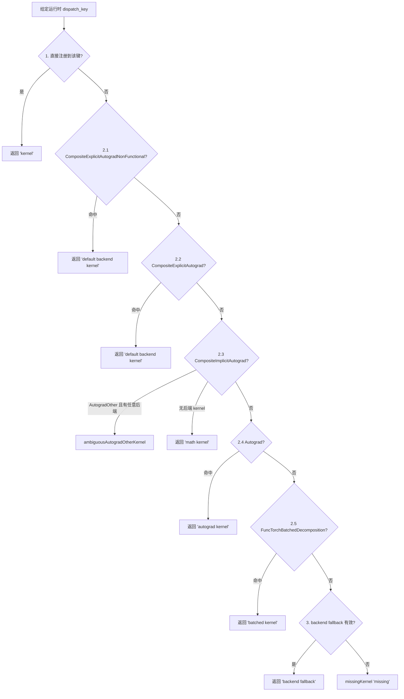

> 层次:deep dive
> 核验基准:PyTorch upstream `E:\97-codes\pytorch\pytorch`(v2.13.0a0, commit 9922478)
> 最后更新:2026-06-15

# ATen 算子的代码生成与结构化内核源码深析

本页是模块「ATen 算子定义与执行」的深潜页,面向已读过 [[01_eager_runtime/04_aten_op_execution/index]] 端到端生命周期、想看到源码级机理的读者。我们沿着**声明期(torchgen 解析 + 不变式)→ emit 期(注册样板与结构化签名)→ 运行期(Dispatcher 计算分发表 + boxing/unboxing 调用)** 三段,逐机制回答「做什么 / 为什么这么设计 / 怎么实现」,并对每个论断给出 `相对路径:行号`(相对 `E:\97-codes\pytorch\pytorch` 根)。

声明式入口与最小用法在 [[01_adding_an_aten_operator_guide]];运行时分发器的整体路由在 [[01_eager_runtime/02_dispatcher_and_device/index]] 与 [[10_pytorch_dispatcher_analysis]];本页只聚焦「算子如何被定义、如何被翻译成 kernel 表条目、运行时如何被选中」这条主线。

---

## 1. torchgen AST:NativeFunction / NativeFunctionsGroup 不变式

### 1.1 数据模型为何不可变

torchgen 的核心设计哲学是「以 JIT schema 字符串为唯一中心、构造期一次性填充、之后冻结」(`torchgen/model.py:18-40`)。`NativeFunction` 用 `@dataclass(frozen=True)` 声明(`torchgen/model.py:506-507`),所有字段在 `from_yaml`(`torchgen/model.py:624-630`)里一次填好,后续代码只读不改。这样做的好处是:每个 emit 阶段(注册文件、Python binding、autograd 派生)看到的都是同一份规范化 AST,不会出现「读成 C++ 类型再回译」的漂移。

`NativeFunction` 的关键字段(`torchgen/model.py:507-617`):

- `func: FunctionSchema`(519)—— 解析后的 schema,而非原始字符串;
- `variants: set[Variant]`(539)、`manual_kernel_registration`(544)、`manual_cpp_binding`(550)—— 控制生成什么;
- `autogen: list[OperatorName]`(562)—— 注意注释明确「这个列表**不直接驱动**生成,生成完全由 schema 推断,autogen 只用来**错误校验**」(556-561);
- `structured` / `structured_delegate` / `structured_inherits` / `precomputed`(575、579、585、593)—— 结构化内核四要素,详见 §5;
- 四个 `has_composite_*_kernel` 布尔(610-613)—— 缓存「该算子是否带某类 composite kernel」,供 emit 与不变式判断使用。

### 1.2 SchemaKind 与四变体分组

一个算子按 schema 形态分成五类(`torchgen/model.py:1179-1184`):`functional / inplace / out / mutable / scratch`。`NativeFunctionsGroup`(`torchgen/model.py:1193-1198`)把同一逻辑算子的 `functional / inplace? / mutable? / out` 四个 `NativeFunction` 聚到一起,`structured` 属性直接取 `self.out.structured`(`torchgen/model.py:1200-1203`)—— 即「全组是否结构化」由 out 变体单独决定。

`__post_init__`(`torchgen/model.py:1205-1298`)是整套声明期不变式的执行点,几条硬约束值得记住:

- 同组所有变体的 `signature()` 必须一致(`torchgen/model.py:1206-1212`),否则它们不是同一算子;
- `functional.func.kind()` 必须是 `functional`、`out.func.kind()` 必须是 `out`(`torchgen/model.py:1219-1226`);
- 结构化组里禁止 composite kernel(`torchgen/model.py:1256-1263`「structured composite kernels are not supported」),且 `functional.structured_delegate` 必须精确等于 `out.func.name`(`torchgen/model.py:1265-1269`),inplace 同理(1270-1275);
- autogen 校验:实际带 `generated` tag 的变体集合必须与各变体 `autogen` 字段声明的集合**逐字相等**,否则报错并提示补写 `autogen:` 行(`torchgen/model.py:1277-1298`)。

分组的构造逻辑在 `from_dict`(`torchgen/model.py:1315-1340`):只有一个变体 → 返回 `None`(不成组);缺 out 变体 → 也返回 `None`(`torchgen/model.py:1332-1333`),即「只有 functional/inplace 的算子不算结构化组」。这解释了为什么结构化内核**必有 functional + out**(inplace 可选)。

---

## 2. DispatchKey:运行时键 vs alias 键

### 2.1 两套定义必须同步

DispatchKey 在 C++(`c10/core/DispatchKey.h:136`,`enum class DispatchKey : uint16_t`)和 Python(`torchgen/model.py:100-247`)各有一份,二者必须手工保持同步(枚举末尾 `# END autogenerated` 注释,`torchgen/model.py:247`)。Python 侧的后端组合键(`AutogradCPU`、`SparseCUDA` 等)由 `codegen_per_backend_entries` 跨 `FUNCTIONALITY_KEYS × BACKEND_COMPONENTS` 动态补齐(`torchgen/model.py:269-279`),与 C++ 的 `DEFINE_PER_BACKEND_KEYS` 宏对应。

`DispatchKey.parse`(`torchgen/model.py:255-260`)做字符串 → 枚举的反查,是 `native_functions.yaml` 里 `dispatch:` 段每个键名的入口。

### 2.2 运行时键 vs alias 键的语义边界

C++ 头文件把 alias 键的语义讲得最清楚(`c10/core/DispatchKey.h:430-440`,Note [Alias Dispatch Keys]):

> alias dispatch keys 是**合成键**,映射到多个运行时键;alias 键有优先级,但**永远低于运行时键**。可以把 kernel 注册到 alias 键,在「分发表计算」时它会被铺到对应的运行时键上。

alias 键的正文枚举在 `c10/core/DispatchKey.h:443-461`:`Autograd`、`CompositeImplicitAutograd`、`FuncTorchBatchedDecomposition`、`CompositeImplicitAutogradNestedTensor`、`CompositeExplicitAutograd`、`CompositeExplicitAutogradNonFunctional`,并用 `StartOfAliasKeys = Autograd` / `EndOfAliasKeys = CompositeExplicitAutogradNonFunctional` 圈定区间(`c10/core/DispatchKey.h:465-466`)。判定函数 `isAliasDispatchKey`(`c10/core/DispatchKey.h:512-514`)就是「落在 Start..End 之间」。注意 471-477 是一批**向后兼容别名**(`DefaultBackend = CompositeExplicitAutograd`、`Autocast = AutocastCUDA` 等),不应在新代码里使用。

「per-backend functionality 键」是另一个维度(`c10/core/DispatchKey.h:528-537`):`Dense`/`Sparse`/`SparseCsr`/`Quantized`/`NestedTensor`/`AutogradFunctionality` 在 `DispatchKeySet` 里只占一个 bit,却在运行时 operator 表里展开成「# backends」个槽位(`SparseCPU`、`SparseCUDA`…)。这是 PyTorch 用 64-bit bitset 表达上百个运行时键的压缩技巧。

Python 侧还有几张关键键集供 codegen 使用(`torchgen/model.py:286-329`):`STRUCTURED_DISPATCH_KEYS`(286-292,目前 CPU/CUDA/MPS/XPU/MTIA)、`UFUNC_DISPATCH_KEYS`(293,仅 CPU/CUDA)、以及全量 `dispatch_keys` 列表(296-329,含「Meta 是为结构化内核自动生成的魔法键」注释 320-322)。分类谓词在 `torchgen/model.py:334-375`:`is_generic_dispatch_key`(334,四个 composite 键)、`is_structured_dispatch_key`(369)、`is_ufunc_dispatch_key`(373)。

---

## 3. 分发表计算:优先级 + alias 展开(本页核心)

运行期每个算子持有一张「运行时键 → kernel」的分发表,它由 `OperatorEntry::computeDispatchTableEntryWithDebug` 计算(`aten/src/ATen/core/dispatch/OperatorEntry.cpp:352-471`)。整段 Note [DispatchTable computation](`OperatorEntry.cpp:353-385`)定义了如下确定性优先级:



逐条对应实现:

- **(1) 直接注册**:`getKernelForDispatchKey(dispatch_key)` 命中即返回(`OperatorEntry.cpp:387-390`)。这是「运行时键永远压过 alias 键」的落点。
- **(2.1 / 2.2)** CompositeExplicitAutogradNonFunctional 与 CompositeExplicitAutograd:对 `Undefined` 或被该 alias 覆盖的键生效(`OperatorEntry.cpp:392-406`)。`isIncludedInAlias` 判断目标运行时键是否在该 alias 的展开集合内。
- **(2.3)** CompositeImplicitAutograd(`OperatorEntry.cpp:415-443`):先用 `has_backend_kernel`(410-413)判断「该 autograd 键对应的后端是否已有直接注册或有 CEA kernel」。两个特例:① NestedTensor 的 composite 走单独分支(428-432);② **AutogradOther 若任意后端有 kernel,直接返回 `ambiguousAutogradOtherKernel()`**(436-438)—— 这是设计上故意制造的歧义错误,原因见 §11。否则在「无后端 kernel」时才用 math kernel(439-441)。
- **(2.4 / 2.5)** Autograd 与 FuncTorchBatchedDecomposition(`OperatorEntry.cpp:445-458`)。
- **(3) backend fallback**:从 `dispatcher.backendFallbackKernels_` 取(`OperatorEntry.cpp:460-467`);
- **(4)** 都没有则 `missingKernel()`(`OperatorEntry.cpp:469-470`)。

alias 优先级链被注释成一行(`OperatorEntry.cpp:379-380`):
`CompositeExplicitAutogradNonFunctional > CompositeExplicitAutograd > CompositeImplicitAutograd > Autograd`。
还有一条隐含不变式(`OperatorEntry.cpp:375-377`):(2.2) 的正确性依赖「同一后端的 autograd 键一定在 backend 键**之后**被计算」,见 Note [Refresh Runtime Autograd entries in dispatchTable_]。

---

## 4. CompositeImplicit / Explicit 语义与合规

`native_functions.yaml` 若**省略** `dispatch:` 段,等价于把 kernel 注册到 `CompositeImplicitAutograd`(`aten/src/ATen/native/README.md:291-306`)。三个「generic 后端」的语义边界(`README.md:315-346`):

- **CompositeExplicitAutograd**(旧名 DefaultBackend):对所有后端做推理,但需在 `derivatives.yaml` 写反向;底层等价于注册到每个后端(`README.md:315-324`)。注意「调用 DispatchStub 的 kernel 不能注册成 CEA,因为 DispatchStub 只支持 CPU/CUDA」。
- **CompositeExplicitAutogradNonFunctional**:用于「非别名算子但内部调用别名算子」的分解(如 `select_backward` 分解为 `select`),让 LazyTensor/XLA 这类函数式后端可以选择不走该分解(`README.md:326-336`)。
- **CompositeImplicitAutograd**(旧名 Math):对所有后端工作且**隐式可微**——因为它只调用本身可微的算子,autograd 自动用链式法则推出反向(`README.md:338-365` 的 `my_op = self + 2*other` 例子)。

选键三步法(`README.md:367-380`):能复用现有算子就先 CompositeImplicitAutograd;不想要自动推导的反向(性能/数值)就 CompositeExplicitAutograd;要逐后端就用 `CPU/CUDA` 等保留键。**关键合规要求**(`README.md:377-380`):给原本无 `dispatch:` 段的算子新增某后端 kernel 时,**必须**补一条 `CompositeImplicitAutograd:` 指回旧实现,否则其它后端会丢失实现。

**Composite Compliance**(`README.md:385-416`):composite 函数必须对绝大多数后端/子类工作,因此禁止 `resize_`、`out=` 操作、不经分发器直接改 Tensor 元数据、`data_ptr`/`item` 访问等(`README.md:400-412`);合规测试在 `test/test_ops.py`(`README.md:414`)。

---

## 5. 结构化内核:meta / impl 翻译 + TensorIteratorBase + precomputed

结构化内核把「形状/dtype 推断(meta)」与「真实计算(impl)」彻底分离。`torchgen/api/structured.py` 描述了 JIT schema → 结构化函数 API 的翻译(文件头注释 `structured.py:36-38`)。

**为什么结构化 kernel 从不 return**:`structured.py:91-94` 明确——「returns_type 被故意省略,因为结构化内核从不返回;meta 通过 `set_output` 报告输出,impl 直接写入提供的 out 参数」。这统一了 out/functional/inplace 三变体的内存管理:三者共用同一份 impl,只是 out 张量的来源不同。

**meta 与 impl 的参数集如何构造**(`structured.py:116-149`):

- `meta_arguments(g)`(`structured.py:146-149`)只取 `g.functional.func.arguments.non_out` —— meta 不碰 out 参数,因为它的任务就是「算出 out 该多大」。
- `impl_arguments(g)`(`structured.py:116-143`)取 `g.out` 的非 out 参数 + out 参数;若声明了 `precomputed`,则把 `precomputed.replace` 命中的参数替换成预计算元素(126-135),再追加 `precomputed.add`(136-138)。

结构化算子的类型翻译有一个硬约束:**结构化 kernel 永远关闭 symint**(`structured.py:46-51`,「they involve actual kernels that require real ints」),唯一例外是 CompositeExplicitAutograd 与 meta 函数,但这两者计划在 Python 侧处理。`Tensor` → `const Tensor&`、`Scalar` → `const Scalar&`、`Tensor?` → `optionalTensorRefT`(`structured.py:55-70`)。

以 `add` 三件套为实例(`aten/src/ATen/native/native_functions.yaml:536-575`):

```yaml
- func: add.Tensor(Tensor self, Tensor other, *, Scalar alpha=1) -> Tensor   # :536
  structured_delegate: add.out                                                # :538
- func: add_.Tensor(Tensor(a!) self, Tensor other, *, Scalar alpha=1) -> Tensor(a!)  # :548
  structured_delegate: add.out                                                # :551
- func: add.out(Tensor self, Tensor other, *, Scalar alpha=1, Tensor(a!) out) -> Tensor(a!)  # :559
  structured: True                                                            # :561
  structured_inherits: TensorIteratorBase                                     # :562
  ufunc_inner_loop:                                                           # :563
    Generic: add (AllAndComplex, BFloat16, Half, ComplexHalf)                 # :564
```

只有 `add.out` 带 `structured: True`,functional/inplace 用 `structured_delegate: add.out` 委托过去——这正对应 §1.2 的不变式 `functional.structured_delegate == out.func.name`(`torchgen/model.py:1265-1269`)。`structured_inherits: TensorIteratorBase` 让 meta 类继承 `TensorIteratorBase`,复用其广播/类型提升机制;该字段语义见 `torchgen/model.py:581-585`(「会改变 `set_output` 调用父类的语义」)。

**precomputed 机制**:meta 算出的若干值打包成一个 struct,在调 impl 时**顶替**部分 kernel 参数。字段语义见 `torchgen/model.py:587-593`;解析在 `Precompute` 类(`torchgen/model.py:3022-3094`):`replace` 是「kernel 参数名 → 替换它的预计算元素列表」的映射,`add` 是「无替换、纯追加」的列表(`torchgen/model.py:3023-3028`)。解析格式 `{param} -> {decl}[, ...]`(3035-3066),并禁止预计算名全大写以免与模板参数冲突(3073-3086)。典型例子是卷积/池化的 meta 先算出输出 H/W,再把这些值传给 impl 顶替原始 stride/padding 推导。

---

## 6. BackendIndex / BackendMetadata:逐后端特化

同一个 `NativeFunction` 在不同后端可以有不同的 kernel 名、是否结构化、命名空间。这些「逐后端、逐算子」的信息不放进 `NativeFunction`,而是放进 `BackendIndex`(`torchgen/model.py:1400-1413`,注释 1393-1399 解释「因为这些信息天然就不属于 NativeFunction」)。

- `BackendMetadata`(`torchgen/model.py:1343-1363`):`kernel`(kernel 名,直接来自 `dispatch:` 段)、`structured`(该后端是否结构化——外部后端如 XLA 可独立切换)、`cpp_namespace`。`supports_symint()` 简单地看 kernel 名是否含 `_symint`(`torchgen/model.py:1362-1363`)。
- `BackendIndex.primary(g)`(`torchgen/model.py:1428-1432`):**in-tree 后端用 `g.out` 作 primary,外部后端(XLA)用 `g.functional`**——`use_out_as_primary` 字段(1403-1405)控制。这就是「为什么 XLA 以 functional 变体为主、其余由它派生」。
- `get_kernel`(`torchgen/model.py:1438-1449`)按 primary 变体在 `index` 里查 metadata;`native_function_class_name`(1451-1458)只为外部后端生成 `XLANativeFunctions` 这样的类名(in-tree 直接用自由函数)。

`UfuncInnerLoop`(`torchgen/model.py:1366-1390`)解析 `ufunc_inner_loop:` 段(如上 add 例子),把「内层循环函数名 + 支持的 dtype 集 + ufunc_key」打包,供 ufunc codegen 在 CPU/CUDA(`UFUNC_DISPATCH_KEYS`,`torchgen/model.py:293`)生成向量化内核。

---

## 7. Dispatcher / OperatorEntry:运行时 kernel 表

运行时核心是全局单例 `Dispatcher`(`aten/src/ATen/core/dispatch/Dispatcher.h:71`,`singleton()` 内联以省函数调用开销,`Dispatcher.h:104-132`)。每个算子有一个 `OperatorDef`,内含 `OperatorEntry op`(`Dispatcher.h:76-93`),并用 `def_count` / `def_and_impl_count` 分别记 schema 注册数与「def+impl」总数。

`OperatorEntry`(`aten/src/ATen/core/dispatch/OperatorEntry.h:70`)是「不属于公开 API 的逐算子内部结构」,并发写由**全局 Dispatcher 锁**保护(`OperatorEntry.h:63-69`)。它存:

- per-key 的 `AnnotatedKernel` 列表 + 计算出的分发表。`AnnotatedKernel`(`OperatorEntry.h:37-52`)在 `KernelFunction` 之外多带 `inferred_function_schema` 与 `debug` 字符串——后者「最重要的是记录哪个 `TORCH_LIBRARY` 块做了注册」(`OperatorEntry.h:48-51`),报错时极有用;但这些元信息**不进**实际分发表(`OperatorEntry.h:32-36`)。
- kernel 容器在 `C10_DISPATCHER_ONE_KERNEL_PER_DISPATCH_KEY` 下是 `std::array<…,1>`,否则是 `std::list`(`OperatorEntry.h:117-121`)。
- `registerKernel`(`OperatorEntry.h:137-143`)在持 Dispatcher 锁的前提下登记 kernel 并刷新分发表。

**kernel 与 fallback 的所有权为何不对称**(`OperatorEntry.h:124-133`):kernel 及其计算出的分发表归 `OperatorEntry` 拥有;但 backend fallback「一次指定、对所有算子生效」,归 `Dispatcher` 拥有。fallback 状态变化时需更新各算子表,因此 `OperatorEntry` 只提供非拥有式的 `updateFallback`(`OperatorEntry.h:151-152`)。

**注册监听器只在 def 触发**(`Dispatcher.h:50-58`,`OpRegistrationListener`):「registration events 只在 `def` 发生时触发,不在 `impl` 或 `fallback` 时触发」。这把 schema 注册(`def`)与 kernel 注册(`impl`)在语义上解耦。

---

## 8. TORCH_LIBRARY vs 手工注册

注册有两条路。**声明式**:`native_functions.yaml` 经 torchgen 生成 `build/aten/src/ATen/RegisterCPU.cpp`、`RegisterCompositeImplicitAutograd.cpp` 等文件,内部对每个算子发 `m.def(schema)` 与 `m.impl(name, kernel)`。底层落到 `Dispatcher::registerDef`(`Dispatcher.h:244-247`,同名 schema 重复 def 会校验完全一致)与 `Dispatcher::registerImpl`(`Dispatcher.h:258-264`,`dispatch_key` 为 `nullopt` 时即注册 fallback)。`TORCH_LIBRARY` 前端宏最终落到 `registerLibrary`(`Dispatcher.h:299-304`,每个 namespace 每个程序只许一次)。backend fallback 由 `registerFallback`(`Dispatcher.h:288-297`)注册。

**手工注册**:`manual_kernel_registration: True`(`README.md:452-464`)让 codegen **不**自动把实现注册到 catchAll 键,开发者自行在 `torch/csrc/autograd/VariableTypeManual.cpp` 注册;该 flag 不应与 `dispatch:` 段同时出现,且应「极少使用」。对应 AST 字段是 `NativeFunction.manual_kernel_registration`(`torchgen/model.py:541-544`),注释提醒「手工注册不参与 codegen 的选择性构建(selective build)」。

---

## 9. boxing / unboxing:KernelFunction 与 BoxedKernel

`KernelFunction`(`aten/src/ATen/core/boxing/KernelFunction.h:83-90`)「类似 `std::function`,可由 boxed 或 unboxed 函数/functor/lambda 构造,且可被 boxed/unboxed 任意方式调用;若构造方式与调用方式不匹配,会按需自动装箱/拆箱」。两个调用入口:

- `callBoxed(opHandle, dispatchKeySet, Stack*)`(`KernelFunction.h:130-133`):走 `Stack*`(即 `std::vector<IValue>`)的统一接口,dispatcher 内部、Python 回退、TorchScript 都用它;
- `template<Return, Args...> call(...)`(`KernelFunction.h:154-158`):unboxed 直调,热路径用以省去打包开销。

为支持「fast path 不碰 boxed kernel」,提供了 `isValidUnboxed()` / `isValidSymUnboxed()` / `isValid()` / `isFallthrough()`(`KernelFunction.h:105-110`)。dispatcher API 的「unboxed 调用约定」与这套模板机器紧耦合(`torchgen/api/dispatcher.py:24-31`),其类型翻译默认 `symint=True`(`dispatcher.py:44-51`),`jit_arguments` 还会把 `TensorOptionsArguments` 摊平成 `dtype/layout/device/pin_memory` 四个独立参数(`dispatcher.py:86-106`),这正是注释里说的 dispatcher API 特征(`dispatcher.py:33-37`)。

**SymInt 的透明处理**靠模板族 `remove_symint` / `maybe_keep_symint` / `fn_remove_symint`(`KernelFunction.h:32-81`):`c10::SymInt` → `int64_t`、`SymIntArrayRef` → `IntArrayRef` 等(33-55),让同一 kernel 既能以 symint 也能以 concrete int 形态被调用。

**fallthrough**:`fallthrough_kernel`(`aten/src/ATen/core/boxing/BoxedKernel.h:15-24`)实现「落穿到下一个可用键」,注释强调「实现是 FAST 的,落穿零开销,且**不走** boxing/unboxing 代码路径」。这是诸如 `Autocast`、`ADInplaceOrView` 等「透明层」键的常用注册方式。

---

## 10. autogen:functional ↔ inplace ↔ out 变体自动生成

functionalization 依赖「每个算子有完整的变体集合」,因此缺失变体由 codegen 补齐(`README.md:478-498`):

- in-place 变体(名字以 `_` 结尾)→ 生成 functional + out=(`README.md:488-489`);
- functional 变体 → 生成 out=(`README.md:490`);
- view 算子、绕过分发器的算子、composite 算子**不支持** autogen(`README.md:491`)。

生成的 kernel 只是「拷贝并返回基算子的结果」,落在 `<gen-out>/aten/src/ATen/CompositeViewCopyKernels.cpp`(`README.md:493-494`)。最关键的强约束:**新算子若满足条件就必须写 `autogen:`,否则 codegen 报错**(`README.md:496-498`),校验点正是 §1.2 提到的 `NativeFunctionsGroup.__post_init__`(`torchgen/model.py:1287-1298`)——它把「实际生成的」与「autogen 声明的」逐字比对。

---

## 11. 变异标注 Tensor(a!) 与 functionalization 钩子

annotation 是 functionalization 与别名分析的输入信号(`README.md:227-272`):

- `Tensor(a)`:与同标注的张量**可能**共享内存(别名集);
- `Tensor(a!)`:在别名基础上**可能被写**(`README.md:242-244`);out/inplace **必须**用 `(a!)`(`README.md:248-257`,且 inplace 按约定以单个 `_` 结尾);
- `Tensor(a)`(无 `!`)用于 view,如 `transpose(Tensor(a) self,…) -> Tensor(a)`(`README.md:259-261`);
- `Tensor(a -> *)`:进入通配集,用于 list 中的 view(`README.md:263-267`,如 `chunk`)。

解析在 `Annotation.parse`(`torchgen/model.py:1923-1968`),正则 `^([a-z])(\|[a-z])*(!?)( -> (\*|[a-z](\|[a-z])*))?$`(`torchgen/model.py:1947`),并强制两条不变式:**可写别名集大小不能 > 1**(`torchgen/model.py:1954-1957`「alias set larger than 1 is not mutable」),前/后别名集不能同时 > 1(1959-1962)。codegen 据此分出哪些参数会被写,从而正确去别名/去变异。

`Annotation` 与 `KernelFunction` 协同的产物之一是 §3 末尾的 **AutogradOther 歧义错误**(Note [Ambiguity in AutogradOther kernel],`BoxedKernel.h:26-62`):对有专属 Autograd 键的后端(如 `AutogradCPU`),分发表能根据「CPU 后端 kernel 是否存在」决定用 Autograd kernel 还是 CompositeImplicitAutograd(`BoxedKernel.h:35-55`);但 `AutogradOther` 是「所有无专属 Autograd 键后端」的兜底,无法 peek 到唯一后端来消歧,于是干脆注册一个**报错 kernel**,逼后端开发者去申请专属 Autograd 键(`BoxedKernel.h:57-62` 续,与 `OperatorEntry.cpp:436-438` 的 `ambiguousAutogradOtherKernel()` 呼应)。

**验证分发表**:用 `torch/_python_dispatcher.py` 的 `PythonDispatcher`(`README.md:599-607`)可打印某算子在各后端实际选中的 kernel。解析期还有一条硬规则(`README.md:611-615`):同一算子不要同时给多个 alias 键;alias 优先级 `CompositeExplicitAutograd > CompositeImplicitAutograd`,同时给二者会让 CompositeImplicitAutograd 被**完全忽略**,因此 `native_functions.yaml` 解析时直接报错。

---

## 12. 串起来:一次声明到一次调用

```mermaid
sequenceDiagram
    participant Y as native_functions.yaml
    participant G as torchgen (model.py / api/*)
    participant E as build/.../Register*.cpp
    participant D as Dispatcher / OperatorEntry
    participant R as 运行时调用

    Y->>G: from_yaml 解析 → NativeFunction
    G->>G: 分组 NativeFunctionsGroup + __post_init__ 不变式
    G->>G: structured.py 生成 meta/impl 签名;dispatcher.py 生成 unboxed 约定
    G->>E: emit m.def(schema) + m.impl(key, kernel)
    E->>D: registerDef / registerImpl(持锁刷新分发表)
    R->>D: at::add(...) 经 DispatchKeySet 取最高优先键
    D->>D: computeDispatchTableEntryWithDebug 选 kernel
    D->>R: KernelFunction.call / callBoxed 执行
```

声明期的不变式(§1、§5)保证 emit 出的注册条目自洽;运行期的优先级链(§3)保证「直接后端 > CEA-NonFunctional > CEA > CIA > Autograd > fallback」的确定语义;两端之间由 `BackendIndex`(§6)承载逐后端差异,由 `KernelFunction`(§9)承载 boxing 透明性。NPU 等外部后端如何把自己的 kernel 接进这套机制(注册到 `PrivateUse1`/自定义 Autograd 键、走 fallback 还是逐算子覆盖),见 [[01_eager_runtime/03_op_registration/index]]。

---

## 社区参考

- Edward Z. Yang,**《Let's talk about the PyTorch dispatcher》** — http://blog.ezyang.com/2020/09/lets-talk-about-the-pytorch-dispatcher/(分发表、alias key、boxing 的权威讲解)
- 仓库内一手文档,**aten/src/ATen/native/README.md**(native_functions.yaml 字段与结构化 kernel 约定)
- PyTorch 官方教程,**Registering a Dispatched Operator in C++** — https://pytorch.org/tutorials/advanced/dispatcher.html
- PyTorch 官方教程,**Extending dispatcher for a new backend in C++** — https://pytorch.org/tutorials/advanced/extend_dispatcher.html

## Related Pages

- [[01_eager_runtime/04_aten_op_execution/index]] —— 本模块 overview:ATen 算子端到端生命周期与全景图
- [[01_adding_an_aten_operator_guide]] —— 本模块 quickstart:如何声明/查表/验证一个 ATen 算子
- [[01_eager_runtime/02_dispatcher_and_device/index]] —— 分发器与设备路由总览
- [[10_pytorch_dispatcher_analysis]] —— DispatchKeySet 与运行时路由深析
- [[01_eager_runtime/03_op_registration/index]] —— 算子注册(含外部后端 / NPU 特化)
- [[01_eager_runtime/01_tensor_and_storage/index]] —— Tensor/Storage 内部表示(结构化内核写入的对象)
- [[02_compile_stack/02_aot_autograd/index]] —— functionalization 与 AOTAutograd 如何消费变体/变异标注
