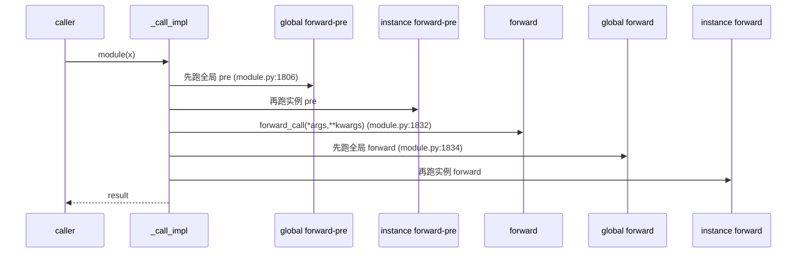
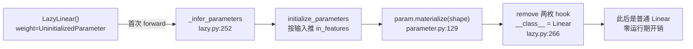
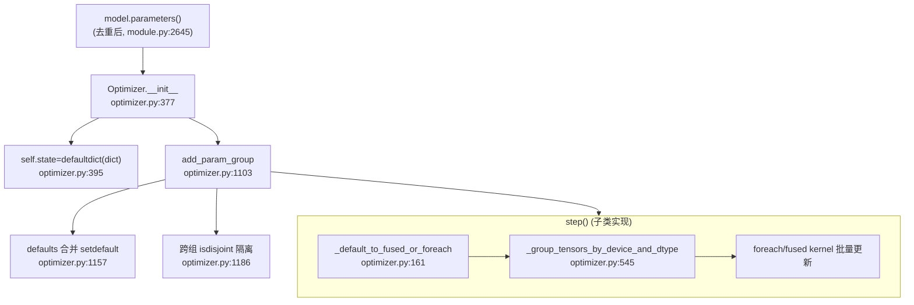

# NN · Module 与 Optimizer 源码级机制深析

> 层次:deep dive(深)
> 核验基准:PyTorch upstream `E:\97-codes\pytorch\pytorch`(v2.13.0a0, commit 9922478)
> 最后更新:2026-06-15

---

本页是 [[02_engineering/01_pytorch/01_eager_runtime/06_nn_module_system/index|torch.nn 模块体系]] 概念全景与 [[01_nn_module_quickstart]] 用法之后的源码层。聚焦 7 个锚点最密集的核心机制:`__setattr__` 注册分派、`_apply` 变换流水线、hook 执行编排、`train()` 递归、Lazy 物化、Parameter/Buffer 元类、Optimizer 深水区,以及 `nn.functional` 的无状态解耦。所有 `路径:行号` 均相对 `E:\97-codes\pytorch\pytorch` 根,落笔前逐一打开核实。

---

## 1. `__setattr__` 三路分派:注册「魔法」的入口

`nn.Module` 把网络状态分成三张实例字典 `_parameters / _buffers / _modules`(在 `__init__` 中用 `super().__setattr__` 直接建表以绕开自身 `__setattr__`,见 `torch/nn/modules/module.py:505`)。用户从不手动维护这三张表——`self.x = value` 时由 `Module.__setattr__`(`torch/nn/modules/module.py:1971`)按 `value` 的类型分流。

核心逻辑是一条**自上而下、先夺后立**的判定链(`module.py:1980` 起):

```python
# torch/nn/modules/module.py:1980
params = self.__dict__.get("_parameters")
if isinstance(value, Parameter):                 # ① Parameter → _parameters
    if params is None:
        raise AttributeError("cannot assign parameters before Module.__init__() call")
    remove_from(self.__dict__, self._buffers, self._modules,
                self._non_persistent_buffers_set)
    self.register_parameter(name, value)
elif params is not None and name in params:      # ② 同名 param 位重新赋值(只接受 None)
    ...
    self.register_parameter(name, value)
else:
    modules = self.__dict__.get("_modules")
    if isinstance(value, Module):                # ③ Module → _modules
        remove_from(...); modules[name] = value
    elif modules is not None and name in modules:
        ...
    else:
        buffers = self.__dict__.get("_buffers")
        if isinstance(value, Buffer) or buffers is not None and name in buffers:
            ...                                  # ④ Buffer/已存在 buffer 名 → _buffers
```

几个易踩坑的设计点:

- **先 `remove_from` 再注册**(`module.py:1986`)。同一个属性名换类型(比如先是 buffer 后赋 Parameter)时,必须先从其它三张表里删掉旧条目,否则同名属性会同时存在于两张表,污染遍历与 `state_dict`。
- **给属性赋值普通 `Tensor` 时，不会写入任何注册表**。判定链最后才落到 buffer 分支，而该分支只在 `isinstance(value, Buffer)`（带 `_is_buffer` 标记）**或** `name` 已是注册过的 buffer 名时命中（`module.py:2031`）。裸 `torch.Tensor` 不满足这两个条件，因此 `super().__setattr__` 会将它保存为普通 Python 属性。这正好保证 RNN 隐藏态等临时缓存不会被当作参数训练。要把普通 Tensor 注册为 buffer，必须显式调用 `register_buffer`（`module.py:528`）。
- **Module 注册触发全局 hook**(`module.py:2013`)。子模块写入前会过一遍 `_global_module_registration_hooks`,框架可借此做全局 instrumentation。
- `register_parameter`(`module.py:592`)/ `register_buffer`(`module.py:528`)/ `add_module`(`module.py:642`)是三条分派目标的「正门」,`__setattr__` 只是它们的语法糖。

反向兜底是 `__getattr__`(`module.py:1954`):普通属性查找失败(`self.__dict__` 未命中)才会触发,它依次查 `_parameters → _buffers → _modules`,命中即返回。这与 `__setattr__` 对称——表里的东西既能被赋值写入,也能像普通属性一样 `self.weight` 读出。

```python
# torch/nn/modules/module.py:1955
if "_parameters" in self.__dict__:
    _parameters = self.__dict__["_parameters"]
    if name in _parameters:
        return _parameters[name]
# 依次再查 _buffers / _modules,全落空才 raise AttributeError
```

---

## 2. `_apply`:`.to/.half/.cuda` 共用的变换流水线

`Module.to`(`module.py:1254`)、`.cuda`、`.half` 等并不各自实现搬运,而是构造一个逐张量变换函数 `convert`,最后统一 `return self._apply(convert)`(`module.py:1383`)。`_apply`(`module.py:930`)才是真正的流水线本体:它先递归子模块(`module.py:931`),再对本模块的每个 param / param.grad / buffer 施加 `fn`。

难点在于:**参数是 autograd 叶子**,原地变换既要保住叶子性(`is_leaf`)、保留 `.grad`,又要兼容 FakeTensor 与 traceable wrapper subclass(一个张量子类可能内含多个子张量)。为此 `_apply` 对每个参数有三条路径:

```python
# torch/nn/modules/module.py:957
for key, param in self._parameters.items():
    if param is None:
        continue
    with torch.no_grad():                       # 不追踪变换本身的 autograd 历史
        param_applied = fn(param)
    p_should_use_set_data = compute_should_use_set_data(param, param_applied)
    p_should_use_swap_tensors = (
        should_use_swap_tensors
        or is_traceable_wrapper_subclass(param_applied)
        or isinstance(param, FakeTensor)
    )
    param_grad = param.grad
    if p_should_use_swap_tensors:               # 路径 A:swap_tensors
        if param_grad is not None:
            param.grad = None                   # 降 use_count 才能 swap
        param_applied = torch.nn.Parameter(param_applied, requires_grad=param.requires_grad)
        torch.utils.swap_tensors(param, param_applied)
        out_param = param
    elif p_should_use_set_data:                 # 路径 B:.data =
        param.data = param_applied
        out_param = param
    else:                                        # 路径 C:重建 Parameter
        out_param = Parameter(param_applied, param.requires_grad)
        self._parameters[key] = out_param
```

**三条路径的取舍**:

- **路径 B（`.data =`，`module.py:994`）是当前默认路径**。`compute_should_use_set_data`（`module.py:937`）在新旧张量「shallow-copy 兼容」且**不是** FakeTensor 时返回 `True`。它会原地修改 `param.data`，保留 Parameter 对象身份与 `.grad`，开销最低。
- **路径 A（`swap_tensors`，`module.py:975`）是未来方向，也是子类的必经路径**。有三种触发条件：全局 future flag `torch.__future__.get_swap_module_params_on_conversion()`（`module.py:953`）已打开；`param_applied` 是 traceable wrapper subclass；原 `param` 是 FakeTensor。它通过 `torch.utils.swap_tensors` 原地交换两个张量的底层 `TensorImpl`。**关键细节**：swap 前必须执行 `param.grad = None`（`module.py:980`），因为访问 `param.grad` 会将其底层 `at::Tensor` 的 `use_count` 增至 2，导致交换失败；如果交换失败，则在 `except` 中还原 grad（`module.py:988`）。
- **路径 C(重建 `Parameter`,`module.py:1003`)是兜底**,前置 `assert param.is_leaf`。

`param.grad` 的搬运走与参数**对应的**路径(`module.py:1006` 起):swap 路径对 grad 也 `swap_tensors`(`module.py:1015`),set_data 路径走 `out_param.grad.data = grad_applied`(`module.py:1024`),否则重建 grad 并 `requires_grad_`。buffer 没有叶子/grad 顾虑,直接覆盖即可:

```python
# torch/nn/modules/module.py:1032
for key, buf in self._buffers.items():
    if buf is not None:
        self._buffers[key] = fn(buf)
```

`compute_should_use_set_data` 注释里点明了 `.data=` 是 BC 兼容的当前行为、`swap`/overwrite 是未来行为(`module.py:949` 引用 `torch.__future__.get_overwrite_module_params_on_conversion()`)。要理解这套设计取舍,仓库内最权威的就是 `torch/__future__.py` 的两个 flag 与 `module.py:949/953` 处注释。

> 注意区分 `_apply`(`module.py:930`,作用于张量,框架内部用)与面向用户的 `apply`(`module.py:1038`,作用于子模块,典型用于 `net.apply(init_weights)` 递归初始化)。

---

## 3. Hook 执行编排:`_call_impl` 的顺序、短路与 `always_call`

`module(x)` 不直接调 `forward`。`__call__` 绑定到 `_wrapped_call_impl`(`module.py:1774`),它先看有无编译产物 `_compiled_call_impl`,否则转 `_call_impl`(`module.py:1782`)——后者才是 hook 编排本体。

**第一要义是短路**(`module.py:1786`):没有任何 hook 时,直接 `return forward_call(*args, **kwargs)`,绕过整段编排逻辑。这是性能关键,绝大多数模块前向走这条路。

```python
# torch/nn/modules/module.py:1786
if not (self._backward_hooks or self._backward_pre_hooks or self._forward_hooks
        or self._forward_pre_hooks or _global_backward_pre_hooks or _global_backward_hooks
        or _global_forward_hooks or _global_forward_pre_hooks):
    return forward_call(*args, **kwargs)
```

有 hook 时,执行落在内嵌的 `inner()` 里,顺序固定:



**全局先于实例**是硬规则。无论 forward-pre 还是 forward,迭代器都是 `(*_global_*.items(), *self._*.items())` 拼接而成,全局 hook 永远排在实例 hook 前(`module.py:1806`、`module.py:1834`):

```python
# torch/nn/modules/module.py:1834  (forward hook:全局在前,实例在后)
for hook_id, hook in (*_global_forward_hooks.items(), *self._forward_hooks.items()):
    if hook_id in self._forward_hooks_always_called or hook_id in _global_forward_hooks_always_called:
        called_always_called_hooks.add(hook_id)
    if hook_id in self._forward_hooks_with_kwargs or hook_id in _global_forward_hooks_with_kwargs:
        hook_result = hook(self, args, kwargs, result)
    else:
        hook_result = hook(self, args, result)
    if hook_result is not None:
        result = hook_result
```

**三个开关如何实现**:

- **`prepend`**:注册时若 `prepend=True`,把刚加入的 hook 用 `OrderedDict.move_to_end(handle.id, last=False)` 挪到字典最前(`register_forward_pre_hook` 在 `module.py:1683`,`register_forward_hook` 在 `module.py:1750`)。它只改变**同一作用域内**的相对顺序,改不了「全局先于实例」这条铁律。
- **`with_kwargs`**:用旁路字典 `_forward_hooks_with_kwargs` 当作集合标记 hook id(注册在 `module.py:1680/1746`)。执行时 id 命中就用带 kwargs 的签名调用(`module.py:1842`)。`RemovableHandle` 的 `extra_dict` 参数(`module.py:1738`)保证 `handle.remove()` 时把这些旁路标记一并清掉。
- **`always_call`**(仅 forward hook 有):标记进 `_forward_hooks_always_called`(`module.py:1748`)。其作用在 `except` 分支(`module.py:1883` 起)——`inner()` 抛异常时,凡标了 `always_call` 且尚未在 `called_always_called_hooks` 里跑过的 hook 都补跑一遍,保证资源清理类 hook 即使 forward 失败也执行;补跑本身再抛异常则只 `warn` 不打断(`module.py:1895`)。编译路径(`torch.compiler.is_compiling()`)直接 `return inner()`,跳过这套 try/except(`module.py:1880`)。

forward-pre hook 可改写入参:返回非 None 时,带 kwargs 版要求返回 `(new_args, new_kwargs)` 二元组(`module.py:1813`),否则把单返回值包成 `args`(`module.py:1823`)。backward hook 经 `BackwardHook` 在输入/输出张量上挂(`module.py:1828`、`module.py:1850`);`register_full_backward_pre_hook`(`module.py:1385`)的 `prepend` 同理。

---

## 4. `train()` / `eval()`:沿树递归翻标志

`Module` 自身只翻一个布尔 `self.training`,真正切换 Dropout/BatchNorm 行为的是各模块 forward 里对该标志的读取。`train`(`module.py:2885`)的递归极简:

```python
# torch/nn/modules/module.py:2902
self.training = mode
for module in self.children():
    module.train(mode)
return self
```

`eval`(`module.py:2907`)就是 `return self.train(False)`(`module.py:2923`)。注意 `children()` 只递归一层子模块,但因为每个子模块又各自递归,整棵树都会被覆盖。这与 `nn.functional` 的无状态设计呼应(见 §8):`F.dropout(..., training=self.training)`、`F.batch_norm(..., training=...)` 把这个标志显式当入参传下去。

---

## 5. Lazy 物化:`UninitializedParameter` → 形状推断 → `cls_to_become`

`LazyLinear` 等惰性模块在见到首个输入前不知道 `in_features`,于是先持有 `UninitializedParameter`(`parameter.py:204`)/ `UninitializedBuffer`(`parameter.py:281`)——它们无 shape,访问 `.shape` 会主动报错(`parameter.py:152`)。首次 forward 时按输入推断形状、物化为普通张量,并把模块 `__class__` 整体替换掉。

**占位张量为何能拦住非法访问**:`UninitializedTensorMixin`(`parameter.py:108`)的 `__torch_function__`(`parameter.py:176`)用白名单 `_allowed_methods`(`parameter.py:109`,只含 `size/to/half/cuda/cpu` 等少数搬运/类型转换方法)放行,其余一律 `raise ValueError`,提示「先 forward 初始化」。

**物化两步走**——换 data、换类(`parameter.py:129`):

```python
# torch/nn/parameter.py:147
self.data = torch.empty(shape, device=device, dtype=dtype)
self.__class__ = self.cls_to_become   # UninitializedParameter -> Parameter
```

`cls_to_become` 在 `UninitializedParameter` 上是 `Parameter`(`parameter.py:220`),在 `UninitializedBuffer` 上是 `torch.Tensor`(`parameter.py:297`)。`is_lazy(param)`(`parameter.py:193`)就是 `isinstance(param, UninitializedTensorMixin)`。

**模块侧的生命周期**由 `LazyModuleMixin`(`lazy.py:53`)在 `__init__`(`lazy.py:172`)注册的两枚 hook 驱动:

```python
# torch/nn/modules/lazy.py:176
self._load_hook = self._register_load_state_dict_pre_hook(self._lazy_load_hook)
self._initialize_hook = self.register_forward_pre_hook(self._infer_parameters, with_kwargs=True)
```

- **`_lazy_load_hook`(`lazy.py:197`)** 走 load_state_dict 前置路径:若本地参数还是 lazy 而 state_dict 里的已是实张量,就按后者形状物化(`lazy.py:227`),让「未初始化的模块」也能直接 `load_state_dict`。
- **`_infer_parameters`(`lazy.py:252`)** 是 forward 前置 hook,首次前向收尾:调用子类的 `initialize_parameters`(`lazy.py:263`)→ 校验已无 uninitialized(`lazy.py:264`)→ 摘除两枚 hook → 把模块换成最终类:

```python
# torch/nn/modules/lazy.py:266
module._initialize_hook.remove()
module._load_hook.remove()
delattr(module, '_initialize_hook'); delattr(module, '_load_hook')
if module.cls_to_become is not None:
    module.__class__ = module.cls_to_become   # LazyLinear -> Linear
```

整条链路:



物化后模块彻底退回常规类,后续前向不再有任何 lazy 分支开销——这是「换类」而非「加 if 判断」的回报。

---

## 6. Parameter / Buffer:元类让自定义张量也 `isinstance` 成立

`Parameter`(`parameter.py:30`)与 `Buffer`(`parameter.py:249`)都是 `torch.Tensor` 的子类,但它们的 metaclass 重写了 `__instancecheck__`,使**带标记 flag 的任意张量子类**也能通过 `isinstance`:

```python
# torch/nn/parameter.py:21  (_ParameterMeta)
def __instancecheck__(self, instance) -> bool:
    if self is Parameter:
        if isinstance(instance, torch.Tensor) and getattr(instance, "_is_param", False):
            return True
    return super().__instancecheck__(instance)
```

`_BufferMeta`(`parameter.py:238`)对 `_is_buffer` 同理。这套机制让用户的自定义张量子类(如带 `__torch_dispatch__` 的量化张量)只要在实例上打上 `_is_param=True`,就能被 `__setattr__` 的 `isinstance(value, Parameter)` 判定接住、正常注册进 `_parameters`。flag 在 `__new__` 里设置:

```python
# torch/nn/parameter.py:60  (Parameter.__new__ 的自定义张量路径)
t = data.detach().requires_grad_(requires_grad)
...
t._is_param = True
return t
```

```python
# torch/nn/parameter.py:270  (Buffer.__new__)
t = data.detach().requires_grad_(data.requires_grad)
t.persistent = persistent
t._is_buffer = True
```

`Parameter.__new__`(`parameter.py:51`)对「标准 Tensor」走快路 `torch.Tensor._make_subclass`(`parameter.py:57`),只有自定义张量类型才走 detach + 打 flag 的慢路。`Buffer` 的 `persistent` 字段(`parameter.py:272`)正是 `__setattr__` buffer 分支读取、决定是否写入 `_non_persistent_buffers_set` 的依据。

---

## 7. 遍历去重引擎 `_named_members` 与 `state_dict` 落盘

`parameters/named_parameters/buffers/named_buffers` 全部委托同一个 `_named_members`(`module.py:2645`)。它的灵魂是 `memo` 集合**按张量身份去重**——权重共享(tied weights)时,同一个张量在树里出现多次,但只产出一次:

```python
# torch/nn/modules/module.py:2655
for module_prefix, module in modules:
    members = get_members_fn(module)
    for k, v in members:
        if v is None or v in memo:
            continue
        if remove_duplicate:
            memo.add(v)
        name = module_prefix + ("." if module_prefix else "") + k
        yield name, v
```

这直接关系到正确性:若不去重,优化器会对同一份共享权重重复施加更新。`parameters()`(`module.py:2665`)只是它的薄包装。

`state_dict` 落盘的单模块逻辑在 `_save_to_state_dict`(`module.py:2143`):参数全收,buffer 跳过 `_non_persistent_buffers_set`,键名 `prefix + name`(递归前缀由 `named_modules` 拼出):

```python
# torch/nn/modules/module.py:2158
for name, param in self._parameters.items():
    if param is not None:
        destination[prefix + name] = param if keep_vars else param.detach()
for name, buf in self._buffers.items():
    if buf is not None and name not in self._non_persistent_buffers_set:
        destination[prefix + name] = buf if keep_vars else buf.detach()
```

默认 `keep_vars=False` 故 `detach()`,落盘的是脱离 autograd 图的张量引用(非深拷贝)。这正是 `persistent=False` buffer 不进存档的落点。

---

## 8. Optimizer 深水区:state、param_groups 隔离、defaults 合并、foreach/fused

`class Optimizer`(`torch/optim/optimizer.py:339`)在 `__init__`(`optimizer.py:377`)里建立两份核心结构(`optimizer.py:395`):

```python
# torch/optim/optimizer.py:395
self.state: defaultdict[torch.Tensor, Any] = defaultdict(dict)   # 每参数惰性状态
self.param_groups: list[dict[str, Any]] = []                     # 分组超参
param_groups = list(params)
if not isinstance(param_groups[0], dict):
    param_groups = [{"params": param_groups}]                    # 裸参数列表 → 包成单组
for param_group in param_groups:
    self.add_param_group(cast(dict, param_group))
```

- **`state` 用 `defaultdict(dict)`**:首次访问某参数的 state 即自动建空字典,动量缓冲、`exp_avg` 等按需创建,无需提前为每个参数预分配。
- **裸参数列表自动包成单组**(`optimizer.py:401`),所以 `optim.SGD(model.parameters(), lr=0.1)` 与传 `[{"params": ...}]` 等价。

**`add_param_group`(`optimizer.py:1103`)** 承担三件事:

1. **defaults 合并**(`optimizer.py:1157`):遍历 `self.defaults`,组里没指定的超参用默认值 `setdefault` 填入;若某 default 是哨兵 `required` 却没在组里给值,直接报错。

```python
# torch/optim/optimizer.py:1157
for name, default in self.defaults.items():
    if default is required and name not in param_group:
        raise ValueError(f"...required optimization parameter {name}")
    else:
        param_group.setdefault(name, default)
```

2. **param_groups 隔离**(`optimizer.py:1186`):把已有各组参数收进 `param_set`,新组若与之相交就报错——同一参数出现在两组会被更新两次。组内自身重复则只 `warn`(`optimizer.py:1166`)。

```python
# torch/optim/optimizer.py:1186
if not param_set.isdisjoint(set(param_group["params"])):
    raise ValueError("some parameters appear in more than one parameter group")
```

3. 校验都是叶子张量(`optimizer.py:1152`),非叶子不可优化。这套机制支撑「分层 lr / weight_decay」:不同 `param_group` 各带自己的超参。

**`step` 是抽象基**:基类 `step`(`def` 在 `optimizer.py:1093`)体即 `raise NotImplementedError`(`optimizer.py:1100`),真正算法在 SGD/Adam 等子类。子类 `step` 普遍用装饰器 `_use_grad_for_differentiable`(`optimizer.py:59`)包成 `no_grad`(按 `defaults["differentiable"]` 决定是否启用梯度,`optimizer.py:78`),避免更新步进入 autograd 图。

**foreach / fused 多张量 kernel**:为减少 Python 端逐参数循环开销,优化器默认把同 (device, dtype) 的参数批量喂给单个 foreach/fused kernel。选择逻辑在 `_default_to_fused_or_foreach`(`optimizer.py:161`):脚本化或 `differentiable` 时全关;否则优先尝试 fused(需设备支持且浮点),无 fused 再退 foreach:

```python
# torch/optim/optimizer.py:178
foreach = not fused and all(
    p is None or (type(p) in _foreach_supported_types
                  and p.device.type in foreach_supported_devices)
    for p in params)
return fused, foreach
```

真正执行前用 `_group_tensors_by_device_and_dtype`(`optimizer.py:545`)按 (device, dtype) 分桶,每个桶才能用一个 foreach/fused kernel 批量更新;编译态则跳过分桶,交给 inductor lowering(`optimizer.py:556`)。



---

## 9. `nn.functional`:无状态解耦,利于 FX tracing

`torch.nn.functional`(`functional.py:1`,模块 docstring 即 `"""Functional interface."""`)是一组**纯函数**:权重、`training` 标志全部经入参传入,函数自身不持状态。以 `dropout` 为例(`functional.py:1467`):

```python
# torch/nn/functional.py:1467
def dropout(input, p=0.5, training=True, inplace=False):
    ...
    return (_VF.dropout_(input, p, training) if inplace
            else _VF.dropout(input, p, training))
```

`training` 是显式参数(`functional.py:1470`),由调用方的 Module 在 forward 里传 `self.training`(承接 §4 的 `train()` 标志)。函数顶部先做 `__torch_function__` 转发(`functional.py:1484`),主体直接落到 C++ `_VF`。

这套「状态归 Module、计算归 functional」的二分有两重价值:① Module 有清晰的状态边界(参数/buffer 都在注册表里);② 计算是无副作用的纯函数,便于 FX tracing、`torch.func` 函数式变换与编译期联合图构建(见 [[02_compile_stack/02_aot_autograd/index]])。`F.linear` / `F.batch_norm` 等同此模式。

---

## 社区参考

- PyTorch 官方文档,**Modules**(notes)— https://pytorch.org/docs/stable/notes/modules.html(参数/缓冲注册、state_dict、hook 的官方说明)
- PyTorch 官方文档,**torch.nn** — https://pytorch.org/docs/stable/nn.html;**torch.optim** — https://pytorch.org/docs/stable/optim.html
- PyTorch 官方文档,**LazyModuleMixin**(惰性参数物化)— https://pytorch.org/docs/stable/generated/torch.nn.modules.lazy.LazyModuleMixin.html

## Related Pages

- [[02_engineering/01_pytorch/01_eager_runtime/06_nn_module_system/index|torch.nn 模块体系]] — 本模块 overview:Module 树、注册表、状态 vs 计算的概念全景
- [[01_nn_module_quickstart]] — 本模块 quick start:搭模块、遍历、存取、hook、优化器循环的可跑示例
- [[01_eager_runtime/01_tensor_and_storage/index]] — 基座:Parameter / Buffer 都是 `torch.Tensor` 子类,`_apply` 的搬运语义源于此
- [[01_eager_runtime/05_autograd_engine/index]] — 基座:Parameter 作为 autograd 叶子,`_apply` 须保叶子性与 `.grad`;optimizer `step` 在 `no_grad` 内推进
- [[02_compile_stack/02_aot_autograd/index]] — 下游语境:`nn.functional` 无状态设计利于 FX tracing 与编译期联合图
