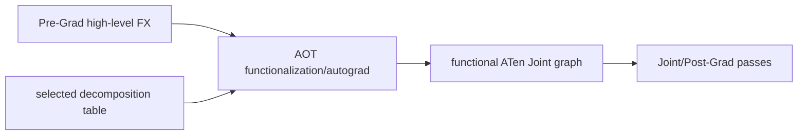

# TorchInductor Decomposition 开发指南
> **页面角色**：decomposition pass目录、注册API与开发指南。
> **原始基线**：见下方`9922478dffa`；**当前审计基线**：PyTorch `e8f97c1a6ef8cbcdd0a946606bc1e924e4f07e52`。
> **课程分工**：本页保留开发清单；decomposition、functionalization与规范化边界的当前主线见 [[15_graph_normalization_decomposition_and_functionalization_analysis]]。
> **Created**: 2026-07-22

> **Source baseline**: PyTorch `9922478dffa`，核验 `torch/_inductor/decomposition.py:130-156,972-983`、`torch/_inductor/compile_fx.py:2710-2728,3061-3070`。
>
> **结论先行**：Decomposition 的目标是让 AOT 产出的函数化 ATen 图收敛到后端可处理的算子集。它是“复合 op 的等价语义定义”，不是普通的后处理 FX 融合，也不是越分解得细越好。

---

## 1. 是什么

Decomposition table 的核心形态是：

```text
OpOverload -> Python callable implementing equivalent tensor semantics
```

`torch/_inductor/decomposition.py` 先合并 core ATen decompositions 与 Inductor 自己的表，再排除不希望被展开的 op。`register_decomposition()` 把实现注册进这个字典；`select_decomp_table()` 根据随机数和其他配置选择实际交给 AOTAutograd 的表。



因此，Decomposition 的执行不是 `post_grad_passes()` 中的某个线性步骤；表被注入 AOT 图生成过程。

---

## 2. 为什么在这里做

AOT 阶段同时处理 functionalization、autograd 和图生成。一个复合 op 如果要被拆开，最好在这里用统一语义产生前向图，并让自动微分看到相同公式。

适合在 Decomposition 做的理由：

- 后端没有该 op 的 lowering，但已有基本 op 的 lowering；
- 展开后能暴露 Joint/Post-Grad PatternMatcher 需要的稳定结构；
- 展开公式能正确表达 forward、backward、dtype、broadcast 和 mutation/alias 语义；
- 希望前向和反向遵循同一套算子集约束。

不应在这里做的理由：

- 目标 op 已有高质量 fused/external kernel；分解会让它无法被选择；
- 变换依赖具体设备 layout、buffer lifetime 或 stream；这些信息尚不存在；
- 只想把一个子图融合回更大的 op；那是 Joint/Post-Grad pattern；
- 只是为了降低节点数量或“看起来更简单”，没有后端支持/性能证据。

---

## 3. 关键 API 与作用

| API/对象 | 作用 | 边界 |
|---|---|---|
| `torch._inductor.decomposition.register_decomposition(ops)` | 把函数登记到 Inductor decomposition 表 | 内部 API；`ops` 应是具体 `OpOverload` 或列表 |
| `decompositions` | core ATen + Inductor 表的当前合并结果 | 全局可变注册表，重复注册会 warning |
| `select_decomp_table()` | 按 config 返回本次 compile 使用的表 | `fallback_random` 等配置会改变选择 |
| `torch._decomp.get_decompositions(ops)` | 查询 PyTorch decomposition registry | 用于确认已有实现，不等同于注册 Inductor 专用策略 |
| `compile_fx(..., decompositions=table)` | 给一次编译显式传表 | 传入后会包装成固定 decomp table |

> [!warning]
> 必须注册具体 overload，例如 `torch.ops.my_ns.bias_silu.default`，不要只写 overload packet `torch.ops.my_ns.bias_silu`。schema、默认参数和返回 pytree 必须与原 op 一致。

---

## 4. 如何注册并加入编译

下面假设 `my_ns::bias_silu` 已通过 `torch.library` 定义了真实实现、fake/meta 实现和 autograd 语义：

```python
import torch
from torch._inductor.decomposition import register_decomposition

my_op = torch.ops.my_ns.bias_silu.default

@register_decomposition(my_op)
def decompose_bias_silu(x, bias):
    z = x + bias
    return z * torch.sigmoid(z)

# 包含装饰器的模块必须在首次 compile 前 import。
compiled = torch.compile(model)
```

若不想修改全局表，可为一次 `compile_fx` 提供显式字典：

```python
from torch._inductor.compile_fx import compile_fx

table = {my_op: decompose_bias_silu}
compiled_callable = compile_fx(gm, example_inputs, decompositions=table)
```

显式表适合 backend 实验；加入 `torch._inductor.decomposition` 的全局注册更适合维护同一 PyTorch 分支。两者都属于内部扩展面，应固定版本并做源码回归。

---

## 5. 写一个 decomposition 前必须回答什么

### 5.1 算子集收益

- 展开后每个 op 是否都有 lowering 或后续 decomposition？
- 是否暴露了一个实际会命中的 Joint/Post-Grad pattern？
- 是否意外拆掉了已有 fused kernel 的选择点？

### 5.2 语义等价

- dtype promotion 是否与原 schema 一致？
- 整数除法、溢出、NaN/Inf、复数和低精度误差是否一致？
- broadcast、空张量、零维 Tensor 是否一致？
- 原 op 的 alias/mutation 行为能否由纯函数公式表达？
- 随机 op 是否保持 RNG 消耗顺序和可复现性？
- backward 是否可微，是否改变高阶梯度能力？

### 5.3 动态形状

Decomposition 通常应使用 Tensor 运算和 SymInt-safe 的 shape 表达式。不要把符号尺寸转成 Python `int`，不要在 trace 时根据 FakeTensor 数据值走 Python 分支。若公式只对某个形状区间成立，需把条件表达为可追踪的 guard/检查，或不要注册成无条件 decomposition。

---

## 6. Decomposition、Graph Pattern、Lowering 怎么选

| 目标 | 正确落点 | 原因 |
|---|---|---|
| 一个复合 op 展成基本 op | Decomposition | AOT 统一处理函数化与 autograd |
| 多个 ATen op 换成等价 ATen 子图/op | Joint/Post-Grad graph pattern | 仍在 FX 语义层 |
| 一个 ATen op 直接产生 Inductor IR | Lowering | 需要 layout/read-write/IR 构造 |
| 保留 op 并调用 eager/外部库 | Lowering fallback | 避免破坏现成 kernel |
| 多个已 lowering IR 节点组成一个 kernel | Scheduler/Codegen | 依赖完整 buffer 与 target 信息 |

---

## 7. 验证清单

1. 在 eager 下直接比较原 op 和 decomposition 函数的输出、异常与 alias 行为。
2. 训练 op 同时比较一阶梯度；若宣称支持，比较高阶梯度。
3. 覆盖 dtype、broadcast、空张量、动态形状和非连续输入。
4. dump AOT/Joint/Post-Grad 图，确认目标 op 已按预期展开，且没有新的 unsupported op。
5. 比较 decomposition 开/关的 kernel 数、fallback 数和端到端性能。
6. 确认编译缓存能区分不同 decomposition table/实现版本；全局注册必须在首次 compile 前完成。

---

## 8. 常见反模式

- **为了让 pattern 好写而无条件分解**：可能牺牲现有 fused kernel；先比较保留 op + lowering。
- **重复注册 core decomposition**：会产生 warning，也容易使版本升级时语义漂移；先查询现有表。
- **用 Python 数据依赖分支**：FakeTensor trace 无法读取真实值。
- **只测 forward**：decomposition 处于 AOT 边界，backward 是第一等正确性要求。
- **把 decomposition 当设备调优**：设备 layout/stream 尚不可见，应后移。

## Related Pages

- [[courses/torch_compile_end_to_end]] — 当前固定基线的图编译系统化课程入口
- [[24_graph_pass_pipeline_ordering_and_fixpoint_analysis]] — 八阶段放置决策(现含跨框架对照)
- [[31_joint_graph_passes_guide]] — decomposition 后的联合图改写
- [[32_post_grad_passes_guide]] — 切图后的 ATen pattern
- [[10_fx_lowering_to_inductor_ir_analysis]] — 保留 op 并实现 lowering/fallback
- [[15_inductor_compile_fx_orchestration_analysis]] — compile_fx 把 decomposition table 传给 AOTAutograd 的调用点(该页 §11.3)
