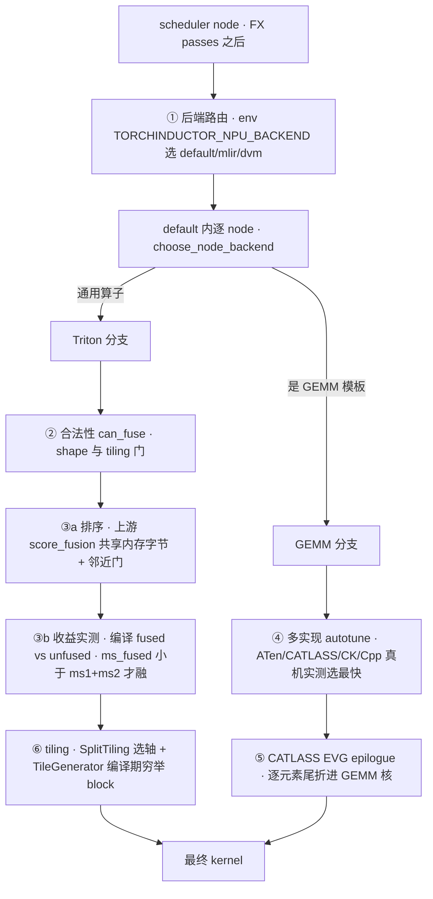
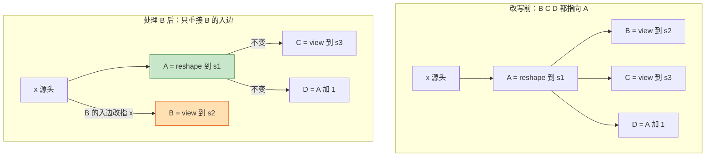

# torch_npu 自定义融合 Pass 逐个深挖 — 场景 · 问题 · 优化 · 效果

> **Source baseline**：torch_npu `E:\97-codes\torch_parallel\torch_npu` @ `b3c8a815b`（tag `v2.7.1`，2026-07-15）。除注明外，`file:line` 均指 `torch_npu/_inductor/fx_passes/ascend_custom_passes/ascend_graph_pass.py`（全文 2548 行）。
> **Dimension**：Deep Dive（mechanism-level，逐函数读源）
> 本页是 [[30_npu_vs_upstream_fusion_passes]] 的**配套深挖页**。母页给「谁有谁无」的对照地图，本页对 torch_npu **26 个自定义 pass + 3 个后端融合机制**逐个回答：**什么代码场景触发（待优化问题）→ 为什么这么优化 → 优化带来什么效果**，每条带已核验 `file:line`。硬件级 why 的全景在 [[21_npu_inductor_optimization_analysis]]。

---

## 1. 怎么读这一页（含诚实边界）

每个 pass 用四拍讲清：

- **场景**：什么 FX 子图 / 用户代码会触发它（带最小 before 代码）。
- **问题**：这个子图在 NPU 上为什么费——多一次 kernel launch、多一次 GM 往返拷贝、非连续访存、UB 白占、i64 双倍位宽、或本是 no-op 却生成真 kernel。
- **优化**：改写成什么（after 代码 + 改写手法）。
- **效果**：具体收益。

> [!important] 效果口径（务必先读，避免误读）
> 逐函数 grep 确认：**全文除 CATLASS epilogue 外没有任何 `counters[...]` 埋点、也没有 benchmark**（`catlass_scheduling.py:151` 是唯一计数器）。因此本页所有「效果」都是**结构性的**（少几个 kernel / 少一次拷贝 / 转零拷贝 view / 索引降到 int32），**不是实测加速比**——凡涉及数量级的措辞均为机制推断。
> 另外：① 源文件里**没有任何 NPU 硬件注释**（无「达芬奇/vector core/UB/i64」字样），凡「因为硬件 X」的因果均标 **[硬件推断]**，其依据是 [[21_npu_inductor_optimization_analysis]] 归纳的硬件特性，而非本 pass 文件；② 部分 pass 带**中文 docstring 直述动机**，这类标 **[docstring 原文]**，可信度最高；③ 26 个 pass **全部只处理静态 shape**（`get_node_shape` 遇 SymInt 维返回 None，`get_binary_fold_result.py:37-38`）；④ 生效门控：POST 全部**仅推理**、PRE 除 `fusion_attention_v3_pass` 外也**仅推理**（`ascend_custom_passes/__init__.py:15-23`）。

**「效果」锚定的 6 个 NPU 硬件事实**（母页 §5 / [[21_npu_inductor_optimization_analysis]] 展开）：① 逐元素/规约算子会各起一个 vector kernel 并把张量经 UB 在 GM 间搬运；② matmul 由 Cube 单元算、结果落 L0C，接逐元素若不融合就得 Cube→GM→Vector 往返；③ UB 是便笺，中间张量越多压力越大；④ vector core 对 i64 支持弱，int32 索引省一半位宽 [硬件推断]；⑤ 达芬奇偏好连续访存；⑥ view/expand/squeeze 是零拷贝元数据，cat/clone/pad/repeat/slice_scatter 是真拷贝。

> **机制总纲（建议先读）**：这 26 个 pass 到底「怎么改图」、共用什么改写套路、凭什么保证等价——集中在文末 **§7**（FX 改图原语表 + 四步套路 + 三条贯穿原理 + `view_fold_pass` 全走查）。不熟悉 `replace_all_uses_with`/DCE 等 fx 改图操作的读者，先读 §7 再看下面逐个 pass 会顺很多。

---

## 2. PRE passes（4 个）

### 2.1 `cat_slice_cat_fold_pass`（`:52-127`，PRE·仅推理）
**场景**：一个 `cat` 的每个输入都是对**同一个父张量**的 `getitem` 切片，而那个父张量本身又是个 `cat`，且切片在同一维上**无缝拼满** `[0,len)`：
```python
c   = torch.cat([a, b], dim=-1)     # cat1
s0  = c[..., 0:Da]; s1 = c[..., Da:Da+Db]
out = torch.cat([s0, s1], dim=-1)   # cat2 —— 与 c 逐字节相同
```
（匹配条件：同父 `:88-95`、同轴 `:80-83`、无缝拼满 `:105-120`）
**问题**：`cat2` 重新物化了一份与 `cat1` 完全一样的张量，中间的切片+再拼接是纯数据搬运；NPU 上每个 cat/slice 都是 GM 上的 DMA/vector 拷贝，白白耗带宽 [硬件推断]。
**优化**：`cat2.replace_all_uses_with(cat1)`，再删 `cat2` 与各切片 getitem（`:121-125`）。
**效果**：消掉 1 个 cat + N 个 slice 拷贝，下游直接读 `cat1`。

### 2.2 `pad_slice_fold`（`:130-186`，PRE·仅推理）
**场景**：`pad` 沿某维扩张后，下游每个切片窗口都完全落在 **pad 前**的原范围内：
```python
xp = F.pad(x, (0, 8))   # x:(...,L) -> xp:(...,L+8)
y  = xp[..., 0:L]       # 切片没碰到 pad 区
```
（条件 `slice_end <= 原 shape[pad_dim]`，`:169-174`）
**问题**：pad 把一个更大的张量写进 GM，但下游切片把 pad 出来的部分整个丢弃——那次扩张写是纯浪费。
**优化**：把每个切片的输入**改绑到 pad 前的源**（`user.args=(input, idx)`，`:182-183`），删掉 pad（`:184`）。
**效果**：删掉 1 个 pad 及其 GM 写，切片直接读未 pad 的源。

### 2.3 `dtype_optimal_pass`（`:806-882`，PRE·仅推理）
**场景**：值域塞得进 int32 的 int64 `arange`，或源 dtype∈{fp32,int32,bool,int16,int8} 的 `.to(int64)`：
```python
idx = torch.arange(0, seq_len, dtype=torch.int64)   # (a) 静态范围
pos = something.to(torch.int64)                      # (b) 源是 int32
```
（int32 范围守卫 `:855`；`.to` 源 dtype 白名单 `:869-870`）
**问题**：**docstring 原文（`:808-809`）**「将不必要的 int64 优化为 int32……减少访存与计算开销」。i64 在 NPU vector core 上弱且索引张量双倍位宽 [硬件推断]。
**优化**：`arange` 把 `dtype` 改 int32（`:856`）；`.to` 目标改 int32（`:875/:877-880`）。
**效果**：索引/iota 张量变 int32，索引带宽减半、避开 i64 vector 运算 [「减半」为推断，「减少访存/计算」为 docstring 原文]。POST 侧还有个同思路的 `fold_iota_arithmetic_pass`（§4.4b）。

### 2.4 `fusion_attention_v3_pass`（`:885-906`，PRE·**训练+推理**）
**场景**：图里任何 `torch.ops.npu.npu_fusion_attention.default` 节点（`:892-894`）。
**问题**：**docstring 原文（`:887-888`）**「以等价的 v3 算子替换原节点……从而启用更高性能的实现」。为什么 v3 更快不在本文件 [推断为手工 kernel 升级]。
**优化**：新建 `npu_fusion_attention_v3.default` 节点，**args/kwargs 原样透传**（`:897-901`）、`meta` 逐字复制（`:902`），`replace_all_uses_with`+erase（`:903-904`）。
**效果**：所有 FA 调用路由到 v3 kernel。
> **校正**：本 baseline **不存在 `npu_fusion_attention_v2`**（全仓 grep 无引用），本 pass 是把**基础版 `npu_fusion_attention.default` → `v3.default`**，不是「v2→v3」。FX 层看是**同签名的 drop-in 换目标**（args/meta 不变，v3 schema 的 `softmax_layout`/`sink` 走默认）。它是**唯一在训练也跑**的 PRE pass（运行器 `ascend_custom_passes/__init__.py:20-23` 在 `is_inference_check()` 门外单独跑它）。

---

## 3. POST — 结构折叠 / 冗余消除（13 个）

共性：全是 `@register_custom_pass(PassType.POST)`、**仅推理**，收尾统一 `eliminate_dead_code`（lint + DCE，`:2541-2547`）。共同「问题」是——一个语义上的 no-op / 恒等运算仍会生成一个真 kernel 或真拷贝。下表每行给 before→after 与效果性质：

| Pass（file:line） | 场景（before → after） | 待优化问题 | 效果 |
|---|---|---|---|
| `fold_four_op_pass`（`:189`） | `x+0 / x-0 / 0-x / x*1 / x/1` → 保留非平凡操作数 | 恒等算术仍起一个 vector kernel | 消掉该二元 kernel；**但** `get_binary_fold_result` 至少插一个 `clone`（`GBF:96-124`），故**非零成本**、余下 clone 可由 `fold_clone` 再消 |
| `fold_cast`（`:237`） | `convert_element_type(x_fp16, fp16)` → `x_fp16` | 同 dtype cast 仍是整张量 DMA 拷贝 | 真零拷贝：`replace_all_uses_with(input)`，删一次全量拷贝 |
| `fold_cat`（`:265`） | 单用户、同轴的嵌套 `cat(cat(x,y),z)` → 一个 `cat` | 内层 cat 物化一份立即被再拼接的中间 buffer | 少 1 个 concat kernel + 中间 buffer/每折 |
| `fold_clone`（`:322`） | `clone(x)`（mem_format 不变、非输出）→ `x` | clone 是整张量 memcpy | 真拷贝消除 |
| `fold_detach`（`:360`） | `detach(x)` → `x`（无条件） | 推理图里 detach 数值 no-op 却占节点 | 删掉 detach（detach 是共享存储视图，替换安全） |
| `fold_expand`（`:379`） | `expand(x,[4,8])`（x 本就 [4,8]）→ `x` | 不真广播的 expand 是元数据 no-op、堵融合 | 删冗余 view 节点 |
| `fold_reduce`（`:416`） | `sum(x,dim=[1])`（该维 size=1）→ `squeeze` 或原样 | 对 size-1 维求和仍起 reduce kernel、白占 UB | 把 reduce 换成 squeeze 视图（零拷贝）或直通 |
| `fold_slice`（`:551`） | 全范围 `slice` → 输入；全覆盖 `slice_scatter` → 替换张量 | slice_scatter 全覆盖仍复制整张量 | 删 no-op slice / 删一次全量拷贝（日志 `FoldSliceLike: Folded`） |
| `fold_squeeze`（`:571`） | `squeeze(unsqueeze(x,1),1)` → `x`；相邻 squeeze 合并 | 相邻/互逆的 squeeze/unsqueeze 是冗余 view | 抵消视图节点，利于融合（要求 prev 单用户） |
| `fold_to_copy`（`:604`） | `_to_copy(x)`（dtype/device/layout/mem_format 全不变、非输出）→ `x` | 无变化的 `_to_copy` 仍整张量拷贝 | 真拷贝消除 |
| `view_fold_pass`（`:668`） | `view(reshape(x,..),..)` → 折成单个 view；恒等 view 删除 | view/reshape/squeeze 链只加节点、堵融合 | 折叠 view 链、删恒等 view（改图机制 + DAG 扇出**全走查见 §7.3**） |
| `fold_where`（`:715`） | `where(cond,a,a)`（两支相同/都 0/都 1）→ 一支 | where 读三张量（cond+两支）起 select kernel | 消掉 select kernel；**同样**经 `get_binary_fold_result` 余下 broadcast+clone，故部分收益 |
| `fold_redundant_ops`（`:741`） | `squeeze.dim(view(x))`（形状+dtype 回到原样）→ `x` | view→squeeze 往返是两个冗余 view、堵融合 | 删掉这对往返（至多 2 节点） |

> 小结（agent 核实）：真·零拷贝直删的是 `fold_cast/clone/detach/expand/reduce/slice/squeeze/to_copy/view_fold/redundant_ops`（都直接 `replace_all_uses_with(input)`）；`fold_four_op` 与 `fold_where` 因走 `get_binary_fold_result` 会**留一个可后续再消的 clone**，不是保证零成本。

---

## 4. POST — 结构重排 & 真·融合（9 个，重点）

这 9 个是 NPU 真正「有想法」的 pass——把一段业务子图整体改写成更省的形态。

### 4.1 `fold_sink_view`（`:448`，POST·仅推理）
**场景**：一个单用户的 `view/reshape`，其唯一用户是激活（silu/gelu/relu/sigmoid）或可广播的二元 add/sub/mul/div：
```python
v = x.view(B*S, H)
y = torch.relu(v)      # 激活夹在 view 之后
```
**问题**：**docstring 原文（`:449-450`）**「先在原 shape 上执行计算，再做 view，从而便于后续融合且不影响数值结果」——激活作用在 reshape 后的张量上，无法与 `x` 的生产者融合。
**优化**：反序重建——先 `relu(x)` 再 `view`（`:462-477`），`user.replace_all_uses_with(new_act_view)`（`:481-482`）；二元分支带广播安全校验（`:504-508`）。
**效果**：激活/二元落到 view 前的张量上，可与生产者融合；view 退化为纯元数据、**不新增拷贝**。

### 4.2 `cat_to_view_pass`（`:909`，POST·仅推理）
**场景**：`cat` 的每个输入都是**同一父张量**的连续切片、无缝拼满整维：
```python
out = torch.cat([x[:,0:4], x[:,4:8]], dim=1)   # == x（恒等）
out = torch.cat([x[:,3:8], x[:,0:3]], dim=1)   # == 循环左移 3（rotation）
```
**问题**：**docstring 原文（`:911-912`）**「cat 等价于恒等视图或循环位移，从而避免实际数据搬运」——cat 起一个 concat kernel 物化新 buffer，而结果只是父张量本身或其循环移位 [拷贝成本为硬件推断]。
**优化**：恒等→`replace_all_uses_with(parent)`（`:1011`）；循环→建 `aten.roll(parent, shift, dim)`（`shift=-normalised[0][0]`，`:1050-1060`）。切片+cat 被 DCE。
**效果**：恒等是零拷贝；循环用 1 个 `roll` 替掉 N 切片+cat。日志明写 `collapsed cat(...) → identity view` / `→ roll(shift=%d)`（`:1013,:1062`）。

### 4.3 `repeat_to_expand_pass`（`:1112`，POST·仅推理）
**场景**：只做广播（从 size-1 维复制）的 `repeat`，且所有用户都是广播友好算子（mul/add/where/比较/逻辑…，白名单 `:1075-1109`）：
```python
m = mask.repeat(1, H, 1)   # [B,1,S] -> [B,H,S]
y = x * m                  # mul 天然可广播 stride-0 维
```
**问题**：**docstring 原文（`:1114-1115）**「用零拷贝的 expand 替代物理拷贝的 repeat」——`repeat` 物化整份广播结果，而消费者本可对 size-1 维做免费广播 [UB/GM 物化成本为硬件推断]。
**优化**：建 `aten.expand(inp, out_shape)`（`:1166-1168`），`replace_all_uses_with(exp)`（`:1182`）。
**效果**：`expand` 是 stride-0 视图、零拷贝；`repeat` 被 DCE。日志 `rewrote repeat(...) → expand(...) (broadcast-only, %d consumers)`（`:1184`）。

### 4.4 `fold_iota_arithmetic_pass`（`:1394`，POST·仅推理）—— 三个子变换
**(a) 常量 CSE**：去重 arg 相同的 `iota/arange/full`（`:1402-1408`），并**排除被 mutation 引用的 buffer**（`_collect_mutation_buffer_ids`，`:1326-1363`）以免两个原地写共用一块。
**(b) int64→int32 iota 降位**：`prims.iota(int64)` 且值域进 int32、且到「闭合算子」（比较/`_to_copy`/`convert_element_type`）前只经**dtype 透明算子**（view/permute/add/mul…）时，改 int32（`:1431-1433`），refresh 后若没得到 int32 则**回滚**（`:1435-1439`）。
**(c) `cmp(sub(a,b),0)` 折叠**：`sub(a,b) {ge/gt/le/lt/eq/ne} 0` → `cmp(a,b)`（`:1497-1510`）。
**问题**：(a) 重复常量各起一个 fill kernel；(b) i64 索引双倍位宽 [硬件推断，`opt_int64_to_int32` 兄弟 docstring `:808-809` 述「减少访存与计算」]；(c) `sub` 是多起的一个逐元素 kernel + 物化 diff。
**效果**：去重常量 / int32 窄 iota / 省掉 `sub`。日志 `downcast iota[...] int64→int32` `folded ge(sub(a,b),0) → ge(a,b)`（`:1453,:1512`）。

### 4.5 `broadcast_const_mask_compress`（`:1536`，POST·仅推理）
**场景**：把 bool mask 表达成 0/1 数值的常见写法：
```python
sel = torch.where(bool_mask, full(1), full(0))
m   = sel.to(torch.float32)
```
（两支都是常量 `full`、真值不同、非 bool 目标时限定为 {0,1}，`:1567-1579`）
**问题**：**docstring 原文（`:1538-1539）**「用 mask 自身（或 logical_not(mask)）替代该 where+cast，消除显式广播」——物化了两个 `full` 常量张量 + 一次 broadcast select + 一次 cast [UB 物化为硬件推断]。
**优化**：真值为「1」在真支则 `new_cond=cond`，否则插 `logical_not(cond)`（`:1590-1594`）；bool 目标直接 `replace_all_uses_with(new_cond)` 连 cast 都省（`:1605-1607`），否则把 cast 改读 bool mask、让原生 bool→dtype cast 完成 0/1（`:1608-1610`）。
**效果**：消掉 `where` + 两个 `full`（DCE），最好连 cast 也省。日志 `:1614`。

### 4.6 `masked_add_compose_pass`（`:1691`，POST·仅推理）
**场景**：注意力/分支合并里「互补掩码相加」：
```python
out = torch.where(mask, a, 0) + torch.where(~mask, b, 0)
```
（两 `where` 各单用户、两 mask 互为逻辑取反，`:1706-1715`）
**问题**：**docstring 原文（`:1693-1694）**「两个互补的掩码加法等价于一次三目选择，可节省一次加法与一次 where」。
**优化**：合成 `where(mask, a, b)`（`:1729-1733`），`add.replace_all_uses_with(new_where)`（`:1749`）。
**效果**：`2×where + 1×add → 1×where`。日志 `folded where(m,a,0)+where(~m,b,0) → where(m,a,b)`（`:1751`）。

### 4.7 `bool_cast_mul_to_where_pass`（`:1835`，POST·仅推理）
**场景**：施加 bool 掩码的常见写法（mf 与 mul 间可夹 reshape/unsqueeze）：
```python
mf = bool_mask.to(x.dtype)
y  = mf * x
```
（经单用户 view 链回溯到 cast、cast 源为 bool、cast 目标 dtype==另一操作数 dtype，`:1863-1878`）
**问题**：**docstring 原文（`:1837-1838）**「避免显式的 bool→numeric 类型转换与广播乘法，让后端有更多融合机会」——一次整张量 cast kernel + 一次广播 mul，且乘 0/1 本可用 select 代替。
**优化**：建标量零 `full([],0)`，把 view 链**重放到 bool 源**上使其到达 mul 形状（`_replay_view_chain`，`:1801`），合成 `where(new_cond, other, zero)`（`:1912-1915`），`mul.replace_all_uses_with(new_where)`（`:1931`）。
**效果**：`cast + mul → where`，省整张量数值 cast、一次 select 取代 cast+乘。日志 `:1934`。

### 4.8 `sign_diff_hamming_fuse_pass`（`:1969`，POST·仅推理）
**场景**：符号位汉明距离（二值哈希 / sign-LSH 相似度；`relu(sign(·))` 把值映射到 {0 if ≤0, 1 if >0}）：
```python
d = torch.sum(torch.abs(torch.relu(torch.sign(x)) - torch.relu(torch.sign(y))), dim)
```
（`sum←abs←sub←两个 relu(sign)`，各单用户，`:1977-2004`）
**问题**：**docstring 原文（`:1971-1972）**「用 sum(ne(gt(x,0),gt(y,0))) 等价替换，简化算子链并降低中间张量成本」——原链 6 个算子、两个 `relu(sign)` **float** 中间张量 + diff [UB 压力为硬件推断]。
**优化**：建 `gt(x,0)`、`gt(y,0)`、`ne(·,·)`、`sum(ne, dim)`（保留原 dim/keepdim/out_dtype，`:2031-2039`），`sum.replace_all_uses_with(new_sum)`（`:2047`）。
**效果**：6 算子 float 链 → `gt/gt/ne/sum`，中间张量变 **bool**，reduce 直接数不同符号位。日志 `:2049`。

### 4.9 `batch_embedding_fusion_pass`（`:2493`，POST·仅推理）
**场景**：把 EmbeddingBag 式池化写成对同一索引张量分段的 N 次 embed+reduce（同权重、默认参数、各段等长且 `N*L==dim`）：
```python
for i in range(N):
    seg = idx[:, i*L:(i+1)*L]
    r_i = embedding(W, seg).sum(dim)   # embed + reduce/段
```
（分组键=（权重身份, D, 索引形状），`:2509-2526`；同父连续切片全覆盖 `:2157-2213`；同一 reduce 算子 `:2112`）
**问题**：**docstring 原文（`:2495-2496）**「对同组的多次 embedding+reduce 合并为单次 reshape→embedding→reduce，从而显著降低调度与访存开销」——N 个各自的小 gather kernel + N 个对同权重 `W` 的 reduce [每 kernel launch 开销为硬件推断]。
**优化**：把父索引 reshape 成 `(N,L)`，一次 `embedding(W, reshaped)`，一次沿新轴 reduce（`:2407-2424`）；下游或按 `select(i)` 接回、或整体塌进一个 `cat→reshape`（`:2426-2454`）。
**效果**：`N×(slice+emb+reduce) → 1 reshape + 1 emb + 1 reduce + (N select | 1 reshape)`。**日志逐字给出该收益**（`:2464` collapsed / `:2478` 非 collapsed）。

---

## 5. 后端级融合：当前优化全景 与「怎么建模选择最终融合」

FX pass 之外，真正决定 kernel 长什么样的是后端 scheduler / codegen。这一节回答两个问题：**后端当前做了哪些融合优化**，以及**它用什么模型在多个候选里选出最终的融合方式**。基线同上（`b3c8a815b`）。与上游对照见母页 §3.6/§4.3。

### 5.0 决策链：从 scheduler node 到最终 kernel

一个 node 走完 FX pass 后，后端按下面这条有序链把它收敛到最终 kernel（每步注明 owner + 建模范式）：



一句话主线：**合法性用启发式（shape/tiling/EVG 可行性），收不收益 + 选哪个 GEMM 实现用真机实测 benchmark，tiling block 大小用编译期穷举，dvm 图级融合用能力表 + 连通性启发式。** 真正的「代价模型」（实测）只有 ③收益 与 ④实现 两处，其余都是规则/能力门。

### 5.1 后端路由（①）— 选哪个后端

- **进程级**：`TORCHINDUCTOR_NPU_BACKEND` 选 `default`/`mlir`/`dvm` 三条互斥路径（`__init__.py:336-340` `_BACKEND_LOADERS`，未知值回落 `default`），default 注册 `NPUCombinedScheduling`（`__init__.py:171-173`）。
- **逐 node**：`choose_node_backend`——是 CATLASS 模板则走 `CATLASSScheduling`，否则走 `NPUTritonScheduling`（`codegen/npu_combined_scheduling.py:40-43`）；Ascend950 上非 linear 模式再分出 `NPUNoLinearTritonScheduling`（`:82-99`）。
- **范式：heuristic-legality**（类型/环境变量分派，无代价）——但**注意 CATLASS 那一支的「类型」本身部分由 empirical autotune 决定**（见下方三时刻链）。

#### CATLASS 分支怎么判出来的？—— 不是「直接白名单」，而是一条三时刻链

`choose_node_backend` 里那句「是 CATLASS 模板则走 CATLASS」只是**末端的类型检查**；一个 `mm/addmm/bmm` 到底走不走 CATLASS，是下面三个时刻**逐步收敛**的结果：

**① lowering 时——CATLASS 只是「成为候选之一」**（`kernel/mm.py:tuned_mm :79-135`）。要把 CATLASS 候选加进 `choices`，需同时过**外层 3 门 + 内层 6 门**：
- 外层（`:100-104`）：`is_contiguous_input`（mat1/mat2 都连续，行主 `stride[1]==1` 或列主 `stride[0]==1`，`is_contiguous_striding:60-73`）**且** `is_nonzero`（静态非零问题）**且** `use_catlass_template(...)`。
- 内层 `use_catlass_template`（`utils.py:236-265`）叠 6 门，缺一即 False：
  1. **白名单**：`op ∈ catlass_enabled_ops`（默认 `"mm,addmm,bmm"`，或设 `"ALL"`；`:243-247`）
  2. **size 阈值**：`size_hint(m*n*k) ≥ catlass_backend_min_gemm_size`（`:249-251`）——小矩阵不上模板
  3. **非 ROCm**（`:253-255`）
  4. **dtype ∈ {fp16, bf16, fp32}**（`_use_template_for_npu`，`:257-259`）
  5. **`use_max_autotune()`**（`:260`）——**没开 max-autotune 就根本不会有 CATLASS 候选**，直接走 ATen
  6. **`_use_autotune_backend("CATLASS")` + CATLASS 库可导入**（`try_import_catlass`，`:261-265`）
- 全过 → `add_catlass_gemm_choices` 按不同 tile config **展开一批 CATLASS 候选**（内部 `maybe_append_choice` 逐 config 追加，`codegen/catlass/gemm_template.py:189,227-247`），与 ATen（`:92`）/CK（`:111`）/Cpp（`:114`）/extern（`:131`）**并列**塞进 `choices`。

**② autotune 时——CATLASS 才「被选中」**（`autotune_select_algorithm :135`）。此时 `choices` 里有 ATen + 一批 CATLASS(+CK/Cpp) 候选，autotune 用**真机实测**挑最快；GEMM 常走 `MultiTemplateBuffer` 把最终选择**延迟到融合阶段**由 `finalize_as_caller` 定（见 §5.3/§5.4）。**只有 CATLASS 候选实测胜出（或作为 multi-template 保留），产出的 buffer 才是 `CATLASSTemplateBuffer`**；若更慢，同一个 `mm` 就用 ATen/CK。

**③ scheduler 时——只是「类型 dispatch」，不再判断**。`is_catlass_template(node)` = `isinstance(node.node, CATLASSTemplateBuffer)`（`codegen/catlass/catlass_scheduling.py:70-73`），`choose_node_backend` 据此把它交给 `CATLASSScheduling` codegen（含 EVG epilogue，§5.4）。**「该不该用 CATLASS」早在 ①② 定案，这一步只看 buffer 类型。**

> 一句话：**白名单（`mm/addmm/bmm`）只决定「有没有资格上牌桌」——那是 ① 的第一门；能不能真上桌还要再过连续性/size/dtype/max-autotune/backend/库共 5 门；最后「是不是它」由 autotune 真机实测拍板（②）。scheduler 的 CATLASS 分支（③）只是对已定案 buffer 的类型分派，不是在那儿查白名单。** 所以「直接是白名单吗」——不是；白名单只是资格门之一，最终判据是实测。

> 校正：`AKG` 在本 baseline 实际停用——`TORCHINDUCTOR_USE_AKG` 只在 mfusion 路径出现且命中即警告「AKG codegen is not supported currently」（`mfusion/graph_fusion.py:52-54,910`），不宜写成活跃后端。`mlir`/`dvm` 是完整独立路径。

### 5.2 融合合法性（②）— 能不能融（Triton）

（原 §5.3）`NPUTritonScheduling.can_fuse`（`codegen/scheduling.py:579-721`，垂直=水平共用，`:720-721`）在上游 numel/rnumel 检查上叠两道 NPU 门：① **tiling 门**（pw+pw，`:657-679`）——对 node1/node2/合并集各算 `select_tiling`，>2 维时要求三者相等，否则 `why("tiling mismatch")`；② **`is_compatible` 门**（pw→reduce，`:687-690`）——每个子节点须能被 `NPUIndexTritonKernel._split_iteration_ranges` 无塌缩切到 reduction group，`CantSplit` 即拒（`triton.py:1327-1348`）。**为什么**：上游 GPU tiling 塌成 1D，NPU 需非塌缩多轴范围（docstring `:726-728`「npu needs non-collapse ranges」），naive 融合会产出切不动/不一致的 tiling。**范式：heuristic-legality**（纯 shape/tiling 门，无 benchmark）。

### 5.3 融合收益建模（③）— 划不划算【本节核心】

这一步才是「怎么建模选择最终融合」的核心——**合法 ≠ 一定融**，torch_npu 借上游 `Scheduler` 机制、用**真机实测**决定接不接受。`patch_scheduler`（`scheduler.py:29`）改写融合主循环：

- **③a 候选排序（启发式）**：`fuse_nodes_once`（`:79-187`）按 `get_possible_fusions`（`:147`，**未被 NPU 覆写、沿用上游**）——上游按 `score_fusion`（融合能省下的**共享内存字节** + 邻近度）排序。NPU **只改了邻近门** `are_long_distant_nodes`：`proximity_score > 20`（`:31-39`），注释明写 GPU 默认 64、Ascend950 用 20，且**仅 A5 才 patch**（`:41-42`）。
  > 校正：`score_fusion`/`score_fusion_memory` 在整个 `_inductor` **无覆写**（全库 grep 无 `def score_fusion`）——说「NPU 自定义了融合打分」是错的，NPU 只调了一个邻近阈值。
- **③b 收益判定（实测 benchmark）**：`speedup_by_fusion`（`:189-553`）：
  - `not config.benchmark_fusion and not is_multi_template` → 直接 `return True`（`:202-203`）：关掉 benchmark 时「合法即融」。
  - **普通对**（`:479-551`）：并行编译 `n1 / n2 / fused` 三个核 → `benchmark_codegened_module` 真机实测 → **接受判据 `return ms_fused < ms1 + ms2`**（`:541`）；任一核 register spilling（inf）则拒（`:503-519`）。
  - **GEMM+epilogue 多模板对**（`:313-477`）：取模板 `MultiTemplateBuffer.choice_timings`，按 unfused_time 升序遍历候选并在 `unfused_time >= ms1+ms2` 时剪枝（`:361-362`），CATLASS 候选再过一次 `_can_fuse_epilogue_impl`；对每个候选**带 epilogue 编译并实测**取 `min_ms_fused`，**`min_ms_fused < (ms1+ms2)` 后 `finalize_as_caller(ms_fused_choice)`**（`:440-441`）——这一步**同时决定「融不融」与「选哪个 GEMM 实现」**。
- **范式：empirical-benchmark**（唯一真·代价模型）；它依赖 §5.4 的真机计时。

### 5.4 GEMM 实现 + epilogue 选择（④⑤）— 模板 autotune

- **④ 候选生成 + 计时**：`tuned_mm`（`kernel/mm.py:79-142`）按 ATen→CATLASS→CK→Cpp→extern 生成候选（空则回落 ATen），交 `autotune_select_algorithm`（`:135`）。`patch_algorithm_selector`（`select_algorithm.py:639`）覆写 `AlgorithmSelectorCache.__call__` 与 `make_benchmark_fn`：`catlass_bench_use_profiling` 时走**真机 AICore profiling**——`do_batch_profiling`（`:1145-1223`）在 `torch_npu.profiler.profile`（`AiCMetrics.PipeUtilization`）下每候选跑 50 步、读 `kernel_details.csv` 的 `Duration` 求和、并用 192MB buffer 做 L2 flush；否则走 `do_bench`（子进程/当前进程）。开关 `catlass_bench_use_profiling`（env `TORCHINDUCTOR_PROFILE_WITH_DO_BENCH_USING_PROFILING`）**默认关**（`config.py:80-83`）。**范式：empirical-benchmark**。
- **⑤ CATLASS EVG epilogue**（`codegen/catlass/catlass_scheduling.py`）：把 GEMM 后的逐元素尾（`relu(x@w+bias)`）折进 GEMM 核，省 GEMM 结果的 Cube→GM→Vector 往返。合法性门 `_can_fuse_epilogue_impl`（`:234-338`）：消费者须 `ComputedBuffer(Pointwise)`、同输出尺寸、读模板 buffer、非 reduction/非 mutation、单条 epilogue（`:256-258`）、EVG 可生成（`ir_to_evg_python_code` 不抛 `NotImplementedError`）、回退路径 `type==2` 且非 bf16（`:333-337`）。**唯一有计数器**：`catlass_epilogue_fusion_counter += len(epilogue_nodes)`（`:151`）。开关 `catlass_epilogue_fusion_enable`（env `CATLASS_EPILOGUE_FUSION`）**默认关**（`config.py:76-78`）。**范式：heuristic-legality（能否融）+ empirical（在 §5.3 多模板路径里选实现）**。

### 5.5 tiling 建模（⑥）— 编译期穷举

block/sub-block 大小不靠运行期 autotune，而在 codegen 时算死成固定 `Config`：
- **选轴**：`SplitTiling`（`codegen/split_tiling.py:19`）`select_split_axis`（`:80-129`，停止条件=切分总 numel ≥ `num_vector_core` 且每核均衡，或已 3 轴，优先高维非规约轴）+ `select_tiling_axis`（`:137-205`，覆盖低维 + 规约轴，triton-ascend 最多 2 维）。
- **UB 公式**：`TileGenerator`（`codegen/tile_generator.py`）`max_numel_threshold = local_mem_size // input_ptr_num // dtype_bytes`（`:47`，`local_mem_size` = `ub_size` 192KB(A3)/256KB(A5)，`input_ptr_num` 上限 3），`stop_numel = min(max_numel_threshold, max_total_numel//num_vector_core)//8`（`:48`）。
- **穷举**：`descend_tiling_axis`（`:190-242`）对 tiling 轴反复 `next_power_of_2(numel//2)`（<32 时逐 1 递减）生成候选，每候选用 `valid_tile_numel`（≤ `max_numel_threshold`）过滤，产出 `Config(num_warps=1, num_stages=2)` 列表。
- **为什么编译期而非运行期**：NPU 固定核数 + 便笺 UB，编译期一次算准（vs GPU 靠运行期 autotune）——机制在 [[21_npu_inductor_optimization_analysis]] §三/§四。**范式：compile-time-exhaustive**。

### 5.6 DVM 图级分区融合（⑦）— dvm 后端

（原 §5.2）仅 `dvm` 后端。`DvmGraphFusionPatch.enable` 把 `config.post_grad_custom_post_pass=dvm_graph_fusion`（`dvm/graph_fusion.py:400-413`），用 `CapabilityBasedPartitioner` 把一段连通、算子都在 `GRAPH_FUSION_SUPPORT_OP`（约 50 个，`:42-92`）白名单内的子图（`t=rsqrt(x*x+eps); y=(x*t)*w` 这类逐元素/GEMM 链）融成**一个** `dvm::fused_graph_*` 自定义算子：`partition_and_fuse`（`:273-306`）先 `propose_partitions()` 再 `split_partition_with_union_find`（`:131-156`，按数据依赖连通性细分），`_should_fuse` 门（`:258-271`，至少一输出、非 fallback、含 FakeTensor）；`flexible_layout` tag 让共享生产者保持共享（`:246-248`）。**效果**：整段连通区塌成**一次** DVM kernel 调用。**范式：heuristic-legality**（能力表 + 连通性，无 benchmark）。

### 5.7 小结：四类建模范式 + 默认路径

| 决策点 | 建模范式 | 判据 |
|---|---|---|
| ① 后端路由 | heuristic-legality | 类型/env 分派 |
| ② can_fuse | heuristic-legality | shape/tiling 门 |
| ③a 排序 | heuristic-ordering | 上游 score_fusion 共享内存字节 + 邻近门(A5=20) |
| ③b 收益 | **empirical-benchmark** | 编译 fused/unfused 真机实测 `ms_fused < ms1+ms2` |
| ④ GEMM autotune | **empirical-benchmark** | AICore profiling / do_bench 选实现 |
| ⑤ CATLASS EVG | heuristic-legality | EVG 可生成 + 类型/形状门 |
| ⑥ tiling | **compile-time-exhaustive** | UB 公式约束下 2 分递降穷举 |
| ⑦ DVM 分区 | heuristic-legality | 能力表 + 连通性 |

**三段式落差**：torch_npu 的融合体系是「**启发式定合法性 + 实测定收益/实现 + 编译期穷举定形状**」。真正的实测代价模型只有 ③收益、④实现 两处；tiling 从 GPU 的运行期 autotune 改成**编译期穷举**（受 UB=`ub_size//ptr//dtype` 硬约束），根因是 NPU 固定核数 + 便笺 UB。
**默认路径提醒**：两个实测开关默认都关——`CATLASS_EPILOGUE_FUSION=0`（EVG epilogue 关）、`TORCHINDUCTOR_PROFILE_WITH_DO_BENCH_USING_PROFILING=0`（GEMM 计时走 do_bench 而非 AICore profiling）。想吃满后端融合需显式打开。

---

## 6. 效果的诚实边界（复述，防误引）

- **无 benchmark、无计数器**（唯一例外 CATLASS `catlass_epilogue_fusion_counter`，`catlass_scheduling.py:151`）。本页「效果」= 结构性收益（少 N 个 kernel / 少一次拷贝 / 转零拷贝 view / int32 索引），**非实测加速比**。
- **docstring/日志 = 源述动机**（可信度最高，已在各条标「原文」），**硬件因果 = 推断**（源文件无硬件注释）。
- `fold_four_op` / `fold_where` 经 `get_binary_fold_result` 会**留一个 clone**，非零成本。
- **仅静态 shape**（SymInt 即跳过）；**仅推理生效**（`fusion_attention_v3_pass` 例外，训练也跑）。
- 单条 pass 可用 `SHUT_DOWN_FX_PASS_LIST=<name>`（或 `all`）关闭（`register_custom_pass.py:15-35`）。

---

## 7. 附：改图操作原语与 pass 通用原理（NPU 应用视角）

前面 26 个 pass 形态各异，但「怎么改图」只用同一小组 FX 原语、走同一个改写套路。这一节把它抽出来，回答两个问题：**这些 pass 具体在图上做什么操作，以及这些操作的通用原理是什么。**

> **与上游通用机制页的划界**：这些 FX 原语本身（`replace_all_uses_with` 为何先 snapshot users、`erase_node` 的 zero-user 前提、insertion point 语义、事务化改图的完整状态机 ANALYZE→BUILD→RECONNECT→ERASE→CLEANUP→VERIFY→MATERIALIZE）是 PyTorch FX 的**通用**设计，权威讲解见 [[21_fx_graph_editing_primitives_and_invariants_analysis]]；post-grad 图为何是纯函数式（functionalization）见 [[12_graph_effects_alias_mutation_and_order_analysis]]。本节**不重复**这套通用原理，只回答"torch_npu 这 26 个 pass 具体怎么用它们"——下表『代表用处』列（`ascend_graph_pass.py` file:line）与 §7.3 的逐 pass 走查是本节独有价值所在。

### 7.1 FX 改图操作原语（这些 pass 到底「怎么改图」）

所有 pass 都在同一份 `torch.fx.Graph`（一张 **DAG**：节点=算子调用，边=数据依赖 `node.args`）上做**原地改写**，全靠下面这几个 fx 原语（全文这些调用共 **132 处**，grep 计数）：

| 原语 | 语义 | 作用范围 | 代表用处（`ascend_graph_pass.py`） |
|---|---|---|---|
| `node.replace_input_with(old, new)` | 把**本节点**参数里对 `old` 的引用换成 `new` | **边局部**——只改本节点这一条入边，**不碰 `old` 的其他后继** | view_fold 链式短路 `:699`；fold_squeeze `:585` |
| `node.replace_all_uses_with(new)` | 把**所有**引用 `node` 的地方改成引用 `new` | **全局**——`node` 的每个后继都改 | fold_cast `:258`、view_fold 恒等支 `:708`、cat_to_view `:1011`、fusion_attention_v3 `:903` |
| `graph.call_function(target, args, kwargs)` | **新建**一个算子节点 | 造新子图 | cat_to_view 造 `roll` `:1051`、repeat_to_expand 造 `expand` `:1166`、cmp-sub 折叠造新比较 `:1507` |
| `with graph.inserting_before(node):` | 让随后 `call_function` 造的节点插在**正确拓扑位置**（`node` 之前） | 放置新节点 | fold_where `:731`、fold_reduce `:438`、fold_sink_view `:462` |
| `graph.erase_node(node)` | 删节点（**前提：已无用户**，否则报错） | 删除 | 各 fold 支 |
| `propagate_fake_tensor` / `_refresh_fake_meta` / `with fake_mode` | 改写后**重算 `node.meta["val"]`（FakeTensor）** | 维护 shape/stride/dtype 元数据 | fold_cast `:259`、identity view `:709`、造新节点后各处 |
| `eliminate_dead_code(graph, changed, name)`（本文件 `:2541`） | `changed` 时 `graph.lint()` + `graph.eliminate_dead_code()` | **收尾**：把被短路后没人用的孤儿节点真正删掉 | 每个 pass 结尾 |

要理解上表，先记住数据模型两件事：
- **`node.args`** = 它的输入 + 属性。例如 `view` 的输入是 `args[0]`、目标 shape 是 `args[1]`；改输入指针只动 `args[0]`，不动 `args[1]`。
- **`node.meta["val"]`** = 一个 **FakeTensor**，携带 shape/stride/dtype。**Inductor 后续 lowering / tiling / 融合判定全靠读它**，所以任何结构改写都必须让它保持正确——要么「目标 shape 没变、meta 天然仍对」，要么显式重算。

### 7.2 pass 的通用套路（四步）

26 个 pass 的主干动作是同一个四步循环：

1. **定位（locate）**：遍历 `graph.nodes`，用 target 算子 + 守卫条件（dtype 相等 / shape 相等 / **单用户** / **静态 shape** …）筛出命中点。
2. **改写（rewrite）**，两条路线之一：
   - **(a) 指针重接**——`replace_input_with`（绕过前驱，边局部）或 `replace_all_uses_with`（整体替换，全局）。**折叠 / 消冗余类**基本走这条，**不造新算子**。
   - **(b) 造等价新子图**——`call_function` 造更省的节点、`inserting_before` 放好位置、再 `replace_all_uses_with` 接上。**真·融合类**（masked_add_compose、bool_cast_mul_to_where、sign_diff_hamming、batch_embedding、cat_to_view 的 roll）走这条。
3. **维护 meta**：重算 FakeTensor，保证下游看到正确 shape/dtype。
4. **清理（cleanup）**：`eliminate_dead_code` 把孤儿节点真正删掉。

> 一句话原理：**「多变一」= 指针重接让末端算子直连源头、中间节点变孤儿，再由 DCE 删除**——不是生成一个「合并算子」。

### 7.3 worked example：`view_fold_pass` 全走查（含 DAG 扇出）

以 `:668-712` 为例把上面串起来。候选只收 `view/reshape/_unsafe_view`（`:673-677`），但「输入算不算 view 类」用更大的集合（多了 `squeeze.*/unsqueeze`，`:678-686`）。

**(1) 链式短路 + 拓扑序传递塌缩**：
```
x → reshape(x,[B,S,H]) → view(·,[B*S,H]) → view(·,[B*S*H]) → y
       t0                    t1                 t2(链尾)
```
按拓扑序处理候选 t0→t1→t2，每个只做 `view.replace_input_with(inp, inp.args[0])`（`:699`，只改自己入边）：
- **t1**：输入 t0 是 view 类 → 重接到 `t0.args[0]=x` ⇒ `t1=view(x,[B*S,H])`
- **t2**：输入 t1 是 view 类 → 重接到 `t1.args[0]`，而 t1 **刚被改成读 x** ⇒ `t2=view(x,[B*S*H])`
- t0、t1 变孤儿 → `eliminate_dead_code`（`:712`）删除 ⇒ **`y=view(x,[B*S*H])+1`**，三个 view → 一个。

关键就是 `replace_input_with` 读的是前驱**当前**的 `args[0]`，而前驱因拓扑序已被短路到更上游，于是短路一趟传到链根；**保留的是链尾 view，它的输入=链根 x，shape=最终 shape（`args[1]` 从没动）**。

**(2) DAG 扇出（一个 view 有多个后继）如何处理**：因为 `replace_input_with` 是**边局部**的，扇出天然安全——
```
x
└─ A = reshape(x,s1)      # A 有 3 个后继
   ├─ B = view(A,s2)      # view 类
   ├─ C = view(A,s3)      # view 类
   └─ D = A + 1           # 非 view 类
```
- 处理 B：`B.replace_input_with(A, x)` ⇒ `B=view(x,s2)`，只动 B↔A 这条边；
- 处理 C：同理 ⇒ `C=view(x,s3)`，只动 C↔A 这条边；
- **A 仍被 D 使用** → A 存活（DCE 不删）。结果 B、C 各自独立绕过共享的 A，互不影响。若没有 D，A 的用户只剩 B、C，两条边都改走后 A 变孤儿被 DCE 删。

下图把「处理 B 时**只重接 B 自己的入边**、C→A 与 D→A 纹丝不动」画出来：



图中 `B.replace_input_with(A, x)` 只把 **B 这一条入边**从 A 改指 x（橙色 B）；`C→A`、`D→A` 两条边**完全没动**，A（绿色）因 D 仍引用而存活。处理 C 时同理只动 C 自己的边——这就是「边局部、不影响其他节点」的含义,也是 `replace_input_with` 与「全局替换」`replace_all_uses_with` 的根本区别。

所以**不需要「单用户」前提**，也不是「从某个单后继的后继开始融合」——是「每个 view 消费者各自往上游跳过它的 view 类前驱」，前驱有几个后继无所谓。

**(3) 等价性**：末端 view 的输出只由 `(读到的扁平数据, 自己的目标 shape)` 决定；view 类算子（view/reshape/_unsafe_view/squeeze/unsqueeze）**只重解释、不重排元素、不改元素数**，所以中间那些 shape 全程不影响最终结果，直连链根＝逐元素等价（`-1` 自动维也因 numel 恒定而解析一致）。

### 7.4 三条贯穿性原理（为什么这么改是安全且有效的）

1. **纯函数 ⇒ 边局部改写天然安全（也决定要不要「单用户」门槛）**：post-grad 图是**函数化**的、SSA 式纯算子，节点无副作用、不共享可变状态。所以「为某个消费者重接一条入边」绝不会影响别的消费者——这正是 `view_fold` 敢无视扇出、不设单用户门槛的根据。反过来，**会「吃掉/改动前驱本身」的 pass 必须查单用户**：`fold_cat`（内层 cat 要被展平，`:287`）、`fold_squeeze`（前驱要被合并，`:580`），多用户就会破坏别的后继。**判据：只改自己入边 → 无需单用户；动到前驱 → 需单用户。**
2. **拓扑序 ⇒ 一趟传递塌缩**：遍历按图拓扑序，前驱先于后继处理，短路沿链一路传到根，长链一趟塌成一个（见 §7.3）。
3. **等价性来自「算子类别不变式」**：每个 pass 只在**共享某条不变式**的一类算子内改写，等价性就由那条不变式兜底——view 类＝扁平序/元素数不变；masked_add＝两掩码互补（两 where+add＝一次三目）；bool_cast_mul＝bool×等于按位选择……**pass 从不跨类别改写**（绝不碰 `permute/transpose/`真广播 `expand` 这些会重排元素或改 stride 语义的算子），这才是它敢只改元数据、不重算数值的根据。
4. **meta 一等公民 + 静态 shape 门槛**：任何结构改写后都要维护 FakeTensor（§7.1）；SymInt 动态维一律跳过（`get_node_shape` 返回 None，`get_binary_fold_result.py:37-38`）——这也是这些 pass 只在静态 shape 下生效的原因。

---

## Related Pages

- [[30_npu_vs_upstream_fusion_passes]] — 母页：torch_npu vs 上游融合 Pass 全流程对照（谁有谁无谁不同 + `is_gpu` 总开关）
- [[21_npu_inductor_optimization_analysis]] — 硬件特性 → 优化思想 → 案例（本页「效果」锚定的硬件 why 全景）
- [[11_npu_inductor_splittiling_backend_analysis]] — 内置 default 路径 what/how（golden_var_list、CATLASS、tiling）
- [[13_scheduler_dependency_graph_fusion_and_ordering_analysis]] — Scheduler 融合策略与自定义 Pass（§5.2 can_fuse / §5.3 speedup_by_fusion 的上游基线）
- [[32_post_grad_passes_guide]] · [[30_pre_grad_passes_guide]] — 上游 pass 详解（对照上游侧）
- [[21_fx_graph_editing_primitives_and_invariants_analysis]] — §7 改图原语的上游通用机制权威页
