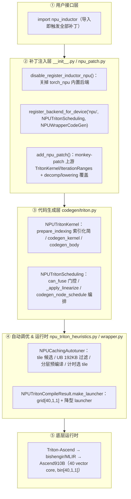

# NPU Inductor Linearize 后端分析（实验性 `npu_inductor_2.9.0`）

> 分析对象：**独立实验性** monkey-patch 后端 `npu_inductor_2.9.0`（**≠** torch_npu 内置 `_inductor`）
> 核心代码位置：`E:\97-codes\pytorch\npu_inductor_2.9.0\npu_inductor\`（约 9 千行 / 9 个 `.py`）
> 版本基线：`npu_inductor_2.9.0` 包 + upstream PyTorch **2.9.0**（区别于内置后端的 torch_npu v2.7.1.post5）
> 最后更新：2026-06-17

> [!important] 两个「NPU Inductor」别混淆
> 本页讲的是**独立实验性**的 monkey-patch 后端 `npu_inductor_2.9.0`；torch_npu **内置**的 `_inductor`（Split-Tiling / CATLASS / MLIR / DVM 多后端框架）见 [[01_npu_compile_paths_overview]]、[[11_npu_inductor_splittiling_backend_analysis]]、[[10_npu_inductor_backend_analysis]]。二者是**两条注册时互斥的路线**——本后端 `import` 时主动调 `torch_npu.utils._dynamo.disable_register_inductor_npu()` 关掉内置后端（`npu_inductor/__init__.py:87-101`），运行时只有一个生效。
>
> 本系列分三页：**本页**（架构 + Linearize + 融合门控 + rsplit + 类型适配 + 可优化点）、[[24_npu_inductor_linearize_dynamic_shape_analysis]]（动态 shape 编译一次 + 三情形 + permute 产物）、[[31_npu_inductor_linearize_vs_builtin_comparison]]（三方 output code 逐行对比 + 实测对标）。

---

## 一、定位：monkey-patch 复用上游，而非独立框架

`npu_inductor_2.9.0` 的根本取向是**最小侵入地复用上游 Inductor**：不重写调度框架，而是在上游 `SIMDScheduling`/`SIMDKernel`（`TritonScheduling`/`TritonKernel` 基类，见 [[13_scheduler_dependency_graph_fusion_and_ordering_analysis]]）的少数扩展点上挂子类 + monkey-patch，**白继承上游已验证的调度、lowering、内存规划**，只在 NPU 真正需要差异化处改写：索引线性化、tiling、融合门控、autotune 计时、类型适配。



`import npu_inductor` 按**固定顺序**装配（`__init__.py`，顺序敏感——某些补丁必须在 `register_backend` 前/后）：

| 顺序 | 动作 | 位置 | 作用 |
|---|---|---|---|
| 0 | `_ensure_mspti_preload()` | `__init__.py:11-63` | 保证 `libmspti.so` 真正 `LD_PRELOAD` 进**本**进程（必要时 `os.execv` 重启解释器一次）；用于 autotune 设备计时，未加载则回退 profiler |
| 1 | `disable_register_inductor_npu()` | `__init__.py:87-101` | **关掉 torch_npu 内置后端**（否则首次 compile 时它注册 `NPUCombinedScheduling` 覆盖本后端） |
| 2 | `register_backend_for_device('npu', NPUTritonScheduling, NPUWrapperCodeGen)` | `__init__.py:103-108` | 注册本后端（机制见 [[13_scheduler_dependency_graph_fusion_and_ordering_analysis]] 「新设备 backend 注册」） |
| 3 | `_override_disable_pointwise_autotuning()` | `__init__.py:120-136` | 让 autotune 忽略 `use_deterministic_algorithms`（否则锁死默认 tile，6.3M gelu_backward 慢约 154×；autotune 非确定性仅计时层面、不影响数值） |
| 4 | `_force_triton_available()` | `__init__.py:144-185` | NPU `get_device_capability()` 返 None 会让 `has_triton()` 抛 `TypeError`，强制 True 并清 lru_cache |
| 5 | config 覆盖 | `__init__.py:187-192` | 关 `layout_optimization` / `coordinate_descent_tuning` / `split_reductions` |
| 6 | `add_npu_patch()` | `npu_patch.py:1352` | monkey-patch 总入口（range-tree header、decomp/lowering 覆盖、类型降型、IR 补丁） |
| 7 | `NewNPUDeviceOpOverrides` / `NewNpuInterface` | `__init__.py:222-253` | 重定向 `get_raw_stream`/`is_available`/`get_compute_capability` |
| 8 | `_register_npu_inductor_fallbacks()` | `lowering.py:132` | 白名单 lowering + 其余 fallback（见 §五） |

类与基类（均继承上游）：`NPUTritonKernel`(`triton.py:438`)←`TritonKernel`；`NPUTritonKernelOverrides`(`:365`)←`TritonKernelOverrides`；`NPUTritonScheduling`(`:2305`)←`TritonScheduling`；`NPUWrapperCodeGen`(`wrapper.py:18`)←`PythonWrapperCodegen`；`NPUCachingAutotuner`(`npu_triton_heuristics.py:265`)←`CachingAutotuner`；`NPUTritonCompileResult`(`:69`)←`TritonCompileResult`。

> 一个典型坑：`NPUWrapperCodeGen.create`（`wrapper.py:19-40`）必须覆盖——上游 `PythonWrapperCodegen.create` 是 staticmethod 且硬编码 `return PythonWrapperCodegen()`，即使注册了子类也产基类实例，`memory_plan_reuse` 等覆盖被静默忽略。

---

## 二、Linearize：多维迭代空间 → 40-CU 单维 group dispatch（本后端灵魂）

由 `TRITON_CODEGEN_LINEARIZE=1`（默认开，`triton.py:103`）启用，是本后端**最具特色、内置后端没有对应物**的核心。

### 2.1 一个代数恒等式取代所有 tiling 启发式

上游 GPU 路线用 `tl.program_id(0/1/2)` 把多维 grid 交给硬件调度器、kernel 内无循环（见 [[23_inductor_gpu_kernel_dispatch_model]]）；昇腾是固定 40 个 vector core 的单维 dispatch（`bin[40,1,1]`）。Linearize 不做「哪根轴当 split/tiling」的逐算子启发式，而依赖一个**与算子无关**的恒等式：

$$
\begin{aligned}
\text{任意多维迭代空间}
&\equiv [0, \text{numel}),\qquad \text{coord}_k = \left\lfloor \frac{\text{flat}}{\text{divisor}_k}\right\rfloor \bmod \text{length}_k
\end{aligned}
$$

于是「适配 NPU」归约为：为每个 range-tree 选一组**基础轴**承载扁平空间，其余节点表达成基础轴的除/模派生。`_apply_linearize`（`triton.py:3372`）即此——它不关心算子是 matmul/softmax/layernorm，只做纯代数的轴归并。主干极短：

```python
# _apply_linearize 主干（去边界处理后的骨架，triton.py:3417+）
for i, tree in enumerate(kernel.range_trees):
    for id, (var_ranges, index_vars) in enumerate(
            sorted(..., key=lambda p: len(p[0][i]), reverse=True)):  # 按 rank 降序
        if id == 0:
            tree_expr = (index_var, var_range)   # 取 rank 最长视图作基础轴
            continue
        elif len(var_range) < max_rank:          # 其余视图：按长度匹配折叠到基础轴片段
            ... tree_node_mapping[name] = indexer(基础轴片段)
```

产物只有两样：`tree_node_mapping`（派生节点 → 基础轴的除/模表达式）与 `matcher`（body 文本替换 `{name} = {name}index` → `{name} = {基础表达式}`，把派生轴地址写回基础 flat 文本，保持连续 burst）。

### 2.2 四遍折叠：对 permute 退化输入的特例补全

主干处理常规情形；permute 会制造几类「基础轴选取产生歧义」的退化输入，四遍折叠对它们做识别补全，目标始终是**让多余视图坍缩回基础轴,绝不让它们变成独立 grid 轴**（否则 grid 退化为各视图的笛卡尔积,既慢又可能错）：

| 折叠 | 触发（退化形态） | 不折叠后果 | 开关 / 位置 |
|---|---|---|---|
| 基础降秩映射 | 节点 rank < 基础 | —（常规） | 默认（主干） |
| 转置等秩折叠 | rank 相同但轴是基础的纯置换（同组长度重排，如 `[50,4]` vs `[4,50]`） | x0,x1 与 x3,x4 当 4 独立轴 → grid 40000（应 200，**200× 慢**） | `NPU_FOLD_TRANSPOSED_XNODE`（`:3463`） |
| flat 辅助节点折叠 | 节点 divisor=1 且 length==tree.numel（整空间扁平视图） | 扁平视图与分解视图并存 → 重复计数 | 默认（`:3505`） |
| dual-decomp 折叠 | 同一 flat 空间带两条完整 divisor 链 | 两链长度不同前几遍都不触发 → Cartesian 爆炸，**既慢又错** | `NPU_FOLD_DUAL_DECOMP`（`_fold_dual_decomp:3284`） |
| reduction flat-node 折叠 | reduction 树里 flat 节点与子轴并存 | 当独立外层循环 → reduce 重复 numel 次，**又慢又错** | `NPU_FOLD_FLAT_RNODE`（`:3587`） |

#### 实例：第 3 遍 dual-decomp 折叠（4 独立轴 → 2 基础轴）

以 `_fold_dual_decomp` 注释里的真实场景：**softmax-backward + `sum(0)` + `permute([1,2,0])`**。设 `Sk=128`、`H*Sq=2048`，整迭代空间 `numel = 128×2048 = 262144`。permute 让同一片扁平空间被拆出**两条完整 divisor 链**：

```text
decomp A（load 端，basis）：x0: divisor=1,     length=128     # = Sk
                           x1: divisor=128,   length=2048    # = (H,Sq)
                           flat_A = x0 + 128*x1              # ∈ [0, 262144)
decomp B（store 端，permute 后）：x2: divisor=1,     length=16384
                              x3: divisor=16384, length=16
                              flat_B = x2 + 16384*x3         # ∈ [0, 262144)
```

两链乘积都 == numel（128×2048 = 16384×16），但**轴长度不同**——故第 1 遍转置折叠（要求长度集合相同）和第 2 遍 flat 折叠（要求单一 `length==numel` 节点）都**不触发**。不折叠则 `x0,x1,x2,x3` 当 4 个独立 grid 轴，grid 退化为笛卡尔积 `128×2048×16384×16`，既爆炸又因重复枚举**算错**。

折叠（`triton.py:3344-3354`）选 A 作 basis，把 B 的每个节点用 basis 扁平索引的除/模表示：

```text
flat_A = x0 + 128*x1                       # basis 扁平索引
x2 → ModularIndexing(flat_A, 1, 16384)     # 非顶层：取模本轴长度
x3 → FloorDiv(flat_A, 16384)               # 顶层（divisor*length==numel）：整除步长
```

于是只剩 2 基础轴 `x0,x1`，grid 恢复为正确的 262144。**地址文本修复**（`:3356-3364`）：B 驱动的 store 地址原写成 `x2 + 16384*x3`，它代数上恒等于 `flat_A`，于是直接替换回 basis 扁平文本 `x0 + 128*x1`（记入 `kernel._npu_addr_text_subs`，由 `_apply_npu_addr_text_subs:2118` 落地），permute 后的 store 仍是连续 burst 而非 div+mod scatter。

### 2.3 索引线性化（消除 NPU 上昂贵的 div/mod）

NPU 对 `(x//c)`、`(x%c)` 这类**非线性地址**会退化为 scalar/间接寻址（GPU 上 mod/div 廉价、上游直接内联）。`prepare_indexing`（`triton.py:477`）+ `_apply_linearize` 配一组纯代数 pass 把索引化简为纯仿射：

| pass | 位置 | 作用 |
|---|---|---|
| `_maybe_split_fused_axes` | `:948` | 索引以 `FloorDiv(x,c)`/`ModularIndexing(x,1,c)` 访问融合轴时，撤销上游对该轴的合并，融合符号还原为子轴 `outer*c+inner`（支持符号 divisor/modulus） |
| `_simplify_compound_indexing` | `:490` | 用 range-tree 把 `ModularIndexing(x2,d,m)`/`FloorDiv(x2,d)` 折叠为已有子节点（`x2=x0+d*x1` → `x1`）；支持复合 base |
| `_fold_trivial_modular_indexing` | `:880` | 符号 shape 下上游 `simplify_with_ranges` 证不出时，丢弃恒等 `ModularIndexing(base,1,m)`、把恒小 `FloorDiv` 折 0 |
| `_expand_divmod_nodes` | `:2680` | body 里同现 `y0//D`/`y0%D` → 拆 inner(div1,lenD)/outer(divD,len numel/D) 两个子节点并改写文本（反查 `ks0→s0` 还原 sympy 符号） |
| `_collapse_rowmajor_xtrees` | `:2811` | reduction kernel 把连续 row-major x-node 合并为单一 flat 轴（有 stride gap 时跳过） |
| `_npu_order_trees_by_stride` / `_npu_repermute_tensor_dims` | `:3098/3240` | 按真实内存 stride 重排 tensor_dim 槽位（如 `sum(dim=0)` 把连续轴放内层，避免每 r 步 stride DMA） |

### 2.4 40-CU group dispatch prologue

生成 kernel 头部固定（`codegen_kernel`，`triton.py:1711-1791`）；loop-invariant 的 `real_block_x*`/`x*_blocks` 提到 `pre_loop_code`（循环外只算一次）：

```python
def triton_kernel(..., XBLOCK: tl.constexpr):
    total_thread = 40                       # = npu_config.get_npu_vector_core_count()（npu_config.py:33）
    group_id = tl.program_id(0)
    # --- pre_loop_code（loop-invariant）：real_block_x0 / x0_blocks ... ---
    total_blocks = x0_blocks * x1_blocks * ...   # 各自由节点 block 数之积
    group_size = total_blocks // total_thread
    group_tail = total_blocks % total_thread
    group_base = group_id * group_size + group_tail
    if group_id < group_tail:               # 余数 block 均摊到前若干 core
        group_size = group_size + 1
        group_base = group_id * group_size
    for i in range(group_size):              # 每个 core 顺序处理自己负责的连续 block
        # 高维轴偏移：先除掉低维 block 数、再取模本轴 block 数（_npu_codegen_range_tree 用 accumulated_blocks 跨树累积）
        y0offset = (group_base + i) // x1_blocks % y0_blocks * real_block_y0
        ...                                  # 地址由 (group_base + i) 经除/模映射展开，全部线性
```

`iteration_ranges_get_pid`（`:1357`）把上游 `tl.program_id(0)` 替换为 `(group_base + i)`。launcher（`npu_triton_heuristics.py:206-223`）对「真正 1D pointwise」(`npu_num_x_nodes==1` 且签名有 `xnumel`、无 `R0_BLOCK`) 把 `grid_0 = min(ceil(xnumel/XBLOCK), CU_COUNT)`，省小 kernel 的空 core launch 开销；其余固定 `grid_0 = CU_COUNT`（=40）。group dispatch 的 body 对 `grid < total_thread` 仍良定义（多余 lane `group_size=0` 跑零次循环）。

> 动态 shape 下签名如何带 `numel`/`divisor`、三种情形如何生成 header，详见 [[24_npu_inductor_linearize_dynamic_shape_analysis]]。

---

## 三、融合门控：复用上游 + `NPU_MAX_FUSED_READS`

本后端**不自建融合模型**，完全复用上游 Scheduler 的 `can_fuse_vertical/horizontal` + `score_fusion`（numel 兼容 + 依赖匹配 + 共享内存打分，完整见 [[13_scheduler_dependency_graph_fusion_and_ordering_analysis]]）。只在其通过**之后**加一道后端门控（`NPUTritonScheduling.can_fuse`，`triton.py:2315`）：

```python
def can_fuse(self, node1, node2):
    if not super().can_fuse(node1, node2):
        return False
    max_reads = int(os.getenv("NPU_MAX_FUSED_READS", "24"))
    if max_reads <= 0: return True
    for n in (node1, node2):                       # 模板（matmul/attention）豁免
        if any(sub.is_template() for sub in n.get_nodes()): return True
    read_names = set()                             # 统计融合节点集合的 read 依赖并集
    for n in (node1, node2):
        for sub in n.get_nodes():
            for dep in sub.read_writes.reads: read_names.add(dep.name)
    return len(read_names) <= max_reads            # 超阈值即拒绝
can_fuse_vertical = can_fuse                       # 必修坑：重绑别名（见下）
can_fuse_horizontal = can_fuse
```

- **病灶**：T5 position-bias backward 把多层 softmax-bw 横向融成一个 70+ 指针、~290 load、~700 行 body 的 kernel，bishengir 编译爆炸（~12 min）；上游三个上限（`max_fusion_size`/`realize_opcount_threshold`/`realize_acc_reads_threshold`）只看节点数/单节点读数，全放行。read 依赖与发射 load 数单调相关，对其封顶即直接约束融合 kernel 的 load 数。加门控后同 case 编译 **726s→45.5s（约 16×）**、单 kernel 最大 load **144→15**、bit-exact。
- **必修坑**：`SIMDScheduling` 把 `can_fuse_vertical/horizontal` 绑成指向**父类**的别名,子类只覆盖 `can_fuse` 不生效；须在子类重绑别名（`triton.py:2375-2376`），否则门控永不被调用。
- 融合是**纯性能启发式**,在此拒绝绝不影响正确性（只是拆成几个小 kernel）。

> Linearize 还让「跨布局融合」真正划算：permute+pointwise 融成一个 kernel 后,索引线性化把 mod/div 还原成仿射（详见 [[31_npu_inductor_linearize_vs_builtin_comparison]] §1）；反向地,`npu_expand`（`lowering.py:266`）+ `no_fuse_buffer_names` 主动**拆**「短尾 broadcast（内维<8）+ pointwise」的融合,避免 bishengir 标量退化（inner=4 → 60+us vs inner=8 → 4us,约 15×）。

---

## 四、r 轴 rsplit：跨核 OUTER reduction（两-kernel，无 barrier）

由 `NPU_RSPLIT_OUTER=1`（默认开）启用,针对**窄输出、长 OUTER reduction**（默认沿 x 轴跨核既空核又跨步访存）。触发判定 `_npu_rsplit_outer_applicable`（`triton.py:2225`）全满足才走：① OUTER reduction；② 恰好一个 reduction、**非 welford**；③ x 自由轴 size_hint 乘积 ≤ `40*256`；④ `rnumel ≥ 2048`；⑤ `rnumel ≥ x`。

拆成两个 kernel：
- **partial**（`codegen_kernel:1738-1763` + `_npu_rewrite_rsplit_partial_body:1824`）：`program_id(0)` 选连续 reduction 轴的一段 chunk（而非 x 轴），每个 core 走完所有 x-block（`group_base=0, group_size=total_blocks`），只 reduce 自己的 `[r_lo, r_hi)` 切片，写 per-core 偏和到 `[40, x_total]` workspace 行。index 保持线性 `x0 + x_total*r0`，mask 只有纯 r 的 `r0_index < r0_hi`。
- **combine**（`_npu_emit_rsplit_combine:2481`，**字面量模板**生成——`config_of` 在该形态会 crash）：把 40 行 partial 求和成真实输出（静态 OUTER reduction，reduce 维=40，连续）。

工程细节：workspace 用 `WorkspaceArg` 以**输出 dtype** 分配（不是默认 uint8,NPU 拒绝改位宽的指针 cast）；`NPUWrapperCodeGen.memory_plan_reuse`（`wrapper.py:42`）剥离尾部无 `.name` 的 WorkspaceArg 行,避开上游 `.node.name` 崩溃。

> 这是 cooperative reduction 的 r 轴思路 + 拆两个独立 kernel **绕开 barrier**——因昇腾**无 cross-block barrier**（上游 cooperative reduction 用 semaphore barrier,NPU 不可用）；上游 `split_reductions` 在动态 numel 下产生非线性 broadcast 故默认关。上游两条 reduction 跨核路径见 [[22_inductor_reduction_codegen_deep_analysis]]。

---

## 五、类型降型 / 白名单 lowering / 算子适配

- **类型降型**（昇腾 vector core 不支持 fp64/i64 计算）：fp64→fp32 / i64→i32 / bool→int1 **全链路 5 处**——printer `_print_Float`/`_print_ToFloat`（`triton.py:122-132`）、`triton_compute_type`（`:287`，含 fp16/bf16→fp32 by `codegen_upcast_to_fp32`、各 fp8）、`_triton_type_mapping["tl.int64"]="tl.int32"`（`npu_patch.py:1447`）、`NPUTritonKernelOverrides.to_dtype`/`constant`（`triton.py:379-407`）、签名 `*i64→*i32` + `downcast_args`（`:1560`）、launcher 运行期 downcast（`npu_triton_heuristics.py:309`）。
- **白名单 lowering**（`lowering.py:132`）：`GENERATE_LIST`（约 70 算子）内才走 Inductor codegen（可被融合），其余 `make_fallback` 到 CANN aclnn。`mm`/卷积/池化/`gather`/`scatter` 等**不在白名单 → 走 CANN，无 GEMM codegen**（对比内置后端 CATLASS,见 [[11_npu_inductor_splittiling_backend_analysis]]）。
- **算子专项**：`npu_cat→CANN ConcatD`（`lowering.py:189`，上游 ConcatKernel realize-into 非连续 store 慢 20×+）；`npu_expand` 短尾 broadcast realize；`npu_var_mean_helper_` 高精度计算；`add_npu_patch` 里的 decomp 覆盖——`softmax_backward` 去 FMA、`gelu`/`gelu_backward`、`rms_norm` 走自定义、`native_dropout` 修 DT_BOOL mask、SDPA 走 `npu_fusion_attention_v3`、`matmul_backward` 补分解、0 维 CPU 标量 unwrap、`care_padding=False` 注入（默认关）、`tl.load(...).to(tl.int1)`→`(…!=0)`（避 packed-i1 trunc 越界，默认开）。
- 关闭/中和 FX pass：`_disable_pad_mm_pass`、`_disable_addmm_fusion_pass`（`npu_patch.py:1051/1071`，NPU 上 add+mm→addmm 无门控触发有害）。
- **autotune**：`NPUCachingAutotuner` 复用上游骨架,但加 **UB 192KB 预算过滤**（`_estimate_pointwise_tile_bytes`/`_filter_by_ub_estimate`，`npu_triton_heuristics.py:1418/1454`）+ balanced xblock 过滤 + mspti/profiler 计时 + `coordinate_descent` 强制关；`AUTOTUNE_ENHANCE` 路径生成对齐节点长度/divisor/饱和的大候选集。

---

## 六、可优化点

- **reduction / 归一化反向是实测短板**（[[31_npu_inductor_linearize_vs_builtin_comparison]] §二：`bn_backward_reduce` 0.28×、`bn_backward_reduction` 0.30×、`clip_ln_bw_sum_transpose` 0.41×、`sum_reduce0_1d` 0.47×、`softmax_dyn` 0.57×、`bart_ln_bw_dual_sum_512` 0.56×）——rsplit 触发窄（仅单个非 welford OUTER）,可扩展到 **welford/多输出/INNER** reduction（直击短板，已有 partial+combine 骨架）。
- **已实现但默认关闭的优化**（验证后可放开）：**per-node BLOCK autotune**（`npu_per_node_block` 代码内强制 False，`triton.py:1591/3385`；基础设施 axis_hints/per-node config builder/header 分支全就绪,多轴/转置 kernel 最受益）、`NPU_SUBTILE`、`NPU_STATIC_SPLIT_BLOCK`（曾整体负优化故回退）、`NPU_MASK_CMP_FP32`（>2²⁴ 索引精度风险）、care_padding 注入（`NPU_INJECT_CARE_PADDING=0`——设计文档称已注入,实际默认关,故该优化**目前未生效**）。
- **无 GEMM/epilogue 融合**（最大能力缺口,mm 全走 CANN,对比内置 CATLASS）——短期可做 `mm + 逐点 epilogue` 融合省一次 HBM 往返。
- **persistent reduction 一律关闭**（`should_use_persistent_reduction` 恒 False,`triton.py:441`）——小 rnumel 也走 looped,可对小 INNER reduction 选择性放开（需确认 Triton-Ascend 支持度）。
- **i64→i32 全局降型的溢出风险**（★）：张量元素数或扁平索引 > 2³¹ 时**静默溢出**（结果错,不报错）；**上游对动态 `ks*` 反而升 `tl.int64` 防溢出**（见 [[24_inductor_codegen_dynamic_shape_analysis]] §2.4），NPU 用 i32 重新引入了该问题——应在降型处加 size_hint 检查/告警。
- **UB 估算偏粗**：`_estimate_pointwise_tile_bytes` 固定 `4B/elem × 2.0 overhead`，fp16/混算/scratch 估不准,可按 dtype 细化提升 autotune 命中率。
- **文本级正则改写脆弱**（care_padding / int1 cast / rsplit body / 地址子串替换）依赖上游生成文本形态,升级易静默失配；建议上移到 IR/结构化层。
- **monkey-patch 随上游版本漂移**（各文件头部 2.3.1→2.7.1→2.9.0 迁移注记即证据）——建议为关键 patch 点加版本探测 fail-fast；白名单外算子静默 fallback,建议对 fallback 占比高的图给 debug 提示。
- **4 个模型精度未过**（`hf_Bart`、两个 `hf_T5`、`soft_actor_critic`，[[31_npu_inductor_linearize_vs_builtin_comparison]] §二）需逐 case 修（T5 系与 position-bias backward 巨型融合/dual-decomp 相关）。

---

## Related Pages

- [[24_npu_inductor_linearize_dynamic_shape_analysis]] — 本后端动态 shape：编译一次 + 三情形 A/B/C + permute 产物（本系列）
- [[31_npu_inductor_linearize_vs_builtin_comparison]] — 三方 output code 逐行对比 + §0 实测对标（本系列）
- [[01_npu_compile_paths_overview]] — torch_npu 内置三条编译路径全景（§九 GPU vs NPU 动态 shape）
- [[11_npu_inductor_splittiling_backend_analysis]] — torch_npu 内置 Triton/Split-Tiling 路径深度
- [[21_npu_inductor_optimization_analysis]] — 内置后端「硬件特性→优化思想→案例」
- [[10_npu_inductor_backend_analysis]] — 内置 NPU Inductor 后端集成架构与融合规则
- [[20_npu_lowering_guide]] — NPU 特定 lowering / fallback（与本后端白名单对照）
- [[13_scheduler_dependency_graph_fusion_and_ordering_analysis]] — 上游融合模型（本后端复用并加门控）
- [[23_inductor_gpu_kernel_dispatch_model]] — 上游 GPU 派发模型（本后端 Linearize 替换的对象）
- [[22_inductor_reduction_codegen_deep_analysis]] — 上游 reduction（cooperative/split，本后端 rsplit 的基线）
- [[21_inductor_autotuning_analysis]] — 上游 autotune（本后端 autotune 的基线）
- [[02_compile_stack/04_inductor/npu/index]] — NPU Inductor 后端目录索引
