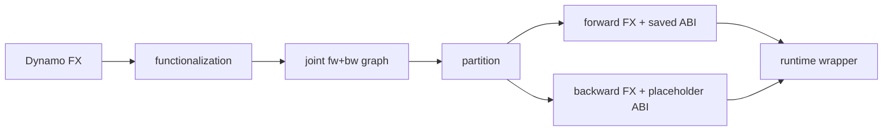
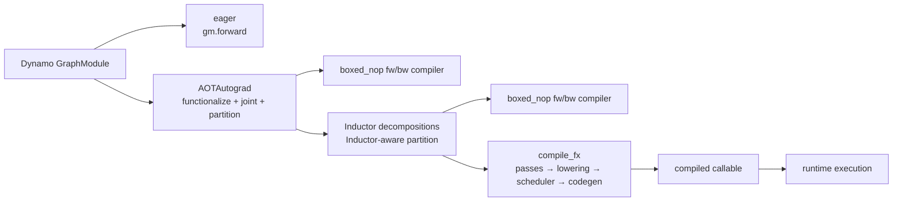
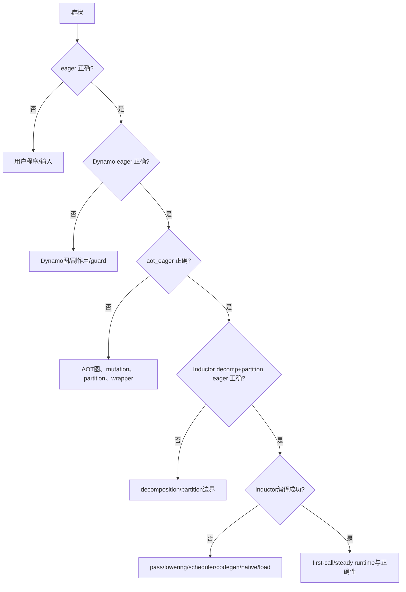

# E04 · AOTAutograd 与 Inductor Failure 分层定位

> 卷别：E · 调试、正确性与性能  
> 固定源码：PyTorch `e8f97c1a6ef8cbcdd0a946606bc1e924e4f07e52`  
> 前置：[[12_guard_failure_and_recompile_diagnosis_analysis]]  
> 后续：[[15_minifier_repro_and_compiler_bisector_analysis]]  
> 最后更新：2026-07-28

## 1. 为什么必须按 backend 阶梯定位

“`torch.compile`报错”至少可能属于：

1. eager用户程序；
2. Dynamo捕获/生成FX；
3. AOTAutograd functionalization、decomposition、joint trace与partition；
4. Inductor FX passes/lowering/scheduling/codegen；
5. native/Triton编译与module load；
6. generated wrapper首次或稳态执行。

若直接阅读最深层异常，常会把上游错误metadata传播成下游lowering失败。**核心方法**是使用
只增加一层语义的backend阶梯，找出第一个由“通过”变成“失败”的边界。

## 2. Backend 阶梯为什么有效

### `eager`

Dynamo仍捕获FX，但backend直接返回`gm.forward`
（`torch/_dynamo/backends/debugging.py:52-63`）。

- eager原函数通过、`backend="eager"`失败：优先调查Dynamo图、side effects、guards或输入
  调用契约；
- 两者都失败：先修用户程序/测试。

### `aot_eager`

它运行AOTAutograd并使用boxed nop作为fw/bw compiler：
`torch/_dynamo/backends/debugging.py:417-434`。

- `eager`通过、`aot_eager`失败：问题进入AOT的functionalization、decomposition、
  tracing、partition或runtime wrappers；
- `aot_eager`通过、`inductor`失败：问题更可能在Inductor或其运行产物。

### `aot_eager_decomp_partition`

它采用Inductor decomposition table与min-cut partition，但fw/bw仍用nop compiler，设计目的
正是隔离 AOT/decomposition/partition 与 Inductor compiler
（`torch/_dynamo/backends/debugging.py:444-473` 与
`torch/_dynamo/backends/debugging.py:474-476`）。

因此阶梯可以细化为：

```text
eager
→ Dynamo FX eager
→ AOT eager
→ AOT + Inductor decompositions/partition + eager execution
→ full Inductor
```

## 3. 故障定位矩阵

| eager | Dynamo eager | aot_eager | decomp/partition | inductor | 优先层 |
|---|---|---|---|---|---|
| fail | - | - | - | - | 用户程序/输入 |
| pass | fail | - | - | - | Dynamo capture/FX语义 |
| pass | pass | fail | - | - | AOTAutograd |
| pass | pass | pass | fail | - | Inductor decompositions/partition交界 |
| pass | pass | pass | pass | fail | Inductor/codegen/runtime |

“pass”必须同时包含结果和必要副作用正确，不能只表示“没有抛异常”。

## 4. AOTAutograd 内部再分层

AOT失败可以沿以下对象边界定位：



### Functionalization / mutation

检查view、in-place、metadata mutation是否被正确建模，输出ABI是否增加mutation更新值。

### Joint trace / autograd

确认需要梯度的输入、output tangent、autograd.Function、higher-order op和effect是否可trace。

### Partition

检查saved tensors与recompute选择、fw output和bw placeholder的顺序、symint与token。

### Runtime wrapper

检查boxed/unboxed调用、input mutation回写、alias重建、lazy backward compile和输出拆包。

分区后的fw/bw图应使用`aot_graphs`观察；joint图使用`aot_joint_graph`。这两个artifact的定义
见 `torch/_logging/_registrations.py:99-111`。

## 5. Inductor 内部再分层

```text
FX graph
→ pre/post-grad passes
→ GraphLowering
→ Inductor IR
→ Scheduler/fusion
→ wrapper/kernel source
→ native compile
→ module load
→ runtime call
```

### FX pass failure

比较pass前后图，检查node ownership、users、meta、topological order和effect。

### Lowering failure

常见信号是目标op没有lowering、layout/stride不支持、symbolic约束无法满足或fake metadata错误。

### Scheduler/codegen failure

检查IR和schedule artifact，定位fusion、loop、device code或wrapper emission。

### Native compile/load failure

保留生成源码、编译命令、stderr、toolchain版本、artifact path与mount/权限。async worker只把
异常延后到future wait，并不改变根因阶段。

### Runtime failure

区分first call触发的autotune/CUDAGraph/lazy bw与稳态kernel执行。compiled artifact的状态
边界见 [[14_compiled_artifact_lifecycle_and_runtime_failures_analysis]]。

## 6. `wrap_compiler_debug`为何放在 AOT 之后

调试包装器对AOT分离后的forward和backward compiler分别拦截。此时参数已lift为graph
inputs，GraphModule更容易序列化为独立repro
（`torch/_dynamo/repro/after_aot.py:284-313` 与
`torch/_dynamo/repro/after_aot.py:314-316`）。

调用inner compiler失败时，按 `repro_after=="aot"` 和repro level选择dump graph或生成
minifier launcher
（`torch/_dynamo/repro/after_aot.py:317-343`）。

这个位置的取舍是：

- 优点：输入ABI明确，能单独最小化fw或bw compiler；
- 限制：若失败发生在更早的AOT joint trace/partition，可能还没有这个干净边界。

## 7. 编译异常与准确率失败必须分开

异常最小化的predicate通常是：

- 异常类型/消息仍与原失败匹配；
- 编译或执行在相同阶段失败。

准确率最小化的predicate则是：

- eager/reference成功；
- compiled成功；
- 输出/梯度差异超过定义的容差。

如果缩减后变成了另一个runtime异常，不能把它当原accuracy bug。源码的accuracy helper正是
在compiled执行出现异常时跳过该候选
（`torch/_dynamo/debug_utils.py:666-686` 与
`torch/_dynamo/debug_utils.py:739-768`）。

## 源码跟读：一次 backend 调用怎样留下可定位的故障边界

### 1. Dynamo 交给 backend 的不是“异常黑盒”

`OutputGraph.call_user_compiler`先用 `dynamo_timed`建立 `backend_compile`阶段计时，再进入
`_call_user_compiler`（`torch/_dynamo/output_graph.py:3217-3228`）。后者先统计 GraphModule
里的 call 与 placeholder，给 placeholder 补 `_dynamo_source`，并把参数来源、用户栈写到
GraphModule 上（`torch/_dynamo/output_graph.py:3230-3253`）。这些 provenance state 是后续
异常能回指用户代码与输入来源的前提。

调用前还可按 compile ID 覆盖 backend 或 Inductor config
（`torch/_dynamo/output_graph.py:3254-3269`）。真正调用发生在
`compiled_fn = compiler_fn(gm, example_inputs)`；返回值必须 callable
（`torch/_dynamo/output_graph.py:3286-3293`）。除少数明确透传的异常外，编译阶段异常被包装成
`BackendCompilerFailed`（`torch/_dynamo/output_graph.py:3294-3320`）。

关键边界是：这个 `try`只包围**产生 callable**的阶段。backend 已返回 callable 之后，该
callable 在模型运行期抛出的错误属于 runtime failure，不应倒推为 capture/backend compile
失败。

### 2. backend 阶梯为什么能做因果二分

三种调试 backend 实际替换的是不同边界，而不只是换名字：

| backend | 仍执行 | 被替换 |
|---|---|---|
| `eager` | Dynamo GraphModule | 直接返回 `gm.forward`，不进 AOT/Inductor |
| `aot_eager` | AOTAutograd、min-cut partition、runtime wrapper | fw/bw compiler 都是 `boxed_nop` |
| `aot_eager_decomp_partition` | AOT + Inductor decomposition + Inductor-aware min-cut | 最终 fw/bw compiler 仍是 nop |
| `inductor` | 上述全部阶段 | 无 |

`eager`的实现直接返回 GraphModule forward
（`torch/_dynamo/backends/debugging.py:52-63`）；`aot_eager`把两个 compiler 都设为
`boxed_nop`，但保留 min-cut
（`torch/_dynamo/backends/debugging.py:417-434`）；第三种则显式引入 Inductor decomposition
table 与 `compiler="inductor"` partition，同时仍用 nop compiler
（`torch/_dynamo/backends/debugging.py:444-473`）。

因此相邻两级之间的行为变化才是证据：若 `aot_eager`通过而
`aot_eager_decomp_partition`失败，优先查 decomposition/partition；若第三层通过而
Inductor失败，才把注意力推进到 post-grad、lowering、scheduler、codegen 或 native load。



### 3. after-AOT wrapper为什么能区分 forward 与 backward compiler failure

Inductor入口在进入 `_compile_fx_inner`前安装 `inductor_compile`计时、fresh cache、
`DebugContext`，然后用 `wrap_compiler_debug`包住真正编译器
（`torch/_inductor/compile_fx.py:899-926`）。wrapper 的合同明确是分别拦截 AOT 后的
forward 与 backward GraphModule（`torch/_dynamo/repro/after_aot.py:284-301`）。

每次调用先保存原 graph copy，再调用实际 compiler；若编译抛错且配置为 `repro_after=aot`，
按 repro level 生成 compiler graph state 或 minifier 输入，然后原异常继续向外抛
（`torch/_dynamo/repro/after_aot.py:303-325`;
`torch/_dynamo/repro/after_aot.py:326-343`）。它没有把失败吞成 PASS，也没有把尚未执行的
backward compile 预先算成失败。训练图常见的“forward成功、第一次 backward 才失败”正是
lazy backward compile 的时间边界。

### 4. 这套定位法的所有权边界

- Dynamo拥有“GraphModule是否成功交给 backend、backend 是否返回 callable”的证据；
- AOT wrapper拥有“是哪张 AOT 后 Graph、forward 还是 backward compiler”的证据；
- Inductor各阶段日志拥有“pass/lowering/scheduler/codegen/native load”的细分证据；
- runtime stack与数值比较拥有“callable执行失败或结果错误”的证据。

只看最外层 `BackendCompilerFailed`会丢失内层阶段；只看最终 stack 最底层也可能把包装层与
根因混为一谈。正确做法是沿这四层 ownership 从外向内收缩。

## 8. 决策树



## 9. 复杂度与调查成本

backend阶梯最多增加常数个完整执行，但每层可能触发独立capture/compile。若一次测试成本为
$T_j$，总定位成本为：

$$
T_{\text{ladder}}=\sum_j T_j
$$

通过固定seed、输入和cache状态可以降低噪声。不要在同一进程依次运行后直接比较冷启动，
因为前层可能改变cache、allocator、device context和autotune状态。

## 10. 验收不变量

- 每个阶梯使用同一输入语义和随机状态；
- 同时比较值、梯度、mutation、alias和异常；
- 失败阶段与artifact时间线一致；
- repro能在干净进程复现；
- forward与backward分别标记；
- native compile、load、first call和steady call不混为一层；
- 最小化predicate不会接受不同失败。

## 11. 常见误解

- **“`aot_eager`就是完全eager。”** 它仍执行AOTAutograd的图变换和runtime wrapper。
- **“Inductor失败一定是kernel code问题。”** 也可能是FX pass、lowering、native load或runtime。
- **“最深层stack frame就是根因。”** 上游错误meta可能在下游才触发断言。
- **“没有异常就说明该层正确。”** accuracy、alias或mutation仍可能错误。
- **“forward成功说明训练编译成功。”** backward可能lazy compile并独立失败。

## 配套 Demo

本页对应卷级入口 `tools/labs_torch_compile/demo_e_diagnostics.py` 的 `stage_failure_localization` 用例。默认以 CUDA 为验收设备：

```powershell
python -B tools\labs_torch_compile\demo_e_diagnostics.py `
  --case stage_failure_localization --device cuda `
  --output-dir tools\labs_torch_compile\artifacts\volume_demos\e04
```

先用 `--list --json` 查看用例声明的能力要求。无 CUDA 的机器可把 `--device` 改为 `cpu` 探索设备无关机制；CUDA/Triton/多卡专属用例会返回 `BLOCKED`，且不会执行用例正文。不要把 `BLOCKED` 写成 `PASS`。

重点读取 `summary.json` 与 `stage_failure_localization/result.json`：`status` 区分 `PASS/BLOCKED/FAIL`，`environment` 固化运行环境，`observations` 保存本页机制的实测字段，`artifacts` 指向图代码、日志、trace 或进程证据。`PASS` 只表示该次运行中的断言通过，不外推到其他 PyTorch 版本、shape、dtype 或硬件。

## Related Pages

- [[courses/torch_compile_end_to_end]]
- [[15_inductor_compile_fx_orchestration_analysis]]
- [[13_aot_runtime_wrappers_and_lazy_backward_compile_analysis]]
- [[12_guard_failure_and_recompile_diagnosis_analysis]]
- [[15_minifier_repro_and_compiler_bisector_analysis]]
- [[16_compiled_correctness_validation_methodology_analysis]]
