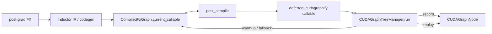
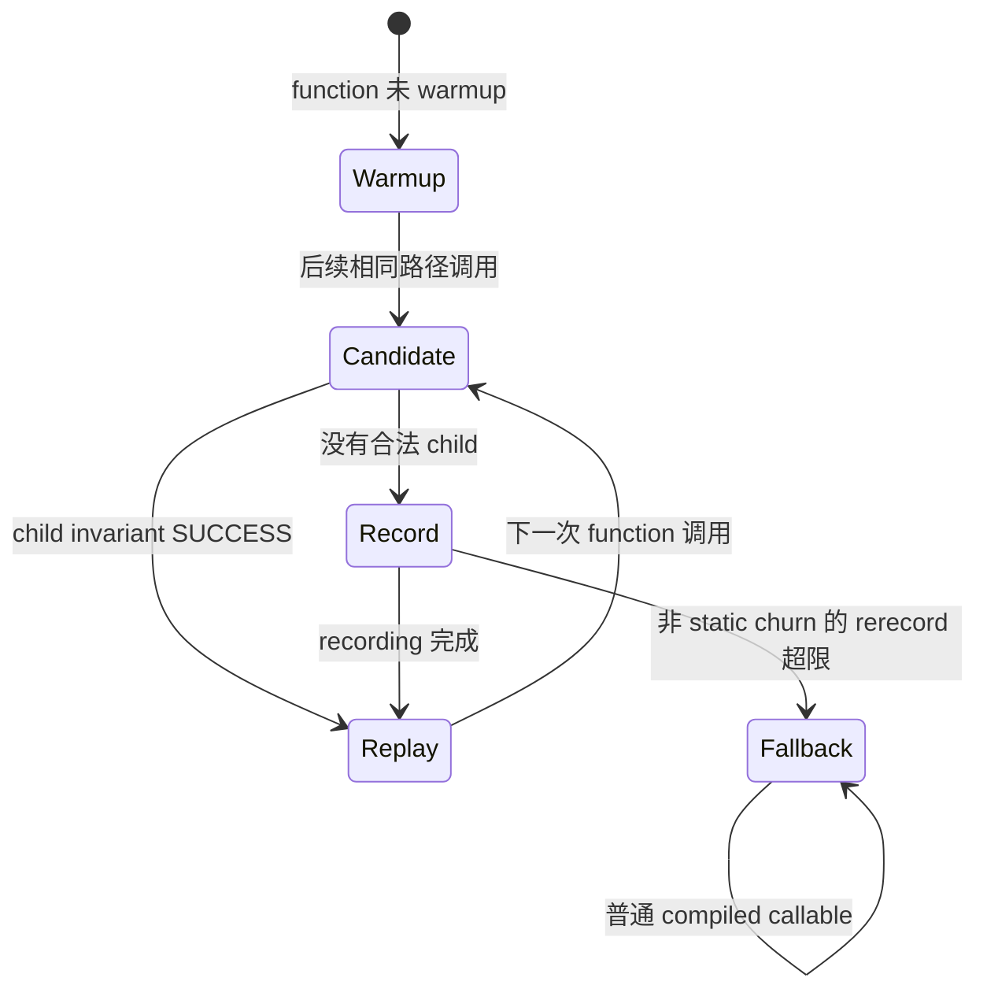

# D06 · CUDAGraph Trees：Warmup、Record、Replay 与内存路径

> 卷别：D · 编译产物、缓存与运行时  
> 固定源码：PyTorch `e8f97c1a6ef8cbcdd0a946606bc1e924e4f07e52`  
> 前置：[[12_buffer_liveness_memory_planning_and_reuse_analysis]]  
> 后续：[[14_compiled_artifact_lifecycle_and_runtime_failures_analysis]]  
> 最后更新：2026-07-30(kb-reorg P4 Task 6 迁入本目录,去 d06_ 前缀;判重 vs [[10_pytorch_cuda_graphs_complete_guide]] 方式2/综合比较节——独有内容(源码级 Tree 状态机、`cudagraph_trees.py` 行级证据)>50%,保留为专题页,详见该页方式2 小节互指)

## 1. 为什么 runtime CUDA Graph不是FX graph

FX/Inductor图是编译IR；CUDA Graph记录的是某次设备执行：

- kernel launches；
- memcpy/memset；
- 固定地址上的device work；
- stream上的执行顺序；
- private memory pool中的allocation pattern。

它不包含FX Node语义，也不是AOTAutograd fw/bw graph。

**核心结论**：CUDAGraph Tree是对已经编译好的boxed callable做runtime record/replay；它的
“节点和边”描述recording的内存/liveness路径，而非Tensor值依赖。

## 2. 为什么不是“一函数一个CUDA Graph”

同一compiled function可能在不同上下文运行：

- 前面是否有另一个recording的live outputs；
- static input地址；
- dynamic integer key；
- input mutation；
- forward/backward阶段；
- memory pool checkpoint；
- 用户output是否仍存活。

因此同一个function可在树的不同parent路径下有多个recordings。`CUDAGraphNode`注释说明：
每个node只有一个parent但可有多个children，并共享一个memory pool
（`torch/_inductor/cudagraph_trees.py:902-920`）。

## 3. Deferred cudagraphify为何按整数输入分cache

动态SymInt在generated wrapper中可能作为Python int输入。`cudagraphify_impl`：

- 提取int inputs形成key；
- 不允许capture的size直接走普通model；
- 已有key直接复用recorded function；
- miss时对齐/复制inputs并record；
- 把结果存入 `fn_cache[int_key]`。

见 `torch/_inductor/cudagraph_trees.py:414-441` 与
`torch/_inductor/cudagraph_trees.py:442-470`。

所以动态shape可能导致多份runtime recordings，即使Dynamo/Inductor graph本身没有重编译。

## 4. Tree manager保存什么

`CUDAGraphTreeManager`管理：

- roots和function到recording nodes；
- function metadata/stack traces；
- warmed functions；
- mutation/rerecord counters；
- current path state；
- 当前node/generation；
- 一个device上的共享capture stream和graph memory pool。

职责与设计见 `torch/_inductor/cudagraph_trees.py:2243-2265`，roots/functions/warmup状态见
`torch/_inductor/cudagraph_trees.py:2268-2287`。

## 5. 为什么共享pool还要树

共享pool能让不同recordings复用同一memory arena，但必须保证：

- replay时allocation地址与record时一致；
- previous graph live outputs占用的blocks一致；
- 后续graph从相同allocator checkpoint开始；
- path执行顺序和output lifespan匹配。

Tree把“哪条recording可合法接在哪个memory state之后”显式化。若pool没有live allocations，
manager可结束当前tree，减少不必要耦合。

## 6. Warmup为何在graph pool内执行

record前需要warmup：

- 初始化lazy modules/kernels；
- 完成首次allocator行为；
- 避免capture期间发生不允许的初始化；
- 观察真实output/liveness。

若用普通pool warmup，再在graph pool record，地址pattern可能不同；若额外保留输入又会增加
training内存。Tree manager因此在graph pool中warmup，并在必要时checkpoint allocator state。
源码动机见 `torch/_inductor/cudagraph_trees.py:2258-2265`。

## 7. Node怎样跟踪liveness

`CUDAGraphNode`使用：

- output storage weakrefs；
- 从root到当前node的path weakrefs；
- Tensor weakrefs；
- cudagraph-managed input indices；
- 对live previous outputs的alias引用；
- static/non-static input分类。

关键字段见 `torch/_inductor/cudagraph_trees.py:952-981` 与
`torch/_inductor/cudagraph_trees.py:983-1002`。

这里weakref用于判断storage/output生命周期和memory path，不是Dynamo ID guard。

## 8. 第一次、第二次和稳态调用

对某个function/path：

1. **首次**：可能只warmup并返回eager compiled callable结果；
2. **后续**：在相同memory context下record CUDA Graph；
3. **稳态**：检查invariants后replay；
4. **invariant miss**：尝试已有sibling recording或re-record；
5. **反复re-record**：超过上限后fallback普通compiled callable。

manager在未warmup或正在warmup时走eager warmup
（`torch/_inductor/cudagraph_trees.py:2482-2503`）。
已有child先检查invariants，成功才execute
（`torch/_inductor/cudagraph_trees.py:2505-2520`）。

## 9. 哪些invariant会导致re-record/fallback

- static input data_ptr变化；
- live output集合/lifespan变化；
- path parent不匹配；
- alias关系变化；
- mutation不安全；
- dynamic int key变化；
- alignment变化；
- generation/memory pool state变化。

非static-input churn的unexpected rerecord会计数，超过limit后fallback
（`torch/_inductor/cudagraph_trees.py:2522-2543` 与
`torch/_inductor/cudagraph_trees.py:2563-2580`）。

## 10. Forward/backward怎样共享runtime manager

Inductor post-compile在forward记录device index；backward callable运行前通知同一manager进入
backward状态。包装逻辑见 `torch/_inductor/output_code.py:181-210`。

这不是把fw/bw FX图连接起来，而是告诉runtime memory-path state machine当前阶段，以正确
回收activations和选择recording path。

## 11. CUDAGraph包装发生在cache之后

`CompiledFxGraph.post_compile`在cache hit/miss之后执行。若满足条件，
`cudagraph_post_compile`用compiled callable、static input indices、constants、mutation和
output metadata创建runtime wrapper
（`torch/_inductor/output_code.py:230-259`、
`torch/_inductor/output_code.py:260-260`、
`torch/_inductor/output_code.py:272-301` 与
`torch/_inductor/output_code.py:302-312`）。

这一包装结果不序列化进FXGraphCache；新进程load后要重新建立runtime manager/recordings。

## 12. 性能与内存权衡

收益：

- 减少Python和kernel launch overhead；
- 稳定多kernel工作流replay；
- 共享private pool。

代价：

- warmup与record额外调用；
- private pool持有memory；
- 输入地址/shape/liveness限制；
- dynamic key产生多recordings；
- rerecord/fallback；
- 调试/profiling复杂度。

因此 `reduce-overhead`是策略，不是无条件加速承诺。

## 13. 源码跟读：compiled callable怎样进入 Tree状态机

### 13.1 `post_compile`只换 callable，不改任何 FX node

`cudagraph_post_compile`接收已经生成的 `CompiledFxGraph`，检查策略后**原地替换**
`compiled_graph.current_callable`（`torch/_inductor/output_code.py:230-257`）。它从cache
metadata和本次装载环境组装device、forward/backward模式、constants、mutated inputs与
user-visible outputs，再调用policy或默认 `cudagraphify`
（`torch/_inductor/output_code.py:272-312`）。

这条边界证明 runtime CUDA Graph不参与FX pass：



FXGraphCache可缓存编译产物与CUDAGraph eligibility metadata，却不能序列化当前进程的CUDA
stream、allocator pool、live output weakrefs或已record的graph。因此cache hit后仍必须执行
这层包装。

### 13.2 第一层cache按动态整数值分流

`cudagraphify_impl`只在closure中保存 `fn_cache`和哪些输入位置是Python int
（`torch/_inductor/cudagraph_trees.py:414-429`）。每次调用先抽取 `int_key`：

1. key不在允许capture的sizes集合，直接调用普通compiled model；
2. `fn_cache`命中，直接调用该key的deferred recording；
3. miss时检查alignment、调整static input集合并复制misaligned inputs；
4. 调用真正的 `cudagraphify`，缓存返回的函数，同时把这一次产生的output直接返回。

对应分支在 `torch/_inductor/cudagraph_trees.py:431-470`。这里的key变化只是runtime
recording多态性，不必然触发 Dynamo guard miss或重新lower FX图。

### 13.3 manager先按device隔离，再按function/path选择node

manager container存在线程局部状态中，并以 `device_index`加锁创建
（`torch/_inductor/cudagraph_trees.py:384-400`）。一个manager的roots、function metadata
和warmed set见 `torch/_inductor/cudagraph_trees.py:2268-2287`。每次 `run`先把
function对应的 FORWARD/BACKWARD mode设为当前状态，执行 `_run`，再更新“是否有待运行
backward的forward”标志（`torch/_inductor/cudagraph_trees.py:2382-2399`）。

`_run`首先结束遗留的record/warmup状态并处理generation边界，然后判断mutation
（`torch/_inductor/cudagraph_trees.py:2445-2478`）。真正的三态分支是：



未warmup、处于warmup或强制warmup时，它在必要时先恢复allocator checkpoint，再在
`graph_capture_lock`下调用 `run_eager`
（`torch/_inductor/cudagraph_trees.py:2482-2503`）。否则从roots或current node的children中
逐个检查同一function的recordings，首个 invariant成功者立即执行
（`torch/_inductor/cudagraph_trees.py:2505-2520`）。

### 13.4 replay为什么仍要复制输入和重建输出

`CUDAGraphNode.run`并不是裸 `cudaGraphLaunch`：它先检查static inputs地址，再把本次动态
输入复制到record时的稳定buffer，执行graph，依据保存的storage/alias metadata重建
outputs，最后清空输入列表
（`torch/_inductor/cudagraph_trees.py:1246-1265`）。

candidate是否可用还要求“liveness、static inputs、private-pool managed tensors”稳定；
检查入口及managed pointer比较见
`torch/_inductor/cudagraph_trees.py:1932-1961`。node保留共享pool、children以及当前path的
storage/tensor weakrefs（`torch/_inductor/cudagraph_trees.py:952-981`），所以树边表达：

> 在父recording留下的allocator checkpoint与仍存活outputs条件下，这个child recording的
> 固定地址假设成立。

它不是Tensor值依赖边。真实Tensor数据依赖早已在compiled kernels中；树只决定哪份recording
能在当前memory state下安全replay。

### 13.5 invariant miss后的fallback不是重新编译

若child检查失败，除 `StaticInputIdxMismatch`这种允许的地址churn外，其余原因计入
unexpected rerecord（`torch/_inductor/cudagraph_trees.py:2522-2543`）。达到上限后直接
调用 `ids_to_funcs[function_id].model(new_inputs)`；未超限则checkpoint当前执行状态并
record一个新node（`torch/_inductor/cudagraph_trees.py:2563-2599`）。

这个fallback仍执行已经编译的Inductor callable。它放弃的是CUDA Graph replay，不是退回
eager PyTorch，也不是创建新FX graph。forward即使未被CUDAGraph包装，backward wrapper仍会
通知同device manager进入backward generation
（`torch/_inductor/output_code.py:181-208`），以免错误保留上一轮forward的activation
liveness状态。

## 14. 复杂度

设函数有 $R$ 个recording paths，当前parent下 $C_f$ 个children：

- child匹配要检查候选invariants，worst case $O(C_f \cdot Q)$；
- record成本约为一次compiled execution加capture开销；
- replay launch overhead近似常数，但kernel本身成本不变；
- memory随shared pool high-water mark、live path outputs和recordings增长；
- int key cache空间随实际动态key种类增长。

## 15. 常见误解

- **“CUDA Graph是编译器的最终FX图。”** 它是runtime device-work recording。
- **“第一次调用就一定record并replay。”** 常先warmup，后续才record。
- **“同一compiled function只有一份recording。”** memory parent/path不同可产生多个node。
- **“FXGraphCache hit会复用CUDA Graph。”** runtime recording通常需在本进程重新建立。
- **“private pool memory等于泄漏。”** 它是replay地址稳定性的设计代价，但应被监控。

## 配套 Demo

本页对应卷级入口 `tools/labs_torch_compile/demo_d_artifact_runtime.py` 的 `cudagraph_replay` 用例。默认以 CUDA 为验收设备：

```powershell
python -B tools\labs_torch_compile\demo_d_artifact_runtime.py `
  --case cudagraph_replay --device cuda `
  --output-dir tools\labs_torch_compile\artifacts\volume_demos\d06
```

先用 `--list --json` 查看用例声明的能力要求。无 CUDA 的机器可把 `--device` 改为 `cpu` 探索设备无关机制；CUDA/Triton/多卡专属用例会返回 `BLOCKED`，且不会执行用例正文。不要把 `BLOCKED` 写成 `PASS`。

重点读取 `summary.json` 与 `cudagraph_replay/result.json`：`status` 区分 `PASS/BLOCKED/FAIL`，`environment` 固化运行环境，`observations` 保存本页机制的实测字段，`artifacts` 指向图代码、日志、trace 或进程证据。`PASS` 只表示该次运行中的断言通过，不外推到其他 PyTorch 版本、shape、dtype 或硬件。

## Related Pages

- [[courses/torch_compile_end_to_end]]
- [[12_buffer_liveness_memory_planning_and_reuse_analysis]]
- [[14_compiled_artifact_lifecycle_and_runtime_failures_analysis]]
- [[17_compile_latency_cache_and_steady_state_performance_analysis]] — warmup/record/replay 在整体成本模型中的位置
- [[20_training_inference_cudagraph_and_freezing_analysis]]
- [[01_eager_runtime/07_memory_amp_profiler/index]]
