# torch.compile(backend="npugraphs") 深度解析

> 本文基于 `torch_npu` 的 NPU Graphs Backend 实现，深入分析 `torch.compile(backend="npugraphs")` 的完整调用链路、代码实现逻辑、NPU Graph Tree 机制，以及与 `make_graphed_callables` 的对比。

---

## 一、整体架构概览

### 1.1 调用入口

```python
model = torch.compile(model, backend="npugraphs")
output = model(input)  # 触发编译与执行
```

**后端注册位置**：
- 文件：`torch_npu/utils/_graph_tree.py`
- 关键代码（第358-364行）：

```python
def _apply_npugraph_tree_methods():
    # aot_npugraphs only applies graphs to the graph.  It is also helpful
    # for debugging and can serve as a perf baseline.
    register_backend(name="npugraphs", compiler_fn=NpugraphsBackend())
    torch._inductor.compile_fx.cudagraphify = npugraphify
    torch._inductor.cudagraph_utils.check_multiple_devices_or_any_cpu_nodes = check_multiple_devices_or_any_cpu_nodes
    torch.compiler.npugraph_mark_step_begin = npugraph_mark_step_begin
```

### 1.2 核心组件架构

```
┌────────────────────────────────────────────────────────────────────────────────┐
│                        torch.compile(backend="npugraphs")                        │
├────────────────────────────────────────────────────────────────────────────────┤
│  1. TorchDynamo (torch/_dynamo)                                                 │
│     ├── 捕获 Python 代码 → FX Graph                                             │
│     └── 调用后端: npugraphs(dynamo_model, dynamo_inputs)                         │
├────────────────────────────────────────────────────────────────────────────────┤
│  2. NpugraphsBackend (torch_npu/utils/_graph_tree.py)                          │
│     ├── 调用 npugraphs() 函数                                                   │
│     └── 使用 aot_autograd 包装前向/反向/推理编译器                               │
├────────────────────────────────────────────────────────────────────────────────┤
│  3. NPU Graph Tree 核心 (torch_npu/npu/_graph_tree.py)                          │
│     ├── NPUGraphTreeManager: 管理图树生命周期                                    │
│     ├── NPUGraphNode: 单个 NPU Graph 节点（录制/回放）                           │
│     └── NPUWarmupNode: Warmup 阶段节点                                           │
├────────────────────────────────────────────────────────────────────────────────┤
│  4. NPU Graph 底层 (torch_npu/npu/graphs.py)                                     │
│     ├── make_graphed_callables(): 底层 API                                      │
│     ├── NPUGraph: 图对象 (capture_begin/replay)                                  │
│     └── 私有内存池管理                                                           │
└────────────────────────────────────────────────────────────────────────────────┘
```

### 1.3 整体调用流程图

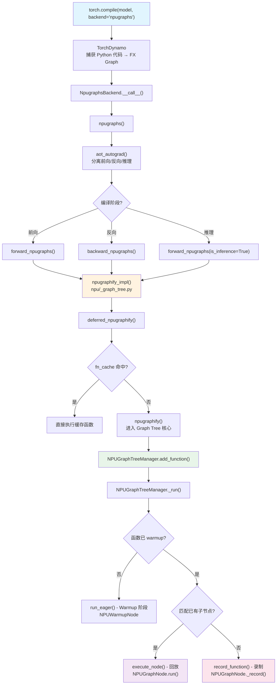

---

## 二、完整调用链路分析

### 2.1 Phase 1: TorchDynamo 捕获与后端分发

**详细调用栈**：
```
torch.compile(model, backend="npugraphs", ...)
    ↓ (torch/_dynamo/eval_frame.py:1438)
_torchdynamo.optimize(backend="npugraphs", ...)
    ↓ (torch/_dynamo/eval_frame.py:1488)
_optimize(rebuild_ctx, backend="npugraphs", ...)
    ↓ (torch/_dynamo/eval_frame.py:1638)
backend = get_compiler_fn(backend)  # 解析字符串 "npugraphs" 为可调用对象
    ↓ (torch/_dynamo/backends/registry.py)
lookup_backend("npugraphs") → NpugraphsBackend()  # 返回后端实例
    ↓ (torch/_dynamo/eval_frame.py:1730)
_optimize_catch_errors(
    convert_frame.convert_frame(backend, hooks, package),
    hooks, backend_ctx_ctor, ...
)
    ↓ (torch/_dynamo/eval_frame.py:550)
OptimizeContext 作为装饰器包装原始函数

# 当首次调用被编译的函数时：
model(input)  # 触发实际编译流程
    ↓ (torch/_C/dynamo/eval_frame.c - CPython frame evaluation)
PyTorch Dynamo C 钩子拦截 Python 帧执行
    ↓ (torch/_dynamo/eval_frame.py:280)
_callback_from_storchdynamo(...) 处理帧捕获
    ↓ (torch/_dynamo/convert_frame.py:...)
_convert_frame_impl(frame, cache_entry, hooks, ...)
    ↓ (torch/_dynamo/symbolic_convert.py:...)
InstructionTranslator 分析字节码
    - 逐条解释 Python 字节码指令
    - 构建符号化变量跟踪
    - 识别 PyTorch 操作并构建 FX Graph
    ↓ (torch/_dynamo/output_graph.py:...)
OutputGraph 收集操作并构建 FX GraphModule
    ↓ (torch/_dynamo/convert_frame.py:1452)
compile_inner(gm, example_inputs) 调用后端编译
    ↓
backend_callable = lookup_backend("npugraphs")  # 获取已注册的后端
    ↓
backend_callable(dynamo_model=gm, dynamo_inputs=example_inputs)
    ↓ 进入 NPU Graphs 后端处理流程
```

**关键组件详细说明**：

| 组件 | 文件位置 | 功能描述 |
|------|----------|----------|
| `optimize()` | `torch/_dynamo/eval_frame.py:1438` | TorchDynamo 主入口，配置编译选项并创建 `OptimizeContext` |
| `_optimize()` | `torch/_dynamo/eval_frame.py:1488` | 内部优化逻辑，解析 backend、设置 hooks、创建编译回调 |
| `convert_frame()` | `torch/_dynamo/convert_frame.py` | 将 Python 帧转换为 FX Graph 的核心逻辑 |
| `InstructionTranslator` | `torch/_dynamo/symbolic_convert.py` | 符号化字节码解释器，跟踪变量状态并构建计算图 |
| `OutputGraph` | `torch/_dynamo/output_graph.py` | 收集计算节点，构建最终的 `torch.fx.GraphModule` |

**TorchDynamo 字节码捕获机制**：

```python
# TorchDynamo 通过 CPython 的 PEP 523 帧评估钩子工作
# 核心流程：

1. CPython 帧执行钩子设置
   ↓
2. 当 Python 函数被调用时，Dynamo C 钩子拦截
   ↓  
3. 检查缓存：是否有已编译的 GuardedCode？
   - 是：验证 guards 是否仍有效
     - 有效：执行编译后的代码
     - 无效：重新编译
   - 否：首次编译
     ↓
4. Dynamo 字节码分析 (InstructionTranslator)
   - 逐条解释 Python 字节码
   - 构建符号化执行状态
   - 识别 PyTorch 操作 (aten ops)
   ↓
5. 构建 FX Graph
   - 每个 aten op 成为 FX Graph 的一个节点
   - 跟踪张量形状、类型、设备
   - 处理控制流（条件、循环）→ 可能产生 graph breaks
   ↓
6. 调用后端编译器
   - 将 FX GraphModule + 示例输入传递给后端
   - 后端返回可执行函数
   ↓
7. 生成 GuardedCode
   - 包装编译后的函数 + guards
   - 存入缓存以便复用
   ↓
8. 执行编译后的代码
   - 返回结果给原始 Python 调用
```

### 2.2 Phase 2: NpugraphsBackend 初始化

**代码位置**：`torch_npu/utils/_graph_tree.py` (第344-362行)

```python
class NpugraphsBackend:
    compiler_name = "npugraphs"

    @staticmethod
    def reset():
        from torch_npu.npu._graph_tree import reset_npugraph_trees
        reset_npugraph_trees()

    @staticmethod
    def __call__(model, inputs):
        return npugraphs(model, inputs)
```

### 2.3 Phase 3: npugraphs 函数 - AOT Autograd 包装

**代码位置**：`torch_npu/utils/_graph_tree.py` (第260-340行)

```python
def npugraphs(dynamo_model, dynamo_inputs):
    from torch_npu.npu._graph_tree import npugraphify_impl as new_npugraphify_impl

    do_npugraphs = BoxedBool(True)
    boxed_device_index = BoxedDeviceIndex(None)

    def forward_npugraphs(aot_model, aot_inputs, is_inference=False):
        interp = boxed_nop(aot_model, aot_inputs)
        fixed = num_fw_fixed_arguments(len(dynamo_inputs), len(aot_inputs))
        skip_msg = check_for_skip(aot_model, fixed)
        if skip_msg:
            BoxedBool.disable(do_npugraphs)
            log_cudagraph_skip_and_bump_counter(f"skipping npugraphs due to {skip_msg}")
            return interp

        boxed_device_index.set(get_device_index(aot_model))
        out = new_npugraphify_impl(
            interp, aot_inputs, range(fixed),
            device_index=boxed_device_index.value,
            is_backward=False, is_inference=False,
            stack_traces=get_stack_traces(aot_model),
            placeholders=get_placeholder_info(aot_model.graph),
            mutated_input_idxs=find_input_mutations(aot_model.graph),
        )
        out._boxed_call = True
        return out

    def backward_npugraphs(aot_model, aot_inputs):
        # 类似 forward_npugraphs，但 is_backward=True
        ...

    # 使用 aot_autograd 包装
    aot_npugraphs = aot_autograd(
        fw_compiler=forward_npugraphs,
        bw_compiler=backward_npugraphs,
        inference_compiler=functools.partial(forward_npugraphs, is_inference=True),
        keep_inference_input_mutations=torch._dynamo.config.cudagraph_backend_keep_input_mutation,
    )
    return aot_npugraphs(dynamo_model, dynamo_inputs)
```

**`npugraphs()` 函数内部流程图**：

```mermaid
flowchart TB
    subgraph npugraphs["npugraphs(dynamo_model, dynamo_inputs)"]
        A["初始化状态变量<br/>do_npugraphs = BoxedBool(True)<br/>boxed_device_index = BoxedDeviceIndex(None)"]
        
        subgraph fw["forward_npugraphs(aot_model, aot_inputs)"]
            B["boxed_nop(aot_model, aot_inputs)<br/>→ 创建 interp 解释器"]
            C["num_fw_fixed_arguments()<br/>→ 计算固定参数数量 fixed"]
            D["check_for_skip(aot_model, fixed)<br/>→ 检查是否需要跳过"]
            E{"skip_msg<br/>不为空?"}
            F["BoxedBool.disable(do_npugraphs)<br/>log_cudagraph_skip_and_bump_counter<br/>return interp"]
            G["get_device_index(aot_model)<br/>→ 获取 NPU 设备索引"]
            H["new_npugraphify_impl(<br/>  interp, aot_inputs, range(fixed),<br/>  device_index, is_backward=False, ...)<br/>→ 进入 Graph Tree"]
            I["out._boxed_call = True<br/>return out"]
        end

        J["aot_autograd() 包装<br/>fw_compiler=forward_npugraphs<br/>bw_compiler=backward_npugraphs<br/>inference_compiler=partial(forward, is_inference=True)"]
        K["aot_npugraphs(dynamo_model, dynamo_inputs)<br/>→ 返回编译结果"]
    end

    A --> B
    B --> C --> D --> E
    E -->|是| F
    E -->|否| G --> H --> I
    I --> J --> K

    style npugraphs fill:#fafafa
    style fw fill:#e3f2fd
```

#### 为什么需要三个 compiler？—— PyTorch AOTAutograd 的设计

`aot_autograd` 需要三个 compiler 是因为 PyTorch 的 **AOTAutograd（Ahead-of-Time Autograd）** 将 autograd 从运行时提前到了编译时。一旦这样做，一个模型的计算图就会被拆分成**三种不同性质的子图**，每种子图的编译需求和上下文不同：

| Compiler | 调用场景 | 图的特点 |
|------|------|------|
| `fw_compiler` | 训练模式下的**前向子图** | 经过 partition 拆分，输出包含用户期望的输出 + 为反向保留的中间激活值（saved tensors） |
| `bw_compiler` | 训练模式下的**反向子图** | 接收梯度和前向保存的中间值，计算参数梯度。在 `common.py` 中会被额外包上 `disable` 装饰器，防止 TorchDynamo 再次 trace 反向编译器本身 |
| `inference_compiler` | **推理模式**（`torch.no_grad()` 或所有输入不需要梯度） | 整个计算图是一个完整的推理图，不需要拆分前向/反向 |

核心分发逻辑在 `torch/_functorch/_aot_autograd/graph_compile.py` 中：

```python
# aot_stage2_compile:
if aot_state.needs_autograd and not aot_state.aot_config.pre_dispatch:
    return aot_stage2_autograd(aot_state, aot_graph_capture)  # 走 fw_compiler + bw_compiler
else:
    return aot_stage2_inference(aot_state, aot_graph_capture)  # 走 inference_compiler
```

在推理/前向的编译入口中，根据 `is_inference` 标志选择不同的 compiler：

```python
if is_inference:
    compiler = aot_config.inference_compiler
else:
    compiler = aot_config.fw_compiler
```

因此，`npugraphs` 函数中的三个 compiler 分别对应：
- **`fw_compiler=forward_npugraphs`**：训练前向 → 用 NPU Graph 捕获前向计算
- **`bw_compiler=backward_npugraphs`**：训练反向 → 用 NPU Graph 捕获反向计算（反向有额外逻辑，如检查 `do_npugraphs` 状态和处理 backward generation）
- **`inference_compiler=functools.partial(forward_npugraphs, is_inference=True)`**：推理 → 复用前向编译器但通过 `is_inference=True` 标记为推理模式

如果 `bw_compiler` 或 `inference_compiler` 未提供，`common.py` 中的 `AotAutograd.__call__` 会自动回退到使用 `fw_compiler`：

```python
bw_compiler = self.kwargs.get("bw_compiler") or self.kwargs["fw_compiler"]
self.kwargs["inference_compiler"] = (
    self.kwargs.get("inference_compiler") or self.kwargs["fw_compiler"]
)
```

#### `forward_npugraphs` 逐行解析

这是一个闭包函数，定义在 `npugraphs()` 内部。它是一个 **AOTAutograd compiler**——AOTAutograd 会把经过 functionalization + autograd 分解 + partition 后产生的前向子图 FX GraphModule 传给它编译。

**输入参数**：
- `aot_model`：`torch.fx.GraphModule`，AOTAutograd 分解后的前向子图。不是原始 `nn.Module`
- `aot_inputs`：前向子图的输入张量列表。比原始 `dynamo_inputs` **多**，因为 AOTAutograd 会把 params/buffers 提升（lift）为图的显式输入
- `is_inference`：标记是否为推理模式。作为 `inference_compiler` 时通过 `functools.partial` 传入 `True`

**输出**：一个可调用对象（compiled function），接收输入张量列表，返回前向计算结果。

```python
def forward_npugraphs(aot_model, aot_inputs, is_inference=False):
```

**第 267 行 — 将 FX 图转为 boxed 可调用函数**：

```python
    interp = boxed_nop(aot_model, aot_inputs)
```

`boxed_nop` 来自 `torch._dynamo.backends.debugging`，它将 FX GraphModule 的 codegen 设为 `_BoxedCodeGen`（使 `forward` 方法接受一个 list 参数 `(args)` 而非展开的 `(*args)`），重新编译并返回包装后的可调用对象。`interp` 是原始 FX 图的**解释器执行**版本——直接用 Python 解释执行 FX 图，不做任何额外编译优化。它是后续 NPU Graph 捕获的**被包装对象**。

**第 268 行 — 计算固定地址输入的数量**：

```python
    fixed = num_fw_fixed_arguments(len(dynamo_inputs), len(aot_inputs))
```

计算 AOT 前向图中**地址固定的输入**（params 和 buffers）数量。公式：`fixed = aot_fw_num_inputs - dynamo_num_inputs - num_rng_seed_offset_inputs`。这些输入的 data pointer 在多次调用间不会变化，对 NPU Graph 至关重要——Graph replay 时需要知道哪些输入可以直接复用地址，哪些需要每次 copy 新数据。`fixed` 作为 `static_input_idxs`（`range(fixed)`）传入后续的 `npugraphify_impl`。

**第 269-275 行 — 检查是否应跳过 NPU Graph 捕获**：

```python
    skip_msg = check_for_skip(aot_model, fixed)
    if skip_msg:
        BoxedBool.disable(do_npugraphs)
        log_cudagraph_skip_and_bump_counter(f"skipping npugraphs due to {skip_msg}")
        return interp
```

`check_for_skip` 检查三件事：(1) 图中是否有输入 mutation（且配置不允许）；(2) 是否包含 CPU 节点或多设备节点（NPU Graph 要求所有算子在同一个 NPU 设备上）；(3) 是否有不兼容 NPU Graph 的算子。如果检查不通过，`BoxedBool.disable(do_npugraphs)` 将外层闭包的 `do_npugraphs` 设为 `False`，这会**级联影响** `backward_npugraphs`——如果前向跳过了 NPU Graph，反向也必须跳过。然后直接返回 `interp`（回退到普通解释执行）。

**第 277 行 — 记录设备索引**：

```python
    boxed_device_index.set(get_device_index(aot_model))
```

从 FX 图中推断 NPU 设备编号（如 `npu:0` 的 `0`），存入闭包共享的 `boxed_device_index`。`backward_npugraphs` 中也会用到此值来获取对应设备的 Graph Tree Manager。

**第 278-288 行 — 核心：调用 `npugraphify_impl` 进行 NPU Graph 捕获**：

```python
    out = new_npugraphify_impl(
        interp,                                      # 被捕获的可调用函数
        aot_inputs,                                  # 首次调用的输入，用于 warmup 和分配 static tensors
        range(fixed),                                # 静态输入索引，这些输入地址不会变
        device_index=boxed_device_index.value,       # NPU 设备编号
        is_backward=False,                           # 标记非反向图
        is_inference=False,                          # 标记非推理图
        stack_traces=get_stack_traces(aot_model),    # FX 图中各节点的调用栈，用于调试
        placeholders=get_placeholder_info(aot_model.graph),  # placeholder 节点元信息
        mutated_input_idxs=find_input_mutations(aot_model.graph),  # 被 mutate 的输入索引
    )
```

`new_npugraphify_impl` 内部会创建延迟编译闭包 `deferred_npugraphify`，首次调用时执行 warmup → 录制 NPU Graph → 返回 replay 函数。

**第 289-290 行 — 标记 boxed call 并返回**：

```python
    out._boxed_call = True
    return out
```

`_boxed_call = True` 是 AOTAutograd 的约定：告诉运行时框架，这个编译后的函数接受**一个 list 参数** `f(args_list)` 而非展开的 `f(*args)`。AOTAutograd 的 runtime wrapper 会检查这个标记来决定调用方式。

**整体数据流总结**：

```
原始模型
  ↓ TorchDynamo 捕获
dynamo_model (FX Graph)
  ↓ AOTAutograd (functionalize + autograd decompose + partition)
aot_model (前向子图 FX GraphModule) + aot_inputs
  ↓ boxed_nop
interp (boxed 解释执行函数)
  ↓ npugraphify_impl (创建延迟编译闭包)
deferred_npugraphify
  ↓ 首次调用时: warmup → record → 返回 replay 函数
out (NPU Graph replay 函数，接收 list 输入，replay 图并返回 static outputs)
```

### 2.4 Phase 4: npugraphify 与 npugraphify_impl

**注意**：文档中的代码存在与实际 `torch_npu` 代码不一致的问题，以下是基于实际代码的修正分析。

#### 2.4.1 npugraphify 函数（utils/_graph_tree.py）

**实际代码位置**：`torch_npu/utils/_graph_tree.py` (第82-125行)

这是 Inductor 集成路径（`torch._inductor.compile_fx.cudagraphify = npugraphify`）的入口，负责根据配置选择 Graph Tree 实现或旧版实现，并通过延迟初始化模式避免重复编译。

```python
def npugraphify(
    model: Callable[..., Any],
    static_input_idxs: Sequence[int] = (),
    *,
    device_index: int,
    stack_traces: List[Optional[str]],
    is_backward: bool,
    is_inference: bool,
    constants: Tuple[torch.Tensor, ...] = (),
    placeholders: Sequence[PlaceholderInfo] = (),
    mutated_input_idxs: Tuple[int, ...] = (),
) -> Callable[..., Any]:
    from torch_npu.npu._graph_tree import npugraphify_impl as new_npugraphify_impl
    
    npugraphify_fn: Callable[..., Any]
    if config.triton.cudagraph_trees:
        npugraphify_fn = functools.partial(
            new_npugraphify_impl,
            device_index=device_index,
            stack_traces=stack_traces,
            is_backward=is_backward,
            is_inference=is_inference,
            constants=constants,
            placeholders=placeholders,
            mutated_input_idxs=mutated_input_idxs,
        )
    else:
        npugraphify_fn = npugraphify_impl

    compiled_fn = None

    def run(new_inputs: Sequence[InputType]) -> Any:
        nonlocal compiled_fn
        if compiled_fn is None:
            with dynamo_utils.dynamo_timed(
                "npugraphify",
                log_pt2_compile_event=True,
            ), dynamo_utils.preserve_rng_state():
                compiled_fn = npugraphify_fn(model, new_inputs, static_input_idxs)
        return compiled_fn(new_inputs)

    return run
```

**关键设计**：
- `config.triton.cudagraph_trees`（默认 True）决定使用 Graph Tree 实现还是旧版简单实现
- `functools.partial` 预绑定配置参数，后续调用只需传入 `(model, inputs, static_input_idxs)`
- `run()` 闭包实现**懒初始化**：首次调用时编译，后续直接执行
- `dynamo_timed` / `preserve_rng_state` 提供编译计时统计和 RNG 状态保护

#### 2.4.2 新旧实现对比

| 特性 | 旧版 `npugraphify_impl` (本文件第125行+) | 新版 `npugraphify_impl` (npu/_graph_tree.py) |
|------|----------------------------------------|---------------------------------------------|
| **实现位置** | `utils/_graph_tree.py` (第125行+) | `npu/_graph_tree.py` (第326行+) |
| **核心机制** | 简单的 make_graphed_callables 包装 | 完整的 NPU Graph Tree 管理 |
| **动态形状支持** | 不支持 | 支持（通过 Tree 管理多个 Graph） |
| **内存管理** | 单一内存池 | 树形共享内存池 |
| **适用场景** | 简单推理 | 复杂训练+推理 |
| **配置开关** | `config.triton.cudagraph_trees = False` | `config.triton.cudagraph_trees = True` (默认) |

#### 2.4.3 调用链路总结

```
aot_autograd 调用链:
    ↓
forward_npugraphs (utils/_graph_tree.py 第260行+)
    ↓
npugraphify (utils/_graph_tree.py 第82行)
    ↓ 根据 config.triton.cudagraph_trees 选择:
    ├── True (默认) → new_npugraphify_impl (npu/_graph_tree.py 第326行+)
    │                    ↓
    │                 NPUGraphTreeManager
    │                    ↓
    │                 [Warmup] → NPUWarmupNode
    │                 [Record] → NPUGraphNode._record()
    │                 [Execute] → NPUGraphNode.run()
    │
    └── False → npugraphify_impl (utils/_graph_tree.py 第125行+)
                   ↓
                简单的 warmup + record + replay 逻辑
                （类似 make_graphed_callables）
```

### 2.5 Phase 5: NPU Graph Tree 核心实现

**代码位置**：`torch_npu/npu/_graph_tree.py`

#### 2.5.1 核心类结构

```python
class NPUGraphTreeManager:
    """管理 NPU Graph 树的生命周期，协调录制、回放、内存池管理"""
    def __init__(self, device_index: int):
        self.roots: Dict[FunctionID, List[NPUGraphNode]] = defaultdict(list)
        self.ids_to_funcs: Dict[FunctionID, WrappedFunction] = {}
        self.warmed_up_functions: Set[FunctionID] = set()
        self.current_node: Optional[Union[NPUGraphNode, NPUWarmupNode]] = None
        self.stream = torch.npu.Stream()

class NPUGraphNode:
    """单个 NPU Graph 节点，负责录制和回放"""
    def __init__(self, wrapped_function, graph_id, parent, inputs, 
                 npu_graphs_pool, device_index, stack_traces, stream):
        self.wrapped_function = wrapped_function
        self.id = graph_id
        self.parent = parent
        self.npu_graphs_pool = npu_graphs_pool
        self.device = device_index
        self.stream = stream
        self.graph: Optional[torch.npu.NPUGraph] = torch.npu.NPUGraph()

class NPUWarmupNode:
    """Warmup 阶段节点，用于预热和延迟初始化"""
    def __init__(self, wrapped_function, parent, npu_graphs_pool, 
                 existing_npu_graph, device_index, stack_traces, stream, 
                 already_warm, graph_id):
        ...
```

#### 2.5.2 `npugraphify_impl` 延迟编译流程

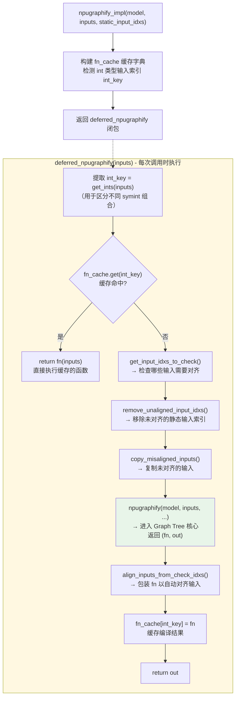

```python
# npugraphify_impl - 主入口（torch_npu/npu/_graph_tree.py 第327-372行）
def npugraphify_impl(
    model: ModelType,
    inputs: List[InputType],
    static_input_idxs: Sequence[int],
    *args: Any,
    **kwargs: Any,
) -> ModelType:
    fn_cache: Dict[Tuple[int, ...], Callable[..., Any]] = {}
    
    int_key = [i for i, v in enumerate(inputs) if isinstance(v, int)]
    get_ints: Any = operator.itemgetter(*int_key) if int_key else lambda _: None

    has_warn = False
    del inputs

    def deferred_npugraphify(inputs: List[InputType]) -> OutputType:
        nonlocal has_warn

        int_key = get_ints(inputs)
        fn = fn_cache.get(int_key)
        if fn is not None:
            return fn(inputs)

        if int_key is None:
            log.info("recording npugraph tree for graph without symints")
        else:
            log.info("recording npugraph tree for symint key %s", int_key)

        if not has_warn:
            has_warn = maybe_warning_due_to_dynamic_shape(fn_cache, int_key)

        check_input_idxs = get_input_idxs_to_check(inputs, static_input_idxs)
        new_static_input_idxs = remove_unaligned_input_idxs(inputs, static_input_idxs)
        copy_misaligned_inputs(inputs, check_input_idxs)

        fn, out = npugraphify(model, inputs, new_static_input_idxs, *args, **kwargs)
        fn = align_inputs_from_check_idxs(fn, inputs_to_check=check_input_idxs, mutated_input_idxs=OrderedSet())
        fn_cache[int_key] = fn

        return out

    return deferred_npugraphify
```

#### 关键设计解析

**`fn_cache` 按动态 shape 分别缓存**：key 是 int 型输入值组成的 tuple（代表动态 shape 维度），value 是编译好的 NPU Graph replay 函数。例如 `inputs = [tensor, tensor, 128, tensor, 64]` 时 `get_ints(inputs)` 返回 `(128, 64)` 作为缓存 key。

**输入对齐处理**：`get_input_idxs_to_check` 确定哪些输入可能不对齐；`remove_unaligned_input_idxs` 将不对齐的从 static 列表移除；`copy_misaligned_inputs` 通过 clone 获得对齐的副本。

**执行流程**：

```
第1次调用 deferred_npugraphify(inputs):
  get_ints(inputs) → (128, 64)
  fn_cache.get((128, 64)) → None  (miss)
  对齐处理 → 修正 inputs
  npugraphify(model, inputs, ...) → 录制 NPU Graph → (fn, out)
  fn_cache[(128, 64)] = fn  (缓存)
  return out  (首次录制的输出)

第2次调用 deferred_npugraphify(inputs):  (shape 相同)
  get_ints(inputs) → (128, 64)
  fn_cache.get((128, 64)) → fn  (hit!)
  return fn(inputs)  (直接 replay NPU Graph，极快)

第N次调用 deferred_npugraphify(inputs):  (新 shape)
  get_ints(inputs) → (256, 128)
  fn_cache.get((256, 128)) → None  (miss)
  → 录制新的 NPU Graph，缓存，返回
```

核心设计：**NPU Graph 录制开销大但 replay 极快**，所以用 `fn_cache` 按动态 shape 分别缓存，首次录制后后续全部走 replay，实现延迟编译（JIT）+ 缓存复用。

### 2.6 Phase 6: npugraphify — 连接延迟编译与 Graph Tree 的桥梁

**代码位置**：`torch_npu/npu/_graph_tree.py` (第376-407行)

`deferred_npugraphify` 在缓存未命中时调用 `npugraphify` 函数，这是从延迟编译层进入 Graph Tree 核心的入口。

```python
def npugraphify(
    model: ModelType,
    inputs: List[InputType],
    static_input_idxs: Sequence[int] = (),
    *,
    device_index: int,
    is_backward: bool,
    is_inference: bool,
    stack_traces: Optional[StackTraces] = None,
    constants: Tuple[torch.Tensor, ...] = (),
    placeholders: Tuple[PlaceholderInfo, ...] = (),
    mutated_input_idxs: Tuple[int, ...] = (),
) -> Tuple[ModelType, OutputType]:
    manager = get_container(device_index).get_tree_manager()
    if is_backward and is_inference:
        raise RuntimeError("check is_backward and is_inference fail")
    mode = (
        CompilationMode.BACKWARD
        if is_backward
        else (CompilationMode.INFERENCE if is_inference else CompilationMode.FORWARD)
    )

    return manager.add_function(
        model, inputs, static_input_idxs, stack_traces,
        mode, constants, placeholders, mutated_input_idxs,
    )
```

**逐行解析**：

- **获取 Tree Manager**：每个 NPU 设备有**一个** `TreeManagerContainer`，容器内懒加载**一个** `NPUGraphTreeManager`。Tree Manager 维护了树的根节点集合、当前执行路径上的最新节点、当前状态、以及一个**共享的 NPU 内存池**。
- **互斥校验**：一个图不可能同时是"反向"又是"推理"。
- **确定编译模式**：将布尔标志转为枚举 `CompilationMode`：`FORWARD`、`BACKWARD`、`INFERENCE`。
- **向 Tree Manager 注册函数**：`manager.add_function()` 分配唯一 `FunctionID`，创建 `fn = partial(self.run, function_id=id)`（replay 函数），并立即调用 `fn(inputs)` 触发首次执行（warmup 或 recording），返回 `(fn, 首次输出)`。

```python
# add_function 内部:
id_for_func = self.new_func_id()
self.ids_to_funcs[id_for_func] = WrappedFunction(model, ...)
fn = functools.partial(self.run, function_id=id_for_func)
get_container(self.device_index).add_strong_reference(fn)
return fn, fn(inputs)  # fn(inputs) 触发首次 warmup/recording
```

### 2.7 Phase 7: NPU Graph 录制

**`_record` 录制流程图**：

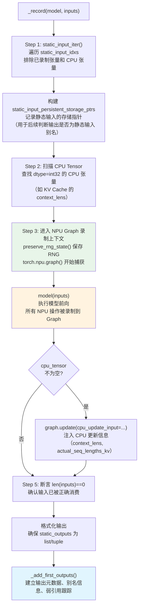

```python
# NPUGraphNode._record - 录制核心（torch_npu/npu/_graph_tree.py 第1193-1259行）
def _record(self, model: ModelType, inputs: List[InputType]) -> OutputType:
    # 1. 收集静态输入信息（排除已录制张量和 CPU 张量）
    def static_input_iter() -> Generator[torch.Tensor, None, None]:
        for i in self.wrapped_function.static_input_idxs:
            _inp = inputs[i]
            if isinstance(_inp, torch.Tensor) and not self._is_npu_graph_recorded_tensor(_inp) and _inp.device.type != "cpu":
                yield _inp

    static_input_persistent_storage_ptrs: Dict[int, StorageWeakRefWrapper] = {}
    for inp in itertools.chain(static_input_iter(), self.wrapped_function.constants):
        static_input_persistent_storage_ptrs[inp.untyped_storage().data_ptr()] = StorageWeakRefWrapper(inp)

    # 2. 处理 CPU Tensor（如 context_lens）
    cpu_tensor = None
    for item in inputs:
        if isinstance(item, torch.Tensor) and item.dtype == torch.int32 and item.device.type == "cpu":
            cpu_tensor = item.clone()
        del item

    # 3. 录制 NPU Graph
    with preserve_rng_state(), torch.npu.device(self.device), clear_cublas_manager(), torch.npu.graph(
        self.graph,
        stream=self.stream,
        pool=self.npu_graphs_pool,
        capture_error_mode="thread_local",
        auto_dispatch_capture=True,
    ), get_history_recording():
        static_outputs = model(inputs)

    # 4. 更新 CPU Tensor（如 KV Cache 相关）
    if cpu_tensor is not None:
        self.graph.update(cpu_update_input=[{"context_lens": cpu_tensor}, 
                                            {"actual_seq_lengths_kv": cpu_tensor}])

    # 5. 校验输入已被消费（model 内部会 clear inputs）
    if not len(inputs) == 0:
        raise RuntimeError("check len(inputs) == 0 fail")
    if not isinstance(static_outputs, (list, tuple)):
        static_outputs = (static_outputs,)

    # 6. 添加输出到管理器
    self._add_first_outputs(static_outputs, static_input_persistent_storage_ptrs)

    return static_outputs
```

**关键步骤说明**：

| 步骤 | 代码 | 说明 |
|------|------|------|
| Step 1 | `static_input_iter()` + `static_input_persistent_storage_ptrs` | 生成器过滤出"持久化静态输入"（模型参数/buffer），建立 `data_ptr → StorageWeakRefWrapper` 映射，用于后续判断输出是否为静态输入的别名 |
| Step 2 | `cpu_tensor` 处理 | 大模型推理中（如 PagedAttention）`context_lens` 等 KV Cache 管理信息存在 CPU 上，需 `clone()` 防止被后续操作修改 |
| Step 3 | `with ... torch.npu.graph(...)` | 嵌套 5 个上下文管理器：保存 RNG、设置设备、清理 cuBLAS、开始 Graph 捕获、记录操作历史。`model(inputs)` 在捕获模式下执行，所有 NPU 操作被记录到 `self.graph` |
| Step 4 | `graph.update(cpu_update_input=...)` | 将 CPU 端更新信息注入 Graph，使回放时可动态更新 |
| Step 5 | 断言 + 格式化 | `len(inputs) == 0` 确保模型已消费所有输入（Graph Tree 内存管理要求） |
| Step 6 | `_add_first_outputs(...)` | 分析输出张量的类型（新分配存储/静态输入别名/前序 Graph 输出别名），建立完整输出元数据 |

### 2.8 Phase 8: Graph 回放执行

**`run` 回放流程图**：

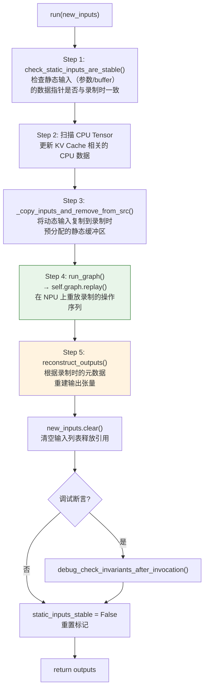

```python
# NPUGraphNode.run - 回放执行（torch_npu/npu/_graph_tree.py 第1059-1080行）
def run(self, new_inputs: List[InputType]) -> OutputType:
    # 1. 检查静态输入（参数/buffer）的地址稳定性
    self.check_static_inputs_are_stable(new_inputs)
    
    # 2. 处理 CPU Tensor 更新（如 KV Cache 的动态序列长度）
    for item in new_inputs:
        if isinstance(item, torch.Tensor) and item.dtype == torch.int32 and item.device.type == "cpu":
            self.graph.update(cpu_update_input=[{"context_lens": item}, {"actual_seq_lengths_kv": item}])
    
    # 3. 复制动态输入到录制时预分配的静态缓冲区
    self._copy_inputs_and_remove_from_src(self.reconstructed_inputs, new_inputs)
    
    # 4. 回放 Graph（self.graph.replay()）
    self.run_graph()
    
    # 5. 根据录制时的元数据重建输出张量
    outputs = self.reconstruct_outputs()
    new_inputs.clear()
    
    # 6. 调试断言：检查不变量
    if config.triton.fast_path_cudagraph_asserts:
        self.debug_check_invariants_after_invocation()
    
    # 7. 强制同步（仅调试模式）
    if config.triton.force_cudagraph_sync:
        torch.npu.synchronize()

    # 8. 重置静态输入稳定性标记
    self.static_inputs_stable = False
    
    return outputs
```

**关键步骤说明**：

| 步骤 | 代码 | 说明 |
|------|------|------|
| Step 1 | `check_static_inputs_are_stable` | 验证静态输入的 data_ptr 与录制时一致。若参数被重新分配（如 optimizer.step 后），说明图已失效 |
| Step 2 | `graph.update(cpu_update_input=...)` | KV Cache 推理场景下序列长度每步变化，需在回放前更新 CPU 端数据 |
| Step 3 | `_copy_inputs_and_remove_from_src` | **核心**：将动态输入值复制到录制时分配的固定内存地址，NPU Graph 回放使用固定地址 |
| Step 4 | `run_graph()` → `self.graph.replay()` | 触发 NPU Graph 回放，无需 CPU 逐一调度，极大减少 launch overhead |
| Step 5 | `reconstruct_outputs()` | 从元数据重建输出张量对象，实际数据已在 replay 中写入输出内存区域 |

**`reconstruct_outputs` 流程图**：

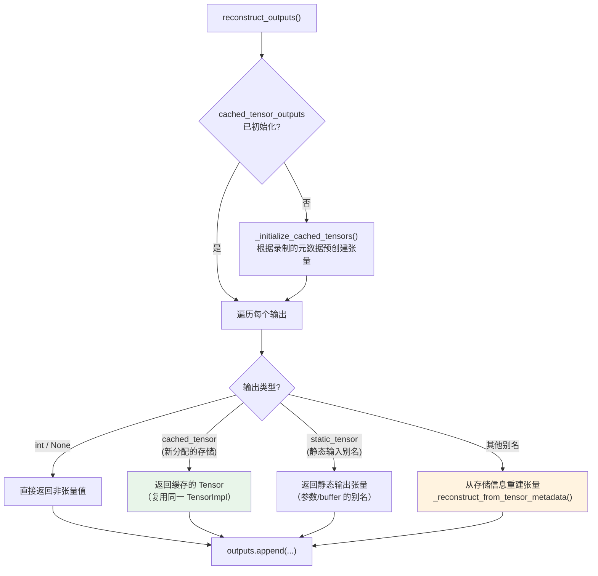

---

## 三、NPU Graph Tree 核心机制

### 3.1 Tree 结构概述

```
NPU Graph Tree 结构示例：

Generation 1:                    Generation 2:
┌─────────────┐                  ┌─────────────┐
│   Root 1    │                  │   Root 2    │
│  (Forward)  │                  │  (Forward)  │
└──────┬──────┘                  └──────┬──────┘
       │                               │
  ┌────┴────┐                     ┌────┴────┐
  │         │                     │         │
┌─▼─┐    ┌──▼──┐               ┌─▼─┐    ┌──▼──┐
│Bwd│    │Branch│               │Bwd│    │Branch│
│ 1 │    │  A   │               │ 2 │    │  B   │
└───┘    └──────┘               └───┘    └──────┘

特点：
1. 多个 Root 节点对应不同输入形状/代码路径
2. 每个节点可以有多个子节点（如 forward 后的 backward、branch）
3. 共享同一个内存池（npu_graphs_pool）
4. 动态选择执行路径，支持动态形状
```

**内存优化的本质**：树形结构相比为每条路径独立分配内存，峰值内存降为各路径峰值的 `max` 而非各路径之和——例如路径 A→C→F、A→D、B→E 共享内存池时，峰值内存为 `max(mem(A→C→F), mem(A→D), mem(B→E))`。这是 §3.3 内存池共享机制、§3.6 checkpoint 恢复机制共同实现的收益来源；§3.8 会用一个具体案例把这个公式落到实处。

### 3.2 Tree Manager 生命周期与状态转换

#### 3.2.1 状态机概览

`NPUGraphTreeManager` 通过 `path_state` 维护一个四态状态机：

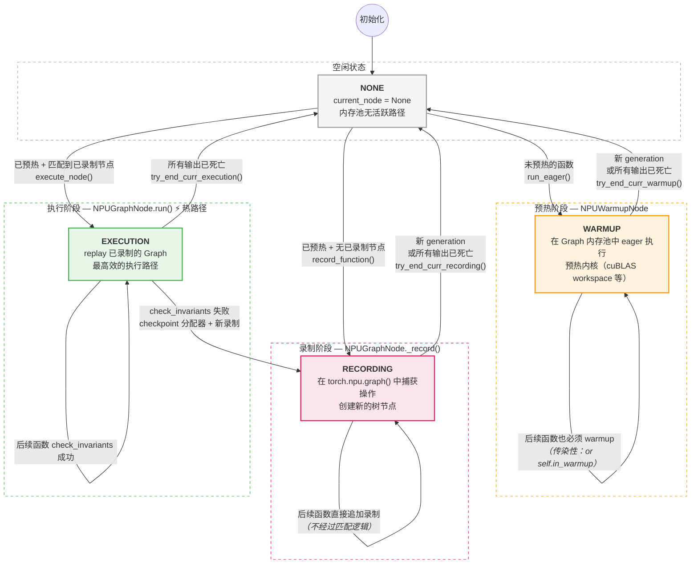

关键约束：`current_node` 被设为 `None` 时，`path_state` 自动变为 `NONE`（通过 property setter 实现）：

```python
@current_node.setter
def current_node(self, value):
    self._current_node = value
    if value is None:
        self.path_state = ExecutionState.NONE
```

#### 3.2.2 `_run()` 核心调度逻辑

**代码位置**：`torch_npu/npu/_graph_tree.py` (第2055行起)

这是 Graph Tree 最核心的调度函数，决定每次函数调用走 warmup / recording / execution 的哪条路径。

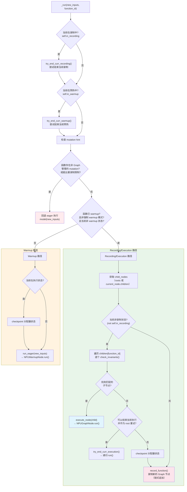

**关键决策逻辑解析**：

| 阶段 | 条件 | 行为 | 使用的节点类型 |
|------|------|------|--------------|
| **Eager 回退** | 函数存在非 Graph 管理的 input mutation，或重录制次数过多 | 直接调用原始模型，跳过 Graph | 无 |
| **Warmup** | 函数未 warmup，或配置强制 warmup，**或当前处于 warmup 状态** | 在 Graph 内存池中执行 eager 模式，预热算子和内存分配 | `NPUWarmupNode` |
| **Execution** | 已 warmup + 找到匹配的子节点（`check_invariants` 通过） | 回放已录制的 Graph，最高效路径 | `NPUGraphNode.run()` |
| **Recording** | 已 warmup + 无匹配子节点，或当前正在 recording 中 | 录制新的 Graph 节点并加入树 | `NPUGraphNode._record()` |

#### 3.2.3 三个核心设计原则

**原则 1：Warmup 具有传染性**

warmup 判断条件中的 `or self.in_warmup` 确保：**一旦进入 warmup 状态，后续所有函数必须也走 warmup**。

```python
if (
    not (function_id in self.warmed_up_functions or config.triton.skip_cudagraph_warmup)
    or self.in_warmup          # ← 关键：当前处于 warmup 则强制 warmup
    or config.triton.force_cudagraphs_warmup
):
    out = self.run_eager(new_inputs, function_id)
    return out
```

原因：warmup 和 recording 依赖 caching allocator 的状态。如果先 warmup A 再 warmup B（B 产生了新的分配），后续录制 A 时内存地址可能与 warmup 时不一致。因此整条 warmup 路径必须一起完成，不能中间穿插 recording。

**原则 2：Recording 是链式追加的**

当 `self.in_recording` 为 True 时，后续函数**不经过 `check_invariants` 匹配**，直接作为当前节点的子节点录制：

```python
if not self.in_recording:
    for child in child_nodes[function_id]:
        status, _ = child.check_invariants(new_inputs)
        if status == SUCCESS:
            return self.execute_node(child, new_inputs)

out = self.record_function(new_inputs, function_id)
```

这保证了首次录制一条完整路径（如 A→B→C）时，所有节点连续录制，无需逐个匹配。

**原则 3：Execution 匹配失败时需要 checkpoint 分配器**

NPU Graph replay 只在 NPU 侧执行，**不更新 CPU 侧的 caching allocator 簿记**。但录制新子图需要分配器知道哪些内存是"活的"。`apply_checkpoint_execution_state_in_allocator` 把之前录制时保存的分配器快照恢复出来，同时标记已死亡的 storage，让分配器准确知道哪些内存可以复用。

```python
self.try_end_curr_execution()
if self.current_node is not None:
    self.apply_checkpoint_execution_state_in_allocator()

out = self.record_function(new_inputs, function_id)
```

`apply_checkpoint_execution_state_in_allocator` 内部的完整调用链、它依赖的 C++ 快照结构、以及路径切换时内存的三分类处理，展开于 §3.6。

#### 3.2.4 Warmup 是 per-function 的，不是 per-node 的

`warmed_up_functions` 是一个 `Set[FunctionID]`，记录的是**哪些函数已经预热过**。当同一个函数需要在不同的内存布局下重新录制一个新的 `NPUGraphNode` 时，**不需要再次 warmup**，因为：

1. **NPU 内核懒初始化已完成**：很多算子（如 cuBLAS matmul）在首次调用时分配 persistent workspace。一旦函数被 warmup 过，其内核已初始化。
2. **Recording 本身就包含一次真实执行**：`record_function` → `node.run_first_inputs(new_inputs)` 在 `torch.npu.graph()` 上下文中执行函数并捕获 Graph。

| | Warmup | Recording |
|---|---|---|
| 执行方式 | Eager（直接执行） | 在 `torch.npu.graph()` context 中执行 |
| 是否录制 Graph | 否 | 是 |
| 产物 | NPUWarmupNode（一次性，不缓存到树中） | NPUGraphNode（持久化到树中，可 replay） |
| 目的 | 初始化内核、探测内存布局 | 捕获计算图用于后续 replay |
| 是否更新 `warmed_up_functions` | 是 | 否（已在集合中） |

#### 3.2.5 完整执行场景：训练循环 A→B→C

假设模型被 Dynamo 拆成三个子图 A、B、C（如因 graph break），以下时序图展示了从首次 warmup 到稳态 execution 再到分支重录制的完整状态转换过程。

```mermaid
sequenceDiagram
    participant A as func_A
    participant B as func_B
    participant C as func_C
    participant TM as TreeManager

    Note over TM: path_state = NONE<br/>current_node = None

    rect rgba(255, 243, 224, 0.4)
        Note over A, TM: 第 1 轮：Warmup（所有函数首次执行）

        A ->> TM: _run(inputs, func_A)
        Note right of TM: func_A ∉ warmed_up → warmup
        TM ->> TM: run_eager() → WarmupNode_A
        Note over TM: NONE → WARMUP

        B ->> TM: _run(inputs, func_B)
        Note right of TM: try_end_warmup → 失败<br/>(同代 + A 输出存活)
        Note right of TM: in_warmup=True → 传染性 warmup
        TM ->> TM: run_eager() → WarmupNode_B
        Note over TM: WARMUP → WARMUP

        C ->> TM: _run(inputs, func_C)
        Note right of TM: 同理，继续 warmup
        TM ->> TM: run_eager() → WarmupNode_C
        Note over TM: WARMUP → WARMUP
    end

    Note over TM: warmed_up_functions = {A, B, C}<br/>路径: WarmupNode_A → B → C

    rect rgba(252, 228, 236, 0.4)
        Note over A, TM: 第 2 轮：Recording（new generation，首次录制）

        A ->> TM: _run(inputs, func_A)
        Note right of TM: try_end_warmup → 成功<br/>(new generation)
        Note over TM: WARMUP → NONE
        Note right of TM: roots[A] 为空 → 无匹配
        TM ->> TM: record_function() → NodeA (root)
        Note over TM: NONE → RECORDING

        B ->> TM: _run(inputs, func_B)
        Note right of TM: try_end_recording → 失败<br/>(同代 + A 输出存活)
        Note right of TM: in_recording=True → 跳过匹配<br/>链式追加录制
        TM ->> TM: record_function() → NodeB (child of A)
        Note over TM: RECORDING → RECORDING

        C ->> TM: _run(inputs, func_C)
        Note right of TM: 同理，链式追加
        TM ->> TM: record_function() → NodeC (child of B)
        Note over TM: RECORDING → RECORDING
    end

    Note over TM: 树: NodeA → NodeB → NodeC

    rect rgba(232, 245, 233, 0.4)
        Note over A, TM: 第 3 轮：Execution ⚡ 热路径（new generation）

        A ->> TM: _run(inputs, func_A)
        Note right of TM: try_end_recording → 成功<br/>(new generation)
        Note over TM: RECORDING → NONE
        Note right of TM: NodeA.check_invariants ✓
        TM ->> TM: execute_node(NodeA) → replay
        Note over TM: NONE → EXECUTION

        B ->> TM: _run(inputs, func_B)
        Note right of TM: NodeB.check_invariants ✓
        TM ->> TM: execute_node(NodeB) → replay
        Note over TM: EXECUTION → EXECUTION

        C ->> TM: _run(inputs, func_C)
        Note right of TM: NodeC.check_invariants ✓
        TM ->> TM: execute_node(NodeC) → replay
        Note over TM: EXECUTION → EXECUTION
    end

    Note over TM: 后续所有轮次重复第 3 轮（热路径）

    rect rgba(255, 235, 238, 0.4)
        Note over A, TM: 第 N 轮：分支 — B 的内存布局变化（new generation）

        A ->> TM: _run(inputs, func_A)
        Note over TM: EXECUTION → NONE → EXECUTION
        Note right of TM: NodeA.check_invariants ✓ → replay

        B ->> TM: _run(inputs, func_B)
        Note right of TM: NodeB.check_invariants ✗<br/>StaticInputIdxMismatch
        Note right of TM: try_end_execution → 失败<br/>(A 输出存活)
        TM ->> TM: checkpoint 分配器状态
        TM ->> TM: record_function() → NodeB2 (child of A)
        Note over TM: EXECUTION → RECORDING

        C ->> TM: _run(inputs, func_C)
        Note right of TM: in_recording → 链式追加<br/>不需要重新 warmup
        TM ->> TM: record_function() → NodeC2 (child of B2)
        Note over TM: RECORDING → RECORDING
    end

    Note over TM: 树分叉:<br/>NodeA → NodeB → NodeC (路径1)<br/>NodeA → NodeB2 → NodeC2 (路径2)

    rect rgba(232, 245, 233, 0.4)
        Note over A, TM: 第 N+1 轮：自动选择分支（new generation）

        A ->> TM: _run(inputs, func_A)
        Note over TM: RECORDING → NONE → EXECUTION
        Note right of TM: NodeA.check_invariants ✓ → replay

        B ->> TM: _run(inputs, func_B)
        Note right of TM: NodeB.check_invariants ✗<br/>NodeB2.check_invariants ✓ → 选择路径2
        TM ->> TM: execute_node(NodeB2) → replay
        Note over TM: EXECUTION → EXECUTION

        C ->> TM: _run(inputs, func_C)
        Note right of TM: NodeC2.check_invariants ✓
        TM ->> TM: execute_node(NodeC2) → replay
        Note over TM: EXECUTION → EXECUTION
    end
```

**时序图要点说明**：

| 轮次 | 状态转换 | 触发条件 | 关键行为 |
|------|---------|---------|---------|
| 第 1 轮 | NONE → WARMUP → WARMUP → WARMUP | 函数未预热 | warmup 具有传染性：`or self.in_warmup` 强制后续函数也走 warmup |
| 第 2 轮 | WARMUP → NONE → RECORDING → RECORDING → RECORDING | new generation + 已预热 + roots 为空 | recording 链式追加：`in_recording=True` 时跳过 `check_invariants` |
| 第 3 轮 | RECORDING → NONE → EXECUTION → EXECUTION → EXECUTION | new generation + `check_invariants` 全部成功 | 热路径：`graph.replay()` 极快 |
| 第 N 轮 | EXECUTION → RECORDING → RECORDING | B 的 `check_invariants` 失败 | 需先 `checkpoint` 分配器状态再录制新分支 |
| 第 N+1 轮 | RECORDING → NONE → EXECUTION → EXECUTION → EXECUTION | 新分支 `check_invariants` 成功 | 运行时遍历 children 列表自动选择匹配的分支 |

#### 3.2.6 Generation 机制与 `npugraph_mark_step_begin`

##### Generation 的作用

`generation` 是控制树路径终结与重启的关键机制。TreeManager 通过比较 `self.current_gen` 与当前全局 generation 来判断"是否进入了新一轮迭代"，从而决定是否可以安全地清理旧路径、释放旧输出内存、重置为 NONE 状态。

##### 两套 Generation 计数器

系统中存在**两套独立的 generation 计数器**，TreeManager 优先使用用户主动标记的计数器：

```python
# npu/_graph_tree.py
class MarkStepBox:
    mark_step_counter = 0  # 用户调用 mark_step_begin() 时递减（向负方向）

@staticmethod
def get_curr_generation() -> int:
    if MarkStepBox.mark_step_counter != 0:
        return MarkStepBox.mark_step_counter       # 优先使用用户标记
    return GenerationTracker.generation             # 回退到 Dynamo 自动跟踪

@staticmethod
def user_invoked_mark_step() -> bool:
    return MarkStepBox.mark_step_counter != 0
```

| 计数器 | 来源 | 递增时机 | 方向 |
|--------|------|---------|------|
| `GenerationTracker.generation` | `torch._dynamo.mutation_guard` | 每次 `torch.compile` 编译的函数被调用时，Dynamo 的 `OptimizeContext.on_enter` 自动递增 | 正向递增（0, 1, 2, ...） |
| `MarkStepBox.mark_step_counter` | `npu/_graph_tree.py` | 用户手动调用 `torch.compiler.npugraph_mark_step_begin()` 时递减 | 负向递减（0, -1, -2, ...） |

两个计数器使用相反方向，确保永远不会冲突。当用户从未调用 `mark_step_begin` 时 `mark_step_counter == 0`，系统自动回退到 Dynamo 的 `GenerationTracker.generation`。

##### `can_start_new_generation` — 路径终结的判定逻辑

`try_end_curr_recording` / `try_end_curr_warmup` / `try_end_curr_execution` 中都会调用此函数来判断是否可以结束当前路径：

```python
def in_new_torch_compile_invocation(self) -> bool:
    return self.current_gen != self.get_curr_generation()

def can_start_new_generation(self) -> bool:
    # 条件1：generation 必须发生了变化（否则仍在同一轮迭代中）
    if not self.in_new_torch_compile_invocation():
        return False

    # 条件2：如果用户主动调用了 mark_step_begin，无条件允许新 generation
    if self.user_invoked_mark_step():
        return True

    # 条件3：自动模式下，必须没有未完成的反向传播
    return not self.running_forwards_with_pending_backwards
```

当 `can_start_new_generation()` 返回 True 时，TreeManager 会：
1. 释放当前路径上所有节点输出的弱引用（`dealloc_current_path_weakrefs`）
2. 清除当前路径状态（`clear_current_path_state_and_set_to_none`）
3. 将 `current_node` 设为 None → 触发 `path_state` 自动变为 NONE
4. 允许新一轮的 warmup/recording/execution 开始

##### `running_forwards_with_pending_backwards` — 训练场景的自动保护

```python
# manager.run() 中:
if self.mode == CompilationMode.FORWARD:
    self.running_forwards_with_pending_backwards = True
elif self.mode == CompilationMode.BACKWARD:
    self.running_forwards_with_pending_backwards = False
```

在标准训练场景中（`forward → backward`），即使 Dynamo 在 forward 和 backward 之间递增了 `GenerationTracker.generation`，`can_start_new_generation` 也会因为 `running_forwards_with_pending_backwards == True` 而返回 False，防止在反向还没开始时就释放前向的输出内存。

##### 为什么需要 `npugraph_mark_step_begin`？

自动的 generation 机制在**大多数场景**下工作良好：推理时每次调用 `torch.compile` 函数自动递增 generation；训练时通过 `running_forwards_with_pending_backwards` 保护 forward-backward 对。但在以下场景中，自动启发式会**失效**：

下面通过一个实际测试用例说明这个问题：

```python
# 测试用例1：backend="npugraphs"（同一函数多次调用）
@torch.compile(backend="npugraphs")
def foo(x):
    return x.add(1)

def testcase1():
    with torch.no_grad():
        a = torch.tensor([1.0, 2.0], device="npu")
        # 同一函数被连续调用12次
        y0 = foo(a)
        y1 = foo(a)
        y2 = foo(a)
        y3 = foo(a)
        y4 = foo(a)
        y5 = foo(a)
        y6 = foo(a)
        y7 = foo(a)
        y8 = foo(a)
        y9 = foo(a)
        y10 = foo(a)
        result = y0 + y1 + y2 + y3 + y4 + y5 + y6 + y7 + y8 + y9 + y10 + foo(b)
        print(result)  # ✅ 正常工作

# 测试用例2：mode="reduce-overhead"（通过Inductor编译）
@torch.compile(mode="reduce-overhead")
def my_model(x):
    return torch.matmul(x, x)

def testcase2():
    x = torch.randn(10, 10, device="npu")
    # torch.compiler.npugraph_mark_step_begin()  # ← 需要显式标记
    y1 = my_model(x)
    y2 = my_model(x)
    print(y1)  # ❌ 报错：访问已被覆盖的张量（仅当配合Inductor时）
```

关键问题：`foo` 的 Graph 使用静态输出缓冲区（同一个内存地址），第二次 replay 会覆盖第一次的输出。但不同模式下 TreeManager 的行为不同：

| 模式 | `is_inference` | `CompilationMode` | `running_forwards_with_pending_backwards` | `can_start_new_generation()` | 结果 |
|------|---------------|-----------------|-------------------------------------------|------------------------------|------|
| `backend="npugraphs"` | 硬编码 `False` | `FORWARD` | 设为 `True` | `False`（阻止新 generation） | **不释放旧输出，可以工作** |
| `mode="reduce-overhead"` | 正确传递 `True` | `INFERENCE` | 保持 `False` | `True`（允许新 generation） | **释放旧输出，报错** |

**重要说明**：`mode="reduce-overhead"` 报错仅发生在配合 Inductor 编译时。这是因为 Inductor 对 NPU Graph 输出张量有更严格的访问检查机制，当检测到张量被覆盖时会主动报错。而 `backend=

**代码分析**（`torch_npu/utils/_graph_tree.py` 第279-298行）：

```python
def forward_npugraphs(aot_model, aot_inputs, is_inference=False):
    # ...
    out = new_npugraphify_impl(
        # ...
        is_backward=False,
        is_inference=False,  # ← BUG：硬编码为 False，忽略传入的参数
        # ...
    )
```

尽管 `inference_compiler=functools.partial(forward_npugraphs, is_inference=True)` 尝试传递 `True`，但函数内部第297行硬编码覆盖了该参数。这导致：

```python
# CompilationMode 判定（npu/_graph_tree.py 第390-395行）
mode = (
    CompilationMode.BACKWARD
    if is_backward
    else (CompilationMode.INFERENCE if is_inference else CompilationMode.FORWARD)
)
```

**运行时行为差异**：

```python
# backend="npugraphs" 路径（testcase1）
foo(a) → mode=FORWARD → running_forwards_with_pending_backwards = True
foo(a) → can_start_new_generation() → not True = False → 不释放旧输出 → 正常工作

# mode="reduce-overhead" 路径（testcase2，配合Inductor时）
my_model(x) → mode=INFERENCE → running_forwards_with_pending_backwards 保持 False
my_model(x) → can_start_new_generation() → not False = True → 释放旧输出 → 报错
```

**结论**：
- `backend="npugraphs"` 能正常工作是因为 `is_inference=False` 的硬编码 bug 意外地阻止了输出张量失效化
- `mode="reduce-overhead"` 的报错（配合 Inductor 时）才是正确的行为 —— 它正确检测到了在同一 step 内多次调用同一编译函数且使用了被覆盖的输出

修复方法：在循环中使用 `torch.compiler.npugraph_mark_step_begin()` 显式标记新迭代：

```python
for _ in range(5):
    torch.compiler.npugraph_mark_step_begin()  # ← 显式标记新迭代
    result = foo(a) + foo(a)
```

#### 3.2.7 NPUWarmupNode.run() 的实现机制

§3.2.1-3.2.4 讲的是 Warmup 在状态机里的角色（何时触发、为什么有传染性）；`NPUWarmupNode.run()` 的实际实现补上"怎么做"这一层：

```python
class NPUWarmupNode:
    def run(self, new_inputs: List[InputType]) -> OutputType:
        # 1. 收集当前路径上所有存活的 storage
        existing_path_data_ptrs = {
            t.data_ptr()
            for t in self.path_live_weakrefs()
            if t()
        }

        # 2. 找出非 Graph 管理的输入（需要拷贝到 pool）
        non_npugraph_inps = []
        for t in itertools.chain(new_inputs, self.wrapped_function.constants):
            if (isinstance(t, torch.Tensor)
                and t.untyped_storage().data_ptr() not in existing_path_data_ptrs):
                non_npugraph_inps.append(weakref.ref(t.untyped_storage()))

        # 3. 使用内存池执行函数
        with _use_npu_memory_pool_manager(
            self.device_index, self.npu_graphs_pool, self.stream
        ):
            out = self.wrapped_function.model(new_inputs)

        # 4. 追踪输出：创建弱引用但不阻止 GC
        self.outputs_weakrefs.extend([
            map_to_ref(out_) if self._should_track_output(out_) else None
            for out_ in out
        ])

        return out
```

四步依次是：① 用 `path_live_weakrefs()` 收集路径上已存活的 storage 指针；② 遍历新输入和常量，把**尚不在**已存活集合里的输入标记为 `non_npugraph_inps`（即真正"外部带入"、需要走普通内存分配的输入，而非来自树上游节点的输出）；③ 用 `_use_npu_memory_pool_manager` 上下文管理器把 eager 执行的实际分配导向 Graph 共享内存池（§3.3），使 warmup 阶段探测到的内存布局与后续录制阶段一致；④ 用 `map_to_ref` 把输出包装成弱引用记录进 `outputs_weakrefs`，但不阻止其被 GC——呼应 §3.7.2 "弱引用而不阻止 GC" 的设计。

---

### 3.3 内存池共享机制

**内存池共享架构图**：

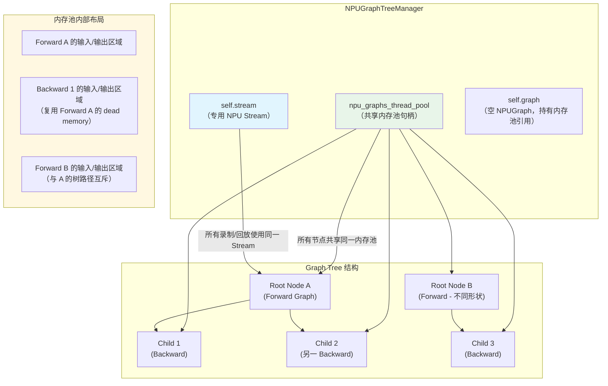

```python
# NPUGraphTreeManager 初始化时创建共享内存池（第1885-1927行）
def __init__(self, device_index: int):
    with torch.npu.device(device_index):
        torch.npu.synchronize()
        self.stream = torch.npu.Stream()
        self.stream.wait_stream(torch.npu.current_stream())

        self.graph: Optional[torch.npu.NPUGraph] = torch.npu.NPUGraph()
        self.npu_graphs_thread_pool = torch.npu.graph_pool_handle()

        with torch.npu.graph(
            self.graph,
            pool=self.npu_graphs_thread_pool,
            stream=self.stream,
            capture_error_mode="thread_local",
        ):
            pass  # 空操作，仅初始化内存池
```

**内存池共享的关键意义**：

| 特性 | 说明 |
|------|------|
| **零拷贝传递** | 前向 Graph 的输出直接作为反向 Graph 的输入使用，无需跨池拷贝 |
| **Dead Memory 复用** | 前向执行完成后，其不再需要的中间结果内存可被反向 Graph 复用 |
| **单 Stream 保证** | 所有分配在同一 Stream 上，避免不同 Stream 导致的内存碎片 |
| **Checkpoint 机制** | 切换树路径时，通过 checkpoint/restore 恢复 allocator 状态，而非重新分配 |

### 3.4 TreeManagerContainer：单例生命周期管理

每个 NPU 设备只有一个 `TreeManagerContainer`（`get_container(device_index)`），内部懒加载唯一的 `NPUGraphTreeManager`（§2.6 已提及）。它用引用计数决定 Manager——连同其持有的共享内存池——何时可以被安全释放：

```python
class TreeManagerContainer:
    def __init__(self, device_index):
        self.tree_manager: Optional[NPUGraphTreeManager] = None
        self.live_npugraphify_fns = 0     # 活跃的 graph 函数（add_function 返回的 fn）数量
        self.live_storages_count = 0      # 活跃的 Graph 输出 Tensor 数量
        self.graph: Optional[torch.npu.NPUGraph] = None  # 持有它以保持 pool 存活

    def add_strong_reference(self, fn):
        self.live_npugraphify_fns += 1
        weakref.finalize(fn, self.finalize_npugraphify_fn)   # fn 被 GC 时自动回调

    def finalize_npugraphify_fn(self):
        self.live_npugraphify_fns -= 1
        if self.live_npugraphify_fns == 0 and self.live_storages_count == 0:
            self.tree_manager = None   # 无任何活跃引用，可安全释放

    def _finalize_tensor(self):
        self.live_storages_count -= 1
        if self.live_storages_count == 0:
            self.graph = None          # 释放对 pool 的引用
            if self.live_npugraphify_fns == 0:
                self.tree_manager = None
```

即：只要还有一个 `add_function` 返回的 replay 函数存活，或者还有一个 Graph 输出 Tensor 被用户代码持有，Tree Manager（及其共享内存池）就不会被释放——这解释了为什么上面的共享内存池不会在两次 `foo()` 调用之间被意外回收。

### 3.5 NPU Graph Tree 底层数据结构（C++ 层）

§3.2 的状态机与 §3.3 的内存池共享，最终都落在 C++ 层的三个数据结构上：`NPUGraph`（单个 Graph 的捕获/回放载体）、`PrivatePool`（内存池的块管理）、以及 checkpoint 恢复用的状态快照结构。

#### 3.5.1 NPUGraph 与内存池标识

**源码位置**：`torch_npu/csrc/core/npu/NPUGraph.h:L41-L98`

| 成员 | 类型 | 说明 |
|------|------|------|
| `register_generator_state(state)` / `register_generator_state(generator)` | 方法（2 个重载） | 注册随机数生成器状态，分别接受 `NPUGeneratorState` 智能指针或 `at::Generator` |
| `capture_begin(pool, capture_mode, report_shape)` | 方法 | 开始捕获；`pool` 非零时复用外部共享池，否则创建私有池 |
| `capture_end()` / `replay()` / `reset()` | 方法 | 结束捕获 / 重放 / 释放资源 |
| `pool()` | 方法 | 返回该 Graph 关联的 `MempoolId_t` |
| `enable_debug_mode()` | 方法 | 开启调试模式 |
| `debug_dump(debug_path)` | 方法 | 把捕获内容 dump 到指定路径，用于排查捕获问题 |
| `model_ri_` | `aclmdlRI` | 昇腾模型实例句柄（protected） |
| `has_graph_exec_` | `bool` | 是否已成功捕获 |
| `capture_id_` | `CaptureId_t` | 捕获期间分配的 ID |
| `mempool_id_` | `MempoolId_t` | 内存池标识，`pair<uint64_t, uint64_t>` |
| `capture_stream_` / `capture_dev_` | `NPUStream` / `int` | 捕获使用的流与设备 |
| `captured_generator_states_` | `flat_hash_map<GeneratorState, uint64_t>` | 随机数生成器状态 → wholegraph increment 映射 |

`graph_pool_handle()`（`torch_npu/npu/_graph_tree.py`）通过 `c10_npu::MemPool()` 分配一个新池并返回其 id，即 §3.3 中 `npu_graphs_thread_pool` 的来源。`capture_begin` 按以下顺序把该池注册进分配器（`NPUGraph.cpp:L145-L218`，节选）：

```cpp
if (pool.first != 0 || pool.second != 0) {
    mempool_id_ = pool;                          // 复用外部共享池
} else {
    auto mempool = c10_npu::MemPool({}, false);
    mempool_id_ = mempool.id();                   // 创建私有池
}
c10_npu::NPUCachingAllocator::beginAllocateToPool(
    capture_dev_, mempool_id_,
    [this](aclrtStream stream) {                  // 过滤器：仅本 Graph 活跃捕获期间的流才导向此池
        aclmdlRICaptureStatus status; aclmdlRI model_ri;
        NPU_CHECK_ERROR(c10_npu::acl::AclmdlRICaptureGetInfo(stream, &status, &model_ri));
        return status == ACL_MODEL_RI_CAPTURE_STATUS_ACTIVE && model_ri == model_ri_;
    });
```

`replay()`（`NPUGraph.cpp:L255-L268`）核心只有一行 `AclmdlRIExecuteAsync(model_ri_, currentStream)`——**重放可以提交到与捕获时不同的 Stream**，因为 `model_ri_` 是昇腾侧已编译好的独立模型实例。Capture 与 Replay 的开销特征截然不同：

| 方面 | Capture | Replay |
|------|---------|--------|
| CPU 开销 | 高（首次执行所有操作） | 极低（直接提交预编译图） |
| 内存分配 | 实际执行分配 | 不复用分配逻辑，直接使用预分配内存 |
| Kernel 启动 | 逐个启动 | 批量提交 |

#### 3.5.2 PrivatePool 与内存块管理

**源码位置**：`torch_npu/csrc/core/npu/NPUCachingAllocator.cpp:L804-L822`

```cpp
struct PrivatePool {
    int use_count{ 1 };          // 引用计数：活跃 Graph 数量
    int npuMalloc_count{ 0 };    // 未释放的分配计数
    BlockPool large_blocks;      // 大块内存池 (>1MB)
    BlockPool small_blocks;      // 小块内存池 (≤1MB)
};
```

`use_count == 0` 且 `npuMalloc_count == 0` 时可安全销毁；`NPUGraph::reset()` 会递减 `use_count` 并触发清理。

#### 3.5.3 Checkpoint 状态快照结构

**源码位置**：`torch_npu/csrc/core/npu/NPUCachingAllocator.cpp`（`PrivatePoolState` 及依赖类型）

```cpp
struct BlockState {                // 单个内存块的状态
    c10::DeviceIndex device = 0;
    aclrtStream stream = nullptr;
    stream_set stream_uses = {};   // 多流场景下，还有哪些流在使用这块内存
    size_t size = 0;
    void* ptr = nullptr;
    bool allocated = false;
    int64_t gc_count_base = 0;

    explicit BlockState(Block* block);
};

struct SegmentState {              // 一个 segment（连续 block 链）的状态
    std::vector<BlockState> blocks;
    bool is_small = false;

    explicit SegmentState(Block* head);
};

struct PrivatePoolState : AllocatorState {  // 私有内存池的完整状态快照
    MempoolId_t owner_id = {0, 0};
    std::vector<SegmentState> segments;

    PrivatePoolState(
        MempoolId_t pool_id,
        const std::vector<Block*>& private_pool_head_blocks);
};
```

`stream_uses`（多流使用追踪）对 Graph Tree 的内存系统并非平凡字段：Graph Tree 本身涉及捕获流、多个执行路径共享同一内存池（§3.3），一个 block 存在被多条流引用的可能性，快照因此需要按 block 记录这层信息，而不能只看单一 `stream`。

这三个结构就是 §3.2.3 原则 3 中 `checkpointed_caching_state` 的实际内容——一份**纯结构快照**（block 划分方式 + 分配状态），不拷贝内存数据本身；§3.6 说明它如何在路径切换时被应用。

### 3.6 Checkpoint 恢复流程与内存复用三分类

延续 §3.2.3 原则 3：当 `check_invariants` 未找到匹配子节点时，`_run()` 需要先把分配器恢复到 `current_node` 录制结束时的 `PrivatePoolState` 快照（§3.5.3），再开始录制新分支。完整调用链细化到具体源码行如下（`torch_npu/npu/_graph_tree.py`）：

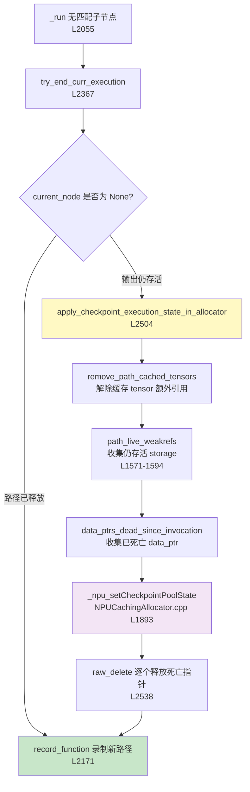

`_npu_setCheckpointPoolState`（`NPUCachingAllocator.cpp:L1893-L1941`）在 C++ 层分三步完成"回退到录制结束时的内存布局"：

1. **先释放池中当前所有 allocated blocks**（`freeBlocksAllocatedToPool`）；
2. **再按快照重建** block 结构（`setSegmentStateToCheckpoint`）；
3. **最后释放快照中标记为非 live 的 blocks**。

这三步保证了恢复后的 block 划分与录制结束时完全一致，同时通过 `live_storages` 参数保护了仍在使用的 tensor 不被步骤 1 误释放。

> 注：步骤 3 只回退到快照当时的分配器状态；下表分类中 dead 行的 `_npu_npuCachingAllocator_raw_delete` 是另一层，专门清理快照之后才死亡的张量。两者不是同一次释放。

路径切换时，内存中的 tensor 被分为三类：

| 分类 | 判定方式 | 处理 |
|------|----------|------|
| **保留**（live） | ① `path_live_weakrefs()`：路径上所有节点输出中 `StorageWeakRefWrapper`（§3.7.2）仍可解引用的；② 被用户代码持有的 tensor（如中间结果传给后续 step），靠 Python GC 引用计数保持其 `StorageWeakRefWrapper` 存活 | 传入 `_npu_setCheckpointPoolState` 的 `live_storages` 参数，C++ 侧标记为 allocated |
| **释放**（dead） | `data_ptrs_dead_since_invocation()`：对比 `recorded_liveness_after_graph`（§3.7.1）与当前 liveness 的差异 | `_npu_npuCachingAllocator_raw_delete(ptr)` 显式释放 |
| **解除缓存**（cached） | `remove_path_cached_tensors()`：遍历路径节点的 `cached_tensor_outputs` | `_remove_cached_tensor()` + `remove_extra_reference()`，**必须先于**「保留」的存活收集执行——否则缓存持有的额外引用会让本应回收的 storage 误判为仍存活 |

**关键设计决策**：

| 决策 | 原因 |
|------|------|
| Checkpoint 只记录 block 结构，不拷贝内存内容 | 内存内容的正确性由 NPU Graph replay 本身保证，checkpoint 只需重建 allocator 的簿记 |
| 死亡 tensor 显式 `raw_delete`，不依赖 GC 时机 | 必须在新录制前确保内存立即可用 |
| Lazy 路径清理（`try_end_curr_execution` 按需调用） | 避免在 replay 热路径上做不必要的存活检查 |

**已知的实现留白**（源码注释暗示未来扩展，非本文推测）：`apply_checkpoint_execution_state_in_allocator` 中 `stale_storages` 参数目前恒为空列表；`clear_path_state()`（`_graph_tree.py:L1614-1616`）当前是空操作占位符。

### 3.7 内存复用策略：Liveness Tracking / 存储弱引用 / 别名检测

Checkpoint 恢复（§3.6）依赖三套更底层的 Python 侧追踪机制来判断"谁还活着、谁可以复用"。

#### 3.7.1 Liveness Tracking

`NPUGraphNode.__init__` 中，父节点用弱引用持有——`self._parent = weakref.ref(parent) if parent is not None else None`，源码注释明确写着"弱引用防止循环"（该表述在源码中重复出现 3 次），避免父子节点相互强引用形成引用环、导致 GC 无法回收。输出跟踪除 `outputs_weakrefs`/`path_weakrefs` 外还有一个 `self.tensor_weakrefs: OutputList[Optional[TensorWeakRef]] = []`，用于追踪已重建的输出 Tensor 对象本身（区别于追踪 storage 的 `outputs_weakrefs`）。

`NPUGraphNode` 为路径上每一层都维护录制前/后的活性快照：

```python
self.recorded_liveness_before_graph: LevelList[OutputList[bool]] = []
self.recorded_liveness_after_graph: LevelList[OutputList[bool]] = []
self.expected_dead_indices_before_graph: List[PathOutputIndex] = []
self.expected_dead_indices_after_graph: List[PathOutputIndex] = []
self.live_indices_after_graph: List[PathOutputIndex] = []
```

`__init__` 中，若存在父节点，会用父节点的 `recorded_liveness_after_graph` 与当前实际存活状态对比，算出"预期应死亡但仍存活"的索引：

```python
if self.parent is not None:
    previous_liveness = self.parent.recorded_liveness_after_graph
    curr_liveness = self._get_liveness(self.path_weakrefs)
    self.expected_dead_indices_before_graph = self._get_different_indices(previous_liveness, curr_liveness)
```

`recorded_liveness_after_graph` 的捕获时机同样有明确约束：`_record()` 中它在 `torch.npu.graph()` 捕获块**退出之后**、保存 checkpoint（`_npu_getCheckpointState`）**之前**立即计算——`self.recorded_liveness_after_graph = self._get_liveness(self.path_weakrefs)`。这个"录制刚结束"的存活快照，正是 §3.6 中 `data_ptrs_dead_since_invocation()` 用来对比"此后谁死亡了"的基准。

#### 3.7.2 StorageWeakRefWrapper：弱引用而不阻止 GC

**源码位置**：`torch_npu/npu/_graph_tree.py:L410-L481`

```python
class StorageWeakRefWrapper:
    __slots__ = ["ref", "_data_ptr", "extra_ref_check"]

    def __init__(self, inp, extra_ref_check=None):
        stor = inp.untyped_storage() if isinstance(inp, Tensor) else inp
        self.ref = StorageWeakRef(stor)
        self._data_ptr = stor.data_ptr()
        self.extra_ref_check = extra_ref_check   # 存在时对 Storage 多持有一个引用

    @classmethod
    def from_weakref_and_data_ptr(cls, cdata, data_ptr, extra_ref_check=None):
        """从已有的弱引用和数据指针构造（不需要原始 Storage）"""
        instance = cls.__new__(cls)
        instance._data_ptr = data_ptr
        instance.ref = StorageWeakRef.from_weakref(cdata)
        instance.extra_ref_check = extra_ref_check
        return instance

    def __call__(self):
        return None if self.expired() else self.ref.cdata

    def expired(self) -> bool:
        if self.extra_ref_check is not None and not self.extra_ref_check():
            return False
        stor_count = torch_npu._C._storage_Use_Count(self.ref.cdata)
        return (stor_count - (self.extra_ref_check is not None)) == 0

    def data_ptr(self) -> int:
        return self._data_ptr   # 即使 Storage 已过期也能返回
```

`path_live_weakrefs()`（§3.6 三分类表中的"保留"判定）就是遍历路径上所有节点的 `outputs_weakrefs`，调用 `expired()` 过滤出仍存活的。

#### 3.7.3 Alias Detection：输出别名关系

**源码位置**：`torch_npu/npu/_graph_tree.py:L700-L734`

```python
class OutputAliasInfo: pass

class _UnaliasedStorage(OutputAliasInfo):
    "标记该输出构造了新的存储，或为 None"

UnaliasedStorage = _UnaliasedStorage()

class AliasesPriorGraphOutput(OutputAliasInfo):
    "标记该输出是路径上某个先前 Graph 输出的别名"
    index: PathOutputIndex  # (depth, output_index)

class AliasesNewOutput(OutputAliasInfo):
    "标记该输出是本次新返回输出中某一项的别名"
    index: int
```

`AliasesPriorGraphOutput` 正是 §3.3「零拷贝传递」的判定依据：一旦某个输出被标记为对某个祖先节点输出的别名，`reconstruct_outputs()` 就直接复用该祖先的 Tensor/Storage，而不重新分配内存。

#### 3.7.4 静态输入识别：把上游节点的输出接回本节点

`NPUGraphNode.__init__` 结合 Alias Detection 与 §2.7 已介绍的 `static_input_idxs`，判断哪些新输入本身就来自树上游节点的输出（因而地址已经固定，无需按普通输入处理）：

```python
self.npugraph_managed_idxs: List[int] = [
    idx for idx, t in enumerate(inputs)
    if isinstance(t, torch.Tensor) and self._is_npu_graph_recorded_tensor(t)
]
self.live_npugraph_managed_path_refs: List[Optional[PathOutputIndex]] = [
    self._is_alias_of_live_recorded_tensor(t) if isinstance(t, torch.Tensor) else None
    for t in inputs
]
self.static_input_idxs: List[int] = list(
    set(wrapped_function.static_input_idxs) | set(self.npugraph_managed_idxs)
)

# 记录静态输入的数据指针（用于后续验证）
self.static_input_data_ptrs: List[Optional[int]] = [
    self._get_static_data_ptr(i, inputs, self.static_input_idxs)
    for i in range(len(inputs))
]

def _is_npu_graph_recorded_tensor(self, t: torch.Tensor) -> bool:
    """t 的 storage 是否与路径上某个存活的 StorageWeakRef 相同"""
    return any(t.untyped_storage().data_ptr() == ref.data_ptr() for ref in self.path_live_weakrefs())

def _is_alias_of_live_recorded_tensor(self, t: torch.Tensor) -> Optional[PathOutputIndex]:
    """检查 Tensor 是否是某个活性输出的别名"""
    for depth, node_outputs in enumerate(self.path_weakrefs):
        for offset, weak_ref in enumerate(node_outputs):
            if weak_ref is None:
                continue
            storage_ptr = weak_ref.data_ptr()
            if t.untyped_storage().data_ptr() == storage_ptr:
                return (depth, offset)
    return None
```

`static_input_data_ptrs` 记录的是 `run()` 阶段 `check_static_inputs_are_stable`（§2.8）核对的基准——回放前比对当前地址与这份记录是否一致，从而判断参数是否被外部重新分配。`_is_alias_of_live_recorded_tensor` 与 `_is_npu_graph_recorded_tensor` 的区别：后者只判断"是否命中"，前者额外定位到具体的 `(depth, offset)`，供 §3.7.3 的 `AliasesPriorGraphOutput` 使用。

### 3.8 案例分析：graph break 分支场景下的完整 Tree 生命周期

以下用一个包含条件分支的 `@torch.compile(mode="reduce-overhead")` 示例，把 §3.1–§3.7 的机制串成一条完整时间线。`y.sum() > 0` 触发的 graph break 把函数拆成 4 段（GRAPH 1 → {GRAPH 2 | GRAPH 3} → GRAPH 4），两个分支最终都要经过共享的 GRAPH 4；下面的时序图追踪到 GRAPH 3 被录制为止（B、C 互斥地共享 A 的 pool），GRAPH 4 在新分支下的录制不做延伸推断。

```python
@torch.compile(mode="reduce-overhead")
def foo(x):
    y = x * x * x                      # GRAPH 1
    if y.sum() > 0:
        z = y ** y                     # GRAPH 2（True 分支）
    else:
        z = (y.abs() ** y.abs())       # GRAPH 3（False 分支）
    torch._dynamo.graph_break()
    return z * torch.rand_like(z)      # GRAPH 4

foo(torch.arange(0, 10, device="npu"))        # 第 1 次：warmup
foo(torch.arange(0, 10, device="npu"))        # 第 2 次：recording
foo(torch.arange(0, 10, device="npu"))        # 第 3 次：replay（sum=45>0，True 分支）
foo(torch.arange(0, 10, device="npu") * -1)   # 第 4 次：sum<0，触发路径切换
```

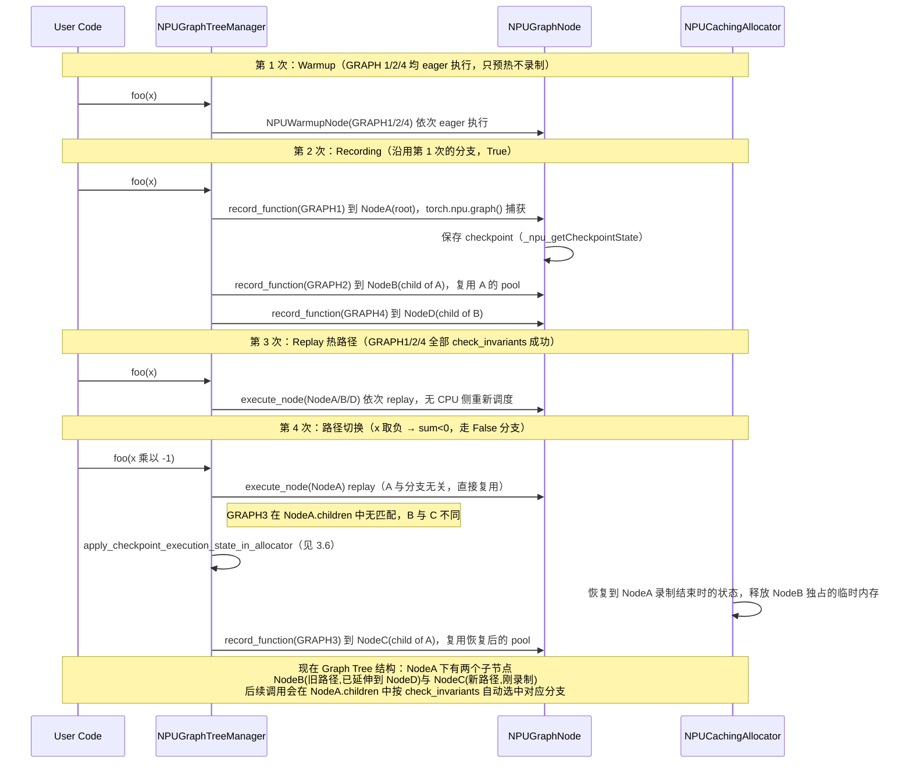

（GRAPH 4 在新分支下的录制，源材料的时序图未继续展示，本文不做推断续写。）

**内存复用效率**：checkpoint 恢复把 NodeB 独占的临时内存释放并重置为 NodeA 录制结束时的布局，NodeC 直接复用这块空间而非另外分配——树越深、分支越多，这种"同一时刻只有一条路径存活"的互斥复用效果越明显，是 §3.1 内存优化公式 `max` 而非 `sum` 的具体体现。案例也说明了「五、使用约束与最佳实践」中的两条实践依据：减少 graph break 能降低树的分支复杂度；输入形状/分支越稳定，命中 Execution 热路径（而非反复 checkpoint+录制）的概率越高。

---

## 四、与 make_graphed_callables 的对比

### 4.1 功能对比

| 特性 | `make_graphed_callables` | `torch.compile(backend="npugraphs")` |
|------|--------------------------|--------------------------------------|
| **使用方式** | 显式调用 API | `torch.compile()` 后端参数 |
| **动态形状** | 不支持（需固定形状） | 支持（Graph Tree 管理多形状） |
| **内存管理** | 单一内存池 | 树形共享内存池 |
| **自动微分** | 需手动处理 | AOT Autograd 自动处理 |
| **代码侵入性** | 需修改模型代码 | 无需修改模型 |
| **适用场景** | 推理优化 | 训练+推理全场景 |
| **调试难度** | 简单直接 | 较复杂（树结构） |

`make_graphed_callables` 的完整实现流程（六阶段：输入校验展平 → 构建 static_input_surface → Warmup → 前向图捕获 → 反向图捕获 → 包装为 autograd.Function）、内存分配与复用机制、内存峰值 debug 方法，详见 [[20_npugraphs_make_graphed_callables_deepdive]]；`torch.compile(backend="npugraphs")` 自身的完整调用链路见本文「二、完整调用链路分析」与「三、NPU Graph Tree 核心机制」。

---

## 五、使用约束与最佳实践

### 5.1 使用约束

1. **设备约束**
   - 所有输入/输出必须在 NPU 设备上
   - 不支持 CPU 设备（除特定 CPU Tensor 如 KV Cache 长度）

2. **内存约束**
   - 静态输入（参数、buffer）地址必须保持稳定
   - 动态输入会被复制到预分配缓冲区
   - 输出张量生命周期由 Graph Tree 管理

3. **操作约束**
   - 某些操作可能不支持 NPU Graph 捕获
   - 输入突变需标记 `mutated_input_idxs`
   - CPU Tensor 需特殊处理

### 5.2 最佳实践

```python
import torch
import torch_npu

# 1. 基础用法
model = MyModel().npu()
compiled_model = torch.compile(model, backend="npugraphs")

# 2. 标记 step 开始（推荐用于复杂训练循环）
for epoch in range(num_epochs):
    for batch in dataloader:
        torch.compiler.npugraph_mark_step_begin()  # 标记新迭代开始
        output = compiled_model(batch)
        loss = criterion(output, target)
        loss.backward()
        optimizer.step()
        optimizer.zero_grad()

# 3. 处理动态形状（Graph Tree 自动处理）
# 不同 batch size 会自动创建不同的 graph 节点
for batch_size in [16, 32, 64]:
    input = torch.randn(batch_size, 3, 224, 224).npu()
    output = compiled_model(input)  # 每个 shape 首次会 warmup+record

# 4. 推理模式
compiled_model = torch.compile(model, backend="npugraphs", mode="reduce-overhead")
with torch.no_grad():
    output = compiled_model(input)
```

---

## 六、总结

`torch.compile(backend="npugraphs")` 是一个强大的编译后端，通过 NPU Graph Tree 机制实现了：

1. **多路径执行管理**：通过树结构统一处理运行时的多种路径分歧场景：
   - **动态形状**：不同的 shape 组合（symint）在 `deferred_npugraphify` 层通过 `fn_cache` 按 int key 分别缓存独立的 Graph 录制
   - **Graph Break 多子图**：Dynamo 裂图产生的多个子图各自拥有独立的 `FunctionID`，由同一个 TreeManager 在运行时将它们的执行串联成一条完整的树路径（如 A_fw→B_fw→C_fw→C_bw→B_bw→A_bw），子图间共享内存池、零拷贝传递
   - **运行时路径分支**：当某个子图的 `check_invariants` 失败时（如参数被 optimizer 重新分配、内存布局变化），树在失败点自动分叉录制新路径，后续执行时通过遍历 children 列表自动选择匹配的分支
2. **内存高效**：共享内存池，前向输出直接作为反向输入（零拷贝），自动复用 dead memory，通过 checkpoint 机制在路径切换时恢复 allocator 状态
3. **自动微分集成**：通过 AOT Autograd 将模型拆分为前向/反向/推理子图，无缝支持训练场景
4. **低开销**：消除 CPU 逐 kernel 调度开销，`graph.replay()` 一次提交整个子图的所有 kernel

其核心实现分布在：
- `torch_npu/utils/_graph_tree.py`: 后端入口和包装层（`NpugraphsBackend`、`npugraphs()`、`npugraphify()`）
- `torch_npu/npu/_graph_tree.py`: NPU Graph Tree 核心实现（`NPUGraphTreeManager`、`NPUGraphNode`、`NPUWarmupNode`）
- `torch_npu/npu/graphs.py`: 底层 `make_graphed_callables` 实现
- `torch_npu/csrc/core/npu/NPUGraph.h/cpp`: C++ 层 `NPUGraph`（capture_begin/replay/reset，§3.5.1）
- `torch_npu/csrc/core/npu/NPUCachingAllocator.cpp`: C++ 层内存分配器（`PrivatePool`、checkpoint 快照结构，§3.5.2-3.5.3）

与直接使用 `make_graphed_callables` 相比，`torch.compile(backend="npugraphs")` 通过 Graph Tree 提供了更高级的运行时管理能力，能自动应对动态形状、多子图协调、路径分支等复杂场景。

---

## 附录 A：mode="reduce-overhead" 与 backend="npugraphs" 双路径对比（摘要）

> 本附录曾详细展开 `torch.compile(mode="reduce-overhead")`（路径 A，经 Inductor 编译）与本文正文 `torch.compile(backend="npugraphs")`（路径 B，绕开 Inductor）的完整调用链路、逐 Phase 源码定位、性能对比与选型决策；现已收缩为摘要，完整内容并入 [[10_aclgraph_deep_analysis]]（该页是 `mode="reduce-overhead"` 捕获路径的权威页）。

路径 A 与路径 B 都能触发 NPU Graph 加速，核心差异在于是否经过 Inductor 编译：路径 A 经 `_TorchCompileInductorWrapper` → `compile_fx`（AOT Autograd + Pre-grad/Joint-graph/Post-grad passes + Scheduling + Triton/C++ Codegen）产出**少量融合内核**，再由 `cudagraph_post_compile` 把已被 torch_npu monkey-patch 的 `cudagraphify`（即 `npugraphify`）接入 NPU Graph Tree；路径 B 的 AOT Autograd 直接用 `boxed_nop` 解释执行**原始 FX 图**（大量未融合的 aten op），同样接入 Graph Tree。两条路径从 NPU Graph Tree 起（Warmup → Record → Replay）完全共享同一套核心实现（本文「二、完整调用链路分析」Phase 5-8）。`mode` 参数仅在 `backend="inductor"`（默认）时生效；显式指定 `backend="npugraphs"` 时 `mode` 参数会被忽略。

结论：路径 A 编译更慢但稳态 NPU 利用率更高、Graph 捕获失败时回退到仍经优化的 Triton 内核，适合生产部署；路径 B 编译快、适合调试/baseline/快速验证 NPU Graph 兼容性，但回退会退化为较慢的 FX 图解释执行。

完整的 mode 参数表、Wrapper 分发机制、逐 Phase 源码定位、录制内容/性能/回退对比表、选型决策与核心文件索引，见 [[10_aclgraph_deep_analysis]] §一「1.5 mode 参数与两条路径的触发关系」、§四「4.4 与 backend="npugraphs" 路径（路径 B）的对比」。

---

## Related Pages

- [[02_engineering/01_pytorch/index]]
- [[23_vllm_compilation_cudagraph_analysis]] — CUDA 侧对照:vLLM 分段 CUDA Graph（`CUDAGraphWrapper`/`CudagraphDispatcher`）的生产实现
