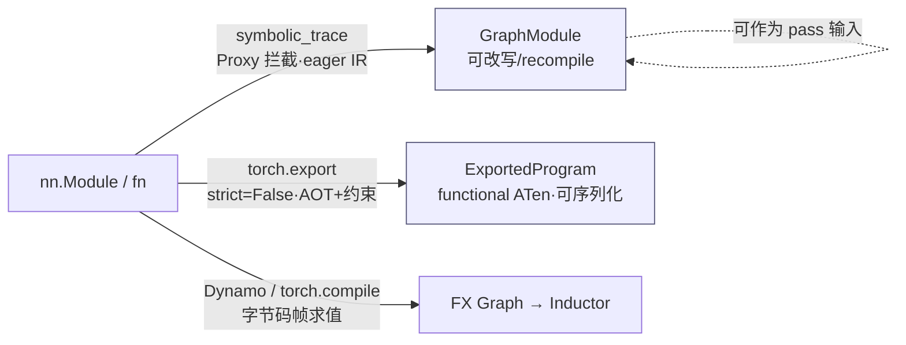

# torch.fx / torch.export / 算子扩展 — 实用上手

> **页面角色**：FX/export/custom-op API 实操入口。
> **原始基线**：见下方页头；**当前审计基线**：PyTorch `e8f97c1a6ef8cbcdd0a946606bc1e924e4f07e52`。
> **课程分工**：本页保留API速查；捕获前端、FX数据结构与改图不变量的当前主线见 [[14_graph_capture_frontends_and_tracing_analysis]]、[[10_fx_graph_core_data_model_analysis]] 与 [[21_fx_graph_editing_primitives_and_invariants_analysis]]。

> 层次:quick start(用)
> 核验基准:PyTorch upstream `E:\97-codes\pytorch\pytorch`(v2.13.0a0, commit 9922478)
> 最后更新:2026-06-15

---

## 0. 本页解决什么

本页给出五条最小可用路径,每条都能直接复制运行,并配真实 `路径:行号`:

1. `symbolic_trace` 一个 `nn.Module`,遍历 `graph.nodes` **改写 / 插入节点**,再 `recompile`。
2. 写一个 `PassBase` 子类把上面的改写包成可复用的 **图变换 pass**。
3. `torch.export` 带 **动态 `Dim` 约束**,并查看 `ExportedProgram` 的签名与约束。
4. 用 `torch.library.custom_op` **定义 + 注册**一个自定义算子(schema 自动推断 + backend impl + fake)。
5. `vmap` 自动向量化 与 `functional_call` 无状态调用。

机制层面的"为什么这么设计"在 [[10_fx_graph_export_and_custom_ops_analysis|FX/export 扩展机制源码级深析]];本模块全景见 [[02_engineering/01_pytorch/04_export_and_distributed/01_fx_export_extensibility/index|FX 图 IR·torch.export·算子扩展]]。

三条捕获路径的取舍(选哪条,见 overview 全景图):



- **要原地改图、做 pass、读图结构** → `symbolic_trace`(本页 §1–§2)。
- **要离线导出、序列化、形状健全性保证** → `torch.export`(本页 §3)。
- **要端到端编译加速** → `torch.compile`(见 [[02_compile_stack/01_dynamo/index]])。

---

## 1. symbolic_trace + 改写 / 插入节点 + recompile

### 1.1 trace 出一张 FX 图

`symbolic_trace(root, concrete_args=None)`(`torch/fx/_symbolic_trace.py:1361`)是薄封装:内部就是
`Tracer().trace(root, concrete_args)` 再 `_make_graph_module(...)`(同文件 `:1416`)。它用 `Proxy` 在
**eager Python 层**拦截算子(对比 Dynamo 走字节码,见 deepdive),所以**无法捕获依赖数据的控制流**——
需要时用 `concrete_args` 对值偏特化把分支固化掉。

```python
import torch
import torch.fx as fx

class M(torch.nn.Module):
    def __init__(self):
        super().__init__()
        self.lin = torch.nn.Linear(4, 4)

    def forward(self, x):
        return self.lin(x).relu() + 1.0

gm = fx.symbolic_trace(M())          # 返回 torch.fx.GraphModule
gm.graph.print_tabular()             # torch/fx/graph.py:2099,需 pip install tabulate
print(gm.code)                       # 查看生成的 forward 源码
```

`print_tabular()` 打出每个节点的 `opcode / name / target / args / kwargs`,六种 `opcode`:
`placeholder`(输入)、`get_attr`(取参数/buffer)、`call_function`、`call_method`、`call_module`、`output`。

### 1.2 遍历 nodes 并插入一个新节点

`gm.graph.nodes`(`torch/fx/graph.py:1386`)是**有序双向链表**,迭代期间增删节点是安全的。改写三件套:

- `with graph.inserting_after(node):` 设插入点(`torch/fx/graph.py:1637`;另有 `inserting_before`)。
- `graph.call_function(target, args, kwargs)` / 底层 `graph.create_node(op, target, ...)`(`:1495`)建节点。
- `old.replace_all_uses_with(new)` 把所有"用 old 的地方"重定向到 new(use-def 反向边自动维护)。
- `graph.erase_node(node)`(`:1571`)删节点(**有用户时会抛异常**,所以先 `replace_all_uses_with`)。

下例在每个 `relu` 调用后插入一个 `mul 2.0`:

```python
graph = gm.graph
for node in list(graph.nodes):                       # 先快照,避免边改边迭代踩坑
    if node.op == "call_method" and node.target == "relu":
        with graph.inserting_after(node):
            new = graph.call_function(torch.mul, args=(node, 2.0))
        # 把所有原来消费 relu 输出的地方改成消费 new;
        # 注意要排除 new 自己对 node 的引用,否则成环
        node.replace_all_uses_with(new, delete_user_cb=lambda u: u is not new)

graph.lint()        # torch/fx/graph.py:2121,校验拓扑/所有权/target 存在
gm.recompile()      # torch/fx/graph_module.py:918,原地改图后必须手动重编译
```

要点:
- **原地改 `graph` 后必须 `gm.recompile()`**;只有给 `gm.graph` 重新赋值才会自动触发重编译。
  `recompile()` 调 `graph.python_code(...)` 产出新 `forward` 源码并编译,还把源码塞进 `linecache`
  让 traceback 能定位到生成代码行。
- `graph.lint()` 是改写后的"安检",出错信息能直接指出哪个节点拓扑/所有权非法。

### 1.3 验证改写正确

```python
x = torch.randn(2, 4)
ref = M()(x)
# 用同一份权重对照(symbolic_trace 保留了原 Module 的子模块/参数)
torch.testing.assert_close(gm(x), (gm.lin(x).relu() * 2.0) + 1.0)
print("ok")
```

---

## 2. 把改写包成 PassBase pass
`PassBase`(`torch/fx/passes/infra/pass_base.py:28`)是统一的图变换接口。它的 `__call__`(`:40`)按
**前置校验 → 变换 → 后置校验**串起来:

```python
# torch/fx/passes/infra/pass_base.py:40
def __call__(self, graph_module):
    self.requires(graph_module)     # 前置不变量(可选覆写)
    res = self.call(graph_module)   # 抽象方法 :51,子类必须实现
    self.ensures(graph_module)      # 后置不变量(可选覆写)
    return res
```

子类只需实现抽象 `call`(`:51`),返回 `PassResult(graph_module, modified)`
(namedtuple,`:14`)告诉 PassManager 这趟有没有改图(用于决定是否再迭代):

```python
from torch.fx.passes.infra.pass_base import PassBase, PassResult

class DoubleReluPass(PassBase):
    def call(self, gm):
        g = gm.graph
        modified = False
        for node in list(g.nodes):
            if node.op == "call_method" and node.target == "relu":
                with g.inserting_after(node):
                    new = g.call_function(torch.mul, args=(node, 2.0))
                node.replace_all_uses_with(new, delete_user_cb=lambda u: u is not new)
                modified = True
        if modified:
            g.lint()
            gm.recompile()
        return PassResult(gm, modified)

    def ensures(self, gm):              # 后置断言:确保图仍合法
        gm.graph.lint()

gm = fx.symbolic_trace(M())
result = DoubleReluPass()(gm)          # 直接像函数一样调用
print(result.modified)                 # True
```

---

## 3. torch.export + 动态 Dim 约束
`export(mod, args, kwargs=None, *, dynamic_shapes=None, strict=False, ...)`
(`torch/export/__init__.py:59`)做 **AOT 规范化**:输出一张规范到 functional ATen 算子集、消除了
Python 控制流/数据结构、并带形状约束的 `ExportedProgram`,可序列化重放。`Dim` / `ShapesCollection`
等从 `torch.export.dynamic_shapes` 再导出(`torch/export/__init__.py:43`)。

注意 **`strict` 默认 `False`**(同文件 `:65`):走非严格(非 Dynamo)路径。

```python
import torch
from torch.export import export, Dim

class Net(torch.nn.Module):
    def __init__(self):
        super().__init__()
        self.lin = torch.nn.Linear(8, 8)

    def forward(self, x):
        return self.lin(x).relu()

# 让 batch 维动态、特征维静态(=8)
batch = Dim("batch", min=1, max=1024)
ep = export(
    Net(),
    (torch.randn(4, 8),),
    dynamic_shapes={"x": {0: batch}},   # 第 0 维动态,其余按示例固定
)
print(ep)                               # 打印 graph + Graph signature + Range constraints
```

### 3.1 查看 ExportedProgram

`ExportedProgram`(`torch/export/exported_program.py:1058`)的常用只读视图:

| 视图 | 锚点 | 看什么 |
|------|------|--------|
| `ep.graph_module` / `ep.graph` | — | 规范化后的 FX 图 |
| `ep.graph_signature` | `exported_program.py:1165` | 输入分类:`PARAMETER` / `BUFFER` / `USER_INPUT`(params/buffers 被 lift 成显式图输入) |
| `ep.range_constraints` | `exported_program.py:1236` | 各 symbolic 维的取值范围(来自 `Dim` 与 kernel 假设) |
| `ep.module()` | `exported_program.py:1465` | 把 lifted params/buffers **inline 回**普通可调用 `GraphModule` |

```python
print(ep.graph_signature)       # 看哪些是 PARAMETER/BUFFER,哪些是 USER_INPUT
print(ep.range_constraints)     # 看 batch 维约束,如 {s0: VR[1, 1024]}

m = ep.module()                 # 反 lift,得到能像普通 Module 一样调用的对象
# 直接验证不同 batch(动态维)都能跑,且与原模型一致:
net = Net()
ep2 = export(net, (torch.randn(4, 8),), dynamic_shapes={"x": {0: batch}})
m2 = ep2.module()
for bs in (1, 7, 512):          # 动态维任意取值都成立
    x = torch.randn(bs, 8)
    torch.testing.assert_close(m2(x), net(x))
    print(bs, m2(x).shape)
```

### 3.2 动态形状排查

- 若把本应动态的维当静态导出,换 batch 跑会报 guard 失败;按错误信息里 **suggested fixes** 给
  `Dim` 加 `min/max` 或改声明即可(`export` docstring `torch/export/__init__.py:95-106` 明确说明会给修复建议)。
- `run_decompositions()` 可进一步把图分解到更细的 ATen 算子集(衔接 [[02_compile_stack/02_aot_autograd/index]] 的分解栈)。

---

## 4. torch.library:定义 + 注册一个 custom_op
**现代推荐 API** 是 `torch.library.custom_op`(从 `torch._library.custom_ops` 再导出,
`torch/library.py:17`;真实实现 `torch/_library/custom_ops.py:67`)。它靠**类型注解推断 schema**,
把函数包成分发器一等公民,从而能被 autograd / `torch.compile` / `export` / FX **当作不透明黑盒**正确处理
(不会被错误内联)。`mutates_args` 必须准确(`torch/_library/custom_ops.py:94-96` 强调)。

```python
import torch
from torch import Tensor

# 1) 定义:name="命名空间::算子名",mutates_args=() 表示不原地改任何输入;schema 由注解推断
@torch.library.custom_op("mylib::mymul", mutates_args=())
def mymul(x: Tensor, y: Tensor) -> Tensor:
    return x * y                      # 默认实现(对所有 device 生效)

# 2) backend impl:为特定 device 注册(可选;此处演示 CPU 专用实现)
@mymul.register_kernel("cpu")         # CustomOpDef.register_kernel,_library/custom_ops.py:391
def _(x, y):
    return torch.mul(x, y)

# 3) fake/meta:让 torch.compile / export 能在不真正算数的前提下推断输出形状/dtype
@mymul.register_fake                  # CustomOpDef.register_fake,_library/custom_ops.py:522
def _(x, y):
    return torch.empty_like(x)

a, b = torch.randn(3), torch.randn(3)
torch.testing.assert_close(torch.ops.mylib.mymul(a, b), a * b)
```

补充:
- 需要可微时再加 `@mymul.register_autograd(...)`(`_library/custom_ops.py:638`)。
- 与上面 `CustomOpDef` 方法等价的**顶层函数**形式:`torch.library.register_kernel`
  (`torch/library.py:1004`)、`register_fake`(`:1146`)、`register_autograd`(`:1309`),
  适合给"别人定义的"算子补注册。
- **旧 API**(对照用,不推荐):`torch._custom_ops.custom_op`(`torch/_custom_ops.py:24`)/ 底层
  `Library` 句柄(`torch/library.py:212`)。注册到分发器后,算子自动接通 export / FX;
  分发器背景见 [[01_eager_runtime/02_dispatcher_and_device/index]],算子注册全景见 [[01_eager_runtime/03_op_registration/index]]。

### 4.1 验证 custom_op 正确性

```python
# opcheck 跑一系列一致性检查(schema/fake/autograd/可变性等)
torch.library.opcheck(torch.ops.mylib.mymul, (a, b))   # torch/library.py:1774
```

---

## 5. vmap 与 functional_call

### 5.1 vmap:自动向量化

`vmap(func, in_dims=0, out_dims=0, randomness="error", *, chunk_size=None)`
(`torch/_functorch/apis.py:68`,即 `torch.func.vmap` / `torch.vmap`)把"批维"推进算子内部:对张量输入包
**BatchedTensor**(隐藏批维)送进 `func`,出口再 unwrap,免手写广播。

```python
import torch
from torch.func import vmap

def dot(a, b):                    # 写"单样本"语义
    return (a * b).sum()

A = torch.randn(64, 16)
B = torch.randn(64, 16)
out = vmap(dot)(A, B)            # 自动在第 0 维批处理,out.shape == (64,)
print(out.shape)

# in_dims 指定每个输入沿哪一维批处理:这里 B 不批(广播同一个 b)
out2 = vmap(dot, in_dims=(0, None))(A, B[0])
print(out2.shape)               # (64,)
```

### 5.2 functional_call:把 Module 当纯函数

`functional_call(module, parameter_and_buffer_dicts, args=None, kwargs=None, *, tie_weights=True, strict=False)`
(`torch/_functorch/functional_call.py:13`)用**外部传入的** `{name: tensor}` 临时替换模块的 params/buffers
做一次**无状态**调用——是 ensembling、元学习,以及"把 `nn.Module` 喂给 `grad`/`vmap`"的桥。

```python
import torch
from torch.func import functional_call, grad

model = torch.nn.Linear(4, 1)
x = torch.randn(8, 4)
target = torch.randn(8, 1)

params = dict(model.named_parameters())     # {'weight': ..., 'bias': ...}

def loss_fn(params, x, target):
    pred = functional_call(model, params, (x,))   # 用 params 而非 model 内部权重
    return torch.nn.functional.mse_loss(pred, target)

grads = grad(loss_fn)(params, x, target)    # 对 params 求导,得到同结构的梯度 dict
print({k: v.shape for k, v in grads.items()})
```

组合用法(per-sample 梯度等)如 `vmap(grad(...))` 在 deepdive 展开。

---

## 6. 常用排查 / 验证速查

| 目的 | 命令 / API | 锚点 |
|------|-----------|------|
| 看生成的 forward 源码 | `print(gm.code)` | `graph_module.py:511` |
| 表格化看图节点 | `gm.graph.print_tabular()` | `graph.py:2099` |
| 改写后校验图合法 | `gm.graph.lint()` | `graph.py:2121` |
| 原地改图后重编译 | `gm.recompile()` | `graph_module.py:918` |
| 查 export 输入分类 | `ep.graph_signature` | `exported_program.py:1165` |
| 查动态维约束 | `ep.range_constraints` | `exported_program.py:1236` |
| 反 lift 成可调用模块 | `ep.module()` | `exported_program.py:1465` |
| 自定义算子一致性检查 | `torch.library.opcheck(...)` | `library.py:1774` |

排查心法:
- **`Proxy` 报 "not iterable / cannot determine truth value"** → 命中了数据依赖控制流,改用 `concrete_args`
  偏特化,或改用 `torch.export` / `torch.compile`。
- **改图后行为没变** → 忘了 `recompile()`(原地改 `graph` 不会自动重编译)。
- **`erase_node` 抛 "still have users"** → 先 `replace_all_uses_with(new)` 再删。
- **export 换形状报 guard 失败** → 该维应声明为 `Dim`;按错误里的 suggested fix 调整。
- **custom_op 在 compile/export 下报 fake 缺失** → 补 `register_fake`(形状/dtype 推断)。

---

## Related Pages

- [[courses/torch_compile_end_to_end]] — 当前固定基线的图编译系统化课程入口
- [[02_engineering/01_pytorch/04_export_and_distributed/01_fx_export_extensibility/index|FX 图 IR·torch.export·算子扩展]] — 本模块 overview(FX / export / 扩展机制全景与捕获路径对比)
- [[10_fx_graph_export_and_custom_ops_analysis]] — 本模块 deepdive(Proxy 拦截、Node/Graph IR、代码生成、分发桥接源码级深析)
- [[02_compile_stack/01_dynamo/index]] — Dynamo:字节码帧求值的另一条图捕获路径
- [[02_compile_stack/02_aot_autograd/index]] — AOT Autograd / 分解栈(`run_decompositions` 衔接处)
- [[01_eager_runtime/03_op_registration/index]] — 算子注册全景(custom_op 与分发器注册)
- [[01_eager_runtime/02_dispatcher_and_device/index]] — 分发器与 device key(custom_op 落地的底座)
