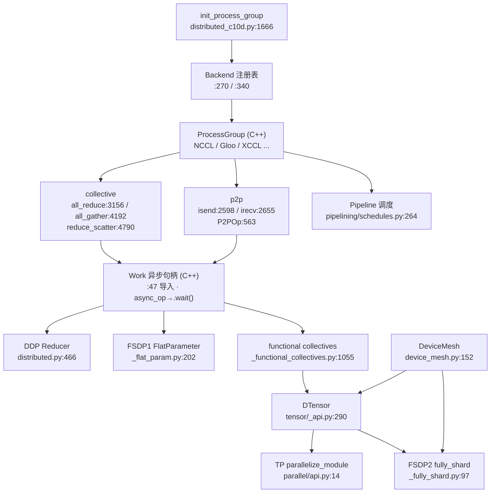
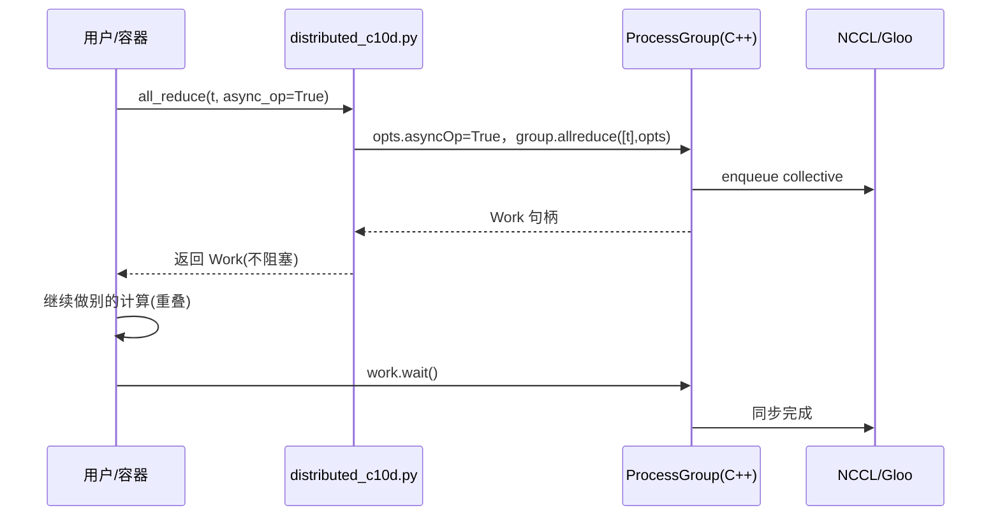
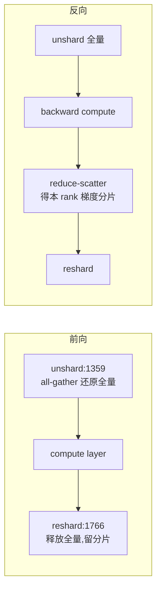
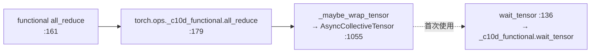
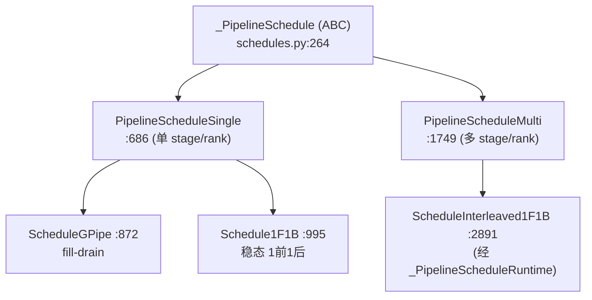

# torch.distributed 原生原语源码深析:c10d / DDP / FSDP / DTensor / DeviceMesh / TP / PP

> 层次:deep dive
> 核验基准:PyTorch upstream `E:\97-codes\pytorch\pytorch`(v2.13.0a0, commit 9922478)
> 最后更新:2026-07-30(补与 [[20_ddp_compile_boundaries_and_optimizer_analysis]]、[[21_fsdp_dtensor_and_distributed_graphs_analysis]] 的互指划界)

本页是「torch.distributed 原生原语」模块的 **deep dive**,逐机制拆解 PyTorch 自带的分布式栈:最底层的 c10d 后端/句柄,到三种并行容器(DDP / FSDP1 / FSDP2)、张量级抽象(DTensor / DeviceMesh / TP)与流水线调度(PP)。每个机制按「做什么 / 为什么这么设计 / 怎么实现」展开,所有源码引用形如 `相对路径:行号`(相对 `E:\97-codes\pytorch\pytorch` 根),均已逐一打开核实。

> [!note] 与 [[20_ddp_compile_boundaries_and_optimizer_analysis]]、[[21_fsdp_dtensor_and_distributed_graphs_analysis]] 的分工
> 本页讲这些原语**本身**怎样实现,完全不涉及 `torch.compile`。DDP/FSDP/DTensor 与 Dynamo/AOTAutograd/Inductor **相遇时**新增的一层问题(DDPOptimizer 按 bucket 切分 FX 图、`use_orig_params=True`、Dynamo 跳过 FSDP wrapper frame、rank 一致性与 guards)见上述两篇。

入门用法见 [[01_distributed_primitives_quickstart]],模块全景见 [[02_engineering/01_pytorch/04_export_and_distributed/02_distributed_primitives/index|torch.distributed 原生原语]]。上层的 Megatron / torchtitan 等训练框架建立在这些原语之上,见 [[02_train_frameworks/index]]。



---

## 一、c10d 底座:Backend 注册表 + ProcessGroup + Work 异步句柄

### 1.1 Backend:字符串后端名的可插拔注册表

**做什么**:`Backend`(`torch/distributed/distributed_c10d.py:270`)是 `str` 的子类(`class Backend(str)`),把 `"nccl"/"gloo"/"xccl"/"mpi"/"fake"` 等后端名规范化为小写字符串枚举。类体里维护几张关键映射表(`:299` 起):`_plugins`、`backend_list`、`default_device_backend_map`(`cpu→gloo`、`cuda→nccl`、`xpu→xccl`、`mps→gloo`,`:304`)、`backend_capability`(`:311`)、`backend_type_map`(`:320`,把名字映射到 C++ 的 `ProcessGroup.BackendType`)。

**为什么这么设计**:把「字符串后端名 → C++ 后端实例化函数」彻底解耦,使 `init_process_group(backend=...)` 对树外设备(如 NPU/HCCL)开放——第三方只要 `register_backend` 就能挂进来,无需改 PyTorch 核心。

**怎么实现**:`__new__`(`:330`)用 `getattr(Backend, name.upper(), UNDEFINED)` 解析大小写;`register_backend`(`:340`,`@classmethod`)把第三方后端登记进各张表:

```python
# torch/distributed/distributed_c10d.py:373
if not hasattr(Backend, name.upper()):
    setattr(Backend, name.upper(), name.lower())
if name.lower() not in Backend.backend_list:
    Backend.backend_list.append(name.lower())
...
Backend.backend_type_map[name.lower()] = ProcessGroup.BackendType.CUSTOM   # :386
Backend._plugins[name.upper()] = Backend._BackendPlugin(func, extended_api) # :407
```

`extended_api=True` 时后端会拿到 `c10d::DistributedBackendOptions` 扩展结构(`:361` 文档),这正是 NPU 等设备接入的口子。注意 `Backend`、`ProcessGroup`、`Work` 这些类的**真正实现都在 C++**;`distributed_c10d.py:47` 只是从 `torch._C._distributed_c10d` 把 `Work` 等符号导入 Python 层。

### 1.2 init_process_group:总入口

`init_process_group`(`torch/distributed/distributed_c10d.py:1666`)初始化默认进程组,确立 `backend / init_method / timeout / world_size / rank / store / device_id`。它最终把上面的 `Backend` 名解析成具体 C++ `ProcessGroup` 实例并设为全局默认组。

### 1.3 collective vs p2p,以及 Work 异步句柄

**做什么**:c10d 暴露两类操作。

| 类别 | 代表 API(行号) |
|---|---|
| collective(集合) | `broadcast`(`:3086`)、`all_reduce`(`:3156`)、`all_gather`(`:4192`)、`reduce_scatter`(`:4790`)、`all_to_all`(`:5145`) |
| p2p(点对点) | `isend`(`:2598`)、`irecv`(`:2655`)、`batch_isend_irecv`(`:2990`,返回 `list[Work]`)、`P2POp`(`:563`) |

`P2POp`(`:563`)是给 `batch_isend_irecv` 用的「未发起的 P2P 描述」,封装 `op`(`isend`/`irecv`)、`tensor`、`peer`、`group`、`tag`(`:583` 构造)。

**为什么 / 怎么实现**:每个 op 构造对应的 `*Options`(`BroadcastOptions`/`AllreduceOptions` 等,从 C++ 导入),设 `opts.asyncOp = async_op`,再调用 `group.<op>(...)` 返回 `Work` 句柄。`broadcast` 体里能看到统一的同步/异步分流(`:3145`):

```python
# torch/distributed/distributed_c10d.py:3145
work = group.broadcast([tensor], opts)
if async_op:
    return work                 # 调用方持有 Work,自行 .wait()
elif work is not None:          # 后端未在 C++ 层同步时,Python 侧补一次等待
    work.wait()
# 否则后端已在 C++ 层同步
```

`Work` 是「发起通信」与「等待完成」解耦的句柄:`async_op=True` 时立刻返回、让通信与后续计算重叠,这是 DDP/FSDP 重叠的底层基础。`Work` 实现全在 C++(`torch/csrc/distributed/c10d/`)。



---

## 二、DDP Reducer:梯度分桶 + 反向重叠

### 2.1 做什么

`DistributedDataParallel`(`torch/nn/parallel/distributed.py:466`,`class DistributedDataParallel(Module, Joinable)`)是数据并行容器:每个 rank 持有完整模型副本,在反向阶段把梯度跨 rank `all_reduce` 求平均,使各副本保持同步。

### 2.2 为什么要分桶(bucketing)

如果每个参数的梯度一就绪就单独 `all_reduce`,小消息会被通信延迟主导;若等所有梯度都就绪再一次性 `all_reduce`,又无法与反向计算重叠。**分桶**是折中:把多个参数的梯度攒进一个「桶」,桶满即异步 `all_reduce`,从而既摊薄延迟、又能让前面桶的通信与后面层的反向计算重叠。`_BucketCapacityConfig`(`:37`,`@dataclass(frozen=True)`)封装桶大小策略,默认桶上限 `_DEFAULT_BUCKET_CAP_MB = 25`(`:31`,即 25 MiB)。

### 2.3 怎么实现

`_ddp_init_helper`(`:1374`)负责 (1) 分桶、(2) 重置状态、(3) 注册梯度 hook。桶大小由 `_bucket_config.compute_bucket_size_limits`(`:1414`)算出,再用 `dist._compute_bucket_assignment_by_size`(`:1422`)把参数指派进桶。关键细节是**桶顺序反转**:

```python
# torch/nn/parallel/distributed.py:1437
self.reducer = dist.Reducer(
    parameters,
    list(reversed(bucket_indices)),         # 反转:近似反向梯度产生顺序
    list(reversed(per_bucket_size_limits)),
    self.process_group,
    expect_sparse_gradient,
    ...
)
```

参数通常按前向定义顺序排列,而反向梯度的产生顺序大致相反,所以 `reversed(...)`(`:1434` 注释)让桶顺序贴近反向到达顺序——最先就绪的梯度落在最先被冲刷的桶里,最大化重叠。

真正的 `Reducer` 是 **C++ 类**(`torch/csrc/distributed/c10d/reducer.cpp`),`dist.Reducer(...)` 只是 Python 绑定。它把 autograd hook 挂到每个参数上:某桶内所有梯度就绪即触发该桶的异步 `all_reduce`。`_ddp_init_helper` 顶部注释(`:1391`)还说明一个 corner case——当参数不在真实执行顺序、且图里有其他集合通信 + 部分 rank 有 unused param 时,会**关闭首次迭代的分桶**(只发一次 all-reduce),避免 all-reduce 过早插入与其他 rank 的集合通信错配挂死;第二次迭代后按真实反向顺序重建桶。

> 设计依据见 Li et al., *PyTorch Distributed*, VLDB 2020(arXiv:2006.15704)——分桶 + 反向 all-reduce 重叠的原始论文。

---

## 三、FSDP1:FlatParameter 切分 + all-gather / reduce-scatter 重叠

### 3.1 做什么

`FullyShardedDataParallel`(`torch/distributed/fsdp/fully_sharded_data_parallel.py:118`,`class FullyShardedDataParallel(nn.Module, _FSDPState)`)实现 ZeRO-3 风格的全分片:把一组原始参数展平拼接成一个 `FlatParameter`(`torch/distributed/fsdp/_flat_param.py:202`,继承 `nn.Parameter`),再按 rank 切片,使每个 rank 常驻只保存 `1/N` 的参数/梯度/优化器状态;前向/反向前临时 all-gather 还原全量,用完即释放。

### 3.2 三个核心动作:shard / unshard / reshard

`FlatParamHandle`(`_flat_param.py:481`)管理 `FlatParameter` 的分片与视图。

**shard(`:945`)** —— 取本 rank 分片、释放全量存储:

```python
# torch/distributed/fsdp/_flat_param.py:964
sharded_flat_param, numel_padded = FlatParamHandle._get_shard(
    flat_param, self.rank, self.world_size)
if not torch.distributed._functional_collectives.is_torchdynamo_compiling():
    allocated = flat_param._typed_storage()._size() > 0
    if allocated:
        flat_param._typed_storage()._resize_(0)   # :970 释放全量存储
flat_param.set_(sharded_flat_param)               # :971 让 flat_param 指向分片
```

`_resize_(0)` 把底层 storage 缩到 0 字节是显存得以下降的关键——`FlatParameter` 在「全量」与「分片」两种状态间动态切换底层 storage(`:209` docstring 说明它「逻辑上同时代表 unsharded 与 sharded」)。

**unshard(`:1359`)** —— 前向/反向前 all-gather 还原全量:

```python
# torch/distributed/fsdp/_flat_param.py:1381
unsharded_flat_param = self._alloc_padded_unsharded_flat_param()
padded_unsharded_flat_param = self._all_gather_flat_param(unsharded_flat_param)
self._use_unsharded_flat_param(padded_unsharded_flat_param)
```

`needs_unshard`(`:1385`)通过比较 storage size 判断是否已经是全量,避免重复 all-gather。

**reshard(`:1766`)** —— 用完后切回分片并(可选)释放全量 buffer:

```python
# torch/distributed/fsdp/_flat_param.py:1780
self._use_sharded_flat_param()
if free_unsharded_flat_param:
    self._free_unsharded_flat_param()
```

### 3.3 重叠与显存核算

FSDP 用 **prefetch** 把「下一层的 all-gather(前向)/上一层梯度的 reduce-scatter(反向)」与「当前层计算」重叠:反向时各 rank 算出全量梯度后用 `reduce-scatter` 直接得到本 rank 的梯度分片(而非 DDP 的 all-reduce),省一半通信量。

设参数量 $P$、world size $N$、优化器状态系数 $K$(Adam 约 $K{=}2$,即 m/v),则单 rank 常驻显存近似:

$$
M_{\text{persist}} \approx \frac{P + P + K\cdot P}{N} = \frac{(2+K)\,P}{N}
$$

(分片参数 + 分片梯度 + 分片优化器状态)。峰值则在某个被 unshard 的单元处叠加一份**临时全量参数 buffer**:

$$
M_{\text{peak}} \approx M_{\text{persist}} + \max_{u}\big(\text{full\_param}(u)\big)
$$

这解释了为何 **FSDP 包装粒度(wrap policy)** 直接影响峰值——粒度越细,单次 unshard 的全量 buffer 越小,峰值越低,但通信次数越多。

> 设计依据见 Zhao et al., *PyTorch FSDP*, VLDB 2023(arXiv:2304.11277)。



---

## 四、FSDP2:composable `fully_shard`(基于 DTensor 的无包装实现)

**做什么**:`fully_shard`(`torch/distributed/fsdp/_fully_shard/_fully_shard.py:97`,`@contract(state_cls=FSDPState)` 装饰,overload 签名在 `:64`/`:79`)是新一代 FSDP。与 FSDP1 把模型替换成 wrapper 类不同,FSDP2 **原地**给 module 装上 `FSDPModule`(`:318`)能力,参数用 **DTensor** 表示分片(而非私有的 `FlatParameter`)。

**为什么**:DTensor 表示让分片对 `state_dict`、TP 组合(2D 并行)、`torch.compile` 都更自然;`@contract` 的 composable 设计允许与 `checkpoint`、TP 等其它「contract」叠加而不互相替换类。

**注意(给后续写手)**:`torch/distributed/_composable/fsdp/fully_shard.py` 在本 commit 已**退化为 re-export shim**(仅 `from torch.distributed.fsdp import fully_shard, FSDPModule, ...`),真正实现已迁到上面的 `fsdp/_fully_shard/_fully_shard.py`。讲实现时引用后者,不要再引 shim。

FSDP2 的 unshard 动作还与 PP 调度协同——调度里的 `UNSHARD`/`RESHARD` 动作类型(见第九节 `_ComputationType`)正是为它准备的。

---

## 五、DTensor:placement 传播 + 通信插入

### 5.1 做什么

`DTensor`(`torch/distributed/tensor/_api.py:290`,`class DTensor(torch.Tensor)`)是 `torch.Tensor` 子类,持两个字段(`:312`):

```python
# torch/distributed/tensor/_api.py:312
_local_tensor: torch.Tensor                 # 本 rank 实际持有的分片
_spec: DTensorSpec                          # DeviceMesh + placements(分布式布局)
__slots__ = ["_local_tensor", "_spec"]
_op_dispatcher: op_dispatch.OpDispatcher = op_dispatch.OpDispatcher()  # :317
```

### 5.2 placement 三类 + 传播

布局由 `_spec` 里的 placements 描述,三种公共类型(均继承 C++ 绑定 `torch._C._distributed.*`,Python 文件做方法增补):

| placement | 行号 | 语义 |
|---|---|---|
| `Shard(dim)` | `placement_types.py:162` | 沿张量 `dim` 切分,**`torch.chunk` 语义**——不整除时尾部 rank 的分片可能为空(`:167` 文档) |
| `Replicate()` | `placement_types.py:1429` | 该 mesh 维上每个 rank 持全量副本 |
| `Partial(reduce_op)` | `placement_types.py:1494` | 待规约状态(各 rank 持局部和,尚未 all-reduce) |

`_StridedShard`(`placement_types.py:799`)是内部类型,专为 2D「FSDP2 + TP」场景——张量先在 TP 维切、再在 FSDP 维切的「右到左」切分(`:801` 文档)。

`Shard._split_tensor`(`placement_types.py:184`)用 `torch.chunk` 切分,关键是 `with_padding`:

```python
# torch/distributed/tensor/placement_types.py:197(docstring)
# with_padding=True: 在末尾若干 rank 上补齐,因为集合通信
# (scatter/all_gather 等)通常要求各 rank 输入等长
```

### 5.3 为什么 / 怎么实现通信插入

**做什么**:调用 PyTorch 算子时,`DTensor` 重写算子,由 `_op_dispatcher`(`OpDispatcher`,`:317`)根据算子语义**传播 placement**,并在输入布局与算子要求不匹配时**自动插入通信**(redistribute)。

**为什么**:这把「在哪插 all-gather / reduce-scatter / all-to-all」从用户手写下沉为框架按布局代数推导,得到「单设备语义、多设备执行」的编程模型(`:292` docstring)。例如两个 `Partial` 张量相加后若需要 `Replicate` 结果,框架在恰当处插入 all-reduce 完成规约。

> 理解 DTensor 拦截算子的机制可参考 ezyang 的 *PyTorch internals*(Tensor subclass / dispatcher),交叉见 [[01_eager_runtime/02_dispatcher_and_device/index]]、[[01_eager_runtime/01_tensor_and_storage/index]]。

---

## 六、functional collectives + AsyncCollectiveTensor(torch.compile 可 trace)

### 6.1 做什么 / 为什么

`torch/distributed/_functional_collectives.py` 提供**函数式**集合通信:`all_reduce`(`:161`)、`broadcast`(`:145`)、`all_gather_tensor`(`:317`)、`reduce_scatter_tensor`(`:349`)等。与 c10d 原地版不同,它们**不修改输入、返回新张量**,因此对 Dynamo/Inductor 可 trace,编译器能做「通信代数优化」(重排、合并、与计算重叠)。交叉见 [[02_compile_stack/01_dynamo/index]]、[[02_compile_stack/04_inductor/index]]。

> 注:`all_gather_tensor`(`:317`)、`reduce_scatter_tensor`(`:349`)当前已标记 deprecated,内部转发到 `all_gather_single`/`reduce_scatter_single`(非编译路径会发 `FutureWarning`,`:323`/`:356`);语义不变。

### 6.2 怎么实现

实际下发到 `torch.ops._c10d_functional.*` 算子,返回值包成 `AsyncCollectiveTensor`:

```python
# torch/distributed/_functional_collectives.py:178(functional all_reduce 体)
group = _resolve_group(group, tag)
tensor = torch.ops._c10d_functional.all_reduce(
    self, reduceOp.lower(), _group_or_group_name(group))
return _maybe_wrap_tensor(tensor)        # -> AsyncCollectiveTensor
```

`AsyncCollectiveTensor`(`:1055`,`class AsyncCollectiveTensor(torch.Tensor)`)是 wrapper 子类,字段 `elem` / `completed`(`:1066`),作用是「**首次真正使用底层张量前自动 `wait`**」:

```python
# torch/distributed/_functional_collectives.py:1057(docstring)
# A Tensor wrapper subclass ... to trigger a call to wait
# prior to first use of the underlying tensor.
```

`wait_tensor`(`:136`)最终调 `torch.ops._c10d_functional.wait_tensor`(`:142`)。这样「发起通信」与「同步」被解耦,且对编译器**显式可见**(wait 是图里一个算子),便于把 wait 尽量后移以扩大重叠窗口。



---

## 七、DeviceMesh:层级布局 + group split / shrink

### 7.1 做什么

`DeviceMesh`(`torch/distributed/device_mesh.py:152`,`class DeviceMesh(OpaqueBase)`,因外层 `if _running_with_deploy()/else` 而缩进)用 n 维数组描述 rank 布局,**每个维度对应一个 ProcessGroup**,从而表达 N 维并行(如 `(dp, tp)` 或 `(pp, dp, tp)`)。`init_device_mesh`(`:1498`)是推荐构造器,可命名维度(`mesh_dim_names`)并按维覆盖 backend(`backend_override`,`:1503`)。N 维 mesh 可用 `mesh["tp"]` 切出 1 维子 mesh 喂给 TP。

### 7.2 group split / shrink:子组从哪来

| API | 行号 | 作用 |
|---|---|---|
| `split_group` | `distributed_c10d.py:5517` | 从父 PG 按 `split_ranks` 切子 PG |
| `new_group` | `distributed_c10d.py:5745` | 显式按 `ranks` 列表建组 |
| `shrink_group` | `distributed_c10d.py:6353` | 排除若干 rank 缩容(容错场景) |

`split_group` 的实现关键是**用 hashed group name 防 PrefixStore key 冲突**:

```python
# torch/distributed/distributed_c10d.py:5691
group_name = _process_group_name(my_group, use_hashed_name=True)
split_pg = parent_pg.split_group(
    my_group, timeout=timeout, opts=pg_options,
    group_name=group_name, group_desc=group_desc,
    device_types=device_types_filter,
)
```

`:5687` 注释说明原因:某些后端(如 Gloo)用 group name 作为 PrefixStore 前缀来初始化 split,名字必须唯一才能避免 key 碰撞。DeviceMesh 内部正是用 `new_group`/`split_group` 为每个 mesh 维建立对应的 ProcessGroup。

---

## 八、Tensor Parallel:parallelize_module + ParallelStyle

### 8.1 做什么

`parallelize_module`(`torch/distributed/tensor/parallel/api.py:14`)按 plan(`{FQN: ParallelStyle}` 或单个 `ParallelStyle`)把子模块改造为 DTensor 并行。它只接受 **1 维 DeviceMesh**(N 维需先切片,如 `mesh["tp"]`)。

### 8.2 ParallelStyle 契约与具体风格

`ParallelStyle`(`tensor/parallel/style.py:31`,`ABC`)定义契约,只有一个抽象方法 `_apply`(`:42`):

| Style | 行号 | 做什么 |
|---|---|---|
| `ColwiseParallel` | `style.py:45` | Linear 权重切 `Shard(0)`(列并行) |
| `RowwiseParallel` | `style.py:186` | Linear 权重切 `Shard(1)`(行并行) |
| `SequenceParallel` | `style.py:339` | 复制参数 + 在序列维分片激活(配 LayerNorm/Dropout) |
| `PrepareModuleInput` | `style.py:442` | 把输入按 `input_layouts → desired_input_layouts` redistribute |
| `PrepareModuleOutput` | `style.py:607` | 把输出按目标 layout redistribute |

`ColwiseParallel._partition_linear_fn`(`style.py:121`)逐参数 `distribute_tensor(..., [Shard(0)], ...)`:

```python
# torch/distributed/tensor/parallel/style.py:125
for name, param in module.named_parameters():
    dist_param = nn.Parameter(
        distribute_tensor(param, device_mesh, [Shard(0)],
                          src_data_rank=self.src_data_rank),
        requires_grad=param.requires_grad)
    module.register_parameter(name, dist_param)
```

`PrepareModuleInput` 用 `redistribute(..., async_op=True)`(`style.py:116`)做布局转换——典型 Transformer 用 `ColwiseParallel`(QKV/第一层 MLP)+ `RowwiseParallel`(输出投影/第二层 MLP)组合,使一层内只在末尾插一次 all-reduce。

---

## 九、Pipeline 调度 + microbatching

### 9.1 调度族层级

`torch/distributed/pipelining/schedules.py` 提供 PP 调度族:



- `_PipelineSchedule`(`:264`)抽象基类,`__init__` 收 `n_microbatches`。
- `PipelineScheduleSingle`(`:686`)每 rank 一个 stage;子类 `ScheduleGPipe`(`:872`,全部 microbatch 先前向再统一反向的 fill-drain)、`Schedule1F1B`(`:995`,稳态下一前向一反向以压缩气泡)。
- `PipelineScheduleMulti`(`:1749`)每 rank 多个 stage;`ScheduleInterleaved1F1B`(`:2891`,经 `_PipelineScheduleRuntime`)实现交错 1F1B(见 arXiv:2104.04473)。

### 9.2 动作枚举与 microbatching

`_ComputationType`(`:54`,`str, Enum`)把调度拆成原子动作:`FORWARD="F"`、`BACKWARD_INPUT="I"`、`BACKWARD_WEIGHT="W"`、`FULL_BACKWARD="B"`、`UNSHARD`/`RESHARD`(与 FSDP2 协同)、`SEND_F`/`RECV_F`/`SEND_B`/`RECV_B`(p2p 收发)、`OVERLAP_F_B`、`REDUCE_GRAD`。把 F/B 拆成可调度的离散动作,正是零气泡/交错等高级调度能编排的前提。

microbatching 由 `pipelining/microbatch.py` 的 `split_args_kwargs_into_chunks` / `merge_chunks` 完成:把一个 batch 切成 `n_microbatches` 份依次喂入流水线,以填满各 stage、缩小气泡(bubble)。PP 的 p2p 收发底层就是第一节的 `isend`/`irecv`,跨 stage 传递激活与梯度。

---

## 十、机制速查:通信量与常驻显存对照

| 容器 | 反向通信原语 | 单 rank 常驻参数 | 关键源码锚点 |
|---|---|---|---|
| DDP | `all_reduce`(梯度) | 全量 $P$ | `nn/parallel/distributed.py:466` / `:1437` |
| FSDP1 | `reduce_scatter`(梯度)+ `all_gather`(参数) | $P/N$ | `fsdp/_flat_param.py:945` / `:1359` / `:1766` |
| FSDP2 | 同上,DTensor 表示 | $P/N$ | `fsdp/_fully_shard/_fully_shard.py:97` |
| TP | 层内 `all_reduce`/`all_gather` | 按 `Shard` 切分 | `tensor/parallel/style.py:45` / `:186` |
| PP | `isend`/`irecv`(激活/梯度) | 仅本 stage 参数 | `pipelining/schedules.py:264` |

实际大模型训练常把这些维度组合成 N 维并行(`DeviceMesh` 每维一个 ProcessGroup),由上层框架(Megatron / torchtitan)编排,见 [[02_train_frameworks/index]]。

---

## 社区参考

- PyTorch 官方教程,**PyTorch Distributed Overview** — https://pytorch.org/tutorials/beginner/dist_overview.html
- 论文,**PyTorch Distributed: Experiences on Accelerating Data Parallel Training**(VLDB 2020,DDP Reducer 分桶/重叠的一手论述)— arXiv:2006.15704
- 论文,**PyTorch FSDP: Experiences on Scaling Fully Sharded Data Parallel**(VLDB 2023)— arXiv:2304.11277
- PyTorch 官方文档,**DTensor / Tensor Parallelism** — https://pytorch.org/docs/stable/distributed.tensor.html(placement、DeviceMesh、parallelize_module)

## Related Pages

- [[02_engineering/01_pytorch/04_export_and_distributed/02_distributed_primitives/index|torch.distributed 原生原语]] — 本模块 overview(并行全景图与页面列表)
- [[01_distributed_primitives_quickstart]] — 本模块 quick start(最小可用路径与可跑示例)
- [[01_eager_runtime/02_dispatcher_and_device/index]] — Dispatcher 与 `__torch_dispatch__`:理解 DTensor/AsyncCollectiveTensor 子类拦截算子的底层机制
- [[01_eager_runtime/01_tensor_and_storage/index]] — Tensor/Storage 内部:`FlatParameter._resize_(0)`、wrapper subclass 的存储语义
- [[02_compile_stack/01_dynamo/index]] — Dynamo 如何 trace functional collectives
- [[02_compile_stack/04_inductor/index]] — Inductor 对通信算子的代数优化与计算/通信重叠
- [[01_eager_runtime/06_nn_module_system/index]] — `nn.Module` / `nn.Parameter`:DDP/FSDP/TP 改造的对象
- [[02_train_frameworks/index]] — 建立在这些原语之上的 Megatron / torchtitan 等训练框架
- [[20_ddp_compile_boundaries_and_optimizer_analysis]] — DDP 与 `torch.compile` 相遇时的编译边界(DDPOptimizer bucket 切图),见页头分工声明
- [[21_fsdp_dtensor_and_distributed_graphs_analysis]] — FSDP/DTensor 与 `torch.compile` 相遇时的编译边界(`use_orig_params`、Dynamo skip frame),见页头分工声明
