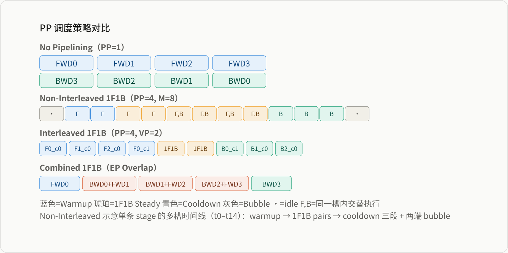
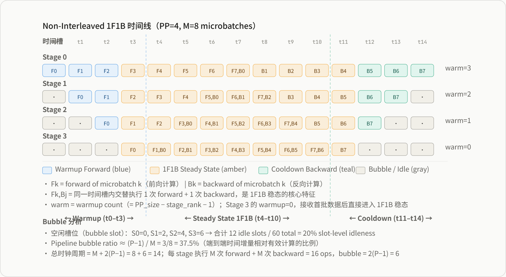
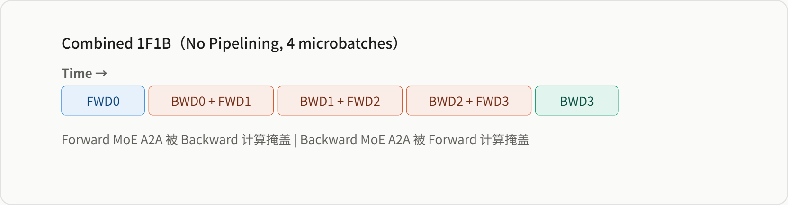
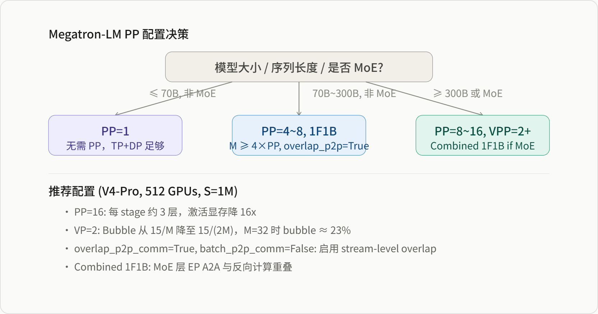

# Megatron-LM Pipeline Parallelism 实现深度解析

*基于 Megatron-LM dev 分支源码 · 1F1B / Interleaved 1F1B / Combined 1F1B · P2P 通信 · VPP · Bubble 分析 · Activation Offload*

> 本报告基于 Megatron-LM dev 分支的源码实现，系统分析 Pipeline Parallelism（PP）机制。涵盖 PP 进程组拓扑、四种调度策略（No-Pipelining / Non-Interleaved 1F1B / Interleaved 1F1B / Combined 1F1B）、P2P 通信原语、Virtual Pipeline Parallelism 层分布、Bubble 公式推导、Combined 1F1B 与 EP 重叠、Activation Checkpointing 与显存优化、以及 Fine-Grained Activation Offload。

**目录**

-   PP 进程组与拓扑结构
-   PP 调度策略总览
-   Non-Interleaved 1F1B：标准流水线
-   Interleaved 1F1B：虚拟流水线
-   P2P 通信机制
-   Combined 1F1B：PP 与 EP 重叠
-   Bubble 分析与通信量
-   Activation Checkpointing 与显存优化
-   Fine-Grained Activation Offload
-   结论与配置建议

## 一 PP 进程组与拓扑结构

### 1.1 进程组创建

PP 进程组在 `parallel_state.py` 的 `initialize_model_parallel` 函数中创建，通过 `decoder_rank_generator.get_ranks('pp')` 生成 PP 组内的 rank 列表：

```
# parallel_state.py:1094-1110
for ranks in decoder_rank_generator.get_ranks('pp'):
    group = create_group(
        ranks,
        timeout=timeout,
        backend=pipeline_model_parallel_comm_backend,
        pg_options=(
            None
            if pipeline_model_parallel_comm_backend == "ucc"
            else get_nccl_options("pp", nccl_comm_cfgs)
        ),
        group_desc="PIPELINE_MODEL_PARALLEL_GROUP",
    )
    assert (
        pipeline_model_parallel_comm_backend == None
        or pipeline_model_parallel_comm_backend == "nccl"
        or pipeline_model_parallel_comm_backend == "ucc"
    )
    if rank in ranks:
        if _PIPELINE_MODEL_PARALLEL_GROUP is None:
            _PIPELINE_MODEL_PARALLEL_GROUP = group
            _PIPELINE_GLOBAL_RANKS = ranks
        elif isinstance(_PIPELINE_GLOBAL_RANKS[0], list):
            _PIPELINE_MODEL_PARALLEL_GROUP.append(group)
            _PIPELINE_GLOBAL_RANKS.append(ranks)
        else:
            _PIPELINE_MODEL_PARALLEL_GROUP = [_PIPELINE_MODEL_PARALLEL_GROUP, group]
            _PIPELINE_GLOBAL_RANKS = [_PIPELINE_GLOBAL_RANKS, ranks]
```

来源：megatron/core/parallel_state.py:1094-1122

PP 进程组支持三种后端：

| 后端 | 说明 | 适用场景 |
| --- | --- | --- |
| `None`（默认） | 使用 PyTorch 默认 NCCL 后端 | 大多数场景 |
| `nccl` | 显式指定 NCCL，启用 NCCL 选项优化 | 需要自定义 NCCL 调参 |
| `ucc` | 使用 UCC（Unified Collective Communication）后端 | 需要设置 `CUDA_DEVICE_MAX_CONNECTIONS > 1` |

> **UCC 后端**：当 `pipeline_model_parallel_comm_backend="ucc"` 时，会设置 UCX/UCC 环境变量（`UCX_RNDV_THRESH=0`、`UCC_CL_BASIC_TLS=^sharp,nccl`），利用 UCC 的通用通信层实现跨平台优化。

### 1.2 Embedding 与 Position Embedding 组

PP 创建时还会额外创建两个辅助进程组：

```
embedding_ranks = get_embedding_ranks(ranks)
group = create_group(
    embedding_ranks, timeout=timeout,
    pg_options=get_nccl_options("embd", nccl_comm_cfgs),
    group_desc="EMBEDDING_GROUP",
)

position_embedding_ranks = get_position_embedding_ranks(ranks)
group = create_group(
    position_embedding_ranks, timeout=timeout,
    pg_options=get_nccl_options("pos_embd", nccl_comm_cfgs),
    group_desc="POSITION_EMBEDDING_GROUP",
)
```

来源：megatron/core/parallel_state.py:1123-1143

这两个组用于在 PP 边界上同步 embedding 和 position embedding 的梯度。当 `defer_embedding_wgrad_compute=True` 时，embedding 的权重梯度计算会被推迟到 pipeline flush 阶段，利用 pipeline bubble 隐藏计算延迟。

### 1.3 PP 与其他并行维度的关系

| 并行维度 | 通信组 | 物理链路 | 与 PP 的交互 |
| --- | --- | --- | --- |
| TP | tp_group | NVLink | TP 在 PP stage 内切分 head；PP 在 stage 边界通信 |
| DP | dp_group | IB / NVLink | 梯度同步在 PP 的 backward flush 后进行 |
| CP | cp_group | NVLink / IB | CP 切分 seq 后，PP 的 P2P 通信数据量降低 CP 倍 |
| EP | ep_group | IB All-to-All | MoE 层 EP A2A 可与 PP 1F1B 重叠（Combined 1F1B） |
| PP | pp_group | NVLink / IB P2P | 层间切分，stage 间 send/recv 激活值 |

## 二 PP 调度策略总览

### 2.1 调度策略选择器

Megatron-LM 的调度入口是 `get_forward_backward_func`，根据 `pp_size` 和 `vp_size` 自动选择调度策略：

```
# schedules.py:147-153
if pp_size > 1:
    if vp_size is not None:
        forward_backward_func = forward_backward_pipelining_with_interleaving
    else:
        forward_backward_func = forward_backward_pipelining_without_interleaving
else:
    forward_backward_func = forward_backward_no_pipelining
```

来源：megatron/core/pipeline_parallel/schedules.py:147-153

| 调度策略 | 触发条件 | 核心特征 | 适用场景 |
| --- | --- | --- | --- |
| `forward_backward_no_pipelining` | `pp_size == 1` | 无流水线，顺序执行 microbatch | 单节点小模型、CUDA Graph 捕获 |
| `forward_backward_pipelining_without_interleaving` | `pp_size > 1, vp_size is None` | 标准 1F1B，每个 stage 一个 model chunk | 通用场景，PP=4~16 |
| `forward_backward_pipelining_with_interleaving` | `pp_size > 1, vp_size is not None` | Interleaved 1F1B，每个 GPU 多个 virtual stages | 大模型，需要减少 bubble |
| `combined_1f1b_schedule` | `overlap_moe_expert_parallel_comm=True` | 前向/反向合并调度，隐藏 EP A2A | MoE 模型（如 V4） |

### 2.2 四种策略的对比



*图 1：四种 PP 调度策略的时间线对比*

## 三 Non-Interleaved 1F1B：标准流水线

### 3.1 三阶段结构

Non-Interleaved 1F1B 将每个迭代分为三个阶段：**Warmup**、**Steady State**、**Cooldown**。

#### Warmup 阶段

Warmup microbatch 数量由当前 stage 在 pipeline 中的位置决定：

```
# schedules.py:2320
num_warmup_microbatches = (
    p2p_communicator.total_stages - p2p_communicator.current_stage - 1
)
num_warmup_microbatches = min(num_warmup_microbatches, num_microbatches)
```

来源：megatron/core/pipeline_parallel/schedules.py:2319-2322

> **Warmup 示例（PP=4）**：
> 
> -   Stage 0（rank 0）：warmup = 4 - 0 - 1 = **3** 个 forward microbatches
> -   Stage 1（rank 1）：warmup = 4 - 1 - 1 = **2** 个 forward microbatches
> -   Stage 2（rank 2）：warmup = 4 - 2 - 1 = **1** 个 forward microbatch
> -   Stage 3（rank 3）：warmup = 4 - 3 - 1 = **0**，直接进入 1F1B

Warmup 阶段每个 microbatch 的执行流程：

1.  `recv_forward`：从上一个 stage 接收输入激活值
2.  `forward_step`：执行当前 stage 的前向计算
3.  `send_forward`：将输出激活值发送给下一个 stage
4.  保存 `input_tensor` 和 `output_tensor` 供后续 backward 使用

#### Steady State 阶段

Steady state 是真正的 1F1B 阶段，每个迭代执行一个 forward 和一个 backward：

```
# schedules.py:2426-2508（核心逻辑）
for i in range(num_microbatches_remaining):
    # Forward
    output_tensor, num_tokens = forward_step(...)
    total_num_tokens += num_tokens

    # Send forward output + receive backward gradient
    output_tensor_grad = p2p_communicator.send_forward_recv_backward(
        output_tensor, send_tensor_shapes, p2p_communicator.is_pp_last_stage
    )

    # Save tensors for backward
    input_tensors.append(input_tensor)
    output_tensors.append(output_tensor)

    # Pop oldest for backward
    input_tensor = input_tensors.pop(0)
    output_tensor = output_tensors.pop(0)

    # Backward
    input_tensor_grad = backward_step(
        input_tensor, output_tensor, output_tensor_grad, config
    )

    # Send backward gradient + receive next forward input
    if last_iteration:
        p2p_communicator.send_backward(input_tensor_grad, ...)
    else:
        input_tensor = p2p_communicator.send_backward_recv_forward(
            input_tensor_grad, recv_tensor_shapes, ...
        )
```

来源：megatron/core/pipeline_parallel/schedules.py:2426-2508

> **1F1B 的核心约束**：在 steady state 中，当前 stage 必须先完成 forward 并发送输出，然后才能从下一个 stage 接收 backward gradient。这形成了一个**生产-消费流水线**——stage i 的 forward 生产激活值，stage i+1 消费后返回梯度。

#### Cooldown 阶段

当所有 microbatches 的 forward 完成后，进入 cooldown 阶段，依次完成剩余的 backward passes。Cooldown 的 microbatch 数量等于 warmup 阶段保存的 tensor 对数。

### 3.2 完整时间线（PP=4, M=8）



*图 2：Non-Interleaved 1F1B 完整时间线（PP=4, M=8）*

### 3.3 Grad Sync 与 Pipeline Bubble 的利用

在 1F1B 的 steady state 中，梯度同步（DP AllReduce）默认被禁用（通过 `no_sync_func`），直到最后一个 microbatch 的 backward 完成后才启用。但代码中有特殊处理：

```
# schedules.py:2501-2508
# Note: If grad sync function is provided, only enable
# async grad reduction in first pipeline stage. Other
# pipeline stages do grad reduction during pipeline bubble.
if grad_sync_func is not None:
    enable_grad_sync()
```

来源：megatron/core/pipeline_parallel/schedules.py:2501-2508

> **关键洞察**：非首 stage 的 GPU 在 pipeline bubble（cooldown 阶段）期间执行梯度 AllReduce，将通信开销隐藏在 idle time 中。首 stage 由于最早进入 cooldown，梯度同步在 flush 时完成。

## 四 Interleaved 1F1B：虚拟流水线

### 4.1 Virtual Pipeline Parallelism 概念

Virtual Pipeline Parallelism（VPP）将模型切分为更多的 virtual stages，每个物理 GPU 持有多个不连续的 model chunks。例如 PP=4, VP=2, 16 layers：

| 物理 GPU | VPP Stage 0 | VPP Stage 1 |
| --- | --- | --- |
| GPU 0 | layers 1-2 | layers 9-10 |
| GPU 1 | layers 3-4 | layers 11-12 |
| GPU 2 | layers 5-6 | layers 13-14 |
| GPU 3 | layers 7-8 | layers 15-16 |

这种交错放置使得 pipeline bubble 可以被打得更碎，因为每个 physical stage 内部有多个独立的 forward/backward 流可以交替执行。

### 4.2 Schedule Table 与 Microbatch 分组

VPP 使用 `schedule_table` 将 virtual microbatch ID 映射到 `(microbatch_id, model_chunk_id)`：

```
# schedules.py:847-874
def get_schedule_table(num_microbatches, num_model_chunks, microbatch_group_size_per_vp_stage):
    schedule_table = []
    for min_microbatch_id_in_group in range(
        0, num_microbatches, microbatch_group_size_per_vp_stage
    ):
        if min_microbatch_id_in_group + microbatch_group_size_per_vp_stage >= num_microbatches:
            # Last group
            schedule_table.extend([
                (microbatch_id, model_chunk_id)
                for model_chunk_id in range(num_model_chunks)
                for microbatch_id in range(min_microbatch_id_in_group, num_microbatches)
            ])
        else:
            schedule_table.extend([
                (microbatch_id, model_chunk_id)
                for model_chunk_id in range(num_model_chunks)
                for microbatch_id in range(
                    min_microbatch_id_in_group,
                    min_microbatch_id_in_group + microbatch_group_size_per_vp_stage,
                )
            ])
    return schedule_table
```

来源：megatron/core/pipeline_parallel/schedules.py:847-874

> **Schedule Table 示例**（PP=2, VP=2, M=5, group_size=3）：
> 
> ```
> virtual_microbatch_id | 0  1  2  3  4  5  6  7  8  9
> microbatch_id         | 0  1  2  0  1  2  3  4  3  4
> model_chunk_id        | 0  0  0  1  1  1  0  0  1  1
> ```
> 
> 这意味着先执行 chunk 0 的 microbatch 0-2，再执行 chunk 1 的 microbatch 0-2，然后 chunk 0 的 3-4，最后 chunk 1 的 3-4。这种**深度优先**策略减少了 chunk 切换开销。

### 4.3 Warmup Microbatch 计算

VPP 的 warmup 公式比非交错版本更复杂：

```
# schedules.py:816-828
num_warmup_microbatches = (pipeline_parallel_size - pipeline_parallel_rank - 1) * 2
num_warmup_microbatches += (num_model_chunks - 1) * microbatch_group_size_per_vp_stage
if overlap_moe_expert_parallel_comm:
    num_warmup_microbatches = num_warmup_microbatches + 1
```

来源：megatron/core/pipeline_parallel/schedules.py:816-828

> **VPP Warmup 公式**：  
> W = (P - rank - 1) × 2 + (C - 1) × G + δ  
> 其中 P = PP size, C = num_model_chunks (VP size), G = microbatch_group_size_per_vp_stage, δ = 1（if EP overlap else 0）  
>   
> **示例**（PP=4, rank=0, VP=2, G=3）:  
> W = (4 - 0 - 1) × 2 + (2 - 1) × 3 = 6 + 3 = **9** 个 virtual microbatches

### 4.4 Dependency Bubble 校验

VPP 有一个关键的校验条件：最后一个 microbatch group 的大小必须不小于 PP size，否则会引入 dependency bubble：

```
# schedules.py:1170-1180
final_microbatch_group_size = num_microbatches % config.microbatch_group_size_per_vp_stage
if 0 < final_microbatch_group_size < pipeline_parallel_size:
    raise RuntimeError(
        'The remainder of M (the total micro-batches) divided by N '
        '(the microbatch group size per VP stage) introduces dependency '
        'bubbles in the pipeline and reduces throughput.'
    )
```

来源：megatron/core/pipeline_parallel/schedules.py:1170-1180

> **Dependency Bubble 含义**：如果最后一个 group 的 microbatch 数量少于 PP size，某些 stage 会在 forward 完成后没有对应的 backward 可以执行（因为后面的 stage 还在处理前面的 microbatch），导致额外的空闲时间。这不同于标准的 pipeline bubble，它是 VPP 特有的调度约束。

## 五 P2P 通信机制

### 5.1 通信原语

Megatron-LM 提供两种 P2P 通信原语：

| 原语 | 实现 | 适用场景 |
| --- | --- | --- |
| `_p2p_ops` | 独立的 `isend/irecv`，支持交替 group 策略 | `batch_p2p_comm=False`，需要 overlap |
| `_batched_p2p_ops` | `torch.distributed.batch_isend_irecv` | `batch_p2p_comm=True`（默认） |

```
# p2p_communication.py:55-80
def _p2p_ops(...):
    even_send_odd_recv_group = group
    if group.size() == 2 and torch.distributed.get_backend(group) != 'ucc':
        # Use global process group for one of two p2p communications
        # to allow overlap of independent communications
        even_recv_odd_send_group = torch.distributed.group.WORLD
    else:
        even_recv_odd_send_group = group

    if group.rank() % 2 == 0:
        if tensor_send_next is not None:
            reqs['send_next'] = dist.isend(tensor_send_next, next_pipeline_rank, even_send_odd_recv_group)
        if tensor_recv_prev is not None:
            reqs['recv_prev'] = dist.irecv(tensor_recv_prev, prev_pipeline_rank, even_recv_odd_send_group)
    else:
        if tensor_recv_prev is not None:
            reqs['recv_prev'] = dist.irecv(tensor_recv_prev, prev_pipeline_rank, even_recv_odd_send_group)
        if tensor_send_next is not None:
            reqs['send_next'] = dist.isend(tensor_send_next, next_pipeline_rank, even_send_odd_recv_group)
```

来源：megatron/core/pipeline_parallel/p2p_communication.py:55-80

> **交替 Group 策略**：当 PP=2 且不使用 UCC 后端时，偶数 rank 在 `pp_group` 上发送、在 `WORLD` group 上接收；奇数 rank 相反。这使得 send 和 recv 可以使用不同的 NCCL communicator，从而实现双向通信的**真正并行**（避免 NCCL 内部串行化）。

### 5.2 P2PCommunicator 类

`P2PCommunicator` 封装了所有 stage 间通信操作：

| 方法 | 方向 | 通信内容 | 边界处理 |
| --- | --- | --- | --- |
| `recv_forward` | prev → current | 输入激活值 `[S, B, H]` | 首 stage 返回 None |
| `recv_backward` | next → current | 输出梯度 `[S, B, H]` | 末 stage 返回 None |
| `send_forward` | current → next | 输出激活值 `[S, B, H]` | 末 stage 跳过 |
| `send_backward` | current → prev | 输入梯度 `[S, B, H]` | 首 stage 跳过 |
| `send_forward_recv_backward` | 双向 | 发激活 + 收梯度 | steady state 核心 |
| `send_backward_recv_forward` | 双向 | 发梯度 + 收激活 | steady state 核心 |
| `send_forward_recv_forward` | 双向 | 发激活 + 收激活 | warmup/cooldown |
| `send_backward_recv_backward` | 双向 | 发梯度 + 收梯度 | cooldown |
| `send_forward_backward_recv_forward_backward` | 四向 | 同时收发激活和梯度 | overlap 优化 |

### 5.3 Tensor Shape 与动态序列长度

P2P 通信的 tensor shape 由 `get_tensor_shapes` 计算：

```
# schedules.py:2123-2182
def get_tensor_shapes(
    *, seq_length, micro_batch_size, decoder_seq_length,
    config, tp_group=None, cp_group=None, pp_group=None, is_recv=True
):
    if config.variable_seq_lengths:
        return [()]  # 动态形状，运行时交换

    effective_seq_length = seq_length
    if cp_group is not None:
        effective_seq_length //= cp_group.size()
    if config.sequence_parallel and tp_group is not None:
        effective_seq_length //= tp_group.size()

    tensor_shape = [effective_seq_length, micro_batch_size, config.hidden_size]

    # Hyper connections: intermediate stages use hidden_size * num_residual_streams
    if config.enable_hyper_connections and pp_group is not None:
        ...

    return [tensor_shape]
```

来源：megatron/core/pipeline_parallel/schedules.py:2123-2182

> **Hyper Connections 的影响**：当 `enable_hyper_connections=True` 时，中间 stage 的 P2P tensor shape 变为 `[S, B, hidden_size * num_residual_streams]`，因为 hyper connection 模块会扩展残差流的数量。这增加了 stage 间通信量，但只在中间 stage 生效（首/末 stage 保持标准 hidden_size）。

### 5.4 Variable Sequence Length 支持

当 `config.variable_seq_lengths=True` 时，每个 microbatch 的序列长度可能不同。此时 P2P 通信分为两个阶段：

1.  **Shape 交换**：先发送/接收 3 元素 int64 tensor（形状元数据）
2.  **Tensor 交换**：根据接收到的形状分配 buffer，再发送/接收实际数据

```
# p2p_communication.py:186-259
def _communicate_shapes(self, tensor_send_next, tensor_send_prev, recv_prev, recv_next):
    recv_prev_shape_tensor = torch.empty((3,), device="cuda", dtype=torch.int64)
    recv_next_shape_tensor = torch.empty((3,), device="cuda", dtype=torch.int64)
    send_prev_shape_tensor = torch.tensor(tensor_send_prev.size(), device="cuda", dtype=torch.int64)
    send_next_shape_tensor = torch.tensor(tensor_send_next.size(), device="cuda", dtype=torch.int64)
    # batch_isend_irecv for shape tensors
    ...
```

来源：megatron/core/pipeline_parallel/p2p_communication.py:186-259

## 六 Combined 1F1B：PP 与 EP 重叠

### 6.1 设计动机

在 MoE 模型（如 DeepSeek-V4）中，Expert Parallelism（EP）的 All-to-All 通信量巨大。Combined 1F1B 通过**将 forward 和 backward 的层计算交错调度**，使得 EP A2A 通信可以被相反方向的计算隐藏：

> **核心思想**：Forward 路径中 MoE 层的 EP dispatch A2A 可以被 Backward 路径中 Attention/MLP 的计算掩盖；反之，Backward 中 MoE 层的 EP combine A2A 可以被 Forward 的计算掩盖。

### 6.2 No-Pipelining Combined Schedule

对于 PP=1 的情况，Combined 1F1B 的调度如下：

```
# combined_1f1b.py:48-54
# Phases 0: 1st microbatch forward
# Phases 1: 1st microbatch backward + 2nd microbatch forward
# Phases 2: 2nd microbatch backward + 3rd microbatch forward
# Phases 3: 3rd microbatch backward + 4th microbatch forward
# Phases 4: 4th microbatch backward
```

来源：megatron/core/pipeline_parallel/combined_1f1b.py:48-54



*图 3：Combined 1F1B 时间线（No Pipelining）*

### 6.3 Interleaved Combined Schedule

对于 PP > 1 且 VP > 1 的情况，Combined 1F1B 将 `forward_step_helper` 和 `backward_step_helper` 合并为统一的 `combined_forward_backward_step`：

```
# combined_1f1b.py:446-456
with context_manager and outer_fp8_context:
    output_tensor = type(f_schedule_plan or b_schedule_plan).run(
        f_schedule_plan,
        b_schedule_plan,
        b_grad=b_grad,
        pre_forward=pre_forward,
        pre_backward=pre_backward,
        post_forward=post_forward,
        post_backward=post_backward,
    )
```

来源：megatron/core/pipeline_parallel/combined_1f1b.py:446-456

> **SchedulePlan 机制**：
> 
> 1.  Forward 路径调用 `forward_step_func(return_schedule_plan=True)` 返回 `AbstractSchedulePlan`，而不是立即执行
> 2.  Backward 路径从 `b_output_tensor[0].schedule_plan` 获取之前存储的 plan
> 3.  `SchedulePlan.run()` 按层交错执行 forward 和 backward 计算
> 4.  在 MoE 层的 A2A 通信期间，执行另一方向的非 MoE 层计算
> 
> 这种**计划-执行分离**的设计使得调度器可以在 layer 粒度上精确控制计算和通信的交错。

### 6.4 FSDP 与 FP8 支持

Combined 1F1B 对 FSDP 和 FP8 有特殊处理：

```
# combined_1f1b.py:338-403
if fsdp_wrapper is not None:
    fsdp_wrapper._replace_param_with_raw_if_needed()
    # Wires explicit FSDP reshard hooks per layer
    ...

# FP8 handling
use_outer_fp8_context = config.fp8 and config.fp8_recipe == Fp8Recipe.delayed
outer_fp8_context = get_fp8_context(config) if use_outer_fp8_context else nullcontext()
```

来源：megatron/core/pipeline_parallel/combined_1f1b.py:338-403, 441-442

> **限制**：Interleaved Combined Schedule 不支持 FSDP（`combined_1f1b.py:197-203`）。因为 FSDP 的参数换入换出与 VPP 的多 model chunk 切换冲突，实现复杂度极高。

## 七 Bubble 分析与通信量

### 7.1 Bubble 定义与公式

Pipeline bubble 是指 GPU 处于 idle 状态等待数据到达的时间。对于 1F1B 调度：

> **Non-Interleaved 1F1B Bubble**：  
> Bubble_ratio = (P - 1) / M  
> 其中 P = pipeline_parallel_size, M = num_microbatches  
>   
> **示例**：PP=4, M=8 → Bubble = 3/8 = **37.5%**  
> PP=4, M=32 → Bubble = 3/32 = **9.4%**  
>   
> **Interleaved 1F1B Bubble**：  
> Bubble_ratio ≈ (P - 1) / (M × C)  
> 其中 C = virtual_pipeline_model_parallel_size  
>   
> **示例**：PP=4, VP=2, M=8 → Bubble = 3/(8×2) = **18.75%**

> **Bubble 与 Microbatch 数量的关系**：增加 microbatch 数量 M 是减少 bubble 的最有效手段。但 M 受显存限制——每个 stage 需要保存 M 个 input/output tensor 对。在显存允许的情况下，M ≥ 4×P 是工程上的经验法则。

### 7.2 P2P 通信量分析

每个 microbatch 在 stage 间的通信量：

> **单 microbatch P2P 通信量（per stage boundary）**：  
> Forward: S × B × H × sizeof(dtype)  
> Backward: S × B × H × sizeof(dtype)  
> **Total per boundary per iteration**: 2 × S × B × H × sizeof(dtype)  
>   
> **全 Pipeline 总通信量（per layer group per iteration）**：  
> \= (P - 1) × 2 × S × B × H × sizeof(dtype) × M  
>   
> **考虑 CP 和 SP**：  
> S_effective = S / (CP_size × SP_size)  
> Total = (P - 1) × 2 × S_effective × B × H × sizeof(dtype) × M

### 7.3 与 EP 通信的竞争

在 MoE 层，PP 的 P2P 通信与 EP 的 All-to-All 通信可能在同一时间发生：

| 场景 | PP 通信 | EP 通信 | 竞争分析 |
| --- | --- | --- | --- |
| 标准 1F1B | P2P send/recv 激活值 | A2A dispatch/combine | 竞争 NVLink/IB 带宽 |
| Combined 1F1B | P2P 与计算交错 | A2A 被反向计算掩盖 | 理想情况下无竞争 |
| 首/末 stage | 单向 P2P | 全量 A2A | 首 stage 无 backward P2P，可专注 EP |

> **缓解策略**：
> 
> -   PP P2P 使用独立 CUDA stream（通过 `overlap_p2p_comm`），与 EP A2A 的 stream 分离
> -   Combined 1F1B 通过 layer 级交错，使 EP A2A 发生在计算密集阶段
> -   对于非 MoE 层（如 Attention-only 层），PP P2P 是唯一的跨 rank 通信

## 八 Activation Checkpointing 与显存优化

### 8.1 Partial Activation Checkpointing

Megatron-LM 支持在 pipeline 的特定 microbatch 上启用部分层的 activation checkpointing：

```
# schedules.py:2324-2334
if config.num_microbatches_with_partial_activation_checkpoints is not None:
    max_outstanding_backprops = num_warmup_microbatches + 1

# 在 forward step 中决定是否 checkpoint
checkpoint_activations_microbatch = (
    i % max_outstanding_backprops
    >= config.num_microbatches_with_partial_activation_checkpoints
)
```

来源：megatron/core/pipeline_parallel/schedules.py:2324-2334, 2383-2387

> **原理**：在 warmup 阶段，outstanding backpropagation 的数量逐渐增加（最多 `num_warmup + 1`）。前 `num_microbatches_with_partial_activation_checkpoints` 个 microbatch 在 window 内不 checkpoint 所有层（或跳过 checkpointing），以减少 recompute 开销；window 外的 microbatch 则 full checkpointing。这种**自适应窗口策略**平衡了显存和计算。

### 8.2 Deallocate Pipeline Outputs

当 `config.deallocate_pipeline_outputs=True` 时，output tensor 在 send 后立即释放：

```
# schedules.py:2415
deallocate_output_tensor(output_tensor, config.deallocate_pipeline_outputs)

# schedules.py:159-165
def deallocate_output_tensor(out, deallocate_pipeline_outputs=False):
    if deallocate_pipeline_outputs:
        out.data = torch.empty(
            (1,), device=out.device, dtype=out.dtype,
        )
```

来源：megatron/core/pipeline_parallel/schedules.py:2415, 159-165

> **效果**：将 output tensor 的数据替换为 1-element 空 tensor，立即释放显存。但这要求 backward 中通过 `custom_backward`（C++ autograd 引擎）而不是 `torch.autograd.backward` 来执行，因为 Python 端的 backward 需要保留 output tensor 的引用。

### 8.3 Defer Embedding WGrad

当 `config.defer_embedding_wgrad_compute=True` 时，embedding 层的权重梯度计算被推迟到 pipeline flush 阶段：

```
# schedules.py:772-784
def drain_embedding_wgrad_compute(config, embedding_activation_buffer, grad_output_buffer, weight, tp_group):
    if config.defer_embedding_wgrad_compute:
        # Execute deferred wgrad GEMMs during pipeline flush
        ...
```

来源：megatron/core/pipeline_parallel/schedules.py:772-784

> **动机**：Embedding WGrad 是大型 GEMM（vocab_size × hidden_size，通常 vocab_size = 128K），计算耗时但不需要立即完成。将其推迟到 pipeline bubble（cooldown/flush）期间执行，可以隐藏这部分计算延迟。

## 九 Fine-Grained Activation Offload

### 9.1 PipelineOffloadManager 架构

`PipelineOffloadManager` 是一个单例管理器，负责在 pipeline 执行过程中将激活值异步卸载到 CPU pinned memory：

```
# fine_grained_activation_offload.py:384-795
class PipelineOffloadManager:
    def __init__(self):
        self._d2h_stream = torch.cuda.Stream()  # GPU→CPU
        self._h2d_stream = torch.cuda.Stream()  # CPU→GPU
        self._cpu_tensor_pool = OffloadTensorPool()  # 复用 pinned CPU buffer
        self._is_warmup = True
        self._offload_margin = 0  # 保留在 GPU 上的 group 数
```

来源：megatron/core/pipeline_parallel/fine_grained_activation_offload.py:384-420

### 9.2 工作机制

Fine-Grained Activation Offload 通过 `saved_tensors_hooks` 拦截 autograd 的 save/retrieve 操作：

1.  **Forward 阶段**：`on_save_for_backward(tensor)` 将 tensor 推入当前 forward chunk；当 layer group 完成时，`bulk_offload_group` 在 `_d2h_stream` 上执行异步 D2H 拷贝
2.  **Backward 阶段**：`on_get_saved_tensor(saved_state)` 从当前 backward chunk 弹出 tensor；如果已被 offload，`bulk_reload_group` 在 `_h2d_stream` 上执行异步 H2D 拷贝

```
# fine_grained_activation_offload.py:916-1011
def tensor_push(self, tensor):
    tag = self._next_tag
    self._current_group.append((tag, tensor))
    return tag

def tensor_pop(self, tensor_tag):
    _, saved = self._groups[tensor_tag].pop(0)
    if isinstance(saved, tuple):  # offloaded
        return self.reload(saved)
    return saved

def bulk_offload_group(self, group_to_offload):
    for tag, tensor in group_to_offload:
        cpu_tensor = self._cpu_tensor_pool.allocate(tensor.shape, tensor.dtype)
        cpu_tensor.copy_(tensor, non_blocking=True)
        ...

def bulk_reload_group(self):
    for tag, (cpu_tensor, event) in self._pending_reload.items():
        gpu_tensor = torch.empty_like(cpu_tensor, device="cuda")
        gpu_tensor.copy_(cpu_tensor, non_blocking=True)
        ...
```

来源：megatron/core/pipeline_parallel/fine_grained_activation_offload.py:916-1011

### 9.3 Warmup 后的自适应调优

在第一个 iteration（warmup）完成后，`post_warmup_callback` 根据实际观测到的 tensor 大小和 group 分布，计算最优的 offload 策略：

```
# fine_grained_activation_offload.py:543-624
def post_warmup_callback(self):
    self._is_warmup = False
    # 计算 _offload_margin：保留在 GPU 上的 group 数，避免 reload 阻塞 compute stream
    self._offload_margin = max_deduplicated_groups
    # 平衡各 PP rank 的 offload bytes
    keep_on_gpu_bytes = total_bytes * activation_offload_fraction
    # 禁用最后几个同名 group 的 offloading（防止 reload 阻塞）
```

来源：megatron/core/pipeline_parallel/fine_grained_activation_offload.py:543-624

> **关键参数**：
> 
> -   `_offload_margin`：保留在 GPU 上的 group 数量，确保 backward 立即可用最近几个 group 的激活值，无需等待 H2D
> -   `activation_offload_fraction`：控制 offload 的比例，0 = 全 offload，1 = 全保留
> -   `max_inflight_offloads`：限制每组同时进行的 D2H 拷贝数量，避免压垮 PCIe/NVLink

## 十 结论与配置建议

### 10.1 PP 核心特征总结

> **特征 1：1F1B 是默认且最优的 PP 调度** — Non-Interleaved 1F1B 通过 warmup-steady-cooldown 三阶段结构，在显存和 bubble 之间取得了最佳平衡。VPP 进一步将 bubble 降低 VP 倍，但增加了调度复杂度。

> **特征 2：P2P 通信支持丰富的 overlap 策略** — `overlap_p2p_comm`、`batch_p2p_comm`、`batch_p2p_sync`、交替 group 策略等，使得 PP 的通信开销可以被计算有效隐藏。PP=2 时的 WORLD group 交替策略是一个精妙的工程细节。

> **特征 3：Combined 1F1B 专为 MoE 优化** — 通过 layer 级前向/反向交错，将 EP A2A 通信隐藏在相反方向的计算中。这是 DeepSeek-V4 等 MoE 大模型训练的关键优化。

> **特征 4：显存优化手段丰富** — Partial activation checkpointing、deallocate pipeline outputs、defer embedding wgrad、fine-grained activation offload 四层手段叠加，使得 PP=16 时仍可训练超大规模模型。

### 10.2 配置决策树



*图 4：Megatron-LM PP 配置决策树*

### 10.3 PP 关键配置速查表

| 配置项 | 推荐值 | 说明 |
| --- | --- | --- |
| `pipeline_model_parallel_size` | 4~16 | 根据模型层数和显存确定 |
| `virtual_pipeline_model_parallel_size` | 2~4 | 大模型用 VP 减少 bubble |
| `num_microbatches` | ≥ 4 × PP | 保证 bubble < 25% |
| `microbatch_group_size_per_vp_stage` | 默认 = PP size | 深度优先策略 |
| `overlap_p2p_comm` | True | 启用 P2P 与计算 overlap |
| `batch_p2p_comm` | False（if overlap） | overlap 要求 batch_p2p=False |
| `deallocate_pipeline_outputs` | True | 释放 output 显存 |
| `pipeline_dtype` | 与模型一致 | PP > 1 时必填 |
| `overlap_moe_expert_parallel_comm` | True（MoE） | 启用 Combined 1F1B |
| `fine_grained_activation_offloading` | True（超大规模） | 异步 offload 激活值到 CPU |

### 10.4 一句话总结

> **总结**：Megatron-LM 的 Pipeline Parallelism 通过 1F1B 调度、Virtual Pipeline Parallelism、P2P 通信 overlap、Combined 1F1B 与 EP 重叠、以及多层显存优化手段，实现了在大规模集群上高效训练百亿到千亿参数模型的能力。核心设计哲学是"用调度隐藏通信"——通过精细的 microbatch 编排和 layer 级计算交错，将 pipeline bubble 和通信开销压缩到总时间的 20% 以内。对于 DeepSeek-V4 这样的 MoE 大模型，Combined 1F1B 配合 VP=2、PP=16 是推荐配置，可将 EP A2A 通信完全隐藏在反向计算中。
