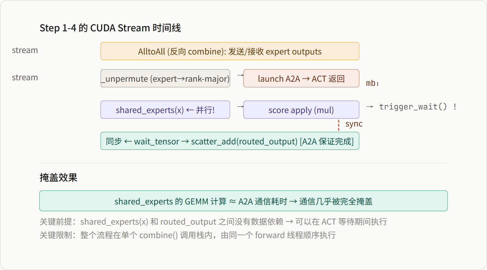
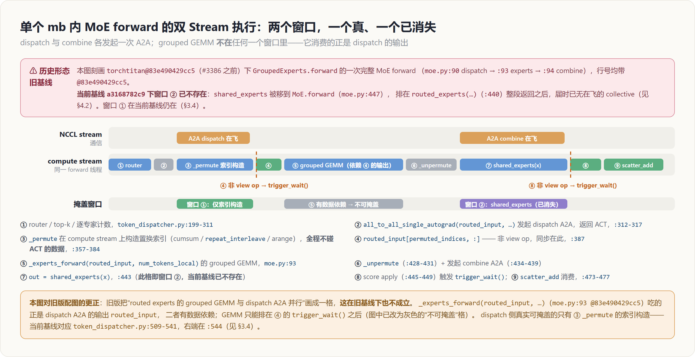
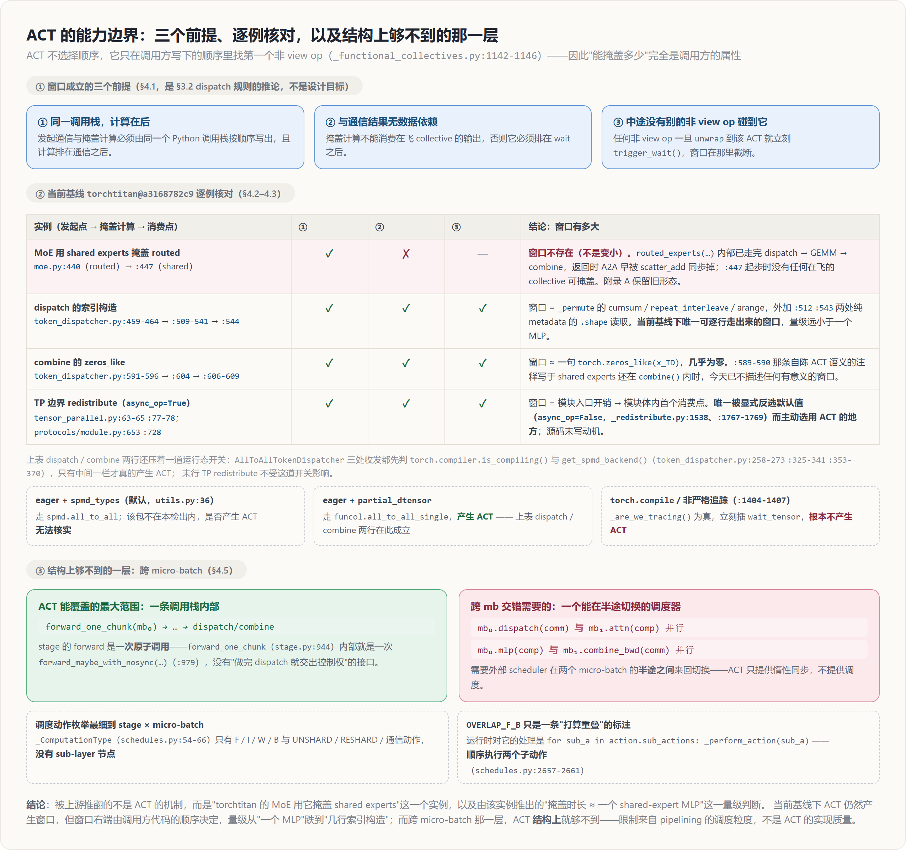
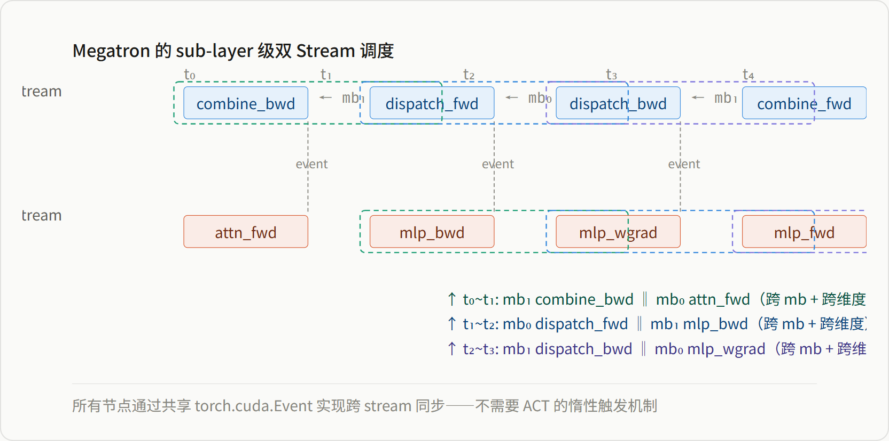

# AsyncCollectiveTensor 机制深度解析

*源码追踪 · CUDA Stream 级执行过程 · 能做什么/不能做什么*

> 以 torchtitan 的 `AllToAllTokenDispatcher.combine()` 为具体例子，逐行追踪从 Python 到 CUDA stream 的完整执行链路，解释 AsyncCollectiveTensor 为什么能在同一个 forward 内部实现通信掩盖，却无法在不同 micro-batch 间实现 Megatron combined_1f1b 那样的 sub-layer 级交错掩盖。

**目录**

-   代码走读：combine() 的完整执行链路
-   AsyncCollectiveTensor 的三层机制
-   Stream 视角：同一 mb 内的掩盖是如何发生的
-   边界：为什么 ACT 无法跨 micro-batch
-   对比：Megatron 如何绕过 ACT 的限制

## 一 代码走读：combine() 的完整执行链路

以 torchtitan 的 `AllToAllTokenDispatcher.combine()`（`token_dispatcher.py:399-478`）为例，逐行追踪。

### Step 1：发起反向 All-to-All 通信

```
# token_dispatcher.py L432-438
# 1) 反向 permute：expert-major → rank-major
routed_output = self._unpermute(
    routed_output, metadata.input_shape, metadata.permuted_indices
)

# 2) 发起反向 All-to-All 通信
routed_output = all_to_all_single_autograd(
    routed_output,
    metadata.input_splits,   # 发送给每个 rank 的 token 数
    metadata.output_splits,  # 从每个 rank 接收的 token 数
    self.ep_mesh,            # 包含 NCCL ProcessGroup
)

# 3) ← 此时 routed_output 已经是 AsyncCollectiveTensor！
#    A2A 已在 NCCL stream 上启动，但 compute stream 不等待
```

`all_to_all_single_autograd()` 内部发生了以下事情：

```
# _functional_collectives.py L554-560
def all_to_all_single_autograd(self, output_split_sizes, input_split_sizes, group, tag=""):
    # ① 调用底层 NCCL collective kernel
    tensor = torch.ops._c10d_functional_autograd.all_to_all_single(
        self, output_split_sizes, input_split_sizes, _group_or_group_name(group),
    )
    #    ↑ 这里会在 NCCL stream 上启动 AlltoAll，立即返回一个 raw tensor
    #      实际数据还没到位——通信正在 NCCL stream 上异步进行

    # ② 包装为 AsyncCollectiveTensor
    return _FromTorchTensor.apply(tensor)
    #    ↓ 调用 _maybe_wrap_tensor → _wrap_tensor_autograd → AsyncCollectiveTensor(tensor)
```

### Step 2：在通信进行的同时执行 Shared Expert 计算

```
# token_dispatcher.py L443
# routed_output 是 ACT，只是一个"占位符"，数据还没到
# 但 shared_experts(x) 不需要 routed_output 的数据！
# 所以它可以立即在 compute stream 上开始执行
out = shared_experts(x) if shared_experts is not None else torch.zeros_like(x)
```

### Step 3：访问 ACT 时触发隐式同步

```
# token_dispatcher.py L448-449 (scoring + scatter_add)
if not self.score_before_experts:
    routed_output = (routed_output.to(torch.float32)    # ← .to() 是 non-view op
        * metadata.top_scores_experts_sorted.reshape(-1, 1)  # ← mul 是 non-view op
    ).to(routed_output.dtype)

# L473-477
out = deterministic_scatter_add(
    out,
    token_indices_experts_sorted.reshape(-1, 1).expand(-1, x.shape[-1]),
    routed_output,  # ← scatter_add 是 non-view op → 触发 trigger_wait()！
)
```

### Step 4：trigger_wait() 的完整路径

```
# AsyncCollectiveTensor.__torch_dispatch__ (L1066-1102)
# 当 scatter_add 访问 routed_output 时触发：
#   1. _is_view_op(scatter_add) → False（scatter_add 会修改数据）
#   2. unwrap(routed_output) → routed_output.trigger_wait()
#      → wait_tensor(self.elem)
#      → torch.ops._c10d_functional.wait_tensor(tensor)
#      → 在 CUDA 上：插入 NCCL stream → compute stream 的同步点

# 核心：wait_tensor 在 compute stream 上插入一个 NCCL stream 的 wait
# NCCL stream:   [========= A2A 通信 =========]
#                                          ↓ event
# Compute stream:[sfc1→...→scatter_add] → [wait] → [继续 scatter_add]
#                                          ↑ 此时 A2A 保证已完成
```



*图 1：combine() 的双 Stream 时间线——ACT 实现的同一 mb 内掩盖*

## 二 AsyncCollectiveTensor 的三层机制

### 2.1 Layer 1：Tensor Subclass —— 身份伪装

```
class AsyncCollectiveTensor(torch.Tensor):
    elem: torch.Tensor       # 底层的 raw tensor（通信结果，可能还没就绪）
    completed: bool           # 是否已经 wait 过

    def __new__(cls, elem):
        # 创建一个 metadata 完全相同但数据指向 elem 的"影子 tensor"
        r = torch.Tensor._make_wrapper_subclass(
            cls,
            elem.size(), strides=elem.stride(),
            dtype=elem.dtype, device=elem.device, ...
        )
        r.elem = elem          # 保存对 raw tensor 的引用
        r.completed = False    # 标记为"尚未同步"
        return r
```

ACT 本质上是一个 **metadata 替身**。对 Python 来说它长得像一个正常 tensor（有 shape、dtype、device），但数据还没到——真正的 tensor 数据正在 NCCL stream 上传输。

### 2.2 Layer 2：__torch_dispatch__ —— 拦截所有 tensor 操作

```
@classmethod
def __torch_dispatch__(cls, func, types, args=(), kwargs=None):
    is_view_op = _is_view_op(func)

    def unwrap(e):
        if not is_view_op:
            return e.trigger_wait()   # 非 view 操作 → 同步!
        return e.elem                  # view 操作 → 直接用 raw tensor，不等待

    # 递归展开所有 ACT 参数
    unwrapped_args = tree_map_only(AsyncCollectiveTensor, unwrap, args)

    # 执行真正的 op
    out = func(*unwrapped_args, **unwrapped_kwargs)

    # view 操作 → 重新包装输出，继续推迟同步
    if is_view_op:
        out = tree_map_only(torch.Tensor, wrap, out)

    return out
```

> **_is_view_op 的判断逻辑**：检查 op schema 的第一个参数的 alias_info——如果是非写入的别名操作（只看不改），就是 view。也就是说：reshape、transpose、view、slice → view op（不触发 sync）；add、mul、matmul、scatter_add → 非 view op（触发 sync）。

### 2.3 Layer 3：wait_tensor —— CUDA Stream 同步

```
def wait_tensor(tensor):
    """Waiting follows device semantics, which means blocking on CPU
       and synchronizing streams on CUDA."""
    return torch.ops._c10d_functional.wait_tensor(tensor)
    # 底层 C++ 实现：
    #   1. 找到 tensor 关联的 NCCL Work 对象（通过全局 ptr→Work 映射表）
    #   2. Work.wait()  → 在 compute stream 上插入 NCCL stream 的同步
    #   3. 流同步完成 → tensor 的数据可用
```

## 三 Stream 视角：同一 mb 内的掩盖是如何发生的

用一个具体的 micro-batch 来展示整个过程。假设 EP=4，一个 micro-batch mb₀ 的 MoE layer 进入 `grouped_expert.forward()`：



*图 2：单个 mb 内 MoE forward 的完整双 Stream 执行过程*

## 四 边界：为什么 ACT 无法跨 micro-batch

### 4.1 ACT 掩盖的前提条件

> ACT 掩盖需要同时满足三个条件：  
> ① **通信发起** 和 **掩盖计算** 在 **同一个 forward 调用栈** 内  
> ② 掩盖计算与通信结果 **没有数据依赖**（如 shared_expert 不依赖 routed_expert 的输出）  
> ③ 掩盖计算在 **通信发起之后、结果消费之前** 执行

### 4.2 跨 micro-batch 需要什么？

假设你想做 Megatron 式的编排——mb₀ 的 dispatch 和 mb₁ 的 attention 并行：

```
# 理想中的跨 mb 编排（torchtitan 做不到）：
#   时刻 T₁: launch mb₀.moe_dispatch → 返回 ACT(dispatch_output_of_mb0)
#   时刻 T₂: 不等待 ACT，切换到 mb₁
#   时刻 T₂: 执行 mb₁.attn_forward        ← 这是另一个 micro-batch 的操作！
#   时刻 T₃: 等 ACT 完成（mb₀ 的 dispatch 完成了）
#   时刻 T₃: 继续 mb₀.mlp_forward(ACT 的结果)
```

这需要 `_step_microbatches()` 能够：

1.  在一个 micro-batch 的 forward **半途中**暂停（dispatch 完成，mlp 还没做）
2.  切换到另一个 micro-batch 的某个操作（attn_backward）
3.  再切回来继续

但 PyTorch 的 `_PipelineStageBase` 只提供一个原子接口：



*图 3：ACT 的能力边界*

> **根本原因**：ACT 是一个**惰性同步**机制——它让"发起通信"和"等待通信完成"之间可以被其他计算填充。但这个填充的计算必须在**同一个调用栈**内、在等待点之前。跨 micro-batch 需要的是**调度机制**——一个外部控制器能在不同 micro-batch 的不同 sub-stage 之间来回切换，这是 ZBV/DualPipe/_step_microbatches 做不到的，因为它们的最小调度单元是 stage 级的 F/I/W。

## 五 对比：Megatron 如何绕过 ACT 的限制

Megatron 不用 ACT。它直接管理 CUDA stream 和 event，以 **sub-layer 节点**为调度单元：



*图 4：Megatron 的跨 mb + sub-layer 双 stream 调度*

Megatron 和 torchtitan 的差异，本质上是**调度粒度**的差异：

|  | torchtitan (ACT) | Megatron (手动 Stream) |
| --- | --- | --- |
| 最小调度单元 | `forward_one_chunk(stage, mb)` | `ScheduleNode(layer, sub_op, mb)` |
| Stream 管理 | NCCL stream + compute stream（系统默认） | 显式 comp_stream + comm_stream + event |
| 掩盖范围 | 同一 mb，同一 forward/backward 内部 | 跨 mb，跨 forward/backward，跨并行维度 |
| 对模型的感知 | 零——stage 是 nn.Module | 全感知——layer 内部结构被硬编码拆分 |
| 同步机制 | 惰性——访问 ACT 时触发 wait_tensor | 主动——event.wait() + event.record() 编排 |

> **一句话总结**：AsyncCollectiveTensor 是一个"惰性同步"工具，它让通信和计算在同一个调用栈内并行。但要实现 Megatron 那样的跨 micro-batch sub-layer 级掩盖，你需要的是一个"外部调度器"——它能在不同 micro-batch 的半途中来回切换。ACT 解决不了调度粒度的问题，而 PyTorch 的 `_PipelineStageBase` 接口天然把调度粒度锁定在了整个 stage 级别。
