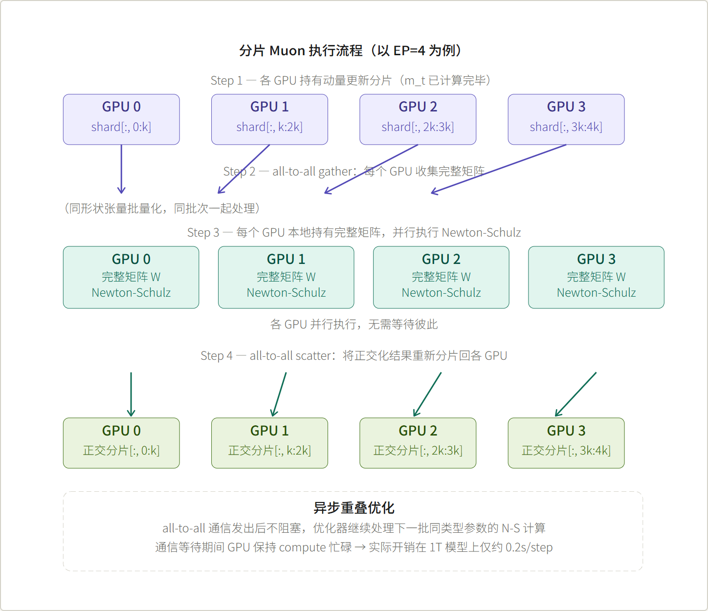
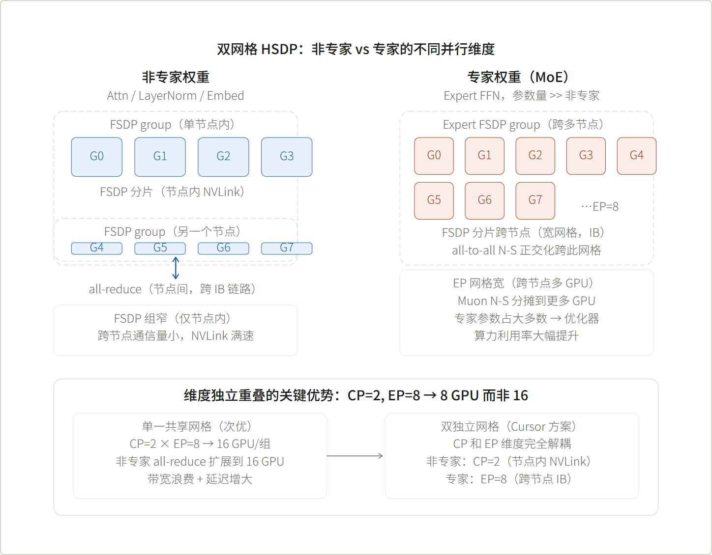
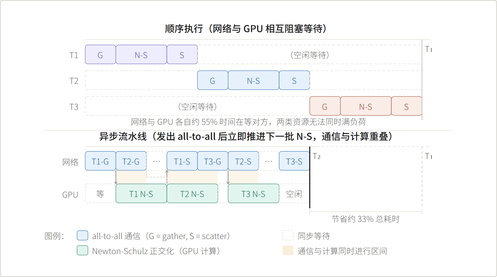
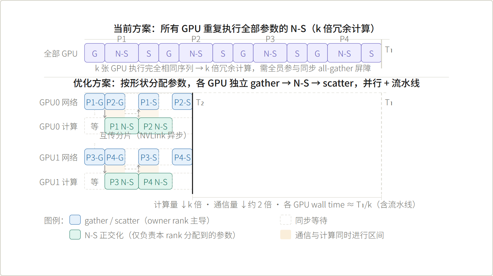
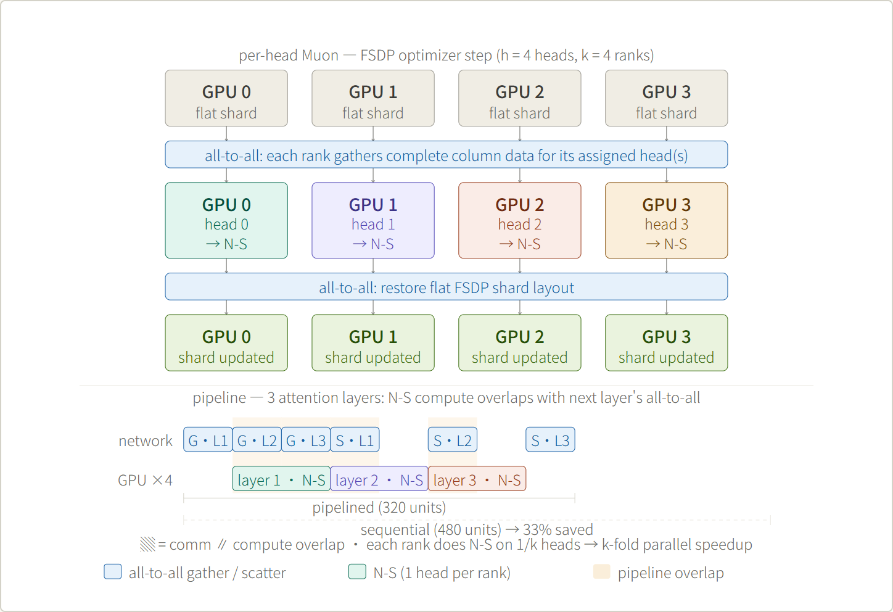
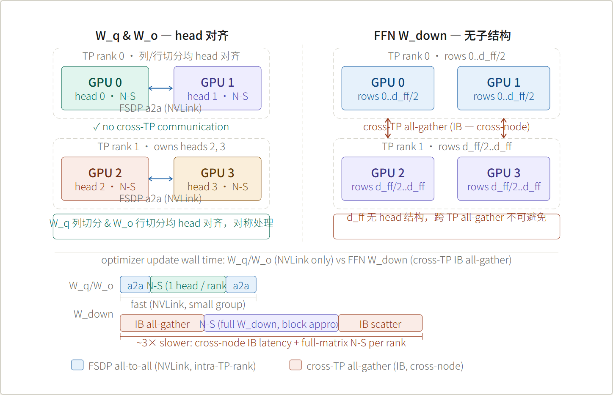

Technical Analysis Report · Distributed Optimizer

# 分片 Muon 与双网格 HSDP

*优化原理与工程实现分析*

基于 Cursor Composer 2.5 博客披露的技术方案，结合 Muon 算法数学基础， 分析其在 MoE 大模型分布式训练中的实现正确性、优化原理与社区方案对比， 并提出对非专家权重 N-S 计算的进一步优化方向。补充分析分头 Muon 的算法语义、 FSDP 与 TP+FSDP 联合场景下的分头 N-S 流水线设计， 以及 W_o 与 FFN W_down 在 TP 切分下的关键区别。

**参考来源**cursor.com/cn/blog/composer-2-5 · Megatron-LM 代码 **涉及系统**Kimi K2 · FSDP · HSDP · MoE · Muon · TP

**目录**

-   Muon 算法核心原理
-   分片 Muon 的挑战与 all-to-all 解法
-   双网格 HSDP 设计
-   TP 场景的覆盖情况分析
-   异步流水线：通信与计算重叠
-   非专家权重分工 N-S 优化方案
-   总结与对比
-   分头 Muon — 正交化粒度与架构语义对齐
-   分头 Muon FSDP 流水线
-   TP + FSDP 联合场景下的分头 Muon

## 01 Muon 算法核心原理

Muon（Momentum + Orthogonalization Update）由 Kosson 等人提出， 在 Nesterov 动量的基础上，对梯度矩阵施以 Newton-Schulz 迭代正交化， 使每步更新等价于在谱范数球面上做梯度下降。

### 算法步骤

```

// Step 1：Nesterov 动量累积
m_t  = β · m_{t-1} + g_t
ĝ_t  = β · m_t + g_t      // lookahead

// Step 2：Newton-Schulz 近似正交化（作用于 reshape 后的矩阵 G）
X₀        = G / ‖G‖_F
X_{k+1}   = (a·X_k + b·X_k X_k^T X_k + c·(X_k X_k^T)² X_k)  // 迭代 ~5 次

// Step 3：以正交化结果 X* 更新参数
W_{t+1}   = W_t - η · X*

```

### 为什么有效

Adam 对每个参数标量独立归一化，会扭曲梯度的方向结构。 Muon 将整个参数矩阵视为一个几何对象，用正交矩阵 `U·Vᵀ`（SVD 的正交因子） 作为更新方向，使所有奇异方向上的有效步长均等， 实践中收敛更快且对学习率不敏感。

> **关键约束：**Newton-Schulz 必须作用在语义完整的矩阵上，而不是矩阵的任意切片。 这一点是分布式实现的核心挑战——在 FSDP/TP 环境下，每个 GPU 只持有参数分片， 直接对分片做 N-S 在数学上是错误的。

## 02 分片 Muon 的挑战与 all-to-all 解法

### 正交化粒度的数学依据

Cursor 博客提到：注意力投影按每个注意力头处理，MoE 权重按每个专家处理。 这个粒度选择有严格的数学依据，而非任意工程决定：

| 权重类型 | 正交化粒度 | 原因 |
| --- | --- | --- |
| Multi-Head Attention Q/K/V | R^{d × (d/h)}，按 head | 每个 head 是独立子空间投影，奇异值分布差异大；整体正交化会使主导 head 压制其他 head |
| MoE 专家 FFN | R^{d_ff × d_model}，按 expert | 各专家语义完全独立，跨专家正交化会引入人为耦合 |
| Embedding / LayerNorm | 完整矩阵 | 无自然子结构，整体处理 |

注意力头的粒度选择与 Megatron-LM 的 Tensor Parallel 切分维度天然对齐 （TP 也按 head 切分 QKV），这为将来引入 TP 的适配提供了一定基础。

### all-to-all gather → N-S → scatter 流程

在 FSDP 环境下，权重矩阵被展平后均匀切分到各 GPU。 以专家权重 `W ∈ R^{d_ff × d_model}`、EP=4 为例， 每个 GPU 仅持有 `R^{d_ff × (d_model/4)}` 的分片。 对此分片直接做 N-S 是错误的，必须先还原完整矩阵。



*图 1 — 分片 Muon all-to-all gather → Newton-Schulz → all-to-all scatter 流程（EP=4）*

### 正确性分析

此设计等价于"完整矩阵 Muon"的原因：N-S 迭代的输入输出均为同一完整矩阵， scatter 回的分片只是对同一正交化结果的切分，不改变数学语义。 每个 GPU 都对完整矩阵执行 N-S（存在内存冗余）， 但通过批量化同形状张量摊薄通信开销，整体上是合算的。

### 与社区方案对比

单机或 DDP 训练中（nanoGPT-speedrun 等），参数完整存在于每张卡， 可直接对完整矩阵执行 N-S，无需任何通信。在 FSDP 环境下， Moonshot（Kimi K1.5 Muon 工作）提出了"distributed Muon"， 思路与此一致：each rank all-gather 后执行 N-S。 Cursor 方案的工程改进在于：

| 改进点 | 描述 | 效果 |
| --- | --- | --- |
| 批量化同形状张量 | 多个专家权重合并为一次 all-to-all | 减少 collective 调用次数，提升 NIC 带宽利用率 |
| 通信异步化 | 发出 all-to-all 后不阻塞，推进其他批次 N-S | GPU 和网络并行，消除单向等待 |
| 双网格解耦 | 非专家与专家使用不同 FSDP 网格 | 避免小参数量 all-reduce 扩展到宽网格 |

## 03 双网格 HSDP 设计

HSDP（Hybrid Sharding Data Parallel）= FSDP 分片 + 数据并行 all-reduce， 形成二维并行网格。Cursor 的关键创新是为非专家权重和专家权重分别维护一套网格， 并将 CP（Context Parallel）与 EP（Expert Parallel）维度解耦。



*图 2 — 双网格 HSDP 拓扑：非专家窄网格（节点内 NVLink）vs 专家宽网格（跨节点 IB）*

CP（Context Parallel）用于长序列切分 attention，EP 是专家并行，两者本质无关， 不应绑定在同一网格维度。解耦后各自的通信模式（CP 的 ring-attention all-to-all 与 EP 的专家分发 all-to-all）互不干扰，也避免了非专家的小规模 all-reduce 被迫扩展到宽网格造成的带宽浪费。

## 04 TP 场景的覆盖情况分析

> **结论：**Cursor 博客描述的方案仅覆盖 FSDP/HSDP 分片场景，未对 TP（Tensor Parallel）做显式适配。这是有意为之的架构选择，而非技术遗漏。

博客所述"分片"语义是 FSDP 的 flat shard——参数展平后均匀切块，gather 即还原完整矩阵。 TP 的分片性质完全不同：

> 错误（子矩阵奇异值结构不同）

> 错误（行切片无法重建完整奇异值）

| TP 切分类型 | 每卡持有 | 直接做 N-S | 正确做法 |
| --- | --- | --- | --- |
| Column-parallel（W_q/k/v） | `W[:, i·h : (i+1)·h]` | 若 TP 粒度 = head 边界，可按 head 各自 N-S，无需跨 TP 通信 |
| Row-parallel（W_o） | `W[i·d : (i+1)·d, :]` | 需在 TP group 内 all-gather 还原完整矩阵后做 N-S，社区暂无公开实现 |

Kimi K2 采用 EP + FSDP/HSDP 为主的并行策略，不依赖 TP，原因在于： MoE 模型专家权重占总参数绝大多数，EP 天然契合"按专家粒度正交化"的 Muon 需求； 引入 TP 会在 attention 层增加额外 all-reduce，进一步加重本已受带宽约束的通信压力。 因此在当前架构前提下，此 Muon 实现的覆盖范围是完备的。

## 05 异步流水线：通信与计算重叠

每个"Muon 任务"是一批形状相同的分片张量（如所有专家 up-proj 权重）。 每个任务包含三步：all-to-all gather → Newton-Schulz → all-to-all scatter。 流水线的关键是：发出 all-to-all 后不阻塞，立刻推进上一批已聚合矩阵的 N-S 计算， 让网络传输与 GPU 计算同时进行。



*图 3 — Muon 异步流水线 Gantt 图：顺序执行（上）vs 通信计算重叠（下）*

### 三类重叠区间说明

**区间 A**（T2-G ∥ T1-NS）：T1 的 gather 完成后，GPU 立即跑 T1 的 N-S； 网络不等 GPU 算完，直接发出 T2 的 gather。两者无依赖，纯并行。

**区间 B**（T1-S + T3-G ∥ T2-NS）：T1-NS 算完后，scatter 发上网络； GPU 立刻开始 T2-NS。T1-S 在网络传输期间，T2-NS 同时在 GPU 上运行。 T1-S 传完后，网络继续发 T3-G，GPU 仍在算 T2-NS，形成稳态流水。

**唯一同步点**：T2-G 完成后需等 T1-NS 结束才能开始 T2-NS（依赖 T1 占用 GPU）。 此等待窗口 = max(0, NS_time − G_time)。N-S 的矩阵乘计算时间通常远大于 gather 传输时间， 因此后续批次的 gather 可以填满此窗口，趋近零等待。

## 06 非专家权重分工 N-S 优化方案

当前方案对非专家权重同样执行 all-to-all + N-S，FSDP 组内每张卡都对同一完整矩阵 执行一次 N-S，存在 k 倍计算冗余（k = FSDP group size）。 针对此问题，可引入"按参数形状分工"策略。

### 方案描述

在同一 FSDP 组内，按 N-S 计算代价（正比于矩阵大小 m×n）将参数矩阵分配给各 rank， 每个 rank 作为"owner"只负责所分配矩阵的 gather → N-S → scatter， 其余 rank 仅作为"sender"提供对应 shard。

### 通信量分析

> k 倍冗余，每卡跑全部 N-S

| 方案 | 每 rank 通信量（设总参数量 S，k 张卡） | 计算量 |
| --- | --- | --- |
| 当前（全员 gather） | 2 · n · S · (k−1)/k |
| 分工方案 | ≈ n · S · (k−1)/k（约减半） | 每卡仅跑 1/k 数量的 N-S |



*图 4 — 非专家权重分工 N-S 方案：各 GPU 负责不同参数，GPU 间并行 + 流水线重叠*

### 可行性与工程挑战

> **正确性：**每个 rank 作为 owner 时，gather 得到完整矩阵，N-S 作用于完整矩阵后 scatter 回分片，数学上等价于完整矩阵 Muon。✓

主要工程挑战在于负载均衡。非专家权重形状差异显著—— embedding 层 `[V, d]`（V 可达数万）、attention 投影 `[d, d_h]`、 layer norm `[d]` 的 N-S 计算代价相差悬殊。 需按矩阵大小做贪心 bin-packing 分配，避免某 rank 成为瓶颈。 此外，non-owner rank 的参数更新必须等待 owner scatter 完成， 需用 CUDA event 或 `wait_tensor` 做细粒度同步，不能用全局 barrier。

此优化对非专家参数量较大时（embedding 层 `[V=128K, d=7168]` 等）效益最显著， 对参数量小的 layer norm 等收益有限。在实际部署中建议只对超过一定大小阈值的矩阵启用分工策略。

## 07 总结与方案对比

> k 倍（每卡跑全部）

> 未覆盖（有意，EP+FSDP 架构无需）

> 同左，Row-parallel 需额外设计

| 维度 | Cursor 方案（博客披露） | 社区基线（nanoGPT-speedrun 等） | 非专家分工优化（提案） |
| --- | --- | --- | --- |
| N-S 作用对象 | 完整矩阵（gather 后） | 完整矩阵（无分片） | 完整矩阵（各 rank 负责子集） |
| 数学正确性 | ✓ 等价 | ✓ 原生正确 | ✓ 等价 |
| 非专家计算冗余 | 无（单卡） | 消除（各卡分工 1/k） |
| 通信量（非专家） | 2·n·S·(k-1)/k | 0 | 约减半 |
| EP 专家权重 | ✓ all-to-all 批量化 + 异步 | 不适用（单机） | 沿用 Cursor 方案 |
| TP 适配 | 不适用 |
| 通信异步化 | ✓ 流水线重叠 | 不适用 | ✓ 可叠加异步重叠 |
| 工程复杂度 | 中等 | 低 | 高（负载均衡 + 细粒度同步） |

### 核心结论

Cursor 的分片 Muon 方案在三个层面上做到了统一： **数学正确性**（N-S 始终作用于完整矩阵）、 **工程效率**（批量化同形状张量 + 异步通信掩盖）、 **系统架构**（EP/CP 双网格解耦，匹配 MoE 大模型的参数分布特征）。 这是目前已知 MoE 大模型上 Muon 分布式实现最为完整的公开描述之一。

非专家权重的分工 N-S 优化在数学上同样可行，可进一步消除 k 倍计算冗余， 核心工程挑战在于不规则形状矩阵的负载均衡与细粒度同步控制， 对 embedding 等大矩阵的效益最为显著。

> **注：**本报告分析基于 Cursor Composer 2.5 博客的公开披露内容， 结合 Muon 算法原始论文和 FSDP/Megatron 社区文档推导， 未披露的具体实现细节（如 all-to-all 的精确调度策略、负载均衡算法） 均为基于公开信息的合理推断。

## 08 分头 Muon — 正交化粒度与架构语义对齐

### 原始 Muon 的粒度问题

原始 Muon 论文将整个参数矩阵视为 N-S 的操作单元。对 FFN 的 W_up/W_down 来说， 这完全合理——这些矩阵没有额外的语义子结构。但 Multi-Head Attention 的投影矩阵 `W_q ∈ R^{d × d}` 不是普通的 2D 矩阵，它在列维度上有结构： 每 d_h 列对应一个 head 的独立子空间投影。

对整个 W_q 做 SVD 时，主奇异向量可以是跨 head 的线性组合。N-S 正交化后， 会把不该耦合的 head 强行耦合在一起——某个 head 的主特征方向如果和其他 head 高度对齐， 整体 W_q 的 N-S 会把这种"巧合对齐"当作重要奇异方向来对待，影响所有 head 的更新幅度。

### per-head N-S 的算法优势

对每个 head 独立做 N-S：

```

对 i = 1..h：
    X_i* = NewtonSchulz(W_q^i)   // W_q^i ∈ R^{d × d_h}

```

每个 head 拥有自己独立的 SVD，自己独立的正交化更新，步长在本 head 的奇异方向上均等， 和其他 head 完全解耦。这才是真正符合 MHA 设计意图的更新方式。类比： 不会对 batch 里不同样本做 BatchNorm（不同样本分布独立），同理不同 head 的投影方向独立， 不应强行整体正交化。

### MoE per-expert 与 per-head 的统一设计原则

Composer 2.5 对注意力层按 head 处理、对 MoE 层按 expert 处理，背后是同一个原则：

> **设计原则：**N-S 的正交化粒度应与模型的语义独立单元对齐。 头之间独立 → per-head N-S；专家之间独立 → per-expert N-S； FFN 无语义子结构 → 整体矩阵 N-S。

这是对原始 Muon 的一个有意义的算法层面扩展——不是分布式工程上的妥协， 而是将架构先验注入优化器的主动设计选择。

| 权重 | N-S 粒度 | 语义依据 |
| --- | --- | --- |
| W_q / W_k / W_v | R^{d × d_h}，按 head | 每个 head 是独立子空间投影，奇异值分布各异，整体正交化会引入 head 间耦合 |
| W_o（attention output） | R^{d_h × d_model}，按 head | 每个 head 的输出投影独立参数化，梯度流仅通过本 head 的贡献，可按 head 独立 N-S |
| MoE 专家 FFN | R^{d_ff × d_model}，按 expert | 各专家语义完全独立，跨专家正交化引入人为耦合 |
| FFN W_up / W_down（dense） | 整体矩阵 | d_ff 神经元无语义子结构，整体 N-S 是正确的操作单元 |

## 09 分头 Muon FSDP 流水线

将 per-head 粒度和 FSDP 分布式环境结合，可以消除之前方案中每个 rank 冗余执行全部 head N-S 的问题。 核心思路：通过 all-to-all 将 flat FSDP shard 重组为"头所有权"布局，各 rank 独立执行所分配 head 的 N-S， 再 all-to-all 还原分片。

### 完整数据流与流水线



*图 5 — 分头 Muon FSDP 流水线：flat shard → all-to-all → per-head N-S（并行）→ all-to-all → 更新分片；下部 Gantt 展示跨层通信计算重叠*

### 与之前非专家分工方案的对比

前文（第六节）提出的"按形状分配参数"方案，是在同一 FSDP 组内对不同矩阵（不同 layer 的权重）分工。 本节的分头方案是在同一矩阵内对不同 head 分工。两者可以叠加： 先按 head 分工（本节），再在跨层的批次间做异步流水线（第五节）。 叠加效果是计算量减少 k 倍 + 通信掩盖约 33%，对 attention 层 Muon 开销的降低最为显著。

## 10 TP + FSDP 联合场景下的分头 Muon

### 核心结论：W_o 与 W_q 对称，FFN W_down 才是真正的难点

基于 Megatron-LM 及 TGI/HuggingFace 代码分析，Transformer 中各权重在 TP 下的切分如下：

```

// 代码来源：TGI RowParallelLinear / Megatron-LM attention

W_q/W_k/W_v : ColumnParallelLinear(embed_dim → embed_dim)
  → 每 TP rank 持有：[embed_dim, embed_dim/TP] = [d_model, (h/TP)·d_h]
  → h/TP 列块 = h/TP 个完整 head 的 Q/K/V 投影

W_o (out_proj): RowParallelLinear(embed_dim → embed_dim)
  → 每 TP rank 持有：[embed_dim/TP, embed_dim] = [(h/TP)·d_h, d_model]
  → h/TP 行块 = h/TP 个完整 head 的输出投影   ← 同样是 head 对齐

FFN W_down:    RowParallelLinear(4·embed_dim → embed_dim)
  → 每 TP rank 持有：[4·embed_dim/TP, embed_dim]
  → 行维度是 d_ff 神经元，无语义子结构         ← 无法按 head 分割

```

> **关键修正：**W_o（attention output projection）与 W_q 对称，TP 行切分恰好沿 head 边界， 每个 TP rank 已持有完整的 h/TP 个 head 块。**不需要跨 TP all-gather**， 可以直接在 TP rank 内部做 per-head N-S（与列切分的 W_q 完全对称）。 需要跨 TP all-gather 的是 FFN W_down，而非 W_o。



*图 6 — TP + FSDP 联合场景：W_q 与 W_o 均 head 对齐，无需跨 TP 通信；FFN W_down 无子结构，需要跨 TP IB all-gather*

### FFN W_down 的 all-gather 后续方案

跨 TP all-gather 获得完整 W_down 后，可以沿用与分头 Muon 相同的 all-to-all 分工机制：

```

① cross-TP all-gather
   → 全部 TP×FSDP GPU 拿到完整 W_down ∈ R^{d_ff × d_model}

② 在 TP×FSDP 扩展组内 all-to-all 分配行块
   → 每 GPU 负责 d_ff / (TP×FSDP) 行，独立 N-S（无通信）

③ all-to-all 归还行块分片

④ cross-TP scatter 还原 TP-local shard

```

> **数学注意：**步骤②的行块 N-S 是**块正交化近似**， 不等价于对完整 W_down 做 N-S。完整矩阵的 SVD 奇异向量跨越整个 d_ff 维度， 切块后各块的奇异值结构与全局不同。对于有语义子结构的权重（W_q/W_o，按 head）这种近似是严格等价的； 对于 FFN W_down，则是工程上的妥协——实践中块正交化往往表现尚可，但理论上不等价于严格 Muon。

### 全场景三类权重总结

> 必须（严格 Muon）

> all-gather 后扩展组内块 N-S（近似）

> 必须（严格 Muon）

> all-gather 后扩展组内块 N-S（近似）

| 权重 | TP 切分 | 行/列维度语义 | 跨 TP all-gather | N-S 方式 |
| --- | --- | --- | --- | --- |
| W_q / W_k / W_v | 列并行 | 每 (h/TP) 列 = 一个 head | 不需要 | 严格 per-head，TP rank 内 FSDP a2a |
| W_o（out_proj） | 行并行 | 每 (h/TP)×d_h 行 = 一个 head 块，head 对齐 | 不需要 | 严格 per-head，与列切分对称 |
| FFN W_down | 行并行 | d_ff/TP 神经元，无语义子结构 |
| FFN W_up | 列并行 | d_ff/TP 神经元，无语义子结构 |

分片 Muon 与双网格 HSDP 技术分析报告 参考来源：cursor.com/cn/blog/composer-2-5 · Muon 原始论文 · Megatron-LM 代码 · PyTorch FSDP 文档
