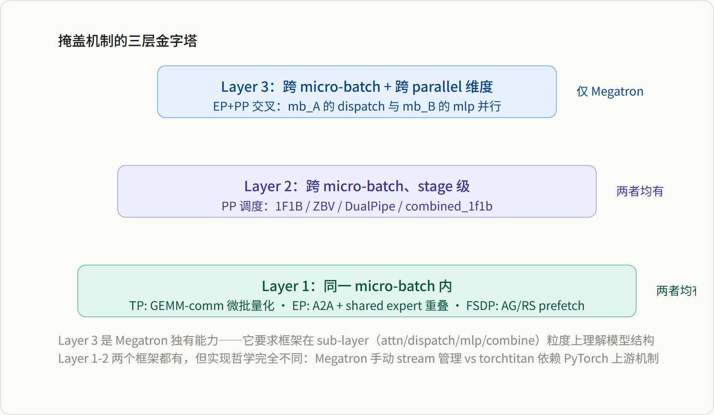
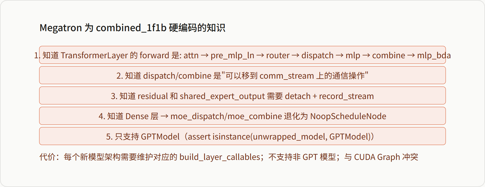

# 计算通信掩盖机制跨框架对比矩阵

*Megatron-LM combined_1f1b · torchtitan ZBV/DualPipe · MindSpeed fb-overlap/DualPipeV · TP/DP/PP/EP 掩盖维度全览*

> 本页是 **Megatron-LM / torchtitan / MindSpeed** 三个分布式训练框架计算通信掩盖机制的**横向对比矩阵页**：Megatron 的逐轴机制已下沉到 12–16、跨轴组合归 [[20_megatron_comm_overlap_analysis]]；另外两套框架的机制分别归 [[24_torchtitan_comm_optimizations_overlap_analysis]]、[[11_mindspeed_comm_overlap_analysis]]。本页只保留这些 owner 都没有的**合成视图**：跨框架维度矩阵、combined_1f1b vs ZBV/DualPipeV 的架构差异分析、可达性矩阵。查具体机制请跳转子页；查"哪个框架用什么手段掩盖哪种通信"，本页即终点。
>
> **与"通算融合"的边界**：本页讲的是**掩盖**——通信与计算独立发生、靠调度/多 stream 重叠隐藏延迟（源码层仍是两次算子调用）；把通信编进**同一个 kernel** 的**融合**手段（WaveEP、DeepEP、MC2）见 [[31_comm_compute_fusion_guide]]。

**目录**

-   掩盖机制的概念分层
-   跨框架掩盖维度矩阵
-   combined_1f1b 与 ZBV/DualPipeV：两种"打通"哲学
-   Sub-Layer 级掩盖为何无法被泛化
-   框架差异总结

## 一 掩盖机制的概念分层

计算通信掩盖（Comm-Compute Overlap）在分布式训练中存在于多个粒度层次。理解这些层次，是理解三个框架差异的前提。

*图 1：掩盖机制的三层金字塔*

三个框架实现这些层次的**载体**不同，[[11_mindspeed_comm_overlap_analysis|MindSpeed 计算通信掩盖]] §1 给出的三分类同样适用于跨框架理解：**融合**（把通信编进单一 kernel，如 Megatron/MindSpeed 的 MC2、DeepEP `FusedDispatch`——参见 [[31_comm_compute_fusion_guide]]）、**软件流水**（chunk 切分 + 双 stream 异步 handle，如 Megatron TP Bulk/Pipelined、MindSpeed CoC；torchtitan 侧此前举的 `AsyncCollectiveTensor` 例子已不成立，见 §4.3 注）、**换调度**（PP/EP 调度层面重排，如 combined_1f1b、ZBV/DualPipeV、MindSpeed fb-overlap+DualPipeV）。下面按维度逐一对照。

## 二 跨框架掩盖维度矩阵

| 维度 | Megatron-LM | torchtitan | MindSpeed |
| --- | --- | --- | --- |
| **TP** | Bulk（`ub_bulk_wgrad`/`ub_bulk_dgrad`：dgrad/wgrad 与 AG/RS 无依赖侧并行）+ Pipelined（chunk 流水，`tp_comm_overlap`，依赖 TE User Buffer）→ [[12_megatron_tp_analysis]] §4.2 | Async-TP 微流水（Inductor `_micro_pipeline_tp` pass 在已编译 block 中匹配 TP collective 与相邻 GEMM；TorchTitan 侧只注册准确 dense TP group 的对称内存 + 打开 pass flag，需 `enable_async_tensor_parallel`+model compile，无 SM90 门槛）；eager 可达的姊妹路线是 dist-GEMM 模块直接封 `symm_mem.fused_all_gather_matmul`/`fused_matmul_reduce_scatter` → [[24_torchtitan_comm_optimizations_overlap_analysis]] §4 | MC2（单一融合大算子，`npu_all_gather_base_mm`/`npu_mm_reduce_scatter_base`）或 CoC（PyTorch 层 chunk 软流水/lcal 融合核，粒度可调）→ [[11_mindspeed_comm_overlap_analysis]] §2-3 |
| **DP（梯度/参数）** | Bucket 异步 ReduceScatter（`overlap_grad_reduce`）+ Prefetch AllGather（`overlap_param_gather`），forward pre-hook 驱动 → [[16_megatron_distributed_optimizer_analysis|bucket readiness、RS 与参数可见性闭环]] | 独立 AG/RS stream（HSDP 再加一条 all-reduce stream）属上游 PyTorch FSDP2；TorchTitan 只声明 shard/replicate 轴、FSDP unit 与缩放所有权，明确**不保证**私有双流细节。dense 沿用上游隐式预取，仅 `ep_degree>1` 时才由 TorchTitan 显式串起前向/反向逆序预取链 → [[11_torchtitan_fsdp_analysis]] §6、[[21_torchtitan_hsdp_backward_overlap_analysis]] §4 | 梯度/参数 AG-RS 沿用 Megatron distributed optimizer（未在本域单列）；MindSpeed 自身新增 **async-log-allreduce**——掩盖的不是梯度而是 **loss 日志 all-reduce**，延迟到取值才 wait → [[11_mindspeed_comm_overlap_analysis]] §6 |
| **PP** | 异步 P2P（`overlap_p2p_comm`，even/odd rank 分组实现真并发；⚠️ 默认关闭）→ [[15_megatron_pp_schedulers_analysis|P2P 的 request/handle/wait 语义]] | Action-based runtime（`RECV` 早发起、用前才 wait，`SEND` 发起不等）由上游 `torch.distributed.pipelining` 提供，**不是 torchtitan 实现**；TorchTitan 只选 schedule class、填 stages/microbatches，或用 CSV 换掉 action 表 → [[14_torchtitan_pp_analysis]] §1/§3 | optimize-p2p-comm（关 `batch_p2p_comm` 拆独立 isend/irecv）/ optimize-send-recv-comm（专用 P2P stream + 进程组，细粒度重叠）→ [[11_mindspeed_comm_overlap_analysis]] §5.3 |
| **EP（同 microbatch 内）** | Shared Expert 独立 stream 状态机（`moe_shared_expert_overlap`，与 EP+PP 交叉掩盖是**独立**开关）→ [[14_megatron_ep_analysis|shared expert 配套机制与 guard]] | 当前基线已无此窗口：combine 之后的 dtype 转换、score 乘法与 scatter 都是结果数据依赖，`shared_experts(x)` 又在整个 routed path 返回后才单独执行（`torchtitan/models/common/moe.py:404-453`）；提交 `963c20cba37` 已把 shared experts 移出 dispatcher，旧述“`AsyncCollectiveTensor` 跨 shared experts 延迟 wait”不符合 HEAD → [[15_torchtitan_ep_analysis]] §5 | alltoall-overlap/allgather-overlap：异步 handle 藏进同微批 `op_dx`/`op_dw` GroupedMatMul → [[11_mindspeed_comm_overlap_analysis]] §4.1-4.2 |
| **EP（跨 microbatch）+ PP 打通** | **combined_1f1b**：Layer 拆 5 子节点，双 stream 交错 + delay-wgrad，硬编码模型内部结构 → 本页§三、[[15_megatron_pp_schedulers_analysis|combined-1F1B 的本地 F/B 配对与内存账]] | ✗ 无——PP 调度（ZBV/DualPipe）不感知 EP 内部结构，EP 掩盖停留在 mb 内层次 | **fb-overlap**：微批 i 前向 ∥ 微批 i-1 反向 + `WeightGradStore` 延迟 dw；DualPipeV 的 overlap 稳态段直接调用 fb-overlap 函数，二者深度协同 → 本页§三、[[11_mindspeed_comm_overlap_analysis]] §4.3/§5.1 |
| **PP 气泡消除** | 传统 1F1B + P2P overlap（无 ZB/DualPipe 内置支持） | **ZBV/DualPipeV**：I/W 拆分（按 autograd 目标而非模型结构）+ `OVERLAP_F_B`（F/B 计算本身重叠发起）——二者都由上游 pipelining 提供，TorchTitan 只做 V 型 rank 映射并选类；当前 zero-bubble/custom-CSV 的 core integration case 仍 disabled → 本页§三、[[14_torchtitan_pp_analysis]] §3/§6 | **DualPipeV**（双向切半，气泡占比 $O(P)/O(m)$）+ **RiPipe**（气泡内做重计算，近乎零代价）→ [[11_mindspeed_comm_overlap_analysis]] §5.1-5.2 |
| **A2A 专用融合后端** | Flex dispatcher 通过 manager 接口选择 DeepEP/DeepEP v2/HybridEP/NCCL-EP，把融合 dispatch/combine 接回同一 token ownership 闭环；底层 internode 协议与加速比不能从 MCore 接口推出 → [[14_megatron_ep_analysis|Flex manager 的边界与 guard]] | MinimalAsyncEP：symm-mem + 自写 Triton，**不做**通算重叠（明确声明），lever 是融合 barrier + CUDA graph/compile 去 launch 开销 → [[24_torchtitan_comm_optimizations_overlap_analysis]] §6 | alltoall-MC2：`npu_alltoallv_gmm`/`npu_gmm_alltoallv` 把 a2a-v 与专家 GEMM 编进单 kernel，与所有软流水 MoE-overlap 互斥 → [[11_mindspeed_comm_overlap_analysis]] §4.4 |

> **Megatron EP 行补注**：`overlap_dispatch_backward_with_experts_wgrad` 由 `megatron/core/transformer/moe/moe_layer.py::_RecordExpertDgradCompletion` 与 `_RegisterDelayedWgradForExperts` 协作，以专用 `_delayed_wgrad_stream` 把专家 wgrad 与 dispatch 反向 A2A 重叠；其梯度完成语义见 [[14_megatron_ep_analysis|EP 训练闭环]]。它与"EP（跨 microbatch）+ PP 打通"行的 combined_1f1b delay-wgrad（`delay_wgrad_compute`）是**两个相互独立、互斥**的机制；互斥 guard 位于 `megatron/core/transformer/transformer_config.py::TransformerConfig.__post_init__`：前者**不耦合 PP**，纯 EP 内 wgrad-vs-dispatch-A2A 重叠；后者是 combined_1f1b 内**跨 microbatch**的 wgrad 延迟，二选一。

## 三 combined_1f1b 与 ZBV/DualPipeV：两种"打通"哲学

Megatron combined_1f1b 与 torchtitan ZBV/DualPipeV、MindSpeed fb-overlap+DualPipeV 都在解决"跨 microbatch 打通掩盖"，但路线不同——完整源码级机制见各自权威页（[[15_megatron_pp_schedulers_analysis|Megatron combined-1F1B]]、[[14_torchtitan_pp_analysis]] §3、[[11_mindspeed_comm_overlap_analysis]] §4.3/§5.1），本节只讲架构差异。其中 torchtitan 页只覆盖 schedule 选类、V 型 rank 映射与 CSV 控制面——I/W 拆分与 `OVERLAP_F_B` 的 action 引擎属上游 `torch.distributed.pipelining`（§3.2 已如此归属），该页不重复其内部机制。

### 3.1 Megatron combined_1f1b：硬编码模型结构换 sub-layer 级掩盖

`fine_grained_callables.py` 把每个 TransformerLayer 手工拆解为 5 个可调度子节点（attn_fwd/mlp_fwd/mlp_bwd/mlp_bwd_dw/attn_bwd），`TransformerLayerSchedulePlan.run()` 在两个 CUDA stream 上交错一个 f_layer 与一个 b_layer，`TransformerModelChunkSchedulePlan.run()` 再按镜像位置配对 forward/backward 层。这要求框架**知道** TransformerLayer 内部执行顺序（先 attn → 再 dispatch → 再 mlp → 再 combine）——即硬编码模型结构，换来的是 **sub-layer 级**的跨 microbatch EP+PP 打通（§四的可达性矩阵详述其代价）。

### 3.2 ZBV/DualPipeV：autograd 级拆分换模型无感知

PyTorch 的 backward 拆分完全在 **autograd 图级别**：`stage_backward_input` 只算到 dInput（`inputs=` 限定、`retain_graph=True`），`stage_backward_weight` 从缓存的中间梯度算到 dWeight。这不是按模型结构（attn vs mlp vs moe_dispatch）拆分，而是按**autograd 的计算目标**（dInput vs dWeight）拆分——一个 stage 可能包含多层 Transformer，但 I 统一是所有层的 dInput，W 统一是所有层的 dWeight。DualPipeV 在此基础上加 `OVERLAP_F_B`：把一个 stage 的 forward 与另一个 stage 的 backward 打包，计算本身重叠发起；但**这不是真正的并发**——两个子 action 在单 rank 上仍串行执行，"overlap" 来自跨 rank 的 P2P 异步通信（rank 0 做 B(stage1) 时 rank 1 正在做 F(stage0)，通信可重叠）。这条路线是**stage 级**的跨 microbatch 打通，换来的是模型零感知（PyTorch 上游实现，模型无需改造）。

### 3.3 MindSpeed fb-overlap+DualPipeV：layer 级跨微批 + 调度协同复用

MindSpeed 的 fb-overlap 让一个微批的前向层与另一个微批的反向层同时执行，`WeightGradStore` 把 dw 解耦延后填气泡，共享专家再叠一层独立 stream；DualPipeV 的 overlap 稳态段**直接调用** fb-overlap 的函数（`dualpipev_schedules.py:921,1098,1204`），二者不是并列关系而是调度深度协同。掩盖粒度是**layer 级**（前向层 ∥ 反向层），没有 Megatron 式的 layer 内 5 子节点拆解，因此不下探到 sub-layer；但因为跨微批互填 + dw 延迟，稳态每层暴露可压到 $\max(T_{\text{comp}},T_{a2a})$，是 MindSpeed 四条 EP 掩盖路线里暴露最低的一档。

> **三者定位**：Megatron combined_1f1b（sub-layer 级，模型强感知）＞ MindSpeed fb-overlap+DualPipeV（layer 级，patch 式模型感知）＞ torchtitan ZBV/DualPipeV（stage 级，模型零感知）——掩盖粒度与模型感知程度成正比，这不是巧合：更细的掩盖粒度必然需要框架知道更多模型内部结构（§四展开这一根本原因）。

## 四 Sub-Layer 级掩盖为何无法被泛化

### 4.1 根本原因：计算-通信边界是模型架构决定的

要在不同 micro-batch 之间交错 sub-layer 操作，框架**必须知道**：

1.  哪些是**纯计算**（attention GEMM、MLP GEMM、layernorm）
2.  哪些是**纯通信**（MoE dispatch AlltoAll、combine AlltoAll、TP AG/RS）
3.  这些操作在**单个 layer 内的执行顺序**（先 attn → 再 dispatch → 再 mlp → 再 combine）
4.  哪些中间 tensor 需要跨 stream 传递（residual、shared_expert_output）

这些信息**不属于任何通用的 IR**——既不在 PyTorch autograd graph 里（autograd 只知道 tensor 依赖），也不在 PipeSchedule 的 stage 定义里（stage 只是一个 nn.Module 切片）。

### 4.2 Megatron 的代价：硬编码模型结构

*图 7：combined_1f1b 需要的硬编码知识*

### 4.3 三层掩盖能力的可达性矩阵

|  | Megatron combined_1f1b | torchtitan ZBV/DualPipe | torchtitan TokenDispatcher | MindSpeed fb-overlap+DualPipeV |
| --- | --- | --- | --- | --- |
| 同一 mb 内 EP 掩盖 | ✓ shared expert side stream | ✗ PP 调度不涉及 | ✗ 当前基线无此窗口（见下注） | ✓ alltoall/allgather-overlap（同微批） |
| 跨 mb 的 stage/layer 级交错 | ✓ combined_1f1b | ✓ ZBV/DualPipe (F/I/W) | ✗ | ✓ fb-overlap（layer 级） |
| 跨 mb + sub-layer 级交错 | ✓ dispatch vs mlp 混排 | ✗ F 对 stage 是原子操作 | ✗ | ✗ 无 layer 内 5 子节点拆解 |
| 跨 mb + EP+PP 打通 | ✓ 独有（sub-layer 粒度） | ✗ | ✗ | ✓（layer 粒度，DualPipeV overlap 段直调 fb-overlap） |

> **矩阵注（2026-08-28 修正）**：torchtitan「同一 mb 内 EP 掩盖」一格此前记 `✓ AsyncCollectiveTensor`。回源码核对 `torchtitan@a3168782c9`：`MoE.forward` 先 `out_TD = self.routed_experts(...)`（`torchtitan/models/common/moe.py:440`）、再 `shared_out_TD = ...`（`:447`），shared experts 在整个 routed path 完成后才执行，**没有可供掩盖的窗口**；#3386 `963c20cba`（2026-05-20）正是把 shared experts 移出 dispatcher 的那次重构。改为 ✗。
>
> **结论**：torchtitan 的掩盖**只剩 stage 级跨 mb 一个层次**（ZBV/DualPipe，且由上游 pipelining 提供）。此前记的「TokenDispatcher 的 mb 内掩盖」在当前基线下已不成立——`MoE.forward` 里 `shared_experts` 严格排在 `routed_experts` 返回之后（`torchtitan/models/common/moe.py:440`、`:447`，自 #3386 `963c20cba` 起），不存在把 shared experts 塞进 a2a 窗口的重叠；权威页 [[15_torchtitan_ep_analysis]] §5 已明确标注旧述不符合 HEAD。MindSpeed 的 fb-overlap+DualPipeV 打通了 EP+PP，但停在 layer 粒度（前向层 ∥ 反向层），未像 Megatron 那样拆到 layer 内 sub-node。Megatron 通过硬编码模型结构，将 EP 与 PP 两层打通并下探到 sub-layer 粒度，实现了跨 mb 的最细粒度并发——粒度越细，需要框架"知道"的模型内部结构越多，这是三个框架路线选择的核心权衡。

## 五 框架差异总结

### 5.1 架构哲学对比

| 维度 | Megatron-LM | torchtitan | MindSpeed |
| --- | --- | --- | --- |
| Stream 管理 | 手动 CUDA stream + Event 同步 | 依赖 `AsyncCollectiveTensor` + NCCL stream | 手动 stream（MC2/CoC 融合核或软件 chunk 流水），HCCL 底座 |
| 调度粒度 | Layer 内 sub-node 级（5 节点） | Stage 级（F/I/W） | Layer 级（fb-overlap 前向层∥反向层）；TP 侧算子 tile 级（MC2）/chunk 级（CoC） |
| 模型感知 | 硬编码 layer 内部结构 | 零感知（autograd graph 级） | Patch 式感知（`MindSpeedFeature` 猴补丁整类替换 Linear/MoELayer/调度函数） |
| EP+PP 交叉 | ✓ combined_1f1b（sub-layer） | ✗ | ✓ fb-overlap+DualPipeV（layer 级协同） |
| PP bubble 消除 | 传统 1F1B + P2P overlap | ✓ ZBV / DualPipe（更先进） | ✓ DualPipeV（双向切半）+ RiPipe（气泡填重计算） |
| 模型支持 | GPTModel（含 MTP） | llama3/4, qwen3, deepseek_v3, gpt_oss, flux | Megatron-patch 生态（Ascend/NPU 训练场景） |
| 代码复杂度 | 高（~1200 行调度 + 模型改造） | 低（调度在上游，模型无改造） | 高（大量 `MindSpeedFeature` 互斥矩阵，见 [[11_mindspeed_comm_overlap_analysis]] §7） |
| 与 compile 兼容 | 部分冲突（CUDA Graph 禁用） | ✓（co-design，Async-TP 甚至要求 compile） | 面向 NPU 亲和路线，非 torch.compile 生态 |

### 5.2 适用场景

> **Megatron combined_1f1b 适合**：千卡以上 MoE 训练，EP 通信延迟是瓶颈。需要将 EP A2A 通信与 PP 1F1B 打通才能最大化 MFU。典型场景：DeepSeek-V3 风格 MoE 在 GB200/H100 集群上训练。

> **torchtitan ZBV/DualPipe 适合**：中等规模训练，PP bubble 是主要瓶颈。利用上游 PyTorch 的先进调度（ZB/DualPipe），代码简洁，模型零侵入。典型场景：Dense 模型 PP 训练，或 MoE 模型在 EP 通信不构成主要瓶颈时。

> **MindSpeed fb-overlap+DualPipeV 适合**：Ascend/NPU 上的 MoE 大模型训练，在无法直接复用 CUDA 生态（TE、DeepEP）时，用 NPU 原生融合算子（MC2/alltoall-MC2）+ 软件流水/换调度组合逼近 Megatron combined_1f1b 的打通效果，但约束更重（各特性两两互斥矩阵庞大，需按稠密/MoE 场景组合选型）。

### 5.3 一句话总结

> **Megatron 做的是 sub-layer 级跨 micro-batch 的 EP+PP 打通，torchtitan 做的是 stage 级跨 micro-batch 的 PP 调度优化，MindSpeed 做的是 layer 级跨 micro-batch的 EP+PP 打通（NPU 原生融合算子 + patch 式调度协同）。**三者共同印证同一条规律：掩盖粒度每下探一级，需要框架"知道"的模型内部结构就多一分——通用的 PP 调度框架做不到 sub-layer 级掩盖，唯有硬编码或深度 patch 模型知识才能实现。

## Related Pages

- [[20_megatron_comm_overlap_analysis]] —— Megatron-LM 跨轴时间线、资源竞争与诊断 owner；各轴本地实现由该页导航到 12–16
- [[24_torchtitan_comm_optimizations_overlap_analysis]] —— torchtitan 通信优化权威机制页（跨维度矩阵 + Async-TP/对称内存/MinimalAsyncEP）
- [[15_torchtitan_ep_analysis]] —— torchtitan EP token all-to-all 的四条 dispatcher 路径与选择判据（该页 §5 已标明旧述的 `AsyncCollectiveTensor` 跨 shared-experts 掩盖窗口在 HEAD 下不成立）
- [[14_torchtitan_pp_analysis]] —— torchtitan PP 调度、ZBV/DualPipeV 的 I/W 拆分与 `OVERLAP_F_B`
- [[11_mindspeed_comm_overlap_analysis]] —— MindSpeed 通信掩盖权威机制页（MC2/CoC/fb-overlap/DualPipeV/RiPipe，源码 file:line）
- [[31_comm_compute_fusion_guide]] —— 通算融合（把通信编进单一 kernel）：与本页"掩盖"手段的边界声明见页首
- [[23_tilelang_analysis]] —— WaveEP 的 tile-level IR 实现机制
- [[12_deepseek_v3_analysis]] —— DualPipe PP 通算重叠设计
- [[13_deepseek_v4_analysis]] —— WaveEP 细粒度 EP 重叠（wave-based expert scheduling）
