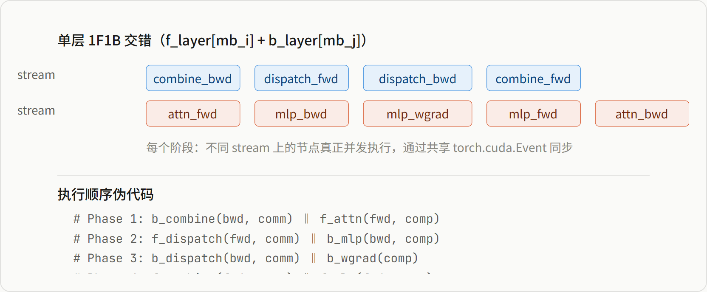
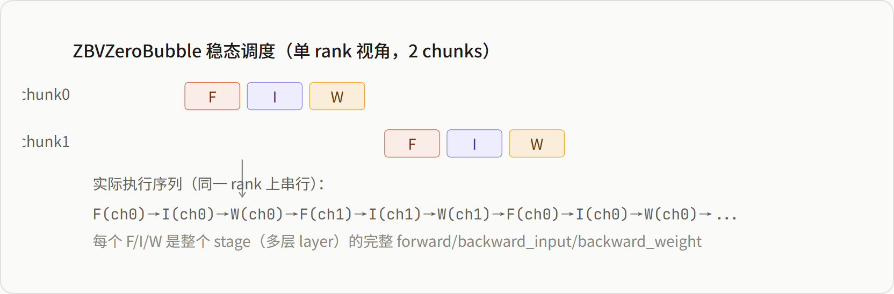

# 计算通信掩盖机制深度对比

*Megatron-LM combined_1f1b · torchtitan ZBV/DualPipe · DeepEP/HybridEP · EP+PP 交叉掩盖*

> 基于对 Megatron-LM 和 torchtitan 两个分布式训练框架源码的系统分析，从 TP/EP/PP 三个并行维度梳理计算通信掩盖的实现机制，重点剖析 combined_1f1b 的 sub-layer 级调度逻辑与 ZBV/DualPipe 的 stage 级调度差异，以及为何通用的 PP 调度框架无法实现 sub-layer 级掩盖。

**目录**

-   掩盖机制的概念分层
-   Megatron-LM 掩盖机制全景
-   torchtitan 掩盖机制全景
-   combined_1f1b 调度逻辑深度剖析
-   ZBVZeroBubble 与 DualPipeV 上游实现
-   Sub-Layer 级掩盖为何无法被泛化
-   框架差异总结

## 一 掩盖机制的概念分层

计算通信掩盖（Comm-Compute Overlap）在分布式训练中存在于多个粒度层次。理解这些层次，是理解两个框架差异的前提。


*图 1：掩盖机制的三层金字塔*

## 二 Megatron-LM 掩盖机制全景

### 2.1 总览

| 掩盖维度 | 配置开关 | 核心文件 | 机制简述 |
| --- | --- | --- | --- |
| TP GEMM-comm | `tp_comm_overlap` | `tensor_parallel/layers.py` | GEMM 拆为 micro-batch，与 AG/RS 流水线重叠 |
| EP A2A + Shared Expert | `moe_shared_expert_overlap` | `transformer/moe/token_dispatcher.py`  
`transformer/moe/shared_experts.py` | Shared Expert 在独立 CUDA stream 上与 A2A 并发 |
| EP+PP 交叉掩盖 | `overlap_moe_expert_parallel_comm` | `pipeline_parallel/combined_1f1b.py`  
`models/common/model_chunk_schedule_plan.py`  
`models/gpt/fine_grained_callables.py` | Layer 拆为 5 子节点，跨 mb 双 stream 交错 |
| Dispatch Bwd + Wgrad | `overlap_dispatch_backward_with_experts_wgrad` | `transformer/moe/moe_layer.py` | Expert wgrad 延迟到独立 stream 与 dispatch bwd 重叠 |
| PP P2P | `overlap_p2p_comm`  
`batch_p2p_comm` | `pipeline_parallel/schedules.py`  
`pipeline_parallel/p2p_communication.py` | 异步 isend/irecv，warmup/1F1B/flush 全覆盖 |
| DeepEP/HybridEP | `moe_flex_dispatcher_backend` | `transformer/moe/fused_a2a.py`  
`transformer/moe/token_dispatcher.py` | 融合 permute + A2A 的单 kernel 通信 |
| DP Param Gather | `overlap_param_gather` | `optimizer/layer_wise_optimizer.py` | Layer-wise 场景 param AG 与 forward 重叠 |

### 2.2 TP 通信掩盖

将 TP Linear 层的 GEMM 与 AllGather/ReduceScatter 通信进行**微批量化流水线重叠**。提供逐层细粒度禁用控制。

```
# model_parallel_config.py
tp_comm_overlap: bool = False           # 总开关
tp_comm_overlap_ag: bool = True          # AG 与 GEMM overlap
tp_comm_overlap_rs: bool = True          # RS 与 GEMM overlap
tp_comm_overlap_rs_dgrad: bool = False   # RS 与 DGRAD GEMM overlap
tp_comm_overlap_disable_qkv: bool = False # 禁用 QKV overlap（保护 attention 局部性）
tp_comm_overlap_disable_fc1: bool = False # 禁用 FC1 overlap
```

### 2.3 EP 掩盖：Shared Expert + A2A 流水线

Shared Expert MLP 在独立 CUDA stream 上运行，通过状态机与 token dispatch/combine 的 AlltoAll 流水线交错：


*图 2：Shared Expert 通过专属 stream 与 A2A 通信交错*

Shared Expert 使用**状态机**管理调用顺序：`IDLE → PRE_FORWARD_COMM_DONE → FC1_FORWARD_DONE → FC2_FORWARD_DONE → POST_FORWARD_COMM_DONE → IDLE`，确保在不同 dispatcher 类型下正确同步。

### 2.4 DeepEP / HybridEP 融合 Kernel

通过 `MoEFlexTokenDispatcher` 抽象层集成 DeepSeek 的两种 EP 通信 kernel：

| Backend | 硬件 | 机制 | 核心函数 |
| --- | --- | --- | --- |
| `deepep` | H100 / NVLink Switch | 融合 permute + AlltoAll 为单 kernel | `fused_dispatch` / `fused_combine` |
| `hybridep` | GB200 / NVLink72 | 更激进融合，GPU-side overflow flag | `hybrid_ep_dispatch` / `hybrid_ep_combine` |

> **Kernel 级掩盖**：这些 kernel 将 token permute（排列）和 A2A（通信）融合为单个 GPU kernel 调用，消除了中间的内存搬运和 kernel launch 开销。这不是传统意义的"掩盖"，而是通过融合避免了通信暴露。

## 三 torchtitan 掩盖机制全景

### 3.1 总览

| 掩盖维度 | 配置 | 核心文件 | 机制简述 |
| --- | --- | --- | --- |
| EP A2A + Shared Expert | EP > 1 自动 | `models/common/token_dispatcher.py` | `AsyncCollectiveTensor`：A2A 在 NCCL stream 异步，shared expert 并行 |
| DeepEP / HybridEP | `comm_backend` | `distributed/deepep/`  
`models/common/token_dispatcher.py` | 异步 combine + shared expert + `sync_combine()` |
| PP Zero-Bubble | `pipeline_parallel_schedule` | PyTorch 上游  
`distributed/pipeline_parallel.py` | `ScheduleZBVZeroBubble`：backward 拆 I/W 填 bubble |
| PP DualPipe | `pipeline_parallel_schedule` | PyTorch 上游  
`distributed/pipeline_parallel.py` | `ScheduleDualPipeV`：V 型映射 + OVERLAP_F_B 打包 |
| Async TP | `enable_async_tensor_parallel` | PyTorch 上游  
`distributed/tensor_parallel.py` | Inductor micro-pipeline TP（需 torch.compile） |
| FSDP AG/RS overlap | Graph Trainer 实验 | `experiments/graph_trainer/fsdp_passes.py` | Inductor 级 AG/RS 重排 + 额外 NCCL PG 实现并发 |

### 3.2 EP 掩盖：AsyncCollectiveTensor 机制

torchtitan 不管理 CUDA stream，而是利用 `all_to_all_single_autograd` 返回 `AsyncCollectiveTensor`：

```
# AllToAllTokenDispatcher.combine()
routed_output = all_to_all_single_autograd(  # → AsyncCollectiveTensor
    routed_output, input_splits, output_splits, self.ep_mesh
)
out = shared_experts(x)                       # 并行计算
out = deterministic_scatter_add(out, ..., routed_output)  # 访问 routed_output → 隐式同步
```

> **与 Megatron 的关键区别**：Megatron 显式管理 CUDA stream + event 同步；torchtitan 依赖 PyTorch 的 `AsyncCollectiveTensor` 惰性物化机制。前者控制力强但代码复杂，后者代码简洁但受限于上游机制。

### 3.3 DeepEP 异步 Combine

```
# DeepEPTokenDispatcher.combine()
routed_output = combine_tokens(routed_output, state)  # async_finish=True，立即返回
shared_out = shared_experts(x)                        # 与 combine 通信并行
sync_combine()                                        # 显式 CUDA stream wait
routed_output = routed_output + shared_out            # 安全合并
```

## 四 combined_1f1b 调度逻辑深度剖析

这是 Megatron 最核心的独有能力——将 EP 通信掩盖与 PP 1F1B 调度打通，实现跨 micro-batch + sub-layer 级的真正并发。

### 4.1 模型层改造：Layer → 5 子节点

`fine_grained_callables.py:466-707` 的 `build_transformer_layer_callables()` 将每个 TransformerLayer 手工拆解：


*图 3：TransformerLayer 的 5 子节点拆解*

### 4.2 层级调度：TransformerLayerSchedulePlan.run()

这是 **最核心的调度函数**（`model_chunk_schedule_plan.py:229-297`），将一个 f_layer（forward）和一个 b_layer（backward）在两个 stream 上交错：



*图 4：单层 f_layer + b_layer 的双 stream 交错调度*

每个节点的 stream 上下文通过 `ScheduleNode.stream_acquire_context()` 实现：

```
def stream_acquire_context(self, name):
    self.event.wait(self.stream)          # 等待 event → 确保前序完成
    with torch.cuda.stream(self.stream):  # 切换到目标 stream
        yield
    self.event.record(self.stream)        # 记录完成 → 后续节点 wait 此 event
```

### 4.3 Model Chunk 级调度：镜像层配对

`TransformerModelChunkSchedulePlan.run()` 将 forward 层和 backward 层按**镜像位置**配对：


*图 5：Chunk 内的镜像层配对调度*

> **P2P 掩盖联动**：PP 的 forward send 放在 comm_stream（与 attn_bwd 重叠），backward send 放在 comp_stream（与 attn_wgrad 重叠）。最后一层 attn 的 wgrad 被延迟到 P2P backward send 之后才执行，最大化掩盖。

## 五 ZBVZeroBubble 与 DualPipeV 上游实现

### 5.1 Backward 拆分：I/W 的 autograd 级实现

PyTorch 的 backward 拆分完全在 **autograd 图级别**，不知道模型内部结构：

```
# torch/distributed/pipelining/_backward.py

def stage_backward_input(stage_outputs, output_grads, input_values, weights):
    """只算 input gradients，停在 weight grad accumulators"""
    # 1. 分析 autograd graph: inputs → ... → intermediates → ... → weights
    # 2. 从 stage_output 反传到 inputs，算出 dInputs（retain_graph=True）
    # 3. 保存 intermediates（input→weight 之间的中间节点）为 param_groups
    # 4. detach stage_outputs 释放显存
    dinputs = autograd.grad(stage_outputs, input_values, retain_graph=True)
    return dinputs, param_groups

def stage_backward_weight(weights, param_groups):
    """从中间节点算 weight gradients"""
    # 用之前存的 intermediates → autograd.grad 到 weights
    dweights = autograd.grad(intermediates, weights)
    return dweights
```

> **I/W 拆分的本质**：不是按模型结构（attn vs mlp vs moe_dispatch）拆分，而是按 **autograd 的计算目标**（dInput vs dWeight）拆分。一个 stage 可能包含多层 Transformer，但 I 统一是所有层的 dInput，W 统一是所有层的 dWeight。

### 5.2 ZBVZeroBubble 调度模式

每个 rank 持有 2 个 stage chunk（V 形映射），稳态阶段模式：



*图 6：ZBVZeroBubble 调度——stage 级操作，无 sub-layer 分解*

### 5.3 DualPipeV 调度模式

DualPipeV 的调度分 8 个阶段（`schedules.py:3387-3545`），核心创新在 Step 4 的 `OVERLAP_F_B`：

```
# Step 4 (稳态): F0B1 - F1B0
for i in range(num_chunks - num_ranks * 2 + rank + 1):
    add_overlap_f_b(F(stage0), B(stage1))   # chunk0 forward + chunk1 backward
    add_overlap_f_b(F(stage1), B(stage0))   # chunk1 forward + chunk0 backward

# OVERLAP_F_B 的内部构造：
def add_overlap_f_b(actions, forward_stage, backward_stage):
    sub_actions = (
        _Action(forward_stage,  FORWARD,        f_mb),
        _Action(backward_stage, FULL_BACKWARD,   b_mb),
    )
    actions.append(_Action(-1, OVERLAP_F_B, None, sub_actions))
```

> **OVERLAP_F_B 不是真正的并发**：执行时两个子 action **串行**执行（先 F 后 B），并非不同 CUDA stream 上的并发。"overlap" 来源于不同 rank 之间的 P2P 异步通信——当 rank 0 在做 B(stage1) 时，rank 1 正在做 F(stage0)，两者的通信可以重叠。

## 六 Sub-Layer 级掩盖为何无法被泛化

### 6.1 根本原因：计算-通信边界是模型架构决定的

要在不同 micro-batch 之间交错 sub-layer 操作，框架**必须知道**：

1.  哪些是**纯计算**（attention GEMM、MLP GEMM、layernorm）
2.  哪些是**纯通信**（MoE dispatch AlltoAll、combine AlltoAll、TP AG/RS）
3.  这些操作在**单个 layer 内的执行顺序**（先 attn → 再 dispatch → 再 mlp → 再 combine）
4.  哪些中间 tensor 需要跨 stream 传递（residual、shared_expert_output）

这些信息**不属于任何通用的 IR**——既不在 PyTorch autograd graph 里（autograd 只知道 tensor 依赖），也不在 PipeSchedule 的 stage 定义里（stage 只是一个 nn.Module 切片）。

### 6.2 Megatron 的代价：硬编码模型结构


*图 7：combined_1f1b 需要的硬编码知识*

### 6.3 三层掩盖能力的可达性矩阵

|  | Megatron combined_1f1b | torchtitan ZBV/DualPipe | torchtitan TokenDispatcher |
| --- | --- | --- | --- |
| 同一 mb 内 EP 掩盖 | ✓ shared expert side stream | ✗ PP 调度不涉及 | ✓ AsyncCollectiveTensor |
| 跨 mb 的 stage 级交错 | ✓ combined_1f1b | ✓ ZBV/DualPipe (F/I/W) | ✗ |
| 跨 mb + sub-layer 级交错 | ✓ dispatch vs mlp 混排 | ✗ F 对 stage 是原子操作 | ✗ |
| 跨 mb + EP+PP 打通 | ✓ 独有 | ✗ | ✗ |

> **结论**：torchtitan 的掩盖停留在两个独立层次——TokenDispatcher 的 mb 内掩盖 + ZBV/DualPipe 的 stage 级跨 mb 掩盖。两者没有打通。Megatron 通过硬编码模型结构，将这两层打通，在 sub-layer 粒度实现了跨 mb 的真正并发。

## 七 框架差异总结

### 7.1 架构哲学对比

| 维度 | Megatron-LM | torchtitan |
| --- | --- | --- |
| Stream 管理 | 手动 CUDA stream + Event 同步 | 依赖 `AsyncCollectiveTensor` + NCCL stream |
| 调度粒度 | Layer 内 sub-node 级（5 节点） | Stage 级（F/I/W） |
| 模型感知 | 硬编码 layer 内部结构 | 零感知（autograd graph 级） |
| EP+PP 交叉 | ✓ combined_1f1b | ✗ |
| PP bubble 消除 | 传统 1F1B + P2P overlap | ✓ ZBV / DualPipe（更先进） |
| 模型支持 | GPTModel（含 MTP） | llama3/4, qwen3, deepseek_v3, gpt_oss, flux |
| 代码复杂度 | 高（~1200 行调度 + 模型改造） | 低（调度在上游，模型无改造） |
| 与 compile 兼容 | 部分冲突（CUDA Graph 禁用） | ✓（co-design） |

### 7.2 适用场景

> **Megatron combined_1f1b 适合**：千卡以上 MoE 训练，EP 通信延迟是瓶颈。需要将 EP A2A 通信与 PP 1F1B 打通才能最大化 MFU。典型场景：DeepSeek-V3 风格 MoE 在 GB200/H100 集群上训练。

> **torchtitan ZBV/DualPipe 适合**：中等规模训练，PP bubble 是主要瓶颈。利用上游 PyTorch 的先进调度（ZB/DualPipe），代码简洁，模型零侵入。典型场景：Dense 模型 PP 训练，或 MoE 模型在 EP 通信不构成主要瓶颈时。

### 7.3 一句话总结

> **Megatron 做的是 sub-layer 级跨 micro-batch 的 EP+PP 打通，torchtitan 做的是 stage 级跨 micro-batch 的 PP 调度优化。**ZBV/DualPipe 的 I/W 拆分解决的是"如何用 weight gradient 计算填满 PP bubble"，而不是"如何将 EP AlltoAll 通信与另一个 micro-batch 的 attention 计算重叠"。后者需要框架知道模型内部结构——这是通用的 PP 调度框架做不到的，也是 Megatron combined_1f1b 硬编码模型知识才能实现的能力。
