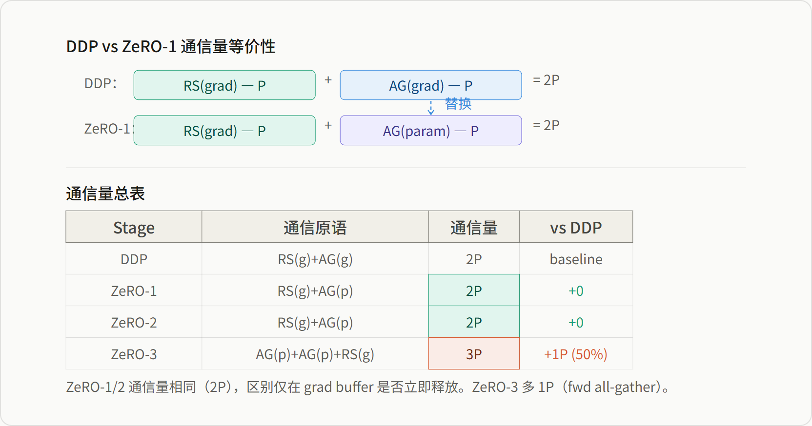
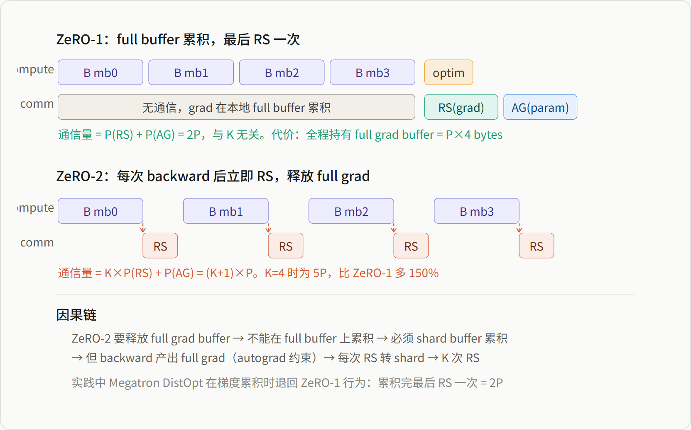
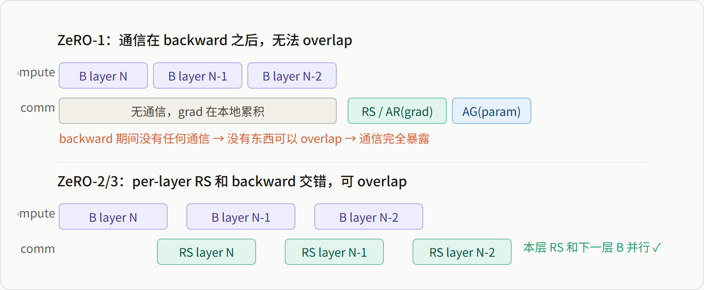
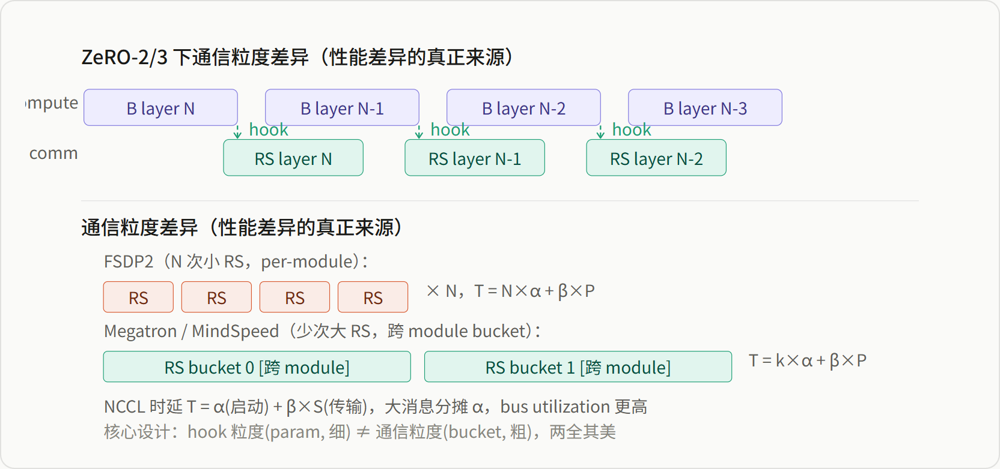
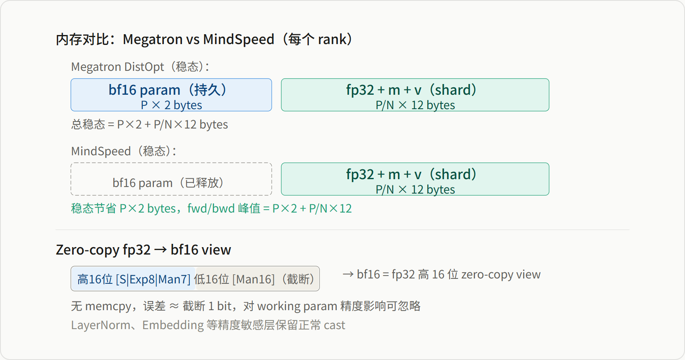
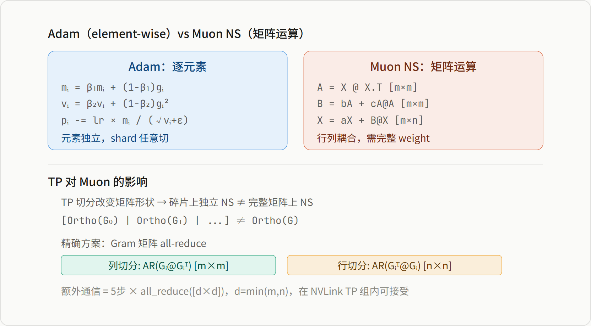
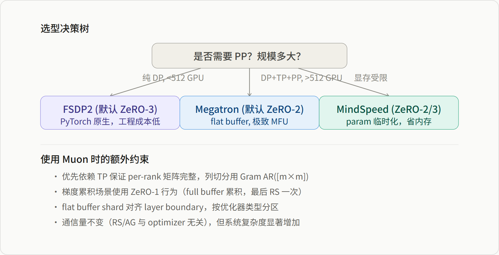

# 分布式优化器深度解析

*FSDP2 · ZeRO · Megatron/MindSpeed 实现原理 · Adam/Muon 对比*

> 本报告从通信原语、内存布局、overlap 机制三个维度，系统分析 FSDP2、Megatron DistOpt、MindSpeed 的实现差异，并结合 Adam/Muon 两种优化器讨论非 element-wise 优化器对分布式训练体系的影响。

**目录**

-   ZeRO 分片体系：通信量与内存统一分析
-   梯度累积对 ZeRO-1 vs ZeRO-2 的影响
-   FSDP2 / Megatron / MindSpeed 实现对比
-   MindSpeed 扩展优化：param 临时化与 zero-copy
-   优化器内存估算：Adam vs Muon
-   Muon 实现细节与非 element-wise 优化器的影响
-   结论与选型建议

## 一 ZeRO 分片体系：通信量与内存统一分析

### 1.1 核心前提：all-reduce 的可拆分性

所有 ZeRO 优化的起点：

> all-reduce(grad) = reduce-scatter(grad) + all-gather(grad)  
> 通信量 **2P** = **P** + **P**

### 1.2 ZeRO-1："零额外通信"的因果链

```
因为：optimizer state（master weight + m + v）被按 rank 切片
  ↓ 所以：每个 rank 只能更新自己负责的那段 param shard
  ↓ 所以：每个 rank 只需要自己那段的 grad shard
  ↓ 所以：梯度归约用 reduce-scatter（RS 恰好给出每个 rank 需要的那段）
  ↓ 每个 rank 拿到 grad shard → 用本地 optimizer state 更新 param shard
  ↓ 但 forward 需要完整 param → all-gather(param shard) 还原
```

> **"零额外通信"的本质**：不是不通信，而是用 AG(param) 替换了 AG(grad)。DDP 的 AG(grad) 是为了让每个 rank 拿到全量梯度做全量更新；ZeRO-1 不需要全量梯度（只更新 shard），省掉 AG(grad)，但需要 AG(param) 还原 full param。两者传输量完全相同（都是 P 个元素），位置不同，量不变。



*图 1：ZeRO 各 stage 通信原语与通信量对比*

## 二 梯度累积对 ZeRO-1 vs ZeRO-2 的影响

在有梯度累积（K 个 micro-batch）时，ZeRO-1 和 ZeRO-2 产生**本质的通信量区别**。核心在于：backward 产出的 grad 是 full size 的（autograd 的物理约束），累积在哪个 buffer 上决定了你是 ZeRO-1 还是 ZeRO-2。



*图 2：梯度累积场景下 ZeRO-1 vs ZeRO-2 通信量差异*

| K（micro-batch 数） | ZeRO-1 | ZeRO-2 | ZeRO-2 额外开销 |
| --- | --- | --- | --- |
| K=1（无累积） | 2P | 2P | +0 |
| K=4（PP 常见） | 2P | 5P | +3P（150%） |
| K=8 | 2P | 9P | +7P（350%） |
| K=16 | 2P | 17P | +15P（750%） |

> **Megatron 的混合行为**：在梯度累积场景下，Megatron 对中间 micro-batch 采用 ZeRO-1 行为（本地累积，无通信，无 overlap），仅在最后一个 micro-batch 切换到 ZeRO-2（per-bucket RS，有 overlap）。这意味着梯度累积期间的 backward 无法受益于通信-计算重叠。

## 三 FSDP2 / Megatron / MindSpeed 实现对比

### 3.1 Overlap 的前提条件

> **Overlap 的前提**：通信被按 bucket/module 拆成多次，和 backward 计算交错进行。ZeRO-1（累积完一次性通信）下通信发生在所有 backward 之后，无法 overlap。只有 ZeRO-2/3 的 per-layer RS 或 DDP 的 bucket all-reduce 才能和 backward 交错，实现真正的计算-通信重叠。

在 ZeRO-2/3 配置下，三个框架的 overlap 机制本质相同：backward hook 触发异步通信，双 CUDA stream 流水。差异在 bucket 策略。

### 3.2 ZeRO-1 vs ZeRO-2/3 的 overlap 差异



*图 3a：ZeRO-1 无 overlap vs ZeRO-2/3 有 overlap*

### 3.3 ZeRO-2/3 下的通信粒度差异

在 ZeRO-2/3 配置下，三个框架 overlap 机制同构（hook + 双 stream），差异在通信粒度：



*图 3b：ZeRO-2/3 下的通信粒度差异*

### 3.4 三者全局对比

> **ZeRO stage 是配置选项，不是框架固有属性。**FSDP2 和 Megatron 都可以配置不同的 ZeRO stage。下表列出的是各自最常用的默认配置。

| 维度 | FSDP2 | Megatron DistOpt | MindSpeed |
| --- | --- | --- | --- |
| 默认 ZeRO stage | ZeRO-3（可配 ZeRO-2/DDP） | ZeRO-2（可配 ZeRO-1/DDP） | ZeRO-2/3 混合 |
| bf16 param | sharded P/N×2 | full P×2（持久） | 临时，仅 fwd/bwd |
| fp32+m+v shard | P/N×12 | P/N×12 | P/N×12 |
| 总通信量 | 3P (AG+AG+RS) | 2P (RS+AG) | 3P (AG+RS+AG) |
| hook 粒度 | module 级 | param 级 | param 级 |
| 通信消息粒度 | per-module（小） | bucket（大） | bucket（大） |
| NCCL bus util | 低（多次小 msg） | 高（大 msg） | 高（大 msg） |
| fwd 额外通信 | AG（ZeRO-3） | 无 | AG（可 overlap） |

## 四 MindSpeed 扩展优化：param 临时化与 zero-copy

MindSpeed 的核心思想：bf16 working param 不再持久化，而是 fp32 shard all-gather 后 cast 的临时视图。



*图 4：MindSpeed param 临时化与 zero-copy view 原理*

### Param 生命周期

```
def pre_forward_hook(self):
    bf16_param = all_gather_and_cast(self.fp32_shard)  # 按需分配, comm_stream
    param.data = bf16_param                             # 指向新分配 buffer

def post_backward_hook(self):
    reduce_scatter(grad_buffer)                         # 同 Megatron bucket RS
    del param.data                                      # 立即释放 bf16 buffer
```

## 五 优化器内存估算：Adam vs Muon

Muon 基于 Nesterov momentum + Newton-Schulz 正交化，正交化是 in-place 操作，不引入持久状态。只有一阶矩 m，没有二阶矩 v，比 Adam 少 4 bytes/param。

| 张量 | 精度 | bytes/param | Adam | Muon |
| --- | --- | --- | --- | --- |
| bf16 working param | bf16 | 2 | ✅ | ✅ |
| fp32 gradient | fp32 | 4 | ✅ | ✅ |
| fp32 master weight | fp32 | 4 | ✅ | ✅ |
| 一阶矩 m | fp32 | 4 | ✅ | ✅ |
| 二阶矩 v | fp32 | 4 | ✅ | ❌ |

### 各 ZeRO stage 每 rank 的 bytes/param

| Stage | Adam | Muon | 节省公式 | N=8 | N=64 |
| --- | --- | --- | --- | --- | --- |
| 无 ZeRO | `2+4+4+4+4 = **18**` | `2+4+4+4 = **14**` | 4/18 | 22.2% | 22.2% |
| ZeRO-1 | `6 + 12/N` | `6 + 8/N` | 4/(6N+12) | 6.7% | 1.0% |
| ZeRO-2 | `2 + 16/N` | `2 + 12/N` | 4/(2N+16) | 12.5% | 2.8% |
| ZeRO-3 | `18/N` | `14/N` | 4/18 | 22.2% | 22.2% |

> **节省比例随 N 变化**：Muon 省掉的是 v 的 4 bytes/param。在 ZeRO-1/2 下，v 被 N 除（4/N），但 working param（2 bytes）和 grad（4 bytes，ZeRO-1）不被除，这些未分片部分在总量中占主导，所以 Muon 的**相对节省比例随 N 增大而急剧缩小**。只有无 ZeRO 和 ZeRO-3 下节省比例恒定 22.2%——因为分子分母同除 N，比例不变。

> **快速心算口诀**：Adam 无 ZeRO = 18 bytes/param，Muon = 14（省 4）。ZeRO-2 把 optimizer state+grad 除以 N，保留 2 bytes working param。ZeRO-3 整体除以 N。N 较大时（如 64），ZeRO-1/2 下 Muon 的绝对节省只有 4/N ≈ 0.06 bytes/param，占比很低。

## 六 Muon 实现细节与非 element-wise 优化器的影响

### 6.1 Newton-Schulz 核心代码

```
def newtonschulz5(G, steps=5):
    a, b, c = (3.4445, -4.7750, 2.0315)
    X = G.bfloat16()
    X /= X.norm()                    # 归一化
    if G.size(0) > G.size(1):
        X = X.T                       # 确保 rows ≤ cols
    for _ in range(steps):
        A = X @ X.T                   # ← 矩阵乘！需要完整行
        B = b * A + c * A @ A         # ← 矩阵乘！
        X = a * X + B @ X             # ← 矩阵乘！
    if G.size(0) > G.size(1):
        X = X.T
    return X
```

### 6.2 Element-wise vs 矩阵运算



*图 5：Element-wise vs 矩阵运算对分布式训练的影响*

### 6.3 Muon 对分布式训练的系统性影响

> **影响 1：flat buffer shard 不再自由** — Adam 时代 flat buffer 可按字节均分，Muon 要求 shard 边界对齐 layer boundary（不能切断 weight matrix）。

> **影响 2：梯度累积推向 ZeRO-1** — NS 是非线性操作：NS(G₁)+NS(G₂) ≠ NS(G₁+G₂)。必须先在 full buffer 上累积所有 micro-batch 的 grad，做一次 NS，再 RS。

> **影响 3：混合优化器** — Muon 只对 2D weight matrix 有效。embedding、LayerNorm、bias 仍用 Adam。flat buffer 需按优化器类型分区。

### 6.4 Adam vs Muon 完整对比

| 维度 | Adam | Muon |
| --- | --- | --- |
| 通信量（RS+AG） | 与 ZeRO stage 对应 | **完全相同** |
| Optimizer step 依赖 | 无（element-wise） | 有（矩阵乘，需完整 weight） |
| Flat buffer 切分 | 任意切 | 需对齐 layer boundary |
| 梯度累积 | ZeRO-1 或 ZeRO-2 均可 | 推向 ZeRO-1 |
| TP 交互 | 无影响 | 需 Gram all-reduce |
| 内存 | 18 bytes/param（无 ZeRO） | 14 bytes/param，节省 4 bytes（ZeRO-1/2 下占比随 N 缩小） |
| 适用参数 | 所有参数 | 仅 2D weight，其余仍需 Adam |

## 七 结论与选型建议



*图 6：选型决策树与 Muon 约束*

> **一句话总结**：Adam 的 element-wise 性质让 ZeRO 的所有切分策略"免费"——shard 之间零依赖。Muon 的矩阵运算打破了这个假设，迫使系统要么依赖 TP 保证 per-rank 矩阵完整，要么 shard 对齐 layer boundary，要么引入额外通信。这是非 element-wise 优化器对分布式 infra 的根本性挑战。
