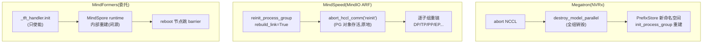

# 训练快恢与「重新建链」对比 — Megatron / MindSpeed / MindFormers

> **代码基线**:Megatron-LM `dev` @ `232c478d4` · MindSpeed `master` @ `1432cb09` · MindSpeed-LLM `master` @ `0c16322d` · MindFormers `master` @ `01e71622` · torch_npu(本机 checkout)。
> 本页回答一个具体问题:**当故障节点被更换、训练拓扑变化时,三家框架如何做快恢(快速恢复),尤其是如何「重新建链」——重建 torch.distributed / HCCL 通信域?** 每条结论都带 `file:line` 事实依据;无法在源码看到的(闭源 NVRx / MindIO / MindSpore runtime)显式标注边界。

---

## 0. 一句话结论

| 框架 | 快恢范式 | 「重新建链」机制 | 进程是否存活 | 替换节点接入 | 状态来源 |
|---|---|---|---|---|---|
| **Megatron-LM** | NVRx 进程内重启(in-process restart) | abort NCCL → `destroy_model_parallel` → 新 `PrefixStore` 命名空间重跑 `init_process_group` | **进程存活**,但 Python 全局状态销毁重建 | 同一 allocation 内的 **热备(reserve)rank** 顶替 | NVRx 本地/内存 ckpt(+`--replication`)或磁盘 ckpt |
| **MindSpeed(+LLM)** | MindIO TFT / **ARF「空中加油」** | `torch_npu.distributed.reinit_process_group(rebuild_link=True)` → `abort_hccl_comm` **原地重建** HCCL 通信域 | **进程 + PG 对象都存活** | reboot 进程保留 **global rank**,reinit 重建 HCCL | 同伴 DP rank 的 **replica** 拷回优化器态,或磁盘 |
| **MindFormers** | 委托 MindSpore runtime + MindIO | **无自有建链代码**;`_tft_handler.init` 使能 ARF,运行时内部重建 | 是(由 runtime 保证) | reboot 节点跳 barrier,等 runtime 重建 | runtime 原地恢复;非 reboot 节点不重载 ckpt |

三句话:
- **Megatron 销毁后重建**——同进程里把通信组全销毁,换一个 store 命名空间从头 `init_process_group`,靠预留的热备 rank 顶上。
- **MindSpeed 原地修补**——不销毁 PG 对象,直接 `abort_hccl_comm` 把底层 HCCL 通信子 abort 掉再懒重建,故障 rank 的优化器态从同伴 replica 拷回,这就是「空中加油」。
- **MindFormers 全权委托**——Python 侧只负责"使能 + 配置 + reboot 节点跳 barrier",真正的建链在闭源 MindSpore runtime 里。

---

## 1. Megatron-LM:NVRx 进程内重启

**Thesis**:Megatron 自己不实现容错,全部委托 NVIDIA `nvidia_resiliency_ext`(NVRx)。「快恢」有两档:`--enable-ft-package`(段心跳检测,恢复靠外部 `ft_launcher` 整进程重拉)与 `--inprocess-restart`(**同进程内重启**,不退出 Python 进程)。后者才是"重新建链"的关键路径。

**检测**:FT 模式下 `ft_integration.setup()` 建 `RankMonitorClient`,把 "setup"/"step"/"checkpointing" 包成计时段(`megatron/training/ft_integration.py:83-118`),超时=hang、漏心跳=死节点——但心跳/超时循环在 NVRx 内,不在本仓。inprocess 模式的健康检测由 `inprocess.Wrapper` 的 `heartbeat_timeout`/`soft_timeout`/`CudaHealthCheck` 配置(`megatron/training/inprocess_restart.py:111-122`)。

**重新建链(in-process)**:`inprocess.Wrapper(...)(train)` 把整个 `pretrain` 包起来,在**同一进程**里循环重跑(`inprocess_restart.py:102-125`;`pretrain_gpt.py:458` 接入)。故障时:
1. **abort**:`inprocess.Compose(AbortTransformerEngine, AbortTorchDistributed, AbortCheckpoint, NestedRestarterHandlingStarting)`(`inprocess_restart.py:93-98`)——`AbortTorchDistributed` abort 掉在途 NCCL 集合通信。
2. **destroy**:`finalize` → `training.destroy_global_state()` → `destroy_model_parallel()`(`inprocess_restart.py:69-71`、`training.py:286-292`),销毁所有 TP/PP/DP 组。
3. **rebuild**:重入 `pretrain` 时把 base store 包成 `PrefixStore(str(iteration), store)`(`training.py:1088-1090`)——**每次重启换一个 key 命名空间**,避免与上一轮的残留 store key 撞车;随后 `initialize_megatron(store=…)` → `_initialize_distributed(...,store)` → `init_process_group(store=store,…)`(`megatron/training/initialize.py:316-333`),再 `mpu.initialize_model_parallel` 重建子组。base store 是常驻 `TCPStore`(端口 `MASTER_PORT+1`,`inprocess_restart.py:137-145`)。

**状态来源**:NVRx 本地/内存 ckpt(`--non-persistent-ckpt-type local`,`arguments.py:439-445`;`checkpointing.py:1399-1443`),配 `--replication` 跨节点冗余,让替换 rank 能恢复死节点的分片;或回退磁盘 ckpt。

**替换节点接入**:**同一 allocation 内的热备**——启动时 `WORLD_SIZE > --inprocess-active-world-size`,多出的 rank 标 `LayerFlag.RESERVE`(`inprocess_restart.py:50-67`、`arguments.py:2972-2979`),`rank_assignment=inprocess.rank_assignment.Tree` + `RetryController(min_world_size=...)` 把热备 rank 提上来。**不是外部新节点动态加入,而是预留热备顶替。**

> **闭源边界(NVRx,只 import 不在本仓)**:心跳/超时检测循环、`AbortTorchDistributed` 的 NCCL communicator abort 内部、`rank_assignment.Tree` 提升算法、`RetryController` 重 rendezvous、`ft_launcher` 重拉。

---

## 2. MindSpeed + MindSpeed-LLM:MindIO TFT / ARF「空中加油」

**Thesis**:MindSpeed-LLM 的快恢由**闭源 MindIO `mindio_ttp`** 驱动检测与编排,回调进框架侧 Python 处理函数;真正的「重新建链」用昇腾原语 `torch_npu.distributed.reinit_process_group(group, rebuild_link=True)` **原地** abort + 懒重建每个 HCCL 通信子,**进程与 PG 对象都不销毁**——这就是 ARF(Air-Refueling,空中加油)。注意:MindSpeed core 另有一套**自研** `core/ttp/`(心跳 + socket 控制面,无 MindIO,grep `import mindio` 为空),那是 verl/RLHF 用的、基于重启的不同路径;ARF 答案在 MindSpeed-LLM `core/high_availability/`。

**检测**:闭源。`tft_init_controller`/`tft_start_controller`/`tft_init_processor`/`tft_start_processor`(`mindspeed_llm/core/high_availability/tft_train_initialize.py:61-65`)把检测交给 MindIO。(自研路径的检测在 `mindspeed/core/ttp/comm/heartbeat.py:248-257`、`controller.py:491-643`。)

**MindIO 边界 vs 框架**:MindSpeed-LLM 只向 MindIO **注册回调**:save/rename/stop/clean/repair/rollback/**rebuild_group**/stream_sync(`tft_train_initialize.py:97-107`),以及弹性 "zit" 句柄 `downgrade_rebuild=scale_in`、`upgrade_rebuild=scale_out`(`elastic_training_register.py:18-33`)。**MindIO 决定何时,框架决定怎么做。**

**重新建链(原地,空中加油)**:注册的 `rebuild_group` 句柄是 `arf_rebuild_process_group_callback`(`tft_arf_group_repair.py:31`)。它对默认 PG 调 `torch.distributed.reinit_process_group(group=None, rebuild_link=True)`(`:47`),再对每个 Megatron 子组同样重链——DP `:126`、DP-CP `:147`、CP `:165`、MP `:172`、TP `:179`、PP `:189`、expert `:208-329`。原语本身(`torch_npu/torch_npu/distributed/distributed_c10d.py:346-372`):`rebuild_link=True` + hccl 时 `_delete_tcpstore_key()` 后对**现有 pg** 执行 `abort_hccl_comm("reinit")`(`:370`)——进程与 Python PG 对象存活,只重建 HCCL 域;GLOO 子组则走销毁+`create_group` 重建(`:131-139`)。reboot 节点(被替换的)`update_arf_reboot_flag(True)` 把 `args.load`/`pretrained_checkpoint` 置 None(`tft_arf_group_repair.py:107-118`),转而从同伴 replica 取态。

**三种模式之分**:
- **UCE/ARF 原地修复**:`clean_callback`(`tft_stop_clean.py:24-57`)检 `check_uce_in_memory`,LOW 不重建/HIGH 改安全张量后重建;`clean_type=="retry"` 时 `reinit_process_group(rebuild_link=False)` → `resume_hccl_comm`(恢复而非重建)。
- **ARF 进程重启(节点被换)**:`tft_is_reboot_node()` → reboot 进程重入并重建链(`tft_train` 抛 `"ARF FINISH"`,`tft_arf_group_repair.py:122-123`)。
- **Elastic 弹性伸缩(拓扑真变)**:scale-out `destroy_all_process_group` + 全新 `init_process_group`(`elastic_training_scale_out_rebuild.py:128-167,234-239`);scale-in 建 `SCALE_IN_WORLD_GROUP` 与去除故障 rank 的新 DP 组(`elastic_training_scale_in_rebuild.py:56,235-271`)。

**状态来源(replica 冗余)**:`REPLICA_NUM=2`(`tft_replica_group.py:26`),每个 DP-CP 组拆成两份镜像 replica(`build_dp_cp_replica_group:84-110`),同伴 DP rank 持有冗余优化器副本。修复时建 `REPAIR_GROUP` 用 HCCL `send`/`recv` 把 `param`/`exp_avg`/`exp_avg_sq` 从健康 replica 拷到被修复 rank(`tft_optimizer_data_repair.py:86-175`、`tft_replica_optimizer.py:188-227`)。**所以换节点甚至不必读磁盘 ckpt——同伴内存里就有冗余副本。**

> **闭源边界(MindIO `mindio_ttp`)**:检测内部、controller/processor 状态机、所有 `tft_register_*` 派发、修复计划(src/dst rank 选择)、以及 C++ 的 `abort_hccl_comm`/`resume_hccl_comm` 实现(仅 torch_npu Python 包装可见)。

---

## 3. MindFormers:委托 MindSpore runtime + MindIO

**Thesis**:MindFormers **不实现**故障检测、恢复或 HCCL 重新建链。它只是(基于外部设置的 `MS_ENABLE_TFT` 环境变量)**使能** MindSpore 的 TFT/TRE/ARF/UCE,并把 ckpt save/load 钩进 MindSpore 的 `TrainFaultTolerance` 回调;节点更换、通信域重建、原地恢复全部发生在闭源 MindSpore runtime + MindIO 内。

**使能位点**:MindFormers 只**读** `MS_ENABLE_TFT`(从不设置它)。`check_tft_valid()` 在 `TTP:1`/`UCE:1`/`ARF:1`/`HCCE:1` 任一存在时判 TFT 开启(`mindformers/version_control.py:241-245`);唯一的 ARF 使能点 `core/context/build_context.py:346-352`:当 `ARF:1` 时 `from mindspore.utils import _tft_handler; _tft_handler.init(config=...)`。优化器由 MindSpore TFT 包装:`core/optim/build_optim.py:35-38` → `TrainFaultTolerance.get_optimizer_wrapper(optim_cls)`。

**重新建链**:MindFormers 侧**没有任何** HCCL 组重建代码。Python 侧唯一与"建链进行中"相关的证据是 reboot 节点感知:`check_is_reboot_node()`(`version_control.py:275-286`,调 `mindspore._c_expression.is_reboot_node`),被替换("reboot")节点在 runtime 重建通信域期间**跳过集合通信 barrier**——`skip_barrier_controller()`(`version_control.py:289-301`,如 dataloader `blended_megatron_dataloader.py:168`)。重建本身在 runtime 内。

**恢复模式**:
- **原地 ARF(不重启,runtime 重建链)**:`ARF:1` 选中,`_tft_handler.init` 跑起来;reboot 节点被挡在 ckpt 重载之外(因 runtime 原地恢复其态),`base_trainer.py:1143,1576` 都用 `not check_is_reboot_node()` 守卫;`check_arf_status(cb_params)`(`callback.py:1792-1796`)让恢复节点与同伴保持 ckpt 保存同步。
- **Ckpt-resume(整进程重启,全新通信域)**:TFT 关闭时的基线回退,走 `transform_and_load_checkpoint`/`load_checkpoint`(`base_trainer.py:1553-1581`)。

**MindIO 在 MindFormers 的角色**:仅**加速 ckpt 预加载**(`trainer/utils.py:32,128-167` 的 `mindio_preload`/`set_mindio_server_info`),**不**做建链。

> **闭源边界(MindSpore/MindIO)**:`_tft_handler`(`mindspore.utils`)、`TrainFaultTolerance`(`mindspore.train.callback`)、`is_reboot_node`(`mindspore._c_expression`)——故障检测、节点更换、**HCCL 重新建链**全在其中,本仓不可见。

---

## 4. 横向对比:三种「重新建链」哲学

| 维度 | Megatron | MindSpeed | MindFormers |
|---|---|---|---|
| 建链代码归属 | NVRx(闭源)+ 本仓编排 | torch_npu 原语 + MindSpeed-LLM 回调(可见)+ MindIO 编排(闭源) | 全在 MindSpore runtime(闭源) |
| 重建粒度 | 全 destroy 后重建 | **逐子组原地 abort+懒重建** | runtime 决定 |
| 进程是否退出 | 否(in-process)但 Python 态全销毁 | 否,**连 PG 对象都不销毁** | 否(ARF) |
| 死 rank 状态恢复 | 本地/内存 ckpt + replication | **同伴 DP rank 的 replica 拷回(可不读盘)** | runtime 原地恢复 |
| 拓扑真变(增删节点) | reserve 热备顶替 | elastic scale-in/out 全重建 | runtime 侧 |
| 可在源码看到的深度 | 高(编排逻辑在本仓) | **最高(连 HCCL abort 包装都可见)** | 低(只看到使能点) |

**给读者的判断**:若要研究"重新建链到底怎么发生",**MindSpeed-LLM `core/high_availability/` 是唯一能在 Python 层看全链路的**(直到 torch_npu 的 `abort_hccl_comm` 包装);Megatron 的编排可见但 NCCL abort 在 NVRx;MindFormers 几乎全黑盒。三者对"节点更换"的共性是:**尽量不退出进程、不重读磁盘**,差别在于 Megatron 销毁重建 + 热备、MindSpeed 原地修补 + replica、MindFormers 交给运行时。

---

## Related Pages

- [[mindspeed/index]] —— MindSpeed 特性总览(TTP/high-availability 归此栈)
- [[mindformers/index]] —— MindFormers(MindSpore 生态)
- [[megatron-lm/index]] —— Megatron-LM(NVRx 容错宿主)
- [[distributed_optimizer_deep_dive]] —— 优化器态分片(replica 冗余建立在其上)
- [[02_engineering/02_train_frameworks/index]] —— 训练框架目录索引
