# Megatron-LM 软件架构分析：设计目标、模块分层与使用场景

> **源码基线**：`NVIDIA/Megatron-LM@85902ef599ea4eb06ada7567a479c524b605767a`（`dev`，2026-09-01）
> **分析范围**：Overview。本文覆盖冻结仓库的整体能力、静态模块、层间数据流、代码目录映射和顶层使用场景；各并行轴、模型、优化器与 checkpoint 的算法细节交给专题页。
> **核心证据入口**：`README.md::Project Structure`、`docs/get-started/overview.md`、`pretrain_gpt.py::__main__`、`megatron/training/training.py::pretrain`、`megatron/core`、`megatron/inference`、`megatron/post_training`、`megatron/rl`、`megatron/elastification`、`experimental/lite`
> **最近更新**：2026-09-03。按“背景与原理 → 静态架构 → 模块概要设计 → 代码目录 → 全部顶层场景”重建全文，并统一补充 ASCII 函数调用树与场景执行命令。

---

## 1. 软件背景与设计原理

### 1.1 背景介绍

Megatron 面对的不是“怎样实现一个 Transformer 层”这一单点问题，而是三个同时发生的系统压力：

1. **模型容量超过单卡边界。** 参数、激活、优化器状态和 KV 状态无法由一块 GPU 独立承载，计算必须沿 tensor、pipeline、data、expert、context 等维度拆分。
2. **扩展规模会暴露通信和调度成本。** 把模型切开只解决“放得下”；要获得吞吐，还要安排 microbatch、梯度同步、参数聚合、重计算、融合和混合精度。
3. **训练是一个长期、有状态、可恢复的过程。** 配置、并行拓扑、数据进度、模型参数、优化器状态和随机数状态必须在保存与恢复时对齐到同一个逻辑 iteration。

官方概览把 **Megatron Core** 定位为可组合、GPU 优化的大规模生成式 AI 训练组件库，把 **Megatron-LM** 定位为使用这些组件的轻量参考训练框架（`docs/get-started/overview.md::Megatron Core`、`docs/get-started/overview.md::Megatron-LM`）。因此这个仓库同时服务两类读者：一类直接运行现成训练入口，另一类把 MCore 的模型、并行、优化器和 checkpoint 组件嵌入自己的框架。

当前实现的设计目标可以概括为：

- **规模扩展**：让单个逻辑模型跨大量 GPU 放置并执行；
- **高吞吐**：用并行时序、通信重叠、融合算子和低精度减少暴露成本；
- **可组合**：让模型规格、并行策略和后端实现可以独立替换；
- **端到端可运行**：提供从参数解析、数据、训练、验证到保存恢复的参考生命周期；
- **场景复用**：让相同模型与分布式状态继续服务推理、后训练、RL、导出和弹性训练。

为了避免把“功能列表”误当成“软件分层”，本文只使用一个分类轴：**按抽象级别与向下依赖方向划分软件层**。上层表达用户目标，下层逐步把目标落实为组件、分布式语义、后端调用和设备执行；同一层内再列功能模块。由此得到七层主架构：

| 层级 | 分层判据 | 主要代码或依赖范围 | 对上提供 / 向下委托 |
|---|---|---|---|
| 1. 场景入口层 | 是否直接承接用户命令、recipe 或离线作业 | 根目录 `pretrain_*.py`、`train_rl.py`、`examples/`、`tools/` | 提供可执行入口；向下传入配置、provider、request 或工件路径 |
| 2. 应用编排层 | 是否拥有一个完整场景的生命周期与完成条件 | `megatron/training/`、`megatron/inference/`、`megatron/post_training/`、`megatron/rl/`、`megatron/elastification/`、`tasks/` | 提供 train/request/rollout/transform 等控制面；向下编排 MCore 对象 |
| 3. MCore 可组合组件层 | 是否定义与场景控制循环解耦的领域对象 | `megatron/core/models/`、`transformer/`、`ssm/`、`datasets/`、`tokenizers/`、`inference/`、`post_training/`、`export/` | 提供模型、数据、推理与转换构件；向下声明分布式执行需求 |
| 4. MCore 分布式执行层 | 是否拥有 rank 身份、通信组、跨 rank 时序、参数提交或分片状态语义 | `parallel_state.py`、`process_groups_config.py`、`tensor_parallel/`、`pipeline_parallel/`、`context_parallel_layout/`、`distributed/`、`optimizer/`、`resharding/`、`dist_checkpointing/` | 提供并行放置、forward/backward、同步、更新与恢复合同；向下请求 kernel 和 collective |
| 5. 加速适配层 | 是否把统一组件接口绑定到具体融合实现、精度或可选加速库 | `megatron/core/extensions/`、`fusions/`、`quantization/`、`fp8_utils.py`、`fp4_utils.py`、CUDA Graph 适配 | 提供 TE/local/fused/FP8/FP4 等实现选择；向下调用框架和设备运行时 |
| 6. 基础框架层 | 是否提供张量、自动微分、编译与分布式基础 API | 仓库外部的 PyTorch、`torch.distributed` | 提供 tensor/autograd/process-group API；向下驱动通信库和设备运行时 |
| 7. 设备与通信基础设施层 | 是否实际执行 GPU kernel、设备互联和跨节点通信 | CUDA、NCCL、NVIDIA GPU、NVLink、InfiniBand 等 | 完成设备计算和数据搬运；是主依赖链的物理底座 |

这七层是后续章节唯一采用的主分层口径。它既说明仓库内代码，也把仓库代码最终依赖的框架和基础设施显式画出来，但不把所有“能做什么”横向摊成层。

两类内容故意放在主层级之外：

- **Megatron Lite 是实验纵切。** `experimental/lite` 自己定义 runtime、native model 和 training primitive，从入口贯穿到执行适配；它会共享或包装部分 MCore primitive，但不是主架构中的“第八层”。
- **外部生态是侧接能力。** Energon、ModelOpt、TensorRT-LLM、NVRx 分别在数据、后训练/压缩、部署导出和容错边界接入；它们不是沿同一抽象轴排列的上下层。

从能力范围看，冻结提交覆盖预训练、MCore 嵌入、文本数据生产、后训练、推理、研究型 RL、分布式 checkpoint、TRT-LLM 导出、弹性训练、Lite 实验运行时和诊断工具；但“仓库中有入口”不等于任意组合都形成稳定合同。目标硬件主要是 NVIDIA GPU，部分能力依赖 Transformer Engine、ModelOpt、Energon、TensorRT-LLM 或 resiliency extension，`dev` 分支中的实验接口也允许变化。

### 1.2 设计原理分析

源码没有一份覆盖全仓的正式架构决策记录。下面是依据官方定位、实际依赖方向、构造顺序和 guard 反推的架构解释；“压力”和“被放弃方案”属于分析者重建，不应当作 NVIDIA 的原始设计记录。

| 对应层间边界 | 设计压力 | 被放弃的直观方案 | 当前设计与验证判据 |
|---|---|---|---|
| 场景入口层 → 应用编排层 | GPT、Hybrid、VLM、工具作业的用户意图不同，但初始化、恢复和退出不能各自漂移 | 每个入口复制一套生命周期 | 入口只声明配置与 callback，编排层拥有完成顺序；判据是换模型入口不需要复制 `pretrain`、request loop 或 checkpoint 生命周期 |
| 应用编排层 → MCore 可组合组件层 | 既要提供可直接运行的参考框架，又要让第三方框架复用核心构件 | 把模型、数据、推理 engine 全部写进训练控制器 | 上层负责“何时做”，MCore 组件负责“构造什么”；判据是 `examples/run_simple_mcore_train_loop.py` 可绕过 `megatron.training` 直接组合 MCore |
| MCore 可组合组件层 → MCore 分布式执行层 | 逻辑模型结构不应同时拥有 rank 几何、microbatch 时序和 collective 顺序 | 在每个模型类里分别实现 TP/PP/DP 控制循环 | 模型通过 config、`ModuleSpec` 和 process groups 声明需求，执行层集中拥有 rank 与时间语义；判据是同一模型结构可被不同 schedule 和 wrapper 消费 |
| MCore 分布式执行层内部 | 多维并行要同时解决容量、吞吐和状态规模 | 为每种 TP×PP×CP×EP×DP 组合维护专用实现，或由各模块临时建 group | `RankGenerator`/`ProcessGroupCollection` 先统一空间映射，schedule 再组织时间；判据是所有 rank 共享兼容的 group 创建与 collective 顺序 |
| MCore 可组合组件层 → 加速适配层 | 模型变体乘 TE/local/fused/精度后端会产生组合爆炸 | 把具体 kernel 类硬编码到每个模型 | builder 选择 `ModuleSpec`，extension/fusion 层晚绑定实现；判据是替换实现不改变应用编排和模型外部合同 |
| MCore 分布式执行层 → 加速适配层 | 分布式语义要求稳定，具体 overlap、FP8/FP4 和 fused kernel 受硬件与依赖影响 | 让每个控制循环直接调用外部库私有 API | 执行层定义“需要什么通信/计算”，适配层决定“用哪个实现完成”；判据是依赖缺失或组合不支持时在配置/构造期显式拒绝 |
| 加速适配层 → 基础框架层 → 设备与通信基础设施层 | 上层需要稳定张量与 process-group 抽象，同时必须释放 GPU/NCCL 性能 | Megatron 自建完整 autograd、通信栈和设备运行时 | 复用 PyTorch/`torch.distributed`，再落到 CUDA/NCCL/互联；判据是设备选择、group 建立、kernel 和 collective 最终具有明确的外部执行主体 |
| 主七层 ↔ 外部生态 / Lite 纵切 | 新场景成熟度和生命周期不同，强塞进主层会破坏单一分层轴 | 把 Energon/ModelOpt/TRT-LLM/NVRx 当普通下层，或把 Lite 当主框架的一层 | 外部生态用侧接表示，Lite 用独立纵切表示；判据是它们是否拥有独立安装、API、状态或从入口到执行的完整边界 |

三条贯穿这些边界的实现原则解释了代码为何这样组织：

1. **rank-local 构造。** 当前 rank 根据 PP/TP/EP 身份只构造自己拥有的参数与模块，避免先构造完整模型再裁剪。
2. **执行完成与状态提交分离。** pipeline schedule 完成一个 global batch 的 forward/backward 之后，optimizer 才能提交新参数版本；microbatch 结束不等于 step 完成。
3. **分片状态是一等公民。** model、optimizer、RNG 与进度以 sharded state 表达；保存恢复不依赖 rank 0 聚合一份完整大模型。

因此，后文不会再用“训练流程中的先后步骤”冒充分层。静态分层回答“谁拥有哪类责任”，动态调用链只用于验证这些层怎样协作。

---

## 2. 软件分层与模块交互

### 2.1 总体架构分析

下图是本文的**静态架构定义**。它按第 1 章确定的抽象/依赖轴，把主架构画成七条水平能力带：越靠上越接近用户场景，越靠下越接近执行基础设施。每条带内部才是同一层的功能模块；右侧的生态集成和 Lite 纵切不参与主层编号。

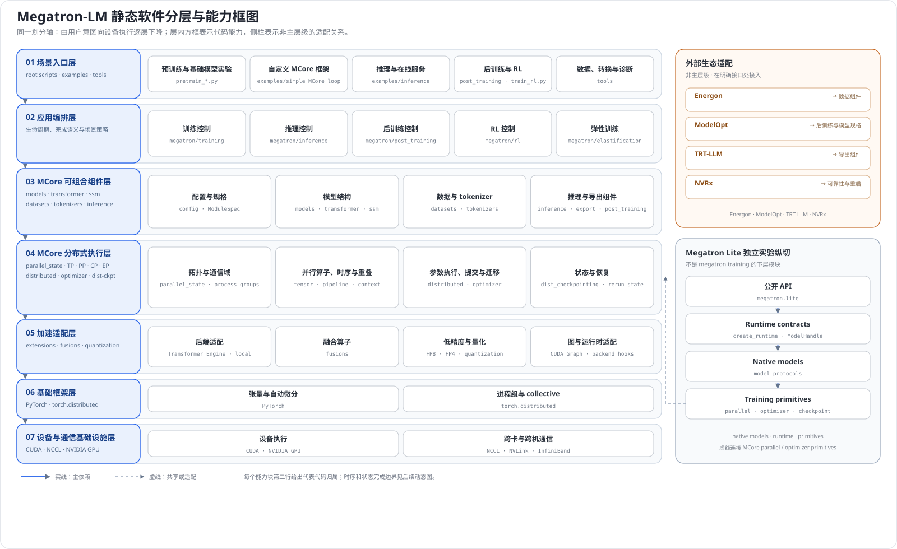

读图时需要区分三种关系：主层之间的实线表示稳定的向下依赖；外部生态的橙色连接表示某一层的可选集成点；Lite 的虚线表示共享或包装 MCore primitive，而不是复用整条 Megatron-LM 训练栈。这样既能快速看到仓库的能力版图，也不会把一次预训练的调用顺序误认成软件架构。

| 层 | 层内模块及代码所有者 | 该层独立拥有的职责 | 交付给相邻层的合同 |
|---|---|---|---|
| 场景入口层 | `pretrain_gpt.py`、`pretrain_hybrid.py`、`pretrain_vlm.py`、`train_rl.py`、`examples/`、`tools/` | 选择场景、收集参数、绑定 dataset/model/forward callback 或工具输入 | 向应用编排层交付已校验配置、callback、request、源/目标工件 |
| 应用编排层 | `megatron.training`、上层 `inference`、`post_training`、`rl`、`elastification` 以及 `tasks/` | 拥有初始化、构造、循环、验证、保存、停止以及场景特有的完成语义 | 向 MCore 组件层请求对象，向分布式执行层提交执行计划；对入口返回训练状态、响应或工件 |
| MCore 可组合组件层 | `core/models`、`transformer`、`ssm`、`datasets`、`tokenizers`、`core/inference`、`core/post_training`、`core/export` | 定义模型结构、数据表示、推理 engine、后训练 hook 和导出表示 | 交付 rank-local model、dataset/iterator、request state、sharded model state 等 typed object |
| MCore 分布式执行层 | `parallel_state`、`ProcessGroupCollection`、TP/PP/CP/EP、DDP/FSDP、optimizer、resharding、dist-checkpoint | 拥有 rank 几何、process group、microbatch 时序、梯度同步、参数提交与分片持久化 | 向组件层返回 tensor/gradient/new parameter state；向适配层发出 kernel、P2P、collective 和精度请求 |
| 加速适配层 | `extensions`、`fusions`、`quantization`、FP8/FP4、CUDA Graph 与 backend hooks | 在不改变上层语义的前提下选择 TE/local/fused/量化实现 | 对上保持模块和 tensor 合同；对下调用 PyTorch、自定义 op 或外部加速库 |
| 基础框架层 | PyTorch tensor/autograd/compiler、`torch.distributed` | 提供图执行、梯度、stream、process-group 和 collective API | 将设备与通信操作下发到 CUDA/NCCL，并把 tensor/event/future 返回上层 |
| 设备与通信基础设施层 | CUDA、NCCL、GPU、NVLink、InfiniBand | 实际执行 kernel、设备内存访问、卡间和节点间传输 | 返回完成事件、设备结果或通信错误，是所有上层完成语义的物理前提 |

这张矩阵与图采用完全相同的层名。后续第 3 章逐层拆开，回答每层“输入什么、内部由谁处理、输出什么、在哪些条件下拒绝执行”。

### 2.2 实现分析：代表性预训练如何穿过七层

预训练是覆盖七层最完整的一条动态路径，适合验证层间合同。下图的 participant 与 2.1 的层级一一对应；它只回答“这一次执行怎样穿层”，不重新定义架构。推理、RL、导出等具有不同完成语义的路径在第 5 章分别展开。

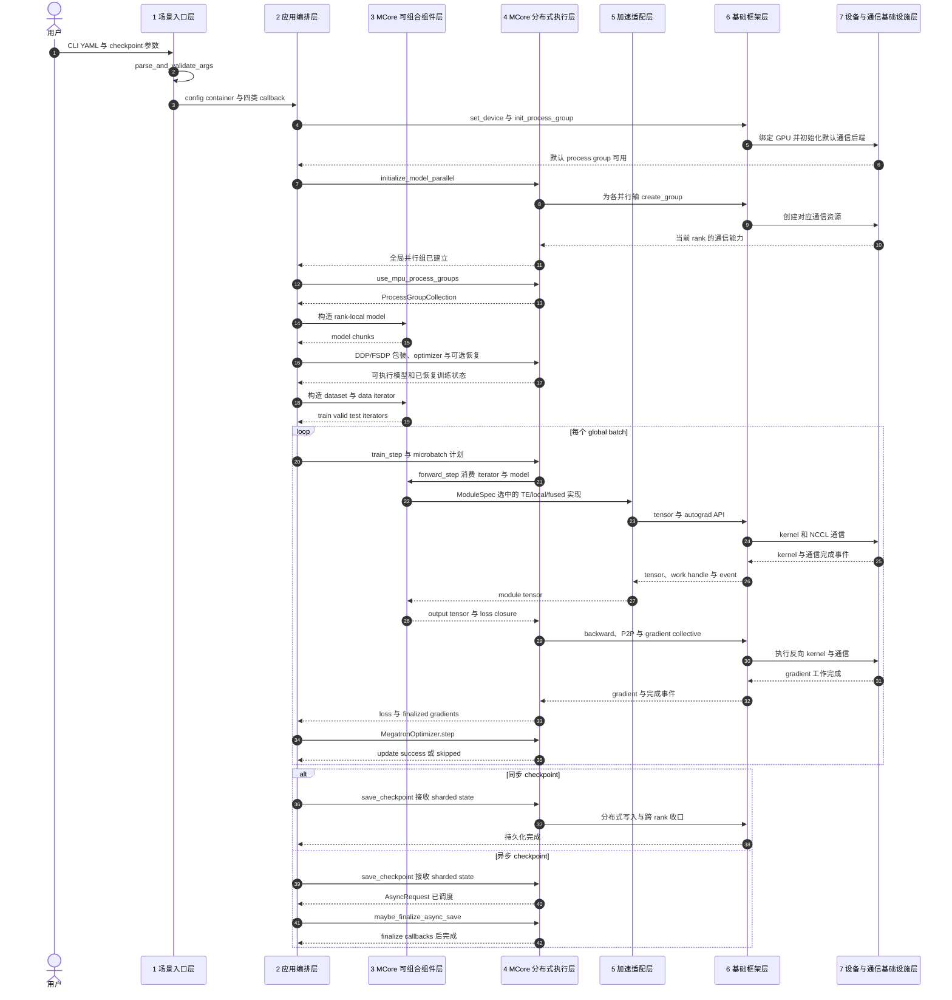

**源码调用流程。** 下面只表示函数调用与条件分支；上面的时序图负责表达七层之间传递的数据和完成信号。

```text
pretrain_gpt.py::__main__
├─ inprocess_restart.maybe_wrap_for_inprocess_restart(training.pretrain)
├─ parse_and_validate_args(...)
├─ pretrain_cfg_container_from_args(args)
└─ training.pretrain(config, dataset_provider, forward_step, model_provider, ...)
   ├─ initialize_megatron(...)
   │  └─ initialize._initialize_distributed(...)
   │     ├─ torch.cuda.set_device(...)
   │     ├─ torch.distributed.init_process_group(...)
   │     └─ parallel_state.initialize_model_parallel(...)
   ├─ setup_model_and_optimizer(...)
   │  ├─ get_model(...)
   │  │  ├─ gpt_builders.gpt_builder(...)
   │  │  │  ├─ _get_transformer_layer_spec(...)
   │  │  │  └─ GPTModel(...)
   │  │  └─ wrap_model_chunks_with_ddp(..., DP=DDP / FSDP)
   │  ├─ get_megatron_optimizer(...)
   │  └─ [配置了恢复源] load_checkpoint(...)
   ├─ build_train_valid_test_data_iterators(...)
   └─ train(...)
      ├─ forward_backward_func = get_forward_backward_func(...)
      ├─ train_step(..., forward_backward_func=forward_backward_func)
      │  ├─ forward_backward_func(model_chunks, data_iterator, num_microbatches, ...)
      │  └─ MegatronOptimizer.step(...)
      ├─ [到达验证间隔] evaluate(...)
      ├─ [到达保存间隔] save_checkpoint_and_time(...)
      │  └─ training.checkpointing.save_checkpoint(...)
      │     └─ core.dist_checkpointing.save(...)
      │        ├─ [同步] 返回时持久化完成
      │        └─ [异步] 返回 AsyncRequest
      └─ [退出前有异步请求] maybe_finalize_async_save(...)
```

入口把 dataset provider、`forward_step`、`model_provider`、embedding-rank 回调和可选 store 作为应用合同交给 `training.pretrain`。legacy provider 分支由 builder 决定模型规格，schedule 则消费 model chunks、data iterator 和 microbatch 数量；只有整个 global batch 的 forward/backward 与梯度收口完成后，optimizer 才能提交参数。同步保存返回时已经完成持久化；异步保存的首次返回只代表任务已调度，tracker、成功日志与外部回调要等 finalize。

层间传递的是有类型、有所有权的对象，而不是模糊的“控制流”：

| 交互对象 | 层间方向 | 合同与完成含义 |
|---|---|---|
| `PretrainConfigContainer` 与 global args | 场景入口层 → 应用编排层 | 用户输入已经补全并经过约束检查；legacy global state 与 typed config 仍需保持一致 |
| `ProcessGroupCollection` | MCore 分布式执行层 → 应用编排层 / 组件层 | 当前 rank 在 TP/PP/CP/EP/DP 等轴上的通信身份已稳定 |
| dataset、iterator 与 `RerunDataIterator` | MCore 可组合组件层 → 应用编排层 / 执行层 | 样本表示、可消费进度与重放位置已确定 |
| `ModuleSpec` 与 model chunks | MCore 可组合组件层 → MCore 分布式执行层 | 当前 rank 实际拥有的计算图、参数和后端选择已确定 |
| output tensor 与 loss closure | MCore 可组合组件层 → MCore 分布式执行层 | 单个 microbatch 的输出以及怎样计算/归约 loss |
| finalized gradients 与 update success | MCore 分布式执行层 → 应用编排层 | global batch 的反向是否完成、参数版本是否真正提交 |
| sharded state dict / `AsyncRequest` | 组件层、执行层内部 → 应用编排层 | 前者描述逻辑训练状态；后者只表示异步保存已调度，不代表已持久化 |

---

## 3. 各软件层与实验纵切的基础概要设计

### 3.1 场景入口层

**层功能与合同。** 这一层是人与系统、外部作业与 Megatron 的边界。输入是 CLI/YAML、recipe、prompt、原始数据或 checkpoint 路径；输出不是模型 tensor，而是交给应用编排层的已校验配置、callback、request 或转换任务。它回答“用户想做什么”，不拥有 process group、训练 iteration 或参数版本。

| 子模块 | 代码位置 | 入口或关键函数 | 功能定位 |
|---|---|---|---|
| 训练与 RL 入口 | 根目录 `pretrain_gpt.py`、`pretrain_hybrid.py`、`pretrain_vlm.py`、`train_rl.py` | `__main__`、`model_provider`、`forward_step`、`train_valid_test_datasets_provider` | 把模型或 RL 场景差异编码成 provider/callback，再进入统一训练编排 |
| 可运行 recipe | `examples/bert/`、`examples/t5/`、`examples/inference/`、`examples/post_training/` | 各示例 `main` 或 `__main__` | 固化一类可执行组合，不重新实现底层并行算法 |
| 离线工具入口 | `tools/preprocess_data.py`、`tools/checkpoint/convert.py`、`tools/report_theoretical_memory.py` | `main` / `__main__` | 把源文件和参数翻译为数据、checkpoint 或报告作业 |
| MCore 嵌入样例 | `examples/run_simple_mcore_train_loop.py` | `__main__` | 展示第三方控制循环如何绕过 `megatron.training` 直接组合 MCore |

**函数调用流程。**

```text
pretrain_gpt.py::__main__
├─ inprocess_restart.maybe_wrap_for_inprocess_restart(training.pretrain)
├─ parse_and_validate_args(...)
├─ pretrain_cfg_container_from_args(args)
└─ training.pretrain(
   ├─ train_valid_test_datasets_provider
   ├─ forward_step
   ├─ partial(model_provider, gpt_builder)
   ├─ embedding-rank callbacks
   └─ store
   )

tools/preprocess_data.py::main
├─ Partition(args, workers_per_partition)
└─ multiprocessing.Process(target=process_json_file, ...)
   └─ [子进程] process_json_file(...)
      └─ Partition.process_json_file(...)
         ├─ multiprocessing.Pool(initializer=Encoder.initializer)
         ├─ Pool.imap(Encoder.encode, ...)
         ├─ IndexedDatasetBuilder.add_document(...)
         └─ IndexedDatasetBuilder.finalize(...)
```

训练入口交付的是配置与一组 callback 合同，而不是只“跳转到训练函数”；离线工具入口则自行拥有从原始文件到完成工件的短生命周期。

**软件逻辑流程。**

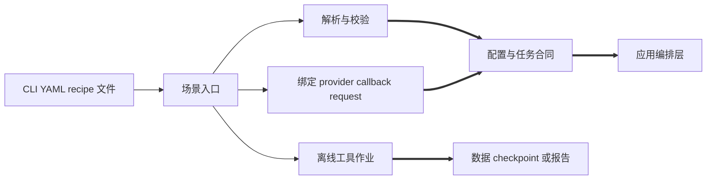

**设计与限制。** 将入口与编排拆开，可以新增模型 recipe 而不复制恢复、保存和退出状态机。边界判据是：如果一个对象仍在表达用户选择，它属于入口层；开始拥有长生命周期状态后就应进入应用编排层。入口 callback 必须遵守 PP stage 的取数和 loss 位置合同，参数组合也可能在校验期被拒绝；`pretrain_mamba.py` 在冻结提交中只是转发到 `pretrain_hybrid.py` 的兼容 wrapper，不能算一套独立架构。

### 3.2 应用编排层

**层功能与合同。** 这一层接收入口层的任务合同，决定初始化、对象构造、循环推进、验证、保存和停止的顺序。它拥有场景级状态与完成语义：训练以 iteration/参数提交为核心，推理以 request 完成为核心，RL 还要同时维护 rollout 与 policy epoch，后训练和导出则以新 checkpoint 或外部工件为完成标志。

| 子模块 | 代码位置 | 入口或关键函数 | 功能定位 |
|---|---|---|---|
| 配置与进程初始化 | `training/arguments.py`、`argument_utils.py`、`config/`、`global_vars.py`、`initialize.py` | `parse_and_validate_args`、`pretrain_cfg_container_from_args`、`initialize_megatron` | 建立 legacy global state、typed config、tokenizer、timer、logger 与分布式初始化顺序 |
| 训练生命周期 | `megatron/training/training.py` | `pretrain`、`setup_model_and_optimizer`、`train`、`train_step`、`evaluate` | 编排 model/optimizer/data/restore，推进 iteration，决定验证、保存与退出 |
| 推理构造适配 | `megatron/inference/utils.py` 与 `examples/inference/` | `get_model_for_inference`、示例 `main` | 初始化 Megatron，构造并恢复推理模型，再交给 MCore inference API |
| 后训练控制 | `megatron/post_training/` | `model_builder`、`checkpointing`、`generate` | 编排 SFT、ModelOpt 变换、teacher/student 状态和生成验证 |
| RL 控制 | `megatron/rl/` | `get_grpo_data_iterator`、`Agent`、`InferenceInterface` | 组织 environment rollout、reward、训练 batch、policy 更新和模型 refit |
| Finetune/eval 控制 | `tasks/finetune_utils.py`、`tasks/eval_utils.py` | `finetune`、`_train`、evaluation utilities | 为外部 task caller 编排 setup、epoch loop、checkpoint、evaluate 与退出 |
| 弹性实验控制 | `megatron/elastification/`、`training/inprocess_restart.py` | `pretrain_hybrid_flex.py::__main__`、`maybe_wrap_for_inprocess_restart` | 为 Hybrid/Flextron 与进程内重启包装标准训练生命周期 |

**函数调用流程。**

```text
training.pretrain
├─ initialize_megatron(...)
├─ setup_model_and_optimizer(...)
├─ build_train_valid_test_data_iterators(...)
└─ train(...)
   ├─ [perform_rl_step] rl_utils.get_grpo_data_iterator(...)
   │  ├─ get_environment_rollouts(...)
   │  └─ prepare_data_for_update(...)
   ├─ [not skip_train] train_step(...)
   │  ├─ selected forward_backward_func(...)
   │  └─ optimizer.step(...)
   ├─ [验证间隔] evaluate(...)
   ├─ [保存间隔] save_checkpoint_and_time(...)
   └─ [停止条件] exit handling

examples/inference/{offline_inference,launch_inference_server}.py::main
├─ parse_and_validate_args(...)
├─ initialize_megatron(...)
├─ get_model_for_inference(...)
├─ [offline sync] _run_sync(...)
├─ [offline async] asyncio.run(_run_async(...))
└─ [server] asyncio.run(_serve(...))
```

RL 没有复制第二套底层训练器，而是在训练控制器的条件分支中先生成 rollout iterator，再回到标准 `train_step`。推理入口虽然复用初始化与模型恢复，但后续以 request 完成为边界，因此与 training iteration 是两套生命周期。

**软件逻辑流程。**

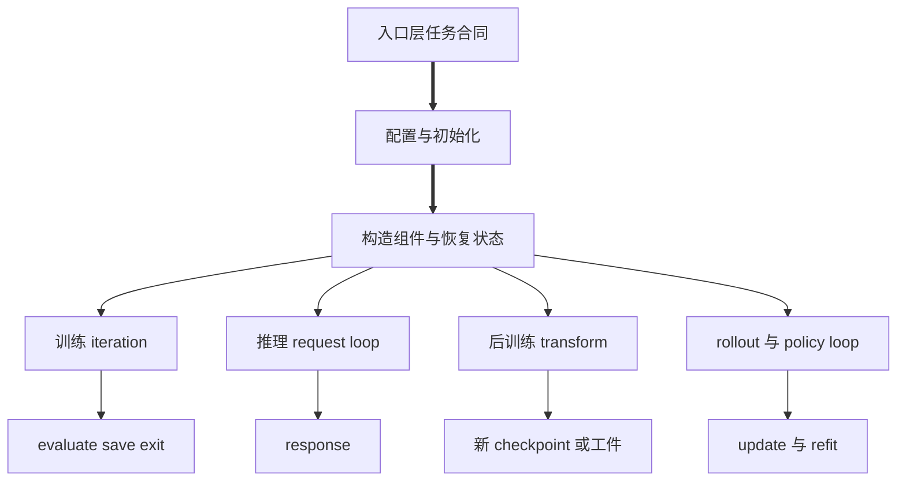

**设计与限制。** “一个入口一套控制循环”会导致恢复点和退出语义分叉，因此标准预训练集中在 `pretrain`；但请求服务和 rollout 的完成语义不同，也不能强行塞进训练 loop。当前仍处于 global args 与 `PretrainConfigContainer` 双轨期，两种表示必须一致；global singleton 还意味着同进程重入需要显式清理。异步 checkpoint 的函数返回仅表示请求已调度，应用层必须等 finalize 才能宣告持久化完成。

### 3.3 MCore 可组合组件层

**层功能与合同。** 这一层提供可被不同上层复用的领域对象：模型结构、数据表示、tokenizer、推理请求/engine、后训练 model spec 和导出表示。输入是 typed config、process groups、数据声明或 request；输出是 rank-local model、dataset/iterator、推理状态或转换中间表示。它定义“系统里有什么对象”，但不拥有整个训练/服务生命周期。

| 子模块 | 代码位置 | 关键类型或函数 | 功能定位 |
|---|---|---|---|
| 模型家族 | `core/models/`、`core/ssm/` | `GPTModel`、BERT/T5/Mamba/Hybrid/MoE/多模态实现 | 定义 embedding、block、输出层以及 PP 首尾 rank 的局部结构 |
| 规格与组合 | `core/transformer/`、`gpt_builders.py` | `ModuleSpec`、`build_module`、`TransformerBlock`、`gpt_builder` | 把结构规格递归实例化，并在 TE/local/inference-optimized 等实现间晚绑定 |
| 数据与 tokenizer | `core/datasets/`、`core/tokenizers/` | `BlendedMegatronDatasetBuilder.build`、`GPTDataset` | 表达 indexed data、blend、split、采样、packed/varlen 数据和 tokenization |
| 推理组件 | `core/inference/` | `MegatronLLM`、`MegatronAsyncLLM`、`DynamicInferenceEngine`、`DynamicInferenceRequest` | 管理请求、调度、KV cache、sampling 与同步/异步 API 合同 |
| 后训练与导出构件 | `core/post_training/`、`core/export/` | ModelOpt model specs/state hooks、`TRTLLMHelper` | 在不复制基础模型的前提下提供变换 hook 与外部部署表示 |

**函数调用流程。**

```text
pretrain_gpt.model_provider
└─ gpt_builders.gpt_builder(...)
   ├─ _get_transformer_layer_spec(...)
   └─ GPTModel(...)
      └─ TransformerBlock(...)
         └─ build_module(ModuleSpec)

train_valid_test_datasets_provider
└─ BlendedMegatronDatasetBuilder(...).build()
   ├─ _build_blended_dataset_splits(...)
   └─ _build_megatron_dataset_splits(...)
      └─ GPTDataset(...)

MegatronLLM.generate(...)
├─ records = DynamicInferenceEngine.generate(...)
│  ├─ add_request(...)
│  └─ step_modern(...)
└─ [遍历 engine 返回的 records] DynamicInferenceRequestRecord.merge(...)
```

builder 根据配置选择自定义 spec、实验 attention、MoE、heterogeneous、TE、local 或 inference-optimized 实现；`GPTModel` 再依据 `pre_process`、`post_process` 和 PP/VP 身份只构造当前 rank 的模块。模型、数据和 direct-mode 推理是同一组件层中的三条独立对象构造/消费路径。

**软件逻辑流程。**

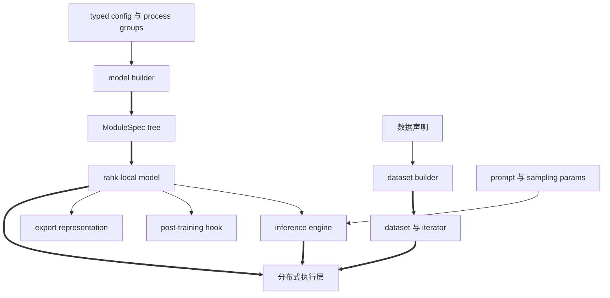

**设计与限制。** `ModuleSpec` 避免为“模型变体 × backend”维护平行类树，rank-local 构造也避免先在每张卡上实例化完整模型。但 config、spec、process groups 和 checkpoint key 必须相容；`pre_process`/`post_process` 决定 PP 首尾模块所有权。内置文本数据路径与 Energon 多模态路径不是同一实现，后者是侧接集成。异步推理只支持 coordinator 模式，不能把 sync direct-mode 的调用合同直接套用。

### 3.4 MCore 分布式执行层

**层功能与合同。** 这一层把组件对象变成跨 rank 可执行、可更新、可恢复的系统。输入是 world/rank 与并行配置、rank-local model、iterator 和 sharded state；输出是 process groups、完成的 forward/backward、同步梯度、新参数版本和持久化状态。它同时拥有空间映射、时间调度和分布式状态，是 Megatron 区别于普通模型库的核心层。

| 子模块 | 代码位置 | 关键类型或函数 | 功能定位 |
|---|---|---|---|
| 拓扑与通信身份 | `core/parallel_state.py`、`process_groups_config.py` | `RankGenerator`、`initialize_model_parallel`、`ProcessGroupCollection` | 将 world ranks 投影成 TP/PP/CP/EP/DP 及组合 group，并显式注入消费者 |
| 并行算子与时序 | `core/tensor_parallel/`、`pipeline_parallel/`、`context_parallel_layout/` | TP mappings/layers、`get_forward_backward_func`、`P2PCommunicator` | 执行局部算子、microbatch schedule、P2P 和 context collectives |
| 参数分布包装 | `core/distributed/` | `DistributedDataParallel`、Megatron-FSDP、Torch FSDP2 适配 | 建立参数/梯度 buffer、DP 同步和参数 gather/scatter 合同 |
| 参数提交 | `core/optimizer/`、`optimizer_param_scheduler.py` | `get_megatron_optimizer`、`MegatronOptimizer.step`、`OptimizerParamScheduler.step` | 管理 main params、unscale、overflow、clip、更新成功与 LR 推进 |
| 状态迁移与持久化 | `core/resharding/`、`core/dist_checkpointing/`、`training/checkpointing.py` | `swap_model_weights`、`dist_checkpointing.save/load`、`save_checkpoint/load_checkpoint` | 在布局间迁移权重，以 sharded state 保存/恢复模型和 optimizer |
| 重放与一致性 | `core/rerun_state_machine.py` | `RerunDataIterator`、rerun state machine | 协调可重放数据位置、forward/backward 重试和异常检查 |

**函数调用流程。**

```text
initialize._initialize_distributed(...)
├─ torch.distributed.init_process_group(...)
└─ parallel_state.initialize_model_parallel(...)
   └─ RankGenerator.get_ranks(...)

setup_model_and_optimizer(...)
├─ _build_model_wrapper(...)
│  └─ get_model(...)
│     ├─ [未注入 pg_collection] ProcessGroupCollection.use_mpu_process_groups(...)
│     └─ wrap_model_chunks_with_ddp(..., DP=DDP / Megatron-FSDP / Torch FSDP2)
├─ get_megatron_optimizer(...)
└─ [配置了恢复源] training.checkpointing.load_checkpoint(...)

train_step(...)
├─ selected forward_backward_func(...)
│  └─ [forward_only=false] config.finalize_model_grads_func(...)
│     └─ finalize_model_grads(...)
├─ MegatronOptimizer.step(...)
├─ logical_and_across_model_parallel_group(update_successful, ...)
└─ [update_successful] OptimizerParamScheduler.step(...)

training.checkpointing.save_checkpoint(...)
├─ model.sharded_state_dict(...)
├─ optimizer.sharded_state_dict(...)
└─ core.dist_checkpointing.save(...)
   └─ strategy.save(...)
      └─ [异步策略] AsyncRequest（等待 finalize）
```

初始化先把通信组写入 parallel-state，再在对象构造期收集为显式 `ProcessGroupCollection`。参数调度器只有在全模型并行域共同确认更新成功后才推进；异步保存返回的 request 也必须另行 finalize。

**软件逻辑流程。**

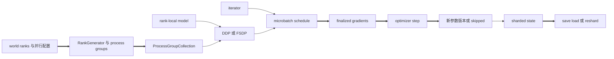

**设计与限制。** 把 group 创建集中起来，是为了保证所有 rank 采用兼容的 collective 顺序；把 optimizer 放在 wrapper 之后，是为了让它持有正确的参数身份；把 schedule 与 step 分开，是为了避免 microbatch 尚未收口就更新权重。并行度受 world size、层数、attention heads、experts 和 batch 整除关系约束，EP 与 CP 等组合还有专门 guard。错误的 group 或 P2P 顺序常表现为跨 rank 等待而不是局部异常；checkpoint 格式、optimizer sharding 和 resharding 也并非任意互换。

### 3.5 加速适配层

**层功能与合同。** 这一层把上层稳定的模块、tensor 与分布式操作合同映射到具体高性能实现。输入是 `ModuleSpec` 选型、精度/量化配置、tensor 和 process group；输出仍保持上层期望的模块或 tensor 形状，同时内部可以使用 Transformer Engine、自定义 fused op、CUDA Graph、FP8/FP4 或 overlap 实现。

| 子模块 | 代码位置 | 关键类型或函数 | 功能定位 |
|---|---|---|---|
| 后端规格选择 | `gpt_builders.py`、`core/extensions/transformer_engine_spec_provider.py` | `_get_transformer_layer_spec`、各类 spec provider | 根据 `transformer_impl` 和模型能力选择 TE、local 或 inference-optimized spec |
| Transformer Engine 适配 | `core/extensions/transformer_engine.py` | `TENorm`、`TEColumnParallelLinear`、`TERowParallelLinear`、`TEDotProductAttention` | 把 MCore 模块合同映射到 TE 类型，并携带 TP/FP8 等配置 |
| 本地融合算子 | `core/fusions/` | `FusedLayerNorm`、`FusedScaleMaskSoftmax`、`bias_dropout_add_fused_train` 等 | 合并常见算子，减少 launch、中间 tensor 或内存流量 |
| 精度与量化 | `core/fp8_utils.py`、`fp4_utils.py`、`core/quantization/` | `RecipeConfig`、quantization utilities | 表达 FP8/FP4/量化 recipe、tensor 元数据和能力检查 |
| 图捕获与运行时 hook | `core/transformer/cuda_graphs.py` 及 extension hooks | `create_cudagraphs`、backend hooks | 降低 Python/launch 开销，并向具体后端传递捕获或执行优化配置 |

**函数调用流程。**

```text
gpt_builder(...)
├─ transformer_layer_spec = _get_transformer_layer_spec(...)
│  ├─ [use_te] get_gpt_layer_with_transformer_engine_spec(...)
│  ├─ [inference optimized] get_gpt_layer_with_inference_spec(...)
│  └─ [otherwise] get_gpt_layer_local_spec(...)
└─ GPTModel(..., transformer_layer_spec=transformer_layer_spec)
   └─ TransformerBlock(..., spec=transformer_layer_spec)
      └─ build_module(...)
         ├─ TEColumnParallelLinear / TEDotProductAttention
         └─ local / fused module

training.pretrain(...)
└─ set_jit_fusion_options(...)

selected pipeline schedule
└─ [启用图捕获] create_cudagraphs(...)
```

这些分支只改变结构和运行后端的实现选择，不改变应用层看到的 training-iteration 合同。

**软件逻辑流程。**

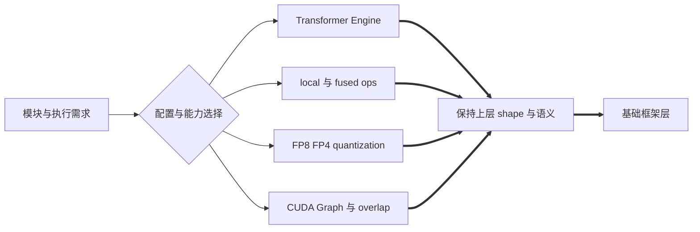

**设计与限制。** 将适配集中在这一层，可以让模型与 schedule 不绑定某一外部库版本。边界判据是：模块的数学/分布式合同以及通信何时重叠属于上层，选择哪一个 kernel、精度 recipe 或后端 hook 属于适配层。Transformer Engine、Kitchen、Apex/Triton 等均可能是可选依赖；硬件能力、版本、shape、dtype 和并行组合不满足时必须回退或在构造期拒绝。CUDA Graph 还要求稳定 shape、stream 与生命周期，不能视为无条件开关。

### 3.6 基础框架层

**层功能与合同。** 这一层由仓库外的 PyTorch 提供，Megatron 不重新实现通用 tensor、autograd、module、stream 和 process-group 抽象。输入是加速适配层或分布式执行层发出的 tensor 运算、反向传播、collective 和存储请求；输出是 tensor、gradient、work handle、event 或异常。它隔离了 Megatron 语义与 CUDA/NCCL 的底层细节。

| 基础能力 | Megatron 中的调用位置 | 代表 API | 向上承担的合同 |
|---|---|---|---|
| Tensor 与 Module | `core/models/`、`transformer/`、`extensions/` | `torch.Tensor`、`torch.nn.Module` | 参数注册、shape/dtype/device 语义和模块调用 |
| 自动微分 | model forward 与 pipeline schedule | autograd graph、backward、custom autograd function | 从 loss/output 产生局部梯度，并遵守 stream/device 依赖 |
| 分布式进程组 | `training/initialize.py`、`core/parallel_state.py` | `torch.distributed.init_process_group`、group creation、collectives | 提供 group 范围内的 rank、P2P、all-reduce、reduce-scatter 等操作 |
| CUDA 抽象 | 初始化、融合、图捕获、异步执行 | `torch.cuda.set_device`、`Stream`、`Event`、CUDA Graph 接口 | 绑定当前设备，表达异步顺序与完成事件 |
| 分布式存储支撑 | `core/dist_checkpointing/strategies/` | PyTorch tensor/storage 与 distributed-checkpoint 相关接口 | 把上层 sharded state 落成可并行读写的数据 |

**函数调用流程。**

```text
initialize._initialize_distributed(...)
├─ torch.cuda.set_device(...)
├─ torch.distributed.init_process_group(...)
└─ parallel_state.initialize_model_parallel(...)
   └─ group-creation wrappers
      └─ create_group(...)

MCore / TE / fused module forward
└─ PyTorch tensor operations
   └─ 构建 autograd graph

selected pipeline schedule
├─ backward_step(...)
│  └─ [output requires_grad]
│     ├─ [deallocate_pipeline_outputs] custom_backward(...)
│     └─ [否则] torch.autograd.backward(...)
├─ P2PCommunicator.send_*/recv_*(...)
│  └─ P2PCommunicator._communicate(...)
│     └─ torch.distributed.batch_isend_irecv(...) / isend(...) / irecv(...)
└─ forward_step(...)
   ├─ forward_step_func(...)
   └─ [last stage] loss closure(...)
      └─ average_losses_across_data_parallel_group(...)
         └─ torch.distributed.all_reduce(...)
```

Megatron 选择 group 和调用顺序，PyTorch 提供 tensor、autograd 与通用 distributed API。TE/fused module 最终仍返回 PyTorch tensor，因此上层不需要认识其具体 kernel。

**软件逻辑流程。**

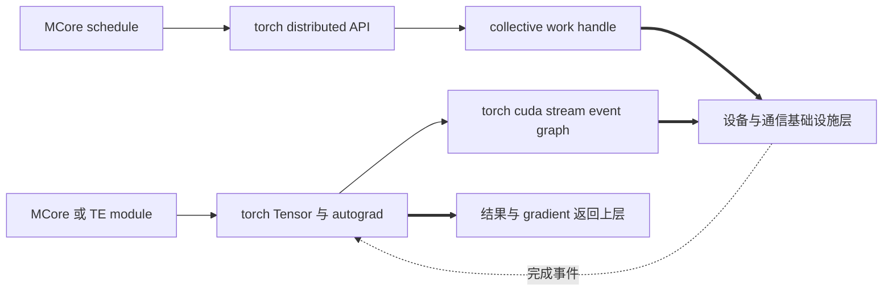

**设计与限制。** 这一层是外部依赖层，不应把 `torch.distributed` 的能力算成 Megatron 自己的模块。Megatron 仍负责选择 group 和调用顺序，而 PyTorch 负责执行通用 API。运行要求匹配的 PyTorch/CUDA 版本、已初始化的 process group、正确的当前设备和一致的 collective 次序；Python 函数返回也不一定意味着异步 CUDA/NCCL 工作已物理完成，完成边界要结合 event、wait 或上层同步点判断。

### 3.7 设备与通信基础设施层

**层功能与合同。** 这是主架构的物理执行底座，由 Megatron 仓库外的设备、运行时和网络共同组成。输入是 PyTorch 下发的 kernel、内存操作和 collective；输出是设备结果、通信完成或硬件/驱动错误。它不理解 `GPTModel`、microbatch 或 checkpoint，只保证被请求的计算与数据搬运能够执行。

| 基础设施 | 在架构中的位置 | Megatron 可见的边界 | 主要职责 |
|---|---|---|---|
| NVIDIA GPU | 计算与 HBM 载体 | `torch.cuda.device_count`、`torch.cuda.set_device` 后的当前 device | 执行 tensor kernel，保存当前 rank 的参数、激活和 optimizer shard |
| CUDA runtime/driver | PyTorch 与 GPU 之间 | stream、event、graph、memory allocation 的框架调用 | 发射 kernel、管理设备内存与异步依赖 |
| NCCL | 常用 GPU collective 后端 | `args.distributed_backend` 传入 `init_process_group`；NCCL 环境与错误由外层可观测 | 执行 all-reduce、reduce-scatter、all-gather、send/recv 等通信 |
| 节点内互联 | 单机多 GPU 数据通路 | 对 Megatron 通常透明，由通信后端选择路径 | 通过 PCIe、NVLink/NVSwitch 等搬运数据，具体能力取决于机器拓扑 |
| 节点间网络 | 多机数据通路 | 对 Megatron 通常表现为 collective 延迟、带宽或错误 | 通过 InfiniBand、RoCE 等可用网络承载跨节点通信；并非每个部署都要求同一种介质 |

**函数调用流程。**

```text
initialize._initialize_distributed(...)
├─ torch.cuda.set_device(args.local_rank)
├─ torch.distributed.init_process_group(backend=args.distributed_backend, ...)
└─ parallel_state.initialize_model_parallel(...)
   └─ create_group(...) for TP / PP / CP / EP / DP

selected pipeline schedule / parallel mappings / gradient finalization
└─ P2PCommunicator methods / torch.distributed collectives
   └─ ProcessGroupNCCL / configured backend
      └─ NCCL / CUDA / GPU interconnect

_initialize_tp_communicators(...)               # 启用 TP communication overlap
├─ [TE >= 1.9] Transformer Engine initialize_ub(bootstrap_backend=...)
└─ [更早的 TE]
   ├─ create_group(backend="mpi")
   └─ Transformer Engine initialize_ub(...)
```

源码能验证的是 API 交接点，不能仅凭仓库推断具体机器一定使用哪一种物理互联。MPI/TE bootstrap 是 TP communication overlap 的可选支路，不是所有训练的固定前提。

**软件逻辑流程。**

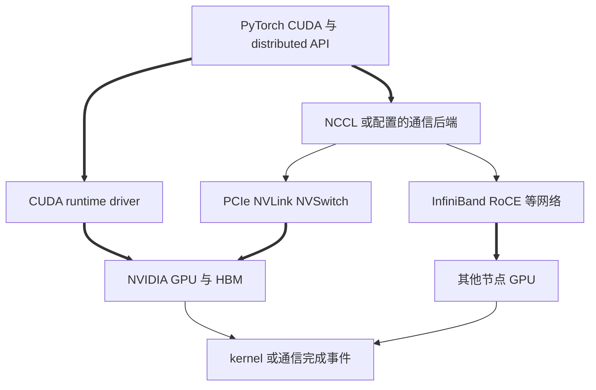

**设计与限制。** 把基础设施单列，是为了让读者知道性能和故障并不全由 Python 模块决定；但不能从仓库代码反推出某个部署一定使用 NVLink 或 InfiniBand。主训练路径面向 NVIDIA GPU，driver/CUDA/PyTorch/NCCL/Transformer Engine 版本与设备能力必须匹配。拓扑、链路带宽、collective 算法和 rank 放置会决定 overlap 是否真正隐藏通信；硬件错误常在上层表现为 timeout 或 collective hang，需要结合基础设施遥测定位。

### 3.8 Megatron Lite 实验纵切

**纵切功能与合同。** Lite 位于 `experimental/lite`，从公开 runtime API、模型协议到训练 primitive 形成一条独立实验栈。输入是 `RuntimeConfig`、Hugging Face model path、backend config 和 batch；输出是 `Runtime`、`ModelHandle`、forward/backward result、step trace 或 benchmark JSON。它不是七层主架构中的一层，而是用更窄、更显式的合同重新贯穿其中若干责任。

| 子模块 | 代码位置 | 关键类型或函数 | 功能定位 |
|---|---|---|---|
| Runtime contracts | `experimental/lite/megatron/lite/runtime/contracts/` | `RuntimeConfig`、`Batch`、`ForwardResult`、`ModelHandle` | 明确 runtime、数据、handle、loss 与 weights 的公共协议 |
| Runtime backend | `runtime/backends/mlite/`、`mbridge/`、`bridge/` | `create_runtime`、backend `create`、`Runtime.build_model` | 通过 registry 选择原生 Lite、MBridge 或 Bridge 对照实现 |
| 原生模型包 | `megatron/lite/model/` | model registry、各模型 config/protocol/model/checkpoint | 提供 qwen3_moe、qwen3_5、kimi_k2、glm5、deepseek_v4 等显式模型协议 |
| Training primitives | `megatron/lite/primitive/` | parallel、optimizer、checkpoint、quantization、`train_step` 等 | 提供较小粒度的并行、模块、算子、保存和训练原语，部分包装 MCore 能力 |
| Benchmark 外壳 | `experimental/lite/examples/bench/` | `bench.py::main/run`、`run_pretrain_session`、`RunResult.to_dict` | 以固定 shape/session 比较 backend 的正确性、耗时、显存和吞吐 |

**函数调用流程。**

```text
megatron.lite.runtime.create_runtime(cfg)
├─ _runtime_registry()[cfg.backend]
├─ importlib.import_module(...)
└─ runtime = backend.create(cfg.hf_path, cfg.backend_cfg)

runtime.build_model()
└─ ModelHandle

experimental/lite/examples/bench/bench.py::main
├─ parse_args(...)
└─ run(...)
   ├─ create_runtime(...)
   ├─ Runtime.build_model(...)
   └─ run_pretrain_session(...)
      ├─ Runtime.zero_grad(...)
      ├─ Runtime.forward_backward(...)
      ├─ [no_optimizer=false] Runtime.optimizer_step(...)
      ├─ [no_optimizer=false] Runtime.lr_scheduler_step(...)
      └─ RunResult.to_dict()
```

`no_optimizer=true` 时 session 跳过 optimizer 和 LR scheduler，只执行 forward/backward 与测量；最终 JSON 工件由 `RunResult` 生成。

**软件逻辑流程。**

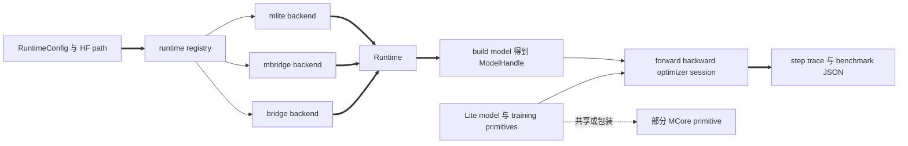

**设计与限制。** Lite 的目标是缩小实验表面并显式化 runtime/model/primitive 协议，因此不能把它描述成 `megatron.training.pretrain` 的薄包装。用户代码应通过 `megatron.lite` 导入，而不是直接依赖 `experimental.lite` 路径；模型和 backend 能力也不能外推为完整 Megatron-LM 的能力。该目录带有 `experimental` 边界，API、支持模型和与 MCore 共享 primitive 的方式都可能随冻结基线之后的提交变化。

> [!note] 外部生态为何不再单列一层
> Energon 在 MCore 组件层的数据边界接入，ModelOpt 在组件层/应用编排层接入，TensorRT-LLM 在导出边界接入，NVRx 在可靠性编排边界接入。它们已分别出现在对应层的职责和第 5 章场景中；由于不满足同一“抽象级别与向下依赖”判据，不能为了凑模块数量再组成一个伪层。

---

## 4. 架构模块与代码目录的对应关系

目录是物理组织，分层是依赖与责任组织，两者不是一一对应。尤其 `megatron/core/` 同时容纳第 3～5 层，不能把一个顶级目录直接等同于一个软件层。当前冻结树可先压缩成下面这张关系图：

```text
Megatron-LM/
├── pretrain_*.py                 第 1 层：场景入口
├── train_rl.py                   第 1 层：原生 RL 场景入口
├── gpt_builders.py               第 3/5 层桥接：模型规格与后端选择
├── megatron/
│   ├── training/                 第 2 层：参考训练编排
│   ├── core/                     第 3～5 层：组件、分布式执行与加速适配
│   │   └── post_training/        第 3 层：ModelOpt 规格与 state hooks
│   ├── inference/                第 2 层：推理构造适配
│   ├── post_training/            第 2 层：后训练编排
│   ├── rl/                       第 2 层：研究型 RL 控制
│   └── elastification/           第 2 层：弹性 Hybrid 编排
├── examples/                     第 1 层：可运行 recipe
├── tools/                        第 1 层：数据、转换和诊断作业
├── tasks/                        第 2 层：finetune 与 evaluation 编排辅助
├── experimental/
│   └── lite/                     独立纵切：runtime、原生模型与 primitive
└── tests/                        验证资产，不属于运行时主分层
```

| 架构层 / 侧接面 | 主要代码位置 | 代表模块与函数锚点 | 对应关系说明 |
|---|---|---|---|
| 1. 场景入口层 | 仓库根、`examples/`、`tools/` | `pretrain_gpt.py::__main__`、`train_rl.py::__main__`、`tools/preprocess_data.py::main`、`tools/checkpoint/convert.py::main` | 物理位置分散，但共同特征是直接承接用户任务并向下交付合同 |
| 2. 应用编排层 | `megatron/training/`、`inference/`、`post_training/`、`rl/`、`elastification/`、`tasks/` | `training.pretrain/train/evaluate`、`get_model_for_inference`、`get_grpo_data_iterator`、`tasks.finetune_utils.finetune/_train` | 这些目录分别拥有训练、请求、变换、rollout、finetune/eval 或弹性生命周期 |
| 3. MCore 可组合组件层 | `core/models/`、`transformer/`、`ssm/`、`datasets/`、`tokenizers/`、`inference/`、`post_training/`、`export/` | `ModuleSpec/build_module`、`GPTModel`、`BlendedMegatronDatasetBuilder`、`MegatronLLM`、`TRTLLMHelper` | `core/` 中负责领域对象的部分；同一组件可由不同上层编排复用 |
| 4. MCore 分布式执行层 | `core/parallel_state.py`、`process_groups_config.py`、`tensor_parallel/`、`pipeline_parallel/`、`context_parallel_layout/`、`distributed/`、`optimizer/`、`resharding/`、`dist_checkpointing/` | `initialize_model_parallel`、`get_forward_backward_func`、`DistributedDataParallel`、`MegatronOptimizer.step`、`save/load` | 同一层内共同拥有跨 rank 的空间、时间、参数与分片状态语义 |
| 5. 加速适配层 | `core/extensions/`、`fusions/`、`quantization/`、`fp8_utils.py`、`fp4_utils.py`、`transformer/cuda_graphs.py` | `TEColumnParallelLinear`、`FusedLayerNorm`、`RecipeConfig`、`create_cudagraphs` | 仍位于 `core/`，但职责是把稳定上层合同绑定到具体实现 |
| 6. 基础框架层 | 仓库外部；通过各文件的 `torch` import 调用 | `torch.Tensor`、`torch.nn.Module`、`torch.distributed.init_process_group`、`torch.cuda` | 无对应仓库目录；必须显式保留这一层，避免把 PyTorch 能力归到 Megatron |
| 7. 设备与通信基础设施层 | 仓库外部运行环境 | CUDA、NCCL、GPU 与实际互联 | 无 Python 代码目录；由基础框架调用，是性能与故障的物理落点 |
| Megatron Lite 实验纵切 | `experimental/lite/` | `megatron/lite/runtime/`、`model/`、`primitive/`、`examples/bench/` | 通过 `megatron.lite` 暴露独立实验 API；不映射为主架构中的某一层 |
| 外部生态侧接 | 安装在仓库外，Megatron 内保留 adapter/call site | Energon、ModelOpt、TensorRT-LLM、NVRx | 分别接到数据、后训练/压缩、部署、可靠性边界，不能合并成下层依赖带 |

> [!contradiction] 目录证据冲突
> 冻结提交的 `README.md::Project Structure` 仍列出 `megatron/legacy`，但同一提交的 Git tree 不存在该目录；上面的映射以实际 Git tree 为当前实现事实。

---

## 5. 当前软件的顶层使用场景

这里的“全部场景”按冻结仓库公开的顶层入口和独立完成工件归类：同一生命周期下的模型 recipe 合并，同一诊断目的下的工具合并，不把每个脚本机械地算成新架构场景。十一类场景覆盖 MCore 作为库、端到端训练、数据生产、后训练、推理、RL、checkpoint 操作、部署导出、弹性训练、Megatron Lite，以及诊断与基准验证。

> [!note] 命令阅读约定
> 以下命令均从冻结版本的 Megatron-LM 仓库根目录执行，并以 Linux/Bash 与 NVIDIA GPU 环境为前提。源码方式先按 `docs/get-started/install.md` 执行 `uv pip install -e .`，确保 `megatron` 可导入。`<...>` 是必须替换的占位符，不能原样执行。`torchrun` 示例只突出场景相关参数；多节点运行还要补充或校准 `--nnodes`、`--node_rank`、`--master_addr` 和 `--master_port`。模型、数据、tokenizer、checkpoint 及 Transformer Engine、ModelOpt、TensorRT-LLM 等可选依赖必须先准备好。

### 5.1 把 Megatron Core 嵌入自定义训练框架

**执行入口。** `examples/run_simple_mcore_train_loop.py` 是冻结版本官方 quickstart 使用的最小 MCore 训练循环；脚本内部固定 TP=2，因此需要两张 GPU。

**执行命令。**

```bash
torchrun --nproc_per_node=2 examples/run_simple_mcore_train_loop.py
```

脚本运行 5 个 iteration，随后在仓库根目录创建或复用 `./ckpt`，执行一次 distributed save 和 load。

**函数调用流程。**

```text
examples/run_simple_mcore_train_loop.py::__main__
├─ initialize_distributed(tp=2, pp=1)
│  └─ parallel_state.initialize_model_parallel(...)
├─ model_provider()
├─ DistributedDataParallel(...)
├─ get_train_data_iterator()
├─ get_forward_backward_func()
├─ [每个 iteration]
│  ├─ selected_schedule(...)
│  │  └─ forward_step_func(...)
│  ├─ finalize_model_grads(...)
│  └─ Adam.step()
├─ save_distributed_checkpoint(...)
│  └─ dist_checkpointing.save(...)
└─ load_distributed_checkpoint(...)
   └─ dist_checkpointing.load(...)
```

**软件逻辑流程。**

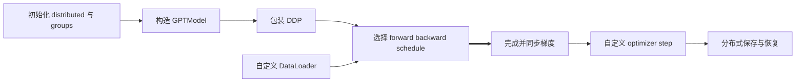

这个入口证明 MCore 可以脱离 `megatron.training` 使用；示例故意采用 PyTorch Adam 和简化循环，因此不代表完整训练外壳的日志、容错或 scheduler 能力。

### 5.2 端到端预训练与基础模型实验

**执行入口。** 文本 GPT 使用 `pretrain_gpt.py`，Hybrid/Mamba 使用 `pretrain_hybrid.py`，VLM 使用 `pretrain_vlm.py`；BERT 和 T5 的可运行入口分别在 `examples/bert/pretrain_bert.py` 与 `examples/t5/pretrain_t5.py`。最短的官方模型 recipe 是 `examples/llama/train_llama3_8b_h100_fp8.sh`，通用入口则需要显式传入模型、数据和训练参数。

**执行命令与模板。** 第一条是冻结文档提供的 8×H100、FP8、mock-data recipe；第二条展示自有 GPT 数据的必要参数骨架。

```bash
bash examples/llama/train_llama3_8b_h100_fp8.sh

torchrun --nproc_per_node=<GPU_COUNT> pretrain_gpt.py \
  --tensor-model-parallel-size <TP> \
  --pipeline-model-parallel-size <PP> \
  --num-layers <NUM_LAYERS> \
  --hidden-size <HIDDEN_SIZE> \
  --num-attention-heads <NUM_HEADS> \
  --seq-length <SEQ_LENGTH> \
  --max-position-embeddings <MAX_POSITION_EMBEDDINGS> \
  --micro-batch-size <MICRO_BATCH_SIZE> \
  --global-batch-size <GLOBAL_BATCH_SIZE> \
  --train-iters <TRAIN_ITERS> \
  --lr <PEAK_LR> \
  --min-lr <MIN_LR> \
  --lr-decay-style cosine \
  --bf16 \
  --tokenizer-type HuggingFaceTokenizer \
  --tokenizer-model <TOKENIZER_DIR> \
  --data-path <PREPROCESSED_DATA_PREFIX> \
  --split 949,50,1 \
  --save <CHECKPOINT_DIR> \
  --load <CHECKPOINT_DIR> \
  --save-interval <SAVE_INTERVAL>
```

**函数调用流程。**

```text
pretrain_gpt.py::__main__
├─ inprocess_restart.maybe_wrap_for_inprocess_restart(training.pretrain)
├─ parse_and_validate_args(...)
├─ pretrain_cfg_container_from_args(...)
└─ training.pretrain(...)
   ├─ initialize_megatron(...)
   ├─ setup_model_and_optimizer(...)
   ├─ build_train_valid_test_data_iterators(...)
   └─ train(...)
      ├─ train_step(...)
      │  ├─ selected forward_backward schedule
      │  └─ optimizer.step(...)
      ├─ [验证间隔] evaluate(...)
      └─ [保存间隔] save_checkpoint_and_time(...)
         └─ save_checkpoint(...)

pretrain_mamba.py::__main__
└─ runpy.run_path("pretrain_hybrid.py", run_name="__main__")
```

`pretrain_hybrid.py`、`pretrain_vlm.py`、BERT 与 T5 入口替换 builder、dataset 和 forward callback，但把相同类型的任务合同交给训练编排层。冻结提交中的 `pretrain_mamba.py` 只是 deprecated compatibility wrapper，不拥有另一套生命周期。

**软件逻辑流程。**

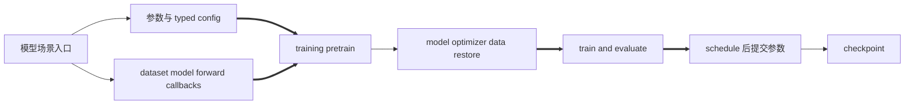

不同模型入口替换 builder、dataset 和 forward callback；初始化、恢复、提交与验证仍由同一生命周期拥有。一次 iteration 只有在 `optimizer.step()` 成功后才产生新的参数版本；`evaluate()` 是对当前版本的观测，不是提交点。同步 checkpoint 要以写入返回为完成，异步 checkpoint 则要等待 finalize；8×H100 FP8 recipe 仅对匹配的 H100 拓扑、CUDA/Transformer Engine 依赖和容量配置成立。

### 5.3 离线数据预处理与训练数据构建

**执行入口。** `tools/preprocess_data.py` 把 JSON/JSONL 文本转成 Megatron indexed dataset。输入每行默认包含 `text` 字段；训练时的 `--data-path` 使用输出前缀，而不是 `.bin` 文件名。

**执行命令。**

```bash
python tools/preprocess_data.py \
  --input <INPUT_JSONL> \
  --output-prefix <OUTPUT_PREFIX> \
  --json-keys text \
  --tokenizer-type HuggingFaceTokenizer \
  --tokenizer-model <TOKENIZER_DIR> \
  --workers <CPU_WORKERS> \
  --append-eod
```

默认 `text`/document 路径会生成 `<OUTPUT_PREFIX>_text_document.bin` 和 `<OUTPUT_PREFIX>_text_document.idx`；应将不带 `.bin/.idx` 的 `<OUTPUT_PREFIX>_text_document` 传给第 5.2 节的 `--data-path`。

**函数调用流程。**

```text
tools/preprocess_data.py::main
├─ get_args()
├─ Partition(args, workers_per_partition)
└─ multiprocessing.Process(target=process_json_file, ...)
   └─ [子进程] process_json_file(...)
      └─ Partition.process_json_file(...)
         ├─ build_tokenizer(...)
         ├─ multiprocessing.Pool(initializer=Encoder.initializer)
         │  └─ Encoder.initializer()
         │     └─ build_tokenizer(...)
         ├─ Pool.imap(Encoder.encode, ...)
         ├─ IndexedDatasetBuilder.add_document(...)
         └─ IndexedDatasetBuilder.finalize(...)

train_valid_test_datasets_provider
└─ BlendedMegatronDatasetBuilder(...).build()
```

**软件逻辑流程。**


完成工件是可复用的索引数据，而不是一次训练 step。多模态生产数据通常改走外部 Energon，不能把文本预处理入口视为所有数据形态的统一实现。

### 5.4 SFT、量化、剪枝与蒸馏后训练

**执行入口。** ModelOpt 集成入口位于 `examples/post_training/modelopt/`：`finetune.sh`、`quantize.sh` 和 `prune.sh` 分别包装对应 Python 入口及模型配置。在线 KD 通过 `pretrain_gpt.py` 或 `pretrain_hybrid.py` 的 ModelOpt 参数启用；cached-logits student 通过标准预训练入口读取已有 tar。运行前需安装 `nvidia-modelopt`，并选择 `conf/` 支持矩阵中的模型名。

**执行命令与模板。**

```bash
# SFT：从 Megatron distributed checkpoint 继续训练
TP=1 \
MLM_MODEL_CKPT=<MEGATRON_CHECKPOINT> \
MLM_MODEL_SAVE=<SFT_CHECKPOINT_DIR> \
DATASET=<HF_DATASET_NAME_OR_LOCAL_JSONL> \
bash examples/post_training/modelopt/finetune.sh \
  meta-llama/Llama-3.2-1B-Instruct

# PTQ/fake-quant：第二个位置参数是 ModelOpt quant config
TP=1 \
HF_MODEL_CKPT=<HF_MODEL_DIR> \
MLM_MODEL_SAVE=<QUANTIZED_MEGATRON_CHECKPOINT_DIR> \
bash examples/post_training/modelopt/quantize.sh \
  meta-llama/Llama-3.2-1B-Instruct NVFP4_DEFAULT_CFG

# 剪枝：冻结示例要求 TP=1，PP 可大于等于 1
TP=1 \
PP=1 \
HF_MODEL_CKPT=<HF_MODEL_DIR> \
MLM_MODEL_SAVE=<PRUNED_CHECKPOINT_DIR> \
MLM_EXTRA_ARGS='--prune-export-config {"num_layers":24}' \
bash examples/post_training/modelopt/prune.sh Qwen/Qwen3-8B

# 在线 KD：在完整的 student 模型/数据/训练参数后追加这些参数；
# 冻结实现应同时给出 --load 或 --pretrained-checkpoint，才能进入 teacher 权重加载分支。
torchrun --nproc_per_node=<GPU_COUNT> pretrain_gpt.py \
  <STUDENT_MODEL_DATA_AND_TRAINING_ARGS> \
  --load <STUDENT_CHECKPOINT> \
  --export-kd-teacher-load <TEACHER_CHECKPOINT> \
  --export-te-mcore-model \
  --export-kd-teacher-model-config <TEACHER_MODEL_CONFIG_YAML> \
  --export-kd-distill-cfg <DISTILL_CONFIG_YAML>

# cached-logits student：仅在已有兼容 tar 时成立。
torchrun --nproc_per_node=<GPU_COUNT> pretrain_gpt.py \
  <STUDENT_MODEL_DATA_AND_TRAINING_ARGS> \
  --logits-load-dir <COMPATIBLE_CACHED_LOGITS_DIR> \
  --logits-load-kd-loss-alpha 1.0
```

冻结源码没有把 teacher 的 pending buffer 接到 tar writer，因此这里不能给出一条能够闭环生产 cached-logits tar 的 teacher 命令；`--logits-save-dir` 不能被当作完成保证。

`prune.sh` 的默认 calibration dataset 是 gated 数据集，需要先执行 `hf auth login`；也可以把 `--calib-dataset <HF_DATASET_OR_LOCAL_JSONL>` 追加到 `MLM_EXTRA_ARGS`。

**函数调用流程。** 这四类后训练共享模型组件，但不是一条可互换的调用链。

```text
examples/post_training/modelopt/finetune.py::__main__
├─ parse_and_validate_args(...)
└─ training.pretrain(...)
   ├─ setup_model_and_optimizer(...)
   │  └─ get_model(...)
   │     └─ model_provider(...)
   │        └─ modelopt_gpt_hybrid_builder(...)
   ├─ build_train_valid_test_data_iterators(...)
   │  └─ train_valid_test_sft_datasets_provider(...)
   └─ train(...)
      └─ train_step(...)
         ├─ selected forward_backward_func(...)
         │  └─ forward_step(...)
         └─ optimizer.step(...)

examples/post_training/modelopt/{quantize,prune}.py::__main__
├─ parse_and_validate_args(...)
├─ initialize_megatron(...)
├─ get_model(...)
├─ [Megatron checkpoint] load_modelopt_checkpoint(...)
├─ [HF source] import Hugging Face weights
├─ mtq.quantize(...) / mtp.prune(...)
├─ save_checkpoint(...)
└─ [未设置 skip_generate] _custom_prompt_forward_loop_func(...)
   └─ megatron_generate(...)

training.pretrain(...)                         # 在线 KD
└─ setup_model_and_optimizer(...)
   ├─ _build_model_wrapper(...)
   │  └─ get_model(...)
   │     └─ model_provider.model_provider(...)
   │        └─ modelopt_gpt_hybrid_builder(...)
   │           ├─ _load_teacher_model_config(...)
   │           ├─ _build_teacher_model(...)
   │           ├─ mtd.convert(...)
   │           └─ adjust_distillation_model_for_mcore(...)
   ├─ get_megatron_optimizer(...)
   └─ [args.load / args.pretrained_checkpoint] training.checkpointing.load_checkpoint(...)
      ├─ 恢复 student 与 optimizer 主状态
      └─ [export_kd_teacher_load 且模型持有 teacher_model]
         └─ load_modelopt_checkpoint([teacher], load_arg="export_kd_teacher_load")

setup_model_and_optimizer(...)                 # cached logits hooks
├─ [teacher/save] LogitsSaverHooks(...).attach_hooks(...)
│  └─ output_layer.register_forward_hook(_forward_hook)
└─ [student/load] StudentLogitsCapture(...).attach_hooks(...)

[后续 output-layer forward 触发已注册 hook]
└─ LogitsSaverHooks._forward_hook(...)
   ├─ _process_single_microbatch(...)
   └─ _save_accumulated_log_probs(...)
      └─ _buffer_iteration(...)
         └─ _pending_writes

pretrain_gpt.loss_func(...)                    # cached-logits student loss
└─ _build_cached_logits_loss_func(...)
   └─ LossFuncCallable.__call__(...)
      └─ get_student_logits_capture()

[已定义但冻结树无生产调用者]
├─ LogitsSaverHooks.take_pending_data(...)
└─ LogitsSaverHooks._write_batched_tar(...)
```

**软件逻辑流程。**

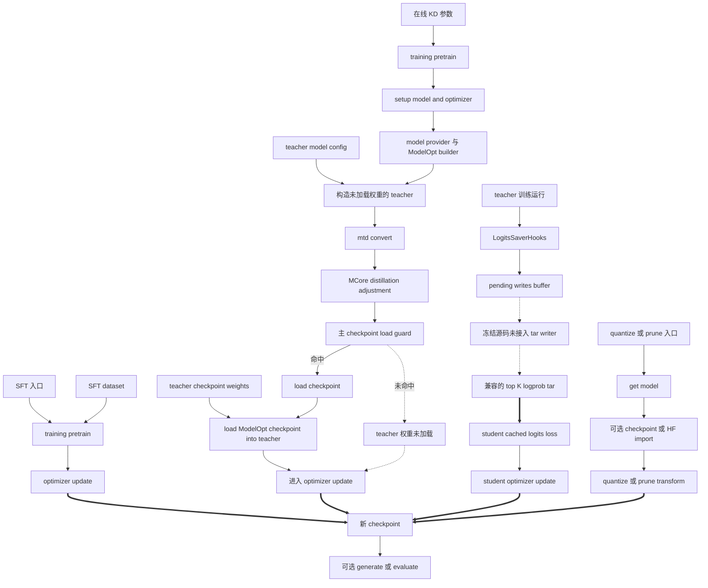

SFT、在线 KD 和 cached-logits student run 复用训练状态机，纯量化或剪枝拥有自己的变换流程。在线 KD 不兼容部分 manual-GC、TP overlap、TE cross-entropy 和 interleaved PP 组合；而且冻结实现把 teacher 权重加载嵌套在主 checkpoint load 中，scratch student 只设置 teacher flag 时这条链没有闭合，可能带着未加载 checkpoint 权重的 teacher 继续执行。cached logits 还要求 teacher/student 的数据顺序、CP 布局和 micro-batch size 对齐；teacher producer 与 tar writer 在冻结提交中同样未闭合。ModelOpt 版本、模型规格和 checkpoint 状态仍是共同边界。

### 5.5 离线生成与在线推理服务

**执行入口。** `examples/inference/run_offline_inference.sh` 包装批量离线生成，参数固定为 Qwen2.5-1.5B，并额外依赖 `simpy`；`examples/inference/run_inference_server.sh` 包装 Nemotron-6 3B Hybrid MoE 的 OpenAI-compatible HTTP 服务，默认启动 8 个进程。两者都要求 Hugging Face token 和与 wrapper 模型规格匹配的 Megatron checkpoint；server 还要求可写的 HF cache 目录。其他模型不能只替换 checkpoint，必须同步修改 wrapper 中的模型参数或直接运行对应 Python module。

**执行命令。**

```bash
# 同步 direct mode；追加 --use-coordinator 可切到 coordinator
bash examples/inference/run_offline_inference.sh \
  --hf-token <HF_TOKEN> \
  --checkpoint <QWEN2_5_1_5B_MEGATRON_CHECKPOINT>

# 异步离线模式必须同时启用 coordinator
bash examples/inference/run_offline_inference.sh \
  --hf-token <HF_TOKEN> \
  --checkpoint <QWEN2_5_1_5B_MEGATRON_CHECKPOINT> \
  --mode async \
  --use-coordinator

# OpenAI-compatible server，默认监听 0.0.0.0:5000
bash examples/inference/run_inference_server.sh \
  --hf-token <HF_TOKEN> \
  --hf-home <HF_CACHE_DIR> \
  --checkpoint <NEMOTRON6_3B_HYBRID_MOE_CHECKPOINT>
```

**函数调用流程。**

```text
examples/inference/offline_inference.py::main
├─ parse_and_validate_args(...)
├─ initialize_megatron(...)
├─ get_model_for_inference(...)
├─ build_requests(...)
└─ [args.async_mode]
   ├─ false: _run_sync(...)
   │  └─ with MegatronLLM(...)
   │     └─ MegatronLLM.generate(...)
   │        ├─ [direct] DynamicInferenceEngine.generate(...)
   │        └─ [coordinator] loop_manager.run_sync(_generate_impl(...))
   │           └─ _generate_impl(...)
   │              └─ coord_runtime.client.add_request(...)
   └─ true: asyncio.run(_run_async(...))
      └─ _run_async(...)
         └─ async with MegatronAsyncLLM(...)
            └─ await MegatronAsyncLLM.generate(...)
               └─ loop_manager.run_async(_generate_impl(...))
                  └─ _generate_impl(...)
                     └─ coord_runtime.client.add_request(...)

examples/inference/launch_inference_server.py::main
├─ parse_and_validate_args(...)
├─ initialize_megatron(...)
├─ get_model_for_inference(...)
└─ asyncio.run(_serve(...))
   └─ _serve(...)
      └─ async with MegatronAsyncLLM(...)
         └─ await MegatronAsyncLLM.serve(blocking=True)
            ├─ [primary rank] start_text_gen_server(...)
            └─ loop_manager.run_async(_wait_for_shutdown_impl())
```

**软件逻辑流程。**

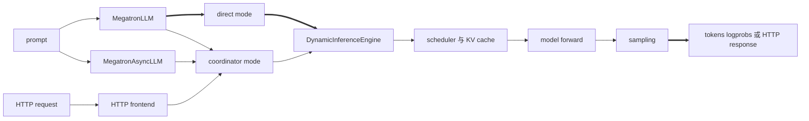

同步 API 可以走 direct 或 coordinator；异步 API 和 HTTP serve 要求 coordinator，HTTP frontend 只由 primary rank 启动。推理完成是 request 产生结果，不涉及训练 optimizer。

### 5.6 原生 RL rollout 与策略更新

**执行入口。** `train_rl.py` 是原生 GRPO 研究入口，环境示例在 `examples/rl/environment_configs/`。冻结 README 的完整实验是 8 节点×8 GPU 的 Qwen2.5-32B 配置；下面保留其关键 CLI 合同，模型结构、并行与优化器参数必须按目标 checkpoint 补齐。依赖至少包括 `flask-restful`、`uvloop`、`datasets` 和 `evaluate`。

**命令模板。**

```bash
torchrun \
  --nproc-per-node=<GPUS_PER_NODE> \
  --nnodes=<NODE_COUNT> \
  train_rl.py \
  <MODEL_PARALLEL_AND_ARCHITECTURE_ARGS> \
  --perform-rl-step \
  --langrl-env-config examples/rl/environment_configs/dapo.yaml \
  --pretrained-checkpoint <BASE_MEGATRON_CHECKPOINT> \
  --tokenizer-type HuggingFaceTokenizer \
  --tokenizer-model <TOKENIZER_OR_HF_MODEL> \
  --mock-data \
  --micro-batch-size 1 \
  --global-batch-size <TRAINING_BATCH_SIZE> \
  --train-samples <TRAIN_SAMPLES> \
  --grpo-group-size <GROUP_SIZE> \
  --grpo-prompts-per-step <PROMPTS_PER_STEP> \
  --grpo-iterations <POLICY_UPDATES_PER_ROLLOUT> \
  --save <CHECKPOINT_DIR> \
  --load <CHECKPOINT_DIR>

# 只在需要独立 HTTP environment service 时另行启动；这不是 train_rl.py 的参数。
python -m megatron.rl.server.agent.fastapi_env_server \
  --env-config <AGENT_ENV_CONFIG_YAML> \
  --port 8000
```

冻结版 `examples/rl/README.md` 把 `--env-config` 拼入了 `train_rl.py` 命令，但 `train_rl.py` 使用的 parser 没有注册该参数；它只属于上面的独立 `fastapi_env_server` 入口。因此训练命令只保留实现真正消费的 `--langrl-env-config`。

**函数调用流程。**

```text
train_rl.py::__main__
├─ parse_and_validate_args(...)
├─ pretrain_cfg_container_from_args(...)
└─ training.pretrain(...)
   └─ training.train(...)
      ├─ [perform_rl_step] train_data_iterator = rl_utils.get_grpo_data_iterator(...)
      │  ├─ [需要新 rollout] get_environment_rollouts(...)
      │  │  ├─ [独立推理模型] swap_model_weights(...)
      │  │  ├─ megatron_rl_inference_mode(...)
      │  │  │  └─ get_inference_interface(...)
      │  │  │     └─ loop.run_until_complete(MegatronLocal.launch(...))
      │  │  └─ get_rollout_generator(...)
      │  │     ├─ get_agent(...)
      │  │     │  └─ WeightedMultiTask.from_config(...)
      │  │     └─ agent.get_grouped_rollouts(...)
      │  ├─ [需要新 rollout] prepare_data_for_update(...)
      │  └─ return RerunDataIterator
      └─ [not skip_train] train_step(..., train_data_iterator, ...)

megatron.rl.server.agent.fastapi_env_server::__main__   # 独立可选服务
├─ yaml.safe_load(...)[0]
├─ get_agent_class(config["agent_type"])
└─ run(agent_cls, cls_args, port)
   └─ event_loop.run_until_complete(run_server())
      └─ FastAPIEnvServer.launch(...)
```

**软件逻辑流程。**

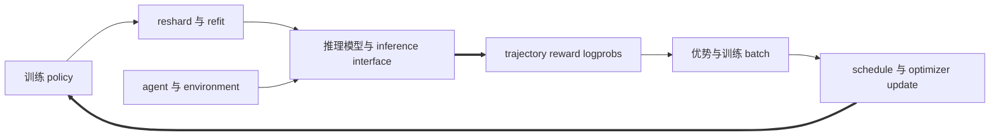

RL 同时拥有 rollout freshness、policy epoch、KV epoch 和训练提交语义。官方文档把该能力定位为研究开发；它不等同于完整生产 RL 平台。

### 5.7 Checkpoint 保存、恢复与格式转换

**执行入口。** 训练内保存/恢复由任一 `pretrain_*.py` 入口的 `--save`、`--load` 和 `--save-interval` 控制；离线格式转换使用 `tools/checkpoint/convert.py`。converter 的公共参数只有 model type、loader/saver 与源/目标目录，其他参数由所选插件动态注册。

**命令模板。** 第一个模板复用训练入口；第二个是冻结 RL 文档中的 Hugging Face Qwen2.5 转 MCore 示例。

```bash
# 训练内周期保存并从同一目录恢复
torchrun --nproc_per_node=<GPU_COUNT> pretrain_gpt.py \
  <MODEL_DATA_AND_TRAINING_ARGS> \
  --save <CHECKPOINT_DIR> \
  --save-interval <SAVE_INTERVAL> \
  --load <CHECKPOINT_DIR>

# HF Qwen2.5 -> MCore；loader/saver 专属参数不可机械套用于其他模型
python tools/checkpoint/convert.py \
  --bf16 \
  --model-type GPT \
  --loader llama_mistral \
  --saver core \
  --checkpoint-type hf \
  --load-dir <HF_CHECKPOINT_DIR> \
  --save-dir <MEGATRON_CHECKPOINT_DIR> \
  --target-tensor-parallel-size <TARGET_TP> \
  --tokenizer-model <TOKENIZER_DIR> \
  --model-size qwen2.5 \
  --loader-transformer-impl transformer_engine \
  --make-vocab-size-divisible-by 128
```

**函数调用流程。**

```text
training.checkpointing.save_checkpoint(...)
└─ core.dist_checkpointing.save(...)

training.checkpointing.load_checkpoint(...)
└─ core.dist_checkpointing.load(...)

tools/checkpoint/convert.py::main
├─ load_plugin("loader", args.loader)
├─ load_plugin("saver", args.saver)
├─ multiprocessing.Queue(...)
├─ multiprocessing.Process(target=saver.save_checkpoint, args=(queue, args))
│  └─ saver.save_checkpoint(queue, args)          # 子进程消费消息
└─ loader.load_checkpoint(queue, args)             # 主进程生产消息
```

**软件逻辑流程。**

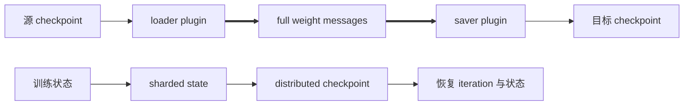

转换工具的 queue 协议发送完整 weight messages，与训练时的 sharded checkpoint 写入不是同一执行路径；格式、TP/PP 变化和 optimizer sharding 各有兼容边界。

### 5.8 导出 TensorRT-LLM 部署 engine

**执行入口。** 单进程示例为 `examples/export/trtllm_export/single_device_export/gpt_single_device_cpu_export.py`，双 GPU 示例为 `distributed_export/gpt_distributed_gpu_export.py`。它们应在匹配版本的 TensorRT-LLM 容器中执行。

**执行命令。** 两个脚本都没有 checkpoint、模型结构或 engine 目录的 CLI 参数；运行前必须在脚本内改成目标配置，并显式启用 checkpoint load。原样运行只会导出脚本构造的微型示例模型，engine 路径固定为 `/opt/megatron-lm/engine`。

```bash
# 在已安装匹配 TensorRT-LLM 的容器内
CUDA_VISIBLE_DEVICES=0 \
torchrun --nproc-per-node 1 \
  examples/export/trtllm_export/single_device_export/gpt_single_device_cpu_export.py

CUDA_VISIBLE_DEVICES=0,1 \
torchrun --nproc-per-node 2 \
  examples/export/trtllm_export/distributed_export/gpt_distributed_gpu_export.py
```

**函数调用流程。**

```text
{single_device_export,distributed_export}/gpt_*_export.py::__main__
├─ initialize_distributed(...)
├─ model_provider()
├─ [默认被注释] load_distributed_checkpoint(...)
│  └─ dist_checkpointing.load(...)
├─ gpt_model.state_dict()
├─ TRTLLMHelper(...)
├─ TRTLLMHelper.get_trtllm_pretrained_config_and_model_weights(...)
└─ TRTLLMHelper.build_and_save_engine(...)
```

**软件逻辑流程。**

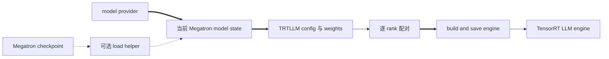

导出完成边界是外部 engine 工件写出，不是 Megatron 推理请求完成。默认示例若不启用 checkpoint load，导出的就是刚构造模型的当前参数；此外它依赖匹配版本的 TensorRT-LLM，单设备和 distributed 示例有不同 TP 假设。

### 5.9 弹性 Hybrid 与进程内重启

**执行入口。** `megatron/elastification/pretrain_hybrid_flex.py` 是 Flextron/Hybrid 的专用实验入口。冻结仓库没有面向普通用户的完整 launch wrapper；CI 通过 `tests/test_utils/recipes/h100/flextron.yaml` 注入模型与训练 YAML，因此直接运行必须自行补齐 Hybrid 模型、数据、并行和 checkpoint 参数。

**命令模板。**

```bash
torchrun --nproc_per_node=<GPU_COUNT> \
  megatron/elastification/pretrain_hybrid_flex.py \
  <HYBRID_MODEL_DATA_PARALLEL_AND_TRAINING_ARGS> \
  --flextron \
  --enable-router \
  --binary-mask \
  --soft-mask \
  --budget-list 1.0 0.697 \
  --budget-probs 1.0 1.0 \
  --budget-type param
```

**函数调用流程。**

```text
megatron/elastification/pretrain_hybrid_flex.py::__main__
├─ inprocess_restart.maybe_wrap_for_inprocess_restart(training.pretrain)
├─ parse_and_validate_args(extra_args_provider=mamba_flex_extra_args_provider)
│  └─ add_flextron_args(...)
├─ pretrain_cfg_container_from_args(...)
└─ training.pretrain(...)
   └─ Hybrid/Flextron model_provider(...)
```

**软件逻辑流程。**

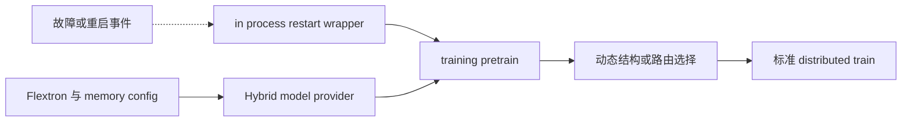

这是冻结树中的专用实验入口，不是所有模型的默认弹性层。其 monkey patch、外部 resiliency 依赖和 Hybrid 配置说明了当前边界仍强于通用训练入口。

### 5.10 Megatron Lite 实验运行时

**执行入口。** 公共 API 从 `megatron.lite.runtime` 导入；仓库内可执行验证入口是 `experimental/lite/examples/bench/bench.py`。运行时必须把 `experimental/lite` 加到 `PYTHONPATH`，并准备本地 Hugging Face 模型目录。

**执行命令。** 下面使用冻结 README 的 Qwen3.5 MLite benchmark 参数骨架；先加 `--dry-run` 可以只验证 config，不初始化 distributed 或导入 reference backend。

```bash
export PYTHONPATH="$(pwd)/experimental/lite:${PYTHONPATH}"

torchrun --nproc_per_node 1 experimental/lite/examples/bench/bench.py \
  --backend mlite \
  --hf-path <QWEN3_5_HF_MODEL_DIR> \
  --model-name qwen3_5 \
  --steps 5 \
  --warmup 1 \
  --seq-len 2048 \
  --num-microbatches 1 \
  --truncate-layers 2 \
  --disable-mtp \
  --output-json <OUTPUT_JSON>
```

**函数调用流程。**

```text
experimental/lite/examples/bench/bench.py::main
├─ parse_args(...)
└─ run(...)
   ├─ build_runtime_config(...)
   ├─ create_runtime(...)
   │  ├─ runtime registry lookup
   │  └─ backend.create(...)
   ├─ Runtime.build_model(...)
   │  └─ ModelHandle
   └─ run_pretrain_session(...)
      ├─ Runtime.zero_grad(...)
      ├─ Runtime.forward_backward(...)
      ├─ [no_optimizer=false] Runtime.optimizer_step(...)
      ├─ [no_optimizer=false] Runtime.lr_scheduler_step(...)
      └─ RunResult.to_dict()
```

**软件逻辑流程。**

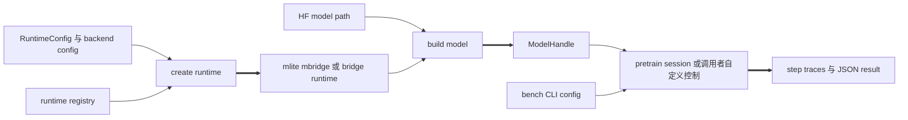

Lite 是 `experimental/lite` 下的独立实验表面，用户代码通过 `megatron.lite` 导入，不应导入 `experimental.lite`。冻结 registry 注册 qwen3_moe、qwen3_5、kimi_k2、glm5、deepseek_v4 等原生模型协议，并提供 mlite、mbridge、bridge 后端作实现或对照；这套显式 runtime/model/primitive 合同不能被当作 `megatron.training.pretrain` 的薄包装，也不代表完整 Megatron-LM 能力都已迁移。

### 5.11 容量估算、路由诊断与基准验证

**执行入口。** `tools/report_theoretical_memory.py` 意图根据标准 Megatron 模型/并行参数做静态显存估算，但冻结提交的脚本入口存在参数初始化顺序缺陷，不能直接运行；下面给出等价的临时包装。`tools/moe_routing/analyze_routing.py` 对训练或推理产生的 routing trace 依次运行 concentration 与 predictability 分析；Lite benchmark 使用第 5.10 节的入口。

**命令模板。** 临时包装先显式解析和校验参数，手动填入真正参与 embedding/logits 估算的 padded vocabulary size，再在不构建 tokenizer 和 GPU model 的情况下安装 global args 并调用报告函数。模型/并行参数必须完整且相互一致。routing 命令中的 trace 目录应包含 `router_trace_rank*.jsonl`；predictability 还需要 hook 路径生成的 hidden-state 与 router-weight 文件。

```bash
WORLD_SIZE=<WORLD_SIZE_CONSISTENT_WITH_TP_PP_CP> \
PADDED_VOCAB_SIZE=<PADDED_VOCAB_SIZE> \
python - \
  --num-layers <NUM_LAYERS> \
  --hidden-size <HIDDEN_SIZE> \
  --ffn-hidden-size <FFN_HIDDEN_SIZE> \
  --num-attention-heads <NUM_HEADS> \
  --seq-length <SEQ_LENGTH> \
  --max-position-embeddings <MAX_POSITION_EMBEDDINGS> \
  --micro-batch-size <MICRO_BATCH_SIZE> \
  --global-batch-size <GLOBAL_BATCH_SIZE> \
  --tensor-model-parallel-size <TP> \
  --pipeline-model-parallel-size <PP> <<'PY'
import os

from megatron.training.arguments import parse_args, validate_args
from megatron.training.global_vars import set_global_variables
from megatron.training.theoretical_memory_usage import report_theoretical_memory

args = parse_args()
validate_args(args)
args.padded_vocab_size = int(os.environ["PADDED_VOCAB_SIZE"])
set_global_variables(args, build_tokenizer=False)
report_theoretical_memory(args, verbose=True)
PY

python tools/moe_routing/analyze_routing.py \
  <ROUTING_TRACE_DIR> \
  --num-experts <NUM_EXPERTS> \
  --top-k <ROUTER_TOP_K> \
  --output-dir <REPORT_DIR>
```

**函数调用流程。**

```text
tools/report_theoretical_memory.py::__main__      # 冻结入口，当前失败
└─ initialize_megatron(allow_no_cuda=True, skip_mpu_initialization=True)
   └─ get_args()
      └─ [失败] _GLOBAL_ARGS 尚未初始化

上述 heredoc 临时包装
├─ parse_args()
├─ validate_args(args)
├─ args.padded_vocab_size = PADDED_VOCAB_SIZE
├─ set_global_variables(args, build_tokenizer=False)
└─ report_theoretical_memory(args, verbose=True)

tools/moe_routing/analyze_routing.py::main
├─ run("analyze_routing_concentration.py", ...)
│  └─ subprocess.run(...)
└─ run("analyze_routing_predictability.py", ...)
   └─ subprocess.run(...)

experimental/lite/examples/bench/bench.py::main
└─ run(...)
   ├─ create_runtime(...)
   ├─ Runtime.build_model(...)
   └─ run_pretrain_session(...)
```

**软件逻辑流程。**

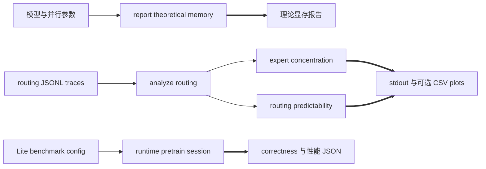

这些入口的完成工件是报告或 benchmark JSON，而不是新参数版本；routing 的 CSV 与图只在传入 `--output-dir` 时生成。理论显存的临时包装不初始化 CUDA/MPU，但运行环境仍需要正常安装冻结源码的 Python 依赖；上游修复参数初始化顺序前，不应宣称 `python tools/report_theoretical_memory.py ...` 可用。routing predictability 需要 hidden states 与 router weights，只有 top-index trace 时只能做 concentration；benchmark 的性能与一致性结论只对其声明的 backend、模型、硬件和 deterministic 配置成立。

---

## 6. 小结：读者需要建立的整体认识

读完本页，读者至少应该建立下面八点认识：

1. **分层只使用一个轴。** 七层按照“用户意图 → 场景生命周期 → 可组合对象 → 分布式语义 → 加速实现 → 通用框架 → 物理执行”逐级向下，功能多少和目录位置都不是分层依据。
2. **场景入口层与应用编排层分工明确。** 前者绑定参数、provider、request 或工具输入；后者拥有 train/request/rollout/transform 的生命周期和完成条件。
3. **Megatron Core 不只是模型目录。** MCore 可组合组件层提供 model、dataset、inference、post-training 和 export 对象；MCore 分布式执行层另外拥有 rank、schedule、同步、optimizer、resharding 与 sharded checkpoint 语义。
4. **性能实现有三段边界。** 加速适配层选择 TE/local/fused/FP8/FP4/CUDA Graph，基础框架层提供 PyTorch tensor/autograd/distributed API，设备与通信基础设施层才真正执行 CUDA kernel 和 collective。
5. **一次训练要先稳定对象再执行。** 配置、process groups、rank-local model、wrapper/optimizer、数据进度和恢复状态按顺序建立，任一身份不一致都可能破坏后续 collective 或 checkpoint。
6. **一次 step 有清晰完成点。** schedule 完成整个 global batch 的 forward/backward 后，optimizer 才提交参数；只有 update 成功，LR scheduler 才推进。异步 checkpoint 还要等 finalize，函数返回不等于持久化完成。
7. **侧接与纵切不能冒充主层。** Energon、ModelOpt、TensorRT-LLM、NVRx 是不同边界上的外部集成；Megatron Lite 是拥有自身 runtime/model/primitive 的实验纵切。
8. **能力范围广，但稳定性边界同样重要。** 除预训练外还包括 MCore 嵌入、数据生产、后训练、推理、研究型 RL、转换、导出、弹性与诊断；`dev` 分支、外部版本和组合 guard 决定哪些路径可以真正闭合。

接下来不应继续在本页追叶子实现：MCore 可组合组件层的模型转 [[10_megatron_model_structure_analysis]]、数据转 [[11_megatron_dataset_analysis]]；MCore 分布式执行层的 rank 几何转 [[17_megatron_parallelism_orchestration_analysis]]、各并行轴转 12–15、参数提交转 16 与 26、保存恢复转 19。进入专题页时持续追问四件事即可：**输入合同是什么、状态由谁拥有、跨层数据怎样传递、完成或失败信号是什么。**

---

## Related Pages

- [[10_megatron_model_structure_analysis]] — 深入 MCore 可组合组件层怎样从 `ModuleSpec` 实例化 `TransformerBlock` 并组装 `GPTModel`。
- [[11_megatron_dataset_analysis]] — 展开数据、tokenizer、索引、采样与 dataloader 的实现。
- [[15_megatron_pp_schedulers_analysis]] — 展开分布式执行层的 microbatch 时序、P2P 与完成边界。
- [[16_megatron_distributed_optimizer_analysis]] — 展开 DDP buffer、梯度同步和 distributed optimizer。
- [[17_megatron_parallelism_orchestration_analysis]] — 展开 rank 几何和 process group 的构造与注入。
- [[19_megatron_dist_checkpointing_analysis]] — 展开 sharded state、保存策略与恢复边界。
- [[31_megatron_inference_engine_analysis]] — 展开动态推理 engine、调度、KV cache 与服务路径。
