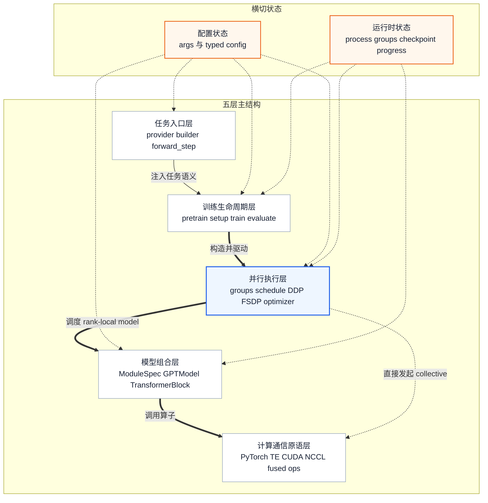
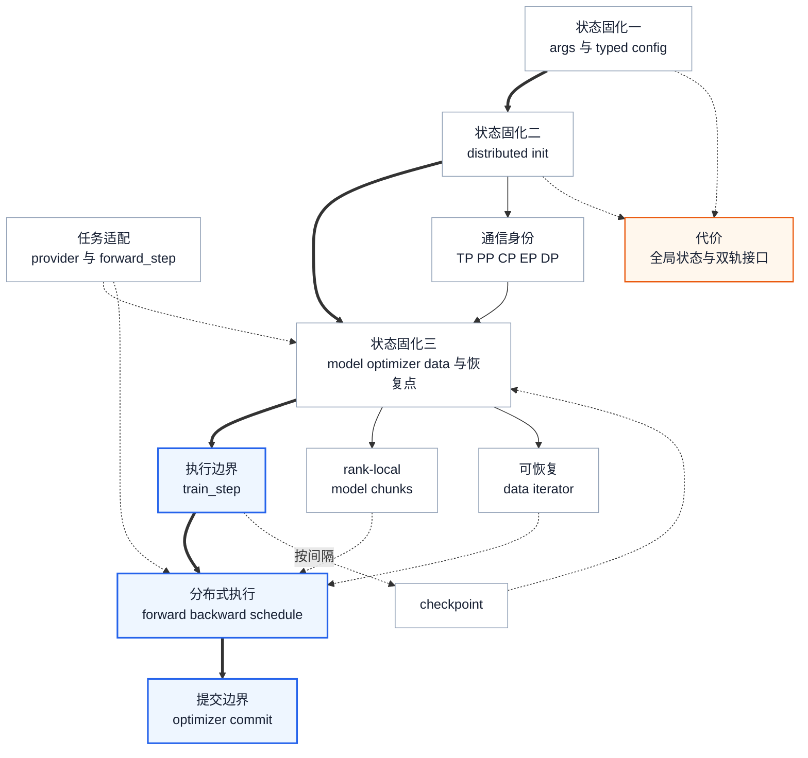

# Megatron-LM 概览与架构分析：五层系统怎样组装为一次参数提交

> **源码基线**：`NVIDIA/Megatron-LM@85902ef599ea4eb06ada7567a479c524b605767a`（`dev`，2026-09-01）
> **重定基线**：2026-09-01 由 `71092579`（2026-08-27）推进，跨 7 个提交；落在本轮改动文件（`megatron/training/training.py`）上的引用已逐条重核。本轮对 `training.py` 的改动集中在 FLOPs 估算（DSA 稀疏注意力与 indexer 计入）与 paged-stash CUDA graph 捕获标记，**本页描述的五层责任与层间契约未变**，仅行号漂移。
> **维度**：Overview。本文只解释现役 GPT 预训练主链怎样建立状态、执行 global batch 并提交参数；模型层、各并行轴、优化器和 checkpoint 的内部算法交给专题页。
> **核心入口**：`pretrain_gpt.py`、`gpt_builders.py`、`megatron/training/{arguments,initialize,training}.py`、`megatron/core/pipeline_parallel/schedules.py`
> **最近更新**：2026-08-29。补入五层结构、各层能力与层间契约；生命周期视图保留为第二观察角度。

---

## 1. 背景：并行算子不能自行组成一个可恢复的训练系统

把 TP、PP、DP、EP、CP 分别讲清楚，仍然回答不了一次训练怎样跑起来。模型构造前必须知道当前 rank 在各并行轴上的身份；一次 global batch 更新前必须完成所有 microbatch 的前后向；恢复训练时配置、数据进度、模型和优化器又必须回到同一个逻辑时刻。任何一个顺序错位，局部算子即使正确，整体训练也会重复数据、更新半批梯度，或让不同 rank 进入不同通信路径。

源码把这条生命周期集中在 `training.pretrain()`。它的 docstring 明确列出四个阶段：初始化 Megatron，构造模型/优化器/LR scheduler，构造 train/valid/test 数据，最后进入训练循环（`megatron/training/training.py:1681-1704`）。

**本文的主线**：Megatron-LM 不是“五种并行加一个训练循环”的平铺集合，而是五层责任逐级收敛成一次可提交执行：任务入口定义“训练什么”，训练生命周期决定“何时构造和推进”，并行执行层决定“工作怎样映射到 rank 与 microbatch”，模型组合层定义“当前 rank 算什么”，后端原语完成实际计算和通信。另一条正交主线是状态固化：配置、进程组、rank-local 资源和数据进度必须先后稳定，schedule 才能执行，optimizer 才能提交。

---

## 2. 整体分层：从训练任务到计算与通信原语

只看目录树容易把 `megatron.training` 理解成“入口脚本”，把 `megatron.core` 理解成一个不可再分的底层库；只看调用链又会把模型结构、并行策略和生命周期混在同一条时间线上。这里采用与 [vLLM Architecture Overview](https://docs.vllm.ai/en/latest/design/arch_overview/) 相同的阅读方法：先建立入口、运行结构和执行对象的静态地图，再追一次工作怎样穿过它们。**分层方法来自 vLLM 的组织启发，层内结论和边界全部以本页固定的 Megatron-LM 源码基线为准。**

### 2.1 五层主结构与两类横切状态

主箭头表示责任向下收敛，不等于每次 forward 都完整走一遍五层。并行执行层被单独强调，是因为它同时控制模型执行和集合通信：schedule 消费 `forward_step_func`、data iterator、model chunks、microbatch 数和进程组（`megatron/core/pipeline_parallel/schedules.py:92-106`、`:140-163`），而不是模型组合层的一个普通子模块。橙色横切节点表示结构性约束：它们被多层消费，修改时最容易产生只改一处、其余层仍持有旧状态的问题。

### 2.2 五层各自提供什么能力

| 层 | 核心能力 | 输入 → 产出 | 现役源码锚点 |
|---|---|---|---|
| 任务入口层 | 把某个训练任务描述成框架可调用的模型、数据与 loss 回调 | 任务配置与样本语义 → providers、builder、`forward_step` | `pretrain_gpt.py:573-586` |
| 训练生命周期层 | 统一拥有初始化、构造、训练、验证、保存和恢复的顺序 | typed config 与任务回调 → 可运行训练进程及迭代状态 | `megatron/training/training.py:1681-1715` |
| 并行执行层 | 把 global batch 和逻辑模型映射到 rank、microbatch、通信与参数提交 | 拓扑配置、model chunks、iterator → 分布式前后向及 optimizer 结果 | `megatron/training/initialize.py:335-384`、`megatron/core/pipeline_parallel/schedules.py:148-163` |
| 模型组合层 | 把模型配置和模块规格组装成当前 rank 真正持有的计算图 | config、`ModuleSpec`、process groups → rank-local `GPTModel`/Transformer blocks | `gpt_builders.py:25-55`、`:93-110` |
| 计算通信原语层 | 实现线性层、Attention/MLP 子算子、融合 kernel 与 collective | tensor、process group、backend 选择 → tensor 结果与通信进度 | `megatron/core/models/gpt/gpt_layer_specs.py:614-665`、`megatron/core/tensor_parallel/layers.py:80-89` |

#### 2.2.1 任务入口层：把任务语义收敛为框架输入

框架不能预先知道每种任务的样本结构、loss 或模型变体，但这些差异也不应复制一套训练循环。GPT 入口先解析配置，再把 dataset provider、`ModelType`、`forward_step` 和 model provider 一起交给 `pretrain()`（`pretrain_gpt.py:573-586`）。其中 dataset provider 说明“样本从哪里来”，model provider 说明“构造什么模型”，`forward_step` 则把 iterator、model 与 loss closure 接成一次任务前向（`:359-402`）。因此这一层的能力是**适配任务**，产出是通用生命周期能够调用的契约，而不是自己推进 iteration。

#### 2.2.2 训练生命周期层：只保留一个训练状态机

`pretrain()` 接收任务回调，却由自己规定初始化 Megatron、构造模型/optimizer/LR scheduler、构造 train/valid/test 数据、进入训练的顺序（`megatron/training/training.py:1681-1704`）。模型和 optimizer 的恢复发生在资源构造阶段，训练完成后的补充保存与 validation 也由同一生命周期安排（`:1911-1927`、`:2105-2191`）。把这些能力集中起来的原因是恢复一致性：模型、optimizer、数据进度与 iteration 必须回到同一逻辑时刻。它不会定义某个 Attention 怎样算，也不会把一种 PP 时序写死在主循环里；这些决策继续下沉。

#### 2.2.3 并行执行层：同时决定空间映射、时间映射和提交边界

这是五层中负责“怎样跑”的一层。空间上，初始化代码先建立 `torch.distributed`，再集中创建 TP、PP、CP、EP、DP 及组合通信域（`megatron/training/initialize.py:335-384`）；`ProcessGroupCollection` 把这些身份显式交给模型、wrapper 与梯度处理组件（`megatron/core/process_groups_config.py:56-66`）。时间上，schedule 根据 PP/VP 状态选择无流水线、非交错或交错执行，并消费 model chunks、iterator 与 microbatch 计划（`megatron/core/pipeline_parallel/schedules.py:92-106`、`:148-163`）。状态提交上，训练外壳先完成分布式包装和 optimizer 构造，schedule 返回后才允许 `optimizer.step()`（`megatron/training/training.py:2515-2559`、`:2802-2824`、`:3222-3235`、`:3298-3302`）。

这三个能力必须放在同一责任层理解，因为 rank 划分、microbatch 次序和梯度提交共同决定一次 global batch 的一致性。模型只表达本 rank 的局部计算；它不应自行选择通信参与者或决定整批参数何时更新。

#### 2.2.4 模型组合层：从规格生成 rank-local 计算图

模型组合层并不是先构造一份完整 GPT 再交给并行层切割。`gpt_builder()` 先依据 TE/local、dense/MoE、异构层和注意力配置选择 Transformer spec，再把 spec、配置、PP 首尾身份和 process groups 交给 `GPTModel`（`gpt_builders.py:25-55`、`:93-110`）。`ModuleSpec` 保存模块、参数和子模块规格，并由 `build_module()` 实例化（`megatron/core/transformer/spec_utils.py:29-41`、`:74-115`）；`GPTModel` 又根据 `pre_process`/`post_process` 决定当前 rank 是否持有 embedding 与 output 侧结构（`megatron/core/models/gpt/gpt_model.py:121-125`、`:164-172`）。这一层提供的是**可组合的局部计算图**，而不是跨 microbatch 的执行时间表。

#### 2.2.5 计算通信原语层：让同一模型结构落到不同后端

最底层承接的是实际 tensor 计算和 collective。GPT layer spec 会在 Transformer Engine、inference optimized 与 local 实现之间选择 Attention、linear、norm、MLP/MoE 等子模块（`megatron/core/models/gpt/gpt_layer_specs.py:614-665`）；同一文件从 `megatron/core/extensions` 接入 TE，从 `megatron/core/fusions` 接入 fused LayerNorm，并在依赖缺失时回退 Torch Norm（`:49-78`）。TP 层再对接 PyTorch 的 all-gather 与 reduce-scatter 等 distributed 原语（`megatron/core/tensor_parallel/layers.py:80-89`）。上层通过 spec 和 config 选择实现，因此更换 kernel/backend 不需要让任务入口理解硬件细节；反过来，这一层也不拥有训练何时验证或保存。

这五层按“谁拥有状态与不变量”划分，而不是按目录机械切割。例如 `training.py` 会组装 DDP/FSDP 和 optimizer，但具体并行实现位于 `megatron.core`；`gpt_builders.py` 位于仓库根，却属于模型组合层。上层负责选择、组装和推进，下层负责实现更稳定的计算与通信能力，这条依赖方向才是分层的核心。

### 2.3 系统怎样从五层组装起来

静态分层回答“系统由什么组成”，下面的生命周期视图回答“这些层按什么顺序变成一个可运行训练进程”。任务入口先提供回调；生命周期层固化配置并初始化拓扑；并行执行层据此驱动模型组合和后端原语；全部 microbatch 完成后，optimizer 才提交参数。

粗箭头是一次训练必须经过的状态固化与提交路径；细线是控制依赖或旁路生命周期。主链可由 `pretrain_gpt.py:560-586`、`megatron/training/training.py:1757-1769`、`:1911-1927`、`:2026-2056`、`:2105-2128`、`:3222-3235` 连续核对。图只强调 `train_step → schedule → optimizer commit`，因为这里决定了“一个 step 到底何时算完成”；橙色节点表示当前架构实际支付的全局状态耦合成本。

| 状态边界 | 固化后的含义 | 后续代码可以依赖什么 |
|---|---|---|
| 配置 | 用户输入已被补全和校验 | 模型形状、并行度、batch 语义不会在构造中途改变 |
| 进程组 | `global_rank` 已被解释成各并行轴上的身份 | 当前 rank 拥有哪些层、与谁通信 |
| 资源 | model chunks、optimizer、iterator 已绑定同一拓扑和恢复点 | schedule 可以只处理执行次序 |
| step 提交 | 全部 microbatch 的梯度已完成，optimizer 决定更新或跳过 | LR、日志和 checkpoint 可以推进到下一逻辑 step |

---

## 3. 为什么分成训练外壳与执行内核

### 3.1 任务差异停在回调边界，生命周期只保留一份

GPT 的 batch 结构、模型规格和 loss 与初始化、日志、验证、恢复没有理由彼此复制。`pretrain_gpt.py` 因此只负责组装 `train_valid_test_datasets_provider`、`forward_step`、`gpt_builder` 和 `ModelType`，再把它们交给 `pretrain()`（`pretrain_gpt.py:573-586`）；`pretrain()` 的契约则把模型 provider 和“iterator → model → loss closure”描述成外部输入（`megatron/training/training.py:1681-1715`）。

直观替代是为 GPT、Hybrid、Mamba 各写一套主循环。它让单个入口更容易顺读，却会复制初始化、验证、checkpoint 和容错状态。当前边界选择的判据不是少传几个参数，而是让**任务语义可以替换，训练状态机仍只有一个所有者**。源码没有记录一次正式的方案评审；这一取舍是由当前回调边界及多个入口共享 `pretrain()` 的事实重建，属于本文推断。

### 3.2 PP 时序属于执行策略，不属于模型结构

PP 和 virtual pipeline 的拓扑要到分布式初始化后才确定。训练循环因此在运行时调用 `get_forward_backward_func()`；选择器按 PP/VP 状态返回无流水线、非交错流水线或交错流水线（`megatron/training/training.py:4449-4459`、`megatron/core/pipeline_parallel/schedules.py:148-163`）。2023 年提交 `3c92fa93b` 的标题就是“Move pipeline parallel functionality into core with associated changes”，把 schedule 和 P2P 通信从旧训练层迁入 `megatron.core`，为这种所有权划分提供了历史证据。

如果让 `GPTModel.forward()` 自己决定 1F1B 时序，模型就必须同时知道 model chunk 列表、microbatch 计划和相邻 stage 的 P2P 顺序。Megatron 选择晚绑定 schedule，是为了让模型只表达局部计算图，让 schedule 独占跨 microbatch、跨 stage 的时间关系。代价是 schedule 不再是普通函数封装：它承载通信顺序和同步边界，错误通常会演化成跨 rank 等待，而不是一个容易定位的局部异常。

### 3.3 模型在构造时就按 rank 分片，而不是先完整复制再裁剪

`get_model()` 读取 PP/VP 拓扑，按 virtual stage 构造一个或多个 model chunk，并只在逻辑首尾设置 `pre_process`、`post_process`（`megatron/training/training.py:2438-2483`）。`GPTModel` 再用这两个标志决定是否持有 embedding 与 output 侧结构（`megatron/core/models/gpt/gpt_model.py:61-69`、`:121-125`、`:164-172`）。

这里的判据是所有权：既然进程组已经知道当前 rank 属于哪个 stage，就应在分配参数前决定它拥有哪些层。先建完整模型再删除其余层，不仅产生无意义的峰值分配，还会让参数初始化、optimizer 分组和 checkpoint shard 短暂面对一个并不存在于运行时的完整模型。这一替代方案的代价由当前构造顺序推得，源码没有声称曾经实现过它。

### 3.4 架构正在从隐式全局状态迁向显式依赖，但迁移尚未完成

这不是仅凭静态代码猜出的趋势。`PretrainConfigContainer` 由 `41ffa83de`（“Add container class for config dataclasses”）引入，`223e244f5` 又以“Finish ModelBuilder integration”继续迁移；用户自定义通信组支持则由 `069d52fb3` 引入。当前代码与历史方向一致：typed builder 已是 `setup_model_and_optimizer()` 的首分支，旧 provider 仍保留；`ProcessGroupCollection` 可以显式传入，未传时仍回退全局 MPU 状态（`megatron/training/training.py:2405-2420`、`:2741-2770`）。

显式依赖让 Core 组件更容易被别的训练外壳复用，但一次性切换会破坏大量仍调用 `get_args()`、`parallel_state.get_*()` 的现有路径。因此当前版本支付的是“双轨成本”：同一个配置或通信身份可能有新旧两个入口，读代码时必须确认本次调用究竟走哪一条。

---

## 4. 从源码入口建立一条因果链

不要从 `megatron/core/` 的叶子模块随机开始。先沿下面这条链确认状态在何处固化，再按问题转向专题页：

| 阶段 | 入口 | 追问 |
|---|---|---|
| 任务适配 | `pretrain_gpt.py:560-586` | 具体任务注入了哪些 provider、builder 与 `forward_step` |
| 生命周期 | `megatron/training/training.py:1681-1704` | 哪个对象拥有初始化、训练、验证和恢复的顺序 |
| 拓扑 | `megatron/training/initialize.py:266-384` | 裸 rank 在何处变成 TP/PP/CP/EP/DP 身份 |
| 资源与恢复 | `megatron/training/training.py:2721-2963` | model、optimizer 与 checkpoint 如何对齐 |
| 数据 | `megatron/training/training.py:5506-5591` | 数据进度怎样变成可恢复 iterator |
| 执行与提交 | `megatron/training/training.py:3026-3348` | microbatch 何时完成，参数何时允许更新 |

这张表不是函数目录。它表达的是一条依赖：**后一个阶段只能消费前一个阶段已经固化的状态**。模型结构转 [[10_megatron_model_structure_analysis]]，进程组转 [[17_megatron_parallelism_orchestration_analysis]]，microbatch 时序转 [[15_megatron_pp_schedulers_analysis]]。

---

## 5. 五次状态转移：从用户意图到参数提交

### 5.1 配置不是“参数字典”，而是后续构造的共同前提

训练入口首先面对的是不完整且可能相互矛盾的用户输入。`parse_and_validate_args()` 会解析 CLI，并从 checkpoint 或 YAML 补全参数、执行校验，随后调用 `set_global_variables()`（`megatron/training/arguments.py:105-133`）；后者同时建立 microbatch calculator、tokenizer、writer、timer 与信号处理（`megatron/training/global_vars.py:124-161`）。到这里，原始选项已经变成会影响整个进程生命周期的控制状态。

随后 `pretrain_cfg_container_from_args()` 把同一批状态拆成 training、validation、model、optimizer、DDP、distributed、checkpoint 等 typed config（`megatron/training/argument_utils.py:658-703`）。这一步的机制意义不是“换一种 dataclass 写法”，而是逐步明确配置所有权：模型 builder 不应看到日志参数，optimizer 也不应依赖一个无限扩张的全局 namespace。

当前边界仍不干净。主链大量读取全局 `args`，typed container 又保存一份面向子系统的视图；checkpoint 还可能参与参数恢复。因此此阶段必须维持两种表示的一致性。读者若只追 dataclass，会漏掉全局副作用；只追 `get_args()`，又会看不到新接口的真实依赖方向。

### 5.2 初始化把 rank 编号变成通信身份

在初始化前，`global_rank` 只是整数，不能回答“我的 PP 前驱是谁”或“哪些 rank 共同规约 expert 梯度”。`pretrain()` 因而在模型构造前调用 `initialize_megatron()`（`megatron/training/training.py:1757-1769`）。它先建立 `torch.distributed`，再按配置顺序调用 `initialize_model_parallel()`，集中创建 TP、PP、CP、EP、DP 及组合进程组（`megatron/training/initialize.py:266-284`、`:335-384`）。

集中初始化的判据是一致性：所有 rank 必须以相同顺序创建同一组通信域，模型才能依据这些域决定分片。让每个模块在第一次使用时懒建自己的 group 看起来更局部，却会把集体操作的创建顺序分散到不同控制流中；源码没有明确讨论这一替代，本文根据集中式初始化与构造期依赖作此推断。

这一步的输出不是“distributed 已开启”，而是一套可被传递或全局查询的拓扑身份。模型、schedule、DDP/FSDP 和 checkpoint 后续看到的都是这套身份的不同投影。

### 5.3 资源组装把逻辑模型变成当前 rank 可执行的对象

拓扑确定后，`setup_model_and_optimizer()` 才能判断当前 rank 应构造哪些层。它优先使用 typed `ModelConfig` 的 `build_distributed_models()`，否则回退 `model_provider_func → get_model()`（`megatron/training/training.py:2741-2772`）。现役 GPT 入口走后一条；`gpt_builder()` 依据 TE/local、dense/MoE、异构层和注意力配置选择 `ModuleSpec`，再实例化 `GPTModel`（`gpt_builders.py:25-55`、`:93-110`）。

构造顺序本身就是机制：先产生 rank-local model chunks，再做设备与 FP16/BF16 包装，然后选择 Torch FSDP2、Megatron-FSDP 或 Megatron DDP（`megatron/training/training.py:2515-2551`）；只有参数集合和分布式包装稳定后，才创建 optimizer 与 LR scheduler（`:2802-2824`）。checkpoint 恢复位于其后，因为 optimizer state 和 shard 布局必须已经有承载对象（`:2877-2900`）。

所以“model → distributed wrapper → optimizer → restore”不是可随意交换的工具调用。前一步定义了后一步的状态空间：如果先建 optimizer，再改变包装后的参数视图，optimizer 持有的参数身份就可能与实际训练对象脱节。

### 5.4 数据迭代器把样本来源变成可恢复的训练进度

dataset provider 只解决“有哪些样本”。GPT provider 会按 SFT、变长序列、FIM 或 mock data 等配置选择数据集，再交给 `BlendedMegatronDatasetBuilder` 构造 train/valid/test 三份集合（`pretrain_gpt.py:495-542`）。训练外壳继续把 dataloader 包成 `RerunDataIterator`，并支持 single、cyclic、external 三种迭代语义（`megatron/training/training.py:5506-5538`）。

这层包装把数据对象变成了训练状态：当前消费到哪里、发生 rerun 时怎样重放、恢复后从哪里继续，都不能由某个 PP stage 随意决定。schedule 只在需要一个 microbatch 时调用任务 `forward_step()`；后者从当前 stage 的 iterator 取 batch、调用模型并返回 loss closure（`pretrain_gpt.py:359-402`）。

因此数据层与 schedule 的边界不是“一个负责加载，一个负责计算”这么简单，而是**数据层拥有可恢复进度，schedule 只拥有本 step 内的消费顺序**。把 iterator 推进隐藏进模型 forward，会让重跑和 checkpoint 无法判断哪些样本已经逻辑提交。

### 5.5 schedule 完成执行，optimizer 决定是否提交

一个 global batch 被切成多个 microbatch 后，参数不能在每个 microbatch 后各自更新，否则 PP stage 会在同一个逻辑 batch 内使用不同版本的权重。训练循环先按 PP/VP 拓扑选择 `forward_backward_func`（`megatron/training/training.py:4449-4471`）；`train_step()` 再把 microbatch 数、model chunks 和任务 `forward_step` 整体交给 schedule（`:3222-3235`）。

schedule 内部可以执行 P2P、激活重计算和梯度通信，但它返回之前仍处于“本 step 梯度尚未提交”的状态。只有 schedule 完成全部 microbatch，外层才调用一次 `optimizer.step()`（`:3298-3302`）；更新成功后，LR scheduler 才按 `num_microbatches × micro_batch_size × data_parallel_size` 推进（`:3342-3348`）。

这形成最重要的不变量：**schedule 是执行边界，optimizer step 是提交边界**。前者决定分布式工作怎样完成，后者决定训练状态是否前进。若数值检查令更新失败，学习率和后续状态不能假装该 step 已经成功；若某个 rank 没走完同一 schedule，其他 rank 也不能独立提交。

---

## 6. 四类承重状态与所有权

| 状态 | 创建或拥有者 | 关键转移 | 错位后的典型后果 |
|---|---|---|---|
| 配置状态 | CLI/YAML/checkpoint → global `args` + `PretrainConfigContainer` | 原始输入 → 已校验全局状态 → 子系统配置 | 新旧入口读到不同值，构造与运行策略不一致 |
| 拓扑状态 | `initialize_model_parallel()` / `ProcessGroupCollection` | rank 整数 → 多个通信域中的身份 | 模型分片错误或 collective 参与者不一致 |
| 资源与进度状态 | model chunks、optimizer、`RerunDataIterator` | 空对象 → rank-local 资源 → checkpoint 恢复点 | 参数、优化器 shard 与数据进度不在同一 step |
| step 状态 | schedule + optimizer | 梯度累积中 → 执行完成 → 已提交或已跳过 | 半个 global batch 更新，或 LR 提前推进 |

读源码时可以先问“这个函数改变哪一种状态、谁有权提交它”，再追函数细节。直接调用 `get_args()` 或 `parallel_state.get_*()` 表示它仍依赖外壳的隐式状态；显式接收 config 或 `pg_collection` 表示依赖边界已经被暴露出来。

---

## 7. 从主链的接缝进入专题页

| 问题 | 概念所有者 |
|---|---|
| GPT/MLA/Mamba/MoE 层怎样由 Spec 拼装 | [[10_megatron_model_structure_analysis]] |
| 数据索引、采样与 packed sequence 怎样进入训练 | [[11_megatron_dataset_analysis]]、[[29_megatron_packed_dataset_dynamic_cp_analysis]] |
| 一维 rank 怎样变成 TP/PP/CP/EP/DP 通信网格 | [[17_megatron_parallelism_orchestration_analysis]] |
| TP、CP、EP、PP 各自切分和通信什么 | [[12_megatron_tp_analysis]]、[[13_megatron_cp_analysis]]、[[14_megatron_ep_analysis]]、[[15_megatron_pp_schedulers_analysis]] |
| global batch 内怎样调度 microbatch | [[15_megatron_pp_schedulers_analysis]] |
| 梯度 buffer、ZeRO/FSDP 与 optimizer step 怎样衔接 | [[16_megatron_distributed_optimizer_analysis]]、[[36_megatron_fsdp_analysis]] |
| checkpoint 怎样跨并行配置保存和恢复 | [[19_megatron_dist_checkpointing_analysis]] |
| MoE 优化怎样围绕 token、参数、激活和时间窗口组合 | [[02_megatron_moe_training_optimization_analysis]] |
| 性能问题怎样分流到通信、显存、精度与融合 | [[20_megatron_comm_overlap_analysis]]、[[22_megatron_memory_optimization_analysis]]、[[23_megatron_precision_cudagraph_fusion_analysis]] |

---

## 8. 约束与失败边界

1. **现役训练主链是 CUDA-first。** `initialize_megatron()` 默认断言 CUDA 可用；`allow_no_cuda` 主要为 CPU 数据处理保留（`megatron/training/initialize.py:56-66`）。
2. **外壳仍高度有状态。** 参数、tokenizer、writer、timer 都进入 module-level global；`get_model()` 未收到 `pg_collection` 时也会从全局 MPU 状态重建（`megatron/training/global_vars.py:124-161`、`megatron/training/training.py:2405-2420`）。因此 Core 组件可以复用，不等于整条 `training` 主链可以无状态嵌入。
3. **typed builder 与 provider 是迁移期双轨，不是两个等价世界。** 源码推荐 `ModelConfig` 而非 function pointer（`megatron/training/argument_utils.py:662-667`），但现役 `pretrain_gpt.py` 仍传 provider（`pretrain_gpt.py:578-584`）。分析具体调用时必须先确认入口。
4. **并行配置受构造顺序和 batch 不变量约束。** 模型必须在进程组之后构造；恢复 checkpoint 后代码会断言当前 world size 能承载 `micro_batch_size × data_parallel_size` 所要求的 batch schedule（`megatron/training/training.py:2913-2929`）。
5. **本文只覆盖 GPT pretraining。** `megatron/inference`、`megatron/post_training`、`megatron/rl` 是并列子系统，不是这条主链的必经节点（`README.md:89-108`）。

---

## 9. 仍在进行的依赖显式化

> [!note] 推断
> 以下方向由提交历史、warning、兼容分支和 TODO 锚定；源码没有承诺删除旧接口的时间表。

- 配置侧已经从 `41ffa83de` 的 container 引入走到 `223e244f5` 的 ModelBuilder 集成；当前 `pretrain_cfg_container_from_args()` 与 typed builder 首分支说明迁移仍在继续（`megatron/training/argument_utils.py:662-703`、`megatron/training/training.py:2741-2760`）。
- 通信侧的 `ProcessGroupCollection` 已能显式传入，但 `pretrain()` 和 `get_model()` 旁仍保留“temporary until initialize.py builds a pgcollection”的 TODO 与全局回退（`megatron/training/training.py:1913-1923`、`:2405-2420`）。

这两条迁移共享同一个目标：让 Core 的行为由显式输入决定，而不是依赖调用前是否正确写入全局单例。共享的现实代价则是，在迁移结束前，读者必须同时理解新旧两套入口。

---

## Related Pages

- [[02_megatron_moe_training_optimization_analysis]] — 在本页训练状态机之上，解释 MoE 优化分别改变 token、参数、激活和执行窗口的所有权。
- [[10_megatron_model_structure_analysis]] — 深入 `ModuleSpec → TransformerBlock → GPTModel` 的模型组装层。
- [[11_megatron_dataset_analysis]] — 展开数据 provider 背后的索引、采样与 dataloader 机制。
- [[15_megatron_pp_schedulers_analysis]] — 展开 schedule 内部的 microbatch 时序、P2P 与气泡。
- [[16_megatron_distributed_optimizer_analysis]] — 展开 schedule 结束后的梯度 buffer、参数同步与 optimizer commit。
- [[17_megatron_parallelism_orchestration_analysis]] — 展开初始化阶段如何构造所有并行进程组。
- [[19_megatron_dist_checkpointing_analysis]] — 展开模型、优化器和并行无关分片如何持久化。
