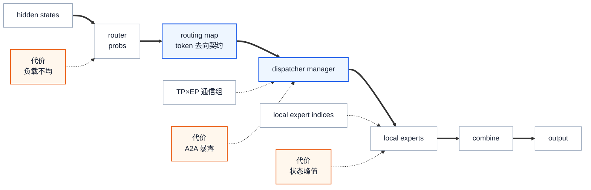

# Megatron-LM MoE 训练优化：围绕四种所有权的机制地图

> **源码基线**：`NVIDIA/Megatron-LM@71092579522a12522d9f323ae180c9825d01928a`（`dev`，2026-08-27）
> **维度**：Overview / Mechanism Map。本页解释 MoE 优化之间的因果关系和选型顺序；EP、通信重叠、显存、精度与融合的实现细节由对应专题页负责。
> **定位**：先读 [[01_megatron_architecture_analysis]] 建立训练状态机，再用本页判断 MoE 的瓶颈属于 token、专家参数、激活还是执行窗口。
> **最近更新**：2026-08-29。删除固定规模配方、重复代码与配置目录，改写为四种所有权的机制分析；保留当前基线下可验证的互斥条件和演进证据。

---

## 1. 背景：稀疏计算打破了稠密层的共址假设

稠密 FFN 的输入、权重和计算通常在同一并行切分内相遇。MoE 则先由 router 为每个 token 选择少数 expert，再把 token 送到真正持有这些 expert 的 rank。稀疏激活减少了单个 token 参与的计算，却同时引入三种新的不确定性：每个 rank 收到多少 token、这些 token 要跨越哪条通信域、为 backward 保留的专家激活能活多久。

源码中的 `MoELayer.forward()` 也不是一个普通 MLP 调用。它明确分成 routing/preprocess、dispatch、expert computation、combine 四步（`megatron/core/transformer/moe/moe_layer.py:668-682`），实际执行顺序落在 `route → preprocess → dispatch → routed_experts_compute → combine → postprocess`（`:738-786`）。优化若不尊重这条依赖链，就可能减少一处显存，却扩大 A2A；隐藏一段通信，却延长激活寿命；或者让各 rank 对有效 token 数产生不同理解。

**本文的主线**：Megatron 的 MoE 优化不是七个可以任意叠加的技巧，而是围绕四种所有权重新安排资源：

1. **token 所有权**：router 的决定怎样变成跨 rank 的 dispatch/combine；
2. **专家参数所有权**：哪些 rank 持有哪些 expert，参数和梯度在哪个组内同步；
3. **激活与优化器状态所有权**：谁保留、重算、卸载或分页管理这些状态；
4. **时间窗口所有权**：哪段独立计算可以覆盖哪次通信，谁负责等待。

粗箭头是 token 在一次 MoE forward 中必须经过的路径；蓝色只突出本页的核心契约 `routing_map → dispatcher manager`；橙色是三种真实成本，不代表某个模块“性能差”。`routing_map` 的二维 token-to-expert 语义由 router 产生（`megatron/core/transformer/moe/router.py:790-824`），Flex dispatcher 内部再把它整理成 `[num_local_tokens, world_size, num_instances]` 的通信契约（`megatron/core/transformer/moe/token_dispatcher.py:989-999`）。

| 所有权问题 | 决定的不是一个开关，而是 | 概念所有者 |
|---|---|---|
| token 去哪里 | routing、容量、置换、A2A 和 combine 是否对同一映射达成一致 | [[14_megatron_ep_analysis]] |
| expert 放哪里 | EP/TP/PP/DP 进程组与 local expert 集合 | [[17_megatron_parallelism_orchestration_analysis]]、[[14_megatron_ep_analysis]] |
| 状态放哪里、活多久 | optimizer shard、重计算、offload、paged stash 的互斥与生命周期 | [[16_megatron_distributed_optimizer_analysis]]、[[18_megatron_recompute_analysis]]、[[22_megatron_memory_optimization_analysis]] |
| 等待发生在哪里 | 通信能否藏进一个真实存在的计算窗口 | [[20_megatron_comm_overlap_analysis]] |

---

## 2. 先追一条 token，而不是先背配置项

理解 MoE 的最短源码路径是跟随一个 token 的所有权变化：

| 阶段 | 状态变化 | 源码入口 |
|---|---|---|
| expert 放置 | 全局 expert 编号被切成当前 EP rank 的 `local_expert_indices` | `megatron/core/transformer/moe/moe_layer.py:164-203` |
| 路由 | hidden state 变成 `probs + routing_map` | `megatron/core/transformer/moe/router.py:790-887` |
| 分发准备 | routing map 被整理为具体 backend 可消费的元数据 | `megatron/core/transformer/moe/moe_layer.py:450-508` |
| 跨 rank 分发 | token 与概率被送到持有目标 expert 的 rank | `megatron/core/transformer/moe/moe_layer.py:520-529` |
| 本地计算 | token 先按 local expert 重排，再进入 grouped/local expert | `megatron/core/transformer/moe/moe_layer.py:592-625` |
| 归并 | expert 输出沿映射逆向返回并恢复 token 顺序 | `megatron/core/transformer/moe/moe_layer.py:627-659` |

这条路径揭示了为什么“打开 EP”不是完整解释：EP 只改变 expert 的位置；router、dispatcher、local compute 和 combine 还必须围绕同一份映射完成一次可逆的数据搬运。

---

## 3. Token 所有权：把路由语义与通信后端分开

### 3.1 问题不是选出 TopK，而是让选择在所有阶段保持可逆

router 输出的不只是概率，还要输出 token-to-expert 的 `routing_map`。它在 top-k/sinkhorn/hash 等路由之后处理 padding、capacity dropping 和 aux loss，最后把 `probs, routing_map` 一起交给下游（`megatron/core/transformer/moe/router.py:803-887`）。这份映射必须同时回答三个问题：某个 token 发给谁、某个 local expert 收到哪些 token、combine 时怎样把多个 expert 输出还原到原 token。

如果通信后端自己重新解释 router 结果，DeepEP、HybridEP、NCCL EP 等实现就可能各自拥有一套容量和置换语义。Megatron 的选择是让 router 固定语义，让 dispatcher 只负责把语义落实到通信。

### 3.2 Manager 抽象隔离的是并行策略，而不是隐藏通信成本

`MoEFlexTokenDispatcher` 的 docstring 明确说明：它在 TP 与 EP rank 上使用一个通信组，使 dispatch 逻辑独立于具体并行策略（`megatron/core/transformer/moe/token_dispatcher.py:1858-1862`）。`_DispatchManager` 进一步规定统一的三维 routing map 契约（`:989-999`）；构造器只根据配置选择 DeepEP、DeepEP v2、HybridEP 或 NCCL EP manager（`:1884-1927`）。

这层抽象的判据是变化频率：router 的“token 属于哪个 expert”相对稳定，通信 backend 和硬件能力却持续变化。把两者绑在一起，会让增加一个 backend 同时改动路由、MoE layer 和通信代码；manager 边界让 backend 只负责 dispatch/combine 的实现。

代价也很具体。统一接口不等于统一形状能力：HybridEP、DeepEP、DeepEP v2 都会把非 fp32 router probs 转成 fp32，并给出相应 warning（`megatron/core/transformer/moe/token_dispatcher.py:1194-1200`、`:1370-1376`、`:1588-1594`）；DeepEP、DeepEP v2 和 NCCL EP 又要求 `TP×EP > 1`（`:1885-1915`）。抽象消除了上层分支，没有消除 backend 的前提。

### 3.3 变长 token 暴露了真正的不变量

“各 rank token 数相同”在固定序列训练里容易被当作常识，THD packing 和动态 CP 却会打破它。HybridEP 只有显式打开 `moe_hybridep_pad_variable_tokens` 才在 TP×EP 组内求最大 token 数并补齐（`megatron/core/transformer/moe/token_dispatcher.py:1127-1149`）；配置注释要求关闭该选项时由调用方保证等长，CUDA Graph 输入则应在上游静态 padding（`megatron/core/transformer/transformer_config.py:981-988`）。

同一问题还推翻过 aux loss 的旧缩放：当前实现会对有效 token 数做组内 `all_reduce`，注释明确说明 `local_num_tokens × group_size` 在 THD padding 或动态 CP 下通常不正确（`megatron/core/transformer/moe/router.py:598-624`）。这里的原则不是“多做一次 all-reduce”，而是**全局量必须来自真实归约，不能由一个已失效的等长假设反推**。

---

## 4. 专家参数所有权：并行轴决定谁持有状态，而不只是怎样通信

`BaseMoELayer` 从 EP group 读取 size/rank，要求 expert 数能被 EP size 整除，再据此计算 `num_local_experts` 和当前 rank 的连续 expert 编号区间（`megatron/core/transformer/moe/moe_layer.py:182-199`）。因此 EP 的第一作用不是发起 A2A，而是改变参数所有权：每个 rank 只实例化本地 experts，dispatcher 必须把 token 搬到这些参数所在的位置。

TP、PP、DP/分布式优化器解决的是不同层次的所有权：TP 切单个 expert 内的矩阵，PP 切 MoE layer 所在的深度，DP 决定副本和梯度规约域，EP 切 expert 集合。它们可以同时存在，却不是“正交开关”：MoE layer 同时消费 `pg_collection.ep`、`pg_collection.tp` 和 `pg_collection.tp_ep`，并把同一组对象继续传给 router、dispatcher 和 experts（`megatron/core/transformer/moe/moe_layer.py:230-270`、`:306-338`）。

直观替代是让每个组件自行调用全局 `parallel_state` 获取所需 group。它减少显式参数，却隐藏了“当前 TP 是 attention TP 还是 expert TP”这类语义差异。当前代码优先接收 `ProcessGroupCollection`，但未传时仍回退全局状态，旁边 TODO 明确要求删除这种用法（`megatron/core/transformer/moe/moe_layer.py:239-247`）。这说明显式所有权是目标边界，全局回退仍是迁移成本。

选择并行度时，先问“哪类状态放不下、应由哪个轴拥有”，再问具体数值。按模型总参数量直接给出一套 TP/PP/EP 配方并不可靠，因为 expert 数、层数、hidden size、网络拓扑和节点边界都会改变决定条件。本页因此不再提供脱离模型配置与硬件基线的固定规模配方。

---

## 5. 激活与优化器状态所有权：省显存的手段会争抢同一对象

MoE 的状态不只包括 expert 权重。router 中间量、置换后的 token、expert FC1 激活、梯度 buffer 和 optimizer state 都有不同的生命周期。重计算选择“不保存、反向再算”，offload 选择“暂时交给 CPU”，paged stash 选择“由容量受控的页池接管”，分布式优化器则改变参数/梯度/状态在 DP 域内的持有方式。它们优化的对象不同，但并不天然可叠加。

源码把最危险的冲突提前到构造期。打开 `moe_paged_stash` 时，`cpu_offloading` 必须关闭，必须配置 `moe_expert_rank_capacity_factor`，且 `offload_modules` 不能再包含 `expert_fc1`、`moe_act` 或 `fused_group_mlp`，因为 paged stash 已经接管这些激活（`megatron/core/transformer/transformer_config.py:2547-2560`）。这不是保守的参数校验，而是所有权冲突：两个机制若同时认为自己负责搬运或释放同一激活，运行期很难维持唯一生命周期。

DDP 侧也不是逐参数自由组合。`_ParamAndGradBuffer` 先把参数和梯度拼成连续 buffer，再按 `bucket_size` 切桶（`megatron/core/distributed/param_and_grad_buffer.py:1066-1079`）；CPU backup、通信和 bucket sizing 都围绕这块连续存储定义（`megatron/core/distributed/distributed_data_parallel_config.py:29-74`）。因此逐参数 offload 或随意改变参数布局，可能破坏下游注册、规约和 optimizer shard 的共同粒度。

选显存技术时应按对象而不是按功能名称排查：究竟是 optimizer state、expert 参数、保存激活还是临时通信 buffer 达到峰值？只有先确定对象的当前所有者，才能判断应该分片、重算、卸载还是复用。具体实现与测量方法见 [[16_megatron_distributed_optimizer_analysis]]、[[18_megatron_recompute_analysis]] 和 [[22_megatron_memory_optimization_analysis]]。

---

## 6. 时间窗口所有权：Overlap 不是把 collective 改成异步

通信只有在后续存在与它无依赖的计算时才能被隐藏。MoE forward 的依赖链很严格：router 完成后才能 dispatch，目标 expert 收到 token 后才能计算，expert 输出完成后才能 combine。能够形成窗口的是旁支工作或相邻 microbatch，例如 shared expert、另一个通信域上的规约、或者 schedule 已经安排好的下一段计算。

源码因此把重叠点放在具体依赖边界上，而不是提供一个“全部异步”的总开关。`dispatch()` 可以在反向阶段为 expert weight-gradient 延迟注册事件（`megatron/core/transformer/moe/moe_layer.py:520-529`）；shared expert 只有在配置允许时才作为独立计算路径处理（`:531-557`）；routed experts 又必须等 dispatch postprocess 完成后才能运行（`:592-623`）。每个窗口的所有者不同，等待点也不同。

这解释了为什么 Overlap 不是“免费的午餐”。异步路径通常需要额外 stream、event、通信 buffer，且更长的在途生命周期会抬高峰值显存；依赖不足时，异步只会把同一段等待移动到稍后。正确顺序是先用 timeline 找到暴露通信，再确认独立计算窗口，最后选择对应维度的 overlap。五个并行维度的真实载体和失败条件见 [[20_megatron_comm_overlap_analysis]]。

融合和低精度也属于时间/带宽优化，但解决的是另一层问题：融合减少 kernel launch 与中间读写，低精度减少计算和通信字节；它们不能修复错误的 token 放置或负载不均。具体边界见 [[21_megatron_fusion_operators_analysis]] 与 [[23_megatron_precision_cudagraph_fusion_analysis]]。

---

## 7. 选型顺序：先定位所有权，再选择机制

下面不是推荐配置表，而是一条诊断顺序。每一步都要求用模型配置、内存快照或 timeline 验证，不能只按参数规模推断。

| 观测到的问题 | 先确认的所有权 | 第一组候选机制 | 不应直接下的结论 |
|---|---|---|---|
| expert 参数或 optimizer state 放不下 | expert/参数状态由哪些 EP、TP、DP rank 持有 | EP、PP、分布式优化器、FSDP、参数低精度 | “模型达到某个 B 数就固定用 TP=x” |
| 保存激活达到峰值 | 哪类激活活得最长，当前由谁管理 | selective recompute、offload、paged stash | 把所有省显存开关同时打开 |
| A2A 暴露在关键路径 | token 去向、消息大小和可覆盖窗口 | dispatcher/backend、EP 拓扑、针对性的 overlap | 只把 collective 改成 async 就会变快 |
| expert GEMM 利用率低 | 每个 local expert 实际收到多少 token | routing/容量策略、grouped GEMM、融合 | 只更换 kernel 而忽略负载不均 |
| 变长训练出错或无法图化 | 各 rank 的有效 token 数和 shape 谁保证 | 显式 padding、真实 token count 归约、静态 graph 输入 | 用 `local_count × group_size` 代替归约 |
| 长序列同时推高 attention 和 MoE 压力 | CP/SP 切分后每个 rank 的有效 token 形状 | CP/SP、packed sequence、动态 CP 专项机制 | 把并行轴视为互不影响 |

一个稳妥的组合过程是：先让参数和必要激活装得下，再建立正确的 expert/token 所有权；随后验证负载和数值稳定性；最后才根据 profile 引入 overlap、融合和更激进的低精度。顺序的依据是可诊断性：如果所有机制一起打开，错误的 token 计数、shape 前提和异步等待会彼此遮蔽。

---

## 8. 当前基线的硬边界

| 边界 | 机制含义 | 源码证据 |
|---|---|---|
| `num_moe_experts` 必须能被 EP size 整除 | 每个 EP rank 才能拥有确定数量的 local experts | `megatron/core/transformer/moe/moe_layer.py:185-199` |
| 训练时 attention TP > 1 要求 sequence parallel | 否则 MoE + TP 路径直接报性能退化错误 | `megatron/core/transformer/moe/moe_layer.py:694-698` |
| Flex backend 仍有 dtype/拓扑前提 | manager 抽象不消除 backend 限制 | `megatron/core/transformer/moe/token_dispatcher.py:1194-1200`、`:1370-1376`、`:1588-1594`、`:1885-1915` |
| HybridEP 变长 token 补齐不是默认行为 | 关闭时调用方必须保证组内等长；图捕获应上游静态 padding | `megatron/core/transformer/transformer_config.py:981-988`、`megatron/core/transformer/moe/token_dispatcher.py:1127-1149` |
| Paged stash 与 CPU/offload 模块互斥 | 多个机制不能同时拥有相同专家激活 | `megatron/core/transformer/transformer_config.py:2547-2560` |
| DDP bucket 粒度受约束 | `bucket_size` 与 `num_buckets` 不能同时指定 | `megatron/core/distributed/distributed_data_parallel_config.py:60-74`、`:313-315` |
| 有效 token 总量不能由组大小反推 | THD padding 与动态 CP 下各 rank 数量可不同 | `megatron/core/transformer/moe/router.py:598-624` |

这些边界比一张“所有技术均可叠加”的矩阵更接近真实系统：优化组合首先是所有权和不变量是否相容，其次才是性能收益。

---

## 9. 演进方向：动态形状与隐式状态正在被逐步收紧

> [!note] 推断
> 以下方向由当前注释、兼容分支和已发生的提交变化锚定，不代表上游承诺的路线图。

- Flex dispatcher 已有 `deepep`、`deepepv2`、`hybridep`、`ncclep` 四个 backend（`megatron/core/transformer/transformer_config.py:972-976`、`megatron/core/transformer/moe/token_dispatcher.py:1884-1927`）。稳定契约留在 routing map 和 manager 边界，backend 继续扩张。
- 提交 `904ef6d86` 删除了 HybridEP 在 sequence packing 下的自动运行期补齐；当前只在显式开关下执行组内 MAX 和 padding（`megatron/core/transformer/moe/token_dispatcher.py:1127-1149`）。这与 CUDA Graph 要求静态 shape 的压力一致。
- aux/z-loss 缩放已从 `local_count × group_size` 改为真实 token count 归约（`megatron/core/transformer/moe/router.py:598-624`），说明变长训练正在迫使隐含的等长假设退出实现。
- `MoELayer` 已接收 `ProcessGroupCollection`，同时在全局回退旁留下删除 `parallel_state` 用法的 TODO（`megatron/core/transformer/moe/moe_layer.py:230-247`）。通信身份正在从环境状态转为显式依赖。

这几条变化共同指向一个更可组合的 MoE 内核：路由契约稳定，后端可替换，动态量必须显式处理，通信组必须明确传递。代价是迁移期接口更多，静态图化与变长输入之间仍需配置者作出明确选择。

---

## Related Pages

- [[01_megatron_architecture_analysis]] — 建立本页依赖的训练状态、schedule 与 optimizer commit 边界。
- [[14_megatron_ep_analysis]] — 深入 router、dispatch/combine、MoE Parallel Folding 与各 EP backend。
- [[16_megatron_distributed_optimizer_analysis]] — 解释参数、梯度和 optimizer state 在 DP 域内的所有权。
- [[17_megatron_parallelism_orchestration_analysis]] — 解释 TP/PP/CP/EP/DP 与组合进程组怎样生成。
- [[20_megatron_comm_overlap_analysis]] — 展开各通信维度真正可用的计算窗口、等待点和显存代价。
- [[22_megatron_memory_optimization_analysis]] — 展开 paged stash、offload、buffer 复用与峰值测量。
- [[23_megatron_precision_cudagraph_fusion_analysis]] — 深入低精度、CUDA Graph 与融合执行的 shape/硬件边界。
