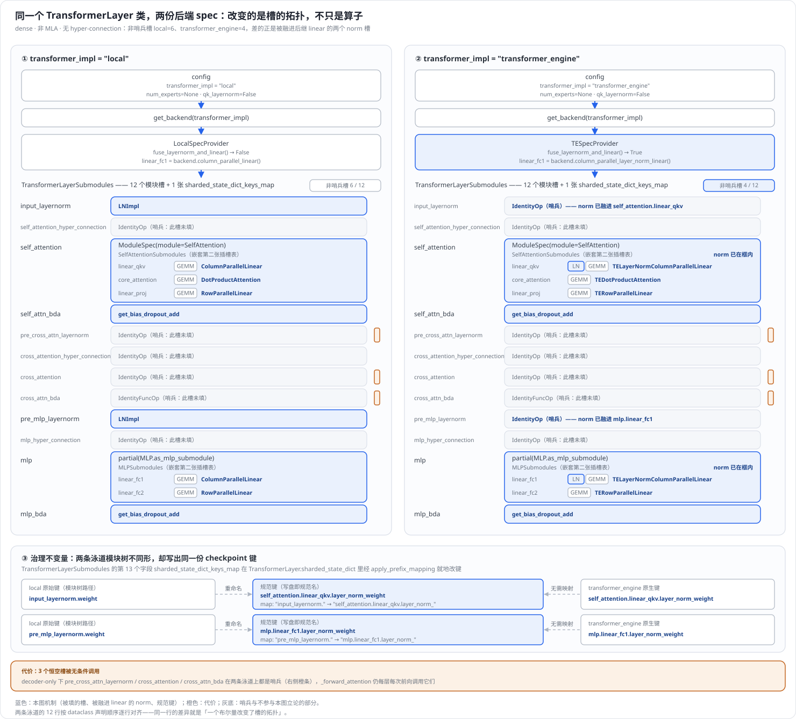
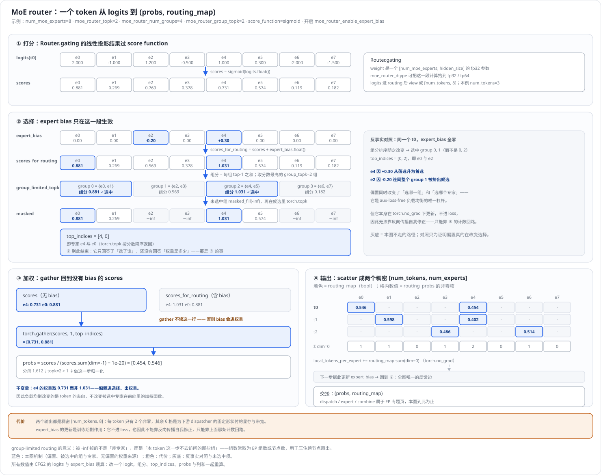
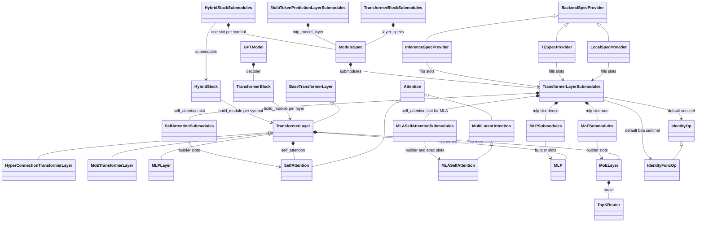

# Megatron-LM 模型结构深度解析(Model Structure)

> **源码基线**：`NVIDIA/Megatron-LM@85902ef599ea4eb06ada7567a479c524b605767a`（`dev`，2026-09-01）
> **核心源码**：`megatron/core/transformer/spec_utils.py`、`megatron/core/transformer/transformer_layer.py`、`megatron/core/transformer/transformer_block.py`、`megatron/core/models/backends.py`、`megatron/core/models/gpt/gpt_layer_specs.py`、`megatron/core/models/gpt/gpt_model.py`、`megatron/core/transformer/attention.py`、`megatron/core/transformer/mlp.py`、`megatron/core/transformer/moe/router.py`、`megatron/core/transformer/multi_token_prediction.py`、`megatron/core/models/hybrid/hybrid_block.py`、`gpt_builders.py`（仓库根目录）
> **中心结论**：Megatron 的模型不是一个固定的 `nn.Module`，而是**先把「后端差异」和「结构差异」一起压进一张插槽表，再在构造期按表实例化**。`BackendSpecProvider` 回答的不只是「用哪个算子」，还包括「layernorm 与 linear 是否合成一个模块」这种改变插槽拓扑的问题；`TransformerLayerSubmodules` 的 12 个槽以 `IdentityOp` 为默认哨兵，使同一个 `TransformerLayer.forward` 能无条件跑过所有槽；`build_module` 与新一代 builder Protocol 负责把槽变成活模块。代价是这些结构约束不再由类型系统保证，而散在构造期的断言、白名单与 pattern 校验里。
> **适用范围**：本页拥有 spec 机制本身（`ModuleSpec` / `build_module` / builder Protocol / 插槽表 / spec provider 选路）、装配链（层 → block → 模型）、结构变体目录（attention 家族、MoE router 算法、MLP 与归一化与位置编码、MTP、SSM 混合、`models/` 具体装配），以及 spec 与 checkpoint 键空间的耦合。装配出来的模块**如何被切分和通信**不属于本页：TP 切分见 [[12_megatron_tp_analysis]]，CP 见 [[13_megatron_cp_analysis]]，MoE dispatcher 与 EP 见 [[14_megatron_ep_analysis]]，重计算策略见 [[18_megatron_recompute_analysis]]，DSv4 的并行案例见 [[34_deepseek_v4_tensor_parallel_analysis]]，融合算子见 [[21_megatron_fusion_operators_analysis]]。
> **最近更新**：2026-09-04。全页在冻结基线上重核：删除全部 `path:line` 引用，改为 §3.2 的稳定符号阅读路线；把叙事从「组件清单」改写为「spec 系统的构造期契约 + 变体的选择条件与代价」；纠正三处已漂移的旧结论（并非所有槽都走 `build_module`、GPT MoE 路径用的是普通 `TransformerLayer` 而非 `MoETransformerLayer`、层符号表漏了 `K` 与 `+`）；新增 builder Protocol 迁移、MLA 构造期类白名单、Kitchen provider 在公共树里只有桩、spec 与 checkpoint 键空间耦合四条源码事实。另于同日按算法重放要求改写 §2：§2.1 从一份具名 config 完整重放到活模块树，§2.3.1 把同一份 config 在三个 provider 上各跑一遍并结算增量代价，§2.3.3 用一个具体 token 重放 MoE router 的打分、专家偏置、分组 top-k 与 `routing_map` 构造；新增两张由 `tools/figs/svg/megatron_model_structure_figures.mjs` 生成、并由回归测试锁死数值的原理图。

---

## 1. 特性概览

### 1.1 问题背景

一个 Transformer 层的**代码形状**同时受两组正交压力挤压：一组是「算子由谁实现」——同一个 QKV 投影可以是 Megatron 自带的 `ColumnParallelLinear`、Transformer Engine 的融合实现、或推理专用实现，而 TE 与 apex 都是**可选依赖**，缺失时相关符号在 import 期根本不存在；另一组是「层里有什么」——dense FFN 还是 MoE，MHA 还是 GQA 还是 MLA，有没有 QK-Norm，有没有交叉注意力，甚至第一子层根本不是注意力而是 Mamba 或 GatedDeltaNet。要命的是这两组压力**并不独立**：后端的差异里含有「layernorm 与 linear 是否合并成一个模块」这种直接改变层内模块数量的问题，于是「后端 × 结构」的组合会同时爆炸。如果每个组合各写一个 `nn.Module` 子类，类数量近似为

$$
N_{\mathrm{subclass}}=\lvert B\rvert\cdot\lvert S\rvert,
$$

其中 $B$ 是后端集合、$S$ 是结构变体集合；本基线上 $\lvert B\rvert$ 已有 local / transformer_engine / inference_optimized / kitchen 四档，$S$ 仅在一个 GPT spec 工厂里就由 `multi_latent_attention`、`num_experts`、`qk_layernorm`、`qk_l2_norm`、`use_te_op_fuser`、`enable_hyper_connection`、`mla_down_proj_fusion` 等开关张成。

### 1.2 解决方法

Megatron 把这个乘积**拆成两个加法**：后端差异由一个 `BackendSpecProvider` 协议回答（每个后端一份实现），结构差异由一张**插槽表**描述（每种结构一份工厂函数），二者在 spec 工厂里相遇，产出一个纯数据的 `ModuleSpec`。真正的模块实例化推迟到**构造期**：`build_module` 按 spec 递归实例化，或者——在已迁移的槽上——直接把槽当作满足某个 builder Protocol 的可调用对象调用。

由此，状态与所有权发生了一次关键搬迁：**「这一层由哪些模块组成」从 Python 的类继承结构，搬到了一个可以在运行时构造、切片、复制、改写的 dataclass 里**。`TransformerLayer` 类本身退化为一个只认识 12 个槽名和它们调用顺序的骨架；`TransformerBlock` 只认识「一列层 spec」；`GPTModel` 只把一个 spec 转手交给 block。所有「选哪个实现 / 有没有这个组件」的决策都集中到构造期的 spec 工厂里，前向路径上不再有 `if HAVE_TE`。

### 1.3 收益、开销和约束

| 维度 | 直接收益 | 必付成本或边界 |
|---|---|---|
| 可换实现 | 换 spec provider 即换整栈算子后端，模型代码零改动；训推路径可用同一份层代码 | 不同后端的模块树形状不同，跨后端读同一份 checkpoint 依赖 §4 的键重命名表 |
| 可裁剪 | 不需要的槽填 `IdentityOp` / `IdentityFuncOp`，`forward` 无需对每个槽判空 | 空槽仍被无条件调用：decoder-only 模型每层每次前向白跑 `pre_cross_attn_layernorm`、`cross_attention` 与 `cross_attn_bda` 三个空槽 |
| 可混搭 | dense/MoE 按 `moe_layer_freq` 逐层排布；Mamba/GDN/KDA/attention 按 pattern 串混排 | 一旦层不同构，checkpoint 键空间从「层轴分片」退化为「逐层全局索引」，且 pattern 校验成为新的失败面 |
| 类型安全 | 新一代 builder Protocol（`MlpBuilder`、`LayerNormBuilder`、`LinearQkvBuilder`…）把「槽该怎么被调用」写成类型 | 迁移未完成：`build_module` 仍要为旧式 `ModuleSpec` 做 rewrap 并 warning，`TransformerLayer.__init__` 还留着一处 `try/except TypeError` 兜底 |
| 失败时机 | 组合错误在构造期就炸，不会跑到第 100 步才发现 | 错误发生在 `build_module`、`_get_block_submodules`、pattern 校验那一刻，**不是** import 期；静态检查看不见 |
| 可读性 | 「模型长什么样」集中在几个 spec 工厂里 | 读懂一层要同时打开 provider、spec 工厂、插槽表、层构造函数四处；「这一层到底是不是 MoE」只能构造完后由 `isinstance` 反查 |

### 1.4 术语约定

| 术语 | 含义 |
|---|---|
| **槽（slot）** | `*Submodules` dataclass 的一个字段，例如 `TransformerLayerSubmodules.self_attention` |
| **插槽表** | 一个 `*Submodules` dataclass 整体，描述某个容器有哪些槽及其默认值 |
| **spec** | `ModuleSpec`，三元组「模块类或 `(路径, 类名)` + `params` + 嵌套 `submodules`」 |
| **builder** | 满足某个 `*Builder` Protocol 的可调用对象——直接调用即得模块实例，不经 `build_module` |
| **provider** | `BackendSpecProvider` 的实现，回答「这个后端用哪个类 / 是否融合 norm 与 linear」 |
| **fan-out** | `TransformerBlock` 把**一个**层 spec 复制成整栈 $L$ 份的动作 |
| **哨兵** | `IdentityOp` / `IdentityFuncOp`，既是空操作，也是可被下游 `isinstance` 读回的「此槽未填」标记 |

---

## 2. 详细方案

### 2.1 最小例子：一份 config 如何变成一棵活模块树

本节先把**一份具名 config 走到一棵能跑前向的模块树**这条路完整走一遍。后面 §2.3 每讲一个变体，都回到同一份 config，只改动其中一个字段，再看它在这条路上的哪一步、把什么改成了什么。

例子取一份最小但真实的 dense GPT 配置：

```python
transformer_impl         = "local"      # 后端三档之一
num_layers               = 4
hidden_size              = 512
num_attention_heads      = 8
num_query_groups         = 8            # == num_attention_heads，即 MHA
kv_channels              = 64
ffn_hidden_size          = 2048
normalization            = "LayerNorm"
qk_layernorm             = False
num_moe_experts          = None         # dense，不是 MoE
multi_latent_attention   = False
enable_hyper_connections = False
```

从这份 config 到模块树只有四步，全部发生在构造期。

#### 2.1.1 第一步：选路，得到一个 spec 而不是一个模型

`gpt_builders.py::gpt_builder` 依次排除四条互斥分支：`args.spec` 为空、`experimental_attention_variant` 为 `None`、`num_moe_experts` 为 `None`、没有 `heterogeneous_layers_config_path`，于是落到默认分支 `_get_transformer_layer_spec(use_te=False, config)`。它再按 `transformer_impl` 三选一，本例调用 `get_gpt_layer_local_spec(...)`。

这一步的产物是**单个 `ModuleSpec`**，不是一摞层。`num_layers=4` 在这里根本没被读到——整栈四层共用同一个 spec 对象，复制发生在更后面的 `_get_block_submodules`。MoE 与实验变体两条分支才返回逐层的 `TransformerBlockSubmodules`；同一个形参承载两种类型，由 `_get_block_submodules` 归一化。

#### 2.1.2 第二步：`get_backend` 把「后端」压成一个对象和一个布尔量

`megatron/core/models/backends.py::get_backend("local")` 返回 `LocalSpecProvider()`（未知字符串 `raise ValueError`）。这个 provider 要回答两类问题：**用哪些类**，以及**norm 和 linear 是不是同一个模块**。

| provider 方法 | `LocalSpecProvider` 的回答 |
|---|---|
| `column_parallel_linear()` | `ColumnParallelLinear` |
| `row_parallel_linear()` | `RowParallelLinear` |
| `core_attention()` | `DotProductAttention` |
| `layer_norm(rms_norm=False, has_residual=True)` | `LNImpl`（装了 apex 是 `FusedLayerNorm`，否则退到 `WrappedTorchNorm` 并 warn） |
| `column_parallel_layer_norm_linear()` | **`None`** |
| `fuse_layernorm_and_linear()` | **`False`** |

前四行只是选型，最后两行才改变结构。`get_mlp_module_spec_for_backend` 里那个 `if backend.fuse_layernorm_and_linear(): linear_fc1 = backend.column_parallel_layer_norm_linear() else: linear_fc1 = backend.column_parallel_linear()`，就是整个 spec 系统里**后端差异唯一一次改变模块数量**的地方。

#### 2.1.3 第三步：spec 工厂填槽，12 个格子里落定 6 个

`get_gpt_layer_local_submodules` 是一个纯函数：config 进，`TransformerLayerSubmodules` 出，不触碰全局状态、不分配任何参数。本例走非 MLA 分支，填出来的 12 个模块槽是：

| # | 槽 | local 后端填了什么 | 为什么是这个值 |
|---:|---|---|---|
| 1 | `input_layernorm` | `LNImpl` | `fuse_layernorm_and_linear()` 为假，norm 必须自己占一个槽 |
| 2 | `self_attention_hyper_connection` | `IdentityOp` | `enable_hyper_connections=False` |
| 3 | `self_attention` | `ModuleSpec(SelfAttention)` | 非 MLA，标准三件套投影 |
| 4 | `self_attn_bda` | `get_bias_dropout_add` | 一个返回函数的可调用对象，不是 `nn.Module` |
| 5 | `pre_cross_attn_layernorm` | `IdentityOp` | decoder-only，工厂根本不填 |
| 6 | `cross_attention_hyper_connection` | `IdentityOp` | 同上 |
| 7 | `cross_attention` | `IdentityOp` | 同上 |
| 8 | `cross_attn_bda` | `IdentityFuncOp` | 同上；哨兵分两种，见下 |
| 9 | `pre_mlp_layernorm` | `LNImpl` | 同 1 |
| 10 | `mlp_hyper_connection` | `IdentityOp` | 同 2 |
| 11 | `mlp` | `partial(MLP.as_mlp_submodule, submodules=MLPSubmodules(...))` | `num_moe_experts is None` |
| 12 | `mlp_bda` | `get_bias_dropout_add` | 同 4 |

**12 个槽里 6 个非哨兵**，另有第 13 个字段 `sharded_state_dict_keys_map` 装着一张两条目的前缀重命名表（§4.1）。哨兵有两种而不是一种：普通模块槽默认 `IdentityOp`，两个 bda 槽默认 `IdentityFuncOp`——因为 bda 槽的调用形状是 `self.mlp_bda(training, fusion)(x, residual, p)`，先取函数再调用，空实现必须也返回一个函数。

嵌套还在继续。`self_attention` 槽装的不是类而是一个 `ModuleSpec`，它自己又带一张 `SelfAttentionSubmodules`：

```python
ModuleSpec(
    module=SelfAttention,                              # 已导入的类,不是 (路径, 类名)
    params={"attn_mask_type": AttnMaskType.causal},    # 构造时补进去的 kwargs
    submodules=SelfAttentionSubmodules(                # 嵌套的第二张插槽表
        linear_qkv=backend.column_parallel_linear(),   # LocalSpecProvider -> ColumnParallelLinear
        core_attention=backend.core_attention(),       # LocalSpecProvider -> DotProductAttention
        linear_proj=backend.row_parallel_linear(),     # LocalSpecProvider -> RowParallelLinear
        q_layernorm=IdentityOp,                        # qk_layernorm 关闭时的哨兵
        k_layernorm=IdentityOp,
    ),
)
```

`mlp` 槽同理带一张 `MLPSubmodules(linear_fc1=ColumnParallelLinear, linear_fc2=RowParallelLinear, activation_func=None)`。到这里为止**一个 `nn.Module` 都还没有**：没有参数、没有 CUDA 张量，整棵树是纯数据，可以被复制、切片、改写。

下图把这一步的结果和把 `transformer_impl` 换成 `"transformer_engine"` 后的结果并排画出来——两条泳道逐行对齐，同一行的差异就是本节要证的那件事：



#### 2.1.4 第四步：`build_module` 与 builder 把槽变成实例

`TransformerLayer.__init__` 拿到这张表后，按槽的声明顺序逐个实例化。**并不是每个槽都走 `build_module`**——这是本页最容易被旧文档带偏的一点。实际分成两类：

- **走 `build_module` 的五个槽**：`self_attention`、`self_attn_bda`、`cross_attention`、`cross_attn_bda`、`mlp_bda`。
- **被当作 builder 直接调用的四个槽**：`input_layernorm`、`pre_cross_attn_layernorm`、`pre_mlp_layernorm`、`mlp`。三个 norm 槽的调用形状固定为 `submodules.input_layernorm(config=…, hidden_size=512, eps=layernorm_epsilon)`；`mlp` 槽是 `submodules.mlp(config=…, pg_collection=…, is_mtp_layer=…, layer_number=…)`。

以 `self_attention` 这一格为例，`build_module(submodules.self_attention, config=…, layer_number=1, pg_collection=…)` 做四步构造期变换：

1. **解析模块身份**。`spec.module` 已是 `type`，直接采用；若它是 `(路径, 类名)` 二元组，才走 `import_module` 动态导入——这一步把「选哪个实现」从 import 期推迟到了装配期。
2. **下沉嵌套插槽表**。`spec.submodules is not None`，于是把整张 `SelfAttentionSubmodules` 作为 `kwargs["submodules"]` 传下去。递归就发生在这里：外层不理解内层的槽名，只负责转交。
3. **合并 params 与调用方 kwargs**，实例化 `SelfAttention(config=…, layer_number=1, submodules=…, attn_mask_type=causal, …)`。
4. **重写异常信息**。构造失败时 `build_module` 捕获并以 `f"{e} when instantiating {module.__name__}"` 重抛——因为模块名在上一行被 `**kwargs` 隐藏掉了，不补这一层，原始 `TypeError` 指不出是哪个槽错了。

关键在于第二步之后：`SelfAttention.__init__` 拿到 `SelfAttentionSubmodules` 后**不再调用 `build_module`**，而是把每个槽当作 builder 直接调用，并在调用点算好形状。本例中 `query_projection_size = kv_channels × num_attention_heads = 512`、`kv_projection_size = kv_channels × num_query_groups = 512`，于是

```text
submodules.linear_qkv(512, 1536, config=…, gather_output=False, tp_group=…)  -> ColumnParallelLinear
submodules.core_attention(config=…, layer_number=1, attn_mask_type=causal)   -> DotProductAttention
submodules.linear_proj(512, 512, config=…, input_is_parallel=True, …)        -> RowParallelLinear
```

`SelfAttentionSubmodules` 的字段类型也已经从 `Union[ModuleSpec, type]` 改成了 `LinearQkvBuilder` / `CoreAttentionBuilder` / `LinearProjBuilder` / `LayerNormBuilder` 这样的 Protocol。整个 `megatron/core` 里 `build_module` 的调用点集中在 hybrid、SSM、MTP、MLA 与实验性 attention 变体等尚未迁移的区域，`attention.py` 与 `mlp.py` 内部已经没有它了。

#### 2.1.5 结果：一层长什么样

四步走完，`TransformerLayer` 实例里挂着的是：

```text
TransformerLayer(layer_number=1)
+-- input_layernorm      LNImpl(hidden_size=512)
+-- self_attention       SelfAttention
|   +-- linear_qkv       ColumnParallelLinear(512 -> 1536)
|   +-- core_attention   DotProductAttention(8 heads x 64)
|   +-- linear_proj      RowParallelLinear(512 -> 512)
|   +-- q_layernorm      IdentityOp
|   `-- k_layernorm      IdentityOp
+-- self_attn_bda        get_bias_dropout_add
+-- pre_cross_attn_layernorm  IdentityOp        <- 空槽，前向仍被调用
+-- cross_attention           IdentityOp        <- 空槽，前向仍被调用
+-- cross_attn_bda            IdentityFuncOp    <- 空槽，前向仍被调用
+-- pre_mlp_layernorm    LNImpl(hidden_size=512)
+-- mlp                  MLP
|   +-- linear_fc1       ColumnParallelLinear(512 -> 2048)
|   `-- linear_fc2       RowParallelLinear(2048 -> 512)
`-- mlp_bda              get_bias_dropout_add
```

最后一行代码是 `self.is_moe_layer = isinstance(self.mlp, MoELayer)`：层构造完之后，**要靠反查自己的 `mlp` 槽装了什么，才知道自己是不是 MoE 层**。这个属性的存在本身就是「结构信息已经从类型系统搬走」的证据。

三个标了 `<-` 的空槽是这条路线的直接代价：`_forward_attention` 无条件调用它们，decoder-only 模型每层每次前向都白跑一遍（§2.1.3 那张插槽拓扑图底部的橙色说明带）。

### 2.2 从一个槽到整个模型

上面的最小例子只解释了「一个槽怎么活过来」。要把它放进系统，需要沿着**谁决定槽的内容 → 谁决定有多少层 → 谁决定模型的非层部分**这条链走完。下面逐个组件回答「契约是什么 / 为什么是这个边界、否掉了什么 / 状态怎么流过 / 守卫与代价」。

| 组件 | 责任与契约 | 为什么是这个边界，被否掉的替代 | 状态/控制如何流过 | 守卫与代价 |
|---|---|---|---|---|
| `BackendSpecProvider` 及其三个实现 | 输入：无（provider 自身即后端身份）。输出：一组类，加一个布尔量 `fuse_layernorm_and_linear()` | **被否掉：每种后端各写一份 `TransformerLayer` 子类。** 判据是这个 Protocol 里那个布尔量——`LocalSpecProvider` 返回 `False`、`InferenceSpecProvider` 返回 `True`，它改变的是**层有几个模块**而不是某个算子怎么算，子类方案会按 $\lvert B\rvert\cdot\lvert S\rvert$ 膨胀 | `get_backend(transformer_impl)` 按字符串三选一返回实例；spec 工厂拿它去填槽 | `get_backend` 对未知字符串 `raise ValueError`；`use_kitchen=True` 时 `assert HAVE_KITCHEN`——而公共树里 `megatron/core/extensions/kitchen.py` 是一个自述 “not released publicly … just a stub” 的桩文件，`HAVE_KITCHEN=False` 且 `KitchenSpecProvider` 是 `MagicMock()` |
| spec 工厂（`get_gpt_layer_*_submodules` 家族） | 输入：`config` 派生的一组开关。输出：填好的 `TransformerLayerSubmodules` | **被否掉：在 `forward` 里 `if HAVE_TE` 选实现。** 判据是缺依赖时符号根本不存在：`gpt_layer_specs` 顶部在 `HAVE_TE` 为假时把 `TEFusedMLP`、`TEFusedMLPWithGroupedLinear`、`TENorm`、`TESpecProvider` 一律置成 `None`，缺 apex 时把 `LNImpl` 从 `FusedLayerNorm` 换成 `WrappedTorchNorm` 并 warn——`if` 分支要求这些符号在 import 期就可用 | 纯函数：config 进，dataclass 出，不触碰任何全局状态 | `multi_latent_attention` 与 `qk_l2_norm` 同开时 `assert` 失败；`use_te_op_fuser` 要求 TE ≥ 1.13 且 `num_experts is None`，否则 `ValueError` |
| `TransformerLayerSubmodules` | 12 个模块槽 + 一张 `sharded_state_dict_keys_map`；未填的槽默认 `IdentityOp`（模块）或 `IdentityFuncOp`（返回函数的模块） | **被否掉：不需要的槽直接从层里删掉。** 判据有两条：其一 `_forward_attention` 无条件调用 `self.cross_attention(...)` 与 `self.cross_attn_bda(...)`，删槽会把判空成本原样转嫁回 `forward`；其二哨兵会被**读回**——`mhc_checkpoint_input_layernorm = not isinstance(self.input_layernorm, IdentityOp)`，recompute、offload、CUDA Graph 都靠这个统一标记判断「这个 norm 是不是真的存在」 | 纯数据，从工厂流到 `TransformerLayer.__init__`，并被存成 `self.submodules_config` 供 §4 的 checkpoint 重命名使用 | `IdentityOp.__init__(*args, **kwargs)` 吞掉一切参数，因此它能同时充当 `LayerNormBuilder`（吃 `config`、`hidden_size`、`eps`）和普通模块类；代价是**类型错误在这里静默通过** |
| `build_module` 与 builder Protocol | 前者：spec → 实例，含动态 import、`params` 合并、`submodules` 下沉、异常重写。后者：把「槽该被怎样调用」写成可静态检查的签名 | **被否掉：让所有槽永远走 `build_module`。** 判据是 `build_module` 把 kwargs 原样 splat 进构造函数，签名对类型检查器不可见；证据是 `TransformerLayer.__init__` 至今需要一处 `try: self.mlp = submodules.mlp(**mlp_kwargs) except TypeError:` 回退给「不接受 `layer_number` 的 MLP builder」 | `build_module` 无状态；builder 直接调用，参数在调用点写死 | `import_module` 顶上留着 “TODO: make this importer module more robust, at least make sure there are no side effects of using this as is”；旧式 `ModuleSpec(module=MLP)` 会被 `TransformerLayer.__init__` 就地 rewrap 成 `partial(MLP.as_mlp_submodule, …)` 并打 WARNING 建议迁移 |
| `TransformerLayer` | 输入 `[s,b,h]`，输出同形 `(hidden_states, context)`；只认识 12 个槽名与它们的固定调用顺序 | **被否掉：为 MoE 派生 `MoETransformerLayer` 作为通用 MoE 层。** 判据是 GPT 路径**不这么做**——`get_gpt_decoder_layer_specs` 产出的 dense 与 MoE 两份 spec 用的是同一个 `TransformerLayer` 类，差别只在 `mlp` 槽里装的是 `partial(MLP.as_mlp_submodule, …)` 还是 `partial(MoELayer, submodules=MoESubmodules(...))`；`MoETransformerLayer` 只在 hybrid 栈的 `E` 符号和 modelopt spec 里出现，因为那里需要**层级**的 CUDA Graph scope 切换与 router/expert 分段前向，那才是子类化真正换来的东西 | 构造后由 `self.is_moe_layer = isinstance(self.mlp, MoELayer)` 反查自身身份；前向沿 pre-norm 残差结构走两个子层 | `enable_hyper_connections=True` 时直接调 `TransformerLayer.forward()` 抛 `RuntimeError`，必须经 `HyperConnectionTransformerLayer` 或 hybrid 的包装器 |
| `_get_block_submodules` 的 fan-out | 输入一个 spec 或一张 `TransformerBlockSubmodules`；输出后者 | **被否掉：取消 `BaseTransformerLayer` 这个空基类。** 判据是 fan-out 判定就靠 `issubclass(spec.module, BaseTransformerLayer)`——只有通过它，一个 spec 才能被复制成 `num_layers` 份；否则落进 `raise Exception(f"specialize for {spec.module.__name__}.")`。`BaseTransformerLayer` 的 docstring 自陈是 “dummy class”，存在的唯一目的就是让这个判定成立 | 一个 spec 对象被复制引用 $L$ 次（不是深拷贝），层间差异全部由 `layer_number` 承担 | 传进来的既不是 `TransformerBlockSubmodules` 也不是 `ModuleSpec` 时同样 `raise Exception`；两种写法的等价性由 `test_transformer_block_custom` 锁定 |
| `TransformerBlock._build_layers` | 把层 spec 列表变成 `nn.ModuleList`，并挂上 final layernorm | **被否掉：在层内部自己处理量化上下文。** 判据是 `build_layer` 把 `build_module` 包在 `get_fp8_context(..., is_init=True)` / `get_fp4_context(...)` 里——量化 recipe 必须在**权重创建那一刻**生效，放进层内部就晚了 | 逐层计算 `global_layer_number`；`heterogeneous_block_specs` 时用 `config.get_config_for_layer(...)` 换成逐层 config | final layernorm 只在 `has_final_layernorm_in_this_stage()` 为真的 stage 上建，否则显式置 `None` |
| `GPTModel.__init__` | 把 embedding、decoder、可选 MTP、output layer 拼成完整模型 | **spec 的边界就画在这里。** `transformer_layer_spec` 只交给 `TransformerBlock`；`LanguageModelEmbedding`、`RotaryEmbedding` / `YarnRotaryEmbedding` / `MultimodalRotaryEmbedding`、`LinearCrossEntropyModule` / `TELMHeadColumnParallelLinear` 全部由构造函数里的 `if/elif` 按 `config` 直接选类，**没有槽**。这是一条源码事实；「因为这些部件的变体少且与后端解耦，不值得为它们再造一张插槽表」是本文的推断，源码未给理由 | `pre_process` / `post_process` / `mtp_process` 三个布尔量决定本 PP stage 建哪几部分 | `mtp_block_spec` 为 `None` 时整个 MTP 分支消失；`share_embeddings_and_output_weights` 会让 output layer 跳过参数分配 |

一句话概括这条链：**spec 系统统治的是「decoder 层的内部」，不是整个模型。** 越过 `TransformerBlock` 的边界，Megatron 立刻回到普通的构造函数分支。

### 2.3 结构变体与它们的选择条件

下面按「读者手里拿着一份 config，要判断装出来的是什么」组织。每一条给出**选择条件**、**它换来什么**、**它要付什么**。

#### 2.3.1 后端三档：一个布尔量如何改变槽的拓扑

三个 provider 是本页最典型的「同一份输入、三条不同数据平面」：它们不只换算子，还各自改写模块树的形状。把 §2.1 那份 config 的 `transformer_impl` 逐个换掉，其余字段一字不动，三次重放如下。

**换成 `"transformer_engine"`。** 第二步 `get_backend` 返回 `TESpecProvider()`，`fuse_layernorm_and_linear() → True`、`column_parallel_layer_norm_linear() → TELayerNormColumnParallelLinear`。第三步的工厂因此走了两条不同的赋值：`SelfAttentionSubmodules.linear_qkv` 直接填 `backend.column_parallel_layer_norm_linear()`；`get_mlp_module_spec_for_backend` 里的 `if backend.fuse_layernorm_and_linear()` 命中，`MLPSubmodules.linear_fc1` 同样换成融合版。与此同时，工厂**根本不给** `input_layernorm` 传值（`pre_mlp_layernorm` 只在 `num_experts` 非空时才填），两个槽退回默认 `IdentityOp`。于是 12 槽里非哨兵从 6 掉到 **4**：模块树少了两层，而层的**行为**没变——norm 还在算，只是搬进了后继 linear 的内部。第四步构造出的 `linear_qkv` 因此同时持有 `layer_norm_weight` 与 `weight` 两组参数。

**换成 `"inference_optimized"`。** `InferenceSpecProvider` 对那个布尔量的回答同样是 `True`，`column_parallel_layer_norm_linear() → InferenceLayerNormColumnParallelLinear`，非哨兵槽数同为 **4**，拓扑与 TE 一致；差别落在具体类（`InferenceColumnParallelLinear` / `InferenceRowParallelLinear`）和一组**反向施加到 config 上的结构要求**。

| `transformer_impl` | provider | `fuse_layernorm_and_linear()` | `linear_qkv` 槽装的是 | 两个 norm 槽 | 非哨兵槽数（dense，无 MoE，无 mHC） |
|---|---|---|---|---|---:|
| `local` | `LocalSpecProvider` | `False` | `ColumnParallelLinear` | 真实 `LNImpl` | 6 |
| `transformer_engine` | `TESpecProvider` | `True` | `TELayerNormColumnParallelLinear` | 工厂不填，留 `IdentityOp` | 4 |
| `inference_optimized` | `InferenceSpecProvider` | `True` | `InferenceLayerNormColumnParallelLinear` | 同上，留 `IdentityOp` | 4 |

差的那两个槽正是被融合掉的 `input_layernorm` 与 `pre_mlp_layernorm`。这不是文档推断：`test_constructor` 直接断言 TE dense spec 下 `mhc_checkpoint_input_layernorm` 与 `mhc_checkpoint_pre_mlp_layernorm` 都为假，并在注释里写明「fuses both norms into their following linears, leaving IdentityOp placeholders that must not be checkpointed independently」。§2.1.3 的插槽拓扑图就是这张表的逐槽展开——图里右侧泳道那两枚画进 `linear_qkv` / `linear_fc1` 框内的 `LN` 小片，是「拓扑改变」与「算子替换」的区别所在。

三条数据平面各自的增量代价：

| 平面 | 局部工作量 | 结构增量 | 必付代价 |
|---|---|---|---|
| `local` | 每层 6 次 builder 调用 / `build_module` | norm 独占两个模块 | 写盘时依赖 §4.1 的两条重命名才能与 TE checkpoint 互通；norm 与 linear 之间多一次激活往返 |
| `transformer_engine` | 每层 4 次 | norm 并入后继 linear | 依赖可选依赖 TE：`HAVE_TE` 为假时 `gpt_layer_specs` 顶部把 `TEFusedMLP`、`TEFusedMLPWithGroupedLinear`、`TENorm`、`TESpecProvider` 一律置成 `None`，工厂里构造 provider 的那一行随即失败——这正是「`if HAVE_TE` 式的运行时分支要求符号在 import 期就存在」的反面证据 |
| `inference_optimized` | 每层 4 次 | 同 TE | `TransformerConfig.__post_init__` 在该档下断言 `normalization == "RMSNorm"`、`not layernorm_zero_centered_gamma`、`not add_bias_linear`、`not add_qkv_bias`、`not use_kitchen`——本例那份 config 的 `normalization="LayerNorm"` 与默认 `add_bias_linear=True` 会**直接构造失败** |

最后一行值得单独指出：provider 不只是被动提供类，它反过来对 config 提出结构要求。§2.1 那份 config 能在 `local` 与 `transformer_engine` 上原样跑通，换到 `inference_optimized` 就必须先改两个字段——**「换一个后端」不是一个纯粹的实现替换**。

第四档 `kitchen` 在选路代码里是**组合器**而非并列项——`KitchenSpecProvider(fallback=TESpecProvider(...))`，把未覆盖的槽委托给 TE。但它在公共树里只有桩，实际不可用。

#### 2.3.2 Attention 家族：`num_query_groups` 决定几何，spec 决定投影拓扑

标准注意力这一支只用一个槽组合（`linear_qkv` → `core_attention` → `linear_proj`），三种形态的差别**完全由 config 的一个整数决定**，不换 spec：

| 形态 | 条件 | 换来 | 代价与边界 |
|---|---|---|---|
| MHA | `num_query_groups == num_attention_heads` | 每个 Q 头独享 K/V 头，表达力最强 | KV cache 与 KV 投影都按头数线性增长 |
| GQA | `1 < num_query_groups < num_attention_heads` | KV 头变少，decode 期 KV cache 带宽压力下降 | `num_query_groups` 必须是 `tensor_model_parallel_size` 的倍数或约数，否则 `__post_init__` `raise ValueError` |
| MQA | `num_query_groups == 1` | GQA 的极端，KV cache 最小 | 同上；TP 度大于 1 时必然落进「一个 KV group 被多 rank 共享」分支 |

TP 与 `num_query_groups` 的交互发生在 `Attention.__init__`：`num_query_groups < world_size` 时每 rank 的 `num_query_groups_per_partition` 被钉成 1、`num_attention_heads_per_partition` 改按 `num_attention_heads / num_query_groups` 算，并为 `core_attention` 传一份把 `num_query_groups` 抬到 `world_size` 的 `tmp_config`（源码注释说明这是绕开 TE 的整除断言）。**这条分支产生的 all-gather 通信账属于 [[12_megatron_tp_analysis]]**；本页只负责它改变了哪些构造期形状。

注意力输出门是同一支上的可选装饰：`attention_output_gate`（整个 head 维一个门）与 `head_wise_attn_gate`（每头一个标量 sigmoid 门）的权重都并进 `linear_qkv` 的输出维一并产出，二者**不可同开**——`__post_init__` 明写 “incompatible linear_qkv row layouts”。`head_wise_attn_gate` 另外要求 `num_attention_heads % tp == 0` 且 `num_query_groups >= tp`，源码注释给出了理由：门的剥离发生在 `num_query_groups < world_size` 的 AllGather+reslice 回退**之前**，两者叠加会多取走 K/V 的行。`SelfAttention.__init__` 里还有一份同样的断言，注释自陈是 “Defensive runtime guards against config-validation bypass”。

**MLA（多头潜在注意力）** 换的是整个投影拓扑，因此必须换 spec：`MLASelfAttentionSubmodules` 用低秩「压缩 → 上投影」代替单个 `linear_qkv`，KV cache 只需保存压缩后的 latent 而非每头完整的 K、V。它有一处值得单独记账的设计张力——这张插槽表里同时存在两组互斥的槽：非融合路径填 `linear_q_down_proj` + `linear_kv_down_proj`，`mla_down_proj_fusion` 路径改填 `linear_qkv_down_proj`，两组都以 `= None` 为默认值，**互斥关系不由类型系统表达**。更进一步，`MLASelfAttention.__init__` 在构造这些槽时会**检查槽里放的是哪个类**：

```python
if submodules.linear_q_down_proj in [TELinear]:
    q_down_proj_kwargs['parallel_mode'] = 'duplicated'
elif submodules.linear_q_down_proj in [Linear, TEColumnParallelLinear, ColumnParallelLinear]:
    q_down_proj_kwargs['gather_output'] = False
else:
    raise ValueError(f"Unsupported linear_q_down_proj: {submodules.linear_q_down_proj}")
```

源码事实是：这是一份**闭合白名单**，`linear_kv_down_proj` 与融合路径的 `linear_qkv_down_proj` 各有一份同构的白名单。由此推出的判断是本文的：这是 spec 抽象的一处泄漏——「槽里放什么类」本该由 provider 单方面决定，这里却要求消费者预先认识所有合法类，于是任何新后端类都会在构造期 `ValueError`，而不是被当作满足协议的实现接受。

**DSA / DSv4 混合压缩注意力**是 MLA 之上的稀疏化延伸，走一条**独立的 spec 入口**：`get_gpt_decoder_layer_specs` 开头就 `assert config.experimental_attention_variant is None`，把这条路径整个推给 `get_experimental_attention_variant_module_spec`，后者按 `experimental_attention_variant` 分派到 gated-delta-net、`dsa`、`dsv4_hybrid` 三条路，未知取值 `raise ValueError`。这一支的选择代价很直接：`_get_backend_spec_provider` 断言 `transformer_impl == "transformer_engine"`，两个 spec 工厂各自断言 `config.multi_latent_attention` 为真且 `qk_l2_norm` 为假；`DSv4HybridAttention.__init__` 再断言 TP 度为 1、不支持 checkpoint core attention、不支持 offload qkv linear，其 `forward` 断言 `inference_context is None`。**DSv4 的并行几何与多 rank 证明义务由 [[34_deepseek_v4_tensor_parallel_analysis]] 拥有**；本页只登记它是「一个把结构约束写进构造期断言的极端例子」。

该入口自陈是临时的：`get_transformer_layer_with_experimental_attention_variant_spec` 的 docstring 写着 “this API is a experimental API in the short term, and might be deprecated in the future. In the long run, we will move to a new design that better support hybrid models.”

#### 2.3.3 MoE：槽里换一个 builder，而不是换一个层类

把 §2.1 那份 config 的 `num_moe_experts` 从 `None` 改成 `8`，其余不动。变化只发生在第三步的一个槽上：`get_mlp_module_spec_for_backend` 把 `mlp` 槽从 `partial(MLP.as_mlp_submodule, submodules=MLPSubmodules(...))` 换成 `partial(MoELayer, submodules=MoESubmodules(experts=…, shared_experts=…))`。**层类不变**，`TransformerLayer` 的 12 个槽名与调用顺序一个字没改；第四步构造完之后，那句 `self.is_moe_layer = isinstance(self.mlp, MoELayer)` 才第一次让层知道自己是 MoE 层。

顺带一提，`num_experts` 非空还会让 TE 侧的 `pre_mlp_layernorm` 重新被填成真实 norm（dense 时它是被融进 `linear_fc1` 的哨兵）——**同一个后端下，dense 与 MoE 的槽拓扑本身也不同**。

`get_gpt_decoder_layer_specs` 先构好 dense 与 MoE 两份完整 spec，再按 `moe_layer_freq` 展开的 0/1 pattern 逐层挑一份；`moe_layer_freq` 是整数时按「每 N 层一个 MoE 层」生成，是 list 时长度必须等于 `num_layers`，否则 `assert` 失败。

**router：本页拥有的那一段算法。** `MoESubmodules` 是第三层插槽表，其中 `router: RouterBuilder = TopKRouter` 直接以类作默认 builder。**「一个 token 该去哪些专家」这段计算归本页**；token 被搬运到那些专家上的过程归 [[14_megatron_ep_analysis]]。分界线就是 `TopKRouter.routing` 的返回值 `(probs, routing_map)`。

router 有三条互斥的算法档位，`routing` 里按顺序判：

| 路由方式 | 选择条件 | 换来 | 代价与边界 |
|---|---|---|---|
| hash routing | `layer_number <= hash_moe_layer_threshold`（缺省取 `config.moe_n_hash_layers`）且非 MTP 层 | 「哪个 token 走哪个专家」被 `tid2eid` 查找表钉死，天然均衡且可缓存 | 需要 `config.actual_vocab_size`；`layer_number` 为 `None` 时 `assert` 失败；该层强制关闭 expert bias。**源码注释明确说明内置的 round-robin 表只是占位**：DSv4-Pro 的推理 checkpoint 自带训练好的表，公开初始化配方未文档化 |
| sinkhorn | `moe_router_load_balancing_type == "sinkhorn"` | 最优传输式均衡 | 与 aux_loss 互斥 |
| top-k + score function | 其余情况 | 统一实现，可叠加 group-limited routing（`moe_router_num_groups` / `moe_router_group_topk`）限制一个 token 跨越的节点数 | score function 现有 `softmax`、`sigmoid`、`sqrtsoftplus` 三档；`moe_router_enable_expert_bias` 的 aux-loss-free 动态偏置只支持后两档，否则 `raise ValueError` |

下面把第三档——也就是默认档——用**一个具体 token** 完整跑一遍。配置取 `num_moe_experts=8`、`moe_router_topk=2`、`moe_router_num_groups=4`、`moe_router_group_topk=2`、`moe_router_score_function="sigmoid"`，并打开 `moe_router_enable_expert_bias`：



**① 打分。** `Router.gating` 用一个 `[num_moe_experts, hidden_size]` 的 fp32 参数做线性投影，`moe_router_dtype` 可把这段计算抬到 fp32 或 fp64。取 token $t_0$ 的 logits 为 $[2.0,\,-1.0,\,1.2,\,-0.5,\,1.0,\,0.3,\,-2.0,\,-1.5]$，`routing` 先把 `[seq, batch, num_experts]` view 成 `[num_tokens, 8]`，再过 score function：

$$
s_e=\sigma(\ell_e)\Longrightarrow s=[0.881,\,0.269,\,0.769,\,0.378,\,0.731,\,0.574,\,0.119,\,0.182].
$$

**② 选择。** 这一段、也**只有**这一段能看见 expert bias。设当前偏置为 $b=[0,0,-0.20,0,+0.30,0,0,0]$（$e_2$ 过载被压低、$e_4$ 欠载被抬高），则

$$
s^{\mathrm{route}}=s+b=[0.881,\,0.269,\,0.569,\,0.378,\,1.031,\,0.574,\,0.119,\,0.182].
$$

`group_limited_topk` 接着做两级筛选。8 个专家按 `moe_router_num_groups=4` 分成 4 组，每组的**组分**取组内前 $\lfloor \mathrm{topk}/\mathrm{group\_topk}\rfloor=1$ 个分数之和：$g=[0.881,\,0.569,\,1.031,\,0.182]$。取分数最高的 `group_topk=2` 组，即 $g_2$ 与 $g_0$；未选中组的专家被 `masked_fill(-inf)`，于是候选只剩 $\{e_0,e_1,e_4,e_5\}$。在候选里 `torch.topk(k=2)` 得到 `top_indices = [4, 0]`。

同一个 token，若把偏置去掉重跑：组分变成 $[0.881,\,0.769,\,0.731,\,0.182]$，选中的是 $g_0$ 与 $g_1$，`top_indices = [0, 2]`。**偏置同时改掉了「选哪一组」和「选哪个专家」**——它是 aux-loss-free 负载均衡的唯一杠杆。

**③ 加权。** 拿到 `top_indices` 之后，源码 `torch.gather` 的对象是 **`scores` 而不是 `scores_for_routing`**：

$$
p=\frac{\mathrm{gather}(s,\ \mathrm{top\_indices})}{\sum \mathrm{gather}(s,\ \mathrm{top\_indices})+10^{-20}}
=\frac{[0.731,\,0.881]}{1.612}=[0.454,\,0.546].
$$

注意 $e_4$ 的权重取的是 $0.731$ 而不是 $1.031$。**这是整段算法的治理不变量：偏置进选择、出权重。** 它让负载均衡只改变 token 的去向，而不改变被选中专家在前向里的加权函数——因此不需要为「均衡」再补一项 loss，这正是 aux-loss-free 这个名字的含义。$\mathrm{topk}>1$ 时才做这一步归一化；`moe_router_topk_scaling_factor` 非空则再乘一个常数。

**④ 输出与回路。** 最后把稠密化：`routing_probs = zeros.scatter(1, top_indices, probs)`、`routing_map = zeros.int().scatter(1, top_indices, 1).bool()`，两者形状都是 `[num_tokens, num_experts]`。代价直接写在形状里——每个 token 只有 `topk` 个非零，其余 $8-2=6$ 格是为下游 dispatcher 的固定形状付的显存与带宽。

这条回路分两步，不要合成一步：`_apply_expert_bias` 只在 `torch.no_grad()` 下累加计数器（`local_tokens_per_expert += routing_map.sum(dim=0)`）；真正把计数换成新偏置的是 `moe_utils.py::get_updated_expert_bias`，由 `megatron/core/distributed/finalize_model_grads.py` 在梯度收尾阶段调用。这是上图唯一的反馈边，也是它必须存在的原因——偏置不进 loss，就无法靠反向传播自我修正，只能靠这条「前向计数、收尾更新」的回路。

（在 ② 与 ④ 之间，`routing` 还会按 config 依次插入 z-loss、dropless HybridEP 的 padding 剔除、token dropping 与三种 aux loss；它们都作用在 `probs` / `routing_map` 上，不改变上面这条主干的形状。）

`hash_moe_layer_threshold` 这个参数本身就是 spec 系统的一处典型让步：`moe_n_hash_layers` 数的是「前几个 **MoE 层**」，而 router 手里只有 `layer_number`（第几**层**）。在 dense/MoE 交替或含 Mamba 段的 hybrid 栈里两者不重合，于是 `MoELayer.__init__` 允许调用方把翻译后的阈值显式传进来（`TopKRouter.__init__` 的 docstring：“Hybrid models use this to translate a MoE-position count”），只在非 `None` 时才放进 `router_kwargs`。**把翻译后的阈值从外部传进来，比让 router 反过来理解整个模型的层布局要窄得多**——这与 §2.3.6 里 hybrid 层分配的责任划分是同一取向。

hash routing 那一档走的是 `_hash_routing`：分数照样按 score function 算，但 `top_indices` 直接来自 `tid2eid[flat_ids]` 查表，不做 top-k；只有在 `moe_router_force_load_balancing` 或 `moe_router_force_biased` 打开时才退回 `torch.topk` 取随机/带偏 logits 的结果。其余步骤（gather、归一化、scatter）与上面一致——**换的是「谁被选中」这一步，不是整条流水线**。

sinkhorn 那一档则是**另一条完整的数据面**，不能套用上面的不变量。`TopKRouter.routing` 的三个分支互斥，sinkhorn 走 `Router.sinkhorn_load_balancing`，它自己构造输出：训练态先在 `torch.no_grad()` 下对 fp32 logits 跑 `sinkhorn` 归一化、在归一化结果上取 `torch.topk` 得到 `indices`，再把**原始** logits 过一遍激活（`topk == 1` 用 sigmoid，否则 softmax）；推理态相反，先激活再在激活值上取 topk。最后两步是 `map = zeros_like(logits).int().scatter(1, indices, 1).bool()` 与 `scores = logits * map`——**掩码相乘，不是 `torch.gather`**。因此这条路上既没有 `expert_bias`、也没有 `group_limited_topk`，更没有 $p=\mathrm{gather}(s)/\sum\mathrm{gather}(s)$ 那步归一化：上图 ③ 的「偏置进选择、出权重」不变量**不描述 sinkhorn 分支**，被选中专家的权重就是它自己的激活值，一行之和不为 1。它的增量代价是每次前向多跑一轮 Sinkhorn-Knopp 迭代（训练态在 `no_grad` 下），以及一条硬边界：`moe_aux_loss_coeff` 必须为 0，源码用 `assert` 挡住，即与 aux-loss 均衡互斥——两套均衡手段只能选一个。

`routing` 产出的 `(probs, routing_map)` 就是本页与 [[14_megatron_ep_analysis]] 的交接面：token 如何被 dispatch、expert 如何计算、如何 combine，全部归后者。

> [!note] 一处待确认的选路
> `get_inference_optimized_moe_spec()` 会把 `MoESubmodules.router` 换成 `InferenceTopKRouter`，其 docstring 写着 “Called by hybrid_layer_specs.py and gpt_layer_specs.py”。但在本基线上，全仓唯一调用点在 `hybrid_layer_specs.py`；GPT 的 `inference_optimized` 路径经 `get_gpt_layer_with_inference_submodules` → `get_mlp_module_spec_for_backend` → `get_moe_module_spec_for_backend`，落到 `MoESubmodules` 的默认 `TopKRouter`，而 `MoELayer._setup_inference_mode` 只替换 **dispatcher** 不替换 router。「docstring 与调用图不一致」是源码事实；「这是遗漏而非有意」是本文的推断。

#### 2.3.4 MLP、激活、归一化、位置编码：哪些是槽，哪些不是

这四类经常被并列成「都是填进插槽的组件」，但在本基线上它们分处 spec 的两侧：

| 组件 | 由谁决定 | 说明 |
|---|---|---|
| `linear_fc1` / `linear_fc2` | **槽**（`MLPSubmodules`） | provider 决定用哪个 linear；`fuse_layernorm_and_linear()` 为真时 `linear_fc1` 换成合并了 norm 的版本 |
| 激活函数 | **config**（默认）/ **槽**（例外） | `MLP.__init__` 默认 `self.activation_func = self.config.activation_func`；只有 `use_te_activation_func` 为真且 `MLPSubmodules.activation_func` 非空时才用槽里的 builder。`gated_linear_unit` 为真会把 `fc1` 的输出维乘 2——这是一次由 config 直接驱动的**形状**变化，SwiGLU 正是走这条路 |
| 归一化实现 | **provider** | `layer_norm(rms_norm, for_qk, has_residual)` 由 provider 返回 builder；`normalization == "RMSNorm"` 时 local 后端换 `WrappedTorchNorm`。注意 `LocalSpecProvider.layer_norm` 在 rms 分支里改写模块级全局 `LNImpl`，源码自带疑问注释 “Why does the global need to be updated?” |
| QK-Norm | **config 与槽必须一致** | `SelfAttention.__init__` 的注释写明「config 选默认 norm 类，spec 可覆盖」，但反向不允许：`qk_layernorm` 与 `qk_l2_norm` 都关闭而 spec 又填了 `q_layernorm` / `k_layernorm`（且不是 `IdentityOp`）时直接 `raise ValueError` |
| 位置编码 | **config，不是槽** | `RotaryEmbedding` / `YarnRotaryEmbedding` / `MultimodalRotaryEmbedding` 由 `GPTModel.__init__` 按 `position_embedding_type` 的 `if/elif` 选，且 MLA 走自己的路径。唯一的逐层例外是 `rotary_base_per_layer`，它让 `Attention.__init__` 为本层单独建一个 `RotaryEmbedding` |

QK-Norm 那一行是理解 spec 系统真实契约的关键：**插槽表不是唯一真相源**。config 与 spec 必须互相同意，冲突在构造期以 `ValueError` 收场。

#### 2.3.5 MTP：spec 套 spec

MTP 是插槽表递归性最干净的展示。`MultiTokenPredictionLayerSubmodules` 有一个 `mtp_model_layer` 槽，装的是**一整个 `TransformerLayer` 的 `ModuleSpec`**；`get_gpt_mtp_block_spec_for_backend` 的做法是：

1. 从已建好的 decoder block spec 里取**最后一层**的 spec，`copy.copy` 两层（spec 与它的 submodules），避免改动污染 decoder；
2. 交给 `get_mtp_layer_spec_for_backend`，后者只补 `enorm`、`hnorm`、`layer_norm` 三个 norm 和一个投影槽——`enable_hyper_connections` 为真时投影拆成 `e_proj` + `h_proj` 两个槽，否则是合并的 `eh_proj`；
3. 按 `mtp_num_layers` 复制，`mtp_use_repeated_layer` 为真时只保留一份（同一层被重复使用）。

**被否掉的替代是「为 MTP 单独写一份层 spec 工厂」**，判据是「MTP 层必须与主干最后一层同构」这条语义要求：复制 spec 天然保证同构，独立工厂则要靠人工同步两处开关。代价是 `copy.copy` 的浅拷贝语义要被理解——只拷了 spec 与 submodules 两层，再往下的嵌套 dataclass 仍是共享引用。MTP loss 如何进入 PP schedule 的共同前向边界见 [[15_megatron_pp_schedulers_analysis]]。

#### 2.3.6 SSM / Mamba 混合：第二张插槽表，按符号索引

hybrid 栈不复用 `TransformerBlockSubmodules`，而是引入 `HybridStackSubmodules`——**一个符号一个槽**：`mamba_layer` / `gdn_layer` / `kda_layer` / `attention_layer` / `dsa_layer` / `mla_layer` / `csa_layer` / `hca_layer` / `window_layer` / `mlp_layer` / `moe_layer`，外加 `mtp_block_spec`，全部默认 `IdentityOp`。`HybridStack.__init__` 拿 pattern 串解析出的 `layer_type_list`，逐个符号 `build_module` 对应的槽，未知符号 `raise ValueError("unexpected layer_type")`。

**被否掉的替代是「沿用 `TransformerBlockSubmodules.layer_specs`，一层一个 spec」。** 判据是 `hybrid_stack_spec` 是一个**模块级常量**，通过 `--spec megatron.core.models.hybrid.hybrid_layer_specs hybrid_stack_spec` 由 `import_module` 按名字取用；一份逐层列表依赖 `num_layers` 与 pattern，无法写成常量。（前半句是源码事实——常量定义与 docstring 里的命令行示例都在；后半句的因果是本文推断。）

层符号表（`hybrid_layer_allocation.py::Symbols`）在本基线上共 11 个合法层符号，另有两个分隔符：

| 符号 | 含义 | 符号 | 含义 |
|---|---|---|---|
| `M` | Mamba | `C` | DSv4 压缩稀疏注意力（`compress_ratio=4`） |
| `G` | GatedDeltaNet | `H` | DSv4 重压缩注意力（`compress_ratio=128`） |
| `K` | Kimi Delta Attention | `W` | DSv4 纯滑窗注意力（`compress_ratio=0`） |
| `*` | 标准注意力 | `-` | 纯 MLP 层 |
| `D` | DeepSeek 稀疏注意力 | `E` | MoE 层 |
| `+` | MLA | `\|` 与 `/` | PP 分段与 MTP 分隔 |

唯一的互斥规则是 `MLA_ATTENTION = {+, D, C, H, W}` 与标准 `*` 不能共存于同一模型，违反即 `raise ValueError("Not supported to have both Attention and MLA/DSA/CSA/HCA/Window in one model")`；MLA 系内部可以自由混排。

这张表里最能说明插槽表威力的是 `gdn_layer`：它是一个普通 `TransformerLayer` 的 spec，`self_attention` 槽里装的却是 `GatedDeltaNet`，`mlp` 槽留空。也就是说**「self_attention」这个槽名描述的是位置而非语义**——它是「第一子层」，装什么由 spec 说了算。`kda_layer` 同理装 `KimiDeltaAttention`，并额外填了 `input_layernorm=TENorm`（因为 GDN 的 `in_proj` 已是融合 norm 的 `TELayerNormColumnParallelLinear`，KDA 的 `in_proj` 是普通 `TEColumnParallelLinear`）。

多残差流（mHC）在两条栈上用了**两种不同机制**：GPT 栈用子类 `HyperConnectionTransformerLayer`（构造期断言两个 hyper-connection 槽都非 `IdentityOp`，且**明确不支持** cross-attention hyper connections），hybrid 栈用包装器——`HybridStack` 在建完每一层后 `layer = HyperConnectionHybridLayer(config, layer=layer)`。被否掉的替代是「hybrid 也做子类」，判据是 hybrid 栈里有 11 种层类，子类化要为每一种再派生一个 mHC 版本；包装器只需一个。代价写在 `TransformerLayer.forward` 的 `RuntimeError` 消息里：包装器必须经 `_called_from_hybrid_mhc_wrapper` 旁路才能绕过「请用 `HyperConnectionTransformerLayer`」的拦截。

GDN 的能力边界是训练侧：`inference_context` 非空时先断言必须 static batching，再 `raise NotImplementedError("GDN does not support inference for now.")`，上一行就压着 `# TODO: support inference`；headwise CP 只接受 zigzag 布局，THD 打包分支另要求 `batch == 1` 且非 deterministic 模式。

#### 2.3.7 `models/` 里的具体装配

`megatron/core/models/` 下按模型族分目录：`gpt/`（spec 工厂集中地）、`hybrid/`、`bert/`、`T5/`、`mamba/`、`bagel/`、`vision/`、`multimodal/`、`mimo/`、`audio/`、`huggingface/`，加上 `common/`（共享 embedding 与 `language_module`）与 `backends.py`。GPT 侧的完整装配是：

```text
GPTModel = LanguageModelEmbedding                     (pre_process stage)
         + TransformerBlock(按 spec 装配的一摞层)      (每个 stage 各持一段)
         + final layernorm                            (has_final_layernorm_in_this_stage)
         + [可选] MultiTokenPredictionBlock            (mtp_process stage)
         + output layer                               (post_process stage)
```

`output_layer` 的类还是一个 `if`：`is_mxfp8_output_proj_active(config)` 为真取 `TELMHeadColumnParallelLinear`，否则 `LinearCrossEntropyModule`。PP 下 `pre_process` / `post_process` / `mtp_process` 决定本 rank 建哪几块，层数由 `get_num_layers_to_build` 或 `PipelineParallelLayerLayout` 决定；**PP 的层分配规则由 [[15_megatron_pp_schedulers_analysis]] 与 [[17_megatron_parallelism_orchestration_analysis]] 拥有**。

### 2.4 整体开销结算

spec 系统把「换实现 / 换结构」的成本从**编码期**挪到了**构造期**。这笔账要分四栏结算。

| 开销类别 | 具体形态 | 量级与证据 |
|---|---|---|
| 构造期直接开销 | 每层每槽一次 builder 调用或 `build_module`；每层的 `build_module` 都要包一层 fp8/fp4 init context；`import_module` 的副作用未受控 | 与层数线性，只发生一次；`import_module` 的 TODO 自陈「至少要保证没有副作用」，即当前**不保证** |
| 运行期间接层 | 空槽被无条件调用：decoder-only 模型每层每次前向白跑 `pre_cross_attn_layernorm`（`IdentityOp`）、`cross_attention`（`IdentityOp`）与 `cross_attn_bda`（`IdentityFuncOp`）；MLP 槽的 `try/except TypeError` 回退在异常路径上会重建一次 | 每层 3 个空槽（`cross_attn_bda` 是工厂调用，实际 ≥4 次 Python 调用）× 层数 × microbatch 数；相对 GEMM 应可忽略，但会在 CUDA Graph 捕获与 profile 里留下噪声。「可忽略」是估计，本页未做测量 |
| 失败时机 | 错配不在 import 期暴露，而在 `build_module`、`_get_block_submodules`、pattern 校验、以及各构造函数的白名单与断言那一刻 | `build_module` 专门重写异常消息补上模块名，正是因为默认信息指不出是哪个槽 |
| 可读性与可调试性 | 要回答「这一层是什么」，需同时打开 provider、spec 工厂、插槽表、层构造函数；`TransformerLayer` 只能在构造完后由 `isinstance(self.mlp, MoELayer)` 反查自身身份 | 无法静态回答；`is_moe_layer` 这个属性的存在本身就是证据 |

再把 §1.3 承诺的**三种自由**各自的账单摊开：

- **可换实现**换来后端无关的模型代码，但要求同一份 checkpoint 能被不同模块树读写——这不是免费的，代价是 §4 的键重命名表，以及「哪种命名是规范名」这个必须有人拍板的问题。
- **可裁剪**换来 `forward` 里零判空，但哨兵语义被下游**读回**（recompute、fine-grained offloading、CUDA Graph 分组都在 `isinstance(..., IdentityOp)` 上做决策），于是 `IdentityOp` 从「空操作」升格为**协议的一部分**：任何自定义空槽实现如果不继承它，会静默改变这些下游判断。
- **可混搭**换来 dense/MoE/Mamba 任意排布，但一旦层不同构，`TransformerBlock.sharded_state_dict` 就必须切到 `non_homogeneous_layers=True`，checkpoint 的键空间随之改变（§4）；同时 pattern 字符串成为一个新的、只有运行时才校验的输入面。

一句话：**spec 系统没有消除「后端 × 结构」的复杂度，它把这份复杂度从类型系统搬到了构造期的一组约定与断言里。** 收益是组合数从乘法回到加法，代价是静态检查失效——而 builder Protocol 的迁移（§5.3）正是在把一部分复杂度搬回类型系统。

---

## 3. 代码实现分析

### 3.1 类关系图

空心三角表示真实的 Python 继承，其余连线表示构造、持有或调用。`*Submodules` 与 `*Builder` 是 dataclass 与 Protocol，不是 `nn.Module`；`KitchenSpecProvider` 在公共树里只有桩，故不入图。



| 层次 | 责任 | 不负责什么 |
|---|---|---|
| `BackendSpecProvider` 与三个实现 | 回答后端用哪些类，以及 norm 与 linear 是否合成一个模块 | 不知道模型有几层，也不知道这一层是 dense 还是 MoE |
| `get_gpt_layer_*_submodules` 等 spec 工厂 | 把 config 开关翻译成填好的插槽表 | 不实例化任何模块，不接触进程组和 CUDA |
| `TransformerLayerSubmodules` / `SelfAttentionSubmodules` / `MLPSubmodules` / `MoESubmodules` | 声明有哪些槽、默认哨兵是什么，以及 checkpoint 键怎么重命名 | 不校验槽之间的兼容性——那发生在消费它的构造函数里 |
| `ModuleSpec` 与 `build_module` | 携带模块身份、`params` 与嵌套插槽表；递归实例化并重写异常 | 不定义槽名，也不知道任何一个具体模块的构造签名 |
| `*Builder` Protocol（`MlpBuilder`、`LayerNormBuilder`、`LinearQkvBuilder`…） | 用类型固定「槽该被怎样调用」 | 不覆盖尚未迁移的槽；不参与运行时分派 |
| `TransformerLayer` 及其三个子类 | 按固定顺序驱动 12 个槽，维持 pre-norm 残差与 bias-dropout-add 边界 | 不实现任何权重分片或集合通信（见 [[12_megatron_tp_analysis]]） |
| `TransformerBlock` / `HybridStack` | fan-out 或按符号建层、逐层量化上下文、final layernorm、整块 checkpoint 键空间 | 不决定本 stage 该有多少层（见 [[15_megatron_pp_schedulers_analysis]]） |
| `GPTModel` | 拼接 embedding、decoder、可选 MTP、output layer，并处理权重共享 | embedding、位置编码、output head **不经 spec**，由构造函数分支直接选 |

### 3.2 调用流程

**构造阶段。** 入口是 `gpt_builders.py::gpt_builder`。它先决定 config，然后在四条互斥分支里选出 `transformer_layer_spec`：`--spec` 给了「模块路径 + 符号名」就直接 `import_module` 取用（这是 `import_module` 在训练主路径上唯一真正承重的位置）；否则按 `experimental_attention_variant` → `num_experts` → `heterogeneous_layers_config_path` → 默认单层 spec 的顺序分派。注意前两条分支返回的是 `TransformerBlockSubmodules`（逐层列表），最后一条返回的是单个 `ModuleSpec`（交给 `TransformerBlock` 做 fan-out）——**同一个形参承载两种类型，靠 `_get_block_submodules` 归一化**。MTP 的 spec 在其后单独构造：从 decoder 层 spec 列表里取最后一层，包成 MTP layer spec。

```text
gpt_builder(args, pre_process, post_process, vp_stage)
|
+-- [args.spec is not None]
|   `-- import_module((module_path, symbol))          --> ModuleSpec 或 TransformerBlockSubmodules
|
+-- [experimental_attention_variant is not None]
|   `-- get_transformer_block_with_experimental_attention_variant_spec
|
+-- [num_experts]
|   `-- get_gpt_decoder_block_spec
|       +-- get_gpt_decoder_layer_specs
|       |   +-- [use_te]              get_gpt_layer_with_transformer_engine_spec
|       |   |                         `-- TESpecProvider
|       |   +-- [inference_optimized] get_gpt_layer_with_inference_spec
|       |   |                         `-- InferenceSpecProvider
|       |   +-- [otherwise]           get_gpt_layer_local_spec
|       |   |                         `-- LocalSpecProvider
|       |   |                             `-- get_mlp_module_spec_for_backend
|       |   `-- moe_layer_freq --> 逐层在 dense_layer_spec 与 moe_layer_spec 之间挑一份
|       `-- 按 get_num_layers_to_build 或 PipelineParallelLayerLayout 切出本 stage 的段
|
+-- [heterogeneous_layers_config_path] get_gpt_heterogeneous_layer_spec
|
+-- [otherwise]                        _get_transformer_layer_spec  --> 整栈共用一个 ModuleSpec
|
+-- [mtp_num_layers]                   get_gpt_mtp_block_spec
|                                      `-- get_mtp_layer_spec_for_backend(copy of last decoder spec)
|
`-- GPTModel.__init__
    +-- LanguageModelEmbedding                                   [pre_process] 非 spec 驱动
    +-- RotaryEmbedding / YarnRotaryEmbedding / MultimodalRotary  非 spec 驱动
    +-- TransformerBlock.__init__
    |   +-- _get_block_submodules
    |   |   +-- [TransformerBlockSubmodules] 原样返回
    |   |   +-- [issubclass TransformerBlock] 取 spec.submodules
    |   |   +-- [issubclass BaseTransformerLayer] fan out 成 num_layers 份
    |   |   `-- [otherwise] raise Exception specialize for ...
    |   `-- _build_layers
    |       `-- [每层] get_fp8_context / get_fp4_context with is_init=True
    |           `-- build_module(layer_spec, config, layer_number, pg_collection, vp_stage)
    |               `-- TransformerLayer.__init__
    |                   +-- submodules.input_layernorm(config, hidden_size, eps)   builder 直调
    |                   +-- build_module(submodules.self_attention, ...)
    |                   |   `-- SelfAttention.__init__
    |                   |       +-- submodules.linear_qkv(...)                     builder 直调
    |                   |       +-- submodules.core_attention(...)                 builder 直调
    |                   |       `-- submodules.linear_proj(...)                    builder 直调
    |                   +-- build_module(submodules.self_attn_bda)
    |                   +-- build_module(submodules.cross_attention, ...)          IdentityOp
    |                   +-- build_module(submodules.cross_attn_bda, ...)           IdentityFuncOp
    |                   +-- submodules.pre_mlp_layernorm(...)                      builder 直调
    |                   +-- [submodules.mlp 仍是 ModuleSpec] rewrap 成 partial 并 WARNING
    |                   +-- submodules.mlp(config, pg_collection, is_mtp_layer, layer_number)
    |                   |   `-- [TypeError] 回退到不带 layer_number 的调用
    |                   +-- build_module(submodules.mlp_bda)
    |                   `-- is_moe_layer = isinstance(self.mlp, MoELayer)
    +-- [mtp_process]  MultiTokenPredictionBlock(spec=mtp_block_spec)
    `-- [post_process] LinearCrossEntropyModule 或 TELMHeadColumnParallelLinear
```

**一次前向。** 装配完成后，前向路径上再也看不到任何 spec：`TransformerBlock` 用完全相同的 kwargs 调用每一层，层用完全相同的顺序驱动 12 个槽，空槽由哨兵吸收。下图省略 CUDA Graph 分派、offload manager、NVTX 标记与 mHC 分支：

```text
GPTModel.forward
|
+-- GPTModel._preprocess
|   `-- [pre_process] LanguageModelEmbedding.forward
|
+-- TransformerBlock.forward
|   +-- preprocess_for_layer_schedule
|   +-- [recompute_granularity == full and training] _checkpointed_forward
|   +-- [otherwise] for layer in self.layers
|   |   `-- TransformerLayer.__call__ --> TransformerLayer.forward
|   |       +-- [enable_hyper_connections and not hybrid mhc wrapper] raise RuntimeError
|   |       |
|   |       +-- TransformerLayer._forward_attention
|   |       |   +-- apply_module(input_layernorm)            [TE spec] IdentityOp
|   |       |   |   `-- [返回 tuple] 拆成 output 与 residual;否则 residual = hidden_states
|   |       |   +-- self.self_attention(...)                 --> attention_output_with_bias
|   |       |   +-- self.self_attn_bda(training, fusion)(out_with_bias, residual, hidden_dropout)
|   |       |   +-- apply_module(pre_cross_attn_layernorm)   [decoder-only] IdentityOp
|   |       |   +-- self.cross_attention(...)                [decoder-only] IdentityOp
|   |       |   `-- self.cross_attn_bda(...)                 [decoder-only] IdentityFuncOp
|   |       |
|   |       `-- TransformerLayer._forward_mlp
|   |           +-- _forward_mlp_output_with_bias
|   |           |   +-- _forward_pre_mlp_layernorm           [TE dense spec] IdentityOp
|   |           |   `-- self.mlp(hidden_states, ...)
|   |           |       +-- [dense] MLP.forward      linear_fc1 --> activation --> linear_fc2
|   |           |       `-- [moe]   MoELayer.forward router --> dispatch --> experts --> combine
|   |           `-- _forward_post_mlp
|   |               +-- self.mlp_bda(training, fusion)(mlp_out_with_bias, residual, hidden_dropout)
|   |               `-- make_viewless_tensor --> layer output
|   |
|   `-- postprocess_for_layer_schedule --> final_layernorm
|
`-- GPTModel._postprocess
    +-- [mtp_process]  MultiTokenPredictionBlock.forward
    `-- [post_process] output_layer / compute_language_model_loss
```

两棵树的对照就是本页的中心结论：**上面那棵树的每一个条件分支，都是为了让下面那棵树没有分支。** 一次前向里唯一的真分支是 `recompute_granularity` 与 mHC 拦截，其余「有没有 cross-attention / 是 dense 还是 MoE / norm 融没融进 linear」全部在构造期被解决掉了。

**源码阅读路线。** 下面的稳定符号足以从配置走到一次前向的输出：

1. **入口与选路**：`gpt_builders.py::gpt_builder` → `gpt_builders.py::_get_transformer_layer_spec` → `megatron/core/models/backends.py::get_backend` → `megatron/core/models/backends.py::BackendSpecProvider` / `LocalSpecProvider` / `InferenceSpecProvider` → `megatron/core/extensions/transformer_engine_spec_provider.py::TESpecProvider`。
2. **spec 工厂**：`megatron/core/models/gpt/gpt_layer_specs.py::get_gpt_layer_local_submodules` / `get_gpt_layer_with_transformer_engine_submodules` / `get_gpt_layer_with_inference_submodules` → `get_mlp_module_spec_for_backend` → `megatron/core/models/gpt/moe_module_specs.py::get_moe_module_spec_for_backend` → `get_gpt_decoder_layer_specs` / `get_gpt_decoder_block_spec`。
3. **spec 原语**：`megatron/core/transformer/spec_utils.py::ModuleSpec` / `build_module` / `import_module` / `get_submodules`；哨兵 `megatron/core/transformer/identity_op.py::IdentityOp` / `IdentityFuncOp`。
4. **插槽表与 builder 协议**：`megatron/core/transformer/transformer_layer.py::TransformerLayerSubmodules` / `MlpBuilder` / `BaseTransformerLayer`、`megatron/core/transformer/attention.py::SelfAttentionSubmodules` / `LinearQkvBuilder` / `CoreAttentionBuilder`、`megatron/core/transformer/mlp.py::MLPSubmodules` / `MLP.as_mlp_submodule`、`megatron/core/transformer/moe/moe_layer.py::MoESubmodules` / `RouterBuilder`、`megatron/core/transformer/torch_norm.py::LayerNormBuilder`。
5. **构造**：`megatron/core/transformer/transformer_layer.py::TransformerLayer.__init__` → `megatron/core/transformer/attention.py::Attention.__init__` / `SelfAttention.__init__` → `megatron/core/transformer/mlp.py::MLP.__init__`；块级 `megatron/core/transformer/transformer_block.py::_get_block_submodules` / `TransformerBlock._build_layers`；模型级 `megatron/core/models/gpt/gpt_model.py::GPTModel.__init__`。
6. **前向**：`megatron/core/models/gpt/gpt_model.py::GPTModel.forward` / `_preprocess` / `_postprocess` → `megatron/core/transformer/transformer_block.py::TransformerBlock.forward` → `megatron/core/transformer/transformer_layer.py::TransformerLayer.forward` / `_forward_attention` / `_forward_mlp` / `_forward_post_mlp`。
7. **变体**：`megatron/core/transformer/multi_latent_attention.py::MLASelfAttentionSubmodules` / `MLASelfAttention.__init__`、`megatron/core/models/gpt/experimental_attention_variant_module_specs.py::get_experimental_attention_variant_module_spec` / `_get_backend_spec_provider`、`megatron/core/transformer/moe/router.py::Router.gating` / `TopKRouter.__init__` / `TopKRouter.routing` / `TopKRouter._hash_routing`、`megatron/core/transformer/multi_token_prediction.py::MultiTokenPredictionLayerSubmodules` / `get_mtp_layer_spec_for_backend`、`megatron/core/models/hybrid/hybrid_layer_allocation.py::Symbols` / `_validate_pattern` / `validate_segment_layers`、`megatron/core/models/hybrid/hybrid_block.py::HybridStackSubmodules` / `HybridStack.__init__`、`megatron/core/models/hybrid/hybrid_layer_specs.py::hybrid_stack_spec` / `hybrid_dsv4_stack_spec`。
8. **checkpoint 耦合**：`megatron/core/transformer/transformer_layer.py::TransformerLayer.sharded_state_dict` → `megatron/core/dist_checkpointing/utils.py::apply_prefix_mapping`；`megatron/core/transformer/transformer_block.py::TransformerBlock.sharded_state_dict`。
9. **边界验证**：`tests/unit_tests/transformer/test_spec_utils.py::TestBuildModule` / `TestGetSubmodules`、`tests/unit_tests/transformer/test_spec_customization.py::TestSpecCustomization.test_import_module` / `test_build_module` / `test_transformer_block_custom` / `test_l2_qk_norm`、`tests/unit_tests/transformer/test_transformer_layer.py::TestParallelTransformerLayer.test_constructor` / `test_sharded_state_dict`、`tests/unit_tests/models/test_gpt_layer_specs.py::TestGptLayerSpecsHyperConnection.test_hyper_connection_spec`、`tests/unit_tests/models/test_experimental_attention_variant_module_specs.py`。

---

## 4. 配套机制：spec 与 checkpoint 键空间的耦合

§2 声称的三种自由里，「可换实现」和「可混搭」都会**改变模块树的形状**——而 checkpoint 的键正是从模块树的路径生成的。若不额外处理，换一次后端或插一层 MoE 就会写出读不回来的 checkpoint。因此这一节是本页目标（「一份 config 走到模型输出」）成立的必要条件，而不是一个可选优化。Megatron 用两个正交机制闭合它。

### 4.1 逐层键重命名：让不同模块树写出同一份键名

`TransformerLayerSubmodules` 的第 13 个字段 `sharded_state_dict_keys_map` 是一张前缀重命名表。`TransformerLayer.sharded_state_dict` 先让父类生成常规 sharded state dict，再把表里的每一项加上本层前缀，交给 `apply_prefix_mapping` **就地**改键（对每个 key 取第一个匹配的前缀替换，随后 `break`）。

方向很说明问题——local 后端的 dense spec 带的是：

```python
sharded_state_dict_keys_map={
    "input_layernorm.":   "self_attention.linear_qkv.layer_norm_",
    "pre_mlp_layernorm.": "mlp.linear_fc1.layer_norm_",
}
```

也就是说，**TE 的融合布局被选作规范命名**，未融合的 local 布局在写盘时把自己的 `input_layernorm.*` 改写成「仿佛 norm 就在 `linear_qkv` 里」。反方向的例子在 TE 侧同样存在：`mla_down_proj_fusion` 路径把 `self_attention.linear_q_down_proj.layer_norm_` 等三项映射回 `input_layernorm.`；TE dense spec 则**无条件**带上一份 op-fuser 布局的映射，把 `mlp.0.weight`、`mlp.1.basic_ops.0.weight` 这类由算子序列位置产生的键映射回 `mlp.linear_fc1.*` 与 `mlp.linear_fc2.*`（没真正走 op-fuser 时这组键不存在，映射空转）。同一机制还被 BERT、T5、heterogeneous、modelopt 与 bagel 的 spec 复用。

**被否掉的替代是「各后端写各自的键名，加载时再转换」。** 判据是转换发生的位置：重命名放在 `sharded_state_dict` 里意味着**写盘即规范名**，任何 loader 只需认识一套键；放在加载侧则每个 loader 都要认识全部后端布局，而后端数量正是 spec 系统鼓励增长的那个维度。代价是这张表**必须与 spec 手工保持一致**——它是插槽表里唯一一个「描述模块树之外的事」的字段，改了槽而忘了改表不会有任何构造期报错。

### 4.2 同构假设的坍塌：`non_homogeneous_layers`

`TransformerBlock.sharded_state_dict` 有两种键布局：

- **同构**：所有层共用前缀 `layers.`，层号变成 ShardedTensor 的一个**分片轴**（偏移量取 `(0, global_layer_offset, num_layers)`）。这让 PP 重切分几乎免费——层轴上的偏移就是 PP rank 的偏移。
- **非同构**：键里直接写死全局层号 `layers.{global_layer_offset}.`，不带层轴分片偏移。

后者一旦触发就无法回退，而触发条件几乎全部来自 §2.3 的结构自由：`moe_layer_freq` 是 list、或是大于 1 的整数；`linear_attention_freq` 同理；`heterogeneous_block_specs` 为真；`hetereogenous_dist_checkpoint` 为真。也就是说，**「按 pattern 混排层」这项自由的真正账单不是构造期开销，而是 checkpoint 从「一个可沿层轴重分片的张量」退化成「N 个各自独立的张量」**。

源码同时表明这条路是单向的：在 `singleton_local_shards` 元数据下，显式传 `non_homogeneous_layers=False` 会被警告 “non_homogeneous_layers=False is deprecated. Setting non_homogeneous_layers=True.” 并强制改回 `True`，函数顶上还留着 “TODO: remove multiple non_homogeneous_layers=True assignments once non_homogeneous_layers=False support is dropped”。**分片语义的一般性正在被结构的一般性换掉**——这是源码摆出的事实；把它读成「Megatron 认为异构是常态而非例外」是本文的推断。重分片机制本身归 [[19_megatron_dist_checkpointing_analysis]]。

---

## 5. 约束、适用场景与趋势

### 5.1 硬约束与失败边界

| 前提 | 源码边界 | 破坏后的行为 |
|---|---|---|
| spec 的 fan-out 只对两类模块成立 | `transformer_block.py::_get_block_submodules` | 既不是 `TransformerBlock` 也不是 `BaseTransformerLayer` 子类时 `raise Exception(f"specialize for {spec.module.__name__}.")`；传入类型本身不对时同样 `raise Exception` |
| `transformer_impl` 必须是三个已知字符串之一 | `backends.py::get_backend` | `raise ValueError(f"unknown transformer_impl=...")` |
| `use_kitchen` 需要非公开扩展 | `gpt_layer_specs.py` 两个 spec 工厂里的 `assert HAVE_KITCHEN` | 公共树里 `megatron/core/extensions/kitchen.py` 是自述 “not released publicly … just a stub” 的桩，`HAVE_KITCHEN=False`，断言必定失败 |
| `inference_optimized` 只接受一组固定结构 | `transformer_config.py::TransformerConfig.__post_init__` | `normalization != "RMSNorm"`，或开了 `layernorm_zero_centered_gamma` / `add_bias_linear` / `add_qkv_bias` / `use_kitchen` 时 `assert` 失败 |
| config 与 spec 对 QK-Norm 的判断必须一致 | `attention.py::SelfAttention.__init__` | `qk_layernorm` 与 `qk_l2_norm` 都关闭而 spec 填了非 `IdentityOp` 的 `q_layernorm` / `k_layernorm` 时 `raise ValueError`；反之 `qk_layernorm` 开启而 spec 未填且 TE 不可用时也 `raise ValueError` |
| MLA 的下投影槽只能装白名单里的类 | `multi_latent_attention.py::MLASelfAttention.__init__` / `FusedMLASelfAttention.__init__` | `raise ValueError(f"Unsupported linear_q_down_proj: ...")`（`linear_kv_down_proj` 与 `linear_qkv_down_proj` 各有同构的一条） |
| 实验性 attention 变体只支持 TE 后端且必须开 MLA | `experimental_attention_variant_module_specs.py::_get_backend_spec_provider` / `get_dsa_module_spec_for_backend` / `get_dsv4_hybrid_module_spec_for_backend` | `transformer_impl != "transformer_engine"`、`multi_latent_attention` 为假或 `qk_l2_norm` 为真时 `assert` 失败；`experimental_attention_variant` 取值未知时 `raise ValueError` |
| 实验性变体不得走常规 GPT 层 spec 路径 | `gpt_layer_specs.py::get_gpt_decoder_layer_specs` | 函数首行 `assert config.experimental_attention_variant is None` |
| `moe_layer_freq` 为 list 时长度必须等于 `num_layers` | `gpt_layer_specs.py::get_gpt_decoder_layer_specs` | `assert` 失败；类型既非 int 也非 list 时 `raise ValueError` |
| hash 路由需要层号，也需要词表大小 | `moe/router.py::TopKRouter.__init__` / `TopKRouter.routing` | 阈值大于 0 而 `layer_number is None` 时 `assert` 失败；`input_ids` 缺失时 `assert` 失败并提示检查 `--moe-n-hash-layers` |
| aux-loss-free 专家偏置只支持两种 score function | `transformer_config.py::TransformerConfig.__post_init__` | `moe_router_score_function` 不在 `sigmoid` 与 `sqrtsoftplus` 中时 `raise ValueError` |
| 两种注意力输出门不可同开 | `transformer_config.py::TransformerConfig.__post_init__` | `raise ValueError`，理由写明是 `linear_qkv` 行布局不兼容；`head_wise_attn_gate` 另需 `num_attention_heads % tp == 0` 且 `num_query_groups >= tp`，`SelfAttention.__init__` 里有一份同样的防御性断言 |
| mHC 层必须经专用入口 | `transformer_layer.py::TransformerLayer.forward` / `HyperConnectionTransformerLayer.__init__` | `enable_hyper_connections=True` 时直调 `TransformerLayer.forward()` 抛 `RuntimeError`；两个 hyper-connection 槽为 `IdentityOp` 时 `assert` 失败；填了 `cross_attention_hyper_connection` 时 `raise ValueError` |
| 层 pattern 里 `*` 与 MLA 系不共存 | `hybrid_layer_allocation.py::Symbols` / `_validate_pattern` / `validate_segment_layers` | `raise ValueError("Not supported to have both Attention and MLA/DSA/CSA/HCA/Window in one model")`；未知符号另有一条 `raise ValueError` |
| hybrid 栈只认识已注册的层符号 | `hybrid_block.py::HybridStack.__init__` | 落到 `else` 分支 `raise ValueError("unexpected layer_type")` |
| DSv4 hybrid 只在 TP=1 且非推理下成立 | `experimental_attention_variant/deepseek_v4_hybrid_attention.py::DSv4HybridAttention.__init__` / `forward` | TP 度非 1、开了 checkpoint core attention 或 offload qkv linear 时构造期 `assert` 失败；`inference_context` 非空时前向 `assert` 失败 |
| GDN 不支持推理，headwise CP 只接受 zigzag | `ssm/gated_delta_net/gdn.py::GatedDeltaNet.forward` | `inference_context` 非空时先断言 static batching，再 `raise NotImplementedError("GDN does not support inference for now.")`；非 zigzag 布局 `raise ValueError`；THD 分支要求 `batch == 1` 且非 deterministic 模式 |

这张表的共同形状值得单独指出：**十六条约束里没有一条由类型系统承担。** 它们全部是构造期（少数是前向期）的 `assert`、`raise` 或白名单比对。这正是 §2.4 结算过的那笔账——组合数从乘法降到加法，换来的是静态检查失效。

### 5.2 何时使用、如何选 spec

| 场景 | 建议 | 原因 |
|---|---|---|
| 标准 dense 或 MoE GPT 训练 | 用 `--transformer-impl transformer_engine` 的默认路径 | 两个 norm 被融进后继 linear，12 个槽里只有 4 个非空，模块数与 Python 调用最少 |
| 要看清每个算子，或环境缺 TE | `--transformer-impl local` | 所有槽都装 Megatron 自带实现；代价是 norm 不融合，且写盘时依赖 §4.1 的重命名表才能与 TE checkpoint 互通 |
| 纯推理服务 | `--transformer-impl inference_optimized` | 换成 `InferenceColumnParallelLinear` 等推理专用类；但要接受 RMSNorm、无 bias 等一组被断言锁死的结构前提 |
| 自定义层结构，且不想改 Megatron | `--spec <模块路径> <符号名>` | 唯一无需改动仓库代码的扩展点；写一个返回 `ModuleSpec` 或 `TransformerBlockSubmodules` 的函数即可 |
| dense 与 MoE 混排 | 用 `moe_layer_freq`，不要自己造层类 | 两份 spec 已由工厂构好，pattern 只负责逐层挑选；但要接受 checkpoint 切到非同构键空间（§4.2） |
| Mamba / GDN / KDA 混合栈 | 用 `hybrid_layer_pattern` 配 `--spec ... hybrid_stack_spec` | 符号到槽的映射已在 `HybridStackSubmodules` 里；自己拼逐层列表会失去「spec 是模块级常量」这个可被 `import_module` 取用的性质 |
| MTP | 设 `mtp_num_layers`，不要单独写 MTP 层 spec | MTP 层由 decoder 最后一层的 spec 复制而来，天然与主干同构 |
| DSA / DSv4 / 实验性变体 | 走 `experimental_attention_variant`，并预先确认 TE 后端、MLA、TP=1、非推理这四项前提 | 该入口自陈是短期 API，且把大量约束写成了构造期断言 |
| 新增一个后端 | 实现 `BackendSpecProvider`，而不是新写层子类 | 但要注意 MLA 的下投影槽是闭合白名单，新 linear 类需要同步扩表，否则构造期 `ValueError` |

### 5.3 当前演进方向

每条都有源码锚点；「接下来会怎样」是本文的推断，不是 NVIDIA 的承诺。

- **槽的契约正从 `ModuleSpec` 迁向 builder Protocol。** `MlpBuilder`、`LayerNormBuilder`、`LinearQkvBuilder`、`CoreAttentionBuilder`、`LinearProjBuilder`、`LinearFc1Builder`、`LinearFc2Builder`、`ExpertsBuilder`、`RouterBuilder`、`SharedExpertsBuilder` 已经把对应槽的调用签名写成类型；`TransformerLayer.__init__` 仍带着一段把旧式 `ModuleSpec(module=MLP)` 就地 rewrap 成 `partial(..., as_mlp_submodule)` 并 WARNING 建议迁移的兼容代码，以及一处 `except TypeError` 回退。迁移未竟的痕迹还留在两条 TODO 里：`MLASelfAttentionSubmodules` 与 `MultiTokenPredictionLayerSubmodules` 各有一条 “Move layernorms back to the bottom once all other layers have defaults removed”。
- **`import_module` 仍是自陈的薄弱点。** `spec_utils.py::import_module` 顶上的 TODO 要求「更 robust、至少保证没有副作用」，而它同时是 `--spec` 这个唯一用户扩展点的实现。
- **spec 工厂入口在收敛。** `_get_mlp_module_spec` 已标注 “on a deprecation track. Please switch to `get_mlp_module_spec`”，三处 `fp8` 参数各带一条弃用 warning。格局不变（工厂仍集中在 `gpt_layer_specs.py`），但入口函数在减少。
- **混合模型的配置口径从「比例」迁向「pattern 串」。** `hybrid_override_pattern`、`hybrid_attention_ratio`、`hybrid_mlp_ratio` 在 `hybrid_model.py` 的 docstring 与构造分支里全部标注 Deprecated 并统一到 `hybrid_layer_pattern`；PP > 1 时不带管道分隔符的 pattern 也已打 DEPRECATION warning。§2.3.6 的层符号表因此只会越来越吃重。
- **层的同构假设正在被放弃。** `TransformerBlock.sharded_state_dict` 的 TODO 明写「等 `non_homogeneous_layers=False` 支持被移除后清理这些重复赋值」，在 `singleton_local_shards` 元数据下显式传 `False` 会被警告并强制改回 `True`。这与逐层 config（`heterogeneous_block_specs`）、逐层 RoPE base（`rotary_base_per_layer`）、逐层 CP 通信类型（`cp_comm_type` 取 list）是同一个方向。
- **实验性 attention 变体入口自陈是过渡形态。** `get_transformer_layer_with_experimental_attention_variant_spec` 的 docstring 写明该 API 短期存在、可能被弃用，长期会换成「更好支持 hybrid 模型的新设计」。它现在与 `get_gpt_decoder_layer_specs` 互斥（后者首行断言变体为 `None`），两条路径并存本身就是这个过渡的证据。

---

## 6. 配置契约

本页正文按**装配机制**组织（spec 系统、装配链、结构变体、checkpoint 耦合）。本节给这些结构的**配置面**——决定「模型长什么样」的字段。表中的类型、默认值与说明直接取自各 config dataclass 的类体，与 [[41_megatron_config_surface_analysis]] 中 `ArgumentGroupFactory` 生成 CLI 所用的是同一份声明，因此不会与实际 flag 漂移。

字段量大，按源码里的分段读最快：**注意力形状与变体**（`num_attention_heads` 家族、`window_size`、`csa_window_size`、`qk_*`、`softmax_*`、`attention_dropout`）、**DSA 索引器**（`dsa_indexer_*` 十三项，对应 §2.3.2）、**linear attention 与 GDN**（`linear_*`、`kda_*`，对应 §2.3.6）、**Mamba**（`mamba_*`，同 §2.3.6）、**Hyper-Connection**（`mhc_*`、`num_residual_streams`）、**归一化与初始化**（`normalization`、`layernorm_*`、`init_method`、`output_layer_init_method`、`init_method_std`）、**MTP**（`mtp_*`，对应 §2.3.5）。

### `ModelParallelConfig`

| 字段 | 类型 | 默认 | 契约 |
|---|---|---|---|
| `perform_initialization` | `bool` | `True` | 是否执行权重初始化；准备从 checkpoint 加载时可关闭以省去一次初始化 |
| `use_cpu_initialization` | `bool` | `False` | 为 `False` 时直接在 GPU 上初始化；CPU 初始化与 TP 度无关，GPU 初始化则否 |
| `mtp_standalone` | `bool` | `False` | 不由用户直接设置：`TransformerConfig` 在校验 `pipeline_model_parallel_layout` 时按布局回填，MTP 独占一个 vpp stage 时置为 `True` |

> 声明于 `megatron/core/model_parallel_config.py`。该类共 74 个字段，本表收 3 项；其余字段的唯一机制 owner 见 `docs/coverage/megatron-lm.yaml`。

### `TransformerConfig`

#### MTP 与流水线切分登记

| 字段 | 类型 | 默认 | 契约 |
|---|---|---|---|
| `mtp_loss_scaling_factor` | `Optional[float]` | `0.1` | 各深度 MTP loss 取平均后乘以该系数，得到最终 MTP loss |
| `mtp_use_repeated_layer` | `bool` | `False` | 复用单个 MTP 层而非按深度建多个独立层 |
| `mtp_hybrid_override_pattern` | `Optional[str]` | `None` | DEPRECATED：改用统一的 `hybrid_layer_pattern`；仅为加载旧 checkpoint 保留 |
| `moe_router_force_load_balancing` | `bool` | `False` | 实验性：用随机 logits 强制负载均衡（`apply_random_logits`），支持 naive topk 与 group-limited topk；源码自陈只用于 benchmark |
| `moe_router_force_biased` | `Optional[float]` | `None` | 给 router logits 施加正态分布随机偏置（`apply_biased_logits`），跨 rank 共享种子以保证一致；正值表示每次前向重采样，负值表示按层采样一次后复用（取绝对值为标准差） |
| `num_layers_in_first_pipeline_stage` | `Optional[int]` | `None` | 首个 PP stage 的层数；`None` 表示各 PP rank 均分 |
| `num_layers_in_last_pipeline_stage` | `Optional[int]` | `None` | 末个 PP stage 的层数；`None` 表示各 PP rank 均分 |
| `account_for_embedding_in_pipeline_split` | `bool` | `False` | 置位时 embedding 层在 PP 切分与放置中按一个标准 transformer 层计 |
| `account_for_loss_in_pipeline_split` | `bool` | `False` | 置位时 loss 层在 PP 切分与放置中按一个标准 transformer 层计 |

> 后四个字段虽在源码的 `# model architecture` 段里，语义属流水线切分，机制见 [[15_megatron_pp_schedulers_analysis]]；本页只登记它们的契约。

#### 注意力形状、后端与变体

| 字段 | 类型 | 默认 | 契约 |
|---|---|---|---|
| `attention_backend` | `AttnBackend` | `AttnBackend.auto` | 选择 attention 后端；缺省交给 TE 自行决定（`local` 实现除外） |
| `softmax_scale` | `Optional[float]` | `None` | attention 缩放系数；`None` 时用默认 $1/\sqrt{d_h}$ |
| `softmax_type` | `Literal['vanilla', 'off-by-one', 'learnable']` | `'vanilla'` | 改写 softmax 形式（off-by-one 或可学习）；TE FusedAttention 与 local 非融合注意力都支持 |
| `kv_channels` | `Optional[int]` | `None` | 多头注意力的投影维；未给出时取 `hidden_size // num_attention_heads` |
| `hidden_dropout` | `float` | `0.1` | transformer hidden state 的 dropout 概率，由 bias-dropout-add 消费 |
| `attention_dropout` | `float` | `0.1` | post-attention dropout 概率。部分 native CP 路径另有更严的零 dropout 边界；那条路径专属的守卫不改变本字段归本页登记 |
| `fp32_residual_connection` | `bool` | `False` | 残差以 fp32 保存与相加；`_forward_attention` 里对 residual 显式取 float |
| `apply_residual_connection_post_layernorm` | `bool` | `False` | 采用原始 BERT 的残差连接顺序 |
| `window_size` | `Optional[Tuple[int, int]]` | `None` | 非空即启用滑动窗口注意力，元组给出窗口大小，`-1` 表示无穷 |
| `window_attn_skip_freq` | `Optional[Union[int, List[int]]]` | `None` | 滑窗层之间插入全注意力层的频率；整数 N 表示 (N-1):1，也可给逐层列表 |
| `csa_window_size` | `int` | `128` | compressed sparse attention 的滑动窗口大小 |
| `csa_compress_ratios` | `Optional[List[int]]` | `None` | 逐层压缩率，如 `[0, 0, 4, 128, 4, 128, ...]`；`0` 表示纯滑窗层（无压缩器、无 top-k 索引器，即 hybrid 的 `W` 符号）。启用 CSA 时构造期断言其非空，且长度足以索引到真实 MTP 层 |
| `csa_compress_rotary_base` | `float` | `40000.0` | 压缩 KV 位置所用的 RoPE base |
| `csa_dense_mode` | `bool` | `False` | 置位时 CSA 索引器被禁用；它与 `4 in csa_compress_ratios` 一起决定是否真的需要 ratio-4 索引器 |
| `gated_attention_proj_granularity` | `Literal['elementwise', 'headwise']` | `'elementwise'` | `attention_output_gate` 的投影粒度；常规 `SelfAttention` 构造期拒绝 `headwise` |
| `rotary_base_per_layer` | `Optional[List[float]]` | `None` | 逐层 RoPE theta，长度须等于 `num_layers`；置位时每个 `SelfAttention` 在构造期自建一个 `RotaryEmbedding` |
| `no_rope_freq` | `Optional[Union[int, List[int]]]` | `None` | 控制哪些层跳过 RoPE；整数 N 表示每 N-1 层跳过一次，也可给逐层列表 |
| `experimental_attention_variant_loss_scale_func` | `Optional[Callable[[torch.Tensor], None]]` | `None` | 实验性 attention 变体接收主 loss scale 的可选钩子 |

#### 归一化、QK 处理与线性层偏置

| 字段 | 类型 | 默认 | 契约 |
|---|---|---|---|
| `normalization` | `Literal['LayerNorm', 'RMSNorm']` | `'LayerNorm'` | 归一化类型；`RMSNorm` 时 local provider 改用 `WrappedTorchNorm` |
| `layernorm_epsilon` | `float` | `1e-05` | 所有 LayerNorm/RMSNorm 的 eps，由层构造函数统一透传给 norm builder |
| `layernorm_zero_centered_gamma` | `bool` | `False` | 把 gamma 调整为围绕 0 居中，改善数值稳定性 |
| `qk_layernorm` | `bool` | `False` | 对 query/key 施加 `normalization` 指定的归一化；与 spec 的 `q_layernorm` / `k_layernorm` 槽必须一致 |
| `qk_l2_norm` | `bool` | `False` | 采用 Llama-4 风格的 QK L2 归一化，spec 中对应 `L2Norm` |
| `qk_clip_alpha` | `float` | `0.5` | qk-clip 的平衡指数，$Q\leftarrow Q\cdot\eta^{\alpha}$ |
| `qk_clip_threshold` | `float` | `100` | qk-clip 的阈值，`eta = min(threshold / max_attention_logits, 1.0)` |
| `add_bias_linear` | `bool` | `True` | 所有线性层（QKV、attention 输出、MLP 两层）是否带 bias；MoE router 的 bias 也由它决定 |
| `add_qkv_bias` | `bool` | `False` | 只为 QKV 投影加 bias |
| `activation_func_fp8_input_store` | `bool` | `False` | 以 FP8 保存 MLP 激活函数的输入用于反向，反向前再转回原精度 |
| `use_te_activation_func` | `bool` | `False` | 使用 TE 实现的 FFN 激活；这是 `MLPSubmodules.activation_func` 槽生效的唯一条件 |

#### 初始化

| 字段 | 类型 | 默认 | 契约 |
|---|---|---|---|
| `init_method` | `Optional[Callable]` | `None` | 通用权重初始化 callable；为 `None` 时由 `init_method_std` 构造零均值正态初始化。bias 始终置零 |
| `output_layer_init_method` | `Optional[Callable]` | `None` | Attention/MLP 输出层初始化 callable；类体 docstring 给出非 hybrid 的 $\mathrm{std}/\sqrt{2L}$ 默认值，但 `__post_init__` 对 hybrid model 把 multiplier 从 2 改为 1（非 MuP 时为 $\mathrm{std}/\sqrt{L}$；MuP 另叠 width scaling）。不控制 vocab readout 与 unembedding |
| `init_method_std` | `float` | `0.02` | 默认初始化所用零均值正态的标准差；给了上面两个 callable 时不再使用 |
| `embedding_init_method` | `Optional[Callable]` | `None` | embedding 层的初始化方法；`None` 时同 `init_method` |
| `embedding_init_method_std` | `Optional[float]` | `None` | embedding 层默认初始化的标准差；`None` 时同 `init_method_std` |

#### DSA 索引器（对应 §2.3.2）

| 字段 | 类型 | 默认 | 契约 |
|---|---|---|---|
| `dsa_indexer_n_heads` | `Optional[int]` | `None` | DSA 索引器的头数 |
| `dsa_indexer_head_dim` | `Optional[int]` | `None` | DSA 索引器每头的维度 |
| `dsa_indexer_topk` | `Optional[int]` | `None` | DSA indexer 为每个 query 选择的 token 数 |
| `dsa_indexer_skip_topk_offset` | `int` | `0` | DSA 跨层共享 top-k 时的层偏移 |
| `dsa_indexer_loss_coeff` | `Optional[float]` | `None` | DSA indexer KL-divergence loss 的系数；设为 `0` 禁用该 loss |
| `dsa_indexer_use_sparse_loss` | `bool` | `False` | 是否只在 top-k indices 上计算稀疏版 indexer loss |
| `dsa_indexer_rope_interleaved` | `bool` | `False` | DSA 索引器的 RoPE 是否采用 MLA 式交错布局 |
| `dsa_indexer_rotate_activation` | `bool` | `True` | 打分前是否对激活施加 Hadamard 旋转 |
| `dsa_indexer_scoring_relu` | `bool` | `True` | 加权前是否对 q@k 分数施加 ReLU |
| `dsa_indexer_k_norm_epsilon` | `Optional[float]` | `None` | 索引器 key LayerNorm 的 eps 覆盖值 |
| `dsa_indexer_k_norm_fp32` | `bool` | `False` | 索引器 key LayerNorm 是否在 fp32 输入上运行 |
| `dsa_indexer_weights_proj_use_quantization` | `bool` | `True` | 索引器权重投影是否跟随外围 FP8/FP4 量化上下文；关闭可把该参数排除在量化之外 |
| `dsa_indexer_weights_proj_output_dtype` | `Literal['bf16', 'fp32']` | `'bf16'` | 索引器权重投影的输出 dtype；`fp32` 走真 FP32 输出投影，与 cuDNN DSA 后端不兼容 |

#### linear attention、GDN 与 KDA（对应 §2.3.6）

| 字段 | 类型 | 默认 | 契约 |
|---|---|---|---|
| `linear_attention_type` | `Optional[str]` | `None` | Deprecated：改用 `experimental_attention_variant` |
| `linear_attention_freq` | `Optional[Union[int, List[int]]]` | `None` | 线性注意力层与 SDPA 层的交替频率；整数 N 表示 (N-1):N，也可给逐层列表。非平凡取值会强制 checkpoint 走非同构键空间（§4.2） |
| `linear_conv_kernel_dim` | `Optional[int]` | `4` | gated delta net 的卷积核维度 |
| `linear_key_head_dim` | `Optional[int]` | `128` | gated delta net 的 query/key 每头维度 |
| `linear_value_head_dim` | `Optional[int]` | `128` | gated delta net 的 value/gate 每头维度 |
| `linear_num_key_heads` | `Optional[int]` | `16` | gated delta net 的 query/key 头数 |
| `linear_num_value_heads` | `Optional[int]` | `32` | gated delta net 的 value/gate 头数 |
| `kda_safe_gate` | `bool` | `False` | KDA kernel 是否使用有界门控值 |
| `kda_lower_bound` | `Optional[float]` | `None` | KDA 有界门控值的可选下界 |

#### Mamba（对应 §2.3.6）

| 字段 | 类型 | 默认 | 契约 |
|---|---|---|---|
| `mamba_state_dim` | `int` | `128` | Mamba 层状态表示的维度 |
| `mamba_head_dim` | `int` | `64` | Mamba 层的头维度 |
| `mamba_num_groups` | `int` | `8` | Mamba 层的分组数 |
| `mamba_num_heads` | `Optional[int]` | `None` | Mamba 层头数；`None` 时取 `hidden_size * expand // mamba_head_dim` |
| `mamba_training_ssm_states_dtype` | `Optional[torch.dtype]` | `None` | 训练前反向中被物化的 chunk 间 SSM 状态的 dtype；`None` 时跟随激活 dtype |
| `use_mamba_mem_eff_path` | `bool` | `True` | 是否启用 Mamba 层的省显存路径 |

#### Hyper-Connection（多残差流）

| 字段 | 类型 | 默认 | 契约 |
|---|---|---|---|
| `num_residual_streams` | `int` | `4` | 残差流条数（论文中的 n）；`TransformerBlock` 的 final layernorm 段据此建 `hc_head_*` 参数 |
| `mhc_sinkhorn_iterations` | `int` | `20` | 双随机投影的 Sinkhorn-Knopp 迭代次数 |
| `mhc_init_gating_factor` | `float` | `0.01` | 门控因子（论文中的 alpha）的初值 |
| `mhc_recompute_layer_num` | `Optional[int]` | `None` | 每个 mHC 重计算组的层数，按 block 内局部顺序分组；组内最后一层的末尾 MLP BDA 留在组外 |
| `mhc_recompute_attn_cuda_graph_split` | `bool` | `False` | 是否为 mHC 重计算启用 attention-only 的 TE CUDA Graph 切分；默认关闭时 mHC 层与普通层捕获同样范围 |

#### 位置编码与其它结构开关

| 字段 | 类型 | 默认 | 契约 |
|---|---|---|---|
| `mrope_section` | `Optional[List[int]]` | `None` | 多模态 RoPE 在时间、高、宽三个方向上的通道分段 |
| `mrope_interleaved` | `bool` | `False` | 采用交错式 T/H/W MRoPE 布局（Qwen3.5-VL 风格），H 频率占 stride-3 的 1,4,7,… 位，W 频率占 2,5,8,… 位 |
| `mlp_chunks_for_training` | `int` | `1` | 训练时 MLP 沿序列维的分块数 |
| `heterogeneous_block_specs` | `bool` | `False` | 启用逐层异构 block spec（nemotron-nas 架构）；置位后 `TransformerBlock._build_layers` 改用 `config.get_config_for_layer`，且 checkpoint 强制走非同构键空间 |

> 声明于 `megatron/core/transformer/transformer_config.py`。该类共 266 个字段，本表收 80 项；其余字段的唯一机制 owner 见 `docs/coverage/megatron-lm.yaml`。

## Related Pages

- [[12_megatron_tp_analysis]] — 查看本页装配出的 `linear_qkv`、`linear_proj`、`linear_fc1`、`linear_fc2` 如何沿 TP 切分与通信。
- [[13_megatron_cp_analysis]] — 查看 attention 的序列维切分，以及 `cp_comm_type` 取 list 时逐层不同的 CP 通信方式。
- [[14_megatron_ep_analysis]] — 接住本页 router 产出的 `routing_map` 与 `probs`，展开 dispatch、expert compute 与 combine。
- [[18_megatron_recompute_analysis]] — 查看 `IdentityOp` 哨兵如何被 selective recompute 读回，以及层内各段的计算与显存取舍。
- [[19_megatron_dist_checkpointing_analysis]] — 展开 §4 提到的 sharded state、并行无关保存与重分片机制本身。
- [[23_megatron_precision_cudagraph_fusion_analysis]] — 查看 bda 融合算子的触发条件，以及 §6 登记的 mHC CUDA Graph 切分字段对应的机制。
- [[41_megatron_config_surface_analysis]] — 从 §6 的配置字段反查它的 CLI/YAML 入口与声明位置。
- [[40_megatron_feature_tree_analysis]] — 从代码仓功能树反查本页覆盖了哪些 spec 与模型装配功能点。
- [[02_engineering/02_train_frameworks/megatron-lm/index|Megatron-LM 知识地图]] — 返回本域全部页面的主题索引。
