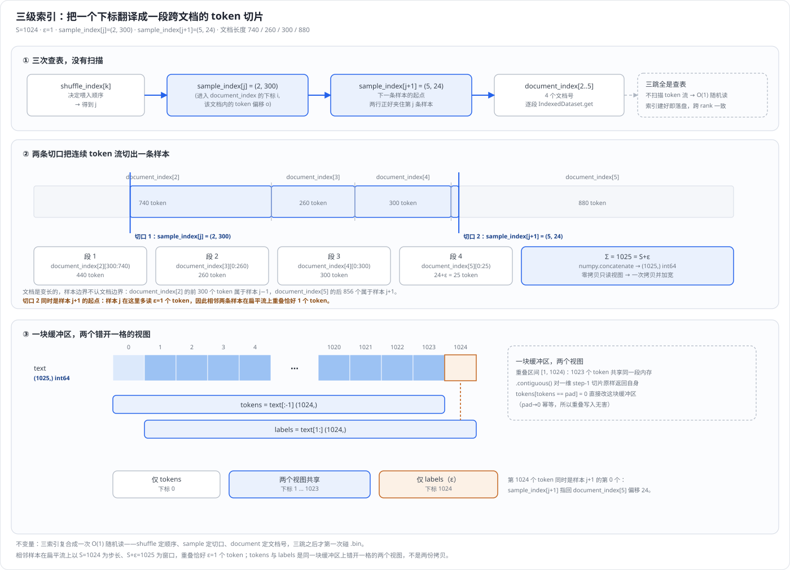
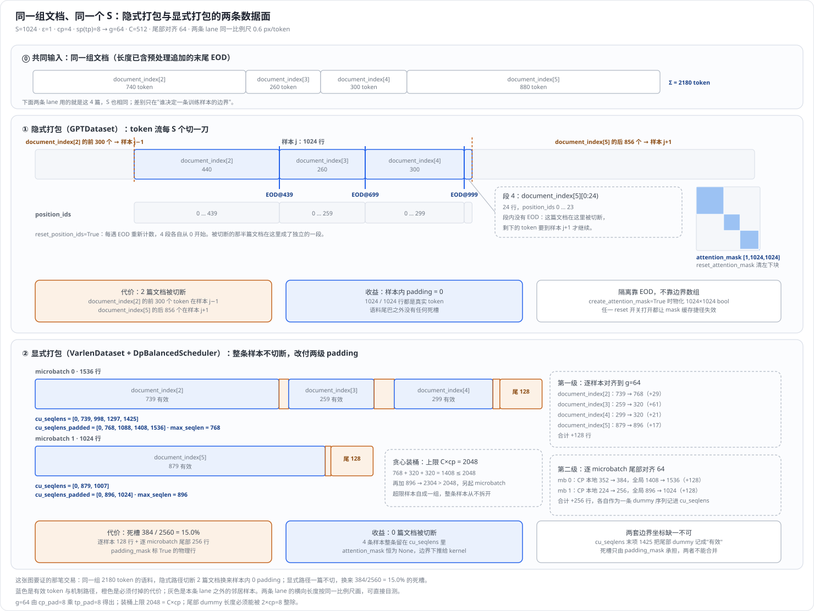
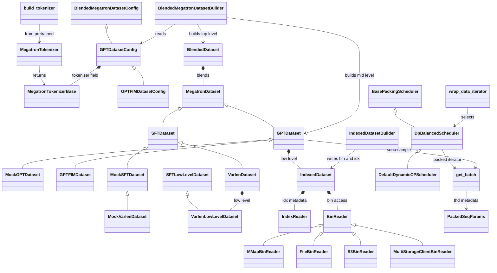

# Megatron-LM 数据入口深度解析：从变长语料到定长与打包样本

> **源码基线**：`NVIDIA/Megatron-LM@85902ef599ea4eb06ada7567a479c524b605767a`（`dev`，2026-09-01）
> **核心源码**：`megatron/core/datasets/gpt_dataset.py`、`megatron/core/datasets/indexed_dataset.py`、`megatron/core/datasets/blended_dataset.py`、`megatron/core/datasets/blended_megatron_dataset_builder.py`、`megatron/core/datasets/data_schedule.py`、`megatron/core/datasets/data_schedule_utils.py`、`megatron/core/packed_seq_params.py`、`megatron/core/tokenizers/megatron_tokenizer.py`、`megatron/core/tokenizers/utils/build_tokenizer.py`、`megatron/training/datasets/varlen_dataset.py`、`megatron/training/datasets/data_samplers.py`、`megatron/training/config/training_config.py`、`tools/preprocess_data.py`、`pretrain_gpt.py`
> **中心结论**：语料是变长文档、模型要的是定长 token 行，Megatron 没有把这一步焊死在数据集里，而是拆成「一个只负责 $O(1)$ 随机读的 `.bin`/`.idx` 底座」加「一层可替换的装填策略」。预训练走**隐式打包**：三级索引把文档首尾相接的 token 流每 $S$ 个切一刀，靠 EOD 与 `reset_*` 做样本内隔离，代价是文档会被切断；SFT 与变长数据走**显式打包**：整条样本不切断，靠 `cu_seqlens` + THD 把序列边界下推给 attention kernel，代价是每条样本与每个 microbatch 都要付对齐 padding，并多出一轮跨 DP×CP 的在线重排。两条路径共享同一个 tokenizer 工厂、同一个 builder 和同一个索引底座，分歧只发生在「谁决定一条训练样本的边界」这一步。
> **适用范围**：本页负责 LLM（GPT / SFT / 变长）数据入口的完整链路——统一 tokenizer 工厂与词表 padding、离线预处理、`IndexedDataset` 索引底座、`GPTDataset` 三级索引与取样、EOD 与 position/attention-mask reset、多源混合、显式序列打包与 `PackedSeqParams`，直到 `get_batch` 交给模型的那组张量。打包调度器内部与按 microbatch 变 CP 度由 [[29_megatron_packed_dataset_dynamic_cp_analysis]] 负责，CP 序列切分由 [[13_megatron_cp_analysis]] 负责，PP microbatch 调度由 [[15_megatron_pp_schedulers_analysis]] 负责，模型侧如何消费这些张量由 [[10_megatron_model_structure_analysis]] 负责。BERT / T5 / 多模态数据集本体不展开，也不逐个比较第三方分词算法。
> **最近更新**：2026-09-04。按特性页契约整体重写：以 `GPTDataset.__getitem__` 取一条样本为最小例子重排全篇，补齐 doc → token → sample → packed batch 的表示形变账（拷贝/共享/对齐/拼接），把原先 49 处 `path:line` 引用换成 §3.2 的稳定符号阅读路线，并更正 `--dataloader-inter-document-masking` 的实际接线与 0.80 阈值注释的出处。同日补齐算法回放与两张原理图（`tools/figs/svg/megatron_dataset_figures.mjs` 生成、`tools/figs/svg/lib/megatron_dataset_figures.test.mjs` 锁定）：§2.1 把三级索引逐跳走到 `get_batch` 并补出"相邻样本重叠恰好 $\varepsilon$ 个 token"这条由 `build_sample_idx` 循环推出的不变量，§2.3.1 用同一组文档把两条打包路径各回放一遍。

---

## 1. 特性概览

### 1.1 问题背景

一次 LLM 训练步要的是形状确定的整数张量——SBHD 下是 $S$ 列 token、THD 下是 $T$ 行 token——而语料是长度从几十到几十万 token 不等的文档；这两端之间必须有一层把变长压成定长。困难不在"补齐"本身，而在这一层同时被四个互相冲突的要求夹住：预训练希望零 padding 浪费，于是可以接受把文档切断；SFT 的一条样本是完整的"指令 + 回答"，从中间切断就毁掉标签结构，于是不能切断；分布式训练要求所有 rank 看到同一份采样顺序，于是装填必须可缓存、可复现；而长序列训练又要求同一个 batch 内的 token 能被 CP 与 PP 继续切分，于是边界信息必须能随张量一起传下去。把这四条揉进一个固定实现，结果就是"预训练能用、SFT 不能用"或者反过来，所以真正要设计的不是一种装填，而是装填这件事的**可替换性**。

### 1.2 解决方法

Megatron 把这一层拆成三段。**底座**只负责"给我文档号和偏移，我返回 token"，由 `.bin`（扁平 token 流）+ `.idx`（每条 sequence 的元素数与字节指针、每个 document 的 sequence 区间）构成，`IndexedDataset` 在其上提供 $O(1)$ 随机读，读 `.bin` 的方式本身还是可换的（默认 mmap，另有文件指针、S3、多存储客户端三个并列实现）。**装填层**是一族 `MegatronDataset` 子类，它们各自决定"第 $k$ 条训练样本由哪些 token 组成"：`GPTDataset` 用三级索引把文档流切成定长，`SFTDataset` / `VarlenDataset` 保留整条样本、把长度信息以 `original_seq_len` / `padded_seq_len` 交出去。**装配层**是 `BlendedMegatronDatasetBuilder`：它在所有 rank 上被调用，让 rank 0 先建索引并落盘、其余 rank 在 barrier 之后读缓存，并在多数据源时再叠一层 `BlendedDataset` 按权重混合。

这一层的所有权边界因此很清楚：它拥有"一条样本的 token 内容与边界元数据"，不拥有模型结构，也不拥有并行几何。它对下游的产出只有两种形态——SBHD 的 `tokens`/`labels`/`loss_mask`/`position_ids`（可选 `attention_mask`），或者 THD 的同名张量加上一个描述子序列边界的 `PackedSeqParams`。`pretrain_gpt.py::get_batch` 是这两种形态汇合成模型输入的唯一出口。

### 1.3 收益、开销和约束

| 维度 | 直接收益 | 必付成本或边界 |
|---|---|---|
| 存储与读取 | 语料压成扁平 `.bin` + 元数据 `.idx`，默认 mmap，训练进程不把语料驻留在自己的堆里 | 必须先跑一次离线预处理；对象存储路径下 mmap 必须关掉，改走分块下载 |
| 装填（隐式） | 除语料尾巴外几乎零 padding，一条样本恒为 $S$ 个 token | 文档会被切断，一条样本可跨多个文档；这是定义性代价，配置里没有开关能关掉 |
| 装填（显式） | 整条样本不切断，`cu_seqlens` 让一个 buffer 等价于 $n$ 条独立序列 | 每条样本先对齐到 $g$、每个 microbatch 再对齐一次；padding 由 `padding_mask` 显式承担 |
| 采样确定性 | 三级索引与混合索引全部落盘，重启不重算、跨 rank 一致 | 缓存 key 是配置哈希，任一 key 字段改动让三份 `.npy` 整体失效 |
| 分布式装配 | rank 0 建、barrier、其余 rank 读缓存，索引只算一次 | 所有 rank 都必须调用 builder，否则程序在 barrier 上挂起 |
| 在线调度 | 显式打包可在一个 global batch 内跨 DP×CP 重排，把长短样本摊平 | 每个 global batch 多一轮 DP all-gather 与逐字段的 CP lane all-gather |
| 词表 | 词表补齐到 $m\cdot t$ 的倍数，embedding 与 LM head 能被 TP 等分 | 补出来的 dummy token 占真实参数与显存；关掉自动补齐后由调用方自证兼容 |

### 1.4 术语与符号约定

| 符号 / 术语 | 含义 |
|---|---|
| $S$ | `sequence_length`，一条定长样本的 token 数 |
| $\varepsilon\in\{0,1\}$ | `add_extra_token_to_sequence`，为构造左移标签多取的那 1 个 token |
| $E$、$T_{\mathrm{epoch}}$ | 轮数 `num_epochs`、单轮 token 总数 |
| $N$ | 一个 split 的样本总数 |
| doc / sequence | `.idx` 的两级单位：一个 document 由若干条连续 sequence 组成；GPT 路径按 sequence 切分 split |
| sample / sub-sample | 一条训练样本；打包路径下一个 buffer 内的单条原始序列称 sub-sample |
| $g$ | `pad_granularity`，显式打包路径下单条样本的对齐粒度 |
| $T$、$C$ | 一个打包 buffer 的物理 token 行数、`max_seqlen_per_dp_cp_rank` |
| $t$、$m$ | `tensor_model_parallel_size`、`make_vocab_size_divisible_by` |
| SBHD / THD | 带独立 batch 与 sequence 维的布局 / 把所有 token 压成一维 $T$ 行、靠 `cu_seqlens` 描述边界的布局 |

---

## 2. 详细方案

### 2.1 最小例子：一条定长样本是怎么取出来的

整条链路的决定性变换只有一个动作——**把一个整数下标翻译成一段跨文档的 token 切片**。`GPTDataset.__getitem__` 就是这个动作，先看它。

`GPTDataset` 在构造期算好三个数组，全部由 `_build_document_sample_shuffle_indices` 产出：

- **document index**：一维。把本 split 暴露的文档号重复 $E$ 遍再打乱，决定"跑几轮、文档以什么顺序首尾相接"。
- **sample index**：二维，形状 $[N+1,2]$。把 document index 指向的所有文档的 token 视作一条长流，每 $S+\varepsilon$ 个 token 记一个断点；第 $j$ 行是 `(进入 document index 的下标, 该文档内的 token 偏移)`。第 $j$ 与第 $j+1$ 行正好夹住第 $j$ 条样本。
- **shuffle index**：一维，是 sample index 下标的随机排列，决定样本的喂入顺序。

下图把这一跳整条画出来——三次查表、两条切口、四段拼接，再到那条缓冲区上错开一格的两个视图。图上每个数字都由生成脚本复算 `helpers.cpp::build_sample_idx` 的循环得出，因此图与下面的正文必然同源。



**把最小例子逐跳走一遍。** 设 $S=1024$、$\varepsilon=1$，`document_index[2..5]` 指向的四篇文档长度依次为 740、260、300、880 个 token——末尾那个 EOD 是预处理阶段 `Encoder.encode` 追加并计进最后一句长度的，所以它已经算在这些数里。取第 $k$ 条样本时，`_query_document_sample_shuffle_indices` 依次做三跳：

1. **顺序跳**：`j = shuffle_index[k]`。shuffle index 只决定喂入顺序，不改变样本内容。
2. **切口跳**：`(i, o) = sample_index[j] = (2, 300)`、`(i', o') = sample_index[j+1] = (5, 24)`。两行夹住第 $j$ 条样本：起点是 `document_index[2]` 的第 300 个 token，终点落在 `document_index[5]` 的第 24 个。
3. **文档跳**：`document_index[2..5]` 给出四个真实文档号，逐段交给 `IndexedDataset.get`。

四段因此完全确定：`document_index[2][300:740)` 取 440 个、`document_index[3][0:260)` 取 260 个、`document_index[4][0:300)` 取 300 个、`document_index[5][0:25)` 取 $24+\varepsilon=25$ 个，合计 $440+260+300+25=1025=S+\varepsilon$。源码用 `length=None` 表示"读到文档末尾"、只对最后一段传 `end_offset + add_extra_token_to_sequence`，这就是"一条样本可跨多个文档、一个文档也可能被切进两条样本"的全部机制。

**这里有一条容易漏掉的不变量：相邻样本在扁平流上重叠恰好 $\varepsilon$ 个 token。** `build_sample_idx` 记录断点时执行的是 `doc_offset += (remaining_seq_length + document_length - add_extra_token_to_sequence)`，即窗口宽 $S+\varepsilon$、步长只有 $S$。上例里 $(5,24)$ 既是样本 $j$ 最后一个 token 的位置，也是样本 $j+1$ 第一个 token 的位置——同一个 token 被相邻两条样本各读一次。这不是浪费，而是"标签是输入左移一位"这条规则跨样本边界的自然延伸，也解释了为什么 $\varepsilon$ 只出现在窗口宽度上、下面样本数公式的分母仍是 $S$。

样本数与轮数是这套索引的两个闭式量。$E$ 取满足 $E\cdot T_{\mathrm{epoch}}\ge N_{\mathrm{req}}S+\varepsilon$ 的最小正整数；样本数则是

$$
N=\left\lfloor\frac{E\,T_{\mathrm{epoch}}-\varepsilon}{S}\right\rfloor,
$$

丢弃末尾不足一条的部分；只有 valid split 且 `drop_last_partial_validation_sequence=False` 时改成向上取整、由 padding 补足。`GPTDataset.__len__` 与 C++ 的 `build_sample_idx` 用的是同一个式子，前者是为了在延迟 mmap 模式下不读索引也能报出长度。

**这一跳的表示形变账。** 这是全页最吃紧的地方，四步各有不同的所有权（对应上图面板 ③：那里只画了**一排**格子，`tokens` 与 `labels` 是压在同一排格子上、错开一格的两条横条，不是上下两块独立缓冲区）：

| 步骤 | 张量身份 | 形状 / dtype | 拷贝、共享还是原地改 |
|---|---|---|---|
| `IndexedDataset.get` | `.bin` mmap 上的只读视图 | $(\text{length},)$，`.idx` 头部声明的 `uint16` 或 `int32` | **零拷贝共享**：`numpy.frombuffer` 直接落在 memoryview 上，不可写 |
| `numpy.concatenate` | 一块新的进程内存 | $(S+\varepsilon,)$，`int64` | **拷贝并加宽 dtype**；padding 段是一个 Python list，在这里才被物化 |
| `torch.from_numpy(text).long()` | 与上一步的 numpy 数组共享缓冲区 | 同上 | **共享**：dtype 已是 `int64`，`.long()` 不再拷贝 |
| `text[:-1]` / `text[1:]` 加 `contiguous` | 与 `text` 同缓冲区的两个视图 | 各 $(S,)$ | **不拷贝**：一维 step-1 切片本就 contiguous，`.contiguous()` 原样返回自身；两个视图在 $[1,S)$ 上重叠，随后的 `tokens[tokens == pad] = 0` 直接改 `text` 的缓冲区（pad→0 幂等，重叠无害） |

padding 只在拼出的长度不足 $S+\varepsilon$ 时追加，填的是 `_pad_token_id`；`__getitem__` 随后把 `loss_mask` 在 label 为 pad 处置零，再把 tokens 与 labels 里的 pad 改写成 0——因为 `_pad_token_id` 默认是 $-1$，embedding 查表无法接受负号。`_pad_token_id` 本身有一道守卫：`MegatronDataset.__init__` 先取 `tokenizer.pad`，若它与其它 special token 撞号，除非显式打开 `allow_ambiguous_pad_tokens`，否则回退成保证不在数据里出现的 $-1$ 并发 warning。

mask 与 position id 走另一条所有权：当 `reset_position_ids`、`reset_attention_mask`、`eod_mask_loss` 全为假时，`masks_and_position_ids_are_cacheable` 成立，三者只算一次并被整个 dataset 实例缓存；此后每次取样**共享**同一份 `attention_mask` 与 `position_ids` 对象，只有 `loss_mask` 因为后面要被原地改而 `clone()` 一份。这条捷径正是"打开任一 reset 开关就要为每条样本重建 mask"的代价来源。

**这一跳最终交出去的是什么。** `__getitem__` 返回的 dict 里 `tokens`、`labels`、`loss_mask`、`position_ids` 都是 $(S,)=(1024,)$ 的一维张量（`create_attention_mask` 为真时再加一个 $S\times S$ 的下三角 `attention_mask`）。DataLoader 的默认 collate 把 micro-batch 内的若干条堆成 $(B,S)$，`get_batch_on_this_tp_rank` 在 TP 组内广播，`get_batch_on_this_cp_rank` 再按 CP 切分，最后 `pretrain_gpt.py::get_batch` 把它连同空的 packed 参数交给 `GPTModel.forward`。完成边界在这里，不在数据集返回 dict 的那一刻——那 1025 个 token 从 `.bin` 的一段只读视图，到成为每个参与 rank 上语义一致的模型输入，中间还隔着一次广播和一次切分。

### 2.2 从原语到系统：一条文本走到模型输入

把上面那一跳放回全链，前后各有三段。

```text
原始 JSON 行
  → build_tokenizer(args)                 统一工厂，按 tokenizer_type 与 metadata 选实现
  → tokenizer.tokenize(sentence) [+ EOD]  文本 → int list
  → IndexedDatasetBuilder.add_document    追加写 .bin，累积 sequence_lengths 与 document_indices
  → builder.finalize(idx_path)            落 .idx
  ────────────────────────── 离线一次，训练期只读 ──────────────────────────
  → IndexedDataset                        (doc_id, offset, length) → token 视图
  → GPTDataset / VarlenDataset            决定一条样本的边界（§2.1 或 §2.3）
  → BlendedDataset                        多源按权重混合（可选）
  → DataLoader + batch_sampler            按 DP rank 取本 rank 的样本区间
  → [打包路径] wrap_data_iterator          每个 global batch 重排一次
  → get_batch                             TP 广播 + CP 切分 + PackedSeqParams
  → GPTModel.forward
```

#### 2.2.1 分词入口：显式类型选分支，metadata 决定最终包装类

`build_tokenizer(args)` 是训练侧唯一入口。它先用 `args.tokenizer_type` 对照 `SUPPORTED_TOKENIZERS` 白名单，不在表内直接 `ValueError`；随后按这个**显式类型**分成六个参数分支（megatron 系、sentencepiece 系、tiktoken、huggingface、multimodal、sft），各自填好 `kwargs` 并算出一个**默认** library。两个 Null 分支是明确例外：它们在分支内直接把 `{'library': 'null-text'}` 或 `{'library': 'null-multimodal'}` 交给 `MegatronTokenizer.from_pretrained` 并提前 return，因此根本不会读到 `args.metadata_path`。其余分支在最后统一判断：给了外部 metadata 文件就把路径传下去，没给就把默认 library 包成一个 dict 传下去。

`MegatronTokenizer` 不能直接实例化，构造函数直接抛 `EnvironmentError` 要求走 `from_pretrained`。后者读取**实际 metadata 内容**的 `library` 字段，做两道校验（非 byte-level / null 系必须给 tokenizer 路径；multimodal 必须给 `prompt_format`、`special_tokens`、`image_tag_type`），再由 `_get_tokenizer_model_class` 按 `library` 定 text/vision、按 `model_type` 从 `TOKENIZER_MAPPING_NAMES` 取具体模型包装类。

因此选路契约是两级的：`tokenizer_type` 决定参数分支与默认 library；一旦提供 `metadata_path`，文件里的 `library` 才是最终 class 分派依据，而 `kwargs` 仍来自 `tokenizer_type` 分支——两者不一致没有任何专门校验，只会在后续路径检查或具体构造器里失败。目录结构把这件事拆成两个正交维度：`TEXT_LIBRARIES` / `VISION_LIBRARIES` 决定底层实现（sentencepiece、huggingface、megatron、tiktoken、byte-level、null-text、sft / multimodal、null-multimodal），`TOKENIZER_MAPPING_NAMES` 决定模型约定（gpt、bert、t5、mamba 与两个 default）。源码没有把这套布局命名为正交分类；**本页的推断**是，拆成两维的工程收益在于新增一种库或一个模型约定不必复制另一维的全部组合。`write_metadata` 执行反向操作：校验 library 属于两张表之一、据其归类 text/vision、并持久化 library、class、model type 与 chat template。

#### 2.2.2 离线预处理与两文件底座

`tools/preprocess_data.py` 是 tokenizer 与索引底座之间真实存在的 caller hop，不只是概念相邻。每个 worker 在 `Encoder.initializer` 里各建一份 tokenizer；`Encoder.encode` 对文档内每个句子调 `tokenize`，把非空结果拼进 `doc_ids` 并记录句长，可选在文档末尾追加一个 EOD 并把它计进最后一句的长度。主进程用 `DType.optimal_dtype(tokenizer.vocab_size)` 选 `.bin` 的 dtype——词表小于 65500 用 `uint16`，否则 `int32`——然后逐文档 `add_document(tokens, sentence_lens)`，最后 `finalize` 写 `.idx`。

`.idx` 的布局由 `_IndexWriter.write` 定死：头部是魔数、版本、dtype 码、sequence 数、document 数；主体依次是每条 sequence 的元素数（`int32`）、每条 sequence 的字节指针（`int64`，由 `_sequence_pointers` 按 dtype 的 `itemsize` 前缀和算出）、每个 document 的 sequence 区间端点（`int64`），多模态时再追加每条 sequence 的 mode（`int8`）。读侧 `_IndexReader` 对整个 `.idx` 做一次 `numpy.memmap`，再用四次 `frombuffer` 在同一块映射上开出四个**零拷贝视图**——这就是"元数据看起来全在内存里、实际按页惰性调入"的由来。

这一层的可换点是 `.bin` 的读法，四个 `_BinReader` 并列实现：mmap（默认）、文件指针（带三次指数退避重试）、S3（按 `bin_chunk_nbytes` 分块下载并维护一个区间缓存）、多存储客户端。选择由构造参数决定，`initialize` 里两条 `assert` 保证 mmap 与对象存储互斥。**被否掉的替代**在这里是显式的：源码 docstring 直接写明 S3 数据加载必须关闭 mmap，判据是 S3 对象根本不能被内存映射、只能靠区间请求；而区间请求的固定开销又逼出了 256 MiB 的分块缓存，docstring 同时给出这个数字的两侧权衡（块太小则请求次数多、块太大则单次请求阻塞训练）并自陈"没有花太多精力调优"。默认为什么是 mmap 而不是文件指针，**源码没有陈述**；本页推断是随机读命中页缓存的代价最低，且不把语料计入进程常驻内存——引用请回到 `IndexedDataset` 的构造参数默认值与四个 reader 的 docstring，不要引用这句推断。

#### 2.2.3 三级索引：为什么放进 C++，为什么最后一轮不参与全局 shuffle

`_build_document_sample_shuffle_indices` 有三个值得单独记账的决定。

**其一，sample index 的构建放进 C++ 扩展。** `helpers.build_sample_idx` 只是薄包装，按"文档数与最长文档取大"是否超过 `int32` 上限在 `build_sample_idx_int32` / `build_sample_idx_int64` 之间选模板实例，`int32` 路径还额外断言产出的下标落在合法区间内。**被否掉的替代写在历史里**：提交 `f66c58a9b`（2020-04-07，commit message 即「added build sample index to c++」）把原先的 Python `_build_sample_idx` 换成了 C++ 版本。现存源码还留了一条侧写——`gpt_dataset.py` 在解释另一件事时点明这一步跑在 C++ 里：「The GIL is held when entering the c++ program, improving the speed of which improves parallelism」。

**其二，最后一轮不进全局 shuffle。** `_build_document_index` 的 `separate_final_epoch` 参数自陈语义为「Whether to exclude the last epoch from the global shuffle」，实现是把前 $E-1$ 轮与最后 1 轮**各自 shuffle 后拼接**，而不是拼好再整体打乱；`_build_shuffle_index` 相应地把两段下标区间各自打乱再连接。开关由一条阈值决定：设

$$
\begin{aligned}
N_{\mathrm{final}}&=N_{\mathrm{req}}-\left\lfloor\frac{(E-1)T_{\mathrm{epoch}}-\varepsilon}{S}\right\rfloor, \\
N_{\mathrm{per}}&=\left\lfloor\frac{T_{\mathrm{epoch}}-\varepsilon}{S}\right\rfloor,
\end{aligned}
$$

当 $N_{\mathrm{final}}<\lfloor 0.80\,N_{\mathrm{per}}\rfloor$ 时分离最后一轮，两侧各有一条不变量断言兜底（$N_{\mathrm{final}}\ge 0$ 且 $N_{\mathrm{final}}\le N_{\mathrm{per}}+1$）。**被否掉的替代同样写在历史里**：提交 `39181113e`（2020-12-11，commit message 即「Last epoch should not be globally shuffled」）之前，document index 是所有轮次一起 shuffle 的。0.80 这个数字的来历由随后的独立提交 `25c07e146`（2020-12-14，commit message 即「Added a comment to justify 80 percent」）补上注释：「the 80% number is just based on common sense and can be adjusted if needed」——即**这个阈值源码自陈只是常识，从未给出量化依据**；该注释在后续重构中被删，现基线只剩 `threshold = 0.80` 与一行说明。

**其三，建索引时按访问密度临时放弃 mmap。** 进 C++ 之前源码用"document index 长度的两倍是否超过 sequence 数"判断访问密度，成立就把 mmap 的 `sequence_lengths` 整份 `copy()` 进内存。判据由源码逐条列出：一是这一步会顺序预读整个文件、其中大部分都会被读到；二是进入 C++ 期间持有 GIL，缩短它能提升并行度。这条启发式由提交 `9dca04b2c`（2024-05-21，commit message 即「Add a heuristic for data-cache building to improve speed and stability」）引入——在那之前一路走 mmap 惰性读。

三份索引算完后写成三个 `.npy`，缓存 key 是 `unique_description_hash`：`MegatronDataset.__init__` 把类名、数据集路径、样本数、split 名，加上 `_key_config_attributes()` 列出的 `random_seed`、`sequence_length`、`split`、`split_matrix`、`tokenizer` 序列化成 JSON 再取 MD5。命中缓存时三份索引都以只读 mmap 模式读回；打开 `defer_npy_index_mmap` 则连这一步都推迟到第一次 `__getitem__`，构造期只记路径。**被否掉的替代**是手工版本号或时间戳：配置哈希的收益是任何影响采样的改动都自动失效缓存、不需要人记得改版本；代价是**任一** key 字段变化都让三份索引整体重算，源码没有实现任何部分失效。这条取舍源码没有陈述，是本页从 key 的构成读出的。

#### 2.2.4 EOD 与 reset：隐式打包的样本内隔离

隐式打包把不同文档接进同一条样本，于是要回答"后面的文档能不能 attend 到前面的"。默认能——预训练通常无害——但有四个开关可以改：EOD token 在预处理阶段插在文档之间，让模型学到边界；`reset_position_ids` 让每遇 EOD 就把 position id 从 0 重新计；`reset_attention_mask` 让每遇 EOD 就把 mask 的左下块清零，样本内各文档真正独立；`eod_mask_loss` 屏蔽 EOD 位置的 loss。三个 reset 类开关的实现都在 `_get_ltor_masks_and_position_ids` 的同一个 EOD 位置循环里，逐个 EOD 下标做区间赋值。

代价集中在 mask 的物化上：`create_attention_mask=True` 时这里要建一个 $S\times S$ 的下三角布尔张量，`False` 时干脆不建，docstring 自陈「Can be disabled if attention kernel generates masks by itself」。打开任一 reset 开关还会让 §2.1 的缓存捷径失效，从而**每条样本**都要重跑这个循环。§2.3.1 的对照图把这个循环作用在 §2.1 那条样本上的结果画了出来：EOD 落在下标 439、699、999，四段 position id 各自从 0 重数，掩码的左下块按同样的边界清零。

#### 2.2.5 多源混合

`BlendedDataset` 解决"实际语料来自网页、代码、书……要按权重混"。它同样是索引式的：`build_blending_indices`（C++）产出 `dataset_index`（第 $k$ 条样本取自哪个子数据集，`int16`）与 `dataset_sample_index`（取该子数据集的第几条，`int64`），`__getitem__` 只做两次查表再转发，并在返回的 dict 里加一个 `dataset_id` 字段。`size` 为 `None` 时改用 `build_exhaustive_blending_indices`，即每个子数据集恰好贡献 `weights[i]` 条。**被否掉的替代**是每次取样现场按权重掷骰：readme 给出的判据是索引可以在一个 rank 上建好、落盘、其余 rank 并行读回，掷骰做不到跨 rank 与跨重启一致；混合算法本身也不是随机的——readme 自陈每一步"从采样误差最大的那个数据集抽一条"，是确定性的。

代价有两条硬边界：子数据集数必须小于 32767（`dataset_index` 是 `int16`），以及混合可能过采样某个子数据集——此时抛 `IndexError` 并在异常文本里直接建议把 `mid_level_dataset_surplus` 加大到两倍或十倍。后者的存在本身说明 mid-level 的样本数是按权重预估出来的、留了 0.5% 的余量，不是精确解。

#### 2.2.6 显式打包：`cu_seqlens` 与 THD

显式打包把若干条**完整、不切断**的变长序列塞进一个定长 buffer，关键是让 attention kernel 知道"这个 buffer 里其实是 $n$ 条独立序列"。承担这件事的是 `PackedSeqParams`：`qkv_format='thd'` 声明布局（T 是总 token 行数、H 头数、D 头维，没有独立 batch 维），`cu_seqlens_q` 与 `cu_seqlens_kv` 给出**未 padding** 的累积边界、`cu_seqlens_q_padded` 与 `cu_seqlens_kv_padded` 给出**物理**累积边界，`max_seqlen_q` 与 `max_seqlen_kv` 给最长子序列长度，`total_tokens` 给 $T$。`__post_init__` 再由 padded 边界与 $T$ 用 `repeat_interleave` 算出 `seq_idx`（每个物理行属于第几条子序列，并把最后一段尾部 padding 记成额外一条），供 Mamba mixer 与 CUDA Graph 使用；相邻差值先 `clamp(min=0)`，因为 CP 切分后 padded 边界不再严格单调。

一个 16 行的 buffer 装三条长度 5、2、4 的序列时：`cu_seqlens` 为 `[0, 5, 7, 11]`，`max_seqlen` 为 5，`total_tokens` 为 16，`seq_idx` 为 `[0,0,0,0,0,1,1,2,2,2,2,3,3,3,3,3]`——第 3 号"序列"就是尾部 5 行 padding。§2.3.1 的对照图把这套元数据放在与隐式路径同一组文档上算了一遍，两套边界数组、两级 padding 与 `padding_mask` 的分工都在那张图的下半部分。

padding 尾巴有两种表示法，由 `thd_tail_padding_policy` 选：`append_dummy_seq`（默认）把尾巴当成一条附加到 `cu_seqlens` 上的普通 dummy 序列，保留真实序列之间已有的物理空隙；`extend_last` 保持有效边界不变、只把最后一条的物理终点往后延，并且在 CP 切分**之前**就作用在全局元数据上，好让 zigzag 下标与 contiguous 起点都看到已 padding 的布局。两者共存的理由源码给在 `_pad_cu_seqlens` 的断言里：`cu_seqlens` 要被 pad 到固定容量，否则「would not match captured CUDA Graph replay shapes」——**被否掉的替代**就是让 `cu_seqlens` 长度随每个 microbatch 浮动，判据是 CUDA Graph 的重放形状必须静态。

#### 2.2.7 逐组件契约

| 组件 | 责任 / 契约 | 为什么是这个边界、被否掉的替代 | 数据如何变形 | 守卫与代价 |
|---|---|---|---|---|
| `build_tokenizer` | `args` → `MegatronTokenizerBase`；顺带回填 `padded_vocab_size` | 否掉"从零散路径参数反推 library"：显式 `tokenizer_type` 先定分支，外部 metadata 再定最终 class；判据是 Null 系必须能在无路径、无 metadata 时构造 | 文本 → `int` 序列（identity，无形状约束） | 类型不在白名单 `ValueError`；非 Null 系缺路径断言；multimodal 缺三项协议参数断言 |
| `IndexedDatasetBuilder` | 追加写 `.bin`，累积 `sequence_lengths` 与 `document_indices`，`finalize` 写 `.idx` | 否掉"每文档一个文件"：`.idx` 预存字节指针才能让 `get` 做 $O(1)$ 随机读（本页推断，源码只给出布局） | list → `numpy` → 字节流；dtype 由 `optimal_dtype` 按词表基数选，`uint16` 相对 `int32` 直接把 `.bin` 减半 | `add_index` 合并时断言两侧 dtype 一致 |
| `IndexedDataset` | `(doc_id, offset, length)` → token 视图 | 四个 `_BinReader` 并列；S3 分支源码明写必须关 mmap | **零拷贝**只读视图落在 mmap 上 | 构造后三条计数一致性断言，`fast_cache_load=True` 时被整体跳过 |
| `GPTDataset` | 下标 → $(S,)$ 的 `tokens`、`labels`、`loss_mask`、`position_ids` | 否掉"运行时现场切分"：三级索引可落盘、可复现，代价是配置一变全部重算 | 见 §2.1 的四步形变表：共享 → 拷贝加宽 → 共享 → 共享（重叠视图） | 索引 dtype 必须 `int32`；末轮两条不变量断言；`path_to_cache` 为空只 WARNING 不落盘 |
| `BlendedDataset` | 下标 → `dataset_id` 加子数据集样本 | 否掉在线掷骰：索引式混合才能跨 rank 与跨重启一致（readme 自陈） | 两次查表，样本本身 identity 转发 | 子数据集数上限、同类型同 split、权重同类型且为正；过采样抛 `IndexError` |
| `VarlenDataset` | 下标 → **单条**子样本加 `original_seq_len` / `padded_seq_len` | 源码自陈否掉 `SFTDataset` 的样本内预打包：「letting the upstream scheduler pack variable-length samples across the DP×CP grid with no per-sample padding waste」 | 对齐到 $g$ 而非 $S$；源码自陈「We deliberately do NOT pad to sequence_length」 | 要求 tokenizer 暴露 EOD；断言未开 `reset_position_ids` 与 attention mask 相关开关；多模态 content 列表直接 `ValueError` |
| `DpBalancedScheduler` | 一批变长子样本 → 若干定长 microbatch 的分组方案 | 否掉"切开长样本以填满桶"：按整条入桶，超过上限就自成一组 | 只产出分组，不搬数据 | `thd_max_packed_sequences` 必须不小于 1，尾部 dummy 策略下不小于 2 |
| `build_packed_microbatches` | 分组方案加本 rank 样本 → 打包 buffer | 否掉"逐样本传输整包"：先 `_unpack_batch` 拆开再按需路由 | `torch.cat` **拼接拷贝**；两套 `cumsum` 分别产出 `cu_seqlens` 与 `cu_seqlens_padded` | 依赖每条样本都带两个长度字段 |
| `get_batch_on_this_rank_for_sequence_packing` | 打包 buffer → 模型输入 7 元组 | 否掉 PP 组广播：源码自陈每个 PP stage 都要拿到 padding 元数据，好让 MoE 层排除物理 padding | `masked_fill` 中和 padding 位、CP `index_select`、reshape 成 $1\times T$、TP 广播 | 非 TP-0 断言迭代器为空；required key 缺一即断言 |
| `pretrain_gpt.get_batch` | 三条分支汇合成同一组张量 | `sequence_packing_scheduler` 非空走调度器，否则按 `cu_seqlens` 是否存在分 THD / SBHD | THD 下 `attention_mask` 恒为 `None` | 打包路径断言 micro-batch size 为 1 |

### 2.3 两条打包路径：形态、选择条件与语义差别

两条路径不是两个实现细节，而是两套完整的活体配置，选择发生在两处。

**数据集类型的选择**在 `pretrain_gpt.py::train_valid_test_datasets_provider`：`args.sft` 选 `SFTDataset`（`is_packed_sequence` 置真）；`args.use_varlen_dataset` 选 `VarlenDataset`，且 `is_packed_sequence` 等于 `varlen_sbhd_validation` 的反；否则按 `mock_data` / `fim_data` 在 `MockGPTDataset` / `GPTFIMDataset` / `GPTDataset` 之间选。`is_packed_sequence` 随后被喂给 `is_dataset_built_on_rank`，直接改变"哪些 rank 建数据集"。变长分支的输入面比隐式路径宽：`VarlenLowLevelDataset` 接受 HuggingFace Hub repo id、本地 `.parquet` 与本地 `.jsonl`/`.json`（后者用 pandas 读，以绕开 pyarrow 逐块 JSON schema 推断在字段不齐时的失败），并由 `_select_converter` 按列名自动识别四种 schema——`messages` 列的 openai-messages、`conversations` 列的 sharegpt、指令加输出列的 alpaca/dolly（各有一组同义列名，另有可选的上下文列），以及只有 `text` 列的 pretrain-text；前三种被归一成 messages 列表交给父类的会话分词与角色掩码，第四种直接返回裸串、走普通 `tokenize` 且不做 prompt 掩码。识别不出任何一种即抛 `ValueError`，多模态 content 列表、树状会话与偏好数据明确不在支持范围内。

**取数路径的选择**在 `get_batch`：`sequence_packing_scheduler` 非空就整条走调度器路径并返回带 `padding_mask` 的 7 元组；否则先 `get_batch_on_this_tp_rank` 在 TP 组内广播，再看 `cu_seqlens` 是否存在——存在走 `get_thd_batch_on_this_cp_rank`（THD），不存在走 `get_batch_on_this_cp_rank`（SBHD）。

#### 2.3.1 把同一组文档在两条路径上各走一遍

下图用的就是 §2.1 那四篇文档（740 / 260 / 300 / 880，共 2180 个 token）和同一个 $S=1024$，只把"谁决定一条样本的边界"换掉。两条 lane 按同一个 px/token 比例尺画，因此"切断"与"padding"两种浪费可以直接目测比较；图上每个数字同样由生成脚本从并行几何算出。示例并行度取 $\text{cp}=4$、$\text{sp}=8$、$\text{dp}=1$、$C=512$、`pad_packed_seq_alignment` $=64$。



**隐式路径（`GPTDataset`）。** 本地工作就是 §2.1 那三跳查表加四次 `IndexedDataset.get`；边界的所有权完全在 sample index 手里，文档边界不参与决策。样本 $j$ 就是图上那 1024 行：`document_index[2]` 贡献 440、`document_index[3]` 贡献 260、`document_index[4]` 贡献 300、`document_index[5]` 贡献 24。**重构靠 EOD**：三篇文档结尾的 EOD 落在样本内下标 439、699、999 上，`_get_ltor_masks_and_position_ids` 的 EOD 循环让 position id 在这三处各自归零，模型看到的是 4 段长度 440/260/300/24 的独立序列；`reset_attention_mask` 再把 $S\times S$ 掩码里对应的左下块清零，段间彻底不可见。**增量代价**是一对相反的数：样本内 padding 为 0（1024 行全是真实 token），但 2 篇文档被切断——`document_index[2]` 的前 300 个 token 在样本 $j-1$ 里、`document_index[5]` 的后 856 个在样本 $j+1$ 里，而且切口两侧的 position id 各自从 0 重数，被切开的文档在模型眼里就是两段互不相关的文本。

**显式路径（`VarlenDataset` 加 `DpBalancedScheduler`）。** 同样四篇文档，这里各自是一条完整样本，一条也不拆。本地工作是四次 `__getitem__`：补 EOD、做 next-token 左移得到 `original_seq_len` = 739 / 259 / 299 / 879，再按 $g$ 对齐。$g$ 由 `_calculate_padding_divisor` 算出——非动态 CP 下 $g=(\text{cp}\times2)\times\text{sp}=8\times8=64$，于是 `padded_seq_len` 依次是 768 / 320 / 320 / 896，第一级 padding 合计 $29+61+21+17=128$ 行。**边界所有权在这里第一次离开数据集**：`get_groups_and_subsamples` 按 `padded_seq_len` 贪心装桶，上限是 $C\cdot\text{cp}=512\times4=2048$；$768+320+320=1408\le 2048$，再加 896 就是 $2304>2048$，于是切成两个 microbatch（$\text{dp}=1$，两个桶都落在本 rank 上）。**重构由 `_pack_sequences` 完成**：`torch.cat` 把子样本拼成一条，两套 `cumsum` 分别给出 `cu_seqlens = [0, 739, 998, 1297]` 与 `cu_seqlens_padded = [0, 768, 1088, 1408]`。最后 `pad_sequence_for_thd` 把每个 microbatch 的 **CP 本地**长度对齐到 64（$352\to384$、$224\to256$），全局即 $1408\to1536$、$896\to1024$；多出来的两段各 128 行在 `append_dummy_seq` 策略下各自作为一条 dummy 序列追加进边界数组，第二级 padding 合计 256 行。**增量代价**因此是 $128+256=384$ 行死槽，占 $384/2560=15.0\%$，换来的是 0 篇文档被切断。

**两条 lane 的账并排放**：同一组 2180 个 token 的语料，隐式路径切断 2 篇文档换来样本内零 padding；显式路径一篇不切，换来 15.0% 的死槽。这些数字是**对源码规则做的算术**——$g$ 的公式、装桶上限、CP 本地对齐规则都来自源码，四篇文档的长度是为讲清机制而设的示例值；换一组文档长度或一组并行度，两边的比值都会变，但"切断 ↔ padding"这条取舍不会变。

**一处必须分开记的账。** 显式路径上 `cu_seqlens` 的末项（本例 microbatch 0 是 $1297+128=1425$）把尾部 dummy 记成一条"有效"序列，死槽的信息并不在 `cu_seqlens` 里——它由 `_build_thd_padding_mask` 给出的逐序列死槽，与 `pad_sequence_for_thd` 末尾那个 `tail_padding_mask` 或起来，全部落在 `padding_mask` 上（本例 microbatch 0 为 $29+61+21+128=239$ 行，microbatch 1 为 $17+128=145$ 行）。这就是下表"loss 语义"一行说"两者不能合并"的物理原因：`cu_seqlens` 是给 attention kernel 的坐标，`padding_mask` 是给 loss 与 MoE 的坐标，两套坐标在尾部 dummy 上给出的答案本来就不同。

#### 2.3.2 逐维度对照

| 维度 | 隐式打包（`GPTDataset`） | 显式打包（`SFTDataset` / `VarlenDataset` 加调度器） |
|---|---|---|
| 装填方式 | 文档首尾相接成 token 流，每 $S$ 个切一刀 | 整条变长样本贪心入桶，累计长度不超过 $C\cdot\text{cp\_size}$ |
| 是否切断样本 | **会**，一个文档可跨两条样本 | **不会**，超长样本自成一组 |
| 样本内隔离 | EOD token 加 `reset_attention_mask` / `reset_position_ids`，可选物化 $S\times S$ mask | `cu_seqlens` 加 THD，边界下推给 kernel，`attention_mask` 恒为 `None` |
| padding | 只有语料尾巴 | 每条对齐到 $g$，每个 microbatch 尾部再对齐一次，由 `padding_mask` 标记 |
| loss 语义 | `loss_mask` 只屏蔽 padding 与（可选）EOD | 还要屏蔽 prompt 段与右侧物理 padding；两者分别由 `loss_mask` 与 `padding_mask` 承担，源码自陈不能合并——prompt token 会被 loss 屏蔽但仍须参与 MoE |
| 索引 | 三级索引加混合索引，落盘 mmap | 无落盘索引，每个 global batch 在线重排 |
| collate | 默认 collate 堆叠定长样本 | identity collate，源码自陈变长 dict「not stack-able by the default collate」 |
| 建数据集的 rank | 仅首末 PP stage（与 MTP stage）的 TP-0 | **每个** PP stage 的 TP-0 |
| 典型用途 | 预训练 | SFT / 变长指令数据 / 长文档 / RL |

两条路径共享同一个底座、同一个 builder、同一个 tokenizer 契约，也共享同一条"next-token 左移"标签规则；真正不同的只有"谁决定一条样本的边界"。

#### 2.3.3 为什么不复用 reset 路径

**为什么显式打包另起一套 `cu_seqlens`，而不是把 `reset_attention_mask` 扩成打包？** 源码从未把两者并排比较，也没有一处说明"为什么不复用 reset 路径"。可以从源码直接读出的只有三件事：`reset_attention_mask` 的实现依赖一个已经物化的 $S\times S$ mask，逐 EOD 做区间赋值；`create_attention_mask` 的 docstring 明说这个 mask 在 kernel 能自己生成时可以不建；以及 `inter_document_masking` 一旦打开，`validate_args` 会强制关掉 `create_attention_mask_in_dataloader`，注释自陈是「to avoid a TP broadcast mismatch」。**本页的推断**是：reset 路径要求 mask 在 dataloader 侧物化并随 batch 广播，而 $S\times S$ 的规模在长序列下不可接受，`cu_seqlens` 把同样的信息压成 $O(n)$ 并交给 kernel；要引用这条判断请注明它是推断，源码只陈述了上述三个事实。

另一条**间接旁证**是两条路线正在收敛：`GPTDatasetConfig.inter_document_masking` 让 `GPTDataset` 也吐 `cu_seqlens` 与 `max_seqlen`、并逐文档重置 position id，把 `reset_attention_mask` 的语义改用打包路径的表示法实现。这里有一处必须说清的接线事实：**在当前基线下 `pretrain_gpt.py` 并不把这个开关传进 `GPTDatasetConfig`**——`core_gpt_dataset_config_from_args` 的字段表里没有它，因此 `--dataloader-inter-document-masking` 对纯 GPT 入口只剩"关掉 dataloader 侧 attention mask"这一个副作用；真正把它接进配置的是 `pretrain_hybrid.py` 与 `megatron/elastification/pretrain_hybrid_flex.py`。

### 2.4 整体开销结算

把两条路径的账分开记。共用的离线成本只有一次：预处理把整个语料 tokenize 并写成 `.bin` 加 `.idx`，工作量与总 token 数成正比，`.bin` 的字节数是总 token 数的 2 倍或 4 倍（取决于 `optimal_dtype`），`.idx` 的字节数由三段线性项相加：每条 sequence 12 字节（长度 4 加指针 8，多模态再加 1），每个 document 8 字节。变长路径可以完全跳过这一步——`VarlenLowLevelDataset` 直接从 HuggingFace repo、`.parquet` 或 `.jsonl` 运行时加载。

| 成本项 | 隐式打包 | 显式打包 |
|---|---|---|
| 索引构建 | 一次 C++ 扫描，规模约为轮数乘文档数，只在 rank 0 上跑，其余 rank 等 barrier | 无；改为每个 global batch 在线分组，代价随 batch 内样本数线性增长 |
| 索引存储 | 三份 `.npy`：document index 每项 4 字节、sample index 每样本 8 或 16 字节、shuffle index 每样本 4 或 8 字节 | 无 |
| 常驻内存 | `.bin` 与三份 `.npy` 均 mmap；建索引时按访问密度可能临时 `copy()` 一份 `sequence_lengths` | 打包 buffer 与 all-gather 临时张量常驻显存；逐字段 gather 把峰值限制在"一个全局字段" |
| 随机读 I/O | 一条样本跨 $m$ 个文档就发 $m$ 次底层 read，期望 $m\approx 1+S/\bar L_{\mathrm{doc}}$ | 同左（若底座仍是 `.bin`），或运行时数据源的一次行读取 |
| padding 浪费 | 仅末样本，可忽略 | 每条约 $(g-1)/2$ 个 token，相对浪费约 $\dfrac{g-1}{2\bar L}$；再加每个 microbatch 的尾部对齐 |
| 通信 | 一次 TP 组广播 | DP 组 all-gather 序列长度，加每个保留字段一次 CP lane all-gather，加一次 TP 组广播（9 个张量） |
| 换来的吞吐 | —— | 相对"逐样本 padding 到 $S$"节省的比例约 $1-\bar L/S$；这才是显式打包存在的理由 |

上表的 padding 与 I/O 两行是**对源码规则做的算术**，不是源码给出的实测数字：$g$ 来自 `_calculate_padding_divisor`（CP 侧因子乘 TP 侧因子，动态 CP 下 CP 侧因子再乘 `data_parallel_size`），$m$ 来自 `_query_document_sample_shuffle_indices` 的循环次数。源码没有给出任何一条端到端的吞吐测量，因此不要把这些式子当成性能承诺。

逐字段 all-gather 这条取舍值得单独点名，因为 readme 把被否方案和判据都写了出来：**被否掉的替代是一次性 gather 全部字段**，源码选择逐字段，代价是"每个字段一次 collective launch"，收益是"临时内存被限制在一个全局字段，选中的切片 clone 之后 gather buffer 立即释放"。

聚合来看，隐式打包的总账是"一次离线预处理加一次索引构建，换取训练期近乎纯随机读、零 padding、零额外集合通信"；显式打包的总账是"放弃离线索引与零 padding，换取样本完整性与跨 DP×CP 的负载摊平"。两者的失效边界也是对称的：隐式打包在 SFT 上失效于切断样本，显式打包在超长单样本上失效于装不进一个桶——`_pad_cu_seqlens` 与 `_pad_seq_tensor` 的断言文本直接给出了三条补救建议（调大 `--thd-max-packed-sequences`、调小 `--max-seqlen-per-dp-cp-rank`、在上游过滤超长样本）。

---

## 3. 代码实现分析

### 3.1 类关系图

空心三角表示真实的 Python 继承，其余连线表示构造、持有或调用。`BinReader`、`MMapBinReader`、`FileBinReader`、`S3BinReader`、`MultiStorageClientBinReader`、`IndexReader` 是图中对同名私有类（源码带前导下划线）的可读化名称；`build_tokenizer`、`wrap_data_iterator`、`get_batch` 是模块级函数，画成节点只为标出它们在对象图中的位置。



| 层次 | 责任 | 不负责什么 |
|---|---|---|
| `build_tokenizer` / `MegatronTokenizer` | 把训练参数与 metadata 归一成一个 tokenizer 实例，并回填 `padded_vocab_size` | 不知道数据集的存在，也不决定样本边界 |
| `BlendedMegatronDatasetConfig` / `GPTDatasetConfig` | 声明装填规则与缓存 key 的全部输入 | 不持有张量，不做通信 |
| `BlendedMegatronDatasetBuilder` | 分布式装配：谁建、谁等、谁读缓存；按 blend 决定要不要叠 `BlendedDataset` | 不定义一条样本长什么样 |
| `IndexedDataset` / `IndexedDatasetBuilder` | `.bin` 与 `.idx` 的读写与 $O(1)$ 随机访问 | 不知道 `sequence_length`，不做 shuffle、不做 padding |
| `GPTDataset` 家族 | 下标 → 定长样本，含 EOD 隔离与 next-token 标签 | 不做跨 rank 通信，不知道 CP 与 PP |
| `SFTDataset` / `VarlenDataset` 家族 | 下标 → 单条（或预打包的）变长样本加长度元数据 | 不决定这条样本落到哪个 rank |
| `BasePackingScheduler` 家族 | 一个 global batch 内的分组与跨 DP×CP 重排 | 不做 CP 切分，不构造 `PackedSeqParams` |
| `get_batch` 与 `PackedSeqParams` | 汇合三条分支，做 TP 广播、CP 切分与 THD 元数据构造 | 不改变样本内容的语义 |

### 3.2 调用流程

**构造阶段。** `train_valid_test_datasets_provider` 先用 `core_gpt_dataset_config_from_args` 把 CLI 参数折成一个 `GPTDatasetConfig`（其中就包含 `build_tokenizer(args)` 的返回值——tokenizer 是缓存 key 的一部分，所以它必须先于索引存在），再按 `--sft` / `--use-varlen-dataset` / `--fim-data` / `--mock-data` 选出数据集类，最后交给 `BlendedMegatronDatasetBuilder.build`。builder 的分布式协议由 `build_generic_dataset` 实现：rank 0 且 `is_built_on_rank()` 为真时先构造（构造函数里落盘索引），然后**全组 barrier**，之后其余 rank 才构造——此时必然缓存命中，只做 mmap 读回。这就是 readme 那条 NB 的机制来源：所有 rank 都必须走 builder，否则 barrier 等不齐。`--dataloader-fast-cache-load` 会把 `synchronize_ranks` 整体置假，因为它假定缓存已经存在，barrier 也就没有意义。

```text
pretrain_gpt.train_valid_test_datasets_provider
|
+-- core_gpt_dataset_config_from_args
|   +-- build_tokenizer
|   |   `-- MegatronTokenizer.from_pretrained --> MegatronTokenizerBase
|   `-- GPTDatasetConfig.__post_init__          (必填断言, token_dtype_code)
|
+-- [args.sft]                 dataset_type = SFTDataset,    packed = True
+-- [args.use_varlen_dataset]  dataset_type = VarlenDataset, packed = not sbhd_validation
+-- [otherwise]                dataset_type = GPTDataset / GPTFIMDataset / MockGPTDataset
|
`-- BlendedMegatronDatasetBuilder.build
    `-- _build_blended_dataset_splits
        +-- [单前缀 blend] _build_megatron_dataset_splits
        |   +-- GPTDataset.build_low_level_dataset
        |   |   `-- IndexedDataset.initialize
        |   |       +-- [mmap]           MMapBinReader
        |   |       +-- [object storage] S3BinReader / MultiStorageClientBinReader
        |   |       +-- [otherwise]      FileBinReader
        |   |       `-- IndexReader                          (memmap 加四次 frombuffer)
        |   `-- build_generic_dataset
        |       +-- [rank 0] GPTDataset.__init__
        |       |   `-- _build_document_sample_shuffle_indices
        |       |       +-- _build_document_index
        |       |       +-- helpers.build_sample_idx          (C++)
        |       |       +-- _build_shuffle_index
        |       |       `-- numpy.save x 3                    (.npy)
        |       +-- torch.distributed.barrier
        |       `-- [rank != 0] GPTDataset.__init__           (缓存命中, mmap 读回)
        |
        `-- [多前缀 blend] _build_megatron_datasets_parallel
            `-- build_generic_dataset --> BlendedDataset.__init__
                `-- _build_indices
                    +-- [size 给定]   helpers.build_blending_indices             (C++)
                    `-- [size 为 None] helpers.build_exhaustive_blending_indices  (C++)
```

**一次取样到 `get_batch`。** 下面这棵树从 DataLoader worker 里的一次 `__getitem__` 开始，走到 `get_batch` 返回给 `forward_step` 的那组张量为止；纯转发、日志与 rerun state machine 的旁路省略。注意打包路径多出一次"每个 global batch 一次"的重排，它由 `training.py::train_step` 而不是 `get_batch` 发起。

```text
[打包路径, 每 global batch 一次] training.train_step
`-- wrap_data_iterator
    `-- DpBalancedScheduler.run
        +-- get_batch_and_global_seqlens
        |   +-- next(data_iterator) x num_microbatches
        |   +-- _unpack_batch
        |   |   +-- [已拆开, 带 padded_seq_len] 只归一 batch 维
        |   |   `-- [预打包, 带 cu_seqlens]     按边界切开成子样本
        |   `-- _get_global_seqlens_and_ids                   (DP all-gather)
        +-- get_groups_and_subsamples                          (贪心装桶, 对齐到 dp_size)
        +-- reroute_samples_to_dcp_ranks                       (逐字段 CP lane all-gather)
        +-- build_packed_microbatches
        |   `-- _pack_sequences                                (torch.cat 加两套 cumsum)
        +-- broadcast_scalars                                  (TP 组)
        `-- create_data_iterator

[每 microbatch] next(data_iterator)
|
+-- [BlendedDataset] BlendedDataset.__getitem__
|   `-- GPTDataset.__getitem__
|       +-- _query_document_sample_shuffle_indices
|       |   +-- shuffle_index --> sample_index --> document_index
|       |   +-- IndexedDataset.get x m                        (mmap 零拷贝视图)
|       |   `-- numpy.concatenate                             (拷贝并加宽到 int64)
|       +-- _get_ltor_masks_and_position_ids
|       |   +-- [create_attention_mask] torch.tril            (S x S)
|       |   `-- [reset_*] 逐 EOD 下标区间赋值
|       `-- [inter_document_masking] 逐文档 cu_seqlens 与 position id 重置
|
`-- [VarlenDataset] VarlenDataset.__getitem__                 (单条子样本, 对齐到 g)

pretrain_gpt.get_batch
|
+-- [sequence_packing_scheduler is not None]
|   `-- get_batch_on_this_rank_for_sequence_packing
|       +-- next(wrapped_data_iterator)                        (仅 TP-0)
|       +-- _build_thd_padding_mask
|       +-- _sanitize_thd_padding_values                       (masked_fill 中和 padding)
|       +-- [extend_last] extend_thd_padding_before_cp_slice
|       +-- get_cp_slice_for_thd                               (zigzag 或 contiguous)
|       +-- broadcast_tensor x 9                               (TP 组)
|       +-- PackedSeqParams
|       |   `-- PackedSeqParams.__post_init__ --> seq_idx
|       `-- [pad_packed_seq_alignment] pad_sequence_for_thd
|
`-- [otherwise]
    +-- get_batch_on_this_tp_rank                              (TP 组, cu_seqlens 走长度前缀协议)
    +-- [cu_seqlens is None] get_batch_on_this_cp_rank
    |   `-- _get_batch_on_this_cp_rank_per_sequence_balancing
    +-- [cu_seqlens is not None] get_thd_batch_on_this_cp_rank
    |   `-- PackedSeqParams
    `-- [pad_packed_seq_alignment] pad_sequence_for_thd
```

**完成边界。** 这条链的"完成"不是数据集返回 dict，而是 `get_batch` 在**每个参与 rank 上**都持有语义一致的张量：SBHD 下是 `tokens`、`labels`、`loss_mask`、`attention_mask`、`position_ids`、空的 packed 参数与 `padding_mask`；THD 下 `attention_mask` 恒为 `None`、边界信息全在 `packed_seq_params` 里。中间 PP stage 在非打包路径上直接返回七个 `None`；在**调度器**打包路径上拿到完整的 `padding_mask` 与 `PackedSeqParams`，因为源码自陈每个 stage 的 MoE 层都要靠它排除物理 padding。非调度器的 `--sft` 打包路径是另一档：`get_batch` 的 docstring 自陈中间 stage 只返回 `(None×5, PackedSeqParams)`，`padding_mask` 为 `None`——那条路上只有 `cu_seqlens` 与 `max_seqlen` 需要下沉到注意力掩码。

**源码阅读路线。** 下面的稳定符号足以从装配入口走到上述完成边界：

1. 训练侧入口与选路：`pretrain_gpt.py::train_valid_test_datasets_provider` → `pretrain_gpt.py::core_gpt_dataset_config_from_args` → `pretrain_gpt.py::is_dataset_built_on_rank` → `pretrain_gpt.py::get_batch`。
2. 分词：`megatron/core/tokenizers/utils/build_tokenizer.py::build_tokenizer` / `vocab_size_with_padding` / `_set_padded_vocab_size` → `megatron/core/tokenizers/megatron_tokenizer.py::MegatronTokenizer.from_pretrained` / `_get_tokenizer_model_class` / `MegatronTokenizer.write_metadata`；查询版本 `megatron/training/vocab_utils.py::calculate_padded_vocab_size`。
3. 离线预处理：`tools/preprocess_data.py::Encoder.initializer` / `Encoder.encode` / `Partition.process_json_file` → `megatron/core/datasets/indexed_dataset.py::IndexedDatasetBuilder.add_document` / `finalize` / `_IndexWriter.write` / `DType.optimal_dtype`。
4. 索引底座：`megatron/core/datasets/indexed_dataset.py::IndexedDataset.initialize` / `IndexedDataset.get` / `_IndexReader.__init__` / `_MMapBinReader.read` / `_S3BinReader.read`；布局文档 `megatron/core/datasets/readme.md`。
5. 装配：`megatron/core/datasets/blended_megatron_dataset_builder.py::BlendedMegatronDatasetBuilder.build` → `_build_blended_dataset_splits` → `_build_megatron_dataset_splits` → `build_generic_dataset`；配置校验 `megatron/core/datasets/blended_megatron_dataset_config.py::BlendedMegatronDatasetConfig.__post_init__`。
6. 隐式打包：`megatron/core/datasets/gpt_dataset.py::GPTDataset.__getitem__` → `GPTDataset._query_document_sample_shuffle_indices` → `GPTDataset._build_document_sample_shuffle_indices` → `_build_document_index` / `_build_shuffle_index` / `_get_ltor_masks_and_position_ids`；样本索引 `megatron/core/datasets/helpers.py::build_sample_idx` → `megatron/core/datasets/helpers.cpp::build_sample_idx`；pad token 守卫 `megatron/core/datasets/megatron_dataset.py::MegatronDataset.__init__`。
7. 多源混合：`megatron/core/datasets/blended_dataset.py::BlendedDataset._build_indices` / `BlendedDataset.__getitem__`。
8. 显式打包的数据集侧：`megatron/training/datasets/varlen_dataset.py::VarlenDataset.__getitem__` / `VarlenLowLevelDataset` / `_select_converter` → `megatron/training/datasets/sft_dataset.py::SFTDataset._calculate_padding_divisor` → `megatron/training/datasets/data_samplers.py::build_pretraining_data_loader`。
9. 打包调度与取数：`megatron/training/training.py::train_step` → `megatron/core/datasets/data_schedule.py::wrap_data_iterator` → `DpBalancedScheduler.run` / `DpBalancedScheduler.get_groups_and_subsamples` → `megatron/core/datasets/data_schedule_utils.py::get_batch_and_global_seqlens` / `_unpack_batch` / `reroute_samples_to_dcp_ranks` / `build_packed_microbatches` / `_pack_sequences` / `get_cp_slice_for_thd` → `megatron/core/datasets/data_schedule.py::get_batch_on_this_rank_for_sequence_packing` / `_build_thd_padding_mask` / `_sanitize_thd_padding_values`。
10. THD 元数据：`megatron/core/packed_seq_params.py::PackedSeqParams.__post_init__` / `get_thd_padding_kwargs` / `resolve_thd_tail_padding_policy` / `extend_thd_padding_before_cp_slice` / `pad_sequence_for_thd` / `_pad_cu_seqlens`。
11. 非打包取数：`megatron/training/utils/common_utils.py::get_batch_on_this_tp_rank` → `megatron/core/utils.py::get_batch_on_this_cp_rank` / `_get_batch_on_this_cp_rank_per_sequence_balancing` / `_get_batch_on_this_cp_rank_per_document_balancing` / `get_thd_batch_on_this_cp_rank`。
12. 边界验证：`tests/unit_tests/data/test_gpt_dataset.py::test_mock_gpt_dataset`、`tests/unit_tests/data/test_gpt_dataset.py::test_inter_document_masking`、`tests/unit_tests/data/test_builder.py::test_builder`、`tests/unit_tests/data/test_bin_reader.py::test_bin_reader`、`tests/unit_tests/data/test_preprocess_data.py::test_preprocess_data_gpt`、`tests/unit_tests/data/test_varlen_dataset.py::test_getitem_thd_padded_to_divisor`、`tests/unit_tests/data/test_varlen_dataset.py::test_unpack_batch_short_circuits_for_varlen_samples`、`tests/unit_tests/data/test_varlen_dataset.py::test_thd_dataloader_uses_identity_collate`、`tests/unit_tests/data/test_get_batch.py::test_sft_batch`。

---

## 4. 配套机制

### 4.1 词表 padding：让分词结果与 TP 几何相容

这不是"顺便有用"的优化，而是本页目标的必需配套：数据入口交出的 token id 必须落在一个**能被 TP 等分**的词表区间里，否则 [[12_megatron_tp_analysis]] 的 `VocabParallelEmbedding` 在切分维上直接断言失败。所以 tokenizer 构建的最后一步就是回填词表大小。

`build_tokenizer` 在返回前调用 `_set_padded_vocab_size`：仅当 `pad_vocab_size` 为真且 `args.padded_vocab_size` 尚未设置（例如从 checkpoint 恢复时它已经有值）才计算，计算式是把原词表大小 $V$ 向上取整到 $m\cdot t$ 的整数倍：

$$
V_{\mathrm{padded}}=m\,t\left\lceil\frac{V}{m\,t}\right\rceil .
$$

**被否掉的替代是只补到能被 $t$ 整除**，判据源码自陈在 docstring 里：「Pad vocab size so it is divisible by model parallel size and still having GPU friendly size」——只满足整除会让每个 shard 的宽度变成任意值，$m$ 这个额外因子是为 GEMM 的对齐留的。

数据与状态的交接很窄：这个函数**原地写回 `args.padded_vocab_size`**，模型构建随后从同一个 `args` 读它。因此边界是"tokenizer 拥有真实词表大小，训练参数拥有 padded 词表大小，两者只在这一次赋值中相遇"。同一计算还有一个查询版本 `megatron/training/vocab_utils.py::calculate_padded_vocab_size`，它把纯计算放进 `lru_cache` 的 helper、把日志留在缓存外，并对三个入参各加一条 `ValueError`。两者是两个调用语境（构建期写回，与构建模型时反复查询），不是两套不同公式。

增量代价是可算的：补出的 dummy token 数为 $V_{\mathrm{padded}}-V$，最坏接近 $mt-1$。这些行是真实参数，占 embedding 与 LM head 的权重、梯度与优化器状态，也参与词表并行的交叉熵统计。关掉 `pad_vocab_size` 就把整除性的证明义务转给调用方，源码不再兜底。

### 4.2 打包调度：显式打包成立的必要前提

`VarlenDataset` 每次只吐一条子样本，它自己**不构成**一条可训练的 microbatch——没有 `cu_seqlens`、没有定长 buffer。把它变成模型输入的那一步必须存在，这就是 `data_schedule.py` 的调度器，因此它是显式打包路径的必需配套而不是可选加速。

`wrap_data_iterator` 每个 global batch 被 `train_step` 调用一次：它从 `scheduler_map` 按 `sequence_packing_scheduler` 取调度器类，把 `max_seqlen_per_dp_cp_rank`、CP 与 DP 尺寸、VPP 的 microbatch 组大小与一个可选的序列数上限传进去，然后 `run()` 一次跑完全流程。上限的算法本身就是一处被否方案的痕迹：`_get_scheduler_max_real_num_seqs` 在 `dp_balanced` 且尾部策略是 `append_dummy_seq` 时把 `thd_max_packed_sequences` **减一**，因为那个静态容量把将来要追加的 dummy 序列也算在内；两条 `ValueError` 分别守住下限 1 与下限 2。

`run()` 的九步里，与本页边界直接相关的是这几处：

- **取数与对齐**：`get_batch_and_global_seqlens` 连取 `num_microbatches` 个 batch，`_unpack_batch` 把它们规整成统一的子样本列表——它接受两种输入形态，预打包的（带 `cu_seqlens`，按边界切开并从差值合成两个长度字段）与已拆开的（带 `padded_seq_len`，只去掉 collate 加的 batch 维，缺 `original_seq_len` 时用 `padded_seq_len` 补）。随后一次 DP 组 all-gather 让每个 rank 都看到全局的序列长度与全局 id。
- **按 PP stage 裁字段**：第一 stage 只留 `tokens` 与 `position_ids`，最后一 stage 只留 `labels` 与 `loss_mask`，MTP stage 四个都留，两个长度字段人人都留。这一步直接决定后面 reroute 要搬多少字节——**被否掉的替代是原样搬运全部字段**。
- **分组**：`get_groups_and_subsamples` 按原顺序贪心装桶，累计长度不超过 $C\cdot\text{cp\_size}$，同时受序列数上限约束；随后把桶数补齐到 `dp_size`（VPP 下再乘 `microbatch_group_size_per_vp_stage`）的倍数——补齐的办法是从后往前把含多条样本的桶里弹一条出来单独成桶，"Not enough samples to move" 是这条循环的失败边界。
- **重排与打包**：`reroute_samples_to_dcp_ranks` 在 CP lane 内逐字段 all-gather、本地选片、clone、释放 gather buffer；`build_packed_microbatches` 再把本 rank 分到的子样本 `torch.cat` 成一条，并用 padded 与 original 两套长度分别 `cumsum` 出 `cu_seqlens_padded` 与 `cu_seqlens`。**两套边界数组的存在本身就是设计**：前者是 attention kernel 与 CP 切分消费的物理边界，后者保留未 padding 的真实边界供下游 loss 路径识别 padding 行。
- **广播与 VPP**：标量经 `broadcast_scalars` 发给 TP 组的非 0 rank，`create_data_iterator` 按 VPP 需要拆分并包成迭代器。

`run()` 的 docstring 明写「There is no PP-group broadcast」，判据在 `is_dataset_built_on_rank`：打包模式下它对**每个** PP stage 的 TP-0 都返回 True，各 stage 自行建数据集、自行取数，源码给出的理由是「Packed THD and SBHD validation both need padding metadata on every pipeline stage so each MoE layer excludes physical padding」。**被否掉的替代**就是旧基线的 PP 组广播，判据是中间 stage 需要的不只是 attention 边界，还有 MoE 要用的 padding 元数据。

增量代价：每个 global batch 一次 DP all-gather（序列长度）、每个保留字段一次 CP lane all-gather、一次 TP 组标量广播，外加 `torch.cat` 的一次全量拷贝。这些都发生在 `train_step` 的关键路径上，且必须在 `forward_backward_func` 之前完成，没有与计算重叠的余地。

调度器**内部**的算法（`DefaultDynamicCPScheduler` 如何均衡工作量、如何按 microbatch 改变 CP 度、`local_cp_size` 与 `cp_group` 怎样进入 `PackedSeqParams`）由 [[29_megatron_packed_dataset_dynamic_cp_analysis]] 拥有；`get_cp_slice_for_thd` 的 zigzag 与 contiguous 两种切法由 [[13_megatron_cp_analysis]] 拥有。

### 4.3 仅作用域说明的相邻能力

- **FIM 数据变换**：`GPTFIMDataset` 继承 `GPTDataset`，只覆写 `_query_document_sample_shuffle_indices`，在同一套三级索引之上对取出的 token 做 prefix / suffix / middle 重排。它是隐式打包的一个变体而非第三条路径，本页不展开其重排规则。
- **CUDA Graph 与静态形状**：`thd_max_packed_sequences` 与 `pad_packed_seq_alignment` 之所以存在，是为了让 THD 张量与边界数组有静态容量；契约与代价见 [[23_megatron_precision_cudagraph_fusion_analysis]]。
- **离线准备缓存**：`tools/prepare_cache.py` 复用同一条构造路径提前把三级索引与混合索引建好，readme 明确它不支持 `--mock-data`、`--sft`、`--fim-data` 与 `--step-batch-size-schedule`。
- **模型侧消费**：`PackedSeqParams` 如何进入 attention、Mamba mixer 与 GDN，见 [[10_megatron_model_structure_analysis]]。

---

## 5. 约束、适用场景与趋势

### 5.1 硬约束与失败边界

| 前提 | 源码边界 | 破坏后的行为 |
|---|---|---|
| 数据集配置四项必填 | `GPTDatasetConfig.__post_init__` | `tokenizer`、`reset_position_ids`、`reset_attention_mask`、`eod_mask_loss` 任一为 `None` 即断言失败 |
| SBHD 校验与动态 CP 互斥 | `GPTDatasetConfig.__post_init__` | 断言失败，报错语句自陈「SBHD mode is not packed」 |
| 逐数据集序列数需要词表大小 | `GPTDatasetConfig.__post_init__` | tokenizer 报不出 `vocab_size` 时 `token_dtype_code` 为 `None`，断言失败并提示关掉该选项 |
| 快缓存与延迟 mmap 需要缓存目录 | `BlendedMegatronDatasetConfig.__post_init__` | 未给 `--data-cache-path` 即断言失败；快缓存还与 `--data-path` 互斥 |
| 底座三条计数一致 | `IndexedDataset.__init__` | 三条断言校验 sequence 数与文档区间末项、`len(index)`、`sequence_count` 一致；`fast_cache_load` 为真时被**整体跳过** |
| mmap 与对象存储互斥 | `IndexedDataset.initialize` | 两条断言分别守住两侧；docstring 明写 S3 必须关 mmap |
| `.idx` 头部合法 | `_IndexReader.__init__` | 魔数或版本不符即断言失败；但传入 `sequences_per_dataset` 时整段头部读取被跳过、偏移硬编码为 34 字节，这道校验随之失效 |
| 索引 dtype 为 `int32` | `GPTDataset._build_document_sample_shuffle_indices` | `document_index` 或 `sequence_lengths` 不是 `int32` 即断言失败 |
| 末轮样本数落在合法区间 | 同上 | $N_{\mathrm{final}}<0$ 或 $N_{\mathrm{final}}>N_{\mathrm{per}}+1$ 即断言失败 |
| 索引可落盘 | 同上 | `path_to_cache` 为 `None` 时只打一条 WARNING，索引每次重启都重建 |
| 缓存目录可写 | `BlendedMegatronDatasetBuilder.build_generic_dataset` | 构造抛 `OSError` 时包装成带指引的 `Exception` |
| 所有 rank 都调用 builder | `build_generic_dataset` 的 barrier；readme 的 NB | 少一个 rank 就在 barrier 上永久挂起 |
| 混合的规模与类型 | `BlendedDataset.__init__` | 子数据集数达到 32767、类型或 split 不一致、权重非正或类型混杂即断言失败；单数据集只 WARNING |
| 混合不得过采样 | `BlendedDataset._build_indices` | 抛 `IndexError`，文本直接建议加大 `mid_level_dataset_surplus` |
| pad token 不与其它 special token 撞号 | `MegatronDataset.__init__` | 发 warning；未开 `allow_ambiguous_pad_tokens` 时把 `_pad_token_id` 强制回退为 $-1$ |
| 打包路径 micro-batch size 为 1 | `pretrain_gpt.py::get_batch` | 断言 `cu_seqlens` 是二维且首维为 1，文本即「micro-batch-size must be 1 for packing」 |
| 打包只在 TP-0 持有迭代器 | `DpBalancedScheduler.run` / `get_batch_on_this_rank_for_sequence_packing` | 非 TP-0 拿到迭代器或 TP-0 拿不到，均断言失败；required key 缺一同样断言 |
| 打包序列数上限 | `_get_scheduler_max_real_num_seqs` / `_pad_cu_seqlens` | `thd_max_packed_sequences` 小于 1（尾部 dummy 策略下小于 2）抛 `ValueError`；实际序列数超容量时断言失败并给出三条补救建议 |
| zigzag CP 下打包总长可整除 | `extend_thd_padding_before_cp_slice` | 全局 padding 目标不能被 $2\cdot\text{cp\_size}$ 整除即断言失败 |
| 对齐 padding 需要长度上限 | `ModelParallelConfig.__post_init__` | `pad_packed_seq_alignment` 非空而 `max_seqlen_per_dp_cp_rank` 为 `None` 即 `ValueError`；对齐值超过该上限同样 `ValueError` |
| 变长数据集的 tokenizer 与开关 | `VarlenDataset.__getitem__` | 无 EOD、开了 `reset_position_ids` 或 attention mask 相关开关即断言失败；多模态 content 列表抛 `ValueError` |
| tokenizer 类型合法且路径齐备 | `build_tokenizer` / `MegatronTokenizer.from_pretrained` / `MegatronTokenizer.__init__` | 类型不在白名单 `ValueError`；非 byte-level 与 null 系缺路径断言；multimodal 缺三项协议参数断言；直接实例化统一工厂抛 `EnvironmentError` |

还有一条**故意不做的事**值得单列：`GPTDataset` 不保证样本内文档完整——`GPTDatasetConfig` 的全部字段里没有任何"不切断文档"的开关，要不切断只能换到显式打包路径。反向的代价同样存在：显式打包的贪心装填按整条样本入桶、从不切分单条样本，因此 `GPTDataset` 那种"一条样本可跨多个文档、token 流连续"的装填在打包路径上不复存在。

### 5.2 何时用哪条路径

| 场景 | 建议 | 原因 |
|---|---|---|
| 大规模预训练，文档远短于 $S$ | 隐式打包加两文件底座 | 零 padding、零额外集合通信；文档被切断在预训练目标下无害 |
| 预训练但要求文档间不互相 attend | 隐式打包加 `reset_attention_mask`，或走 hybrid 入口打开 `inter_document_masking` | 前者物化 $S\times S$ mask，后者用 `cu_seqlens` 表达同一语义；注意后者在纯 GPT 入口下未接线（见 §2.3） |
| SFT、指令微调、偏好数据 | 显式打包 | 一条样本是完整的指令加回答，切断即破坏标签结构 |
| 样本长度分布极度不均 | 显式打包加打包调度器 | 逐样本 padding 到 $S$ 的浪费为 $1-\bar L/S$，桶装把它压到对齐粒度量级 |
| 需要按 microbatch 改变 CP 度 | 显式打包加 `default_dynamic_cp` | 配置层强制：打开 `dynamic_context_parallel` 会把调度器自动设成它，设成别的直接 `ValueError`；机制见 [[29_megatron_packed_dataset_dynamic_cp_analysis]] |
| 需要验证 THD 路径的数值正确性 | `--use-varlen-dataset` 加 `--varlen-sbhd-validation` | 走同一套 tokenization 但跳过全部打包，产出 SBHD 参考；与动态 CP 互斥 |
| 数千个数据前缀 | `--per-dataset-sequences-path`，JSON 由 `tools/build_sequences_per_dataset.py` 生成 | 只开一次 JSON 而不是每个前缀开一次 `.idx`；代价是跳过 `.idx` 头部校验 |
| 缓存已建好、只想加快启动 | `--dataloader-fast-cache-load` 与 `--dataloader-defer-npy-index-mmap` | 前者去掉同步点与文件存在性断言，后者把 `.npy` 的 mmap 推到首次访问；两者都假定缓存存在，且前者会跳过底座的一致性断言 |
| 数据在对象存储上 | 关闭 mmap，配 `object_storage_cache_path` | `.idx` 先被下载到本地缓存，`.bin` 按 256 MiB 块流式读 |

### 5.3 当前演进方向

每条都锚在实读位置或提交历史，是"源码里在途的改动"，不是路线声明。

- **隐式打包正在改用显式打包的隔离表示。** `GPTDatasetConfig.inter_document_masking` 让 `GPTDataset` 也产出 `cu_seqlens` 与 `max_seqlen` 并逐文档重置 position id，`validate_args` 相应强制关掉 `create_attention_mask_in_dataloader`，`tests/unit_tests/data/test_gpt_dataset.py::test_inter_document_masking` 对边界严格单调、首尾取值与 `attention_mask` 缺席逐条断言。→ **推断**：§2.3 对照表"样本内隔离"一行的两栏正在合并；源码没有声明要弃用 `reset_attention_mask`，而且这个开关目前只在 hybrid 入口接线，尚未覆盖纯 GPT 入口。
- **对象存储配置在做一次改名收敛。** `S3Config` 已被别名成 `ObjectStorageConfig`，注释写「S3Config is deprecated, use ObjectStorageConfig instead」；`IndexedDataset.__init__` 保留 `s3_config` 形参只为兼容，用 `object_storage_config or s3_config` 合流。→ **推断**：`s3_config` 这个入参会消失；源码只写了 deprecated，没有给移除时间点。
- **底座的 document-indices 读写接口已标待废。** `IndexedDataset.get_document_indices` 与 `IndexedDataset.set_document_indices` 的 docstring 都写着「This method is slated for deprecation」，而同一份数据已由 `document_indices` property 暴露。→ **推断**：这两个方法会被 property 完全取代。
- **混合 CP 的旧名正在退场。** `ModelParallelConfig.hybrid_context_parallel` 的 docstring 只剩一句「Deprecated. Use `dynamic_context_parallel` instead.」，`__post_init__` 对它发 `DeprecationWarning` 并在两者同开时抛 `ValueError`。→ 这是源码明确标注的废弃，不是推断。
- **THD 路径仍在用一条 SBHD 参考路径做数值校验。** `varlen_sbhd_validation` 的 docstring 自陈用途是「a SBHD reference run that mirrors the THD path's tokenization but skips all packing — useful for THD numerical-correctness validation」。→ **推断**：这条脚手架的存在本身说明 THD 路径尚未被当作完全稳定；源码只陈述了该开关的用途。

---

## 6. 配置契约

### `TokenizerConfig`

同一个 dataclass 声明这 20 个字段，配置生成器再把它们接到 CLI。

| 字段 | 声明类型 | 默认值 | 契约 |
|---|---|---:|---|
| `vocab_size` | `int` | `None` | EOD 或 padding 前的词表大小；`GPTDatasetConfig` 还用它选 `.bin` 的 dtype 码。 |
| `padded_vocab_size` | `int` | `None` | 模型实际词表大小；未给且允许自动补齐时由原词表大小算出并写回 `args`。 |
| `pad_vocab_size` | `bool` | `True` | 是否自动补齐缺失的 `padded_vocab_size`；关掉后由调用方自证与 TP 几何相容。 |
| `vocab_file` | `str` | `None` | 词表文件路径；megatron 系与 HuggingFace 分支读取。 |
| `merge_file` | `str` | `None` | BPE merges 文件路径；同上两个分支读取。 |
| `vocab_extra_ids` | `int` | `0` | T5 span masking 使用的额外 token 数。 |
| `tokenizer_type` | `Literal[...]` | `None` | 12 个取值之一；决定参数分支与**默认** library。非 Null 分支在给出外部 metadata 时由文件内的 library 决定最终包装类；两个 Null 分支固定自身 library 并提前返回。 |
| `tokenizer_model` | `str` | `None` | tokenizer 模型或仓库路径；multimodal 分支不使用它。 |
| `metadata_path` | `str \| None` | `None` | tokenizer metadata JSON；CLI 名为 `--tokenizer-metadata`；两个 Null 分支在读取它之前就返回，因而忽略该值。 |
| `special_tokens` | `Optional[list[str]]` | `None` | 额外特殊 token；CLI 名为 `--tokenizer-special-tokens`；TikToken 有一组约定必需项。 |
| `tiktoken_pattern` | `Literal['v1', 'v2']` | `None` | TikToken pattern 版本；仅在命中 TikToken 分支时传入。 |
| `tiktoken_num_special_tokens` | `int` | `1000` | TikToken 特殊 token 数。 |
| `tokenizer_sentencepiece_legacy` | `bool` | `False` | SentencePiece wrapper 的 legacy 行为，允许使用特殊 token。 |
| `tokenizer_sentencepiece_ignore_extra_whitespaces` | `bool` | `True` | 编码时是否忽略额外空白。 |
| `tokenizer_hf_no_use_fast` | `bool` | `False` | 取反后作为 `use_fast` 传给 HuggingFace 与 megatron 系分支。 |
| `tokenizer_hf_no_include_special_tokens` | `bool` | `False` | 取反后作为 `include_special_tokens` 传入；控制 text-to-id 是否加入特殊 token。 |
| `trust_remote_code` | `bool` | `False` | 是否允许 HF tokenizer 执行仓库自定义代码；打开即扩大到外部代码执行边界，启用前应单独审查来源。 |
| `null_tokenizer_eod_id` | `int` | `None` | NullTokenizer 的 EOD id；默认回退到词表大小减一。 |
| `null_tokenizer_pad_id` | `int` | `-1` | NullTokenizer 的 pad id；应避开真实数据 token，否则触发 `MegatronDataset` 的撞号回退。 |
| `chat_template` | `Optional[str]` | `None` | 会话格式化用的自定义 Jinja 模板；sentencepiece、tiktoken、HuggingFace 三个分支透传。 |

library 专属字段只有在 `tokenizer_type` 命中对应分支时才被读取；不匹配的组合不会报错，只是被忽略。

### `BlendedMegatronDatasetConfig`

| 字段 | 默认 | 契约 |
|---|---|---|
| `random_seed` / `sequence_length` | 必填 | 索引 RNG 与样本长度；均计入缓存 key |
| `blend` / `blend_per_split` | `None` | 二选一；两者都为空则自动进入 mock 模式并把 split 设成三等分 |
| `split` / `split_matrix` | `None` | `split` 是逗号分隔权重串，`split_matrix` 由它自动推出、不可传入，也计入缓存 key |
| `multiple_validation_sets` / `full_validation` | `None` | 是否把 valid 视作多个独立数据集、是否每次验证跑满一轮 |
| `num_dataset_builder_threads` | `1` | 多前缀时并行构建 mid-level 数据集的线程数 |
| `path_to_cache` | `None` | 索引缓存目录；为空时 `GPTDataset` 退回数据前缀下的 `cache` 子目录，`BlendedDataset` 则完全不落盘 |
| `mmap_bin_files` | `True` | 直接决定选哪个 `_BinReader` |
| `mock` | 自动 | 由 blend 是否为空推出，不可传入 |
| `tokenizer` | `None` | 需要在线分词的数据集必填；对象本身参与缓存 key |
| `mid_level_dataset_surplus` | `0.005` | mid-level 多建的样本余量；过采样报错时源码建议加大它 |
| `allow_ambiguous_pad_tokens` | `False` | 打开后即使 pad 与其它 special token 撞号也照用，源码注明这会破坏训练 |
| `fast_cache_load` | `False` | 假定缓存已存在：跳过同步点、文件存在性断言与底座一致性断言 |
| `defer_npy_index_mmap` | `False` | 把三份 `.npy` 的 mmap 推迟到首次访问；建议配合 `--num-workers` 大于 0 |

### `GPTDatasetConfig`（在上表之上追加）

| 字段 | 默认 | 契约 |
|---|---|---|
| `reset_position_ids` / `reset_attention_mask` / `eod_mask_loss` | `None`（必填） | 三个 EOD 隔离开关；任一为真都会让 mask 缓存捷径失效 |
| `create_attention_mask` | `True` | 由 CLI 的 `create_attention_mask_in_dataloader` 传入；为假时不物化 $S\times S$ mask |
| `drop_last_partial_validation_sequence` | `True` | 仅影响 valid split 的样本数取整方向 |
| `add_extra_token_to_sequence` | `True` | 即 $\varepsilon$；为假时改用 `torch.roll` 造标签并把末位置成 pad |
| `object_storage_cache_path` | `None` | 对象存储路径下必填，用于缓存 `.idx` |
| `data_parallel_size` / `context_parallel_size` / `sequence_parallel_size` | `1` / `None` / `0` | 打包路径算 `pad_granularity` 用；`sequence_parallel_size` 为 0 表示未启用 SP |
| `dynamic_context_parallel` | `False` | 打开后要求每条样本长度可被 DP 乘 CP 再乘 2（开 SP 再乘 SP 尺寸）整除 |
| `sequences_per_dataset` | `None` | 由 `--per-dataset-sequences-path` 的 JSON 提供；启用后跳过 `.idx` 头部读取 |
| `token_dtype_code` | 自动 | 由 `tokenizer.vocab_size` 推出（4 为 int32、8 为 uint16），不可传入 |
| `sft_mock_dataset_config_json` / `varlen_mock_dataset_config_json` | `None` | 两套 mock 配置刻意分开，避免变长路径隐式继承 SFT 的开关 |
| `varlen_sbhd_validation` | `False` | 产出 SBHD 参考样本，跳过全部打包；与动态 CP 互斥 |
| `inter_document_masking` | `False` | 让 `GPTDataset` 也产出 `cu_seqlens`；当前只由 hybrid 入口接线 |

打包调度相关的 `sequence_packing_scheduler`、`max_seqlen_per_dp_cp_rank`、`thd_max_packed_sequences`、`pad_packed_seq_alignment`、`thd_tail_padding_policy` 都声明在 `ModelParallelConfig` 或 `TransformerConfig` 上，契约由 [[29_megatron_packed_dataset_dynamic_cp_analysis]]、[[13_megatron_cp_analysis]] 与 [[23_megatron_precision_cudagraph_fusion_analysis]] 分别负责。其余配置字段的唯一 owner 见 `docs/coverage/megatron-lm.yaml`。

## Related Pages

- [[12_megatron_tp_analysis]] —— 查看本页补齐的词表在 embedding 与 LM head 上被 TP 如何切分。
- [[29_megatron_packed_dataset_dynamic_cp_analysis]] —— 深入本页只给出边界的打包调度器内部与按 microbatch 变 CP 度。
- [[13_megatron_cp_analysis]] —— 查看边界元数据交出去之后，THD 序列在 context parallel 下的两种切法。
- [[15_megatron_pp_schedulers_analysis]] —— 理解为什么打包模式要让每个 PP stage 自行取数而不是靠广播。
- [[10_megatron_model_structure_analysis]] —— 追踪 `PackedSeqParams` 如何被 attention、Mamba mixer 与 GDN 消费。
- [[41_megatron_config_surface_analysis]] —— 从任一配置字段反查它的声明、CLI 入口与机制 owner。
- [[37_megatron_trtllm_export_analysis]] —— 查看同一份 tokenizer 与词表约定在导出到 TRT-LLM 时如何被再次消费。
- [[02_engineering/02_train_frameworks/megatron-lm/index|Megatron-LM 知识地图]] —— 返回本域全部页面的主题索引。
