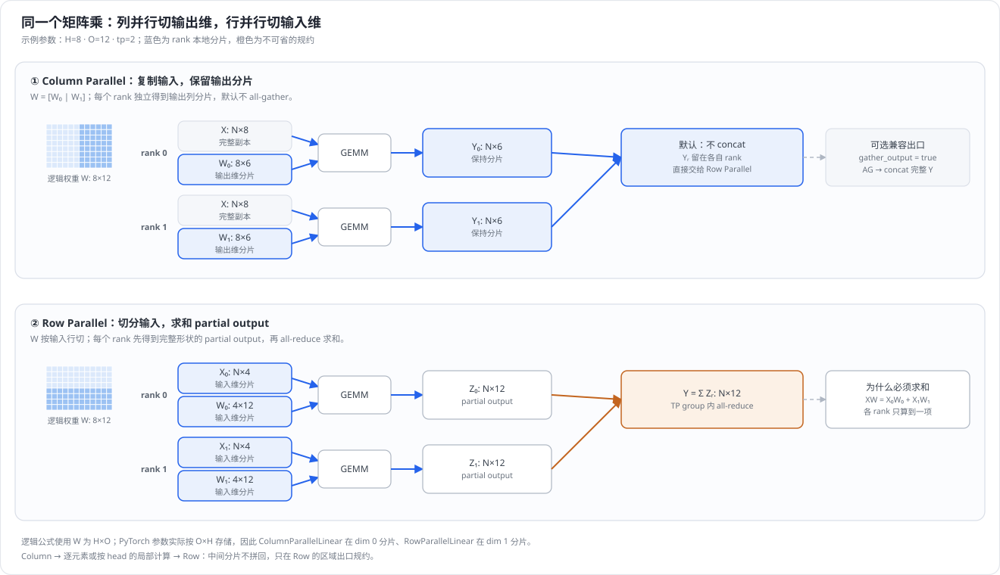
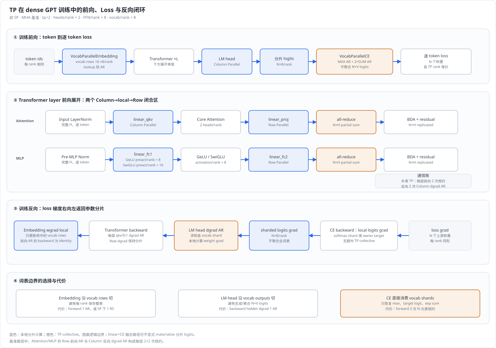
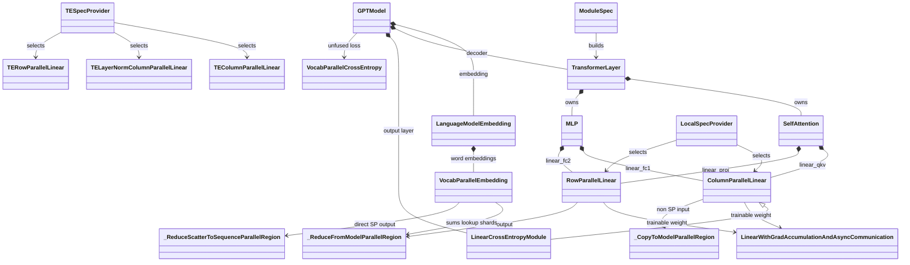
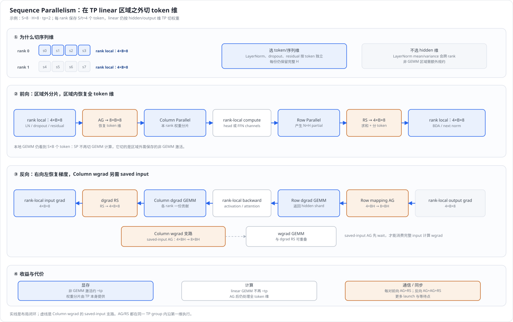

# Megatron-LM 张量并行(Tensor Parallelism)深度解析

> **源码基线**：`NVIDIA/Megatron-LM@85902ef599ea4eb06ada7567a479c524b605767a`（`dev`，2026-09-01）
> **核心源码**：`megatron/core/tensor_parallel/layers.py`、`megatron/core/tensor_parallel/mappings.py`、`megatron/core/tensor_parallel/cross_entropy.py`、`megatron/core/models/gpt/gpt_model.py`、`megatron/core/models/common/embeddings/language_model_embedding.py`、`megatron/core/transformer/attention.py`、`megatron/core/transformer/mlp.py`
> **中心结论**：Megatron TP 不是孤立地把权重除以若干份，而是用 `Column Parallel → rank-local compute → Row Parallel` 构造通信闭合区；在非 SP 的 MHA 或 `num_query_groups >= t` GQA 基准路径中，中间分片留在本 rank，只在 Row 出口恢复下一段计算需要的布局；SP 与小 KV-group GQA 的 AG/RS 是明确例外。
> **适用范围**：本页解释标准 dense GPT 层、词表边界、Sequence Parallelism 和 TP communication overlap；MLA、MoE expert TP 与非均匀 TP 由相关专题页负责。
> **最近更新**：2026-09-03。补全从 embedding 到 loss 再返回参数分片的训练闭环，逐项解释词表入口、LM head、分布式交叉熵的切分原因与代价；新增 SP 前反向实现图，并将函数调用关系改为可逐层阅读的 ASCII 调用树。

---

## 1. 特性概览

### 1.1 问题背景

Transformer 的主要参数和计算集中在 QKV 投影、Attention 输出投影以及 MLP 的 `fc1`、`fc2` 四组大矩阵乘；当 hidden size 增大到单层权重、优化器状态或中间激活无法由一张卡容纳时，DP 仍会在每个副本保存完整模型，PP 又只能按层切分，二者都无法继续拆开这一层内部的矩阵乘，因此需要一种层内并行方式。

### 1.2 解决方法

TP 把一个线性层的权重矩阵沿输出维或输入维切给 $t$ 个 TP rank：`ColumnParallelLinear` 沿输出维切，产生可直接保留的输出分片；`RowParallelLinear` 沿输入维切，消费上游分片并在出口规约 partial output。Megatron 在 Attention 和 MLP 中都成对使用二者，使 QKV 的按 head 计算、GeLU/SwiGLU 等 rank-local 运算位于两者之间，不必为每个线性层都恢复完整张量。

### 1.3 收益、开销和约束

| 维度 | 直接收益 | 必付成本或边界 |
|---|---|---|
| 权重与优化器 | TP 参数在每 rank 约为原来的 $1/t$ | 切分维必须可整除；某些模型还要求 head 数可整除 |
| 计算 | 大 GEMM 的工作量理想情况下约降为 $1/t$ | $t$ 增大后本地 GEMM 变小，算术强度与 kernel 效率可能下降 |
| 激活 | Column→Row 区域内的中间激活按 rank 分片 | LayerNorm、dropout、残差激活要配合 SP 才能沿序列分片 |
| 通信 | 中间 rank-local 计算无通信 | 非 SP 的 MHA 基准路径每层前向 2 次、反向 2 次 AR；SP 和 `num_query_groups < t` 的 GQA 另有 AG/RS |
| 拓扑 | 单层延迟和单卡显存下降 | 高频集合通信使 TP 通常限制在 NVLink/NVSwitch 域内；这是一条性能边界，不是源码硬断言 |

### 1.4 符号约定

| 符号 | 含义 |
|---|---|
| $t$ | TP degree，即 `tensor_model_parallel_size` |
| $S$、$B$、$H$ | 序列长度、micro-batch size、hidden size |
| $N=SB$ | 展平后的 token 数 |
| $O$ | 一个通用线性层的输出维度 |
| $H_{\mathrm{ffn}}$ | MLP 中间维度 |
| $A$、$V$ | Attention head 数、词表大小 |
| $d$ | 每个张量元素的字节数 |
| AR、AG、RS | all-reduce、all-gather、reduce-scatter |
| SP | Sequence Parallelism，即 TP 组内沿序列维切激活 |

---

## 2. TP 详细方案

### 2.1 一个矩阵乘有两种切法

先用逻辑矩阵 $Y=XW$ 讨论，其中 $X\in\mathbb R^{N\times H}$、$W\in\mathbb R^{H\times O}$。PyTorch 的参数实际按 $O\times H$ 保存，所以下文的“输出维切分”在 `ColumnParallelLinear.weight` 上对应 dim 0，“输入维切分”在 `RowParallelLinear.weight` 上对应 dim 1。



#### 2.1.1 Column Parallel：切输出维

把 $W$ 的列分给 $t$ 个 rank：

$$
W=[W_0\;W_1\;\cdots\;W_{t-1}],\qquad
W_r\in\mathbb R^{H\times O/t},\qquad
Y_r=XW_r.
$$

每个 rank 持有完整 $X$ 和一个 $W_r$，独立得到 $Y_r\in\mathbb R^{N\times O/t}$。`ColumnParallelLinear.forward` 默认 `gather_output=False`，因此前向不拼回 $Y$；它把分片直接交给后续 rank-local 算子。反向求输入梯度时，各 rank 只算出自己的贡献，必须求和：

$$
\nabla_X L=\sum_{r=0}^{t-1}\nabla_{Y_r}L\,W_r^{\mathsf T}.
$$

这就是非 SP 路径中 `_CopyToModelParallelRegion`“前向恒等、反向 AR”的原因。若打开 `gather_output=True`，输出会立刻 AG；该开关提供兼容出口，但会破坏 Column→Row 之间不通信的主路径。

#### 2.1.2 Row Parallel：切输入维

把 $X$ 的 hidden 维和 $W$ 的对应行同时分给各 rank：

$$
\begin{aligned}
X&=[X_0\;X_1\;\cdots\;X_{t-1}], \\
W&=[W_0^{\mathsf T}\;W_1^{\mathsf T}\;\cdots\;W_{t-1}^{\mathsf T}]^{\mathsf T}, \\
Z_r&=X_rW_r,\qquad Y=\sum_{r=0}^{t-1}Z_r.
\end{aligned}
$$

每个 $Z_r$ 都有完整输出形状 $N\times O$，但只是一项 partial sum。`RowParallelLinear.forward` 在 `input_is_parallel=True` 时直接消费上游分片，最后由 `_ReduceFromModelParallelRegion` 做前向 AR；该映射反向为恒等，因为每个 rank 都接收同一份输出梯度。

两种切法的关键不是“列切比行切更好”，而是二者的布局能首尾相接：前一层 Column 产生的输出分片，正好对应后一层 Row 所需的输入分片。

### 2.2 整个 Transformer 网络如何切分

矩阵切分只有 Column 和 Row 两种基本动作，但完整训练还必须闭合四类边界：词表入口如何恢复 hidden states、Transformer 层内的分片如何传递、词表出口如何保持 logits 分片、loss 与梯度如何在不聚合全词表的情况下返回。下图以非 SP、标准 dense GPT 的 MHA 路径为主线，把前向、loss 和反向放在同一张图中；GQA 条件分支和 SP 的布局变化分别在后文说明。



| 模块 | 切分方式 | 为什么这样切 | 前向 / 反向通信 |
|---|---|---|---|
| `VocabParallelEmbedding` | 参数沿词表行切为约 $V/t\times H$ | 一个 token 只属于一个词表 shard；各 rank 可以保留完整 $H$，以零值掩码后求和 | 非 SP 前向 1 AR、反向 identity；直接 SP 路径前向 RS、反向 AG |
| `linear_qkv` | Column，QKV 输出通道按 head / group 切 | head 之间的 attention 可独立计算 | 基准非 SP 前向无通信、反向 dgrad 1 AR；小 KV-group GQA 另有 AG/RS |
| QK norm / Core Attention | 每 rank 处理本地 query head | softmax 和 value 聚合不混合不同 query head | QKV 布局就绪后无额外 TP 通信 |
| `linear_proj` | Row，输入维按本地 head 切 | 汇总各 head 对完整 hidden 输出的 partial sum | 非 SP 前向 1 AR、反向 identity；SP 为前向 RS、反向 AG |
| LayerNorm / residual / dropout | hidden 维保持完整；朴素 TP 复制 token，SP 切 token | 都是逐 token 算子，保留完整 $H$ 可在本 rank 完成 | 朴素 TP 无通信；SP 在 linear 区域边界 AG/RS |
| `linear_fc1` | Column，FFN 输出通道切分 | GeLU / SwiGLU 不混合不同 rank 的通道分片 | 基准非 SP 前向无通信、反向 dgrad 1 AR；SP 见 §4.1 |
| `linear_fc2` | Row，输入为本地 FFN 通道 | 求和各通道块对完整 hidden 输出的贡献 | 非 SP 前向 1 AR、反向 identity；SP 为前向 RS、反向 AG |
| LM head | Column，输出词表维切为 $V/t$ | 下游交叉熵能直接消费分片 logits，无需恢复 $N\times V$ | 非 SP：前向无通信、反向 dgrad 1 AR；普通 SP：前向 input AG、反向 saved-input AG + dgrad RS；linear-CE fused SP 另见 §2.2.3 |
| `VocabParallelCrossEntropy` | 沿用 logits 的词表分片 | 只规约逐 token 的统计量即可得到全词表 softmax | 逻辑非融合前向 1 MAX AR + 2 SUM AR；反向无 TP collective |

#### 2.2.1 Dense Transformer 层：Column 与 Row 如何闭合

**Attention。** `linear_qkv` 以 Column Parallel 切 QKV 的输出通道。`SelfAttention.get_query_key_value_tensors` reshape 后，标准 MHA 的每个 rank 获得 $A/t$ 个 query、key、value head；QK norm、QK 矩阵乘、softmax 和对 V 的加权都只在这些本地 head 内进行。随后 `linear_proj` 以 Row Parallel 消费本地 head 对应的 hidden 分片，每个 rank 先得到 $N\times H$ partial output，再以 AR 求和。这样一次 Attention 前向只在出口规约，反向则由 `linear_qkv` 输入梯度的 AR 闭合。

GQA 需要额外看 `num_query_groups`。当 `num_query_groups >= t` 时，每个 rank 至少拥有一个完整 KV group，仍能沿用上述本地路径；当 `num_query_groups < t` 时，一个 KV group 会被多个 rank 共享，源码在 reshape 前用 `all_gather_last_dim_from_tensor_parallel_region` 收集 QKV，再切出本 rank 的 group。因此该条件分支额外增加前向 1 次 last-dim AG，其 autograd 反向为 1 次 RS。这里的通信不是 Column/Row 基本结构失效，而是 KV group 数少于 TP rank 数后无法让每个 rank 独占 group 的代价。

**MLP。** `linear_fc1` 以 Column Parallel 产生 FFN 通道分片：GeLU 路径的输出为 $H_{\mathrm{ffn}}/t$；SwiGLU 先在同一 rank 产生 gate/value 两半，预激活合计 $2H_{\mathrm{ffn}}/t$，门控后仍为 $H_{\mathrm{ffn}}/t$。这些激活只做逐元素或同通道运算，不需要交换其他 rank 的通道；`linear_fc2` 随后以 Row Parallel 消费本地分片，并在出口规约 $N\times H$ partial output。因此一次 MLP 前向也只在 Row 出口通信，反向在 `linear_fc1` 的 dgrad AR 上闭合。

#### 2.2.2 VocabParallelEmbedding：沿词表行切入口

设 rank $r$ 持有词表区间 $\mathcal V_r$ 和参数 $E_r\in\mathbb R^{\lvert\mathcal V_r\rvert\times H}$。token ids 在非 SP 基准路径上对 TP ranks 相同，`VocabParallelEmbedding.forward` 依次执行：判断 token 是否落在 $\mathcal V_r$、把合法全局 id 减去本地起点、把越界 id 临时映射到本地 0、完成本地 lookup、再将越界位置的输出清零。于是对 token $x_i$ 有：

$$
h_i=\sum_{r=0}^{t-1}
\mathbf 1[x_i\in\mathcal V_r]\,E_r[x_i-\operatorname{start}(\mathcal V_r)].
$$

每个位置只有 owner rank 的向量非零，因此对 $N\times H$ 输出做 SUM AR 就得到与未切分 embedding 完全相同的 hidden states。选择词表维而非 hidden 维的直接收益是参数、梯度和优化器状态都随词表 shard 缩小，同时出口仍保留完整 $H$，可直接进入逐 token 的 LayerNorm 与后续 Column Linear。后半句是由算子依赖推导出的布局理由；源码事实是参数确实沿 dim 0 切分，并以 mask、local lookup 和规约实现。

反向不需要把 embedding 权重梯度再做 TP 规约：非 SP 前向使用的 `_ReduceFromModelParallelRegion` 定义为“前向 AR、反向 identity”，上游 hidden gradient 原样传给各 rank；lookup 的 mask 保证只有 owner shard 的命中行累积本地 wgrad。代价是前向必须通信一个 $N\times H$ payload，而且所有 rank 都执行 id mask。若 `LanguageModelEmbedding` 确认没有 learned absolute position embedding 和 token-type embedding，并启用 `sequence_parallel` 与 `scatter_to_sequence_parallel_region`，它可令 embedding 直接 RS 为 $S/t\times B\times H$；否则先 AR 恢复 word embedding，加入复制的 position/type embedding 后再沿序列 scatter。直接 RS 的反向由 mapping 自动变为 AG。

#### 2.2.3 LM head：沿词表输出维切出口

LM head 的逻辑权重为 $W_{\mathrm{vocab}}\in\mathbb R^{H\times V}$，Megatron 用 Column Parallel 沿输出词表维切为 $W_r\in\mathbb R^{H\times \lvert\mathcal V_r\rvert}$：

$$
Z_r=XW_r,\qquad Z_r\in\mathbb R^{N\times \lvert\mathcal V_r\rvert}.
$$

`GPTModel` 的常规训练路径在 `parallel_output=True` 时令 output layer 保持 $Z_r$ 分片，随后直接交给 `compute_language_model_loss`。这避免了物化和 AG 完整的 $N\times V$ logits；当词表很大时，既节省激活显存，也避免把最大张量之一放到 TP 通信链路上。若调用方把 `parallel_output` 关闭，`gather_output=True` 才会把完整 logits 收集到每个 rank，这是兼容输出而非训练主路径。

在图示限定的**非 SP 路径**中，交叉熵返回本地 $\nabla_{Z_r}L$；每个 rank 独立计算自己的 LM-head weight gradient，但输入 hidden gradient 是各词表 shard 的贡献之和，所以 Column Linear backward 需要对 $N\times H$ dgrad 做 SUM AR。也就是说，保留分片 logits 省掉的是前向 $N\times V$ AG，不能省掉反向 hidden dgrad 的 $N\times H$ AR。

SP 下的 LM head 是一个没有配对 Row 出口的 Column 边界，需要单独记账：

| SP 输出路径 | 前向 | 反向 | 关键差异 |
|---|---|---|---|
| 普通 Column LM head + 独立 CE | Column 先 AG $S/t\times B\times H$ hidden，再产生 $S\times B\times V/t$ logits | CE 产生 local logits grad；Column 为 wgrad 再做 saved-input AG，并以 dgrad RS 返回 $S/t\times B\times H$ | 与 §4.1 的 Column backward 相同，但后面没有 Row 来组成一对 |
| `LinearCrossEntropyModule` + fused linear-CE | fused linear-CE 路径先 AG hidden，直接输出 loss，不物化完整分片 logits 张量 | 用前向保存的 global hidden 算 wgrad；各 vocab shard 的 hidden-gradient contribution 先 AR，再按 rank 对第一维 local slice | 当前 Blackwell 实现是“AR + 本地切片”，不是 ordinary Column backward 的 RS，也没有第二次 saved-input AG |

`LinearCrossEntropyModule` 继承 `ColumnParallelLinear`，但 `output_cross_entropy_loss=True` 时会绕过父类的普通 forward，进入 `fused_linear_cross_entropy.py::LinearCrossEntropy`；因此不能仅凭继承关系把普通 Column 的 SP backward 套到 fused 路径。融合改变了中间张量与 collective 边界，不改变词表权重按输出维切分、全局 softmax 统计和最终 hidden gradient 必须汇总各 vocab shard 的数学语义。

#### 2.2.4 VocabParallelCrossEntropy：不恢复全词表也能计算 loss

对第 $i$ 个 token，rank $r$ 只有局部 logits $z_{i,v},v\in\mathcal V_r$。下面先推导 `label_smoothing=0` 的默认路径；`GPTModel.compute_language_model_loss` 调用该接口时没有传入 smoothing 参数。`_VocabParallelCrossEntropy.forward` 用三个长度为 $N$ 的跨 rank 统计量代替 $N\times V$ logits AG：

$$
m_i=\max_r\max_{v\in\mathcal V_r}z_{i,v},
$$

$$
a_i=\sum_r \mathbf 1[y_i\in\mathcal V_r]z_{i,y_i},
\qquad
q_i=\sum_r\sum_{v\in\mathcal V_r}\exp(z_{i,v}-m_i),
$$

$$
L_i=\log q_i-(a_i-m_i).
$$

$m_i$ 由一次 MAX AR 得到；只有 label owner rank 提供非零目标 logit，$a_i$ 由一次 SUM AR 得到；局部指数和再经一次 SUM AR 得到 $q_i$。因此每个 rank 最终拥有相同的逐 token loss，却始终只保存 $N\times V/t$ 的 softmax shard。反向直接在本地计算：

$$
\frac{\partial L_i}{\partial z_{i,v}}
=p_{i,v}-\mathbf 1[v=y_i],\qquad v\in\mathcal V_r,
$$

其中目标项只在 owner rank 扣 1，所以 CE backward 无需额外 TP collective。`vocab_parallel_cross_entropy` 的公开参数还允许 $0<\alpha<1$ 的 label smoothing；按冻结实现，令 $K_r=\lvert\mathcal V_r\rvert$、$\widetilde\alpha=\alpha K_r/(K_r-1)$，该分支改为：

$$
L_i^{\mathrm{smooth}}
=(1-\widetilde\alpha)L_i
-\frac{\widetilde\alpha}{K_r}\sum_{v\in\mathcal V_r}\log p_{i,v},
$$

$$
\frac{\partial L_i^{\mathrm{smooth}}}{\partial z_{i,v}}
=p_{i,v}-(1-\widetilde\alpha)\mathbf 1[v=y_i]
-\frac{\widetilde\alpha}{K_r}.
$$

这里的 $K_r$ 来自源码的 `exp_logits.size(-1)`，即本地词表 shard 宽度；不能把前面的无 smoothing 公式当成所有参数取值下的行为。smoothing 分支改变本地 loss 修正项与梯度，但仍不增加 backward TP collective。

这一路径的基础代价仍是前向 3 个逐 token collective，短序列或小 batch 下会受 collective latency 影响；TE fused、native fused 与 fused linear-cross-entropy 可以改变 kernel 数和中间张量是否物化，不能据此套用“必定发起 3 个独立 NCCL 调用”的实现结论。`vocab_parallel_cross_entropy` 显式接收 `tp_group`，非融合路径也不依赖全局唯一 TP 组。

### 2.3 整体开销分析

下表把常见基准、SP 以及 GQA 条件分支分开记账；其中“每对”指 Attention 的 `linear_qkv → linear_proj` 或 MLP 的 `linear_fc1 → linear_fc2`：

| 路径 | 每对 Column→Row 的前向 | 每对的反向 | 一个 Attention+MLP 层 |
|---|---|---|---|
| 非 SP，MHA 或 `num_query_groups >= t` | Row 出口 1 次 AR | Column dgrad 1 次 AR | 前向 2 AR + 反向 2 AR |
| SP，MHA 或 `num_query_groups >= t` | Column 入口 1 AG + Row 出口 1 RS | Row 出口 mapping 的 1 AG + Column 保存输入的 1 AG + Column dgrad 的 1 RS | 前向 4 个 primitive + 反向 6 个 primitive |
| GQA 且 `num_query_groups < t` | 在所选 SP/非 SP 路径上，Attention reshape 前额外 1 AG | 该 last-dim AG 的 autograd 额外 1 RS | 叠加于前两行，不替代原有通信 |

若一次规约的逻辑 payload 为 $M=NHd$ 字节，ring all-reduce 每 rank 的算法通信量近似为：

$$
V_{\mathrm{AR,rank}}\approx 2\frac{t-1}{t}M,
\qquad
V_{\mathrm{layer,rank}}\approx 8\frac{t-1}{t}M.
$$

这里的第二式只覆盖非 SP 的 MHA 基准路径，即 Attention+MLP 的 4 次 AR；它不适用于上表的 SP 或小 KV-group GQA 分支，也不含 embedding、词表交叉熵、CP、EP 或 DP 通信，且没有计入 collective latency。计算侧的理想缩放约为 $T_{\mathrm{comp}}(1)/t$，但通信项随 $t$ 增大不会同比下降，因此：

$$
T_{\mathrm{layer}}(t)
\approx \frac{T_{\mathrm{comp}}(1)}{t}
+T_{\mathrm{comm}}(t)-T_{\mathrm{overlap}}(t).
$$

当本地 GEMM 已经很小，继续增大 $t$ 只会缩短可用于隐藏通信的计算窗口；这就是 TP 强扩展上限。SP 把残差边界的 AR 拆成 AG/RS，并为 wgrad 重新 AG 被序列切分保存的输入：它换来非 GEMM 激活约 $1/t$ 的存储，但 primitive 次数、等待点与可重叠窗口都发生变化，不能简单称为“零开销”。

---

## 3. 代码实现分析

### 3.1 类关系图

空心三角表示真实的 Python 继承，其余连线表示构造、持有或调用。`VocabParallelCrossEntropy` 是图中对私有 autograd 类 `_VocabParallelCrossEntropy` 的可读化名称；TE linear 是由 spec provider 选择的替代后端，native 路径才落到本页展开的 `layers.py` 类。



| 层次 | 责任 | 不负责什么 |
|---|---|---|
| `get_gpt_layer_local_submodules` / spec provider | 决定 Attention、MLP 使用 native、TE 或 inference optimized 实现 | 不执行 tensor collective |
| `TransformerLayer`、`Attention`、`MLP` | 组织模型级调用与 bias-dropout-add 边界 | 不实现权重分片和通信原语 |
| `ColumnParallelLinear`、`RowParallelLinear` | 拥有 per-rank 参数、切分不变量与区域入口/出口布局 | 不决定当前 rank 属于哪个全局并行坐标 |
| `mappings.py` 的 autograd Function | 把前向 collective 与共轭的反向 collective 绑定 | 不执行 GEMM |
| `LinearWithGradAccumulationAndAsyncCommunication` | 安排 dgrad、wgrad、异步 TP 通信与梯度缓冲累加 | 不选择 Attention 或 MLP 的模块拓扑 |
| `LanguageModelEmbedding`、`LinearCrossEntropyModule`、`_VocabParallelCrossEntropy` | 闭合词表入口、分片 logits 与 loss 边界，并选择普通或融合路径 | 不改变 Transformer 层内 Column→Row 的权重布局 |

### 3.2 调用流程

**构造阶段。** `get_gpt_layer_local_spec` 返回 `ModuleSpec`，其中 `SelfAttentionSubmodules.linear_qkv` / `linear_proj` 分别由 `LocalSpecProvider.column_parallel_linear` / `row_parallel_linear` 提供；`get_mlp_module_spec_for_backend` 用同一 provider 填入 `linear_fc1` / `linear_fc2`。并列入口 `get_gpt_layer_with_transformer_engine_spec` 改用 `TESpecProvider`，模型层调用关系不变，但 QKV/FC1 可换成融合 LayerNorm 的 `TELayerNormColumnParallelLinear`，输出投影/FC2 换成 `TERowParallelLinear`。

**完整训练调用。** 下面以标准 dense GPT 训练为主线，省略 MTP、custom `output_processor` 和 config logger 等旁路；缩进表示 caller / callee 关系，方括号表示条件分支。`GPTModel.forward` 把 embedding、decoder 和词表出口串起来，loss 分支在 `_postprocess` 中决定：

```text
GPTModel.forward
|
+-- GPTModel._preprocess
|   `-- [pre_process] LanguageModelEmbedding.forward
|       `-- VocabParallelEmbedding.forward
|
+-- TransformerBlock.forward
|   `-- TransformerLayer.forward x L
|
`-- GPTModel._postprocess
    +-- [post_process == False] return hidden_states
    |
    +-- [labels is None]
    |   `-- LinearCrossEntropyModule.forward
    |       `-- ColumnParallelLinear.forward --> logits
    |
    `-- [labels is not None]
        +-- [fuse_linear_cross_entropy == True]
        |   `-- LinearCrossEntropyModule.forward
        |       `-- _compute_linear_and_cross_entropy_loss
        |           `-- linear_cross_entropy
        |               `-- LinearCrossEntropy.apply --> loss
        |
        `-- [otherwise]
            +-- LinearCrossEntropyModule.forward
            |   `-- ColumnParallelLinear.forward --> sharded logits
            |
            `-- LanguageModule.compute_language_model_loss
                +-- [TE]     te_parallel_cross_entropy
                +-- [native] fused_vocab_parallel_cross_entropy
                `-- [plain]  vocab_parallel_cross_entropy
                    `-- _VocabParallelCrossEntropy.apply --> loss
```

有 labels 的普通路径先产生 sharded logits，再由 `compute_language_model_loss` 选择 TE fused、native fused 或非融合 CE；linear-CE 路径绕过显式 logits 物化，在 output layer 内直接返回 loss。autograd 随后沿同一对象图反向传播：CE 产生本地 logits grad，LM head 汇总 hidden dgrad，层内依次穿过 Row→local→Column，最后抵达 embedding shard。

**一次 dense 层前向。** 下图展开上面树中的 `TransformerLayer.forward`。它只保留标准 decoder-only Attention、MLP、会改变 TP 布局的 linear 和 collective；cross-attention、纯转发、NVTX 标记及 fused BDA 内部细节省略：

```text
TransformerLayer.forward
|
+-- input_layernorm
|
+-- SelfAttention.forward
|   +-- SelfAttention.get_query_key_value_tensors
|   |   `-- linear_qkv.forward
|   |       `-- ColumnParallelLinear.forward
|   |
|   +-- core_attention.forward
|   |
|   `-- linear_proj.forward
|       `-- RowParallelLinear.forward
|           +-- [plain TP] reduce_from_tensor_model_parallel_region       (AR)
|           `-- [SP]       reduce_scatter_to_sequence_parallel_region    (RS)
|
+-- self_attn_bda
|
+-- pre_mlp_layernorm
|
+-- MLP.forward
|   +-- linear_fc1.forward
|   |   `-- ColumnParallelLinear.forward
|   +-- activation_func                                                   (local)
|   `-- linear_fc2.forward
|       `-- RowParallelLinear.forward
|           +-- [plain TP] reduce_from_tensor_model_parallel_region       (AR)
|           `-- [SP]       reduce_scatter_to_sequence_parallel_region    (RS)
|
`-- mlp_bda --> layer output
```

MHA 或 `num_query_groups >= t` 的 GQA 可直接沿这条主链执行；小 KV-group GQA 在 `get_query_key_value_tensors` 内额外插入 last-dim AG，具体通信账仍以 §2.3 为准。

**专用 backward 的调度。** native Column linear 的关键不在 `matmul` 语句本身，而在 `LinearWithGradAccumulationAndAsyncCommunication.backward` 把通信的发起与等待拆开。SP 还要先经过 Row 出口 mapping 的反向 AG，才会抵达 Column backward：

```text
SP pair backward entry
`-- _ReduceScatterToSequenceParallelRegion.backward
    `-- _gather_along_first_dim                         (Row mapping AG)
        `-- RowParallelLinear dgrad
            `-- rank-local activation / attention backward
                `-- LinearWithGradAccumulationAndAsyncCommunication.backward

LinearWithGradAccumulationAndAsyncCommunication.backward
|
+-- [sequence_parallel == False]
|   +-- grad_input = grad_output.matmul(weight)
|   +-- all_reduce(grad_input, async_op=True) --> ar_handle
|   +-- grad_weight GEMM / fused accumulation
|   `-- ar_handle.wait()
|
`-- [sequence_parallel == True]
    +-- all_gather(saved_input, async_op=True) --> ag_handle
    +-- grad_input = grad_output.matmul(weight)
    +-- ag_handle.wait()
    +-- reduce_scatter(grad_input, async_op=True) --> rs_handle
    +-- grad_weight GEMM / fused accumulation
    `-- rs_handle.wait()
```

`LinearWithGradAccumulationAndAsyncCommunication.backward` 中，朴素 TP 路径先得到 `grad_input`，再以 `async_op=True` 发起 AR，随后计算或融合累加 `grad_weight`，最后 `handle.wait()`。SP 中，反向先通过 Row 出口 RS 的共轭 AG 恢复输出梯度；进入 Column backward 后，异步 AG sequence-sharded saved input 与 dgrad GEMM 重叠，再把 dgrad RS 与 wgrad GEMM 重叠。`CUDA_DEVICE_MAX_CONNECTIONS=1` 用于提高 collective 先于 GEMM 被调度的概率；未设置时只 warning，影响性能而不改变数学正确性。

**源码阅读路线。** 下面的稳定符号足以从装配入口走到完成边界：

1. 模型入口与词表边界：`megatron/core/models/gpt/gpt_model.py::GPTModel.forward` → `megatron/core/models/common/embeddings/language_model_embedding.py::LanguageModelEmbedding.forward` / `megatron/core/transformer/linear_cross_entropy.py::LinearCrossEntropyModule.forward` → `megatron/core/models/common/language_module/language_module.py::LanguageModule.compute_language_model_loss`。
2. 装配：`megatron/core/models/gpt/gpt_layer_specs.py::get_gpt_layer_local_submodules` → `get_mlp_module_spec_for_backend` → `megatron/core/models/backends.py::LocalSpecProvider`。
3. 模型层调用：`megatron/core/transformer/transformer_layer.py::TransformerLayer.forward` → `megatron/core/transformer/attention.py::Attention.forward` / `SelfAttention.get_query_key_value_tensors` → `megatron/core/transformer/mlp.py::MLP.forward`。
4. native linear 与 embedding：`megatron/core/tensor_parallel/layers.py::VocabParallelEmbedding.forward` / `ColumnParallelLinear.forward` / `RowParallelLinear.forward` → `LinearWithGradAccumulationAndAsyncCommunication.forward` / `backward`。
5. loss：`megatron/core/tensor_parallel/cross_entropy.py::_VocabParallelCrossEntropy.forward` / `backward`，logits-CE 融合入口 `megatron/core/fusions/fused_cross_entropy.py`，以及 linear-CE 的 `megatron/core/fusions/fused_linear_cross_entropy.py::LinearCrossEntropy.forward` / `backward` → `Platform.__init__` → `megatron/core/fusions/linear_cross_entropy/blackwell/entry.py::forward` / `backward`。
6. collective 语义：`megatron/core/tensor_parallel/mappings.py::_CopyToModelParallelRegion`、`_ReduceFromModelParallelRegion`、`_GatherFromSequenceParallelRegion`、`_ReduceScatterToSequenceParallelRegion`、`all_gather_last_dim_from_tensor_parallel_region`。
7. 边界验证：`tests/unit_tests/tensor_parallel/test_initialization.py::Test.test_embedding_init`、`tests/unit_tests/tensor_parallel/test_initialization.py::Test.test_row_init`、`tests/unit_tests/tensor_parallel/test_tp_attrs_without_init.py::TestTPAttributesWithoutInitialization`、`tests/unit_tests/tensor_parallel/test_cross_entropy.py::test_vocab_parallel_cross_entropy_uses_explicit_tp_group`。

---

## 4. 配套机制

### 4.1 Sequence Parallelism

#### 4.1.1 为什么 TP 还需要 SP

朴素 TP 只在 `Column → rank-local compute → Row` 区域内保留 hidden / FFN 通道分片；Row 出口 AR 后，LayerNorm、dropout、bias-dropout-add、residual 和下一段的输入仍在每个 TP rank 保存完整 $S\times B\times H$。因此增加 $t$ 能继续切权重与 GEMM 中间结果，却不会降低这些区域外激活的单卡占用，长序列下它们会成为显存瓶颈。

SP 选择第一维 token / sequence，而不是再切 hidden 维：每个 rank 在 linear 区域外只保存 $S/t\times B\times H$，一份 token shard 仍拥有完整 $H$。LayerNorm 的统计量、dropout 和 residual 都可按 token 独立完成；若改为沿 hidden 切分，LayerNorm 的均值和方差反而需要跨 rank 汇总。这里“为什么选序列维”是从这些算子的依赖关系推导出的设计解释；源码可直接证明的是 `scatter_to_sequence_parallel_region` 切第一维，并且 Column / Row 在边界用 AG / RS 恢复所需布局。



#### 4.1.2 前向：区域外分 token，linear 区域内恢复 token

假设进入一对 TP linear 之前，每个 rank 持有 $X_r\in\mathbb R^{S/t\times B\times H}$：

1. `ColumnParallelLinear.forward` 通过 `gather_from_sequence_parallel_region` 沿第一维 AG，恢复 $X\in\mathbb R^{S\times B\times H}$。Column 的权重仍沿输出通道切分，所以本 rank 只产生 head 或 FFN channel shard。
2. Attention / GeLU / SwiGLU 在 rank-local 通道上运行，布局与朴素 TP 的 Column→Row 中间段相同。
3. `RowParallelLinear.forward` 先得到形状为 $S\times B\times H$ 的 partial output，再由 `reduce_scatter_to_sequence_parallel_region` 一边对 TP partial sums 求和，一边把第一维切回 $S/t$，直接交给 BDA、residual 和下一次 LayerNorm。

因此 SP 没有在 TP 已有的基础上再把 linear GEMM 工作量除以 $t$：Column 入口 AG 后，本 rank 的 GEMM 仍处理 $S\times B$ 个 token，但只处理 TP 已分配给它的权重 / 输出通道。SP 主要减少的是 linear 区域外需要长时间保存的非 GEMM 激活。

embedding 到第一个 SP 区域也有两条实现路径。没有 learned absolute position embedding 和 token-type embedding，且 `scatter_to_sequence_parallel=True` 时，`VocabParallelEmbedding` 可把词表 shard 的 lookup 结果直接 RS；否则必须先 AR word embedding，在 `LanguageModelEmbedding` 中加入 position/type embedding，再调用 `scatter_to_sequence_parallel_region` 切第一维。这一限制来自“附加 embedding 必须在完整 word hidden 上相加”的边界，而不是 SP 改变了词表切分。

#### 4.1.3 反向：为什么出现两次 AG 和一次 RS

前向两端的 mapping 会在 autograd 中变成共轭操作，Column 的 weight gradient 又依赖前向保存的完整 token 输入，所以每对 Column→Row 的反向有三条通信边：

1. Row 出口的前向 RS 在反向变为 AG，把 $S/t\times B\times H$ 的输出梯度恢复为 $S\times B\times H$，再由 Row dgrad GEMM 返回本地 hidden / channel shard。
2. `LinearWithGradAccumulationAndAsyncCommunication.backward` 为 Column 的 wgrad 异步 AG sequence-sharded saved input；只有等到该 handle 完成，才能用完整 $S\times B\times H$ input 计算本地 weight gradient。
3. Column dgrad GEMM 先得到各输出通道 shard 对输入梯度的贡献，再异步 RS：它同时对贡献求和并把结果切回 $S/t\times B\times H$，供前一段的 rank-local backward 使用。

源码把第 2、3 步拆成“发起 → 插入不依赖该结果的 GEMM → `wait()`”：saved-input AG 可与 dgrad GEMM 重叠，dgrad RS 可与 wgrad GEMM 重叠。`CUDA_DEVICE_MAX_CONNECTIONS=1` 用于提高 collective 先于后续 GEMM 被调度的概率；未设置时 native linear 发出 warning，数学结果不变，但预期重叠可能无法实现。SP 与 `allreduce_dgrad` 互斥，因为 Column 输入梯度此时需要的是“求和并保留第一维分片”的 RS，而不是让每个 rank 都得到完整结果的 AR。

#### 4.1.4 收益、开销与约束

下表和 SP 图以 Attention / MLP 内成对出现的 Column→Row 区域为单位；模型末端没有配对 Row 的 LM head 是例外，普通与 fused linear-CE 的通信差异已在 §2.2.3 单独列账。

| 维度 | SP 带来的变化 | 代价或成立条件 |
|---|---|---|
| 非 GEMM 激活 | linear 区域外从 $S\times B\times H$ 降为 $S/t\times B\times H$，理想约为 $1/t$ | 只覆盖能保持 token-local 的区域；不能据此把所有激活显存都除以 $t$ |
| 权重与主 GEMM | 沿用 TP 的 Column / Row 权重分片 | SP 不额外切 GEMM 的 token 工作量，入口 AG 后仍处理完整 $S\times B$ |
| 每对前向 | 朴素 TP 的 Row 出口 AR 改写为 Column 入口 AG + Row 出口 RS | 算法字节量可与一次 ring AR 同阶，但从 1 个变为 2 个 primitive / 等待边界 |
| 每对反向 | Row mapping AG + Column saved-input AG + Column dgrad RS | 比朴素 TP 的一次 Column dgrad AR 多出 saved-input 数据流与同步关系 |
| 形状 | TP 组内第一维必须能等分，区域外每 rank 保留完整 $H$ | `RowParallelLinear` 要求 `input_is_parallel=True`；$t=1$ 时 Column 会 warning 并关闭 SP |
| 调度 | native 路径可把 AG / RS 分别藏入 dgrad / wgrad GEMM | 可训练权重才有 wgrad 窗口；冻结权重时不能假设相同 overlap |

对通信 primitive 的整层计数见 §2.3。要注意“前向 AG+RS 的总算法字节量与 AR 同阶”不等于等时延：两次 collective 有两个 launch 和依赖边界，实际收益取决于消息大小、拓扑、kernel 效率以及 overlap 是否兑现。

### 4.2 TP Communication Overlap

`tp_comm_overlap` 不是把 native 路径的 `async_op=True` 再包装一层，而是把 AG/RS 与 GEMM 的 chunk 调度交给 Transformer Engine user buffer。Megatron 负责三个边界：

1. `megatron/training/initialize.py::_initialize_tp_communicators` 导入 TE 与 YAML，以 `[((decoder_seq_length or seq_length) * micro_batch_size) // context_parallel_size, hidden_size]` 初始化静态 user buffer；这是 SP AG 后 TP linear 所见的完整 TP-region shape，不是单个 TP rank 保存的 $S/t$ token 形状。
2. `megatron/core/extensions/transformer_engine.py::TELinear`、`TELayerNormColumnParallelLinear` 把 `ub_overlap_ag`、`ub_overlap_rs`、`ub_bulk_wgrad`、`ub_bulk_dgrad` 及 buffer name 传给 TE。
3. 配置层要求同时开启 SP；`TELinear` 遇到不支持的 user-buffer name 时会将共享的 `config.tp_comm_overlap` 置为 `False`，因此后续复用同一 config 的模块也会看到 overlap 已关闭。

| overlap 形态 | 配置 | 可隐藏的依赖窗口 |
|---|---|---|
| pipelined | `tp_comm_overlap_ag`、`tp_comm_overlap_rs`、`tp_comm_overlap_rs_dgrad` | 消费者依赖 collective 结果，只能分块到达、分块进入 GEMM |
| bulk | `tp_comm_bulk_wgrad`、`tp_comm_bulk_dgrad` | 反向中的另一个 GEMM 不消费该 collective 结果，可整块并发 |

真正的 chunk 大小、stream 排序和 kernel 循环位于 TE，Megatron 源码只能证明开关、buffer 和等待边界。多轴同时重叠时的资源竞争统一由 [[20_megatron_comm_overlap_analysis]] 负责。

---

## 5. 约束、适用场景与趋势

### 5.1 硬约束与失败边界

| 前提 | 源码边界 | 破坏后的行为 |
|---|---|---|
| 切分维度可被 $t$ 整除 | `megatron/core/utils.py::divide` / `ensure_divisibility` | `assert` 失败，不自动 padding |
| SP 与 `allreduce_dgrad` 互斥 | `ColumnParallelLinear.__init__` | 同开直接 `RuntimeError` |
| SP 下 Row 输入已分片 | `RowParallelLinear.__init__` | `input_is_parallel=False` 时拒绝 |
| 梯度累加融合扩展可用 | `ColumnParallelLinear.__init__` / `RowParallelLinear.__init__` | 缺 APEX 扩展时 `RuntimeError` |
| TP overlap 同时启用 SP | `megatron/training/arguments.py::validate_args` | 配置期 `assert` |
| TP overlap 依赖 TE 与 YAML | `_initialize_tp_communicators` | 任一导入失败即 `RuntimeError` |
| TE user-buffer name 被支持 | `TELinear.__init__` | warning 并将共享 `config.tp_comm_overlap` 置为 `False`，后续复用者也受影响，结果仍正确 |

冻结权重是另一条明确边界：`ColumnParallelLinear._forward_impl` 和 `RowParallelLinear._forward_impl` 在 `weight.requires_grad=False` 时改走 `linear_with_frozen_weight`，没有 wgrad GEMM 可用于隐藏 dgrad 通信。因此“TP backward 能把通信藏进 wgrad”只适用于可训练权重。

### 5.2 何时使用

| 场景 | 建议 | 原因 |
|---|---|---|
| 单层能高效放入单卡 | 优先不用或减小 TP | 避免层内高频通信和过小 GEMM |
| 单层权重或中间激活放不下 | 使用 TP，并按显存需要选最小 $t$ | TP 是直接拆单层 GEMM 的并行轴 |
| 需要进一步降低非 GEMM 激活 | 配合 SP | LayerNorm、dropout、残差区域也沿序列切分 |
| 跨节点扩展 | 通常让 PP/DP 跨机，TP 留在高速互联域 | TP collective 高频且位于每层关键路径 |
| MoE 专家层 | 联合评估 EP 与 expert TP | 专家 GEMM 尺寸、dispatcher 通信和 TP 不能分开估算，见 [[14_megatron_ep_analysis]] |

### 5.3 当前演进方向

- `tp_comm_split_ag`、`tp_comm_atomic_ag`、`tp_comm_split_rs`、`tp_comm_atomic_rs` 已在 `ModelParallelConfig` 标为 TE 1.6 后废弃，而总开关和逐 GEMM disable 开关仍保留：这表明 chunk 粒度继续下沉到 TE，Megatron 主要保留策略入口。
- `megatron/core/tensor_parallel/inference_layers.py` 已为推理路径提供 NVLS symmetric-memory 的 multimem AG/RS，并以 NCCL 作 fallback；训练侧的共轭 autograd 语义仍成立，但“TP collective 总是 NCCL”已不是通用事实。
- `vocab_parallel_cross_entropy`、`ColumnParallelLinear`、`RowParallelLinear` 都允许调用方传入 `tp_group`：TP 组从全局单例假设走向逐模块注入，非均匀 TP 的边界见 [[25_megatron_nonuniform_tp_analysis]]。

---

## 6. 配置契约

### `ModelParallelConfig`

| 字段 | 默认 | 契约 |
|---|---|---|
| `sequence_parallel` | `False` | 在 TP 组内沿序列维切非 GEMM 激活 |
| `tp_comm_overlap` | `False` | 为可用的 TE linear 启用 TP user-buffer overlap |
| `tp_comm_bulk_wgrad` | `True` | AG 与不依赖它的 dgrad GEMM 做 bulk overlap |
| `tp_comm_bulk_dgrad` | `True` | RS 与不依赖它的 wgrad GEMM 做 bulk overlap |
| `tp_comm_overlap_ag` | `True` | AG 与 GEMM 分块流水 |
| `tp_comm_overlap_rs` | `True` | RS 与 GEMM 分块流水 |
| `tp_comm_overlap_rs_dgrad` | `False` | 允许 RS 与 dgrad GEMM 分块流水 |
| `tp_comm_bootstrap_backend` | `nccl` | 选择 user-buffer 初始化的 bootstrap backend |

### `TransformerConfig`

| 字段 | 默认 | 契约 |
|---|---|---|
| `clone_scatter_output_in_embedding` | `True` | clone embedding 的 sequence-scatter 输出，以便输入张量被垃圾回收 |

其余配置字段的唯一 owner 见 `docs/coverage/megatron-lm.yaml`。三张 SVG 均由 `tools/figs/svg/megatron_tp_figures.mjs` 从同一组示例参数生成，其尺寸契约由 `tools/figs/svg/lib/megatron_tp_figures.test.mjs` 锁定。

## Related Pages

- [[13_megatron_cp_analysis]] — 对照只切部分激活的 SP 与贯穿网络输入及激活的 CP。
- [[14_megatron_ep_analysis]] — 说明 expert TP 与 EP、dispatcher 的组合边界。
- [[15_megatron_pp_schedulers_analysis]] — 说明 TP stage 内计算如何进入 PP microbatch 调度。
- [[17_megatron_parallelism_orchestration_analysis]] — 展开 TP rank 坐标、ProcessGroup 构造与注入。
- [[20_megatron_comm_overlap_analysis]] — 将 TP overlap 放入多轴资源竞争时间线。
- [[25_megatron_nonuniform_tp_analysis]] — 查看逐层 TP group 与跨布局梯度重共享。
- [[02_engineering/02_train_frameworks/megatron-lm/index|Megatron-LM 知识地图]] — 返回本域全部页面的主题索引。
