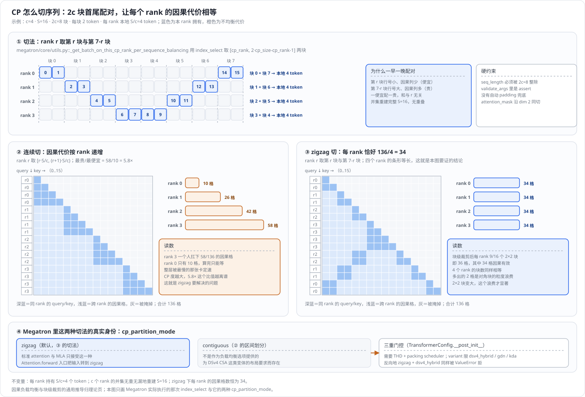
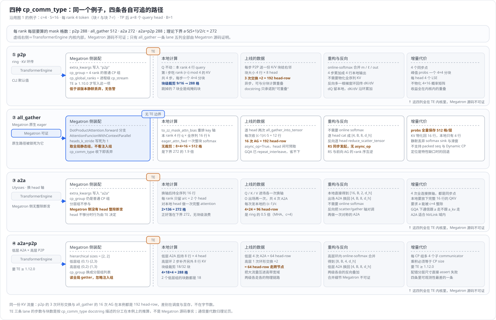
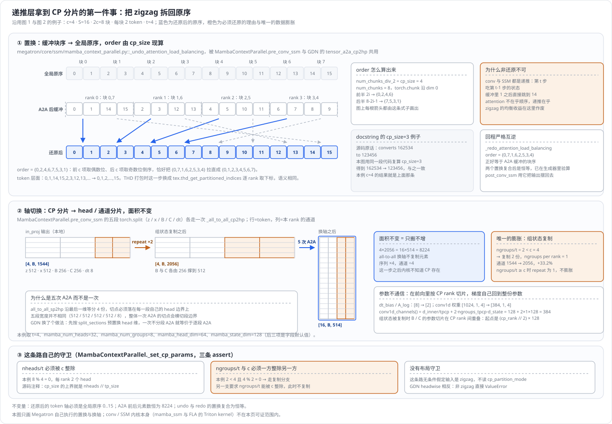
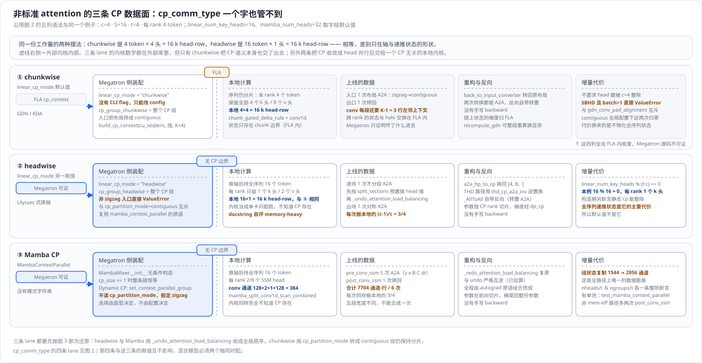
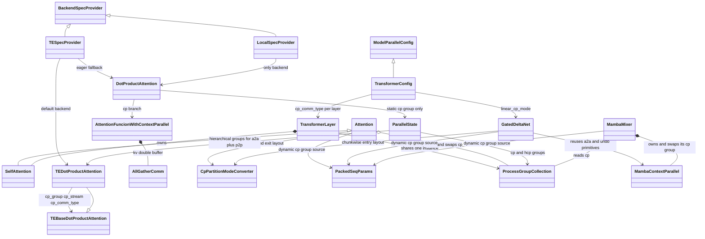

# Megatron-LM 上下文并行(Context Parallelism)接入面深度解析

> **源码基线**：`NVIDIA/Megatron-LM@85902ef599ea4eb06ada7567a479c524b605767a`（`dev`，2026-09-01）
> **核心源码**：`megatron/core/transformer/transformer_config.py`、`megatron/core/transformer/transformer_layer.py`、`megatron/core/transformer/attention.py`、`megatron/core/extensions/transformer_engine.py`、`megatron/core/transformer/dot_product_attention.py`、`megatron/core/transformer/dot_product_attention_context_parallel.py`、`megatron/core/parallel_state.py`、`megatron/core/context_parallel_layout/conversion.py`、`megatron/core/packed_seq_params.py`、`megatron/core/ssm/mamba_context_parallel.py`、`megatron/core/ssm/mamba_mixer.py`、`megatron/core/ssm/gated_delta_net/common.py`、`megatron/core/ssm/gated_delta_net/gdn.py`
> **中心结论**：Megatron 没有实现 CP 的四种通信调度，而是把「怎么搬 K/V」压成一条**可按层取值的字符串** `cp_comm_type`；四种取值里有三种连同 CP 进程组、CP 全局 rank 列表和一条进程级 `cp_stream` 原样透传给 TransformerEngine，只有 `all_gather` 另有一条原生 eager 实现作为特性缺口时的回退。因此本页能**逐步证明**的是配置面：谁被传给谁、哪个守卫拒绝哪种组合、进程组按什么规则构造、动态 CP 在哪两处换组，以及原生 all-gather 那条路的每一步；真正的分块调度与通信-计算重叠发生在 TE 内核里，Megatron 源码证明不了。本页把同一个 $c=4$、$S=16$ 的例子原样喂进四条数据平面走完全程（§2.4），每条 lane 都把「Megatron 可证」与「按 docstring 分工推算」显式分开，这条边界本身就是本页的结论。**同一条边界在非标准 attention 上落到了另一个位置**：线性 attention 的 `linear_cp_mode` 与 Mamba 的 `MambaContextParallel` 是另外两条 CP 数据面（§2.5），它们必须先把 §2.1 那个 zigzag 拆掉才能算——而其中 headwise 与 Mamba 把 CP 化归成 head 并行后交给一个 CP 无关的本地内核，因此**整条 CP 数据面都在 Megatron 源码里**，可证范围反而比四条 `cp_comm_type` lane 里的三条更大。
> **适用范围**：本页覆盖 Megatron-LM 里**全部三类层的 CP 接入面**——标准 attention 侧的 `cp_comm_type`（解析与逐层展开、TE 透传边界、原生 all-gather 回退实现及其约束），以及非标准 attention 侧的两条数据面：线性 attention（GDN / KDA）的 `linear_cp_mode` 与 Mamba-2 的 `MambaContextParallel`（§2.5，本页是这两者的 owner）。另外还包括 CP 与分层 CP 进程组构造、`cp_partition_mode` 布局转换、attention 侧接入点、Dynamic CP 的 Megatron 源码细节与选型决策树。本页还负责把这些数据面在 Megatron 的真实配置值上**实例化重放**一遍（§2.1 的切分、§2.4 的四条 `cp_comm_type` 数据平面、§2.5 的两条非标准数据面），并逐条标注证据等级。CP 的**通用机制**（首尾配对为什么均衡的一般证明、因果块裁剪的一般形式、四种调度的算法推导、通信量代数、与 TP/PP/DP/EP 的组合关系）仍归 [[../../../01_theory/06_distributed_parallelism/20_ring_attention_and_context_parallel_analysis|20_ring_attention_and_context_parallel_analysis]]；PP 组合见 [[15_megatron_pp_schedulers_analysis]]，EP 折叠的运行时所有权见 [[14_megatron_ep_analysis]]，TP/SP 见 [[12_megatron_tp_analysis]]，packing 与动态 CP 流水线见 [[29_megatron_packed_dataset_dynamic_cp_analysis]]，DSv4 案例见 [[35_deepseek_v4_context_parallel_analysis]]。
> **最近更新**：2026-09-04。补上非标准 attention 的两条 CP 数据面：新增 §2.5（`linear_cp_mode` 的 chunkwise / headwise 与 `MambaContextParallel`，同一个 $c=4$ 例子逐条重放，含 zigzag 还原置换图与三 lane 对照图两张新图），并把 §4.3、§5.3 里原先「机制归 GDN / KDA 相关页面」的悬空指派收回本页——`grep -rln linear_cp_mode wiki/` 当时只命中本页，那个被指向的 owner 并不存在；§2.5 之后的小节顺延为 §2.6 可证边界、§2.7 开销结算。配套地：§3.1 的所有权图与表补进 `GatedDeltaNet` / `MambaMixer` / `MambaContextParallel` 三个所有者，§3.2 新增第三棵调用树（GDN 与 Mamba 各一条前向）与第 7 条源码阅读路线，§5.1 补进六条这两条数据面自己的硬约束，§6 给 `linear_cp_mode` 补上正式契约行并记明它没有 CLI flag。同批补齐算法重放与原理图：新增 §2.1（序列切分的 Megatron 实例化重放，含 zigzag 与连续切在因果掩码下的负载对照图）与 §2.4（同一个 $c=4$ 例子跑过四种 `cp_comm_type`，含四 lane 对照图），四张图都由 `tools/figs/svg/megatron_cp_figures.mjs` 从同一组配置算出、带回归测试；页内 §2 顺序为 2.1 切分 → 2.2 接入面 → 2.3 逐组件契约 → 2.4 四条 `cp_comm_type` 数据平面 → 2.5 两条非标准数据平面 → 2.6 可证边界 → 2.7 开销结算。此前已按特性分析契约重写：补上原先缺失的代码实现分析（类与所有权图、两棵 ASCII 调用树、源码阅读路线）和开销结算；把 50 处 `path:line` 引用换成 `path::symbol` 稳定锚点；逐条重核约束表，修正「THD 与 full-iteration CUDA Graph 互斥」「8K 阈值出自 README」等已漂移的旧结论；新增原生路径静默丢弃 softmax sink 与滑窗、GQA 的 KV 头在进入 CP 前被展开、`pg_collection.cp` 是 block 级共享可变状态等源码发现。

---

## 1. 特性概览

### 1.1 问题背景

序列切开只是第一步：每张卡持有 $S/c$ 段 Q/K/V 之后，attention 仍要求每个 query 看到它可见范围内的**全部** K/V，于是 K/V 必须在 CP 组内搬运——而「搬法」不止一种，且哪种最优随集群拓扑与模型形状变化。源码把四种搬法并列写进同一个字段的 docstring，并逐条标出它们互斥的性质：`p2p` 是异步、可与 attention 计算重叠的环形 P2P；`all_gather` 被描述成先收齐全序列 KV、不异步也不可重叠；`a2a` 换的是 head 轴而不是序列轴，因而要求 head 数够分；`a2a+p2p` 在低层组走 A2A（例如 NVLink）、在高层组走 P2P（例如 IBLink）。**能不能与计算重叠、走哪条物理链路、head 够不够分**这三件事没有一件是模型作者能在建图时静态确定的，写死任何一种，换个拓扑就会变成瓶颈——这就是 Megatron 需要一个配置轴而不是一个实现的原因。

### 1.2 解决方法

Megatron 的选择是**只做配置面，不做算法面**。它把搬 K/V 的方式压成 `TransformerConfig.cp_comm_type`，类型是 `Optional[Union[str, List[str]]]`：给一个字符串就是全模型同一种，给一个列表就是**逐层不同**。这个字符串在建层时按全局层号展开成 attention 构造参数，落到后端有两条完全不同的归宿：TE 后端把它连同 CP 进程组、CP 全局 rank 列表和一条进程级 CUDA stream 装进 `extra_kwargs`，交给 `te.pytorch.DotProductAttention`，之后的一切发生在 TE 内核里；原生后端则把它**收下并丢弃**，因为配置校验已经把原生路径的取值锁死成 `all_gather`，再由一个自带 KV 双缓冲 all-gather 的 autograd Function 完成计算。除通信调度外，Megatron 还独占三件与 CP 相关的状态：CP 与分层 CP 进程组的构造规则、attention 入口处的 CP 上下文切换（动态组加布局转换），以及输入侧的序列切分派发。

### 1.3 收益、开销和约束

| 维度 | 直接收益 | 必付成本或边界 |
|---|---|---|
| 配置表达力 | 一个字符串即可换通信调度，且可逐层不同；混合 attention 模型能给不同层不同搬法 | 列表长度必须等于 `num_layers`，没有补齐或广播兜底；索引用的是加过 PP 偏移的**全局**层号 |
| 实现负担 | Megatron 不维护 ring / Ulysses / 分层混合三份内核 | 这三种的真实通信行为、重叠效果与失败模式全部在 TE 内部，Megatron 侧只剩「换调度」或「换 TE 版本」两个旋钮 |
| 版本耦合 | 版本门控集中在一处，档位清晰 | CP 要 TE ≥ 1.0.0、`cp_comm_type` 要 TE ≥ 1.10.0、`a2a+p2p` 要 TE ≥ 1.12.0；低于 1.10.0 时 **`cp_comm_type` 这一项的写入**被跳过且**不告警**（`cp_group`、`cp_global_ranks`、`cp_stream` 仍照常写入） |
| 原生回退 | 不装 TE 也能跑 CP，可用于验证与特性缺口调试 | 只支持 `all_gather`；eager kernel 物化并保存完整概率矩阵，显存约 $B\,a\,S^2/c$；不支持 packed sequence、attention bias、dropout，且静默丢弃 softmax sink 与滑窗 |
| 进程组 | CP、分层 CP、动态 CP 三套组在初始化期一次建好，运行期零构造 | 分层组与动态组会显著抬高 NCCL communicator 数量；分层组还必须满足乘积等于 CP size |
| 变长负载 | Dynamic CP 让 CP 度随 microbatch 变，长样本借更多卡 | 只在 TE 与部分实验变体路径生效；原生 eager 路径完全不参与 |

### 1.4 符号约定

| 符号 | 含义 |
|---|---|
| $c$ | CP degree，即 `context_parallel_size` |
| $t$ | TP degree，即 `tensor_model_parallel_size` |
| $S$、$B$、$H$ | 全局序列长度、micro-batch size、hidden size；每卡持有 $S/c$ 个 token |
| $a$ | TP 切分后本 rank 的 attention head 数，满足 $a\,d_h=H/t$ |
| $a_{\mathrm{kv}}$ | KV head 数（GQA 时 $a_{\mathrm{kv}}<a$） |
| $d_h$、$d$ | 每个 head 的维度、每个张量元素的字节数 |
| AG、RS、A2A | all-gather、reduce-scatter、all-to-all |

---

## 2. CP 接入面详细方案

### 2.1 序列到底怎么切：一个 $c=4$ 的例子

CP 的第一次决定性变换发生在 attention 之前、数据侧。`megatron/core/utils.py::get_batch_on_this_cp_rank` 按 `cu_seqlens` 是否为空派发：非 packed（或显式要求 per-sequence 均衡）时进入 `_get_batch_on_this_cp_rank_per_sequence_balancing`。它对 batch 里**每一个张量值**做同一件事，只跳过 `cu_seqlens`、`cu_seqlens_padded`、`max_seqlen`、`local_cp_size`、`hybrid_cp_group` 五个元数据键与 `None` 值：

1. **切块**：把序列维 view 成 $2c$ 块。`tokens` / `labels` / `position_ids` 的序列维是 dim 1（$[B,S]\to[B,2c,S/2c]$）；`attention_mask` 的序列维是 dim 2（$[B,1,S,S]\to[B,1,2c,S/2c,S]$）。
2. **选块**：`index_select` 取两个下标，源码写死为 `index[0]=cp_rank`、`index[1]=2*cp_size-cp_rank-1`。
3. **合回**：view 回 $[B,S/c]$ 与 $[B,1,S/c,S]$。

第 3 步的形状值得停一下：mask 只有 **query 轴**被切走，**key 轴仍是全局 $S$、且仍按全局原序排列**。这个不对称就是 §2.2 第四道边界那次 `to_zz_mask_attn_bias` 重排的起因。

以 $c=4$、$S=16$ 为例，$2c=8$ 块、每块 2 个 token，rank $r$ 拿第 $r$ 块与第 $7-r$ 块：



| rank | 块下标 | 本地 token | 因果格数（zigzag） | 若改成连续切 |
|---|---|---|---|---|
| 0 | 0, 7 | 0, 1, 14, 15 | 34 | 10 |
| 1 | 1, 6 | 2, 3, 12, 13 | 34 | 26 |
| 2 | 2, 5 | 4, 5, 10, 11 | 34 | 42 |
| 3 | 3, 4 | 6, 7, 8, 9 | 34 | 58 |

因果 mask 下第 $q$ 行 query 能看到 $q+1$ 个 key，全序列共 $S(S+1)/2=136$ 格。连续切按 rank 递增地分配这 136 格，得到 **10 / 26 / 42 / 58**：rank 3 独自扛下 58 格、rank 0 只有 10 格，比值 **5.8×**，整层被最慢的那张卡定速。zigzag 把一个"早块"（行号小、可见 key 少、便宜）与一个"晚块"（行号大、可见 key 多、贵）配成一对，四个 rank 各得 $136/4=34$ 格——**精确相等，不是近似**。以 chunk 为粒度做因果块裁剪时同样均衡：rank $r$ 的 2 个 query chunk × 8 个 key chunk 共 16 个 $2\times2$ 块里，只有 **9 块**含因果有效格（$9/16$，四个 rank 都是 9 块），实算 36 格，其中 34 格有效、2 格是两个对角块的粒度浪费。首尾配对为什么必然让两块之和与 $r$ 无关、块裁剪的一般形式，属于通用机制，见理论页。

**这份"本地 query"是后面四种调度共用的起点**：$c$ 个 rank 各持 $S/c$ 个 token 的 q/k/v，谁也不多谁也不少；`cp_comm_type` 争的只是"怎么把另外那 $S-S/c$ 行 K/V 弄过来"。三条不变量随之成立：每 rank 恰好 $S/c$ 个 token；$c$ 个 rank 的并集无重无漏地重建 $S$；因果工作量按 rank 相等。第一条要求 `seq_length` 能被 $2c$ 整除——`validate_args` 为此写了一条 `assert`，没有自动 padding 兜底。

**Megatron 自己也有"连续切"，但它不是负载均衡选项。** `cp_partition_mode='contiguous'` 在 `megatron/core/context_parallel_layout/routes.py::_build_thd_layout_segments` 的 contiguous 分支里算的正是上表最后一列那种区间划分（rank $r$ 取 $[r\cdot S/c,(r+1)\cdot S/c)$，`part_len = total_tokens // cp_size`），但源码提供它的理由不是"另一种切法可选"，而是 DSv4 CSA 这类变体对 token 排布的硬要求。它因此被三重门控（THD、packing scheduler、variant 限于 `dsv4_hybrid` / `gdn` / `kda`），标准 attention 与 MLA 走的仍是 zigzag，见 §4.2 与 §5.1。**读到"CP 是连续切"的说法时，要先确认它说的是负载均衡还是这条变体专用布局。**

### 2.2 最小示例：一次 attention 调用如何拿到 CP 上下文并选中一种调度

CP 在 Megatron 侧的决定性变换不在 attention 数学里，而在**一次 `Attention.forward` 的头尾**：它要在进入内核前把「本次 microbatch 用哪个 CP 组、张量按哪种 CP 布局排列」两件事就位，在离开时原样还原。以最简的静态 CP、标准 dense 层为例，一次调用要穿过四道边界。

**第一道：字符串在建图期就已经绑死。** `TransformerLayer.__init__` 只在 `context_parallel_size > 1` 且 `config.cp_comm_type is not None` 时才把它写进 attention 的构造 kwargs；是列表就按 `self.layer_number - 1` 取下标，注释明确写着层号是 1-indexed。这里的 `self.layer_number` 是**加过 PP 偏移之后的全局层号**，所以列表按整模型编号，PP stage 不需要自己切片——代价是列表长度必须等于 `num_layers`，`TransformerConfig.__post_init__` 会为此断言。若字段是 `None`，kwarg 根本不出现，后端各自用自己的默认值（TE 侧默认 `"p2p"`，原生侧默认 `None`）。

**第二道：后端由另一个开关选，不由 `cp_comm_type` 选。** `Attention.__init__` 把 `cp_comm_type` 原样转交给 `submodules.core_attention(...)`，而这个 builder 是谁，取决于 spec provider：`TESpecProvider.core_attention` 在 `fallback_to_eager_attn` 为真时返回原生 `DotProductAttention`，否则返回 `TEDotProductAttention`；`LocalSpecProvider.core_attention` 恒返回原生实现。**`cp_comm_type` 只描述「怎么搬」，不描述「谁来搬」**——这两件事在源码里由不同字段分管，也是新读者最容易混淆的一处。`CoreAttentionBuilder` 协议把 `cp_comm_type` 列为必填关键字，所以每个后端都必须接受它，哪怕像原生实现那样收下就丢。

**第三道：CP 上下文在 forward 入口就位。** `Attention.forward` 开头先存一份 `_orig_cp_group = self.pg_collection.cp`；若 `packed_seq_params.local_cp_size` 非空（Dynamic CP），就把 `self.pg_collection.cp` 换成本 microbatch 的动态组；随后调用 `convert_module_input_tensors_cp_partition_mode(...)`，以 `target_partition_mode="zigzag"` 把 hidden states 从 `config.cp_partition_mode` 声明的源布局转过来，并拿回一个反向 converter。默认配置下源布局就是 `zigzag`，这一步是恒等返回；只有 `contiguous` 配置才真的发起 all-to-all。这之后的 RoPE 应用吃的也是同一个 `self.pg_collection.cp`，因此位置编码与 attention 看到的一定是同一个组。

**第四道：真正的搬运在后端内部。** TE 后端把 `super().forward(...)` 交给 TE 的 `DotProductAttention`；原生后端进入 `AttentionFuncionWithContextParallel.apply`。原生路径这里有一处极能说明问题的变换：输入侧的 `attention_mask` 是被 `_get_batch_on_this_cp_rank_per_sequence_balancing` 沿 **dim 2（query 轴）** 按 zigzag 挑走的，形状为 $[B,1,S/c,S]$——query 行已经是本 rank 的那两块，key 列却仍是**全局原序**。而 `all_gather_into_tensor` 收回来的 KV 是按 **rank 序**拼接的，即 `[rank0 的两块, rank1 的两块, ...]`。两者对不上。`to_zz_mask_attn_bias` 就是为了消掉这个差：它把 mask 沿 dim 3 切成 $2c$ 块，用 `zip(前 c 块, reversed(后 c 块))` 交错重排，得到的顺序恰好是「第 0 块、第 $2c-1$ 块、第 1 块、第 $2c-2$ 块……」，与 all-gather 的物理排布逐块对齐，再 `masked_fill_(-inf)` 变成 attention bias。**这就是本页边界内最小但最决定性的那次变换**：Megatron 不重新推导 ring attention，它做的是把「输入切分约定」和「集合通信的物理排布约定」缝在一起。切法本身与它的负载均衡后果见 §2.1，重排在 $c=4$ 例子上的具体块序见 §2.4.1；首尾配对为什么必然让代价相等，属于通用机制，见理论页。

一次调用的完成边界是：`linear_proj` 产出 $[S/c,B,H]$ 的层输出，反向 converter（若存在）把它转回调用方的原布局，最后把 `self.pg_collection.cp` 还原成 `_orig_cp_group`，返回 `(output, bias)`。**还原这一步不是可有可无的收尾**：`pg_collection` 是 `TransformerBlock` 建的**同一个对象**、传给每一层，改它就是改整块的共享状态。源码里两条 return 路径（flash-decode 提前返回与正常返回）都写了还原，但没有 `try/finally`——按源码形状读，attention 前向中途抛异常会把动态组泄漏给同 block 的后续层。这是读码推论，不是已确认的缺陷报告。

### 2.3 从一个字符串到一次通信：逐组件契约

| 组件 | 责任 / 契约 | 为什么是这个边界，被否掉的替代 | 状态与张量如何流动 | 守卫与代价 |
|---|---|---|---|---|
| `TransformerConfig.cp_comm_type` | 承载 `p2p` / `all_gather` / `a2a` / `a2a+p2p` 四选一，标量或逐层列表 | 被否掉的替代是**该字段引入前的状态**：`TEDotProductAttention.__init__` 的 `cp_comm_type` 形参与本字段同批引入（`git log -S"cp_comm_type"` 在两个文件上都收敛到 `91a8a4c8d`），此前全模型只有 TE 的单一默认调度，无从逐层区分。判据是混合 attention 与非均匀拓扑下「一种调度打天下」不成立 | 建图期只读，不随 step 变 | 列表长度必须等于 `num_layers`；标量必须是 `str`；两条都是 `assert` |
| CLI 归一化 | `--cp-comm-type` 是 `nargs='+'`、默认 `["p2p"]`；长度为 1 时降为标量写入 config | 被否掉的替代是让 CLI 直接暴露两种类型：源码选择「统一收成列表、单元素时降级」，这样逐层配置与全局配置共用一个 flag | `List[str]` 变成 `str` 或原样保留 | **默认值冲突**：dataclass 默认是 `None`，但经训练入口进来一定是 `"p2p"`。因此 `--transformer-impl local` 且 CP 大于 1 时必须显式写 `--cp-comm-type all_gather`，否则被校验拒绝 |
| `TransformerLayer.__init__` 展开 | 按全局层号取下标，写进 attention 的构造 kwargs | 被否掉的替代是「每个 PP stage 自己切一段列表」：源码选择用加过偏移的全局层号直接索引全长列表，代价是列表必须按整模型长度给，收益是 PP 布局改变时配置不用重写 | 列表元素变成一个 `str`；`None` 时 kwarg 缺席，后端用自身默认 | 全局层号越界即 `IndexError`；MTP 内层与 `add_layer_offset=False` 的层不加偏移，索引基不同 |
| CP 进程组构造 | `initialize_model_parallel` 用 `RankGenerator.get_ranks('cp')` 枚举 CP 轴，逐组 `create_group`，本 rank 命中则记入 `_CONTEXT_PARALLEL_GROUP` 与 `_CONTEXT_PARALLEL_GLOBAL_RANKS` | 被否掉的替代是把 CP 当成 DP 的一个子切分：源码把 CP 做成 `order` 串（默认 `tp-cp-ep-dp-pp`）里的**独立一轴**，判据是 CP 必须能与 TP 组成 `tp_cp` 复合组、又必须能与 DP 组成 `dp_cp` 复合组，只有独立成轴才能同时满足 | 全局 rank 列表变成 ProcessGroup 加 rank 列表；两者都要保存，因为 TE 需要 `cp_global_ranks` | 默认序下 CP 组内 rank 间隔为 $t$，即 CP 成员与 TP 成员交错落在同一高带宽域里；这是布局事实，不是断言 |
| 分层 CP 组构造 | `create_hierarchical_groups` 按 `hierarchical_context_parallel_sizes` 逐级用 `einops.rearrange` 重排 rank 数组，每级把含本 rank 的子组追加进列表 | 被否掉的替代是让用户直接给出每级的 rank 列表：源码选择「只给各级大小、由重排式推出交错分组」，判据是分组必须与 `a2a+p2p` 期望的「低层组内相邻、高层组跨节点」布局严格一致，手写 rank 列表无法保证 | rank 数组变成每级一个 ProcessGroup，按级顺序存入 `_HIERARCHICAL_CONTEXT_PARALLEL_GROUPS` | 乘积必须等于 CP size（`initialize_model_parallel` 与 `validate_args` 各断言一次）；末尾 assert 本 rank 恰好每级各拿到一个组；communicator 数量是每个 CP 组 $\sum_\ell c/s_\ell$ 个 |
| 后端选择 | `BackendSpecProvider.core_attention()`：TE provider 在 `fallback_to_eager_attn` 下返回原生实现，local provider 恒返回原生实现 | 被否掉的替代是用 `cp_comm_type` 兼管后端选择：源码把「谁实现」与「怎么搬」拆成两个字段，代价是两者可以配出非法组合，因此需要一条专门的交叉校验 | 返回一个类对象，由 `build_module` 实例化 | `fallback_to_eager_attn` 只在 `transformer_impl == "transformer_engine"` 下可用；它与非 `all_gather` 的组合被 `ValueError` 拒 |
| `Attention.forward` 的 CP 上下文 | 换动态 CP 组、做 CP 布局转换、在出口还原 | 被否掉的替代是让每个 attention 模块自己去读全局 CP 组：源码选择改写共享的 `pg_collection.cp`，这样 RoPE、布局转换、GDN 等所有下游消费者不必各自加一个动态组参数 | `pg_collection.cp` 被就地改写又还原；hidden states 可能经 A2A 换布局 | 换组是**共享可变状态**：`pg_collection` 由 `TransformerBlock` 建、整块共用；还原不在 `try/finally` 里 |
| TE 参数装配 | `TEDotProductAttention.__init__` 把 `cp_group`、`cp_global_ranks`、`cp_stream`、`cp_comm_type` 塞进 `extra_kwargs`，交给 TE 基类构造 | 被否掉的替代就是自己实现三种调度，见下方推断标注 | 建图期一次性写入 TE 对象；运行期只有 Dynamic CP 会用 `set_context_parallel_group` 改写 | `cp_stream` 是 `TEDotProductAttention` 的**类属性**，全进程共享一条 stream，首个启用 CP 的层惰性创建；`a2a+p2p` 会把 `cp_group` 整个换成分层组列表 |
| 原生 CP 实现 | `AttentionFuncionWithContextParallel` 以 KV-head 为粒度做双缓冲 all-gather，配 `eager_attn_fwd` / `eager_attn_bwd` | 被否掉的替代是在原生路径上也做 ring：判据可以从实现形状直接读出——`eager_attn_fwd` 一次算出完整 softmax 并把整个 `probs` 连同输出一起 `save_for_backward`，**没有** online-softmax 的分块合并逻辑。eager 路径本来就要物化完整概率矩阵，ring 的「分块算、增量合并」在这里省不出东西 | 本地 KV $[S/c,B,1,d_h]$ 经 AG 变成 $[S,B,1,d_h]$；反向逐 head `reduce_scatter_tensor` 切回 $[S/c,B,1,d_h]$ | `heads_k_stride` 写死为 1；`attention_mask` 不可为 `None`；缺 `einops` 直接 `ImportError` |
| 反向边界 | 原生路径的 dq 留本地、dk/dv 逐 head 同步 RS；TE 路径的反向由 TE 的 autograd 完成 | —— | RS 是前向 AG 的共轭，按 dim 0 切回 rank 序，与 all-gather 的拼接顺序严格互逆 | 原生反向的 RS 是**同步**的（`reduce_scatter_tensor` 不带 `async_op`），只有 AG 有双缓冲 |

> [!note] 推断：三种调度为什么留在 TransformerEngine
> 源码全程没有陈述这条取舍——既没有设计注释，也没有 commit message 说明。能读到的只有一组 `is_te_min_version` 版本门控和「装好参数交给 TE」这个事实。本页据此重建的解释是：`p2p` / `a2a` / `a2a+p2p` 的收益全部来自 attention 内核**内部**的通信-计算重叠（把 KV 传输塞进分块 softmax 的空档，这正是 `cp_comm_type` docstring 说 `p2p` 「可与 attention 计算重叠」的含义），必须与 flash-attention 内核写在一起才成立；Megatron 自己写就等于复刻一份 flash-attention。**这是本页的推断，不是作者的自陈**——要引用这条判断，请回到 `TEDotProductAttention.__init__` 的版本门控与 `cp_comm_type` 的 docstring 本身，不要引用本段。

### 2.4 同一个例子跑过四种 `cp_comm_type`

四种取值不是"同一个算法的四个参数"，而是**四套不同的数据平面**：本地乘哪些块、什么东西上线、输出怎么拼回来，三件事各不相同。因此这里把 §2.1 那个 $c=4$、$S=16$ 的例子原样喂进四条路，逐条走一遍。

进入 CP 边界时四条路看到的输入完全一样：$[S/c,B,a,d_h]=[4,B,8,d_h]$ 的 q/k/v（原生路径上 k/v 的 KV head 已被 `repeat_interleave` 展开到 $a$ 个，见 §2.7），外加 $[B,1,4,16]$ 的 mask——query 轴已切、key 轴仍是全局原序。分歧从下一步开始。



先立边界，因为它决定了下面每一段的证据等级：**四条 lane 里只有 `all_gather` 的原生实现能被 Megatron 源码逐步证明**；另外三条从"Megatron 把哪几个字段塞进 `extra_kwargs`"之后就进了 TE 内核。所以下面每条 lane 都先给可证部分，再给**按 `cp_comm_type` docstring 描述的分工在本例上推算**的部分，两者显式分开。

#### 2.4.1 `all_gather`：唯一全程可证的一条

入口是 `DotProductAttention.forward` 的 CP 分支，把展开后的 q/k/v、mask、dropout、`softmax_scale` 与 `parallel_state.get_context_parallel_group()` 交给 `AttentionFuncionWithContextParallel.apply`。函数内 `heads_k_stride` 写死为 1，因此下面每一步的粒度都是**一个 head**。

**第一步，把 mask 的 key 轴重排到 rank 序。** `to_zz_mask_attn_bias` 把 $[B,1,4,16]$ 的 mask 沿 dim 3 切成 $2c=8$ 块，用 `zip(chunked[:c], reversed(chunked[c:]))` 交错后 `cat` 回去。本例得到的块序是 **0, 7, 1, 6, 2, 5, 3, 4**，展开成 token 序就是 `0,1,14,15, 2,3,12,13, 4,5,10,11, 6,7,8,9`——正好是"rank 0 的两块、rank 1 的两块、rank 2 的两块、rank 3 的两块"。这与 `all_gather_into_tensor` 沿 dim 0 按 rank 序拼接的物理排布逐块对齐。重排后 `masked_fill_(-inf)` 变成 attention bias，再 `expand` 到 `heads_k_stride * (nheads // nheads_k)` 即 1 个 head。**这一步是整条路的正确性关键：它不改变数学，只是把"输入切分约定"缝到"集合通信排布约定"上。**

**第二步，双缓冲收 KV。** `kv_buffer` 的形状是 $[2,\,S,\,B,\,1,\,d_h]=[2,16,B,1,d_h]$（第一维是 K/V），另有一份 `kv_buffer_copy`。进循环前先把 head 0 的 $k[:,:,0:1]$ 与 $v[:,:,0:1]$（各 $[4,B,1,d_h]$）以 `async_op=True` 发出两次 `all_gather_into_tensor`。

**第三步，逐 head 循环 $a=8$ 次。** 每次：`comm.wait()` → 交换两个 buffer → 若不是最后一个 head，立刻异步发起下一个 head 的两次 AG（**这就是这条路上唯一的重叠窗口，粒度是 head，不是 KV 块**；该实现由 `157bec937`「Adding context parallel support to eager attention implementation」引入）→ 取 $q_i=[4,B,1,d_h]$、$k_i=v_i=[16,B,1,d_h]$，`rearrange` 成 `b s h d` 后交给 `eager_attn_fwd`。

**第四步，`eager_attn_fwd` 一次算完整 softmax。** $q\cdot k^{\mathsf T}\cdot\text{scale}$ 得到 $[B,1,4,16]$ 的 `attn_w`，加上 bias 后**对整行做一次 `F.softmax`**，再乘 $v$ 得到 $[B,4,1,d_h]$。注意这里算的是 $4\times16=64$ 格的**完整**矩阵——因果无效的那 30 格被 $-\infty$ 压成 0，但乘法照做。8 个 head 合计 **512 格**，而 §2.1 算出的因果下界是 $a\cdot S(S+1)/2/c=272$ 格，**这条路算的是下界的 1.9 倍**。函数没有任何分块或跳块逻辑，也就没有 online softmax 的立足之地——§2.3 组件表里那条"原生路径为什么不做 ring"的判据就在这里。

**第五步，拼装与保存。** `torch.cat(outs, dim=2)` 沿 head 轴把 8 份 $[B,4,1,d_h]$ 拼成 $[B,4,8,d_h]$，`rearrange` 回 $[4,B,8,d_h]$，最后 `view` 成 $[4,B,H/t]$ 交给 `linear_proj`。同时 `ctx.save_for_backward(q, k, v, attention_mask, *outs, *probs)`——**8 份完整概率矩阵全部留到反向**，本例是 $B\,a\,(S/c)\,S=1\times8\times4\times16=512$ 格，与 §2.7 的 $M_{\mathrm{probs}}=B\,a\,S^2/c$ 对得上。

**通信账。** 每层前向 $2a=16$ 次 all-gather；每次每 rank 收进 $(c-1)/c\cdot S=12$ 行，合计 **192 head-row**（一个 head-row = 一个 token 行 × 一个 head）。

**关于时序。** 这条路是本页唯一时序可证的一条：双缓冲预取窗口与「AG 异步、反向 RS 同步」的不对称都写在 Megatron 源码里，因此上文用文字给出，而没有单画一条时间轴——它只是一个 $a=8$ 次的单层循环，时间轴能表达的信息量不超过这两句话。另外三条调度的时序发生在 TE 内核内部，Megatron 源码只能证明配置字符串、进程组、rank 列表与共享 `cp_stream` 被交出去，任何 ring 轮转或 A2A/P2P 嵌套的甘特图都会是凭空构造的证据，因此图 2 只给步数与块数，并把那几列置灰。

**反向。** `AttentionFuncionWithContextParallel.backward` 重跑同一套双缓冲 AG（又是 16 次），用保存的 `outs[i]` / `probs[i]` 调 `eager_attn_bwd`；`dq_i` 是 $[B,4,1,d_h]$，**直接留在本 rank**；`_dk_i` / `_dv_i` 是全序列的 $[16,B,1,d_h]$，用 `reduce_scatter_tensor` 沿 dim 0 求和并切回 $[4,B,1,d_h]$——RS 是前向 AG 的严格共轭，rank 序一致。**RS 不带 `async_op`，是同步的**：反向只有 AG 有重叠窗口，RS 没有。反向合计 16 次 AG 加 16 次同步 RS。（`heads_k_stride` 与 backward 取保存张量的下标绑定，见 §3.2。）

#### 2.4.2 `p2p`：环形轮转（TE 内核）

**Megatron 侧可证的全部内容**：`extra_kwargs["cp_comm_type"]` 被写成 `"p2p"`；`cp_group` 是那个 4 rank 的普通 CP 组；`cp_global_ranks` 是它的全局 rank 列表；共享的类属性 `cp_stream` 被一并传入。整段写入被 `is_te_min_version("1.10.0")` 包着，低于该版本这一项**静默丢弃**。到此为止。

**按 docstring 的分工在本例上推算**（docstring 原话是"以环形拓扑用 P2P 交换 KV 块；P2P 是异步的、可与 attention 计算重叠"）：

- **本地计算**：Q 不动——rank $r$ 的 4 行 query 从不上线。第 $i$ 步手里的 K/V 来自 rank $(r-i)\bmod 4$，是 4 行 × 8 head 的一块；跑满 $c=4$ 步后，本 rank 的每一行 query 都与全部 16 行 key 算过一遍。按 chunk 粒度做因果裁剪，rank $r$ 的 2 个 query chunk × 8 个 key chunk = 16 块里只有 9 块要算（§2.1 的 9/16），合计 **288 格**。
- **上线的数据**：$c-1=3$ 次交换，每次 K 与 V 各一块，$3\times2\times(4\times8)=$ **192 head-row**——**与 `all_gather` 完全相同**。ring 省的不是字节数。
- **重构**：每步产出一个局部 $(\text{out},m,\ell)$，用 online softmax 无误差地增量合并成本 rank 的 4 行输出。
- **反向差异**：dQ 可以留本地，但 dK/dV 必须回到属主，所以反向要多走一根梯度环——这是它与 `all_gather` 的"一次 RS 收工"最结构性的区别。
- **增量代价**：4 个同步点；峰值只需持有 1~2 个 4 行 KV 块与一个 $4\times4$ 分块的概率矩阵（外加每 head 4 个 LSE），而不是 `all_gather` 的 16 行 KV 加 $4\times16$ 全量矩阵。**ring 相对 all-gather 的收益全在"显存 + 重叠"，不在通信量。**

**Megatron 源码证明不了的**：轮转的实际时序、合并公式、传输是否真的与计算重叠、反向那根环怎么实现。要引用这些请去 TE。

#### 2.4.3 `a2a`：换 head 轴（TE 内核）

**Megatron 侧可证**：字符串被原样透传；`cp_group` 仍是普通 CP 组，分层组不参与；**Megatron 侧没有任何 head 数整除断言**——docstring 要求 head 够分，越界时的行为由 TE 决定。

**按 docstring 的分工在本例上推算**（"像 DeepSpeed Ulysses 那样把 attention head 散到 CP 组、再收齐完整序列的 QKV"）：

- **本地计算**：进场时 q/k/v 各做一次 A2A，$[4,B,8,d_h]\to[16,B,2,d_h]$——本 rank 换来**全序列 16 行**，但只留 $a/c=8/4=2$ 个 head。然后对这 2 个 head 做**一次完整的因果 attention**，每 head 恰好 136 格，合计 **272 格**：正好落在 $a\cdot S(S+1)/2/c$ 这个下界上，**没有任何块粒度浪费**，是四条路里本地计算量最小的一条。
- **上线的数据**：进场 Q/K/V 三次换轴、出场 O 一次换轴，共 4 次 A2A；每次每 rank 发出本地 $4\times8=32$ head-row 的 $(c-1)/c$，即 24，合计 **96 head-row**，是 ring / all-gather 的一半（MHA、$c=4$）。计次口径要说清：这是按"Q/K/V 各算一次调用"数的；把三者打包成一次批量调用时同一机制记作 2 次。
- **重构**：本地 attention 直接得到 $[16,B,2,d_h]$，出场 A2A 换回 $[4,B,8,d_h]$，**不需要 online softmax**。
- **反向差异**：把 `scatter_idx` / `gather_idx` 对调再做一次对称的 A2A，没有额外的环。
- **增量代价**：4 次全连接换轴都是同步点；本地要放得下**完整 16 行**的 QKV，比 ring 任意时刻只持 1~2 块贵得多。GQA 下 KV head 要先补齐到 $a$，通信跟 $a$ 走而不跟 $a_{\mathrm{kv}}$ 走，上面那个"一半"的优势会随 $a/a_{\mathrm{kv}}$ 掉回去（代数见理论页）。

#### 2.4.4 `a2a+p2p`：两级分工（TE 内核，但分组可算）

这条路有一件事**是 Megatron 侧可以算出来的**：分层组本身。`create_hierarchical_groups` 用 `einops.rearrange(ranks, "(l s u) -> (l u) s")` 逐级重排 rank 数组，第 `level` 级取 `u = prod(sizes[:level])`、`s = sizes[level]`、`l = prod(sizes[level+1:])`。CP 组为 rank 0..3、`hierarchical_context_parallel_sizes=[2,2]` 时，得到低层组 **{0,1} 与 {2,3}**、高层组 **{0,2} 与 {1,3}**。另外两件可证的是 TE ≥ 1.12.0 的断言，以及 `cp_group` 被整个换成分层组列表（且读的是全局 getter，见 §2.6）。

**按 docstring 的分工在本例上推算**（"低层 CP 组走 A2A（例如 NVLink），高层 CP 组走 P2P（例如 IBLink）"）：

- **本地计算**：低层组 {0,1} 内先做 Ulysses 式换轴，rank 0 与 rank 1 各自换成"两 rank 的 token 并集 × 一半的 head"——token 并集是块 0、1、6、7 共 8 行，head 数 $8/2=4$。随后高层组 {0,2} 内做 2 步环形交换，把 rank 2/3 那 8 行（块 2、3、4、5）的 K/V 轮过来。本地 4 个 query chunk × 8 个 key chunk = 32 块，因果有效 **18 块**，合计 $4\times18\times4=$ **288 格**。两个低层组算出来都是 18 块（{0,1} 拿到块 0,1,6,7 → $1+2+7+8$；{2,3} 拿到块 2,3,4,5 → $3+4+5+6$）——**zigzag 的均衡在分层之后依然成立**，这不是巧合，是首尾配对在任意"连续 rank 并集"上的直接后果。
- **上线的数据**：低层 4 次 A2A，每次发本地 32 head-row 的 $1/2$，合计 **64 head-row 走域内链路**；高层 $2-1=1$ 次环形交换、K 与 V 各一份，每份 8 行 × 4 head，合计 **64 head-row 走跨节点链路**。对照纯 `p2p` 的 192 head-row 全部压在同一个 4 rank 的环上——**分层的收益就是把其中一半挪进高带宽域，并把跨节点那一半的块变大、次数变少。**
- **重构**：高层环内用 online softmax 合并出 $[8,B,4,d_h]$，再由低层 A2A 换回 $[4,B,8,d_h]$。
- **反向差异**：两级各自的反向叠加——高层的梯度环加低层的对称 A2A。
- **增量代价**：每个 CP 组多 $c/s_{\text{low}}+c/s_{\text{high}}=2+2=4$ 个子 communicator（一般式 $\sum_\ell c/s_\ell$）；乘积必须等于 CP size，配错直接 `assert` 失败。

**Megatron 源码证明不了的**：两级之间的 softmax 怎么合并、低层 A2A 与高层 P2P 如何嵌套与重叠。这条路是四条里可观测性最差的一条。

#### 2.4.5 四条路在同一个例子上的账

| 取值 | 本地 mask 格数 | 上线 head-row | 反向增量 | 峰值概率矩阵 | Megatron 能证到哪 |
|---|---|---|---|---|---|
| `p2p` | 288（9/16 块） | 192（3 次环形交换） | 多一根梯度环 | 一个 $4\times4$ 分块 + 每 head 4 个 LSE | 只到参数装配 |
| `all_gather`（原生） | 512（不裁剪） | 192（16 次 AG） | 16 次 AG + 16 次同步 RS | 512 格，全量 `save_for_backward` | **全程** |
| `a2a` | 272（= 下界） | 96（4 次 A2A） | 一次对称 A2A | 无分块矩阵，但本地持全序列 QKV | 只到参数装配 |
| `a2a+p2p` | 288（18/32 块） | 64 域内 + 64 跨节点 | 两级反向叠加 | 高层分块 + LSE | 装配 + 分组规则 |
| 理论下界 | 272 | —— | —— | —— | —— |

三条可以直接读出来的结论：

1. **本地计算上只有换轴落在下界。** Ulysses 的 272 是精确下界；ring 与分层按 chunk 粒度裁剪，算到 288，比下界多约 6%（每 head 浪费两个对角块里的 2 格）；原生 eager **完全不裁剪**，算到 512，是下界的 1.9 倍。这份块粒度浪费约为 $1/(2c)$ 量级：$c$ 越小、块越大，那 6% 越显著。
2. **`p2p` 与 `all_gather` 在本例的 KV 流量完全相同**（都是 192 head-row）。把 all-gather 当成"通信更多"的方案是常见误读：它多付的是**显存与同步**，不是字节。这一点也解释了为什么源码把原生路径定位成回退——真正劝退它的是那 512 格概率矩阵，不是通信。
3. **拉开差距的是峰值激活形态**：原生 eager 保存完整概率矩阵；ring 与分层只留一个分块加每 head 的 LSE；Ulysses 不留概率矩阵，但要在本地放下完整 $S$ 行的 QKV。三种代价形状不同，不能用同一个标量比较。

这三条随 $c$、$S$、$a/a_{\mathrm{kv}}$ 变化的代数形式归理论页；本节只负责把 Megatron 实际会配出来的那四条路在同一个例子上走通，并标清每一步的证据等级。

### 2.5 非标准 attention 的两条 CP 数据面

到这里为止的四条 lane 只覆盖了一半。`cp_comm_type` 的 docstring 自己划出了这条界：它写着这个字段
“controls standard attention layers. Linear-attention layers use `linear_cp_mode` instead.”。在混合模型
里，一个 CP 组同时要伺候三类层，而它们的 CP 数据面互不相同：

| 层型 | CP 数据面 | 由什么选中 |
|---|---|---|
| 标准 attention / MLA | §2.4 的四条 lane | `cp_comm_type`，可逐层给值 |
| 线性 attention（GDN / KDA） | chunkwise 或 headwise | `linear_cp_mode`，全模型一个标量 |
| Mamba-2（SSM） | `MambaContextParallel` | **没有配置轴**，由层型本身决定 |

**这三条路的共同前提是同一件事：§2.1 那个 zigzag 布局必须先被拆掉。** 标准 attention 不在乎 token
在本地缓冲里的先后——它只需要每个 query 看到正确的那些 key，顺序由 mask 与位置编码负责，所以
§2.4 的四条 lane 全都可以直接吃 zigzag。conv1d、SSM 扫描与线性 attention 的 chunk 递推不是这样：
第 $t$ 步的状态由第 $t-1$ 步产出，**相邻这件事本身就是语义**。zigzag 把第 0 块和第 $2c-1$ 块摆成邻居，
递推读到的就是一段假的时间轴。于是这两条数据面在做任何计算之前，都先要把 §2.1 精心制造的那个
不连续摊平回去——这就是本节的中心机制。



#### 2.5.1 共同的第一步：把 zigzag 还原成全局原序

还原由 `megatron/core/ssm/mamba_context_parallel.py::_undo_attention_load_balancing` 完成，它同时被
Mamba 与 GDN headwise 使用（`megatron/core/ssm/gated_delta_net/common.py` 从这个模块直接 import
`_all_to_all_cp2hp`、`_all_to_all_hp2cp`、`_undo_attention_load_balancing`、`_redo_attention_load_balancing`
四个原语）。非 packed 分支只有五行，但每一行都必须对上前一步的物理排布：

1. `torch.chunk(input_, chunks=2*cp_size, dim=0)`——把**已经收齐全序列**的缓冲切成 $2c$ 块。
2. 构造下标表：源码写作 `[2*i for i in range(num_chunks_div_2)] + [num_chunks - 2*i - 1 for i in range(num_chunks_div_2)]`，其中 `num_chunks_div_2` 就是 $c$、`num_chunks` 就是 $2c$。即前 $c$ 项取偶数位、后 $c$ 项取奇数位倒序。
3. 按这张表取块再 `cat` 回去。

在本页那个 $c=4$、$S=16$ 的例子上把它算完。缓冲的来源是 `_all_to_all_cp2hp`，它沿 dim 0 **按 rank 序**
拼接，所以缓冲位置 $2r$ 与 $2r+1$ 上坐的正好是 rank $r$ 的那两个 zigzag 块 $(r,\,7-r)$：

| 缓冲位置 | 0 | 1 | 2 | 3 | 4 | 5 | 6 | 7 |
|---|---|---|---|---|---|---|---|---|
| 全局块号 | 0 | 7 | 1 | 6 | 2 | 5 | 3 | 4 |
| 来自 | rank 0 | rank 0 | rank 1 | rank 1 | rank 2 | rank 2 | rank 3 | rank 3 |

`order` 在 $c=4$ 上算出来是 **0, 2, 4, 6, 7, 5, 3, 1**。按它取块——位置 0 → 块 0，位置 2 → 块 1，
位置 4 → 块 2，位置 6 → 块 3，位置 7 → 块 4，位置 5 → 块 5，位置 3 → 块 6，位置 1 → 块 7——得到
**0, 1, 2, 3, 4, 5, 6, 7**，也就是全局原序。展开到 token 层面就是

$$
0,1,14,15,\;2,3,12,13,\;4,5,10,11,\;6,7,8,9
\;\longrightarrow\;
0,1,2,\dots,15 .
$$

源码 docstring 举的是另一个例子：“for cp_size=3, converts 162534 to 123456”。用同一段代码复算
$c=3$（缓冲块序 $0,5,1,4,2,3$，`order` 为 $0,2,4,5,3,1$）确实得到 `162534` → `123456`，与 docstring
一致——**它举的正是 zigzag，只是换了个 CP 度**。本页图 3 上的那 8 根箭头就是把 $c=4$ 的 `order` 逐项
画出来的，不是手绘。

回程 `_redo_attention_load_balancing` 的 `order` 用另一种写法构造（`order[::2] = range(c)`、
`order[1::2] = reversed(range(c, 2c))`），在 $c=4$ 上是 **0, 7, 1, 6, 2, 5, 3, 4**——**恰好等于上表那行
全局块号**。这不是巧合：把顺序序列按这个 `order` 取块，得到的就是 rank 序缓冲。两个置换复合后是
恒等，图 3 的生成器把这条互逆关系写成了断言。

THD 打包时两个函数都换一条路：改用 `tex.thd_get_partitioned_indices(cu_seqlens, total_tokens, cp_size, cp_rank)`
逐 rank 取下标，并断言 TE ≥ 1.10.0（`tex` 缺失或版本不足直接 `assert` 失败）。语义相同——**每条 packed
子序列各自做首尾配对**，所以还原也必须逐序列进行，不能拿整块 token 轴一刀切。

**chunkwise 走的是同一个目的地，但不用这条路。** GDN / KDA 在 `linear_cp_mode="chunkwise"` 下调用的是
`convert_module_input_tensors_cp_partition_mode(..., target_partition_mode="contiguous")`，也就是 §4.2 那套
`cp_partition_mode` 转换器。它同样把 token 摆回全局原序，但**保持分片**：rank $r$ 从持有块 $(r,7-r)$
变成持有区间 $[4r,4r+4)$，本地仍然只有 4 个 token。所以本节这三条路可以按"还原之后数据在谁手里"分成两类：

| 数据面 | 还原用什么 | 还原后本 rank 持有 |
|---|---|---|
| chunkwise | `cp_partition_mode` 转换器（A2A-v 重分布） | 全局原序的一段：token $[4r,4r+4)$，仍是 $S/c=4$ 个 |
| headwise | `_undo_attention_load_balancing` | 全局原序的**全部** 16 个 token，但只有一部分 head |
| Mamba | `_undo_attention_load_balancing` | 同上 |

**§4.2 那条 `cp_partition_mode` 轴之所以存在，起因就在这里。** `git log -S"linear_cp_mode"` 收敛到
`5139086e7`「support chunkwise context parallelism for GDN」，而这个 commit 同时**新建**了
`megatron/core/context_parallel_layout.py`（后来拆成包）。换句话说：先有"线性 attention 需要连续布局"
这个需求，才有"CP 布局是一个可转换的量"这条抽象；DSv4 CSA 只是后来搭上同一条轨道。这是 commit 内容
与文件创建时间给出的事实，不是作者自陈的动机。

#### 2.5.2 数据面 A：`linear_cp_mode` —— 线性 attention 的两种摆法

**取值与选中方式。** `TransformerConfig.linear_cp_mode` 的类型是 `Optional[str]`，dataclass 默认
`"chunkwise"`，合法取值只有 `"chunkwise"` 与 `"headwise"` 两个；`TransformerConfig.__post_init__` 在
GDN 家族分支里判 `(experimental_attention_variant == "kda" or context_parallel_size > 1)` 且取值不在这两个
之内时 `raise ValueError`。运行期的分派在 `GatedDeltaNet.forward` 与 `KDA` 的对应入口，形状完全一样：
把 `resolve_cp_group(...)` 拿到的组赋给 `cp_group_chunkwise` 或 `cp_group_headwise` 二者之一，另一个置
`None`；两个都不是且 `cp_group.size() == 1` 时两个都置 `None`（CP 关闭）；再落到 `else` 就 `raise ValueError`。

有一处与 `cp_comm_type` 的**不对称值得单独记**：本基线上 `--linear-cp-mode` 这个 CLI flag **不存在**
（`megatron/training/` 整个目录里搜不到这个字段）。因此两个轴的"实际默认值"来路完全不同——`cp_comm_type`
的 dataclass 默认是 `None`，但经训练入口进来一定被 CLI 改写成 `"p2p"`（§2.3）；`linear_cp_mode` 没有这层
改写，实际默认就是 dataclass 上那个 `"chunkwise"`，且只能在 config 层改。**"改个命令行参数试试另一种
线性 CP"在本基线上做不到。**

**为什么默认是 chunkwise，被否掉的是什么。** 被否掉的正是 headwise——而且它不是假想的替代，是
**这个字段引入之前的既有实现**。三段历史按 `git log -S` 排得很清楚：`_undo_attention_load_balancing`
这套原语最早随「Add Mamba context parallel」（`e3ec174fc`）进来，服务的是数据面 B；
「Gated delta net context parallel」（`a935008a5` / `20ba03fec`）把它借给线性 attention，那时 GDN 的 CP
**只有** headwise 一条路、还没有 `linear_cp_mode` 这个字段；直到 `5139086e7` 加进 chunkwise，才顺手
造出这个二选一的轴，并把默认值定在了新的那一边。源码给出的判据写在 docstring 里，一句话两个方向：chunkwise
“storing state at chunk boundaries and doing chunk-local matrix work, avoiding a full per-token recurrent
state materialization while keeping tensor-core-friendly matmuls”，headwise 则被直接自评为
“Correct but memory-heavy”。**判据是递推状态的物化规模，不是通信量**——下面的重放会看到，两条路的
本地工作量其实一样大。



**同一个例子。** 沿用 $c=4$、$S=16$、每 rank 4 个 token，另把 TP 度定死为 $t=4$，线性 attention 的头数取
字段默认值 `linear_num_key_heads=16`、`linear_num_value_heads=32`、`linear_conv_kernel_dim=4`。

**chunkwise 的一趟。** 入口先做 §2.5.1 那次 zigzag → contiguous 转换，rank 0 手里的 token 从
$\{0,1,14,15\}$ 变成 $\{0,1,2,3\}$。随后 `build_cp_context(cu_seqlens, cp_group_chunkwise, conv1d_kernel_size)`
造一个 CP 上下文，连同 `cu_seqlens` 一起交给 FLA 的 `causal_conv1d` 与 `chunk_gated_delta_rule`。
chunkwise 下 `linear_head_parallel_size` **只等于 $t$**，所以本 rank 保留全部 $16/4=4$ 个 k 头与
$32/4=8$ 个 v 头，本地计算的形状是 **4 个 token × 4 个 k 头**，即 $4\times4=16$ 个 k head-row。
上线的数据是入口与出口各一次布局 A2A；跨 rank 的 chunk 边界状态与
causal-conv 需要的 $K-1=3$ 行左邻上下文由 `cp_context` 在 **FLA 内部**交换，Megatron 源码只能证明
"把 `cu_seqlens`、CP 组、卷积核宽交出去了"。反向没有一行手写代码——两次布局转换都是 A2A，
`_AllToAll` 自带转置反向；链上状态的梯度传播归 FLA。

**headwise 的一趟。** 入口相反：`GatedDeltaNet.forward` 显式要求布局**是** zigzag，非 zigzag 直接
`raise ValueError("GatedDeltaNet with headwise CP requires zigzag layout...")`（这条守卫 [[10_megatron_model_structure_analysis]]
已登记）。`a2a_cp_to_hp` 分三步：先用 `_build_head_perm_for_split_sections` 按 in_proj 的六段
（`in_proj_split_names` 是 `query` / `key` / `value` / `z` / `beta` / `alpha`）对 head 维预置换，
使**一次不分段的 A2A 等价于逐段 A2A**（源码注释原话是
“Pre-permute head dim so a single unsectioned a2a is equivalent to per-section a2a”）；再做
`_all_to_all_cp2hp`；最后 `_undo_attention_load_balancing`。THD 路径把最后两步折进
`_build_thd_cp_a2a_perm` 的一次 `index_select`，并把逆置换 `thd_cp_a2a_inv` 交给回程。换轴之后本 rank
持**全序列 16 个 token**，但头数按 $t\cdot c=16$ 切，只剩 $16/16=1$ 个 k 头与 $32/16=2$ 个 v 头。
内核被当成一个单卡问题跑——它完全不知道 CP 存在。

**两条路本地持有的 head-row 数相等，这是可以直接算出来的。** 按 k 头数：chunkwise 是 4 个 token 乘 4 个头得
$4\times4=16$，headwise 是 16 个 token 乘 1 个头得 $16\times1=16$；v 头同理，$4\times8=32=16\times2$。**all-to-all 只搬不增**，
所以换轴前后元素总数必然相等，这个等式不是巧合而是恒等式。真正拉开差距的是**递推状态**：
chunkwise 只在 chunk 边界存状态、序列仍是 $S/c$ 长；headwise 每个头都要沿完整的 $S$ 跑一遍递推。
docstring 的“memory-heavy”指的正是这一项，而不是那 16 个 head-row。

**守卫与代价，逐条对齐。**

| | chunkwise | headwise |
|---|---|---|
| 入口布局 | 任意；转换器负责转成 `contiguous` | **必须**是 `zigzag`，否则 `ValueError` |
| head 整除 | `linear_num_key_heads` 被 $t$ 整除即可 | `linear_num_key_heads` 必须被 $t\cdot c$ 整除，另在 `_GDNBase.__init__` 断言静态 cp size 能整除每 TP rank 的头数 |
| 与 `cp_partition_mode='contiguous'` | 相容（此时入口转换归零） | **互斥**，`__post_init__` 里一条 `ValueError` |
| 其他否决 | SBHD 且 `micro_batch_size > 1` → `ValueError`；与 `gdn_conv_pad_alignment` 互斥 | —— |
| 每层额外 collective | 2 次布局 A2A（`contiguous` 配置下为 0） | 2 次 A2A（进场 / 出场） |
| 内核可证性 | CP 语义交给 FLA 的 `cp_context`，不可证 | CP 收敛成 head 并行，**数据面全程可证** |

`gdn_conv_pad_alignment` 与 chunkwise 互斥这一条源码写了理由：“Padding chunk-local causal-conv inputs
can change later chunk numerics.”——补在段尾的 padding 会漂进下一个 chunk 的状态。这与
§2.1 那条"CP 切分要求 `seq_length` 能被 $2c$ 整除、没有自动 padding"是同一类约束的两次出现。

那条 GDN 家族 `headwise` 加 `cp_partition_mode='contiguous'` 的否决（§5.1 已登记）到这里才有解释：
headwise 的还原路径写死了 `_undo_attention_load_balancing`，它只认 zigzag 的块序；输入本来就是
contiguous 时，这次"还原"会把正确的顺序打乱。源码只给了一句 `ValueError` 文案，没有陈述理由——
**「这是排布约定冲突而不是保守的兼容性限制」是读码推论**，依据是同一条要求在运行期还有第二道
显式守卫（`GatedDeltaNet.forward` 的 zigzag 断言），两道守卫指向同一个不变量。

#### 2.5.3 数据面 B：`MambaContextParallel` —— 没有配置轴的那一条

**选中方式是结构性的。** `MambaMixer.__init__` **无条件**构造一个 `MambaContextParallel`，把
`pg_collection.cp` 和这一 TP rank 的 `d_inner` / `nheads` / `ngroups` / `d_state` 以及 conv1d 权重、
`dt_bias`、`A_log`、`D` 的 cp1 版本全交给它。`cp_size == 1` 时 `_set_cp_params` 提前返回，
`pre_conv_ssm` / `post_conv_ssm` 原样返回输入，整条链恒等。**没有"给 Mamba 层配一种 CP 通信方式"
这回事**：只有一条实现，开关就是 `context_parallel_size`。这个类刻意不继承 `MegatronModule`，
docstring 说明是因为它不拥有任何可训练变量，不该参与 checkpoint。

Dynamic CP 它是参与的——§4.1 列的 `resolve_cp_group` 消费者里没有 Mamba，但 `MambaMixer.forward` 确实调它，
于是它与 §4.1 的两处换组点并列成第三处：`MambaMixer.forward` 用
`resolve_cp_group(_orig_cp_group, packed_seq_params)` 取本 microbatch 的组，若与建图期的组不同就调
`self.cp.set_context_parallel_group(...)`——**这一步会重跑 `_set_cp_params`**，也就是按新的 CP 度重算
`nheads_local_tpcp` / `ngroups_local_tpcp` / `group_repeat_count`，前向结束后再换回来。对比 §4.1 记的
"原生 eager 路径完全不参与 Dynamic CP"：Mamba 是参与的。

**同一个例子上的一趟。** 沿用 $c=4$、$S=16$、$t=4$，Mamba 侧取 `mamba_num_groups=8`、
`mamba_head_dim=64`、`mamba_state_dim=128`（三项都是字段默认值）与 32 个全局 head。于是本 TP rank
拿到 $32/4=8$ 个 head、$8/4=2$ 个 group，$d_{\mathrm{inner}}=8\times64=512$。

1. **`in_proj` 之后、卷积之前**，`pre_conv_ssm` 先 `torch.split` 成五段（源码的段名是 `z`、`x`、`B`、`C`、`dt`，其中 `B`、`C` 是 SSM 的输入/输出矩阵，与本页表示 micro-batch 的 $B$ 无关）：`z`、`x` 各 512 宽，`B`、`C` 各
   $2\times128=256$ 宽，`dt` 8 宽，合计每 token **1544** 个通道；本地张量是 $[4,B,1544]$。
2. **组状态复制。** 本 rank 的 group 数 $2$ 小于 $c=4$，于是 `cp_size % ngroups_local_tp == 0` 这条断言
   放行，`group_repeat_count = 4/2 = 2`，`ngroups_local_tpcp = 1`。`einops.repeat` 把 `B` 与 `C` 按
   `"l b (g n) -> l b (g r n)"` 各撑到 512 宽——**复本落在连续的 CP rank 上**，与"连续的 group 对应
   连续的一段 head"这条排布保持一致（源码注释明说）。通道数由 1544 涨到 **2056**，$+33.2\%$。
   这是整条路上**唯一**的数据膨胀。每 TP rank 的 group 数不小于 $c$ 时 `group_repeat_count` 为 1，这一项归零。
3. **五次 `_all_to_all_cp2hp`。** 每段各走一次，$[4,B,w]\to[16,B,w/4]$，得到
   $[16,B,514]$（$128+128+128+128+2$）。$4\times2056=16\times514=8224$——**换轴前后元素数相等**，
   这是 all-to-all 只搬不增的直接后果，也是图 3 面板 ② 用等面积方块画出来的那件事。
4. **还原顺序。** `_undo_attention_load_balancing`，就是 §2.5.1 那个置换。
5. **本地计算。** `mamba_split_conv1d_scan_combined`（`mamba_ssm.ops.triton.ssd_combined`）在
   $[16,B,\cdot]$ 上跑，`conv1d_channels()` 算出的卷积通道数是 $128+2\times1\times128=384$，
   `ngroups` 传的是 `ngroups_local_tpcp = 1`。**内核不知道 CP 存在。**
6. **回程。** `post_conv_ssm` 先 `_redo_attention_load_balancing` 摆回 zigzag，再一次
   `_all_to_all_hp2cp` 换回 $[4,B,512]$，交给 `out_proj`。

**为什么是五次 A2A 而不是一次。** `_all_to_all_cp2hp` 底下是 `all_to_all_sp2hp`，它沿最后一维**等分
$c$ 份**再做 all-to-all。把五段拼成一条 2056 宽的张量整体走一次，切点会落在 514、1028、1542——横切
`x`、`B`、`C` 三段的内部（段边界在 512 / 1024 / 1536 / 2048），每个 rank 拿到的将是几段投影的混合碎片而不是各段干净的 head 分片。GDN 后来给出了
另一个解法：`_build_head_perm_for_split_sections` 先按段做 head 维预置换，让一次不分段的 A2A 等价于
逐段 A2A（§2.5.2）。**同一个约束，两代做法**；Mamba 侧的 `# TODO (duncan): Can the some or all of the
all_to_alls be combined?` 就压在那五行上面。

**参数不通信，切片在前向里做。** conv1d 权重与 `dt_bias` / `A_log` / `D` 在所有 CP rank 上都是完整的
同一份，`get_conv1d_weight()` 等 getter 在**前向路径**里切出本 rank 那一段：`dt_bias` 从 $[8]$ 切到
$[2]$，conv1d 权重从 $[1024,1,4]$ 切到 $[384,1,4]$。源码把理由写在 `_slice_conv_param` 的 docstring 里
——“Parameter slicing is done in the forward path so that gradients will backpropagate to the cp_size=1
parameters.” 每个 CP rank 只对自己那一段产生梯度，随后由包含 CP 的梯度归约组把各段合成整份参数的
梯度（**归约这一步是本页推断**，依据是训练侧用的是 `get_data_parallel_group(with_context_parallel=True)`；
`MambaContextParallel` 自己没有任何归约代码）。组状态被复制时 `B`、`C` 的参数切片在 CP rank 之间
**重叠**——起点是 `(cp_rank // group_repeat_count) * size`，所以 rank 0 与 rank 1 取同一段。

**反向。** 与数据面 A 的 headwise 一样，**没有一行手写 backward**：`_AllToAll` 是 autograd Function，
`torch.chunk` / `torch.cat` / `index_select` / `repeat` 的反向由 autograd 给出。这与 §2.4.1 那条原生
all-gather 路形成直接对照——后者要写一个完整的 `torch.autograd.Function`，前向存 `probs`、反向重跑
AG 再逐 head `reduce_scatter_tensor`。**两条路都是"Megatron 自己实现 CP"，实现代价却差一个量级**，
差别就在于这条路把 CP 化归成了 head 并行，而不是化归成一次分布式 attention。

**守卫。** `_set_cp_params` 里三条 `assert`：`nheads_local_tp % cp_size == 0`（源码注释指出 `cp_size` 的上界
因此就是 `nheads // tp_size`）；`ngroups_local_tp < cp_size` 时要求 `cp_size % ngroups_local_tp == 0`，
否则要求 `ngroups_local_tp % cp_size == 0`（两条分支各一条）。此外构造期缺 `einops` 直接 `ImportError`，
THD 分支另要求 TE ≥ 1.10.0。
**没有布局守卫**——这条路无条件假定输入是 zigzag，从不读 `cp_partition_mode`；而 GDN headwise 在同一
件事上是显式 `ValueError`。这是源码事实；两处不一致是否有意，源码没有说明。

**边界验证。** `tests/unit_tests/ssm/test_mamba_context_parallel.py::TestMambaContextParallel.test_forward`
参数化覆盖 `ngroups_local_tp` 大于 / 等于 / 小于 `cp_size` 三种分支，逐个断言 `pre_conv_ssm`、
`post_conv_ssm`、`conv1d`、各参数 getter 的输出形状；`test_error_check` 覆盖上面三条整除断言的错误
消息。GDN 侧有 `tests/unit_tests/ssm/gated_delta_net/test_gdn.py`（按 `(tp, sp, cp, linear_cp_mode)`
九组参数化，两种模式各跑三组）与 `test_gdn_parallel.py`。**这两条数据面都有单测，而 §3.2 结尾记的
"原生 eager CP 路径没有单测覆盖"依旧成立**——本页三条 Megatron 自己实现的 CP 路里，唯独那条回退没人守。

#### 2.5.4 三条数据面在同一个例子上的账

| | chunkwise | headwise | Mamba CP |
|---|---|---|---|
| 选中方式 | `linear_cp_mode`（默认值） | `linear_cp_mode` | 层型，无配置轴 |
| 还原方式 | `cp_partition_mode` 转 `contiguous` | `_undo_attention_load_balancing` | 同左 |
| 还原后本地 token | 4（仍分片） | 16（全序列） | 16（全序列） |
| 还原后本地 head | 4 个 k 头 | 1 个 k 头 | 2 个 SSM 头 |
| 本地 k head-row | 16 | 16 | —— |
| 每层 collective | 2 次布局 A2A | 2 次 A2A | **6 次** A2A |
| 唯一数据膨胀 | 无 | 无 | 组状态复制 $1544\to2056$ |
| 反向 | 无手写代码 | 无手写代码 | 无手写代码 |
| Megatron 能证到哪 | 只到参数与布局装配 | **CP 数据面全程** | **CP 数据面全程** |
| 内核归属 | FLA（`cp_context` 里含 CP 语义） | FLA（CP 无关） | mamba_ssm Triton（CP 无关） |

三条可以直接读出来的结论：

1. **"把 CP 交出去"和"把 CP 化归掉"是两种不同的接法。** chunkwise 把 CP 语义本身塞进 FLA 的
   `cp_context`，于是它的可证边界与 §2.4 的三条 TE lane 同形——Megatron 只能证明传了什么进去。
   headwise 与 Mamba 反过来：先用 A2A 把 CP 化归成 head 并行，再交给一个 CP 无关的本地内核，
   于是**整条 CP 数据面都在 Megatron 源码里**。本页能逐步证明的路因此不是一条（§2.4.1 的原生
   all-gather）而是三条。
2. **代价形状与 §2.4 完全不可比，不要拿字节数横向排。** §2.4 的四条 lane 争的是"怎么把 K/V 搬过来"，
   这三条争的是"递推状态摊在哪个轴上"。唯一共享的量是那个分数：每次 all-to-all 都只送走本地张量的
   $(c-1)/c$，与 §2.4.3 的 Ulysses 同源。Mamba 的 6 次 collective 多于 Ulysses 的 4 次，原因是
   `in_proj` 输出的五段宽度不同、当前实现不能合并——这是实现现状而非机制下界，源码里挂着 TODO。
3. **混合模型必须同时配两个轴，而且它们对 `cp_partition_mode` 的要求会打架。** 标准 attention 只吃
   zigzag（§2.2 第三道边界把输入强制转成 zigzag），GDN chunkwise 要 contiguous，GDN headwise 又要
   zigzag，Mamba 硬假定 zigzag。`cp_partition_mode` 就是这场冲突的仲裁面：把它设成 `contiguous`
   能让 chunkwise 的入口转换归零，代价是标准 attention 层每层多两次 A2A，且 §5.1 那张表里的三重
   门控全部生效。**选哪个全局布局，取决于模型里哪一类层占多数**——这条判断源码没有替你做。

### 2.6 四种取值的 Megatron 侧配置、可证边界与选择条件

| 取值 | 谁实现 | Megatron 源码能证明什么 | Megatron 源码**不能**证明什么 | 硬约束 |
|---|---|---|---|---|
| `p2p` | TransformerEngine | 字符串被写入 `extra_kwargs["cp_comm_type"]`；`cp_group` 是普通 CP 组；`cp_global_ranks` 是该组的全局 rank 列表；共享 `cp_stream` 被传入 | ring 的轮转时序、online-softmax 合并、P2P 与分块计算的重叠是否真的发生、反向第二根环的实现 | TE ≥ 1.10.0 才会写入这个参数；版本更低时 TE 用自己的默认调度 |
| `all_gather` | TE 或 Megatron 原生，取决于后端 | 原生路径的**全部**行为：双缓冲、逐 KV-head 粒度、`async_op=True` 的 AG、同步 RS、完整 `probs` 落盘 | 走 TE 后端时 `all_gather` 的内核实现——它与原生实现同名但不同码 | 原生路径被校验锁死为这一种；DSA 变体也只支持这一种 |
| `a2a` | TransformerEngine | 字符串被透传；分层组不参与 | head 轴 A2A 的两次换轴、GQA 头补齐、head 数不整除时的行为 | docstring 描述为「把 attention head 散到 CP 组、再收齐完整序列的 QKV」，因此需要 head 数够分；这条**没有** Megatron 侧断言，越界行为由 TE 决定 |
| `a2a+p2p` | TransformerEngine | 三件事：TE ≥ 1.12.0 的断言；`cp_group` 被整个换成**分层组列表**；分层组的构造规则与乘积约束 | 低层 A2A 与高层 P2P 如何嵌套、两级之间的 softmax 合并 | `--hierarchical-context-parallel-sizes` 必填；乘积必须等于 CP size |

三处值得单独记的 Megatron 侧事实：

1. **`a2a+p2p` 读的是全局分层组，不是注入进来的那个。** `TEDotProductAttention.__init__` 在给定 `pg_collection` 时会断言它带有 `hcp` 属性，但真正写进 `extra_kwargs["cp_group"]` 的却是 `get_hierarchical_context_parallel_groups(check_initialized=False)`——全局 getter。相邻两行里，普通 CP 组用的是 `pg_collection.cp`。这意味着**注入进来的分层组会被忽略**，`a2a+p2p` 仍然依赖全局单例。这是源码事实，不是推断。
2. **TE 边界上真正跨过去的字段集是算出来的。** `kept_packed_seq_params` 初始化为 `PackedSeqParams` 的全部字段名，然后逐项 `discard`：按 TE 版本剔除 `max_seqlen_q` / `max_seqlen_kv` 与两个 `cu_seqlens_*_padded`，再无条件剔除 MCore 专属的 `total_tokens`、`seq_idx`、`tokens_per_sample`、`cp_partition_mode`、`cp_partition_route`，最后在 forward 里剔除 `cp_group` 与 `local_cp_size`。这个集合是「透传架构」最具体的产物：**MCore 侧的 CP 元数据一律不过 TE 边界**，只有 TE 认识的 THD 参数过去。
3. **原生后端收下 `cp_comm_type` 却从不使用。** `DotProductAttention.__init__` 的签名里有这个形参，函数体里没有任何一处读它。这不是遗漏——配置校验已经保证它只能是 `all_gather` 或 `None`，所以忽略是安全的；它存在只是为了满足 `CoreAttentionBuilder` 协议。

### 2.7 开销结算

CP 的通信量代数（各调度的字节数比较、与 GQA 的关系）归理论页；四条 `cp_comm_type` 路在同一个例子上的逐项对照见 §2.4.5，两条非标准数据面的对照见 §2.5.4——后者的代价形状与前者不可比，不要放进同一张字节表。这里把它放大到真实规模，只结算 **Megatron 源码能证明的那部分**。

**原生 all-gather 路径的通信。** 每次前向、每层、每个 KV head 发两次 `all_gather_into_tensor`（K 与 V），输出为 $[S,B,1,d_h]$。注意 `DotProductAttention.forward` 在进入 CP 分支**之前**已经对 key/value 做了 `repeat_interleave`，把 KV head 展开到与 query head 同数，所以进入 CP 函数时恒有 $a_{\mathrm{kv}}=a$：**GQA 在这条路上省不下任何通信量**。以 ring all-gather 的每 rank 算法通信量近似，一层前向的 KV 搬运字节约为

$$
V_{\mathrm{AG}}\approx 2a\cdot\frac{c-1}{c}\cdot S\,B\,d_h\,d
=2\,\frac{c-1}{c}\cdot S\,B\,\frac{H}{t}\,d .
$$

反向重复同一组 AG，再加同量级的 $2a$ 次 reduce-scatter，因此反向的 KV 相关流量约为前向的两倍；且 RS 是同步发起的，没有与计算重叠的窗口。

**原生路径的显存。** 这条路的真正代价不在通信而在激活：`ctx.save_for_backward(q, k, v, attention_mask, *outs, *probs)` 把**每个 head 的完整概率矩阵**都留到反向。每层每 rank 的 `probs` 占用约

$$
M_{\mathrm{probs}}=B\,a\,\frac{S}{c}\,S\,d
=B\,a\,\frac{S^{2}}{c}\,d .
$$

代入 §2.4 那个玩具例子（$S=16$、$c=4$、$a=8$、$B=1$）得 512 格，与该节表格里的峰值项一致；代入 $S=8192$、$c=2$、$a=8$、$B=1$、bf16，单层就是约 537 MB。CP 把它降到未切分时的 $1/c$，但**没有**降到 flash-attention 的 $O(S)$ 量级——eager kernel 根本不做分块。这一条本身就解释了为什么源码把这条路定位成「TE 缺特性时的回退」而不是可选后端。

**透传路径的代价是可观测性。** `p2p` / `a2a` / `a2a+p2p` 的真实通信行为、重叠效果与失败模式全部发生在 TE 内部，Megatron 侧能看到的只有一个字符串和一组版本断言。调不动的时候，能改的旋钮只剩「换调度类型」或「换 TE 版本」。附带的固定成本是一条进程级 `cp_stream`（类属性，全进程共用一条，首个启用 CP 的层惰性创建），以及 TE 对象里那份 `cp_global_ranks` 列表。

**进程组是启动期成本，不是运行期成本。** CP 组本身每 CP 轴一个。分层组按 $\sum_\ell c/s_\ell$ 计：CP size 16、层级 `[2,2,4]` 时是 $8+8+4=20$ 个子 communicator（每个 CP 组）。动态 CP 更贵：对每个大小为 $n$ 的 dp-cp rank 集合，`create_dynamic_dp_cp_groups` 为从 `min_dynamic_context_parallel_size` 到 $n/2$ 的每个 2 的幂尺寸建满一层组，$n=8$ 且最小尺寸为 1 时是 $8+4+2=14$ 个额外 communicator；把最小尺寸提到 2 就降到 6 个。最大的那一档（$n$ 本身）**不新建**，`get_dynamic_data_context_parallel_groups` 直接复用已有的 DP×CP 组——这是源码里一处刻意的复用，也解释了为什么建组循环的上界是 $n/2$。

**聚合结论与运行包线。** 走 TE 后端时，Megatron 侧的 CP 增量成本近似为零（几个字段的装配、一条 stream、启动期的组构造），全部实际开销由 TE 与拓扑决定；走原生后端时，Megatron 侧承担全部成本，且显存项是主导项，通信项还因 GQA 展开而放大。因此可操作的结论是：**原生路径只适合小 $c$、短序列的功能验证**，长上下文训练必须走 TE 后端。

---

## 3. 代码实现分析

### 3.1 类与所有权

空心三角表示真实的 Python 继承，其余连线表示构造、持有或调用。`TEBaseDotProductAttention` 是图中对 `te.pytorch.DotProductAttention` 的可读化名称；`ParallelState` 代表 `megatron/core/parallel_state.py` 的模块级全局组注册表。指向 `TEBaseDotProductAttention` 的那条边就是 TE 边界，越过它之后 Megatron 源码只能证明进去的参数。



| 层次 | 责任 | 不负责什么 |
|---|---|---|
| `TransformerConfig` / `ModelParallelConfig` | 声明 `cp_comm_type`、`context_parallel_size`、`cp_partition_mode`、`fallback_to_eager_attn` 等字段并在 `__post_init__` 做交叉校验 | 不接触任何进程组，也不知道后端是谁 |
| `parallel_state` | 构造 CP 组、分层 CP 组、动态 DP×CP 组，并作为全局注册表 | 不决定哪种通信调度，也不参与前向 |
| `TransformerLayer` | 把逐层字符串展开成 attention 构造参数；持有整块共享的 `ProcessGroupCollection` | 不解释字符串含义，不做任何 CP collective |
| `Attention` / `SelfAttention` | CP 上下文的唯一切换点：换动态组、做布局转换、还原；把 CP 组喂给 RoPE 与后端 | 不实现任何 KV 搬运 |
| spec provider | 决定 core attention 用 TE 还是原生实现 | 不校验 `cp_comm_type` 与后端是否匹配，那是 config 的事 |
| `TEDotProductAttention` | 参数装配与版本门控；Dynamic CP 下调用 TE 的 `set_context_parallel_group` 换组再还原；裁剪跨边界的 `PackedSeqParams` 字段 | **不实现** ring / Ulysses / 分层混合的任何一行通信代码 |
| `DotProductAttention` | 原生后端入口；CP 分支的 dropout 守卫与形状还原 | 不支持 packed sequence、attention bias、动态 CP 组 |
| `AttentionFuncionWithContextParallel` / `AllGatherComm` | 原生 all-gather CP 的前反向：mask 重排、KV 双缓冲、eager softmax、梯度 RS | 不做 online softmax，不做因果块裁剪 |
| `CpPartitionModeConverter` | zigzag 与 contiguous 两种 CP 布局之间的 A2A 重分布，以及回程 converter | 不改变 CP 组，也不管布局之外的任何语义 |
| `GatedDeltaNet` / `KDA` | 按 `linear_cp_mode` 二选一：chunkwise 转 `contiguous` 布局并把 CP 语义交给 FLA 的 `cp_context`，headwise 用 A2A 把 head 散到 CP 组 | 不实现任何线性 attention 内核；不参与标准 attention 的 `cp_comm_type` |
| `MambaMixer` | Mamba-2 层的 CP 上下文切换点：Dynamic CP 下换 `MambaContextParallel` 自己那份组并还原 | 不做任何 collective，全部委托给 `MambaContextParallel` |
| `MambaContextParallel` | Mamba 侧 CP 的全部数据面：五段 A2A、zigzag 还原与复原、组状态复制、按 CP rank 切参数 | 不是 `MegatronModule`，不拥有可训练变量，不参与 checkpoint；不读 `cp_partition_mode` |

### 3.2 调用流程

**构造与选路阶段。** 训练入口经 `validate_args` 完成三件与 CP 相关的事：把 `--cp-comm-type` 的单元素列表降成标量、检查 `a2a+p2p` 时 `hierarchical_context_parallel_sizes` 已给且乘积等于 CP size、断言 `seq_length` 能被 $2c$ 整除。随后 `initialize_model_parallel` 建组。建模时 `get_gpt_layer_with_transformer_engine_spec` 依 `fallback_to_eager_attn` 决定 `TESpecProvider` 交出哪个 core attention 类，`TransformerLayer.__init__` 按全局层号展开 `cp_comm_type`，`Attention.__init__` 把它转交 builder，最终由 `TEDotProductAttention.__init__` 装配进 `extra_kwargs`，或者被原生实现悄悄丢弃。

第一棵树是建组，缩进表示 caller / callee 关系，方括号表示条件分支：

```text
initialize_model_parallel(context_parallel_size=c, ...)
|
+-- RankGenerator.get_ranks('cp')                     (order 默认 tp-cp-ep-dp-pp)
|   `-- create_group(ranks, CONTEXT_PARALLEL_GROUP)
|       `-- [rank in ranks] _CONTEXT_PARALLEL_GROUP + _CONTEXT_PARALLEL_GLOBAL_RANKS
|
+-- [hierarchical_context_parallel_sizes]
|   +-- assert prod(sizes) == context_parallel_size
|   `-- create_hierarchical_groups(rank, ranks, sizes)
|       `-- einops.rearrange 逐级重排 x len(sizes)
|           +-- create_group(sub_ranks) for every sub group at every level
|           `-- [rank in sub_ranks] append to _HIERARCHICAL_CONTEXT_PARALLEL_GROUPS
|
`-- [dynamic_context_parallel]
    `-- RankGenerator.get_ranks('dp-cp')
        +-- assert len(ranks) is even
        +-- create_dynamic_dp_cp_groups(rank, ranks, min_cp_size)
        |   `-- for size in powers of two, min_cp_size .. len(ranks)/2
        |       `-- create_group(contiguous slice) --> _DYNAMIC_DP_CP_GROUPS
        `-- [size == dp*cp] get_dynamic_data_context_parallel_groups reuses
            _DATA_PARALLEL_GROUP_WITH_CP                  (不新建 communicator)
```

第二棵树是一次 attention 前向。它只保留会改变 CP 上下文、发起 CP collective 或跨越 TE 边界的跳转；纯转发、NVTX 标记与推理专用分支省略。`===>` 标出 TE 边界，其后的分支由 TE 拥有：

```text
TransformerLayer.forward
`-- SelfAttention.forward   (Attention.forward)
    |
    +-- _orig_cp_group = pg_collection.cp
    +-- [packed_seq_params.local_cp_size] pg_collection.cp <- packed_seq_params.cp_group
    |
    +-- convert_module_input_tensors_cp_partition_mode(target=zigzag)
    |   +-- [cp_partition_mode == zigzag]     返回原张量，无 converter
    |   `-- [cp_partition_mode == contiguous] CpPartitionModeConverter.convert
    |       `-- convert_cp_partition_mode
    |           +-- [SBHD] _redistribute_sbhd_layout      (A2A over CP or TPxCP)
    |           `-- [THD]  _redistribute_thd_layout       (A2A over CP)
    |
    +-- SelfAttention.get_query_key_value_tensors --> linear_qkv
    +-- apply_rotary_pos_emb(cp_group=pg_collection.cp)
    |
    +-- core_attention.forward
    |   |
    |   +-- [TE backend] TEDotProductAttention.forward
    |   |   +-- _te_orig_cp_group = self.cp_group
    |   |   +-- [local_cp_size == 1] set_context_parallel_group(None, ...)
    |   |   +-- [local_cp_size > 1]  set_context_parallel_group(dyn_group, ranks, stream, type)
    |   |   +-- kept_packed_seq_params.discard cp_group and local_cp_size
    |   |   +-- TEBaseDotProductAttention.forward   ===> TE 边界，以下 Megatron 不可证
    |   |   |   +-- [p2p]        ring 轮转 + online softmax        (TE)
    |   |   |   +-- [all_gather] TE 自己的 AG 实现                  (TE)
    |   |   |   +-- [a2a]        head 轴换轴                        (TE)
    |   |   |   `-- [a2a+p2p]    低层 A2A 组 x 高层 P2P 组          (TE)
    |   |   `-- set_context_parallel_group(_te_orig_cp_group, ...)     (还原)
    |   |
    |   `-- [native backend] DotProductAttention.forward
    |       +-- assert packed_seq_params is None and attention_bias is None
    |       +-- key/value.repeat_interleave --> KV head 展开到 a 个
    |       `-- [context_parallel_size > 1] AttentionFuncionWithContextParallel.apply
    |           +-- to_zz_mask_attn_bias              (key 轴按 rank 序重排为 attn bias)
    |           +-- AllGatherComm.all_gather x2       (head 0 的 K/V, async_op=True)
    |           `-- for each kv head:
    |               +-- AllGatherComm.wait + swap buffer
    |               +-- [not last] AllGatherComm.all_gather x2   (预取下一个 head)
    |               `-- eager_attn_fwd                (整块 softmax, probs 全量保存)
    |
    +-- linear_proj                                   --> [S/c, B, H]
    +-- [converter] back_to_input_converter.convert   (zigzag 转回 contiguous)
    `-- pg_collection.cp <- _orig_cp_group            (无 try/finally)
```

原生路径的反向沿同一棵树回溯：`AttentionFuncionWithContextParallel.backward` 重跑一遍同样的 KV 双缓冲 all-gather，用保存的 `outs` / `probs` 调 `eager_attn_bwd`，dq 直接留在本 rank，dk/dv 逐 head 用 `reduce_scatter_tensor` 切回 $[S/c,B,1,d_h]$——RS 沿 dim 0 切分，与前向 AG 的 rank 序拼接严格互逆。这里有一处与 `heads_k_stride` 绑定的正确性细节：backward 用 `outs[i]` / `probs[i]` 取保存张量，而 `i` 的步长是 `heads_k_stride`，列表长度却是 `nheads_k // heads_k_stride`。**只有 stride 为 1 时下标才对**，所以源码里那句 `heads_k_stride = 1` 不是一个可调默认值，而是当前实现的正确性前提；旁边的 `# TODO make it configurable` 要连这处索引一起改。

第三棵树是非标准 attention 层的一次前向（§2.5）。同样只保留会改变 CP 上下文、发起 CP collective 或跨越外部内核边界的跳转；`===>` 之后由 FLA 或 mamba_ssm 拥有：

```text
GatedDeltaNet.forward                              (KDA 同形)
|
+-- resolve_cp_group(pg_collection.cp, packed_seq_params)
+-- [linear_cp_mode == chunkwise] cp_group_chunkwise <- cp_group
|   +-- convert_module_input_tensors_cp_partition_mode(target=contiguous)
|   `-- build_cp_context(cu_seqlens, cp_group_chunkwise, conv1d_kernel_size)
+-- [linear_cp_mode == headwise]  cp_group_headwise  <- cp_group
|   `-- assert 入口布局为 zigzag，否则 ValueError
+-- [两者皆非且 cp_size > 1] raise ValueError
|
+-- _forward_compute
|   +-- in_proj
|   +-- a2a_cp_to_hp                               (仅 headwise 生效)
|   |   +-- _build_head_perm_for_split_sections    (按六段预置换 head 维)
|   |   +-- tensor_a2a_cp2hp
|   |   |   +-- _all_to_all_cp2hp                  (CP 分片 -> head 分片)
|   |   |   `-- _undo_attention_load_balancing     (zigzag -> 全局原序)
|   |   `-- [thd] _build_thd_cp_a2a_perm           (把上面两步折进一次 index_select)
|   +-- pre_gated_delta_rule
|   |   `-- causal_conv1d(cp_context=...)          ===> FLA，以下 Megatron 不可证
|   +-- gated_delta_rule(cp_context=...)           ===> FLA
|   `-- _gated_norm_and_layout_restore
|       `-- a2a_hp_to_cp                           (仅 headwise；thd 用 thd_cp_a2a_inv 逆置换)
`-- [chunkwise] back_to_input_converter.convert    (contiguous -> 调用方原布局)

MambaMixer.forward
|
+-- _orig_cp_group = self.cp.cp_group
+-- resolve_cp_group(_orig_cp_group, packed_seq_params)
|   `-- [不同] MambaContextParallel.set_context_parallel_group
|       `-- _set_cp_params                         (按新 CP 度重算 nheads/ngroups/repeat)
+-- in_proj
+-- MambaContextParallel.pre_conv_ssm
|   +-- torch.split -> z, x, B, C, dt
|   +-- einops.repeat 复制组状态                    (仅 ngroups/tp < cp_size 时)
|   +-- _all_to_all_cp2hp x5                       (每段一次)
|   `-- _undo_attention_load_balancing             (zigzag -> 全局原序)
+-- _ssm_training
|   +-- self.cp.get_conv1d_weight / get_dt_bias / get_A_log / get_D   (前向里按 CP rank 切片)
|   +-- mamba_split_conv1d_scan_combined           ===> mamba_ssm Triton，以下不可证
|   `-- MambaContextParallel.post_conv_ssm
|       +-- _redo_attention_load_balancing         (全局原序 -> zigzag)
|       `-- _all_to_all_hp2cp                      (head 分片 -> CP 分片)
+-- out_proj
`-- [换过组] set_context_parallel_group(_orig_cp_group)
```

两棵树对照着看能读出 §2.5.3 的那条结论：`===>` 在这里落得比 §2.4 那棵树**更靠后**。TE 那三条 lane 的边界紧挨着参数装配，而 headwise 与 Mamba 把整条 CP 数据面走完、化归成一个单卡问题之后才跨界；只有 chunkwise 例外——它的 `cp_context` 把 CP 语义本身带过了边界。

**源码阅读路线。** 下面的稳定符号足以从配置入口走到完成边界：

1. 配置与校验：`megatron/core/transformer/transformer_config.py::TransformerConfig.cp_comm_type` / `TransformerConfig.cp_partition_mode` / `TransformerConfig.fallback_to_eager_attn` / `TransformerConfig.linear_cp_mode`，交叉校验在 `TransformerConfig.__post_init__`；CLI 归一化与拓扑校验见 `megatron/training/arguments.py::validate_args` 与 `megatron/training/argument_utils.py::core_transformer_config_from_args`。
2. 进程组：`megatron/core/parallel_state.py::initialize_model_parallel` 到 `create_hierarchical_groups` / `create_dynamic_dp_cp_groups`，读取端是 `get_context_parallel_group` / `get_hierarchical_context_parallel_groups` / `get_dynamic_data_context_parallel_groups`。
3. 逐层展开与后端选择：`megatron/core/transformer/transformer_layer.py::TransformerLayer.__init__` 到 `megatron/core/transformer/attention.py::Attention.__init__` 与 `CoreAttentionBuilder`，再到 `megatron/core/extensions/transformer_engine_spec_provider.py::TESpecProvider.core_attention` / `megatron/core/models/backends.py::LocalSpecProvider.core_attention`。
4. CP 接入点：`megatron/core/transformer/attention.py::Attention.forward` 到 `megatron/core/context_parallel_layout/conversion.py::convert_module_input_tensors_cp_partition_mode` / `CpPartitionModeConverter.convert` / `convert_cp_partition_mode`。
5. TE 透传：`megatron/core/extensions/transformer_engine.py::TEDotProductAttention.__init__` / `TEDotProductAttention.forward`。
6. 原生实现：`megatron/core/transformer/dot_product_attention.py::DotProductAttention.__init__` / `DotProductAttention.forward` 到 `megatron/core/transformer/dot_product_attention_context_parallel.py::AttentionFuncionWithContextParallel.forward` / `AttentionFuncionWithContextParallel.backward` / `to_zz_mask_attn_bias` / `AllGatherComm.all_gather` / `eager_attn_fwd`。
7. 非标准 attention 的两条数据面（§2.5）：线性 attention 走 `megatron/core/ssm/gated_delta_net/gdn.py::GatedDeltaNet.forward`（模式分派与 chunkwise 的入口布局转换）到 `GatedDeltaNet._forward_compute` / `GatedDeltaNet.pre_gated_delta_rule`，换轴原语在 `megatron/core/ssm/gated_delta_net/common.py::a2a_cp_to_hp` / `a2a_hp_to_cp` / `tensor_a2a_cp2hp` / `_build_head_perm_for_split_sections` / `_build_thd_cp_a2a_perm` / `get_parameter_local_cp`，构造期守卫在 `common.py::_GDNBase.__init__`；KDA 的同形入口是 `megatron/core/ssm/gated_delta_net/kda.py`。Mamba-2 走 `megatron/core/ssm/mamba_mixer.py::MambaMixer.forward` 到 `megatron/core/ssm/mamba_context_parallel.py::MambaContextParallel.pre_conv_ssm` / `post_conv_ssm` / `_set_cp_params` / `_slice_conv_param` / `conv1d`，两条路共用的置换与换轴是同一文件里的 `_undo_attention_load_balancing` / `_redo_attention_load_balancing` / `_all_to_all_cp2hp` / `_all_to_all_hp2cp`，底层 autograd A2A 是 `megatron/core/tensor_parallel/mappings.py::all_to_all_sp2hp` / `all_to_all_hp2sp` / `_AllToAll`。
8. 输入侧切分与 Dynamic CP 元数据：`megatron/core/utils.py::get_batch_on_this_cp_rank` 到 `_get_batch_on_this_cp_rank_per_sequence_balancing`；`megatron/core/packed_seq_params.py::PackedSeqParams` / `resolve_cp_group`；`local_cp_size` 的计算见 `megatron/core/datasets/data_schedule_utils.py::build_packed_microbatches` 与 `_pack_sequences`，TP 广播与查表取组见 `megatron/core/datasets/data_schedule.py` 的 THD batch 装配段。
9. 边界验证：`tests/unit_tests/transformer/test_attention.py::test_parallel_attention_correctness`（参数化覆盖 CP=4、CP×TP、CP×TP×SP 与 sequence packing）、`tests/unit_tests/transformer/test_attention.py::TestSelfAttention.test_self_attention_independent_pg_smoke`（注入式 CP 组）、`tests/unit_tests/test_parallel_state.py::test_dynamic_dp_cp_groups`、`tests/unit_tests/test_context_parallel_layout.py::test_cp_partition_mode_converter_rejects_thd_full_iteration_cuda_graph_conversion`。非标准数据面的边界验证在 `tests/unit_tests/ssm/test_mamba_context_parallel.py::TestMambaContextParallel.test_forward` / `test_error_check`（前者按 `ngroups_local_tp` 与 `cp_size` 的三种大小关系参数化，逐项断言形状；后者锁住三条整除断言的错误消息）与 `tests/unit_tests/ssm/gated_delta_net/test_gdn.py`（按 `(tp_size, sp, cp_size, linear_cp_mode)` 九组参数化）、`test_gdn_parallel.py`。注意 `test_attention.py` 里那条 `TODO(yuzhongw): Add test case for fallback_to_eager_attn`——**原生 eager CP 路径在本基线下没有单测覆盖**，是本页三条 Megatron 自己实现的 CP 路里唯一没有的一条。

---

## 4. 配套机制

### 4.1 动态上下文并行

#### 4.1.1 为什么静态 CP 度不够

静态 CP 的隐含前提是「每个 microbatch 的序列长度相同」。变长训练（THD packed）打破了这个前提：CP 度必须按最长样本选，短样本就在同样多的卡上空转，而 CP 的通信成本却按 $c$ 照付。源码把这条账直接写进了参数校验——启用 packing scheduler 后，可容纳的单序列上限是「总 CP rank 数乘以 `max_seqlen_per_dp_cp_rank`」，而总 CP rank 数在 `dp_balanced` 下等于 `context_parallel_size`，在 `default_dynamic_cp` 下等于 `data_parallel_size` 乘 `context_parallel_size`。**Dynamic CP 的收益就是这个乘数**：它把整个 DP×CP 池当成 CP 预算，长样本临时借更多卡，短样本退回小组甚至退回 $c=1$，而不必为最坏情况把静态 $c$ 抬高。

被否掉的替代是「按最长样本设一个更大的静态 CP」：判据是那样会让所有短样本一起付通信成本，而 packing 的整个意义就是短样本不该被最长样本绑架。另一个被否掉的替代是运行期临时建组——源码选择在 `initialize_model_parallel` 里**一次建满所有可能的组**（每个 2 的幂一层），运行期只按尺寸查表；代价是 communicator 数量随 $n$ 线性增长，收益是前向路径上零构造开销，也不会因为不同 rank 建组顺序不一致而死锁。

#### 4.1.2 边界与数据、状态交接

Dynamic CP 的状态载体是 `PackedSeqParams` 的两个字段：`local_cp_size`（本 microbatch 的实际 CP 度）与 `cp_group`（对应的进程子组）。它们的生产与消费分得很干净：

- **生产端在数据侧。** packing 逻辑按「有多少个 DCP rank 拿到了同一组样本」数出 `local_cp_size`，`data_schedule` 再用它查表拿组：`get_dynamic_data_context_parallel_groups(group_size=local_cp_size)`。因为预建的动态组是 DP×CP rank 列表上**连续的 2 的幂切片**，调度器必须把共享样本的 rank 正好凑成这样一个切片——这是 Dynamic CP 最硬的一条隐式契约。`local_cp_size` 还会先转成 `int32` 张量在 TP 组内广播，保证同一 TP 组的所有 rank 拿到同一个值。
- **解析端有一个统一入口。** `resolve_cp_group(static_cp_group, packed_seq_params)` 实现「优先用 `packed_seq_params.cp_group`，否则回退建图期静态组」，被 `GPTModel`（MTP 层）、`hybrid_model`、GDN/KDA 以及布局转换工具共用，替代了此前各处分散硬编码静态组的写法。
- **消费端有两处，而且互不知道对方。** Megatron 侧由 `Attention.forward` 就地改写 `self.pg_collection.cp`，服务于 RoPE、CP 布局转换、GDN 这些**在 Megatron 代码里**取组的消费者；TE 侧由 `TEDotProductAttention.forward` 调用 TE 基类的 `set_context_parallel_group` 改写 TE 对象自己那份 `cp_group`。两条路必须都做，因为 TE 模块在构造时就把组吃进去了，之后不会再看 `pg_collection`。`local_cp_size` 为 1 时 TE 侧传 `None`，等价于该 microbatch 关闭 CP。
- **还原是必须的，且两处的条件不对称。** TE 侧的还原额外要求 `context_parallel_size > 1`；Megatron 侧无条件还原。历史上这里出过「动态组泄漏到后续不带 dynamic CP 的 microbatch」的问题，现在两处都先存后还，但都不在 `try/finally` 里。

**同一个例子上的动态切分：算法一行没变，变的只是喂进去的组。** 沿用 §2.1 的 $S=16$。若某个 microbatch 的 `local_cp_size` 是 2，`get_batch_on_this_cp_rank` 走 hybrid 分支：先用 `hybrid_cp_group_func(group_size=2)` 取到一个 2 rank 的子组，再把**同一个** `_get_batch_on_this_cp_rank_per_sequence_balancing` 跑在这个子组上。于是块数从 $2c=8$ 降到 $2c'=4$、每块从 2 个 token 变成 4 个，子组内序号为 $r'$ 的 rank 拿第 $r'$ 块与第 $3-r'$ 块（$r'=0$ 拿块 0 与块 3 即 token 0-3 与 12-15），本地 token 从 4 个涨到 8 个，因果格数从 34 涨到 $136/2=68$——**均衡性在任何 $c'$ 上都成立，因为首尾配对与 $c$ 无关**。`local_cp_size` 为 1 时 `cp_size > 1` 的守卫让整段切分跳过，样本原样留在本 rank，TE 侧同时收到 `set_context_parallel_group(None, ...)`，等价于该 microbatch 关闭 CP。这就是 Dynamic CP 只需要在两处换组、不必维护第二套切分逻辑的原因：切分算法本身对 CP 度是参数化的，动态化只发生在"传哪个组"这一层。

**原生 eager 路径完全不参与 Dynamic CP**，而且是双重不参与：`DotProductAttention.forward` 开头就 `assert packed_seq_params is None`，就算绕过这条断言，它的 CP 分支取的也是 `parallel_state.get_context_parallel_group()`——全局静态组，既不看 `pg_collection.cp`，也不看 `packed_seq_params.cp_group`。

#### 4.1.3 增量代价

| 维度 | 增量 | 说明 |
|---|---|---|
| 启动期 | 每个 dp-cp 组约 $2n-2$ 个额外 communicator（最小尺寸为 1 时） | $n=8$ 时是 14 个；把 `min_dynamic_context_parallel_size` 提到 2 降到 6 个 |
| 每 microbatch | 一次 TP 广播 `local_cp_size`；两处组切换与还原 | 都是标量或指针操作，不含额外 collective |
| 建组成本 | 建组阶段对每个尺寸档做一次 barrier 加 `cuda.synchronize` | 只在初始化期发生 |
| 约束成本 | dp-cp 组内 rank 数必须为偶数；`min_dynamic_context_parallel_size` 不得超过 DP×CP | 两条 assert，见 §5.1 |
| 覆盖成本 | 只对 TE 与已接入的实验变体生效 | 原生 eager 路径不支持，见上 |

#### 4.1.4 入口与示例

开关是 `--dynamic-context-parallel`，它会把 `sequence_packing_scheduler` 自动设成 `default_dynamic_cp`（显式设成别的值直接 `ValueError`），并要求配 `--max-seqlen-per-dp-cp-rank`（未给时按「序列长度除以总 CP rank 数」上取整推导）。启用后会打一条 warning，明确告知动态组尺寸的取值范围是从 `min_dynamic_context_parallel_size` 到 DP×CP。基准脚本在 `examples/dynamic_context_parallel/benchmark_dcp.sh`，对比 `dp_balanced` 定长 packed 与 DCP 两条 run。THD 尾部 padding 的表示方式由 `thd_tail_padding_policy` 决定（dataclass 默认是 `None`，消费侧统一按 `or 'append_dummy_seq'` 取值，因此**生效**默认是 `append_dummy_seq`；`extend_last` 模式下的边界延展**发生在 CP 切分之前**，作用于全局元数据）。数据集与调度器侧的完整机制归 [[29_megatron_packed_dataset_dynamic_cp_analysis]]，本节只覆盖 CP 与 attention 侧的接入。

### 4.2 CP 布局转换：让一次运行里共存两种 token 排布

`cp_partition_mode` 声明 THD token 行在 CP rank 间的排布：`zigzag`（默认，首尾配对的负载均衡切法）或 `contiguous`（连续切）。它之所以需要成为一个可转换的量，而不是一个全局常量，是因为不同 attention 变体对排布的要求互相冲突：标准 attention 与 MLA 要求 zigzag，DSv4 hybrid 的 CSA 要求 contiguous，而同一个模型里可能两者都有。

被否掉的替代是「让每个变体自己在内核里处理另一种排布」：源码选择在**模块入口做一次显式重分布**——`Attention.forward` 调 `convert_module_input_tensors_cp_partition_mode`，把输入从 `config.cp_partition_mode` 转到自己需要的 `zigzag`，并拿回一个反向 converter 在出口转回去。判据是转换本身是一次纯 A2A 重排，可以复用一套代码；而让每个内核各自支持两种排布，会把组合数乘进每个变体。

交接的细节值得记三条：`conversion_needed` 只在源与目标不同、CP 组存在且大于 1 时为真，所以默认 zigzag 配置下这整条路是恒等的；SBHD 张量走统一的 all-to-all-v 重分布路径（在 CP 或 TP×CP 上），THD 张量走预建的 packed-token 路由，而 THD 叠加 SP 时退回「TP gather，CP A2A，TP scatter」的朴素回退并显式 warning；转换会就地把 `packed_seq_params.cp_partition_mode` 更新成目标值，所以这个字段是**随张量流动的运行期状态**，不只是静态配置。增量代价是每层 attention 两次 A2A（入口一次、出口一次），只在 `contiguous` 配置下发生。

### 4.3 仅是兼容的相邻机制

- **线性 attention 与 Mamba 的 CP 数据面不在这一节**：它们是本页正文的一部分，机制见 §2.5。`linear_cp_mode` 与 `cp_comm_type` 是两个互不影响的配置轴（前者管 GDN / KDA，后者管标准 attention），混合模型要同时调；Mamba-2 则没有配置轴，`MambaContextParallel` 由层型本身选中。三者对 `cp_partition_mode` 的要求会互相冲突，仲裁面见 §2.5.4 第 3 条。GDN / KDA 的**内核数学**（chunkwise 仿射扫描、DPLR 特化）仍归 [[../../../01_theory/01_models/moonshot_kimi/20_gdn_kda_linear_attention_analysis|20_gdn_kda_linear_attention_analysis]] 与 [[../../../01_theory/01_models/moonshot_kimi/21_gdn_kda_kernel_implementation_analysis|21_gdn_kda_kernel_implementation_analysis]]，层的装配位置归 [[10_megatron_model_structure_analysis]]。
- **MoE 下 CP 折叠进 EP**：组构造规则见 [[17_megatron_parallelism_orchestration_analysis]]，运行时 EP/ETP/EDP 所有权见 [[14_megatron_ep_analysis]]，通用组合关系见理论页；本页不重复。
- **TP / SP 与 CP 的显存账本对照**见 [[12_megatron_tp_analysis]] 与理论页；CP 与 PP 调度的交互见 [[15_megatron_pp_schedulers_analysis]]。
- **进程组注入与 rank 坐标的一般规则**见 [[17_megatron_parallelism_orchestration_analysis]]，本页只记 CP 轴特有的那部分。

---

## 5. 约束、适用场景与趋势

### 5.1 硬约束与失败边界

| 前提 | 源码边界 | 破坏后的行为 |
|---|---|---|
| `seq_length` 能被 $2c$ 整除 | `megatron/training/arguments.py::validate_args` | `assert` 失败；这是 zigzag 首尾配对切分的直接要求，没有自动 padding |
| `cp_comm_type` 为列表时长度等于 `num_layers` | `TransformerConfig.__post_init__` | `assert` 失败；没有「补齐到层数」或「广播最后一项」的兜底 |
| 索引用全局层号 | `TransformerLayer.__init__` 用 `self.layer_number - 1`，层号已加 PP 偏移 | 列表按整模型长度给；MTP 内层与 `add_layer_offset=False` 的层不加偏移，索引基不同 |
| 原生 / local 路径只能用 `all_gather` | `TransformerConfig.__post_init__`；`fallback_to_eager_attn` 另要求 `transformer_impl == "transformer_engine"` | `ValueError` 或 `assert` 失败。注意 CLI 默认是 `p2p`，所以走这条路必须显式写 `--cp-comm-type all_gather` |
| `a2a+p2p` 必须给分层尺寸且乘积等于 CP size | `validate_args` 两条断言；`initialize_model_parallel` 里再断言一次乘积 | `assert` 失败，分层组建不出来 |
| TE 版本档位 | `TEDotProductAttention.__init__`：CP 要 TE ≥ 1.0.0，`a2a+p2p` 要 TE ≥ 1.12.0 | `assert` 失败 |
| **TE < 1.10.0 时 `cp_comm_type` 被静默丢弃** | `is_te_min_version("1.10.0")` 是整段写入的外层守卫 | 不报错也不告警：配置里写的 `a2a` 不会到达 TE，实际跑的是 TE 自己的默认调度 |
| `cp_comm_type` 只管标准 attention | 字段 docstring 与 `linear_cp_mode` 的对称说明 | 给线性 attention 层配 `cp_comm_type` 无效，要改 `linear_cp_mode`（机制见 §2.5.2）；Mamba-2 层两个字段都不看，见 §2.5.3 |
| `linear_cp_mode` 只接受 `chunkwise` / `headwise` | `TransformerConfig.__post_init__` 的 GDN 家族分支，条件是 `experimental_attention_variant == "kda"` 或 `context_parallel_size > 1` | `ValueError`。本基线**没有** `--linear-cp-mode` CLI flag，只能在 config 层改 |
| headwise 要求 `linear_num_key_heads` / `linear_num_value_heads` 被 $t\cdot c$ 整除 | `TransformerConfig.__post_init__` 的 `linear_head_parallel_size` 两条 assert；`_GDNBase.__init__` 另按静态 cp size 断言一次 | `assert` 失败。chunkwise 只要求被 $t$ 整除——这是两种模式最硬的配置面差别 |
| GDN headwise 只接受 zigzag 入口布局 | `GatedDeltaNet.forward` / KDA 对应入口，THD 看 `packed_seq_params.cp_partition_mode`、否则看 `config.cp_partition_mode` | `ValueError`。根因是它的还原路径写死 `_undo_attention_load_balancing`，只认 zigzag 块序，见 §2.5.2 |
| chunkwise 与 `gdn_conv_pad_alignment` 互斥（CP 大于 1 时） | `TransformerConfig.__post_init__` 一条 assert，`GatedDeltaNet.pre_gated_delta_rule` 与融合分支各再拒一次 | `assert` / `ValueError`。源码给的理由：补在段尾的 padding 会改变后续 chunk 的数值 |
| chunkwise 的 SBHD 输入要求 `micro_batch_size == 1` | `GatedDeltaNet._forward_compute` 两条分支各一次 | `ValueError`；THD 打包输入不受此限 |
| Mamba CP 要求 `nheads` 与 `ngroups` 与 $c$ 整除相容 | `MambaContextParallel._set_cp_params` 三条 assert | `assert` 失败。`ngroups` 每 TP rank 小于 $c$ 时改为复制组状态，此时要求 $c$ 能被它整除；`cp_size` 的上界是 `nheads // tp_size` |
| DSA 加 CP 只支持 all-gather | `TransformerConfig.__post_init__` 的 dsa 分支断言，以及 `dsa_layout::normalize_cp_comm_type` 归一后的重复校验 | `assert` 失败。注意两处接受的拼写不同：DSA 侧先做「去下划线加小写」归一，因此 `allgather`、`ALL_GATHER` 都收；eager 守卫用的是严格相等比较 `all_gather` |
| 原生实现需要 `einops`，且 `attention_mask` 不可为 `None` | `AttentionFuncionWithContextParallel.forward` | `ImportError` 或 `assert` 失败 |
| 原生实现 `heads_k_stride` 必须为 1 | `AttentionFuncionWithContextParallel.forward` 写死为 1；`backward` 用 `outs[i]` 而不是按 stride 折算的下标取保存张量 | 改大后反向会读错保存张量并越界；旁边的 `# TODO make it configurable` 要连索引一起改 |
| 原生路径 CP 大于 1 时 attention dropout 必须为 0 | `DotProductAttention.__init__` | `assert` 失败。根因是 `eager_attn_fwd` 收下 dropout 形参却从不使用，守卫把这个空洞挡在配置期 |
| 原生路径不支持 packed sequence 与 attention bias | `DotProductAttention.forward` 开头两条断言 | `assert` 失败；这也是它无法参与 Dynamic CP 的第一层原因 |
| **原生路径 CP 大于 1 时静默丢弃 softmax sink 与滑窗** | CP 分支在触及 `self.scale_mask_softmax` 之前就返回，且给 eager kernel 的 `sinks` 恒为 `None` | 无守卫、无告警：`softmax_type` 为 `off-by-one` 或 `learnable` 时偏置被忽略，`window_size` 配置的滑窗也不生效，结果静默不同于非 CP 基线 |
| Dynamic CP 要求 dp-cp 组内 rank 数为偶数 | `initialize_model_parallel` | `assert` 失败 |
| `min_dynamic_context_parallel_size` 不得超过 DP×CP | `validate_args` | `assert` 失败 |
| Dynamic CP 的另外四条入口前提 | `validate_args` 的 `dynamic_context_parallel` 分支：与 CUDA Graph 互斥、与 Megatron FSDP 互斥、`dataloader_type` 必须为 `single`、必须开 `--calculate-per-token-loss` | 四条都是 `assert` 失败。同一分支还会把 `sequence_packing_scheduler` 自动设成 `default_dynamic_cp`，显式设成别的值则 `ValueError` |
| `cp_partition_mode='contiguous'` 需要 THD 与 packing scheduler，且 variant 受限 | `TransformerConfig.__post_init__`：无 scheduler、MLA 非 dsv4_hybrid、variant 不在 `dsv4_hybrid`/`gdn`/`kda`、GDN 且 `linear_cp_mode='headwise'` 各一条；反向地 `zigzag` 加 `dsv4_hybrid` 也被拒 | `ValueError` |
| THD 布局转换与 full-iteration CUDA Graph 互斥 | `CpPartitionModeConverter.__init__`：需要真实转换、且是 THD、且 `cuda_graph_impl == "full_iteration"` | `ValueError`。注意这**只针对需要真实转换的那条边**，不是「THD 与 CUDA Graph 互斥」 |
| 布局转换时不接受显式 mask 或 bias | `CpPartitionModeConverter.assert_no_dense_attention_inputs` | `NotImplementedError`；cross-attention 的 key/value states 同样被拒 |

两条**已被本次重写推翻的旧结论**，记在这里以免再被引用。其一，「`cuda_graph_impl=full_iteration` 与 `cu_seqlens` 互斥」在本基线下不成立：THD 变长训练已有 CUDA Graph 支持，`validate_args` 现在的要求是启用 THD CUDA Graph 时必须给 `--pad-packed-seq-alignment`，且取 `max` 或等于 `--max-seqlen-per-dp-cp-rank`，走的是固定形状捕获而不是禁止捕获。其二，「8K 阈值出自 README」不准确：本基线 README 只有一条 Dynamic CP 的新闻链接，`8K+ tokens` 的建议在 `docs/user-guide/parallelism-guide.md`，深入说明在 `docs/user-guide/features/context_parallel.md`；后者还写着 CP 需要 TE ≥ 1.1，与代码里 `is_te_min_version("1.0.0")` 的断言不一致，以代码为准。

**故意不做的事。** 原生 eager all-gather 路径既不参与 THD 与 Dynamic CP，也没有单测覆盖（`test_attention.py` 里的 TODO 是源码自陈）。这条限制只描述该 fallback；Dynamic CP 在 TE 路径以及 [[35_deepseek_v4_context_parallel_analysis]] 已核实的 DSv4 专用路径上都成立。

### 5.2 何时用 CP，以及怎么选 `cp_comm_type`

| 场景 | 是否用 CP | 原因 |
|---|---|---|
| 序列小于 8K | 一般不用 | attention 的 $O(S^2)$ 还没成瓶颈，CP 的 KV 搬运是净亏 |
| 序列不小于 8K | 用 | 文档给出的经验阈值；把 attention 激活与算力按 $c$ 摊开 |
| 超长上下文 128K / 1M | 必须用 | 否则 attention 单卡放不下 |
| 模型权重放不下 | CP 救不了 | CP 只切激活不切权重，该用 TP / PP / EP |
| 样本长度差异大的变长训练 | 用 CP 加 Dynamic CP | 静态 $c$ 必须按最长样本设，短样本白付通信；见 §4.1 |

选型决策树。注意它回答的是「给定拓扑与形状，`cp_comm_type` 该填什么」，各调度的算法差异见理论页：

```text
要训长序列 (S >= 8K) ?
|
+-- 否 --> 不开 CP
|
`-- 是 --> 开 CP，再按下列顺序判定 cp_comm_type:
    |
    +-- 走原生 / local 后端，或 transformer_impl=local，或 DSAttention ?
    |   `-- 是 --> all_gather        (被配置校验锁死，别的值直接报错)
    |
    +-- 跨多节点的超长序列，且能给出分层尺寸 ?
    |   `-- 是 --> a2a+p2p           (低层组 A2A、高层组 P2P；必须配
    |                                 hierarchical_context_parallel_sizes，
    |                                 乘积等于 CP size，且 TE >= 1.12.0)
    |
    +-- 单节点 / NVLink 域内，且 TP 切分后每 rank 的 head 数还够分给 c ?
    |   `-- 是 --> a2a               (Ulysses 换 head 轴；Megatron 侧无断言，
    |                                 head 不够分时的行为由 TE 决定)
    |
    `-- 其余情况 --> p2p              (ring；CLI 默认值，长上下文通用选择)

三条与拓扑相关的补充判据:
  - CP 与 TP 同属高频高带宽通信，优先一起压在 NVLink / NVSwitch 域内；
    默认 order 是 tp-cp-ep-dp-pp，CP 组成员的全局 rank 间隔为 TP size。
  - TE < 1.10.0 时无论填什么都不会到达 TE，先确认版本再调这个字段。
  - 混合线性与标准 attention 的模型还要单独调 linear_cp_mode。
```

### 5.3 当前演进方向

- **CP 的配置轴正在按 attention 家族分裂，而且不是每一支都有配置轴。** `linear_cp_mode` 与 `cp_comm_type` 的 docstring 互相点名对方，明确划出「标准 attention」与「线性 attention」两个互不干涉的配置轴；Mamba-2 则连轴都没有，只有 `MambaContextParallel` 一条实现（§2.5.3）。三支的默认值来路也不同：`cp_comm_type` 的实际默认值由 CLI 给成 `p2p`，`linear_cp_mode` 本基线上**没有 CLI flag**、实际默认就是 dataclass 上的 `chunkwise`，Mamba 无从配起。由此可推断：再读到「CP 怎么配」的代码时，先确认它管的是哪一类层，再确认那一类到底有没有旋钮。
- **新 attention 变体接入 CP 的第一步都是 `all_gather`。** DSA 的 CP 支持在本基线下被硬限制成只接受 allgather；eager attention 的 CP 支持落地时是同一形状（配置校验把它锁死成 `all_gather`）。由此可推断：`all_gather` 在 Megatron 里的定位不只是「小 CP 的简单实现」，更是**新特性接入 CP 的最低成本入口**——它不要求内核内部做分块合并。看到某个新变体「支持 CP」时，应先查它到底支持哪几种取值。
- **CP 布局从隐式约定升级成一等公民。** `megatron/core/context_parallel_layout/` 已经是一个独立包（`conversion.py`、`routes.py`、`types.py`、`utils.py`），`cp_partition_mode` 同时出现在 `TransformerConfig` 与随张量流动的 `PackedSeqParams` 上，`Attention.forward` 在模块入口做显式转换，THD 还有预建路由。由此可推断：「CP 一定是 zigzag」这条老假设已经不再成立，读任何与 token 顺序有关的 CP 代码前都要先确认当前布局。
- **CP 组正在从全局单例走向注入，但迁移未完成。** `Attention` 与 `TEDotProductAttention` 都接受 `pg_collection`，单测也验证了用 `HyperCommGrid` 造的组能直接注入；但 `a2a+p2p` 仍然读全局 `get_hierarchical_context_parallel_groups`（尽管它刚断言过 `pg_collection.hcp` 存在），原生 `DotProductAttention` 的 CP 分支也仍然读全局静态组。由此可推断：非均匀或多模型共存场景下不能假设「注入了组就一定生效」，要逐后端核对。
- **Dynamic CP 仍在补边角。** 源码里留着 gloo 动态组的待办（`parallel_state` 中 `dynamic_context_parallel` 分支体的第一行注释）与 hybrid CP schedule 的 PP 待办（`megatron/core/pipeline_parallel/hybrid_cp_schedule.py` 中 `strategy == "pp"` 分支旁的 TODO）。由此可推断：启用前应按具体 attention backend 与并行组合逐项核对接入，不能从一个全局开关外推所有层都支持。

---

## 6. 配置契约

### `ModelParallelConfig`

| 字段 | 类型 | 默认 | 契约 |
|---|---|---|---|
| `hierarchical_context_parallel_sizes` | `Optional[list[int]]` | `None` | 按低到高层给出分层 CP 组大小；`a2a+p2p` 下首项对应 A2A 低层组、次项对应 P2P 高层组。所有项乘积必须等于 CP size（`validate_args` 与 `initialize_model_parallel` 各断言一次），列表顺序决定分解次序，且只有 `a2a+p2p` 路径会把这些组交给 TE |
| `min_dynamic_context_parallel_size` | `int` | `1` | 动态 CP 组的最小尺寸；预建组只覆盖从该值到 $n/2$ 的 2 的幂，最大档复用已有的 DP×CP 组。上限是 DP×CP，超出即断言失败。调高它是减少动态 communicator 数量的直接手段 |
| `hybrid_context_parallel` | `bool` | `False` | 已废弃，改用 `dynamic_context_parallel` |

> 其余字段的唯一 owner 见 `docs/coverage/megatron-lm.yaml`。

### `TransformerConfig`

| 字段 | 类型 | 默认 | 契约 |
|---|---|---|---|
| `linear_cp_mode` | `Optional[str]` | `"chunkwise"` | 线性 attention（GDN / KDA）层的 CP 执行模式，机制见 §2.5.2。合法取值只有 `chunkwise` 与 `headwise`；`__post_init__` 在 GDN 家族分支里，当 variant 为 `kda` 或 CP 大于 1 时对越界取值 `raise ValueError`。`chunkwise` 保持序列分片、入口把布局转成 `contiguous`、头数只按 $t$ 切；`headwise` 用 all-to-all 把 head 散到 CP 组、要求入口是 `zigzag`、头数按 $t\cdot c$ 切。**本基线没有对应的 CLI flag**，因此它的实际默认值就是这里的 `chunkwise`，与 `cp_comm_type` 被 CLI 改写成 `p2p` 的情况不同。它与 `cp_partition_mode` 的耦合是双向的：`headwise` 与 `contiguous` 互斥，而 `chunkwise` 在 `contiguous` 下反倒省掉入口两次 A2A |
| `cp_partition_mode` | `Literal["zigzag", "contiguous"]` | `"zigzag"` | THD token 行在 CP rank 间的布局；`contiguous` 只定义在 THD 上。静态 CP 或 Dynamic CP 下启用 `contiguous` 需要 packing scheduler，且把 variant 限制在 `dsv4_hybrid` / `gdn` / `kda`（MLA 非 dsv4_hybrid、GDN 且 `linear_cp_mode='headwise'`、MTP 叠加 TP 与 SP 各有一条否决）；反向地 `zigzag` 加 `dsv4_hybrid` 也被拒。它同时是随张量流动的运行期状态：`CpPartitionModeConverter.convert` 会就地更新 `PackedSeqParams` 上的同名字段 |

> 其余字段的唯一 owner 见 `docs/coverage/megatron-lm.yaml`。

本页另有五个字段在正文中承担 owner，不重复列表：`cp_comm_type`（§2.2 至 §2.6、§5.2）、`context_parallel_size` 与 `dynamic_context_parallel`（§2.1、§2.3、§4.1）、`fallback_to_eager_attn`（§2.3、§5.1）、`thd_tail_padding_policy`（§4.1.4）。`MambaContextParallel` 这条数据面**没有对应的配置字段**——它由层型选中，开关只有 `context_parallel_size`，因此在配置契约里没有它的行，机制见 §2.5.3。

## Related Pages

- [[../../../01_theory/06_distributed_parallelism/20_ring_attention_and_context_parallel_analysis|20_ring_attention_and_context_parallel_analysis]] —— CP 与 Ring Attention 的通用机制：序列切分、因果负载均衡与裁剪、四种调度的算法本身、通信量代数、并行组合关系。
- [[12_megatron_tp_analysis]] —— 对照 CP 的序列切分与 TP/SP 的 head、hidden 维切分，以及两者的通信账本。
- [[10_megatron_model_structure_analysis]] —— Mamba / GDN / KDA 层在 hybrid 栈里怎么被 pattern 串排布与装配（该页 §2.3.6 的符号槽表），以及 GDN headwise 只接受 zigzag 这条守卫的登记处。
- [[../../../01_theory/01_models/moonshot_kimi/20_gdn_kda_linear_attention_analysis|20_gdn_kda_linear_attention_analysis]] —— GDN / KDA 本身的数学：从 QKVABZ 到 chunkwise 仿射扫描，解释 §2.5.2 里「chunk 边界存状态」到底存的是什么。
- [[../../../01_theory/01_models/moonshot_kimi/21_gdn_kda_kernel_implementation_analysis|21_gdn_kda_kernel_implementation_analysis]] —— FLA 内核实现与 packed 序列边界；其 §八 覆盖了 CP→HP 换轴在 packed 输入下的形状，本页 §2.5 只负责 Megatron 侧的选择、置换与守卫，不重复内核内部。
- [[17_megatron_parallelism_orchestration_analysis]] —— 展开 `RankGenerator`、`ProcessGroupCollection` 与显式组注入的一般规则。
- [[29_megatron_packed_dataset_dynamic_cp_analysis]] —— Dynamic CP 的 packing scheduler、样本分配与 `local_cp_size` 的完整生产链。
- [[35_deepseek_v4_context_parallel_analysis]] —— DeepSeek-V4 在同一套 CP 基础设施上的模型特有适配（MLA / CSA / HCA）与 contiguous 布局案例。
- [[02_engineering/02_train_frameworks/megatron-lm/index|Megatron-LM 知识地图]] —— 返回本域全部页面的主题索引。
