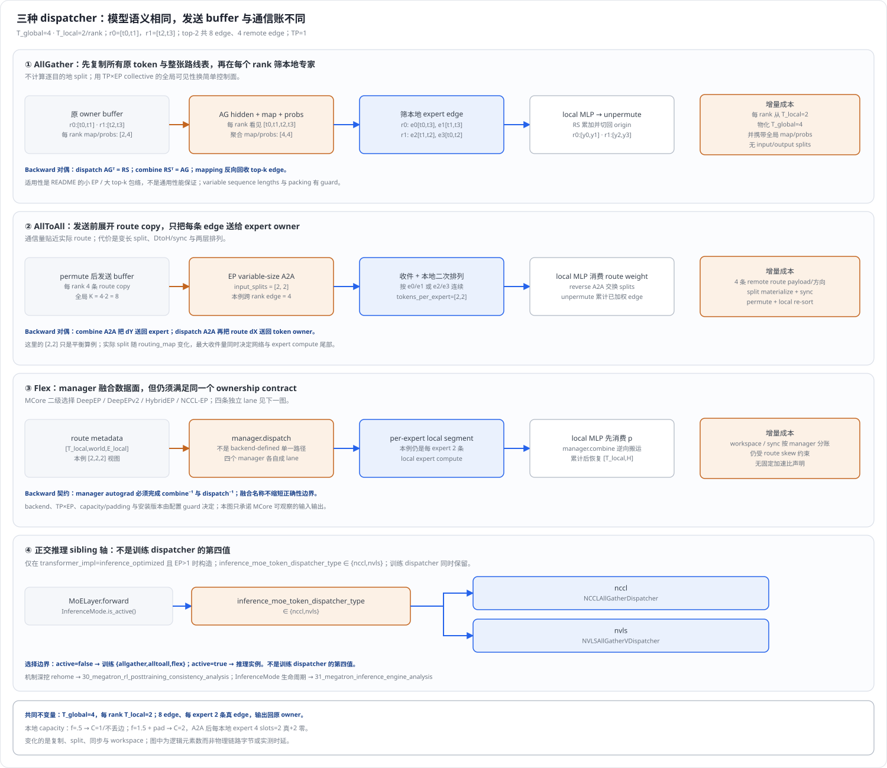
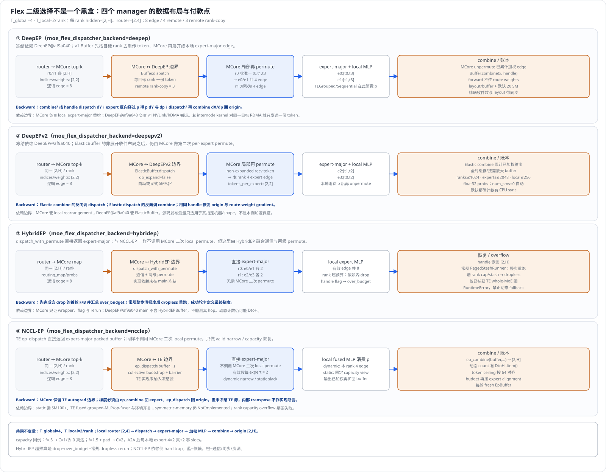
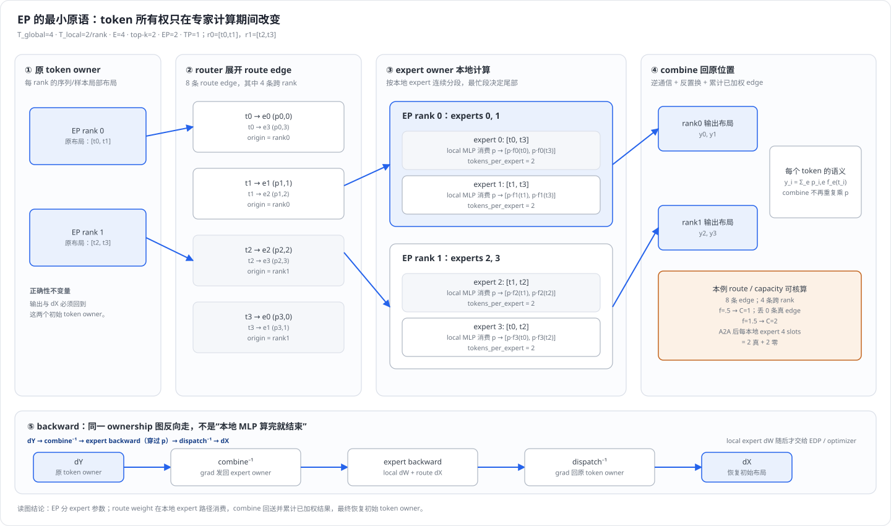
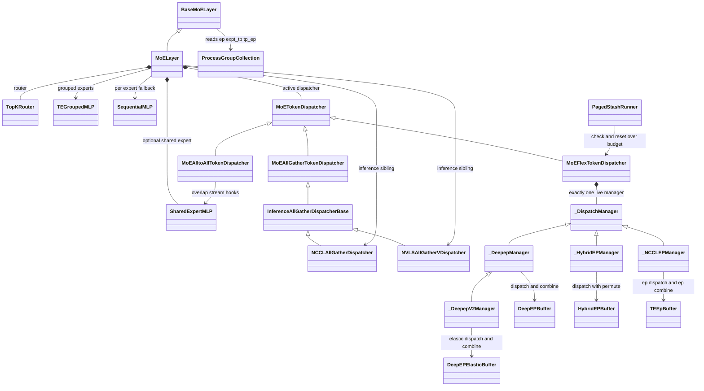

# Megatron-LM 专家并行(Expert Parallelism)深度解析

> **源码基线**：`NVIDIA/Megatron-LM@85902ef599ea4eb06ada7567a479c524b605767a`（`dev`，2026-09-01）
> **源码基线**：`deepseek-ai/DeepEP@af9a0403188392824fc3057452822235873e0612`（`main`，2026-06-15）——只覆盖 DeepEP v1 `Buffer` 与 v2 `ElasticBuffer`；HybridEP 分支与 Transformer Engine 不在已冻结的依赖检出中，见 §3.6 的依赖边界表
> **核心源码**：`megatron/core/transformer/moe/{moe_layer.py,token_dispatcher.py,router.py,experts.py,moe_utils.py,fused_a2a.py,shared_experts.py,paged_stash.py,token_dispatcher_inference.py}`；`megatron/core/transformer/{transformer_config.py,cuda_graph_config.py}`；`megatron/core/tensor_parallel/mappings.py`
> **中心结论**：EP 不把一个 token 永久切给一张卡，而是把路由器的“token→专家”关系短暂改写为“token 副本→持有该专家的 rank”。路由权重由本地专家路径消费，combine 只回送并累计已经加权的专家输出。`MoELayer` 将这一闭环固定为 route/preprocess/dispatch/local-expert/combine/postprocess；分发器只替换中间搬运与布局恢复，不替换模型语义。
> **适用范围**：训练态 MCore MoE 的专家分布、六条训练 token 分发器数据面（三种一级取值，其中 flex 再分四个二级后端）与其前后向边界，以及只为满足本页目标而必需的配套机制（共享专家、两条 overlap、整个 MoE 层的 CUDA Graph 的静态形状出口）。模型装配归 [[10_megatron_model_structure_analysis]]，进程组构造归 [[17_megatron_parallelism_orchestration_analysis]]，PP 的 combined-1F1B 调度归 [[15_megatron_pp_schedulers_analysis]]，跨轴资源竞争与工程选型归 [[20_megatron_comm_overlap_analysis]]、[[39_megatron_moe_training_optimization_analysis]]。
> **最近更新**：2026-09-05。按 AllGather、AllToAll、DeepEP、HybridEP 的优化动机重写机制主线，分别补足输入、专家计算、结果回送与反向；单列 DeepEPv2 和 NCCL-EP 分支，修正专家归属与 CPU 同步表述。

---

## 1. 特性概览

### 1.1 问题背景

MoE 用很多专家扩大参数量，但每个 token 只计算 top-$k$ 个专家，因此参数量与每 token 的 FLOPs 解耦；代价是当专家总数 $E$ 大到单卡放不下时，DP 会在每个副本保存全部专家、TP 只能把每个专家自己的矩阵切细（GEMM 越切越小、算术强度下降）、PP 只能按层切而一层里就有 $E$ 个专家——三条都没有沿“专家编号”这一维切开的能力。EP 正是这条缺失的轴：把 $E$ 个专家按编号分给 $e$ 个 rank，每 rank 只保存 $E/e$ 个专家。专家所在 rank 在建模时固定；路由器在**每次前向动态决定每个 token 选择哪些专家**。输入 token 所在 rank 由数据切分决定，通常与选中专家所在 rank 不同，于是每一层都必须把 token 送到专家所有者、再把结果送回 token 的原所有者——EP 的全部工程问题都来自这次往返。

### 1.2 解决方法

Megatron 把这次往返压进一个可替换的组件 `MoETokenDispatcher`，并把 MoE 层本身固定成六个阶段：`route → preprocess → dispatch → local-expert compute → combine → postprocess`（`MoELayer.forward` 的 `custom_forward`）。路由器产出的 `probs`/`routing_map` 是**本次前向的路线表**而不是 token 的永久属性；分发器负责把这张表变成通信元数据、把 token 搬到专家所有者、并缓存足以反置换的信息。因此换搬运后端不改变模型语义：`allgather` 用全域复制换掉逐目的地的变长 split，`alltoall` 用变长 split 换更少的 token 副本，`flex` 把同一接口交给四个可选的融合通信后端。路由权重不在 combine 里补乘，而是随 edge 一起送到本地专家，由 `TEGroupedMLP`/`SequentialMLP` 在自己的激活/FC2 路径上消费——这一条决定了整条反向链的形状。

### 1.3 收益、开销和约束

| 维度 | 直接收益 | 必付成本或边界 |
|---|---|---|
| 参数与优化器状态 | 路由专家按编号分摊，每 rank 只持有 $E/e$ 个专家的权重、梯度与优化器状态 | 只覆盖**路由专家**；attention、共享专家、embedding 不在这条轴上，不能把结论推广成“全部参数除以 $e$” |
| token 激活 | 专家计算在到达本 rank 的连续段上进行，不需要物化全局专家输出 | EP 本身不做激活 sharding：dispatch buffer、置换元数据、（allgather 时）全局 token 副本都是新增激活 |
| 通信 | `alltoall`/`flex` 只把 token 送向真正的专家所有者，避免全域复制 | dispatch 与 combine 都在层的关键路径上，一层两次；变长 split 还带 CPU 可见的元数据与同步点 |
| 计算 | 本地专家 可按 `tokens_per_expert` 分段批量执行（grouped GEMM） | 负载最重的专家决定该层完成时间；空段/小段降低 grouped work 效率，路由器的均衡策略只能缓解不能保证 |
| 形状与同步 | 容量策略可把动态形状钉成静态，换来 CUDA graph 可捕获 | 固定形状用额外 compute/memory 买：pad 出来的 slot 也要参与 GEMM 与搬运；不设容量则必然有一次 DtoH |
| 后端可替换性 | `MoELayer` 与专家 MLP 对四个 Flex 后端完全不变 | 每个后端各有安装、版本、形状、容量与 CUDA Graph 限制；HybridEP 与 NCCL-EP 的依赖实现不在已冻结的检出中（§3.6） |

### 1.4 符号约定

| 符号 | 含义 |
|---|---|
| $E$、$e$ | 专家总数 `num_moe_experts`、EP 度 `expert_model_parallel_size`；每 rank 持有 $E/e$ 个本地专家 |
| $k$ | `moe_router_topk`，每个 token 选中的专家数 |
| $T_{\mathrm{local}}$、$T_{\mathrm{global}}$ | 本 rank 实际送进路由器的扁平 token 数、EP 域内的逻辑全局 token 数 |
| $H$ | hidden size（启用 `moe_latent_size` 时分发器看到的是 latent 维） |
| $t_i$、$y_i$ | 第 $i$ 个 hidden token、它的 MoE 层输出 |
| $p_{i,e}$、$f_e(\cdot)$ | token $i$ 到专家 $e$ 的路由权重、专家 $e$ 的 MLP |
| $K$、$K_{\mathrm{remote}}$ | 全局路由边总数、其中跨 rank 的条数 |
| $C$、$f_{\mathrm{cap}}$ | 每专家 容量、`moe_expert_capacity_factor` |
| EP / ETP / EDP | 专家并行 / 专家内部的张量并行 / 同一专家的数据并行副本 |
| AG / RS / A2A | all-gather、reduce-scatter、all-to-all |

---

## 2. EP 详细方案

先从最容易实现的办法开始：让每个 rank 都拿到全部 token，再只计算自己的专家。它的限制会引出 AllToAll 的定向交换；定向交换仍可能重复发送同一个 token，又引出 DeepEP 的按目标 rank 去重；收件后的本地重排与动态形状等待，则引出 HybridEP 的融合接口与容量机制。这个顺序解释优化动机，各方案的适用性仍取决于路由、拓扑和依赖版本。

源码中的训练方案由两处选择确定：`MoELayer.__init__` 按 `moe_token_dispatcher_type ∈ {allgather, alltoall, flex}` 选择分发器，`MoEFlexTokenDispatcher.__init__` 再按 `moe_flex_dispatcher_backend ∈ {deepep, deepepv2, hybridep, ncclep}` 选择后端。因此除上述主线，还要分别说明 DeepEPv2 的资源管理改进和 NCCL-EP 的 TE 集成路径。`flex` 是这些后端接入 MoE 层的接口，不是独立的通信算法。推理另有 `nccl`/`nvls` 选择，接线与内容归属见 §3.5。

### 2.1 共用算例：四个 token 怎样得到 MoE 输出

令 EP 域的逻辑全局 token 数为 $T_{\mathrm{global}}=4$，每个 rank 实际输入路由器的本地 token 数为 $T_{\mathrm{local}}=2$；总专家数 $E=4$、top-$k=2$、EP 度 $e=2$，并固定 TP=1 以免把 ETP 混进来。具名 hidden token $t_i\in\mathbb{R}^{H}$；EP rank 0 的实际缓冲区为 $[t_0,t_1]\in\mathbb{R}^{2\times H}$、拥有 experts ${0,1}$，rank 1 的实际缓冲区为 $[t_2,t_3]\in\mathbb{R}^{2\times H}$、拥有 experts ${2,3}$。两 rank 的逻辑并集是 $[4,H]$，但在通信前并不存在一张物化的“全局路由器表”：每 rank 的实际 `probs/routing_map` 是 $[T_{\mathrm{local}},E]=[2,4]$，概念并集才是 $[T_{\mathrm{global}},E]=[4,4]$。后文所有 dispatcher/backend 始终复演这同一组路线。

<!-- megatron-ep-figure-contract: {"tokensGlobal":4,"tokensLocalPerRank":2,"experts":4,"topk":2,"ep":2,"tp":1,"edges":8,"remoteEdges":4,"remoteUniqueRankCopies":3,"capacityAtHalf":1,"droppedEdgesAtHalf":0,"capacityAtOnePointFive":2,"slotsPerOwnedExpertAfterA2A":4,"realSlotsPerOwnedExpert":2,"zeroSlotsPerOwnedExpert":2,"backends":["DeepEP","DeepEPv2","HybridEP","NCCL-EP"],"inferenceSibling":{"field":"inference_moe_token_dispatcher_type","values":["nccl","nvls"],"classes":["NCCLAllGatherDispatcher","NVLSAllGatherVDispatcher"],"selector":"InferenceMode.is_active","owners":["30_megatron_rl_posttraining_consistency_analysis","31_megatron_inference_engine_analysis"]}} -->

| 原 token | 初始归属 | 选中专家 | 非零路由权重 | 计算期间的所有者 |
|---|---|---|---|---|
| $t_0$ | rank 0 | 0、3 | $p_{0,0}$、$p_{0,3}$ | rank 0 的专家 0；rank 1 的专家 3 |
| $t_1$ | rank 0 | 1、2 | $p_{1,1}$、$p_{1,2}$ | rank 0 的专家 1；rank 1 的专家 2 |
| $t_2$ | rank 1 | 2、3 | $p_{2,2}$、$p_{2,3}$ | rank 1 的两个本地专家 |
| $t_3$ | rank 1 | 0、1 | $p_{3,0}$、$p_{3,1}$ | rank 0 的两个本地专家 |

每个 rank 的路由器为自己的两个 token 生成路由表；专家的所在位置保持不变。后面的每种方案都要把 token 交给表中选定的专家，计算后再按原 token 顺序返回。记一条“token 选择某专家”的关系为一条路由边，则全组共有 $K=T_{\mathrm{global}}\cdot k=4\cdot2=8$ 条，其中 $K_{\mathrm{remote}}=4$ 条跨 rank。

四个专家最终应分别计算 $e_0:[t_0,t_3]$、$e_1:[t_1,t_3]$、$e_2:[t_1,t_2]$、$e_3:[t_0,t_2]$。本地专家计算消费路由权重，回送阶段累计已经加权的结果，恢复 rank 0 的 $[y_0,y_1]$ 与 rank 1 的 $[y_2,y_3]$：

$$
y_i=\sum_{e\in\operatorname{TopK}(t_i)}p_{i,e}f_e(t_i).
$$

这组输入、路由和输出是各方案的共同正确性标准。下面先走完 AllGather，看看不用定向发送也能怎样完成它。

### 2.2 AllGather：先收齐全部 token，再选本地专家

`TransformerConfig.moe_token_dispatcher_type` 默认为 `allgather`。MoE README 将它列为 TP-only、小 EP 或大 top-k 时的候选；这些是选型建议，实际收益仍取决于模型和拓扑。

最朴素的做法是不预先计算每个目的 rank 要接收多少 token。每个 rank 先收齐全组输入及路由表，再筛选本地专家需要的行；这样，即使各专家负载不同，也能用同一套全量收集与归约操作完成训练。

代回本例：两个 rank 的实际输入与 路由表分别是 $[T_{\mathrm{local}},H]=[2,H]$、$[T_{\mathrm{local}},E]=[2,4]$；AG 后每个 rank 才物化 $[t_0,t_1,t_2,t_3]$ 以及聚合后的 $[T_{\mathrm{global}},E]=[4,4]$ map/probs。rank 0 只筛出 $e_0:[t_0,t_3]$、$e_1:[t_1,t_3]$ 四条本地专家路由边；rank 1 同理筛出 $e_2:[t_1,t_2]$、$e_3:[t_0,t_2]$。MLP 先消费每条路由边 的权重，本地 unpermute 与 RS 再累计并切回两个原始 rank：rank 0 得 $[y_0,y_1]$，rank 1 得 $[y_2,y_3]$。**传输的是原 token 而不是路由副本**：通信前两个 rank 各持有 2 行，收集后各物化 4 行（包含原有的 2 行），全组物化 $eT_{\mathrm{global}}=8$ 行，另加同样被 AG 的 $[4,4]$ map 与 probs。**反向**正好把这两步转置：combine RS 的反向是 AG，dispatch AG 的反向是 RS；本地 `permute`/`unpermute` 与专家内权重乘法按保存的 mapping/probs 回收多条 top-$k$ 边。

`MoEAllGatherTokenDispatcher.dispatch_preprocess` 展平 隐藏状态 并保存 `routing_map`。`token_dispatch` 在 TP×EP 组上对 map、probs 和 token 做 沿第一维收集；所有参与 rank 随后都看见全局 token 副本。`dispatch_postprocess` 截取本地专家列，`permute` 出本地专家的 token 段（先以 `.long().cpu()` 将专家计数传到 CPU，再用 `tokens_per_expert.sum().item()` 确定输出行数），并把本地列的 probs 转置后按 map `masked_select` 成每条路由边 一个标量；本地计算后，`combine_preprocess` 先按缓存 mapping unpermute，`token_combine` 用 TP×EP reduce-scatter 将各 rank 的贡献聚回 token 原位置，最后 reshape。

与定向交换相比，这条路径不需要 `input_splits`/`output_splits` 的 CPU 元数据与相应同步，**增量成本**是把 token、完整 `probs` 和 map 复制到整个 TP×EP 域。`TransformerConfig.__post_init__` 明确拒绝 allgather 与 `variable_seq_lengths` 的组合；sequence packing 也只允许 alltoall 或 flex。因而它适合 README 列出的规模与拓扑范围，而不是所有 EP。

**下一步要解决什么？** 专家只需要被选中的 token，AllGather 却让每个 rank 收齐全部输入。路由越稀疏、EP 域越大，无关副本越多。于是可以把筛选提前到发送端：只向持有目标专家的 rank 发送，这就是 AllToAll。当前两 rank、top-k=2 的小例中，两种办法跨 rank 的 hidden 行数恰好都为 4；它用来展示布局变化，不能据此宣称通信量已经下降。

### 2.3 AllToAll：在发送端按专家分组，只发给需要的 rank

AllGather 的浪费来自先复制、后筛选。AllToAll 将顺序反过来：先按选中的专家展开 token 并按目的 rank 排好，再交换各自需要的分段。它减少了无关副本，但每次路由都要重新确定收发数量；接收最多的 rank 仍决定缓冲区峰值和专家计算完成时间。

`MoEAlltoAllTokenDispatcher.preprocess` 从 `routing_map.sum(dim=0)` 计算各专家的 token 数。它把计数 reshape 成 EP rank 的 `input_splits`，在 `tp_ep_group` gather 计数，导出当前 rank 的 `output_splits`、`output_splits_tp` 和 `num_global_tokens_per_local_expert`。这些是本次路线的控制面；非 drop-and-pad 的 capacity/drop 或量化 padding 会让输出大小动态，代码须在分配 buffer 前安排 CUDA DtoH/sync，EP A2A 前也必须让 split 值可用。源码把这件事显式建模成一条**同步点阶梯** `before_permutation_1 < before_ep_alltoall < before_permutation_2 < before_finish < no_sync`，`preprocess` 按当前配置取其中最早的一档，并断言 DtoH 点不晚于 sync 点。

本例每个原始 rank有四条路由副本，恰好两条给 rank 0、两条给 rank 1，所以两端 `input_splits=[2,2]`，接收后也各有四条 edge。这个平衡只属于本例；一般情况下 splits 由当前 `routing_map` 决定。四条跨 rank edge 真正越过 EP 边界，另四条在 collective 的本地 chunk 中完成所有权映射。数据面随后是：

1. `dispatch_preprocess` 以 `permute` 把本 rank 的 $[T_{\mathrm{local}},H]=[2,H]$ 展开为四条路由副本，按目标专家排列并保存反置换 mapping 与原形状；两 rank 合计八条。
2. `token_dispatch` 用 `all_to_all(ep_group, ..., output_splits, input_splits)` 分别搬 token 与概率；token 到达即是本地专家 rank 的接收缓冲区。**传输的是路由副本**：本例每 rank 发 4 行、收 4 行，其中 2 行真正跨 rank。
3. `dispatch_postprocess` 在 `tp_size>1` 时先在 TP 组 AG；多个本地专家时用 `sort_chunks_by_idxs` 做第二次按专家分段的排列。它的反向工作在 `combine_preprocess`：解除第二排列，必要时 RS 回 TP 布局。
4. 本地 MLP 先用随 edge 到达的概率加权；`token_combine` 用反向 split 再做一次 EP A2A，`combine_postprocess` 以保存的 mapping `unpermute` 累计已加权 edge，并 view 回原形状。

**反向**由 `tensor_parallel/mappings.py::_AllToAll.backward` 承担：它把保存的 `input_split_sizes` 与 `output_split_sizes` **对调**后再调一次 `_AllToAll`，因此不需要第二套元数据；TP 辅助映射同样成对（前向 RS ↔ 反向 AG）。**增量成本**相对 AllGather 是变长元数据、两次本地重排，以及至少一个“split 已 materialize”的同步边界；它没有保证均衡，`output_splits` 很大的一方仍成为网络与专家计算的尾部。

本例发送端 rank 1 会把 $t_3$ 展开两次，分别交给 rank 0 的专家 0 和 1。两份 hidden 的目的 rank 相同，内容也相同：能否跨 rank 只发送一份，到达后再分给两个专家？这正是下一节 DeepEP 的改进。



### 2.4 DeepEP：同一个 token 向同一 rank 只发送一份

AllToAll 按路由边发送；DeepEP 先按目的 rank 合并重复 token，再在接收端展开专家输入。本例的关键是 $t_3$：一次远端发送保留它到两个专家的索引与权重，到 rank 0 后仍要执行两次专家计算。减少的是重复搬运，不是模型计算。该路径通过 `flex + deepep` 接入，资源成本包括 NVLink/RDMA 缓冲区和通信 SM 预算。

`_DeepepManager.setup_metadata` 将路由器输出中每个 token 选中的两条路由边转换为 top-k 索引和权重；`dispatch` 跨过 **MCore ↔ DeepEP@af9a040 依赖边界**，调用 v1 `Buffer.get_dispatch_layout` / `Buffer.dispatch`。冻结 DeepEP 的 `is_token_in_rank`（接口说明明写为 `[num_tokens, num_ranks]` 的“该 token 是否要发给该 rank”）让一个 token 对同一目标 rank 只发送一份，收件仍带本地专家 indices/weights。于是本例 rank 0 的未按专家展开的收件是 $[t_0,t_1,t_3]$，rank 1 是 $[t_0,t_1,t_2]$；$t_3$ 虽同时去 rank 0 的 专家 0/1，跨 rank 只是一份 token。本例原有四条跨 rank 路由边，按目的 rank 去重后只需发送三份 hidden；八次专家计算仍全部保留。

回到 MCore，`get_permuted_hidden_states_by_experts` 把收件 indices 还原成 local multihot map，再 `permute` 为 rank 0 的 `e0:[t0,t3] | e1:[t1,t3]`、rank 1 的 `e2:[t1,t2] | e3:[t0,t2]`，即每 rank 四条 expert-major edge，并把 `permuted_probs` 交给 `MoELayer.routed_experts_compute → TEGroupedMLP.forward/SequentialMLP.forward`。权重就在该本地专家路径消费；MLP 输出已经是 $p_{i,e}f_e(t_i)$，MCore local `unpermute` 先累计同 rank 的已加权 edge。随后 v1 前向的 `FusedCombine.forward` 调 `Buffer.combine(x, handle=handle, ...)`，**不传 `topk_weights`**，只按 handle 回送/跨 rank 累计到原位置 $[2,H]$。

DeepEP v1 **反向** 也必须按这个位置读：`FusedCombine.backward` 先用同一 handle 调 `Buffer.dispatch`，把原位置的 $g_i$ 送回对应专家 copy；本地专家 autograd 穿过权重乘法，产生 $p_{i,e}g_i$、路由权重梯度与专家参数梯度；最后 `FusedDispatch.backward` 才调用 `Buffer.combine` 回收 `grad_x`，并通过其可选 `topk_weights` 槽运输/累计 `grad_token_probs`。这次传的是**权重梯度数据**，不是在前向 combine 重新应用路由权重。

**增量成本**是 layout/handle、NVLink/RDMA buffer、float32 路由权重（probs 不是 fp32 时封装层直接 `.float()` 并 warning），以及精确收件数用于 MCore `num_out_tokens` 的使 CPU 取得计数的同步；v1 默认占 20 个 SM，且冻结 `Buffer.get_dispatch_config/get_combine_config` 是一张写死的 `config_map`，只为 `{2,4,8,16,24,32,48,64,96,128,144,160}` 这些 group size 给配置、**最大 160**，其余直接 `assert num_ranks in config_map`。跨节点 kernel 的 source 元数据还能在同一目标 RDMA 域内先发一份、再 NVLink fan-out。**源码事实**止于这些协议；是否比 AllToAll 快必须在目标 topology/shape 实测。适合已经部署该 v1/NVSHMEM 路径、group size 落入支持集合，且能接受动态 layout/CUDA-graph 限制的训练。

到这里，重复的远端 hidden 已减少，但收件还不能直接交给专家：MCore 仍要读取计数、展开并重排，再在返回前执行逆重排。如果这些本地操作与 CPU 等待成为瓶颈，下一步便是让通信后端直接产出按专家排列的缓冲区。

### 2.5 HybridEP：把通信和专家输入重排交给同一后端

DeepEP 路径把跨 rank 搬运与接收端重排分开；HybridEP 提供通信与重排一体的接口，让 MCore 直接取得按专家连续分段的输入（expert-major）。若还要避免等待精确收件数，就必须预先给整个 rank 的缓冲区设置容量上界。融合解决重复重排，容量解决动态形状等待，两者的条件和代价需要分别看。

`_HybridEPManager.setup_metadata` 保留路由器输出的 routing map/probs；`hybrid_ep_dispatch` 调 `HybridEPBuffer.dispatch_with_permute`，将通信与两级 permute 融合，故依赖直接返回本例每 rank 四条 expert-major edge；`_HybridEPManager.get_permuted_hidden_states_by_experts` 只原样交出 hidden/probs，**不调用 MCore 二次本地重排**。这点与 NCCL-EP 相同，区别是本路径把通信和两级 permute 融进 HybridEP dependency。本地专家 MLP 同样先消费随 slot 返回的 weights；已加权输出再由 `combine_with_unpermute` 直接恢复 $[t_0,t_1]$ / $[t_2,t_3]$ 的原位置顺序。**反向** 由 MCore 自己的两个 autograd Function 给出且互为对偶：`HybridEPCombine.backward` 调 `dispatch_with_permute` 复用同一 handle 把 $g_i$ 送回专家 slot，`HybridEPDispatch.backward` 调 `combine_with_unpermute` 把 hidden 梯度送回原位置，并**同时返回 `combined_probs` 作为路由权重梯度**——与 DeepEP 用 `topk_weights` 槽运输权重梯度是同一分工的另一种写法。

动态形状下，精确 `tokens_per_expert.sum()` 会形成 DtoH 点；设置 `moe_expert_rank_capacity_factor` 后，MCore 以本 rank 的 padded 本地 token 数×top-k×factor 给出对齐后的 `num_permuted_tokens` 上界，并据此把 `non_blocking=True` 传给依赖。超过该 rank 接收容量的 token 在 HybridEP 依赖内被丢弃，handle 的 overflow flag 被 `_HybridEPManager.dispatch` 累计进 `over_budget`；这不是当场直接报错。训练入口在设置 rank capacity 时以 `PagedStashRunner` 包装整步：一次 forward/backward 后跨 rank 汇总 `over_budget`（与 paged-stash overflow、host spill 一起 stack 成三项做**一次** `all_reduce`），常规情况下清梯度、清 rank capacity、禁用 paged stash，并用同一批 microbatches **不丢弃路由边的整步重算**——整个循环最多两次尝试（`assert num_tries < 2`），第二次已切到动态 dropless 路径。只有训练中的 Transformer Engine **整个 MoE 层的 CUDA Graph 已经完成捕获** 时，静态 buffer overflow 不允许动态回退，`PagedStashRunner._raise_if_te_whole_moe_graph_overflow` 才抛 `RuntimeError`。`moe_hybridep_pad_variable_tokens` 还会 all-reduce 组内最大本地 token 数并按 64（`HYBRIDEP_TOKEN_ALIGNMENT`）pad，combine 后再截回原长度。

这里需要区分 **MCore ↔ HybridEP 依赖边界**：冻结 DeepEP@af9a040 的 `main` 只导出 `Buffer/ElasticBuffer`，不含 MCore 所 import 的 `HybridEPBuffer`；因此本页只证实 MCore 封装层的 I/O、overflow flag、64 对齐、rerun 协议和反向对偶，不声称依赖内部 hop。这条边界在源码里还还有版本兼容处理：`HybridEPDispatch.forward` 在请求 fused permute 或自定义 block 数时先 `inspect.signature(HybridEPBuffer.dispatch_with_permute)` 探测有没有 `fuse_permute_dispatch` 形参，没有就 warning 并静默降级——MCore 自己也不假设装的是哪个版本。另一处需要更正旧说法：FP8 dispatch 不是被“拒绝”，而是 `init_hybrid_ep_buffer` 的调用点把 `fp8_dispatch` **硬编码为 `False`** 并注释“Currently, we do not support fp8 dispatch”，配置期不会报错。**增量成本**是全进程共享的 `_hybrid_ep_buffer` 单例（首次 dispatch 按当时形状建立，测试需 `reset_hybrid_ep_buffer()` 重置）、64 对齐预留空位，以及溢出时的整步重算。适合安装了匹配 HybridEP 分支、希望 fused rearrangement 且能给出容量/shape 预算，并能接受溢出整步重算的环境。

这条路径增加了匹配依赖版本、容量预算和溢出处理的要求。因此，它与 DeepEP 的选择取决于实际瓶颈；若主要困难是 v1 的缓冲区或通信域限制，也可以保留收件后重排的结构，改用下面的 DeepEPv2。

### 2.6 DeepEPv2：保留去重收件，改用可扩容的缓冲区

这是从 DeepEP v1 延伸出的另一条分支。它继续采用去重收件、再由 MCore 重排的流程，改进的是缓冲区扩容和 SM/QP 配置方式，并改变通信域的限制。代价仍受 `WorkspaceLayout` 编译期上限与缓冲区显存约束。

`_DeepepV2Manager` 不调用 v1 构造器（源码注释写明 v2-only 镜像可能不带 v1 `Buffer` API）；它从同一路由器输出取得 top-k indices/weights，通过 `get_elastic_buffer` 按**当前 token 数、$H$、top-k** 取得可缓存、必要时放大的 V2 buffer，再调 `ElasticBuffer.dispatch`。冻结 DeepEP 的默认 `do_expand=False` 仍返回未按专家展开的 token + 本地专家 indices/weights，因此本例的 rank 收件身份与 DeepEP 路径相同（各收 3 token），随后也由 MCore 展开为四条 expert-major edge、在本地专家 MLP 内消费 weights、unpermute，再以未重复加权的 `ElasticBuffer.combine` 回到原位置。V2 封装层的 **反向** 明示：dispatch 反向调 combine，combine 反向调 dispatch，并复用前向 handle——与 v1 同形，只是换了 buffer 对象。

区别在资源面：`num_sms=0` 让 ElasticBuffer 按 expert/top-k 自动推导 SM/QP（`get_theoretical_num_sms` / `get_theoretical_num_qps`，其内部推导属依赖侧）；MCore 的全局 buffer cache 会随当前 token 上界、$H$、top-k 扩容。未传 cached handle 时，冻结 V2 `dispatch` 的 `do_cpu_sync` 解析为 `value_or(do_cpu_sync, True)`，即默认 `do_cpu_sync=True`，MCore 又消费 CPU 侧 `num_recv_tokens_per_expert_list`，所以“elastic”不等于没有控制面同步。冻结 `WorkspaceLayout` 还硬断言 ranks≤1024、experts≤2048、experts/rank≤256（`kNumMaxRanks/kNumMaxExperts/kNumMaxExpertsPerRank`），并要求 `num_experts % num_ranks == 0`；README 的“up to EP2048”不能覆盖这些代码上限。README 给出的 Hopper/SM90、CUDA≥12.3、PyTorch≥2.10、NCCL≥2.30.4 是依赖环境要求；“更少 SM/更高吞吐”只是在指定机器与形状的发布测量，不是 MCore 或本例保证。**增量成本**相对 v1 是每次 dispatch 一次 buffer 查询/可能的扩容，换来自动 SM-QP 与更大通信域。

### 2.7 NCCL-EP：在 Transformer Engine 中直接接入专家分段缓冲区

NCCL-EP 是面向 Transformer Engine 的另一种集成选择。它也直接返回专家分段缓冲区，但容量、算子和反向都受 TE 接口约束；只有满足静态形状的完整条件，才能避开动态收件计数的等待。`recv_capacity_per_rank` 是接收上界，超出时会失败。

`_NCCLEPManager.setup_metadata` 将路由器的 probs 转成 top-k indices/weights，再跨过 **MCore ↔ Transformer Engine 依赖边界**。MCore 先构造 `transformer_engine.pytorch.ep.EpBuffer`，再调用模块函数 `transformer_engine.pytorch.ep.ep_dispatch(buffer, tokens, topk_idx, topk_weights)`；`EpBuffer` 不是拥有 `ep_dispatch` 的对象。collective bootstrap/barrier 后，TE 依赖直接给出 `[recv_capacity,H]` 的 expert-major buffer、ragged `tokens_per_expert` 与每个槽位的权重；`_NCCLEPManager.get_permuted_hidden_states_by_experts` 只做 static no-op 或按有效计数 narrow，**不调用 MCore 二次本地重排**。dynamic 模式得到本 rank 四条有效 edge（全组八条），每专家两条；本地 MLP 消费每个槽位的权重，输出已加权后由 `get_restored_hidden_states_by_experts` 再零填充回 capacity 行。combine 调用另一个模块函数 `transformer_engine.pytorch.ep.ep_combine(buffer, expert_out, num_local_tokens=...)`，不接收路由权重，最终恢复每个原始 rank的 $[2,H]$；static 模式则始终保留固定 capacity view。

**反向是这条路径与另外三条最大的证据差异**：DeepEP/DeepEPv2/HybridEP 的反向都由 MCore 自己的 `torch.autograd.Function` 写出，可以逐个调用环节读；NCCL-EP 的 `nccl_ep_dispatch`/`nccl_ep_combine` 是普通函数，直接调 TE 的模块函数，MCore 里**没有对应的 autograd Function**。因此本页只能断言 TE 接口说明称其 “autograd-aware”，以及闭环要求“combine 梯度必须回到专家、dispatch 梯度必须回到原位置”，不能杜撰内部 transpose。

`.item()` 在 dynamic 模式是显式 DtoH，同一 config 在请求 combined-1F1B 的 `overlap_moe_expert_parallel_comm` 时会警告它序列化该路径；static 避开动态形状 wait，却要求 SM100+、TE fused grouped-MLP/op-fuser、`NVTE_CUTEDSL_FUSED_GROUPED_MLP=1`（三条都是 `_NCCLEPManager.__init__` 的 `ValueError`）。bootstrap 先把本地 token ceiling 向 64 的 HT chunk 对齐，再以 top-k×rank factor 计算接收容量，并进一步按专家 alignment 对齐；这些预留空位都会进入固定 buffer。**增量成本**：NCCL-EP 总是要求 `moe_expert_rank_capacity_factor`（否则构造期 `ValueError`），溢出会直接报错；每次 dispatch 还新建一个 TE `EpBuffer`，`moe_ncclep_use_symm_mem=True` 当前直接 `NotImplementedError`。适合已经锁定匹配 TE/NCCL 栈并能预算 rank capacity 的路径；要以 static 消除同步还必须满足 Blackwell/fused-op 组合。



### 2.8 六种方案如何接回完整训练

前向的 `postprocess` 返回 MoE MLP 输出后，Transformer layer 将它接入 residual，模型再走自己的 logits/loss 路径；这些装配与 objective 由 [[10_megatron_model_structure_analysis]]、[[24_megatron_linear_cross_entropy_analysis]] 负责。对本页而言，loss 的标量梯度首次回到 `MoELayer` output，才是 EP 反向的入口。

三类反向的共同形状是“combine grad 回专家 → 专家反向穿过 $p_{i,e}$ → dispatch grad 回 token 原始 rank”，但对偶算子各不相同：AllGather 是 RS↔AG 互换；AllToAll 由 `_AllToAll.backward` 对调 split 再走一次同一算子；四个 Flex 后端里有三个由 MCore 的 autograd Function 显式写出 dispatch↔combine 互调，NCCL-EP 则整段在 TE 内（§3.6）。特别是 DeepEP v1，前向 `Buffer.combine` 没有权重实参；权重梯度来自本地专家路径，随后才由 dispatch 反向的 handle 路线回收。

完成信号分三层，不能互相顶替：

1. **层前向完成**：`combine_postprocess` 之后 output 已回到原 `hidden_shape`，可交给 transformer/loss 路径。任何一个分发器 helper 的返回都不是层完成——`token_dispatch` 只表示 token buffer 可被本 rank 专家消费，`routed_experts_compute` 只表示本地专家输出已恢复为 combine 可消费的顺序。开启 `moe_layer_recompute` 时 `custom_forward` 会被重放，完成边界不变。
2. **层反向完成**：每个本地专家的参数 `.grad` 与输入 hidden 梯度已就绪。`tests/unit_tests/transformer/moe/test_token_dispatcher.py::MoEModelTestContainer.dispatcher_dropless_test` 对置换/反置换后的前向值和 input 梯度做 close 检查，`test_a2a_token_dispatcher.py::TestAlltoAllDispatcher.test_forward_backward` 覆盖多组 TP/EP 形状。
3. **训练 step 完成**：EDP 的梯度同步、optimizer state 和参数更新随后才发生；这是下游所有者，不能从本地专家反向推断它已执行。

`TopKRouter.forward` 先做 gating，再由 `TopKRouter.routing` 产生 `probs` 与布尔 `routing_map`。二者都以本 rank 的扁平 token 为第一维、以全局专家为第二维，即实际形状 $[T_{\mathrm{local}},E]=[2,4]$；容量处理前，每行至多有 $k$ 条非零有效边，pad-to-capacity 后则可能多出概率为零的补齐形状的槽位。它不是把专家 id 塞进 token 的永久属性：它是本次前向的路线表，分发器必须缓存足以反置换的元数据。

所有分发器的 preprocess 都先把本 rank 的 `[...,H]` 视作 $[T_{\mathrm{local}},H]=[2,H]$ 并保存路线元数据，但第一次排列的位置不同：AllToAll 在发送前展开 edge，AllGather 在 gather 后筛本地列，DeepEP/DeepEPv2 在收件后由 MCore 展开，HybridEP/NCCL-EP 则让依赖直接返回 expert-major。无论在哪一步实现，每条有效边 $(t_i,e_j)$ 最终都进入专家所在 rank 的连续段与 `tokens_per_expert`；`MoELayer.routed_experts_compute` 将相应 `permuted_probs` 一并传给本地专家，故离开 `TEGroupedMLP`/`SequentialMLP` 的 edge 输出已经带权，combine 只逆转布局、跨 rank 回送并累计：

$$
y_i=\sum_{e\in\operatorname{TopK}(t_i)}p_{i,e}f_e(t_i).
$$



这张图里的数可以逐项结算。全局路由边总数为 $K=T_{\mathrm{global}}\cdot k=4\cdot2=8$，每个原始 rank 先产生 $T_{\mathrm{local}}k=4$ 条；四个专家各收到两条：$e_0:[t_0,t_3]$、$e_1:[t_1,t_3]$、$e_2:[t_1,t_2]$、$e_3:[t_0,t_2]$。其中 $t_0\to e_3$、$t_1\to e_2$、$t_3\to e_0$、$t_3\to e_1$ 共 $K_{\mathrm{remote}}=4$ 条跨 rank edge，其余四条留在初始归属。前向因此不是一句“做 A2A”，而是以下四步：

1. rank 0/1 的路线表各定义四条带权逻辑 edge，并缓存原位置与反置换信息；AllGather 或 rank-dedup 管理器不一定在发送前物化四份 hidden copy。
2. 每条 copy 到专家所在 rank 后按全局专家 id 变成连续段；四个本地 MLP 消费各 edge 的 `permuted_probs`，形成 $p_{i,e}f_e(t_i)$。
3. 已加权专家输出沿相反所有权方向返回；原位置只累计同一 token 的两条边，恢复 rank 0 的 $[y_0,y_1]$ 与 rank 1 的 $[y_2,y_3]$，combine 不再重复乘权重。
4. 反向从 $g_i=\partial L/\partial y_i$ 开始。combine 的逆映射先把同一个 $g_i$ 发给产生两条已加权 edge 的专家所在 rank；本地专家反向穿过权重乘法，得到 $\partial L/\partial f_e(t_i)=p_{i,e}g_i$ 与 $\partial L/\partial p_{i,e}=\langle g_i,f_e(t_i)\rangle$，再产生参数梯度和路由输入梯度；dispatch 的逆映射最终把同一 $t_i$ 的两份 input 梯度累加回初始归属。

因此“回到原 rank”不是优化提示，而是正确性要求：后续 residual、loss 和上一层反向仍消费原 token 布局。若容量策略丢弃某条边，或 padding 为其补零，这个等式对应的有效边集合随之改变；不能把固定形状误说成不丢 token。

**权重在哪里乘，是一个可被推翻的默认。** 默认路径把 `permuted_probs` 交给本地专家：`TEGroupedMLP.forward` 在 activation/FC2 路径上按 slot 乘，`SequentialMLP.forward` 按 `tokens_per_expert` 切成 `probs_list` 后作为各本地 MLP 的 `per_token_scale`。只有 `moe_apply_probs_on_input=True` 时两者才改为在专家输入侧乘一次、再把 `permuted_probs` 重置为全 1，且该分支硬性 `assert moe_router_topk == 1`（该字段的归属是 [[21_megatron_fusion_operators_analysis]]）。无论走哪条，combine 都收到已加权结果——这是本页全部反向结论的前提。

### 2.9 容量、丢弃与开销结算

容量路径必须区分层级，而且 `apply_router_token_dropping` 看到的是**每 rank 的本地路由器表**（`TopKRouter.routing` 在 `[T_{\mathrm{local}},E]` 上调用它）。其每专家容量由 `get_capacity` 给出：

$$
C=\left\lceil\frac{T_{\mathrm{local}}k}{E}f_{\mathrm{cap}}\right\rceil.
$$

`probs` policy 留本地每列最高权重，`position` policy 按本地 routing-map 位置取容量，超出的 map/prob 置零；当 $C$ 已经大于本地 token 数时源码直接跳过整段丢弃。本例每 rank 都有 $T_{\mathrm{local}}=2$，且四个专家各恰有一条来自该 rank 的真 edge：

- $f_{\mathrm{cap}}=0.5$：$C=\left\lceil(2\cdot2/4)\cdot0.5\right\rceil=1$。本地路由器表的每个全局专家列本来就只有一条真 edge，`topk(probs, k=1, dim=0)` 选中的正是它，因此两 rank 合计的 8 条真 edge **一条也不丢**；不能拿 $T_{\mathrm{global}}=4$ 代入后再假定“每专家丢一条”。
- $f_{\mathrm{cap}}=1.5$ 且 `moe_pad_expert_input_to_capacity=True`：$C=\left\lceil(2\cdot2/4)\cdot1.5\right\rceil=2$。每个发送 rank 为每个全局专家提供 2 个 slot（1 真 + 1 零）；AllToAll 汇聚两个原始 rank 后，**每个本地专家** 因而固定为 $C\cdot e=4$ 个 slots，即 **2 真 + 2 零**（`MoEAlltoAllTokenDispatcher.preprocess` 的 drop_and_pad 分支直接写作 `capacity * tp_size * ep_size`）。这会把全组 8 条真 edge 扩成 16 个计算/layout slots；固定形状是用额外 compute/memory 买来的。

HybridEP 的 drop_and_pad 分支给出同形的每本地专家 `capacity * group.size()`（permuted 总上界写作 `capacity * group.size() * num_local_experts`）；DeepEP/DeepEPv2 则在配置期拒绝 pad-to-capacity。要与之区分的是 HybridEP/NCCL-EP 的 **rank capacity**：它是整个管理器接收缓冲区的上限，不是 每专家 路由器 capacity——HybridEP 的超额路线先 drop 并记 `over_budget`、由 `PagedStashRunner` 常规不丢弃路由边的整步重算，NCCL-EP 的依赖 overflow 才是直接报错。

**六条训练数据面的统一开销账。** 下表只列源码能证明的项；性能排序不在其中。

| 方案 | 本例 dispatch→expert-major→combine | 传输的元素（本例） | 同步与必付资源（源码事实） | 硬约束/上限（源码事实） |
|---|---|---|---|---|
| allgather | 每 rank AG 成 $[4,H]$，筛为 4 local edge；MLP 后 RS 回 $[2,H]$ | 原 token：全组物化 $eT_{\mathrm{global}}=8$ 行 + $[4,4]$ map/probs | 专家计数 `.cpu()` 与 `num_out_tokens` 的 CPU 取值；无变长 split | 不支持 variable sequence length / sequence packing |
| alltoall | 8 edge 按 `input_splits=[2,2]` 交换；收件后第二排列；reverse A2A + unpermute | 路由副本：每 rank 发 4 收 4，其中 2 行跨 rank | split 的 DtoH/sync 阶梯（最早 `before_permutation_1`）、两次本地重排 | 容量策略改变 split/shape；偏斜直接放大接收缓冲区 |
| Flex/DeepEP | 每目标 rank 去重收 3 token，MCore 展开 4 edge；本地专家消费 $p$；unpermute + 无权重 v1 combine | 面向目标 rank 的 token 副本：跨归属共 3 份 hidden + indices/weights | v1 layout/handle、NVL/RDMA buffer、默认 20 SM、CPU 可见收件计数 | probs 强制 float32；`config_map` 只支持列出的 group size，**最大 160**；不支持 pad-to-capacity |
| Flex/DeepEPv2 | Elastic 未按专家展开的收件（同为 3 token）→ MCore 展开 4 edge → unpermute + elastic combine | 同上 | 每次 dispatch 一次 buffer 查询/扩容、默认 `do_cpu_sync=True`；SM/QP 自动或显式 | ranks≤1024、experts≤2048、experts/rank≤256 且 $E$ 整除 rank 数；不支持 pad-to-capacity |
| Flex/HybridEP | fused dispatch-with-permute 直接给 4 edge；本地专家加权；fused combine-with-unpermute | expert-major slot：4 个/rank（+64 对齐预留空位） | 无 rank capacity 时 `tokens_per_expert.sum()` 的 DtoH；全进程共享一个 `_hybrid_ep_buffer` | 超 rank 接收容量在依赖内 drop 并置 `over_budget`；captured TE whole-MoE graph 下 `RuntimeError`；FP8 dispatch 被硬编码关闭 |
| Flex/NCCL-EP | TE `ep_dispatch` 直接给 capacity/expert-major；本地专家加权；`ep_combine` 回原位置 | capacity slot：`recv_capacity_per_rank` 行，其中 4 行有效 | dynamic 的 `.item()` DtoH；static 的固定预留空位；每次 dispatch 新建 `EpBuffer`；bootstrap/barrier | 必须给 rank capacity，overflow 硬失败；static 需 SM100+/fused op/env；symm-mem 未实现 |
| 推理分支（对照） | 不参与训练闭环，仅登记选择边界（§3.5） | —— | —— | 只在 `transformer_impl="inference_optimized"` 下构造 |

若以 $b_h$ 表示 hidden 标量字节、$b_p$ 表示路由权重字节，则本例 AllToAll dispatch 的跨 rank**逻辑数据载荷**为 $K_{\mathrm{remote}}(Hb_h+b_p)=4(Hb_h+b_p)$，combine 为 $4Hb_h$；DeepEP/DeepEPv2 的 non-expanded rank layout 可把 dispatch 的远端 hidden 面向目标 rank 的 token 副本核算为 $3Hb_h$，但 indices/weights、header 和真实链路 hop 另计。AllGather 让每 rank 从 $T_{\mathrm{local}}=2$ 行扩大为 $T_{\mathrm{global}}=4$ 行，全组共物化 $eT_{\mathrm{global}}=8$ 行并携带 map/probs。以上是**分析元素账**，不是 NCCL/DeepEP 的物理链路字节或时延。

---

---

## 3. 代码实现分析

### 3.1 类与所有权

空心三角表示真实的 Python 继承，其余连线表示构造、持有或调用。`DeepEPBuffer` / `DeepEPElasticBuffer` / `HybridEPBuffer` / `TEEpBuffer` 是图中对 `deep_ep.Buffer`、`deep_ep.ElasticBuffer`、`deep_ep.HybridEPBuffer`、`transformer_engine.pytorch.ep.EpBuffer` 的可读化名称；指向它们的四条边就是 §3.6 那张表里的依赖边界，越过之后 Megatron 源码只能证明传进去的参数与传回来的形状。



| 层次 | 责任 | 不负责什么 |
|---|---|---|
| `BaseMoELayer` | 从注入的 `pg_collection` 算出 `num_local_experts` 与连续 `local_expert_indices`，是“哪些专家归我”的唯一裁决点 | 不做任何通信，也不知道用的是哪个分发器 |
| `MoELayer` | 构造并选中 router/dispatcher/experts/共享专家；串接六阶段；持有 delayed-wgrad 的 event 与 stream | 不实现搬运算法，不产生 loss，不管 microbatch 调度 |
| `TopKRouter` | gating、top-$k$、group-limited 路由、容量丢弃、aux loss 附着与专家 bias 更新 | 不知道专家在哪个 rank；不做任何 EP collective |
| `MoETokenDispatcher` 三个子类 | 拥有本次前向的路线元数据（`routing_map`、probs、splits、反置换 mapping、`hidden_shape`），并给出 dispatch/combine 两对接口 | 不改变“某 rank 有哪些专家”，不消费路由权重 |
| `_DispatchManager` 四个实现 | 把统一的 $[T_{\mathrm{local}},\mathrm{world},E_{\mathrm{local}}]$ 视图翻译成各依赖的调用，并负责收件布局是否还需 MCore 二次 permute | 不定义 MoELayer 的阶段划分；不拥有专家参数 |
| `TEGroupedMLP` / `SequentialMLP` | 在 `tokens_per_expert` 分段上跑本地专家，并**消费 `permuted_probs`** | 不知道 token 从哪来，也不做反置换 |
| `SharedExpertMLP` | 固定 MLP 与它的独立 CUDA 流的执行过程（`pre_forward_comm` → FC1 → FC2 → `post_forward_comm` → `get_output`） | 不参与 routing，不占 EP 编号空间 |
| `PagedStashRunner` | 整步包装：汇总 overflow 三项、决定不丢弃路由边的重算或 fail-fast | 不知道 HybridEP 内部为什么溢出，只读 handle flag |

### 3.2 调用流程

**构造与选路阶段。** `TransformerConfig.__post_init__` 先把 deprecated 入口归一（`moe_enable_deepep` → `moe_flex_dispatcher_backend="deepep"`、`moe_router_topk_limited_devices` → `moe_router_group_topk`、`moe_{deepep,hybridep}_num_sms` → `moe_flex_dispatcher_num_sms`），再跑 §5.1 那批交叉校验。建模时 `MoELayer.__init__` 依 `moe_token_dispatcher_type` 三选一构造分发器，Flex 再依 `moe_flex_dispatcher_backend` 四选一构造管理器；`num_local_experts` 与 `local_expert_indices` 已由 `BaseMoELayer.__init__` 定好，两者互不影响。

**一次训练前向。** 下面省略 CUDA graph 分段提前返回、latent MoE 投影与推理分发器替换；它保留训练前向中改变数据所有权或定义完成的调用：

```text
MoELayer.forward
|
+-- shared_experts_compute                         [可选；不重叠时]
+-- route -> TopKRouter.forward/routing             hidden -> probs + routing_map
+-- preprocess -> dispatcher.dispatch_preprocess    [..., H] -> [T_local, H] + metadata
+-- dispatch -> dispatcher.token_dispatch           原 token rank -> expert rank
+-- routed_experts_compute
|   +-- dispatcher.dispatch_postprocess             收件布局 -> 每本地 expert 连续段
|   +-- experts.forward(dispatched, tokens_per_expert, probs)
|   `-- dispatcher.combine_preprocess               解除本地 expert 分段
+-- combine -> dispatcher.token_combine             expert rank -> 原 token rank
`-- postprocess -> dispatcher.combine_postprocess   反置换、reshape、可选加 shared output
```

**同一前向在四个 Flex 管理器上的分歧点。** 把上面第 5 行展开，可以看到“统一接口”实际只统一了两处：

```text
dispatcher.token_dispatch  ->  _comm_manager.dispatch(hidden)
|
+-- [deepep]    FusedDispatch.apply -> Buffer.get_dispatch_layout -> Buffer.dispatch
|                 -> non-expanded 收件；dispatch_postprocess 里 MCore permute 展开 expert edge
+-- [deepepv2]  DeepepV2Dispatch.apply -> get_elastic_buffer -> ElasticBuffer.dispatch
|                 -> 同上，do_expand=False；MCore permute 展开
+-- [hybridep]  HybridEPDispatch.apply -> HybridEPBuffer.dispatch_with_permute
|                 -> 依赖直接给 expert-major；dispatch_postprocess 原样转交
`-- [ncclep]    new_nccl_ep_buffer -> te_ep.ep_dispatch(buffer, ...)
                  -> 依赖直接给 capacity 视图；dispatch_postprocess 只 narrow 或 no-op
```

**一次训练反向。** 通信的逆映射不是口头的“再搬一次”，autograd 里每一步都有确定的对偶算子；下面以 AllToAll 主路径为例，右侧标出 Flex 各路径在同一位置的替换：

```text
dL/d y_i  (来自 residual / loss 路径)
|
`-- combine_postprocess.backward            permute 的逆：把 y 的梯度散回 edge
    `-- token_combine.backward
        |   [alltoall]  _AllToAll.backward  对调 input/output splits 再走一次 A2A
        |   [allgather] RS 的对偶 AG
        |   [deepep]    FusedCombine.backward -> Buffer.dispatch(handle)
        |   [hybridep]  HybridEPCombine.backward -> dispatch_with_permute(handle)
        |   [ncclep]    TE 内部（MCore 无 autograd Function）
        `-- combine_preprocess.backward     恢复本地 expert 分段
            `-- experts.backward            穿过 p_{i,e}：得到 p*g 与 <g, f_e(t_i)>
                |   [overlap_dispatch_backward_with_experts_wgrad]
                |       _RecordExpertDgradCompletion.backward 记 event
                `-- dispatch.backward
                    |   [alltoall]  _AllToAll.backward 送回 origin
                    |   [deepep]    FusedDispatch.backward -> Buffer.combine(topk_weights=grad)
                    |   [hybridep]  HybridEPDispatch.backward -> combine_with_unpermute
                    `-- dispatch_preprocess.backward   累加同一 t_i 的两份 input gradient
```

`overlap_dispatch_backward_with_experts_wgrad` 只在上图标注处插入 event/stream 协作，不改变任何一条边（机制见 §4.2）。

### 3.3 源码阅读路线

1. 所有权、live 选择与六阶段：`megatron/core/transformer/moe/moe_layer.py::BaseMoELayer.__init__`、`MoELayer.__init__`、`MoELayer.forward`。
2. route/capacity：`megatron/core/transformer/moe/router.py::TopKRouter.routing`；`moe_utils.py::apply_router_token_dropping`、`get_capacity`、`permute`、`unpermute`。
3. 全量复制路线：`megatron/core/transformer/moe/token_dispatcher.py::MoEAllGatherTokenDispatcher.token_dispatch`、`dispatch_postprocess`、`token_combine`。
4. 定向交换路线：`megatron/core/transformer/moe/token_dispatcher.py::MoEAlltoAllTokenDispatcher.preprocess`、`dispatch_postprocess`、`combine_preprocess`、`combine_postprocess`、`_maybe_update_cuda_sync_point`。
5. 四个 Flex 管理器：`megatron/core/transformer/moe/token_dispatcher.py::MoEFlexTokenDispatcher.__init__`、`_initialize_metadata`、`_DeepepManager`、`_DeepepV2Manager`、`_HybridEPManager`、`_NCCLEPManager`。
6. 权重消费与依赖 autograd：`megatron/core/transformer/moe/moe_layer.py::MoELayer.routed_experts_compute`；`experts.py::TEGroupedMLP.forward`、`SequentialMLP.forward`；`fused_a2a.py::FusedDispatch`、`FusedCombine`、`DeepepV2Dispatch`、`DeepepV2Combine`、`HybridEPDispatch`、`HybridEPCombine`。
7. TE NCCL-EP 模块 API：`megatron/core/transformer/moe/fused_a2a.py::new_nccl_ep_buffer`、`nccl_ep_dispatch`、`nccl_ep_combine`，其边界调用 `transformer_engine.pytorch.ep.ep_dispatch` / `ep_combine`。
8. HybridEP overflow/rerun：`megatron/core/transformer/moe/token_dispatcher.py::_HybridEPManager.dispatch`；`paged_stash.py::PagedStashRunner.check_moe_overflow`、`_raise_if_te_whole_moe_graph_overflow`、`prepare_for_rerun`、`__call__`。
9. 共享专家与 overlap：`megatron/core/transformer/moe/shared_experts.py::SharedExpertMLP.pre_forward_comm`、`linear_fc1_forward_and_act`、`linear_fc2_forward`、`post_forward_comm`、`get_output`；`moe_layer.py::_RecordExpertDgradCompletion`、`_RegisterDelayedWgradForExperts`。
10. 推理分支：`megatron/core/transformer/moe/moe_layer.py::MoELayer._setup_inference_mode`、`MoELayer.forward`；`token_dispatcher_inference.py::InferenceAllGatherDispatcherBase`、`NCCLAllGatherDispatcher`、`NVLSAllGatherVDispatcher`；`inference/utils.py::InferenceMode`。
11. 配置与 whole-MoE graph：`megatron/core/transformer/transformer_config.py::TransformerConfig.__post_init__`；`cuda_graph_config.py::validate_moe_cuda_graph_support`。
12. DeepEP 冻结内部：`deep_ep/buffers/legacy.py::Buffer.get_dispatch_layout`、`Buffer.dispatch`、`Buffer.combine`、`Buffer.get_dispatch_config`；`deep_ep/buffers/elastic.py::ElasticBuffer.dispatch`、`ElasticBuffer.combine`；`deep_ep/include/deep_ep/common/layout.cuh::WorkspaceLayout`。
13. 数值边界：`tests/unit_tests/transformer/moe/test_token_dispatcher.py::TestFlexDispatcher.test_forward_backward`、`test_capacity_forward_backward`、`MoEModelTestContainer.dispatcher_capacity_test`、`dispatcher_drop_and_pad_test`；`test_grouped_tensor_dispatcher_numerics.py::TestGroupedTensorDispatcherNumerics`。

---

### 3.4 EP、ETP、EDP 如何接入上述方案

| 轴 | 本页消费的所有权 | 本页可见的数据面 | 不在本页展开的责任 |
|---|---|---|---|
| EP | 将 $E$ 个专家按连续编号切为每 rank $E/e$ 个本地专家 | dispatch/combine 在专家所有者之间搬 token | `ProcessGroup` 的生成与全局坐标 |
| ETP | 一个本地专家内的张量并行副本/切分 | `alltoall` 路径在专家计算前 AG、计算后 RS 恢复所需布局 | 专家 linear 的完整 TP 算法 |
| EDP | 相同专家参数副本之间的数据并行 | 本地专家反向之后的梯度消费者 | 分布式优化器、状态分片和 step |

`BaseMoELayer.__init__` 从注入的 `pg_collection.ep` 取 EP rank，以 `num_moe_experts / ep_size` 建立连续 `local_expert_indices`；不可整除直接 `assert`。`pg_collection.expt_tp`、`ep`、`tp_ep`、`expt_dp` 的实际建立属于并行编排页。这里重要的是局部/全局身份的分界：路由器一律用全局专家编号，专家 module 只拥有 `local_expert_indices`，而分发器负责两种身份之间的 token 路线。

MoE parallel folding 让专家三轴不必逐项等于 attention 三轴，但同一 PP stage 的 rank 数必须守恒：$\mathrm{ETP}\cdot\mathrm{EP}\cdot\mathrm{EDP}=\mathrm{TP}\cdot\mathrm{CP}\cdot\mathrm{DP}$。例如 attention 的 TP=4、CP=2、DP=8 可折为专家的 ETP=1、EP=64、EDP=1；这解释了为何 ETP=1 不等于全模型 TP=1。该式与进程组坐标的构造、合法分解和 rank 排布由 [[17_megatron_parallelism_orchestration_analysis]] 负责；本页只消费注入后的 groups。

### 3.5 MoELayer 的组件、选择入口与推理分支

训练的两级选择与推理选择分别对应以下入口。它们不是一个“任意后端”字符串，而是三处不同的实际选择入口点：

| 选择层级 | 配置字段与源码允许值 | 实际选择入口 |
|---|---|---|
| 一级分发器 | `moe_token_dispatcher_type ∈ {allgather, alltoall, flex}` | `MoELayer.__init__` 构造 AllGather、AllToAll 或 Flex 分发器，其他值 `raise ValueError` |
| Flex 二级后端 | `moe_flex_dispatcher_backend ∈ {deepep, deepepv2, hybridep, ncclep}` | `MoEFlexTokenDispatcher.__init__` 分别构造 `_DeepepManager`、`_DeepepV2Manager`、`_HybridEPManager`、`_NCCLEPManager` |
| 推理分支（正交轴） | `inference_moe_token_dispatcher_type ∈ {nccl, nvls}` | `MoELayer._setup_inference_mode` 构造 NCCL/NVLS 推理分发器；`MoELayer.forward` 由 `InferenceMode.is_active()` 在保留的训练实例与推理实例间选择 |

枚举依据是源码自己的选择点：前两行取自 `TransformerConfig` 上两个 `Literal` 的取值集合，并与 `MoELayer.__init__` / `MoEFlexTokenDispatcher.__init__` 的分支逐一对上；第三行取自 `_setup_inference_mode` 与 `forward` 开头的实例切换。后文规范名称依次写作 **DeepEP、DeepEPv2、HybridEP、NCCL-EP**。一级 `flex` 只统一 MoELayer 接口；它没有消除四个管理器的不同收件布局、同步点、工作区和依赖上限。

上面是训练分发器主轴；源码还有一个正交的**推理分支轴**，不能把它误并入 `{allgather, alltoall, flex}`。当 `transformer_impl="inference_optimized"` 且 EP>1 时，`inference_moe_token_dispatcher_type ∈ {nccl, nvls}`：`MoELayer._setup_inference_mode` 分别构造 `NCCLAllGatherDispatcher` 与 `NVLSAllGatherVDispatcher`（两者都继承自 `MoEAllGatherTokenDispatcher`，因此它们是 AllGather 的推理特化而不是第四、第五种训练数据面），同时保留训练分发器；`MoELayer.forward` 再以 `InferenceMode.is_active()` 选择当前实例。`nccl` 是 NCCL AllGather/ReduceScatter（非 graph 的不等长输入会先 pad/gather/compact），`nvls` 是基于对称内存的变长 NVLS AllGather-V/ReduceScatter-V。这里仅登记选择边界：RL/post-training 中训练与生成/打分路径如何保持一致，归 [[30_megatron_rl_posttraining_consistency_analysis]]；推理引擎何时设置/清除 `InferenceMode`、请求批处理与 CUDA graph 生命周期明确归 [[31_megatron_inference_engine_analysis]]。

再看这一层里谁持有什么、为什么这样分：

| 组件 | 责任与交接状态 | 选择它而非什么 | 完成条件与代价 |
|---|---|---|---|
| `MoELayer` | 持有路由器、分发器、routed experts、可选 共享专家；串接六个阶段 | 不把通信埋入路由器或 MLP，因而同一 MoE 语义可换搬运后端 | 返回原 `hidden_shape` 的 output；只返回层输出，不产生 loss |
| `TopKRouter` | `hidden_states` → `probs`,`routing_map` | 不把 top-$k$ 决定留成隐式排序索引；布尔 map 可被分发器、容量逻辑和置换共同消费 | 路由/均衡损失附着在计算图；偏斜仍由后续 `tokens_per_expert` 暴露 |
| `MoETokenDispatcher` | 保留原形状、路由 map、概率、split 或反置换信息；实现 dispatch/combine 两对接口 | 不为每个后端重写专家 MLP 或 MoELayer | 元数据是跨 forward/backward 的显存与同步负担 |
| routed experts | 按 `tokens_per_expert` 在本 rank 运行专家 MLP | 不在所有 rank 复制所有专家参数 | 输入到达本地、每段计数可用才可完成；负载最重的专家决定计算尾部 |
| `SharedExpertMLP` | 每个 token 都过的固定 MLP，与路由器无关 | 不把它做成第 $E+1$ 个可路由专家，因而不占 EP 的编号空间、不进 dispatch | 非重叠时在 `postprocess` 相加；重叠时另有 stream/event 代价（§4.1） |

`MoELayer.__init__` 随后用 `num_local_experts` 建立专家模块，所以分发器不能改变“某 rank 有哪些专家”的参数语义，只能改变 token 如何到那里。同一构造器里 `MoELayer.routed_experts_compute` 把 `dispatch_postprocess` 返回的 `(dispatched_input, tokens_per_expert, permuted_probs)` 三元组原样交给 `experts`，再把结果交给 `combine_preprocess`——这三元组就是六条训练数据面必须共同产出的契约，也是它们唯一被允许不同的地方之外的全部共性。

### 3.6 Flex 接口与依赖边界

`MoEFlexTokenDispatcher._initialize_metadata` 将每 rank 的 $[T_{\mathrm{local}},E]=[2,4]$ 整理为覆盖 TP×EP 域的 $[T_{\mathrm{local}},\mathrm{world},E_{\mathrm{local}}]=[2,2,2]$ 视图（TP 维是 `expand` 出来的复制，因为同一 TP 组内每个 rank 要收到相同 token）；此后四个管理器都必须返回专家可消费的连续段，并在 combine 后恢复 $[T_{\mathrm{local}},H]$。但“同一接口”到这里就结束了：DeepEP/DeepEPv2 收到的是按目标 rank 去重的 token，还需 MCore 第二次本地重排；HybridEP/NCCL-EP 则从依赖直接取得 expert-major buffer。四个管理器之间连构造前提都不一致——DeepEP、DeepEPv2、NCCL-EP 各有一条 `assert tp_size * ep_size > 1`，HybridEP 没有。

**先立证据等级，因为四条路径的可证范围并不相同。** 这条边界不是修辞：三个依赖里只有一个在冻结检出内。

| 路径 | 依赖与是否在冻结检出内 | MCore 冻结源能证明什么 | 只能作为依赖的公开契约引用 |
|---|---|---|---|
| DeepEP | `deep_ep.Buffer`（`DeepEP@af9a040` **在检出内**：Python 层、接口说明与部分 CUDA 源可读） | 封装层的 autograd 形状：`FusedDispatch.forward` 传 `topk_weights`、`FusedCombine.forward` 不传、二者互为对偶 | kernel 内部的通道调度与 RDMA/NVLink 编排（未读 `.cu` 全文） |
| DeepEPv2 | `deep_ep.ElasticBuffer`（**在检出内**） | `_DeepepV2Manager` 每次 dispatch 前按当前形状取 buffer；封装层的 dispatch↔combine 反向对偶 | ElasticBuffer 内部的 SM/QP 自动推导与扩容策略 |
| HybridEP | `deep_ep.HybridEPBuffer`（**不在检出内**：冻结 `DeepEP@af9a040` 的 `main` 里 `git grep HybridEPBuffer` 无命中，它属于 `hybrid-ep` 分支） | 封装层的 I/O、64 对齐、overflow flag 的读取与累计、rerun 协议、autograd 对偶，以及一次 `inspect.signature` 版本探测 | `dispatch_with_permute` / `combine_with_unpermute` 内部的两级 permute 与通信本身 |
| NCCL-EP | `transformer_engine.pytorch.ep`（**不在检出内**，本机也无 TE） | MCore 只调用模块函数 `ep_dispatch` / `ep_combine`，**自己不写 `torch.autograd.Function`** | 连反向都在 TE 内：MCore 侧只有 “autograd-aware” 的接口说明断言，形状之外无可证内容 |

因此 §2.4–§2.7 各方案中，凡属右两列的内容一律标为依赖契约或接口说明描述，不作为已验证执行叙述。


---

## 4. 配套机制

### 4.1 共享专家：从相加到独立 CUDA 流的执行过程

共享专家不是被路由器选择的 EP 专家：`moe_shared_expert_intermediate_size` 使 `MoELayer` 额外建立 shared MLP，非 overlap 路径在 `shared_experts_compute` 得到其输出，`postprocess` 才相加。它因此**不占 EP 的专家编号空间、不进 dispatch**，但每个 token 都要过它一次。

`moe_shared_expert_overlap=True` 则把它交给 alltoall/flex 分发器的 stream 协作；配置验证明确拒绝 allgather。源码里的 overlap 不是“免费并行”标签，而是 `SharedExpertMLP` 状态机：`pre_forward_comm` 先在独立 CUDA 流做所需 all-gather/copy；routed-token dispatch 发起后穿插 `linear_fc1_forward_and_act`；combine 发起后穿插 `linear_fc2_forward`，`post_forward_comm`/`get_output` 做 reduce-scatter/reduce，并在主流真正消费 shared output 前等待 event。因此它不改变八条 routed edge，却会新增 shared 激活、stream/event，ETP>1 时还可能新增 shared collective；能否遮住 A2A 是 profile 结果。它与 `overlap_moe_expert_parallel_comm` 互斥（`__post_init__` 的 `assert`），因为两者争的是同一段可插入窗口。跨 microbatch/多轴的排队归 [[20_megatron_comm_overlap_analysis]]，combined-1F1B 主时间线归 [[15_megatron_pp_schedulers_analysis]]。

### 4.2 MoE 层内的两条 overlap，以及它们为什么互斥

`overlap_dispatch_backward_with_experts_wgrad` 是 MoELayer 内的 CUDA event/stream 协作，不是另一个反向算法。`_RecordExpertDgradCompletion` 被插在专家计算之前的前向图里，反向时在专家 dgrad 就绪处记录 event；`_RegisterDelayedWgradForExperts` 插在 dispatch 边界，反向时让专用 delayed-wgrad stream 等待该 dgrad event 后执行 `backward_dw`，主流在参数 grad hook 前再等待 wgrad。于是它试图让“route dX 回原位置”与“本地专家 dW”并行，完成边界仍是两者都 ready。配置要求 TE≥2.3，并与 `overlap_moe_expert_parallel_comm`、`delay_wgrad_compute` 三方互斥——三条都是 `__post_init__` 的 `assert`，理由是它们都想接管同一份专家 wgrad 的排程时机。

另一条 `overlap_moe_expert_parallel_comm` 才是 combined-1F1B 宿主：要求 torch≥2.6、EP>1、分发器为 alltoall/flex、bf16/fp16；PP>1 时还要求 VPP，且与 shared-expert overlap 互斥。它改变 microbatch 间 work 的排队而不减少 dispatch/combine 元素数；完整 F/B 配对与 `delay_wgrad_compute` 归 [[15_megatron_pp_schedulers_analysis]]。`high_priority_a2a_comm_stream` 只把该路径的 communication stream 建成 CUDA 高优先级，不改变消息量或依赖。NCCL-EP dynamic 形状虽结果正确，却因前述 DtoH 同步失去这条 overlap 收益；这是配置 warning，不是自动提速。

### 4.3 整个 MoE 层的 CUDA Graph 的两个静态形状出口

要把整个 MoE 层捕获进 CUDA graph，必须先消掉动态形状。`validate_moe_cuda_graph_support` 把这件事写成一个**二选一**：要么 `moe_expert_capacity_factor` 配 `moe_pad_expert_input_to_capacity`（每专家 drop+pad，形状由 $C$ 决定，直接 `return` 放行），要么整组条件同时成立——`cuda_graph_impl="transformer_engine"`、`moe_token_dispatcher_type="flex"`、`moe_flex_dispatcher_backend="hybridep"`、`moe_expert_rank_capacity_factor` 非空、`moe_paged_stash`、`use_transformer_engine_op_fuser`——即 sync-free HybridEP 那条路。半配置一律 `assert` 失败。

两个出口的语义并不相同：drop+pad 在 **路由器层**按每个全局专家的容量删边/补零（§2.9），sync-free HybridEP 在 **管理器层**按整个 rank 的收件预算截断（§2.5）。前者的形状在配置期就能算出，后者要靠 `PagedStashRunner` 在运行期兜底；也正因为图一旦 capture 就绑死了静态 buffer 地址，捕获后的溢出才只能 `RuntimeError` 而不能动态回退。`moe_paged_stash` 的底层显存页机制归 [[22_megatron_memory_optimization_analysis]]。

### 4.4 只是相邻、不由本页展开的机制

- **MoE latent projection**（`moe_latent_size`）在 `preprocess` 里用 `fc1_latent_proj` 把 hidden 降到 latent 维再 dispatch，`postprocess` 里用 `fc2_latent_proj` 升回；它改变分发器与 EP buffer 看到的宽度（`_NCCLEPManager` 显式用 `config.moe_latent_size or config.hidden_size` 定 buffer），但不改变路线语义。
- **Routing replay**（`moe_enable_routing_replay`）让路由器复用/回放路由决定；它改变 `probs`/`routing_map` 的来源，不改变分发器必须恢复 token 的原始布局 的契约。
- **Grouped GEMM 与 GroupedTensor**（`moe_grouped_gemm`、`moe_use_grouped_tensor`、`moe_single_grouped_weight/bias`、`dense_grouped_gemm`）决定本地专家段怎么被执行与存储，归属是 [[21_megatron_fusion_operators_analysis]]；本页只用到“它们不改变 route 语义”这一条。
- **Permute fusion**（`moe_permute_fusion`、`moe_permute_fusion_into_hybridep`）把置换算子融进 TE 或 HybridEP；前者要求 TE≥2.1，后者要求依赖侧有 `fuse_permute_dispatch` 形参否则 warning 降级。
- **偏斜可观测性**（`log_moe_overload_factor` 走 `MoELayer._maybe_record_overload_factor`，且只在 `self.training` 时记录）归 [[28_megatron_training_stability_observability_analysis]]。

---

## 5. 约束、适用场景与趋势

### 5.1 硬约束与失败边界

| 前提 | 源码边界 | 破坏后的行为 |
|---|---|---|
| EP>1 时必须有专家集合 | `TransformerConfig.__post_init__`：`expert_model_parallel_size > 1 and num_moe_experts is None` | `ValueError`；没有专家集合就没有 专家归属 |
| $E$ 能被 EP 度整除 | `BaseMoELayer.__init__` 的 `assert num_moe_experts % ep_size == 0` | `assert` 失败；本页这一路径要求各 rank 连续且等数的本地专家 |
| MoE + attention TP 训练必须开 SP | `MoELayer.forward` 开头的 `if self.training and attn_tp_group.size() > 1 and not sequence_parallel` | 直接 `ValueError`；当前实现显式拒绝该性能退化组合（推理不受此限） |
| allgather + variable sequence length | `TransformerConfig.__post_init__` | `ValueError`；allgather 的全域形状假设不支持该组合 |
| sequence packing + MoE | 同上，仅接受 `alltoall`/`flex` | `assert` 失败 |
| flex + DeepEP/DeepEPv2 + pad-to-capacity | `__post_init__` 的 flex 分支 | `ValueError`；这两个后端不支持该形状策略（HybridEP 支持，`_HybridEPManager.setup_metadata` 有 drop_and_pad 分支） |
| `moe_pad_expert_input_to_capacity` 必须配容量因子 | `__post_init__` | `ValueError` |
| 容量丢弃只与部分均衡策略兼容 | `__post_init__`：`moe_expert_capacity_factor` 要求 load balancing 属于 `aux_loss`/`seq_aux_loss`/`global_aux_loss`/`none` | `ValueError`；`sinkhorn` 与容量路径不可同用 |
| shared-expert overlap + allgather | `__post_init__` 的 共享专家分支 | `ValueError`；overlap 实现仅接到 alltoall/flex 分发器 |
| DeepEP/DeepEPv2/NCCL-EP 且 TP×EP=1 | `MoEFlexTokenDispatcher.__init__` 三条 `assert tp_size * ep_size > 1` | `assert` 失败；HybridEP 没有同一断言 |
| `moe_expert_rank_capacity_factor` 用于非 HybridEP/NCCL-EP | `__post_init__` | `ValueError`；rank buffer 上限是这两个管理器的专属契约。HybridEP 用它还额外要求 `use_transformer_engine_op_fuser` 或 `moe_use_grouped_tensor` |
| HybridEP 超出 rank capacity（常规 runner） | `_HybridEPManager.dispatch` 读 handle flag；`PagedStashRunner.__call__` | 依赖内 drop、flag 累计为 `over_budget`；整步结束后清梯度/容量/stash 并不丢弃路由边的重算，最多两次尝试（第三次进循环即 `assert num_tries < 2` 失败） |
| HybridEP 超出 rank capacity（已捕获 TE whole-MoE graph） | `PagedStashRunner._raise_if_te_whole_moe_graph_overflow` | `RuntimeError`，不做动态回退；已捕获图引用静态 buffer，不能在原图下切换动态地址/形状 |
| NCCL-EP 未设置 rank capacity | `_NCCLEPManager.__init__` | `ValueError`；TE EpBuffer 必须先有接收上界，overflow 硬失败 |
| NCCL-EP static 未满足 SM100+/fused op/env | `_NCCLEPManager.__init__` 三条 `ValueError` | 拒绝构造；固定 ragged 专家 view 依赖该 kernel 组合 |
| NCCL-EP + GroupedTensor 但无 TE op fuser | `__post_init__` 的 ncclep 分支 | `ValueError` |
| `moe_ncclep_use_symm_mem=True` | `_NCCLEPManager.__init__` | `NotImplementedError`；这是预留项而非可用开关 |
| dispatch-backward overlap 与 combined-1F1B/delayed-wgrad 同开 | `__post_init__` 三条 `assert` | 三方互斥；前者另需 TE≥2.3 |
| 整个 MoE 层的 CUDA Graph 且未走 每专家 drop+pad | `validate_moe_cuda_graph_support` | 按整组条件 `assert` 拒绝半配置（§4.3） |
| `moe_input_jitter_eps` + graphed MoE recompute | `__post_init__` | 明确 unsupported |

两条**需要更正的旧说法**记在这里以免再被引用。其一，`moe_token_dropping` 并没有任何守卫：它的接口说明写着“currently unsupported so should remain False”，`arguments.py` 把它列进“no CLI argument exists for these”，而 `megatron/core` 里除 dataclass 声明外**没有任何读取点**——设成 `True` 不会报错，只是完全无效；live 的容量路径由 `moe_expert_capacity_factor` / `moe_pad_expert_input_to_capacity` 表达。其二，HybridEP 的 FP8 dispatch 不是被配置校验“拒绝”，而是 `HybridEPDispatch.forward` 调 `init_hybrid_ep_buffer` 时把 `fp8_dispatch` 硬编码为 `False`。

**单测覆盖到哪为止。** `TestFlexDispatcher.test_forward_backward` 把四个后端都纳入 dropless 参数化，但 `test_capacity_forward_backward` 只参数化 `deepep`/`deepepv2`/`hybridep`——**NCCL-EP 没有容量路径的单测**；Flex 侧也**没有** drop-and-pad 的参数化（`dispatcher_drop_and_pad_test` 只在 AllToAll 侧被调用）。故“有单测”只证明被实例化的组合，不可推广成任意 backend/shape 的吞吐或数值保证。

### 5.2 何时使用 EP，以及怎么选分发器

| 场景 | 建议 | 原因 |
|---|---|---|
| dense 模型或专家数少到单卡放得下 | 不用 EP | 每层多一次 dispatch/combine 往返是净亏 |
| 专家参数/优化器状态放不下，但激活放得下 | 用 EP，取能放下的最小 $e$ | EP 只沿专家编号切，$e$ 越大跨 rank edge 比例越高 |
| 激活放不下 | EP 救不了 | EP 不做激活 sharding，该找 CP/recompute/offload |
| 长尾偏斜严重 | 先调路由器均衡与 `moe_router_bias_update_rate`，再考虑容量 | 负载最重的专家决定该层完成时间；容量是用丢边换尾部 |
| 需要 CUDA graph 捕获整个 MoE 层 | 只有 §4.3 的两条出口 | 其余组合被 `validate_moe_cuda_graph_support` 拒绝 |

选型决策树。它回答的是“给定拓扑与已安装依赖，两个分发器字段该填什么”，所有性能判断都是**分析推导、未测量**：

```text
EP == 1 且只有 TP ?
|
+-- 是 --> allgather                (默认值；无需变长 split，仍需 CPU 计数，并会全域复制)
|
`-- 否 --> 需要变长序列 / sequence packing ?
    |
    +-- 是 --> 排除 allgather (配置期直接 ValueError)
    |
    `-- 继续按依赖可用性判定:
        |
        +-- 没装 DeepEP / HybridEP / TE NCCL-EP ?
        |   `-- alltoall            (唯一纯 MCore + NCCL 的定向交换基线)
        |
        +-- 装了 TE NCCL-EP，且能预算 rank capacity ?
        |   `-- flex + ncclep       (TE-native；要消除同步还需 SM100+ 与 fused op，
        |                            否则 dynamic 的 DtoH 会抵消 combined-1F1B 收益)
        |
        +-- 装了 HybridEP 分支，且能接受偶发整步重算 ?
        |   `-- flex + hybridep     (唯一能进 sync-free whole-MoE CUDA graph 的一条)
        |
        +-- 装了 DeepEP v2，或 TP×EP 组大小不在 v1 的 config_map 集合内 ?
        |   `-- flex + deepepv2     (v1 只支持写死的那组 group size，最大 160；
        |                            v2 的上限改由 WorkspaceLayout 的三条断言给)
        |
        `-- 其余 --> flex + deepep  (已部署 v1/NVSHMEM 且 rank 去重有价值时)

三条与本页边界有关的提醒:
  - 前两个判断问的是配置合法性 (会被 __post_init__ 直接拒),
    后四个分支问的是依赖可用性 (装没装、版本对不对), 两者不同源。
  - 每个分支括号里的推荐全部是分析推导: 源码只给约束与资源占用, 不给性能保证。
  - 换 backend 不改变 §2.1 的八条 edge, 只改变谁去重、谁维护 split、谁做第二次 permute。
```

### 5.3 当前演进方向

- **一级分发器的取值集合在收缩，二级后端在扩张。** 冻结 `Literal` 只剩三个一级值，历史的 `alltoall_seq` 在 `9e3adb533` 被删除后只在不可由该 `Literal` 选中的校验里留下字符串；同一时期 Flex 的二级取值从一个长到四个，并把 `moe_enable_deepep`、`moe_{deepep,hybridep}_num_sms` 都降级成向新字段转发的兼容入口。由此可推断：读到“Megatron 支持 N 种分发器”的说法时，要先分清它数的是哪一级。
- **通信后端正在从“MCore 写 autograd”滑向“依赖自带 autograd”。** DeepEP/DeepEPv2/HybridEP 三条路径的反向都还是 MCore 的 `torch.autograd.Function`，NCCL-EP 已经整段交给 TE 的模块函数。由此可推断：本页这类“逐个调用环节可证”的分析，在后续版本上的可证范围只会更小，结论必须带上证据等级才不会过期。
- **静态形状正在从路由器层下移到管理器层。** 每专家 的 `moe_expert_capacity_factor` 是老出口，per-rank 的 `moe_expert_rank_capacity_factor` 是新出口，并且只有后者配 paged stash 才能进 sync-free 整个 MoE 层的 CUDA Graph。由此可推断：“MoE 是否丢 token”这个问题在新路径上要问两次——路由器丢不丢，管理器的 rank 接收容量够不够。
- **溢出处理从“配置期拒绝”变成“运行期协议”。** `PagedStashRunner` 用一次 all-reduce 汇总三项 overflow、并允许不丢弃路由边的整步重算，是本基线里少见的把正确性兜底放在训练循环而不是校验函数里的设计。由此可推断：启用 rank capacity 的训练，其单步耗时分布本身就是双峰的，做性能归因时要先排除重跑步。

---

## 6. 配置契约

### `ModelParallelConfig`

| 字段 | 类型 | 默认 | 契约 |
|---|---|---|---|
| `expert_model_parallel_size` | `int` | `1` | EP 度 $e$，决定每 rank 的专家分布；`BaseMoELayer.__init__` 要求 $E$ 被它整除，大于 1 时 `num_moe_experts` 不得为 `None` |
| `expert_tensor_parallel_size` | `Optional[int]` | `None` | ETP 度；决定专家内布局恢复的需求（alltoall 路径的 TP AG/RS），不改变路由器使用的全局专家 id |
| `overlap_dispatch_backward_with_experts_wgrad` | `bool` | `False` | 在 MoELayer 内用 event/stream 把专家 wgrad 推迟到 dispatch 反向之后；要求 TE≥2.3，与 `overlap_moe_expert_parallel_comm`、`delay_wgrad_compute` 三方互斥。它不是 PP 调度开关 |

> `ModelParallelConfig` 共 74 个字段，本表列出由本页归属的 3 项；其余字段的唯一归属见 `docs/coverage/megatron-lm.yaml`。

### `TransformerConfig`

| 字段 | 类型 | 默认 | 契约 |
|---|---|---|---|
| `num_moe_experts` | `Optional[int]` | `None` | 非空时以 MoE 替换相应 MLP，并给 router/EP 定义 $E$ |
| `moe_router_topk` | `int` | `2` | 每 token 的有效 route 边数 $k$，直接决定 token 副本数、权重合并项数与负载 |
| `moe_router_load_balancing_type` | `Union[str, List[str]]` | `"aux_loss"` | 取值 `aux_loss`/`seq_aux_loss`/`global_aux_loss`/`sinkhorn`/`none`，可给列表组合多种 aux loss（此时 `moe_aux_loss_coeff` 必须等长）。只尝试改善 `tokens_per_expert`，不是均衡保证；`sinkhorn` 与容量路径互斥 |
| `moe_aux_loss_coeff` | `Union[float, List[float]]` | `0.0` | 上一项的权重；默认 0 意味着“选了 aux_loss 也可能没有实际梯度贡献”，必须显式给值 |
| `moe_router_score_function` | `Literal['softmax','sigmoid','sqrtsoftplus']` | `"softmax"` | 打分函数；改变 $p_{i,e}$ 的数值路径，不改变专家所在 rank |
| `moe_router_pre_softmax` | `bool` | `False` | 归一化放在 top-$k$ 之前；关闭时先选后归一 |
| `moe_router_topk_scaling_factor` | `Optional[float]` | `None` | 对路由分数的缩放，**只在 `moe_router_pre_softmax` 打开时生效** |
| `moe_router_dtype` | `Optional[Literal['fp32','fp64']]` | `None` | routing 与加权平均的高精度 dtype；专家数很多时用于稳定性。DeepEP 系后端无论如何都会把 probs 转 float32 并 warning |
| `moe_router_group_topk` | `Optional[int]` | `None` | group-limited routing 选中的组数，配合路由器 groups 使用 |
| `moe_router_topk_limited_devices` | `Optional[int]` | `None` | 已 deprecated；`__post_init__` 把它转写进 `moe_router_group_topk` 并 warning |
| `moe_router_bias_update_rate` | `float` | `1e-3` | 专家 bias 的更新步长（DeepSeek-V3 同值）；只能缓解偏斜 |
| `moe_input_jitter_eps` | `Optional[float]` | `None` | 在路由器输入加 jitter；与 graphed MoE recomputation 是 unsupported 组合 |
| `moe_enable_routing_replay` | `bool` | `False` | 复用/回放路由决定；改变 `probs`/`routing_map` 的来源，不改变分发器必须恢复 token 的原始布局 的契约 |
| `moe_token_dispatcher_type` | `Literal['allgather','alltoall','flex']` | `"allgather"` | 一级可用分发器选择开关；其他值在 `MoELayer.__init__` `raise ValueError` |
| `moe_flex_dispatcher_backend` | `Literal['deepep','deepepv2','hybridep','ncclep']` | `"deepep"` | 仅在训练态 flex 主轴选择管理器，受各后端的构造期校验约束；它不是推理分支分发器 |
| `moe_enable_deepep` | `bool` | `False` | deprecated 兼容入口：分发器必须已是 `flex` 且后端不是 `deepepv2`/`hybridep`，验证阶段才转写为 `deepep` 并 warning，否则 `ValueError` |
| `moe_expert_capacity_factor` | `Optional[float]` | `None` | 每专家 容量因子 $f_{\mathrm{cap}}$，在 **路由器层**按本 rank 的路由表删边（§2.9）；负值被归一成 `None`；要求 load balancing 不是 `sinkhorn` |
| `moe_pad_expert_input_to_capacity` | `bool` | `False` | 把每个专家补齐到 $C$，换取固定形状；必须先设容量因子，且 DeepEP/DeepEPv2 后端下被拒 |
| `moe_token_drop_policy` | `Literal['probs','position']` | `"probs"` | 容量内保留哪些边：按概率取每列 top-$C$，或按 routing-map 位置取前 $C$ |
| `moe_token_dropping` | `bool` | `False` | 历史兼容字段：接口说明标注 unsupported，无 CLI flag，`megatron/core` 内**没有读取点也没有断言**——设 `True` 无效而非报错 |
| `moe_pad_experts_for_cuda_graph_inference` | `bool` | `False` | decode 期切到固定 drop/pad 形状以规避 D2H 形状同步，容量取推理期可能的最大值故不真丢 token；消费方在 inference 控制器 |
| `moe_shared_expert_intermediate_size` | `Optional[int]` | `None` | 非空时建立 共享专家，其值是 `num_shared_experts × 每个的 ffn_size`；非正值 `ValueError` |
| `moe_shared_expert_overlap` | `bool` | `False` | 把 共享专家交给 alltoall/flex 分发器的独立 CUDA 流（§4.1）；allgather 与 `overlap_moe_expert_parallel_comm` 下均被拒 |
| `moe_shared_expert_gate` | `bool` | `False` | 给已启用的 共享专家加一个标量 gate |
| `use_grouped_gemm_for_shared_expert` | `bool` | `False` | 让 共享专家走 `GroupedLinear(num_groups=1)` 以触发 TE grouped SwiGLU 融合；只在 共享专家已启用时生效 |
| `moe_shared_expert_glu_interleave_size` | `Optional[int]` | `None` | 共享专家的 GLU 用 block-interleaved 布局；**只在上一项开启时生效** |
| `moe_permute_fusion` | `bool` | `False` | 通用 token rearrangement 融合；`__post_init__` 检查 TE≥2.1 提供的五个 fused 置换算子，缺一即 `ValueError` |
| `moe_permute_fusion_into_hybridep` | `bool` | `False` | 把置换融进 HybridEP 的 dispatch/combine；依赖侧无 `fuse_permute_dispatch` 形参时 warning 并降级为不融合 |
| `moe_hybridep_pad_variable_tokens` | `bool` | `False` | dispatch 前把不等长的 local token 数 all-reduce 取 max 再按 64 向上对齐，combine 后截回原长度 |
| `moe_latent_size` | `Optional[int]` | `None` | MoE latent projection 维度；非空时分发器与 EP buffer 都按 latent 维而非 `hidden_size` 计算宽度 |
| `moe_flex_dispatcher_num_sms` | `Optional[int]` | `None` | 统一控制四个 flex 后端的 dispatch/combine SM 预算；`None` 时 DeepEP v1 取 20、DeepEPv2 取 0（自动推导） |
| `moe_deepep_num_sms` | `Optional[int]` | `None` | 已 deprecated，`__post_init__` 向上一项转发；与 `moe_hybridep_num_sms` 取值冲突时 `ValueError` |
| `moe_hybridep_num_sms` | `Optional[int]` | `None` | 同上，已 deprecated 并向 `moe_flex_dispatcher_num_sms` 转发 |
| `moe_hybridep_num_blocks_permute` | `Optional[int]` | `None` | HybridEP permute 部分的 CUDA block 数；融合开启时等价于 SM 数（每 SM 一个 block） |
| `moe_hybridep_num_blocks_unpermute` | `Optional[int]` | `None` | 同上，对应 unpermute 部分 |
| `moe_hybridep_num_sms_preprocessing` | `int` | `108` | HybridEP 元数据 scan kernel 的 SM 预算；是资源旋钮而非收益保证 |
| `moe_ncclep_static_shape` | `bool` | `False` | 请求固定接收与专家计算视图以避开动态形状 wait；需 SM100+、TE fused grouped-MLP 或 `moe_grouped_gemm`、以及 `NVTE_CUTEDSL_FUSED_GROUPED_MLP=1` |
| `moe_ncclep_use_symm_mem` | `bool` | `False` | symmetric-memory 零拷贝数据载荷的预留项；设 `True` 直接 `NotImplementedError` |
| `high_priority_a2a_comm_stream` | `bool` | `False` | 把 combined-1F1B 的 A2A communication stream 建成 CUDA 高优先级；不改变消息量或依赖 |
| `dense_grouped_gemm` | `bool` | `False` | 给 dense MLP 选择 `GroupedLinear(num_groups=1)` 以触发 SM100+ MXFP8 融合；是相邻 compute-path 开关，不改变任何 EP collective |

> `TransformerConfig` 共 265 个字段，本表列出由本页归属的 40 项；其余字段的唯一归属见 `docs/coverage/megatron-lm.yaml`。本页正文另外解释了三个由别页归属的字段并链回其归属：`moe_expert_rank_capacity_factor`（[[39_megatron_moe_training_optimization_analysis]]）、`moe_paged_stash`（[[22_megatron_memory_optimization_analysis]]）、`moe_apply_probs_on_input`（[[21_megatron_fusion_operators_analysis]]）。

三张 SVG 均由 `tools/figs/svg/megatron_ep_figures.mjs` 从同一组算例参数生成；`tools/figs/svg/lib/megatron_ep_figures.test.mjs` 同时读取 Markdown、生成器与 SVG，锁定 $T_{\mathrm{global}}=4$、$T_{\mathrm{local}}=2$/rank、8 条路由边、4 条跨 rank 路由边、3 份 remote 面向目标 rank 的 token 副本、两组 capacity 结果、一级三分发器、Flex 四后端、推理分支选择边界与反向对偶。

## Related Pages

- [[10_megatron_model_structure_analysis]] — MoE 如何被装配为 transformer 的 MLP 位置，以及 loss 之前/之后的模型边界。
- [[12_megatron_tp_analysis]] — 对照 ETP 所需的 TP 布局与 collective 语义，不把专家内线性机制重复到本页。
- [[15_megatron_pp_schedulers_analysis]] — EP A2A 与专家 wgrad overlap 何时进入 combined-1F1B 的调度。
- [[17_megatron_parallelism_orchestration_analysis]] — EP/ETP/EDP 与组合通信组的构造、rank 坐标及注入。
- [[20_megatron_comm_overlap_analysis]] — 多轴 collective 与计算 overlap 的全局竞争时间线。
- [[39_megatron_moe_training_optimization_analysis]] — 将分发器、容量、均衡与硬件条件放入工程选型总纲。
- [[02_engineering/02_train_frameworks/megatron-lm/index|Megatron-LM 知识地图]] — 返回本域全部页面的主题索引。
