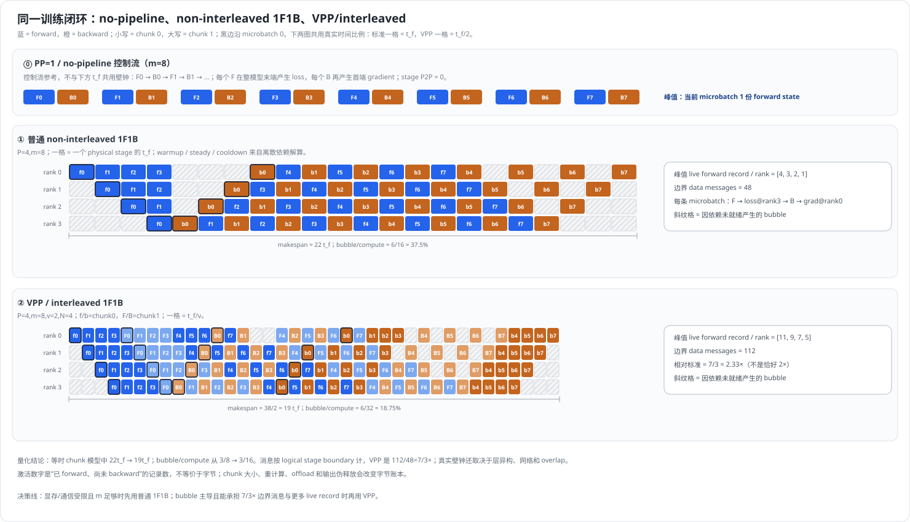
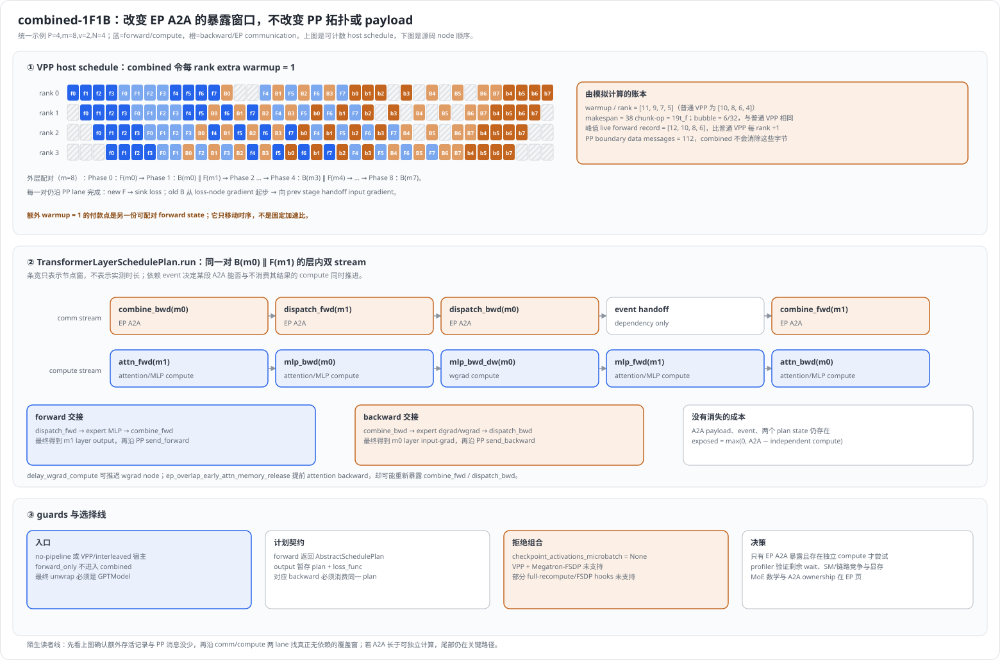
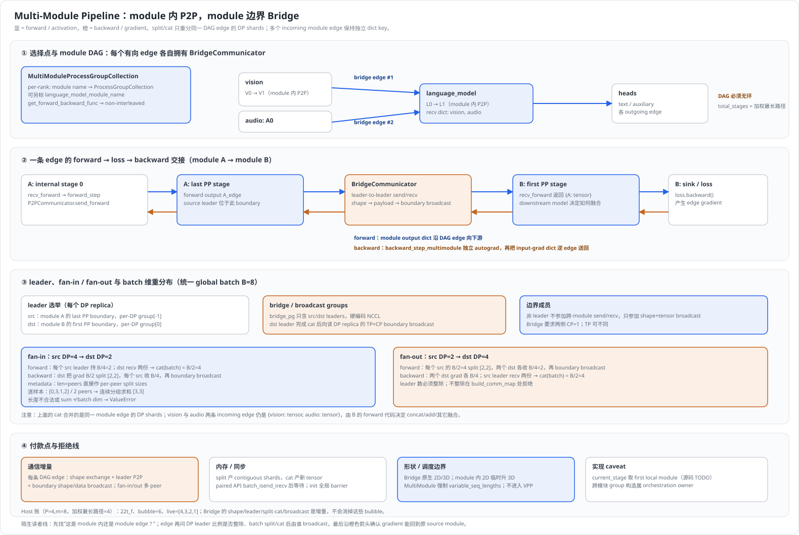
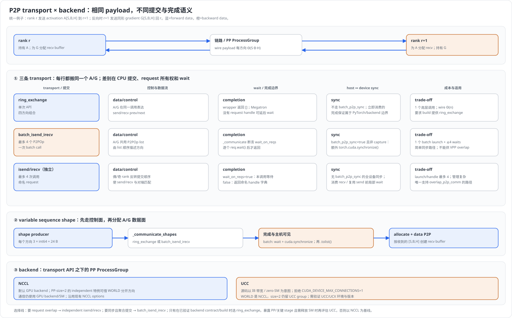
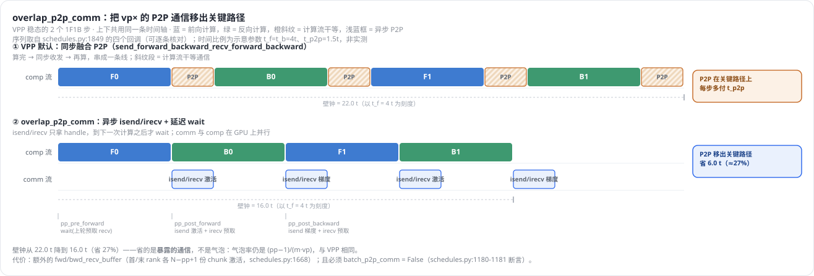
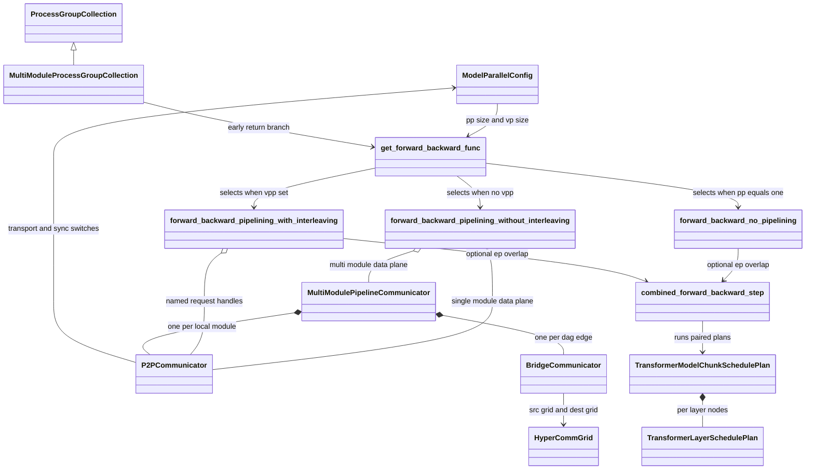

# Megatron-LM 流水线并行调度器深度解析

> **源码基线**：`NVIDIA/Megatron-LM@85902ef599ea4eb06ada7567a479c524b605767a`（`dev`，2026-09-01）
> **核心源码**：`megatron/core/pipeline_parallel/{schedules,p2p_communication,combined_1f1b,multimodule_communicator,bridge_communicator}.py`、`megatron/core/models/common/model_chunk_schedule_plan.py`、`megatron/core/{model_parallel_config,parallel_state,process_groups_config,utils}.py`
> **中心结论**：PP 调度器不切模型，只编排已经切好的 model chunk——它让每个 rank 用同一套静态依赖规则执行 microbatch forward、末级 loss、backward、边界 gradient 与最终 grad handoff。普通 1F1B 用 FIFO 把在途 activation 压到 $O(P)$；VPP 用更多 virtual boundary message 换更小 bubble；combined-1F1B 与异步 P2P 只改变成本暴露的位置，不改变依赖图；Multi-Module 复用 non-interleaved 控制面，用 module 内 P2P 加跨 module Bridge 两种数据面执行一张 DAG。
> **适用范围**：本页拥有 PP schedule 选择与三段生命周期、相邻 stage P2P 的三条 transport 与两种 backend、VPP schedule table、P2P request overlap、combined-1F1B 的 PP 侧接线、Multi-Module bridge 数据面，以及 scheduler 收尾到 `finalize_model_grads_func` 的交接。rank/ProcessGroup 构造归 [[17_megatron_parallelism_orchestration_analysis]]，MoE 路由与 A2A 数学归 [[14_megatron_ep_analysis]]，多轴资源竞争归 [[20_megatron_comm_overlap_analysis]]，activation offload 归 [[22_megatron_memory_optimization_analysis]]，packed/dynamic CP 的 shape 来源归 [[29_megatron_packed_dataset_dynamic_cp_analysis]]。
> **最近更新**：2026-09-05。补齐特性概览与硬约束、选型、趋势三节；把五条调度与三条 transport 逐条按同一个 $P=4,m=8$ 例子重放；新增类与所有权图；校正 `custom_backward` 的启用门、interleaved 与 `get_tensor_shapes` 两处 Hyper Connections 推导的不一致。

---

## 1. 特性概览

### 1.1 问题背景

把模型按层切成 $P$ 段之后，参数与优化器态确实被摊薄成 $1/P$，但没有一个 stage 能独立往前走：stage $r$ 必须等 stage $r-1$ 送来 activation，反向又必须等 stage $r+1$ 送回 gradient，于是天然地只有一个 stage 在算、其余 $P-1$ 个在等。最朴素的补救是把 global batch 拆成 $m$ 个 microbatch 灌进流水线，但"先跑完全部 $m$ 次 forward、再统一 backward"会让最靠前的 stage 同时持有 $m$ 份未匹配的 activation——空转率降下来了，显存却按 $O(m)$ 爆掉。真正的难题因此不是"要不要流水"，而是**在同一张依赖图上，让每个 rank 都能本地推出一致的执行序，且任意时刻在途 activation 的份数与 $m$ 无关**。

### 1.2 解决方法

Megatron 的答案是**静态时间表**，不是运行时调度：`schedules.py::get_forward_backward_func` 按并行度和进程组类型选一张表并**返回一个函数**，之后每个 rank 只按自己那一行执行，不交换任何调度决策。表的核心不变量是 1F1B——warmup 阶段 rank $r$ 先攒 $P-r-1$ 次 forward，稳态里每做一次 forward 就立刻做一次 backward，cooldown 把 FIFO 清空；FIFO 中最老的 forward 恰好对应下一个 backward，于是在途份数被钉在 $O(P)$ 而不是 $O(m)$。所有"重叠"能力——VPP、`overlap_p2p_comm`、combined-1F1B——都不是新表，而是这几张表**内部的分支**：它们改的是同一张表里通信何时被 `wait()`、或者两个相邻 microbatch 的层内节点如何交错，时间表本身不变。

### 1.3 收益、开销和约束

| 维度 | 直接收益 | 必付成本或边界 |
|---|---|---|
| 参数与优化器态 | 每 rank 只持 $1/P$ 的层；每 rank 的边界通信恒为 $2m$ 条（只与两个相邻 stage 往来），不随 $P$ 增长 | 层数必须能按 stage 划分；不均匀切分要靠 pipeline layout 显式给出 |
| 在途 activation | 1F1B 把峰值从 GPipe 的 $O(m)$ 压到 $O(P)$，本例每 rank 峰值 record `[4,3,2,1]` | 峰值仍随 $P$ 线性增长；靠前 rank 永远比靠后 rank 贵 |
| 空转 | 气泡率 $(P-1)/(m+P-1)$，增大 $m$ 即可摊薄；VPP 把分母里的 $m$ 换成 $mv$ | 增大 $m$ 会线性增加 PP 消息数；VPP 的消息数按 $Pv-1$ 而不是 $P-1$ 记 |
| 通信 | 每边界每 microbatch 一次 activation、一次 gradient，$\Theta(SBH)$ | 默认 `batch_p2p_comm=True` 会 wait 全部 request，通信落在关键路径上；要移出关键路径必须同时开 VPP 与 `overlap_p2p_comm` |
| 显存优化原语 | `deallocate_pipeline_outputs` 把已发送 output 的 `.data` 缩成标量，只留 `grad_fn` | 反向必须绕开 `torch.autograd.backward` 的同形检查，改钉在 PyTorch 私有 C++ 入口上（§2.6①） |
| 拓扑 | 每 rank 只与两个相邻 stage 通信，是最容易摆到跨节点链路上的模型并行轴（工程判断，不是源码断言） | Multi-Module bridge 两侧强制 CP=1、强制 `variable_seq_lengths=True`，且锁死在 non-interleaved |

### 1.4 符号约定

| 符号 | 含义 |
|---|---|
| $P$ | PP degree，即 `pipeline_model_parallel_size`；$r$ 为本 rank 的 PP 序号 |
| $m$ | 一个 global batch 的 microbatch 数（`num_microbatches`） |
| $v$ | 虚拟流水线度 `virtual_pipeline_model_parallel_size`，也就是本 rank 持有的 model chunk 数 |
| $N$ | `microbatch_group_size_per_vp_stage`，VPP 一组连续调度的 microbatch 数，默认取 $P$ |
| $t_f$、$t_b$ | 一个 microbatch 在**一个完整 physical stage** 上的前向 / 反向耗时 |
| $S$、$B$、$H$ | 序列长度、micro-batch size、hidden size；P2P 张量形状为 $[S,B,H]$ 的 TP/CP 调整版 |
| record | "已 forward、尚未匹配 backward"的 `(input, output)` 调度记录；不等于 activation bytes |
| boundary message | 一次逻辑 PP 边界上的一条数据消息（不含变长 shape 控制消息） |

---

## 2. PP 调度详细方案

### 2.1 最小闭环：一条 microbatch 怎么走完 forward → loss → backward → gradient

所有五条调度共用同一组原语，先把它讲透，后面的差异才有参照系。

`schedules.py::forward_step` 先把上游 activation 交给模型的 `set_input_tensor`，再调用用户给的 `forward_step_func`；返回值进 `schedules.py::forward_step_calc_loss`。这个函数只在**逻辑末 stage** 调 `loss_func`，中间 stage 的 output 只是一份待发送的 activation。它同时负责把 loss 缩放到与切分无关：拿到 `(output, num_tokens, loss_reduced)` 三元组时除以 token 数再除以 $m$；只拿到两元组的 legacy 路径则乘 CP size 再除以 $m$。MoE aux loss 与 MTP loss 通过 `MoEAuxLossAutoScaler` / `MTPLossAutoScaler` 的**进程级 scaler hook** 单独设标度——这是后面 §5.1 那条"动态 CP 与 PP 互斥"约束的根源。

`schedules.py::backward_step` 在末 stage 以 `output_tensor_grad=None` 从 loss 发起 autograd，中间 stage 则消费下游送回的 gradient。三处细节决定了后面所有变体的边界：

1. 它对每个 input `retain_grad()`，返回的正是本 stage 的 input gradient，由 communicator 送给 prev stage。
2. `custom_backward`（绕开形状检查的私有 C++ 入口）**只在 `config.deallocate_pipeline_outputs` 为真时启用**；否则走普通 `torch.autograd.backward`。旧口径把它写成"PP 反向一律绕开公开 API"是错的——那条路默认关闭。
3. `if output_tensor[0].requires_grad` 是一道显式短路：VLM 的某些 batch 没有图像，vision encoder 那一段不参与计算，源码选择跳过 backward 并保留零梯度，而不是报错。

一条 microbatch 的完整闭环因此是：

```text
rank0 input --F--> activation --P2P--> ... --F--> loss@rank(P-1)
rank0 grad  <--P2P-- input-grad <--B-- ... <--B-- loss gradient
```

**"send 已提交"、"recv buffer 已填"、"本 stage 参数 grad 已写入"、"整个 batch 可 optimizer step"是四个不同事件**，把它们混成一个是读 PP 调度最常见的错误。最后一个只在 scheduler 退出 `no_sync_func` 上下文、完成可选的 `grad_sync_func`、drain 掉延迟的 embedding wgrad、再调用 `finalize_model_grads_func` 之后才成立。`no_sync_func` 的退出时机本身还有一处非对称：源码只在 `grad_sync_func is None` **或**本 rank 是 PP 首级时才在最后一次 backward 前 `enable_grad_sync()`，注释写明其余 stage"do grad reduction during pipeline bubble"——即把 DP 规约丢进 cooldown 的气泡里，而不是抢占关键路径。

### 2.2 统一 $P=4,m=8$ 的可计数回放



图中普通/VPP 两张二维网格由离散依赖模拟器生成，不是手排方块：模拟器逐条照抄 `get_pp_rank_microbatches` 的 warmup 公式、`get_schedule_table` 的分组规则与 `get_model_chunk_id` 的反向 chunk 反转，再解算依赖，因此**图不可能和调度表对不上**。令一个 physical stage 的一次 F 或 B 为 $t_f$；VPP 把同样的层数切成两个 chunk，每个 chunk 的一次 F 或 B 因此耗 $t_f/2$。

陌生读者线：先沿黑边的 microbatch 0 看 forward 跨 rank 走到末级 loss，再沿 backward 回到 rank0 的 gradient；随后只比较三本账——斜纹 bubble、右侧 live record、以及 boundary message 计数。这样就不会把"时序更短"误读成"激活或通信也更少"。

| 路径 | makespan | bubble / compute | 峰值 live forward record / rank | logical boundary data messages |
|---|---:|---:|---|---:|
| PP=1 | 不与 PP=4 共用壁钟 | 0 | 当前 microbatch 1 份 | 0 |
| 普通 1F1B | $22t_f$ | $6/16=3/8$ | `[4,3,2,1]` | $2m(P-1)=48$ |
| VPP，$v=2,N=4$ | $38(t_f/2)=19t_f$ | $6/32=3/16$ | `[11,9,7,5]` | $2m(Pv-1)=112$ |
| combined 的 VPP 宿主 | $38(t_f/2)=19t_f$ | $6/32$ | `[12,10,8,6]` | 112 |

三条能直接读出来的结论：

1. **气泡率下降与通信增加是同一次交易的两面。** VPP 把每 rank 的空泡从 6/16 降到 6/32，代价是逻辑边界从 $P-1=3$ 条变成 $Pv-1=7$ 条。旧口径把 VPP 通信写成简单的 $\times v$ 不够精确：本例的 data message 增量是 $112/48=7/3$，只有 $P$ 很大时才趋近 $v$。计数不含变长 shape 控制消息。
2. **record 不是 bytes。** record 是调度依赖的计数；重计算、offload、chunk 层数和 `deallocate_pipeline_outputs` 的伪释放都会改变字节数，但一个都不能删除图中的依赖边。把 §2.2 的 record 表当显存表用会算错。
3. **PP=1 那一列不能和后三列比壁钟。** 它跑的是完整模型而不是 $1/4$ 的模型，图里因此单独画成控制流而不是同尺度的时间网格。

### 2.3 变体集合从哪里枚举出来

变体清单必须从源码自己的选择点导出，否则读者分不清"某个变体不存在"和"这页漏了它"。本页的枚举基是三个选择点加一个正交轴。

**第一个选择点是 `schedules.py::get_forward_backward_func` 本身。** 最容易漏掉的事实是：它的第一行先看 `schedule_pg_collection` 是不是 `MultiModuleProcessGroupCollection`，命中就**直接返回** non-interleaved 函数，根本不看 `pp_size` / `vp_size`；只有普通单 module 才继续按 PP/VPP size 分流。

```text
get_forward_backward_func(pp_size, vp_size, schedule_pg_collection)
|-- isinstance(schedule_pg_collection, MultiModuleProcessGroupCollection)   [早退，最先判定]
|   `-- forward_backward_pipelining_without_interleaving
|       `-- MultiModulePipelineCommunicator + backward_step_multimodule
|-- pipeline_model_parallel_world_size == 1
|   `-- forward_backward_no_pipelining
|       `-- [optional] combined_1f1b_schedule_for_no_pipelining
|-- PP > 1 && virtual_pipeline_model_parallel_world_size is None
|   `-- forward_backward_pipelining_without_interleaving
`-- PP > 1 && VPP is set
    `-- forward_backward_pipelining_with_interleaving
        |-- [optional] overlap_p2p_comm 的 request 生命周期分支
        `-- [optional] combined_1f1b_schedule_for_interleaved_pipelining
```

| 变体 | 选择条件 | 主要状态 | data plane | 完成条件 / 当前边界 |
|---|---|---|---|---|
| no-pipeline | PP=1 | 单 model，逐 microbatch | 无 stage P2P | 最后 backward 后收尾；model 与 iterator 只能各一份 |
| 普通 non-interleaved 1F1B | PP>1、无 VPP | input/output FIFO | `P2PCommunicator` | cooldown 清空 FIFO；不支持 `overlap_p2p_comm` |
| VPP / interleaved 1F1B | PP>1、VPP 已设 | 每 chunk 独立 FIFO、schedule table、virtual identity | 更多相邻 virtual-stage P2P | 所有 chunk backward 与 recv-handle 队列均清空 |
| combined-1F1B | no-pipeline 或 VPP 内，`overlap_moe_expert_parallel_comm` 打开 | 相邻 microbatch 的两个 schedule plan | PP 拓扑不变；层内 EP A2A/compute 双 stream | plan 被对应 backward 消费；不是新的 PP 拓扑 |
| Multi-Module Pipeline | `MultiModuleProcessGroupCollection` | module→tensor/grad 字典、DAG communicator | module 内 P2P；module 间 `BridgeCommunicator` | 只复用 non-interleaved；强制 variable shapes，不进入 VPP |

**第二个选择点是 `p2p_communication.py::P2PCommunicator._communicate` 里的 transport 三选一**（`use_ring_exchange_p2p` > `batch_p2p_comm` > 独立 `isend`/`irecv`），**第三个是 `parallel_state.py::initialize_model_parallel` 里的 `pipeline_model_parallel_comm_backend`**（`None` / `nccl` / `ucc`，其余值直接 assert 失败）。这三个轴正交：`overlap_p2p_comm` 是 VPP 内的 request 生命周期分支而不是第六个 scheduler；transport 决定 request 的所有权；backend 决定这些 request 落到哪个通信库。把它们揉成一张"模式列表"会同时丢掉选择顺序和不兼容组合。

**兄弟轴与 owner。** 同一个训练问题的其他切分轴不在本页，但本页消费它们的契约：

| 兄弟轴 | 本页只消费的契约 | owner |
|---|---|---|
| TP/SP 与 stage 内 tensor layout | PP 边界 shape 已按 TP/SP 调整 | [[12_megatron_tp_analysis]] |
| CP 的序列切分 | PP 边界 shape 的第一维已除以 CP size | [[13_megatron_cp_analysis]] |
| EP / MoE dispatch-combine | combined 只重排其 A2A 的暴露窗口 | [[14_megatron_ep_analysis]] |
| rank、ProcessGroup、HyperCommGrid | scheduler 接收构造完成的 PGC | [[17_megatron_parallelism_orchestration_analysis]] |
| 重计算粒度 | 改变字节，不改变 FIFO 依赖 | [[18_megatron_recompute_analysis]] |
| DP sync、optimizer | scheduler 最后交给 grad finalizer | [[16_megatron_distributed_optimizer_analysis]] |
| 多轴 stream/SM/NIC 竞争 | 本页不把 async 等同于已隐藏 | [[20_megatron_comm_overlap_analysis]] |
| activation offload / fine-grained memory | 改变字节峰值，不改变 PP 依赖 | [[22_megatron_memory_optimization_analysis]] |
| packing、变长输入、dynamic/hybrid CP | 产生 shape；PP 只做边界握手 | [[29_megatron_packed_dataset_dynamic_cp_analysis]] |

整个变体集合被拒绝的共同替代是**运行时 work-stealing 调度**与**先全 F 后全 B 的 GPipe**：前者在本 checkout 没有任何 live 实现（`get_forward_backward_func` 返回的是纯函数，没有调度器对象、没有跨 rank 协商）；后者会把靠前 rank 的 activation 存活推到 $O(m)$。当前静态 1F1B 的判据因此是"所有 rank 能本地复现同一依赖序，且 FIFO 中最老的 forward 恰好对应下一个 backward"。

### 2.4 五条 live 调度数据面

下面五条各是一套不同的数据面：本地算什么、什么东西过线、状态存在哪、反向怎么回来，四件事各不相同。因此把 §2.2 那个 $P=4,m=8$ 的例子原样喂进每一条。

#### 2.4.1 no-pipeline：正确性基线，也是 CUDA Graph 的兜底

**它答的压力**：$P=1$ 时不存在流水线，但上层训练循环不该为此写两套代码。它同时是其余四条的正确性基线。

**受限资源**：单卡显存——模型必须整个放得下，因此这条路不解决"模型放不下"，只解决"接口要统一"。

**本地计算**：`schedules.py::forward_backward_no_pipelining` 让前 $m-1$ 个 microbatch 的 F/B 留在 `no_sync_func()` 上下文内，最后一次 F/B 在上下文外执行，好让 DP 梯度同步发生。$m=8$ 时就是 7 次"静默"F/B 加最后一次带同步的 F/B。

**过线的数据**：0。没有 stage 边界，`p2p_communicator` 形参在这条路上被标注为 unused。

**重构与反向**：无需重构；反向就是本地 `backward_step`。forward-only 时既没有 backward，也没有 grad handoff。

**增量代价与边界**：`model` 与 `data_iterator` 若是 list，长度必须为 1（`assert ... does not support model chunking`）；`adjust_tensor_shapes_fn` 必须为 `None`。`get_pp_rank_microbatches` 在这条路上把 warmup 记为 0，源码注释写明该分支"only used for cuda graph capturing compatibility for the PP=1 case"。开了 combined 之后它仍是同一个 PP=1 外壳，只把相邻 microbatch 的 layer plan 共调度（§2.4.4）。

#### 2.4.2 普通 non-interleaved 1F1B：FIFO 在哪里生、在哪里死

**它答的压力**：$O(m)$ 的在途 activation。**受限资源**：靠前 rank 的显存——warmup 深度按 $P-r-1$ 递减，rank 0 最深。

`schedules.py::forward_backward_pipelining_without_interleaving` 分三段，本例 rank 0 的 warmup 是 $\min(m, P-r-1)=3$：

1. **warmup**：rank $r$ 执行 `min(m, P-r-1)` 次 `recv_forward → forward_step → send_forward`，把 `(input, output)` append 进两条并行 FIFO。四个 rank 的 warmup 深度是 3/2/1/0，正好对应表里的峰值 record `[4,3,2,1]`（稳态里还会多压一份）。
2. **steady**：先 `forward_step`，再用融合算子 `send_forward_recv_backward` 一次完成"送出 activation 并收回 gradient"，然后 `pop(0)` 取最老的 `(input, output)` 做 backward，再用 `send_backward_recv_forward` 把 input-grad 送回 prev stage 并预取下一份 input。**融合算子是 1F1B 效率的关键**：一个 stage 在同一次调用里同时收发两个方向，否则两次单向调用会各自暴露一次延迟。
3. **cooldown**：对 FIFO 余额执行 `recv_backward → backward_step → send_backward`。最后一次 local backward 之前才 `enable_grad_sync()`（§2.1 的非对称规则）；随后 drain embedding wgrad，再调 `finalize_model_grads_func`。

**过线的数据**：每 microbatch 每边界一次 activation、一次 gradient，本例 $2m(P-1)=48$ 条，payload 各为 $\Theta(SBH)$。

**重构**：不需要——FIFO 的 pop 顺序就是重构规则。这是 1F1B 相对 GPipe 的全部机械：只要 backward 严格按 FIFO 顺序消费，最老的 forward 一定是下一个能被 backward 的，于是在途份数被钉在 warmup 深度加一。

**反向差异**：末 stage 从 loss 起手（`output_tensor_grad=None`），其余 stage 消费下游 gradient；`backward_step` 返回 input gradient 交给 `send_backward`。

**增量代价**：`deallocate_pipeline_outputs=True` 在 send 之后把 output 的 `.data` 换成 `torch.empty((1,))`，只保留 `grad_fn`。它释放的是**发送端 output 的 storage**，不是 input、不是参数 grad、也不是接收端 buffer；并且在 send request 完成之前那块 storage 仍不能安全复用。开启后 backward 才改走 `custom_backward`（§2.6①）。

#### 2.4.3 VPP / interleaved 1F1B：把一条流水线折成 $v$ 条

**它答的压力**：气泡率 $(P-1)/(m+P-1)$ 在 $m$ 无法再增大时降不下去。**受限资源**：边界消息数与 warmup 深度——两者都随 $v$ 上升。

**本地计算**：每个 physical rank 持有 $v$ 个**不连续**的 model chunk。`schedules.py::get_schedule_table(m, v, N)` 把 microbatch 按 $N$ 个一组切开，组内先把 chunk 0 排完再排 chunk 1；末组吸收余数。本例 `P=4, m=8, v=2, N=4` 的表就是

$$
(m_0..m_3,c_0)\;\to\;(m_0..m_3,c_1)\;\to\;(m_4..m_7,c_0)\;\to\;(m_4..m_7,c_1).
$$

反向把 chunk id 反转（`model_chunk_id = v - 1 - chunk`），并用每 chunk 一条独立 FIFO 找回正确的 microbatch——这是 VPP 相对普通 1F1B 唯一新增的状态。

**warmup 公式**：训练态的未截断 warmup 是 $2(P-r-1)+(v-1)N+\delta$，再 clamp 到总 virtual microbatch 数 $mv$；普通 VPP 的 $\delta=0$，combined 的 $\delta=1$。本例四 rank 因而是 `[10,8,6,4]`，加上稳态多压的一份得到峰值 record `[11,9,7,5]`。

**过线的数据**：逻辑边界从 $P-1=3$ 条变成 $Pv-1=7$ 条，本例共 112 条消息，是普通 1F1B 那 48 条的 $112/48=7/3$。注意每条消息的 payload 与普通 1F1B 相同——变多的是次数，不是单条大小。

**重构**：`get_model_chunk_id` 与每 chunk FIFO 联合完成；`convert_schedule_table_to_order` 另外把同一张表翻译成 `te.make_graphed_callables()` 能吃的正负号序列，供 CUDA Graph 捕获使用。VPP 还多用一个只在这里出现的四方向融合算子：warmup 的最后一次迭代（不开 overlap、非 forward-only、且不是全部 microbatch 都在 warmup 时）调 `P2PCommunicator.send_forward_backward_recv_forward_backward`，在一次调用里同时收发前向与反向两条流——普通 1F1B 的 warmup 末尾没有反向可发，用不到它。

**反向差异**：`recv_tensor_from_previous_stage` 里有一处只有 VPP 才有的逻辑——**leading stage**（前向时是首 rank、反向时是末 rank）领先 ending stage $P-1$ 步，所以它在前 $P-1$ 个 virtual microbatch 里根本不发起 recv，之后要用 `virtual_microbatch_id - (P-1)` 去对齐 ending stage 的 chunk。最深/最浅 chunk 不产出跨 rank 张量时也直接置 `recv=False`。

**增量代价**：多 $v-1$ 份 chunk 状态、更深的 warmup、$7/3$ 倍的消息数，以及 chunk 切换本身的调度开销。选择判据是"$m$ 已经加不动、而边界带宽还有余量"；反过来在跨节点带宽吃紧时，$7/3$ 倍的消息可能把省下的气泡吃回去——这正是 VPP 通常要再配 `overlap_p2p_comm`（§2.5.3）的原因。

#### 2.4.4 combined-1F1B：配对层内 plan，而不是删除通信



**它答的压力**：MoE 的 EP all-to-all 在单个 microbatch 内没有足够的独立计算可以盖住它。**受限资源**：一个 stage 上同时活着的 schedule plan 数与 activation 峰值。

**本地计算与配对方式**：`combined_1f1b.py::combined_1f1b_schedule_for_no_pipelining` 先单跑 $F(m_0)$，随后依次共调度 $B(m_i)\parallel F(m_{i+1})$，最后单跑 $B(m_7)$。VPP 宿主用 `combined_1f1b_schedule_for_interleaved_pipelining`，为保证稳态里 F/B 属于**互相独立**的两个 microbatch 而令每 rank warmup `+1`；本例 makespan/bubble 仍是 $19t_f$ 与 $6/32$，peak live record 每 rank 增 1 变成 `[12,10,8,6]`，**PP messages 仍为 112**。

**plan 怎么交接**：`combined_forward_backward_step` 要求 `forward_step_func` 以 `return_schedule_plan=True` 返回一个 `AbstractSchedulePlan`，并把 plan 与 `loss_func` 挂在 output tensor 上；配对的 backward 再从 output 上取回二者，末 stage 先让 loss node backward、拿到 $\partial L/\partial(\text{chunk output})$，再执行 plan。最终 unwrap 出来的模型必须是 `GPTModel`（显式 assert），plan 不能跨 microbatch 错配或复用。

**过线的数据**：PP 侧一条不变。层内的 EP A2A payload 与 event 也一条不变——被改变的只有它们在时间轴上的位置。

**节点顺序（可逐格复演）**：`model_chunk_schedule_plan.py::TransformerLayerSchedulePlan.run` 的 docstring 把两条 stream 写成对照表，实现逐行印证：

```text
comm_stream: combine_bwd(m0) | dispatch_fwd(m1) -> dispatch_bwd(m0) | combine_fwd(m1)
comp_stream: attn_fwd(m1)    | mlp_bwd(m0) -> mlp_bwd_dw(m0) -> mlp_fwd(m1) | attn_bwd(m0)
```

即 `combine_bwd(m0)` 与 `attn_fwd(m1)` 同窗，`dispatch_fwd(m1)` 与 `mlp_bwd(m0)` 同窗，随后推进 `dispatch_bwd(m0)`、MLP 的 dgrad/wgrad、`mlp_fwd(m1)`、`combine_fwd(m1)` 与 `attn_bwd(m0)`。forward 最终仍产出 $m_1$ 的 output，backward 仍产出 $m_0$ 的 input-grad——**共调度不改变任一 microbatch 的数学结果**。

**反向差异与一处与 PP 的耦合**：`run` 的最后一句是 `if b_layer is not None and not is_last_layer_in_bwd: b_layer.attn.backward_dw()`，注释写明"Delay the last attn_dw in backward pass ... for overlapping with the p2p comm"——最后一层的 attention wgrad 被刻意留到 PP 的 P2P 窗口里做。这是 combined 与 PP 调度之间唯一一处显式耦合。

**增量代价**：每 rank 多一份 plan state 加一个 microbatch 的 activation。单个理想窗口最多把暴露部分降到 $\max(0,\;t_{\mathrm{A2A}}-t_{\mathrm{independent\ compute}})$；两条 stream 争同一资源、或依赖提前收口时仍会 wait。`ep_overlap_early_attn_memory_release=True` 把 `attn_bwd` 提到 `mlp_fwd` 之前以更早释放 attention activation，源码 docstring 明写代价是 `moe_combine_fwd` 与 `moe_dispatch_bwd` 重新暴露——这是显存换重叠，不是免费开关。

**被拒绝的替代**：把 combined 做成第六张顶层调度表。源码选择让它寄生在 no-pipelining 与 interleaved 两个宿主内部，判据可以从 `combined_1f1b_schedule_for_interleaved_pipelining` 的形状直接读出——它接收宿主的 `forward_step_helper_preprocess` / `backward_step_helper_postprocess` 等六个回调，只把中间那次 compute 换成 `combined_forward_backward_step`。做成独立表就必须把 warmup/steady/cooldown 三段整体复制一遍。

**guard 与不支持组合**（全部来自 `transformer_config.py::TransformerConfig.__post_init__` 与 `combined_1f1b.py`）：PyTorch ≥ 2.6（TODO 注明是为绕开 hang）、`expert_model_parallel_size > 1`、dispatcher 为 `alltoall`/`flex`、模型为 bf16/fp16、关闭 `moe_shared_expert_overlap`、MTP 层最多 1；PP>1 时**必须**给 VPP。非 full recompute 时 `recompute_method` / `recompute_num_layers` 必须为空且 `recompute_modules` 不含 `moe`；full recompute 又拒绝 `distribute_saved_activations`、非零 attention/hidden dropout、以及 delayed-scaling FP8——三条的源码注释各自给了机制理由（replay 不走 checkpoint 原语所以不能分片、RNG 流在 1F1B 里交错、amax_history 会被二次更新）。运行期还要求 `checkpoint_activations_microbatch is None`；VPP + Megatron-FSDP 被 `combined_1f1b_schedule_for_interleaved_pipelining` 的 assert 直接拒绝；`cuda_graph_impl="transformer_engine"` 时覆盖 MoE/MLP 的捕获范围被拒。NCCL-EP 且 `moe_ncclep_static_shape=False` 只给 warning——路径正确但 device-to-host sync 会把 overlap 串行化。DualPipe / ZeroBubble 在本 checkout 全库无命中（case-insensitive 搜 `dualpipe` / `zero bubble` / `zbh1` / `zbv`），不能写成 live 配置；`delay_wgrad_compute` 只是借用了它们 $B=B_{\mathrm{dgrad}}+B_{\mathrm{wgrad}}$ 的拆分思想用于掩盖 A2A，不是系统性消除气泡。MoE 路由与 A2A 的正确性归 [[14_megatron_ep_analysis]]。

#### 2.4.5 Multi-Module Pipeline：DAG 控制面与 Bridge 数据面



**它答的压力**：标准 `P2PCommunicator` 假设上下游 stage 共享同一张并行网格——TP/DP/CP 一致、张量维数一致、形状对得上。多模态模型不是这样：vision encoder 可能 TP=2/PP=1 且输出 2D `[B·S,H]`，LLM 主干可能 TP=8/PP=4 且要 3D `[S,B,H]`。**受限资源**：跨网格的 rank 映射与 NCCL communicator 数。

**从 per-module PGC 到 DAG communicator。** `process_groups_config.py::MultiModuleProcessGroupCollection` 是每 rank 的 `module_name → ProcessGroupCollection` 字典，另可指定 `language_model_module_name`。`multimodule_communicator.py::MultiModulePipelineCommunicator` 接收一张有向 module topology，为每条 edge 建一个 `BridgeCommunicator`，同时为本 rank 所属的每个 module 建一个普通 `P2PCommunicator`。

**module 内不是 Bridge。** 非首 stage 的 `recv_forward`、非末 stage 的 `send_forward` 仍沿该 module 自己的 PP group 做相邻通信；只有 module 的首/末边界跨 DAG edge 时才走 Bridge。多条 incoming edge 返回 `{source_module: tensor}` 字典；多条 outgoing edge 分别发送同一份 module output。scheduler 不替模型决定 vision/audio 应该 concat、add 还是 cross-attend——那是模型的事。

DAG 必须无环；`total_stages` 是以各 module PP size 加权的最长路径，`num_warmup_microbatches` 因此写成 `total_stages - current_stage - 1` 而不是 `P - r - 1`。`current_stage` 当前只从本 rank 的第一个 local module 推导，源码留着 TODO；依赖精确全局 stage index 的新拓扑应先验证这一 caveat，不要把它当成熟的通用 DAG scheduler。

**leader 选举是方向非对称的。** `bridge_communicator.py::BridgeCommunicator.get_leader_rank` 的 docstring 把 leader 概括成 "first tp-cp rank"，但可执行分支和 `test_get_leader_rank` 显示两侧规则不同：源侧每个 DP replica 在 source module 的**最后** PP boundary 取 per-DP rank enumeration 的 `group[-1]`，目的侧每个 DP replica 在 destination module 的**第一** PP boundary 取 `group[0]`。只有这些 leader 进入 bridge group；跨 module 的 shape 与 payload 先做 leader-to-leader，destination leader 随后向自己 replica 的 TP×CP boundary group **broadcast** shape 与 tensor。bridge group 与 broadcast group 都由类级缓存（`_bridge_pg_cache` / `_broadcast_pg_cache`）去重，且**都硬编码 `backend='nccl'`**；构造末尾还有一次 `dist.barrier()`。把普通 module 的 PP backend 设成 UCC，不会连带把跨 module bridge 改成 UCC。

**fan-in / fan-out 在同一个例子上的重放。** `BridgeCommunicator.build_comm_map` 要求两侧 leader 数中较大者能被较小者整除，否则 `ValueError`：

- **fan-in，src DP=4 → dst DP=2，global batch=8**：每个 src leader 的 batch shard 是 2；每个 dst leader 收两份并沿 batch 维 `cat` 成 4，再向自己的 boundary group broadcast。反向把 grad shard 4 `split [2,2]` 还给两个 src。
- **fan-out，src DP=2 → dst DP=4**：每个 src 的 shard 4 沿 batch 维 `split [2,2]` 分给两个 dst，各自 broadcast shard 2。反向时 src 收两份 grad shard 并 `cat` 回 4。

`BridgeCommunicator._split_tensor_at_batch_dim` 默认 `tensor_split` 后取 contiguous；张量上的 `_mimo_bridge_split_sizes` metadata 在 peer 数大于 1 时有两种合法形式：metadata 长度等于 peer 数时**直接**作为 per-peer split sizes；长度大于 peer 数且能被 peer 数整除时，它表示按输入顺序排列的逐样本 sizes，每连续 `len(metadata)/peers` 项先求和成一个 peer size——例如 batch=6、2 peers 时 `[0,3,1,2]` 聚合成 `[3,3]` 再 split。归一后的总和必须等于 tensor 的 batch 维，否则 `ValueError`；长度小于 peer 数、或长度大于但不能整除 peer 数，同样 `ValueError`。`num_splits<=0` 直接拒绝；peer 数为 1 时在 metadata 校验之前就短路成一份 contiguous tensor。这里的 `cat` 只重组同一条 DAG edge 上的 DP shards，**绝不合并两个 source module**。

**前反向交接与完成边界。** forward 里 module-last 的 output 由 `BridgeCommunicator.send_forward` 发往下游，module-first 的 `recv_forward` 返回字典再喂给下游模型；绝对 sink 的 scalar/单 output 按 `language_model_module_name` 归键。`schedules.py::backward_step_multimodule` 对 output dict 中每个 tensor 独立发起 autograd，得到 input-grad dict；Bridge 的 backward 完全逆转 forward 的 split/cat 与 edge 方向，把 gradient 交回 source module。它同样带着那条 VLM 短路：`output_tensor_module.requires_grad` 为假时跳过 backward 并保留零梯度。

**增量代价**：单向 API 用 blocking `dist.send/recv`；paired 方法（`send_forward_recv_backward` 等）用 `batch_isend_irecv` 随后 wait 全部 request。每条 edge 还要付 shape exchange、leader P2P、destination boundary 的 shape/data broadcast；split 需要 contiguous shard，cat 要分配新张量；建组阶段多出 bridge/broadcast communicator 与一次全局 barrier。

**硬边界**：Bridge 两侧的 CP size 必须为 1（源码 TODO 写明 "CP support will be added in follow up PR"）；`tensor_ndim` 只接受 2 或 3；module 内 P2P 会把 2D 暂时升成带 singleton 的 3D，并拒绝最后一维本就为 1 的歧义 3D。Multi-Module schedule 强制 `variable_seq_lengths=True`（否则 `ValueError`），且选择点直接锁在 non-interleaved，因此不提供 VPP 或 P2P overlap。

**在同一个例子上的账**：若一条加权最长路径恰有 $P=4$ 个 stage、仍取 $m=8$，它复用普通 non-interleaved host 表，故理想等时模型仍是 $22t_f$、6 个 bubble、峰值 record `[4,3,2,1]`；Bridge 的 shape、leader P2P、split/cat 与 boundary broadcast 都是这本账**之外**的增量。一般 DAG 的分支不等长，不能从一个 $P$ 推出统一 makespan；较短分支的等待属于拓扑不平衡成本，本页不为它编造一个公式。

**被拒绝的替代**是把整个 module DAG 伪装成一个 WORLD ring：它无法表达不同 module 的 DP/TP 划分、fan-in/out 与多入边语义，也会让跨网格 P2P 与各子网格内部的集合通信抢同一个 NCCL communicator。若相邻计算确实属于同一 module 且 parallel layout 相同，应继续用便宜的 module 内 P2P；只有跨 module edge 且布局需要桥接时，才承担 Bridge 的 group、shape、copy、broadcast 与同步成本。

#### 2.4.6 五条调度在同一个例子上的账

| 调度 | 它答的压力 | 受限资源 | 本例 makespan | 本例峰值 record | 本例 boundary messages | 反向增量 |
|---|---|---|---:|---|---:|---|
| no-pipeline | 接口统一 / 正确性基线 | 单卡显存放得下整模型 | 不同尺度 | 1 | 0 | 无 |
| non-interleaved 1F1B | 在途 activation $O(m)$ | 靠前 rank 显存 | $22t_f$ | `[4,3,2,1]` | 48 | FIFO 顺序消费 |
| VPP | 气泡率 $(P-1)/(m+P-1)$ | 边界消息数与 warmup 深度 | $19t_f$ | `[11,9,7,5]` | 112 | 每 chunk 独立 FIFO + chunk 反转 |
| combined-1F1B | 单 microbatch 内盖不住 EP A2A | 同时活着的 plan 与 activation | $19t_f$ | `[12,10,8,6]` | 112 | 末层 attn wgrad 延到 P2P 窗口 |
| Multi-Module | 跨异构子模型的网格不匹配 | 跨网格 rank 映射与 communicator 数 | 复用 $22t_f$ | `[4,3,2,1]` | 48 + 每 edge 的 bridge 开销 | 逐 module 独立 autograd + 逆 split/cat |

### 2.5 P2P transport：同一张量，三种提交/等待语义



统一例子是 rank $r$ 把 activation `A[S,B,H]` 发给 $r+1$，反向时 $r+1$ 把同形 gradient `G[S,B,H]` 送回。`p2p_communication.py::P2PCommunicator._communicate` 最多同时表达 send-prev、recv-prev、send-next、recv-next 四个方向；三条 transport 的 wire payload 都是每方向 $\Theta(SBH)$，**区别不在数学，而在 host launch 次数、request 的所有权与完成边界**。

transport 本身不改 §2.2 的 schedule table、bubble 或基础 live record；独立 P2P 加 overlap 只额外持有 recv buffer 与 handle，并把 wait 的暴露位置往后挪。也就是说，不能把更异步的 API 计成更少的 activation 或更少的 wire bytes。

#### 2.5.1 `ring_exchange`

**选择条件**：`use_ring_exchange_p2p=True`，优先级最高，在 `_communicate` 里排在 `batch_p2p_comm` 之前。

**本地与过线**：直接调 `torch.distributed.ring_exchange`，一个 API 同时携带四个可选方向。Megatron 用一个 wrapper 把它包起来并**返回空 request list**，所以没有显式 `req.wait()`，也不进入 `batch_p2p_sync` 的 host-side device sync 分支。

**依赖边界（重要）**：调用返回之后何时可以安全消费 recv buffer，属于 PyTorch / backend 的第三方契约，本 checkout 没有继续实现。Megatron 源码能证明的只有"它被调用了、且 wrapper 不返回 handle"；**不能**把"没有显式 wait"改写成"通信已经免费异步"。

**增量代价与判据**：一次高层调用、相同的 $\Theta(SBH)$ wire bytes；限制是需要一个自己 patch 过 `torch.distributed.ring_exchange` 的 PyTorch build——`use_ring_exchange_p2p` 的 docstring 原文就写着 "Requires custom built torch"。只有该 API 的完成语义与目标 backend 都已验证时才选它；它不能作为标准 PyTorch 的默认便携路径。

#### 2.5.2 `batch_isend_irecv`

**选择条件**：默认 `batch_p2p_comm=True`。

**本地与过线**：`_batched_p2p_ops` 把至多四个 `torch.distributed.P2POp(isend/irecv)` 按 send-prev、recv-prev、send-next、recv-next 的固定顺序装进一次 `torch.distributed.batch_isend_irecv`。`_communicate` 对这条路径断言 `wait_on_reqs=True`，随后逐 request `wait()` 并把 `reqs` 置 `None`。

**完成边界**：caller 返回时可以直接消费 recv buffer，但**拿不到能跨 compute 保存的 handle**——这正是它与 `overlap_p2p_comm` 互斥的机械原因，不是配置洁癖。

**额外的 host-side device sync**：若 `batch_p2p_sync=True` 且当前 stream 不在 capture 中，wait 之后还会执行一次 `torch.cuda.synchronize()`。源码注释把这条写得很完整，并且**自陈了被否掉的替代**：这是绕开旧版 PyTorch 一个跨 rank race 的 workaround，而 `torch.cuda.synchronize()` 在 CUDA Graph capture 下非法（注释写明是实测得到的报错，不是推测），所以"要么在 capture 时跳过它、要么直接拒绝 capture"二选一。源码选了跳过，判据是"能走到这一行且处在 capture 里的 PyTorch 栈，必然新到不需要这个 workaround"——这是一个版本论证，注释还额外警告不要把这条跳过外推到非 capture 路径。

**增量代价与判据**：一次 batch launch、至多四次 wait、外加可选的全设备同步。需要简单同步、聚合提交时用它；要 VPP 的 request overlap 时必须拒绝它。

#### 2.5.3 独立 `isend`/`irecv` 与 `overlap_p2p_comm`



**选择条件**：`batch_p2p_comm=False`。这是本基线上**唯一**支持 `overlap_p2p_comm` 的 transport。

**本地与过线**：`_p2p_ops` 分别提交每个方向，并让偶 rank 先 send、奇 rank 先 recv，以匹配对端顺序——若所有 rank 同时先发，会互相等待对方 recv 而死锁。返回的是一个**带名字的 request 字典**（`send_next` / `send_prev` / `recv_prev` / `recv_next`）。`wait_on_reqs=True` 时仍在 helper 内等完；只有设为 `False` 才把这个字典交给 VPP scheduler。

**一处只在 PP=2 才出现的技巧**：`group.size() == 2` 且 backend 不是 `ucc` 时，其中一个方向借全局 `WORLD` group 发送——同一个 NCCL communicator 内的两个 P2P 会被串行化，借 WORLD group 才能让两个独立方向真正并行。源码注释同时给出了 UCC 的例外理由：全局 communicator 固定是 NCCL，所以 UCC 必须走 else 分支留在原 PP group。

**request 的生命周期（overlap 打开时）**：`overlap_p2p_comm=True` 只允许 VPP（non-interleaved 直接 `ValueError`），且要求 `batch_p2p_comm=False`（配置期声明互斥、运行期再 `ValueError` 拦一次）。scheduler 拿到命名 handle 后按三条规则消费：recv handle 在下一次 F/B 真正读取该 buffer **之前** wait；旧的 send handle 在替换引用、复用 storage 或做输出伪释放**之前** wait；收尾处两条 `assert not recv_prev_wait_handles` / `assert not recv_next_wait_handles` 保证队列已清空。

图的时间参数是明确标注的示意数据，不是 profiler 采样：两个 steady step 取 $t_f=t_b=2t$、$t_{p2p}=0.75t$。同步路径完成于 $11t$；异步路径的 compute 区间是 $8t$，但最后一个 request 要到 $8.75t$ 才 drain，因此实际节省 $2.25t$ 而不是 $3t$。**没有下一个独立 chunk 可算、recv 很快就被消费、或者 comm 与 compute 争同一资源时，wait 会重新暴露**——真实资源竞争由 [[20_megatron_comm_overlap_analysis]] 评估，本页不把 async 等同于已隐藏。

**增量代价与判据**：最多四次 launch、四个 handle 与更复杂的生命周期。拒绝它的判据是这部分 buffer/handle 成本超过可遮蔽的边界延迟。

#### 2.5.4 三条 transport 在同一个例子上的账

| transport | 选择条件 | host launch | request 所有权 | 完成边界 | Megatron 能证到哪 |
|---|---|---|---|---|---|
| `ring_exchange` | `use_ring_exchange_p2p=True`（最高优先） | 1 次高层调用 | 无（wrapper 返回空 list） | 由 PyTorch/backend 的 `ring_exchange` 契约决定 | 只到"参数被交出去" |
| `batch_isend_irecv` | `batch_p2p_comm=True`（默认） | 1 次 batch，至多 4 个 op | helper 内部持有并全部 wait | caller 返回即可消费；可选再加一次 host-side device sync | **全程** |
| 独立 `isend`/`irecv` | `batch_p2p_comm=False` | 至多 4 次 | `wait_on_reqs=False` 时交给 VPP scheduler | 数据被消费 / 源 storage 被复用之前 wait | **全程** |

三条路的 wire bytes 完全相同（每方向 $\Theta(SBH)$）。拉开差距的是**谁持有 request、以及 wait 落在时间轴的哪一格**。

#### 2.5.5 NCCL 与 UCC 不是 transport 的同义词

| backend | 控制面 | device/SM 与依赖成本 | 选择线 |
|---|---|---|---|
| NCCL | `pipeline_model_parallel_comm_backend=None` 随默认 backend，或显式 `nccl`；建组时带 `get_nccl_options("pp", ...)` | 通信占用 GPU backend/SM；PP size=2 的独立 P2P 可借 NCCL `WORLD` 组 | 环境简单、已验证稳定时作为基线 |
| UCC | PP group 显式 `ucc`；`parallel_state.py::initialize_model_parallel` 建组时**不传** NCCL `pg_options`，并预设 `TORCH_UCC_BLOCKING_WAIT=none`、`UCC_EC_CUDA_STREAM_TASK_MODE=driver`、`UCX_TLS=ib,cuda_copy`、`UCX_RNDV_THRESH=0`、`UCX_NET_DEVICES=all`、`UCC_CL_BASIC_TLS=^sharp,nccl` | 源码注释以"IB 链路上带宽利用率优于 NCCL"和"不占用 GPU SM（Zero-SM），减少与重叠计算的干扰"为选型意图；若环境里设了 `CUDA_DEVICE_MAX_CONNECTIONS`，其值不得为 `1`，否则 assert 失败——因为所有 UCC 通信会被串行化 | 源码自陈两种适用场景：exposed PP 通信显著（如梯度累积步数很少），或关键路径 stage 有大量 PP 通信重叠（如不均匀 PP）。都要用 profile 验证 |

`pipeline_model_parallel_comm_backend` 只接受 `None` / `nccl` / `ucc`，其余值在建组循环里被 assert 拒绝。UCC 的"zero-SM/更高带宽"是**源码写下的选型理由，不是本页的 benchmark 结论**。更要紧的是它的作用域：`BridgeCommunicator` 的 bridge/broadcast group 硬编码 NCCL，把普通 module 的 PP backend 设为 UCC 不会连带改变跨 module bridge。ProcessGroup 怎样创建、rank 怎样映射由 [[17_megatron_parallelism_orchestration_analysis]] 拥有。

### 2.6 三处不显然的取舍：被否掉的替代

前面每条变体各自的取舍已经就地给出。这里单列三处**跨变体**的设计选择，它们决定了整套实现的形状；前两条源码自陈，第三条只留了取值示例。

**① 反向为什么绕开 `torch.autograd.backward`——为了让"把激活缩成标量"这个手段能成立。**
`schedules.py::custom_backward` 的 docstring 把理由和被否方案写在一起：要让 `deallocate_output_tensor` 生效，就必须直接调 C++ autograd 引擎、绕开 PyTorch 的 `backward`，因为后者会校验 output 与 grad 同形而 C++ 引擎不会。链条是闭合的：`deallocate_output_tensor` 先说明已发送的 activation "is only useful for its `.grad_fn` field, and not its `.data`"，于是把 `.data` 换成 `torch.empty((1,))`；形状一旦变成 `[1]`，公开 API 的校验必然失败，所以只能调 `Variable._execution_engine.run_backward`（注释直接指向 `torch/csrc/autograd/python_engine.cpp`）。`custom_backward` 再用 `assert output.numel() == 1, "output should be pseudo-'freed' in schedule, to optimize memory"` 把这个前提反向钉死——**两个函数互为对方的前提，不能只开一半**。
判据是**显存优先于 API 稳定性**：被否掉的替代（继续用公开 `torch.autograd.backward`）不是做不到，而是做到了就必须放弃 `deallocate_output_tensor`。账单见 §5.1 第 2–4 行：PP 反向从此绑在一个 PyTorch 私有 C++ 入口上，而且被伪释放的张量不能是别人的视图（`assert out._base is None, "counter-productive to free a view of another tensor."`）。

**② P2P 为什么留了三条实现，而"重叠"只能走其中一条。**
`overlap_p2p_comm` 与 `batch_p2p_comm` 在 `ModelParallelConfig` 里互相声明互斥（"Must be False if batch_p2p_comm is true." / "Must be False if overlap_p2p_comm is True."），运行期在交错调度里再拦一次 `ValueError("Can not use both overlap_p2p_comm and batch_p2p_comm")`。机械原因已在 §2.5.2 给出：batch 路径断言 `wait_on_reqs=True`，拿不到能跨 compute 保存的 handle。第三条 `use_ring_exchange_p2p` 是**被留下但默认关闭的替代**，判据由 docstring 自陈——它需要一个自己编译的 PyTorch，所以进不了默认路径。同样"留在原地当兼容层"的还有 `batch_p2p_sync`，docstring 写明它是绕开旧版 PyTorch bug 的 workaround。三条路都活着，但只有一条能承载 overlap；这就是为什么三个 P2P 旋钮必须成组设置（§5.1 第 5–7 行）。

**③ VPP 的 microbatch 分组做成可调数，而不是写死深度优先。**
`microbatch_group_size_per_vp_stage` 的默认值在 `__post_init__` 里被设成 `pipeline_model_parallel_size`，docstring 明写该默认 "specifies a depth-first schedule"，并给出取 2 与取 3 两组 rank 时间线示范排布差异。**被否掉的替代就是写死深度优先**；源码给了时间线，但没写这个旋钮到底在换什么。

> [!note] 推断
> ①② 的理由由 docstring 自陈，可以直接引用。**下面两条是本页的重建，不是源码的自陈：**
> (a) **`microbatch_group_size_per_vp_stage` 的判据。** 源码只给了取值范围校验（必须落在 $[P,m]$，否则 `ValueError`；余数不为 0 且小于 $P$ 时 `RuntimeError`，理由原话是它"introduces dependency bubbles in the pipeline and reduces throughput"）与两组时间线，**没有**说"调大这个数是拿显存换气泡"。本页据 warmup 公式 $2(P-r-1)+(v-1)N$ 重建：$N$ 越大，warmup 越深、同组在飞的 microbatch 越多、气泡填得越满，代价是 live record 越多。要引用这条判断，请回到 `model_parallel_config.py::ModelParallelConfig.microbatch_group_size_per_vp_stage` 的 docstring 与 `schedules.py::forward_backward_pipelining_with_interleaving` 的两处校验，不要引用本段。
> (b) **为什么"重叠"是表内分支，而不是并列的第四、第五张表。** 源码只呈现结构：`get_forward_backward_func` 返回的是函数而不是调度器对象，`overlap_p2p_comm` 与 `overlap_moe_expert_parallel_comm` 都在被返回的函数体内部分支，**没有任何注释解释这个取舍**。本页的重建是：重叠改的只是"同一张表里通信何时被 `wait()`"，时间表本身不变，拆成独立函数会把 warmup / steady / cooldown 三段逻辑整体复制一遍——`combined_1f1b_schedule_for_interleaved_pipelining` 通过六个回调复用宿主三段逻辑的形状支持这一读法。这是推断，不要当作作者的自陈。

### 2.7 开销结算

把前面逐条给出的代价合成一本账。

**计算与空转。** 理想等时模型下，普通 1F1B 每设备执行 $2m$ 个 stage-op、空转 $2(P-1)$ 个，makespan 为 $2(m+P-1)$ 个 stage-op——本例 $22t_f$，空泡占 makespan 的 $(P-1)/(m+P-1)=3/11$、占计算的 $(P-1)/m=3/8$。VPP 把每个 stage-op 切成 $v$ 份 chunk-op，于是每设备执行 $2mv$ 个、仍只空转 $2(P-1)$ 个，makespan 为 $2(mv+P-1)$ 个 chunk-op——本例 38 个半单位即 $19t_f$，两个比值同步降到 $(P-1)/(mv+P-1)=3/19$ 与 $(P-1)/(mv)=3/16$。§2.2 表里那一列记的是**后一个口径**（空泡/计算），因为它才与 record 表同分母、可以逐格数出来。这条模型假设各 stage 等时；不均匀切分、MoE 层分布不均、或某个 stage 额外承担 embedding/loss 时都会失效。

**显存。** 峰值 live record 是 $\max_r(\text{warmup}_r+1)$，普通 1F1B 为 $P$、VPP 为 $2(P-1)+(v-1)N+1$、combined 再加 1。字节数还要乘上"每份 record 对应多少 activation"，而后者由重计算（[[18_megatron_recompute_analysis]]）、fine-grained offload（[[22_megatron_memory_optimization_analysis]]）与 `deallocate_pipeline_outputs` 共同决定——**本页只结算 record，不结算 bytes**。

**通信。** 每条逻辑边界每 microbatch 一次 activation、一次 gradient；普通 1F1B 共 $2m(P-1)$ 条，VPP 共 $2m(Pv-1)$ 条，本例是 48 与 112。变长 shape 打开后每次数据传输前多一轮每方向 3 个 int64（24 B）的控制消息，代价不在带宽而在多一次 launch、一次等待与 host 可见性（§4.4）。Multi-Module 每条 DAG edge 还要额外付 shape exchange、leader P2P 与 destination boundary broadcast。

**同步与可观测性。** `batch_p2p_comm` 默认路径把 wait 放在关键路径上，`batch_p2p_sync` 还可能加一次全设备同步；独立 P2P 加 overlap 把 wait 后移，但引入 handle 队列与 recv buffer（首/末 rank $N-P+1$ 份，其余 1 份）。`ring_exchange` 完全不给 handle，其完成语义在 Megatron 之外——**三条路里可观测性最差的一条**。

**聚合结论与运行包线。** PP 的收益是模型态除以 $P$ 并且能廉价跨节点；付出的是气泡、边界通信与靠前 rank 的 activation 峰值。$m/P$ 足够大（气泡可接受）时普通 1F1B 是最省的一档；$m$ 加不动时用 VPP 拿 $7/3$ 倍消息换 $1/v$ 气泡；跨节点且消息成本抬头时再叠 `overlap_p2p_comm` 把它移出关键路径；MoE 场景另叠 combined-1F1B 掩盖 EP A2A。这四步之外的收益（DualPipe、Zero-Bubble）在本 checkout 没有实现。**所有"重叠"的实际兑现程度都取决于多轴资源竞争，本页不给出未测量的加速数字。**

---

## 3. 代码实现分析

### 3.1 类与所有权

下图只画调度子系统里真正持有状态或决定路由的对象。空心三角是真实的 Python 继承，其余连线表示构造、持有或调用。三个 `forward_backward_*` 是模块级函数，这里按它们各自持有的一整套局部状态（FIFO、handle 队列、schedule table）画成框；`get_forward_backward_func` 只做选择，不持有任何状态。



| 层次 | 责任 | 不负责什么 |
|---|---|---|
| `get_forward_backward_func` | 只做选择：先判多模块 PGC，再按 PP/VPP size 分流，返回一个函数 | 不持有任何调度状态；不知道 transport 或 backend |
| `ModelParallelConfig` | 声明 PP/VPP size、四个 P2P 旋钮、`deallocate_pipeline_outputs`、`defer_embedding_wgrad_compute` 等字段并在 `__post_init__` 做交叉校验 | 不接触任何进程组，不实现通信 |
| `forward_backward_no_pipelining` | PP=1 的 F/B 序与 `no_sync_func` 边界 | 不做 stage 间通信；不接受 model chunk 列表 |
| `forward_backward_pipelining_without_interleaving` | 三段生命周期、input/output 双 FIFO、grad sync 与 finalizer 收尾；也是 Multi-Module 的宿主 | 不实现 P2P 语义；不管 chunk 反转 |
| `forward_backward_pipelining_with_interleaving` | schedule table、每 chunk FIFO、chunk 反转、recv/send handle 队列与两条收尾断言 | 不决定 transport；不实现层内节点顺序 |
| `P2PCommunicator` | 四方向 `_communicate`、三条 transport 的选择、变长 shape 握手、九个收发/融合方法 | 不知道 microbatch 编号，也不知道 FIFO |
| `MultiModulePipelineCommunicator` | module DAG 路由、`{module: tensor}` 字典语义、`total_stages` / `current_stage` 推导 | 不决定模型如何融合多路输入 |
| `BridgeCommunicator` | 方向非对称 leader 选举、fan-in/fan-out 的 split/cat、boundary broadcast、bridge/broadcast group 缓存 | 不支持 CP；不做 module 内相邻通信 |
| `combined_forward_backward_step` | 两个 microbatch 的 plan 交接与 loss node 处理 | 不改 PP 拓扑，不改 boundary message 数 |
| `TransformerLayerSchedulePlan` | 层内 comm/comp 双 stream 的节点顺序（含 `ep_overlap_early_attn_memory_release` 的重排） | 不实现 MoE dispatcher 或 A2A 本身 |

### 3.2 调用流程

**普通 1F1B 的一次完整 batch。** 缩进表示 caller / callee，方括号是条件分支；纯转发与 NVTX 标记省略。

```text
forward_backward_pipelining_without_interleaving
|
+-- [pg_collection is MultiModuleProcessGroupCollection] backward_func = backward_step_multimodule
+-- [otherwise]                                          backward_func = backward_step
+-- clear_embedding_activation_buffer                     (defer_embedding_wgrad_compute 且末 stage)
+-- disable_grad_sync()                                   (进入 no_sync_func 上下文)
|
+-- warmup x min(m, total_stages - current_stage - 1)
|   +-- P2PCommunicator.recv_forward
|   +-- forward_step
|   |   +-- set_input_tensor
|   |   +-- forward_step_func --> output_tensor, loss_func
|   |   `-- forward_step_calc_loss                        (仅逻辑末 stage 调 loss_func)
|   +-- P2PCommunicator.send_forward
|   +-- input_tensors.append / output_tensors.append       (两条并行 FIFO)
|   `-- deallocate_output_tensor                          (deallocate_pipeline_outputs 时)
|
+-- steady x (m - warmup)
|   +-- forward_step
|   +-- P2PCommunicator.send_forward_recv_backward
|   +-- input_tensors.append / output_tensors.append
|   +-- deallocate_output_tensor
|   +-- backward_func(input_tensors.pop(0), output_tensors.pop(0), output_tensor_grad)
|   |   +-- [deallocate_pipeline_outputs] custom_backward
|   |   `-- [otherwise]                   torch.autograd.backward
|   `-- P2PCommunicator.send_backward_recv_forward
|
+-- cooldown x warmup
|   +-- [i == warmup-1 且 (grad_sync_func is None 或本 rank 是 PP 首级)] enable_grad_sync()
|   +-- P2PCommunicator.recv_backward
|   +-- backward_func
|   `-- P2PCommunicator.send_backward
|
+-- enable_grad_sync() + [grad_sync_func] grad_sync_func(model.parameters())
+-- finish_embedding_wgrad_compute
|   `-- megatron/core/utils.py::drain_embedding_wgrad_compute
`-- finalize_model_grads_func([model], total_num_tokens, pg_collection=...)
```

**VPP 的 request 生命周期。** 只保留会创建、等待或清空 handle 的跳转。

```text
forward_backward_pipelining_with_interleaving
|
+-- get_pp_rank_microbatches --> warmup = 2(P-r-1) + (v-1)N + [combined ? 1 : 0]
+-- get_schedule_table(m, v, N) --> microbatch_id_table, model_chunk_id_table
+-- fwd_recv_buffer_size = N - P + 1 if PP 首级 else 1
+-- bwd_recv_buffer_size = N - P + 1 if PP 末级 else 1
|
+-- warmup x warmup
|   +-- [overlap_p2p_comm_warmup_flush 且 k != 0] recv_prev_wait_handles.pop(0).wait()
|   +-- recv_tensor_from_previous_stage(k, forward=True)   (leading stage 领先 P-1 步)
|   +-- [overlap_p2p_comm_warmup_flush 且非 PP 首级] send_forward_recv_forward(overlap_p2p_comm=True)
|   |   `-- recv_prev_wait_handles.append(handles["recv_prev"])
|   `-- forward_backward_helper_wrapper(f_virtual_microbatch_id=k)
|       `-- [combined] combined_1f1b_schedule_for_interleaved_pipelining
|           `-- combined_forward_backward_step
|               `-- TransformerModelChunkSchedulePlan.run --> TransformerLayerSchedulePlan.run
|
+-- steady x (m*v - warmup)                                (F 与 B 各一次，handle 在消费前 wait)
+-- cooldown x warmup
|
+-- assert not recv_prev_wait_handles
+-- assert not recv_next_wait_handles
+-- finish_embedding_wgrad_compute
`-- finalize_model_grads_func
```

**Multi-Module 的一条 DAG edge。** `===>` 之后是跨网格部分。

```text
MultiModulePipelineCommunicator.recv_forward
|
+-- [本 module 非首 stage] P2PCommunicator.recv_forward          (module 内相邻，普通 PP group)
`-- [本 module 是首 stage 且有入边] BridgeCommunicator.recv_forward
    ===>
    +-- _communicate_shapes                                     (leader 之间先换 shape)
    +-- dist.recv on bridge_pg                                  (src group[-1] --> dst group[0])
    +-- [多个入边] 汇成 {source_module: tensor}
    +-- [fan-in] torch.cat along batch dim
    `-- dist.broadcast on dest_grid_broadcast_pg                (dst leader --> 本 replica 的 TP x CP boundary)
```

### 3.3 稳定 `path::qualified.symbol` 阅读路线

1. `megatron/core/pipeline_parallel/schedules.py::get_forward_backward_func`：完整选择顺序，含多模块早退分支。
2. `megatron/core/pipeline_parallel/schedules.py::forward_step` → `forward_step_calc_loss` → `backward_step` / `backward_step_multimodule`：F/loss/B/grad 契约与 loss 缩放。
3. `megatron/core/pipeline_parallel/schedules.py::deallocate_output_tensor` → `custom_backward`：互为前提的两个显存原语。
4. `megatron/core/pipeline_parallel/schedules.py::forward_backward_pipelining_without_interleaving`：普通与 Multi-Module 的 warmup/steady/cooldown、grad sync 非对称、wgrad drain 与 finalizer。
5. `megatron/core/pipeline_parallel/schedules.py::get_pp_rank_microbatches` → `get_schedule_table` → `convert_schedule_table_to_order` → `forward_backward_pipelining_with_interleaving`：VPP 的 warmup、表、CUDA Graph order 与 request 生命周期。
6. `megatron/core/pipeline_parallel/schedules.py::get_tensor_shapes` → `megatron/core/pipeline_parallel/p2p_communication.py::P2PCommunicator._communicate_shapes` → `P2PCommunicator._communicate` → `_batched_p2p_ops` / `_p2p_ops`：静态/动态 shape、三条 transport、wait 与 sync。
7. `megatron/core/process_groups_config.py::MultiModuleProcessGroupCollection` → `megatron/core/pipeline_parallel/multimodule_communicator.py::MultiModulePipelineCommunicator`：per-module PGC 与 DAG 路由。
8. `megatron/core/pipeline_parallel/bridge_communicator.py::BridgeCommunicator.get_leader_rank` → `BridgeCommunicator.build_comm_map` → `BridgeCommunicator._split_tensor_at_batch_dim` → `BridgeCommunicator.send_forward_recv_backward`：方向非对称 leader、fan-in/out 与 paired wait。
9. `megatron/core/pipeline_parallel/combined_1f1b.py::combined_forward_backward_step` → `megatron/core/models/common/model_chunk_schedule_plan.py::TransformerLayerSchedulePlan.run`：plan handoff 与双 stream 节点顺序。
10. `megatron/core/model_parallel_config.py::ModelParallelConfig.__post_init__` → `megatron/core/transformer/transformer_config.py::TransformerConfig.__post_init__` → `megatron/core/parallel_state.py::initialize_model_parallel`：组合 guards、combined guards 与 UCC PP group。
11. `megatron/core/tensor_parallel/layers.py::LinearWithGradAccumulationAndAsyncCommunication.backward` → `megatron/core/utils.py::drain_embedding_wgrad_compute`：embedding buffer cap 与 drain。

对应的回归入口是 `tests/unit_tests/pipeline_parallel/test_schedules.py::test_get_forward_backward_func`、`tests/unit_tests/pipeline_parallel/test_multimodule_schedules.py::run_multimodule_schedule_test`、`tests/unit_tests/pipeline_parallel/test_multimodule_communicator.py::TestMultiModulePipelineCommunicator`、`tests/unit_tests/pipeline_parallel/test_bridge_communicator.py::TestBridgeCommunicator.test_get_leader_rank`、`TestBridgeCommunicatorSplitMetadata.test_split_tensor_aggregates_per_sample_metadata_by_peer`、`TestBridgeCommunicator.test_2d_fan_in_fwd_bwd`、`TestBridgeCommunicator.test_2d_fan_out_fwd_bwd`，以及 shape 侧的 `tests/unit_tests/pipeline_parallel/test_pp_mhc_compatibility.py::TestVPPTensorShapeWithMHC.test_interleaved_tensor_shape_uses_nstream`、`TestFlexibleVPPLayoutShapeConsistencyWithMHC.test_pp2_flexible_vpp_mhc_send_recv_match` 与 `test_pp4_flexible_vpp_mhc_all_consecutive_match`。**测试证明实现路径，不替代真实网络性能测量。**

---

## 4. 配套机制

§4.1–§4.4 这四个不是"可选优化"，而是本页目标（把在途 activation 钉在 $O(P)$、把边界通信移出关键路径、让变长输入也能过 PP 边界）成立所必需的部分，因此按与主机制同等的深度展开；§4.5 另行登记三个 owner 不在本页、只需划清边界的相邻机制。

### 4.1 `microbatch_group_size_per_vp_stage`：VPP 的唯一可调量

**生产 → 持有 → 消费**：`ModelParallelConfig.__post_init__` 在字段为 `None` 时把它置成 `pipeline_model_parallel_size` → `get_schedule_table` 用它分组、`get_pp_rank_microbatches` 用它算 warmup → 每次 F/B 通过 `microbatch_id_table` / `model_chunk_id_table` 查表消费。

**为什么它是一个数而不是一个策略枚举**：见 §2.6③。默认值等于 $P$ 就是 depth-first；调大它让同组在飞的 microbatch 变多、chunk 切换变少，代价是 warmup 加深、live record 变多。

**边界**：必须落在 $[P,m]$，越界 `ValueError`；$m \bmod N$ 若非 0 则必须至少为 $P$，否则 `RuntimeError`，理由是末组会引入依赖气泡。它还决定 §4.2 的 recv buffer 容量 $N-P+1$。**调小到 $P$ 以下不是"更细粒度"选项，是非法值。**

### 4.2 `overlap_p2p_comm_warmup_flush`：把同一套 wait 规则扩展到两端

**生产 → 持有 → 消费**：`__post_init__` 校验它只在 `overlap_p2p_comm=True` 且 `batch_p2p_comm=False` 时合法（否则 `ValueError`）→ warmup 循环里为 $k+1$ 预提交 `send_forward_recv_forward(overlap_p2p_comm=True)` 并把 `recv_prev` handle 入队 → 下一轮迭代开头 `pop(0).wait()`，flush 侧对称。

**它改变了什么**：稳态本来就有 overlap；这个开关把同样的"预取 → 计算 → 消费前 wait"规则**扩展到 warmup 与 flush 两端**，而不是取消它们。buffer 容量是非对称的：PP 首级的 forward recv buffer 与 PP 末级的 backward recv buffer 为 $N-P+1$ 份，其余 rank 各 1 份——本例 $N=P=4$ 时全是 1 份。

**代价与拒绝判据**：额外的 recv slot 与 request bookkeeping；两端本来就是气泡最密的地方，若 warmup 期没有独立计算可插，wait 仍会暴露在尾部。拒绝它的判据是这部分 buffer/handle 成本超过两端可遮蔽的延迟；真实竞争由 [[20_megatron_comm_overlap_analysis]] 判断。

### 4.3 `defer_embedding_wgrad_compute`：把大 GEMM 挪进 flush 气泡

**它答的压力**：embedding / output layer 的 weight gradient 是一次 `vocab_size × hidden_size` 的大 GEMM（vocab 常达 128K），耗时长但**没有跨 stage 依赖**——不必在关键路径上算。

**生产 → 持有 → 消费**：batch 入口 `clear_embedding_activation_buffer` 在末 stage 清空 `embedding_activation_buffer`（确保没有上一轮的残留）→ 每次 embedding linear 的 F/B 成对 append 一份 activation 与一份 grad_output（`LinearWithGradAccumulationAndAsyncCommunication.backward` 里按 `wgrad_deferral_limit` 决定是否延迟）→ flush 阶段 `finish_embedding_wgrad_compute` 调 `megatron/core/utils.py::drain_embedding_wgrad_compute` 把 GEMM 一次性做掉 → 再交给 `finalize_model_grads_func`。

**drain 的内部**：它先 `assert len(embedding_activation_buffer) == len(grad_output_buffer)`；开 sequence parallel 时用双 buffer 把 TP all-gather 与 fused wgrad GEMM 流水起来（源码 docstring 原话是 "pipelines the AllGather and GEMM's"），否则直接用本地 input。它必须在 finalizer 之前完成。

**`wgrad_deferral_limit` 的三档**：0 表示**全部** microbatch 延迟；正数 $L$ 只在 buffer 未满 $L$ 时延迟，之后的 wgrad 当场算；负数被 `__post_init__` 直接 `ValueError` 拒绝。

**边界与拒绝判据**：`defer_embedding_wgrad_compute` 要求 PP>1（PP=1 时 `ValueError`，因为根本没有 flush 气泡）且要求 `gradient_accumulation_fusion`（否则 `ValueError`，因为 drain 走的是 `fused_weight_gradient_mlp_cuda`）。scheduler 只在非 forward-only 且 `finalize_model_grads_func` 已配置时建立这段清空/drain 生命周期。选择判据是"flush 气泡足以容纳这次 GEMM，且每个延迟 microbatch 多存一对 buffer 的显存可接受"；否则 eager wgrad 更稳。

### 4.4 变长序列的 shape 控制面

**固定 shape 由谁推导**：`schedules.py::get_tensor_shapes` 把 `[seq_length, micro_batch_size, hidden_size]` 的第一维先除以 CP size、再在 sequence parallel 时除以 TP size。Hyper Connections 在中间 PP 边界把 hidden 维扩为 `hidden_size * num_residual_streams`：`is_recv` 且 physical PP rank>0，或 send 且 rank<PP 末级时使用 n-stream shape，首级输入与末级输出仍是 `hidden_size`；该 helper 保留 "make this more robust, including flexible VPP layout" 的源码 TODO，`test_pp2_flexible_vpp_mhc_send_recv_match` 与 `test_pp4_flexible_vpp_mhc_all_consecutive_match` 锁住了当前两类 flexible VPP layout 的 send/recv 一致，但那条 TODO 仍表示这不是对任意排布的通用推导承诺。上图③把这三个 shape lane 与两个 gate 独立回放。

> [!contradiction] 两处推导不一致：interleaved 调度没有走 `get_tensor_shapes`
> `forward_backward_pipelining_with_interleaving` 在函数体内自己算 `hidden_dim`：只要 `enable_hyper_connections` 且 `pipeline_parallel_size > 1`，**所有** chunk、所有方向一律用 n-stream，源码注释自陈 "This is a simplified approach - proper VPP support may need more complex logic"，并由 `TestVPPTensorShapeWithMHC.test_interleaved_tensor_shape_uses_nstream` 锁定。而 §4.4 上一段那套按 `is_recv` 与 physical PP rank 分档的逻辑只在 `get_tensor_shapes` 里，也就是只服务 non-interleaved。两者在 VPP 下并不等价——VPP 里 rank 0 的 chunk>0 确实从末 rank 收 n-stream，所以当前实现自洽，但**这是两份各写各的推导，不是一份共享实现**；那条 TODO 指的正是这里。

**变长时的握手**：`variable_seq_lengths=True` 或 `mtp_standalone` 时，`get_tensor_shapes` 直接返回 `[()]`，改由 `P2PCommunicator._communicate_shapes` 在每次数据传输之前传每方向 3 个 int64，即 24 B 的 `[S,B,H]` metadata，再据收到的 shape 分配 data buffer。

**完成边界与真实代价**：shape 消息走 ring 或 batch 路径；batch 分支会 wait 全部 request、**无条件** `torch.cuda.synchronize()`（不受 `batch_p2p_sync` 控制），随后 `.tolist()` 让 device 上的 shape 对 host 可见。ring 分支没有这次显式 CUDA sync，但随后的 host materialization 仍是完成边界。因此代价不是那 24 B 带宽，而是每轮多一次 launch、一次等待与一次 allocation。谁产生变长/packed shape 归 [[29_megatron_packed_dataset_dynamic_cp_analysis]]；本页只拥有这次边界握手。

### 4.5 仅是相邻、不属本页的机制

下面几个机制与 PP 调度直接相邻，但 owner 不在本页，这里只登记边界：

- **首尾 stage 的 tied embedding 梯度同步。** 三个调度函数在调用方没有传 `pg_collection` 时都会自己补齐 `pg_collection.embd` 与 `pg_collection.pos_embd`（取自 `parallel_state.get_embedding_group` / `get_position_embedding_group`），再连同整个 PGC 交给 `finalize_model_grads_func`。真正的规约发生在 `megatron/core/distributed/finalize_model_grads.py::_allreduce_word_embedding_grads`——**因为 PP 把共享的 word embedding 摆到了流水线两端，所以必须有一个只含首尾 stage 的额外进程组**。本页只拥有"scheduler 负责把这两个组填进 PGC 并交出去"这条契约；组的构造规则归 [[17_megatron_parallelism_orchestration_analysis]]，规约本身与 MTP/共享权重的判定归 [[16_megatron_distributed_optimizer_analysis]]。

- **`megatron/core/pipeline_parallel/hybrid_cp_schedule.py::BalancedCPScheduler`** 按样本长度动态决定 CP 度并做工作量均衡分桶。它与 `megatron/core/datasets/data_schedule.py::DefaultDynamicCPScheduler` 是同一套均衡逻辑的两份并行实现，**真正的集成入口是后者**；两者是否仍算法一致由 [[29_megatron_packed_dataset_dynamic_cp_analysis]] 判定。它自己还挂着 PP 未支持的 TODO。
- **`megatron/core/pipeline_parallel/fine_grained_activation_offload.py::PipelineOffloadManager`** 的搬运策略、双 stream 与节流参数由 [[22_megatron_memory_optimization_analysis]] 拥有。本页只记录两件事：调度函数在收尾处调 `off_interface.reset()`，以及它改变字节峰值但**不能**改变 FIFO/request 的正确性边界。
- **ProcessGroup / HyperCommGrid 的创建与 rank 映射**由 [[17_megatron_parallelism_orchestration_analysis]] 拥有。本页只消费"已构造完成的 PGC"，并额外记录 UCC 那套环境变量是在建 PP group 之前由 `initialize_model_parallel` 设置的（§2.5.5）。

---

## 5. 约束、适用场景与趋势

### 5.1 硬约束与失败边界

每一行都点名一个真实的 `assert` / `raise` / `warning` 位置；没有落点的经验法则不进这张表。

| 前提 | 源码边界 | 破坏后的行为 |
|---|---|---|
| `deallocate_pipeline_outputs` 默认关闭 | 字段默认 `False`（`model_parallel_config.py`）；`schedules.py::deallocate_output_tensor` 首行即 `if (out is None) or (not deallocate_pipeline_outputs): return` | 按默认配置估 PP 显存会算错——那条"把 `.data` 缩成标量"的手段不显式打开就完全不生效 |
| 被伪释放的张量不能是别人的视图 | `schedules.py::deallocate_output_tensor` 的 `assert out._base is None, "counter-productive to free a view of another tensor."` | 视图释放不掉底层 storage，直接 assert 失败 |
| `custom_backward` 要求 output 已被缩成标量 | `schedules.py::custom_backward` 的 `assert output.numel() == 1` | §2.6① 的两个函数互为前提，不能只开一半 |
| PP 反向钉在 PyTorch 私有入口上 | `schedules.py::custom_backward` 调 `Variable._execution_engine.run_backward`，注释指向 `torch/csrc/autograd/python_engine.cpp` | 这是 §2.6① 那笔交易的账单：PyTorch 动这个内部 API，PP 反向就要跟着改 |
| `overlap_p2p_comm` 与 `batch_p2p_comm` 互斥 | 两个字段的 docstring 互相声明；`schedules.py::forward_backward_pipelining_with_interleaving` 运行期 `raise ValueError("Can not use both overlap_p2p_comm and batch_p2p_comm")` | 开 overlap 必须同时把 `batch_p2p_comm` 关掉 |
| 非交错 1F1B 不支持 P2P 重叠 | `schedules.py::forward_backward_pipelining_without_interleaving` 的 `raise ValueError("Non-interleaved pipeline parallelism does not support overlapping p2p communication")` | overlap 只能寄生在 VPP 上；不开 VPP 就没有这条路 |
| `overlap_p2p_comm_warmup_flush` 要求 overlap 开、batch 关 | `ModelParallelConfig.__post_init__` 的 `ValueError` | 三个 P2P 旋钮是一条链，不能各调各的 |
| `microbatch_group_size_per_vp_stage` 须落在 $[P,m]$，且 $m \bmod N$ 要么为 0 要么 $\ge P$ | `forward_backward_pipelining_with_interleaving` 的 `ValueError` / `RuntimeError` | 后者的源码理由原话：末组"introduces dependency bubbles in the pipeline and reduces throughput" |
| 无流水线调度不接受模型分块与 `adjust_tensor_shapes_fn` | `forward_backward_no_pipelining` 的三处 `assert` | PP=1 路径与 VPP 的 chunk 列表语义不通用 |
| 交错调度要求 `model` 与 `data_iterator` 都是 list，同样不支持 `adjust_tensor_shapes_fn` | `forward_backward_pipelining_with_interleaving` 的四处 `assert` | 传单个 module 进 VPP 直接 assert |
| `p2p_communicator` 与 `pg_collection` 必须同时给或同时不给 | 两个调度函数末尾的 `raise ValueError("Provide both p2p_communicator and pg_collection, or neither")` | 只传一半直接拒绝 |
| PP>1 时 `pipeline_dtype` 必填 | `ModelParallelConfig.__post_init__` 的 `ValueError`；`P2PCommunicator._communicate` 另有 `RuntimeError("pipeline_dtype must be provided if recv_prev is True")` | 收不到 recv buffer 的 dtype，无法分配 |
| `use_ring_exchange_p2p` 需要自编译的 PyTorch | 字段 docstring 原话 "Requires custom built torch with torch.distributed.ring_exchange."；调用点在 `P2PCommunicator._communicate` / `_communicate_shapes` | 默认 `False`；打开而 torch 没有该符号，会在通信时才炸 |
| PP backend 只接受 `None` / `nccl` / `ucc` | `parallel_state.py::initialize_model_parallel` 建组循环里的 `assert` | 其他取值直接拒绝 |
| UCC 要求 `CUDA_DEVICE_MAX_CONNECTIONS != "1"` | 同上函数的 `assert`（仅当该环境变量存在时检查） | 设成 1 会让所有 UCC 通信串行化 |
| `defer_embedding_wgrad_compute` 要求 PP>1 且 `gradient_accumulation_fusion` | `ModelParallelConfig.__post_init__` 的两处 `ValueError`；`wgrad_deferral_limit < 0` 另有一条 | PP=1 没有 flush 气泡；缺融合扩展则 drain 无法执行 |
| loss 缩放假设一条流水线内 CP 是静态的 | `schedules.py::forward_step_calc_loss` 的 TODO 原话："This path assumes static CP across outstanding pipeline microbatches. Hybrid/dynamic CP currently requires per-token loss and no PP" | 动态/混合 CP 与 PP 目前不能一起开；源码把它写成 TODO 而不是绕开 |
| 跨网格桥接不支持 CP | `bridge_communicator.py::BridgeCommunicator.__init__` 的两处 `assert`，附 TODO "CP support will be added in follow up PR." | 两侧网格 CP>1 时 Bridge 建不起来 |
| Multi-Module 强制变长 shape | `forward_backward_pipelining_without_interleaving` 的 `raise ValueError("config.variable_seq_lengths=True required for multi-module pipelines")` | 多模块管线必须走 shape 握手路径 |
| combined-1F1B 要求 PyTorch ≥ 2.6、EP>1、alltoall/flex dispatcher、bf16/fp16、MTP ≤ 1 层，PP>1 时必须给 VPP | `TransformerConfig.__post_init__` 的一组 `assert` | 任一不满足即配置期失败 |
| combined-1F1B 与 `moe_shared_expert_overlap`、`overlap_dispatch_backward_with_experts_wgrad`、`moe_n_hash_layers > 0` 互斥 | `TransformerConfig` 配置校验里的三条独立 `assert` | 两个重叠策略不能叠加 |
| `delay_wgrad_compute` / `ep_overlap_early_attn_memory_release` 都要求 combined 已开 | `TransformerConfig.__post_init__` 的两条 `assert` | 单独打开会被配置校验拒绝 |
| combined + VPP 与 Megatron-FSDP 不兼容 | `combined_1f1b.py::combined_1f1b_schedule_for_interleaved_pipelining` 的 `assert find_megatron_fsdp(m) is None` | 多 chunk 模型的 FSDP 参数替换与 root pre/post_backward 未处理 |

**代价小结。** §2.6① 换来的显存收益，代价是 PP 反向永远绑在 PyTorch 私有 C++ 入口与"输出必须先被伪释放"这条约定上（表中第 2–4 行）。§2.6② 换来的通信隐藏，代价是三个 P2P 旋钮从此必须成组设置（第 5、7 行）且只对 VPP 生效（第 6 行）。**故意不做的事**有两处：本 checkout 没有 Zero-Bubble / DualPipe 调度（全库 case-insensitive 搜 `dualpipe` / `zero bubble` / `zbh1` / `zbv` 均无命中），`delay_wgrad_compute` 只借用了 $B=B_{\mathrm{dgrad}}+B_{\mathrm{wgrad}}$ 的拆分思想用于掩盖 A2A；以及动态 CP 与 PP 不同时支持——源码把它写成 TODO 并预告了修法（把缩放系数挂到每个 autograd context 上，替掉进程级 scaler hook）。

### 5.2 何时用哪条调度

| 场景 | 建议 | 原因 |
|---|---|---|
| 模型与激活单卡（或单 TP 组）放得下 | 不开 PP，用 DP 扩 batch | 避免边界通信与气泡；`forward_backward_no_pipelining` 仍是统一入口 |
| 放不下，且 $m/P$ 足够大（气泡 $(P-1)/(m+P-1)$ 可接受） | 普通 non-interleaved 1F1B | 通信与显存都最省；$2m(P-1)$ 条消息是所有开 PP 的路里最少的 |
| $m$ 已经加不动、气泡仍偏高 | 叠 VPP，$v$ 取 2~4 | 空泡/计算之比精确地除以 $v$，代价是消息数按 $(Pv-1)/(P-1)$ 上升（本例 $7/3$）与更深 warmup |
| VPP 已开且跨节点通信吃紧 | 再叠 `overlap_p2p_comm`（必须同时 `batch_p2p_comm=False`） | 把 P2P 移出关键路径；两端还想覆盖就再开 `overlap_p2p_comm_warmup_flush` |
| MoE 且已用 EP | 叠 combined-1F1B（PP>1 时必须先有 VPP） | 用相邻 microbatch 的独立计算掩盖 EP A2A；峰值 record 每 rank +1 |
| vocab 很大、flush 气泡够宽 | 开 `defer_embedding_wgrad_compute` | 把无跨 stage 依赖的大 GEMM 挪进气泡；代价是每个延迟 microbatch 多一对 buffer |
| 显存峰值仍超 | 先试重计算与 offload，再考虑降 $v$ 或 $P$ | 它们改字节不改依赖；`ep_overlap_early_attn_memory_release` 是 combined 专用的显存换重叠开关 |
| 多模态 / 异构子模型 | Multi-Module Pipeline | 是唯一能表达跨网格 fan-in/fan-out 的路；但锁死 non-interleaved、CP=1、变长 shape |
| 需要 CUDA Graph 全迭代捕获 | 注意 `batch_p2p_sync` 的 host-side device sync 会被跳过 | 见 §2.5.2 的版本论证；不要把这条跳过外推到非 capture 路径 |

一句话对照：**①→②** 用相同的气泡把模型态显存除以 $P$；**②→③** 用 $7/3$ 倍消息把气泡率除以 $v$；**③→④** 不改气泡，把那些消息藏到计算背后，让 VPP 的理论收益真正落地；**⑤** 正交于以上四者，专为 MoE 把 EP A2A 用相邻 microbatch 的 F/B 互相掩盖。

### 5.3 当前演进方向

> [!note] 推断：锚点是本基线下的源码事实（TODO、早退分支、形参校验），方向判断由本页承担，不是源码的自陈计划。

- **顶层分发正在从"按 `pp`/`vp` 三选一"变成"按传进来的进程组集合选"。** `get_forward_backward_func` 最前面那条 `MultiModuleProcessGroupCollection` 早退分支已经不看并行度；同一方向上，两个 pipelining 函数都已接受 `p2p_communicator` / `pg_collection` 形参并逐个 `hasattr` 校验，只传一半直接 `ValueError`。**由此可推断**：§2.3 那张"三选一"的树还会继续长分支，判据从并行度数值转向"调用方传了哪种进程组集合"；再读 PP 入口时不要假设它只看 `pp_size`/`vp_size`。
- **跨网格 / 多模态流水线是扩张最快的一块，但边界仍多。** 源码里挂着三条未决：`bridge_communicator.py` 的 CP 支持 TODO（对应 §5.1 那条 CP=1 断言）、`multimodule_communicator.py::MultiModulePipelineCommunicator.current_stage` 的 "improve this logic" TODO、以及 `schedules.py::get_tensor_shapes` 的 flexible VPP TODO。**由此可推断**：多模块流水线目前只在"CP=1 + 非交错 1F1B"这一格里成立——早退分支返回的正是非交错调度；要在其上叠 VPP 或 CP，须先回源码确认这几条 TODO 是否已关闭。
- **"一条流水线里 CP 是静态的"这个前提正被源码自己写成待办。** `forward_step_calc_loss` 的 TODO 已经预告了修法（把缩放系数挂到每个 autograd context 上，替掉进程级 scaler hook），`hybrid_cp_schedule.py` 里也挂着 PP 未支持的 TODO。**由此可推断**：动态 CP × PP 是一条正在被打通的边；在此之前 §5.1 那条互斥必须当硬约束读。
- **Hyper Connections 的两份 shape 推导会合并。** §4.4 的 `[!contradiction]` 记录了 interleaved 与 `get_tensor_shapes` 各写各的现状，而源码注释已经把其中一份自评为 "simplified approach"。**由此可推断**：flexible VPP layout 的通用推导落地时，这两处会收敛成一份；在此之前不要把任一份的 gate 规则外推到另一条调度上。

---

## 6. 配置契约

### `ModelParallelConfig`

| 字段 | 类型 | 默认 | 契约 |
|---|---|---|---|
| `pipeline_model_parallel_size` | `int` | `1` | PP degree；>1 时 `pipeline_dtype` 必填 |
| `virtual_pipeline_model_parallel_size` | `Optional[int]` | `None` | 非空且 PP>1 才选 interleaved 调度 |
| `microbatch_group_size_per_vp_stage` | `Optional[int]` | `None`，`__post_init__` 置为 PP size | 必须落在 $[P,m]$；$m\bmod N$ 为 0 或至少 $P$ |
| `pipeline_dtype` | `torch.dtype` | `None` | P2P recv buffer 的 dtype，通常等于 `params_dtype` |
| `pipeline_model_parallel_comm_backend` | `Optional[Literal["nccl","ucc"]]` | `None` | 只接受 `None`/`nccl`/`ucc`；Bridge 的 group 仍固定 NCCL |
| `batch_p2p_comm` | `bool` | `True` | 用 `batch_isend_irecv`；强制 `wait_on_reqs=True`，与 overlap 互斥 |
| `batch_p2p_sync` | `bool` | `True` | batch 路径 wait 之后的 host-side device sync；capture 中跳过 |
| `use_ring_exchange_p2p` | `bool` | `False` | 优先级高于 batch；需要自编译带 `ring_exchange` 的 PyTorch |
| `overlap_p2p_comm` | `bool` | `False` | 只允许 VPP；要求 `batch_p2p_comm=False` |
| `overlap_p2p_comm_warmup_flush` | `bool` | `False` | 把同一套 wait 规则扩展到 warmup/flush；要求上一行已开、batch 已关 |
| `variable_seq_lengths` | `bool` | `False` | 每次 P2P 前先握手 3 个 int64 shape；Multi-Module 必须为 `True` |
| `deallocate_pipeline_outputs` | `bool` | `False` | send 后把 output `.data` 缩成标量；打开后 backward 才走 `custom_backward` |
| `defer_embedding_wgrad_compute` | `bool` | `False` | 把 embedding wgrad GEMM 推到 flush；要求 PP>1 且 `gradient_accumulation_fusion` |
| `wgrad_deferral_limit` | `int` | `0` | 0 表示全部延迟；正数 $L$ 只在 buffer 未满 $L$ 时延迟；负数被拒 |
| `overlap_moe_expert_parallel_comm` | `bool` | `False` | 在 no-pipeline 或 VPP 宿主内启用 combined-1F1B |
| `delay_wgrad_compute` | `bool` | `False` | combined layer plan 内把 wgrad 重排为可填充节点；要求上一行已开 |
| `ep_overlap_early_attn_memory_release` | `bool` | `False` | 把 `attn_bwd` 提到 `mlp_fwd` 之前以早释放 activation；代价是部分 MoE 通信重新暴露 |
| `no_sync_func` | `Optional[Callable]` | `None` | 抑制 DP 异步通信的上下文；VPP 下可以是每 chunk 一个的 list |
| `finalize_model_grads_func` | `Optional[Callable]` | `None` | scheduler 的最终交接点；为 `None` 时不建立 wgrad drain 生命周期 |

以上 19 项是 `ModelParallelConfig` 中由本页拥有的字段（其中 `wgrad_deferral_limit` 是 `defer_embedding_wgrad_compute` 的从属参数）。该 dataclass 的其余字段——`grad_sync_func`、`param_sync_func`、TP/CP/EP 侧的开关等——的 owner 见 `docs/coverage/megatron-lm.yaml`。

> **图示复现**：五张 SVG 分别由 `tools/figs/svg/megatron_vpp_vs_1f1b.mjs`、`megatron_pp_p2p_overlap.mjs`、`megatron_combined_1f1b.mjs`、`megatron_pp_p2p_transports.mjs`、`megatron_pp_multimodule_bridge.mjs` 生成；调度网格的每一格来自 `tools/figs/svg/lib/megatron_pp_sim.mjs` 的离散依赖模拟。`tools/figs/svg/lib/megatron_pp_figures.test.mjs` 同时读取本 Markdown 与生成 SVG，锁定正文数字、变体命名、嵌入关系与图内 data contract；`megatron_pp_sim.test.mjs` 单独锁定模拟器输出。

## Related Pages

- [[14_megatron_ep_analysis]] — combined-1F1B 所重排的 MoE dispatch/combine 与 EP A2A 本身。
- [[16_megatron_distributed_optimizer_analysis]] — `finalize_model_grads_func` 之后的 DP gradient buffer 与 optimizer 生命周期。
- [[17_megatron_parallelism_orchestration_analysis]] — PP/VPP/module rank、ProcessGroup 与 HyperCommGrid 的构造。
- [[20_megatron_comm_overlap_analysis]] — 把 P2P/collective 放进多轴 stream、SM、NIC 竞争的真实时间线。
- [[22_megatron_memory_optimization_analysis]] — activation offload 与 fine-grained memory 策略如何改变 record 对应的字节数。
- [[29_megatron_packed_dataset_dynamic_cp_analysis]] — packing、变长输入与 dynamic/hybrid CP 的 shape 来源。
- [[02_engineering/02_train_frameworks/megatron-lm/index|Megatron-LM 知识地图]] — 返回本域功能树。
