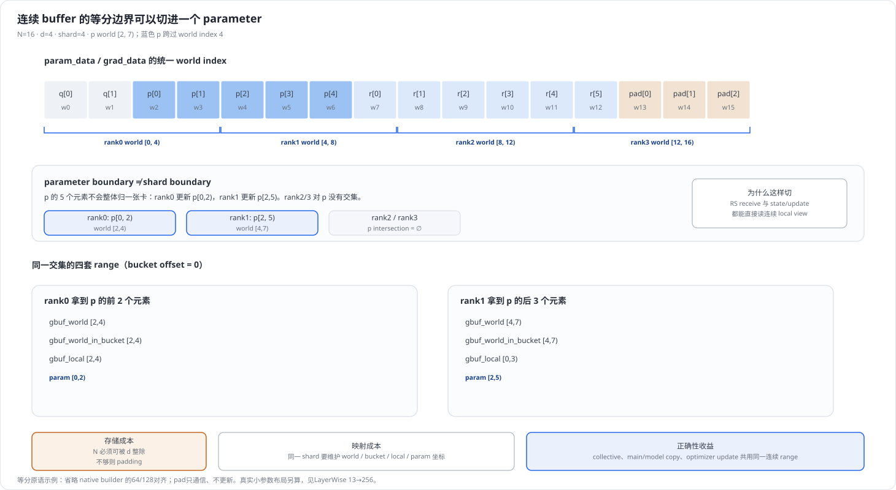
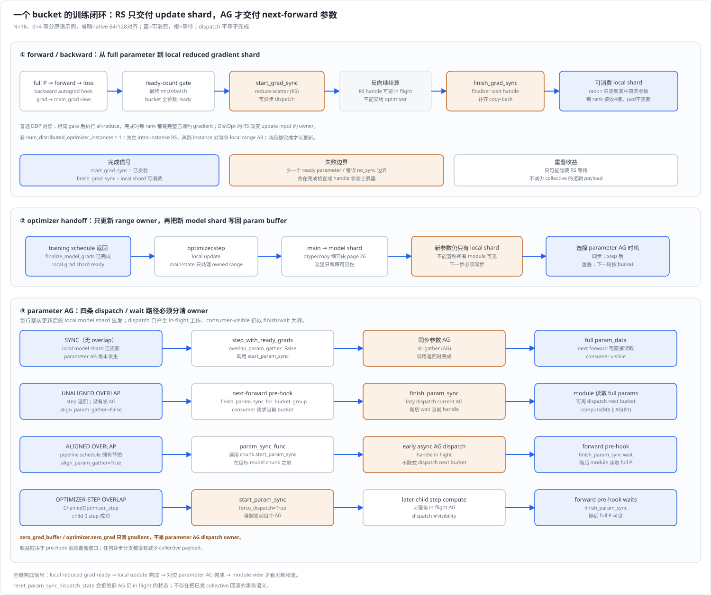
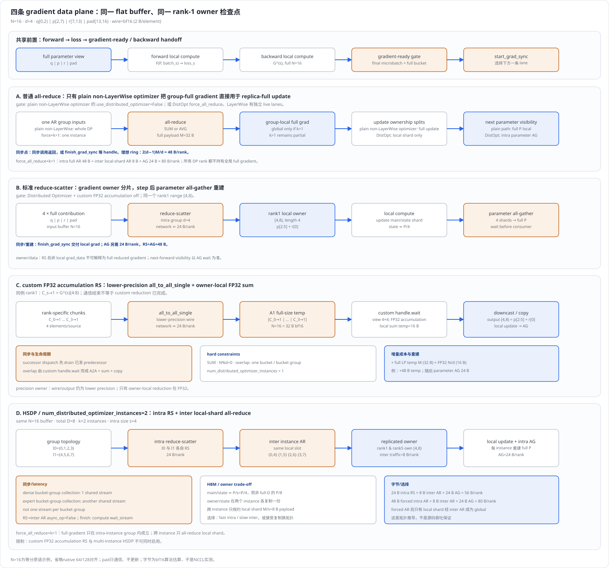
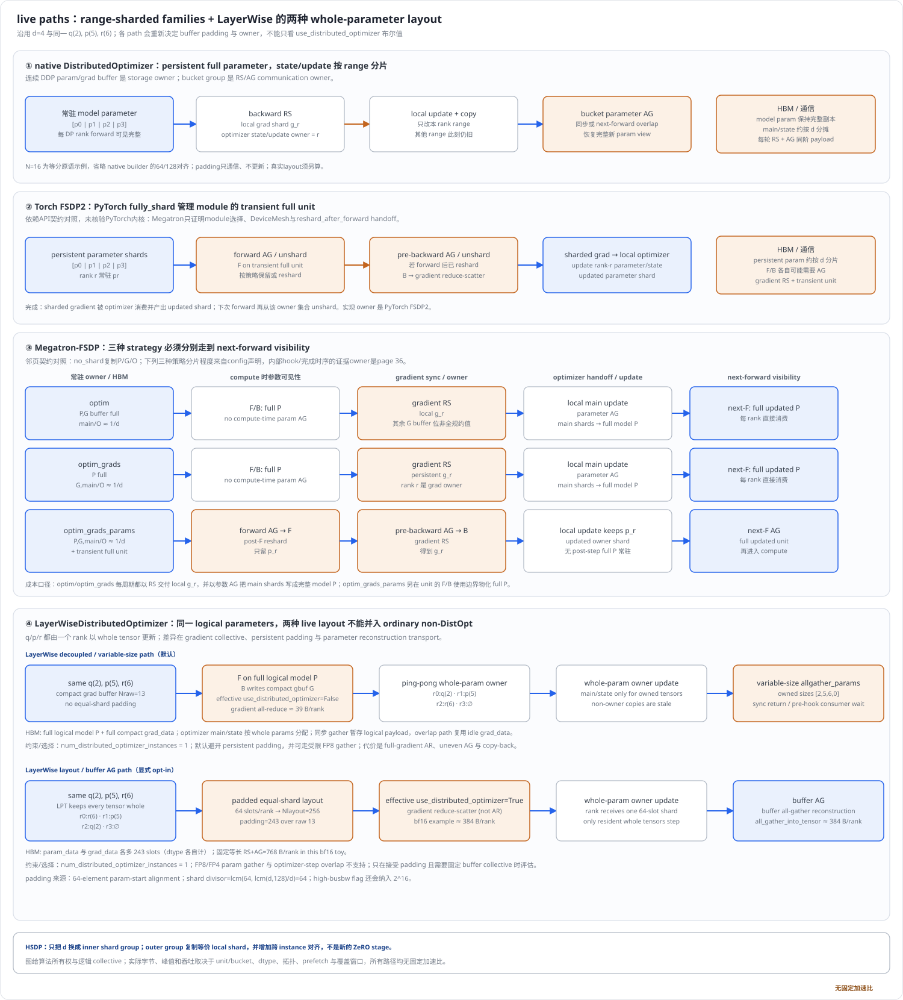
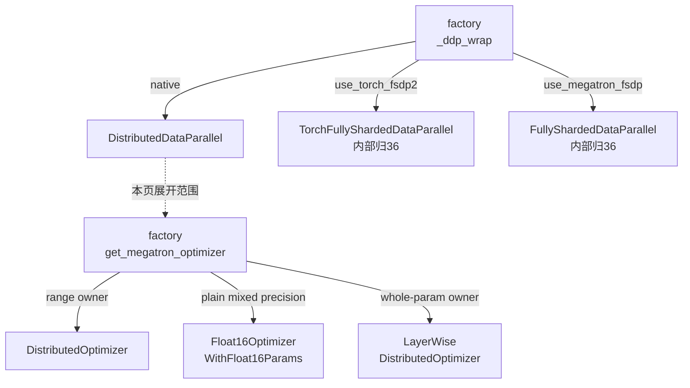
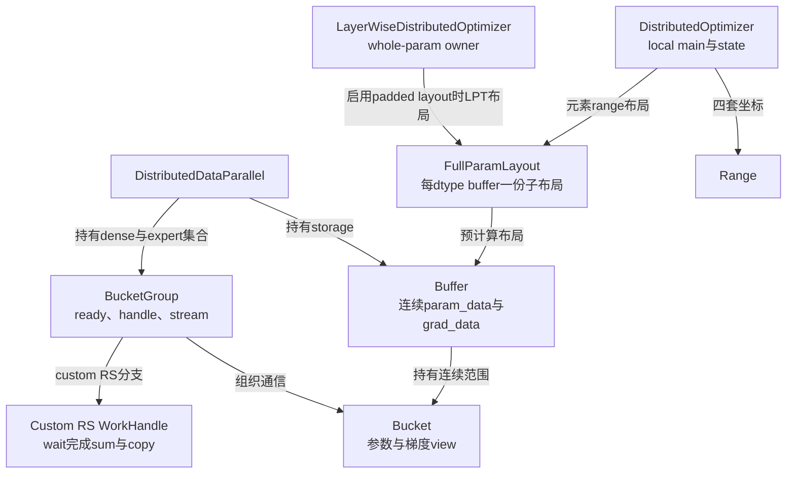

# Megatron-LM 分布式优化器与 DP 状态分片深度解析

> **源码基线**：`NVIDIA/Megatron-LM@85902ef599ea4eb06ada7567a479c524b605767a`（`dev`，2026-09-01）
> **核心源码**：`megatron/core/distributed/distributed_data_parallel.py`、`param_and_grad_buffer.py`、`reduce_scatter_with_fp32_accumulation.py`、`finalize_model_grads.py`，以及 `megatron/core/optimizer/distrib_optimizer.py`、`layer_wise_optimizer.py`、`param_layout.py`
> **中心结论**：复制模型可以把 optimizer state 与更新权交给 buffer range 的 owner：backward 后规约 owner 所需梯度，owner 更新本地片段，再发布完整参数供下一轮 forward 使用。native DistributedOptimizer 按连续元素 range 切分，LayerWise 按整个 parameter 切分；普通 AR、标准 RS、custom FP32 accumulation RS 与多 instance HSDP 的区别，必须连同梯度完成和参数可见性一起解释。
> **适用范围**：本页拥有 native DDP 的 gradient communication、flat-buffer ownership、四套 range 坐标、RS→step→AG handoff、`finalize_model_grads` 的跨域收尾，以及这些机制与多个 DistOpt instance 的组合。精度 recipe 归 [[23_megatron_precision_cudagraph_fusion_analysis]]；CPU/offload 与 optimizer 算法归 [[22_megatron_memory_optimization_analysis]]、[[26_megatron_optimizer_step_internals_deepdive]]；Torch FSDP2 与 Megatron-FSDP 内部状态机归 [[36_megatron_fsdp_analysis]]；Nonuniform TP subclass 归 [[25_megatron_nonuniform_tp_analysis]]。本页只核验它们的选择点与交接契约，不复述它们的内部实现。
> **最近更新**：2026-09-05。按最新特性页契约，从最小所有权实例展开真实选型与六条数据面，补齐 loss/backward、异步完成、布局成本和依赖边界；保留既有四图及其源码纠正。

---

## 1. 特性概览

数据并行的每个 replica 都需要完整模型来计算各自 batch，但不必各保存一份相同的 Adam main weight 和 moment，再重复做同一次更新。bf16 模型下，这些 fp32 状态约为模型参数本身的六倍；它们先于参数本身耗尽显存时，把 batch 或 bucket 切小也不能消除这份常驻重复。分布式优化器因此引入更新 owner：梯度通信把全局贡献交给 owner，owner 只更新自己的片段，参数通信再把新值发布给所有 replica；复制的 forward/backward 计算保持原有模型语义。

native 路径用连续 buffer 的等长 range 作为 owner 单位，以 reduce-scatter 交付梯度、以 all-gather 发布参数。需要整矩阵更新的 LayerWise 则保留 whole-parameter 所有权，并在 compact AR/uneven AG 与 padded RS/buffer AG 之间选布局。收益首先是减少 main/state 和重复 update；梯度传输与参数发布的总字节并不因此消失。

| 维度 | 直接收益 | 必付成本或边界 |
|---|---|---|
| optimizer state 与 main weight | 每参数常驻从约 $18$ bytes 降到约 $6+12/d$ bytes（bf16 param、fp32 grad、fp32 main、两份 fp32 Adam state 的简化账本） | 只分片 main/state；forward-facing `param_data` 与 `grad_data` 的 6 bytes 仍是完整 buffer，不随 $d$ 缩小 |
| update 计算 | 每 rank 只更新落在 owner range 内的参数片段 | 一个逻辑 `Parameter` 可由多个 rank 分段更新；clip 统计须正确计数，checkpoint 须支持重分片，见 [[26_megatron_optimizer_step_internals_deepdive]] |
| 通信 | 理想算法字节上 RS+AG 与一次 ring AR 同阶 | collective 从 1 个变成 2 个；等待点从 backward 末尾延伸到下一轮 forward 的第一个 consumer |
| 可见性 | parameter AG 可与下一轮 forward 重叠 | “已发射”不等于 consumer 可见，必须由 forward pre-hook 的 `finish_param_sync()` 收口；没有撤销 in-flight collective 的 rollback |
| 布局 | 连续 flat buffer 让一次 collective 覆盖整段，且 bucket 可按反向就绪顺序分批发射 | 64-element 的 param-start 对齐与 $\operatorname{lcm}(d,128)$ 的 bucket-end 对齐是纯 HBM 开销，`pad_buckets_for_high_nccl_busbw` 还会把 divisor 抬到含 $2^{16}$ |
| 组合 | 可与 $k>1$ 的 HSDP、custom FP32 accumulation RS、LayerWise sibling 共存 | 这些开关之间有大量硬互斥（§5.1），不是任意开关的笛卡尔积 |

后文复用的记号如下；range 下标均以元素计，字节量再乘实际 dtype 大小。

| 符号 | 含义 |
|---|---|
| $N$ | 一个 bucket 内 flat buffer 的元素数 |
| $D$ | 完整复制域大小，即 DP×CP（expert buffer 上为 expert-DP） |
| $k$ | `num_distributed_optimizer_instances`，DistOpt 实例数 |
| $s=D/k$ | 单个 DistOpt instance 的大小 |
| $d$ | 一次 full-shard 的实际 group size：DistOpt 下为 $s$，普通 AR 路径下为 $D$ |
| $M$ | 一个 bucket 在线上的 payload 字节数（按通信 dtype 计） |
| $P$ | 模型可训练参数总量 |
| $G^{(s)}$ | DP source rank $s$ 在本轮产生的完整梯度贡献 |
| AR、RS、AG、A2A | all-reduce、reduce-scatter、all-gather、all-to-all |
| LPT | Longest-Processing-Time 贪心装箱，LayerWise padded layout 的分配规则 |

---

## 2. 分布式优化器详细方案

### 2.1 最小示例：同一个具名 flat buffer 的四套 range 坐标

先把已排好的一个 bucket 作为输入：$N=16$、$d=4$，布局为 `q=[0,2)`、`p=[2,7)`、`r=[7,13)`、`pad=[13,16)`。这是隔离 range 映射的缩尺例：它保留分片、交集与发布语义，**不是当前 native layout builder 对三个小参数的实际产物**；真实 builder 还施加 64/128 对齐，见 §2.6。四条 range lane 复用此输入，LayerWise 则从同一组 logical `q(2),p(5),r(6)` 重新计算真实布局。

每个 receive/owner range 长 $N/d=4$，但只有与真实参数相交的位置进入 optimizer；padding 会参加 collective，不获得 main/state 或更新权。

| rank | world range | 与参数 `p` 的交集 | parameter-local range |
|---|---|---|---|
| 0 | $[0,4)$ | $[2,4)$ | `p[0,2)` |
| 1 | $[4,8)$ | $[4,7)$ | `p[2,5)`；同一 shard 的最后一项是 `r[0]` |
| 2 | $[8,12)$ | 空 | 空 |
| 3 | $[12,16)$ | 空 | 空 |



`DistributedOptimizer._build_model_gbuf_param_range_map` 保存四套坐标。rank 0 对 `p` 是 `gbuf_world=[2,4)`、`gbuf_world_in_bucket=[2,4)`、`gbuf_local=[2,4)`、`param=[0,2)`；rank 1 是 `[4,7)`、`[4,7)`、`[0,3)`、`[2,5)`。前三者回答 full buffer、bucket 和 receive shard 中的位置，最后一个才是逻辑 parameter 内的位置。本例 bucket offset 为 0，前两者恰好相同；换成后续 bucket，`gbuf_world_in_bucket` 必须减去 bucket offset。optimizer 据此切出 `p[2:5]`，把它的梯度交给对应 main shard，并在更新后写回 full parameter 的同一位置。

**为什么选 range。** 相比按整个 `Parameter` 指派 owner，等长 range 可以直接作为固定大小 RS/AG 的输入输出 view，避免 uneven collective 或最大整参造成的负载倾斜；代价是 `p` 被 rank 0 更新前 2 项、rank 1 更新后 3 项。这个取舍是从布局和消费者推导的设计理由。它不意味着所有 main/state 合成了一块连续存储：`_build_model_and_main_param_groups` 仍按 parameter 交集分别建 model shard、clone/cast main shard 并重写 optimizer param groups。若数学必须看完整矩阵，切开 `p` 就不再合法，§2.5 的 LayerWise 为此改用 whole-parameter owner。

### 2.2 从真实选型点建立数据面清单

本页从三个真实选择点枚举变体：`megatron/training/models/dist_utils.py::_ddp_wrap` 选择 model wrapper，`megatron/core/optimizer/__init__.py::get_megatron_optimizer` 选择更新 owner，**仅进入 native DDP 的 buffer** 再由 `_ParamAndGradBucketGroup.start_grad_sync` 选择梯度 collective。FSDP wrapper 不进入这第三个选择点，其独立数据面归 [[36_megatron_fsdp_analysis]]。因而下面先固定 native primitive 的系统位置，再解释它实际可达的变体。

`_ddp_wrap` 先选 model wrapper，再在 native DDP 分支选 parameter layout。因而 native DDP、Torch FSDP2、Megatron-FSDP 只是这个 wrapper gate 的三个分支，不是整个仓库的“完整三实现全集”。

| 选择点 | 实际对象/数据面 | 本页 owner 边界 |
|---|---|---|
| `use_megatron_fsdp=True` | `FullyShardedDataParallel`；若同时启用 Torch FSDP2 立即 `raise ValueError` | 仅列 gate 与 `data_parallel_sharding_strategy` 的取值；unit/buffer/hook/strategy 状态机归 [[36_megatron_fsdp_analysis]] |
| 否则 `use_torch_fsdp2=True` | `TorchFullyShardedDataParallel`，内部交给 PyTorch `fully_shard`/DTensor | 仅列 wrapper contract；PyTorch 内部是第三方依赖边界，见 §2.7 |
| 两者都为 false | native `DistributedDataParallel` | 本页主路径 |
| native 且 `use_layer_wise_distributed_optimizer=True` | 强制 `ddp_config.use_distributed_optimizer=True`，并把 layout 计算换成 `LayerWiseDistributedOptimizer.compute_full_param_layout` | 是 optimizer/layout 兄弟路径，不是第四个 wrapper；更新算法归 [[26_megatron_optimizer_step_internals_deepdive]] |
| 显式构造 `NonuniformTPDistributedDataParallel` | subclass 改写 nonuniform-TP 的 buffer/group 行为 | **不由上述三分支穷举**：它是同一并发轴上的第四类实体，归 [[25_megatron_nonuniform_tp_analysis]] |

`get_megatron_optimizer` 再选择普通 `DistributedOptimizer`、`LayerWiseDistributedOptimizer`、Megatron-FSDP 特例或其他 optimizer；它是第二条轴，不能与 wrapper gate 合并成“共五种 wrapper”。

这条轴还要检查实体类型：`get_megatron_optimizer` 在普通/emerging 分支之前识别 `MimoModel`，断言只有一个 model chunk，再交给 `get_mimo_optimizer`。这是异构多模块模型的独立入口，装配归 [[10_megatron_model_structure_analysis]]，逐模块 optimizer 编排归 [[26_megatron_optimizer_step_internals_deepdive]]；本文的六条 native lane 不声称穷举它的模块级组合。对已进入 native DDP 的参数，`BufferKey` 还按 param dtype、grad dtype、expert/non-expert 和 LayerWise-managed 标记分流：dense 使用 DP-CP，expert 使用 expert-DP，不能拿 dense 的 owner rank/group 直接套到 expert buffer。group 构造归 [[17_megatron_parallelism_orchestration_analysis]]，量化存储/传输形态归 [[23_megatron_precision_cudagraph_fusion_analysis]]。

在 native bucket 层，`_ParamAndGradBucketGroup.start_grad_sync` 的真实数据面清单如下。表中的 $d$ 是一次 full-shard 的 group size，$k$ 是 `num_distributed_optimizer_instances`。

| gradient 数据面 | 选择条件 | 通信与输出 owner | 完成边界 |
|---|---|---|---|
| 普通 all-reduce | **plain non-LayerWise optimizer** 的 `use_distributed_optimizer=False`；或 DistOpt 被 `force_all_reduce=True` 覆盖 | plain 路径在完整 DP group 规约 full bucket，并由每个 replica 做 full update；DistOpt override 只在 intra-instance group 规约 full bucket 且仍只更新 local range。$k=1$ 时 gradient 全局完整；$k>1$ 时只是 instance-partial full gradient，随后仅 local shard 跨 instance AR | 只有 plain non-LayerWise 路径可直接完成 replica-full update 且无需 post-step AG；DistOpt 仍以 parameter AG 重建 |
| 标准 reduce-scatter | DistOpt、未强制 AR、`reduce_scatter_with_fp32_accumulation=False` | intra-instance group 做 RS；rank $r$ 只得到自己的等长 local view | `finish_grad_sync()` 后 local shard 才可交给 optimizer |
| custom FP32 accumulation RS | DistOpt、未强制 AR、custom flag 为 true | lower-precision `all_to_all_single` 收集各 source 对 owner $r$ 的 chunk，本地 FP32 求和，再 downcast/copy 到 local view | 同步路径内部 `wait()`；overlap 路径由 custom handle 的 `wait()` 完成通信与本地求和 |
| 多 instance / HSDP | DistOpt 且 $k>1$ | intra-instance RS，再对相同 local slot 的 inter-instance group 做 local-shard all-reduce；state/update owner 在每个 instance 复制一份 | 无普通 async handle；overlap 时 dense bucket-group collection 共用一条 communication stream，expert collection 另共用一条，`finish_grad_sync()` 令 compute stream 等对应 stream |
| LayerWise decoupled | `use_layer_wise_distributed_optimizer=True` 且默认 `use_layer_wise_param_layout=False`；仅 LayerWise-managed buffer 的 effective `use_distributed_optimizer=False` | compact full gradient all-reduce；ping-pong 分配 whole-parameter owner；owner update 后 variable-size `allgather_params` 重建 | 同步 gather 返回，或 overlap 时 forward pre-hook 的 `finish_param_sync()` wait/copy-back 后，参数才可消费 |
| LayerWise padded layout | `use_layer_wise_param_layout=True`；LayerWise-managed buffer 的 effective `use_distributed_optimizer=True` | LPT 把 whole parameter 放进等长 padded shard；gradient reduce-scatter 后 owner 更新整参，再做固定大小 buffer AG | `finish_grad_sync()` 交付 owner shard；同步或 pre-hook wait 后 full padded `param_data` 才可消费 |

`use_distributed_optimizer=False` 不是“所有 rank 都做 full update”的充分条件：LayerWise decoupled 会在 `_ParamAndGradBuffer` 内把专属 buffer 的 effective flag 置 false 来选 AR，但 optimizer param group 仍只保留本 rank 拥有的 whole parameters。`training.train_step` 在保存 wgrad 的路径还可传入 `force_all_reduce=True`；这解释了为什么“配置了 DistOpt”也不能机械推出每个 bucket 一定走 RS。多 instance 分支仍会执行后续 inter-instance local-shard AR：以 $D=8,k=2$ 为例，$I_0/I_1$ 内的 full-bucket AR 只分别得到四个 source 的 partial sum，随后 rank 1/5 才在同槽位 group 上把 `[4,8)` 规约成八个 source 的 global shard。其余位置仍是各 instance 的 partial sum，**所有 DP rank 都不持有全局 full gradient**；optimizer 只消费已全局规约的 local range。

`_ParamAndGradBuffer` 是 **storage owner**：DistOpt 时创建 `param_data` 与 `grad_data`，parameter `.data`/`.main_grad` 映射为 view。`_ParamAndGradBucketGroup` 是 **communication owner**：它管理 ready count、collective、handle/stream 和本轮完成状态。两者不能互换——把通信状态挂到 buffer 上，就无法让一个 group 跨多个 buffer 合并 collective（`partition_buckets` 正是这么做的）。

### 2.3 从 forward 到 optimizer handoff 的完整时序

完整时序不是“backward 一结束就 step”：

1. full parameter view 进入 forward；`schedules.forward_step` 调用户 `forward_step_func` 得到模型输出与 `loss_func`，`forward_step_calc_loss` 在末级调用该 loss callback。`backward_step` 再由 loss（非末级则由下游传回的 output gradient）进入 autograd，产生每个 DP source 的 $G^{(s)}$。DP 不在 forward 里分片算子；它处理的是 backward 之后这些 replica 梯度的汇合。
2. `DistributedDataParallel._make_backward_post_hook` 仅在 `param.grad` 尚未被融合路径加进 `main_grad`、或 `zero_out_wgrad` 要求时执行累加，然后清空 `param.grad`；只有 `overlap_grad_reduce=True` 时注册 ready。CUDA Graph replay 可用 `_cudagraph_wgrad_ready_event` 交付异步 wgrad，`start_grad_sync` 在读取/缩放 buffer 前等待该 event；不能一概要求 Python hook 看见非空 `param.grad`。
3. `no_sync()` 令较早 microbatch 只累加、不通信，最后一个 microbatch 才增加 ready count。首批尚无 golden count，`finish_grad_sync` 发射通信，下一轮 `reset()` 把观测到的每参数次数固化；此后 `_ParamAndGradBucketGroup.register_grad_ready` 在整组 count 等于 golden count 时提前 dispatch。这允许同一 parameter 被使用多次，又避免只按“见过一次”判断过早规约。
4. schedule 的 finalizer 调 `finalize_model_grads()`；其第一步逐 chunk 调 `finish_grad_sync()`，等待 handle/stream 并完成必要 copy-back。
5. `forward_backward_func` 返回后，`training.train_step` 才调 `optimizer.step()`；`DistributedOptimizer` 只消费本 rank range。**这两者之间没有调用边**：把它们连起来的是 `train_step` 函数体的顺序，不是 `finish_grad_sync` 调用了 `optimizer.step()`。
6. local main/model shard 更新后，parameter all-gather 重建 full `param_data`；同步模式在 step 后完成。overlap 模式有三种真实 dispatch owner：未对齐时由下一轮 consumer pre-hook 懒发，对齐时由 schedule 的 `param_sync_func` 提前发，可选 step-overlap 时由 `ChainedOptimizer._step` 在首个 child step 后强制发；三者都由 forward pre-hook 在 consumer 使用前完成 wait。



`start_grad_sync()` 只表示“已经发射”；`finish_grad_sync()` 才表示 gradient shard 可消费。parameter AG 的三条 overlap 路径不能合并成一句“step 后异步发射”：

这里的完成是**后续 CUDA consumer 所在 stream 已建立正确依赖**，不承诺 CPU 返回时所有 GPU kernel 已执行完。尤其 HSDP 的 `wait_stream` 只把依赖排进 compute stream；custom handle 除等待 A2A，还在当前 stream 排入 FP32 sum/copy。Megatron 能证明这些提交与依赖顺序；NCCL 的内部算法、网络传输调度和物理完成时刻不在本页证据范围内。

| parameter AG 路径 | 真正 dispatch owner | consumer 完成边界 |
|---|---|---|
| unaligned：`overlap_param_gather=True`、`align_param_gather=False`，且未开 step-overlap | optimizer step 只更新/copy model shard，不发 AG。下一轮首次使用该 bucket 的 forward pre-hook 调 `finish_param_sync()`；若 `param_gather_dispatched=False`，它先懒 dispatch 当前 bucket 的 `start_param_sync()`，等待完成后才可选发下一 bucket | 同一个 pre-hook 完成当前 handle wait；随后 module 才读取 full `param_data`。后续 bucket 可与前面 module compute overlap |
| aligned：`align_param_gather=True` | `training.py` 将 `model_chunk.start_param_sync` 注入 `ModelParallelConfig.param_sync_func`；pipeline schedule 在目标 model chunk 之前提前 dispatch | pre-hook 调 `finish_param_sync()` 等当前 handle；`align_param_gather` 令它跳过隐式 next-bucket dispatch，发射节拍由 schedule 拥有 |
| optimizer-step overlap：`overlap_param_gather_with_optimizer_step=True` | `ChainedOptimizer._step` 在第一个 child optimizer 成功 step 后调用 `start_param_sync(force_dispatch=True)`，让 AG 与后续 child step 形成窗口；`force_dispatch=True` 绕过 DDP 对普通重复发射的抑制 | pre-hook wait；该模式同样跳过隐式 next-bucket dispatch，不能把“已发射”当作 consumer-visible |

冻结源码存在一处注释/实现冲突：`DistributedOptimizer.step_with_ready_grads` 的注释仍称首个异步 AG 由下一次 `optimizer.zero_grad()` 发起，但 `DistributedOptimizer.zero_grad` 与 `ChainedOptimizer.zero_grad` 的可执行实现都只清 gradient。本文以执行分支为准：`zero_grad_buffer` / `optimizer.zero_grad` **不 dispatch parameter AG**。`reset_param_sync_dispatch_state()` 会拒绝旧 AG 仍在 flight 的状态，没有“撤销已发 collective”的 rollback。

### 2.4 四条 range 数据面：同例逐项回放



<!-- distopt-figure-contract:start -->
> **图示同例契约（由生成器读取）**：`N=16; d=4; shard=4; q=[0,2); p=[2,7); r=[7,13); pad=[13,16); rank1=[4,8)=p[2,5)+r[0]; bf16 M=32 B; ordinary AR=plain non-LayerWise only; all-reduce=48 B; reduce-scatter=24 B; parameter all-gather=24 B; custom FP32 accumulation/all_to_all_single temp=32 B lower-precision+16 B FP32=48 B; HSDP D=8,k=2,s=4; HSDP bytes=24+8+24=56 B; force_all_reduce+k>1 bytes=48+8+24=80 B; LayerWise same logical params=q(2),p(5),r(6),raw=13; LayerWise decoupled=AR→whole-param owner update→variable-size allgather_params; decoupled owners=[q],[p],[r],[]; LayerWise layout=RS→whole-param owner update→padded buffer AG; layout owners=[r],[p],[q],[]; shard divisor=64; padded layout=4*64=256; padding=243; bf16 layout RS+AG=384+384=768 B/rank`。
<!-- distopt-figure-contract:end -->

四条 lane 都从 `q|p|r|pad` 的 full forward 和各 source 的 $G^{(s)}$ 出发，都把 rank-1 owner 的 $[4,8)=p[2,5)+r[0]$ 作为检查点。图中的通信字节是指定 bf16 toy setting（$M=32$ bytes）下的理想 ring 算法口径，不是 NCCL 实测值。§2.5 的两条 LayerWise lane 沿用同一组具名 logical parameters，但按各自规则重新布局，代价形状与本节不可比，不要并进同一张字节表。

#### 2.4.1 普通 all-reduce

**它回答的压力与上限。** 这条 lane 回答的是“完全不做状态分片时最简单的正确实现是什么”，它的上限资源是**单卡 HBM**：每个 rank 都要放下完整的 main weight 与 optimizer state，$P$ 一大就直接 OOM。它之所以还活着，是因为它是唯一不需要 post-step 参数重建的路径。

**本地计算。** 四个 rank 各自持有完整的 $G^{(s)}$，AR 后每个 rank 都拿到长度 16 的 group-full 结果，随后**在 plain non-LayerWise optimizer 下**对 `q/p/r` 的全部 13 个真实参数元素做同一次 update；3 个 padding slot 只参加通信。这条 lane 保留缩尺输入的 padding 以比较 collective，普通 DDP 实际 builder 会生成无 padding 的 compact layout。这个“全 rank 同 update”的结论只对 plain non-LayerWise optimizer 成立：forced-AR DistOpt 即使 $k=1$ 也仍只更新其 local range 并以 AG 重建；LayerWise decoupled 即使 buffer 的 effective `use_distributed_optimizer=False`，也只更新本 rank 拥有的 whole parameters 并以 variable-size AG 重建。

**上线的数据。** 若 full bucket 的 lower-precision payload 为 $M$ bytes，理想 ring 每 rank 约为

$$
B_{\mathrm{AR}}=2\frac{d-1}{d}M=\frac{3}{2}M,
$$

本例即 48 bytes/rank。

**重建。** plain 路径没有重建：AR 的输出本身就是每个 rank 都可直接消费的完整梯度，update 结束参数即可见，无 parameter AG。

**反向差异。** 这条 lane 与 backward 的耦合最松：hook 只需累加 `main_grad`，bucket ready 后一次 AR 收工，没有第二段 collective 需要等到 step 之后。

**增量成本与 forced-AR 的例外。** `force_all_reduce=True` 并不会在 $k>1$ 时把这条 AR 扩到全部 $D$ 个 rank：`start_grad_sync` 先选定 intra-instance communication group，才在 RS/AR 分支间切换；随后 inter-instance collective 始终只读取本 rank 的 cached local shard view。同例中 intra AR 是 48 bytes/rank，inter local-shard AR 是 8 bytes/rank，parameter AG 是 24 bytes/rank，共 80 bytes/rank；代价高于正常 HSDP 的 56 bytes/rank，而且任一 rank 的 non-local 区域都仍只是 instance partial sum。

#### 2.4.2 标准 reduce-scatter

**它回答的压力与上限。** 这条 lane 用 owner update 避免全副本 main/state 与重复计算。相较 full AR 后每 rank 仍只取一段，RS 直接交付要消费的 shard；但它仍保留 full model/grad buffer，参数本身放不下时就越过了它的容量边界。等长 collective 是另一条硬条件：`shard_buffer` 断言 `buffer.numel() % world_size == 0`，`pad_bucket_end` 为此补齐长度。

**本地计算。** rank 1 只收到 $\sum_s G^{(s)}[4:8)$，也就是 `p[2,5)` 加上 `r[0]`；它的 optimizer 只对这 4 个位置持有 main weight 与 Adam state，只做 4 个位置的 update。`_build_model_and_main_param_groups` 与 `_copy_model_grads_to_main_grads` 都按同一 local range 切。

**上线的数据。** 分成两段，各约

$$
B_{\mathrm{RS}}=B_{\mathrm{AG}}=\frac{d-1}{d}M=\frac{3}{4}M,
$$

即 24 + 24 bytes/rank。理想总字节与 AR 同阶，但 owner、等待位置和 HBM state ownership 都不同。

**重建。** 本地 update 后必须用 parameter all-gather 把四个新 shard 拼回完整 `param_data`，否则下一轮 forward 的 `param.data` view 里有四分之三是旧值。**RS 后不能把 `grad_data` 的非 local 区域当作完整已规约梯度**——那里留下的是本 rank 自己的贡献，不是全局和。

**反向差异。** 与 AR lane 相比，这条 lane 把一个 collective 拆成横跨 step 的两个：RS 在 backward 尾部，AG 在 step 之后甚至下一轮 forward 里。因此它多出一个“参数可见性”概念，也多出 §2.3 那三种 dispatch owner。

**增量成本。** 每轮多一次 collective 发射与一次等待；`param_data` 与 `grad_data` 仍是全长 buffer，省下的只是 main/state 的 12 bytes/param 中的 $(d-1)/d$。

#### 2.4.3 custom FP32 accumulation RS

**它回答的压力与上限。** 它回答的是“低精度线上传输会让规约本身损失精度”这一压力，上限资源是**临时 HBM**：为了在 owner 侧做 FP32 求和，必须先把各 source 的 chunk 原样收进本地。

`megatron/core/distributed/reduce_scatter_with_fp32_accumulation.py::reduce_scatter_with_fp32_accumulation` 不调用标准 RS。以 owner rank 1 为例，source $s$ 提供

$$
C_{s\to1}=G^{(s)}[4:8),\qquad
A_1=[C_{0\to1}\mid C_{1\to1}\mid C_{2\to1}\mid C_{3\to1}].
$$

**上线的数据。** `all_to_all_single` 以 input dtype 传输，把 $A_1$ 收进一个与 full input 同形状的 lower-precision 临时 tensor。DDP config 的说明明确把“低精度传输、FP32 累加、与标准 ring 同阶通信开销”作为目标；相较先把整个 gradient 升为 FP32 再做 RS，这个实现保住了低精度 payload，付出的资源是 A2A 接收暂存与 owner 求和。这里没有展开 PyTorch/NCCL 的 A2A 内部算法。

**本地计算与重建。** custom handle 的 `wait()` 将临时 tensor view 为 $4\times4$，执行

$$
\widehat g_1=\operatorname{cast}_{\mathrm{wire}}\left(
\sum_{s=0}^{3}\operatorname{fp32}(C_{s\to1})
\right),
$$

再 copy 到既有 local output view `[4,8)`。于是“线上的 lower precision”和“求和时的 FP32 accumulation”同时成立；最终 local shard 仍回到 output dtype，并继续普通 local update→parameter AG——**重建段与 §2.4.2 完全相同**，这条 lane 只替换了 RS 的实现。

**反向差异。** 与标准 RS 相同：backward hook 与 ready-count 逻辑不变，唯一区别是 overlap 时 `grad_reduce_handle.wait()` 同时完成 A2A、FP32 sum 和 downcast/copy，故不能只等底层 NCCL handle。

**增量成本。** 除已有 input/output view 外，每个 rank 暂持一个 $N$ 元素 lower-precision `all_to_all_output_tensor`，并在 `wait()` 产生一个 $N/d$ 元素 FP32 sum。本例 wire 为 bf16 时 $M=32$ bytes，额外临时量是 $32+4\times4=48$ bytes；其中 full-size 32 bytes 会一直活到 `wait()`。

| custom hard constraint | 源码行为 |
|---|---|
| only SUM | reducer 入口断言 `op == ReduceOp.SUM`；所以 `average_in_collective=True` 会把 op 改为 AVG，并在运行时冲突 |
| 整除 | `input_tensor.numel() % world_size == 0`；本例 $16\bmod4=0$ |
| overlap 时一个 bucket / bucket group | async custom handle 不受 `_coalescing_manager` 正确等待，`start_grad_sync` 在 `async_op` 分支断言本 group 的 `len(buckets)==1`；`partition_buckets` 也避免 FP8 merge。同步 custom reducer 在调用内完成 wait，不经过这条断言；它更不是“整个模型只能一个 bucket” |
| $k=1$ | `_ParamAndGradBucketGroup.__init__` 拒绝 custom 与多个 DistOpt instance 同时启用 |
| 前驱 drain | successor dispatch 前若 predecessor 已有 handle，先调 predecessor `finish_grad_sync()`；这让前一 full-size A2A 临时 buffer 在后一条分配前释放/可释放 |

实现和单元测试都覆盖 `async_op=True/False`；函数 docstring 中“Only False”是过时说明，本文以可执行分支及 `tests/unit_tests/distributed/test_reduce_scatter_with_fp32_accumulation.py::TestReduceScatterWithFP32Accumulation.test_reduce_scatter_with_fp32_accumulation` 为准。

#### 2.4.4 多 instance / HSDP

**它回答的压力与上限。** 它回答的是“$D$ 很大时，跨慢域做整段 RS/AG 不划算”，上限资源是**单卡 HBM 与慢域带宽的取舍**：instance 越少省显存、越多省跨域流量。

仍用 $N=16$，把总复制域改为 $D=8$、`num_distributed_optimizer_instances` $k=2$，则每个 intra instance 大小 $s=D/k=4$：

- $I_0=\{0,1,2,3\}$，$I_1=\{4,5,6,7\}$ 做各自的 intra-instance reduce-scatter。
- inter-instance groups 连接相同 local slot：$\{0,4\}$、$\{1,5\}$、$\{2,6\}$、$\{3,7\}$。
- **本地计算**：rank 1 与 rank 5 都先拿到各自 instance 对 `[4,8)` 的 partial sum，再在 group $\{1,5\}$ 上对这个 local shard 做 all-reduce；两者最终都有八个 source 的全局 sum，并各自做同一次 4 元素 update。
- **重建**：main parameter、optimizer state 与 update ownership 在两个 instance 各复制一份；parameter AG 只在各自 $s=4$ 的 instance 内重建 full `q|p|r|pad`，不跨 instance。

这些名单是 collective 的复演输入，实际构造不能外推为 dense/expert 各建一套 inter 组：`initialize_model_parallel` 对 dense DP×CP 只切 intra 组，对 expert DP 用 `create_hierarchical_groups` 建 intra/inter；`get_inter_distributed_optimizer_instance_group` 返回这一个 expert inter 组，供 attention/dense 与 expert 共享。两类 intra 大小可以不同，具体组来源与同 rank 对照见 [[17_megatron_parallelism_orchestration_analysis]] §2.3。

**上线的数据。** 在 bf16 $M=32$ bytes 的同例里，每 rank 的理想算法字节为：intra RS $3M/4=24$ bytes，inter local-shard AR $2(k-1)(M/s)/k=8$ bytes，intra parameter AG $3M/4=24$ bytes，总计 56 bytes。单一 $D=8$ shard domain 的 RS+AG 也是 $28+28=56$ bytes；**HSDP 改变的是流量落在哪层网络与两段 collective 的 latency/排序，不保证减少总算法字节**。

**反向差异。** backward 侧多出一段串行：同一个 bucket group 的 intra RS 与 inter AR 依次排队，`register_grad_ready` 触发的是这一对而不是单个 collective。

**增量成本。** HBM 反向变化：state/main shard 从单 instance 的约 $P/D$ 变为 $P/s$，本例是两倍；收益是跨 instance 的慢域只传 $M/s=8$ bytes 的 local shard payload，而非 full $M$。这是从分组和 payload 推导的选型结论，不是源码给出的吞吐保证：当 instance 内链路快、instance 间链路慢，或需要保留一层 state replica 时值得评估；同域网络、模型很小或 launch latency 主导时，两阶段同步可能更差。

`overlap_grad_reduce=True` 时，这条路径把 intra RS 与 inter AR 依次放到 collection-level `communication_stream`：`DistributedDataParallel.__init__` 对 dense `bucket_groups` 集合创建一条 stream、对 `expert_parallel_bucket_groups` 集合另创建一条，再把同一对象赋给集合内所有 bucket group，**不是每个 bucket group 独占一条 stream**。对应 stream 先等 compute stream；collective 本身使用 `async_op=False`，所以同一 collection 的 bucket groups 与每组内部 RS→AR 都按该 stream 排队。`finish_grad_sync()` 再令当前 compute stream `wait_stream()`。未开 overlap 时两段就在当前 stream 同步执行。

#### 2.4.5 四条 lane 在同一例子上的账

| lane | 每 rank 上线字节（bf16, $M=32$） | update 覆盖 | 需要 parameter AG | 额外临时 HBM | 关键上限 |
|---|---|---|---|---|---|
| 普通 all-reduce（plain non-LayerWise） | 48 | 全部 13 个真实参数元素 | 否 | 无 | 单卡放得下完整 main/state |
| 普通 all-reduce（forced-AR DistOpt，$k=2$） | 48 + 8 + 24 = 80 | 仅 local range | 是 | 无 | 非 local 区域仍是 instance partial sum |
| 标准 reduce-scatter | 24 + 24 = 48 | 仅 local range | 是 | 无 | bucket 长度必须被 $d$ 整除 |
| custom FP32 accumulation RS | 同标准 RS 同阶 | 仅 local range | 是 | +48（32 full-size A2A + 16 FP32 sum） | only SUM、$k=1$；overlap 时每 group 一个 bucket |
| 多 instance HSDP（$D=8,k=2$） | 24 + 8 + 24 = 56 | 仅 local range，每 instance 各一份 | 是（instance 内） | 无 | state 常驻从 $P/D$ 抬到 $P/s$ |

两条可以直接读出来的结论：**其一**，RS+AG 与 AR 的理想算法字节同阶，DistOpt 省的是 HBM 与冗余 update，不是通信量；**其二**，四条 lane 里只有第一条不需要参数重建，其余三条都必须把“可见性”当成一个独立的完成边界来管理——这正是 §2.3 三种 dispatch owner 的由来。

### 2.5 两条 LayerWise whole-parameter 数据面

LayerWise 是 `get_megatron_optimizer` 的 live sibling，不是 ordinary non-DistOpt 的别名。命令行对 emerging optimizer 会把全局 `use_distributed_optimizer` 改写为 false 并打开 `use_layer_wise_distributed_optimizer`；随后 `_ddp_wrap` 又把 native DDP config 置 true，以便 non-LayerWise sibling buffers 继续走连续元素分片的 DistOpt，并调用 `LayerWiseDistributedOptimizer.compute_full_param_layout`。最终 collective 由**每个 buffer 的 effective config** 决定。

**它们回答的压力与上限。** 两条 lane 回答的是同一件 §2.1 里被 range 切法牺牲掉的事：Muon 这类算法要对**整个矩阵**做正交化，只持有半个参数不足以完成整矩阵操作。因此它们首先受 **whole-parameter 不可分割**约束；两条 lane 的分歧是如何在完整梯度、通信形状和 padding 成本之间取舍。此处只跟踪 Megatron 给 child optimizer 的 whole-tensor contract，emerging-optimizers 内部计算归 [[26_megatron_optimizer_step_internals_deepdive]]。

继续使用同一组具名参数 `q(2),p(5),r(6)`；先移除常规 range-shard 为整除而加的 synthetic `pad[13,16)`，所以 raw logical size 为 13。

#### 2.5.1 decoupled（默认，`use_layer_wise_param_layout=False`）

**本地计算与 gradient handoff。** 每 rank 保留 full logical model parameters；只有 `grad_data` 是 compact 13-element contiguous buffer。LayerWise buffer 的 effective `use_distributed_optimizer=False`，backward-ready 后对 full compact gradient 做 all-reduce。bf16 toy 的 payload 是 26 B，理想 ring AR 是 39 B/rank。

**whole-param owner 与 step。** `_shard_params_ping_pong` 先按 `(numel, canonical identity)` 排序，再 ping-pong 分配：rank0 拥有 `q(2)`、rank1 `p(5)`、rank2 `r(6)`、rank3 为空；只有 owner 持有相应 main/state，并对整个 tensor update。

**重建。** 无 overlap 时 `step_with_ready_grads()` 后调用 variable-size `allgather_params`；各 source 的 input size 为 `[2,5,6,0]` elements（bf16 `[4,10,12,0]` B），unflatten/copy 后每 rank 重建 13-element logical `P`。overlap 时 bucket `start_param_sync` 做同形状 uneven AG，forward pre-hook `finish_param_sync()` wait 后 copy-back。

**反向差异。** 它默认在 backward 侧走 full-size AR，且 forward 不需要临时 unshard；通信结束后每个 whole owner 能直接从完整梯度中取出整参。相比 padded RS，它用 full-gradient AR 换掉 equal-shard padding；这并非通信原语只剩 AR 可选，而是冻结实现的 compact-layout 取舍。forced-AR DistOpt 也可走 full AR，区别在于后者仍只更新任意 range。

**增量成本与选择条件。** 无 equal-shard persistent padding；同步 `allgather_params` 会创建约一个 logical payload 的 receive/flatten 临时量，overlap 分支复用 backward 后 idle 的 `grad_data` 作 receive buffer。后者在 `_finalize_layerwise_param_sync` 完成 unflatten/copy 后必须清零 `grad_data`，否则下一轮 `main_grad` 累加会从参数值起算；只 wait 通信而不 copy/zero 还不算参数发布完成。选它来避开 padded HBM，且这是受限 FP8 param gather 的可用 LayerWise 形态；代价是 full-gradient AR、uneven AG/copy 与 owner 负载不均（本例 rank3 完全空闲）。`validate_args` 另要求该布局下 `num_distributed_optimizer_instances == 1`——非 DistOpt 的 LayerWise buffer 只在单个 instance 内 AR，$k>1$ 会让 Muon 梯度跨 DP 域欠规约。Megatron 在此能证明各 rank 的 tensor sizes、`torch.distributed.all_gather` 调用和 copy-back；uneven gather 在 NCCL 内部怎样拆消息只是源码注释描述的依赖契约，本页未核验其内部实现。

#### 2.5.2 padded layout（显式 `use_layer_wise_param_layout=True`）

**本地计算与 gradient handoff。** `_compute_per_buffer_param_layout` 以 LPT 把整参放进 shard：rank0=`r(6)`、rank1=`p(5)`、rank2=`q(2)`、rank3=空；每 shard 再对齐到 `_shard_divisor` 给出的 64 elements（$\operatorname{lcm}(64,\operatorname{lcm}(d,128)/d)$，$d=4$ 时为 64），所以本例 `N_layout=4×64=256`。effective `use_distributed_optimizer=True`，gradient 走 reduce-scatter，**不是 AR**。

**whole-param owner 与 step。** RS 后每 rank 收到一个 64-slot shard，但其中只有完整 tensor 是 optimizer param；owner 更新整参，padding 不进入 optimizer state。

**重建。** `use_buffer_param_sync=True`；`start_param_sync_for_bucket_group_subset` 只触发 LayerWise-managed groups，底层 `all_gather_into_tensor` 把四个更新 shard 重建为 full padded `param_data`。bf16 toy 的 RS 与 buffer AG 各 384 B/rank。

**反向差异。** 与 §2.4.2 的标准 RS 结构相同——backward 尾部一次等长 RS、step 之后一次等长 AG；差别只在 shard 内容是若干完整 tensor 而不是任意连续元素 range。

**增量成本与选择条件。** 每个 `param_data` 和 `grad_data` 各多 243 slots，按各自 dtype 计 HBM；同步返回或 consumer pre-hook wait 才可读。只有接受 64-start / bucket-end padding 且需要 fixed-size buffer RS/AG 时才评估；`pad_buckets_for_high_nccl_busbw` 还会放大 divisor。

LPT 的瓶颈是不可切分的大参数：一个 shard 至少要容纳 chunk 中最大的 tensor，其他 shard 必须补到同长。源码因此不只看 `bucket_size`，还把收桶阈值抬到 `max(bucket_size, int(d * chunk_max_param * 0.9))`，尝试多收整参以填满其他 shard；最后一个 chunk、shared embedding 隔离桶和 64 对齐仍可产生大比例 padding，所以这不是“padding 保证低于 11%”。本例 `q/p/r` 的 13→256 正展示小参数/空 owner 时该启发式无法消除的固定对齐成本。

#### 2.5.3 两条 lane 的共同边界

两条路径的 LayerWise-managed tensors 都只由一个 rank 以 whole shape 更新；non-LayerWise embeddings/bias/layernorm buffers 仍由 sibling `DistributedOptimizer` 做元素 range 的 RS→update→AG，`partition_buckets` 会按 effective flag 拆开 AR/RS groups——一个 bucket group 内不允许混用两种 effective `use_distributed_optimizer`。当前 factory split path 断言 `num_distributed_optimizer_instances=1`，LayerWise 与 `overlap_param_gather_with_optimizer_step` 由 `_get_megatron_emerging_optimizer` 的一条 `assert` 判为不兼容；padded layout 还拒绝 FP8/FP4 param gather，decoupled 则只接受 mxfp8/blockwise 的 fp8 gather。因而选型不是“AR 或 RS 哪个字节少”单轴，而是 compact full-gradient/uneven reconstruction 与 padded equal-shard collectives 之间的 HBM、copy、负载与 latency 权衡。

### 2.6 bucket、padding 与精度开关不是装饰项

#### 2.6.1 bucket 数量与 group 数量

| 配置/机制 | 活跃行为 | 边界 |
|---|---|---|
| `bucket_size=None` | 未显式给值时 `_ddp_wrap` 取 `max(40_000_000, 1_000_000 * dp_cp_size)`；`overlap_grad_reduce=False` 时又置回 `None`，DDP 在非首 PP stage 或 `disable_bucketing=True` 时再置回 `None` | `None` 使一个 buffer 不按阈值拆分；不等于“不通信” |
| `num_buckets=n` | `_ddp_wrap` 以全模型 `num_parameters // n` 写回 `bucket_size` | 是粗略目标；参数不能任意切成 bucket，padding 也改变最终长度，因此实际 bucket 数不保证恰好为 $n$ |
| 二者互斥 | config `__post_init__` 断言不能同时指定，且 `num_buckets>0` | 启动期 hard error |
| reverse layout | `DistributedOptimizer._compute_per_buffer_param_layout` 按反向参数顺序装 bucket；shared embedding 单独结束 bucket | 让后向先 ready 的尾层更早通信；不是运行时动态重排 |
| bucket group | 无 FP8 时通常一 bucket 一 group；FP8 可把 non-FP8 buckets 合到最后一个 FP8 group；disable-bucketing 可跨 buffer 合组 | group 必须共享同一种 effective `use_distributed_optimizer`；LayerWise 混合路径会拆开 AR/RS |

`bucket_size` 越小越早 ready、越容易覆盖 backward，但 launch/latency 与 metadata 增多；越大越接近带宽效率，却把 dispatch 推迟。源码默认值只编码“较大 DP 需要较大 chunk”的启发式，不是模型无关最优值。

#### 2.6.2 padding 的两层约束

`megatron/core/optimizer/param_layout.py::pad_param_start` 把每个 parameter start 对齐到 64 elements。`pad_bucket_end` 把 bucket end 对齐到

$$
\operatorname{lcm}(d,128)
$$

的倍数；`pad_buckets_for_high_nccl_busbw=True` 时再把 $2^{16}$ 纳入 LCM。前者给 parameter placement，后者保证 shard divisibility 并可为大 DP 的 NCCL chunk 对齐付出额外 HBM。`_ParamAndGradBuffer._new_bucket` 再断言 DistOpt bucket 的 start/end 都能被 DP size 整除；非 DistOpt 默认 layout 则不应凭空带 DistOpt padding。

#### 2.6.3 三种“FP32”要分开

| 开关 | 本地累加 | wire/collective | 额外存储与约束 |
|---|---|---|---|
| `grad_reduce_in_fp32=True` | `main_grad` buffer 本身是 FP32 | 整个 AR/RS buffer 以 FP32 通信 | 更高持久 gradient HBM 与网络 payload；详细精度取舍归 [[23_megatron_precision_cudagraph_fusion_analysis]] |
| `param_name_patterns_for_fp32_local_accumulation` | 匹配 `fnmatch`（或特殊值 `all`）的 parameter 获得独立 FP32 `main_grad` | collective 前 copy 到原通信 buffer，完成后 copy-back | 每个匹配参数多一份 FP32 tensor；若 `grad_reduce_in_fp32` 已 true，config 直接断言 |
| `reduce_scatter_with_fp32_accumulation=True` | 不改变前面 microbatch 的本地累加 dtype | lower-precision A2A，owner 本地 FP32 sum，再 downcast | full-size A2A 临时 buffer、local FP32 sum；SUM、$k=1$，overlap 时每 group 一个 bucket，见 §2.4.3 |

`average_in_collective=False` 时 dense/expert gradient 预先按 $1/\lvert DP\!\times\!CP\rvert$ 缩放，再做 SUM；为 true 时 dense 用 AVG，expert 先按 $\lvert EDP\rvert/\lvert DP\!\times\!CP\rvert$ 缩放再在 EDP 做 AVG。`calculate_per_token_loss=True` 则 scaling factor 为 1，并禁止 collective AVG，最后由全局 token count 统一缩放。

### 2.7 开销结算与 RS→step→AG 的所有权闭环

在常见的 bf16 model parameter（2 bytes）、fp32 gradient（4）、fp32 main parameter（4）和两份 fp32 Adam state（8）的简化账本里，普通复制约为每参数 18 bytes，native DistOpt 约为 $6+12/d$ bytes：forward-facing model parameter 与 grad buffer 的 6 bytes 仍完整，main/state 的 12 bytes 随 owner range 分片。它不是所有 dtype/optimizer 的常数；padding、per-parameter FP32 local accumulation 和 custom A2A 临时量都要另加。

汇总到一次迭代，需一起支付：完整 model/gradient buffers、owner main/state、layout padding、custom A2A 或 LayerWise gather 暂存，以及 RS/AR→update→AG 的 launch 与等待。§2.4 的字节表刻意统一 gradient/parameter wire dtype；真实配置可能不同，理想 ring 的标准路径应分别计 $B_{\mathrm{RS+AG}}=(d-1)(M_{\mathrm{grad}}+M_{\mathrm{param}})/d$，不能把 fp32 gradient 与 bf16 parameter 都套成同一个 $M$。吞吐还取决于 ready 时间、网络分层、owner 负载和等待能否被计算覆盖，本页没有硬件实测保证。

`DistributedOptimizer._build_model_and_main_param_groups` 只把本 rank range 对应的 model/main shard 交给基础 optimizer；`_copy_model_grads_to_main_grads` 同样切 local range。具体 unscale、clip、Adam/SGD/Muon、master weight 和 offload 属于 [[26_megatron_optimizer_step_internals_deepdive]] 与 [[22_megatron_memory_optimization_analysis]]，这里的唯一必要事实是 update 只修改 owner shard。

`DistributedOptimizer.step_with_ready_grads` 随后把更新后的 main shard copy 回 model shard。未启用 `overlap_param_gather` 时立即同步 all-gather；启用后按 §2.3 的三种 owner 把 AG 流水到下一轮。unaligned 链是 `forward pre-hook → finish_param_sync 懒 dispatch/wait AG(B0) → compute(B0) ∥ AG(B1)`；aligned 链由 schedule 的 `param_sync_func` 提前 dispatch；optimizer-step overlap 链由 `ChainedOptimizer._step → start_param_sync(force_dispatch=True)` 发起。payload 没有消失，只是 dispatch/wait 的 owner 与等待位置改变。

当 `overlap_param_gather` 与 `align_param_gather` 同时开启时，`megatron/training/training.py` 把各 model chunk 的 `start_param_sync` 装入 `ModelParallelConfig.param_sync_func`。pipeline schedule 以“待同步 parameter iterable”为参数调用它：interleaved/VPP 路径先给前两个 chunk 发起 AG，并按 virtual-microbatch 位置提前 dispatch 后续 chunk，使 PP peers 尽量在相近时刻占用通信资源。这个 callback 只注入“何时开始”；它不替代 bucket 的 forward pre-hook/`finish_param_sync`，也不把 in-flight parameter 变成 consumer-visible。forward-only 与首次安全启用阶段还会暂时把 callback 置空，避免误发同步。



这张边界图把三种 wrapper contract 与两个 LayerWise optimizer/layout sibling 放在同一张图，但两条选择轴仍不能混为“共五种 wrapper”：

- native DistributedOptimizer：persistent full model parameter，gradient RS 交付 local update range，step 后/next-forward parameter AG 恢复完整 view。**本页源码可逐步证明这一条的全程。**
- Torch FSDP2：persistent parameter shard；wrapper 只负责选择包装哪些 module，并把 forward/pre-backward unshard、reshard 与 DTensor 生命周期交给 PyTorch。`pre-backward AG / unshard → gradient reduce-scatter → sharded grad → local optimizer` 是 PyTorch `fully_shard` 的**已发布契约**，不是本页读过的执行路径；Megatron 侧能证明的只有 wrapper 选择与交出去的 module 集合，内部 owner 归 [[36_megatron_fsdp_analysis]]。
- Megatron-FSDP 的 `data_parallel_sharding_strategy` 有 `no_shard`、`optim`、`optim_grads`、`optim_grads_params` 四个合法取值；`optim` 每 rank 常驻完整 $P$ 与 full-size gradient buffer、main/state 分片，`optim_grads` 额外把 $G$ 分片，`optim_grads_params` 把三者都分片并在 forward/backward 前各做一次 AG。**这四个取值与它们声明的分片程度是配置字段事实**；hook 触发点、reshard/prefetch 时机与内部状态机不在本页证据范围内，归 [[36_megatron_fsdp_analysis]]。
- `LayerWiseDistributedOptimizer` decoupled：compact full-buffer AR → ping-pong whole-param owner update → non-overlap `allgather_params` 或 overlap variable-size bucket AG/copy-back；不能由“effective DistOpt=false”推成 replica-full update。
- `LayerWiseDistributedOptimizer` padded layout：`compute_full_param_layout` 的 LPT whole-param placement → padded buffer RS → whole-param owner update → buffer AG；本例 padding 与等待边界见 §2.5。它与普通 DistOpt sibling buffers 可同存，optimizer 数学与适用 emerging optimizer 归 [[26_megatron_optimizer_step_internals_deepdive]]。

ZeRO-0/1/2/3 只适合作为复制程度的语义标签。native DistOpt 最接近 optimizer-state sharding，但其 full `param_data`/`grad_data` 生命周期不能被一句“就是 ZeRO-2”覆盖；Megatron-FSDP 的四个 strategy 才是显式字段。HSDP 又是在 inner shard domain 外保留 replica，不是第五个 ZeRO stage。

---

## 3. 代码实现分析

### 3.1 类与所有权

先读选择视图：`_ddp_wrap` 与 `get_megatron_optimizer` 是两个模块级 factory 函数，实线表示选择结果；虚线只限定本页继续展开的 native 范围，不代表 DDP 调用了 optimizer factory。Torch FSDP2 与 Megatron-FSDP 的内部所有权归36，不进入下一张 native 视图。



再读 native 所有权视图。`Buffer`、`Bucket`、`BucketGroup`、`Custom RS WorkHandle` 分别是 `_ParamAndGradBuffer`、`_ParamAndGradBucket`、`_ParamAndGradBucketGroup`、`_ReduceScatterWithFP32AccumulationWorkHandle` 的图中简称；每条边只表示标出的布局输入或持有关系，不表示完整调用顺序。连续 storage、通信完成状态与 optimizer owner 是三个不同责任。



图外仍保留这些类型与连接事实：`MixedPrecisionOptimizer`、`ChainedOptimizer` 都继承 `MegatronOptimizer`；`DistributedOptimizer` 与 `Float16OptimizerWithFloat16Params` 继承前者，`LayerWiseDistributedOptimizer` 继承后者；`NonuniformTPDistributedDataParallel` 继承 `DistributedDataParallel`。`FullParamLayout` 持有每个 dtype buffer 的 `PerBufferParamLayout`。LayerWise 组织 `Float16OptimizerWithFloat16Params` child，`ChainedOptimizer` 可持有 sibling `DistributedOptimizer`。

`_ddp_wrap` 会改写 `DistributedDataParallelConfig` 的 bucket/layout 字段，buffer 再计算自己的 effective flags。`DistributedOptimizer` 把 local range 映射到 buffer view；它和 LayerWise 分别按自己的 bucket 子集触发 parameter sync。模块级函数 `finalize_model_grads` 先调用 DDP 的 `finish_grad_sync`，再做跨域补规约；它不是类，也不持有本轮通信状态。具体责任仍按下表阅读。

| 层次 | 责任 | 不负责什么 |
|---|---|---|
| `_ddp_wrap` / `get_megatron_optimizer` | 两条选择轴：决定 wrapper、parameter layout 计算器与 optimizer 类；DDP 初始化有 side-stream 依赖，随机 DP 初始化还可 broadcast 参数 | 不拥有每轮 ready/handle；选择结果须交给 buffer 和 bucket group 才成为训练数据面 |
| `DistributedDataParallelConfig` | 声明精度、bucket、instance 数与 layout 开关，并在 `__post_init__` 做互斥校验 | 不知道谁是 owner；per-buffer effective flag 由 buffer 自己算 |
| `_ParamAndGradBuffer` | **storage owner**：连续 `param_data`/`grad_data`、两层 padding、参数 view、per-buffer effective `use_distributed_optimizer` | 不管理 handle、stream 或本轮完成状态 |
| `_ParamAndGradBucketGroup` | **communication owner**：ready count、AR/RS/A2A 分支、group 内 local-rank shard view、inter-instance AR、handle/stream、parameter AG 的 dispatch 与 wait | 不把 range 解释为参数级 main/state，也不做 optimizer 数学 |
| `param_layout.py` 的 `pad_param_start` / `pad_bucket_end` / `FullParamLayout` | 把“参数从哪开始、bucket 到哪结束”固化成可被 DDP 与 optimizer 共享的布局 | 不选择 bucket 数量策略，也不决定 shard owner |
| `DistributedOptimizer` | 四套 range 坐标、local main/state 分配、`_copy_model_grads_to_main_grads`、step 后 copy-back 与 parameter AG 触发 | 不实现 Adam/Muon 本身，不实现 clip/unscale 的数值细节 |
| `LayerWiseDistributedOptimizer` | whole-parameter owner 分配（ping-pong 或 LPT）、LayerWise buffer 的 param sync 子集、`allgather_params` | 不接管 non-LayerWise buffer；那些仍归 sibling `DistributedOptimizer` |
| `finalize_model_grads` | step 前把所有跨 stage / 跨域的补规约做完，并按 token 数缩放 | 不做 DP shard 内的 update，也不负责参数可见性 |

### 3.2 调用流程

**一次迭代的 gradient 路径。** 取 `PP=1`、native bf16 DistOpt、普通 eager autograd 且无梯度 buffer 复用作为可逐符号跟读的主路径；`forward_backward_func` 在此绑定 `forward_backward_no_pipelining`。PP/VPP 的外层排程归 [[15_megatron_pp_schedulers_analysis]]，同样经 finalizer 交出梯度。方括号是条件，`transitive` 明示省略的引擎跳；schedule 与 `optimizer.step()` 只有 `train_step` 函数体内的顺序关系。

```text
megatron/training/training.py::train_step
|
+-- model_chunk.zero_grad_buffer()                      (清 grad_data，不发 parameter AG)
+-- optimizer.zero_grad()                               (清 main/model grad，不发 parameter AG)
|
+-- forward_backward_func = forward_backward_no_pipelining
|   +-- forward_step
|   |   +-- forward_step_func(...)                     (用户 callback 调模型)
|   |   `-- forward_step_calc_loss -> loss_func(output_tensor)
|   +-- backward_step
|   |   `-- torch.autograd.backward -> [transitive: autograd engine] DDP backward hook
|   |       +-- [尚未累加] param.main_grad.add_(param.grad.data)
|   |       `-- [overlap_grad_reduce] _ParamAndGradBucketGroup.register_grad_ready
|   |           `-- [ready count 达标 且 is_last_microbatch] start_grad_sync
|   |               +-- [predecessor 有 handle] previous_grad_reduce_bucket_group.finish_grad_sync
|   |               +-- [DistOpt 且 not force_all_reduce] dist_reduce_scatter_func
|   |               |   +-- [custom flag] reduce_scatter_with_fp32_accumulation
|   |               |   `-- [否则]        torch.distributed.reduce_scatter_tensor
|   |               +-- [否则]            torch.distributed.all_reduce   (full bucket)
|   |               `-- [k > 1] torch.distributed.all_reduce(local_data_view, inter-instance)
|   |
|   `-- config.finalize_model_grads_func(...)           (schedule 末尾)
|       `-- finalize_model_grads.py::finalize_model_grads
|           +-- model_chunk.finish_grad_sync(force_all_reduce)
|           |   `-- _ParamAndGradBucketGroup.finish_grad_sync
|           |       +-- [non-overlap / overlap首批] start_grad_sync
|           |       +-- [overlap且k > 1] current_stream.wait_stream(communication_stream)
|           |       +-- [overlap且k = 1] grad_reduce_handle.wait()
|           |       `-- _copy_back_extra_main_grads()
|           `-- 跨域补规约与 token 缩放                  (逐项见 §4.1)
|
`-- optimizer.step()
    `-- MixedPrecisionOptimizer.step
        +-- MixedPrecisionOptimizer.prepare_grads
        |   +-- DistributedOptimizer._copy_model_grads_to_main_grads()   (只切 local range)
        |   `-- [有grad_scaler] unscale / inf check                   (归 26 号页)
        +-- [无inf] clip / count zeros                               (归 26 号页)
        `-- DistributedOptimizer.step_with_ready_grads
            +-- MixedPrecisionOptimizer.step_with_ready_grads        (super调用)
            |   +-- inner optimizer.step()
            |   `-- DistributedOptimizer._copy_main_params_to_model_params()
            `-- [not overlap_param_gather] start_param_sync_for_bucket_group_subset()
                `-- DDP._start_bucket_group_param_sync
                    +-- _ParamAndGradBucketGroup.start_param_sync
                    |   `-- dist_all_gather_func = torch.distributed.all_gather_into_tensor
                    `-- _ParamAndGradBucketGroup._post_param_sync
```

**参数可见性路径。** 上一棵树的最后一步在 overlap 模式下并不发生在 step 里。三个 dispatch owner 各走一条，但都收口到同一个 `finish_param_sync`：

```text
parameter AG 的三个独立 dispatch 入口（不是同一 caller 的三个子调用）
|
+-- [unaligned overlap] DistributedDataParallel._make_forward_pre_hook
|   `-- _finish_param_sync_for_bucket_group
|       `-- _ParamAndGradBucketGroup.finish_param_sync
|           +-- [param_gather_dispatched == False] start_param_sync()      (懒 dispatch)
|           +-- param_gather_handle.wait()
|           +-- [not skip_next_bucket_dispatch] next_param_gather_bucket_group.start_param_sync()
|           `-- _finalize_layerwise_param_sync() / _post_param_sync()      (copy-back、view 修复)
|
+-- [aligned overlap] ModelParallelConfig.param_sync_func
|   `-- model_chunk.start_param_sync                                       (schedule 提前发射)
|       `-- ... 仍由上面的 finish_param_sync 完成 wait，但跳过隐式 next-bucket dispatch
|
`-- [optimizer-step overlap] ChainedOptimizer._step
    `-- DistributedDataParallel.start_param_sync(force_dispatch=True)
        `-- ... 同样跳过隐式 next-bucket dispatch，wait 仍由 forward pre-hook 完成
```

### 3.3 稳定源码阅读路线

以下为本次在冻结 commit 亲自打开的 `path::qualified.symbol` 路线：

1. `megatron/training/models/dist_utils.py::_ddp_wrap`：wrapper、LayerWise layout 与 `num_buckets` 的入口 gate。
2. `megatron/core/distributed/distributed_data_parallel_config.py::DistributedDataParallelConfig.__post_init__`：精度、bucket 和互斥约束。
3. `megatron/core/distributed/distributed_data_parallel.py::DistributedDataParallel.__init__`、`DistributedDataParallel._make_forward_pre_hook`、`DistributedDataParallel._make_backward_post_hook`、`DistributedDataParallel.start_param_sync`：buffer/group、collection-level stream、parameter consumer wait 与 ready handoff。
4. `megatron/core/distributed/param_and_grad_buffer.py::_ParamAndGradBucketGroup.start_grad_sync`、`finish_grad_sync`：四条 gradient 数据面的真正分叉与完成信号。
5. `megatron/core/distributed/reduce_scatter_with_fp32_accumulation.py::reduce_scatter_with_fp32_accumulation`、`_ReduceScatterWithFP32AccumulationWorkHandle.wait`：A2A→FP32 sum→copy。
6. `megatron/core/distributed/param_and_grad_buffer.py::_ParamAndGradBuffer.__init__`、`_ParamAndGradBucketGroup.start_param_sync`、`finish_param_sync`、`partition_buckets`：flat storage、per-buffer LayerWise effective flag、variable-size/buffer AG 与 AR/RS group 隔离。
7. `megatron/core/optimizer/param_layout.py::pad_param_start`、`pad_bucket_end`、`bucket_end_divisor`，`megatron/core/optimizer/distrib_optimizer.py::DistributedOptimizer._build_model_gbuf_param_range_map`，以及 `megatron/core/optimizer/layer_wise_optimizer.py::LayerWiseDistributedOptimizer.compute_full_param_layout`、`_compute_per_buffer_param_layout`、`_shard_divisor`：range 与 whole-param LPT 两套 padding/owner 规则。
8. `megatron/core/optimizer/distrib_optimizer.py::DistributedOptimizer.step_with_ready_grads`、`DistributedOptimizer.zero_grad`、`_copy_main_params_to_model_params`，`megatron/core/optimizer/layer_wise_optimizer.py::LayerWiseDistributedOptimizer._shard_params_ping_pong`、`allgather_params`、`step_with_ready_grads`，`megatron/core/optimizer/optimizer.py::ChainedOptimizer._step`，以及 `megatron/core/model_parallel_config.py::ModelParallelConfig.param_sync_func`：range/whole-param update 后的 reconstruction、三种 AG dispatch owner、非 owner 的 zero-grad 与 consumer wait。
9. `megatron/core/optimizer/__init__.py::get_megatron_optimizer`、`_get_megatron_emerging_optimizer`、`_get_megatron_optimizer_based_on_param_groups`：第二条选择轴、MimoModel 提前转交、LayerWise/DistOpt split path 的断言。
10. `megatron/core/parallel_state.py::initialize_model_parallel`、`create_hierarchical_groups`、`get_inter_distributed_optimizer_instance_group`：dense/expert intra 与共享 expert inter 的组来源。
11. `megatron/core/distributed/finalize_model_grads.py::finalize_model_grads` 与 `megatron/core/transformer/moe/moe_utils.py::get_updated_expert_bias`：step 前的跨域闭合。
12. 边界验证：`tests/unit_tests/distributed/test_reduce_scatter_with_fp32_accumulation.py::TestReduceScatterWithFP32Accumulation.test_reduce_scatter_with_fp32_accumulation`。
13. `megatron/training/training.py::train`、`train_step`，`megatron/core/pipeline_parallel/schedules.py::forward_backward_no_pipelining`、`forward_step`、`forward_step_calc_loss`、`backward_step`：callback 注入、loss/backward 与 optimizer 的顺序闭合；`megatron/core/optimizer/optimizer.py::MixedPrecisionOptimizer.prepare_grads`、`step`、`step_with_ready_grads` 是树中的真实中间跳。
14. `megatron/training/arguments.py::validate_args`，`megatron/core/distributed/torch_fully_sharded_data_parallel.py::TorchFullyShardedDataParallel.__init__`：LayerWise 组合 guard 与 PyTorch FSDP2 的 module/mesh/reshard handoff；依赖内核不由该入口证明。

---

## 4. 配套机制

### 4.1 `finalize_model_grads`：optimizer 前的完整闭合

DP shard 内的 RS/AR 只保证“同一份参数在 DP 轴上被规约过”。但一个 parameter 可能同时被 PP 的多个 VPP chunk 持有、被 TP 复制、或者由首尾 PP stage 共享；这些副本的梯度在 DP 规约后仍然各自为政。因此 `megatron/core/distributed/finalize_model_grads.py::finalize_model_grads` 是 schedule 到 optimizer 的 global-batch handoff，**它与 §2.4 的数据面是同一必要性的两半**：没有它，optimizer 拿到的 local range 在非 DP 轴上仍不是全局梯度。冻结基线的执行顺序如下；没有命中条件的步骤是 no-op。

| 顺序 | helper / 条件 | 收尾的数据域与结果 |
|---|---|---|
| 1 | 每个 model chunk 的 `finish_grad_sync(force_all_reduce)` | 完成 native DP/DP-CP 或 expert-DP bucket 的 AR/RS/custom/HSDP；此后 local optimizer gradient 才 ready |
| 2 | `_allreduce_conditional_embedding_grads`：PP>1 且 `has_cond_embedder` | 对标记 `pipeline_parallel` 的同名参数先把本 rank 多个 VPP chunk 累到第一份，再 flatten 后跨 PP AR，最后 copy 回其他 VPP chunk |
| 3 | `_allreduce_router_grads`：`flextron=True` | 对标记 `flextron_router_pp_sync` 的同名 router grad 做相同的 VPP 聚合、PP AR、回写 |
| 4 | `_allreduce_non_tensor_model_parallel_grads`：TP>1 | `average_gradients_across_tp_domain` 用 AVG；sequence-parallel 参数以及 q/k layernorm 参数用 SUM；flatten 后跨 TP AR |
| 5 | `_allreduce_word_embedding_grads` | shared input/output embedding 或 MTP shared weight 在 embedding group（通常首/尾 PP stage）AR |
| 6 | `_allreduce_position_embedding_grads` | encoder/decoder 共享 position embedding 在 position-embedding group AR |
| 7 | `_update_router_expert_bias`：expert-bias enabled | 收集训练中且未 frozen 的 token counts/bias；`get_updated_expert_bias` 在 TP×DP×CP AR counts 后更新并 copy 回 bias |
| 8 | `reset_model_temporary_tensors` | 清零 `local_tokens_per_expert`；需要时重置 global auxiliary-loss tracker |
| 9 | `num_tokens is not None` | 从最后 PP rank broadcast token count，再跨 DP-CP AR；clamp 至至少 1，以其倒数缩放所有 model chunks 的 gradient buffers |

为什么不能把这些补规约推到 step 后？DP collective 只沿自己的 replica 轴求和，例如同名 conditional embedder 在本 rank 两个 VPP chunk 上的贡献是 $a,b$，另一个 PP rank 是 $c,d$：各 rank 先在第一份局部梯度累出 $a+b$、$c+d$，跨 PP AR 得到 $a+b+c+d$，再 copy 回同名副本。提前 update 会让同一个共享参数用不同梯度改变；事后 AG 无法补算漏掉的梯度。TP SUM/AVG 和 embedding group 采用的参与域不同，因此也不能并入一个盲目的“全 world AR”。这些 helper 必须按参数复制语义选择，具体 TP/PP 模型拆分归相邻并行页。

**增量成本。** 第 2–6 步对命中的梯度做聚合/AR/回写，其中 shared embedding 的 payload 可以很大，不能笼统视为小 collective；第 7 步走 `stack` token counts/bias、AR counts、局部更新、copy-back。附加网络与暂存量由命中参数、参与域和专家计数总元素决定，未在本页测量。它们按 finalizer 顺序建立 step 前依赖，可能与别处已经排队的工作并行，但没有本页证明的专属 overlap 窗口。第 9 步遍历各 chunk 的 gradient buffer 做全量 scale，须按含 padding 的 buffer 长度计；不能只用 logical $P$ 估带宽。

本页拥有的是“哪些跨 stage/domain 的补规约必须在 step 前完成”。helper 为 DTensor/Megatron-FSDP 选择 local grad、unshard/reshard 的内部精度和存储语义归 [[36_megatron_fsdp_analysis]] 与 [[23_megatron_precision_cudagraph_fusion_analysis]]；offload wrapper 归 [[22_megatron_memory_optimization_analysis]] 与 [[26_megatron_optimizer_step_internals_deepdive]]；nonuniform subclass 的 group 变换归 [[25_megatron_nonuniform_tp_analysis]]。

---

## 5. 约束、适用场景与趋势

### 5.1 硬约束与失败边界

| 前提 | 源码边界 | 破坏后的行为 |
|---|---|---|
| DistOpt bucket 的 start/end 能被 DP size 整除 | `param_and_grad_buffer.py::_ParamAndGradBuffer._new_bucket` 两条 assert；`shard_buffer` 另断言 `numel % world_size == 0` | `assert` 失败；`pad_bucket_end` 就是为满足它而存在，不会在运行期自动补齐 |
| `bucket_size` 与 `num_buckets` 不可同时指定 | `DistributedDataParallelConfig.__post_init__` | `assert` 失败，且 `num_buckets` 必须大于 0 |
| `param_name_patterns_for_fp32_local_accumulation` 与 `grad_reduce_in_fp32` 互斥 | `DistributedDataParallelConfig.__post_init__` | `assert` 失败（已是 FP32 就不需要逐参数指定） |
| custom FP32 RS 只接受 SUM | `reduce_scatter_with_fp32_accumulation` 入口断言 | `assert` 失败；`average_in_collective=True` 会把 op 改成 AVG 而触发它 |
| overlap custom FP32 RS 的 bucket group 只能有一个 bucket | `_ParamAndGradBucketGroup.start_grad_sync` 的 `async_op` 分支中 `len(self.buckets) == 1` | `assert` 失败；根因是 `_coalescing_manager` 不会正确等待自定义 handle，同步 reducer 不经过这条分支 |
| custom FP32 RS 与 $k>1$ 互斥 | `_ParamAndGradBucketGroup.__init__` | `assert` 失败 |
| 一个 bucket group 内的 effective `use_distributed_optimizer` 必须唯一 | `param_and_grad_buffer.py::partition_buckets` 的 `_merged_use_distributed_optimizer` | `assert` 失败；LayerWise decoupled 混合路径靠它把 AR 与 RS group 拆开 |
| 同一次 grad sync 不能有两个在途 collective | `_ParamAndGradBucketGroup.start_grad_sync` 的 `grad_reduce_handle is None` | `assert` 失败；`finish_grad_sync` 反向断言 handle 非空 |
| `finish_param_sync` 只在 overlap 模式下合法 | `_ParamAndGradBucketGroup.finish_param_sync` 的 `overlap_param_gather` 断言 | `assert` 失败 |
| `start_param_sync` 需要 DistOpt 或 overlap 之一 | `_ParamAndGradBucketGroup.start_param_sync` | `assert` 失败；LayerWise 正是靠“overlap 但非 DistOpt”这一支进入 |
| 下一 bucket 的 AG 不得重复发射 | `finish_param_sync` 对 `next_param_gather_bucket_group.param_gather_dispatched` 的检查 | 只 `warnings.warn`，不报错：结果仍正确，但参数注册顺序与 forward 顺序不匹配会损失重叠 |
| LayerWise 与 `overlap_param_gather_with_optimizer_step` 互斥 | `megatron/core/optimizer/__init__.py` 的 `assert not (use_layer_wise and ...)` | `assert` 失败；emerging-optimizer 路径不拆 `(first, rest)` chunk 组，per-chunk dispatch 永不触发 |
| LayerWise + DistOpt split path 要求 $k=1$ | 同文件对 `ddp_config.num_distributed_optimizer_instances == 1` 的断言 | `assert` 失败；该路径把 `distributed_optimizer_instance_id` 写死为 0 |
| LayerWise decoupled 也要求 $k=1$ | `megatron/training/arguments.py::validate_args` 的 `use_layer_wise_distributed_optimizer` 分支 | `assert` 失败；非 DistOpt 的 LayerWise buffer 只在单 instance 内 AR，$k>1$ 会欠规约 Muon 梯度 |
| LayerWise padded layout 拒绝 FP8/FP4 param gather | 同一分支的 `else` 侧断言 | `assert` 失败；decoupled 侧则只接受 `fp8_recipe` 为 `mxfp8`/`blockwise`，mxfp8 还要求 `reuse_grad_buf_for_mxfp8_param_ag` |
| Megatron-FSDP 与 Torch FSDP2 不可同时启用 | `_ddp_wrap` | `raise ValueError` |
| Torch FSDP2 需要 torch ≥ 2.4.0 | `_ddp_wrap` 的 `HAVE_FSDP2` 断言 | `assert` 失败 |
| overlap 且无 `_cudagraph_wgrad_ready_event` 时 `param.grad` 不得为 `None` | `DistributedDataParallel._make_backward_post_hook` | `assert` 失败；有 replay event 时改由 `start_grad_sync` 等 event 后读 buffer，CUDA Graph 内部归 [[23_megatron_precision_cudagraph_fusion_analysis]] |

### 5.2 排查顺序

失败不是事务回滚。`start_grad_sync` 可能已经 copy/scale 通信 buffer 或发起 collective；后续 assert/通信异常没有恢复这些原值的分支。overlap 下 `finish_grad_sync` 以 `grad_reduce_finished` 保证同轮前驱 drain 与末尾 finalizer 不双 wait，非 overlap 则每次调用都会再次 dispatch/scale，不能当作通用重试 API。`MixedPrecisionOptimizer.step` 在 `prepare_grads` 报 inf 时会跳过 update；这属于数值门控，不能据此推论已执行的 collective 可取消。参数同步的 pending handle 可由 force-sync 或 `free_overlap_buffers` 排空，LayerWise 仍须完成 copy-back/zero；没有跨 rank rollback。

| 现象/组合 | 先检查 | 源码锚点 |
|---|---|---|
| RS shape/assert | bucket start/end 与 input numel 是否能被 effective intra group size 整除 | `param_and_grad_buffer.py::_ParamAndGradBuffer._new_bucket`；custom reducer 入口 |
| custom + AVG | `average_in_collective` 是否把 op 改成 AVG | `reduce_scatter_with_fp32_accumulation.py::reduce_scatter_with_fp32_accumulation` 的 only-SUM assert |
| custom + $k>1$ | 不能组合；改回单 instance 或标准 RS | `param_and_grad_buffer.py::_ParamAndGradBucketGroup.__init__` |
| overlap 卡住 | 是否最终 microbatch、所有参数是否达到 golden ready-count、`no_sync` 是否正确退出 | `_ParamAndGradBucketGroup.register_grad_ready` / `finish_grad_sync` |
| step 后仍读旧参数 | 对应 AG 是否 dispatch，consumer 的 forward pre-hook 是否完成 wait | `_ParamAndGradBucketGroup.start_param_sync` / `finish_param_sync` |
| HSDP 没有重叠 | 不要寻找 async work handle；检查 dense/expert bucket-group collection 各自共享的 communication stream、同 collection 排队与 compute-stream wait | `DistributedDataParallel.__init__`；`_ParamAndGradBucketGroup.start_grad_sync` / `finish_grad_sync` |
| bucket 数/显存异常 | `num_buckets→bucket_size`、PP stage disable、64-element start padding、LCM bucket-end padding、FP8 group merge | `_ddp_wrap`、`DistributedDataParallel.__init__`、`param_layout.py`、`partition_buckets` |
| LayerWise 用了 AR 却只有部分参数更新 | 先看 `use_layer_wise_param_layout`：默认 decoupled 的 AR 是为了复制 full gradient，optimizer 仍按 ping-pong whole-param owner 过滤 param groups；必须继续 `allgather_params` / uneven bucket AG | `LayerWiseDistributedOptimizer._shard_params_ping_pong`、`step_with_ready_grads`；`_ParamAndGradBucketGroup.start_param_sync` |
| LayerWise layout HBM/通信激增 | 对照 raw numel、LPT shard load、64-element param-start alignment、`dp_size * padded_shard_size` 与 high-busbw divisor；不要按 raw tensor size 估 RS/AG | `LayerWiseDistributedOptimizer._compute_per_buffer_param_layout`、`param_layout.py::bucket_end_divisor` |

### 5.3 何时选哪条数据面

| 场景 | 建议 | 原因 |
|---|---|---|
| 单卡放得下完整 main/state，且 DP 度很小 | 不开 DistOpt | 省掉第二段 collective 与整套可见性管理；plain 路径 update 后参数即可见 |
| main/state 是显存主项 | 开 `use_distributed_optimizer` | 每参数常驻从约 18 bytes 降到约 $6+12/d$；理想通信字节与 AR 同阶 |
| DP 域跨越明显不同速的两层网络 | 评估 $k>1$ 的 HSDP | 跨慢域只传 $M/s$ 的 local shard；代价是 state 常驻从 $P/D$ 抬到 $P/s$，见 §2.4.4 |
| 低精度通信导致规约精度不足 | 评估 `reduce_scatter_with_fp32_accumulation` | 线上仍是低精度、owner 侧 FP32 求和；只接受 SUM、$k=1$，overlap 时每 group 一个 bucket |
| 需要保存 wgrad 或调试逐参数梯度 | `force_all_reduce=True` | 让 `grad_data` 内出现完整规约值；$k>1$ 时仍只有 local shard 是全局值 |
| optimizer 必须看到整个矩阵（Muon 等） | LayerWise，先用默认 decoupled | range 切法会把矩阵切开；padded layout 只在需要 fixed-size collective 且能接受 243/13 这类 padding 比时才评估 |
| 参数本身放不下 | DistOpt 救不了 | 它不分片 forward-facing `param_data`；该走 Megatron-FSDP 的 `optim_grads_params` 或 TP/PP，见 [[36_megatron_fsdp_analysis]] |

### 5.4 当前演进方向

- **所有权粒度正在分裂成两套并存的规则。** 同一个 `param_layout.py` 现在同时服务 `DistributedOptimizer.compute_full_param_layout`（连续元素 range）与 `LayerWiseDistributedOptimizer.compute_full_param_layout`（whole parameter + LPT），并且两套 layout 可以在同一个模型里按 buffer 共存、由 `partition_buckets` 隔离 collective。由此可推断：再读到“DistOpt 就是按 rank 等分”的说法时，要先确认说的是哪一个 buffer。
- **通信实现正在从“选一个 torch collective”变成“选一个可替换 reducer”。** `dist_reduce_scatter_func` 是模块级可替换符号，custom FP32 accumulation 就是通过它接进来的，并自带一个不满足 `_coalescing_manager` 约定的 work handle。由此可推断：新的通信变体大概率继续沿这条缝隙加入，而每加一条就要重新核对 handle 语义与 bucket-group 约束。
- **可见性正在从隐式约定变成显式 owner。** `param_gather_dispatched`、`skip_next_bucket_dispatch`、`force_dispatch` 三个字段合起来才描述清楚一次 parameter AG 归谁发；源码里那条“由下一次 `zero_grad()` 发起”的注释是已经失效的旧约定。由此可推断：读任何与参数可见性有关的代码前，先确认当前是哪一种 overlap 模式。

---

## 6. 配置契约

### `ModelParallelConfig`

| 字段 | 类型 | 默认 | 契约 |
|---|---|---|---|
| `param_sync_func` | `Optional[Callable]` | `None` | `align_param_gather` 与 `overlap_param_gather` 同时开启时，`megatron/training/training.py` 把各 model chunk 的 `start_param_sync` 装进这个 callback，由 pipeline schedule 在目标 chunk 之前提前调用，使各 PP peer 在相近时刻发起 parameter AG。它只决定**何时发射**：consumer 侧的 wait 仍由 bucket 的 forward pre-hook `finish_param_sync()` 完成，且此模式下会跳过隐式的 next-bucket dispatch。forward-only 与首次安全启用阶段会被暂时置空 |

该类在冻结基线共 74 字段，本表收 1 项；其余字段 owner 见 `docs/coverage/megatron-lm.yaml`。

### `DistributedDataParallelConfig`

本页机制真正响应的开关集中在这一类；它们不由覆盖清单指派给本页，但读者要在这里查到它们对本页数据面的影响。

| 字段 | 类型 | 默认 | 契约 |
|---|---|---|---|
| `use_distributed_optimizer` | `bool` | `False` | 选择 RS 而不是 AR，并让 buffer 创建 `param_data`；**per buffer 可被 LayerWise 改写**，不是全局唯一事实（§2.2） |
| `overlap_grad_reduce` | `bool` | `False` | 允许 backward hook 在 bucket ready 时异步发射；为 false 时 `_ddp_wrap` 会把 `bucket_size` 置回 `None` |
| `overlap_param_gather` | `bool` | `False` | 把 parameter AG 推迟到下一轮 forward，由 pre-hook 收口 |
| `align_param_gather` | `bool` | `False` | 把发射节拍交给 schedule 的 `param_sync_func`，并跳过隐式 next-bucket dispatch |
| `num_distributed_optimizer_instances` | `int` | `1` | $k>1$ 即 HSDP：intra RS + inter local-shard AR，state 在每 instance 复制一份（§2.4.4） |
| `use_layer_wise_param_layout` | `bool` | `False` | LayerWise-managed buffer 用 padded equal-shard layout（RS/buffer AG）而不是默认 compact decoupled layout（AR/variable-size AG） |
| `bucket_size` | `Optional[int]` | `None` | 每 bucket 的目标元素数；与 `num_buckets` 互斥 |
| `num_buckets` | `Optional[int]` | `None` | 以 `num_parameters // num_buckets` 反推 `bucket_size`；必须大于 0 |
| `pad_buckets_for_high_nccl_busbw` | `bool` | `False` | 把 $2^{16}$ 纳入 bucket-end LCM，以 HBM 换大 DP 下的 NCCL busbw |
| `grad_reduce_in_fp32` | `bool` | `False` | `main_grad` 与整个 collective buffer 都是 FP32 |
| `param_name_patterns_for_fp32_local_accumulation` | `Tuple[str, ...]` | `()` | 匹配的参数获得独立 FP32 `main_grad`，collective 前后 copy；与 `grad_reduce_in_fp32` 互斥 |
| `reduce_scatter_with_fp32_accumulation` | `bool` | `False` | 换用 A2A + owner 侧 FP32 求和的 reducer；只接受 SUM、$k=1$，overlap 时每 group 一个 bucket |
| `average_in_collective` | `bool` | `False` | collective 直接用 AVG 而不是先缩放再 SUM；与 custom reducer 冲突 |
| `use_megatron_fsdp` | `bool` | `False` | Megatron-FSDP 的 DDP 配置标记；与训练入口的 Torch FSDP2 开关同开时 `_ddp_wrap` 抛 `ValueError`，内部实现归 [[36_megatron_fsdp_analysis]] |
| `data_parallel_sharding_strategy` | `str` | `'no_shard'` | Megatron-FSDP 的分片程度，合法取值 `no_shard` / `optim` / `optim_grads` / `optim_grads_params`；本页只核验取值与声明的分片程度 |

该类在冻结基线共 44 字段，本表收 15 项；其余字段的唯一 owner 见 `docs/coverage/megatron-lm.yaml`。

`use_torch_fsdp2: bool = False` 实际声明在 `megatron/training/config/common_config.py::DistributedInitConfig`，不属于 `DistributedDataParallelConfig`；它进入 `_ddp_wrap` 的独立函数参数。该字段的配置 owner 为 [[36_megatron_fsdp_analysis]]，本页只说明其与 native 路径的选择边界。

四张 SVG 由 `tools/figs/svg/megatron_distributed_optimizer_figures.mjs` 从同一组 `q/p/r` 数据生成；专属 `tools/figs/svg/lib/megatron_distopt_figures.test.mjs` 同时读取 Markdown、重生成 SVG，并校验结构化同例契约摘要、四条 range lane、两条 LayerWise lane、关键数字与 tracked asset。同例契约或图单边变化都会失败，无关措辞不进入摘要。

## 11. FSDP 对照与历史入口

历史入链中的 §11 指向 Torch FSDP2、Megatron-FSDP 和 native DistOpt 的横向边界：当前对照集中在 §2.2 与 §2.7，FSDP unit、hook、reshard/prefetch 的内部分析由 [[36_megatron_fsdp_analysis]] 负责。此入口保留旧引用的可达性；三种 wrapper 与 LayerWise optimizer/layout 两轴仍按当前选型解释。

## Related Pages

- [[17_megatron_parallelism_orchestration_analysis]] — DP/DP-CP/expert-DP/HSDP group 的坐标与构造 owner。
- [[20_megatron_comm_overlap_analysis]] — 把本页 RS/AR/AG wait 放入跨并行轴资源时间线。
- [[22_megatron_memory_optimization_analysis]] — 参数、gradient 与 optimizer state offload 的生命周期 owner。
- [[23_megatron_precision_cudagraph_fusion_analysis]] — gradient dtype、loss scaling、FP8 与 CUDA Graph 精度/捕获边界。
- [[25_megatron_nonuniform_tp_analysis]] — `NonuniformTPDistributedDataParallel` 的 group/buffer subclass owner。
- [[26_megatron_optimizer_step_internals_deepdive]] — local shard 的 unscale、clip、update、LayerWise/Muon 与 optimizer factory。
- [[36_megatron_fsdp_analysis]] — Torch FSDP2 与 Megatron-FSDP unit、hook、reshard/prefetch 的唯一内部 owner。
