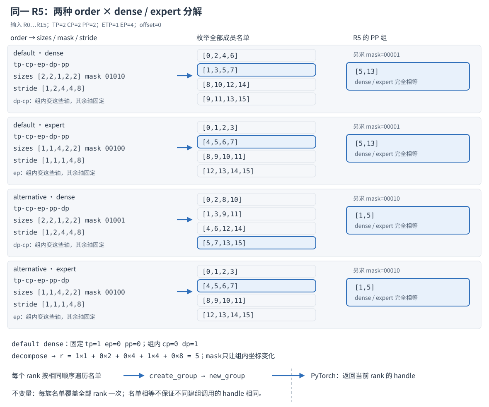
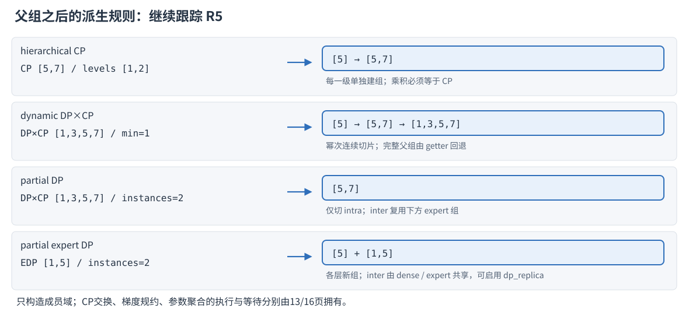
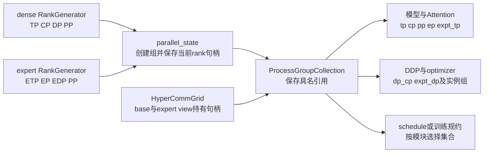
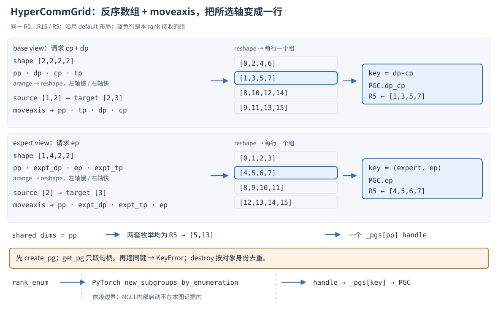

# Megatron-LM 并行编排与进程组构造深度解析(Capstone)

> **源码基线**：`NVIDIA/Megatron-LM@85902ef599ea4eb06ada7567a479c524b605767a`（`dev`，2026-09-01）
> **核心源码**：`megatron/core/parallel_state.py`、`megatron/core/process_groups_config.py`、`megatron/core/hyper_comm_grid.py`、`megatron/training/initialize.py`、`examples/mimo/training/topology.py`
> **中心结论**：并行编排把 dense 与 expert 的布局约束变成真实进程组，再把这些组交给同一 rank 上的模型、DDP、优化器与调度器。正交枚举解决“成员是谁”，建组解决“通信域是否可用”，显式传递解决“这次计算属于哪个模块”；三者是不同责任。
> **适用范围**：本页拥有正交分组、dense/expert 双分解、进程组创建与生命周期、显式组注入和 HyperCommGrid 的实际使用范围；坐标入门归 [[03_megatron_parallelism_geometry_quickstart]]，各轴 collective 本体归12–16，非均匀 TP 归 [[25_megatron_nonuniform_tp_analysis]]，FSDP 归 [[36_megatron_fsdp_analysis]]。
> **最近更新**：2026-09-05。按特性分析重构，以同一 rank 实例贯通枚举、物化、所有权、消费与销毁，纠正拓扑映射、注入和 RNG 的过度概括。

## 1. 特性概览：让每个模块拿到正确的通信域

一张卡同时参加层内计算、上下文交换、专家路由、梯度同步与流水线传输，但这些操作不能共用一个 world group：它们需要不同成员，dense 与 expert 甚至需要对同一批卡作不同分解。Megatron 先用轴大小和轴序枚举名单，再以一致的创建顺序物化进程组，最后通过全局 getter 或 `ProcessGroupCollection` 交给消费者；需要多个模块布局时，`HyperCommGrid` 及其 named view 管理局部 rank 跨度与组身份。编排本身不传激活或梯度，它建立这些数据流得以发生的通信边界。

| 维度 | 直接收益 | 必付成本或边界 |
|---|---|---|
| 组合 | 一个正交枚举器支持单轴与组合轴，不必给每种组写一段步长循环 | 每种请求仍要枚举名单、创建对应组；轴乘积和 PP 对齐必须成立 |
| 模块所有权 | 显式字段使同一 rank 可服务多个布局，模型、DDP、optimizer 使用同一份组引用 | 调用链要携带字段；缺失字段、`None`、错误 group 是不同状态 |
| 通信配置 | 后端、超时、NCCL options 可按组设置 | 相同名单不意味着相同 communicator；额外组需要额外启动及后端资源 |
| 物理布局 | `order` 可改变哪些 rank 相邻、哪些组跨大步长 | rank 邻近由 launcher 放置决定；源码不会自动发现 NVLink/IB 并把轴放进去 |

先穷举选择面。依据是 `_initialize_distributed` 的 `order` 分支、`initialize_model_parallel` 的两套 generator 与条件建组，以及 `HyperCommGrid.create_pg` 的 `view/dims` 选择；不是把三个类排成版本替代关系。

| 源码 selector | 当前路径与 sibling axis | 本页展开 / 相邻 owner |
|---|---|---|
| `use_tp_pp_dp_mapping` | 默认 `tp-cp-ep-dp-pp`；开启为 `tp-cp-ep-pp-dp`；直接 Core API 可传别的合法 `order` | 两个训练入口值复演；Core 按实际 token/mask 求解，不限于 docstring 的两个简写 |
| dense 与 expert 的构造点 | dense 固定 `ep=1`；expert 固定 `cp=1`，独立 ETP/EP/EDP，仍共用 `order` | 两套分解都展开；运行时 folding 归 [[14_megatron_ep_analysis]] |
| 条件派生组 | `hierarchical_context_parallel_sizes`、`dynamic_context_parallel`、`num_distributed_optimizer_instances`、独立 AG group | 本页解释父组怎样派生；CP数据面归 [[13_megatron_cp_analysis]]，实例组同步归 [[16_megatron_distributed_optimizer_analysis]]，独立AG字段消费者归 [[36_megatron_fsdp_analysis]] |
| 所有权入口 | 全局初始化 → `use_mpu_process_groups`；RL/inference 双 grid → PGC；MiMo base + expert view → 模块 PGC | 同一正交几何的不同创建/持有路径，均仍在调用 |
| `dims` 与 `view` | base 默认；named view 必须显式选；全 shared dims 复用 base key | 同一例子分别复演 base/expert，给出实际 MiMo caller |

下文用 TP/CP/DP/PP 表示 dense 轴；ETP/EP/EDP/PP 表示 expert 轴。`rank` 是全局编号，group 内的 rank 则由该组成员名单确定。

## 2. 最小操作：从 mask 得到 R5 的组

取同一批具名进程 `R0…R15`：`world_size=16`、`rank_offset=0`、`TP=2, CP=2, PP=2`；专家侧 `ETP=1, EP=4, PP=2`。dense 的 `DP=16/(2×2×2)=2`，expert 的 `EDP=16/(1×4×2)=2`。选择 R5 跟到底，避免每换实现就换一套例子。这些是本页复演输入，不是推荐部署配置。

### 2.1 正交枚举把两种坐标合起来

`RankGenerator` 的输入是轴大小、`order` 和 offset，输出是 `get_ranks(token)` 的全体名单。它先补入遗漏的 size-1 轴；非1轴缺失则报错；`get_mask` 按 order 的位置把 token 翻为布尔 mask。求解器同时枚举“组编号”和“组内编号”：mask 为真时轴属于组内变化，其余轴固定为该组的身份。

令大小为 $a_i$，前缀步长为 $s_i=\prod_{j<i}a_j$；`decompose` 用整除和取模从编号还原各轴坐标，然后分别内积、相加：

$$
r=\sum_{i\in M}c_i s_i+\sum_{i\notin M}c_i s_i+o,
\qquad G=\prod_{i\in M}a_i,\qquad K=W/G.
$$

这里 $M$ 是 mask 选中的轴集合，$o$ 是 offset，$G$ 是每组人数，$K$ 是组数。内层遍历组内编号，外层遍历固定坐标；两者合成的 rank 覆盖该段 world 恰好一次。求解器在 CPU 上返回整数列表，没有创建 communicator，也没有 GPU 同步。

默认 dense 的顺序是 `tp-cp-ep-dp-pp`，`sizes=[2,2,1,2,2]`，`stride=[1,2,4,4,8]`。请求 `dp-cp` 得到 `mask=01010`：组内形状 `[2,2]`（CP、DP），固定形状 `[2,1,2]`（TP、EP、PP）。组编号1固定 `TP=1,EP=0,PP=0`，内层编号0、1、2、3分解为 `(CP,DP)=(0,0),(1,0),(0,1),(1,1)`，依次恢复 `[1,3,5,7]`；所以 R5 的组内编号是2。

**为什么共用一个求解器？** 每类组手写 `start/end/step` 能生成一种布局，却把轴序复制到多段循环里。历史提交 `6513cde7b`（2024-04-12，`Support alternative mapping TP->PP->DP`）的删除侧确实是这些循环，新增侧是 RankGenerator 与通用求解器；判据是改布局时能否只改一个 order。当前成本是每次 `get_ranks` 都在 CPU 重枚举，按 $d$ 个轴、$W$ 个 rank 约做 $O(Wd)$ 工作并保存 $O(W)$ 个 rank 值；这是代码循环推导，非性能测量。

### 2.2 默认、替代顺序与 expert sibling 都独立复演



图上从左到右读 sizes/mask → 全体名单 → R5 的 PP 归属；蓝行只是当前 rank 的成员组，其他行也必须在建组遍历中出现。下表与生成脚本共同锁定输出，名单顺序保留实际枚举顺序。

| 路径 | sizes / mask | 全部输出组 | R5 的 PP |
|---|---|---|---|
| default dense `dp-cp` | `[2,2,1,2,2] / 01010` | `[0,2,4,6];[1,3,5,7];[8,10,12,14];[9,11,13,15]` | `[5,13]` |
| default expert `ep` | `[1,1,4,2,2] / 00100` | `[0,1,2,3];[4,5,6,7];[8,9,10,11];[12,13,14,15]` | `[5,13]` |
| alternative dense `dp-cp` | `[2,2,1,2,2] / 01001` | `[0,2,8,10];[1,3,9,11];[4,6,12,14];[5,7,13,15]` | `[1,5]` |
| alternative expert `ep` | `[1,1,4,2,2] / 00100` | `[0,1,2,3];[4,5,6,7];[8,9,10,11];[12,13,14,15]` | `[1,5]` |

默认 expert 的 `stride=[1,1,1,4,8]`，选 EP 后只有组内 `EP=0…3` 变化，固定 `EDP=1,PP=0` 恢复 `[4,5,6,7]`；R5 在 EP 组内编号是1。expert 的 DP 实际为 EDP，R5 对应 `[1,5]`；dense `dp` 在本例偶然也为 `[1,5]`，但 dense `dp_cp=[1,3,5,7]` 已明显不同，不能推断两种DP一般等价。

开启替代顺序后，PP 移到 DP 之前。dense 的 CP/DP 步长变成2/8，R5固定 `TP=1,PP=1` 得到 `[5,7,13,15]`；expert 的 EP 仍步长1，所以 EP组仍为 `[4,5,6,7]`，EDP则变成 `[5,13]`。两边 PP 都是 `[1,5]`，因此本例合法。两种 order 的 CPU 枚举量、各族组数相同，改变的是成员邻近关系；是否降低网络代价，要结合 launcher 的 rank→设备映射测量。

**为什么 dense/expert 不能只用一个 CP×EP 大网格？** 当前 constructor 禁止同一 generator 中 CP、EP 同时大于1；二者是同一段 rank 的两套分解，不是又相乘一遍。历史提交 `7f22e210c`（2024-11-23，MoE parallel folding）删除 `independent_ep`、`order_w_ep/order_wo_ep` 切换，加入独立 ETP 与第二个 generator。取舍判据是专家张量/副本划分能否独立于 dense，同时保持 attention 与 expert 层处于同一条 PP 链；代价是两套枚举和更多 communicator。当前约束包括两侧整除、单generator的CP/EP排斥、共享order，以及PP名单逐组相等，绝非“唯一约束是PP相等”。

全局初始化的 `expert_tensor_parallel_size=None` 会取dense TP；MiMo的 `ModuleGridSpec.expt_tp` 却默认1。默认值属于各自构造入口，本例显式ETP=1不构成对所有模型的性能建议。

### 2.3 同一父组再派生

`initialize_model_parallel` 还按 selector 派生组，不能只列单轴 `get_ranks` 就声称枚举已穷尽。它们沿父名单的局部位置处理 R5，区别在派生规则和新增资源。



| 条件 / 原语 | 本例的父组与 R5 输出 | 为什么 / 增量成本与边界 |
|---|---|---|
| hierarchical CP / `create_hierarchical_groups` | CP父组 `[5,7]`，层大小 `[1,2]` → `[5]`、`[5,7]` | `(l s u)→(l u) s`：固定外层与此前局部位置，仅该层变化；比一个平组多出层级通信域，每层建组，乘积必须等于CP；实际交换归13 |
| dynamic DP×CP / `create_dynamic_dp_cp_groups` | 父组 `[1,3,5,7]`，`min=1` → `[5]`、`[5,7]`，完整大小回退 `[1,3,5,7]` | 按小于父组大小的2的幂连续切片，提前建好动态选择的组；不是任意子集。初始化逐大小barrier与CUDA同步；运行时布局归13 |
| partial DP / `num_distributed_optimizer_instances=2` | 父组 `[1,3,5,7]` → intra `[5,7]` | dense段仅连续切成实例内子组，不从该父组另建inter；跨实例handle通过getter复用下一行expert inter组。两域分别表达实例内分片与跨实例复制，执行归16 |
| partial expert DP / 同一实例数selector | EDP父组 `[1,5]`，层大小 `[1,2]` → intra_expt_dp `[5]`，共享inter `[1,5]` | expert侧调用hierarchical helper，每层新建组（可配Gloo）且要求EDP整除实例数；`get_inter_distributed_optimizer_instance_group`将expert inter同时交dense/expert消费者。SHARP的dp_replica实际施加在此组 |
| 独立 AG / `create_all_gather_groups` | 再次用 `[1,3,5,7]` 创建dense AG域；expert另按EDP名单创建 | 同成员、独立handle供AG/RS重叠；不是再分rank。`dp_cp_ag/expt_dp_ag`默认适配为 `None`，启用后才填；实际消费者是FSDP adapter，执行归36与 [[20_megatron_comm_overlap_analysis]] |

层级helper仍依赖einops；HyperCommGrid枚举已使用NumPy，二者不要混同。动态入口检查父组长度为偶数，helper用 `floor(log2(n))` 枚举小幂；本页只复演可整除的4-rank父组，不外推为任意偶数规模都能生成等长完整子组的保证。

独立AG helper也有范围限制：当前 `create_all_gather_groups` 重建generator时固定 `order='tp-cp-ep-dp-pp', rank_offset=0`，没有读取初次初始化的order/offset。本例default确为同成员独立handle；alternative的dense父组已变成 `[5,7,13,15]`，该helper仍生成 `[1,3,5,7]`，因此不能把docstring的same-ranks意图外推到所有自定义布局。expert AG还要求 `for_expert_parallelism=True` 且EP>1。

实际交接发生于 `get_model`：仅在调用方未提供PGC、改用全局适配且 `args.create_all_gather_group` 时创建这些AG组，填入 `pg_collection.dp_cp_ag/expt_dp_ag`；`FullyShardedDataParallel.__init__ → _init_dist_index` 的MCore FSDP adapter把它们交给 `FSDPDistributedIndex` 的 `fsdp_group_ag/expt_fsdp_group_ag`。native DDP与其param buffer不消费这两个字段，不能把此注入点当作16页native optimizer的AG路径。

## 3. 名单何时成为可用的组：全局初始化路径

### 3.1 创建调用与发布边界

`initialize_megatron` 中的 `finish_mpu_init` 先调用 `_initialize_distributed`：distributed已初始化则读取现有rank/world，否则选设备、配置flight recorder环境，将backend/store/rank/world/timeout交给 `torch.distributed.init_process_group`。有CUDA设备且未要求 `skip_model_parallel_init` 时，才进一步建立模型并行组。`lazy_mpu_init=True` 只设置基础TP全局值、强制CPU初始化并返回这个closure；closure尚未执行就不具备完整进程组。

随后 `initialize_model_parallel` 对所有rank以同一循环顺序遍历 `dp-cp` 名单。R5也经历 `[0,2,4,6]` 的创建调用，但只有遍历 `[1,3,5,7]` 时，才把返回值写到 `_DATA_PARALLEL_GROUP_WITH_CP`，名单写到 `_DATA_PARALLEL_GLOBAL_RANKS_WITH_CP`。`create_group` 透传options/timeout/backend，并将当前成员的handle记入 `_global_process_group_list`；列表首项 `None` 代表default group，供后续统一改超时使用。启用Gloo后还为需要的族建同成员Gloo handle。

**为什么不让每个rank只创建自己的名单？** 当前算法用一致全局枚举保持各进程调用顺序；各自跳过其他名单会失去这个保证。这是本页对分布式创建契约的推断。Megatron可证的是名单、kwargs和保存返回值的时点；PyTorch `new_group` 内部rendezvous、NCCL结构及释放实现在依赖边界外。本页不把 `new_group` 返回解释成所有后端通信都已热身完毕。

SHARP是一个真实的显式例外：源码注释称communicator惰性初始化，因此在 `dp_cp` 执行NCCL barrier、再 `torch.cuda.synchronize()` 触发实际创建；创建前暂设 `NCCL_COLLNET_ENABLE=1`，之后移除。`dp_cp` 必须先建以承接SHARP可用的初始communicator；选 `dp_replica` 则要求多个optimizer实例，实际对 `_INTER_PARTIAL_EXPERT_DATA_PARALLEL_GROUP` 做barrier与CUDA同步，本例为 `[1,5]` 的expert inter组。普通getter返回只证明handle已发布，不能代替该同步点。

```text
initialize_megatron(...)
`-- finish_mpu_init()                 [lazy路径把closure返回外部]
    |-- _initialize_distributed(...)
    |   |-- torch.distributed.init_process_group(...)  [尚未初始化时]
    |   `-- parallel_state.initialize_model_parallel(...) [CUDA且未skip]
    |       |-- RankGenerator(... dense) / RankGenerator(... expert)
    |       |-- RankGenerator.get_ranks(token)
    |       |   `-- generate_masked_orthogonal_rank_groups(...)
    |       `-- create_group(ranks, options, timeout)
    |           `-- torch.distributed.new_group(...) → 成员handle → 模块global
    `-- _set_random_seed(...) → model_parallel_cuda_manual_seed(...)

get_model(..., pg_collection=None)
|-- ProcessGroupCollection.use_mpu_process_groups()
|   `-- parallel_state.get_*_group() → cls(**init_dict)
`-- model_provider_func(..., pg_collection=...) [用户provider边界]
    `-- [GPT provider传递路径，非固定直接边] GPTModel → LanguageModule.__init__
        `-- self.pg_collection / self.tp_group / self.pp_group

train_step(model,...)
|-- get_attr_wrapped_model(model[0], "pg_collection") → mp / pp / dp_cp
|-- logical_and_across_model_parallel_group(..., group=mp)
|-- reduce_max_stat_across_model_parallel_group(..., group=mp)
`-- torch.distributed.all_reduce(loss_sum_and_count, group=dp_cp) [末stage分支]
```

### 3.2 每种组交给谁

下面是默认布局中R5的所有权视图；箭头传Python handle引用，没有再复制一个communicator。



| 字段 / 默认R5成员 | 消费责任 |
|---|---|
| `tp=[4,5]`、`cp=[5,7]`、`tp_cp=[4,5,6,7]` | `Attention.__init__` 保存PGC，以TP大小算局部分头并向子模块传TP/CP；矩阵和KV交换归12/13 |
| `ep=[4,5,6,7]`、`expt_tp=[5]`、`tp_ep=[4,5,6,7]` | MoE dispatcher与expert层的专家侧通信域，不直接复用dense TP，collective归14 |
| `dp=[1,5]`、`dp_cp=[1,3,5,7]`、`expt_dp=[1,5]` | dense/expert参数同步域；CP副本包含在dense梯度域，闭环归16 |
| `pp=[5,13]`、`mp=[4,5,12,13]`、`tp_ep_pp=[4,5,6,7,12,13,14,15]` | PP邻居/末stage判定、模型与expert统计域；组合 `tp-dp-cp/tp-dp` 还服务跨轴规约 |
| `embd=[5,13]`、`pos_embd=[5]` | 每条PP名单派生：默认词embedding首尾、position embedding首端；可用callback改名单 |

**为什么加PGC而不让深层模块读全局？** 它把“这次计算的通信域”变成模型依赖，能区分同进程中的encoder与LLM；无参getter没有模块身份，不能表达这个选择。这是从多模块调用重建的理由；上游 `AGENTS.md` 明确指引是Core生产代码避免新增直接全局组读取，保留bootstrap、适配层及带注释迁移回退，并未宣布替换所有训练代码或由Grid统一接管。

PGC不是自动初始化的全字段安全对象：字段 `init=False`，自定义constructor只设置传入的已声明名称，未知关键字报 `ValueError`，未设字段可能不存在。`use_mpu_process_groups(required_pgs)` 验证字段名再调用映射getter，仅包装引用；`dp_cp_ag/expt_dp_ag`映射为 `None`。显式注入也可能依赖全局bootstrap，不能称其完全无全局状态。

DDP与optimizer的 `setup_process_groups_*` 也不只是裁子集：两者在CP=1时允许缺失 `dp_cp` 回退 `dp`，CP>1则拒绝；单optimizer实例复用父组，多实例要求额外字段。DDP缺expert DP会警告并新建当前rank的singleton；optimizer要求 `expt_dp` 属性存在，允许显式 `None`，且显式PGC路径拒绝 `use_gloo_process_groups=True`。这些分支是验证边界，也可能新增组，消费者专门算法仍归16/26。

> [!contradiction] 保留旧页纠错：`train_step` 规约组来自模型，不能按同名形参判断。
> 当前实现先 `get_attr_wrapped_model(model[0], "pg_collection")`，只有结果为 `None` 才回退全局适配，并断言 `mp/pp/dp_cp` 非空；形参PGC是转给schedule的cross-grid载体。`get_model` 用注入 `dp_cp` 调 `resolve_ddp_bucket_size`，`common_utils` helper接显式 `group=`。把这些来源合为“所有调用方直接传组”会让encoder rank误用LLM域。

## 4. HyperCommGrid：对象管理哪段rank、哪个view

### 4.1 同一例子走NumPy轴移动

全局枚举器与Grid的公共枚举在适当布局下得到同样名单，但后者不调用RankGenerator。它反转 `dim_names` 匹配NumPy末维连续约定，将选中维移到最后，再reshape为一行一组。公开 `create_pg/get_rank_enum` 先按反序维表规范化请求；不要把内部 `_gen_rank_enum` 接收任意dims顺序的例子当公共API输出。



默认dense建 `shape=[2,2,2,2]`、`dim_names=[tp,cp,dp,pp]`。`arange(16)` reshape为 `pp,dp,cp,tp`；请求 `[cp,dp]` 规范为 `[dp,cp]`，source axes `[1,2]` 移到target `[2,3]`，结果为 `pp,tp,dp,cp`。固定 `PP=0,TP=1` 后按CP快、DP慢读出 `[1,3,5,7]`，与mask解算一致。

expert注册 `shape=[1,4,2,2]`、`dim_names=[expt_tp,ep,expt_dp,pp]`。反序轴 `pp,expt_dp,ep,expt_tp`，EP从source `[2]` 移到target `[3]`，得到 `pp,expt_dp,expt_tp,ep`；固定 `PP=0,EDP=1,ETP=0` 读出 `[4,5,6,7]`。alternative则交换shape/维名中的PP与DP，沿同样公共算法得到前表alternative名单；RL/inference双grid构造点确实按该布尔值选择。

本地求解只重排rank数组，不搬GPU张量、不发collective。`create_pg` 把整套 `rank_enum`、backend与kwargs交PyTorch `new_subgroups_by_enumeration`，保存返回的当前rank handle到 `_pgs`；`get_pg`只查键。后端内部如何创建subgroup不在本仓展开，图中的名单与handle发布才是本仓可证边界，不能以数组行数推断NCCL时延。

### 4.2 为什么需要view和明确创建点

named view负责同一rank span的第二套因子分解。`register_view` 复制shape/维名元数据，验证正整数、维名唯一、总大小等于base；`shared_dims`每个轴及多轴组合必须逐组相等。默认例中两侧PP都让R5与R13同组；expert请求PP规范到base的 `"pp"` key，任一侧先创建后，另一侧 `get_pg` 返回同一个对象。私有EP键为 `("expert", ("ep",))`；base DP×CP键为 `"dp-cp"`。成员偶然相同的非shared域不自动合并。

取舍判据是共享通信域要同时共享身份与销毁责任。每view各建PP，即使成员一致也有两份communicator/options；只比较size而不比较名单，`[5,13]` 与 `[1,5]` 都是两人却不是一条流水线。前一句是本页设计推断，后者由逐组校验与负测试直接证明。

`create_pg` 同键重复调用报 `KeyError`，源码给出的理由是无法检查两次options是否一致，宁可报错也不返回旧组。`get_pg`不惰性建组的理由也在docstring：创建kwargs不应暴露给查询接口。代价是caller须预建所有消费域；私有view付CPU枚举与新增组资源。`rank_offset`限定连续跨度，不是任意rank子集；constructor检查offset非负和span不越world。

### 4.3 当前真实入口与模块交接

`examples/mimo/training/topology.py` 给出完整活跃用法：`ModuleGridSpec` 分别算DP/EDP；`_build_grid` 建base+expert view、声明shared PP并预建dims；`pg_collection_from_grid` 取handle装PGC；`build_schedule_pg_collection`只收当前rank参与的模块，以 `language_model_module_name` 指明语言主干。`MultiModuleProcessGroupCollection`验证字典非空、主干键存在；没有主干时查询主干抛错，不能默认每个rank都是LLM rank。

```text
create_topology(specs)
|-- _build_grid(spec)
|   |-- HyperCommGrid(...) → register_view("expert", shared_dims=["pp"])
|   `-- create_pg(dims, view)
|       |-- _order_dims_for_view → _canonical_pg_key_and_enum_view
|       |-- _gen_rank_enum_for(shape, names, dims)
|       `-- dist.new_subgroups_by_enumeration(...) → _pgs[key]
|-- _validate_grid_layout(grids)
|-- pg_collection_from_grid(grid)
|   |-- get_pg(...) → PGC字段
|   `-- _build_language_embedding_groups(...) → dist.new_group(...) [另持有]
`-- build_schedule_pg_collection(...) → HeteroTopology

get_mimo_optimizer(mimo_model, config)
|-- _get_pg_collection_for_optimizer(grid)
|   `-- get_pg(base dims) / get_pg(expert dims, view="expert") → PGC
`-- get_megatron_optimizer(..., pg_collection=...)

HeteroTopology.destroy()
|-- dist.destroy_process_group(embd / pos_embd) [grid以外的组]
`-- HyperCommGrid.destroy() → 成员对象去重 → dist.destroy_process_group(pg)
```

MiMo `_validate_grid_layout` 只接受模块完全共置或两两不相交且覆盖world无缺口；Grid本身能表示小span，并不自带这个总体约束。`get_mimo_optimizer` 从base取dense组，从expert view取 `tp_ep_pp/expt_dp`，明确拒绝多个distributed optimizer实例；这是调用方边界，不是Grid普遍限制。

另一个sibling入口是 `megatron/rl/parallel_utils.py` 与 `megatron/core/inference/shards.py` 的 `build_inference_pg_collection`：为推理模型创建dense/expert两个grid，核对PP枚举再包装PGC，而非named view。同例仍得到 `[1,3,5,7]` 与 `[4,5,6,7]`，并创建模型/组合/embedding组；资源上没有named view的共享键机制。builder返回PGC，不能推断丢弃PGC就自动执行 `grid.destroy`。三种抽象是协作入口，不是整齐替代的三个版本。

## 5. 生命周期、失败边界与总代价

必须区分：整数名单已生成 → 后端API返回handle → 当前rank的owner发布handle → 消费者用它确定组内大小/成员并发起通信。本页结果是正确的通信域交接；TP前反向、CP交换、EP dispatch/combine、DP reduce-scatter/all-gather与PP P2P的完成/等待由12–16各轴页负责。

销毁也分层。`parallel_state.destroy_model_parallel` 先best-effort finalize NCCL EP context，再清模块全局值，并显式销毁部分仍注册的Gloo组；它没有遍历所有NCCL handle调destroy，也不会使已注入PGC的Python引用自动变成 `None`。训练信号路径 `_graceful_shutdown` 尝试barrier后调 `torch.distributed.destroy_process_group()`，属于default distributed退出处理，异常被吞掉且没有成功保证。不能把MPU globals清零写成后端资源已全部释放。

Grid `destroy` 遍历 `_pgs`，跳过 `None` 与非成员sentinel，按 `id` 去重后逐个调backend destroy并清字典；已交给消费者的引用仍应停止使用。MiMo `HeteroTopology.destroy` 另销毁grid外embedding/position组。`_build_grid/create_topology` 异常路径清理已登记对象，但PyTorch内部部分成功后抛错、尚未返回登记的组不在本地账本里，没有跨rank事务回滚保证。全局初始化循环也没有自动回滚，失败后可能留下已建组与部分globals。

| 前提 | 源码边界 | 破坏后的行为 |
|---|---|---|
| distributed已初始化，两侧模型大小分别整除world | `initialize_model_parallel` 的 `is_initialized` assert与两条 `%` 检查 | assert / `RuntimeError`，不补卡 |
| 非1轴进入order，单generator的CP/EP不同时>1 | `RankGenerator.__init__` | 缺轴 `RuntimeError`；CP/EP assert；size-1缺轴补末尾 |
| 两侧PP相同；非PP-last且PP>1时DP=EDP | `initialize_model_parallel` 的folding两条assert | 报错，不自动reshuffle；PP=1是明确例外 |
| dense的DP×CP与expert的EDP分别整除实例数 | `initialize_model_parallel` 的两条partial DistOpt shard factor asserts | 任一侧不整除均assert；dense满足不代表expert满足 |
| Gloo、实例组、PGC字段匹配 | `ProcessGroupCollection.setup_process_groups_for_ddp/optimizer` | CP>1缺dp_cp、多实例缺字段、显式optimizer PGC配Gloo均 `ValueError` |
| SHARP域合法 | `initialize_model_parallel` 的SHARP asserts | 关闭SHARP却指定域、未知域、无多实例却选dp_replica均失败 |
| NCCL `net_name` 是IB或socket | `get_nccl_options` | 大小写归一检查后，不支持值 `RuntimeError`；其余options透传 |
| Grid跨度、view大小/维名/shared名单合法 | `HyperCommGrid.__init__/register_view` | offset、shape、维名 `ValueError`；越界span `RuntimeError`；shared不等 `ValueError` |
| view存在、dims属于view、已创建且不重复 | `_resolve_view/_order_dims_for_view/create_pg/get_pg` | 分别 `KeyError/ValueError/KeyError/KeyError`，无惰性恢复 |
| MiMo布局和optimizer范围成立 | `_validate_grid_layout/get_mimo_optimizer` | 部分重叠、缺口 `ValueError`；多个optimizer实例assert |

| 成本项 | 本例与一般账本 | 收益及上限 |
|---|---|---|
| CPU枚举 | 每个primitive family保存16个rank值，前表每族4组×4成员；通常每请求 $O(Wd)$ | order/mask复用；规模与组合增多会增加启动工作，未测墙钟时间 |
| 建组 | 每rank遍历每family的全部名单；dense dp_cp、expert EP各4次后端创建入口，Gloo/AG/层级另加 | 可分别配置域；这些是单族调用数，不是全初始化总数 |
| 同步 | 普通创建无本仓返回的async Work；SHARP/dynamic预热显式barrier与CUDA同步 | 建立需要的可用边界，不能算零代价 |
| 句柄/后端状态 | PGC只存引用；私有view/独立AG新增组，shared PP复用对象 | 不复制模型张量；后端资源上限在依赖和设备中，本仓无统一字节数 |
| 运行时通信 | 编排不搬激活/梯度，order决定消费者成员域 | 亲和收益依赖实际放置；TP最内自动同机、PP最外自动IB是错误保证 |
| 故障运维 | 初始化不是分布式事务；owner只能清已登记handle | 不能承诺全局回滚或旧PGC自动失效 |

仍可据TODO谈方向，但不能当迁移计划：expert-specific order仍是TODO；`set_virtual_pipeline_model_parallel_rank` 的弃用警告要求显式 `vp_stage`（调度归15）；`expt_dp/expt_dp_ag` 注释保留dist-checkpoint尚未下传PG的workaround（归 [[19_megatron_dist_checkpointing_analysis]]）。view与模型持组使模块级所有权更可表达，是本页推断；源码没有给移除globals、删除字段或统一三者的时间表。

## 6. 配置契约：初始化与随机状态的轴语义

### DistributedInitConfig

| 字段 | 类型 | 默认 | 契约 |
|---|---|---|---|
| `distributed_backend` | `Literal[nccl,gloo]` | `nccl` | default init_process_group的backend，fake测试分支另行替换 |
| `distributed_timeout_minutes` | `int` | `10` | default与模型并行group创建超时，不是NVRx心跳超时，后者归 [[27_megatron_job_resilience_analysis]] |
| `local_rank` | `int` | `int(LOCAL_RANK)`，缺省0 | 未初始化distributed且有CUDA时用于set_device，不决定global rank轴分解 |
| `lazy_mpu_init` | `bool` | `False` | 强制CPU初始化，返回finish_mpu_init给外部调用；返回不表示组可用 |
| `nccl_communicator_config_path` | `str / None` | `None` | YAML按组名交get_nccl_options，读取min_ctas/max_ctas/cga_cluster_size/net_name/is_high_priority_stream |
| `use_tp_pp_dp_mapping` | `bool` | `False` | 两种训练入口order选择，成员变化见前例 |
| `use_gloo_process_groups` | `bool` | `True` | 辅助Gloo组，CLI为 `--disable-gloo-process-groups`；显式optimizer PGC路径要求False |
| `use_sharp` | `bool` | `False` | 指定数据并行域的SHARP配置与显式预热 |
| `sharp_enabled_group` | `Literal[dp,dp_replica] / None` | `None` | 开SHARP缺省dp；dp_replica要求实例数>1；关闭SHARP不可指定 |
| `high_priority_stream_groups` | `list[str] / None` | 新空列表 | 指定组的is_high_priority_stream写为True；优先级意图不等于实测提速 |
| `distributed_timeout_seconds_after_init` | `int / None` | `None` | 首轮完成后调update_pg_timeout；有_set_pg_timeout才先barrier/CUDA同步并更新 |
| `flight_recorder_dump_path` | `str / None` | `None` | 建组前flight recorder环境入口；目录追加_dump_；已有环境值优先并警告 |
| `flight_recorder_trace_buffer_size` | `int` | `2000` | TORCH_NCCL_TRACE_BUFFER_SIZE |
| `flight_recorder_dump_on_timeout` | `bool` | `True` | TORCH_NCCL_DUMP_ON_TIMEOUT |
| `flight_recorder_include_stack_trace` | `bool` | `False` | TORCH_INCLUDE_STACK_TRACE |
| `flight_recorder_include_only_active` | `bool` | `True` | TORCH_INCLUDE_ONLY_ACTIVE |
| `flight_recorder_extra_dump_on_exec` | `bool` | `True` | TORCH_NCCL_EXTRA_DUMP_ON_EXEC |

该类共21字段，本表17项；`align_grad_reduce`归20、`use_megatron_fsdp/use_torch_fsdp2`归36、`disable_jit_fuser`归 [[21_megatron_fusion_operators_analysis]]；唯一owner见 `docs/coverage/megatron-lm.yaml`。后六项只有配置块被dump路径或已有路径环境触发时才写环境，不是每次无条件覆盖。

### RNGConfig

| 字段 | 类型 | 默认 | 契约 |
|---|---|---|---|
| `seed` | `int` | `1234` | 必须正值；先按PP rank加偏移，再初始化Python/NumPy/Torch与CUDA tracker |
| `inference_rng_tracker` | `bool` | `False` | 包装所选tracker：add/set_states无操作、fork为nullcontext，不另建PG |
| `data_parallel_random_init` | `bool` | `False` | 开启才按DP rank额外偏移，默认不强制不同DP副本不同种子 |

该类共4字段，本表3项；`te_rng_tracker`与CUDA graph联动归 [[23_megatron_precision_cudagraph_fusion_analysis]]，归属见 `docs/coverage/megatron-lm.yaml`。

### ModelParallelConfig

| 字段 | 类型 | 默认 | 契约 |
|---|---|---|---|
| `use_te_rng_tracker` | `bool` | `False` | CLI别名 `--te-rng-tracker`；请求存在的TE tracker；有TE时检查版本≥1.5，否则走MCore tracker |

该类共74字段，本表1项，其余owner见 `docs/coverage/megatron-lm.yaml`。

### TransformerConfig

| 字段 | 类型 | 默认 | 契约 |
|---|---|---|---|
| `use_te_rng_tracker` | `bool` | `False` | 本类重声明TE/MCore选择，不因同名遗漏该配置面 |
| `inference_rng_tracker` | `bool` | `False` | 推理tracker包装选择，是组语义的状态消费者，不是几何轴 |

该类共266字段，本表2项，其余owner见 `docs/coverage/megatron-lm.yaml`；模型结构字段归 [[10_megatron_model_structure_analysis]]，配置到CLI工厂归 [[41_megatron_config_surface_analysis]]。

> [!contradiction] 种子不能概括成“同TP相同、不同DP不同”。
> `_set_random_seed` 先用 `seed + 100×pp_rank`，仅开启data_parallel_random_init才加 `10×dp_rank`。`model_parallel_cuda_manual_seed` 的default/data流用此seed，TP流另加 `2718+tp_rank`，expert流另加 `1024+100×ep_rank+etp_rank`。默认本例R5三者为1234、3953、2358；是否跨rank相同必须先点明哪条流。各group可显式传入，缺省才取MPU rank；随机状态操作不建通信组，TE内部实现不在本页证据范围。

## 7. 紧凑源码阅读路线与验证

按构造→状态改变→发布/消费→边界阅读；以下是去重后的稳定入口，不必从头到尾翻整个文件。

| 语义段 | 路径与符号 |
|---|---|
| 原语与派生 | `megatron/core/parallel_state.py::RankGenerator.__init__/get_mask/get_ranks`、`generate_masked_orthogonal_rank_groups`、`create_hierarchical_groups`、`create_dynamic_dp_cp_groups` |
| 初始化/生命周期 | `megatron/training/initialize.py::initialize_megatron/_initialize_distributed`；`megatron/core/parallel_state.py::initialize_model_parallel/create_group/get_nccl_options/update_pg_timeout/destroy_model_parallel`；`megatron/training/global_vars.py::_graceful_shutdown` |
| getter/额外AG | `megatron/core/parallel_state.py::get_data_parallel_group/get_pipeline_model_parallel_next_rank/get_pipeline_model_parallel_prev_rank/get_inter_distributed_optimizer_instance_group/create_all_gather_groups`；`megatron/core/distributed/fsdp/mcore_fsdp_adapter.py::FullyShardedDataParallel.__init__/_init_dist_index` |
| 注入/约束 | `megatron/core/process_groups_config.py::ProcessGroupCollection.__init__/use_mpu_process_groups/setup_process_groups_for_ddp/setup_process_groups_for_optimizer`、`MultiModuleProcessGroupCollection.__post_init__/get_language_model_collection` |
| 消费/可见 | `megatron/training/training.py::get_model/resolve_ddp_bucket_size/train_step`；`megatron/core/models/common/language_module/language_module.py::LanguageModule.__init__`；`megatron/core/transformer/attention.py::Attention.__init__`；`megatron/training/utils/common_utils.py::logical_and_across_model_parallel_group/reduce_max_stat_across_model_parallel_group/average_losses_across_data_parallel_group` |
| Grid算法/身份 | `megatron/core/hyper_comm_grid.py::HyperCommGrid.__init__/register_view/create_pg/get_pg/get_rank_enum/_order_dims_for/_order_dims_for_view/_canonical_pg_key_and_enum_view/_gen_rank_enum_for/_resolve_view/destroy` |
| 实际Grid入口 | `examples/mimo/training/topology.py::ModuleGridSpec.__post_init__/create_topology/_build_grid/_validate_grid_layout/pg_collection_from_grid/_build_language_embedding_groups/build_schedule_pg_collection/HeteroTopology.destroy`；`megatron/core/models/mimo/optimizer.py::get_mimo_optimizer/_get_pg_collection_for_optimizer`；`megatron/rl/parallel_utils.py::build_inference_pg_collection`；`megatron/core/inference/shards.py::build_inference_pg_collection` |
| RNG/配置 | `megatron/training/initialize.py::_set_random_seed`；`megatron/core/tensor_parallel/random.py::initialize_rng_tracker/model_parallel_cuda_manual_seed`；`megatron/training/config/common_config.py::DistributedInitConfig/RNGConfig`；`megatron/core/model_parallel_config.py::ModelParallelConfig.use_te_rng_tracker`；`megatron/core/transformer/transformer_config.py::TransformerConfig.use_te_rng_tracker/inference_rng_tracker` |
| 负例/运行验证 | `tests/unit_tests/test_parallel_state.py::test_different_initialize_order_unconsistency/test_rank_generator_for_tp_dp_pp`；`tests/unit_tests/test_hyper_comm_grid.py::TestHyperCommGrid.test_register_view_shared_dim_membership_mismatch_error/test_shared_view_dim_reuses_base_process_group/test_destroy_skips_non_members`、`TestHyperCommGridIntegration.test_real_distributed_all_reduce` |

图由 `tools/figs/svg/megatron_parallelism_orchestration_figures.mjs` 计算，Node测试读取本页表格以防正文与图漂移；CPU复演验证名单/axis置换，不能替代多GPU测试。真正的运行验证要检查返回group的成员并执行group内all-reduce；上游对应测试覆盖数值结果，本次文档编辑不声称在本机跑过NCCL训练。

## Related Pages

- [[03_megatron_parallelism_geometry_quickstart]] —— global rank心算坐标与组归属的前置入门。
- [[12_megatron_tp_analysis]] —— TP组被矩阵分片与前反向collective消费的方式。
- [[13_megatron_cp_analysis]] —— CP、分层CP与动态CP组对应的序列布局和通信。
- [[14_megatron_ep_analysis]] —— 双分解在MoE dispatch、expert计算与combine中的用途。
- [[15_megatron_pp_schedulers_analysis]] —— PP组、虚拟stage与多模块调度的执行语义。
- [[16_megatron_distributed_optimizer_analysis]] —— DP及实例组驱动的梯度/参数同步闭环。
- [[02_engineering/02_train_frameworks/megatron-lm/index|Megatron-LM 索引]] —— 按并行轴和工程专题继续检索。
