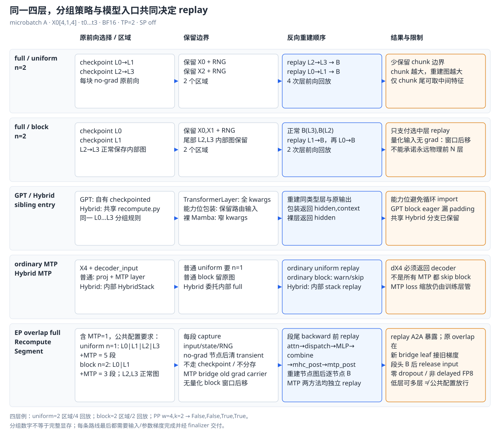
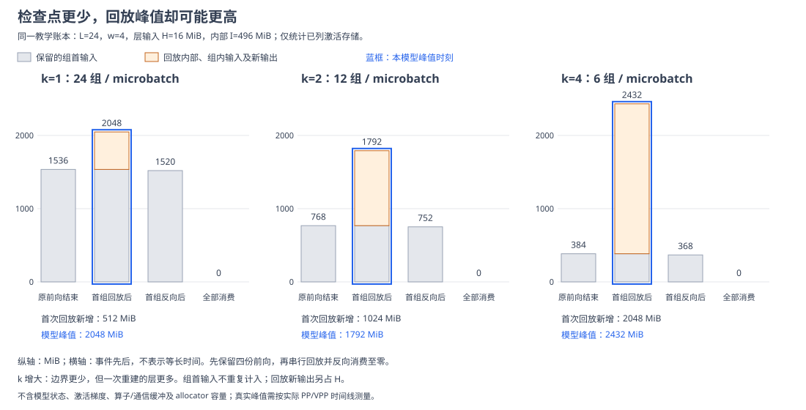
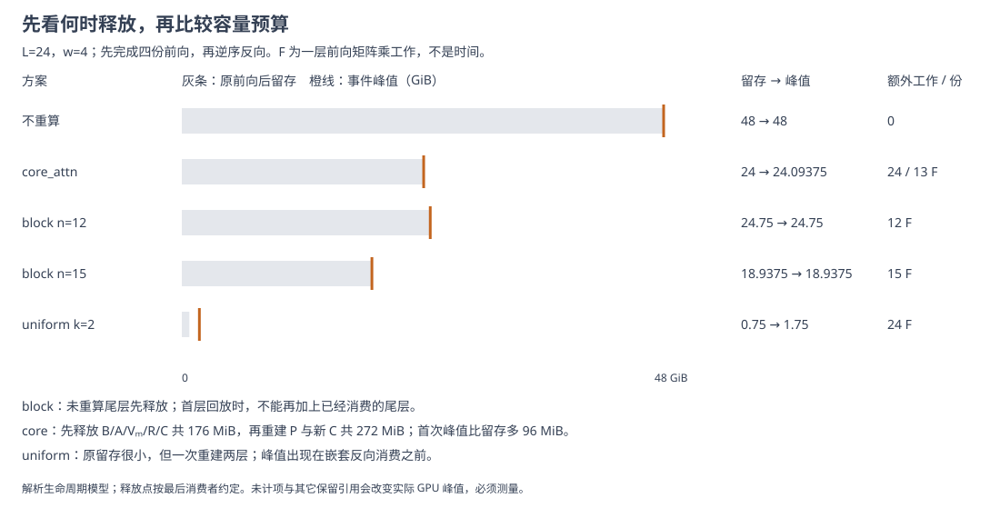
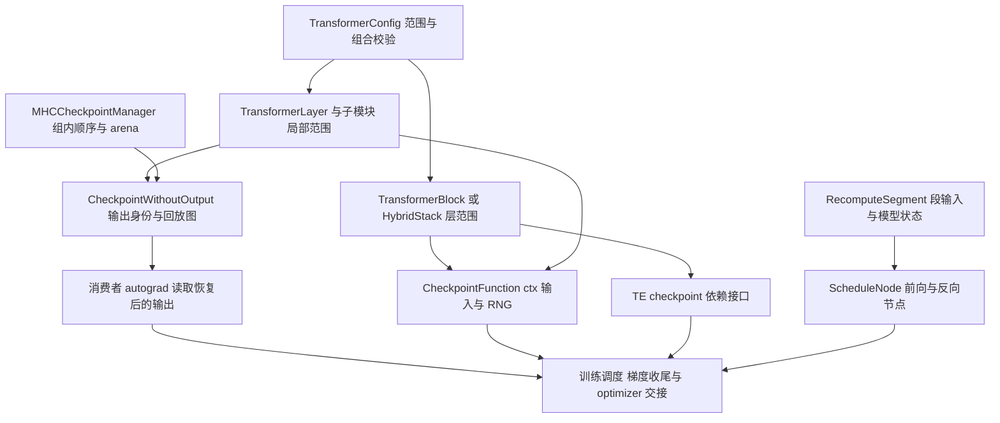
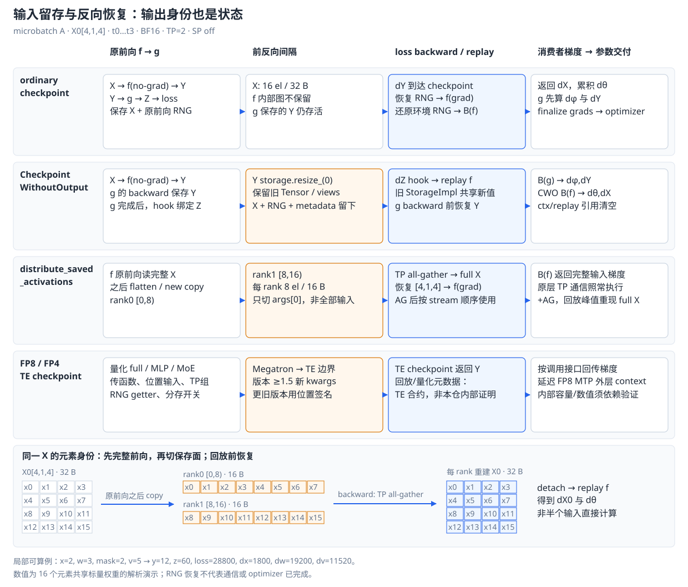
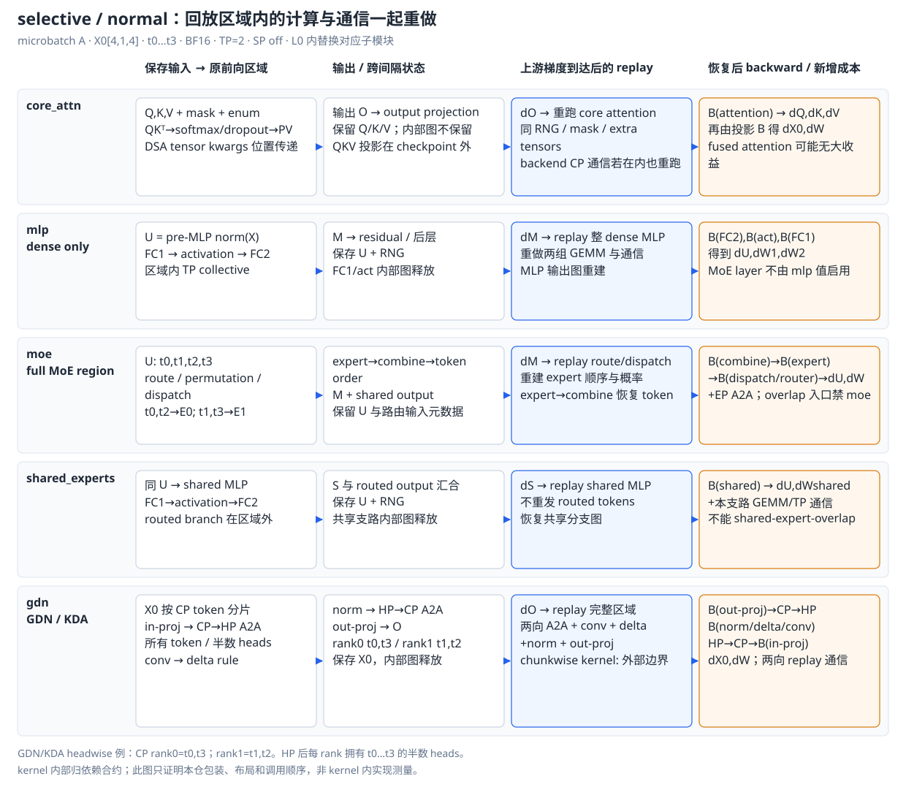
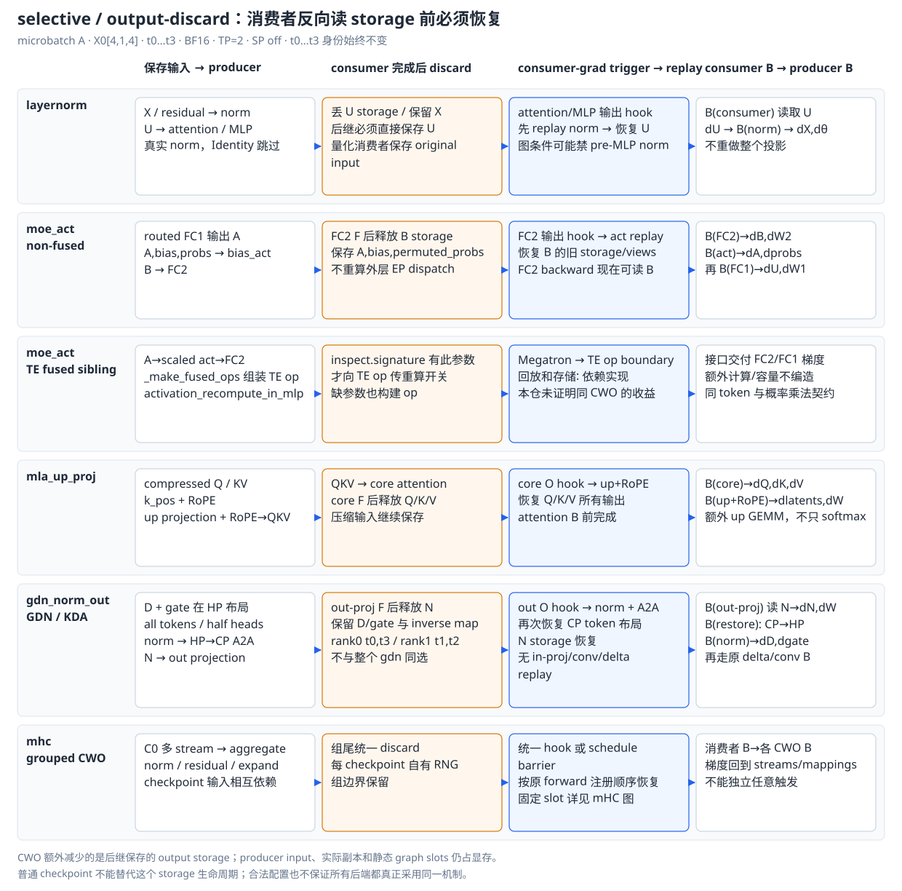
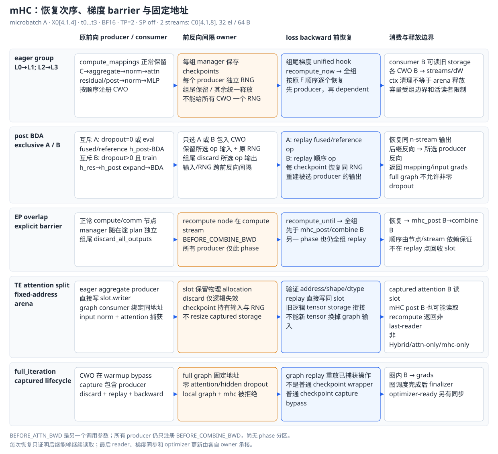

# Megatron-LM 激活重计算：输入留存、反向回放与系统边界

> **源码基线**：`NVIDIA/Megatron-LM@85902ef599ea4eb06ada7567a479c524b605767a`（`dev`，2026-09-01）
> **核心源码**：`megatron/core/tensor_parallel/random.py`、`megatron/core/recompute.py`、`megatron/core/transformer/transformer_block.py`、`megatron/core/transformer/transformer_config.py`、`megatron/core/models/common/model_chunk_schedule_plan.py`
> **中心结论**：重计算用可恢复的边界输入替代长期保留的内部激活；选择范围时，要同时计算保留量、回放峰值和额外执行成本。Megatron 用 full/selective 决定重做什么，再由 checkpoint、输出丢弃与调度器分段回放保证反向所需的数据及时恢复。
> **适用范围**：拥有两类 checkpoint、full/selective、TP 分存、Hybrid/MTP 和 EP overlap 的重计算入口及其量化边界；模型结构见 [[10_megatron_model_structure_analysis]]，PP 时序见 [[15_megatron_pp_schedulers_analysis]]，offload 见 [[22_megatron_memory_optimization_analysis]]，CUDA Graph 主体见 [[23_megatron_precision_cudagraph_fusion_analysis]]。
> **最近更新**：2026-09-06。按问题、方案、总体取舍、源码装配、系统组合递进；补充统一容量窗口选型与 MLA 展开存储实例。

## 1. 激活为什么需要换一种保存方式

同一 microbatch 的前向和反向之间，autograd 要保留计算梯度所需的中间量；长序列、大 FFN 和多个在途 microbatch 会让这段生命周期占满显存。重计算选定一个函数区域，前向不保存其内部计算图，只留下可恢复的输入和随机状态；反向恢复同一函数的执行环境，重建图后消费上游梯度。它位于层、子模块与训练调度之间，减少的是跨前反向间隔的激活，并不会自动减少权重、优化器状态或所有瞬时峰值。

| 维度 | 直接收益 | 必付成本或边界 |
|---|---|---|
| 内部激活 | 原前向的内部图不跨间隔存活 | 反向多做区域内前向；包括其中的 TP/CP/EP 通信 |
| 输出激活 | 输出丢弃原语还能释放后继反向保存的输出 storage | 后继反向读它以前必须恢复；别名和触发顺序也是正确性条件 |
| 检查点输入 | `distribute_saved_activations` 可只保留首个输入的 TP 分片 | 回放前额外 all-gather；SP 与此开关互斥 |
| 粒度 | selective 避开不值得重做的区域，block 限制重算层数 | 需要按实际后端和显存压力选择，源码没有自动代价估计器 |
| 量化/图捕获 | 专用接口承接 RNG、FP8 上下文与固定地址 | 依赖版本、recipe、捕获范围分别限制组合，并非完全正交 |

## 2. 从保存全部激活，到按容量选择恢复范围

Megatron 先用配置决定重算范围。`TransformerConfig.__post_init__` 接受的 `recompute_granularity` 为 `None/full/selective`；full 的 `recompute_method` 为 `uniform/block`；selective 的合法集合是 `core_attn, moe_act, layernorm, mla_up_proj, mlp, moe, shared_experts, mhc, gdn, gdn_norm_out`。范围选好后，`fp8/fp4`、`distribute_saved_activations`、GPT/Hybrid/MTP 入口、`overlap_moe_expert_parallel_comm` 和 TEGroupedMLP 的 fused 实现，还会决定输入怎样保存、回放由谁执行。

`full` 和 `selective` 是粒度选项，`uniform/block` 只安排 full 的层范围；普通 checkpoint 与输出丢弃是模块采用的不同保存办法，TP 分存又只改变输入的分布。这些维度由不同条件控制，不能任意组合。此处的递进顺序是设计推导，不是发布历史。

### 2.1 不重算：先说明反向为什么需要这些张量

先看一个线性层：前向由输入 X 和权重 W 产生 Y。反向的输入梯度需要 W，权重梯度需要 X；W 本来就由模型持有，X 却必须从前向一直活到本次反向。这就是激活留存的起点。后面若接 GELU，反向又需要非线性之前的数值；若接另一个线性层，它还需要 GELU 的输出。因此“只保存每层最终输出”通常不足以执行原来的反向。

$$
Y=XW,\qquad
\frac{\partial\ell}{\partial X}=\frac{\partial\ell}{\partial Y}W^{\mathsf T},\qquad
\frac{\partial\ell}{\partial W}=X^{\mathsf T}\frac{\partial\ell}{\partial Y}.
$$

把这个依赖展开到一个普通 pre-LayerNorm Transformer 层：X 经第一次 norm 得 U，再投影出 Q/K/V；注意力概率 P 与 V 相乘得 C，输出投影加残差得 R；第二次 norm 得 Vₘ，FC1 得 A，GELU 得 B，FC2 加残差后交给下一层。反向从层输出开始，依次消费 B、A、Vₘ、R、C、P、Q/K/V、U、X。这里说的是梯度依赖，实际融合算子可用不同的保存集合实现相同数学计算。

为了让后面的每个方案都能算账，建立一份**解析教学账本**：microbatch 大小 $b=1$、序列长 $s=2048$、hidden size $h=4096$、head 数 $a=32$、FFN 宽度 $f=16384$，BF16 每元素 $d=2$ 字节；使用普通 MHA、GELU、零 dropout，无 TP/SP/CP、无门控与融合保存优化。以下只统计列出的独立激活存储：同一 storage 被多个消费者保存只算一次，Q/K/V 的 view 不重复记账。它依据本基线 `DotProductAttention.forward`、`MLP.forward` 和线性层的输入保存契约构造，**不是对某个 TE/PyTorch 版本的实测内存快照**。

| 独立存储 | 形状 / 元素数 | 反向为什么需要 | 本例容量 |
|---|---|---|---|
| 层输入 X | $[s,b,h]$ | 第一次 norm 的输入；同时是 checkpoint 候选边界 | 16 MiB |
| 第一次 norm 输出 U | $[s,b,h]$ | QKV 投影的权重梯度 | 16 MiB |
| Q/K/V | 合计 $3sbh$ | 两个 attention 矩阵乘的输入梯度 | 48 MiB |
| 概率 P | $[b,a,s,s]$ | softmax backward 和乘 V 的 backward，共用一份 | 256 MiB |
| attention 输出 C | $[s,b,h]$ | 输出投影的权重梯度 | 16 MiB |
| attention 残差结果 R | $[s,b,h]$ | 第二次 norm 的输入 | 16 MiB |
| 第二次 norm 输出 Vₘ | $[s,b,h]$ | FC1 的权重梯度 | 16 MiB |
| FC1 输出 A | $[s,b,f]$ | GELU 的局部导数 | 64 MiB |
| GELU 输出 B | $[s,b,f]$ | FC2 的权重梯度 | 64 MiB |

定义 $H=sbh d$ 为一份层边界输入的容量，$A_{\mathrm{layer}}$ 为表中总量，$I=A_{\mathrm{layer}}-H$ 为去掉层输入后其余内部激活。本例 $H=16\ \mathrm{MiB}$、$A_{\mathrm{layer}}=512\ \mathrm{MiB}$、$I=496\ \mathrm{MiB}$。大写 $A_{\mathrm{layer}}$ 是容量，表中的 A 是 FC1 张量，两者不要混淆。

$$
\begin{aligned}
A_{\mathrm{layer}}&=d\left(8sbh+ba s^2+2sbf\right),\\
M_{\mathrm{saved,none}}&=wL A_{\mathrm{layer}}.
\end{aligned}
$$

第二式中 L 是**本地**层数，w 是同时完成前向、尚未消费这些激活的 microbatch 数；只有它们的存储确实同时存活时才这样乘。取 $L=24$，一份 microbatch 留存 **12 GiB**，四份同时留存 **48 GiB**。层最终输出交给下一层时作为下一层的 X 记账，最后一层输出及任务 head 另计。两次 LayerNorm 的 FP32 均值/逆标准差合计约 0.03125 MiB/层，未纳入这张主量账本；参数、参数梯度、优化器状态、激活梯度、score/workspace、RoPE/mask、通信缓冲及 allocator 保留容量也另计。后面所有数值对比沿用这个统计范围。

这里已经出现选择重计算对象的依据：P 随序列长度平方增长，A/B 随 FFN 宽度增长，而保存一份层输入只随 $sbh$ 增长。但大张量不一定值得重算，还要看恢复它必须经过多大的区域。下面先尝试最直接的方案——保存层输入，在反向前重做整层。

### 2.2 逐层完整重算：用输入替换内部激活

状态图沿用 microbatch A 的四个 token `t0…t3`，层输入 `X0[4,1,4]`，本地 PP/VPP 层块的四层 `L0…L3` 依次产生 `X1…X4`；默认 BF16、TP=2、SP 关闭。每份完整 X 有 **16 个元素、32 B**，TP 分存后每 rank **8 个元素、16 B**。这些只算被讨论的张量，不是完整模型显存。讨论 CP、EP、MLA、GDN、mHC 时保留 token 身份和层边界，明确替换相应子层，不把不同模型假装成同一条可同时启用的配置。

四 token 图用于跟踪身份与梯度，上一节的真实量级账本用于估算容量；二者使用同一个“层输入 → 层内部 → 层输出”的边界，尺寸不同，不把 32 B 当成整层显存。先取 `full + uniform + recompute_num_layers=1`：从 `L0` 到 L3 的原前向分别留下 X0…X3，反向先由 X3 重建 L3，再由 X2 重建 L2，直到恢复 L0 的输入梯度。每层仍正常产生参数梯度，只是内部前向执行了两遍。

在 24 层容量例中，跨间隔保留量从 $24A_{\mathrm{layer}}$ 变成 $24H$，即 **384 MiB/份 microbatch**，代价是 **24 次层前向回放**。每次回放还会重新产生该层 I 所代表的内部激活，所以 384 MiB 不是整个训练过程的激活峰值。只有内部激活不再被 checkpoint 外的消费者持有，才能获得这部分收益。

这件事如何保持梯度正确，可以缩到 `Y=f(X;θ)`、`Z=g(Y;φ)`、`loss=ℓ(Z)`：f 是被重算区域，g 是真实后继。f 的输入、权重、RNG 和非张量元数据必须在原前向与回放时表达同一计算；若 f 写外部状态或参数发生变化，checkpoint 不提供事务回滚或自动恢复。

作为可复演的局部代数，令 f 在 X 的每个元素上做 `w·x` 后 dropout，图中取 `x=2, w=3`，本次 mask 的缩放值为 2；g 为乘 `v=5`，目标为各元素平方和的一半。则 `y=12, z=60, loss=28800`，每个输入元素的梯度为 `1800`，共享标量参数的 `dw=19200, dv=11520`。普通执行和回放只要使用同一个 mask 就得到这组值；这是演示算式，不是 Transformer 性能或精度测量。

$$
\frac{\partial \ell}{\partial X}
=\left(\frac{\partial f}{\partial X}\right)^{\mathsf T}\frac{\partial \ell}{\partial Y},\qquad
\frac{\partial \ell}{\partial \theta}
=\left(\frac{\partial f}{\partial \theta}\right)^{\mathsf T}\frac{\partial \ell}{\partial Y}.
$$

因此，重计算的正确性条件是“回放足以重建同一梯度计算”，收益条件则是“外部只保留小边界、内部大存储确实释放”。这也解释了下一步的两个方向：边界仍太多，可以合并多层；显存已经足够，则可以少重算一些层。

### 2.3 uniform 分组：减少边界数量，同时扩大回放范围

在 `recompute_num_layers=2` 的四层例子中，**uniform** 前向依次 checkpoint `[L0,L1]` 与 `[L2,L3]`，保留 X0、X2；loss 反向先回放 L2→L3 并反传，再回放 L0→L1。共 **2 个区域、4 次层前向回放**。增大分组减少边界输入数量，却增大某次回放重建图的范围及瞬时激活；边界留存低不等于 backward 峰值一定最低。末块用 `min` 截断，层数不必整除分组大小；feature extraction 只在 chunk 尾能收集输出。

设每组 k 层，组数为 $\lceil L/k\rceil$。原前向的边界留存为 $w\lceil L/k\rceil H$；回放一组 k 层时，内部激活和组内的 k−1 个层输入又出现；区域回放还新建一份最终输出，它与原前向交给下一组的输入不是同一份存储。若按第 2.1 节账本补计这份输出、忽略激活梯度与临时 workspace，并假设完整一组尚未开始 backward，则**新增**存储为：

$$
\begin{aligned}
R_k&=kI+(k-1)H+H=kA_{\mathrm{layer}},\\
M_{\mathrm{bound},k}&=w\lceil L/k\rceil H+R_k.
\end{aligned}
$$

组首输入已经在保留边界中，不重复相加；末尾的 H 则是回放新输出，`CheckpointFunction.backward` 持有它并调用嵌套反向，不能与原前向的边界输入合并记账。第二式把全部初始边界与一个完整组的新增存储相加，给出这个串行回放模型的存储上界；当 L 可被 k 整除、全部边界仍存活且第一组刚回放完时取到该值。末组不足 k 层，或此前已有组被消费时，应改用当前存活边界数与实际组长。多 stream、其它 microbatch 的反向及临时缓冲仍需沿真实时间线追加。

本例 k=4 时，一份 microbatch 的原前向只留 **96 MiB**，但回放一组新增 **2048 MiB**；k=1 时两项分别是 **384 MiB** 和 **512 MiB**。它们都重做 24 层前向，增大 k 没有减少层回放次数。因而不能仅根据“检查点少了”判断峰值更低；第 2.8 节会把这两个时段画在同一条容量时间线上。



### 2.4 block 部分层重算：用尚有余量的显存换回计算时间

**block** 把 L0、L1 各自 checkpoint，L2、L3 保持正常图；保留 X0、X1，后两层内部激活也跨间隔存活。反向先正常走 L3、L2，再分别回放 L1、L0，共 **2 个区域、2 次层前向回放**。源码给出的理由是充分使用可用显存、避免冗余重算；它不能在所有容量预算下替代 uniform。二者都由层数参数人工指定，不存在按 OOM 自动选前几层的求解器。

同样按单层账本，重算 n 层、其余 L−n 层正常保留时：

$$
M_{\mathrm{saved,block}}=w\left[nH+(L-n)A_{\mathrm{layer}}\right].
$$

24 层中选择 n=12，一份 microbatch 留 **6336 MiB，即 6.1875 GiB**，只重做 **12 次层前向**。每多选择一层，本账本减少 $A_{\mathrm{layer}}-H=496\ \mathrm{MiB}$ 的长期保留量，同时多付一层前向成本。其反向先消费未重算的尾层，再进入前面的 checkpoint，不能把全部尾层激活和最晚发生的回放峰值机械相加。相比 uniform，block 的目的在于按容量缺口减少重算层数；若缺口主要由每层里的某一个大张量引起，还可以把选择粒度缩到模块内部。

### 2.5 selective：在每层内部寻找值得重做的区域

前面已经分别控制了“每组多少层”和“多少层需要重算”。selective 改的是另一件事：每个适用层内，只包装指定模块。本章开头列出的十个模块来自同一个合法集合，但它们节省的张量、恢复成本与适用模型各不相同。

**先看 core attention 为什么成为默认候选。** 第 2.1 节中，仅 P 就占 256 MiB；保存 Q/K/V、回放 QKᵀ→mask/softmax/dropout→乘 V 后，P 可以从原前向的长期留存集合中删除，QKV 投影和输出投影都不重做。本账本降到 **256 MiB/层，24 层为 6 GiB/份 microbatch**。保存 Q/K/V 的容量虽然没有消失，却避免了重做昂贵的投影，这才是该边界相对整层重算的取舍。

忽略 softmax、norm、GELU 等逐元素算子，矩阵乘按一次乘加 2 FLOPs 计算，MHA + GELU 层的前向主量为：

$$
\begin{aligned}
F_{\mathrm{proj}}&=8bsh^2,\\
F_{\mathrm{mlp}}&=4bshf,\\
F_{\mathrm{core}}&=4bs^2h,\\
F_{\mathrm{layer}}&\approx F_{\mathrm{proj}}+F_{\mathrm{mlp}}+F_{\mathrm{core}}.
\end{aligned}
$$

当 $f=4h$、$s/h=1/2$ 时，$F_{\mathrm{core}}/F_{\mathrm{layer}}=1/13$：在这个模型里删除一半长期保留的激活，只回放约 7.69% 的**前向矩阵乘 FLOPs**。若再假设 backward 约为 forward 的两倍，训练计算增量才约为 2.56%；这些是假设下的推导，不能作为训练耗时保证。序列继续变长时，core 的计算也按 $s^2$ 增长，这个比例并不固定。

`TransformerConfig` 和 `DotProductAttention` 的注释明确以“激活占用较大、计算量相对较低”解释该选择；当前配置同时对 fused attention 提示检查 `core_attn` 是否确有必要。若后端本来就不长期保存这份 P，账本中的 256 MiB 节省便不成立，必须按后端实际保存集合重算。不能把这个普通 attention 示例外推为所有 TE 后端的收益。

**再看 MLP 与模型专用区域。** 在同一 dense 层中，`mlp` 保留 norm 后输入，删除 FC1/GELU 的 A、B 两份大存储，本账本减少 128 MiB/层，留下 **384 MiB/层、9 GiB/份 microbatch**；代价是重做两个 GEMM。若变为 MoE，`moe` 的范围进一步包含路由、dispatch 和 combine：省得更广，却重新支付 EP 通信；只需处理共享分支的压力时，`shared_experts` 可以避开 routed experts 的重新发送。对 GDN/KDA，`gdn` 覆盖整个状态计算区域，容量收益来自该模型自己的投影、卷积和 delta-rule 中间量，不能套用 dense 层的 512 MiB。第 3.3 节再用同一四 token 身份逐条对应这些边界的真实调用。

这些普通 checkpoint 都保留区域输入，并让输出交给真实消费者。由此还剩一个没有解决的情况：某个模块自身便宜，**它的输出**却很大，而且被后继保存着；缩小 checkpoint 到这个模块后，输出依然活着。下一种办法专门处理这项留存。

### 2.6 输出丢弃：把后继保存的大输出也替换为回放

普通 checkpoint 的输出还要交给后继使用，因此“这个模块不留内部图”不等于“它的大输出可以释放”。输出丢弃把恢复时刻提前：先让后继完成前向，再释放输出数据；等后继即将反向时，先回放生产者恢复原输出，随后才允许后继读取。Megatron 用 `CheckpointWithoutOutput`（CWO）实现这个顺序。它必须保持同一输出及其共享存储视图的身份，不能只把新结果放到另一个变量里。

回到单层账本，单独 checkpoint norm 时，后继 QKV/FC1 仍保存 U、Vₘ；norm 的内部统计量很小，单做普通 checkpoint 省不到这两份主要输出。CWO 在后继完成前向后释放 U、Vₘ，反向前各重算一次 norm。本例对应 **32 MiB/层** 的输出主量，即从 512 降到 **480 MiB/层、11.25 GiB/份 microbatch**；恢复时至少又出现当前消费者需要的那份输出；这与 full 回放新建区域输出一样，都必须在峰值处补计。它的单层收益小于重算整个 MLP，但所重做的计算也窄得多。

`moe_act` 做同样的取舍：保留已经算好的 FC1 输出 A，只重做激活函数以恢复 FC2 所需的 B；相比整 `moe`，它保留了大 GEMM 和 EP 通信的计算成果。`mla_up_proj` 则用压缩的 Q/KV 输入替代展开的 Q/K/V，节省量要按各投影实际宽度计算，并支付上投影 GEMM。`gdn_norm_out` 保留 delta-rule 的成果，只恢复门控归一化与布局转换，避免重跑前面的 conv/delta rule。`mhc` 还有多个生产者互相依赖的问题，单个 hook 不够，需在第 4.4 节引入组级恢复。

selective 的节省不能把所有条目直接相加：被丢弃的输出可能是另一个 checkpoint 的保留输入，嵌套区域还会改变回放次数；配置也明确禁止若干组合。应重新列出最终存活的独立 storage。到这里，计算范围和输出生命周期都有了选择；最后再看边界输入本身是否能少存一份。

### 2.7 TP 分存：边界输入仍然很大时，分担它的保存

当内部图已经不长期保留，组首输入仍可能占用很多空间。若这些输入在 TP ranks 上本来就是副本，就可以各存一段，在回放前共同恢复完整输入。四 token 例的一份 X 从每 rank 32 B 变成 16 B，但恢复时仍需完整 32 B，并多做一次 all-gather。该办法改变的是边界的保存布局，不改变重做哪一段计算。

把这项收益代入 uniform 账本，只能将可分存的首输入 H 项按 TP 度缩小；其它位置输入仍保留，回放内部激活也不会随之消失。SP 已经改变输入布局，不能再直接套用这一复制输入的假设；源码如何只分存第一个输入，以及组合限制，见第 3.6 节。

### 2.8 将基础方案合成总账：长期保留、回放峰值与耗时

先汇总第 2 节的 24 层、单份 microbatch 账本。每行都是单独应用该方案，不能把减少量当成可叠加的插件收益；输出丢弃的统计只扣 U/Vₘ 主量，未计的小统计量仍按原约定排除。

| 方案 | 原前向后长期保留 | 相对不重算的减少 | 额外前向工作 |
|---|---|---|---|
| 不重算 | 12 GiB | 0 | 无 |
| full uniform k=1 | 0.375 GiB | 11.625 GiB | 24 次整层前向 |
| full uniform k=4 | 0.09375 GiB | 11.90625 GiB | 24 次整层前向，按 4 层恢复 |
| full block n=12 | 6.1875 GiB | 5.8125 GiB | 12 次整层前向 |
| selective core_attn | 6 GiB | 6 GiB | 24 次 core attention |
| selective mlp | 9 GiB | 3 GiB | 24 次 dense MLP |
| selective layernorm（CWO） | 11.25 GiB | 0.75 GiB | 每层两次 norm 的回放 |

**保留量最少的那行，未必有最低峰值。** 下图使用同一账本，假设 w=4 份 microbatch 的本地层都已完成原前向，随后串行回放并反向消费；追踪已列 storage 及区域回放新输出，每次按事件分配和释放。它用一个明确的存活窗口隔离分组效应，**不是 Megatron 完整 PP 时序或 GPU 显存仿真**。



k=1、2、4 时，原前向后分别保留 **1536、768、384 MiB**；第一次完整组回放分别新增 **512、1024、2048 MiB**，因此这个模型的激活峰值分别为 **2048、1792、2432 MiB**。图中峰值发生在回放已经重建组内激活、backward 尚未开始消费的时刻。k=4 的保留量最少，却在三者中有最高回放峰值，呼应了第 2.3 节的取舍。

当 L 可被 k 整除，且上述存活窗口假设成立，把 k 暂当连续变量，便可从 $wLH/k+kA_{\mathrm{layer}}$ 推出平衡点：

$$
k_{\mathrm{balance}}=\sqrt{\frac{wLH}{A_{\mathrm{layer}}}}.
$$

它只是说明边界项随 $1/k$ 减少、回放项随 k 增加；实际还要取合法整数、处理末组和调度。Megatron 没有使用这个式子自动选 k。本例得到约 1.73，能解释为何 k=2 比 k=1、4 更低；不能把它作为任何模型都适用的“最优重算层数”。

真实训练要按时间 τ 合并互不重复的存储分类。令 $\mathcal S(\tau)$ 是此刻仍存活的 microbatch/chunk 集合，$S_j(\tau)$ 为其长期保留激活，R 为当前回放新建的存储，G 为激活梯度，W 为算子与通信临时缓冲；$M_{\mathrm{persistent}}$ 包含模型参数、优化器状态和已分配的参数梯度等持久项，则活跃存储模型为：

$$
M_{\mathrm{peak,live}}=\max_{\tau}\left[
M_{\mathrm{persistent}}(\tau)+\sum_{j\in\mathcal S(\tau)}S_j(\tau)
+R(\tau)+G(\tau)+W(\tau)\right].
$$

共享 storage 必须归入一项；不能把每项在不同时间的最大值直接相加。allocator 的 reserved 容量还包含未被活跃 tensor 使用的缓存，CUDA Graph pool 和库内部缓冲也要单独核实其归属。因此表里的激活字节数既不等于 `max_memory_allocated`，也不等于 `max_memory_reserved`。

计算上，所选区域原前向为 F、反向为 B、额外回放为 R，则该区域从 `F+B` 变成 `F+B+R`；这里 R 表示执行成本，与上式的回放字节数按上下文区分。整层回放并且额外假设 `B≈2F`，才得到约 **33% 计算增量**。实际 step time 还受重做的 TP/CP/EP collective、kernel 效率及暴露等待影响，不能由 FLOPs 百分比直接推出。第 2.5 节的 core attention 比例也只属于它声明的层结构与后端账本。

### 2.9 把峰值代入预算：何时选 selective、block 或 uniform

继续使用 L=24、w=4 的同一窗口，比较三类方案。每份 microbatch 的反向按层逆序进行；账本中的独立 storage 在最后一个消费者反向结束后释放，没有额外 Python 引用持有它。这里的“峰值”仅是这个解析生命周期模型的最大值，未计项仍按第 2.1 节另算。

block 的尾部普通层先执行反向、释放激活，然后才回放前面被选中的层。core attention 则必须看得更细：到它的重算节点前，本层 FC2、GELU、FC1、第二次 norm、attention 输出投影已经消费 B、A、Vₘ、R、旧 C，合计释放 **176 MiB**；回放重新产生 P 和新 C，增加 **272 MiB**。所以第一个 core 回放点比初始留存多 **96 MiB**，而不是把所有初始存储与回放量直接相加。新 C 由嵌套反向持有，不能因为旧 C 已释放就漏记它。



| 同一窗口方案 | 原前向后留存 | 模型峰值 | 每份 microbatch 的额外前向矩阵乘工作 |
|---|---|---|---|
| 不重算（w=4） | 48 GiB | 48 GiB | 0 |
| core_attn（w=4） | 24 GiB | 24.09375 GiB | $24F_{\mathrm{layer}}/13$ |
| block n=12（w=4） | 24.75 GiB | 24.75 GiB | $12F_{\mathrm{layer}}$ |
| block n=15（w=4） | 18.9375 GiB | 18.9375 GiB | $15F_{\mathrm{layer}}$ |
| uniform k=2（w=4） | 0.75 GiB | 1.75 GiB | $24F_{\mathrm{layer}}$ |

设扣除模型状态、梯度和临时空间等之后，**只给本账本中的激活**留下一个预算，便能进行有依据的选择。预算为 **26 GiB** 时，core_attn 和 block n=12 都容得下；在本例普通 attention 的 FLOPs 模型中，core_attn 恢复工作明显更少，值得先测。预算降到 **20 GiB**，core_attn 光初始留存就超额；block n=14 留存 20.875 GiB，n=15 降到 18.9375 GiB，是这个窗口中满足预算的最少 block 层数。预算只有 **3 GiB**，block n=23 仍需 3.4375 GiB；uniform k=2 的模型峰值为 1.75 GiB，可作为候选，全部 24 层逐层重算的 2 GiB 也能满足预算。

这些判断只比较已列候选，不是全模型的最优配置求解：selective 的其它组合、TP/SP/CP、fused attention 和不同 PP 窗口都可能改变结果。若实际消费者延后释放或仍有别名持有存储，core 的峰值要随之提高；即使容量满足预算，也要用实测 step time 判断哪种回放更划算。至此，方案选择已经闭合为“压力来自哪里 → 删除哪份存储 → 何时恢复 → 是否满足容量及时间目标”。接下来对照源码，检查这些保存与恢复责任究竟交给谁。

## 3. 对照源码：谁选择区域，谁保存状态，谁触发恢复

### 3.1 类职责与状态归属



图中的层范围控制器回答“包住什么”，checkpoint 对象回答“留下什么状态”，消费者或调度段回答“何时必须恢复”。配置对象本身既不持有本次激活，也不执行反向；把它们区分开，才能在源码里找到显存实际释放和梯度实际交接的位置。

| 状态持有者 | 跨前反向持有的状态 | 生产/消费与完成边界 |
|---|---|---|
| `TransformerConfig` 与具体层 | 粒度、选择集合及启用后的布尔属性 | 构造期校验不代表每个后端真的节省激活；Identity/graph/fused 条件继续过滤 |
| `CheckpointFunction` ctx | 函数、位置输入、RNG、首输入原 shape | 反向先回放再 nested backward；返回 input grads，参数梯度累积到正常 autograd 参数 |
| `CheckpointWithoutOutput` + Function ctx | 旧输出身份、函数、输入与 RNG、replay 后图 | hook/barrier 先恢复 storage；消费者反向后 Function 反传，清空缓存引用 |
| `MHCCheckpointManager` / arena | 每组 checkpoint 队列、discard/replayed 状态、外部槽 | 先校验地址，再顺序回放；返回时不释放仍有读者的 graph slot |
| `RecomputeSegment` / schedule nodes | 段输入、chunk 状态、RNG、节点输入输出与梯度桥 | 段尾 backward 前重建，段头 backward 后释放；正常节点 event/stream 次序承接完成 |
| PP schedule / grad finalizer / optimizer | microbatch 输入输出、参数梯度与通信状态 | loss 反向→输入梯度供上一 PP stage→finalize grads→optimizer.step；参数更新属于相邻专题 |

### 3.2 full 的装配与普通 checkpoint 生命周期

`TransformerBlock.forward` 的训练 full 分支进入 `_checkpointed_forward`。其中 `custom(start,end)` 生成真正要回放的层区间函数：从 `_get_layer(index)` 逐层执行，把 `(hidden_states,context)` 传给下一层；`checkpoint_handler` 再把这个函数和边界输入交给普通或 TE checkpoint。uniform 每次构造至多 k 层的区间，block 对选中的层构造单层区间，其余层直接调用同一个区间函数并保留正常图。第 2.3–2.4 节的分组与部分层选择，分别就是这两个循环；不是 checkpoint 原语自己判断层数。

真实调用树中，`autograd` 分支由 loss backward 触发，并非 forward helper 直接调用：

```text
training.train_step
|-- selected forward_backward schedule
|   |-- forward_step -> user forward_step_func -> model.forward [user/model adapter]
|   |   |-- TransformerBlock.forward -> _checkpointed_forward
|   |   |   `-- checkpoint_handler(custom(start,end))
|   |   |       |-- tensor_parallel.checkpoint -> CheckpointFunction.apply [non-quantized]
|   |   |       |   `-- custom_forward -> _get_layer(index) -> layer(hidden_states, ...)
|   |   |       `-- te_checkpoint -> TE checkpoint [FP8/FP4 dependency]
|   |   |-- HybridStack.forward -> recompute.checkpointed_forward -> chunk_runner
|   |   `-- MultiTokenPredictionLayer.forward -> _checkpointed_forward
|   |-- forward_step_calc_loss -> loss_func -> loss tensor
|   |-- backward_step -> custom_backward OR torch.autograd.backward
|   |   |-- CheckpointFunction.backward -> run_function -> torch.autograd.backward
|   |   `-- CWO hook -> _recompute -> consumer backward -> CWO Function.backward
|   |-- [EP overlap sibling] combined_1f1b schedule -> TransformerLayerSchedulePlan.run
|   |   |-- RecomputeSegment.recompute -> recompute_forward -> ScheduleNode.forward
|   |   `-- node backward / backward_dw -> RecomputeSegment.release_input
|   `-- finalize_model_grads_func -> finalized parameter gradients
`-- optimizer.step -> updated parameters / update_successful
```

同一 microbatch 的 X4 经任务 head/loss 得到 dX4，回放恢复每层求 dX 所需的图；局部 backward 的返回只表示输入梯度已经交给上层 autograd/调度器。DP 梯度 all-reduce/reduce-scatter、SP layernorm 与 PP embedding 梯度同步由 `finalize_model_grads_func` 收尾，延迟 weight-gradient 路径也要完成；然后 `training.train_step` 才调用 `optimizer.step`。RNG rewind 没有承担 collective 完成职责，checkpoint 更没有把多 rank 的 optimizer 更新变成一个原子操作。分布式优化器的消费边界见 [[16_megatron_distributed_optimizer_analysis]]。



`CheckpointFunction.forward` 先保存 CPU RNG、CUDA RNG 和 TP RNG tracker，再在 `torch.no_grad()` 中执行 `f`。输出 Y 正常交给 g；ctx 通过 `save_for_backward` 持有位置输入，f 的内部激活图没有留下。这里“无图”不是“没有输出”：g 仍可保存 Y，因此普通 checkpoint 不能回收这份后继消费者需要的输出。

`loss.backward()` 到达该节点时，`CheckpointFunction.backward` 取回输入、detach 成可求导输入，在 `_fork_rng` 里恢复原前向快照，打开 grad 回放 f，随后恢复当前环境的 RNG。最后 `torch.autograd.backward(replayed_outputs, incoming_grads)` 产生 θ 的梯度，并把 detached 输入上的梯度返回外层图。这样额外回放不会让别的 microbatch 多消耗一次 dropout 随机流。

采用 Megatron 原语的可证理由是它在 PyTorch checkpoint 基础上增加了 TP RNG tracker 的保存/恢复。把它替成不处理该 tracker 的包装，不能维持使用 tracker fork 的随机区域；这不是“换一个 API 名字”。普通 checkpoint 的位置输入要求是 tensor/None，不能把任意 tuple、enum 或元数据对象直接传给 `save_for_backward`。

量化的普通 block 路径有位移例外：当 `fp8/fp4` 且当前 hidden input 不需要梯度时，`recompute_skip_num_layers` 增加，检查点窗口向后推；重入式引擎需要至少一个可求导输入。因而“永远是物理前 N 层”不准确。下面 EP overlap 的手写回放主动把保留输入设为可求导叶子张量，**没有**这个窗口位移。

### 3.3 selective 的装配：模块边界怎样变成真实调用

full 在层循环外包装一组层；selective 则在层和子模块构造时把选择集合转成局部布尔值。`Attention` 的 `checkpoint_core_attention` 选择 core 包装，`TransformerLayer.__init__` 只给非 MoE 的 dense 层打开 `recompute_mlp`。因此同样一个 `recompute_modules` 列表，实际生效点由当前层类型决定，不是运行时对所有同名函数做全局替换。

下面把第 2.5 节的两个 dense 候选分别接回 `TransformerLayer.forward`。树中的两条支路是模块级选择，loss backward 才触发随后列出的反向入口；省略的 residual/norm 运算仍正常执行。

```text
TransformerLayer.forward
|-- _forward_attention -> self_attention [Attention.forward]
|   `-- [checkpoint_core_attention and training] _checkpointed_attention_forward
|       `-- tensor_parallel.checkpoint(_run_core_attention, False, Q, K, V, ...)
|           `-- CheckpointFunction.apply -> _run_core_attention -> core_attention
`-- _forward_mlp -> _forward_mlp_output_with_bias
    `-- [recompute_mlp] checkpoint(apply_module(self.mlp), norm_output, ...)
        |-- tensor_parallel.checkpoint [non-quantized]
        `-- te_checkpoint [FP8/FP4 dependency]

loss backward -> consumer backward -> CheckpointFunction.backward [non-TE]
|-- replay _run_core_attention -> attention backward -> dQ/dK/dV
|   `-- original QKV projection backward -> dU and projection weight gradients
`-- OR replay MLP -> FC2/activation/FC1 backward -> dVm and MLP weight gradients
    `-- original pre-MLP norm backward -> residual input gradient
```

core 路径把 mask 类型转换为 tensor，并把需要梯度的额外 tensor 参数显式传入 checkpoint。这是为了让原语在回放时重建完整的位置输入和输入梯度出口；把 tensor 藏进闭包虽然仍能读取数值，却会丢失这层显式梯度交接。MLP 路径的量化选择则把恢复责任交给 TE，不能由本地 `CheckpointFunction.backward` 推断依赖内部行为。



| 选择 | 原前向留下的输入 → 被包装区域 → 输出 | 反向回放、完成与代价判据 |
|---|---|---|
| `core_attn` | L0 的 Q/K/V、mask、编码成 tensor 的 mask enum → `_run_core_attention` → O | O 的 dO 到达时回放 attention，再得 dQ/dK/dV；QKV 投影不回放。DSA 的 tensor extra kwargs 也显式进入位置输入，不能留在闭包里漏掉输入梯度。若 TE fused attention 已不落大分数激活，收益可能很小，配置会 warn |
| `mlp` | pre-MLP norm 后 U → dense FC1、activation、FC2 → M | 在 dM 到达时重算整 dense MLP，再得 dU 与两组权重梯度；重做 GEMM 和内部 TP collective。`TransformerLayer` 只在非 MoE 层启用，不能用它代替 `moe` |
| `moe` | U、padding/routing 元数据 → shared branch、route、preprocess、dispatch、experts、combine、postprocess → M | 回放恢复路由/排列并再次通信，随后正常求 router、expert 和输入梯度；容量收益覆盖整 MoE，计算与 EP 流量也最大。普通 `MoELayer` 与 local partial-graph 的 `MoETransformerLayer` 是兄弟包装入口；EP overlap 明确禁用此 selective 值 |
| `shared_experts` | U → 不与 dispatcher overlap 的共享 MLP → S | dS 到达再重算共享专家，两矩阵梯度回到该共享参数；不重新 dispatch routed experts。源码只在非 shared-expert-overlap 支路包装；选择它针对共享支路显存，不能替代整个 `moe` 的节省 |
| `gdn` | X0 → in-proj、CP→HP、conv、delta rule、gated norm、HP→CP、out-proj → O | dO 到达重算上述区域，再求输入/投影/门控梯度。GDN 与 KDA 共用开关，各自 `_forward_compute`；重做 kernel 和区域内 CP 通信，输入布局转换在包装外的不随之重跑 |

这些专用边界沿用同一个原则，但回放范围各自完整：MoE 包含路由与通信，shared experts 仅包装共享支路，GDN/KDA 包装各自状态计算。它们在分布式系统中的额外通信见第 4.1 节。

### 3.4 CWO 的装配：恢复必须赶在消费者反向之前

第 2.6 节的 norm 方案由 `TransformerLayer.__init__` 选中：只有 selective 包含 `layernorm` 且对应 norm 不是 `IdentityOp` 才启用；量化路径还要求后继保存 original input，pre-MLP 的 graph 条件会进一步过滤。以普通 dense、无 mHC、无图捕获分支为例，生产者与消费者的接线如下。

```text
TransformerLayer.forward
|-- _forward_attention
|   |-- create input_layernorm_checkpoint: CheckpointWithoutOutput
|   |-- checkpoint(apply_module(input_layernorm), X) -> U
|   |-- self_attention(U, ...) -> attention_output_with_bias
|   `-- discard_output_and_register_recompute(attention_output_with_bias[0])
`-- _forward_mlp -> _forward_mlp_output_with_bias
    |-- _forward_pre_mlp_layernorm
    |   `-- create pre_mlp_norm_checkpoint -> checkpoint(norm, R) -> Vm
    `-- self.mlp(Vm, ...) -> mlp_output_with_bias
        `-- [caller _forward_mlp continues] _forward_post_mlp
            `-- discard_output_and_register_recompute(mlp_output_with_bias[0])

loss backward -> gradient hook on the consumer output
`-- CheckpointWithoutOutput._recompute -> restore norm output storage
    `-- consumer backward -> projection weight gradients and norm-output gradient
        `-- CheckpointWithoutOutputFunction.backward
            `-- autograd.backward(cached replay outputs, incoming grads)
                `-- norm parameter gradients and input gradient -> original graph
```

hook 挂在 attention/MLP 的输出上，意味着进入整个消费者反向前先恢复 norm 输出，而不是等 QKV/FC1 已经读取后再补救。`_forward_self_attention_output_with_bias` 为其它层包装提供相同的 norm→attention→discard 接线；Hybrid fast path 是否绕过末尾释放还需检查第 4.2 节。

`CheckpointWithoutOutput`（下文 CWO）用独立对象持有 `run_function/rng_states/ctx/outputs`。其 autograd Function 在 no-grad 下生成 Y，另把 tensor 输入和非 tensor 输入分开保存。g 完成前向后，调用方执行 `discard_output_and_register_recompute(Z)`：Y 的 Tensor 元数据还在，`untyped_storage().resize_(0)` 释放数据；Z 的梯度 hook 必须在 g 的 backward 读取 Y 以前触发。

hook 的 `_recompute` 恢复该 checkpoint 自己的 RNG，重建 f 的图和 Y，然后借 storage-sharing 扩展让旧 Y 的 **StorageImpl** 指向新数据；保存了 Y 的 reshape/split view 的消费者也必须看到恢复后的 storage。它既不是把新 Y 赋给一个 Python 变量，也不是保证全程没有内存分配。`_get_share_storage` 首次还会 `load_inline` 编译 C++ 扩展，后续缓存；该路径依赖私有 storage API，PyTorch 升级需要重新核对。后继 g 先用恢复的 Y 求 `dφ,dY`；CWO Function 的 backward 再用缓存的 replay 输入/输出求 `dθ,dX`，清理 ctx 引用。

源码 docstring 明示其适用判据：输出确实被后继直接保存用于反向。替代方案“只做普通 checkpoint”会保留 Y；如果后继只保存 Y 的独立副本，释放原 storage 省不到那份内存。调用方还必须保证丢弃后没有前向读者。恢复发生在 hook 或显式 barrier，不是 GPU 全局同步；不能把“hook 已运行”当成所有通信和参数梯度都已完成。



| 选择 | 在 L0 内保留什么、释放什么 | 哪个消费者前恢复，为什么用 CWO |
|---|---|---|
| `layernorm` | 保留 X0/残差输入，input norm 与 pre-MLP norm 输出 U 先交给 attention/MLP 后释放 | hook 挂 attention/MLP 输出，必须在其 backward 读 U 前恢复；重算 norm 较窄，不重做整个投影。IdentityOp 不启用；量化设置后继保存 original input；pre-MLP 的 graph 条件可能 warn 并关闭 |
| `moe_act` | 保留 routed FC1 输出 A、bias、permuted_probs，`bias_act_func` 生成 B 给 FC2，再丢 B | FC2 输出 hook 先重建 B，FC2 再产生 dB/dW2，CWO backward 得 dA 和概率梯度；不重做 FC1/FC2 GEMM。TEGroupedMLP 非 fused 路径可直接读到这一实现；fused 路径见下文依赖边界 |
| `mla_up_proj` | 保留 compressed Q/KV、位置 K 与 RoPE，重做 up-proj+RoPE 生成 Q/K/V，再丢 Q/K/V | core attention 输出 hook 在 attention backward 读 Q/K/V 前恢复；用压缩输入替代展开激活，但要重做 up-proj GEMM 与 RoPE；不是只重算 attention scores |
| `gdn_norm_out` | 保留 delta-rule 输出 D 与 gate，norm+layout restore 生成 N 给 out-proj，再丢 N | out-proj 输出 hook 在权重梯度读取 N 前恢复；只重做 norm 和 HP→CP，不重做 in-proj/conv/delta rule。GDN 与 KDA 都有该入口；与 `gdn` 共存于合法集合但禁止同时选择 |
| `mhc` | 同 token 的多 stream carrier C → aggregate/input norm → attention → residual/expand/pre-MLP norm/MLP 后组合 | 多 checkpoint 有顺序依赖，不能各自任意触发；manager 按原前向注册顺序统一恢复，第 4.4 节展开分组恢复与 graph 固定地址变体 |

### 3.5 以 MLA 展开为例：把专用边界算到张量形状

`mla_up_proj` 并非“再重做一遍 attention”。在 `MLASelfAttention.get_query_key_value_tensors` 中，down projection 已经产生压缩 Q、压缩 KV 和位置 K；CWO 只包装内部的 `qkv_up_proj_and_rope_apply`，恢复上投影与 RoPE 后的 Q/K/V。其必要性来自潜在维度与多头展开维度的差距。

取同一四 token、单 rank、无 packing、非 fused RoPE 的教学分支：本地 head 数 $n=2$，Q/KV 压缩宽度 $r_q=r_{kv}=2$，非位置 QK 宽度 $d_k=2$、位置宽度 $d_r=2$、V 宽度 $d_v=2$，均为 BF16。下面只计算这个包装边界的主张量，不是整个 MLA 层。

| 步骤 | 形状与独立存储 | 在保存与恢复中的作用 |
|---|---|---|
| 边界输入 | 压缩 Q、压缩 KV、位置 K 均为 `[4,1,2]`，各 16 B | 合计保留 48 B；RoPE 数据、下投影自身保存量及权重另计 |
| Q 上投影 | `[4,1,2,4]`，随后拆非位置/位置部分并做 RoPE | 生成每个 head 的 Q，GEMM 不是在压缩维度内直接算 attention |
| KV 上投影 | `[4,1,2,4]`，拆为 K 的非位置部分与 V | 位置 K 旋转后扩展到各 head，与非位置 K 拼接 |
| 边界输出 | Q、K 各 `[4,1,2,4]` 即 64 B；V `[4,1,2,2]` 即 32 B | 共 160 B；本分支末尾 `contiguous()` 使非连续的 V 切片成为独立存储，不能再把临时 KV 底层存储也计入跨间隔输出 |
| 丢弃与恢复 | core attention 前向消费 Q/K/V，输出 hook 先恢复这 160 B，再运行其反向 | dQ/dK/dV 随后进入 CWO 缓存的上投影图，产生投影权重及压缩输入梯度，继续回到原 down projection |

一般化后，三个保留输入的主量为 $Nd(r_q+r_{kv}+d_r)$，展开输出主量为 $Nd\,n[2(d_k+d_r)+d_v]$，其中 N 为本 rank token 数、d 为每元素字节数。本例是 48 B 与 160 B；48 B 本来就属于 checkpoint 输入，不能把两者之差 112 B 当作相对普通 checkpoint 的新增节省。普通 checkpoint 仍让后继保存 160 B，CWO 删除的是这份输出；与完全不重算相比还可能省去上投影内部保存量，要另列账本。

只计两个上投影 GEMM，回放工作为 $2N[r_q n(d_k+d_r)+r_{kv}n(d_k+d_v)]$，本例 **256 FLOPs**，另付 RoPE/拼接等工作。维度比例决定“保存小输入、重做展开”是否划算；若 Q 不使用低秩压缩，则输入变成 hidden state，不能继续套用 $r_q$ 的小容量。

实际调用由 `get_query_key_value_tensors` 创建 `qkv_up_checkpoint` 并产生 Q/K/V，`MultiLatentAttention.forward` 在拿到 `core_attn_out` 后调用 discard/register，然后清空模块属性。checkpoint 的 autograd/hook 引用仍负责这次反向，清空属性不等于回放状态提前销毁。fused RoPE 的输出存储契约、量化状态及 TP/CP 布局要按所选依赖重新核实；本例只证明已声明分支，不把 logical shape 一律当成独立 allocation。

### 3.6 首输入 TP 分存的实现

普通 checkpoint 在完成 f 的原前向后，若 `distribute_saved_activations=True`，只对 `args[0]` 操作：把 X 展平，rank0 新分配复制元素 `[0,8)`，rank1 复制 `[8,16)`，并通过 viewless tensor data setter 改掉原输入的数据存储。其它位置输入并不随之分片。反向先 `gather_split_1d_tensor` 收齐两段、恢复 `[4,1,4]`，然后才 detach、回放 f 和求梯度；不是拿半个 hidden state 直接重算整个层。

每份 X 从 32 B 降到每 rank 16 B，但回放时完整 32 B 又出现，并新增一次 TP all-gather。该 helper 调用默认非异步的 collective，无返回给调用方延迟等待的 Work；后续 CUDA 操作仍按 stream 顺序消费，不能由 Python 返回推断全卡 idle。普通非 SP 张量并行内部的 GEMM/collective 还会在回放里照常执行，详见 [[12_megatron_tp_analysis]]。分存切片使用整除商而未在该 helper assert 整除；调用方必须保证输入元素可等分及 viewless 条件，不能把配置报错文案当作所有输入范围都被验证。

把这项收益代入前面的 uniform 账本，只能将**可分存的首输入 H 项**按 TP 度缩小，不能把整式除以 TP；mask、context 等其它输入仍由原路径持有。回放前 all-gather 又恢复完整输入，因而它适合缓解长期保留压力，不能消除当前回放区域的内部峰值。这些限制解释了首输入分存的适用范围；下一节再看并行、模型和调度怎样改变前面各个方案。

## 4. 系统组合如何改变基本方案的收益与边界

前面的单层账本给出了选择标准：删除哪份存储，以及恢复它必须重做什么。进入分布式模型后，这两项都取决于张量所在 rank、具体模型入口和调度方式。同一个配置名不能替代这些检查。

### 4.1 并行布局：先确定每卡保存什么，再确定回放通信

在普通 MHA 的 TP=p、SP 关闭且没有其它融合的简化布局中，X/U/R/Vₘ 在各 TP rank 保留完整形状，Q/K/V、P、C 及 FFN 的 A/B 随 head 或通道分片。沿第 2.1 节同一账本，得到布局层面的估算：

$$
A_{\mathrm{layer,TP}}\approx d\left(4sbh+\frac{4sbh+ba s^2+2sbf}{p}\right).
$$

前一项没有除以 p，这就是不能把整层容量直接除以 TP 的原因。SP 会改变逐 token 操作和线性层边界的保存方式；all-gather 后的完整工作输入与跨间隔保存的分片要分开算，不能再沿用这个 SP-off 式子。具体布局见 [[12_megatron_tp_analysis]]。CP 也要按 attention/GDN 采用的布局与算法分别分析，不能假定所有二次方张量都按 CP 度的平方缩小。

给同一四 token 例加 CP=2、四个 value head：CP rank0 拥有 `t0,t3` 的所有 head，rank1 拥有 `t1,t2`；headwise CP→HP 后，每 rank 拥有全部 `t0…t3` 的一半 head。GDN/KDA 算 delta rule 和 norm 后 HP→CP 恢复原 token 归属。`gdn` 回放两次方向的布局交换及中间计算，`gdn_norm_out` 只从保存的 D/gate 回放 norm 和 HP→CP；后续 backward 仍要执行被回放算子自己的逆布局通信。图中两条路分别画出，不把它们缩成“反向类似”。若选择 chunkwise CP，delta-rule/conv 调用还跨入外部 kernel 的 `cp_context` 接口；Megatron 可证传参、包装范围和返回布局，kernel 内通信算法及性能由依赖实现负责，详见 [[13_megatron_cp_analysis]]。

同样给 L0 MoE 两个 EP 专家归属 rank，跟踪一个源 rank 的四 token（其他源 rank 的 token 另计），一个 token 选一个 expert 的演示路由为 `t0,t2→E0`、`t1,t3→E1`。`moe` 区域把原顺序输入变为 expert 顺序、dispatch 到专家所在 rank、专家计算后 combine 回 token 顺序；回放必须再次建立路由及排列映射，不能从只保存的 U 凭空拿到 expert 梯度。`moe_act` 则从已 dispatch 的 A 开始，只恢复 FC2 的本地输入，不新增这个外层 EP dispatch/combine；共享专家也不替 routed 分支重发 token。

因此，“模块小”不等于“只有本地计算”。决定额外通信的是 checkpoint 边界是否包住 collective；这条判断在下面 EP overlap 的调度器回放中尤其重要。

### 4.2 GPT、Hybrid 与 MTP：相同方法如何落到不同层接口

`TransformerBlock.forward` 的训练 full 分支进入自身 `_checkpointed_forward`，GPT 版本先拆开 dual RoPE 为两个位置 tensor，在闭包里重新组合。`HybridStack.forward` 进入共享 `core/recompute.py::checkpointed_forward`；GPT 仍保有独立副本，不能把共享文件称为所有模型统一入口。

共享实现对每个具体 layer 再选接口：TransformerLayer 接完整 kwargs、返回 `(hidden,context)`；声明 `supports_hybrid_recompute_kwargs` 的包装层去掉三个 cross-attention kwargs，保留 `padding_mask/input_ids` 路由元数据，返回二元组；普通窄接口层如裸 Mamba 再去掉这两个路由字段，返回单 tensor，并清空 context。源码明确用能力位避免反向 import `hybrid_block` 造成循环依赖；它没有进一步验证能力位契约，错误声明会在调用或解包暴露。Hybrid mHC fast path 还主动补上 pre-MLP layernorm 的 discard/hook，防止绕过 `_forward_post_mlp` 后省显存失效。

两份 full 实现并非字面等价：共享 Hybrid 的非 checkpoint 分支传递 `padding_mask`；GPT `_checkpointed_forward` 的 block 非 checkpoint 调用未传它，落入默认 None。本基线不能承诺 GPT block 非重算层保持 padding-sensitive MoE 的同等行为；EP overlap 对照测试也明确记下 padding-mask 参考路径问题。这是现存差异，不能在分析中替源码修好。

普通 GPT MTP 的 `_checkpointed_forward` checkpoint 的是 `_proj_and_transformer_layer`，输入包括 decoder hidden 与 decoder input；位置 tensor/None 进入原语，`packed_seq_params` 等由闭包持有。`uniform` 要求层数参数等于 1；`block` **warning 后直接运行，跳过该 MTP 重算**。`mtp_layer_pattern` 非空的 Hybrid MTP 则把 full 委托给内部 HybridStack，不能套用普通 GPT MTP 限制。MTP 目标和梯度缩放由训练损失路径处理，重计算要保持其到 decoder 的梯度通路。

这几个入口仍然遵循第 2 节的原则：选定函数区域，保留必要输入，由反向触发回放。差别在于一层到底接受哪些对象、返回什么、哪些附加损失连接在输出上。当层的计算被调度器拆开，这个函数边界也必须随之调整。

### 4.3 EP overlap full：按调度节点恢复一段计算

`overlap_moe_expert_parallel_comm=True` 的训练路径构造 `TransformerModelChunkSchedulePlan`。`_build_recompute_segments` 按同一 uniform/block 规则把 decoder 层交给 `RecomputeSegment`；每个段头 `capture` 保存 input、可变 `ModelChunkState` 快照与 RNG，各节点原前向用 no-grad，chunk 前向后清空节点激活和 dispatcher 暂存状态。与只包一个层函数相比，手写 replay 能恢复被拆到 attention、dispatch、MLP、combine、mHC post、MTP post 六个节点中的状态与梯度衔接；这是根据实际拆分重建的判据，不是源码宣称普遍优于 checkpoint。

段尾第一次进入 backward 时，`RecomputeSegment.recompute` 恢复 chunk 状态，把保留输入变为可求导叶子张量，按上述节点前向顺序重跑，再从 MTP post、mHC post、combine 等逆向消费；段头 backward 完成后 `release_input` 释放保留边界。回放里的 EP dispatch/combine A2A **暴露在关键路径上**，正常前反向间的 A2A overlap 仍可存在，不能把“原调度通信可重叠”外推到新增回放通信。

此入口在两种方法下都给 MTP 分段，block 也重算 MTP。若有 mHC→MTP detach bridge，MTP 先反向而 decoder producer 后回放：它把旧 leaf 的梯度暂存在 `mhc_grad_carrier`，待 producer 建立新 leaf 再转交梯度。只恢复 tensor 数值会丢失 decoder 梯度，且未必报错。该路径禁止输入 TP 分存、非零 attention/hidden dropout、delayed FP8；虽保存 RNG，交错 microbatch 下非零 dropout 的忠实回放仍不支持。调度、stream event 和延迟 wgrad 的整体边界归 [[15_megatron_pp_schedulers_analysis]]，本页不把节点函数返回当成 optimizer-ready。

EP overlap 配合 MTP 时还受公共配置的额外门槛：`TransformerConfig.__post_init__` 要求 `mtp_num_layers=1`，且 MTP+uniform 的 `recompute_num_layers=1`。低层 `RecomputeSegment` 能接多层 decoder 段，不代表公共配置放行该组合。保持同一 L0…L3、再加一个 MTP：**EP+MTP uniform n=1：4 个 decoder 段 + 1 个 MTP 段 = 5 段**；**EP+MTP block n=2：2 个 decoder 段 + 1 个 MTP 段 = 3 段**，L2、L3 仍保留原图。图中的 EP 路径用这两个有效配置，不能沿用无 MTP uniform 的 n=2。

这里相对普通 full 新增的不是另一套显存目标，而是状态恢复责任：函数 checkpoint 原本隐含在调用栈里的中间连接，现在由节点、段快照和梯度桥显式维护。容量估算也要把这些跨间隔状态加入，不能仅统计 hidden input。

### 4.4 mHC：输出之间有依赖时，按生产顺序一起恢复

第 2.6 节的 CWO 假设一个消费者前能恢复其输入。mHC 的多个 residual stream 让一个 checkpoint 的输出继续成为另一处回放的依赖；选择逐个独立恢复会遇到尚未恢复的生产者。Megatron 因而把这组输出的恢复顺序交给 manager。

在同一 X0 上取两个 residual stream，`input_expand` 得 `C0[4,1,8]`，共 **32 个元素、64 B**；每层 `aggregate` 把它恢复为单 stream `[4,1,4]` 给 attention。`compute_mappings` 的 h_pre/h_post/h_res 正常保留，因为后继还需要；CWO 包住 aggregate，及适用的 norm、residual mixing、expand/BDA 等区域。若用四层、`mhc_recompute_layer_num=2`，两个 group 各有一个 `MHCCheckpointManager`，组尾保留跨组边界输出，其余 managed outputs 统一丢弃。



manager 在组尾输出上注册 unified hook；EP overlap 也可由 compute-stream 上的 `mhc_recompute` ScheduleNode 调 `recompute_until(BEFORE_COMBINE_BWD)`，在 consumer backward 之前恢复。`recompute_now` 使用另一 barrier 名 `BEFORE_ATTN_BWD`，但本基线 **所有 checkpoint 只准注册 BEFORE_COMBINE_BWD**，两种调用都回放整个组。不能把枚举里的两个 phase 当成已实现分阶段裁剪；其它 phase 在 `add_checkpoint` 抛 NotImplementedError。discard 与成功 replay 均有幂等状态，但异常中途没有回滚协议。

替代方案“每个 checkpoint 各挂一个后继 hook”不能保证先恢复生产者再恢复消费其输出的 checkpoint。manager 按前向注册顺序执行 `_recompute`，每个 checkpoint 使用自己的 RNG 快照；共享一个组级快照会让后续 dropout 重放到组首随机位置。无 dropout 时 mHC post 走 fused/reference h_post-BDA 包装，有 dropout 时改用 residual→post-expand→BDA 序列；两者均包 CWO，重算内容不同，图中分别标出。

对 attention-only TE CUDA Graph split，aggregate producer 在 eager 区，把原前向和回放结果直接写入 graph consumer 已绑定的 `MHCRecomputeArenaSlot.writer`。槽仍占有固定物理显存，discard 只逻辑失效，不能 `resize_(0)`；回放前后检验地址、shape/dtype/device/layout，旧逻辑 tensor 的 storage 身份仍按 CWO 规则衔接。恢复完成并非最后读者完成，arena 不在 `recompute_until` 中释放，captured attention backward 与 mHC post backward 仍会读取。与另造一个临时结果再复制相比，直接写入消除该桥接副本，但牺牲了自由换地址的可能；slot 总容量仍是图分配的成本。

全迭代 graph 可把整段 CWO 前反向记录进去；普通 `checkpoint()` 则在 warmup **或 capture** 时直接执行函数，CWO 的 `checkpoint()` 只在 **warmup** bypass，二者不可混同。局部 local graph 的 mHC 组合直接拒绝；full-iteration mHC 要求 dropout 为零。`HyperConnectionHybridLayer.__init__` 对 TE/full-iteration graph + mHC 仍 warning：Hybrid 捕获范围把 aggregate producer 包进去，不能承诺获得 GPT attention split 同样的省显存效果，其余 group 不因该 warning 被禁用。TE attention split 的细范围、packed/offload 限制由第 5 节及 [[23_megatron_precision_cudagraph_fusion_analysis]] 承接。

这也给第 2.6 节的“丢弃输出就省显存”加上了必要条件：普通 eager storage 可以实际释放，graph 的固定地址槽却可能仍占物理容量。估算必须区分逻辑上不再有效的数据和仍被保留的槽容量。

### 4.5 融合与量化：同一边界的保存工作可能交给 TE

full GPT/Hybrid/MTP、dense MLP、MoE、shared experts 在 `fp8/fp4` 下路由 `te_checkpoint`，向 TE 交付函数、位置输入、`distribute_saved_activations`、RNG tracker getter 和 TP group；包装按 TE 1.5.0 分界使用新 kwargs 或旧位置签名，未安装 TE 时 ImportError。Megatron 可以证明入口选择和传参，不能由此声称已验证 TE 内部的量化 metadata 保存、amax 恢复或分存通信算法。普通 MTP delayed FP8 在进入该边界前额外打开外层 FP8 context，这是源码注释为 TE stash/lookup 合约记录的必要条件。

`core_attn` 与 GDN/KDA 的正常 selective 包装直接用 `tensor_parallel.checkpoint`，不是见到 `fp8=True` 就全局替成 TE。MLA CWO 的 `fp8` 参数由 fp8/fp4 决定，CWO Function 进入 `activation_recompute_forward`，回放再进入 `fp8_autocast`；本页可证上下文调用和 recipe 传递，不能把依赖内部当成本仓可执行证明。`FusedMLASelfAttention` 只替换 Q/KV down projection，继承的 QKV 构造仍使用同一 up-proj CWO 边界；不能把 down-projection fusion 误当成另一套 checkpoint 算法。

`moe_act` 还要查 TEGroupedMLP 的 `_make_fused_ops`：fused grouped MLP 把 `activation_recompute_in_mlp` 传入 ScaledSwiGLU/ScaledClampedQGeGLU/ScaledSReLU 等 TE op，是否传递取决于 `inspect.signature` 是否包含该参数。缺少参数的分支照样构建 op，不能承诺与非 fused CWO 相同的省显存效果。图明确终止在 TE op 的合约边界；局部 FC1→activation→FC2 输入/梯度契约相同，内部回放和存储节省不在本仓证据内。

### 4.6 PP 的在途窗口：单份 microbatch 的节省如何累积

第 2 节中的 w 不是总 microbatch 数，也不是可以直接填成 PP 度的常数。它取决于本 rank 的预热、稳态、排空及 VPP 次序；不同 chunk 的待反向记录可能保存不同数量的层激活。先从 [[15_megatron_pp_schedulers_analysis]] 的实际调度得到同时存活集合，再按每份记录应用相应重算策略。

PP 的 `num_microbatches_with_partial_activation_checkpoints=k` 也不是“只重算最早 k 个”。标准 schedule 在最大在途窗口 `w=warmup+1` 内计算 `microbatch_id % w >= k`，True 请求全层 checkpoint，False 请求部分层或跳过；例如 **w=4,k=2，四个标志为 False,False,True,True**。它经 `forward_step` 的第三参数交给用户 `forward_step_func`，最终怎样选模块由该函数实现，不能承诺每个 MCore 模型自动消费。EP overlap 的 combined 路径 assert 该参数必须 None。

部分 microbatch 更积极地重算，是利用“同一时刻的显存压力并不相同”的办法；其有效性仍要回到真实消费者与存活时间验证。它改变的是第 2.8–2.9 节容量模型中的存活窗口，而不是为同一个模型额外增加一个固定倍数。

### 4.7 系统增量账本：不能只算本地激活

| 方案 | 跨间隔减少 | 额外支付与容量上限 |
|---|---|---|
| 普通局部 checkpoint | 区域内部图 | 重跑 F；后继保存的输出和保留输入仍占空间 |
| CWO | 再减少可释放的输出 storage | producer 重跑、storage 衔接、hook 顺序；副本、静态 graph slot 和活跃读者限制收益 |
| TP 分存 | 首输入每 rank 约降为原来的 1/TP | 新 buffer/copy、回放前 AG、完整输入瞬时回归；不省其它 args |
| full uniform/block | 按区域删除整层内部图 | 回放 GEMM 及原区域 collective；uniform 边界少、block 不重算尾层，容量约束不同 |
| EP overlap full | 节点激活与路由临时元数据 | 状态快照与梯度桥、暴露的 replay A2A；mHC→MTP carrier 也跨间隔存活 |
| mHC group/split | 多 stream 中间与 aggregate 临时副本 | 组内顺序 replay、每 checkpoint RNG；分组边界与 graph arena 保留容量 |

还有一项图组合的现存成本：`megatron/core/transformer/cuda_graphs.py::_CudaGraphRunner.create_bwd_graph` 的 TODO 记录，回放前向会丢失捕获时附加的 buffer metadata，因此 backward graph 不能总复用原 buffer，可能额外分配/复制。它说明现行优化边界，不构成未来必将放宽组合限制的路线图。

## 5. 根据场景使用与扩展，并检查失败边界

### 5.1 如何验证选型与新增重算区域

配置选择应从实际显存缺口开始。先固定模型、精度、并行布局、后端和 microbatch 调度，测量不重算或当前可运行基线的峰值位置；再按前面的张量账本确认主要压力属于长期保留、回放内部还是其它缓冲。若主要压力来自长期保留的某类中间量，就比较对应 selective 区域的节省与恢复成本；若容量缺口仍大，再比较 block 的层数和 uniform 的组大小。后端没有保存的张量无法再省，参数或优化器占用也不能靠激活重算直接消除。

比较时先保持工作量相同：同一序列长度、microbatch 大小、全局 batch 和并行配置，预热后记录各 rank 的峰值活跃/保留显存、step time、回放次数和 collective；计时区间在边界等待 GPU 完成。另做一组利用释放显存增大 microbatch 的实验，观察吞吐收益，不把工作量变化与纯重算开销混在一起。若使用 CUDA Graph，还应区分预热/捕获与稳定回放阶段。

扩展新模块时，沿第 2 节的问题逐项确定实现：从 backward 真正需要的张量反推最小保留输入；列出输出的全部消费者及 storage/view 别名；画出恢复必须早于哪个 backward；核实 RNG、量化元数据和路由状态能否忠实回放；最后检查边界内是否重复 collective、统计累积或其它副作用。若只包装函数却不能释放被后继保存的输出，就检查 CWO；若多个被丢弃输出互相依赖，就检查 manager 或显式调度段是否需要参与，而不是增加任意 hook。

验证需同时回答正确性和收益：对照不重算路径的输出、loss、输入梯度及每组参数梯度，检查 dropout 回放没有推进环境 RNG；再测 storage 的释放/恢复与峰值时间点。出现省显存未达预期时，回到消费者和别名账本；出现耗时过大时，回到回放区域内的 GEMM、通信和等待。这样一次测量能定位下一次应调整的边界，而不只是换一个配置名继续尝试。

### 5.2 配置与运行期约束

下列符号均在第 6.3 节给出稳定路径；配置 guard 多属于 `TransformerConfig.__post_init__`，运行期 guard 单独点名。

| 前提 | 源码边界 | 破坏后的行为 |
|---|---|---|
| granularity 只能 full/selective；full 要 method 和非 None 层数，selective 层数必须 None | `TransformerConfig.__post_init__` 的 recompute 校验 | ValueError；普通 full 对层数只检查 None，**未验证正整数范围**，0 在 uniform 会使循环不前进；EP plan `_build_recompute_segments` 才明确拒绝非正整数/bool |
| TP 分存输入需可等分且 viewless，不能 SP | config 的 SP ValueError；`safely_set_viewless_tensor_data` / split helper | view storage 被拒绝；split helper 无整除 assert，不能依赖它自动发现坏 shape |
| CWO 必须丢弃后才显式回放，且恢复早于消费者反向 | `MHCCheckpointManager.recompute_until`；CWO discard docstring | 未 discard 时 RuntimeError；错误 hook 时序可能使反向读空 storage；无事务回滚 |
| cloned RNG 快照在同类 tracker、相同 state-name 集合、capture 同侧恢复 | `_set_all_rng_states` | tracker 变化、cloned 跨入 capture 或 key 集变化均 RuntimeError；graph-safe eager 用 clone 内容恢复到原 live generator，避免 live handle 已前进导致 dropout 改变 |
| `.backward()` 适用；普通 `.grad()` 不受支持 | `CheckpointFunction.backward` / CWO `_recompute` 的 `_is_checkpoint_valid` | 非 capture 下 RuntimeError；不能用输入梯度 API 名称类推兼容 |
| `moe_act` 要 grouped GEMM；MLA/GDN 要对应层；gdn 与 gdn_norm_out 互斥 | config selective 分支 | ValueError；无对应消费者的合法值不能凭空获得收益 |
| shared expert recompute 不与 shared expert overlap 同用 | config `shared_experts` 分支 | 配置存在共享专家且 overlap=True 时 ValueError |
| FP8 的 moe_act/layernorm 不能 delayed，TE≥2.6.0dev0 | config FP8 selective 分支 | ValueError；其它量化/CWO 路径仍需逐入口检查 |
| 显式配置的 cpu_offloading 不与任何 recompute 同用；整 MoE 不 offload 内部 moe_act/expert_fc1/fused_group_mlp | config cpu/offload 分支 | ValueError/assert；deprecated 转写顺序例外见第 6 节，构造未报错不能证明组合受支持 |
| mhc 要 hyper-connections，不能 mlp，group size 为正整数；不能 offload attn_norm/mlp_norm | config mHC 分支 | ValueError；norm offload 的 backward chunk 尚未初始化，统一 replay 会读到 None chunk |
| mHC group 当前只接受一个生产 phase；slot 地址与元数据不可变 | `MHCCheckpointManager.add_checkpoint`；`MHCRecomputeArenaSlot.validate_output` | 不支持 phase 时 NotImplementedError；slot 不匹配 RuntimeError，避免捕获消费者读错误地址 |
| CUDA Graph full 重算只准 full_iteration；mHC local 禁止，full_iteration 要零 dropout | config CUDA Graph 分支 | assert/ValueError；普通 checkpoint capture bypass 与 CWO full-iteration capture 语义不同 |
| TE mHC attention split 只适用非 Hybrid、TE、attn-only、mhc-only，无 packed | config `mhc_recompute_attn_cuda_graph_split` 分支 | ValueError；split 还拒绝图内 attention offload 区域，相关完整 graph 契约见 23 页 |
| MoE router partial graph 不能横跨不允许的整 MoE checkpoint；captured 随机区域需满足 dropout gate | config `cuda_graph_modules` selective 分支 | assert；`TransformerLayer.__init__` 的 pre-MLP norm 检查则会 warning 并禁用，不能只看配置已通过 |
| 普通 GPT MTP uniform 层数为 1；block 不支持 | `MultiTokenPredictionLayer._checkpointed_forward` | uniform assert，block warn 后运行；Hybrid MTP 与 EP overlap MTP 是不同入口 |
| EP overlap full：无 TP 分存、零 dropout、非 delayed FP8、无 selective moe；MTP 仅一层且 uniform n=1 | config overlap 分支；`combined_forward_backward_step` | assert；combined 还拒绝 partial-microbatch 参数，full recompute 不支持 Megatron FSDP wrapper 路径 |

> [!contradiction] 本基线纠正的旧结论
> `gdn_norm_out` 已恢复且与 `gdn` 互斥；普通 checkpoint 与 CWO 在 capture 时不再同样 bypass；重算可能重做 TP/CP/EP 通信，不能说只花本地算力；offload/并行/graph 不完全正交；uniform 与 block 没有严格优劣；`core_attn` 不一定值得优先开。旧版固定低开销数值不适合作为当前所有后端的保证。

## 6. 配置契约与源码阅读路线

### 6.1 TransformerConfig

| 字段 | 类型 | 默认 | 契约 |
|---|---|---|---|
| `recompute_granularity` | Optional Literal | None | None/full/selective；selective 目标作用于所有具备对应模块的层，不提供层数筛选 |
| `recompute_method` | Optional Literal | None | full 必须 uniform/block；selective 即使填合法值也不据此分组 |
| `recompute_num_layers` | Optional int | None | uniform 的区域层数或 block 的重算层数；selective 必须 None；实际应为正整数，普通入口验证缺口见上表 |
| `distribute_saved_activations` | Optional bool | False | checkpoint 首输入按 TP 分存；不能 SP，不能 EP overlap 手写 full；不等于切分全部内部 activation |
| `recompute_modules` | Optional List[str] | None→`[core_attn]` | selective 合法十项见第 2.5–2.6 节及第 3.3–3.4 节；空列表合法；填默认集合不等于已启用 recompute |
| `moe_layer_recompute` | bool | False | deprecated；拒绝 full，否则改 granularity 为 selective 并追加 `moe`。warning 建议的 `moe_layer` **不在合法集合中**，迁移应使用 `moe` |

兼容转写发生在 cpu_offloading、通用 recompute 和多数 selective 校验之后，未从头重新验证最终配置。例如初始 granularity=None、旧旗标=True 时，cpu_offloading 检查看到的仍是 None；不能把“构造通过”解释成 offload+重算已受支持。迁移时显式设置 `selective` 和 `recompute_modules=[moe]`，才能进入对应的正常验证路径。

该类直接定义 266 个字段，本表收 6 个本页负责的字段；其余归属见 `docs/coverage/megatron-lm.yaml`。mHC 消费但由模型专题拥有的配套字段为 `enable_hyper_connections`、`mhc_recompute_layer_num`（默认 None，本地 block 全部层一组）和 `mhc_recompute_attn_cuda_graph_split`（默认 False）；它们分别控制建模、分组边界和固定地址消费者，不应误放进 full 的 `recompute_num_layers`。

### 6.2 ModelParallelConfig

| 字段 | 类型 | 默认 | 契约 |
|---|---|---|---|
| `num_microbatches_with_partial_activation_checkpoints` | Optional int | None | PP 在在途窗口内传递 partial/full 请求；None 交给 forward_step 自定；含义与 modulo 判据见第 4.6 节 |

该类直接定义 74 个字段，本表收 1 项；其它字段归属见 `docs/coverage/megatron-lm.yaml`。字段类型与默认描述的是 dataclass 源码，不把 Python 类型标注当成全输入运行期检查。

### 6.3 源码阅读路线与可复核证据

每条路线把路径只写一次，`::` 后的符号依次阅读；不需要追逐漂移行号。

| 问题 | 稳定源码路线 |
|---|---|
| 选择集合与负路径 | `megatron/core/transformer/transformer_config.py::TransformerConfig`、`TransformerConfig.__post_init__`；`megatron/core/model_parallel_config.py::ModelParallelConfig` |
| 单层保存与计算账本 | `megatron/core/transformer/dot_product_attention.py::DotProductAttention.forward`；`megatron/core/transformer/mlp.py::MLP.forward`；`megatron/core/tensor_parallel/layers.py::LinearWithGradAccumulationAndAsyncCommunication.forward`、`backward`；`megatron/core/transformer/transformer_layer.py::TransformerLayer._forward_attention`、`TransformerLayer._forward_mlp`；张量容量与 FLOPs 为本文声明假设下的解析推导 |
| 普通/CWO 状态与 RNG | `megatron/core/tensor_parallel/random.py::_get_all_rng_states`、`_set_all_rng_states`、`_fork_rng`、`checkpoint`、`CheckpointFunction`、`CheckpointWithoutOutputFunction`、`CheckpointWithoutOutput`、`MHCCheckpointManager` |
| 首输入分存与恢复 | `megatron/core/tensor_parallel/utils.py::split_tensor_into_1d_equal_chunks`、`gather_split_1d_tensor`；`megatron/core/utils.py::safely_set_viewless_tensor_data` |
| full 三类入口 | `megatron/core/transformer/transformer_block.py::TransformerBlock.forward`、`TransformerBlock._checkpointed_forward`；`megatron/core/recompute.py::checkpointed_forward`；`megatron/core/models/hybrid/hybrid_block.py::HybridStack.forward`、`HyperConnectionHybridLayer`；`megatron/core/transformer/multi_token_prediction.py::MultiTokenPredictionLayer.forward`、`_checkpointed_forward` |
| EP overlap 分段与梯度桥 | `megatron/core/models/common/model_chunk_schedule_plan.py::TransformerModelChunkSchedulePlan._build_recompute_segments`、`RecomputeSegment`、`TransformerLayerSchedulePlan.run`、`recompute_forward`、`reset_for_recompute`；`megatron/core/pipeline_parallel/combined_1f1b.py::combined_forward_backward_step` |
| attention/dense/graph MoE 包装 | `megatron/core/transformer/attention.py::Attention._checkpointed_attention_forward`；`megatron/core/transformer/transformer_layer.py::TransformerLayer.__init__`、`_forward_attention`、`_forward_mlp`、`MoETransformerLayer` |
| MoE 两级边界与 fused 委托 | `megatron/core/transformer/moe/moe_layer.py::MoELayer.forward`、`shared_experts_compute`；`megatron/core/transformer/moe/experts.py::TEGroupedMLP.forward`、`_make_fused_ops` |
| MLA/GDN/KDA | `megatron/core/transformer/multi_latent_attention.py::MLASelfAttention.get_query_key_value_tensors`；`megatron/core/ssm/gated_delta_net/common.py::_GDNBase.__init__`、`a2a_cp_to_hp`、`a2a_hp_to_cp`；`megatron/core/ssm/gated_delta_net/gdn.py::GatedDeltaNet.forward`、`_forward_compute`、`_gated_norm_and_layout_restore`；`megatron/core/ssm/gated_delta_net/kda.py::KimiDeltaAttention.forward`、`_forward_compute`、`_gated_norm_and_layout_restore` |
| mHC producer/consumer | `megatron/core/transformer/hyper_connection.py::HyperConnectionModule._forward_with_checkpoint`、`_fused_h_res_h_post_bda_with_checkpoint`；`megatron/core/transformer/mhc_recompute.py::MHCRecomputePhase`、`MHCRecomputeArenaSlot`；`TransformerBlock._build_mhc_recompute_layer_plan` |
| TE 交付与训练闭合 | `megatron/core/extensions/transformer_engine.py::te_checkpoint`；`megatron/core/pipeline_parallel/schedules.py::forward_step`、`forward_step_calc_loss`、`backward_step`、`forward_backward_pipelining_without_interleaving`；`megatron/training/training.py::train_step` |

运行证据路线：`tests/unit_tests/tensor_parallel/test_random.py::test_checkpoint` 验证 4×4 输入分存为 8 元素后恢复正确输入梯度，`test_checkpoint_without_output_view_sharing_regression` 比较保存 view 的消费者输入/权重梯度；`tests/unit_tests/transformer/test_hyper_connection_recompute.py::TestCheckpointRngReplay` 检查回放同 dropout mask 且不改变环境 RNG；`tests/unit_tests/a2a_overlap/test_schedule_chunk_1f1b.py::TestA2AOverlap.test_1f1b_schedule_model_chunk_full_recompute` 同时检查数值与释放后的 node.inputs/output；`tests/unit_tests/a2a_overlap/test_mhc_schedule.py::TestMhcA2AOverlapNumerics.test_full_recompute_carries_the_mhc_bridge_gradient` 检查旧→新 leaf 的梯度桥。本次打开了这些测试与断言，未在本文环境运行 CUDA/TE 多 rank 训练，不能把文档/图回归当成训练通过。

两张容量图由 `tools/figs/svg/megatron_recompute_memory.mjs` 从独立 storage 事件生成，测试核对账本、分组、最后消费者释放、峰值、预算选择、排空和页面数值，同时计算 MLA 边界的字节数与上投影 FLOPs；它不导入或运行 Megatron GPU 内核。其余图由 `tools/figs/svg/megatron_recompute_figures.mjs` 按同一输入、分组、路由和状态表生成；测试读取本页的数字与模块集合、比较重生成产物，并实际浏览器渲染检查文字边界。图中的容量和局部梯度是解析演示值，不是 GPU benchmark。

## Related Pages

- [[15_megatron_pp_schedulers_analysis]] — 定位 microbatch 请求、节点调度及梯度完成的时序归属。
- [[22_megatron_memory_optimization_analysis]] — 查询 offload 与本页重算区域的互斥及容量取舍。
- [[23_megatron_precision_cudagraph_fusion_analysis]] — 查询 TE、FP8、固定地址 CUDA Graph 的完整组合契约。
- [[12_megatron_tp_analysis]] — 跟踪重算区域内部仍会再次执行的 TP 计算与通信。
- [[13_megatron_cp_analysis]] — 跟踪 GDN/KDA、attention 的序列/头布局与 CP 通信。
- [[16_megatron_distributed_optimizer_analysis]] — 接续已完成梯度的规约、参数分片更新及重建。
- [[02_engineering/02_train_frameworks/megatron-lm/index|Megatron-LM 知识地图]] — 返回本领域的主题索引。
