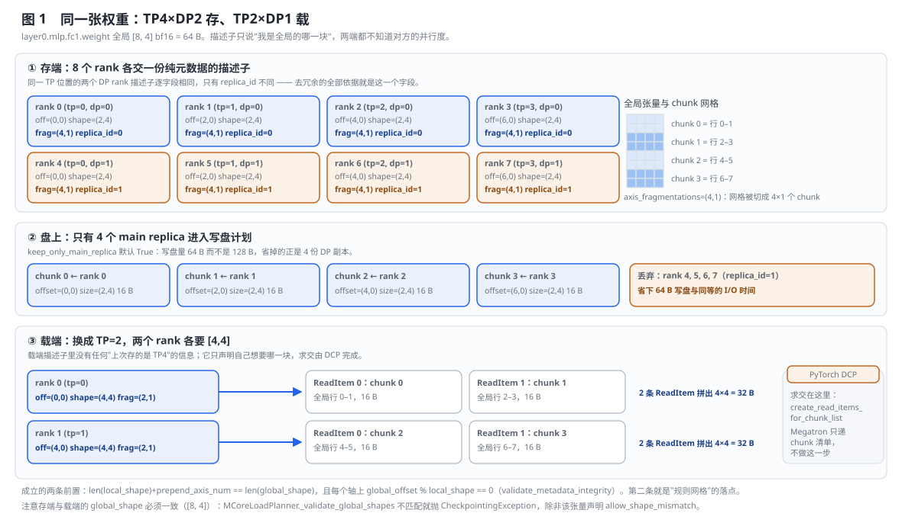
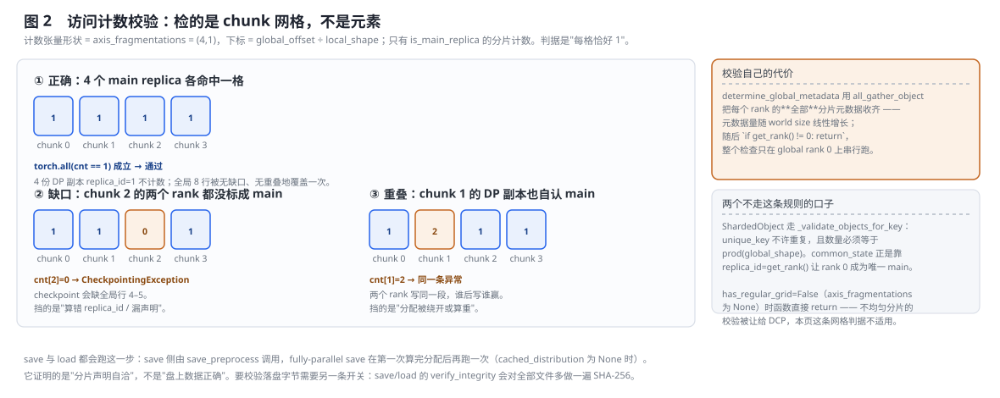
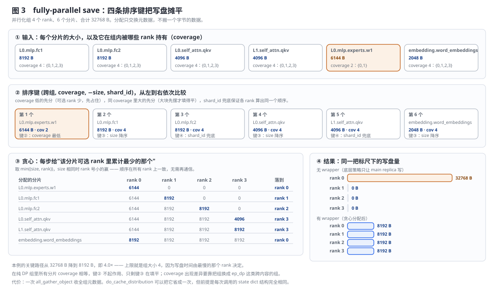
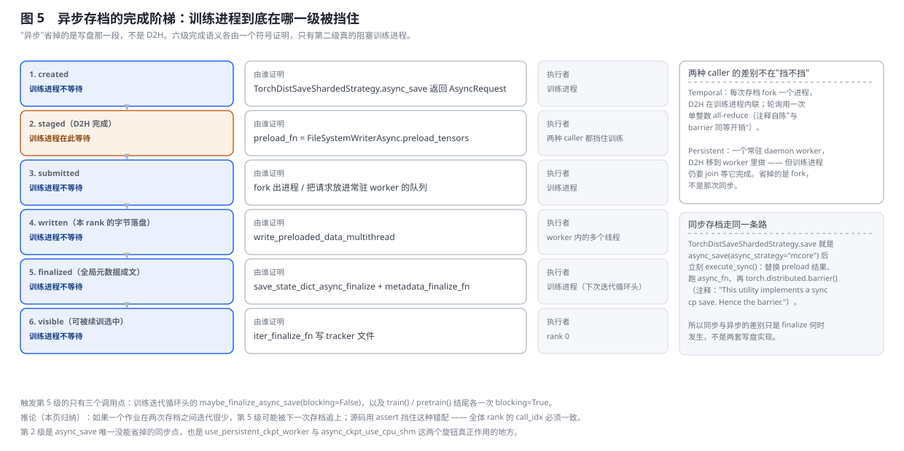
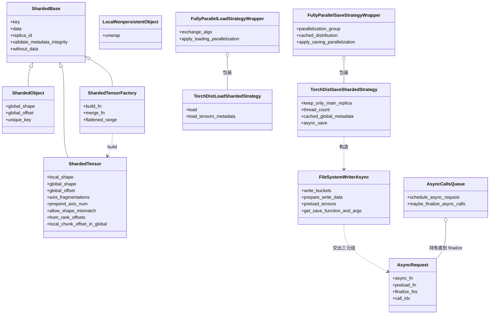

# Megatron-LM 分布式 Checkpoint 深度解析(Distributed Checkpointing)

> **源码基线**：`NVIDIA/Megatron-LM@85902ef599ea4eb06ada7567a479c524b605767a`（`dev`，2026-09-01）
> **核心源码**：`megatron/core/dist_checkpointing/mapping.py`、`megatron/core/dist_checkpointing/serialization.py`、`megatron/core/dist_checkpointing/validation.py`、`megatron/core/dist_checkpointing/exchange_utils.py`、`megatron/core/dist_checkpointing/strategies/torch.py`、`megatron/core/dist_checkpointing/strategies/fully_parallel.py`、`megatron/core/dist_checkpointing/strategies/async_utils.py`、`megatron/core/dist_checkpointing/strategies/filesystem_async.py`、`megatron/core/dist_checkpointing/strategies/state_dict_saver.py`、`megatron/core/dist_checkpointing/strategies/nvrx.py`、`megatron/training/checkpointing.py`
> **中心结论**：这个子系统的全部赌注是**用一层纯元数据的描述子替代数据搬运**。每个 rank 只声明「我这一片是全局张量的哪一块」，存与载两端各自声明自己的网格，谁也不知道对方的并行度——把两张网格对齐、算出该读哪些字节区间的**求交算法在 PyTorch DCP 里**，Megatron 只负责把 chunk 清单递过去。由此派生出三条正交的变体轴：**格式后端**只剩 `torch_dist` 一种（zarr 与策略注册表都已删除）；**并行化 wrapper** 用一个四键排序的贪心把写盘/读盘工作摊到组内所有 rank，摊平上限就是组大小；**异步 caller** 把写盘挪到后台，但 D2H 那一次同步谁也省不掉。三条轴的取值互不影响，必须分别配。
> **适用范围**：本页是 `megatron/core/dist_checkpointing/` 全子系统的 owner——描述子四型（`ShardedTensor` / `ShardedObject` / `ShardedTensorFactory` / `LocalNonpersistentObject`）、`sharded_state_dict()` 的四种分片惯用法、访问完整性校验、`torch_dist` 后端与两个 fully-parallel wrapper、三条 exchange 数据面、异步存档的完成阶梯与 NVRx 边界，以及 `CheckpointConfig` 的完整配置契约。它同时是**落盘**语义的 owner：运行中模型之间不落盘的 GPU↔GPU 权重搬运（RL 训推 refit）归 [[30_megatron_rl_posttraining_consistency_analysis]]；分片优化器状态**本身**的构造归 [[16_megatron_distributed_optimizer_analysis]]，本页只覆盖它如何被表达成描述子；并行组与 rank 几何归 [[17_megatron_parallelism_orchestration_analysis]]；Megatron-FSDP 的 `fsdp_dtensor` 格式归 [[36_megatron_fsdp_analysis]]；本地/非持久 checkpoint 的容错语义归 [[27_megatron_job_resilience_analysis]]。
> **最近更新**：2026-09-05。按特性分析契约重写：补上原先完全缺失的算法重放与原理图（五张，由 `tools/figs/svg/megatron_dist_checkpointing_figures.mjs` 从同一组配置算出、带回归测试），把 61 处 `path:line` 引用换成 `path::symbol` 稳定锚点，并补齐变体枚举依据、代码实现分析（类与所有权图、三棵 ASCII 调用树、源码阅读路线）与开销结算。逐条重核后修正五条已漂移的旧结论：`common.pt` 的迁移**已经完成**（写入端现在是一个 `ShardedObject("common_state")`，旧页把它列为"发展趋势"）、`strategies/base.py` 与策略注册表已删除故 `torch_dist` 是唯一后端、异步默认已是 `nvrx` 且缺包**直接抛错而非回退**、`flattened_range` 在裸 `ShardedTensor` 上被禁用后分片优化器改用两种新表达、`dist_ckpt_save_pre_mcore_014` 是一面**读不到的死旗**。配置契约两表 46 项原样保留。

---

## 1. 特性概览

### 1.1 问题背景

一个模型被 TP×PP×EP×DP 切散在成百上千张卡上，每张卡只持有每个张量的一小片。最朴素的存档——每张卡把自己那片单独存成一个文件——会让 checkpoint 和**当时那一次作业的并行配置死绑**：用 `TP8×PP4` 存的档只能用 `TP8×PP4` 载，换并行度续训、换集群规模、或者训练用一套布局而推理用另一套，全都做不到。真实训练里这三件事都会发生：抢占式集群给的卡数每次不同，长跑作业中途要调 TP 换吞吐，RL 与评测阶段的布局天然和预训练不同。

这个压力**由什么资源封顶**决定了方案形状。如果允许通信，最直接的修法是 all-gather 成完整张量再由 rank 0 单点写盘——但那要求单卡装得下整个模型，而封顶的正是单卡显存；而且写盘串行在一个 rank 上，封顶的又变成单机 I/O 带宽。所以真正可行的方案必须同时满足两条：**存与载全程不搬数据**，且**写盘工作能摊开**。

### 1.2 解决方法

Megatron 的选择是把「本地张量 ↔ 全局张量」的映射抽象成一个**纯元数据的描述子**：`ShardedTensor` 带着 `key`、`local_shape`、`global_shape`、`global_offset`、`axis_fragmentations`、`replica_id` 这几个字段，唯独 `data` 可以是 `None`。存的时候每个 rank 交出自己那份描述子，框架据此把各片写进全局张量的对应位置；载的时候每个 rank 用**当前**（可能完全不同的）布局重新造一份只有元数据的描述子，声明「我要全局张量 X 的这一块」，框架据此去读对应的字节区间。

这条路成立的关键判据写在接口约定里：`serialization.py` 的模块 docstring 说 `load`「expects the sharded state dict argument as a guidance for loading the sharded tensors」；`strategies/torch.py::sharded_tensor_to_torch_sharded_tensor` 在把 MCore 描述子翻成 PyT 类型时明写「Create a ShardedTensor without invoking communication. Determine global shards」，全局分片表直接由 `axis_fragmentations` 的笛卡尔积枚举出来。并行存档把这条推到极致，`strategies/fully_parallel.py::FullyParallelSaveStrategyWrapper` 的 docstring 说得最直白：「The save distribution happens without any *data* communication. Only the *metadata* is exchanged and based on data replication on different ranks, we try to distribute the save as uniformly as possible.」

> [!note] 分析推断
> 「元数据自足 ⇒ 分片可任意重划分」这条因果是本页把上述三处 docstring 串起来的读法，源码没有把它写成一句话。

在这个描述子层之上，子系统只剩三件事要做：**声明**（每个模块实现 `sharded_state_dict()`）、**校验**（所有 rank 的描述子合起来必须无缺口、无重叠地覆盖每个全局张量）、**落盘与读取**（翻成 PyTorch DCP 的类型，由 DCP 完成实际的字节读写与跨布局求交）。

### 1.3 收益、开销和约束

| 维度 | 直接收益 | 必付成本或边界 |
|---|---|---|
| 并行无关性 | `TP8×PP4` 存、`TP2×PP1` 载成立；换集群续训、训推异构布局都可行 | 只对**规则网格**成立：每个轴上 `global_offset` 必须能被 `local_shape` 整除，否则 `__post_init__` 直接抛 `CheckpointingException` |
| 存与载都不搬数据 | 没有 all-gather 成全量张量那一步，单卡显存不再是存档的上限 | 换来的是**元数据的全局交换**：`validation.py::determine_global_metadata` 用 `all_gather_object` 收齐每个 rank 的全部分片元数据，量随 world size 线性增长 |
| DP 去冗余 | `keep_only_main_replica` 默认 `True`，DP 副本整片不写盘 | 正确性完全押在 `replica_id` 这一个字段上；标错就是缺口或重叠，只能靠校验兜住 |
| 写盘摊平 | fully-parallel wrapper 把写盘工作摊到组内所有 rank，关键路径按组大小分之一收缩 | 每次调用多一次 `all_gather_object`；开缓存要求**每次调用的 state dict 结构完全相同** |
| 存档延迟藏进计算 | 异步存档把写盘挪到后台线程/进程，训练继续 | **D2H 那一次同步省不掉**；且 checkpoint 在 finalize 之前虽已成文却还没被 tracker 文件指向 |
| 校验 | 缺口/重叠在写盘前就被拦住，不会存出一个残档 | 检查本身只在 global rank 0 上串行跑；且**不均匀分片直接跳过校验**，交给 DCP |

### 1.4 它和 resharding 不是一回事

| | **dist_checkpointing**（本页） | **resharding / refit**（[[30_megatron_rl_posttraining_consistency_analysis]]） |
|---|---|---|
| 干什么 | 模型/优化器状态**存盘 / 从盘读取** | 两个**运行中**的模型之间**实时**搬权重 |
| 介质 | 磁盘（或 MSC 后端） | GPU↔GPU（NCCL / NVSHMEM / Gloo） |
| 场景 | 训练存档、断点续训、换集群续训 | RL：训练模型 → 推理模型 |
| 共同点 | 都要跨**不同的并行布局** | |

---

## 2. 详细方案

### 2.1 最小例子：同一张权重，`TP4×DP2` 存、`TP2×DP1` 载

取一张按行切的权重 `layer0.mlp.fc1.weight`，全局形状 $[8,4]$、bf16，共 $8\times4\times2=64$ B。存档作业是 `TP=4 × DP=2`（8 个 rank），加载作业是 `TP=2 × DP=1`（2 个 rank）。



**① 存端声明。** `tp_rank = r` 的卡持有全局的第 $2r$ 到 $2r+1$ 行，于是它的描述子是 `local_shape=(2,4)`、`global_offset=(2r,0)`、`axis_fragmentations=(4,1)`。同一个 TP 位置上的两个 DP rank（例如 rank 1 与 rank 5）**逐字段完全相同**，只有 `replica_id` 分别是 0 和 1——去冗余的全部依据就是这一个字段。构造器 `mapping.py::ShardedTensor.from_rank_offsets` 接受的是 `(axis, axis_rank_offset, axis_fragm)` 三元组，上面这份描述子来自 `(0, tp_rank, 4)`。

**② 盘上形态。** `strategies/torch.py::_replace_state_dict_keys_with_sharded_keys` 在 `keep_only_main_replica=True`（默认）下只让 `is_main_replica(replica_id)` 的分片进入写盘计划，于是盘上是 4 个 chunk、共 **64 B**，而不是 8 片 128 B。这里有一个被否掉的替代方案，`TorchDistSaveShardedStrategy.__init__` 的 docstring 直接给了判据：「PyT Distributed has a mechanism for deduplication, but **replica_id aware deduplication is more coherent**.」——DCP 自己会去重，Megatron 仍然自己做，理由是它知道谁是主副本，而 DCP 只能靠比较内容或位置猜。

**③ 载端声明。** 加载作业的 `tp_rank = r` 想要第 $4r$ 到 $4r+3$ 行，于是 `local_shape=(4,4)`、`global_offset=(4r,0)`、`axis_fragmentations=(2,1)`。**这份描述子里没有任何"上次存的是 TP4"的信息**——它只描述自己想要什么。

**④ 求交发生在哪。** 载端的 2 个 chunk 与盘上的 4 个 chunk 做矩形求交，本例每个载端 chunk 命中 2 个存端 chunk，各贡献 16 B，拼出 $4\times4=32$ B。**这一步在 PyTorch DCP 内**：其 `torch.distributed.checkpoint.planner_helpers::create_read_items_for_chunk_list` 的 docstring 写「This applies the resharding algorithm and computes the reads needed to satisfy ``local_chunks`` with a checkpoint described by ``checkpoint_md``」，并在实现上方自陈「this is a naive quadratic algo that can be optimized later」。

> [!note] 依赖边界
> 上面第 ④ 步是**依赖边界**，不是 Megatron 的实现。Megatron 侧可证的是：它把两侧的 chunk 清单构造成什么样（`sharded_tensor_to_torch_sharded_tensor` 枚举 `axis_fragmentations` 的笛卡尔积）、以及它对 DCP 提了什么额外要求（`MCoreLoadPlanner._validate_global_shapes` 在两端 `global_shape` 不一致时抛 `CheckpointingException`）。求交算法本身、它的复杂度与它在超大分片数下的行为，都在 DCP 里，本页按其公开 docstring 转述（引文取自本机 torch 2.9.1；Megatron 没有对 torch 版本做下界锁定，实际行为以作业里的 torch 版本为准）。

**这条路成立的两条前置**，都由 `mapping.py::ShardedTensor.validate_metadata_integrity` 在 `__post_init__` 里当场校验：`len(local_shape) + prepend_axis_num == len(global_shape)`，以及每个轴上 `global_offset % local_shape == 0`。第二条就是"规则网格"这个假设的落点——它让 `local_chunk_offset_in_global()` 能用一次整除把偏移换算成 chunk 下标，后面的校验与枚举全靠这个换算。

### 2.2 描述子的四型：谁负责表达什么

`mapping.py` 下四个类都继承 `ShardedBase`，各自解决一类表达不出来的东西：

| 类型 | 表达什么 | 为什么不能用 `ShardedTensor` |
|---|---|---|
| `ShardedTensor` | 规则网格上的张量分片 | —— |
| `ShardedObject` | 非张量对象的分片（各 rank 各有一份的元数据） | 没有形状可言，判重靠 `unique_key`，校验规则也另走一套 |
| `ShardedTensorFactory` | **延迟构造**：存/载时需要变换的张量 | 变换本身要在存的那一刻才知道；它是当前**唯一**还能携带 `flattened_range` 的载体（见 §4.2） |
| `LocalNonpersistentObject` | 不该持久化、加载时本地重算的东西 | 存的时候要被整个丢掉，而不是写成零字节 |

`ShardedTensor` 的字段与语义：

| 字段 | 含义 | 关键点 |
|---|---|---|
| `key` | 全局张量的唯一标识 | —— |
| `data` | 本 rank 持有的局部数据 | 校验与元数据交换时为 `None`（`without_data()`） |
| `local_shape` / `global_shape` | 局部片与全局张量的形状 | 两端 `global_shape` 必须一致，除非声明 `allow_shape_mismatch` |
| `global_offset` | 本片在全局张量里的元素偏移 | 维数必须等于 `len(global_shape)` |
| `axis_fragmentations` | 每个轴被切成几片 | 为 `None` 表示**不是规则网格**——这是一个真正的开关，见 §4.2 与 §2.4 |
| `replica_id` | 本片是第几个副本 | `is_main_replica` 只认整数 0 或全 0 的可迭代对象 |
| `prepend_axis_num` | 全局张量比局部多出的前置轴数 | MoE 专家轴走这条 |
| `allow_shape_mismatch` | 允许全局形状不严格匹配 | docstring 限定用途为「representing tensors with flexible shape, e.g. padded」 |
| `flattened_range` | 局部片是扁平 buffer 的一段 | **在裸 `ShardedTensor` 上已被禁用**（§4.2） |

`common_state` 是 `ShardedObject` 的一个漂亮用法：`serialization.py::save` 把非张量的公共状态包成 `ShardedObject(key="common_state", global_shape=(1,), global_offset=(0,), replica_id=torch.distributed.get_rank())`——`replica_id` 直接取全局 rank，于是只有 rank 0 满足 `is_main_replica`，唯一性和"只写一次"用同一条规则拿到，不需要一个 `if rank == 0` 分支。

### 2.3 模型如何声明分片：四种惯用法

`sharded_state_dict()` 是模型对"我的每一片在全局的哪个位置"的自我声明，`save` / `load` 完全靠它驱动。四种惯用法覆盖了实际会遇到的全部形态：

| 惯用法 | 代表实现 | `from_rank_offsets` 得到的三元组 | 要点 |
|---|---|---|---|
| 沿轴切 | `tensor_parallel/layers.py::ColumnParallelLinear.sharded_state_dict`（docstring 就是 `"""Sharding along axis 0, bias sharded"""`）、`::RowParallelLinear.sharded_state_dict`（axis 1） | `(0, tp_rank, tp_size)` / `(1, tp_rank, tp_size)`，`prepend_axis_num=0`，`replica_id=(0, 0, dp_rank)` | 经 `transformer/utils.py::make_sharded_tensors_for_checkpoint` 分流：轴映射表里的走 TP 分片，`*_extra_state` 走 `ShardedObject`，其余走非 TP 版本 |
| 不切、只标副本 | `core/utils.py::make_sharded_tensor_for_checkpoint` | 不加任何 offset | TP 复制通过 `replica_id=(0, tp_rank, dp_replica_id)` 表达，**不是**通过一个长度为 1 的轴 |
| 前置专家轴 | `transformer/moe/experts.py::SequentialMLP.sharded_state_dict`（docstring `"""Maps local expert to global experts."""`）、`::TEGroupedMLP.sharded_state_dict` | `(len(sharded_offsets), expert_global_idx, num_global_experts)` | 轴下标**就是当前的前置深度**，所以已有的 PP 偏移会把专家轴顶到下标 1；随后重写 `replica_id` 为 `(*replica_id[:2], dp_rank)`，注释是"replication along DP modulo EP" |
| 允许形状不匹配 | `tensor_parallel/layers.py::VocabParallelEmbedding.sharded_state_dict`（docstring 直接说明存在理由：`"""Non-default implementation for embeddings due to `allow_shape_mismatch` param"""`） | `(0, tp_rank, tp_size)` + `allow_shape_mismatch=True` | `padded_vocab_size` 随 TP 变，两端 `global_shape` 必然不同；`mcore_to_pyt_state_dict` 因此把这类张量的初始化换成 `torch.zeros`，读不到的尾部是零而不是未定义 |

第四种还有一条容易漏的连带约束：输出层必须跟着 embedding 走同一套 padding 规则，`models/common/language_module/language_module.py` 里两处注释写明了这件事——"Make sure the output layer follows the embeddings padding logic"、"Regardless of sharing the output weights with embeddings, we must handle the bias padding"，因此它显式把输出层权重与 bias 的 `allow_shape_mismatch` 也设成 `True`。

### 2.4 校验：检的是 chunk 网格上的访问计数，不是元素



`validation.py::validate_sharding_integrity` 的判据只有一句：**每个 chunk 恰好被一个主副本覆盖一次**。落到实现上是 `_compute_shards_access` 建一个形状等于 `axis_fragmentations` 的整数张量，用 `local_chunk_offset_in_global()`（即 `global_offset // local_shape`）当下标累加，然后 `_validate_sharding_for_key` 断言 `torch.all(shard_access_cnt == 1)`。

沿用 §2.1 的例子，计数张量是 4 格：

- **正确**：4 个 `replica_id=0` 的分片各命中一格，4 份 DP 副本不计数 → `[1,1,1,1]`；
- **缺口**：某个 chunk 的两个 rank 都没把自己标成 main → 该格 0，`CheckpointingException: Invalid access pattern`。挡的是"算错 `replica_id` / 漏声明"；
- **重叠**：某个 chunk 的 DP 副本也自认 main → 该格 2，同一条异常。挡的是"分配被绕开或算重"。

**两个免检口子**必须一起记住，否则会高估这条校验的覆盖面：

1. `ShardedObject` 不走网格规则，走 `_validate_objects_for_key`：`unique_key` 不许重复，且数量必须等于 `prod(global_shape)`。
2. **`has_regular_grid` 为假时校验直接 `return`。** `_validate_sharding_for_key` 里那句 `if not has_regular_sharding_grid: # In case of uneven sharding we defer the validation to DCP` 意味着：只要 `axis_fragmentations is None`，本节这条网格判据**完全不适用**。分片优化器的 `dp_reshardable` 格式正是这样构造的（§4.2），所以它的分片一致性不由这条校验保证。

校验自己的代价也值得记：`determine_global_metadata` 用 `all_gather_object` 收齐**每个 rank 的全部**分片元数据，随后一句 `if torch.distributed.get_rank() != 0: return` 让整个检查只在 global rank 0 上串行跑。元数据量随 world size 线性增长，检查时间不并行。

这条校验证明的是"分片声明自洽"，不是"盘上字节正确"。要校验落盘内容另有一条更贵的路：`save` / `load` 的 `verify_integrity` 会对全部文件算 SHA-256 并落一份 `integrity.json`，docstring 自陈代价「Adds I/O overhead proportional to the total checkpoint size (one extra read pass over all files on rank 0)」。

### 2.5 变体枚举：三条正交轴，不是一张策略表

旧版本把 `TorchDist` / `fully-parallel` / `async` / `nvrx` 并排列成一张"策略表"。这个枚举是错的：它们不在同一个选择轴上，一个作业可以同时是这四项里的三项。真正的枚举依据来自源码自己的选择点：

| 轴 | 枚举依据（源码里的选择点） | 取值 | 现状 |
|---|---|---|---|
| **格式后端** | `serialization.py::save` 里那段 `if not isinstance(sharded_strategy, (TorchDistSaveShardedStrategy, FullyParallelSaveStrategyWrapper)): sharded_strategy = TorchDistSaveShardedStrategy()` | 只有 `torch_dist` | 曾经的 zarr 后端与 `strategies/base.py` 里的策略注册表**都已删除**：全树 `zarr` 零命中，`get_default_strategy` 不存在。CLI 上 `ckpt_format` 仍能取 `torch_dcp` / `fsdp_dtensor`，但那两个走的是 [[36_megatron_fsdp_analysis]] 的路，不进本节这条 |
| **并行化 wrapper** | `megatron/training/checkpointing.py::save_checkpoint` 里 `if args.ckpt_fully_parallel_save:` 与 `::_load_global_dist_base_checkpoint` 里对应的 load 分支 | 开 / 关，且组可选 `dp` 或 `ep_dp` | 存端默认开、载端默认关；组由 `ckpt_fully_parallel_{save,load}_process_group` 选 |
| **异步 caller** | `strategies/torch.py::get_async_strategy` 的 `if/elif` | `nvrx`（默认）/ `mcore`（已弃用） | 见 §2.8 |

除此之外还有一条**同级选择轴**，它回答的是同一个问题（"分片怎么落到 rank 上"）但作用于另一类实体，很容易被上表的结构漏掉：

- **`ckpt_fully_parallel_load_exchange_algo`**：`broadcast` / `gather_rounds` / `gather_object` 三选一，枚举依据是 `exchange_utils.py::exchange_by_distribution` 里那条 `if/elif/else` 分发链（`else` 分支 `raise NotImplementedError(f"Unrecognized gather algorithm: {exchange_algo}")` 保证了这就是全集）。它只在**载端**、且只在 fully-parallel wrapper 已开时生效，所以不属于上表任何一行，见 §2.7。
- **分片优化器的 `distrib_optim_sharding_type`**：`dp_reshardable` / `fully_reshardable` / `fsdp_dtensor` 三种活跃格式加两种已弃用格式，枚举依据是 `optimizer/distrib_optimizer.py::DistributedOptimizer.sharded_state_dict` 的五路分发。它决定优化器状态**用哪种描述子表达**，与上面三条轴正交。构造机制归 [[16_megatron_distributed_optimizer_analysis]]，本页只在 §4.2 记它对描述子的要求。

### 2.6 fully-parallel save：四条排序键把写盘摊平



取一个 4-rank 的并行化组和 6 个待分配的分片，合计 32768 B。`exchange_utils.py::distribute_shards_to_ranks` 的 docstring 把排序理由逐条列出，实现是一个四键排序加贪心：

```
sorted(key=lambda x: (
    int(x in cross_parallelization_group_loads),   # ① 跨组依赖的最后分
    len(shard_ranks),                              # ② coverage 低的先分
    -shard_to_size[shard_id],                      # ③ 同 coverage 里大的先分
    shard_id,                                      # ④ 兜底，保证各 rank 算出同一顺序
))
→ 每步 min((size, rank) for size, rank in rank_sizes if rank in shard_ranks)
```

每条键防的东西不同：**②** 是因为 coverage 低的分片可选 rank 少，先占住才不会把它逼到已经很满的 rank 上；**③** 是经典的最长处理时间优先（大块先摆才填得平）；**④** 是**正确性**而非性能——`determine_main_replica_uniform_distribution` 的 docstring 明说「We rely on the fact that the assignment algorithm is deterministic on all ranks, so there is no extra communication needed after metadata exchange」，顺序不确定就要额外一轮通信来对齐。

本例的分配轨迹是：coverage=2 的专家分片（6144 B）先落 rank 0；两个 8192 B 按 key 序落 rank 1、rank 2；两个 4096 B 都落 rank 3；最后 2048 B 回到 rank 0。结果 **8192 / 8192 / 8192 / 8192**，恰好等于 $32768/4$。

对照组是不加 wrapper：底层策略只让 `replica_id=0` 的 rank 写，组内一张卡扛下全部 32768 B。**关键路径从 32768 B 降到 8192 B，即 4.0×**——上限就是组大小，因为写盘时间由最慢的那个 rank 决定。

两条容易误读的边界：

- **在纯 DP 组里键 ② 不起作用。** 组内所有 rank 持有同一份内容，所有分片 coverage 相等，只剩键 ③ 在填平。coverage 出现差异要靠把组换成 `ep_dp` 这类跨内容的组——这正是 `ckpt_fully_parallel_save_process_group` 存在的理由。
- **代价是一次 `all_gather_object`。** `do_cache_distribution` 能把它省成只在第一次做，但 docstring 的前提很硬：「Should be set to True only if the state dict structure between the calls is always the same.」训练侧把它接到 `ckpt_assume_constant_structure`。

### 2.7 fully-parallel load：三条 exchange 数据面


载端的四步写在 `FullyParallelLoadStrategyWrapper.load` 的 docstring 里：交换元数据 → 各 rank 确定性排布 → **各读各的一份** → 全体交换分片。第三步是收益的来源（读盘摊开），第四步是代价的来源（每个 rank 最终仍需要它自己那一份全部）。

docstring 同时承认这一步是近似解：「Currently, the shards are all gathered between all ranks in the parallelization group. **This might not be optimal (some ranks do not need all tensors), but it's a reasonable approximation for an optimal exchange in most scenarios.**」被否掉的替代是"最优交换"，判据是实现复杂度。

**三条 lane 共用的第一条规则**：`if len(all_ranks_for_shard[shard_id]) == 1: continue`——只有加载它的那个 rank 需要它，整条跳过交换。同处留着明确的优化位：「TODO: we can employ some optimizations even for `len(shard_to_ranks) > 1` case, e.g. P2P exchange. Currently handling this case saves most of the work though.」

沿用 §2.6 的分配结果（6 个分片全部 coverage > 1）：

| lane | 报文构造 | 本例结果 | 空载与浪费 | 何时选它 |
|---|---|---|---|---|
| **`broadcast`**（默认） | 遍历 `main_rank_for_shard`，每个分片一条 broadcast，`src` 是加载它的 rank | **6 条** broadcast，大小逐条不同 | 0 条空载；代价转移到 collective 启动次数上 | docstring 自陈「A reasonable tradeoff in terms of performance and simplicity.」 |
| **`gather_rounds`** | 按 dtype 分组，`zip_longest(*shards_by_rank, fillvalue=None)` 转置成轮，每轮一次 `all_gather` | **2 轮**（轮数 = 单个 rank 最多加载的分片数） | 8 个槽位里 **2 个是 `torch.empty(0)`**，空载率 25% | collective 次数少于 broadcast；但 docstring 自陈短板「might result in a lot of almost empty all_gathers」 |
| **`gather_object`** | 一次 `all_gather_object` 把整个 `loaded_tensors` 字典发出去 | **1 次** | 无空载槽位，浪费转移到 CPU 与 host 内存 | docstring 明说「can be used for debugging purposes do to its simplistic implementation. Shouldn't be used if performance is important.」 |

空载不是实现疏忽，而是一个**指标错配**的必然产物：分配按**字节数**摊平，轮数却由**分片条数**决定，两者不可能同时均匀。本例 rank 1 与 rank 2 各只领到一个大分片，第二轮就只能出空张量。

三条路的结果完全相同（同一份 `all_loaded_tensors`），差别只在报文条数、空载与走不走 host。交换之后 `fill_in_deferred_sharded_tensors` 才把张量填回 state dict；缺任何一个 `shard_id` 都直接抛 `Missing shards after fully parallel loading`。

### 2.8 异步存档：完成阶梯与那一次省不掉的同步



`save(..., async_sharded_save=True)` 返回一个 `AsyncRequest`（`async_fn` / `async_fn_args` / `finalize_fns` / `preload_fn` / `is_frozen` / `call_idx`），真正的写盘由调用方后续调度。完成语义有**六级**，各由一个符号证明：

1. **created** —— `TorchDistSaveShardedStrategy.async_save` 返回请求。此时一个字节都没动。
2. **staged（D2H 完成）** —— `preload_fn` 即 `FileSystemWriterAsync.preload_tensors`，逐 bucket 做 `tensor.to("cpu", non_blocking=True)` 后 `torch.cuda.synchronize()`。**这一级挡住训练进程，两种 caller 都挡**：`TemporalAsyncCaller` 在训练进程内联跑完再 fork；`PersistentAsyncCaller` 把它交给常驻 worker，但训练进程仍要 `preload_q.join()` 等它。
3. **submitted** —— fork 出进程，或把请求放进常驻 worker 的队列。
4. **written** —— `write_preloaded_data_multithread` 在 worker 里写字节。docstring 强调它用的是**线程不是子进程**：「Uses threads (not processes) so that this can run safely inside a daemon process without spawning child processes.」最后一个 bucket 在调用线程上跑，所以并行度上限是 `thread_count`。
5. **finalized** —— `save_state_dict_async_finalize`（一次 gather + 一次 broadcast）加 `metadata_finalize_fn`（rank 0 写 `metadata.json` + barrier）。
6. **visible** —— `megatron/training/checkpointing.py::save_checkpoint` 追加的 `iter_finalize_fn` 在 rank 0 写 tracker 文件。

> [!important] 完成边界
> 第 5、6 级只在训练循环调用 `maybe_finalize_async_save` 时才发生，全仓只有三个调用点：训练迭代循环头的 `maybe_finalize_async_save(blocking=False)`，以及 `train()` / `pretrain()` 结尾各一次 `blocking=True`。**在此之前 checkpoint 目录已经存在，但 `latest_checkpointed_iteration.txt` 还没有指向它**——这就是"存档已完成"和"存档可被续训选中"之间的那段窗口。

这个设计的判据源码自陈：`serialization.py::save` 的 docstring 说「step (7) is added as one of the finalization functions, so that metadata.json is written only if the checkpoint is complete」——用一个后写的小文件换整档的原子性。

**同步存档走的是同一条路**：`TorchDistSaveShardedStrategy.save` 就是 `async_save(async_strategy="mcore")` 后立刻 `execute_sync()`，后者替换 preload 结果、跑 `async_fn`、再 `torch.distributed.barrier()`（注释：「This utility implements a sync cp save. Hence the barrier.」）。所以同步与异步的差别只是 finalize 何时发生，不是两套写盘实现。

**依赖边界：NVRx。** `async_strategy` 默认是 `"nvrx"`，`get_async_strategy` 从 `nvidia_resiliency_ext.checkpointing.async_ckpt.*` 导入九个符号；**缺包直接抛错，不回退**：「A compatible `nvidia-resiliency-ext` installation is required for `async_strategy="nvrx"`. Please install it or set `async_strategy` to `mcore`.」`strategies/nvrx.py::has_nvrx_async_support` 把边界枚举得很清楚——四个 NVRx 模块、九个符号、`NVRX_MIN_VERSION = "0.6.0"`。本页可证的是这份符号清单、版本门与调用形状（`make_nvrx_async_request` 对两种实现用同一个位置参数序列）；NVRx 内部的写盘调度、`CheckpointMetadataCache` 的缓存策略与 `use_cpu_shm_for_gpu_tensors` 的实际行为都在包外，只能按其接口契约转述。

### 2.9 端到端：`save` 与 `load` 的真实步骤

`serialization.py::save`：

```
save(sharded_state_dict, checkpoint_dir, ...)
  ① rank 0 检查目录非空 → 只打 WARNING，不抛异常
  ② save_preprocess：apply_factories → 丢弃 LocalNonpersistentObject
     → 抽出 ShardedBase → 过滤空 flatten → （可选）validate_sharding_integrity
  ③ 把公共状态包成 ShardedObject("common_state", replica_id=global_rank)
  ④ strategy.save / async_save  ← fully-parallel wrapper 在这一层之外
  ⑤ metadata_finalize_fn：rank 0 写 metadata.json + barrier
  ⑥ （可选）integrity_finalize_fn：rank 0 算 SHA-256 落 integrity.json
```

> [!contradiction] 旧结论已过时：`common.pt` 已经没有了
> 本页此前把"`common.pt` 这一步正在被 DCP 吸收"列为**发展趋势**。在当前基线上这件事**已经完成**：`save` 里不再有任何写 `common.pt` 的分支，公共状态是 `ShardedObject("common_state")`（上面第 ③ 步）；`strategies/common.py::save_common` 在 `megatron/` 里**零调用**，只有 `load_common` 还被读路径按需调用。读端保留了双格式支持，`load_common_state_dict` 的 docstring 写明：「legacy: common data stored in a separate common.pt file; current: common data stored as a single ShardedObject ("common_state") inside the torch_dist checkpoint.」
> 顺带一处**源码自身的陈旧**：`serialization.py::save` 的编号 docstring 第 4 步仍写着 "Save all other objects to common.pt"，与它自己的实现不符。引用这段 docstring 时不要把它当成当前行为。

`serialization.py::load` 是逆过程：每张卡用**当前（可能是新的）**并行布局生成自己的 `sharded_state_dict`（只填 metadata、`data=None`），`load` 据此读出对应切片填回 `data`。**§2.1 的换布局就发生在这里**——新布局的 `global_offset` / `local_shape` 决定读哪一段。真实步骤里有几处只看 docstring 会漏掉的：`force_all_tensors_to_non_fp8` 先把 FP8 张量整体去量化（注释给了两条理由：高精度 checkpoint 初始化主参数会被提前量化掉、以及 delayed scaling 下会往 TE 的 `amax_history` 里多写一个值）；`common_state` 会被从严格性检查的键集里剔除，免得它变成一个假的 missing key；`async_strategy` 是从**已加载的 `args`** 里反推出来的，而不是从当前命令行。

辅助 API：`load_tensors_metadata` / `load_sharded_metadata`（不载数据、只看 checkpoint 里有什么）、`load_plain_tensors`、`load_common_state_dict`、`remove_sharded_tensors`。

---

## 3. 代码实现分析

### 3.1 类与所有权



所有权分工：**描述子层**（`mapping.py`）只管表达，不知道后端；**策略层**（`strategies/torch.py`）只管翻译成 DCP 类型，不知道分配；**wrapper 层**（`strategies/fully_parallel.py`）只管把工作摊到 rank 上，通过改写 `replica_id` 来指挥底层策略——它的 docstring 明说这个约定：「This wrapper assumes, that setting `replica_id` to 0 will make the underlying strategy do the saving on current rank.」；**异步层**（`strategies/async_utils.py` + `filesystem_async.py`）只管"什么时候写"，不知道写的是什么。

### 3.2 调用树

**存档主路（异步）：**

```text
megatron/training/checkpointing.py::save_checkpoint
`-- _build_sharded_state_dict_metadata          # distrib_optim_sharding_type 等
`-- generate_state_dict                          # 逐 model chunk / optimizer 收集描述子
`-- FullyParallelSaveStrategyWrapper(TorchDistSaveShardedStrategy, pg)
`-- dist_checkpointing.serialization::save
    `-- state_dict_utils::save_preprocess
    |   `-- mapping::apply_factories
    |   `-- utils::extract_nonpersistent            # 丢弃 LocalNonpersistentObject
    |   `-- validation::validate_sharding_integrity  # ← §2.4 的访问计数
    `-- FullyParallelSaveStrategyWrapper::apply_saving_parallelization
    |   `-- exchange_utils::determine_main_replica_uniform_distribution
    |       `-- exchange_utils::distribute_shards_to_ranks   # ← §2.6 的贪心
    |   `-- fully_parallel::distribute_main_replicas_with_precomputed_distribution
    `-- TorchDistSaveShardedStrategy::async_save
        `-- torch::_replace_state_dict_keys_with_sharded_keys   # keep_only_main_replica
        `-- torch::mcore_to_pyt_state_dict
        |   `-- torch::sharded_tensor_to_torch_sharded_tensor   # 枚举全局分片表
        `-- state_dict_saver::save_state_dict_async_plan
        `-- FileSystemWriterAsync::get_save_function_and_args   # → (async_fn, preload_fn, args)
        `-- nvrx::make_nvrx_async_request                        # → AsyncRequest
`-- megatron/training/async_utils.py::schedule_async_save
    `-- AsyncCallsQueue::schedule_async_request
        `-- {Temporal,Persistent}AsyncCaller::schedule_async_call
            `-- FileSystemWriterAsync::preload_tensors          # ← D2H，训练进程在此等待
```

**完成路（下一次迭代）：**

```text
megatron/training/training.py::train              # 迭代循环头
`-- megatron/training/async_utils.py::maybe_finalize_async_save(blocking=False)
    `-- AsyncCallsQueue::maybe_finalize_async_calls
        `-- {Temporal,Persistent}AsyncCaller::is_current_async_call_done
        |   `-- async_utils::sync_all_async_calls               # 单整数 all-reduce
        `-- finalize_fns[]
            `-- state_dict_saver::save_state_dict_async_finalize # gather + broadcast
            `-- serialization::save.metadata_finalize_fn         # rank 0 写 metadata.json
            `-- checkpointing::save_checkpoint.iter_finalize_fn  # rank 0 写 tracker
```

**加载主路：**

```text
megatron/training/checkpointing.py::load_checkpoint
`-- _load_base_checkpoint → _load_global_dist_base_checkpoint
    `-- FullyParallelLoadStrategyWrapper(TorchDistLoadShardedStrategy, pg, exchange_algo)
    `-- dist_checkpointing.serialization::load
        `-- utils::force_all_tensors_to_non_fp8
        `-- state_dict_utils::load_preprocess                   # 抽出 factories
        `-- serialization::load_common_state_dict               # ShardedObject 或 legacy common.pt
        `-- validation::validate_integrity_and_strict_load
        `-- FullyParallelLoadStrategyWrapper::load
            `-- apply_loading_parallelization                   # ignore_groups=True
            `-- TorchDistLoadShardedStrategy::load              # 只读自己那一份
            |   `-- torch::MCoreLoadPlanner::create_local_plan  # 形状校验 + 求交（DCP）
            `-- exchange_utils::exchange_by_distribution        # ← §2.7 三选一
            `-- fill_in_deferred_sharded_tensors
        `-- mapping::apply_factory_merges
```

### 3.3 源码阅读路线

| # | 关注点 | 入口 → 收口 |
|---|---|---|
| 1 | 描述子本身 | `mapping.py::ShardedTensor` → `::validate_metadata_integrity` → `::from_rank_offsets` → `::local_chunk_offset_in_global` |
| 2 | 模型怎么声明 | `tensor_parallel/layers.py::ColumnParallelLinear.sharded_state_dict` → `transformer/utils.py::make_sharded_tensors_for_checkpoint` → `core/utils.py::make_tp_sharded_tensor_for_checkpoint` |
| 3 | 专家轴 | `transformer/moe/experts.py::TEGroupedMLP.sharded_state_dict` → `::SequentialMLP.sharded_state_dict`（两者互换的契约就写在后者的 docstring 里） |
| 4 | 校验 | `validation.py::validate_sharding_integrity` → `::_validate_sharding_for_key` → `::_compute_shards_access`；对象侧 `::_validate_objects_for_key` |
| 5 | 分配算法 | `exchange_utils.py::determine_main_replica_uniform_distribution` → `::distribute_shards_to_ranks` |
| 6 | 交换算法 | `exchange_utils.py::exchange_by_distribution` → 三个 `exchange_loaded_tensors_*` |
| 7 | 翻译成 DCP | `strategies/torch.py::mcore_to_pyt_state_dict` → `::sharded_tensor_to_torch_sharded_tensor` → `::MCoreLoadPlanner._validate_global_shapes` / `::_temporarily_bypass_shape_validation` |
| 8 | 异步 | `strategies/torch.py::TorchDistSaveShardedStrategy.async_save` → `::get_async_strategy` → `strategies/filesystem_async.py::FileSystemWriterAsync.get_save_function_and_args` → `strategies/async_utils.py::AsyncCallsQueue.maybe_finalize_async_calls` |
| 9 | 训练侧接线 | `megatron/training/checkpointing.py::save_checkpoint` → `::_build_sharded_state_dict_metadata` → `::generate_state_dict`；完成侧 `megatron/training/async_utils.py::maybe_finalize_async_save` |
| 10 | 负面测试 | `tests/unit_tests/dist_checkpointing/models/common.py::common_test_parallel_reconfiguration_e2e`（换布局的黄金对照）、`test_serialization.py::TestSerialization::test_tensor_shape_mismatch`（`allow_shape_mismatch` 的截断与补零）、`test_fully_parallel.py::TestFullyParallelSaveAndLoad::test_only_necessary_exchanges_performed_during_load`（coverage=1 跳过交换） |

---

## 4. 约束与失败边界

### 4.1 描述子的元数据硬约束

`validate_metadata_integrity` 在 `__post_init__` 里逐条校验，违反即 `CheckpointingException`：`data.dtype` 必须等于 `dtype`；非扁平时 `data.shape` 必须等于 `local_shape`；`global_offset` 与 `global_shape` 维数必须相等；`len(local_shape) + prepend_axis_num` 必须等于 `len(global_shape)`；每个轴上 `global_offset` 必须能被 `local_shape` 整除。`allow_shape_mismatch=True` 是唯一的放宽口子，docstring 把用途限定为「representing tensors with flexible shape, e.g. padded」。

### 4.2 `flattened_range` 在裸 `ShardedTensor` 上已被禁用

`validate_metadata_integrity` 的最后一条是 `raise CheckpointingException("ShardedTensor.flattened_range is not supported.")`，而 `__post_init__` 无条件调用它——所以**任何 `ShardedTensor` 都不可能携带扁平区间**。字段声明与 docstring 都还在，是历史残留；`from_rank_offsets` 也拒绝该参数，并把调用者指向一个**在当前基线下已不存在**的 `from_rank_offsets_flat`。

分片优化器因此改用两种新表达（构造机制归 [[16_megatron_distributed_optimizer_analysis]]，这里只记它对描述子提了什么要求）：

- **`dp_reshardable`** 保留扁平布局，但把它构造成 **1-D `ShardedTensor` 且 `axis_fragmentations=None`**——绕开的正是规则网格假设。代价是它**同时绕开了 §2.4 的访问计数校验**（`has_regular_grid` 为假直接 `return`）。
- **`fully_reshardable`** 干脆消灭扁平：在 DP rank 0 上收齐后 unflatten 并 `reshape` 回模型参数形状，docstring 自陈「This results in a state dict similar to a regular optimizer one」，且「During loading there is no data exchange - each rank requests to load the whole state dict」——所以它**强烈建议配合 fully-parallel load**，否则每个 rank 都从存储重复读全量。

`ShardedTensorFactory` 是当前唯一还能合法携带 `flattened_range` 的载体。

### 4.3 规则网格假设

`sharded_tensor_to_torch_sharded_tensor` 明写前提：「NOTE: this function assumes regular (grid) sharding of the MCore ShardedTensor. The only local irregularities could be introduced with a `flattened_range` attribute」，枚举全局分片时再次标注「NOTE: here we assume a regular grid of shards」。N-D 扁平张量还要**改写全局形状**才能高效存，docstring 自陈后果：「This will need special handling while resharding.」

### 4.4 fully-parallel 的前提与代价

存端：wrapper 假设「setting `replica_id` to 0 will make the underlying strategy do the saving on current rank」；`do_cache_distribution` 只在**每次调用的 state dict 结构完全相同**时才能开。载端：第 (1) 步（元数据）与第 (4) 步（实际数据）都要跨节点通信；parallelization group 大小 ≤ 1 时整个 wrapper 退化为基础策略、直接透传。此外 docstring 明确警告**存与载的分配不能互相复用**：「Note that the load distribution *cannot* be reused as a save distribution, because save/load is not fully symmetrical.」

### 4.5 故意不做的事

- **目录非空不报错。** `save` 只打一条 WARNING 就继续覆盖，注释给了判据：「Don't throw exception here since this could cause a cascade of failures without human intervention in cases where multiple jobs are queued up.」——排队作业下抛异常会级联失败，宁可覆盖一个残档。框架**不保证**不会覆盖。
- **`LocalNonpersistentObject` 一律丢弃**，加载时必须由 rank 本地重算。
- **不做 GPU↔GPU 实时搬权重**，那是 resharding 的职责（§1.4）。
- **不校验不均匀分片**，交给 DCP（§2.4）。

### 4.6 已经不存在或读不到的东西

逐条重核后的四条更正，都是"旧分析仍会当成活路径"的地方：

| 旧结论 | 当前基线的事实 |
|---|---|
| zarr 是可选后端之一 | 全树 `zarr` 零命中；连策略注册表所在的 `strategies/base.py` 都已删除，`torch_dist` 是唯一后端 |
| 缺 `nvidia-resiliency-ext` 会回退到 MCore 自研异步 | `get_async_strategy("nvrx")` **直接抛 `ModuleNotFoundError`**。只有 `megatron/training/async_utils.py` 顶部对两个符号还留了软回退 |
| `--dist-ckpt-save-pre-mcore-014` 能切回 0.14 之前的存档格式 | 这面旗**声明了但没有任何读取点**；它原本驱动的 `metadata['singleton_local_shards']` 已被 `_build_sharded_state_dict_metadata` 硬编码为 `False`。载端的兼容分支仍活着，但存端已经打不开它 |
| `non_persistent_ckpt_type` 支持 `in_memory` | 类型标注里还列着，但 `arguments.py` 有一条注释为 `# Temporary` 的 assert 把它挡掉：「Currently only global and local checkpoints are supported」 |

### 4.7 测试覆盖的空档

跨布局重放本身测得很密（GPT / BERT / Mamba / T5 / MoE 各一组 `test_parallel_reconfiguration_e2e`，覆盖 TP/PP/EP/ETP/CP/VPP 的多种组合），但有几处**没有测试兜底**，引用本页结论做改动时要留意：`distribute_shards_to_ranks` 没有直接单测（只经 wrapper 间接覆盖）；**§2.4 的缺口/重叠检测没有任何测试**——没有一个用例构造出错误的分片模式并断言那条 `CheckpointingException`；`gather_object` 这条 exchange lane 未被测试；`replication_jump` / `replication_factor` 未被测试；`non_persistent_ckpt_type="global"` 的场景测试被 `@pytest.mark.skip` 关着。

---

## 5. 开销结算

把 §1.3 的收益逐条接上它的付款项。设并行化组大小 $G$、world size $W$、checkpoint 总字节 $B$、分片条数 $n$。

| 维度 | 谁在付 | 量级 |
|---|---|---|
| **存储** | 去掉 DP 冗余后，盘上是每个全局张量恰好一份 | $B$，与 DP 度无关；不加去冗余则是 $B \times \text{DP}$ |
| **网络（存）** | 一次 `all_gather_object` 交换分片元数据 | 与 $W$ 线性，与 $B$ 无关；`do_cache_distribution` 可摊薄到一次 |
| **网络（校验）** | `determine_global_metadata` 再一次 `all_gather_object` | 同上；且检查在 rank 0 串行，时间不随卡数下降 |
| **网络（载）** | 元数据交换 + 分片交换 | 分片交换量约 $B$（每个 rank 最终都要拿到它需要的全部）；报文条数按 lane：broadcast $n$ 条、gather_rounds $\lceil n/G \rceil$ 轮、gather_object 1 次 |
| **I/O（存）** | 关键路径由最慢 rank 决定 | 无 wrapper $B$；有 wrapper $\approx B/G$（本例 32768 → 8192，4.0×） |
| **显存 / 主机内存** | D2H 之后整份 checkpoint 驻留 host | 异步存档期间主机内存多占约 $B/W$ 每 rank；`async_ckpt_use_cpu_shm` 换的是 IPC 句柄形态，不是这笔占用 |
| **同步点** | D2H 一次 `torch.cuda.synchronize()`；每次轮询一次 all-reduce；每次 finalize 一次 gather + 一次 broadcast + 一次 barrier | 与 $B$ 无关，与存档频次线性 |
| **实现复杂度** | 载端交换是**自陈的近似解**，最优交换留成 TODO | —— |

**运行包线。** 这套机制在下面这个范围内成立：分片是规则网格（或走 `axis_fragmentations=None` 的旁路并接受无校验）、两端 `global_shape` 一致（或显式声明 `allow_shape_mismatch`）、并行化组覆盖了副本模式、以及 `torch_dist` 是格式。超出包线的两个方向各有明确出口：Megatron-FSDP 的 DTensor 布局走 `fsdp_dtensor` 格式（[[36_megatron_fsdp_analysis]]），运行中模型间的实时搬运走 refit（[[30_megatron_rl_posttraining_consistency_analysis]]）。

**未测量项。** 本页给出的都是**结构性**代价（报文条数、字节量、同步点个数），没有任何一个数字是实测吞吐。摊平比 4.0× 是本例分配结果的算术上界，真实收益还要看存储后端是否本来就被单 rank 打满。

---

## 6. 发展趋势

> [!note] 推断
> 以下从当前基线的弃用警告、默认值与 TODO 归纳，不是 NVIDIA 的路线声明。

**① 自研异步已经让位给 NVRx，只差移除。** `async_strategy` 的默认值是 `"nvrx"`，选 `"mcore"` 打一次性警告：「MCore's async save is deprecated and will be removed in the future releases.」自研的 `filesystem_async.py` / `async_utils.py` 仍是同步存档路径的实现，所以短期不会消失，但异步侧会收敛到 `strategies/nvrx.py`。源码只说 deprecated，没有给移除版本。

**② 并行加载的分片交换留着明确的优化位。** `exchange_utils.py` 在两处相同的分支上写着「TODO: we can employ some optimizations even for `len(shard_to_ranks) > 1` case, e.g. P2P exchange」，与 §2.7 里 docstring 自陈的"近似"正好对上。方向是 all-gather 逐步被点对点交换替换——这是 §5 那条跨节点通信成本压出来的。

**③ 三处为绕开上游 bug / 未完成能力留的临时代码等着删。** `exchange_utils.py` 顶部写「TODO: remove TE references once the TE bug is fixed」；FP8 交换处进一步说明「Because of a TE bug, we have to exchange a nominal dtype instead of FP8 … TODO: remove it once the bug is fixed」（两处相同代码各一份）。异步写盘侧留着「TODO: For persistent worker, this work should be changed to move the cpu tensor to shared_memory.」——后者正对着 §2.8 第 2 级那次省不掉的同步。

**④ 描述子层在向 DCP 的原生协议靠拢。** `strategies/checkpointable.py` 里的 `CheckpointableShardedTensor` docstring 说它「Implements the torch.distributed._checkpointable._Checkpointable protocol」，在 torch ≥ 2.6 时启用。方向是把 MCore 自留的一层逐步换成 DCP 的公开扩展点，但 `prepend_axis_num` 这类 MCore 特有概念目前仍需挂成属性再还原。

**⑤ 源码里有几处陈述已经和实现对不上**，引用时需要当心：`serialization.py::save` docstring 的第 4 步仍说写 `common.pt`；`filesystem_async.py::prepare_write_data` 的 docstring 与内联注释仍说"Copy data to CPU"、"We do D2H synchronously for now"，而实际的 D2H 已经移到 `preload_tensors`；`mapping.py` 里的 `_logged_deprecations` 声明后从未被读写。

---

## 配置契约：`CheckpointConfig`

本页正文讲的是 **core 侧的存档机制**——描述子、并行无关格式、fully-parallel 与异步。但用户实际操作存档的面不在 `megatron/core/dist_checkpointing`，而在 `CheckpointConfig`：它是 `megatron/training/config/` 下**最大的一个 config 类**，经 [[41_megatron_config_surface_analysis]] §2 的 `ArgumentGroupFactory` 自动转成 CLI。

**下表的类型、默认值与说明直接取自 `CheckpointConfig` 类体**（行号为 `training_config.py` 内行号），与生成 CLI 的是同一份声明。读法：先按**存哪儿**（`save` / `load` / `pretrained_checkpoint`）、**多久存一次**（`save_interval` 与 non-persistent 那一组）、**存什么**（`no_save_optim` / `no_save_rng` 及其 load 对偶）、**怎么存**（`ckpt_format`、`async_save`、fully-parallel 一组）四类分组读，比按字母序逐条看要快得多。


### `CheckpointConfig`（`megatron/training/config/training_config.py`，45 项）

| 字段 | 类型 | 默认 | 契约 | 行 |
|---|---|---|---|---|
| `save_params_interval` | `int \| None` | `None` | Number of iterations between param.name->param.data mapping saves. | `:427` |
| `save_wgrads_interval` | `int \| None` | `None` | Number of iterations between wgrad (main_grad) saves. | `:436` |
| `save_retain_interval` | `int \| None` | `None` | Number of iterations between retained checkpoints (other checkpoints except the last checkpoint are automatically deleted). | `:442` |
| `most_recent_k` | `int \| None` | `-1` | Number of latest checkpoint to be saved. | `:447` |
| `save_optim` | `bool` | `True` | Do not save current optimizer. | `:450` |
| `save_rng` | `bool` | `True` | Do not save current rng state. | `:453` |
| `load_optim` | `bool` | `True` | Do not load optimizer when loading checkpoint. | `:459` |
| `load_main_params_from_ckpt` | `bool` | `False` | Load main parameters from checkpoint. When loading a model from a checkpoint without loading the optimizer, the model parameters are updated but for fp16 opt… | `:462` |
| `load_rng` | `bool` | `True` | Do not load rng state when loading checkpoint. | `:468` |
| `non_persistent_save_interval` | `int \| None` | `None` | Number of iterations between non-persistent saves. | `:471` |
| `non_persistent_ckpt_type` | `Literal['global', 'local', 'in_memory'] \| None` | `None` | Type of non-persistent model checkpoints. "global" - Saved as a standard checkpoint (e.g., on Lustre) with old checkpoints being removed. "local" - [TBD] Eac… | `:474` |
| `non_persistent_global_ckpt_dir` | `str \| None` | `None` | Directory containing global non-persistent model checkpoints. | `:481` |
| `non_persistent_local_ckpt_dir` | `str \| None` | `None` | Directory containing local non-persistent model checkpoints. | `:484` |
| `non_persistent_local_ckpt_algo` | `Literal['fully_parallel', 'atomic']` | `'fully_parallel'` | Algorithm for local non-persistent checkpointing. | `:487` |
| `finetune` | `bool` | `False` | Load model for finetuning. Do not load optimizer or rng state from checkpoint and set iteration to 0. Assumed when loading a release checkpoint. | `:490` |
| `pretrained_checkpoint` | `str \| None` | `None` | Directory containing a pretrained model checkpoint for finetuning. | `:494` |
| `ckpt_step` | `int \| None` | `None` | Checkpoint step to load model from. | `:497` |
| `use_checkpoint_args` | `bool` | `False` | Override model-related command-line arguments with arguments from checkpoint | `:500` |
| `use_mp_args_from_checkpoint_args` | `bool` | `False` | Copy model parallelism command-line arguments from checkpoint | `:503` |
| `use_tokenizer_model_from_checkpoint_args` | `bool` | `True` | If set, do not use tokenizer model path from checkpoint | `:506` |
| `exit_on_missing_checkpoint` | `bool` | `False` | If 'load' is set, but checkpoint is not found (e.g., path typo), then exit instead of random initialization. | `:509` |
| `auto_detect_ckpt_format` | `bool` | `False` | Determine if the checkpoint format is in legacy or distributed format. If False, expects distributed checkpoint iff args.ckpt_format != "torch". Might slow d… | `:519` |
| `ckpt_convert_format` | `Literal['torch', 'torch_dist'] \| None` | `None` | Checkpoint format for conversion. | `:525` |
| `ckpt_convert_save` | `str \| None` | `None` | Save directory for converted checkpoint. | `:528` |
| `ckpt_convert_update_legacy_dist_opt_format` | `bool` | `False` | When loading a checkpoint, update the legacy format for the distributed optimizer, which previously used a merged param/grad buffer and a different bucket ma… | `:531` |
| `fully_parallel_save` | `bool` | `field(default=True, metadata={'argpar…` | Disable applying full save parallelization across DP for distributed checkpoints. Depending on ckpt format might decrease the number of files in the checkpoi… | `:537` |
| `async_save` | `bool` | `False` | Apply async checkpointing save. Currently works only with `torch_dist` distributed checkpoint format. | `:550` |
| `use_persistent_ckpt_worker` | `bool` | `False` | Use a persistent background worker for async checkpoint saves. When enabled, creates a dedicated worker thread/process for handling async saves. When disable… | `:556` |
| `async_ckpt_cpu_priority` | `int` | `10` | CPU nice value target (0-19, higher = lower priority) for the async checkpoint writer process. If it exceeds 19, it will be set to 19. If the current nice va… | `:561` |
| `async_ckpt_io_priority` | `Optional[int]` | `3` | I/O scheduling class (0-3, 3=idle) for the async checkpoint writer process. | `:566` |
| `async_ckpt_use_cpu_shm` | `bool` | `False` | Copy GPU tensors to CPU shared-memory in the training process before handing off to the async checkpoint worker. Avoids CUDA IPC / NVLink fabric handles in t… | `:569` |
| `fully_parallel_load` | `bool` | `field(default=False, metadata={'argpa…` | Apply full load parallelization across DP for distributed checkpoints. | `:575` |
| `ckpt_fully_parallel_load_exchange_algo` | `Literal['broadcast', 'gather_rounds', 'gather_object']` | `'broadcast'` | Algorithm for fully parallel load of distributed checkpoints. "broadcast"(default): Broadcast the checkpoint from rank 0 to all other ranks. "gather_rounds":… | `:586` |
| `ckpt_fully_parallel_save_process_group` | `Literal['dp', 'ep_dp']` | `'dp'` | Process group for fully parallel save of distributed checkpoints. "dp"(default): Data parallel process group. "ep_dp": Expert data parallel process group. | `:595` |
| `ckpt_fully_parallel_load_process_group` | `Literal['dp', 'ep_dp']` | `'dp'` | Process group for fully parallel load of distributed checkpoints. "dp"(default): Data parallel process group. "ep_dp": Expert data parallel process group. | `:601` |
| `ckpt_assume_constant_structure` | `bool` | `False` | Assume the checkpoint structure is constant across saves to enable optimizations. | `:607` |
| `ckpt_load_validate_sharding_integrity` | `bool` | `True` | Whether to validate sharding access integrity when loading a distributed checkpoint. When True (default), each tensor shard is checked to be accessed exactly… | `:610` |
| `strict_fsdp_dtensor_load` | `bool` | `True` | Whether to enforce strict loading for FSDP DTensor checkpoints. When False, allows partial loading. | `:615` |
| `dist_ckpt_strictness` | `Literal['assume_ok_unexpected', 'log_unexpected', 'log_all', 'raise_unexpected', 'raise_all', 'return_unexpected', 'return_all', 'ignore_all']` | `'assume_ok_unexpected'` | Determine handling of key mismatch during checkpoint load. Check StrictHandling docs for flags meaning. NOTE: This flag controls only distributed checkpoint … | `:618` |
| `dist_ckpt_save_pre_mcore_014` | `bool` | `False` | Revert checkpointing simplifications introduced in Megatron-Core v0.14. This option affects only checkpoint saving format and will be removed soon (checkpoin… | `:631` |
| `dist_ckpt_optim_fully_reshardable` | `bool` | `False` | Make optimizer distributed checkpoint fully reshardable (TP/PP/EP/DP) as opposed to plain DP reshardability. | `:636` |
| `distrib_optim_fully_reshardable_mem_efficient` | `bool` | `False` | During distributed optimizer checkpoint save and load tries to use as little memory as possible by using Gloo (instead of NCCL) and only one rank for saving.… | `:639` |
| `save_tokenizer_assets` | `bool` | `True` | Save tokenizer files to checkpoint directory. When enabled, saves all tokenizer artifacts (vocab files, special tokens, tokenizer config) to make checkpoints… | `:644` |
| `replication_jump` | `int \| None` | `None` | Specifies `J`, the spacing between ranks storing replicas of a given rank's data. Replicas for rank `n` may be on ranks `n+J`, `n+2J`, ..., or `n-J`, `n-2J`,… | `:652` |
| `replication_factor` | `int` | `2` | Number of machines storing the replica of a given rank's data. | `:657` |

> 该类共 55 个字段，本表收 45 项；其余 10 项已在别处归属：主要归 本页他处 7 项、[[27_megatron_job_resilience_analysis]] 3 项（完整归属见 `docs/coverage/megatron-lm.yaml`）。

> **与正文的接缝**：`fully_parallel_save` / `fully_parallel_load` 对应 §2.6、§2.7 的两个 wrapper，`ckpt_fully_parallel_load_exchange_algo` 是 §2.7 的三条 lane，两个 `*_process_group` 是 §2.6 那条"纯 DP 组里键②不起作用"的出口；`async_save` / `use_persistent_ckpt_worker` / `async_ckpt_*` 对应 §2.8 的完成阶梯；`ckpt_load_validate_sharding_integrity` 是 §2.4 那条校验的开关；`dist_ckpt_optim_fully_reshardable` 与 `distrib_optim_fully_reshardable_mem_efficient` 落在 §4.2。三项**在当前基线上已经打不开或已失效**：`dist_ckpt_save_pre_mcore_014` 无读取点，`non_persistent_ckpt_type` 的 `in_memory` 被 assert 挡掉，`replication_jump` / `replication_factor` 只在 `non_persistent_ckpt_type='local'` 且开了 replication 时进入 NVRx（见 §4.6）。non-persistent 那一组的训练侧编排详见 [[27_megatron_job_resilience_analysis]]——本页旧版把它指向 [[40_megatron_feature_tree_analysis]] §4 的「训练侧存档编排」**待补项**，该待补项此后已由那一页记为「已补进既有 owner 的契约段」，故此处改指真正的 owner。

---

## 配置契约：异构存档补充

本页前一节给了 `CheckpointConfig`。本节补 `TransformerConfig` 里一个与异构模型存档相关、此前零提及的字段。


### `TransformerConfig`（`megatron/core/transformer/transformer_config.py`，1 项）

| 字段 | 类型 | 默认 | 契约 | 行 |
|---|---|---|---|---|
| `hetereogenous_dist_checkpoint` | `bool` | `False` | Whether to use heterogenous layers in distributed checkpoint. | `:1438` |

> 该类共 266 个字段，本表收 1 项；其余 265 项已在别处归属：主要归 [[10_megatron_model_structure_analysis]] 92 项、[[14_megatron_ep_analysis]] 38 项、[[23_megatron_precision_cudagraph_fusion_analysis]] 38 项、[[21_megatron_fusion_operators_analysis]] 26 项，另散见 19 页（完整归属见 `docs/coverage/megatron-lm.yaml`）。

## Related Pages

- [[17_megatron_parallelism_orchestration_analysis]] —— checkpoint 分片元数据依赖的并行组与 rank 几何；`ckpt_fully_parallel_*_process_group` 选的就是那里构造出来的组。
- [[16_megatron_distributed_optimizer_analysis]] —— 需要保存和恢复的分片优化器状态本身；本页 §4.2 只覆盖它如何被表达成描述子。
- [[30_megatron_rl_posttraining_consistency_analysis]] —— 不落盘、运行中模型之间的跨布局 Resharding/Refit；与本页边界互补（§1.4）。
- [[36_megatron_fsdp_analysis]] —— Megatron-FSDP 的 `fsdp_dtensor` 格式，本页的规则网格假设在那条路上换成了 DTensor 布局。
- [[27_megatron_job_resilience_analysis]] —— non-persistent / local checkpoint 的容错语义与 NVRx 本地管理器。
- [[41_megatron_config_surface_analysis]] —— `CheckpointConfig` 如何被 `ArgumentGroupFactory` 自动转成 CLI。
- [[02_engineering/02_train_frameworks/megatron-lm/index|Megatron-LM 知识地图]] —— 返回本域全部页面的主题索引。
