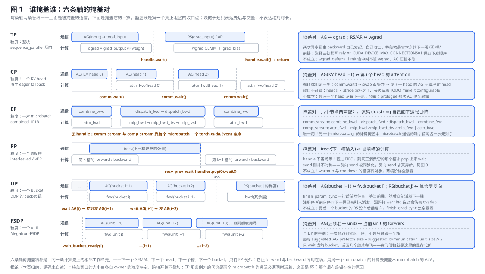
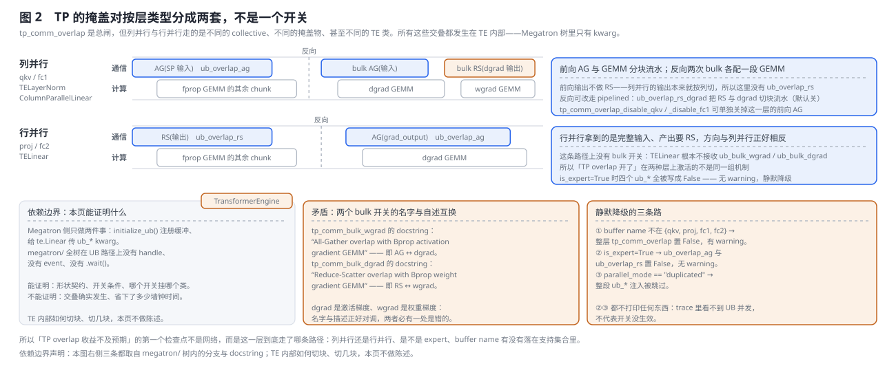
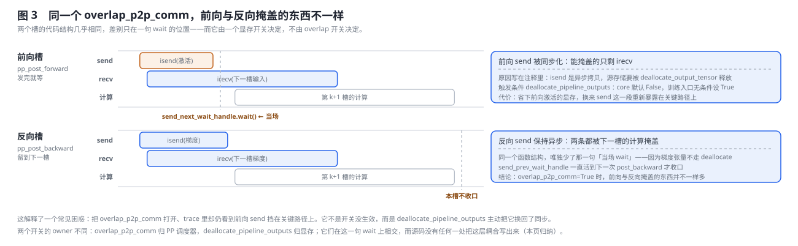
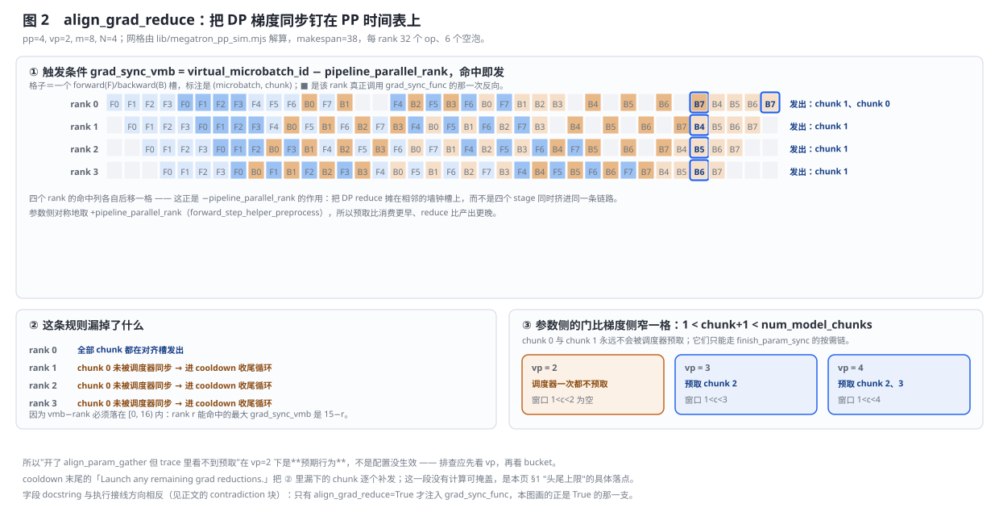
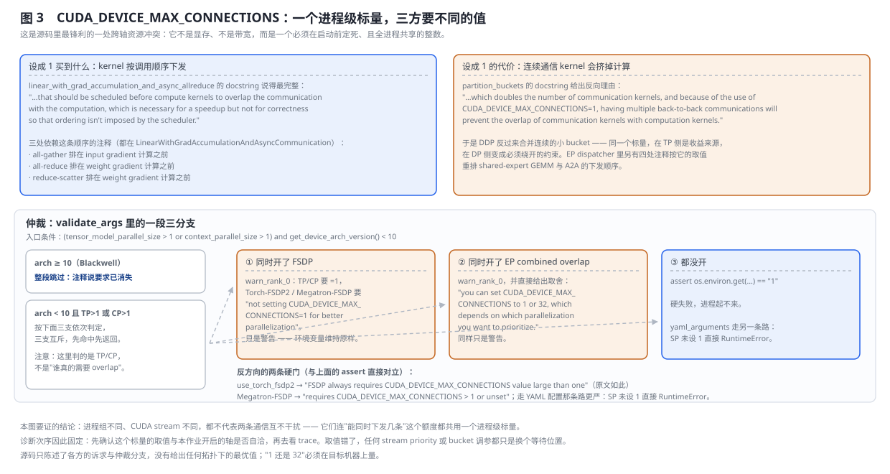
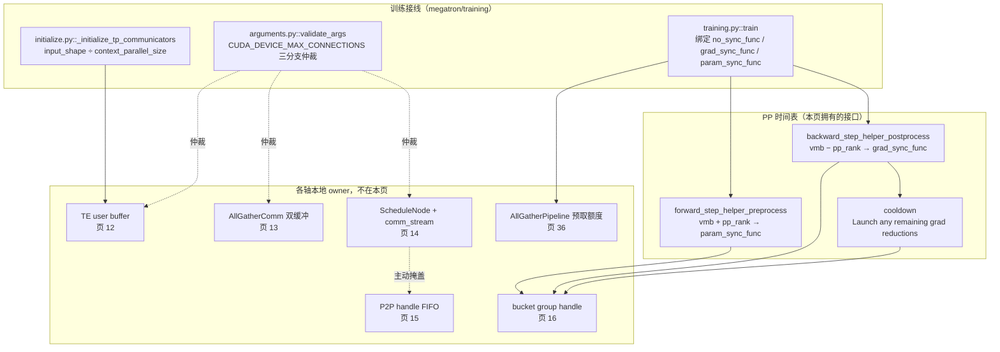

# Megatron-LM 跨轴通信掩盖：时间线、资源竞争与诊断

> **源码基线**：`NVIDIA/Megatron-LM@85902ef599ea4eb06ada7567a479c524b605767a`（`dev`，2026-09-01）
> **核心源码**：`megatron/core/tensor_parallel/layers.py`（原生 TP 反向的两对掩盖）、`megatron/core/transformer/dot_product_attention_context_parallel.py`（CP 的 KV 双缓冲）、`megatron/core/models/common/model_chunk_schedule_plan.py` 与 `megatron/core/pipeline_parallel/combined_1f1b.py`（EP 的两条 stream）、`megatron/core/pipeline_parallel/schedules.py`（PP 槽间的 recv/send 生命周期）、`megatron/core/distributed/param_and_grad_buffer.py`（DP 的 bucket 链）、`megatron/core/distributed/fsdp/src/megatron_fsdp/megatron_fsdp.py` 与同目录 `param_and_grad_buffer.py`（FSDP 的预取额度）、`megatron/core/extensions/transformer_engine.py`（TE user buffer 的 kwarg 边界）、`megatron/core/model_parallel_config.py`、`megatron/training/arguments.py`、`megatron/training/training.py`、`megatron/training/initialize.py`
> **中心结论**：把"通信被掩盖了"拆开，得到的从来不是一个笼统的并发，而是**一组具体的配对**——TP 用 dgrad GEMM 盖住输入的 all-gather、用 wgrad GEMM 盖住 grad_input 的 reduce-scatter；CP 用第 $i$ 个 KV head 的 attention 盖住第 $i+1$ 个 head 的 all-gather；EP 用另一个 microbatch 的 attention/MLP 盖住本 microbatch 的 dispatch/combine A2A；PP 用当前槽的计算盖住下一槽的 irecv；DP 用 bucket $i$ 的 forward 盖住 bucket $i+1$ 的参数 AG；FSDP 同形但一路预取到额度用尽。**六条配对里有五条的掩盖物都是本轴自己流水线上的相邻工作单元**，所以它们的 ready 事件互不相通、也不可能叠加；唯一的例外 EP 为此付出的代价是两份激活同时驻留。把它们真正捆在一起的是三样共享资源：一个必须在启动前定死的进程级 `CUDA_DEVICE_MAX_CONNECTIONS` 整数（TP/CP 要它等于 1、FSDP 与 EP overlap 要它大于 1，由 GPU 架构仲裁）、同一批物理链路与 SM、以及同一份峰值显存。因此本页拥有的不是第六份机制说明，而是**掩盖对本身加上它们的交界面**：每条轴的配对、收口点与失效条件，PP×DP 这一处唯一的公共对齐接口，三样共享资源的争用证据，以及"开关已开但吞吐没变"的诊断顺序。
> **适用范围**：本页覆盖 TP/CP/EP/PP/DP/FSDP 六条通信掩盖路径的**配对关系与组合行为**，以及唯一由本页拥有的两个配置实体（`align_grad_reduce`、`grad_sync_func`）。各轴的完整本地实现、通信量推导与配置全表归 12–16 与 36，本页不复制。`overlap_p2p_comm_warmup_flush`（warmup/flush 阶段的 P2P 掩盖）归 [[15_megatron_pp_schedulers_analysis]]，本页只在 §2.5 指出它正对着"头尾上限"这个位置。跨框架的通信-计算掩盖对比归 [[30_comm_compute_overlap_analysis]]。
> **最近更新**：2026-09-05。第二轮重写，把页面的正题从"窗口在哪一层"改成**具体谁掩盖谁**：新增 §2.1 逐轴给出 TP/CP/EP/PP/DP/FSDP 六条掩盖对（各含掩盖物、收口点、失效条件与代价），配一张六面板两泳道甘特总图；新增 §2.3 说明 TP 的掩盖对按列并行/行并行分成两套不同机制（含 `tp_comm_bulk_wgrad` / `tp_comm_bulk_dgrad` 名字与 docstring 互换这处矛盾），新增 §2.4 说明 `deallocate_pipeline_outputs` 让**前向 P2P send 实际是同步的**、`overlap_p2p_comm` 在前向只掩盖住了 recv。图从三张增至五张，`§1.3` 补上 FSDP 一行及其枚举依据，`§3.2` 补上 TP 原生反向与 DP/FSDP 预取两棵调用树，阅读路线由 7 行增至 10 行，开销结算按轴重算。上一轮（同日）已完成的：补上原先完全缺失的原理图、把 46 处 `path:line` 换成 `path::symbol`、补齐代码实现分析，并新增四处交界证据（`CUDA_DEVICE_MAX_CONNECTIONS` 三方仲裁、EP schedule 主动推迟 `attn_dw` 来掩盖 PP P2P、combined-1F1B 首尾各一次无对手、`vp=2` 时调度器一次都不预取参数），修正两处旧表述（非交错 schedule 连带关掉 `align_param_gather` 且 PP=1 时静默；expert 层 UB 被关闭时无 warning）。

---

## 1. 特性概览

### 1.1 问题背景

单轴页回答的是"这次 collective 何时发起、在哪里等待"。真实的 Megatron step 却可以同时包含 TP 的 AG/RS、CP 的 KV 搬运、EP 的 token A2A、PP 的 P2P，以及 DP 的梯度 RS 与参数 AG。每条路单独看都有合法的并发窗口，但组合之后仍有三个上限：

1. **依赖上限**：只有不消费该通信结果的计算才能做掩盖物；
2. **资源上限**：不同 CUDA stream 仍会争抢 SM、copy engine 和同一条物理链路，甚至争抢"能同时下发几条 kernel"这个进程级额度；
3. **头尾上限**：第一段通信之前没有前驱计算，最后一段之后没有后继计算，这些 exposed tail 无法靠"多开一个异步开关"消失。

因此评估的对象不是开了几个 flag，而是最终 critical path 上还露出多少通信、多少计算被通信拖慢，以及为了保持在飞状态多付了多少显存。

### 1.2 解决方法

Megatron 没有建统一的 overlap 框架，而是让每条路各自实现，再在**两个地方**做跨轴处理：一是 PP 时间表通过 `grad_sync_func` / `param_sync_func` 两个回调槽调用 DP 的异步同步（这是五轴之间**唯一**的显式协调接口）；二是在 `validate_args` 里对互斥的资源诉求做仲裁与告警。除此之外，跨轴的一致性完全靠"每条路自己收口"这条不变量维持。

本页因此不是第六份机制说明，而是这些交界面的 owner。

### 1.3 各轴的本地 owner（导航，不是说明）

**这份枚举的依据**不是某一个 `if/elif` 分发点——跨轴组合本来就没有单一选择点。它来自
`megatron/training/arguments.py::validate_args` 里**每条 overlap 开关各自的守卫**（`tp_comm_overlap`、
`overlap_p2p_comm`、`overlap_grad_reduce` / `overlap_param_gather`）加上
`megatron/core/transformer/transformer_config.py::TransformerConfig.__post_init__` 里的
`overlap_moe_expert_parallel_comm` 一族，以及 CP 那条由 `context_parallel_size > 1` 直接进入的原生路径。
换句话说：**一个轴出现在这张表里，当且仅当源码里存在一个专门为它做异步通信的开关或分支。**
FSDP 单列一行而不并进 DP，依据同样来自源码：它有自己的一套 `AllGatherPipeline` / `GradReducePipeline`
与自己的预取额度字段，掩盖窗口的长度规则与 DDP 的"只预取下一个桶"不同（§2.1.6）。

| 轴 | 本地触发点 → 等待点 | 唯一机制 owner |
|---|---|---|
| TP | TE user buffer 在 linear/GEMM 内做 pipelined 或 bulk AG/RS，依赖结果前收口 | [[12_megatron_tp_analysis]] |
| CP | TE 内核按 attention 块调度；原生 eager fallback 按 KV head 双缓冲 | [[13_megatron_cp_analysis]] |
| EP | dispatcher 负责 token A2A；共享专家与 A2A stream 旋钮也属 EP | [[14_megatron_ep_analysis\|EP dispatcher、shared expert 与训练闭环]] |
| PP | VPP 调度槽中延迟 P2P handle 的 `wait`；combined-1F1B 调度跨 microbatch 的 F/B | [[15_megatron_pp_schedulers_analysis\|VPP/P2P overlap 与 combined-1F1B]] |
| DP | backward hook 在 bucket ready 时发梯度 RS/AR，forward pre-hook 等当前参数 AG 并预取下一桶 | [[16_megatron_distributed_optimizer_analysis\|bucket readiness 与参数可见性闭环]] |
| FSDP | 与 DP 同形但预取更深：`AllGatherPipeline` 一路预取到额度用尽，只等当前桶 | [[36_megatron_fsdp_analysis]] |

**同级选择轴（存在但不在本页）。** 上表按"并行轴"切分，因此会漏掉那些**按阶段**而不是按轴回答同一个问题的开关。至少有三个，都已各有其主，本页只指路不解释：`overlap_param_gather_with_optimizer_step` 把参数 AG 推进 optimizer step 里去掩盖（归 [[16_megatron_distributed_optimizer_analysis]]，另见 [[26_megatron_optimizer_step_internals_deepdive]]）；`moe_shared_expert_overlap` 用共享专家的 GEMM 掩盖路由专家的 A2A（归 [[14_megatron_ep_analysis]]）；`overlap_dispatch_backward_with_experts_wgrad` 是 combined overlap 的**互斥替代**而非补充（同归 14）。把它们误当成"第六个轴"或"可以和 combined overlap 叠加"，是本页表格结构最容易诱发的读法错误。

### 1.4 收益、开销和约束

| 维度 | 直接收益 | 必付成本或边界 |
|---|---|---|
| 单轴掩盖 | 每条路都能把自己的通信藏进本地计算 | 藏得住的前提是本地有**不依赖该通信结果**的计算；头尾两段结构性地没有 |
| 多轴同开 | 不同轴的通信占据不同的依赖队列，可并发排队 | 并发排队 ≠ 并行执行：物理链路、SM 与下发额度都共享 |
| 跨轴对齐 | `align_grad_reduce` 让 PP 各 stage 在相邻墙钟槽发梯度 reduce，降低 microbatch 时间不匹配造成的空等 | 只覆盖 PP×DP 一处；且它自己也有漏网（§2.6） |
| 在飞状态 | 更多在飞通信 = 更多可掩盖的时间 | 峰值显存随在飞 buffer 线性上升；这是 overlap 唯一确定的代价 |
| 可诊断性 | 大部分非法组合有 assert 或 warning | **有几条是静默的**：expert 层的 UB 关闭无 warning；PP=1 时 `overlap_p2p_comm` 被关也不打印（§4.2） |

---

## 2. 详细方案

### 2.1 谁掩盖谁：六条轴的掩盖对

本页的正题只有一句话：**每条轴的哪一段通信，被哪一段计算盖住。** 先把六条轴的答案摆在一张图上，再逐条展开。



读法：每条轴两条管线，上面是被掩盖的通信、下面是掩盖它的计算，竖虚线是第一个真正阻塞的收口点。块的长短只表达先后与交叠，**不表达绝对时长**——真实比例取决于 shape、拓扑与后端，源码不对此做任何承诺。

#### 2.1.1 TP：AG 藏进 dgrad，RS 藏进 wgrad

`tensor_parallel/layers.py::LinearWithGradAccumulationAndAsyncCommunication.backward` 的函数体本身就是一张甘特：

1. `dist_all_gather_func(all_gather_buffer, input, async_op=True)`——把 SP 切开的输入沿序列维还原成 `total_input`，**wgrad 才用得上它**；
2. `grad_input = grad_output.matmul(weight)`——dgrad GEMM，**掩盖物就是它**。这一步只碰 `grad_output` 与 `weight`，不碰 `total_input`，所以可以在 AG 还在飞时算；
3. `handle.wait()`——第一次收口；
4. 发 `reduce_scatter`（SP）或 `all_reduce`（非 SP），把 `grad_input` 归约回去；
5. wgrad GEMM（`wgrad_gemm_accum_fp32` 或 `torch.matmul(grad_output.t(), total_input)`）与 `grad_bias = grad_output.sum(dim=0)`——**掩盖第 4 步**；
6. `handle.wait()`，然后 `return`。

两对掩盖都是同一个模式：**通信的结果下一步才用得上**。它们成立靠的不是 event 也不是 stream，而是 kernel 下发顺序——三处注释都写着 `Here we rely on CUDA_DEVICE_MAX_CONNECTIONS=1 to ensure that the … is scheduled before the … computation`。这条依赖的代价见 §2.8。

**掩盖不成立的条件**：`wgrad_deferral_limit` 命中时 `wgrad_compute = False`，`grad_output` 被攒进 `grad_output_buffer` 留待后算——第 1 步的 AG **根本不发**。此时反向只剩 dgrad 与归约，第二对掩盖仍在、第一对消失。

#### 2.1.2 CP：下一个 KV head 的 all-gather 藏进当前 head 的 attention

`dot_product_attention_context_parallel.py::AttentionFuncionWithContextParallel.forward` 的循环体是四个固定动作：

```python
for i in range(0, nheads_k, heads_k_stride):
    comm.wait()                                              # 收口上一个 head 的 AG
    kv_buffer, kv_buffer_copy = kv_buffer_copy, kv_buffer    # 双缓冲换手
    if i < nheads_k - heads_k_stride:
        comm.all_gather(kv_buffer_copy[0], send_k)           # 发下一个 head
        comm.all_gather(kv_buffer_copy[1], send_v)
    out_i, probs_i = eager_attn_fwd(q_i, k_i, v_i, ...)      # 掩盖物
```

掩盖对是 **head $i+1$ 的 KV all-gather ↔ head $i$ 的 attention**。双缓冲不是优化而是正确性要求：正在被 attention 读的 `kv_buffer` 与正在被 AG 写的 `kv_buffer_copy` 必须是两块内存。

**窗口大小不可调。** `heads_k_stride` 在这条路径上写死为 1，旁边留着 `ctx.heads_k_stride = heads_k_stride  # TODO make it configurable`。于是通信块是所有可能里最小的一个——一个 KV head 的 K 与 V。这既让掩盖物（单 head attention）足够短，也让 collective 足够碎。

**掩盖不成立的条件**：循环之前那次 prologue AG（head 0）前面没有任何计算，最后一个 head 也没有下一轮可预取。$n$ 个 head 得到 $n-1$ 对重叠加两个暴露端——§1.1 第三条“头尾上限”在 CP 轴上的形式。**代价**：双缓冲把 KV 的驻留量翻倍。

#### 2.1.3 EP：唯一一条借另一个 microbatch 来掩盖的轴

`combined_1f1b.py::combined_1f1b_schedule_for_no_pipelining` 的 docstring 一句话给出掩盖对：

> EP A2A in forward step is hidden by the attention/mlp computation in the backward step, and vice versa.

落到一层，`model_chunk_schedule_plan.py::TransformerLayerSchedulePlan.run` 的 docstring 自己画了两条 stream 的甘特：

```text
comm_stream: combine_bwd | dispatch_fwd->dispatch_bwd  | combine_fwd
comp_stream: attn_fwd    | mlp_bwd->mlp_bwd_dw->mlp_fwd| attn_bwd
```

三对掩盖逐列对齐：反向的 combine A2A ↔ 前向 attention；前向 dispatch 接反向 dispatch ↔ 反向 MLP 接前向 MLP；前向 combine ↔ 反向 attention。定序不靠 handle，靠每个 microbatch 一个共享的 `torch.cuda.Event`。

**为什么必须借另一个 microbatch？** 一个 microbatch 自己的 dispatch A2A 之后紧接着就是专家 GEMM，而那段 GEMM 正是在等 A2A 的输出，不能当掩盖物；同一层里再没有第三段与之独立的计算。所以 EP 只能横向去找。**代价直接来自这个选择**：两个 microbatch 的激活必须同时活着——这正是 `ep_overlap_early_attn_memory_release` 这个显存旋钮存在的原因（§2.7.3）。

**掩盖不成立的条件**：稳态循环是 `for i in range(num_microbatches - 1)`，前后各有一次单独执行，注释直接写 `# The forward step for the first microbatch is executed alone, no a2a overlapping` 与 `# The backward step for the last microbatch is executed alone, no a2a overlapping`。$m$ 个 microbatch 得到 $m-1$ 对与 2 个暴露端。

#### 2.1.4 PP：下一槽要吃的张量，藏进当前槽的计算

交错调度把 `p2p_communication.py::_p2p_ops` 返回的四个 handle 分流：`recv_prev` / `recv_next` 进两个 FIFO list，两个 send 各占一个单槽变量。掩盖对因此是 **下一槽的 irecv ↔ 当前槽的 forward/backward**——`pp_post_forward` 发完 recv 就把 handle `append` 进 `recv_prev_wait_handles`，直到真正消费它的那个槽才 `pop(0).wait()`。

send 侧并不对称，前向的 send 实际上是同步的；这一条单独展开在 §2.4。

**掩盖不成立的条件**：warmup 的第一次 `recv_forward` 是**阻塞**的，发生在任何计算存在之前；cooldown 开头先把剩余 backward handle 全 `.wait()` 干净，中间没有计算交错。针对这一段的旋钮是 `overlap_p2p_comm_warmup_flush`（默认 `False`），owner 是 [[15_megatron_pp_schedulers_analysis]]。

#### 2.1.5 DP：下一个 bucket 的参数 AG，藏进当前 bucket 的 forward

参数侧的掩盖对写在一个函数里。`param_and_grad_buffer.py::_ParamAndGradBucketGroup.finish_param_sync` 做两件事：等当前桶的 `param_gather_handle`，然后**立刻**调 `next_param_gather_bucket_group.start_param_sync()`。它返回之后本模块的 forward 才开始算——于是 **bucket $i+1$ 的 AG ↔ bucket $i$ 的 forward**。

梯度侧的 ready 条件不是“某一层算完了”，而是 `register_grad_ready` 里一个计数字典与“黄金”字典相等；相等即 `start_grad_sync` 发 RS/AR，掩盖物是**其余层尚未算完的反向**，收口在 step 尾的 `finish_grad_sync`。

**掩盖不成立的条件，源码自己写了**：若参数注册序与实际 forward 序不一致，下一个桶可能已被别处派发，`finish_param_sync` 会 warn「This may be caused by a mismatch between the order of parameter registration and forward pass execution, which will hurt the communication-computation overlap performance.」另一头，最后一个 bucket 的 RS 没有后继反向可掩盖，只能暴露在 `finish_grad_sync` 处。

#### 2.1.6 FSDP：同一个形状，但预取到额度用尽

Megatron-FSDP 的结构与 DP 同形，差别在**预取深度**。`AllGatherPipeline.all_gather_params` 不是只预取下一个桶，而是沿 `PrefetchOrder.FORWARD_PASS_ORDER` 一路预取到 `suggested_AG_prefetch_size` 用尽——`megatron_fsdp.py::MegatronFSDP` 里它等于 `suggested_communication_unit_size // 2`。随后 `all_gather_and_wait_parameters_ready` 调 `wait_bucket_ready(bucket_id, bwd)`，**只等当前那一个桶**，后面几个继续在飞。

掩盖对因此是 **后续若干 unit 的参数 AG ↔ 当前 unit 的 forward**，而在飞份数就是这里的显存代价——预取额度这个旋钮调的正是“用多少显存换多长的掩盖窗口”。

反向对称：`_pre_backward_param_unshard` 按 `BACKWARD_PASS_ORDER` 再来一轮；开了 `prefetch_recompute_forward_weights` 时它要连发三轮 `all_gather_and_wait_parameters_ready`（当前的 bwd、预取的 fwd、预取的 bwd）。梯度侧走 `grad_reduce_pipeline.reduce_gradients`，按 `suggested_RS_queue_capacity` 排队。完整状态机归 [[36_megatron_fsdp_analysis]]，本页只拥有它与其他轴的断面。

### 2.2 为什么没有统一的 overlap 框架

把 §2.1 六条并排看，结论就出来了：**掩盖物永远是“本轴自己流水线上的相邻工作单元”**——下一个 GEMM、下一个 head、下一个槽、下一个 bucket。六条轴的并发单位分别是 GEMM 整块或 chunk、一个 KV head、一对 microbatch、一个调度槽、一个 bucket、一个 FSDP unit；这是好几种由不同状态机产生的 ready 事件，既不能互相触发，也不能共用一个 ready/wait 协议。

唯一的例外是 EP：它让 forward 与 backward 同时在场，横向借另一个 microbatch 的计算。而它为此付的代价——两份激活同时驻留——恰好说明了为什么其他轴不这么做。

> [!note] 本页的架构归纳
> 源码分别呈现了这六种载体，但没有一处自述“为什么不建统一 overlap framework”。本页据依赖所在的抽象层重建该结论。被否掉的替代方案是“一个统一的 ready/wait 框架”，判据是这几种 ready 事件的粒度不可通约。这是有源码锚点的推断，不是作者的设计自述。

推论同样标为归纳：**跨轴调优不能在“发起点”上做**，只能在各自 owner 的窗口大小上做，再在 PP×DP 这一处唯一的公共接口上对齐（§2.6）。

### 2.3 TP 的掩盖对按层类型分成两套

§2.1.1 讲的是**原生**路径——`tp_comm_overlap=False` 时 Megatron 自己发的那两次异步。开了 `tp_comm_overlap` 之后，掩盖交给 TE 的 user buffer，而“谁掩盖谁”这时取决于该层是列并行还是行并行。



两个类接收的 kwarg 不同，这一点可以在 Megatron 树内直接读出来：

| 层 | TE 类 | 前向 | 反向 |
|---|---|---|---|
| qkv / fc1（列并行） | `TELayerNormColumnParallelLinear` | `ub_overlap_ag`：AG(SP 输入) ↔ fprop GEMM | 两个 bulk 开关 `ub_bulk_wgrad` / `ub_bulk_dgrad`，另加可选的 pipelined `ub_overlap_rs_dgrad`（默认关） |
| proj / fc2（行并行） | `TELinear` | `ub_overlap_rs`：RS(输出) ↔ fprop GEMM | `ub_overlap_ag`：AG(grad_output) ↔ dgrad GEMM |

方向相反是因为切法相反：列并行的输入要先 all-gather、输出天然按列切（所以前向没有 RS）；行并行的输入天然完整、输出必须 reduce-scatter。**`TELinear` 根本不接收 `ub_bulk_*`**——所以“我开了 TP overlap”在两种层上激活的不是同一组机制，这也是 `tp_comm_overlap_disable_qkv` / `tp_comm_overlap_disable_fc1` 只出现在列并行那个类里的原因。

> [!contradiction] 两个 bulk 开关的名字与自述互换
> `ModelParallelConfig.tp_comm_bulk_wgrad` 的 docstring 是「Controls **All-Gather** overlap with Bprop **activation gradient** GEMM」，而 `tp_comm_bulk_dgrad` 的是「Controls **Reduce-Scatter** overlap with Bprop **weight gradient** GEMM」。dgrad 就是激活梯度、wgrad 就是权重梯度：名字叫 `bulk_wgrad` 的那个描述的是 dgrad 的掩盖，反之亦然。两者必有一处错。本页只报告这处矛盾，**不替它选一边**——真正生效的语义在 TE 侧，那是本页的证据边界之外。

**三条静默降级路径。** 诊断“TP overlap 没收益”时先查这三条，再查网络：

| 条件 | 结果 | 有无日志 |
|---|---|---|
| `tp_comm_buffer_name` 不在 `["qkv", "proj", "fc1", "fc2"]` | 把**共享 config 对象**上的 `tp_comm_overlap` 翻成 `False` | `warnings.warn` |
| `is_expert=True` | `ub_overlap_ag` / `ub_overlap_rs` 置 `False` | **无** |
| `parallel_mode == "duplicated"` | 整段 `ub_*` 注入被跳过 | **无** |

> [!note] 依赖边界
> 上面两张表的每一行都取自 `megatron/` 树内的分支与字段声明，可以逐条核对。但**交叠本身发生在 TE 的 GEMM 内部**：Megatron 侧只有 `initialize.py::_initialize_tp_communicators` 注册缓冲、`TELinear.__init__` 与 `TELayerNormColumnParallelLinear.__init__` 传 kwarg，全树在 UB 路径上没有 handle、event 或 `.wait()`。本页能证明形状契约、开关条件与降级分支；**不能**证明交叠确实发生，也不能说 TE 把 GEMM 切成了几块。图 2 上半两条泳道画的是这些 kwarg 与 docstring 声明的公开语义，不是本页读过的执行。

### 2.4 同一个 `overlap_p2p_comm`，前向与反向掩盖的东西不一样

§2.1.4 说 PP 的 recv 被下一槽的计算掩盖。send 侧则有一处不对称：两个函数几乎同构，只差一句 `wait` 的位置。



`schedules.py::forward_backward_pipelining_with_interleaving` 里——`pp_post_forward` 发出 `send_next` / `recv_prev` 之后，比反向多一段：

```python
# isend() copies asynchronously; wait until the copy is done before
# freeing the source buffer, otherwise the next PP stage gets corrupted data.
if send_next_wait_handle is not None and config.deallocate_pipeline_outputs:
    send_next_wait_handle.wait()
    send_next_wait_handle = None
```

`pp_post_backward` 的结构完全相同，但**没有**这一段：`send_prev_wait_handle` 一直活到下一次 `pp_post_backward` 才收口。

差别的根源不是 PP 开关，是**显存开关**。前向输出会被 `deallocate_output_tensor` 释放存储（这是 PP 省激活显存的手段），而 `isend` 是异步拷贝——源缓冲在拷完之前不能释放，所以必须当场等。反向的 `input_tensor_grad` 不走这条释放路径，于是不必等。

**而 `deallocate_pipeline_outputs` 在训练路径上是常开的**：`ModelParallelConfig` 里它默认 `False`，但 `arguments.py::core_transformer_config_from_args` 有一行无条件赋值 `kw_args['deallocate_pipeline_outputs'] = True`。也就是说，走标准训练入口时，**前向的 P2P send 实际上是同步的，`overlap_p2p_comm` 在前向只掩盖住了 recv**。

> [!note] 本页归纳
> 两个开关的 owner 不同：`overlap_p2p_comm` 归 PP 调度器，`deallocate_pipeline_outputs` 归显存策略。它们在这一句 `wait` 上相交，而源码没有任何一处把这层耦合写出来——上面的因果是本页从两处代码加一条注释重建的。它解释了一个常见困惑：开关明明打开了，trace 里前向 send 仍挡在关键路径上；那不是开关没生效，是显存策略主动把它换回了同步。

### 2.5 一个 step 中的跨轴候选时间线

下表是**依赖顺序**，不是假设每个作业都开启五轴的固定 trace。具体分支由 PP/VPP、是否 MoE、`cp_comm_type` 与分片策略决定。

| 阶段 | 前台工作 | 可能在后台的通信 | 必须收口的边界 |
|---|---|---|---|
| 1. 进入新 chunk / 新前向 | 上一个 model chunk 或 optimizer 尾部工作 | DP 参数 AG 预取 | 该 module 的 forward pre-hook 在读参数前 `finish_param_sync` |
| 2. dense attention / MLP 前向 | 当前 layer 的 GEMM/attention | TP user-buffer AG/RS；CP 的下一个 KV head | 当前 GEMM/head 真正需要对应输入时 |
| 3. MoE 层稳态 | microbatch $i$ 的 backward attention/MLP 与 $i+1$ 的 forward 子节点 | 对侧 microbatch 的 EP dispatch/combine A2A | 专家 GEMM 消费 dispatched token、或 residual 消费 combined output 之前 |
| 4. PP stage 边界 | 下一个 forward/backward 调度槽 | 上一槽的 activation/gradient P2P | 接收张量被计算消费、或异步 send 的源存储被释放之前 |
| 5. transformer backward | 从输出向输入的 dgrad/wgrad | 已就绪 DP bucket 的 RS/AR；TP 反向 AG/RS | 下一个依赖梯度的计算或 step 尾 `finish_grad_sync` |
| 6. PP cooldown / 梯度收尾 | 剩余 backward 槽与未同步 model chunk | 对齐后的 DP grad reduce、剩余 P2P | 调度器显式启用梯度同步并派发遗留 chunk |
| 7. optimizer 边界 | 梯度校验与参数更新 | 不应再有未被 owner 持有的必需梯度通信 | optimizer 读梯度之前所有必需同步完成；step 内部归 [[26_megatron_optimizer_step_internals_deepdive]] |

**这条时间线的关键不是"越早 dispatch 越好"。** PP 调度器在两个对称位置写了同一段注释，把理由说得很直接：

> Note: Asynchronous communication tends to slow down compute. To reduce idling from mismatched microbatch times, we launch asynchronous communication at the same time across the pipeline-parallel group.

（`schedules.py::forward_backward_pipelining_with_interleaving` 的 `forward_step_helper_preprocess` 与 `backward_step_helper_postprocess` 各一份。）

**头尾暴露段在源码里被直接命名了。** `combined_1f1b.py::combined_1f1b_schedule_for_no_pipelining` 的稳态循环是 `for i in range(num_microbatches - 1)`，前后各有一次单独执行，注释分别写着 `# The forward step for the first microbatch is executed alone, no a2a overlapping` 和 `# The backward step for the last microbatch is executed alone, no a2a overlapping`。于是 $m$ 个 microbatch 恰好得到 $m-1$ 对重叠加 **2 个暴露端**——这就是 §1.1 第三条"头尾上限"在 EP 轴上的精确形式。

PP 轴上的对应物是 warmup 与 cooldown：warmup 的第一次 `recv_forward` 是**阻塞**的，发生在任何计算存在之前；cooldown 开头先把剩余的 backward handle 全部 `.wait()` 干净，中间没有计算交错，结尾还有一段串行的 `# Launch any remaining grad reductions.`。针对这一段的旋钮是 `overlap_p2p_comm_warmup_flush`，docstring 写「If true, overlap communication and computation in warm up and flush phase. Only valid when overlap_p2p_comm is True and batch_p2p_comm is False. Defaults to False.」——**它归 [[15_megatron_pp_schedulers_analysis]]**，本页只指出它正对着这个位置。

### 2.6 PP×DP：唯一的公共对齐接口

这是五轴之间唯一的显式协调点，也是本页拥有的两个配置实体所在。

**接线在训练侧。** `megatron/training/training.py::train` 只在模型是 Megatron-FSDP/DDP 且 `overlap_grad_reduce=True` 时接管 `no_sync_func`；若另有自定义 `no_sync_func` 会被 assert 拒绝。当 `align_grad_reduce=True` 时，它再把各 model chunk 的 `start_grad_sync` 绑到 `config.grad_sync_func`；参数侧对称地在 `overlap_param_gather and align_param_gather` 时绑定 `start_param_sync`。两者有一处不对称容易漏掉：**`grad_sync_func` 的绑定嵌套在 `isinstance(...) and overlap_grad_reduce` 那个块里，`param_sync_func` 的绑定则在外层缩进、与它独立。**

**"对齐"的实现是改写触发条件。** 回调最终由 PP 时间表调用，两侧各带一个与 rank 相关的偏移：

- 前向 `forward_step_helper_preprocess`：`param_sync_virtual_microbatch_id = virtual_microbatch_id + pipeline_parallel_rank`——靠后的 PP rank 看得**更远**；
- 反向 `backward_step_helper_postprocess`：`grad_sync_virtual_microbatch_id = virtual_microbatch_id - pipeline_parallel_rank`——靠后的 PP rank 发得**更晚**。



把 $pp=4$、$vp=2$、$m=8$、$N=4$ 的真实调度解出来（makespan 38，每 rank 32 个 op、6 个空泡），四个 rank 的 grad_sync 命中列**各自后移一格**——这正是 $-\text{pp\_rank}$ 的作用：把 DP reduce 摊在相邻的墙钟槽上，而不是四个 stage 同时挤进同一条链路。

**但这条规则有两处漏网，两处都能算出来：**

**① 梯度侧：`vmb - rank` 必须落在 $[0, 16)$ 内。** rank $r$ 能命中的最大 `grad_sync_vmb` 是 $15-r$。本例两个"最后一个 microbatch"落在 `vmb = 11`（对应 chunk 1）与 `vmb = 15`（对应 chunk 0）。于是只有 rank 0 两个都命中；**rank 1、2、3 上 chunk 0 的梯度归约完全没被调度器发出**，只能落进 cooldown 末尾那段 `# Launch any remaining grad reductions.` 的串行补发——而那一段没有计算可掩盖。

**② 参数侧的门比梯度侧还窄一格。** 触发链最后一道是 `if 1 < param_sync_chunk_id < num_model_chunks`，其中 `param_sync_chunk_id = get_model_chunk_id(...) + 1`。于是 chunk 0 与 chunk 1 **永远不会被调度器预取**。逐个 $vp$ 代进去：

| $vp$ | 窗口 | 调度器预取的 chunk |
|---|---|---|
| 2 | $1 < c < 2$ | **一次都不预取** |
| 3 | $1 < c < 3$ | chunk 2 |
| 4 | $1 < c < 4$ | chunk 2、3 |

所以"开了 `align_param_gather` 但 trace 里看不到调度器发起的预取"在 $vp=2$ 下是**预期行为**，不是配置没生效。chunk 0 与 chunk 1 的 AG 走的是 `finish_param_sync` 里的按需链。排查这一条应该先看 $vp$，再看 bucket。

> [!contradiction] `align_grad_reduce` 字段注释的方向与执行接线相反
> `megatron/training/config/common_config.py::DistributedInitConfig.align_grad_reduce` 默认值 `True`，docstring 写「If not set, all PP stages will launch gradient reduces simultaneously. Otherwise, each PP stage will independently launch as needed.」——这与执行接线正好相反：只有 `args.align_grad_reduce=True` 才注入 `grad_sync_func`，随后 PP schedule 在对齐槽调用它。
> 这不能用"它描述的是一个 `--no-` 开关"来解释：全树搜索 `align_grad_reduce` 只有两处命中——这行声明和 `training.py` 里的 `if args.align_grad_reduce:`，**没有任何 `action='store_false'` 的负向 CLI flag**（对比 `align_param_gather`，它确实还带着 `dest='align_param_gather'`）。因此本页以 wiring + schedule 作为当前行为证据；字段声明只证明默认值和这处源码内部冲突。上图画的正是 `True` 的那一支。

### 2.7 另外三处交界

#### 2.7.1 TP×CP：CP 先改变本地 token shape，TP user buffer 再据此初始化

TP user buffer 的第一维不是全局 `seq_length × micro_batch_size`，而是再除以 `context_parallel_size`（`initialize.py::_initialize_tp_communicators` 的 `input_shape`，decoder 与默认两个分支都做这个除法）。这是一个真正的跨轴数据契约：CP 决定每个 rank 的 token shape，TP overlap 用该 shape 预注册 TE 缓冲。它**不意味着** TP collective 与 CP collective 会自动彼此掩盖；只能说两者在形状上已正确接线。

#### 2.7.2 TP×EP：普通 linear 的 UB overlap 不自动适用于 expert linear

`transformer_engine.py::TELinear.__init__` 在 `is_expert` 时把全部 `ub_*` kwarg 置为 `False`，两个版本分支各一份，前面都带着 `# Disable ub overlap for experts.`。类 docstring 给了理由：「Note: For expert linear layers, we will disable communication logic here as TP communication is handled in token_dispatcher.」

这条关闭**没有任何 warning**，与它相邻的 buffer-名不支持那条则会 `warnings.warn`——两者的完整对照见 §2.3 的静默降级表。跨轴的读法是：dense attention 那层的 TP 掩盖对成立，**不能推出**同一层里 MoE expert 的 ETP 也有同样的掩盖。expert 侧的通信由 dispatcher 负责，应回到 [[14_megatron_ep_analysis]] 和 combined schedule 判断，而不是在全局 trace 里把两条线合并。

#### 2.7.3 PP×EP：细粒度 schedule 既绕开 wrapper，也主动掩盖 P2P

combined-1F1B 直接调度 layer 子节点，会绕过 Megatron-FSDP wrapper 的常规 forward hook。无 PP 宿主在进入 schedule 前显式 `_replace_param_with_raw_if_needed()`，注释写明原因：「The overlap schedule bypasses MegatronFSDP.forward(), which normally swaps distributed (optimizer-managed) parameters back to raw parameters. We must do this explicitly before the schedule accesses layers directly.」并由 `model_chunk_schedule_plan.py::TransformerLayerSchedulePlan.set_fsdp_reshard_hooks` 补挂 release hook——它的 docstring 把这条边界说得最完整：「The EP overlap schedule bypasses the normal FSDP forward/backward hooks … because it calls sub-modules directly instead of going through TransformerLayer.forward().」而 VPP 多 chunk 路径尚未处理这个生命周期，因此显式拒绝 `virtual_pipeline_model_parallel_size > 1` + FSDP + EP overlap。

**更值得记的是反方向：EP schedule 主动拿自己的计算去掩盖 PP 的 P2P。** `TransformerModelChunkSchedulePlan` 里三处注释是本页唯一一处"两条轴被显式共同调度"的证据：

> post_forward()/send_forward_recv_forward() is running in the communication stream, so the p2p comm could be overlapped with the attn backward
> post_backward()/send_backward_recv_backward() is running in the computation stream, so the p2p comm could be overlapped with the wgrad of attn backward
> Delay the last attn_dw in backward pass (attn_dw of the first layer) for overlapping with the p2p comm

第三条尤其说明问题：为了掩盖 P2P，schedule **故意把某个 wgrad 往后推**。这不是自动发生的重叠，是手写进调度顺序里的。

通用判据是：**某个 overlap schedule 若绕过参数/梯度 wrapper，必须重新审计 all-gather、release、pre-backward 和 post-backward 的 owner**。FSDP 的完整状态机归 [[36_megatron_fsdp_analysis]]。

`ep_overlap_early_attn_memory_release` 改的正是 §2.1.3 那条两流时间线上 `attn.backward` 的位置：关闭时它在 `moe_combine.forward` 之后，开启时提到 `mlp.forward` 之前。字段 docstring 把这笔交易写得很直白——更早释放激活，但会使 `moe_combine_fwd` 与 `moe_dispatch_bwd` 重新暴露。这正是 §2.1.3 那个"借另一个 microbatch"的选择必须付的账：两份激活同时驻留，所以需要一个专门的旋钮把其中一份提前还掉，代价是重新暴露两段 A2A。该开关的调度 owner 是 [[15_megatron_pp_schedulers_analysis]]；本页只用它说明全局优化目标必须同时包含 wall-clock 和 peak memory。

### 2.8 资源争用：一个进程级标量，三方要不同的值

`stream` 分开的是依赖队列，没有凭空增加硬件。这一点在源码里有三处直接证据，以及**一处决定性的证据**。



**设成 1 买到的是 kernel 下发顺序。** `tensor_parallel/layers.py::linear_with_grad_accumulation_and_async_allreduce` 的 docstring 说得最完整：

> Use of this module requires that the environment variable CUDA_DEVICE_MAX_CONNECTIONS=1. There are a few collective operations, noted in the code, that should be scheduled before compute kernels to overlap the communication with the computation, which is necessary for a speedup but not for correctness so that ordering isn't imposed by the scheduler. Setting CUDA_DEVICE_MAX_CONNECTIONS=1 forces the kernels to be scheduled in the order they are called.

`LinearWithGradAccumulationAndAsyncCommunication.backward` 里三处注释各自依赖这条顺序：all-gather 排在 input gradient 之前、all-reduce 排在 weight gradient 之前、reduce-scatter 排在 weight gradient 之前。注意 docstring 那半句——**这是收益必需，不是正确性必需**。

**设成 1 的代价是连续通信 kernel 会挤掉计算。** `param_and_grad_buffer.py::partition_buckets` 的 docstring 给出反向理由：「…which doubles the number of communication kernels, and because of the use of CUDA_DEVICE_MAX_CONNECTIONS=1, having multiple back-to-back communications will prevent the overlap of communication kernels with computation kernels.」于是 DDP 反过来**合并**连续的小 bucket。同一个标量，在 TP 侧是收益来源，在 DP 侧变成必须绕开的约束。EP dispatcher 里另有四处注释按它的取值重排 shared-expert GEMM 与 A2A 的下发顺序。

**仲裁写在 `megatron/training/arguments.py::validate_args` 的一段三分支里**，入口条件是 `(tensor_model_parallel_size > 1 or context_parallel_size > 1) and get_device_arch_version() < 10`，其上一行注释是 `# CUDA_DEVICE_MAX_CONNECTIONS requirement no longer exists since the Blackwell architecture`：

| 分支 | 结果 |
|---|---|
| 同时开了 FSDP | 只 warn：TP/CP 要 =1，而 `{fsdp_impl}` 「requires not setting CUDA_DEVICE_MAX_CONNECTIONS=1 for better parallelization」。环境变量维持原样 |
| 同时开了 `overlap_moe_expert_parallel_comm` | 只 warn，并直接给出取舍：「you can set CUDA_DEVICE_MAX_CONNECTIONS to 1 or 32, which depends on which parallelization you want to prioritize.」 |
| 都没开 | 硬 `assert os.environ.get('CUDA_DEVICE_MAX_CONNECTIONS') == "1"`，进程起不来 |

反方向还有两条硬门与上面的 assert 直接对立：`use_torch_fsdp2` 要求「FSDP always requires CUDA_DEVICE_MAX_CONNECTIONS value large than one」，Megatron-FSDP 要求「requires CUDA_DEVICE_MAX_CONNECTIONS > 1 or unset」。走 YAML 配置那条路更严：`yaml_arguments.py` 对未设 1 的 SP 直接 `RuntimeError`，而 `arguments.py` 在同样情形下只 warn。

**这是本页立论最锋利的一处源码依据**：进程组不同、CUDA stream 不同，都不代表两条通信互不干扰——它们连"能同时下发几条"这个额度都共用一个必须在启动前定死的整数。诊断次序因此固定：先确认这个标量的取值与本作业开启的轴是否自洽，再去看 trace。

**另外两处争用证据**：PP 调度器那两段"asynchronous communication tends to slow down compute"（§2.5）；以及 EP 允许把 A2A 通信流设为 CUDA 高优先级——`pipeline_parallel/utils.py::set_streams` 用 `torch.cuda.Stream.priority_range()` 创建该流，两个 combined schedule 宿主都会调它。这里有个陷阱：`set_streams` 的实现是 `if _COMM_STREAM is None:`，所以**优先级在第一次调用时定死**，第二个宿主再传一个不同的 `high_priority` 是静默 no-op。完整旋钮归 [[14_megatron_ep_analysis]]。

> [!note] 运行时推断
> 上述代码能证明"异步通信可拖慢计算"、"连续通信 kernel 可破坏 overlap"、"下发额度是进程级共享的"与"A2A 可提高 stream priority"。由此可推得：进程组不同或 CUDA stream 不同，只表示调度队列可独立推进，不表示它们拥有独立 NIC/NVLink/SM。具体争用哪项硬件必须以目标机器的 profiler trace 为准，源码没有对任意拓扑做这个保证；"1 还是 32"同样必须实测。

### 2.9 三类不能靠更多 stream 解决的瓶颈

| 瓶颈 | trace 特征 | 优先检查 |
|---|---|---|
| 下发额度错配 | 通信与计算都没变快，甚至一起变慢；换 `CUDA_DEVICE_MAX_CONNECTIONS` 有明显方向性影响 | §2.8 的三分支：本作业开的轴到底要 1 还是要 >1 |
| 带宽饱和 | 多条 collective 时间重叠，但单条的 duration 同时拉长，compute 也被拖慢 | TP/CP/EP/PP/DP 的进程组是否落在同一跨节点物理链路；先只保留一条跨机 overlap 做对照 |
| kernel 过碎 | 大量小 collective 背靠背，中间没有计算 kernel 取得进展 | DP 的 bucket/`num_buckets`、PP 的 P2P 粒度、是否在单连接顺序下造成通信连发 |
| 在飞缓冲过多 | 吞吐略升或不变，但峰值显存上升/OOM | PP recv buffer、TP user buffer、CP KV 双缓冲、EP 跨 microbatch 激活与 DP RS/AG 中间状态是否在同一时刻存活 |

DP 已给出一个可复用的治理模式：fp32-accumulation RS 在派发新 bucket 前排空已发起的前驱 bucket，从而给中间 all-to-all 输出的在飞数量设上界。源码同时坦白了它的不完备：「backward param ordering does not always match bucket linkage order (e.g. NVFP4 bucket layouts), so the predecessor may not have fired yet when we arrive here.」完整机制归 [[16_megatron_distributed_optimizer_analysis\|bucket readiness、RS 与在飞工作边界]]。

---

## 3. 代码实现分析

### 3.1 所有权：跨轴接口只有两处



图上只有两条实线跨轴：`param_sync_func` 与 `grad_sync_func`。`validate_args` 的仲裁是虚线，因为它不搬数据，只在启动时否决或告警。EP → PP 那条虚线是 §2.7.3 里手写进调度顺序的掩盖。

### 3.2 调用树

**PP×DP 对齐的真实路径：**

```text
megatron/training/training.py::train
`-- config.no_sync_func = ...                      # 仅 DDP/FSDP 且 overlap_grad_reduce
`-- if args.align_grad_reduce:
|   `-- config.grad_sync_func = [chunk.start_grad_sync for chunk in model]
`-- if args.overlap_param_gather and args.align_param_gather:
    `-- config.param_sync_func = [chunk.start_param_sync for chunk in model]

schedules.py::forward_backward_pipelining_with_interleaving
`-- forward_step_helper(vmb)
|   `-- forward_step_helper_preprocess(vmb)
|   |   `-- param_sync_vmb = vmb + pipeline_parallel_rank
|   |   `-- if 1 < chunk+1 < num_model_chunks:      # ← vp=2 时窗口为空
|   |       `-- config.param_sync_func[chunk+1](...)
|   |           `-- _ParamAndGradBucketGroup.start_param_sync   # (16)
|   `-- forward_step(...)
|   `-- forward_step_helper_postprocess(...)        # 仅记账
`-- backward_step_helper(vmb)
    `-- backward_step_helper_preprocess(vmb)
    `-- backward_step(...)
    `-- backward_step_helper_postprocess(vmb)
        `-- grad_sync_vmb = vmb - pipeline_parallel_rank
        `-- if is_last_microbatch_for_model_chunk(grad_sync_vmb):
            `-- enable_grad_sync()
            `-- config.grad_sync_func[chunk](...)   # → start_grad_sync  (16)
            `-- synchronized_model_chunks.add(chunk)
        `-- disable_grad_sync()

    ... cooldown 末尾 ...
    `-- enable_grad_sync()
    `-- for chunk not in synchronized_model_chunks: # ← §2.6 ① 的漏网在这里补
        `-- config.grad_sync_func[chunk](...)
```

**TP 原生反向的两对掩盖（本页唯一一条能在 Megatron 树内读完的掩盖路径）：**

```text
tensor_parallel/layers.py::LinearWithGradAccumulationAndAsyncCommunication.backward
`-- if sequence_parallel and wgrad_compute:
|   `-- dist_all_gather_func(all_gather_buffer, input, async_op=True)   # 发 ①
`-- grad_input = grad_output.matmul(weight)                            # 掩盖 ①（dgrad）
`-- if sequence_parallel and wgrad_compute:
|   `-- handle.wait()                                                  # 收口 ①
`-- prepare_input_tensors_for_wgrad_compute(grad_output, total_input)
`-- if allreduce_dgrad:  handle = all_reduce(grad_input, async_op=True) # 发 ②（非 SP）
`-- if sequence_parallel: handle = dist_reduce_scatter_func(...)        # 发 ②（SP）
`-- fused_weight_gradient_mlp_cuda.wgrad_gemm_accum_fp32(...)           # 掩盖 ②（wgrad）
`-- grad_bias = grad_output.sum(dim=0)
`-- handle.wait()                                                       # 收口 ②，然后 return
```

**DP 参数侧"等当前桶、立刻发下一桶"：**

```text
distributed_data_parallel.py::DistributedDataParallel  （forward pre-hook）
`-- _ParamAndGradBucketGroup.finish_param_sync
    `-- if not param_gather_dispatched: start_param_sync()   # 首桶补发
    `-- param_gather_handle.wait()                           # 收口当前桶
    `-- next_param_gather_bucket_group.start_param_sync()    # 立刻发下一桶 ← 掩盖点
    |   `-- 若下一桶已被派发 → warnings.warn（注册序 ≠ 前向序）
    `-- _finalize_layerwise_param_sync() / _post_param_sync()
    （返回后本模块 forward 才开始算，掩盖的就是上面那次 start_param_sync）

fsdp/src/megatron_fsdp/megatron_fsdp.py::MegatronFSDP._pre_forward_param_unshard
`-- all_gather_and_wait_parameters_ready(params, prefetch=True, FORWARD_PASS_ORDER)
    `-- AllGatherPipeline.all_gather_params(...)              # 预取到额度用尽
    `-- for param: AllGatherPipeline.wait_bucket_ready(...)   # 只等当前桶
```

**EP schedule 掩盖 PP P2P 的路径：**

```text
model_chunk_schedule_plan.py::TransformerModelChunkSchedulePlan.run
`-- TransformerLayerSchedulePlan.run(f_layer, b_layer)   # docstring 里那张两流甘特
|   `-- comm_stream: combine_bwd → dispatch_fwd → dispatch_bwd → combine_fwd
|   `-- comp_stream: attn_fwd → mlp_bwd → mlp_bwd_dw → mlp_fwd → attn_bwd
|       `-- attn.backward 的位置由 ep_overlap_early_attn_memory_release 决定
`-- with torch.cuda.stream(get_comm_stream()):
|   `-- post_forward() / send_forward_recv_forward()      # P2P 藏进 attn backward
`-- post_backward() / send_backward_recv_backward()       # P2P 藏进 attn wgrad
`-- b_layer.attn.backward_dw()                            # 故意推迟，用来掩盖 P2P
```

### 3.3 源码阅读路线

| # | 关注点 | 入口 → 收口 |
|---|---|---|
| 1 | 跨轴接线 | `megatron/training/training.py::train`（三个回调的绑定）→ `megatron/core/model_parallel_config.py::ModelParallelConfig.grad_sync_func` |
| 2 | 对齐的触发条件 | `schedules.py::forward_backward_pipelining_with_interleaving.forward_step_helper_preprocess` / `.backward_step_helper_postprocess` → `.get_model_chunk_id` / `.is_last_microbatch_for_model_chunk` |
| 3 | 头尾暴露 | `combined_1f1b.py::combined_1f1b_schedule_for_no_pipelining`（两条注释）；PP 侧 `schedules.py` 的 warmup/steady/cooldown 三段 NVTX 与 `model_parallel_config.py::ModelParallelConfig.overlap_p2p_comm_warmup_flush` |
| 4 | 资源仲裁 | `megatron/training/arguments.py::validate_args`（三分支）→ `tensor_parallel/layers.py::linear_with_grad_accumulation_and_async_allreduce`（docstring + warn-once）→ `distributed/param_and_grad_buffer.py::partition_buckets` |
| 5 | EP×PP 共同调度 | `models/common/model_chunk_schedule_plan.py::TransformerLayerSchedulePlan.run` → `::TransformerModelChunkSchedulePlan.run` → `::TransformerLayerSchedulePlan.set_fsdp_reshard_hooks` |
| 6 | stream 单例 | `pipeline_parallel/utils.py::set_streams`（注意 `if _COMM_STREAM is None` 的幂等守卫）→ `::ScheduleNode.stream_acquire_context` |
| 7 | 掩盖对本身 | `tensor_parallel/layers.py::LinearWithGradAccumulationAndAsyncCommunication.backward`（TP 两对）→ `transformer/dot_product_attention_context_parallel.py::AttentionFuncionWithContextParallel.forward`（CP 双缓冲循环）→ `models/common/model_chunk_schedule_plan.py::TransformerLayerSchedulePlan.run`（EP 两流甘特） |
| 8 | 桶链的预取深度 | `distributed/param_and_grad_buffer.py::_ParamAndGradBucketGroup.finish_param_sync`（DP：只发下一个）→ `distributed/fsdp/src/megatron_fsdp/param_and_grad_buffer.py::AllGatherPipeline.all_gather_params` / `::AllGatherPipeline.wait_bucket_ready`（FSDP：发到额度用尽、只等当前） |
| 9 | send 的不对称 | `schedules.py::forward_backward_pipelining_with_interleaving` 的 `pp_post_forward` 与 `pp_post_backward` 对读 → `megatron/training/arguments.py::core_transformer_config_from_args` 里 `deallocate_pipeline_outputs = True` 那一行 |
| 10 | 静默失效 | `extensions/transformer_engine.py::TELinear.__init__`（expert 分支无 warning；buffer 名分支改 `self.config`）→ `megatron/training/arguments.py::validate_args` 的非交错分支 |

---

## 4. 硬约束：先区分"不能跑"与"能跑但没收益"

### 4.1 不满足就报错或被强制改写

| 组合 | 硬门 | 证据锚点 |
|---|---|---|
| TP overlap | 必须开 SP；初始化环境必须可导入 TE 与 YAML；每个 TE linear 必须有 `tp_comm_buffer_name` | `arguments.py::validate_args`；`initialize.py::_initialize_tp_communicators`；`transformer_engine.py::TELinear.__init__` |
| DP param gather | 需 distributed optimizer、Megatron-FSDP 或 `dist_muon` 之一，且必须同时开 grad reduce overlap | `arguments.py::validate_args` |
| PP P2P overlap | 只在 interleaved/VPP schedule 启用；`batch_p2p_comm`（默认 `True`）与它互斥 | `arguments.py::validate_args`；`model_parallel_config.py::ModelParallelConfig.overlap_p2p_comm` / `.batch_p2p_comm` |
| PP warmup/flush overlap | 需 `overlap_p2p_comm=True` 且 `batch_p2p_comm=False`，否则 `ValueError` | `model_parallel_config.py::ModelParallelConfig.__post_init__` |
| EP combined overlap | torch ≥ 2.6、EP>1、dispatcher 为 `alltoall`/`flex`；PP>1 时必须有 VPP | `transformer_config.py::TransformerConfig.__post_init__` |
| delayed wgrad | `delay_wgrad_compute` 必须与 combined overlap 同开；与 `overlap_dispatch_backward_with_experts_wgrad` 互斥（后者反而要求**不**开 combined overlap） | 同上，两处独立守卫 |
| early attention release | 必须已开 combined overlap | 同上 |
| dynamic/hybrid CP × PP | 当前 schedule 明写 per-token loss + no PP；混合 CP 调度器仍留 `# TODO[pmannan]: PP not yet supported.` | `schedules.py::forward_step_calc_loss`；`hybrid_cp_schedule.py::BalancedCPScheduler.next_hdp_group` |
| EP overlap × VPP × FSDP | 多 chunk 模型列表上显式 assert 不支持 | `combined_1f1b.py::combined_1f1b_schedule_for_interleaved_pipelining` |
| TP/CP × (FSDP 或 EP overlap)，arch < 10 | 只 warn，不阻止——但两侧对 `CUDA_DEVICE_MAX_CONNECTIONS` 的要求互斥（§2.8） | `arguments.py::validate_args` |

### 4.2 正确性仍成立，但 overlap 可能实际为零

| 症状 | 已知的静默/警告型原因 | 第一个核对点 |
|---|---|---|
| PP 开关在 CLI 中设了，trace 里仍是同步 P2P | 没有 VPP 时 `validate_args` 把 `overlap_p2p_comm` 置 `False`——**并连带把 `align_param_gather` 也置 `False`**；而那条 warning 只在 `rank == 0 and pipeline_model_parallel_size > 1` 时打印，**PP=1 下完全静默** | `arguments.py::validate_args` 的非交错分支 |
| 开了 `align_param_gather`，trace 里没有调度器发起的预取 | $vp=2$ 时触发窗口 $1<c<2$ 为空，**这是预期行为**（§2.6 ②） | 先看 `virtual_pipeline_model_parallel_size` |
| DP 参数 AG 总在 module 前停顿 | 参数注册序与实际 forward 序不一致，下一桶被错误预取；源码 warning：「…which will hurt the communication-computation overlap performance.」 | `param_and_grad_buffer.py::_ParamAndGradBucketGroup.finish_param_sync` |
| TP 通信与 wgrad 串行 | `CUDA_DEVICE_MAX_CONNECTIONS` 未按预期安排 kernel 下发；**warn-once**（函数属性 `.warned`），之后整个进程不再提示 | `tensor_parallel/layers.py::linear_with_grad_accumulation_and_async_allreduce` |
| 某个 TP linear 不再出现 UB 并发 | buffer name 不在支持集合时，TE 桥接 warning 后关闭该层 overlap，**并改写 `self.config`** | `transformer_engine.py::TELinear.__init__` |
| **expert** linear 从来没有 UB 并发 | `is_expert` 分支把 `ub_*` 全部置 `False`，**没有任何 warning** | 同上，`# Disable ub overlap for experts.` 两处 |
| NCCLEP combined 正确但 A2A 仍全暴露 | `moe_ncclep_static_shape=False` 导致 device-to-host sync 串行化 1F1B，源码明确 warning「loses the overlap benefit」 | `transformer_config.py::TransformerConfig.__post_init__` |
| EP A2A stream 优先级没生效 | `set_streams` 的 `if _COMM_STREAM is None` 幂等守卫让第二次调用静默失效 | `pipeline_parallel/utils.py::set_streams` |
| 新开一轴后通信和计算都变慢 | 异步 work 已排队，但物理资源过载；这不是开关未生效 | 对比增量 trace 中 collective duration 和同期 GEMM duration，不只看是否交叠 |
| 有明显交叠但 step time 几乎不变 | 可掩盖的独立计算窗口小于通信，头/尾仍在 critical path | 分别计算 dispatch→首个 compute、真正交叠段、最后一个 wait 的时长 |

表中最后两行是 profiler 层的运行推断，不是 Megatron 对某种硬件的固定保证。

---

## 5. 诊断梯子：从"分支有没有激活"走到"关键路径缩短了多少"

### 5.1 第零层：先看那个进程级标量

按 §2.8 确认 `CUDA_DEVICE_MAX_CONNECTIONS` 的取值与本作业开启的轴自洽。TP/CP 想要 1、FSDP 与 EP combined overlap 想要 >1，pre-Blackwell 上两者只能二选一（源码给的取舍是 1 或 32）。取值错了，后面三层全部无效——任何 stream priority 或 bucket 调参都只是换个等待位置。

### 5.2 第一层：证明配置合法

按 §4.1 检查 assert/ValueError 链，再搜索运行时 warning。**注意有几条不打日志**：expert 层 UB 关闭、PP=1 时的 `overlap_p2p_comm` 被关、`vp=2` 时的参数预取不触发、`set_streams` 的第二次调用。这几条只能靠读配置推，不能靠等日志。

### 5.3 第二层：在 trace 里找到 dispatch、overlap 和 wait 三个点

对每条开启的路径只回答三个问题：

- collective 是否在预期的 layer/head/microbatch/stage/bucket ready 点发起？
- dispatch 与 wait 之间是否有**不依赖通信输出**的 compute kernel 获得实际执行？
- 最后一个 wait 后面是谁继续占据 critical path？

只看 CUDA stream 上两段色块水平重合是不够的。如果 GEMM 和 collective duration 都比单轴 baseline 长，这是资源争用，不是额外收益。

### 5.4 第三层：用增量实验隔离冲突轴

| 对照 | 要回答的问题 |
|---|---|
| all off → 只开 A | A 是否真正缩短 step，其显存成本多大？ |
| 只开 A → A+B | B 是否缩短新的 exposed tail，还是把 A 和 compute 同时拖慢？ |
| A+B → A+B+对齐 | PP×DP 的 stage skew 是否下降，是否只是把通信峰值挪到了另一时刻？ |
| 吞吐最优 → 显存安全版 | 降低在飞数或提前释放后，增加的 exposed communication 是否小于避免 OOM/重计算的收益？ |

### 5.5 第四层：再调粒度和优先级

先调 DP bucket / PP microbatch 这类**决定窗口大小**的参数，再调 A2A high-priority stream 或 HybridEP SM 预算这类**决定资源分配**的参数。如果前三层还没证明存在独立计算窗口，提高 stream priority 只会改变谁等谁，不会减少必须完成的工作。

### 5.6 典型组合的入口

| 场景 | 先稳定的本地窗口 | 再审计的交界 |
|---|---|---|
| Dense TP×PP×DP | 12 的 TP UB，15 的 VPP/P2P，16 的 bucket | §2.6 的对齐与它的两处漏网；跨机 P2P 与 DP collective 是否互相拉长 |
| 长上下文 TP×CP×DP | 13 的 `cp_comm_type`，12 的 CP-aware UB shape，16 的 bucket | §2.7.1 的形状契约；TP/CP 是否同时占用高频链路；KV buffer + TP UB + DP 在飞状态的峰值 |
| MoE EP×PP×DP | 14 的 dispatcher/backend，15 的 combined schedule，16 的 regular/expert-DP bucket | §2.7.3 的两流甘特与被推迟的 `attn_dw`；§2.8 的标量取值（EP overlap 要 >1，TP 要 1） |
| MoE EP×FSDP | 14 的 EP 本地路径，36 的 FSDP unit 状态机 | combined schedule 是否绕过 wrapper hook；当前是否命中 VPP>1 显式禁用边界 |
| dynamic/hybrid CP | 13/29 的动态分组与 packed sequence | 先保持 no PP 的已支持边界，不把它与 PP overlap 强行组合 |

---

## 6. 不变量、代价与故意不做的事

### 6.1 不变量

- **Overlap 不自动减少通信量。** 它改的是 dispatch/wait 时机。若同时换了 CP 算法、EP dispatcher 或 DP 分片策略，通信量的变化应归新算法，不应算给 overlap。
- **每个异步路径必须有唯一的 completion owner。** TP 在 TE linear，CP 在 attention 循环，PP 在 request 生命周期，EP 在 schedule node，DP 在 bucket group。全局页不新增第二个 `wait`。
- **进程组是正确性域，不是带宽预留。** 两个 collective 在不同 group 上合法，仍可能经过同一物理链路，并且一定共用同一个下发额度。

### 6.2 开销结算

| 维度 | 谁在付 | 量级 |
|---|---|---|
| 峰值显存 | 每条掩盖对都要让某样东西多活一会儿：CP 的第二块 KV 缓冲、EP 的第二份 microbatch 激活、DP/FSDP 的在飞 AG、PP 的 recv buffer、TP 的 UB | 与在飞条数线性。**这是六条轴唯一共付的账**：EP 付得最重（整份激活），CP 次之（KV 翻倍），FSDP 的额度字段就是这笔账的显式旋钮 |
| 掩盖窗口的可调性 | CP 的 `heads_k_stride` 写死为 1 不可调；DP 只预取一个桶；FSDP 可调额度；TP 由 TE 决定切块 | 窗口调不动的轴，只能靠改问题规模（head 数、bucket 划分）间接影响 |
| 调度顺序敏感度 | DP 参数注册序错配伤预取；TP 需要预期的 kernel 下发顺序；PP 需要保留 send 源存储到 request 完成 | 三者都是"顺序对了才有收益"，错了不报错 |
| 头尾暴露 | 每条轴都有，形式相同：CP 的 prologue AG 与末个 head、EP 恒定 2 段（$m-1$ 对重叠）、PP 的 warmup 首次 recv 与 cooldown 全段、DP 最后一个 bucket 的 RS | 与工作单元数无关的常数项，单元数越少占比越高 |
| 前向 send 被换回同步 | `deallocate_pipeline_outputs` 在训练入口无条件为 `True`，前向 P2P send 当场收口（§2.4） | 用一段暴露的 send 换整份前向激活的显存；这笔交易源码没有写出来 |
| 对齐的漏网 | §2.6 ① 在 $pp=4,vp=2$ 下让 3/4 的 stage 把 chunk 0 的梯度归约推到 cooldown | 随 $pp$ 增大而恶化：能命中的最大 `grad_sync_vmb` 是 `total−1−rank` |
| 下发额度 | 一个进程级整数，pre-Blackwell 上 TP/CP 与 FSDP/EP-overlap 只能二选一 | 非连续代价：取值错了不是慢一点，是整类 overlap 失效 |
| 诊断成本 | 至少四组增量实验（§5.4）加一次 profiler trace | 每次对照都要跑到稳态 |

**未测量项。** 本页给出的都是**结构性**结论（窗口在哪、谁等谁、哪些是常数项），没有任何一个数字是实测吞吐或带宽。"1 还是 32"、"哪条链路先饱和"都必须在目标机器上量。

### 6.3 故意不做

- 本页不提供一份"所有 overlap 全开"的通用配置，因为拓扑、模型 shape、后端和显存余量都是判据。
- 本页不复制 TP/CP/EP/PP/DP 的代码摘录；如果诊断需要追一个 handle，应回到 §1.3 的 owner。
- 本页不绕过当前明确的不支持组合：dynamic/hybrid CP × PP 与 EP overlap × VPP × FSDP 都应等源码边界改变后再重新评估。

---

## 7. 配置契约：跨轴梯度对齐的两个接口

### `DistributedInitConfig`（`megatron/training/config/common_config.py`，1 项）

| 字段 | 类型 | 默认 | 契约 | 行 |
|---|---|---|---|---|
| `align_grad_reduce` | `bool` | `True` | 开启时注入 `grad_sync_func`，让 PP schedule 在对齐槽（`vmb − pp_rank`）发梯度 reduce；关闭时不注入。字段 docstring 的方向与执行接线冲突，见 §2.6。 | `:83`；行为见 `megatron/training/training.py::train` 与 `megatron/core/pipeline_parallel/schedules.py::forward_backward_pipelining_with_interleaving.backward_step_helper_postprocess` |

### `ModelParallelConfig`（`megatron/core/model_parallel_config.py`，1 项）

| 字段 | 类型 | 默认 | 契约 | 行 |
|---|---|---|---|---|
| `grad_sync_func` | `Optional[Callable]` | `None` | 发起异步梯度同步（例如 distributed-optimizer reduce-scatter）的回调；接收待同步参数迭代器，由 PP schedule 在对齐槽调用。自身不创建 bucket 或 collective。 | `:207-211` |

> 所有 TP 本地 overlap 字段已归 [[12_megatron_tp_analysis]]；`high_priority_a2a_comm_stream`（声明在 `TransformerConfig`，不在 `ModelParallelConfig`）已归 [[14_megatron_ep_analysis]]；`delay_wgrad_compute`、`ep_overlap_early_attn_memory_release` 与 `overlap_p2p_comm_warmup_flush` 已归 [[15_megatron_pp_schedulers_analysis]]。完整的唯一 owner 映射见 `docs/coverage/megatron-lm.yaml`。

---

## 8. 发展趋势

> [!note] 推断
> 以下是从当前守卫、新配置与 TODO 归纳的工程方向，不是 Megatron 的公开路线图。

- **资源约束正在被架构消化掉。** `arguments.py::validate_args` 那句 `# CUDA_DEVICE_MAX_CONNECTIONS requirement no longer exists since the Blackwell architecture` 意味着 §2.8 那场三方争夺在 arch ≥ 10 上整段消失。跨轴调优的重心会从"选一个全局标量"转向"分配 SM 与优先级"。
- **Overlap 的评价从"通信是否异步"转向"在飞状态是否有界"。** DP 的前驱 RS 排空和 EP 的早释放 attention 激活，都在为峰值显存付出部分并发。
- **资源控制从 boolean 开关向优先级与预算细分。** `high_priority_a2a_comm_stream` 和 HybridEP 的 SM 预算把"能不能并发"拆成"并发时谁先取得资源"；但收益仍必须在具体拓扑上测量，而且 `set_streams` 的幂等守卫说明这套细分目前还是**进程级一次性**的。
- **跨轴难点越来越集中在 wrapper/schedule 接口。** PP×DP 依赖 `grad_sync_func`，EP×FSDP 需补 reshard hook，EP schedule 已经开始手写 P2P 掩盖顺序，dynamic CP×PP 仍留 TODO。后续审计应先查这些边界，而不是重新遍历所有 collective。

---

## Related Pages

- [[12_megatron_tp_analysis]] —— TP AG/RS、SP、TE user buffer 与全部 `tp_comm_*` 配置的本地 owner。
- [[13_megatron_cp_analysis]] —— CP 四种通信类型、TE 透传与原生 eager all-gather 双缓冲的 owner。
- [[14_megatron_ep_analysis]] —— EP dispatcher、shared expert、A2A stream priority 与 SM 预算的 owner。
- [[15_megatron_pp_schedulers_analysis]] —— P2P request 生命周期、VPP、combined-1F1B 时间表，以及 `overlap_p2p_comm_warmup_flush` 的 owner。
- [[16_megatron_distributed_optimizer_analysis]] —— DP bucket、grad reduce、param gather 与前驱 RS 排空的 owner。
- [[36_megatron_fsdp_analysis]] —— Megatron-FSDP unit、hook、reshard 与双缓冲状态机，用于审计 EP overlap 接入边界。
- [[26_megatron_optimizer_step_internals_deepdive]] —— optimizer 边界之后的内部流程。
- [[30_comm_compute_overlap_analysis]] —— 跨框架的通信-计算掩盖对比；本页只对 Megatron 的跨轴组合负责。
- [[02_engineering/02_train_frameworks/megatron-lm/index|Megatron-LM 知识地图]] —— 返回本域全部页面的主题索引。
