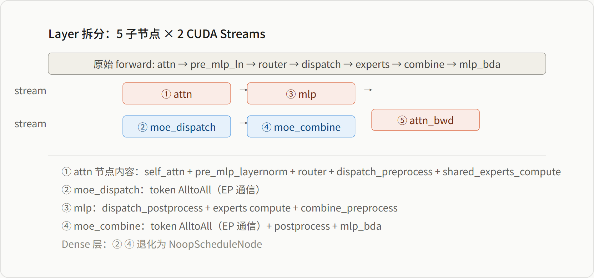
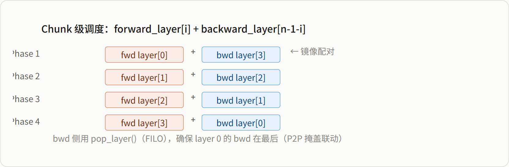
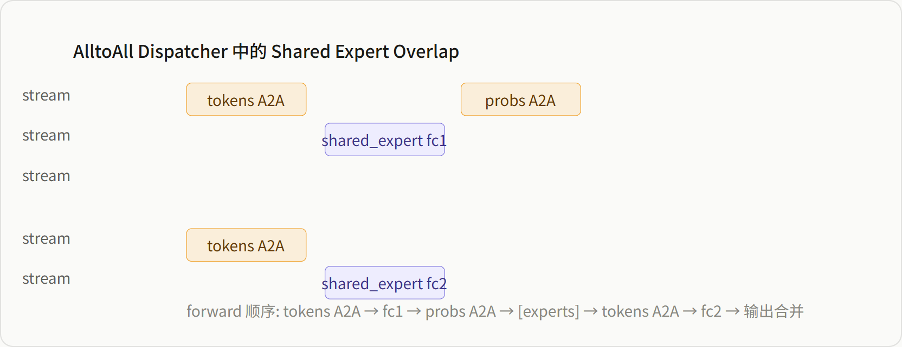

# Megatron-Core 通信掩盖（Communication Overlap）技术详解

> **源码基线**：`NVIDIA/Megatron-LM@71092579522a12522d9f323ae180c9825d01928a`（`dev`，2026-08-27）。
> **重定基线**：2026-08-28 由 `ee3f1ffa2acd18131ab67cabab4cec45283512ab`（2026-05-19）推进，跨 578 个提交；本页全部 `path:line` 已在新基线下逐条重核。
> **叙事顺序**：本页按五拍组织——背景 → 为什么这么设计（含被否掉的替代）→ 实现思路与细节 → 约束 → 发展趋势。
> **最近更新**：2026-08-28。按五拍重排章节顺序；机制正文与既有引用未改。

---

## 1. 背景：通信吃掉 30%~50% 的 step 时间，且五个并行维度各有一段挡在计算关键路径上

Megatron-Core 在训练大规模模型时，通信（AllGather/ReduceScatter/All-to-All/P2P）往往占据 30%~50% 的 step 时间。框架通过在不同并行维度（TP/DP/PP/EP/CP）上引入**通信与计算重叠**，将通信时间从关键路径上隐藏。

### 维度对照表

| 维度 | 通信类型 | 掩盖方式 | 关键参数 | 默认状态 |
|---|---|---|---|---|
| **TP** | AllGather / ReduceScatter | Bulk 异步 + Pipelined Ring 替换 | `--tp-comm-overlap` | 默认 `False` |
| **DP（梯度）** | ReduceScatter / AllReduce | Bucket 分块异步，随反向传播触发 | `--overlap-grad-reduce` | 默认 `False` |
| **DP（参数）** | AllGather | 异步 prefetch，随前向计算触发 | `--overlap-param-gather` | 默认 `False` |
| **PP** | P2P send/recv | 1F1B 稳态异步重叠 | `--overlap-p2p-comm` | 默认 `False`（⚠️ 注意） |
| **EP** | A2A | 1F1B 跨 microbatch 重叠 + delay-wgrad | `--overlap-moe-expert-parallel-comm` | 默认 `False` |
| **CP** | AllGather / RS | Ring P2P / async AllGather 重叠 Attention | 随 `--context-parallel-size` 启用 | 自动开启 |

---

## 2. 为什么这么设计：不建一套统一的异步通信框架，五个维度各挂各的载体

朴素做法只有一条：把所有集合通信都改成 `async_op=True` 发出去，在 step 末尾统一 `wait()`。Megatron-Core 没有走这条路——它在五个并行维度上用了五种**互不共享代码**的载体：TP 交给 TE 的 user buffer，DP 挂在梯度桶上，PP 挂在 1F1B 调度槽上，EP 挂在跨 microbatch 的双 stream 计划上，CP 挂在 head 级流水线上。源码陈述了其中五处各自的理由；"为什么不做统一框架"这一条源码沉默，由本页重建并标为推断。

**① TP 不自己实现，整段委托给 TE 的 user buffer —— 因为要重叠的通信在一次 GEMM 内部。**
`--tp-comm-overlap` 在 Megatron 侧只做两件事：把 TE 与 `yaml` 变成硬依赖（缺任一即 `raise RuntimeError("Tensor Parallel Communication/GEMM Overlap optimization needs 'yaml' and 'transformer_engine' packages")`，`megatron/training/initialize.py:197-201`），以及在初始化期调 `te_module.base.initialize_ub()` 预注册一块形状写死为 `[(seq_length × micro_batch_size) // context_parallel_size, hidden_size]` 的 buffer（`megatron/training/initialize.py:211-220`、`:234-240`）。真正的 AG/RS × GEMM 交错发生在 TE 内部，本页 §3 记录的是这条桥接。
→ 判据：TP 的 AG/RS 与它要喂的那个 GEMM 之间有**真依赖**，藏不进"先发后等"，只能把 GEMM 与通信各自切块交错；而切块交错需要一块跨 rank 对称、预先注册的显存，这是框架层拿不到的能力。代价也随之被钉死：`args.tp_comm_overlap` 为真时直接 `assert args.sequence_parallel == True`（`megatron/training/arguments.py:1542-1545`）。

**② DP 挂在"按反向序切出来的梯度桶"上，而不是逐参数 hook。**
默认布局函数的 docstring 明写参数「are iterated in reverse order (backprop order) and grouped into buckets of approximately `bucket_size` elements」（`megatron/core/distributed/param_and_grad_buffer.py:1015-1022`）。桶还要再合并成桶组，理由写在 `partition_buckets` 的 docstring 里：fp8 权重 + bf16 bias + VPP 会让通信 kernel 数翻倍，「because of the use of CUDA_DEVICE_MAX_CONNECTIONS=1, having multiple back-to-back communications will prevent the overlap of communication kernels with computation kernels」（`megatron/core/distributed/param_and_grad_buffer.py:1811-1818`）。
→ 判据：在单连接约束下，重叠的敌人不是通信总量而是**通信 kernel 的个数与相邻性**——桶越碎、越背靠背，越挡住计算。逐参数 hook 恰好是这个反面。

**③ 被否掉的替代写在历史里：「每个 PP stage 各自就绪就发 DP 通信」输给了「所有 PP stage 对齐着发」。**
2023-09-18 的提交 `299d8a585`（commit message：「Grad_sync function helps line up grad_sync calls, preventing ranks from being slowed down by the previous pipeline stage's DP communication」）引入过一对开关 `--no-delay-grad-reduce` / `--delay-param-gather`，help 文本是「If not set, delay / synchronize grad reductions in all but first PP stage」。2024-08-23 的提交 `4e3840535` 把这一对开关**整段删除**，换成 `--no-align-grad-reduce` / `--no-align-param-gather`，并把判据直接写进新的 help：「If not set, all PP stages will launch gradient reduces simultaneously. Otherwise, each PP stage will independently launch as needed.」当前基线保留的是后者（`megatron/training/arguments.py:4205-4211`），落点是把 `start_grad_sync` / `start_param_sync` 注入调度器的 `grad_sync_func` / `param_sync_func`（`megatron/training/training.py:4197-4204`）。
→ 判据从"延迟谁"被改写成"对齐谁"：跨 stage 的**带宽争抢**比"谁都尽早发出去"更贵，所以宁可让所有 stage 在同一个调度点一起发。

**④ PP 用逐个 `isend`/`irecv` 而不是 `batch_isend_irecv` —— 批量路径在实现上就不能异步。**
`_communicate()` 选路时，批量分支第一行就是 `assert wait_on_reqs`（`megatron/core/pipeline_parallel/p2p_communication.py:374-375`）：批量路径根本没有"返回未 `wait` 的 handle"这个形态。它还要额外付一次 host 端 device sync 去兜老版本 PyTorch 的竞态（「To protect against race condition when using batch_isend_irecv()」，`:416-423`）。这两条就是 `ModelParallelConfig` 里「Must be False if batch_p2p_comm is true」（`megatron/core/model_parallel_config.py:380-388`）的实现依据 —— 互斥是实现事实，不是配置洁癖。真并发则靠一条明写的技巧：`group.size() == 2` 时把两条 p2p 中的一条借到全局 group 上，注释写明「Use the global process group for one of the two p2p communications to allow the overlap of the independent communications」（`megatron/core/pipeline_parallel/p2p_communication.py:66-73`）。
另一条替代至今留着痕迹却没被选中：`use_ring_exchange_p2p` 走自定义 `torch.distributed.ring_exchange` kernel（`megatron/core/pipeline_parallel/p2p_communication.py:367-373`），代价写在字段注释里——「Requires custom built torch with torch.distributed.ring_exchange」（`megatron/core/model_parallel_config.py:395-397`），因此它只以 opt-in 形态存在。

**⑤ EP 的重叠对象跨 microbatch，而不是层内。**
`combined_1f1b_schedule_for_no_pipelining` 的 docstring 把目标写死：「the forward pass of Transformer layers for one micro-batch runs in parallel with the backward pass of another … EP A2A in forward step is hidden by the attention/mlp computation in the backward step, and vice versa」（`megatron/core/pipeline_parallel/combined_1f1b.py:51-58`）。
→ 判据：单个 microbatch 的 MoE 层里，dispatch A2A 之后紧接着就是专家 GEMM，两者严格串行，层内挖不出空档；只有换一个 microbatch 的反向计算，才存在与这条 A2A 无依赖、可以并行推进的工作。

> [!note] 推断
> 源码陈述的是上面五处各自的**局部**理由（TE 依赖与 SP 前提、桶的反向序与合并、align 开关的 help 文本、`assert wait_on_reqs`、combined-1F1B 的 docstring），**没有**任何一处说明"为什么不做一套统一的异步通信框架"。"五个维度必须各挂各的载体"这层归纳由本页承担：依据是五种通信与计算的依赖形态落在不同抽象层上——TP 在 GEMM 内部、DP 在整段反向之后、PP 在 stage 边界、EP 在 microbatch 之间、CP 在 head 之间——因此可插缝的位置根本不在同一层。要引用这条判断，请回到上列五个 locator，不要引用本段推断。

---

## 3. TP 通信掩盖（`--tp-comm-overlap`）

### 3.1 原理与参数入口

TP 通信掩盖仅在与 Sequence Parallel 结合时生效。配置定义在：

- **文件**：[`megatron/core/model_parallel_config.py`](Megatron-LM/megatron/core/model_parallel_config.py)
- **行号**：`255~279`

```python
# megatron/core/model_parallel_config.py:255-279
tp_comm_overlap: bool = False
"""If true, allows overlapping of Linear layer execution with tensor parallel communication"""

tp_comm_bulk_wgrad: bool = True
"""Controls All-Gather overlap with Bprop activation gradient GEMM."""

tp_comm_bulk_dgrad: bool = True
"""Controls Reduce-Scatter overlap with Bprop weight gradient GEMM."""

tp_comm_overlap_ag: bool = True
"""Controls All-Gather overlap with GEMM by pipelining."""

tp_comm_overlap_rs: bool = True
"""Controls Reduce-Scatter overlap with GEMM by pipelining."""
```


### 3.2 User Buffer 初始化

TP 掩盖依赖 Transformer Engine (TE) 预分配的静态 user buffer，在训练初始化时注册：

- **文件**：[`megatron/training/initialize.py`](Megatron-LM/megatron/training/initialize.py)
- **行号**：`188~263`（函数体三分支；下方片段是 TE 1.9 分支 `:243-249`，TE 新版分支改用 `quantization_modes=`，见 `:234-240`）

```python
# megatron/training/initialize.py:243-249
def _initialize_tp_communicators():
    """initializing the communicators with user buffers for high-performance
    tensor-model-parallel communication overlap"""
    te_module.base.initialize_ub(
        shape=input_shape,
        tp_size=args.tensor_model_parallel_size,
        use_fp8=(args.fp8 is not None),
        ub_cfgs=ub_cfgs,
        bootstrap_backend=args.tp_comm_bootstrap_backend,
    )
```

### 3.3 TE 层参数桥接

Megatron-Core 通过 `TELinear` 将上述配置传递给 TE：

- **文件**：[`megatron/core/extensions/transformer_engine.py`](Megatron-LM/megatron/core/extensions/transformer_engine.py)
- **行号**：`815~848`（`TELinear.__init__`，类定义 `:737`）；`ub_bulk_wgrad` / `ub_bulk_dgrad` 实际由 `TELayerNormColumnParallelLinear` 设置（`:1072-1073`，类定义 `:992`）

```python
# megatron/core/extensions/transformer_engine.py:815-848 + :1072-1073
if self.config.tp_comm_overlap and parallel_mode != "duplicated":
    if is_te_min_version("1.5.0"):
        extra_kwargs["ub_overlap_ag"] = self.config.tp_comm_overlap_ag
        extra_kwargs["ub_overlap_rs"] = self.config.tp_comm_overlap_rs
    extra_kwargs["ub_bulk_wgrad"] = self.config.tp_comm_bulk_wgrad
    extra_kwargs["ub_bulk_dgrad"] = self.config.tp_comm_bulk_dgrad
    extra_kwargs["ub_name"] = tp_comm_buffer_name
```

### 3.4 Pipelined Overlap（有依赖）

**场景**：Linear GEMM 与通信存在**数据依赖**（如前向必须先 AllGather 完整输入，才能做 GEMM）。

**实现**：TE 将 AllGather / ReduceScatter 拆分为多步 ring-exchange，每步只传一个 chunk。GEMM 可以"流式"消费已到达的数据，无需等待整个张量通信完成。

```text
串行 (total=8):
      0 1 2 3 4 5 6 7 8
 计算 □ □ □ □ ■ ■ ■ ■ □  GEMM(4→8)
 通信 ■ ■ ■ ■ □ □ □ □ □  AG(0→4)
     无重叠

重叠 (total=5):
      0 1 2 3 4 5
 计算 □ ■ ■ ■ ■ □  GEMM chunk流式(1→5)
 通信 ■ ■ ■ ■ □ □  AG chunk流式(0→4)
      ├──3u──┤
```
> 通信chunk0完成(t=1)后GEMM即可启动消费,后续chunks流式到达,重叠3个时间单位。

**关键代码**：`ub_overlap_ag` / `ub_overlap_rs` 由 TE 底层实现，Megatron 仅传递开关。

### 3.5 Bulk Overlap（无依赖）

Bulk 掩盖处理的是**反向传播中通信与计算无数据依赖**的场景。

#### 3.5.1 `ub_bulk_wgrad`：AllGather 与 DGRAD GEMM 重叠

**物理场景**：RowParallelLinear（如 `proj`、`fc2`）反向时的数据依赖：

```
RowParallelLinear 反向:
  dgrad = grad_output @ W_shard       ← 纯本地! grad_output(上游) + W_shard(本地分片)
  wgrad = X_full.T @ grad_output      ← 需要完整X! 各rank只有X分片
```

关键洞察：**dgrad 不需要 X**，它只消费 `grad_output`（从上游反向传来）和本地 `W_shard`。但 **wgrad 需要完整 X**（`X_full`），而各 rank 只有 X 的 TP 分片，必须通过 AllGather 拼出完整 X。因此可以趁 AG(X) 异步传输的同时，顺手把 dgrad 算了。

**代码验证**：Legacy 层实现（`async_op=True` 的 AG 与 dgrad 并行）

- **文件**：[`megatron/core/tensor_parallel/layers.py`](Megatron-LM/megatron/core/tensor_parallel/layers.py)
- **行号**：`549~562`

```python
# megatron/core/tensor_parallel/layers.py:549-562
handle = dist_all_gather_func(
    all_gather_buffer, input, group=tp_group, async_op=True
)
# 立刻计算 dgrad —— 不依赖 all_gather_buffer！
grad_input = grad_output.matmul(weight)
# ... dgrad 算完后 ...
handle.wait()                            # 等 AG 完成,all_gather_buffer 此时有完整 X
# wgrad 现在拿着完整 X 计算 X_full^T @ grad_output
```

```text
数据依赖关系:
  dgrad ← grad_output + W_shard (纯本地,无依赖)
  wgrad ← X_full = AG(X_shard) (依赖通信结果)

串行 (total=11):
      0 1 2 3 4 5 6 7 8 9 10 11
 计算 □ □ □ □ ■ ■ ■ □ ■ ■ ■  ■ □   dgrad(4→7),wgrad(7→11)
 通信 ■ ■ ■ ■ □ □ □ □ □ □ □  □   AG(X)(0→4)
     无重叠

重叠 (total=8):
      0 1 2 3 4 5 6 7 8
 计算 ■ ■ ■ □ ■ ■ ■ ■ □   dgrad(0→3),wgrad(4→8)
 通信 ■ ■ ■ ■ □ □ □ □ □   AG(X)(0→4)
      ├──3u──┤    ↑ wgrad等AG结束(t=4)才启动
```
> dgrad 与 AG 并行(0→3),两者无依赖;AG 在 t=4 完成后 wgrad 才启动(4→8)。受益 = AG 时间被 dgrad 吸收 3u,total 从 11 降至 8。

#### 3.5.2 `ub_bulk_dgrad`：ReduceScatter 与 WGRAD GEMM 重叠

**物理场景**：ColumnParallelLinear（如 QKV、FC1）反向时的数据依赖：

```
ColumnParallelLinear 反向:
  dgrad = grad_output @ W_full.T     ← 需完整W,各rank做local GEMM后ReduceScatter汇总dX
  wgrad = X_shard.T @ grad_output    ← 纯本地! X_shard(本地) + grad_output(下游分片)
```

关键洞察：**wgrad 与 RS(dX) 操作不同内存对象**。dgrad 算完后得到局部 dX（各 rank 各自的片段），需要 RS 拼成完整 dX 分发回去。但 wgrad = `X_shard^T @ grad_output` 用的都是本地已存在的 tensor——与 RS 的输出/输入毫无关系，可以直接并行。

**代码验证**：

- **文件**：[`megatron/core/tensor_parallel/layers.py`](Megatron-LM/megatron/core/tensor_parallel/layers.py)
- **行号**：`581~587`

```python
# megatron/core/tensor_parallel/layers.py:581-587
# dgrad GEMM 完成后,异步启动 ReduceScatter(dX)
handle = dist_reduce_scatter_func(
    sub_grad_input, grad_input, group=tp_group, async_op=True
)
# 立刻计算 wgrad —— 只依赖 X_shard 和 grad_output,不碰 RS 的 buffer！
```

```text
数据依赖关系:
  RS(dX) ← dgrad结果 (需通信汇总)
  wgrad  ← X_shard + grad_output (纯本地,与RS无任何数据依赖)

串行 (total=11):
      0 1 2 3 4 5 6 7 8 9 10 11
 计算 ■ ■ ■ □ □ □ □ □ ■ ■ ■  ■ □   dgrad(0→3),wgrad(7→11)
 通信 □ □ □ ■ ■ ■ ■ □ □ □ □  □   RS(dX)(3→7)
     无重叠

重叠 (total=7):
      0 1 2 3 4 5 6 7
 计算 ■ ■ ■ □ ■ ■ ■ ■   dgrad(0→3),wgrad(3→7)
 通信 □ □ □ ■ ■ ■ ■ □   RS(dX)(3→7)
          ├──4u──┤
```
> RS(dX) 与 wgrad 操作不同内存对象,无数据依赖,可完全并行;4单位通信全部隐藏在 wgrad 计算中。

**收益来源**：

| 优化 | 依赖关系 | 重叠模式 | 收益 |
|------|---------|---------|------|
| `ub_bulk_wgrad` | dgrad ⇌ AG (无依赖) / wgrad → AG (有依赖) | dgrad∥AG, wgrad 等 AG 完 | AG 前段被 dgrad 吸收 |
| `ub_bulk_dgrad` | wgrad ⇌ RS (无依赖) | wgrad∥RS,完全并行 | RS 全部被 wgrad 隐藏 |

核心思想：利用反向传播中**部分 GEMM 不依赖通信结果**这一事实,将通信从关键路径上剥离。

---

## 4. DP 通信掩盖

### 4.1 梯度掩盖（`--overlap-grad-reduce`）

**背景**：Distributed Optimizer 使用 `reduce-scatter`（或普通 DDP 使用 `all-reduce`）同步梯度。若不重叠，所有层反向完成后批量通信，阻塞严重。

**实现**：DDP 包装器将梯度存储在连续 buffer 中，按反向传播顺序切分为 bucket。每个参数的 backward hook 调用 `register_grad_ready()`，当**一个 bucket 内所有梯度就绪**，立即在该 bucket 上启动**异步**通信。

- **文件**：[`megatron/core/distributed/param_and_grad_buffer.py`](Megatron-LM/megatron/core/distributed/param_and_grad_buffer.py)
- **行号**：`913~935`

```python
# megatron/core/distributed/param_and_grad_buffer.py:913-935
def register_grad_ready(self, param, force_all_reduce=False):
    """Registers grads for the passed-in param to be 'ready' for grad sync."""
    if self.is_last_microbatch:
        if param not in self.per_param_grad_ready_counts:
            self.per_param_grad_ready_counts[param] = 0
        self.per_param_grad_ready_counts[param] += 1
        # If all params in bucket group have grads available, issue communication call.
        if not self.is_first_batch:
            if self.per_param_grad_ready_counts == self.golden_per_param_grad_ready_counts:
                self.start_grad_sync(force_all_reduce=force_all_reduce)
```

异步通信启动：

- **文件**：[`megatron/core/distributed/param_and_grad_buffer.py`](Megatron-LM/megatron/core/distributed/param_and_grad_buffer.py)
- **行号**：`759~775`

```python
# megatron/core/distributed/param_and_grad_buffer.py:759-775
with _coalescing_manager(communication_group, async_ops=async_op) as cm:
    for idx, bucket in enumerate(self.buckets):
        if self.ddp_config.use_distributed_optimizer and not force_all_reduce:
            grad_reduce_handle = dist_reduce_scatter_func(
                local_data_view, bucket.grad_data, op=reduce_op,
                group=communication_group, async_op=async_op
            )
```

```text
无重叠 (total=12):
      0 1 2 3 4 5 6 7 8 9 10 11 12
 计算 ■ ■ ■ ■ ■ ■ ■ ■ □ □ □  □  □   L4→1反向传播(0→8)
 通信 □ □ □ □ □ □ □ □ ■ ■ ■  ■  □   RS全部梯度(8→12)
     无重叠

重叠 (total=9):
      0 1 2 3 4 5 6 7 8 9
 计算 ■ ■ ■ ■ ■ ■ ■ ■ □ □   L4→1反向传播(0→8)
 通信 □ □ ■ ■ ■ ■ ■ ■ ■ □   RS bucket(2→9)
        ├─────6u─────┤
```
> bucket梯度就绪即异步通信,与后续层反向计算重叠;收益 ≈ sum(backward) + last_RS_tail。

**关键收益**：通信被隐藏在所有后续层的反向计算时间内，总时间 ≈ `sum(backward) + last_RS_tail`。

> [!update] 该特性自 `dev@232c478d4`（2026-06-16）引入，行号已重核至基线 `71092579`。
> **dispatch 时顺手 drain 前驱 bucket 的 reduce-scatter**（#4940，`megatron/core/distributed/distributed_data_parallel.py:350-365`、`megatron/core/distributed/param_and_grad_buffer.py:269`／`:651`（`start_grad_sync`，drain 逻辑 `:665-680`）／`:833`（`finish_grad_sync`））。仅在 `reduce_scatter_with_fp32_accumulation`（fp32 累加的梯度 RS）且单优化器实例时启用。该路径下，RS 的中间 all-to-all 输出张量会被 **pin 住直到 `.wait()`**；若不主动 drain，所有 bucket 的这些中间张量会一直存活到 step 末，显存峰值偏高。
> **机制**：`DistributedDataParallel.__init__` 把每个 bucket group 的 `previous_grad_reduce_bucket_group` 指向"反向中比它早一步 dispatch 的前驱"（反向按输出→输入顺序，故 `bucket_groups[i]` 的前驱是 `[i-1]`）。`start_grad_sync` 在为自己分配新 RS 缓冲**之前**，先 `finish_grad_sync()` 把前驱的 RS 等掉、释放其中间 buffer。新增 per-iteration 幂等标志 `grad_reduce_finished`（`megatron/core/distributed/param_and_grad_buffer.py:319`，每轮复位 `:343`，判定 `:856`）：`finish_grad_sync` 第二次调用变 no-op，使"后继提前 drain 前驱"与"step 末 finalize 循环逐 bucket 收尾"不会重复 wait。**只省显存、不改通信量/重叠结构**；专家并行的 `expert_parallel_bucket_groups` 同样链接。

### 4.2 参数掩盖（`--overlap-param-gather`）

**原理**：前向计算某一层时，**下一层（或下一个 bucket）的参数 AllGather 已在后台完成**。

**实现**：通过 forward pre-hook 机制。当 Module 的前向开始时，hook 调用 `finish_param_sync()`：
1. `wait()` 当前 bucket 的异步 all-gather
2. 立即派发**下一个 bucket** 的异步 `start_param_sync()`

- **文件**：[`megatron/core/distributed/distributed_data_parallel.py`](Megatron-LM/megatron/core/distributed/distributed_data_parallel.py)
- **行号**：`430~433`, `468~491`

```python
# megatron/core/distributed/distributed_data_parallel.py:430-433
self.use_forward_hook = self.ddp_config.overlap_param_gather
if self.use_forward_hook:
    self.enable_forward_pre_hook()

# megatron/core/distributed/distributed_data_parallel.py:468-491
def _make_forward_pre_hook(self):
    def hook(module, *unused):
        for param in module.parameters(recurse=False):
            if param not in self.param_to_bucket_group:
                continue
            self.param_to_bucket_group[param].finish_param_sync(
                skip_next_bucket_dispatch=...
            )
    return hook
```

异步参数同步启动：

- **文件**：[`megatron/core/distributed/param_and_grad_buffer.py`](Megatron-LM/megatron/core/distributed/param_and_grad_buffer.py)
- **行号**：`448~610`

```python
# megatron/core/distributed/param_and_grad_buffer.py:448-610
def start_param_sync(self, force_sync=False):
    async_op = self.ddp_config.overlap_param_gather and not force_sync
    with _coalescing_manager(..., async_ops=async_op) as cm:
        dist_all_gather_func(bucket.param_data, local_data_view, ... async_op=async_op)
```

```text
      0 1 2 3 4 5 6 7 8 9
 计算 ■ ■ ■ ■ ■ ■ ■ ■ ■ □   L1→3前向(0→9)
 通信 ■ ■ ■ ■ ■ ■ ■ ■ ■ □   Prefetch bucket(0→9)
      ├──── 全重叠 ────┤
```
> forward pre-hook: wait当前bucket → 立即派发下一bucket异步AG → 通信完全隐藏在前向计算中。

**关键收益**：AllGather 通信与前向计算流水化，消除参数同步的显式等待。

---

## 5. PP 通信掩盖（`--overlap-p2p-comm`）

### 5.1 重要修正：非默认开启

配置定义在：

- **文件**：[`megatron/core/model_parallel_config.py`](Megatron-LM/megatron/core/model_parallel_config.py)
- **行号**：`380~388`

```python
# megatron/core/model_parallel_config.py:380-388
overlap_p2p_comm: bool = False
"""When True some of the peer to peer communication for pipeline parallelism
   will overlap with computation. Must be False if batch_p2p_comm is true."""

batch_p2p_comm: bool = True
"""Use batch_isend_irecv instead of individual isend/irecv calls."""
```

**默认开启的是 `batch_p2p_comm=True`**（同步的 `batch_isend_irecv`）。**必须显式设置 `overlap_p2p_comm=True` 才能启用异步重叠**。

### 5.2 实现机制

当 `overlap_p2p_comm=True` 时，`P2PCommunicator._communicate()` 设置 `wait_on_reqs=False`，返回异步 request handles。

- **文件**：[`megatron/core/pipeline_parallel/p2p_communication.py`](Megatron-LM/megatron/core/pipeline_parallel/p2p_communication.py)
- **行号**：`275~340`

```python
# megatron/core/pipeline_parallel/p2p_communication.py:275-340
def _communicate(self, ..., wait_on_reqs: bool = True):
    # wait_on_reqs=False 时返回异步 handles，由调用者自行 wait
```

更关键的是 `_p2p_ops()` 利用 even/odd rank 分组，将独立 send/recv 映射到不同 process group，实现真并发：

- **文件**：[`megatron/core/pipeline_parallel/p2p_communication.py`](Megatron-LM/megatron/core/pipeline_parallel/p2p_communication.py)
- **行号**：`55~128`

```python
# megatron/core/pipeline_parallel/p2p_communication.py:55-128
if group.size() == 2 and torch.distributed.get_backend(group) != 'ucc':
    even_recv_odd_send_group = torch.distributed.group.WORLD
else:
    even_recv_odd_send_group = group

# even rank: send_next (pp_group) -> recv_prev (WORLD) -> send_prev (pp_group) -> recv_next (WORLD)
# odd rank:  recv_prev (WORLD) -> send_next (pp_group) -> recv_next (WORLD) -> send_prev (pp_group)
```

### 5.3 1F1B 稳态中的调度

在 `megatron/core/pipeline_parallel/schedules.py` 的 1F1B 稳态中，通过 `pp_pre_forward()` / `pp_post_forward()` / `pp_pre_backward()` / `pp_post_backward()` 管理异步 P2P：

- **文件**：[`megatron/core/pipeline_parallel/schedules.py`](Megatron-LM/megatron/core/pipeline_parallel/schedules.py)

```text
      0 1 2 3 4 5 6
 计算 ■ ■ ■ □ ■ ■ ■   FWD(0→3),BWD(3→6)
 通信 ■ □ □ □ ■ □ □   recv/send(0→1),(3→4)
      ├1┤   ├1┤
```
> P2P通信在FWD/BWD启动时异步发起,随即与计算重叠;even/odd rank分组实现真并发。

---

## 6. EP 通信掩盖（MoE A2A）

### 6.1 1F1B A2A Overlap（`--overlap-moe-expert-parallel-comm`）

**核心机制**：利用 1F1B 调度，让**当前 microbatch 的 MoE A2A 通信**与**另一个 microbatch 的 Attention/MLP 计算**同时执行。

参数定义：

- **文件**：[`megatron/core/model_parallel_config.py`](Megatron-LM/megatron/core/model_parallel_config.py)
- **行号**：`338~344`

```python
# megatron/core/model_parallel_config.py:338-344
overlap_moe_expert_parallel_comm: bool = False
delay_wgrad_compute: bool = False
"""Delay the weight gradient computation to improve batch-level communication overlapping"""
```

### 6.2 无 PP 时的 1F1B 调度

- **文件**：[`megatron/core/pipeline_parallel/combined_1f1b.py`](Megatron-LM/megatron/core/pipeline_parallel/combined_1f1b.py)
- **行号**：`35~135`（交错式 PP 版本在 `:138`）

```python
# megatron/core/pipeline_parallel/combined_1f1b.py:35-135
def combined_1f1b_schedule_for_no_pipelining(...):
    # Phase 0: 1st microbatch forward (alone)
    # Phase 1~N-1: backward(N) + forward(N+1) overlapped
    # Phase N: last microbatch backward (alone)
    for i in range(num_microbatches - 1):
        output_tensor, num_tokens, _ = combined_forward_backward_step(
            ..., b_model=model, ...  # backward of N + forward of N+1
        )
```

### 6.3 层级别的精细调度

核心的双 Stream 调度定义在：

- **文件**：[`megatron/core/models/common/model_chunk_schedule_plan.py`](Megatron-LM/megatron/core/models/common/model_chunk_schedule_plan.py)
- **行号**：`505~604`（`TransformerLayerSchedulePlan.run`，类定义 `:165`）

```python
# megatron/core/models/common/model_chunk_schedule_plan.py:513-514 (注释精确描述了重叠模式)
# comm_stream: combine_bwd | dispatch_fwd -> dispatch_bwd | combine_fwd
# comp_stream: attn_fwd    | mlp_bwd -> mlp_bwd_dw -> mlp_fwd | attn_bwd
```

```text
      0 1 2 3 4 5 6 7 8
 计算 ■ ■ ■ ■ ■ □ ■ ■ □
 通信 ■ ■ ■ □ □ ■ □ □ □
      ├─3u─┤     (t=5仅通信)

计算任务:
  attn_fwd(N+1)=[0→2)  mlp_bwd(N)=[2→4)  mlp_fwd(N+1)=[3→5)
  mlp_bwd_dw(N)=[4→5)  attn_bwd(N)=[6→8)

通信任务:
  combine_bwd(N)=[0→2)  dispatch_fwd(N+1)=[2→3)
  dispatch_bwd(N)+combine_fwd(N+1)=[5→6)

重叠区:
  t=0→2: attn_fwd(N+1) ∥ combine_bwd(N)     (2u)
  t=2→3: mlp_bwd(N)    ∥ dispatch_fwd(N+1)   (1u)
```
> MB N+1 前向的 attn_fwd 与 MB N 反向的 combine_bwd 完全重叠(2u),mlp_bwd 启动后与 dispatch_fwd 重叠(1u),t=5 处仅通信无计算可被 delay-wgrad 填补。

> [!note] 补充(2026-07-31 · 由 [[30_comm_compute_overlap_analysis]] 收缩合并)以下三段细化"§6.3 双 Stream 调度"的模型改造与调度实现来源,原属跨框架横向页,现下沉本页。

#### 模型层改造：Layer → 5 子节点

`megatron/core/models/gpt/fine_grained_callables.py:562-1094` 的 `build_transformer_layer_callables()` 将每个 TransformerLayer 手工拆解为 5 个可调度子节点(attn_fwd/mlp_fwd/mlp_bwd/mlp_bwd_dw/attn_bwd,对应 §6.3 时间线里的计算任务),使 §6.3 的双 Stream 交错得以在**子层粒度**发生,而非整层原子调度：



*图：TransformerLayer 的 5 子节点拆解*

#### 调度算子：`stream_acquire_context()`

§6.3 的 `TransformerLayerSchedulePlan.run()`(`megatron/core/models/common/model_chunk_schedule_plan.py:505-604`)把一个 f_layer(forward)和一个 b_layer(backward)在两个 stream 上交错，每个节点的 stream 上下文通过如下上下文管理器切换：

```python
def stream_acquire_context(self, name):
    self.event.wait(self.stream)          # 等待 event → 确保前序完成
    with torch.cuda.stream(self.stream):  # 切换到目标 stream
        yield
    self.event.record(self.stream)        # 记录完成 → 后续节点 wait 此 event
```


*图：单层 f_layer + b_layer 的双 stream 交错调度*

#### Model Chunk 级调度：镜像层配对

`TransformerModelChunkSchedulePlan.run()` 将 forward 层和 backward 层按**镜像位置**配对：



*图：Chunk 内的镜像层配对调度*

> **P2P 掩盖联动**：PP 的 forward send 放在 comm_stream（与 attn_bwd 重叠），backward send 放在 comp_stream（与 attn_wgrad 重叠）。最后一层 attn 的 wgrad 被延迟到 P2P backward send 之后才执行，最大化掩盖。

### 6.4 delay-wgrad-compute 的详细流水线

#### 6.4.1 标准反向 vs delay-wgrad（单层内部）

`TransformerLayerNode` 的 `backward_impl` 与 `backward_dw` 分离：

- **文件**：[`megatron/core/models/gpt/fine_grained_callables.py`](Megatron-LM/megatron/core/models/gpt/fine_grained_callables.py)
- **行号**：`415~449`（`backward_impl` `:415-422`，`backward_dw` `:438-449`，类定义 `:319`）

> 此处原附的一段「示意代码」经核实为**编造**（四个符号在源码中零命中）；该片段连同其 `[!contradiction]` 勘误整体归档到 §10.6，正文只保留上面这条经核实的 `path:line`。

#### 6.4.2 三层对比图

```text
A: 无 delay-wgrad (total=7):
      0 1 2 3 4 5 6 7
 计算 ■ ■ ■ ■ □ □ □ □   mlp_bwd(dX)(0→2)+mlp_bwd_dw(dW)(2→4)
 通信 □ □ □ □ ■ ■ ■ □   A2A_wait(4→7)
     无重叠

B: 无 delay-wgrad + EP Overlap (total=7):
      0 1 2 3 4 5 6 7
 计算 ■ ■ ■ ■ □ ■ ■ ■   mlp_bwd(dX+dW)(0→4) attn_bwd(4→7)
 通信 □ □ □ □ ■ ■ ■ □   dispatch_bwd(4→7)
              ├3u┤

C: 有 delay-wgrad + EP Overlap (total=7):
      0 1 2 3 4 5 6 7
 计算 ■ ■ ■ ■ ■ ■ ■ □   mlp_bwd(dX)(0→2) attn_bwd(2→5) mlp_bwd_dw(5→7)
 通信 □ □ ■ ■ ■ □ □ □   dispatch_bwd(2→5)
          ├──3u──┤
```
> A: dX结束后dW仍阻塞,通信完全暴露(3u); B: dX+dW整体计算,通信与attn_bwd重叠(3u); C: dX分离后A2A提前到t=2,与attn_bwd大面积重叠(3u),dW推迟到t=5填充通信尾部空隙。

**图 C 的收益**：
- `mlp_bwd(dX)` 缩短到 2 单位，A2A (`dispatch_bwd`) 可以提前到 Time=2 开始
- `attn_bwd (2~5)` 与 `dispatch_bwd (2~5)` 大面积重叠
- `mlp_bwd_dw(dW)` 被推迟到 Time=5，填充了通信尾部的 SM 空隙

#### 6.4.3 多层全局流水线

```text
无 delay-wgrad (total=14):
      0 1 2 3 4 5 6 7 8 9 10 11 12 13 14
 计算 ■ ■ □ □ ■ ■ □ □ ■ ■ □  □  ■  ■  □   L4(0→2) L3(4→6) L2(8→10) L1(12→14)
 通信 □ □ ■ ■ □ □ ■ ■ □ □ ■  ■  □  □  □   A2A(2→12,各层间歇)
     完全串行,无重叠

有 delay-wgrad (total=14):
      0 1 2 3 4 5 6 7 8 9 10 11 12 13 14
 计算 ■ □ □ ■ ■ □ ■ ■ □ ■ ■  □  ■  ■  □
 通信 □ ■ ■ □ ■ ■ □ ■ ■ □ □  ■  □  □  □
             ├1┤   ├1┤   ├1┤
 计算: L4dX(0→1) L3dX+dW4(3→5) L2dX+dW3(6→8) L1dX+dW2(9→11) dW1(12→14)
 通信: A2A4(1→3) A2A3(4→6) A2A2(7→9) A2A1(10→12)
```
> 无delay时计算与通信完全串行交替;有delay后dX缩短使A2A提前,dW延后填充通信气泡,在t=4,7,10各产生1u重叠窗口。

### 6.5 dw 与 dx 的通信依赖关系（关键澄清）

**结论：dw 是纯本地计算，dx 才需要 A2A。**

Forward dispatch 已经把 token 路由到专家 rank 并缓存在本地。Backward 时：

- **dw**（专家权重梯度）：`dispatched_input.T @ grad_output`，全部 tensor 已在本地，**无需通信**
- **dx**（数据梯度）：专家本地算出的 `dx_expert` 是按专家排序的，必须通过 reverse A2A（`combine` kernel）恢复原始 token 顺序

代码验证：

- **文件**：[`megatron/core/transformer/moe/fused_a2a.py`](Megatron-LM/megatron/core/transformer/moe/fused_a2a.py)
- **行号**：`187~207`, `238~254`

```python
# megatron/core/transformer/moe/fused_a2a.py:187-207
# FusedDispatch.backward = combine：把专家梯度送回原始位置
class FusedDispatch(torch.autograd.Function):
    @staticmethod
    def backward(ctx, grad_output, ...):
        grad_x, grad_token_probs, after_event = buffer.combine(
            grad_output.contiguous(), handle, ...
        )

# megatron/core/transformer/moe/fused_a2a.py:238-254
# FusedCombine.backward = dispatch：把上游梯度送到专家
class FusedCombine(torch.autograd.Function):
    @staticmethod
    def backward(ctx, grad_output, ...):
        grad_x, ... = buffer.dispatch(
            grad_output.contiguous(), handle=ctx.handle, ...
        )
```

### 6.6 DeepEP / HybridEP 后端

**收益点**：降低 A2A 的**绝对耗时**和**SM 占用**，属于"加速通信"而非"掩盖通信"。

- **文件**：[`megatron/core/transformer/moe/fused_a2a.py`](Megatron-LM/megatron/core/transformer/moe/fused_a2a.py)

```python
# megatron/core/transformer/moe/fused_a2a.py:116-185
class FusedDispatch(torch.autograd.Function):
    @staticmethod
    def forward(ctx, x, token_indices, token_probs, num_experts, group,
                async_finish=False, allocate_on_comm_stream=False):
        # async_finish=True: 使用 EventOverlap 实现 stream 间异步
        buffer = get_buffer(group, get_hidden_bytes(x))
        buffer.dispatch(x, topk_idx=token_indices, topk_weights=token_probs,
                        async_finish=async_finish,
                        allocate_on_comm_stream=allocate_on_comm_stream)
```

- **文件**：[`megatron/core/transformer/moe/token_dispatcher.py`](Megatron-LM/megatron/core/transformer/moe/token_dispatcher.py)
- **类**：`megatron/core/transformer/moe/token_dispatcher.py:1283` 的 `_DeepepManager`、同文件 `:1060` 的 `_HybridEPManager`（新增 `:1529` 的 `_DeepepV2Manager`）

#### 6.6.1 两级通信：为什么能降 A2A 绝对耗时

DeepEP/HybridEP 之所以能"加速通信"，核心是把单级的 GPU↔GPU A2A 拆成**两级**，并在节点间做**去冗余**——把流量从稀缺的 IB 转到富裕的 NVLink。`fused_dispatch` 的 `get_dispatch_layout` 给出**两套**变长计数，对应两级（`megatron/core/transformer/moe/fused_a2a.py:136-142`）：

| 计数 | 粒度 | 阶段 | 链路 |
|------|------|------|------|
| `num_tokens_per_rdma_rank` | 每 **node** | `inter_dispatch` | RDMA / IB（瓶颈） |
| `num_tokens_per_rank` | 每 **GPU** | `intra_dispatch` | NVLink（富裕） |

buffer 也分两块：`num_rdma_bytes` + `num_nvl_bytes`（`get_buffer:62`）。**核心规则**：一个 token 不论在目标 node 上命中几个专家/几张卡，**跨 node 只发一次**（RDMA），落地后由该 node 内 NVLink 复制给目标卡。于是**跨节点流量 ∝ token 的"目标节点数" `|R(t)|`（≤ k），而非"目标专家数 k"**：

$$
\text{RDMA(跨节点)}(t)=\lvert R(t)\rvert\cdot M,\qquad
\boxed{\ \text{IB 加速比}=\dfrac{k/P}{\,1-(1-1/P)^k\,}\ }\quad(P=\text{node 数},\ M=H\times\text{bytes/elt})
$$

例：2 node、topk=4 → 跨节点 IB 流量约降到 1/2.13；topk=8 → ≈1/4。专家越多、topk 越大、目标越聚集在少数远端 node，省得越多（DeepSeek-V3 256 专家/topk8 即此场景）。**完整逐字节走查 + 两级公式推导见 [[14_megatron_ep_analysis]] §③.3**。

> **与"掩盖"的关系**：两级拆分让 A2A 的长极（跨节点 RDMA 段）与廉价的 NVLink 段在不同引擎上推进；配合 §6.7 的 `high_priority_a2a_comm_stream`（让 A2A kernel 优先抢 SM）与 `moe_hybridep_num_sms_preprocessing`（调元数据扫描 SM 数），可在 §6.1 的 1F1B overlap 之上进一步压短 A2A 暴露在关键路径上的尾延迟。即：**§6.6 降 A2A 绝对耗时（去冗余 + 两级）+ §6.1 把剩余 A2A 掩盖到计算后面**，二者叠加。

#### 6.6.2 后端硬件映射速查（补充,2026-07-31 · 由 [[30_comm_compute_overlap_analysis]] 收缩合并）

| Backend | 硬件 | 核心函数 |
| --- | --- | --- |
| `deepep` | H100 / NVLink Switch | `fused_dispatch` / `fused_combine`（`_DeepepManager`） |
| `hybridep` | GB200 / NVLink72 | `hybrid_ep_dispatch` / `hybrid_ep_combine`（`_HybridEPManager`，GPU-side overflow flag） |

### 6.7 增量更新（ee3f1ff → dev@232c478d4）

> [!update] 该特性自 `dev@232c478d4`（2026-06-16）引入，行号已重核至基线 `71092579`。—— 高优先级 A2A 通信流
> 新增 `high_priority_a2a_comm_stream`（默认 `False`，`megatron/core/transformer/transformer_config.py:764`，#4694）。combined-1F1B 的 `set_streams` 现接受 `high_priority` 形参（`megatron/core/pipeline_parallel/utils.py:350`，判定 `:357`；两个 schedule 的透传点在 `megatron/core/pipeline_parallel/combined_1f1b.py:67` 与 `:203`）：打开后，§6.3 那条专跑 dispatch/combine A2A 的 `comm_stream` 以 **CUDA 高优先级**创建（`torch.cuda.Stream.priority_range()` 的 high 端）。目的：让 A2A 通信 kernel 优先抢 SM，减少被同设备的计算 kernel 卡住的尾延迟。`megatron/core/pipeline_parallel/combined_1f1b.py` 的两个 schedule（no-pipelining / interleaved）都按 `config.high_priority_a2a_comm_stream` 透传。配套地，HybridEP 还新增 `moe_hybridep_num_sms_preprocessing`（默认 108，metadata scan kernel 的 SM 数，见 [[14_megatron_ep_analysis]] §③ 增量更新）。

> [!update] 该特性自 `dev@232c478d4`（2026-06-16）引入，行号已重核至基线 `71092579`。—— A2A Overlap 支持 Megatron-FSDP
> EP A2A 重叠（combined-1F1B）现可与 **Megatron-FSDP** 共用（#3797，`megatron/core/pipeline_parallel/combined_1f1b.py`、`megatron/core/models/common/model_chunk_schedule_plan.py:377` 的 `set_fsdp_reshard_hooks`）。难点：细粒度 overlap schedule **绕过** `TransformerLayer.forward`（直接调子模块），从而绕过 FSDP 注册在 unit module 上的 forward/backward hook —— all-gather 出来的分片参数不会被正常释放。解法：`TransformerLayerSchedulePlan.set_fsdp_reshard_hooks` 给单个 schedule node 显式挂"释放参数"回调（最后一个前向 node 后 `post_forward_release_module`，最后一个反向 node（attn）后 `post_backward_release_module`）；`combined_forward_backward_step` 在反向前后调 `fsdp_wrapper.pre/post_backward()`，并在调度前 `_replace_param_with_raw_if_needed()`。仅 `optim_grads_params`（参数分片）策略需逐层 reshard hook。**限制**：交错式 PP（VPP>1）+ FSDP 暂不支持（显式 assert）。FSDP 内部分片/reshard 细节见 [[16_megatron_distributed_optimizer_analysis]]。

> [!update] 该特性自 `dev@232c478d4`（2026-06-16）引入，行号已重核至基线 `71092579`。—— FSDP 双缓冲 wgrad 竞态修复
> 修复 FSDP 双缓冲（`fsdp_double_buffer`）下的 wgrad 竞态（#5222，`megatron/core/distributed/fsdp/src/megatron_fsdp/param_and_grad_buffer.py:3232-3237`，`_enforce_double_buffer_limit` 定义在同文件 `:4093`）。原先在反向 hook 里**预先**调 `_enforce_double_buffer_limit` 腾 bucket；改为把该调用下沉进懒加载的 `main_grad_getter` —— 即**真正 fetch 到 incoming bucket 的那一刻**才腾退旧 bucket，使双缓冲 reduce-scatter 流水线的 bucket 生命周期与梯度写入精确对齐，消除"buffer 还在被 wgrad 写就被双缓冲分配器回收"的竞态。属 FSDP 内部正确性修复，与本页"通信重叠不改数值"前提一致；FSDP 缓冲机制详见 [[16_megatron_distributed_optimizer_analysis]]。

> [!update] 该特性自 `dev@232c478d4`（2026-06-16）引入，行号已重核至基线 `71092579`。—— flex 后端配置补充
> §9 配置速查表的 `moe_flex_dispatcher_backend` 现多一个取值 `"deepepv2"`（DeepEP v2 ElasticBuffer 后端，#4793）；`moe_deepep_num_sms` 默认从 `20` 改为 `None`（自适应）。详见 [[14_megatron_ep_analysis]] §③ 增量更新。

### 6.8 Shared Expert：独立 Stream 状态机重叠（`moe_shared_expert_overlap`，补充,2026-07-31 · 由 [[30_comm_compute_overlap_analysis]] 收缩合并）

**与 §6.1-6.7 的区别**：本节是与 combined_1f1b（`overlap_moe_expert_parallel_comm`）**独立的另一个开关** `moe_shared_expert_overlap`，掩盖的是 Shared Expert 计算与 token dispatch/combine 的 AlltoAll——即便不开 EP+PP 交叉掩盖，单独开此开关也生效。

- **文件**：`megatron/core/transformer/moe/token_dispatcher.py`、`megatron/core/transformer/moe/shared_experts.py`

Shared Expert MLP 在独立 CUDA stream 上运行，通过状态机与 token dispatch/combine 的 AlltoAll 流水线交错：



*图：Shared Expert 通过专属 stream 与 A2A 通信交错*

Shared Expert 使用**状态机**管理调用顺序：`IDLE → PRE_FORWARD_COMM_DONE → FC1_FORWARD_DONE → FC2_FORWARD_DONE → POST_FORWARD_COMM_DONE → IDLE`，确保在不同 dispatcher 类型下正确同步。

> 相关：deepseek_v4 场景下 Shared Expert 启用 TP（`T_shared>1`）时该开关会额外关闭 TP 的 AG/RS、改走手动调度，见 [[34_deepseek_v4_tensor_parallel_analysis]] §8.2（`megatron/core/transformer/moe/shared_experts.py:158-170`）——两处描述的是同一 `moe_shared_expert_overlap` 机制在不同场景下的效果。

---

## 7. CP 通信掩盖（Context Parallel）

### 7.1 原理

CP 将序列切分到多 rank，Self-Attention 需要获取完整 KV。Megatron-Core 通过**异步 AllGather KV 与 Attention 计算重叠**来掩盖通信。

### 7.2 代码实现

- **文件**：[`megatron/core/transformer/dot_product_attention_context_parallel.py`](Megatron-LM/megatron/core/transformer/dot_product_attention_context_parallel.py)
- **行号**：`108~133`, `181~224`

```python
# megatron/core/transformer/dot_product_attention_context_parallel.py:108-133
class AllGatherComm:
    def all_gather(self, output_tensor, input_tensor):
        handle = torch.distributed.all_gather_into_tensor(
            output_tensor, input_tensor, group=self.group, async_op=True
        )
        self.handles.append(handle)

    def wait(self):
        for handle in self.handles:
            handle.wait()

# megatron/core/transformer/dot_product_attention_context_parallel.py:181-224 (Forward)
comm.all_gather(kv_buffer_copy[0], k_0)  # 异步启动第一轮 AG
for i in range(0, nheads_k, heads_k_stride):
    comm.wait()                           # 等上一轮 AG 完成
    kv_buffer, kv_buffer_copy = kv_buffer_copy, kv_buffer
    if i < nheads_k - heads_k_stride:
        comm.all_gather(kv_buffer_copy[0], send_k)  # 启动下一轮 AG
    # 同步做 Attention 计算（与下一轮 AG 重叠）
    out_i, probs_i = eager_attn_fwd(q_i, k_i, v_i, ...)
```

### 7.3 图示

```text
      0 1 2 3 4 5 6 7 8
 计算 □ □ ■ ■ ■ ■ ■ ■ □   Attn(head₀→₂)(2→8)
 通信 ■ ■ ■ ■ ■ ■ □ □ □   AG KV(head₀→₂)(0→6)
        ├─4u overlap─┤
```
> AG KV₁ 启动(2→4)与 Attn₀(2→4)重叠,AG KV₂(4→6)与 Attn₁(4→6)重叠;head级流水线使通信隐藏在注意力计算中。

---

## 8. 综合收益量化

| 优化 | 隐藏/降低了哪部分时间 | 典型收益场景 |
|---|---|---|
| **TP Bulk** | AllGather / ReduceScatter 与独立 GEMM 并发 | 所有 SP + TP 训练 |
| **TP Pipelined** | AG/RS 与有依赖 GEMM 的串行等待 | 大 batch、长序列 |
| **DP Grad** | ReduceScatter 与后续反向计算 | 大 DP size |
| **DP Param** | AllGather 与后续前向计算 | Distributed Optimizer + 大模型 |
| **PP P2P** | Send/Recv 与 stage 内计算 | PP > 2，microbatch 多 |
| **EP 1F1B** | A2A 与跨 microbatch 的 Attn/MLP | MoE + EP > 1（A2A 占 30-40% 时收益最大） |
| **EP delay-wgrad** | dW GEMM 与 A2A 通信气泡 | 任何开启 EP overlap 的场景 |
| **CP** | KV AllGather 与 Self-Attention | CP > 1，长上下文 |

---

## 9. 配置速查表

```python
# TP
args.tp_comm_overlap = True          # 总开关
args.tp_comm_bulk_wgrad = True       # AG 与 dgrad GEMM 的 Bulk 重叠（默认 True）
args.tp_comm_bulk_dgrad = True       # RS 与 wgrad GEMM 的 Bulk 重叠（默认 True）
args.tp_comm_overlap_ag = True       # Pipelined AG（默认 True）
args.tp_comm_overlap_rs = True       # Pipelined RS（默认 True）
args.tp_comm_overlap_cfg = None      # userbuffer YAML 配置

# DP
args.overlap_grad_reduce = True      # 梯度 bucket 异步 reduce-scatter
args.overlap_param_gather = True     # 参数异步 prefetch all-gather

# PP
args.overlap_p2p_comm = True         # ⚠️ 默认 False，需显式开启
args.batch_p2p_comm = False          # 必须与 overlap_p2p_comm 互斥

# EP
args.overlap_moe_expert_parallel_comm = True  # 1F1B A2A 重叠
args.delay_wgrad_compute = True               # 延迟 wgrad（需与上者同开）
args.moe_token_dispatcher_type = "flex"       # flex dispatcher
args.moe_flex_dispatcher_backend = "deepep"   # 或 "deepepv2" / "hybridep"（deepepv2 见 §6.7，#4793）

# CP
args.context_parallel_size = 2       # CP > 1 时自动启用 attention overlap
```

---

## 10. 约束

通信掩盖从来不是白给：它换来的是吞吐，付出的是**前提、显存峰值、以及一串"配错就静默失效"的组合规则**。以下每条都带 locator。

### 10.1 前提（不满足则直接报错或被强制关掉）

| 开关 | 硬前提 | locator |
|---|---|---|
| `tp_comm_overlap` | 必须同时开 Sequence Parallel，否则 `assert` 失败 | `megatron/training/arguments.py:1542-1545` |
| `tp_comm_overlap` | 必须装得上 `transformer_engine` 与 `yaml`，否则构造期 `RuntimeError` | `megatron/training/initialize.py:197-201` |
| `overlap_param_gather` | 必须是 distributed optimizer / Megatron-FSDP / `dist_muon` 之一，**且**必须同时开 `overlap_grad_reduce` | `megatron/training/arguments.py:1076-1084` |
| `overlap_p2p_comm` | 必须 `batch_p2p_comm=False`（二者互斥） | `megatron/core/model_parallel_config.py:380-388`；`megatron/core/pipeline_parallel/p2p_communication.py:374-375` |
| `overlap_p2p_comm` + VPP | `pipeline_model_parallel_size > 1`；关掉重叠时门槛升到 `> 2`（否则同一对 rank 间一批里会出现多组 p2p send/recv） | `megatron/training/arguments.py:1049-1060` |
| `overlap_p2p_comm_warmup_flush` | 只在 `overlap_p2p_comm=True` 且 `batch_p2p_comm=False` 时合法 | `megatron/core/model_parallel_config.py:417-422`、`:603-607` |

> **一条容易读反的默认值**：`ModelParallelConfig.overlap_p2p_comm` 的字段默认是 `False`（§5.1），但 `megatron/training` 这一侧的 CLI 面是 `--no-overlap-p2p-communication`（`action='store_false'`，`megatron/training/arguments.py:4124-4129`）——即**训练脚本侧默认为 True**，只是在**非 interleaved schedule** 时被 `args.overlap_p2p_comm = False` 强制关掉（连同 `align_param_gather`，并打一条 WARNING，`:1061-1071`）。两个"默认值"说的是不同的层，配置时以实际入口为准。

### 10.2 代价

- **批量 p2p 路径的 host 同步**：`batch_p2p_comm` + `batch_p2p_sync` 会在每次通信后做一次 host 端 device sync 兜老 PyTorch 的竞态（`megatron/core/pipeline_parallel/p2p_communication.py:416-423`）。这正是"批量路径不能重叠"的另一半原因；该 workaround 在 stream capture（`cuda_graph_impl="full_iteration"`）下被显式跳过，源码说明它在捕获中是非法操作（同处注释）。
- **EP 重叠抬高显存峰值**：`ep_overlap_early_attn_memory_release` 的 docstring 直说「EP overlap can increase peak memory usage when the overlapped forward module allocates more memory than what is freed by the backward module」（`megatron/core/model_parallel_config.py:355-366`）。而这个缓解开关本身又要付性能：「Note: This may impact performance as moe_combine_fwd and moe_dispatch_bwd become exposed (not overlapped with other computation).」——即用"重新暴露两段通信"换峰值显存。
- **`CUDA_DEVICE_MAX_CONNECTIONS=1` 的连坐**：桶组划分之所以要把 fp8 与非 fp8 桶合并，就是因为在单连接下背靠背的通信 kernel 会挡住计算 kernel（`megatron/core/distributed/param_and_grad_buffer.py:1811-1818`）。任何让通信 kernel 变多、变碎的配置都会悄悄削掉重叠收益，而不会报错。

### 10.3 不变量

- **`overlap_grad_reduce` 接管 `no_sync`**：打开后 `config.no_sync_func` 必须为 `None`，由框架换成各 model chunk 的 `no_sync`；自定义 `no_sync_func` 被 `assert` 拒绝（`megatron/training/training.py:4189-4196`）。
- **对齐是"注入调度钩子"而非"加锁"**：`align_grad_reduce` / `align_param_gather` 的全部作用就是把 `start_grad_sync` / `start_param_sync` 装进 `config.grad_sync_func` / `param_sync_func`，交由调度器在固定点触发（`megatron/training/training.py:4197-4204`）。关掉它并不会关掉重叠，只是让各 stage 自行择时。
- **TP user buffer 的形状在初始化期定死**：`initialize_ub` 拿到的 `input_shape` 由 `seq_length × micro_batch_size // context_parallel_size` 与 `hidden_size` 算出（`megatron/training/initialize.py:211-220`），此后是一块静态显存。

### 10.4 故意不做的事

- **不提供 ring-exchange kernel**：`use_ring_exchange_p2p` 只是一个入口，真正的 `torch.distributed.ring_exchange` 需要使用者自编译 PyTorch（`megatron/core/model_parallel_config.py:395-397`；调用点 `megatron/core/pipeline_parallel/p2p_communication.py:367-373`）。
- **不为 hybrid/dynamic CP 支持 PP**：`schedules.py` 的注释写明这条路径「assumes static CP across outstanding pipeline microbatches. Hybrid/dynamic CP currently requires per-token loss and no PP」（`megatron/core/pipeline_parallel/schedules.py:387-390`）；hybrid CP 的调度器里对应位置同样挂着 `TODO[pmannan]: PP not yet supported. Add PP scheduling.`（`megatron/core/pipeline_parallel/hybrid_cp_schedule.py:190`）。
- **不为 VPP>1 + Megatron-FSDP 支持 EP A2A 重叠**：显式 assert 拒绝（见 §6.7 的对应 `[!update]`）。

### 10.5 失效条件（不报错，只是收益归零）

- **非 interleaved schedule**：`overlap_p2p_comm` 被强制置 `False`（`megatron/training/arguments.py:1061-1071`），P2P 重叠整条失效。
- **桶被切碎或通信 kernel 变多**：见 §10.2 第三条，重叠静默退化。
- **TP 侧 micro-batch / 序列长度与初始化时不一致**：user buffer 是按初始化期那一组形状注册的静态显存（`megatron/training/initialize.py:211-220`）。

### 10.6 存档：一段被证伪的"手工保存 / 释放 grads"示意代码

以下片段与其勘误由原 §5.4.1 整体迁入。**它已被证明不是源码**，保留在此仅作为"跨两次基线都没被核过的引用长什么样"的记录；阅读 delay-wgrad 机制请回到 §6.4.1 的 `path:line`。

```python
# megatron/core/models/gpt/fine_grained_callables.py:415-449（示意，非逐字，见下方 [!contradiction]）
class TransformerLayerNode(ScheduleNode):
    def backward_impl(self, outputs, output_grad):
        # 标准 backward：dX 和 dW 同时算完
        self.default_backward_func(outputs + self.before_detached, grads)
        if self.delay_wgrad_compute:
            self.output_grads = grads          # 保存梯度，不释放！
            self.delay_grads_release = True

    def backward_dw(self):
        # delay-wgrad：单独执行 dW GEMM
        for module in self.bwd_dw_callables:
            module.backward_dw()
        # 完成后才释放梯度内存
        if self.manual_release_grads:
            for tensor in self.output_grads:
                tensor.untyped_storage().resize_(0)
```

> [!contradiction] 2026-08-28（基线 `71092579`）：上面这段代码是**示意而非源码逐字**，其中 `self.output_grads = grads`、`self.delay_grads_release = True`、`self.manual_release_grads`、`tensor.untyped_storage().resize_(0)` 四处在源码里**并不存在**——`git grep 'manual_release_grads\|delay_grads_release' 71092579 -- megatron/` 零命中，回溯到旧基线 `ee3f1ff` 同样零命中，说明它们从更早的形态残留下来、跨两次基线都没被核过。实际源码：`backward_impl`（`megatron/core/models/gpt/fine_grained_callables.py:415-422`）只做 `self.default_backward_func(outputs + self.before_detached, grads)` 并 `return grads`（注释写明 "return grads for record stream"），**没有**保存/延迟释放梯度的分支；`backward_dw`（`:438-449`）在 `not self.delay_wgrad_compute` 时直接 return，否则切到 `self.stream` 上包一层 nvtx 再逐个 `module.backward_dw()`，**没有** `resize_(0)`。"dX 与 dW 分离、dW 延后执行"这一论断本身成立（由 `delay_wgrad_compute` 分流 `backward` 与 `backward_dw` 两条路径实现，见 `:431-436` 与 `:438-449`），但"手工保存 grads 再手工释放显存"这层描述在当前源码下不成立。

> **补一条正向定位**：`resize_(0)` 这个动作在当前基线里确实存在，但不在 `fine_grained_callables.py`，而在 combined-1F1B 调度器的 `_release_tensor_storage()` 里——先 `record_stream(torch.cuda.current_stream())` 再 `untyped_storage().resize_(0)`（`megatron/core/pipeline_parallel/combined_1f1b.py:24-32`，调用点如 `:480`）。即"显式释放张量存储"是**调度器层**的手法，不是 `TransformerLayerNode` 的手法。

---

## 11. 发展趋势

> [!note] 推断
> 本节由**本页已有的 `[!update]` 记录**（均带 PR 号）与**当前基线里的 `TODO` 注释**共同锚定，方向判断属本页推断，不是源码自陈的路线图。

- **A2A 从"被掩盖"走向"被优先调度"**。§6.7 记录的 `high_priority_a2a_comm_stream`（#4694，`megatron/core/transformer/transformer_config.py:764`）把 A2A 的 `comm_stream` 提到 CUDA 高优先级，配套 HybridEP 的 `moe_hybridep_num_sms_preprocessing`；`moe_deepep_num_sms` 默认从 `20` 改成 `None`（自适应，#4793）。→ 趋势是从"把通信藏到计算后面"进一步走向"直接和计算抢 SM 并抢赢"。
- **EP 重叠的显存代价正在被单独治理**。`ep_overlap_early_attn_memory_release`（`megatron/core/model_parallel_config.py:355-366`）是专为"重叠抬高峰值显存"新开的旋钮，并且它自陈会牺牲性能。→ §10.2 的这条代价已经从"文档注意事项"升级成"需要单独配置的取舍面"，后续大概率还会继续细分。
- **重叠调度与 FSDP 的边界还在补**。§6.7 的两条记录（A2A overlap × Megatron-FSDP，#3797；`fsdp_double_buffer` 的 wgrad 竞态修复，#5222）都属于"细粒度调度绕过了框架 hook，于是要补挂显式回调"这一类问题；而 VPP>1 + FSDP 至今被 assert 挡住。→ 细粒度调度器与参数分片框架的接口尚未收敛。
- **CP 侧的重叠还没接上 PP**。`megatron/core/pipeline_parallel/schedules.py:387-390` 与 `megatron/core/pipeline_parallel/hybrid_cp_schedule.py:190` 都明写 hybrid/dynamic CP 目前 no PP；`megatron/core/pipeline_parallel/bridge_communicator.py:105` 也挂着「CP support will be added in follow up PR」。→ CP × PP 的联合调度是这一片明确的在建工程。

---

> **文档说明**：所有代码片段与文件路径均来自 Megatron-LM `dev` 分支的实际源码，基线以页头声明的 `71092579522a12522d9f323ae180c9825d01928a`（2026-08-27）为准；§4.1 末、§6.7 的增量更新段落记录的是 `dev@232c478d4`（2026-06-16）引入的特性，其行号同样已重核至新基线。
> 
> **基线沿革（历史注记）**：本页基线曾写作「commit `3beeaa65b` 附近」——「附近」不可核验；2026-08-27 逐条比对后改钉 `ee3f1ffa2acd18131ab67cabab4cec45283512ab`（2026-05-19），2026-08-28 再推进到 `71092579`（跨 578 个提交）并重核全部 `path:line`。当时留下的"少数行号可能仍停留在更早形态"的疑虑，在本轮已被证实至少一处（原 §5.4.1 的代码片段，现归档于 §10.6，见该处 [!contradiction]）。

## Related Pages

- [[12_megatron_tp_analysis]] · [[13_megatron_cp_analysis]] · [[14_megatron_ep_analysis]] · [[15_megatron_pp_schedulers_analysis]]
- [[16_megatron_distributed_optimizer_analysis]] · [[17_megatron_parallelism_orchestration_analysis]]
- [[34_deepseek_v4_tensor_parallel_analysis]] —— Shared Expert Overlap 在 TP>1 场景下的效果（§8.2）
- [[30_comm_compute_overlap_analysis]] —— 跨框架（Megatron/torchtitan/MindSpeed）通算掩盖对比矩阵，本页是其 Megatron 权威机制页
- [[02_engineering/02_train_frameworks/megatron-lm/index|Megatron-LM 知识地图]]
