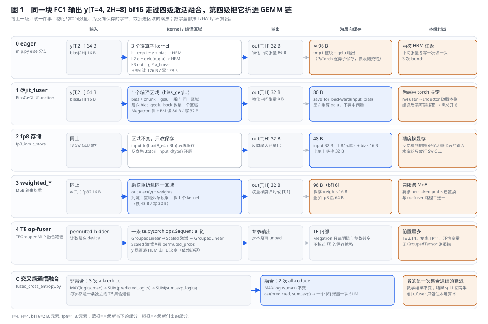
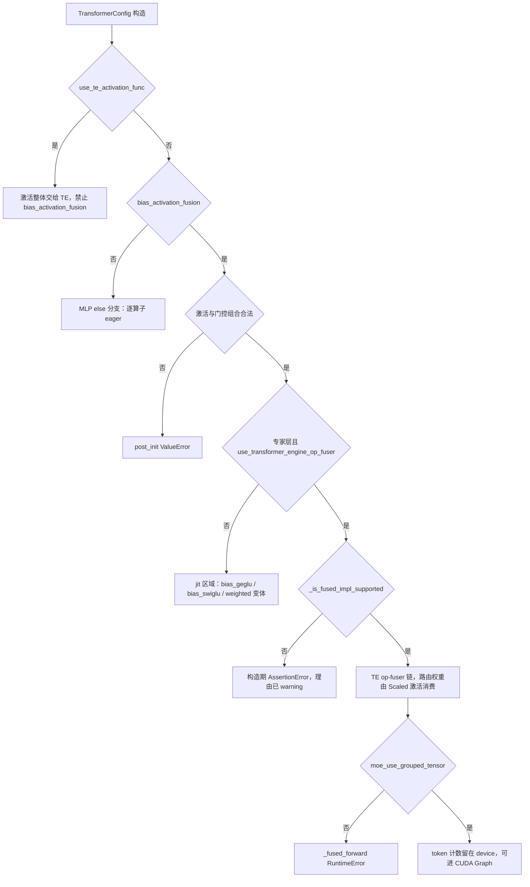
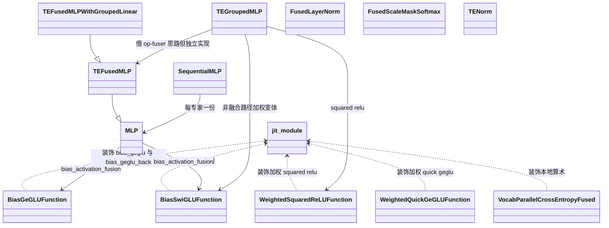

# Megatron-LM 融合算子：从逐点 JIT 融合到跨 GEMM 与跨通信的融合阶梯

> **源码基线**：`NVIDIA/Megatron-LM@85902ef599ea4eb06ada7567a479c524b605767a`（`dev`，2026-09-01）
> **核心源码**：`megatron/core/jit.py`；`megatron/core/fusions/{fused_bias_gelu.py,fused_bias_geglu.py,fused_bias_swiglu.py,fused_bias_dropout.py,fused_weighted_squared_relu.py,fused_layer_norm.py,fused_softmax.py,fused_cross_entropy.py,fused_mrope.py,fused_mhc_kernels.py,fused_pre_gated_delta_rule.py}`；`megatron/core/transformer/{mlp.py,transformer_config.py}`；`megatron/core/transformer/moe/experts.py`；`megatron/core/extensions/transformer_engine.py`；`megatron/core/models/common/embeddings/rope_utils.py`
> **中心结论**：融合的对象是 kernel 之间的边界。Megatron 把这些边界分四级逐步吃掉：逐点算子链交给一个可整体替换的 `@jit_fuser` 编译区域；带归约的算子换成手写或供应商 kernel，用形状白名单换掉中间张量；GEMM 与激活之间的边界交给 Transformer Engine 的 op-fuser 链，并把分组 GEMM 的元数据留在 device 上，以便进 CUDA Graph；跨 rank 的通信边界则靠拼接张量减少集合通信次数。每一级都不改数学语义，改变的只是谁生成 kernel、以及在哪一层拒绝不可用的组合。
> **适用范围**：本页拥有训练态 MCore 的激活融合、归一化与 softmax 融合、RoPE 融合、TE op-fuser 与 GroupedTensor 路径、交叉熵通信融合，以及贯穿各级的后端选择与失败边界。MoE 分发器内的 permute 与 all-to-all 融合归 [[14_megatron_ep_analysis]]，线性层与交叉熵的整体融合归 [[24_megatron_linear_cross_entropy_analysis]]，FP8/FP4 recipe 与 CUDA Graph 主体归 [[23_megatron_precision_cudagraph_fusion_analysis]]，GDN 的 CP 到 HP 单次 all-to-all 归 [[13_megatron_cp_analysis]]。
> **最近更新**：2026-09-05。按四级融合阶梯重写机制主线，用同一块 FC1 输出贯穿 eager、jit、fp8 存储与加权变体；补齐 op-fuser 与 GroupedTensor 的选择条件、交叉熵的通信次数；修正 `--disable-jit-fuser` 的生效边界与"交叉熵通信减半"的旧说法。

---

## 1. 特性概览

### 1.1 问题背景

一个 Transformer 层里，GEMM 与注意力之外的算子几乎都是访存受限的小算子：加 bias、门控激活、dropout、残差相加、归一化、softmax、RoPE 旋转。它们的算术强度低，每个都要把输入从 HBM 读一遍、把输出写一遍，外加一次 launch；夹在两个 GEMM 之间时，同一块激活在 HBM 上来回多次。MoE 又把专家 MLP 按专家切成很多小段，每段都重复这套开销。更麻烦的是，这些算子的最优 kernel 随硬件世代（Hopper、Blackwell）、后端（TorchScript、Inductor、Transformer Engine、Triton、cuTile）和版本变化，框架没法把某一个 kernel 焊死在模型代码里。

### 1.2 解决方法

Megatron 不做一个统一的融合编译器，而是按"被融合的边界"分级：第一级用 `@jit_fuser` 把逐点算子链交给 PyTorch 当时可用的编译后端，并用 `torch.autograd.Function` 让反向也只是一个区域；第二级对带归约或布局置换的算子（LayerNorm、softmax、RoPE、残差加 RMSNorm）改用 Apex、自带 CUDA 扩展、Triton 或 TE 的 kernel，每个都带形状门槛与可用性探测；第三级借 TE 的 op-fuser 把 FC1、激活、FC2 串成一条算子链，并把分组 GEMM 的 token 计数留在 device 上；第四级在交叉熵这种跨 rank 的算子上拼接张量、减少集合通信次数。框架自己只固定三件事：装饰器名字、每个融合的探测函数，以及构造期的集中校验。

### 1.3 收益、开销和约束

| 维度 | 直接收益 | 必付成本或边界 |
|---|---|---|
| HBM 流量 | 逐点链只读输入一次、写输出一次；中间张量不落 HBM | 反向要重算中间量（jit 级）或依赖供应商 kernel 的内部实现（op-fuser 级） |
| 反向保存的字节 | 融合的 autograd Function 只保存输入与 bias；fp8 存储再减半 | fp8 存储改变反向看到的数值；加权变体要多保存路由权重 |
| launch 次数 | 一条链一次 launch；分组 GEMM 的元数据留在 device 上时不需要 host 同步 | 编译后端可能在某个硬件与模型组合上挂死，需要总开关 |
| 通信 | 交叉熵把两次 SUM all-reduce 并成一次 | 只减少集合通信的次数，不减少字节 |
| 可移植性 | 同一份模型代码在 TorchScript、Inductor、TE、Triton、cuTile 之间切换 | 每个融合各有版本门槛、形状白名单与硬件门槛，失败方式不统一 |

### 1.4 符号约定

| 符号 | 含义 |
|---|---|
| $T$ | 进入激活函数的 token 行数 |
| $H$ | 门控激活输出的隐藏维；FC1 输出宽 $2H$ |
| $b$ | 每元素字节数：bf16 为 2，float8_e4m3fn 为 1，fp32 为 4 |
| $y$、$g$ | FC1 输出 $y\in\mathbb{R}^{T\times 2H}$，门控后的输出 $g\in\mathbb{R}^{T\times H}$ |
| $p$ | MoE 路由权重，形状 $T\times 1$ |

---

## 2. 融合阶梯详细方案

先从最容易做到的办法开始：把逐点算子链交给编译器。它留下的是带归约的算子、GEMM 与激活之间的边界、以及跨 rank 的集合通信，于是引出后面三级。这个顺序解释的是动机，各级的适用性仍取决于后端版本和硬件。

### 2.1 共用算例：一块 FC1 输出

令 $T=4$、$H=4$、bf16。FC1 输出 y[T=4, 2H=8] 占 64 B，bias 占 16 B，门控后的输出 $g$ 占 32 B。这块张量在稠密 MLP 里走 bias 加 GEGLU；在 MoE 专家里它还带着每 token 的路由权重 $p$（fp32，16 B）；同样这 $T$ 行最后产出 vocab-parallel 的 logits，进入交叉熵。四级融合都在这块张量上重放。



### 2.2 第一级：逐点算子链交给一个编译区域

**未融合时发生什么。** `MLP.forward` 的 else 分支先 `y + bias`，再 `torch.chunk` 成门与线性两半，再 `activation_func(x_glu)`，最后乘 `x_linear`。本例是 3 个逐算子 kernel：HBM 读 176 B、写 128 B，Megatron 侧显式物化 96 B 中间张量（整块 `tmp1` 与 gelu 输出）。反向由 PyTorch 逐算子自动求导决定各自保存什么：gelu 保存它的输入视图（保活整块 `tmp1`），乘法保存两个操作数，总量约 96 B。这一层是依赖侧契约，本页不逐算子核对。

**融合后发生什么。** `bias_geglu_impl` 把张量整形成二维后调用 `BiasGeGLUFunction.apply`。前向只做一件事：`save_for_backward(input, bias)`，然后调用被 `@jit_fuser` 装饰的 `bias_geglu`，一个编译区域内完成加 bias、切半、tanh 近似 gelu 与乘门。反向读回 `(input, bias)`，调用同样被装饰的 `bias_geglu_back`，在一个区域里重算 gelu 及其导数，返回同一个梯度张量给 input 与 bias（bias 的梯度由上游按广播规约）。本例 Megatron 侧 HBM 读 80 B、写 32 B，物化 0 B，为反向保存 80 B。GeLU、SwiGLU、bias-dropout-add、加权 squared-ReLU 都是这一个模式：一对 `*` / `*_back` 的 jit 函数，外面包一个只保存输入的 autograd Function。

**装饰器为什么是一个可变的模块变量。** `megatron/core/jit.py` 把 `jit_fuser` 初始化为 `torch.jit.script`，模块末尾调用 `enable_jit_fuser()`：torch 不低于 2.2.0a0 时改绑成 `torch.compile`，捕获 ImportError 时退成 `noop_decorator`。这层间接由提交 `473225f9a`（2024-01-19）引入，理由写在提交标题里："Add jit_fuser to switch between torch.jit.script and torch.compile"；源码注释同时记下 nvFuser 自 PyTorch 2.2 起在 JIT 中弃用。被否掉的方案是在每个融合文件里各自选择后端；判据是后端由 PyTorch 版本决定，不由 Megatron 决定，所以只固定名字。第二次改写来自提交 `6cc224db3`（2025-11-06，"Fix Qwen3-Next hang on Blackwell, add a flag to control torch.compile"）：它把 `attention.py` 和当时的 `gated_delta_net.py` 里直接写的 `@torch.compile` 改成 `@jit_fuser`，并新增 `disable_jit_fuser()` 与训练配置 `disable_jit_fuser`（`DistributedInitConfig`），由 `set_global_variables` 在参数解析后调用。被推翻的假设是"有了编译后端就一路 compile"，推翻它的证据是一次真实挂死。

> [!contradiction] `--disable-jit-fuser` 的生效边界，2026-09-05 更正旧页"整层融合随之退回 eager"的说法
> `disable_jit_fuser()` 只把 `megatron.core.jit.jit_fuser` 这个模块变量改成 `noop_decorator`；`@jit_fuser` 在被装饰函数定义那一刻求值，已经 import 的模块不会被重新装饰。静态导入链：`pretrain_gpt.py` 在模块顶层 `from megatron.training import pretrain`，`megatron/training/training.py` 顶层经 `experimental_attention_variant_module_specs` 引入 `deepseek_v4_hybrid_attention`，后者顶层 `from megatron.core.transformer.attention import Attention`，而 `attention.py` 在类定义时就用 `@jit_fuser` 装饰了 `_apply_output_gate`；`initialize_megatron` 及其中的 `set_global_variables` 在 `pretrain()` 里才运行。因此在这条入口下，开关只能覆盖它之后才首次 import 的模块；要让它对整层生效，必须在 import 模型代码之前调用 `disable_jit_fuser()`。这一判断由 Python 装饰器语义与上述导入顺序推出（分析推断，本机缺 Triton 未能跑通整条入口做实证）；#2058 自己改动的 `_apply_output_gate` 恰好落在受影响的一侧。

**选择入口与构造期校验。** `MLP.forward` 先看 `use_te_activation_func`（把激活整个交给 TE，与本级互斥），再看 `bias_activation_fusion`：gelu 走 `bias_geglu_impl`（门控）或 `bias_gelu_impl`（非门控，且要求 `add_bias_linear`），silu 加门控走 `bias_swiglu_impl`，带 `per_token_scale` 时走 `weighted_bias_swiglu_impl` 或 `weighted_bias_quick_geglu_impl`，其余组合直接 `ValueError`。`TransformerConfig.__post_init__` 把这些条件提前到构造期：激活函数不在 gelu、silu、quick_gelu 之内、gelu 非门控却无 bias、quick_gelu 非门控、`glu_linear_offset` 非零却不是 quick_gelu、与 `use_te_activation_func` 同开，都是 `ValueError`。bias-dropout-add 的选择在 `get_bias_dropout_add`：融合时按训练与推理返回两个不同的 jit 函数（源码注释说明对 `nn.Module` 做 scripting 触发不了融合），推理且无梯度时才走就地加法；残差是 fp32 时先把 x 与 bias 升到残差 dtype，这一条由 `test_bias_dropout_fusion.py::TestFp32ResidualPreservation` 覆盖。

**同一模式上的两个旋钮。** `fp8_input_store` 让 SwiGLU 的 Function 把要保存的 input 先转成 `float8_e4m3fn`，反向再 `.to(ori_input_dtype)` 还原：本例保存字节从 80 B 降到 48 B，代价是反向看到的输入已被量化；`__post_init__` 只对 SwiGLU 放行（`activation_func_fp8_input_store` 的归属是 [[10_megatron_model_structure_analysis]]）。加权变体把 $p$ 折进同一区域，`weighted_swiglu_back` 顺便沿 $H$ 求和得到权重梯度：与"区域外单独乘 $p$"相比少一个 kernel，多保存 16 B 的权重。`bias_swiglu_impl` 还接受一个 `cpu_offload_input` 标志，来自 `config.cpu_offloading and cpu_offloading_activations and HAVE_TE`，它只在保存的张量上打 `activation_offloading=True` 属性，交给 [[22_megatron_memory_optimization_analysis]] 的整层换出去处理。`test_swiglu_fusion.py::test_weighted_bias_swiglu` 用未加权融合再乘权重的结果作为参照，逐一比较输出、输入梯度与权重梯度。

**下一步要解决什么。** 编译区域只覆盖逐点链。LayerNorm 要沿 $H$ 求均值方差，softmax 要沿 key 维归一化，RoPE 要成对旋转并适配 THD 布局。这些算子要么在框架里早于 `torch.compile` 就有了手写 kernel，要么形状约束太硬，不适合交给通用后端。第二级的答案是手写或供应商 kernel，代价是每个都带白名单。

### 2.3 第二级：带归约的算子换成带形状门槛的手写 kernel

**LayerNorm。** `FusedLayerNorm` 优先用 Apex 的持久化 kernel `FastLayerNormFN`，但只在 `persist_ln_hidden_sizes` 的 24 个尺寸（1024 到 65536）之内且 Apex 提供该 kernel时启用；否则退到 Apex 的 `FusedLayerNormAffineFunction`；两者都没有就在构造期 `ValueError("Apex must be installed to use FusedLayerNorm.")`，源码紧挨着留着 `# TODO: Add pytorch only layer norm`。`memory_efficient_layer_norm` 通过 `inspect.getfullargspec` 探测 Apex 签名里有没有 `memory_efficient` 形参再决定传不传。持久化 kernel 的输出是一个 view，所以前向用 `make_viewless_tensor` 重新包装，否则流水线的 `deallocate_output_tensor` 会报错。这个类只在本地 spec 下被选中：`gpt_layer_specs.py` 在 Apex 可 import 时把 `LNImpl` 绑到它，否则回退 `WrappedTorchNorm`；TE 后端的归一化走 `TENorm`，与本级无关。

**softmax。** `FusedScaleMaskSoftmax` 在 `DotProductAttention` 里构造，每次前向由 `is_kernel_available` 决定走 CUDA 扩展还是 torch：要求 `masked_softmax_fusion` 打开、输入是 fp16 或 bf16、$16 < s_k \le 4096$、$s_q$ 与 $s_k$ 是 4 的倍数、`b * np` 是 4 的倍数，再按 `get_batch_per_block` 的整除性分因果与非因果两种判定。融合路径三选一：因果掩码用 `ScaledUpperTriangMaskedSoftmax`（掩码在 kernel 内生成，不物化 `[b, np, sq, sk]`，且断言 $s_q=s_k$），显式掩码用 `ScaledMaskedSoftmax`，无掩码用 `ScaledSoftmax`。带 `softmax_offset`（softmax-one）或滑窗时一律走 `forward_torch_softmax`，那里才用 `get_default_causal_mask` 或滑窗函数物化掩码。TE 注意力后端有自己的 kernel，不经过这里。

**RoPE。** `apply_rope_fusion` 打开后，`rope_utils.apply_rotary_pos_emb` 按输入布局选 TE 的 `fused_apply_rotary_pos_emb` 或 `fused_apply_rotary_pos_emb_thd`，遇到三轴 mRoPE 频率则用 Triton 的 `fused_apply_mrope` 与 `fused_apply_mrope_thd`；后者只支持 split-half 布局，所以 `rotary_interleaved` 的配置被留在 TE 校验路径上，要求 TE 不低于 2.3.0。构造期在 `__post_init__` 集中校验：Triton mRoPE 与两个 TE 入口都不可用时 `ValueError("apply_rope_fusion is not available. Please install TE >= 1.4 or Triton for fused mRoPE.")`。MLA 用自己的 Triton kernel `fused_mla_yarn_rope_apply`，`should_use_fused_mla_rope` 要求 `rotary_percent` 为 1.0，否则警告一次并回退非融合路径。`fused_single_qkv_rope` 更进一步不再拆分 QKV、也不再拼接三份 dgrad，`Attention` 在不可用时直接断言失败，且与 `attention_output_gate` 互斥。

**残差加 RMSNorm。** `TENorm` 是两级 opt-in：全局 `fused_residual_rmsnorm` 为真，且构造点传入 `has_residual=True`，才把模块换成 `TEFusedResidualRMSNorm`（要求 TE 不低于 1.13.0）；归一化不是 RMSNorm 时 `ValueError`。kernel 内部属于 TE 契约，Megatron 只证明选择条件与替换点。

**这一级的共同形状。** 每个算子都有一个"能不能用"的探测，但失败方式不同：LayerNorm 在构造期抛错，softmax 与 MLA RoPE 在运行期静默回退 torch，RoPE 在构造期集中抛错。§2.6 把这些差异列成表。它们解决的都是单卡内的归约边界；GEMM 与激活之间、以及 MoE 各专家之间的边界仍然在。

### 2.4 第三级：把激活折进 GEMM 链

**动机。** 前两级之后，FC1 的输出 $y$ 仍然要在 GEMM 与激活之间落一次 HBM，MoE 又把这次落地按专家段重复。Megatron 没有自己写 GEMM 与激活的融合 kernel，而是把 FC1、激活、FC2 描述成 TE op-fuser 的一条 `te.pytorch.ops.Sequential` 链，让 TE 决定能否把激活折进 GEMM 的 epilogue。

**MoE 专家：`TEGroupedMLP`。** `use_transformer_engine_op_fuser` 为真时构造期断言 `_is_fused_impl_supported()`，该函数逐条打印不满足的理由并返回 False：TE 缺 `pytorch.ops`、缺 `GroupedLinear` 或 `ScaledSwiGLU`、TE 低于 2.14.0、专家 TP 大于 1、细粒度 offload 选中了 `expert_fc1` 或 `moe_act`、`moe_apply_probs_on_input`、FC1 或 FC2 不是 `te.pytorch.GroupedLinear`、激活不在 SwiGLU、quick-GEGLU、加权 squared-ReLU 之内、带 clamp 的 SwiGLU 缺 TE 2.17.0.dev0 或 `ScaledClampedQGeGLU`、quick_gelu 缺 `ScaledClampedQGeGLU`（报错文案写作 TE 2.15）、squared-ReLU 缺 `ScaledSReLU`，以及门控融合要求环境变量 `NVTE_CUTEDSL_FUSED_GROUPED_MLP` 大于 0。`_make_fused_ops` 在第一次前向时构造链：用 `device="meta"` 建 `GroupedLinear` 壳，再把现有的 `weight{i}` 或单个 `GroupedTensor` 参数注册回去，避免复制权重；中间的激活算子按配置选 `ScaledSwiGLU`、`ScaledClampedQGeGLU`（`alpha=1.0` 即 silu，`limit=clamp`，源码注释说明 cuDNN 的 geglu kernel 是 swiglu 的超集）或 `ScaledSReLU`，"Scaled"意味着路由权重 $p$ 在这里被消费，这正是第一级加权变体被这一级吸收的位置；有 `activation_recompute_in_mlp` 形参时透传 `moe_act` 的重计算意图。`_fused_forward` 先按 `skip_routed_expert_padding` 决定是否再做对齐 padding（注释说明 GroupedTensor 路径当前用 256 token 的专家段），把 `tokens_per_expert` 以 `int64` 留在 device 上，再用 paged stash 与 `fused_group_mlp` 的 offload 上下文包住 `ops(...)` 调用（两者归 [[22_megatron_memory_optimization_analysis]]）。链内部怎样融合是 TE 的契约；Megatron 能证明的是算子顺序、参数共享、前置条件与两侧的钩子。

**GroupedTensor：把"可图捕获"从 op-fuser 里拆出来。** `moe_use_grouped_tensor`（#6847）选择 TE 原生的 GroupedTensor 路径，docstring 自陈它用 padded expert segment 加 CUDA split metadata，"so it can be captured in CUDA graphs"。`__post_init__` 让 op-fuser 蕴含它（`use_transformer_engine_op_fuser and moe_grouped_gemm` 时自动置真），但允许单独打开；它要求 `moe_grouped_gemm`，`moe_single_grouped_weight` 与 `moe_single_grouped_bias` 又要求它（后者还要求 `add_bias_linear`），NCCL-EP 分发器拒绝"开 GroupedTensor 却不开 op-fuser"。`_apply_packed_bias` 的 docstring 点明关键：给专家 bias 时"without reading token counts on the host"；`_fused_forward` 在没有它时直接 `RuntimeError`。没有 host 同步是进 CUDA Graph 的硬前提，与本页其余融合"省 launch"的收益不是一回事；这条与条件在 [[23_megatron_precision_cudagraph_fusion_analysis]] 的整层 MoE 图捕获一节闭合。

**稠密 MLP：`TEFusedMLP` 与 `TEFusedMLPWithGroupedLinear`。** `get_mlp_module_spec_for_backend` 在无专家时三选一：`use_te_op_fuser` 且（`dense_grouped_gemm` 或 `use_grouped_gemm_for_dense_mlp`）选 `TEFusedMLPWithGroupedLinear`（别名 `TEFusedDenseMLP`），只开 op-fuser 选 `TEFusedMLP`，否则普通 `MLP`。`TEFusedMLP._make_fused_impl` 要求 FC1 是 `te.pytorch.LayerNormLinear`、FC2 是 `te.pytorch.Linear`，把归一化、`BasicLinear`、激活、`Linear` 串成链。`TEFusedMLPWithGroupedLinear` 改用 `GroupedLinear(num_groups=1)`，docstring 写明目的是在 SM100 加 MXFP8 recipe 下触发 TE 的 `ForwardGroupedMLP_CuTeGEMMSwiGLU_MXFP8`；构造期要求 TE 不低于 2.14.0、无 bias、SwiGLU，TP 大于 1 时回退父类实现。`moe_mlp_glu_interleave_size` 让 GLU 输入按门与线性交错分块，为这类 kernel 准备布局；不走融合实现时只发警告，说明非融合路径每次前向会多一次重排。

**变体枚举的依据。** 专家侧的激活路径由 `TEGroupedMLP.forward` 的两层分支决定：`_with_fused_impl` 为真直接进 `_fused_forward`；否则 `bias_act_func` 依次看 `use_te_activation_func`、`bias_activation_fusion`（加权 SwiGLU 或加权 quick-GEGLU，GLU 交错布局下不走融合）、`use_fused_weighted_squared_relu`（断言无 bias）、普通 GLU。本地后端的 `SequentialMLP` 是兄弟轴：`LocalSpecProvider.grouped_mlp_modules` 只返回它，每个专家复用 `MLP.forward` 并传 `per_token_scale`。`moe_apply_probs_on_input` 改在专家输入侧乘一次 $p$ 并把 `permuted_probs` 置 1，两种专家实现都断言 `moe_router_topk == 1`。

### 2.5 第四级：跨 rank 的通信边界

TP 切分词表后，交叉熵要跨 rank 求 logits 的最大值、目标 logit 与 exp 之和。非融合的 `_VocabParallelCrossEntropy` 做 3 次 all-reduce：MAX 一次，SUM 两次。`fused_cross_entropy.py` 的版本把 `predicted_logits` 与 `sum_exp_logits` 用 `torch.cat` 拼成一个长度 $2T$ 的张量，一次 SUM 后再 `torch.split`，全程变成 2 次；本地算术分别包在四个 `@jit_fuser` 函数里，反向的 `calculate_gradients` 把梯度转成 bf16 返回。`LanguageModule` 按 `cross_entropy_loss_fusion` 选择 `fused_vocab_parallel_cross_entropy`，该字段归 [[24_megatron_linear_cross_entropy_analysis]]。省下的是一次集合通信的延迟，字节不变，数学结果不变。

> [!contradiction] 2026-09-05 更正
> 旧页写"只需 1 次 AllReduce 而不是 2 次，减少 50% 的 CE loss 通信量"。冻结基线的非融合路径有三次 all-reduce（`cross_entropy.py::_VocabParallelCrossEntropy.forward`），融合路径保留 MAX 那一次，只把两次 SUM 并成一次，因此是 3 次变 2 次；通信字节没有减半。

同一类"把两次通信折成一次"的融合还有三处，各归其页：MoE 分发器的 permute 与 all-to-all 融合（`moe_permute_fusion`、DeepEP 与 HybridEP 后端）归 [[14_megatron_ep_analysis]]；线性层与交叉熵的整体融合（`cross_entropy_fusion_impl`，Blackwell CUTLASS 实现）归 [[24_megatron_linear_cross_entropy_analysis]]；GDN 前向把 CP 到 HP 的逐段 all-to-all 改成一次不分段 all-to-all（`gated_delta_net/common.py::a2a_cp_to_hp` 预置换 head 维）归 [[13_megatron_cp_analysis]]。

### 2.6 贯穿各级：后端选择与失败边界

每一级都要回答同一个问题：kernel 不可用时怎么办。源码给出三种答案，本页按机制列出：

| 机制 | 选择点 | 不可用时的行为 |
|---|---|---|
| `@jit_fuser` 逐点融合 | `megatron/core/jit.py` 模块变量，import 时求值 | torch 太旧退 `torch.jit.script`，ImportError 退 `noop_decorator`；`disable_jit_fuser()` 只影响之后 import 的模块 |
| bias 加激活 | `MLP.forward` 与 `TEGroupedMLP.forward` 的分支 | 不支持的激活组合在 `__post_init__` 与 forward 两处 `ValueError` |
| LayerNorm | `gpt_layer_specs.py` 的 `LNImpl` 绑定；`FusedLayerNorm.__init__` | 无 Apex 时 spec 退 `WrappedTorchNorm`；有 Apex 但尺寸不在白名单退非持久化 kernel；类内两种都缺则 `ValueError` |
| softmax | `FusedScaleMaskSoftmax.is_kernel_available` 每次前向判定 | 运行期静默回退 `forward_torch_softmax` |
| RoPE | `__post_init__` 集中探测；`apply_rotary_pos_emb` 运行期分派 | 三条入口全缺构造期 `ValueError`；MLA 部分旋转警告一次后回退 |
| op-fuser 链 | `TEGroupedMLP.__init__` 断言 `_is_fused_impl_supported()` | 请求了却不满足即构造期 `AssertionError`，每条理由先打 warning |
| GroupedTensor | `__post_init__` 的蕴含与互斥；`_fused_forward` | 缺它走 op-fuser 直接 `RuntimeError` |
| mHC 融合 kernel | `fused_mhc_kernels.py` 模块级探测 `_TRITON_AVAILABLE`、`_CUTILE_AVAILABLE`，环境变量 `MHC_FORCE_BACKEND=auto、native、triton、cutile` 与 `MHC_DISABLE_TRITON`、`MHC_DISABLE_CUTILE` | 逐算子选后端（Sinkhorn 与 `H_post_bda` 反向优先 Triton，其余 cuTile），全部退 torch 时 `use_fused_mhc` 保持打开并发一条 rank-0 warning；强制的后端不可用则记录错误后抛出 |
| DSA 融合 kernel | `dsa_kernel_backend` 取 `none、tilelang、cudnn`；`_validate_dsa_kernel_backend_dependencies` | 缺包构造期 `ValueError`；`dsv4_hybrid` 拒绝 `tilelang`，`cudnn` 要求 SM90 以上；旧字段 `apply_dsa_kernel_fusion` 被映射为枚举值并发弃用警告，与显式枚举冲突时报错 |
| Pre-GDR 融合 | `GatedDeltaNet._setup_variant_attrs` | 与 `deterministic_mode` 同开 `ValueError`；KDA 变体 `NotImplementedError`；chunkwise CP 下要求 `micro_batch_size == 1` 且与 `gdn_conv_pad_alignment` 互斥；入口拒绝 CPU 张量、conv bias、`use_qk_l2norm=False` |

用一张流程图看激活路径在构造期是怎样被裁决的：



### 2.7 开销结算

| 级 | 吃掉的边界 | 本例省下 | 本例付出 | 失败面 |
|---|---|---|---|---|
| 1 jit | 逐点算子之间 | 3 个 kernel 变 1 个区域；物化 96 B 变 0 B；保存 96 B 变 80 B | 反向重算 gelu；后端不受控 | 编译后端挂死只能靠总开关，且开关受 import 顺序限制 |
| 1 fp8 存储 | 同上 | 保存 80 B 变 48 B | 反向输入被量化 | 只放行 SwiGLU |
| 1 加权 | 激活与路由权重之间 | 少一个乘法 kernel | 多保存 16 B | 只服务 MoE |
| 2 手写 kernel | 归约或置换算子内部 | 掩码不物化、LayerNorm 单 kernel | 形状白名单、版本门槛 | 构造期抛错或运行期回退，按算子不同 |
| 3 op-fuser | GEMM 与激活之间、专家段之间 | 激活折进 GEMM 链；token 计数不回 host | TP=1、TE 版本、环境变量、不能与部分 offload 组合 | 请求即断言 |
| 4 通信 | rank 之间 | 3 次 all-reduce 变 2 次 | 一次 cat 与 split | 无 |

---

## 3. 代码实现分析

### 3.1 类与所有权



| 对象 | 责任 | 不负责什么 |
|---|---|---|
| `megatron/core/jit.py` | 持有唯一的装饰器变量与两个开关函数 | 不知道谁在用它；不能追溯已装饰的函数 |
| 各 `*Function`（autograd） | 决定保存什么、反向调用哪个 jit 区域 | 不决定 kernel 怎么生成 |
| `MLP` / `SequentialMLP` | 按配置在 eager、jit 区域、TE 激活之间选择 | 不做 GEMM 融合 |
| `TEGroupedMLP` | 持有 `_with_fused_impl`、`_use_grouped_tensor`、探测与链构造；处理 padding、paged stash 与 offload 钩子 | 链内部的 kernel 融合归 TE |
| `TEFusedMLP` 及子类 | 稠密 MLP 的 op-fuser 链与 SM100 分组 GEMM 触发 | 不服务专家 |
| `FusedLayerNorm` / `FusedScaleMaskSoftmax` / `TENorm` | 各自的可用性判定与回退 | 不参与配置校验 |
| `TransformerConfig.__post_init__` | 构造期集中拒绝非法组合 | 不探测运行期形状 |

### 3.2 调用流程

稠密 MLP 的一次前向，以 SwiGLU 为例：

```text
MLP.forward(hidden_states, per_token_scale=None)
|
+-- linear_fc1(hidden_states)                       -> y[T,2H], bias
+-- [use_te_activation_func]  TE 激活模块
+-- [bias_activation_fusion]
|   +-- bias_swiglu_impl(y, bias, fp8_input_store, cpu_offload_input, clamp)
|       `-- BiasSwiGLUFunction.apply               save_for_backward(input_for_backward, bias)
|           `-- bias_swiglu / bias_clamped_swiglu   一个 @jit_fuser 区域
+-- [else]  y + bias -> chunk -> act(x_glu) * x_linear     三个逐算子 kernel
`-- linear_fc2(g)                                   -> output, output_bias
反向：BiasSwiGLUFunction.backward -> bias_swiglu_back  一个 @jit_fuser 区域，输入梯度与 bias 梯度同一张量
```

专家 MLP 走 op-fuser 时的一次前向：

```text
TEGroupedMLP.forward(permuted_hidden, tokens_per_expert, permuted_probs)
|
+-- [_with_fused_impl] _fused_forward
|   +-- (首次) _make_fused_ops                     GroupedLinear(meta) -> Scaled 激活 -> GroupedLinear(meta)
|   +-- skip_routed_expert_padding 或 quantization_padding   对齐专家段
|   +-- tokens_per_expert.to(device, int64)        不回 host
|   +-- paged_stash_group_start / get_paged_stash_context   [moe_paged_stash]
|   +-- off_interface(offload_fused_group_mlp)              [fine-grained offload]
|   +-- ops(x, tokens_per_expert, permuted_probs, tokens_per_expert)   TE 内部
|   `-- group_offload / quantization_unpadding / paged_stash_group_commit
`-- [else] linear_fc1 -> bias_act_func -> linear_fc2 -> _apply_bias
        bias_act_func: use_te_activation_func | weighted_bias_swiglu_impl | weighted_bias_quick_geglu_impl
                       | weighted_squared_relu_impl | 普通 GLU 再乘 permuted_probs
```

交叉熵一次前向：

```text
LanguageModule.compute_language_model_loss   [cross_entropy_loss_fusion]
`-- fused_vocab_parallel_cross_entropy -> _VocabParallelCrossEntropy.apply
    +-- calculate_logits_max            @jit_fuser
    +-- all_reduce(MAX)
    +-- calculate_predicted_logits      @jit_fuser，cat(predicted, sum_exp)
    +-- all_reduce(SUM)                 一次
    `-- calculate_cross_entropy_loss    @jit_fuser，split 回两半
反向：calculate_gradients @jit_fuser，结果转 bf16
```

### 3.3 源码阅读路线

1. 装饰器与开关：`megatron/core/jit.py::enable_jit_fuser`、`disable_jit_fuser`；接线 `megatron/training/global_vars.py::set_global_variables`，字段 `megatron/training/config/common_config.py::DistributedInitConfig.disable_jit_fuser`。
2. 逐点融合与保存策略：`megatron/core/fusions/fused_bias_geglu.py::BiasGeGLUFunction`、`weighted_bias_quick_geglu_impl`；`fused_bias_swiglu.py::BiasSwiGLUFunction`、`weighted_swiglu_back`；`fused_bias_gelu.py::GeLUFunction`；`fused_bias_dropout.py::get_bias_dropout_add`、`_bias_dropout_add_func`；`fused_weighted_squared_relu.py::WeightedSquaredReLUFunction`。
3. 选择入口与校验：`megatron/core/transformer/mlp.py::MLP.forward`；`transformer_config.py::TransformerConfig.__post_init__` 中 `bias_activation_fusion`、`activation_func_fp8_input_store`、`activation_func_clamp_value`、`apply_rope_fusion`、`fused_single_qkv_rope`、`fused_residual_rmsnorm`、`moe_use_grouped_tensor`、`moe_single_grouped_weight` 的分支。
4. 带归约的 kernel：`fused_layer_norm.py::FusedLayerNorm.__init__`、`forward`；`fused_softmax.py::FusedScaleMaskSoftmax.is_kernel_available`、`forward_fused_softmax`、`forward_torch_softmax`；`rope_utils.py::apply_rotary_pos_emb`、`should_use_fused_mla_rope`；`fused_mrope.py::is_fused_mrope_available`；`extensions/transformer_engine.py::TENorm.__new__`。
5. GEMM 链：`moe/experts.py::TEGroupedMLP._is_fused_impl_supported`、`_make_fused_ops`、`_fused_forward`、`_apply_packed_bias`、`forward`；`extensions/transformer_engine.py::TEFusedMLP._make_fused_impl`、`TEFusedMLPWithGroupedLinear`；`models/gpt/gpt_layer_specs.py::get_mlp_module_spec_for_backend`；`models/backends.py::LocalSpecProvider.grouped_mlp_modules`。
6. 通信融合：`fusions/fused_cross_entropy.py::_VocabParallelCrossEntropy`；对照 `tensor_parallel/cross_entropy.py::_VocabParallelCrossEntropy.forward`；消费点 `models/common/language_module/language_module.py`。
7. 多后端与失败边界：`fusions/fused_mhc_kernels.py::_forced_backend`、`_raise_mhc_backend_validation_error`；`utils.py::_validate_dsa_kernel_backend_dependencies`；`ssm/gated_delta_net/gdn.py::GatedDeltaNet._setup_variant_attrs`；`fusions/fused_pre_gated_delta_rule.py` 模块 docstring。
8. 可复核测试：`tests/unit_tests/fusions/test_swiglu_fusion.py::test_weighted_bias_swiglu`、`test_clamped_bias_swiglu_impl`；`test_bias_dropout_fusion.py::TestFp32ResidualPreservation`；`test_torch_softmax.py::TestFusedScaleMaskSoftmaxComprehensive.test_fused_kernel_availability`；`test_rmsnorm_residual_fusion.py::test_rmsnorm_residual_fusion`；`test_weighted_squared_relu_fusion.py::test_weighted_squared_relu_fusion`；`transformer/moe/test_grouped_mlp.py`。

---

## 4. 约束与失败边界

| 前提 | 源码边界 | 破坏后的行为 |
|---|---|---|
| `bias_activation_fusion` 的激活在 gelu、silu、quick_gelu 内，gelu 非门控须带 bias，quick_gelu 须门控 | `TransformerConfig.__post_init__` 三条 `raise ValueError` | 构造失败 |
| `bias_activation_fusion` 与 `use_te_activation_func` 不同开 | 同上 `raise ValueError` | 构造失败 |
| `activation_func_fp8_input_store` 只用于 SwiGLU | `__post_init__`："Storing activation input in FP8 is supported only for SwiGLU." | 构造失败 |
| `activation_func_clamp_value` 的 SwiGLU 只用于 MoE，且不与 TE 激活同开 | `__post_init__` 两条 `raise ValueError` | 构造失败 |
| `apply_rope_fusion` 至少有一条可用入口；`rotary_interleaved` 需 TE 2.3.0 | `__post_init__` 的 `apply_rope_fusion` 分支 | 构造失败 |
| `fused_single_qkv_rope` 不与 `attention_output_gate` 同开；运行期必须可用 | `__post_init__`；`Attention` 中的 `assert` | 构造失败或前向断言失败 |
| `fused_residual_rmsnorm` 只用于 RMSNorm | `__post_init__`；`TENorm.__new__` | 构造失败 |
| 持久化 LayerNorm 只接受白名单尺寸；Apex 缺失时不能构造 `FusedLayerNorm` | `FusedLayerNorm.__init__` 的 `persist_ln_hidden_sizes` 与 `raise ValueError` | 退非持久化 kernel，或构造失败 |
| 融合 softmax 只服务 fp16/bf16、$s_k \le 4096$、维度整除 4 | `FusedScaleMaskSoftmax.is_kernel_available` | 静默走 torch 路径 |
| op-fuser 要求 TE 2.14.0、专家 TP=1、无 `expert_fc1`/`moe_act` offload、非 `moe_apply_probs_on_input`、GroupedLinear、支持的激活、`NVTE_CUTEDSL_FUSED_GROUPED_MLP` | `TEGroupedMLP.__init__` 的 `assert self._is_fused_impl_supported()` | 构造断言失败，理由已 warning |
| `moe_use_grouped_tensor` 需 `moe_grouped_gemm`；单 GroupedTensor 权重与 bias 需它且 bias 需 `add_bias_linear`；NCCL-EP 下需 op-fuser | `__post_init__` 五条 `raise ValueError` | 构造失败 |
| op-fuser 的 MoE 路径必须开 GroupedTensor | `TEGroupedMLP._fused_forward` 的 `raise RuntimeError` | 首次前向失败 |
| `moe_apply_probs_on_input` 只允许 top-1 | `TEGroupedMLP.forward`、`SequentialMLP.forward` 的 `assert` | 前向断言失败 |
| `TEFusedMLPWithGroupedLinear` 需 TE 2.14.0、无 bias、SwiGLU | 该类 `__init__` 三条 `raise` | 构造失败 |
| `use_fused_mhc` 需 `enable_hyper_connections`；强制后端必须可用 | `__post_init__`；`fused_mhc_kernels.py::_raise_mhc_backend_validation_error` | 构造失败或首次调用抛出 |
| `dsa_kernel_backend` 的依赖包必须齐；`dsv4_hybrid` 不接受 `tilelang`，`cudnn` 需 SM90 | `utils.py::_validate_dsa_kernel_backend_dependencies`；`__post_init__` | 构造失败 |
| Pre-GDR 融合不与 `deterministic_mode` 同开，不支持 KDA | `GatedDeltaNet._setup_variant_attrs`；`__post_init__` | 构造失败 |
| `--disable-jit-fuser` 只影响之后 import 的模块 | `megatron/core/jit.py` 的模块变量语义 | 已装饰的函数仍走编译后端 |

---

## 5. 发展趋势

以下每条都锚定冻结基线里可读到的痕迹，方向判断是本页推断。

- **布尔开关正在被后端枚举取代。** `apply_dsa_kernel_fusion` 已降级为 `Optional[bool]`、docstring 自陈 deprecated，主开关是 `dsa_kernel_backend` 的三值枚举；mHC 更早一步用环境变量在 Triton、cuTile、torch 之间逐算子选择。新融合大概率一上来就是多后端。
- **Triton 成为自研融合的默认载体。** `fused_mrope.py`、`fused_pre_gated_delta_rule.py`、`fused_mla_yarn_rope_apply.py`、`fused_pad_routing_map.py`、`fused_indices_converter.py` 与 `fused_mhc_kernels.py` 的一部分都直接 `import triton`，且各自带 `HAVE_TRITON` 探测。
- **Apex 硬依赖尚未拆除。** `fused_layer_norm.py` 里的 `# TODO: Add pytorch only layer norm` 仍在；在它完成前，本地 spec 的 LayerNorm 只能靠 `gpt_layer_specs.py` 的 ImportError 回退兜底。
- **可图捕获与 op-fuser 正在解耦。** #6847 把 GroupedTensor 从 op-fuser 里拆成独立开关，`moe_use_grouped_tensor` 的 docstring 与 `_apply_packed_bias` 的 "without reading token counts on the host" 表明，下一步压力来自 CUDA Graph 而不是 kernel 数。
- **Blackwell 融合核仍在施工。** `fusions/linear_cross_entropy/blackwell/` 下留有 8 处 `FIXME` 或 `TODO`，见 [[24_megatron_linear_cross_entropy_analysis]]。
- **命名在收敛。** `fused_mla_yarn_rope_apply.py` 末尾的 "Backward-compatible aliases (deprecated, prefer the new names above)" 只为兼容保留旧符号。

---

## 6. 配置契约

### `TransformerConfig`（`megatron/core/transformer/transformer_config.py`，26 项）

| 字段 | 类型 | 默认 | 契约 | 行 |
|---|---|---|---|---|
| `bias_activation_fusion` | `bool` | `False` | If True, fuses bias addition and the activation function when possible. | `:567` |
| `masked_softmax_fusion` | `bool` | `False` | If True, uses softmax fusion. | `:570` |
| `persist_layer_norm` | `bool` | `False` | If True, uses the persistent fused layer norm kernel. This kernel only supports a fixed set of hidden sizes. | `:573` |
| `memory_efficient_layer_norm` | `bool` | `False` | If True, and using local layers (not from TransformerEngine), tells Apex to use the memory efficient fused LayerNorm kernel. Ignored if not using LayerNorm. | `:577` |
| `bias_dropout_fusion` | `bool` | `False` | If True, uses bias dropout fusion. | `:581` |
| `apply_rope_fusion` | `bool` | `False` | If True, use fused RoPE kernel. | `:584` |
| `use_fused_weighted_squared_relu` | `bool` | `False` | If True, uses fused weighted squared relu kernel when using MoE. | `:587` |
| `fused_single_qkv_rope` | `bool` | `False` | If set, avoid splitting QKV before ROPE forward and avoid concatenating ROPE dgrads. | `:590` |
| `use_transformer_engine_op_fuser` | `bool` | `False` | If True, submodules may use Transformer Engine's operation fuser API to enable advanced fusions. | `:593` |
| `fused_residual_rmsnorm` | `bool` | `False` | If True, fuses residual connection and RMSNorm backward pass when TE is used. | `:597` |
| `activation_func` | `Callable[[torch.Tensor], torch.Tensor]` | `F.gelu` | Activation function to use for the non-linearity in the MLP. | `:213` |
| `glu_linear_offset` | `float` | `0.0` | Offset term in the GLU activation function: activation_func(x[0]) * (x[1] + offset). Only used when gated_linear_unit is True | `:220` |
| `activation_func_clamp_value` | `Optional[float]` | `None` | Clamp the output of the linear_fc1 in the activation function. Only used when activation_func is quick_gelu or weighted SwiGLU (MoE only). | `:224` |
| `rotary_interleaved` | `bool` | `False` | True is rotate pairs of even and odd dimensions (RoFormer style), False is rotate pairs of first half and second half (LLaMa style). Default to False. | `:232` |
| `dsa_kernel_backend` | `Literal["none", "tilelang", "cudnn"]` | `"none"` | Optional fused ordinary-DSA kernel backend. Unsupported layouts use PyTorch fallback. | `:363` |
| `apply_dsa_kernel_fusion` | `Optional[bool]` | `None` | Deprecated DSv4 fused-kernel switch. Use ``dsa_kernel_backend`` instead. For ``dsv4_hybrid`` only, True maps to ``cudnn`` and False maps to ``none``. | `:410` |
| `gdn_pre_gated_delta_rule_fusion` | `bool` | `False` | Whether to use the streamed Triton fusion for GatedDeltaNet pre-GDR preprocessing. | `:448` |
| `gdn_conv_pad_alignment` | `Optional[int]` | `None` | When set, pad packed GDN causal-conv inputs to this token alignment. This is only valid without chunkwise CP: padding a chunk-local causal-conv input changes the sequence seen by later chunks and therefore changes the GDN recurrence numerics. | `:451` |
| `use_grouped_gemm_for_dense_mlp` | `bool` | `False` | Alias of ``dense_grouped_gemm``. Use GroupedLinear(num_groups=1) for dense MLP to trigger the ForwardGroupedMLP_CuTeGEMMSwiGLU_MXFP8 fusion on SM100+ with MXFP8 recipe. Requires ``use_te_op_fuser=True`` and SwiGLU activation. | `:923` |
| `moe_grouped_gemm` | `bool` | `False` | Use grouped GEMM to execute multiple local MoE experts together. The concrete implementation is selected by Transformer Engine. Set ``moe_use_grouped_tensor=True`` to use its CUDA-graph-safe GroupedTensor path. | `:935` |
| `moe_use_grouped_tensor` | `bool` | `False` | Use Transformer Engine's native GroupedTensor path for grouped MoE GEMMs. This path uses padded expert segments and CUDA split metadata so it can be captured in CUDA graphs. Enabling the Transformer Engine operation fuser also enables this option. | `:942` |
| `moe_single_grouped_weight` | `bool` | `False` | When using TE GroupedLinear for MoE experts, store expert weights as a single grouped parameter via Transformer Engine's `GroupedTensor`. Requires ``moe_grouped_gemm=True`` and ``moe_use_grouped_tensor=True``. | `:949` |
| `moe_single_grouped_bias` | `bool` | `False` | When using TE GroupedLinear for MoE experts, store expert biases as a single grouped parameter via Transformer Engine's `GroupedTensor`. Requires ``moe_grouped_gemm=True``, ``moe_use_grouped_tensor=True``, and ``add_bias_linear=True``. | `:955` |
| `moe_apply_probs_on_input` | `bool` | `False` | Apply probs on input of experts instead of applying after activation and glu. | `:1041` |
| `moe_mlp_glu_interleave_size` | `Optional[int]` | `None` | When set, GLU activations in the MoE grouped MLP layer will use a block interleaved format. Instead of interpreting the input tensor as a concatenation of gates and linear units, it will be interpreted as alternating blocks of gates and linear units. This data format is experimental and primarily intended to enable advanced fused kernels. | `:1090` |
| `use_fused_mhc` | `bool` | `False` | Use unified fused kernels for mHC operations. Backend selection is internal and op-specific: Triton for Sinkhorn and H_post_bda backward when available, cuTile for the remaining fused kernels when available, then native torch fallback. If every mHC operation uses the native torch fallback, use_fused_mhc remains enabled and a rank-0 warning is emitted. | `:1266` |

该类在冻结基线共 265 字段，本表收 26 项；其余字段的 owner 见 `docs/coverage/megatron-lm.yaml`。

### `ModelParallelConfig`（`megatron/core/model_parallel_config.py`，1 项）

| 字段 | 类型 | 默认 | 契约 | 行 |
|---|---|---|---|---|
| `deterministic_mode` | `bool` | `False` | If true, code that has deterministic execution will be chosen. This usually means slower execution, but is good for debugging and testing. Defaults to False. | `:219` |

该类在冻结基线共 74 字段，本表收 1 项，因为它与 Pre-GDR 融合互斥；其余字段的 owner 见 `docs/coverage/megatron-lm.yaml`。

### `DistributedInitConfig`（`megatron/training/config/common_config.py`，1 项）

| 字段 | 类型 | 默认 | 契约 | 行 |
|---|---|---|---|---|
| `disable_jit_fuser` | `bool` | `False` | Disable the JIT fuser. | `:157` |

该类在冻结基线共 21 字段，本表收 1 项；其余字段的 owner 见 `docs/coverage/megatron-lm.yaml`。

## 8. 历史入口（兼容只追加日志）

2026-08-28 到 2026-09-04 的 [[changelog]] 条目引用本页旧版第 8 节（基线增量记录）与旧 §4.3（`fp8_input_store` 算子计数更正）。这些内容已按机制并入 §2.2（fp8 存储与六个支持它的 Function）、§2.4（op-fuser、GroupedTensor、`TEFusedDenseMLP`）、§2.6（mHC 多后端、DSA 后端枚举、Pre-GDR）与 §5；历史日志不回写。

## Related Pages

- [[23_megatron_precision_cudagraph_fusion_analysis]] — FP8/FP4 recipe 与 CUDA Graph 的主体，本页 GroupedTensor 路径的"可图捕获"在那里闭合。
- [[22_megatron_memory_optimization_analysis]] — `_fused_forward` 两侧的 paged stash 与 `fused_group_mlp` offload 钩子的机制。
- [[14_megatron_ep_analysis]] — MoE 分发器内的 permute 与 all-to-all 融合，以及 `permuted_probs` 从哪里来。
- [[24_megatron_linear_cross_entropy_analysis]] — 线性层与交叉熵的整体融合和 `cross_entropy_loss_fusion` 的归属。
- [[13_megatron_cp_analysis]] — GDN 把逐段 all-to-all 折成一次的通信融合。
- [[20_megatron_comm_overlap_analysis]] — 区分 kernel 内融合与跨 kernel 的通信计算重叠。
- [[02_engineering/02_train_frameworks/megatron-lm/index|Megatron-LM 知识地图]] — 返回本域全部页面的索引。
