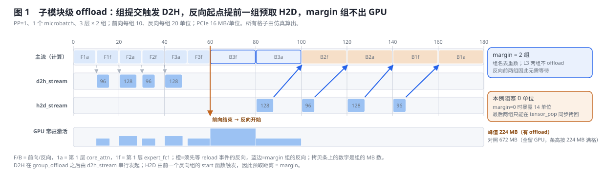
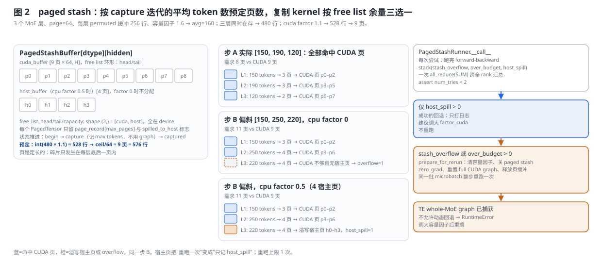
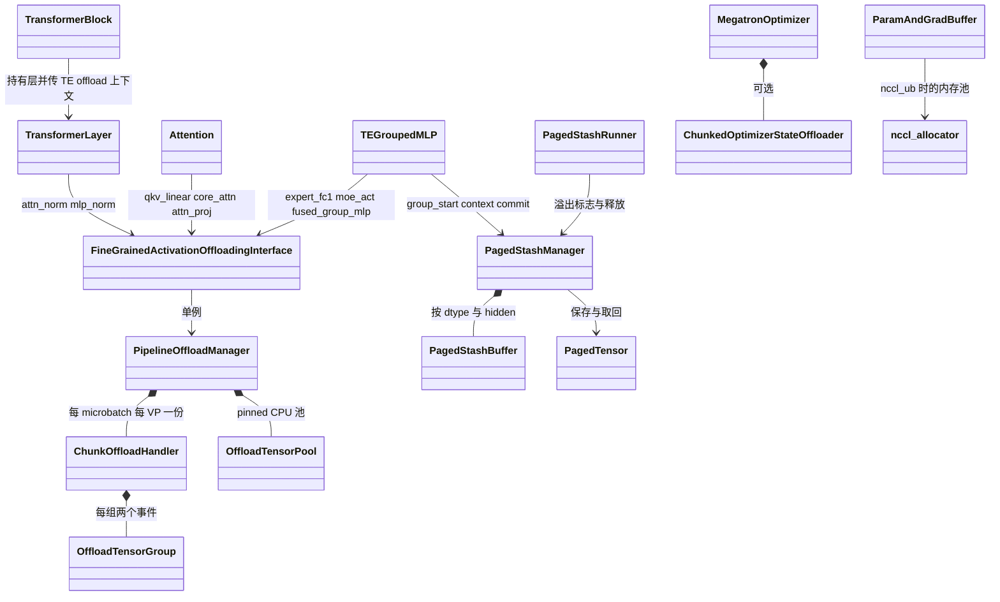

# Megatron-LM 显存优化：从整层换出到分页暂存与常驻通信池

> **源码基线**：`NVIDIA/Megatron-LM@85902ef599ea4eb06ada7567a479c524b605767a`（`dev`，2026-09-01）
> **核心源码**：`megatron/core/model_parallel_config.py`；`megatron/core/transformer/{transformer_block.py,transformer_layer.py,transformer_config.py,attention.py}`；`megatron/core/pipeline_parallel/fine_grained_activation_offload.py`；`megatron/core/transformer/moe/{paged_stash.py,ops/paged_stash.py,experts.py}`；`megatron/core/optimizer/cpu_offloading/{chunked_optimizer_state_offload.py,hybrid_optimizer.py,README.md}`；`megatron/core/optimizer/optimizer.py`；`megatron/core/nccl_allocator.py`；`megatron/core/distributed/{param_and_grad_buffer.py,distributed_data_parallel_config.py}`；`megatron/training/training.py`
> **中心结论**：本页的每个机制都在回答同一个问题：一块张量在它不被用的那段时间该放在哪。整层换出把激活整层送去 CPU，粒度粗、约束硬；子模块级换出把粒度降到 offload 组，用两条拷贝流、warmup 校准与一组提前的预取把 PCIe 拷贝藏在计算后面；MoE 专家激活形状动态、不适合走 PCIe，分页暂存于是把它留在 GPU 的定长页里，用容量因子预定尺寸，溢出时整步重跑；优化器状态则按块在 CPU 与 GPU 之间流转，把临时峰值钉在两个 staging 槽内。反方向的取舍也在本页：NCCL user buffer 用常驻显存换通信少占 SM，参数与梯度缓冲互相复用换掉一整份 buffer。
> **适用范围**：本页拥有整层 CPU offload 的接线、细粒度激活 offload、MoE paged stash、分块优化器状态 offload 的生命周期与约束、NCCL 内存池与 DDP 缓冲复用，以及训练循环里的显存回收点。参数与梯度分片归 [[16_megatron_distributed_optimizer_analysis]]，重计算归 [[18_megatron_recompute_analysis]]，FP8/FP4 参数与 CUDA Graph 缓冲引用计数归 [[23_megatron_precision_cudagraph_fusion_analysis]]，序列并行的激活切分归 [[12_megatron_tp_analysis]]，混合 CPU 优化器的 step 内部归 [[26_megatron_optimizer_step_internals_deepdive]]，Megatron-FSDP 的持久缓冲池归 [[36_megatron_fsdp_analysis]]。
> **最近更新**：2026-09-05。按整层换出、子模块换出、分页暂存、分块优化器换出的递进重写主线，同一算例贯穿 offload 时序与 paged stash 页分配；补齐 warmup 校准、预取距离、复制 kernel 三路判定与 runner 重跑协议；把 FP8/FP4、序列并行、CUDA Graph 缓冲、rerun 状态机等非本页机制改归各自 owner。

---

## 1. 特性概览

### 1.1 问题背景

一次训练迭代里，显存被参数、梯度、优化器状态、激活和临时缓冲分走。分片（分布式优化器、TP、SP）减少的是每 rank 持有的份数，重计算减少的是跨前反向间隔的激活，低精度减少的是每元素字节；它们各有 owner 页。剩下的那部分是"暂时不用但必须保留"的张量：前向产出、反向才消费的激活，两次 step 之间闲置的优化器状态与主权重，以及只在通信时才被读写的缓冲。这类张量的共同点是有明确的空窗期，问题只在于搬去哪里、什么时候搬回、搬运本身花多少带宽和同步。MoE 把问题再放大一层：专家激活的行数每步随路由变化，既不能预先分配，也不能把动态形状交给 CUDA Graph。

### 1.2 解决方法

Megatron 沿着"粒度更细、搬得更近、同步更少"的方向给了四级答案，外加一个反向取舍：

1. **整层换出**：`cpu_offloading` 把前 `cpu_offloading_num_layers` 层的激活交给 Transformer Engine 的 CPU offload 上下文，一层一层搬。
2. **子模块级换出**：`fine_grained_activation_offloading` 用 `saved_tensors_hooks` 截获 autograd 保存的张量，按 `offload_modules` 命名的组在 `d2h_stream` 上异步拷出、在 `h2d_stream` 上提前一组拷回，warmup 一轮后校准哪些组值得搬。
3. **分页暂存**：`moe_paged_stash` 让专家激活留在 GPU，按 capture 迭代的平均 token 数预定 64 token 一页的缓冲，用一个 Triton kernel 在 device 上完成页分配与拷贝，溢出交给 `PagedStashRunner` 整步重跑一次。
4. **分块优化器状态换出**：`chunked_optimizer_state_offload` 在优化器 step 与下一次前向之间把状态与主权重送到 pinned CPU，step 时按块预取，用两个 staging 槽把临时峰值钉住。
5. **反向取舍**：`nccl_ub` 用 `ncclMemAlloc` 分配并注册常驻缓冲，让集合通信少占 SM；MXFP8 的参数与梯度共用一块 buffer，参数 all-gather 借用闲置的梯度缓冲。

### 1.3 收益、开销和约束

| 维度 | 直接收益 | 必付成本或边界 |
|---|---|---|
| 激活显存 | 整层换出与子模块换出把选中的激活移出 GPU；paged stash 把专家激活压进定长页 | PCIe 带宽与两条拷贝流的同步；paged stash 只覆盖专家路径且要先满足 sync-free 前置 |
| 优化器状态 | 状态与主权重在两次 step 之间不占 GPU | step 时按块回来，chunk 为 0 时临时峰值无界；CUDA Graph 与异步 checkpoint 保存不兼容 |
| 同步点 | 分页与容量因子消除按实际 token 数查询与重分配的 CPU 同步 | 容量估小了就整步重跑；TE 整层 MoE 图捕获后不能回退 |
| 通信 | NCCL user buffer 让 AG/RS 少占 SM | 缓冲常驻、双缓冲强开、退出前必须反注册 |
| 组合性 | 各机制可与 PP、EP overlap、CUDA Graph 组合 | 组合面由十几条构造期断言限定，整层换出与 PP 大于 1、重计算互斥 |

### 1.4 符号约定

| 符号 | 含义 |
|---|---|
| $L$ | 层数；本页算例 $L=3$ |
| $G$ | 一个 offload 组：某层某个 `offload_modules` 名下自动求导保存的全部张量 |
| $m$ | warmup 后保留在 GPU 的 margin 组数，等于组名去重数 |
| $P$ | `moe_paged_stash_page_size`，本页取 64 |
| $C$、$f_{\mathrm{cap}}$ | 每层 permuted 缓冲的行数上界、`moe_expert_rank_capacity_factor` |
| $\bar n$ | 每层平均 token 数估计，$\bar n=\lfloor C/f_{\mathrm{cap}}\rfloor$ |

---

## 2. 显存搬运详细方案

先从最容易做到的办法开始：把整层激活交给 TE 换出。它的粒度和互斥面引出子模块级换出；子模块换出仍要过 PCIe，且 MoE 专家激活的形状每步都变，引出留在 GPU 上的分页暂存；激活之外最大的闲置者是优化器状态，引出分块换出。最后看一组反方向的机制：用常驻显存换 SM 与确定性。

### 2.1 共用算例

一个 PP=1 的 rank 跑一个 microbatch，$L=3$ 层，每层两个 offload 组：`core_attn` 96 MB、`expert_fc1` 128 MB；前向每组 10 个单位时间、反向每组 20 个单位，PCIe 16 MB 每单位。MoE 侧同一个 rank 的 3 个专家层各有 permuted 缓冲 $C=256$ 行，容量因子 $f_{\mathrm{cap}}=1.6$，页大小 $P=64$。§2.3 与 §2.4 的图都用这组数，图上每个数字由 `tools/figs/svg/megatron_memory_figures.mjs` 算出。

### 2.2 第一级：整层换出交给 Transformer Engine

`ModelParallelConfig` 的六个 `cpu_offloading*` 字段在 `TransformerBlock.__init__` 被一次性交给 `get_cpu_offload_context`：Megatron 侧的这个包装函数只按 TE 版本挑选签名（2.10 起接受 `retain_pinned_cpu_buffers`，2.5 起接受 `double_buffering`，1.10.0.dev0 起接受 `model_layers`），返回一个上下文管理器和一个同步函数 `group_prefetch_offload_commit_async`；前者存回 `config._cpu_offloading_context`（私有字段，docstring 明写 "For internal use only, do not set."），后者在 `TransformerBlock.forward` 的每层之后、且只在 `torch.is_grad_enabled()` 与 `cpu_offloading` 同时为真时调用。TE 没装时断言 `cpu_offloading` 为假。哪些张量真的被搬、双缓冲怎样重叠，都在 TE 的 `cpu_offload` 模块内，本页只证明接线与开关；唯一能在 Megatron 侧看到的协作是 `bias_swiglu_impl` 收到 `cpu_offload_input` 后在保存张量上打 `activation_offloading=True` 属性（见 [[21_megatron_fusion_operators_analysis]]）。

这条路的边界很硬：`__post_init__` 要求 `cpu_offloading_num_layers` 落在 $[0, L)$，PP 大于 1 直接 `ValueError("Currently there is no support for Pipeline parallelism with CPU offloading")`，任何重计算粒度也是 `ValueError`；CUDA Graph 只允许 `full_iteration` 实现；细粒度换出、paged stash 与它互斥。`arguments.py` 把 `cpu_offloading_num_layers > 0` 视作打开开关。它的粒度是层，不能只搬注意力或只搬专家；文档把它列为下一级的对照物："Unlike layer-level offloading"。

### 2.3 第二级：子模块级换出

**问题与取舍。** 整层换出把一层的全部激活一起搬，PCIe 带宽成了瓶颈时没有中间档；它又和 PP 与重计算互斥。细粒度换出把单位改成组：`offload_modules` 里的每个名字在每层对应一个 `OffloadTensorGroup`，只搬该子模块前向期间 autograd 保存的张量，因此可以和重计算分工（文档建议轻算子重计算、重算子换出），也能在 PP 与 VPP 下按 microbatch 管理。被否掉的替代是继续用层级上下文；判据写在文档里：在显存与 PCIe 带宽之间取点。

**组是怎样形成的。** 每个模块用 `FineGrainedActivationOffloadingInterface` 包住自己的前向：`__enter__` 先调 `fine_grained_offloading_group_start`（一个恒等 autograd Function，前向让当前 `ChunkOffloadHandler` 新开一组，反向触发下一组的 reload），再进入 `PipelineOffloadManager` 的 `saved_tensors_hooks` 上下文；此后 autograd 每保存一个 CUDA 张量，`on_save_for_backward` 就把它推进当前组并返回一个 `(组序号, 组内序号)` 标签。模块前向结束后 `group_offload` 插入另一个恒等 Function：前向调用 `on_group_commit_forward`，让 `d2h_stream` 等主流后发起本组拷贝；反向调用 `on_group_commit_backward`，让主流等本组的 reload 事件。`attention.py` 用它包 `qkv_linear`、`core_attn`、`attn_proj`，`transformer_layer.py` 包 `attn_norm` 与 `mlp_norm`，`experts.py` 包 `expert_fc1`、`moe_act` 与 `fused_group_mlp`；`attn_proj` 提交时把 `core_attn_out` 列入 `forced_released_tensors`，拷贝发起后立即 `untyped_storage().resize_(0)`，因为它不会被 torch 自动释放。反向取回时 `on_get_saved_tensor` 按标签 `tensor_pop`：状态若是 `(device, cpu_backup, use_cpu_pool)` 三元组就 `reload`，否则原样返回。

**两条流与事件。** `PipelineOffloadManager` 是单例，持有 `d2h_stream`、`h2d_stream`、一个 pinned 的 `OffloadTensorPool`（按 `(shape, dtype)` 复用 CPU 张量，MoE 三个组名除外，因为它们的形状每步不同），以及 CUDA Graph 用的第三条流与外部事件。`bulk_offload_group` 在 `d2h_stream` 上逐张量 `copy_(non_blocking=True)`，对源张量 `record_stream`，最后记录本组的 `offload_event`；`bulk_reload_group` 在 `h2d_stream` 上先等 `offload_event`，逐张量拷回并记录 `reload_event`；`on_group_commit_backward` 让主流等 `reload_event`。图捕获期间跳过这两处事件等待，由 CUDA Graph 自己的流序保证。

**预取距离等于 margin。** 反向里，组 $j$ 的 commit 反向先等它自己的 reload，组 $j$ 的 start 反向再从 `_groups_to_reload` 的末尾弹出一组发起 reload。也就是说，每个被换出的组由它后一个（前向序）组的反向起点预取。第一个反向组前面没有人预取，所以 warmup 结束时 `post_warmup_callback` 先把 `_offload_margin` 设成 `get_max_deduplicated_groups()`，即一个 chunk 里组名的去重数，再对每个名字把前向顺序里最后一个同名组标成不换出。本例 margin=2，L3 的两组留在 GPU；反向从 L3 开始，两组不必等待，而它们的 start 反向正好预取 L2 的两组。仿真给出本例阻塞 0 个单位；若 margin=0，L3 两组只能在 `tensor_pop` 里同步拷回，暴露 14 个单位。前向侧，组一提交就在 `d2h_stream` 上串行拷出，常驻激活峰值从 672 MB 降到 224 MB。



**warmup 之后还做三件事。** `delta_offload_bytes_across_pp_ranks` 乘以 PP rank 号得到该 rank 少搬的字节，从前往后关掉相应的组，理由是高 PP rank 在途 microbatch 更少；`activation_offload_fraction` 是组数比例而不是字节比例，在剩余可换出组里从后往前关掉 $1-\text{fraction}$ 的组，源码注释说保留靠前的组能更早释放显存；最后按组名汇总字节并打印表格。`min_offloaded_tensor_size` 在 `tensor_need_offloading_checker` 里逐张量生效，TE 标记 `_TE_do_not_offload` 的张量与参数一律不搬。这些策略只在 warmup 那一轮之后固定，因此 `cuda_graph_warmup_steps` 必须大于 0。

**CUDA Graph 下的两个补丁。** 图内的组（`attn` 范围内的 `qkv_linear`、`core_attn`、`attn_proj`）随图重放，`TransformerLayer` 在捕获前后用 `backward_record` 与 `forward_record` 在图流上记事件；图外的专家组在 `delay_offload_until_cuda_graph` 打开时改为入队，`flush_delayed_groups` 在 `_te_cuda_graph_replay` 返回后统一发起，利用 EP all-to-all 前 CPU 的空档。全迭代图不依赖 `record_stream`，所以 `fine_grained_offloading_max_inflight_offloads` 必须给出：`ChunkOffloadHandler` 按组名维护 FIFO，超过上限时让主流 `wait_event` 最旧的 offload 事件。`schedules.py` 在每种调度结束时调用 `off_interface.reset()`。

**下一步要解决什么。** 子模块换出对专家激活有两个不适：专家段的行数每步随路由变化，所以 MoE 组不能用 CPU 池，且拷贝量随偏斜波动；更重要的是 sync-free 的 HybridEP 路径已经把专家缓冲按容量因子钉成静态形状，`_is_fused_impl_supported` 又明确拒绝与 `expert_fc1`、`moe_act` 换出同用。于是第三级不再走 PCIe，而是在 GPU 上把这些定长缓冲压进页里。

### 2.4 第三级：留在 GPU 上的分页暂存

**问题与取舍。** sync-free 执行（`--moe-flex-dispatcher-backend hybridep`、`--use-transformer-engine-op-fuser`、`--moe-expert-rank-capacity-factor`）用容量上界预分配 dispatch 与分组 GEMM 的缓冲，文档说明目的是避开 "a per-step device query / realloc loop for buffer sizing"。代价是反向要保留的专家激活也按上界分配，每层都为最坏偏斜留空位。paged stash 把这些张量按 $P$ 行一页压进共享的 `PagedStashBuffer`，文档给出的理由是 "to avoid memory waste due to fragmentation"；被否掉的替代是按实际 token 数每步重新分配，那正是 sync-free 想去掉的同步。

**预定页数。** `TEGroupedMLP._fused_forward` 在 `moe_paged_stash` 打开时先 `paged_stash_group_start`，再用 `get_paged_stash_context` 登记本层的 `max_num_tokens`（permuted 缓冲行数 $C$）、device 上的实际 token 数张量和 $\bar n=\lfloor C/f_{\mathrm{cap}}\rfloor$。`PagedStashManager` 的状态从 `begin` 开始，第一次 `paged_stash_reset` 进入 `capture`：这一迭代 `on_save_for_backward` 对每个带 `grouped_tensor_scale_inv` 属性的保存张量按 `(dtype, hidden)` 累加在存 token 数、取峰值，并因为不用 CUDA Graph 而把保存张量截到实际长度；下一次 reset 进入 `captured`，`prepare_stash_buffers` 调 `allocate_stash_buffers`：正的 `moe_paged_stash_buffer_size_factor_cuda` 按 $\bar n$ 峰值乘系数取整，负值按实际峰值，页数向上取整；`moe_paged_stash_buffer_size_factor_cpu` 大于 0 时同法分配 pinned 宿主页。本例 avg=160，三层同时在存得 480 行，乘 1.10 得 528 行，向上取整为 9 页（576 行）。#6022 把状态推进与缓冲准备拆成两步，后者可被 TE 图捕获单独调用。

**复制 kernel 的三路判定。** 每层前向提交后，`PipelinePostScheduleFunction` 按 `_pp_schedule` 决定现在该 stash 哪一层、预取哪一层；`PagedTensor.offload_to_stash` 在 pack 流上发一次 `paged_stash_copy_kernel`：kernel 读 device 上的 `num_tokens`，算所需页数；CUDA free list 余量够就分配 CUDA 页，不够且有宿主页则分配宿主页并置 `host_spill`，两者都不够则置 `overflow` 并保持 free list 头不动，后续层看到 `overflow` 直接返回。页号记在该张量的 `page_record`，原张量随后释放；`reload_from_stash` 用 `paged_stash_pop_kernel` 按 `page_record` 与 `spilled_to_host` 拷回主流预分配的张量并归还页。整个过程没有 host 同步，free list 的重置也只做 `copy_`，因此可以进 CUDA Graph。本例步 A 实际 [150, 190, 120] 需要 8 页，全部命中 CUDA 页；步 B 偏斜 [150, 250, 220] 需要 11 页，第三层在 CUDA 余量 2 页时要 4 页：cpu factor 为 0 时 overflow，cpu factor 0.5 给出 4 个宿主页时只溢写并记 `host_spill`。



**runner 的整步重跑。** 只要设置了 `moe_expert_rank_capacity_factor`，`training.py` 就用 `PagedStashRunner` 包住 `forward_backward_func`。每次尝试先把全部 microbatch 读进静态列表，跑完调度后 `check_moe_overflow` 把 stash overflow、HybridEP 的 over-budget、host spill 三个标志 `stack` 后一次 `all_reduce(SUM)`。只有 host spill 时打日志建议调大 `factor_cuda`；任一 rank 有 overflow 或 over-budget 则 `prepare_for_rerun`：清掉每个 MoE 层的容量因子（转成动态 dropless 派发）、把所有相关 config 的 `moe_paged_stash` 置假、清梯度、必要时把主参数拷回参数缓冲、重置 full CUDA Graph 并释放页缓冲，然后用同一批 microbatch 重跑；循环开头 `assert num_tries < 2`，所以最多重跑 1 次，成功后恢复容量因子与开关。`schedules.py` 在每种调度入口按 `forward_only` 调 `paged_stash_reset`，评估时 manager 被禁用。

**与 TE 整层 MoE 图捕获的耦合。** `validate_moe_cuda_graph_support` 在捕获整个 MoE 模块时断言六项同时成立：TE 图实现、flex 分发器、HybridEP 后端、rank 容量因子、`moe_paged_stash`、op-fuser——paged stash 从省显存的可选项变成必要条件。捕获期 `paged_stash_te_graph_capture` 把 TE 的 chunk 级顺序展开成 capture-only 的调度装进 manager，结束后恢复运行期调度；每层图结束前 `finish_te_graph_capture_group_io` 把 pack/unpack 流并回捕获流，文档指出这些 join 会随每次重放执行，限制了跨图的重叠。图捕获完成后 `_raise_if_te_whole_moe_graph_overflow` 把溢出变成 `RuntimeError`，因为已捕获的图绑死了静态缓冲地址；`_validate_te_whole_moe_graph_runtime` 还要求运行期 microbatch 数不变。TE 侧要求 2.19.0 以上。图捕获的主体归 [[23_megatron_precision_cudagraph_fusion_analysis]]，HybridEP 的容量与 over-budget 归 [[14_megatron_ep_analysis]]。

### 2.5 第四级：优化器状态的分块换出

激活之外，两次 step 之间闲置最久的是 Adam 状态与 fp32 主权重。冻结基线有两条路：`optimizer_cpu_offload` 让 `HybridDeviceOptimizer` 按 `optimizer_offload_fraction` 把一部分参数的更新连算带存搬到 CPU（要求 `use_precision_aware_optimizer`，机制归 [[26_megatron_optimizer_step_internals_deepdive]]）；`chunked_optimizer_state_offload` 则保持更新在 GPU 上执行，只让状态与主权重在两次更新之间住在 pinned CPU。后者由 `ChunkedOptimizerStateOffloader` 实现，挂在 `MegatronOptimizer` 上：`offload_optimizer_state_for_forward` 在 optimizer 到前向的边界发起 D2H，`prefetch_optimizer_state_for_step` 在梯度收尾阶段预取第一块，`prepare_grads` 保留一个幂等的兜底调用。旧的 `optimizer_state_offloader.py` 已被 #6244 整体替换，`--offload-optimizer-states` 只作为兼容拼写保留，`OptimizerConfig.__post_init__` 发 `FutureWarning` 并改写成新模式。

README 把代价写得很直白：`optimizer_state_offload_chunk_size_mb` 为 0 时一次恢复全部选中状态，不限制临时峰值，参数校验只发 warning；正值限制的是张量状态窗口，主权重仍用一个完整窗口；稳态下每个活跃 manager 用两个 GPU staging 槽，H2D、计算、D2H 三者重叠，所以峰值约为两倍 chunk，Muon 与 Adam 链式组合时可达三倍；fraction 是近似字节比例，一个参数与它的全部状态是原子 bundle；开启后 full-iteration 与 optimizer CUDA Graph 不可用，保存优化器状态时拒绝异步分布式 checkpoint，legacy torch checkpoint 路径不支持。这些字段属于 `OptimizerConfig`，不在 `docs/coverage/megatron-lm.yaml` 的枚举范围内，本页只登记不认领。

### 2.6 反方向的取舍：用常驻显存换 SM 与整份缓冲

**NCCL user buffer。** `nccl_ub` 打开时 `_ParamAndGradBuffer` 调 `nccl_allocator.init()`（设置 `NCCL_NVLS_ENABLE=1` 并关闭 torch 的张量注册钩子）与 `create_nccl_mem_pool`，得到一个以 `ncclMemAlloc`、`ncclMemFree` 为分配器的 `torch.cuda.MemPool`（对称内存的形参名随 torch 版本探测），参数与梯度缓冲在 `nccl_mem` 上下文里分配：进入时先反注册已有分配以免重复注册，退出时向该 DP 组注册。`DistributedDataParallelConfig.nccl_ub` 的 docstring 给出第一判据：启用 "SM efficient nccl algorithm"，并附了 AG/RS 的 SM 占用表；省显存不是它的目的，相反它要求持久缓冲，`arguments.py` 在开启时强制 `fsdp_double_buffer` 与 `fsdp_manual_registration`。训练退出前 `training.py` 先 barrier 再对每个带 `nccl_mem_pool` 的缓冲 `deregister_mem_pool`，注释说明否则 `ProcessGroupNCCL` 析构会对 `ncclCommWindowRegister` 的句柄调 `ncclCommDeregister` 而崩溃。torch 低于 2.11 时它与 `expandable_segments:True` 互斥。FSDP 侧四档分配器的取舍归 [[36_megatron_fsdp_analysis]]。

**缓冲互相复用。** 分布式优化器加 MXFP8 参数时，`_ParamAndGradBuffer` 只分配一块 `shared_buffer`：梯度缓冲整块使用，参数缓冲取前半并 view 成 bf16（梯度是 fp32 时），注释写明它 "can be temporarily reused by param AG"。`reuse_grad_buf_for_mxfp8_param_ag` 进一步让 LayerWise 路径把 `bucket.grad_data.view(param_dtype)` 当作 all-gather 的接收缓冲，理由是梯度缓冲在前向期间闲置且元素更宽。NVFP4 参数则采用双缓冲布局：参数缓冲按打包字节数（逻辑元素数的一半）分配，梯度缓冲按完整元素数分配。这些复用的前提与优化器的 range 账本归 [[16_megatron_distributed_optimizer_analysis]]。

**训练循环里的两个回收点。** `save_checkpoint_and_time` 在停计时器后对每个模型块调 `free_overlap_buffers()` 并 `torch.cuda.empty_cache()`，注释说是给异步 checkpoint 进程的 D2H 留出显存；这段曾被 #5170 删除、又被 #5366 整段还原。`forward_backward_no_pipelining` 在每个 microbatch 的 `backward_step` 后立即 `del output_tensor`，避免上一份输出活到下一次迭代。`theoretical_memory_usage.py` 的估算把路由专家按 ETP 与 EP 分片、按专家 DP 计优化器字节，只是估算工具，不改运行时显存。

### 2.7 开销结算与端到端闭环

| 机制 | 搬去哪 | 什么时候搬回 | 同步与带宽 | 硬前置 |
|---|---|---|---|---|
| 整层换出 | CPU（TE 上下文） | 层反向前，TE 双缓冲可选 | 由 TE 管理 | TE 存在；PP=1；无重计算；CUDA Graph 仅 full_iteration |
| 子模块换出 | pinned CPU，按组 | 后一组的反向起点预取 | 两条流各一个事件；margin 组不搬；全迭代图下按名节流 | TE 实现；组名合法且 `attn_proj` 随 `core_attn`；不与整层换出同用 |
| paged stash | GPU 页（可选宿主页） | 按 `_pp_schedule` 在下一反向层前拷回 | 无 host 同步；pack 与 unpack 同一条流 | sync-free 三件套；不与 `cpu_offloading` 同用；`offload_modules` 不含专家三组 |
| 分块优化器换出 | pinned CPU | 梯度收尾时预取第一块，step 内逐块 | 共享一对拷贝流；两个 staging 槽 | 分布式 checkpoint；无 full-iteration 或 optimizer CUDA Graph |
| NCCL user buffer | 常驻 GPU | 不搬 | 通信少占 SM | 双缓冲；退出前反注册；torch 2.11 前不与 expandable segments 同用 |

一次训练迭代的闭环因此是：optimizer step 结束时状态与主权重离开 GPU；前向按组或按页把激活移出主流可见范围，`forced_released_tensors` 立即归还存储；反向按预取距离拷回，主流在 commit 反向或 `PipelinePostScheduleFunction.backward` 处等待；梯度收尾时优化器状态开始回流；runner 在整步结束时汇总溢出标志，决定本步是否作数。任何一个 helper 的返回都不是完成信号：拷贝完成由事件证明，激活可用由主流等待证明，步是否有效由 all-reduce 后的标志证明。

---

## 3. 代码实现分析

### 3.1 类与所有权



| 对象 | 责任 | 不负责什么 |
|---|---|---|
| `TransformerBlock` | 构造 TE 整层换出上下文，逐层调用同步函数 | 不知道 TE 内部搬了什么 |
| `FineGrainedActivationOffloadingInterface` | 每个模块前向的开组、进出 hooks、提交与延迟提交 | 不持有任何张量 |
| `PipelineOffloadManager` | 单例：流、事件、CPU 池、chunk 队列、warmup 校准、重放模式 | 不决定单个张量是否可搬 |
| `ChunkOffloadHandler` | 一个 microbatch 的组序列、LIFO 预取、按名节流、在途 FIFO | 不跨 chunk 决策 |
| `OffloadTensorGroup` / `OffloadTensorPool` | 一组张量与两个事件；`(shape, dtype)` 复用 pinned 张量 | 不知道调度 |
| `PagedStashManager` | 状态机、`_pp_schedule` 编码、按 `(dtype, hidden)` 的页缓冲、pack 与 unpack 流 | 不做 rank 间通信 |
| `PagedStashBuffer` / `PagedTensor` | 两条 free list 与页矩阵；单个张量的页记录与两次 kernel 调用 | 不决定何时 stash |
| `PagedStashRunner` | 整步包装：读数据、汇总三个标志、重跑或 fail-fast、恢复配置 | 不知道溢出发生在哪一层 |
| `ChunkedOptimizerStateOffloader` | 状态与主权重的选择、分块、两条拷贝流、两个 staging 槽 | 不改变优化器数学 |
| `nccl_allocator` | 构建 `ncclMemAlloc` 分配器、内存池、注册与反注册 | 不决定哪些缓冲用它 |

### 3.2 调用流程

细粒度换出在一层注意力上的前向与反向：

```text
Attention.forward
+-- off_interface(offload_qkv_linear, hidden, "qkv_linear").__enter__
|   +-- fine_grained_offloading_group_start -> ChunkOffloadHandler.on_group_start_forward   新组
|   `-- PipelineOffloadManager.__enter__ -> saved_tensors_hooks(on_save_for_backward, on_get_saved_tensor)
+-- get_query_key_value_tensors                   保存的张量被 tensor_push 打标签
+-- qkv_linear_manager.group_offload(qkv_output)
|   `-- FineGrainedOffloadingGroupCommitFunction.forward -> on_group_commit_forward
|       `-- d2h_stream.wait_stream(main) -> bulk_offload -> bulk_offload_group -> record_offload_event
+-- core_attn 组同上，forced_released_tensors=[query, key, value]
`-- attn_proj 组同上，forced_released_tensors=[core_attn_out]

反向（autograd 逆序）
CommitFunction.backward -> on_group_commit_backward(name)   主流 wait_reload_event
`-- 模块反向：on_get_saved_tensor -> tensor_pop -> (已换出则 reload)
    `-- StartFunction.backward -> on_group_start_backward
        `-- h2d_stream.wait_stream(main) -> bulk_reload -> bulk_reload_group   预取 LIFO 下一组
```

paged stash 在一步训练里的位置：

```text
PagedStashRunner.__call__(model, data_iterator, num_microbatches, forward_only, ...)
+-- _validate_te_whole_moe_graph_runtime
+-- data_read                                     预读全部 microbatch
+-- forward_backward_func(...)
|   +-- paged_stash_reset(enabled=not forward_only, config)   begin -> capture -> captured
|   `-- 每个 MoE 层 TEGroupedMLP._fused_forward
|       +-- paged_stash_group_start -> PipelinePreScheduleFunction   等上一层 stash 完成
|       +-- get_paged_stash_context -> PagedStashContext(saved_tensors_hooks)
|       |   `-- on_save_for_backward -> PagedTensor（captured 时加入待 stash 列表）
|       `-- paged_stash_group_commit -> PipelinePostScheduleFunction
|           `-- stash_paged_tensors -> PagedTensor.offload_to_stash -> paged_stash_copy_kernel
|               reload_paged_tensors -> PagedTensor.reload_from_stash -> paged_stash_pop_kernel
+-- check_moe_overflow                            stack 三标志 -> all_reduce(SUM)
+-- _raise_if_te_whole_moe_graph_overflow         已捕获整层 MoE 图时 RuntimeError
`-- 无溢出：恢复容量因子与 moe_paged_stash；否则 prepare_for_rerun 后重跑（num_tries < 2）
```

### 3.3 源码阅读路线

1. 整层换出：`megatron/core/model_parallel_config.py::ModelParallelConfig` 的 `cpu_offloading*` 字段；`megatron/core/transformer/transformer_block.py::TransformerBlock.__init__`、`forward`；`megatron/core/extensions/transformer_engine.py::get_cpu_offload_context`；校验 `transformer_config.py::TransformerConfig.__post_init__` 的 `cpu_offloading` 分支；`megatron/training/arguments.py` 的 `cpu_offloading_num_layers` 转写。
2. 子模块换出：`megatron/core/pipeline_parallel/fine_grained_activation_offload.py::PipelineOffloadManager.__init__`、`post_warmup_callback`、`init_model_chunk_offload_handler`、`on_save_for_backward`、`on_get_saved_tensor`；`ChunkOffloadHandler.tensor_push`、`tensor_pop`、`tensor_need_offloading_checker`、`bulk_offload_group`、`bulk_reload_group`、`should_bulk_offload`、`_drain_offload_pending`、`on_group_commit_forward`、`on_group_commit_backward`、`on_group_start_forward`、`on_group_start_backward`；`FineGrainedOffloadingGroupCommitFunction`、`FineGrainedOffloadingGroupStartFunction`、`FineGrainedActivationOffloadingInterface`；调用点 `transformer/attention.py::Attention.forward`、`transformer/transformer_layer.py::TransformerLayer._set_offload_modules`、`_te_cuda_graph_replay`、`moe/experts.py::TEGroupedMLP.forward`、`_fused_forward`；`pipeline_parallel/schedules.py` 三处 `off_interface.reset()`。
3. paged stash：`megatron/core/transformer/moe/paged_stash.py::PagedStashBuffer`、`PagedTensor.offload_to_stash`、`reload_from_stash`、`PipelinePreScheduleFunction`、`PipelinePostScheduleFunction`、`PagedStashManager.allocate_stash_buffers`、`prepare_stash_buffers`、`update_pp_schedule`、`on_save_for_backward`、`start_te_graph_capture`、`finish_te_graph_capture_group_io`、`paged_stash_reset`、`PagedStashRunner.check_moe_overflow`、`_raise_if_te_whole_moe_graph_overflow`、`prepare_for_rerun`、`__call__`；`moe/ops/paged_stash.py::paged_stash_copy_kernel`、`paged_stash_pop_kernel`；`transformer/cuda_graph_config.py::validate_moe_cuda_graph_support`；安装点 `megatron/training/training.py` 中 `PagedStashRunner(...)` 与 `mark_te_graph_captured`。
4. 优化器状态：`megatron/core/optimizer/optimizer.py::MegatronOptimizer` 的 `_optimizer_state_offloader` 相关方法与 `prepare_grads`；`optimizer/cpu_offloading/chunked_optimizer_state_offload.py::ChunkedOptimizerStateOffloader.offload_for_forward`、`prefetch_for_step`、`step`；`optimizer/optimizer_config.py::OptimizerConfig.__post_init__`；`optimizer/cpu_offloading/README.md`。
5. 常驻缓冲：`megatron/core/nccl_allocator.py::_build_nccl_allocator`、`create_nccl_mem_pool`、`init`、`nccl_mem`、`deregister_mem_pool`；`distributed/param_and_grad_buffer.py::_ParamAndGradBuffer.__init__` 的 `nccl_ub` 与 `shared_param_grad_buffer` 分支、`_post_param_sync`；`distributed/distributed_data_parallel_config.py::DistributedDataParallelConfig.nccl_ub`、`fsdp_double_buffer`、`__post_init__`；`training/training.py` 退出前的反注册与 `save_checkpoint_and_time`。
6. 可复核测试：`tests/unit_tests/pipeline_parallel/test_fine_grained_activation_offloading.py::test_gpt_fine_grained_activation_offloading_correctness_and_memory`、`test_fine_grained_activation_offloading_with_cuda_graph`、`test_chunk_offload_handler_respects_tensor_opt_out_flags`；`tests/unit_tests/transformer/moe/test_paged_stashing.py::TestPagedStashing.test_forward_backward_4_layers`、`TestPagedStashingOverBudget.test_overload_factor_and_over_budget`、`test_te_whole_moe_graph_overflow_fails_instead_of_dynamic_fallback`；`tests/unit_tests/test_optimizer_state_offloading.py::test_training_matches_non_offloaded_optimizer`、`test_chunk_size_zero_uses_one_full_state_window`；`tests/unit_tests/test_nccl_allocator.py::TestNCCLAllocator.test_nccl_nccl_mem_register_and_allreduce`。

---

## 4. 约束与失败边界

| 前提 | 源码边界 | 破坏后的行为 |
|---|---|---|
| 整层换出层数在 $[0, L)$，PP=1，无重计算 | `TransformerConfig.__post_init__` 三条 `raise ValueError` | 构造失败 |
| 整层换出只与 full-iteration CUDA Graph 组合 | `__post_init__`："CUDA graphs not supported with CPU offloading." | 构造失败 |
| 无 TE 时不能开整层换出 | `TransformerBlock.__init__` 的 `assert` | 构造失败 |
| 细粒度换出只用于 `transformer_engine` 实现；TE 2.10 起需 `NVTE_CPU_OFFLOAD_V1=1` | `arguments.py` 两条 `assert` | 参数校验失败 |
| 细粒度换出不与整层换出同用；`offload_modules` 非空且只含八个合法名 | `__post_init__` 的 `assert` | 构造失败 |
| `attn_proj` 必须与 `core_attn` 同选 | `__post_init__`："attn_proj cannot be set to offload_modules alone without core_attn" | 构造失败 |
| `fused_group_mlp` 需 op-fuser，且不与 `expert_fc1`、`moe_act` 同选 | `__post_init__` 两条 `raise ValueError` | 构造失败 |
| 四个数值旋钮非负，fraction 在 $[0,1]$ | `__post_init__` 四条 `assert` | 构造失败 |
| mHC 重计算与其冲突的换出模块不同选 | `__post_init__` 的 `_MHC_CONFLICTING_OFFLOAD_MODULES` 判定 | 构造失败 |
| CUDA Graph 下：`local` 实现只允许专家三组且不整层捕获；`warmup_steps > 0`；不捕获整个 MoE；全迭代图必须给 `max_inflight_offloads` | `__post_init__` 的 CUDA Graph 分支五条 `assert` | 构造失败 |
| mHC 注意力拆分捕获不与注意力三组换出同用 | `__post_init__`："mhc_recompute_attn_cuda_graph_split is incompatible with offload_modules" | 构造失败 |
| paged stash 需容量因子，不与 `cpu_offloading` 同用，`offload_modules` 不含专家三组 | `__post_init__` 的 `moe_paged_stash` 分支三条 `assert` | 构造失败 |
| 容量因子需 HybridEP 或 NCCL-EP；HybridEP 下需 op-fuser 或 GroupedTensor | `__post_init__` 两条 `raise ValueError` | 构造失败 |
| 溢出最多重跑一次 | `PagedStashRunner.__call__` 的 `assert num_tries < 2` | 第二次仍溢出则断言失败 |
| TE 整层 MoE 图捕获后不允许溢出回退，microbatch 数不变，TE 不低于 2.19.0，不用动态 microbatch | `_raise_if_te_whole_moe_graph_overflow`、`_validate_te_whole_moe_graph_runtime`、`__post_init__` | `RuntimeError` 或构造失败 |
| 整层 MoE 图捕获需六项同时成立 | `cuda_graph_config.py::validate_moe_cuda_graph_support` | 断言失败 |
| 分块优化器换出：chunk 非负、fraction 在 $[0,1]$、只支持列出的优化器与 checkpoint 格式 | `OptimizerConfig.__post_init__`；README 列出的限制 | 断言失败或运行期拒绝 |
| `optimizer_cpu_offload` 需 `use_precision_aware_optimizer`；FP8 参数 gather 只配 delayed recipe | `arguments.py` 两条 `assert` | 参数校验失败 |
| `nccl_ub` 与 `expandable_segments:True` 在 torch 2.11 前互斥；不与关闭 CPU 备份的 torch memory saver 同用 | `DistributedDataParallelConfig.__post_init__`；`_ParamAndGradBuffer.__init__` 两条 `assert` | 构造失败 |
| 退出前必须反注册 NCCL 内存池 | `training.py` 退出路径 | 进程析构时 NCCL 崩溃 |

---

## 5. 发展趋势

以下每条都锚定冻结基线里可读到的痕迹，方向判断是本页推断。

- **上游自己推翻了自己。** checkpoint 前的 `empty_cache()` 回收被 #5170 删除、又被 #5366 整段还原，说明异步 checkpoint 的 D2H headroom 尚未有结构性解法。
- **整体搬运让位于峰值有界的分块搬运。** 旧的整体 offloader 已删除，README 用两个 staging 槽定义峰值；下一条约束是它与 CUDA Graph 的互斥。
- **paged stash 正在被 CUDA Graph 反向约束。** `validate_moe_cuda_graph_support` 把它列为整层 MoE 图捕获的必要条件，#6022 为此拆出 `prepare_stash_buffers` 与捕获专用调度；`docs/user-guide/features/cuda_graph.md` 已给出 MoE 加 full-iteration 图的组合配方。
- **细粒度换出的状态机仍在打磨。** `ChunkOffloadHandler.finish_all_groups` 里留着 `# TODO: check if this is correct`；`OffloadTensorGroup` 对 MoE 三组禁用 CPU 池的注释说明动态形状与池式复用尚未调和。
- **碎片与 SM 的二选一在消失。** `nccl_ub` 与 `expandable_segments` 的互斥已改成 torch 2.11 的版本门槛，随版本推进这条断言会消失。
- **CUDA Graph 缓冲复用改为引用计数。** `TensorReusePool` 已被 #5451 删除，`CudagraphBufferMetadata` 的 `cudagraph_reuse_ref_count` 接管，机制归 [[23_megatron_precision_cudagraph_fusion_analysis]]。

---

## 6. 配置契约

### `ModelParallelConfig`（`megatron/core/model_parallel_config.py`，6 项）

| 字段 | 类型 | 默认 | 契约 | 行 |
|---|---|---|---|---|
| `cpu_offloading` | `bool` | `False` | When set to True, all the activations are offloaded to the CPU asynchronously. | `:453` |
| `cpu_offloading_num_layers` | `int` | `0` | Tells the number of transformer layers for which activations has to be offloaded. | `:456` |
| `cpu_offloading_activations` | `bool` | `True` | If True, offloads the activations to CPU. | `:466` |
| `cpu_offloading_weights` | `bool` | `False` | If True, offloads the weights to CPU. | `:469` |
| `cpu_offloading_double_buffering` | `bool` | `False` | If True, enables double buffering across layers while reloading activations from CPU. | `:472` |
| `cpu_offloading_retain_pinned_cpu_buffers` | `bool` | `False` | If True, the pinned CPU buffers are retained after offloading and reused for the next iteration. It is useful for cuda graphs capture. | `:475` |

该类在冻结基线共 74 字段，本表收 6 项。`_cpu_offloading_context` 是前导下划线的私有字段，docstring 自陈 "For internal use only, do not set."，由 `TransformerBlock` 运行期注入，已在 [[40_megatron_feature_tree_analysis]] 的排除表里单列。其余字段的 owner 见 `docs/coverage/megatron-lm.yaml`。

### `TransformerConfig`（`megatron/core/transformer/transformer_config.py`，12 项）

| 字段 | 类型 | 默认 | 契约 | 行 |
|---|---|---|---|---|
| `disable_parameter_transpose_cache` | `bool` | `False` | When set to true, the parameter transposes are not cached for subsequent iterations. | `:1324` |
| `fine_grained_activation_offloading` | `bool` | `False` | If True, offload the input of the specified modules to the CPU. Fine-grained activation offloading is a module-level offloading method instead of a layer-level offloading method like cpu_offloading. | `:1459` |
| `offload_modules` | `Optional[list[str]]` | `[]` | The submodules to offload its input. choices: "attn_norm", "qkv_linear", "core_attn", "attn_proj", "mlp_norm", "expert_fc1", "moe_act", "fused_group_mlp". | `:1464` |
| `min_offloaded_tensor_size` | `int` | `1024 * 1024` | The minimum size of the tensor to be offloaded. | `:1477` |
| `delay_offload_until_cuda_graph` | `bool` | `False` | If True, delay the offload until the CUDA graph is executed for minimal CPU overhead. | `:1480` |
| `delta_offload_bytes_across_pp_ranks` | `int` | `0` | Difference of offload bytes across PP ranks to balance the offload load. | `:1486` |
| `activation_offload_fraction` | `float` | `1.0` | Fraction of eligible activation offload groups to offload across configured modules. | `:1492` |
| `fine_grained_offloading_max_inflight_offloads` | `Optional[int]` | `None` | Per fine-grained offloading group name, max number of inflight offloads for that name not yet joined on the main stream (wait_event on D2H). 0 = wait after every offload for that name. None = do not insert these joins. | `:1498` |
| `moe_paged_stash` | `bool` | `False` | If True, enable paged stash for all routed-expert activations needed for backward | `:1506` |
| `moe_paged_stash_page_size` | `int` | `64` | Number of tokens per page for paged stash memory management. | `:1509` |
| `moe_paged_stash_buffer_size_factor_cuda` | `float` | `1.10` | Scale factor for paged stash CUDA buffer allocation. Sign selects sizing: positive = avg-based, negative = actual-max. Magnitude is headroom (e.g. 1.10 = 10%). | `:1512` |
| `moe_paged_stash_buffer_size_factor_cpu` | `float` | `0.0` | Scale factor for paged stash host buffer. 0 disables host buffer. Same sign convention as moe_paged_stash_buffer_size_factor_cuda. | `:1518` |

该类在冻结基线共 265 字段，本表收 12 项；其余字段的 owner 见 `docs/coverage/megatron-lm.yaml`。`disable_parameter_transpose_cache` 由 TE 线性层消费：`TEColumnParallelLinear` 等在它为真时把 `is_first_microbatch` 传成 `None`，让 TE 不缓存参数转置，用每步一次转置换掉一份缓存。

`OptimizerConfig` 的 `optimizer_cpu_offload`、`optimizer_offload_fraction`、`use_torch_optimizer_for_cpu_offload`、`overlap_cpu_optimizer_d2h_h2d`、`pin_cpu_grads`、`pin_cpu_params`、`chunked_optimizer_state_offload`、`optimizer_state_offload_chunk_size_mb`、`optimizer_state_offload_fraction`、`offload_optimizer_states`，以及 `DistributedDataParallelConfig` 的 `nccl_ub`、`fsdp_double_buffer`、`fsdp_buffer_count`、`reuse_grad_buf_for_mxfp8_param_ag`，都不在 `docs/coverage/megatron-lm.yaml` 的枚举类之内，本页按机制引用它们，不在契约表里认领。

## Related Pages

- [[16_megatron_distributed_optimizer_analysis]] — 参数、梯度与 optimizer state 的分片账本，以及 shared buffer 与参数 all-gather 的所有权。
- [[18_megatron_recompute_analysis]] — 与换出互补的另一条路：不保存而是回放。
- [[21_megatron_fusion_operators_analysis]] — op-fuser 链两侧的 paged stash 与 `fused_group_mlp` 钩子从哪里进入。
- [[23_megatron_precision_cudagraph_fusion_analysis]] — CUDA Graph 主体、整层 MoE 图捕获的六项条件与缓冲引用计数。
- [[14_megatron_ep_analysis]] — HybridEP 的 rank 容量、over-budget 标志与 runner 的另一半来源。
- [[26_megatron_optimizer_step_internals_deepdive]] — 混合 CPU 优化器与分块 offloader 在 step 内部的位置。
- [[02_engineering/02_train_frameworks/megatron-lm/index|Megatron-LM 知识地图]] — 返回本域全部页面的索引。
