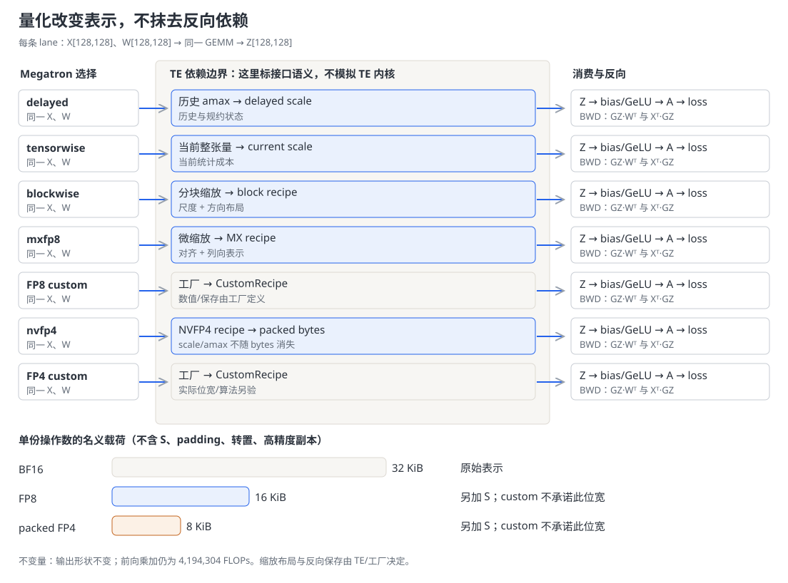
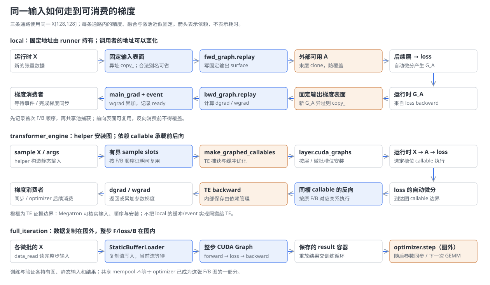
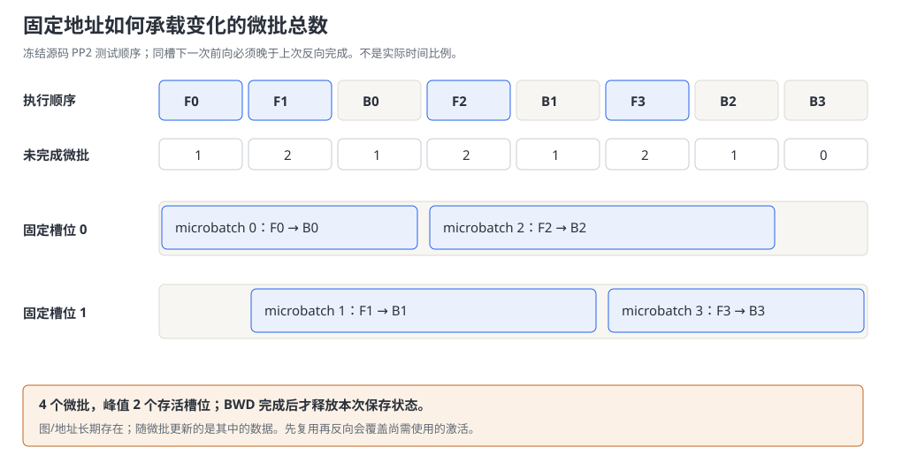

# Megatron-LM FP8 精度 · CUDA Graph · 算子融合 深度解析

> **源码基线**：`NVIDIA/Megatron-LM@85902ef599ea4eb06ada7567a479c524b605767a`（`dev`，2026-09-01）
> **核心源码**：`megatron/core/fp8_utils.py`、`fp4_utils.py`、`transformer/cuda_graphs.py`、`full_cuda_graph.py`、`transformer/mlp.py`、`fusions/fused_bias_gelu.py`
> **中心结论**：降低 GEMM 操作数精度、融合相邻算子和重放 CUDA Graph，分别改变表示、设备计算边界和主机提交方式。它们能组合，但量化状态、反向保存和静态缓冲的生命周期必须一起成立，收益不能简单相乘。
> **适用范围**：本页拥有精度选择、图捕获与融合交界，以及微批数如何约束图复用；单个融合算子的完整实现归 [[21_megatron_fusion_operators_analysis]]，参数分片通信归 [[16_megatron_distributed_optimizer_analysis]]。
> **最近更新**：2026-09-05。按一次线性变换展开量化、融合、捕获及完整训练生命周期；合并历史勘误，重核全部配置契约。

## 1. 一次线性变换为什么还有三处可优化

把模型分到多张卡之后，一张卡仍可能卡在不同地方：大 GEMM 的计算与操作数存储、小算子之间的中间张量读写，或 CPU 提交 kernel 的间隙。Megatron 对这三种压力分别提供 FP8/FP4、算子融合和 CUDA Graph。它们作用于同一次前向与反向，而不是从旧到新的版本替代关系；先判定时间或显存花在哪里，才能知道哪种改变值得付出数值验证、后端依赖或静态缓冲的成本。

| 维度 | 直接收益 | 必付成本或边界 |
|---|---|---|
| 低精度表示 | 支持的 GEMM 使用较窄操作数，部分保存张量或参数载荷变小 | 量化、缩放元数据、必要的转置表示和精度验证；不自动改变全部激活或通信 |
| 融合计算 | 减少相邻算子的启动与中间结果往返 | 保存反向所需输入、后端/形状限制；寄存器压力及真实融合程度需测量 |
| 图重放 | 把重复执行中的多个主机提交合并为图提交 | 预热、捕获、静态内存及边界拷贝；设备计算与通信仍须完成 |

### 最小例子：同一份输入、同一个损失

只看单 rank 的一段 MLP：$X$ 是 `128×128` 的 BF16 输入，$W$ 是 `128×128` 的 BF16 权重，$b$ 是长度 128 的偏置。先算 $Z=XW$，再算 $A=\operatorname{GeLU}(Z+b)$，$A$ 交给下一线性层，最终参与损失 $L$。这里维度是教学输入，不是吞吐基准；一次 GEMM 按乘加计 2 FLOPs 的口径是 **4,194,304 FLOPs**。

反向收到 $G_A=\partial L/\partial A$ 后，要先求激活和偏置梯度，再计算输入梯度 $G_X=G_ZW^\top$ 与权重梯度 $G_W=X^\top G_Z$。这已经解释了为什么“前向把 $X$ 变小”不等于“训练总显存按同一比例变小”：$X$、$W$ 的反向表示、梯度累加、优化器主参数以及后续模块的保存对象各有生命周期。

下文始终沿用这次变换。量化先回答怎样表示 GEMM 的操作数；融合随后回答 $Z+b$ 是否需要成为独立的 HBM 中间结果；图最后回答整段已选定的设备工作如何重复提交。

## 2. 先改变操作数表示：从 BF16 到可控的量化状态

### 2.1 量化不是修改全局 dtype

BF16 基础方案直接把 $X,W$ 交给线性模块，由自动微分保存其反向所需对象。FP8 方案在受控上下文中交给 TE：概念上先由缩放因子 $s$ 把一个值映射到低精度格式，再通过缩放恢复其数值含义：

$$
q=\operatorname{cast}_{\mathrm{FP8}}(x/s),\qquad \widehat{x}=s q.
$$

这只是解释表示变化的数学模型；TE 可以保存逆缩放、融合量化到其他 kernel，并不保证真的生成一个独立的 $\widehat X$。GEMM 的乘加计数没有因此减少，改变的是操作数格式与受支持的执行路径。舍入、截断和缩放选择会使 $\widehat X\widehat W$ 不再与 BF16 结果完全相同。

`get_fp8_context` 依据 `fp8`、全局层号和 `first_last_layers_bf16` 决定是否进入 `fp8_autocast`；初始化时则依据 `fp8_param` 选择 `fp8_model_init`。因此“计算使用 FP8”和“参数主要存储使用 FP8”是两件事，偏置等参数不保证被转换。`params_dtype` 仍决定常规权重初始化 dtype；`fp16`/`bf16` 混合精度、`enable_autocast` 的 PyTorch 上下文也不是 TE recipe 的同义词。

**证据边界**：本页读到的是 Megatron 创建 recipe、传入量化上下文和管理 TE 张量的代码，未检出并验证 TE 内核实现。下表中 current、delayed、block/micro scaling 的语义来自本基线配置注释、包装器与所调用 recipe 的接口；真实缩放布局、累加精度、舍入策略、反向保存内容及硬件性能需在对应 TE 版本验证，不能从类名继续推演成已证实的内部执行。

### 2.2 同一个 GEMM 的五种 FP8 recipe

变体集合来自 `core/enums.py::Fp8Recipe` 与 `fp8_utils.py::get_fp8_recipe` 的实际分支：`delayed`、`tensorwise`、`blockwise`、`mxfp8`、`custom`。格式另由 `fp8` 选 `e4m3` 或 `hybrid`；按配置契约，后者对 FP8 激活/权重使用 E4M3，对 FP8 输出激活梯度使用 E5M2。格式轴不能替代缩放 recipe 轴。



图中每份 `128×128` 张量的 BF16 载荷是 **32 KiB**，名义 FP8 载荷是 **16 KiB**，打包 FP4 载荷是 **8 KiB**；低精度框外的 $S$ 表示未计入的缩放等状态。这些是按元素位宽计算的载荷，不是 TE 实际分配量，也不宣称 custom 必然采用对应位宽。每条路径仍以相同形状的 GEMM 输出交给激活函数，反向均必须重新取得 $G_ZW^\top$ 与 $X^\top G_Z$ 所需表示。

| recipe | 同一个 $X,W$ 如何进入计算及反向 | 解决的压力、增量成本与适用条件 |
|---|---|---|
| `delayed` | `TEDelayedScaling` 接收历史窗口、amax 选择方法与 margin；TE 用延迟缩放语义处理 $X,W$，并管理后续 amax/scale 更新。包装器把 `fp8_wgrad=False` 翻译成高精度 wgrad 覆盖 | 历史状态避免把当前张量统计作为所有量化的前置依赖，这是机制推断；代价是历史及规约状态需跨执行边界保持一致。旧 TE 分支只允许它；不支持首尾层 BF16 的逐层上下文切换 |
| `tensorwise` | 对同一 $X,W$ 选择 `Float8CurrentScaling`，使用当前整张量缩放语义；`fp8_dot_product_attention` 一并传入。TE 决定前向/反向的实际量化与保存 | 相比依赖旧历史，适用于需要当前张量尺度的场景；统计当前 amax 的工作与全张量动态范围是其成本/限制。要求 TE ≥ `2.2.0.dev0` |
| `blockwise` | 对同一 $X,W$ 选择 `Float8BlockScaling`；缩放随分块表达，输出仍是同一个线性变换的近似结果，反向不同方向的布局由 TE 处理 | 若整张量一个尺度难以兼顾局部数值范围，分块提供另一种选择；代价是更多尺度和布局处理。要求 TE ≥ `2.3.0.dev0`；本页不把旧稿的具体块形状或“生产首选”当作已验证结论 |
| `mxfp8` | 选择 `MXFP8BlockScaling`，并传入 DPA 开关；Megatron 的 GEMM 对齐接口对该 recipe 返回 32，其余 FP8 recipe 返回 16。反向/参数同步可能需要列向表示 | 微缩放服务于支持该格式的后端；配置说明限定 Blackwell。选择门槛为 TE ≥ `2.1.0`，并须满足实际硬件与尺寸要求；更细粒度不等于全模型必然更准或更快 |
| `custom` | `fp8_quantizer_factory` 指向可导入的 callable，包装成 TE `CustomRecipe(qfactory=...)`；同一 $X,W$ 的量化及反向契约由工厂与 TE 共同定义 | 用于内置策略表达不了的量化；须自行证明保存、数值与图兼容性，不能沿用固定载荷估算。导入失败、对象不可调用或缺少 CustomRecipe 都报错，后者提示 TE ≥ `2.9.0.dev0` |

这些分支是并列策略，不构成“粒度越细越先进”的升级链。源码明确反对的组合是 delayed scaling 配合 `first_last_layers_bf16`：逐层进出上下文会导致错误的 amax reduction；它没有说“所有层共享同一个 scale”。`get_fp8_context` 根据 `num_layers_at_start_in_bf16` / `num_layers_at_end_in_bf16` 与全局层号保留指定层，首尾精度保留是一项显式选择，而不是所有训练的固有事实。

### 2.3 FP4 与逐模块配置：继续压缩时要付什么

FP4 的兄弟枚举是 `Fp4Recipe.nvfp4` 与 `custom`，入口 `get_fp4_recipe` 先要求 TE ≥ `2.7.0.dev0`。`nvfp4` 把同一 $X,W$ 交给 `NVFP4BlockScaling`；配置注释说明面向 Blackwell+。本仓可直接验证的存储事实是 `get_nvfp4_rowwise_packed_shape` 把偶数的最后一维除以 2，以 `uint8` 保存两个 4-bit 值；因此例子中一份名义载荷为 8 KiB。其精度范围更窄，缩放与附加表示必须另计，不能把“相对 BF16 四分之一载荷”解释为四倍速度。

`quantize_nvfp4_param_shard` 把 FP32 主参数分片、偏移与 DP group 交给 TE 的 `quantize_master_weights`。该包装器 docstring 描述双层缩放、半字节精度的局部更新与 DP amax 协调；这是**委托契约**，不是本页对 TE 算法的运行验证。grouped NVFP4 的 rowwise 存储换址只移动 packed bytes，scale、amax、columnwise 缓冲仍由原张量持有，并刷新 member views。反向因此不能只凭这 8 KiB 还原完整执行状态。

FP4 `custom` 对同一输入改用 `fp4_quantizer_factory`，复用 CustomRecipe 的导入与版本检查；前向、反向及存储成本由工厂决定。它不应被隐藏在“FP4 只有 nvfp4”的旧注释之后。`get_fp4_context` 与 FP8 一样区分计算和参数初始化，也支持指定首尾层保留 BF16；TE 当前仍以名为 `fp8_autocast` 的接口承载 FP4 recipe。

还有一个容易漏掉的选择入口：`quant_recipe` 按模块名匹配量化配置，TE 线性包装器可分别取训练/评估 recipe，覆盖 FP8、FP4、custom 或高精度路径。`get_quant_config_or_none` 容忍 `module_path=None`，避免无名称模块误匹配。`use_kitchen`、`use_kitchen_attention` 和 `kitchen_attention_backend` 则选择 Kitchen 的量化/attention 扩展；它们是另外的后端交接，不代表 TE 内置 recipe 又增加了三种。

### 2.4 从局部表示走到下一次可用权重

一次完整训练不能停在“GEMM 已使用 FP8”。前向上下文把 recipe 与 `parallel_state.get_amax_reduction_group(with_context_parallel=True, tp_only_amax_red=...)` 交给 TE；该 group 控制 amax 规约域，不能据此说 TP/EP 的激活通信都变为 FP8。损失反向产生输入梯度和权重梯度，梯度累加、缩放、溢出检查及 FP32 主参数更新交给 [[26_megatron_optimizer_step_internals_deepdive|优化器步内部机制]]。

若打开 `fp8_param` / `--fp8-param-gather` 或 `fp4_param` / `--fp4-param-gather`，主参数更新后还需量化分片、参数 all-gather 与后处理。`post_all_gather_processing` 会展开 grouped 量化成员并调用 TE；旧 TE 无此接口时，转置/列向数据延到下一次前向建立。后处理完成或前向补齐所需布局，才达到“下一次 GEMM 可消费参数”的边界。

这条路径可能减少**选中的参数载荷**，同时支付量化与转置表示成本。`reuse_grad_buf_for_mxfp8_param_ag` 的 staging、每 chunk 一次的 `prepare_model_params_for_param_sync()`、与 `overlap_param_gather_with_optimizer_step` 的互斥，以及评估时强制 all-gather 后处理，均保留在 [[16_megatron_distributed_optimizer_analysis|分布式优化器的参数同步]] / [[26_megatron_optimizer_step_internals_deepdive|优化器步与参数回拷]]。Megatron-FSDP 中 MXFP8 转置权重的非对称分片持久化也属于参数缓冲所有权，而非免费节省的一部分。EP dispatch 是否传低精度由 dispatcher 决定，见 [[14_megatron_ep_analysis|EP 的数据表示与通信边界]]。

LM head 是另一个独立消费者：`fp8_output_proj=True` 还需启用 FP8、选择 `mxfp8` 并存在 TE，`GPTModel` 才选 `TELMHeadColumnParallelLinear`。它把词表投影纳入 MXFP8，输出继续参与交叉熵及反向；并不由“最后几个 Transformer 层保留 BF16”自动决定。重计算重跑量化前向时还要保护 RNG 与量化状态，具体交接见 [[18_megatron_recompute_analysis|激活重计算的 TE 交接与精度边界]]。

## 3. 再缩短设备上的中间路径：融合保留什么、去掉什么

### 3.1 从两个逐元素 kernel 到一次融合

回到例子的 $Z$。未融合时先读 $Z$ 并写出 $U=Z+b$，再读取 $U$ 计算 $A$。若 $U$ 保持 BF16 且完整落入 HBM，它有 **32 KiB**，一次写回加一次读出是 **64 KiB**。这是理想化流量账本，未计 cache、偏置读取和 GEMM 本身。要把它用作纯融合对照，须先对齐同一种 GeLU 近似；此时融合的目标是免去这一轮中间往返，而不是免去反向保存。

`MLP.forward` 先从 `linear_fc1` 得到输出与分离的 bias，再按 `use_te_activation_func`、`bias_activation_fusion`、激活种类及 GLU 条件选择实现。对本例，融合分支调用 `bias_gelu_impl`；未融合分支显式相加后调用 `self.activation_func`。**两条默认路径不只相差一次中间写读**：`TransformerConfig.activation_func` 默认是 `F.gelu`，其默认公式使用 erf；`bias_gelu_impl` 则固定采用 tanh 近似。因此切换融合可能同时改变前向输出与反向梯度的数值，不能默认逐值等价。若要隔离纯融合收益，测试应把未融合计算也写成相同的 tanh 近似，并另行比较误差；这不是声称 MLP 默认分支已经这样做。`GeLUFunction.forward` 保存原始 $Z,b$，`backward` 使用其前向 tanh 近似对应的导数，随后 fc1 的反向计算 $G_X,G_W$。因此避掉 $U$ 的物化并没有允许释放所有前向输入。


图是在 GeLU 近似对齐前提下的**提交数量与中间载荷模型**：基础方案是 GEMM、bias、GeLU 共 **3 次设备操作提交**；假设 bias+GeLU 成功融合则为 **2 次**；把已选设备序列放入一张图后是 **1 次图提交**，图内仍有前面选定的设备工作。图不表示真实 kernel 数或耗时，量化本身可能增加、合并或替代 kernel；是否发生预期融合必须看实际编译产物/trace。

这个局部方案适用于相邻算子共享中间数据且后端能融合的场景。相比只给未融合序列套 Graph，融合还可能降低设备 HBM 流量；相比融合，Graph 还能降低包含 GEMM、通信在内的多操作提交成本，二者解决的剩余压力不同。寄存器用量、反向保存和编译开销则可能抵消融合收益，这是需要测量的代价推断。

### 3.2 把融合放回模型选择，避免“所有东西都能融”的结论

本仓不仅选择外部内核，也实现运算：`fused_bias_gelu.py` 有前向与反向表达式，经 `jit_fuser` 进入 `torch.compile` 或兼容 JIT；其他融合包含本地 Triton 实现。相反，`FusedLayerNorm` 选择 Apex 的 persistent/普通 fused kernel，hidden size 或导入条件不满足时先尝试普通 fused 路径，两者都不可用则构造失败。这个类只接受 LayerNorm，不能从文件名推导它也实现 RMSNorm，更不能把它的失败策略推广到全部 fusion。

本页保留三类与主线相接的选择：

| 消费位置 | 输入、变换与输出 | 边界与完整 owner |
|---|---|---|
| MLP/残差/attention | bias+GeLU/GeGLU/SwiGLU，bias+dropout+残差，scale+mask+softmax，归一化 | 激活种类、GLU、bias 与 dtype 决定分支；反向保存逐算子不同。详细推导归 [[21_megatron_fusion_operators_analysis]] |
| 输出与模型专用路径 | `fused_cross_entropy` / `fused_linear_cross_entropy`，MLA YaRN RoPE、mHC、weighted squared-ReLU | 输入可能扩展到词表投影或残差流，不能拿本例的 64 KiB 当它们的收益；ScaledSReLU、Clamped-SwiGLU、DSv4 稀疏 attention 内核也见融合 owner |
| MoE 计算与数据重排 | `moe_grouped_gemm` 聚合本地专家 GEMM；`moe_router_fusion` 选择受支持的路由操作融合；`moe_permute_fusion` 融合置换/反置换；`moe_router_padding_for_fp8` 与 indices converter 处理量化对齐布局 | grouped GEMM 不等于整个路由投影、top-k、aux loss 都成为一个 kernel。token 的专家分配及反向归并归 [[14_megatron_ep_analysis]]，算子实现归 [[21_megatron_fusion_operators_analysis]] |

TE op-fuser 还可把 grouped MLP 的操作串交给一个融合执行器；`TEFusedDenseMLP` 的 CuTe GEMM-SwiGLU 路径受 SM100+、MXFP8 等条件约束，细节由融合 owner 维护。这些组合会改变量化发生的位置与中间保存对象，也会影响 Graph 的静态输入，所以本页不把三种优化称为互不影响的开关。

## 4. 最后改变重复提交：把可重放的状态固定下来

### 4.1 先划清图的三个选择轴

一次图重放必须重复捕获时的设备地址和执行结构；**调用者的新输入可以来自新地址**，前提是形状、dtype、device 等契约一致，并复制到图内固定缓冲。动态图景通常通过选图、padding 或把动态段留在图外处理，而不是让一张既有图任意改变形状。

`TransformerConfig.cuda_graph_impl` 枚举决定以下完整集合；另外两个字段分别决定训练捕获区域和推理所有权，不能省略：

| 实现 | 本例怎样执行、输出如何交给反向 | 直接成本与适用条件 |
|---|---|---|
| `none` | $X$ 直接进入当前量化/融合模块，普通自动微分走到 loss/backward | 不支付图捕获和静态池成本，仍逐次执行主机路径；是动态或尚不兼容图的基础路径 |
| `local` | `CudaGraphManager` 为模块选择 runner，记录首次前向/反向，之后固定输入表面并重放前后向图 | Megatron 管理边界拷贝、RNG、量化状态和图间复用；每层可有多个 runner/子图，并非恒定“一层一图” |
| `transformer_engine` | `TECudaGraphHelper` 提供模块、sample args、PP/VPP 顺序与量化设置给 `make_graphed_callables`，把返回 callable 装到各层槽位 | 可依 TE 优化捕获与内存；Megatron 的调度和输入构造可核实，TE 内部内存优化是依赖边界；需准备静态输入与足够的反向存活槽位 |
| `full_iteration` | `FullCudaGraphWrapper` 先把整步各微批数据填入静态缓冲，再捕获/重放 `forward_backward_func`，返回捕获结果容器 | 图覆盖整段前向—反向，**不含 optimizer step**；减少更多边界提交，但整步输入、通信与调度须可捕获，训练/验证各存图和结果 |

`cuda_graph_modules` 对 local/TE 选 `attn`、`mlp`、`moe`、`moe_router`、`moe_preprocess`、`mamba`；归一化后的空列表表示整层。`attn`/`mlp` 对应 attention 与 dense MLP 段，`moe` 对应整个 MoE，`moe_router` 捕获到路由前缀，`moe_preprocess` 要与 router 同用；不重叠的 shared expert 也可能属于 router 前缀。`full_iteration` 必须留空，`none` 下该字段无效果。local 会把 router/preprocess 补齐成一对。

`inference_cuda_graph_scope` 则是 `none`、`layer`、`block`：local 默认 `layer`，可选由 TransformerBlock/HybridBlock 持有的 `block`；其他 impl 只允许 `none`。旧 `cuda_graph_scope`、`enable_cuda_graph`、`external_cuda_graph` 和 `CudaGraphScope` 仅是兼容入口：`full` 归一化为空 modules，旧 `full_iteration` 迁到 impl，旧 `full_iteration_inference` 按迁移条件转推理 block；新旧输入冲突会被校验，不宜混写。

### 4.2 local：为什么先记录，再按顺序捕获



图中三条通路复用本例 `X[128,128]`，量化与激活近似保持同一选择。**local：固定输入复制 → 前向 surface/末层 clone → loss 梯度复制 → backward/main_grad/event**；**TE：sample slots → 依赖 callable → loss/backward → 梯度消费者**；**full_iteration：整步静态输入 → 图内 F/B → 图外 optimizer**。local 的事件只标记可供等待的 GPU 完成边界，不能替代梯度同步；TE 内部自动微分与缓存布局是图中显式标出的依赖边界。

考虑本例所在模块 A 的输出被模块 B 消费。第一次正常前向真正计算 $X\to A(X)$，`record_graph_capture` 给输入输出挂 `CudagraphBufferMetadata`，记录 `ArgMetadata`，并插入自动微分记录节点；第一次反向发生时再记录对应 backward。`_CudagraphGlobalRecord` 保存的是**执行顺序**，不是构造类的顺序。PP 调度器在 forward/backward 结束后调用 `create_cudagraphs()`，依记录逐张捕获。

这样做的理由在源码 docstring 中很具体：共享 mempool 的图必须按执行序捕获。即时、互不协调地给每个模块建图无法由这条全局顺序证明内存复用安全。捕获会预热、注册图安全 RNG、备份训练缓冲/梯度/量化状态并处理恢复，避免预热把路由统计或梯度当作真实训练结果累加。捕获开始前的同步和预热是真实启动成本，Graph 并不免费。

当 A 的输出就是 B 的输入，元数据记录消费者计数。`create_fwd_graph` 取得既有固定缓冲、递减 `capture_reuse_count`，必要时给多消费者分配缓冲；最后一个捕获消费者处理后清掉中间强引用。具备 TE weakref 支持时，图的输入输出表面可以不再把所有 Python tensor 强引用永久保留，但重放所需地址依然由图池保证。**当前实现是引用计数与弱引用协作，不存在旧稿中的 `TensorReusePool`**。`annotate_first_last_layer` 在建块时标注首尾层，也不再依赖旧 VP-chunk 判定函数。

重放时 `get_mismatch_errors` 先检查参数结构、张量形状/dtype/device 及非张量参数约束。新 $X$ 地址不同就复制到固定输入；只有 `can_skip_replay_copy` 的别名契约成立才省掉复制。前向末层输出会 clone，防止下一次重放覆盖外部还要用的值。loss 反向触发 `_CudagraphReplayNode.backward`：把新的输出梯度复制到静态 grad buffer，重放 backward，将 wgrad 累加进 `main_grad`，记录 `bwd_graph_replay_complete_event` 并挂到参数，供依赖方等待；GPU 提交返回不能当作所有梯度已同步完成。

量化在此处再次进入主线：delayed recipe 的 fp8 metadata 会接回当前规约组，反向后调用 TE 的 reduce/update；首层根据 `is_first_microbatch` 控制量化权重 cache 更新。重计算可能在反向重跑前向而丢失图缓冲元数据，`create_bwd_graph` 因此分配/复制额外缓冲。把 Graph、FP8、重计算独立相乘估收益，会漏掉这些交叉成本。

### 4.3 TE 与整步图：减少边界的两种方式

TE 路径先由训练循环预热，再在配置指定的步数调用 helper。它发现可捕获模块，构造每层/槽位静态输入，产生 PP/VPP 的前后向顺序，将 sample args、量化参数、mempool 等交给 TE；返回图后再按模型 chunk、层和槽位安装到 `layer.cuda_graphs`。因此 helper 返回的不是已经完成下一步训练的结果，而是后续调用可重放的函数。运行时仍须让 loss 的 backward 回到所选 callable，并按调度完成梯度同步。

`cuda_graph_dynamic_microbatches=True` 只对 TE 路径有意义。它并不让一个槽位存放任意形状，而是允许微批总数变化时按槽位取模复用。安全条件是：某槽位上次前向对应的反向已经完成。helper 从 PP/VPP 顺序计算每 chunk 最大未完成微批数；例如 **`F0 F1 B0 F2 B1 F3 B2 B3` 的在途数为 `1,2,1,2,1,2,1,0`，峰值为 2，四个微批可复用 2 个槽位**。这个例子复现本基线 `TestDynamicMicrobatchSlots` 的顺序，不假定所有 PP 调度都只需两个槽位。



THD packing 还需静态 token 与 `cu_seqlens` 表面：`thd_max_packed_sequences` 为序列数上界，`pad_packed_seq_alignment` 约束 padding；动态 CP 的固定最大预算另有要求。helper 用 packing 上界和拓扑推导捕获需求，多捕获/多 padding 消耗内存和设备工作，不能把微批数变化直接当作“图支持动态形状”。

`full_iteration` 则把 A、B 以及同一步其他微批的 forward/backward 一起包进图。`StaticBufferLoader` 按 training/validation 和 microbatch 缓存数据，复制流写入后当前流等待；顶层字典做浅拷贝，底层 tensor 仍共享静态缓冲。wrapper 预热后 barrier、清理 warmup 缓存、注册 RNG 并捕获，之后重放同一图并返回保存的结果结构。收益是减少层间主机边界，代价是整步静态输入及图池占用；optimizer 仍在 wrapper 外，可通过 `cuda_graph_use_single_mempool` 与相关优化器图共享池，不能因此把它说成同一张训练图。

### 4.4 MoE：保留动态段，还是为整段提供静态容量

对带 MoE 的同一 MLP 段，动态专家 token 数把“重放前提”变成容量问题。当前有两类方案，不能概括为 dropless 一律无法捕获：

| 方案 | 同一批 token 经过哪里、何时回到完整输出/反向 | 代价与准入 |
|---|---|---|
| 部分捕获 | attention 或 router/preprocess 前缀入图，随后恢复 experts/通信/合并等图外阶段；反向沿对应边界回到前缀图 | 保留动态图外处理，仍支付专家段主机提交、边界复制；`moe_preprocess` 若包含 DtoH 同步不能捕获，源码有配置 assert |
| drop-and-pad 整段 | 用 `moe_expert_capacity_factor` 与 `moe_pad_expert_input_to_capacity` 固定专家容量，token 映射、GEMM、合并在其允许范围内重放 | 超容量 token 的丢弃与未填满容量的 padding 都有语义/算力成本；实际路由与反向映射归 [[14_megatron_ep_analysis]] |
| sync-free HybridEP 整段 | TE whole-MoE 使用 rank 容量、paged stash 和 op-fuser 的静态分组表示容纳 token；按已捕获调度保存/取回反向激活 | 要求 TE impl、`flex` dispatcher、`hybridep` backend、`moe_expert_rank_capacity_factor`、`moe_paged_stash` 与 `use_transformer_engine_op_fuser` 同时成立；TE ≥ `2.19.0`、至少 2 次 warmup、固定微批调度；已捕获图静态容量溢出硬失败 |

`is_whole_moe_cuda_graph_scope` 把显式 `moe` **以及空 modules 的整层捕获**都算 whole-MoE，不能靠省略字段绕过校验。上述训练路径的约束也不应照搬成推理禁令：本基线测试明确允许 local inference block 的 dropless 配置，推理还会经过自己的后端、容量与图分档选择。

Hybrid/mHC 的兄弟路径进一步合并边界：attention-only 层可与后继 MoE 的可捕获前缀分成一组。`HyperConnectionHybridLayer._can_group_te_cuda_graph_with` 还检查 wrapper 类型、full/mHC-selective 重计算与首尾 BF16 的精度边界；并非任意相邻层都可合并。group tail 仍只在 `HybridStack.layers` 注册一次，`parameters()` 仅向 TE 暴露被图覆盖的 tail 前缀参数，避免改变 checkpoint keys。重放输出经 `_resume_partial_moe_cuda_graph` 续算图外 experts；它修复的是图 callable 的参数表面，不是旧稿所谓“优化器原本会丢整层参数”。

### 4.5 推理分档：改变的是选图，不是一张图的尺寸

推理没有训练 backward，真实完成边界是 logits/KV 或 Mamba 状态供下一轮生成消费。`DynamicInferenceContext` 按 token、prefill 请求数、decode 请求数组合建立候选图；`CUDAGraphBatchDimensionBuilder` 生成尺寸，`match_graph_config` 寻找能容纳真实 batch 的图，匹配不到返回 `None`。实际数据填进静态表面，padding 位置由相应长度/请求元数据隔离。EP 默认先对齐各 rank 的 batch 维度以选同图；支持内部处理各 rank token 差异的 dispatcher 可关闭外部 token-count 同步。

`InferenceSetupConfig.inference_cuda_graph_all_prefills` 映射为 `InferenceConfig.cuda_graph_all_prefills`（CLI `--inference-cuda-graph-all-prefills`）开启时，prefill/mixed 的捕获 token 上界扩到 `max_tokens`；否则由 `max_requests × (num_speculative_tokens+1)` 提供预算。decode-only 始终受后者限制，并独立生成档位。扩大覆盖会多建图或增加 padding 与静态池占用，收益取决于实际命中率；旧 `--inference-dynamic-batching-cuda-graph-max-tokens` 不是当前配置入口。详细推理请求/KV 生命周期归 [[31_megatron_inference_engine_analysis]]。

## 5. 把一轮训练与成本闭合

### 5.1 状态由谁持有，何时可以消费

| 状态所有者 | 持有对象 | 交出结果的边界 |
|---|---|---|
| 模型/TE 线性模块 | 参数、recipe 管理的量化表示及反向保存对象 | 输出交下一模块；backward 产生 dgrad/wgrad，量化参数同步后再次可用于 GEMM |
| MLP 融合自动微分节点 | 本例的原始 $Z,b$ | 激活 backward 输出 $G_Z$ 与 bias 梯度，再由线性 backward 消费 |
| local runner / 全局记录 | 固定输入输出、前后向图、执行顺序与临时复用引用 | 前向表面/clone；反向事件可由梯度消费者等待；删除图才结束图资源生命周期 |
| TE helper / 层槽位 | sample args、顺序、返回 callable 与可选静态输入引用 | 图安装后按真实调度调用；同槽反向结束后才可复用 |
| FullCudaGraphWrapper | 分微批静态数据、训练/验证图、保存结果 | 重放的 forward/backward 结果交训练循环，optimizer 后续执行 |

一条可继续走进源码的调用树如下。`[间接]` 表示省略纯转发层，依赖边界显式写出，不把源码目录当解释顺序：

```text
training.train
|-- [local] forward_backward_func -> pipeline schedules
|   |-- [间接，经模型层] CudaGraphManager.__call__
|   |   `-- _CudaGraphRunner.record_graph_capture / replay_graph_capture
|   |       `-- _CudagraphReplayNode.forward -> loss -> backward -> main_grad + event
|   `-- create_cudagraphs -> _CudagraphGlobalRecord.create_cudagraphs
|-- [TE，预热后] TECudaGraphHelper.create_cudagraphs
|   `-- _get_cuda_graph_input_data -> TE.make_graphed_callables [依赖]
|       `-- layer.cuda_graphs -> [后续模型调用] loss/backward
`-- [full_iteration] FullCudaGraphWrapper.__call__
    `-- data_read -> StaticBufferLoader -> forward_backward_func 的图
        `-- result -> [训练循环] optimizer.step -> 参数同步/量化后处理
```

上树中每个模型调用最终使用所选精度/融合路径：`MLP.forward → linear_fc1 → bias_gelu_impl → linear_fc2`；TE Linear 的内部 GEMM/自动微分在依赖侧。图只改变何时提交这些工作，不改变 loss 必须回传梯度、同步完成后才能更新参数这一终点。

### 5.2 微批数连接全局 batch、梯度累加和图存活量

本页原有的微批计算仍是系统接缝：设实际运行 global batch 为 $B$，单 rank microbatch 为 $b$，DP 大小为 $D$，则 $m=B/(bD)$。`ConstantNumMicroBatchesCalculator` 要求整除且 $m\ge1$；若允许 `decrease_batch_size_if_needed`，先向下取到 $bD$ 的整数倍再算运行 batch。本基线的实际选择只有 constant 与 `StepBatchsizeNumMicroBatchesCalculator`：后者按已消费样本越过阈值切换 batch；指定 `seq_length` 时先将 token 阈值转换为样本阈值。旧 `rampup_batch_size` 参数在 `init_num_microbatches_calculator` / `reconfigure_num_microbatches_calculator` 中仅保留兼容签名，传入后被忽略并由 rank 0 告警；当前不存在独立 Rampup calculator。要表达 batch ramp-up，应使用 `step_batch_size_schedule`。输出 $m$ 被 PP 调度用于梯度累加与前后向排程，完整调度归 [[15_megatron_pp_schedulers_analysis]]。

因此改 global batch 不仅改变吞吐统计，还可能改变同时存活的激活/图槽位。TE dynamic slots 用实际存活上界复用；whole-MoE paged-stash 图明确要求固定调度；整步图缓存按微批准备的输入，不能把 ramp-up 视为与图完全无关的外部旋钮。

### 5.3 用同一本账判断组合是否值得

| 项目 | 本例能直接算出的量 | 全系统还必须支付的量 |
|---|---|---|
| 操作数载荷 | 每份 BF16 32 KiB；名义 FP8 16 KiB；packed FP4 8 KiB | scale/amax、padding、转置/列向表示、高精度副本、反向激活、梯度与主参数；custom 另算 |
| GEMM 工作 | 单次前向 4,194,304 FLOPs；dgrad/wgrad 各是一条相应 GEMM 路径 | 量化/反量化、布局变换及后端实际吞吐；FP8 不减少数学乘加数 |
| 局部融合 | 理想地免去一个 32 KiB 中间结果的一写一读，即 64 KiB | 编译、保存原始输入、反向计算与可能的寄存器压力；真实 HBM 流量需 profiling |
| 图提交 | 模型中的 3 次操作提交，融合后 2 次，一张图重放时 1 次图提交 | 捕获、warmup、图池、输入输出复制、同步、图外专家与 optimizer；不能按提交数直接换算加速比 |
| 通信 | 只有实际改成低精度的 payload 才能按位宽核算 | amax 规约、参数 all-gather 后处理、EP metadata/padding、图内外 collective；其重叠与 rank 同步由并行策略决定 |
| 槽位/覆盖 | 例子四个微批、峰值 2 个存活槽位 | PP/VPP 拓扑改变上界；推理增加档位则增加捕获与内存成本，whole-MoE 有更严格容量边界 |

若要估计 Graph 的摊销，令预热/捕获总成本为 $C$，每次重放相对 eager 的净节省为 $\Delta t$，执行 $n$ 次才有 $n\Delta t>C$ 的收益条件；$\Delta t$ 已需扣掉新增复制与padding。若设备计算本已饱和或 $\Delta t\le0$，减少主机提交也不能保证加速。这是成本模型推断，并非本基线的测量结果。

### 5.4 硬约束决定能否进入这本账

| 前提 | 源码边界 | 破坏后的行为 |
|---|---|---|
| FP8 格式、recipe、TE 版本匹配 | `fp8_utils.py::get_fp8_recipe`、`_get_custom_recipe` | 非 E4M3/HYBRID、版本不符或工厂无效时报错；不得以桩函数空上下文当作低精度训练成功 |
| delayed 不逐层切换首尾 BF16 | `fp8_utils.py::get_fp8_context` | assert，原因是 amax reduction 行为不正确 |
| full_iteration 关闭 loss/grad NaN 检查且 modules 空 | `training/arguments.py::validate_args` | assert；整步捕获路径不支持该检查，optimizer 在图外 |
| block 推理图的 FP8 组合受限 | `training/arguments.py::validate_args` | 必须 `transformer_impl='inference_optimized'` 且 `fp8_recipe='mxfp8'` |
| 图 RNG 和 allocator 条件满足 | `training/arguments.py::validate_args` | 必要时强制打开 `te_rng_tracker` 并告警；TE 图遇 expandable segments 且未设 `NCCL_GRAPH_REGISTER=0` 时 assert |
| 重放输入契约匹配、首次记录集合完整 | `_CudaGraphRunner.replay_graph_capture`、`_CudagraphGlobalRecord.create_cudagraphs` | mismatch assert；local 建图后出现新的训练记录请求也 assert |
| whole-MoE 满足容量与静态调度 | `cuda_graph_config.py::validate_moe_cuda_graph_support`、`TransformerConfig.__post_init__` | 不满足六项 HybridEP 条件、TE 版本、warmup 或固定调度要求则拒绝；已捕获后溢出由 `PagedStashRunner._raise_if_te_whole_moe_graph_overflow` 硬失败，无动态回退 |
| THD 静态表面完整 | `training/arguments.py::validate_args`、`TransformerConfig.__post_init__` | 缺 padding alignment 或 `thd_max_packed_sequences` 报错；动态 CP 对 alignment 有额外要求 |
| 融合算子的具体能力匹配 | `MLP.forward`、`FusedLayerNorm.__init__` | 不支持的激活融合抛 ValueError；persistent 不可用时尝试普通 fused LN，再无后端则构造失败 |

捕获期 GC 处理也有运行环境边界：`cuda_graphs.py::FREEZE_GC` 默认受 `CUDA_GRAPH_CAPTURE_FREEZE_GC` 控制，PyTorch ≥ `2.9.0a0` 自动关闭此 freeze-GC 兼容措施；`manual_gc` 是主机 GC 策略，不意味着 Graph 消除了全部 CPU 抖动。代码尚有重计算元数据导致额外复制与 LN 纯 PyTorch fallback 的 TODO；它们说明当前成本/缺口，不能据此宣称项目路线图或“Graph 的主战场已转向省显存”。

## 6. 配置契约与源码复核路线

### ModelParallelConfig

| 字段 | 类型 | 默认 | 契约 |
|---|---|---|---|
| `fp16` | `bool` | `False` | 启用 FP16 混合精度训练；损失缩放、主参数更新由优化器路径处理，不等于启用 FP8 |
| `bf16` | `bool` | `False` | 启用 BF16 混合精度训练；可作为 TE 量化路径外围的高精度表示 |
| `params_dtype` | `torch.dtype` | `torch.float32` | 常规模型权重初始化 dtype；具体模块可进入独立量化初始化上下文 |
| `moe_grad_scale_func` | `Optional[Callable]` | `None` | 返回 MoE 辅助损失使用的缩放张量；未提供时回用 `grad_scale_func` |
| `enable_autocast` | `bool` | `False` | 将 forward-step 函数放入 PyTorch autocast 上下文 |
| `autocast_dtype` | `Optional[torch.dtype]` | `None` | PyTorch autocast 的目标 dtype；未指定时设为 `pipeline_dtype` |

该类共 74 个字段，本表收 6 项；其余字段归属见 `docs/coverage/megatron-lm.yaml`。来源：`megatron/core/model_parallel_config.py::ModelParallelConfig`。

### TransformerConfig：本页原有的 27 项配置

| 字段 | 类型 | 默认 | 契约 |
|---|---|---|---|
| `apply_query_key_layer_scaling` | `bool` | `False` | 将 QK 乘积按层号缩放以改善 FP16 数值稳定性，并强制 attention softmax 使用 FP32 |
| `attention_softmax_in_fp32` | `bool` | `True` | attention masking/softmax 使用 FP32；启用上一字段时必须为真 |
| `disable_bf16_reduced_precision_matmul` | `bool` | `False` | 设 `torch.backends.cuda.matmul.allow_bf16_reduced_precision_reduction=False`，禁止 BF16 matmul 使用低精度 reduction 累加路径 |
| `fp8_param` | `bool` | `False` | 在启用 FP8 时允许 TE 将主要 GEMM 权重存为 FP8；bias 等不保证转换，具体集合由 TE 决定 |
| `fp8_margin` | `int` | `0` | 传给 delayed recipe 的缩放计算 margin |
| `fp8_interval` | `int` | `1` | 兼容旧 TE 的缩放重算周期；TE ≥ 1.8.0 忽略，非默认值告警 |
| `fp8_amax_history_len` | `int` | `1` | delayed recipe 的 amax 历史窗口长度 |
| `fp8_amax_compute_algo` | `Literal['most_recent','max']` | `'most_recent'` | delayed recipe 从最近值或历史最大值选取 amax 来计算缩放 |
| `fp8_wgrad` | `bool` | `True` | 配置意图是允许 FP8 wgrad；本基线 delayed 构造分支明确把 False 传成高精度 wgrad 覆盖，其他 recipe 不接收这个参数，不能宣称所有分支都有同样覆盖 |
| `fp8_dot_product_attention` | `bool` | `False` | 请求 TE 的 FP8 DPA；delayed、tensorwise、mxfp8 与 nvfp4 包装器的传参按各分支执行 |
| `fp8_multi_head_attention` | `bool` | `False` | 请求 TE 的 FP8 MHA；本基线由 delayed 包装器按 TE 版本传入，不等于所有 recipe 的 attention 自动低精度 |
| `tp_only_amax_red` | `bool` | `False` | 把量化 amax reduction 限在 TP 或 TP-CP 域；影响缩放统计域，不直接规定激活通信 dtype |
| `num_layers_at_start_in_bf16` | `int` | `1` | `first_last_layers_bf16=True` 时，按全局层号保留开头指定数量层的 BF16 |
| `num_layers_at_end_in_bf16` | `int` | `1` | 同上，保留末尾指定数量层的 BF16；与独立 LM-head 输出投影开关区分 |
| `use_kitchen` | `bool` | `False` | 使用 Kitchen 扩展处理 Transformer 量化；后端实现另行交接 |
| `use_kitchen_attention` | `bool` | `False` | 选择 Kitchen attention 而非 TE attention |
| `kitchen_attention_backend` | `Literal['sdpa','fa']` | `'sdpa'` | Kitchen attention 启用时，分别选 `KitchenDotProductAttention` 或 `KitchenFlashAttention` |
| `fp4_recipe` | `Optional[Literal['nvfp4','custom']]` | `'nvfp4'` | 选择 NVFP4BlockScaling 或自定义工厂；当前分支支持 custom，配置旧注释的“只有 nvfp4”不足以描述实现 |
| `fp4_param` | `bool` | `False` | 配合 FP4 模式保存低精度参数，CLI 别名 `--fp4-param-gather`；bias 等保持原表示 |
| `fp4_quantizer_factory` | `Optional[str]` | `None` | FP4 custom recipe 所需的 callable Python 导入路径；无效路径或不可调用对象报错 |
| `enable_cuda_graph` | `bool` | `False` | 已弃用的启图入口，迁移到 `cuda_graph_impl`；不作为当前覆盖区域配置 |
| `cuda_graph_use_single_mempool` | `bool` | `True` | 仅 full_iteration：训练/验证的整步图与 optimizer 图捕获/重放共用图内存池 |
| `cuda_graph_retain_backward_graph` | `bool` | `False` | local 捕获 backward 时传 `retain_graph` 给 autograd；保留自动微分图可能增加内存，不是保留所有输出的 `.grad` |
| `cuda_graph_warmup_steps` | `int` | `3` | 图预热步数；TE whole-MoE paged stash 要求至少 2 步记录流水线调度 |
| `external_cuda_graph` | `bool` | `False` | 已弃用的外部图入口，由配置迁移到当前 graph API |
| `cuda_graph_dynamic_microbatches` | `bool` | `False` | TE 训练图按有界槽位允许运行微批数变化；THD 用 packing 上界；whole-MoE paged stash 禁止此模式 |
| `quant_recipe` | `Optional[RecipeConfig]` | `None` | 按模块配置量化策略，可区分训练/评估 recipe，交由匹配的模块包装器消费 |

该类共 266 个字段，本表保留原有 27 项；下表补列本页正文拥有的选择字段，其他归属见 `docs/coverage/megatron-lm.yaml`。来源：`megatron/core/transformer/transformer_config.py::TransformerConfig`。

### 正文选择字段与相邻配置接缝

| 字段 | 类型 | 默认 | 契约 |
|---|---|---|---|
| `fp8` | `Optional[Literal['e4m3','hybrid']]` | `None` | 启用 TE FP8 计算并选格式；CLI `--fp8-format` |
| `fp8_recipe` | 可选的五种 recipe 字符串 | `'delayed'` | 选择 §2.2 中五条实现分支，受各自 TE 版本限制 |
| `fp8_quantizer_factory` | `Optional[str]` | `None` | FP8 custom 的 callable 导入路径 |
| `fp4` | `Optional[Literal['e2m1']]` | `None` | 启用 FP4 计算；CLI `--fp4-format`，recipe 另选 |
| `first_last_layers_bf16` | `bool` | `False` | 在启用低精度的模型中保留指定首尾层；FP8 delayed 不支持该组合 |
| `fp8_output_proj` | `bool` | `False` | 请求 MXFP8 LM head；需 FP8、mxfp8 和 TE 同时成立 |
| `cuda_graph_impl` | `Literal['none','local','transformer_engine','full_iteration']` | `'none'` | 选择 §4.1 的实现；full_iteration 不含 optimizer |
| `cuda_graph_modules` | 字符串/枚举或其列表 | `'full'` | 训练图区域；默认兼容值归一化为空列表，表示整层 |
| `inference_cuda_graph_scope` | `Optional[InferenceCudaGraphScope]` | `None` | 推理图所有权；local 默认 layer、可改 block，其他 impl 只能 none |
| `cuda_graph_scope` | 旧 scope 字符串/枚举或列表，可空 | `None` | 兼容字段，迁移到 modules/impl/inference scope 并校验冲突 |

`transformer_impl` 还决定 local/TE/inference_optimized 模块构造；`activation_func_fp8_input_store`、`bias_activation_fusion`、`persist_layer_norm` 等算子保存与融合字段在 [[21_megatron_fusion_operators_analysis]] 详解。推理 `cuda_graph_all_prefills` 与 token/request 预算、MoE 容量及分发字段在前文点名后交其 owner；不把它们混入这 33 项原有配置的计数。

### 其他正文拥有的配置接缝

| 字段 | 类型 | 默认 | 契约 |
|---|---|---|---|
| `ModelParallelConfig.pad_packed_seq_alignment` | `Optional[Union[int,Literal['max']]]` | `None` | THD packing 后 token 张量填到正整数倍数，或以 `max` 填到 `max_seqlen_per_dp_cp_rank`；图路径还校验静态表面上界 |
| `TransformerConfig.moe_router_padding_for_fp8` | `Optional[bool]` | `False` | 兼容别名；启用时也打开当前 `moe_router_padding_for_quantization`，不只用于某一个 FP8 recipe |
| `TransformerConfig.moe_router_fusion` | `bool` | `False` | 请求 MoE TopK 路由与辅助损失计算融合，配置契约要求 TE ≥ 2.7.0；不承诺包括路由投影的整个链成为一个 kernel |
| `TransformerConfig.transformer_impl` | `Literal['local','transformer_engine','inference_optimized']` | `'transformer_engine'` | 选择模型模块实现；与 CUDA Graph impl 是不同轴，推理 block + FP8 有额外组合限制 |
| `RNGConfig.te_rng_tracker` | `bool` | `False` | 使用 TE 随机数跟踪器；图路径需要时由 CLI 校验强制打开并告警 |
| `TrainingConfig.manual_gc` | `bool` | `False` | 关闭阈值自动 GC、手动触发以对齐 rank 的收集时机；默认只在验证首尾执行，训练中触发由 `manual_gc_interval` 控制 |
| `InferenceSetupConfig.inference_cuda_graph_all_prefills` | `bool` | `False` | 映射到运行时 `cuda_graph_all_prefills`，将 prefill/mixed 覆盖扩到 max_tokens，decode 上界不随之扩大 |

上表来源分别为 `megatron/core/model_parallel_config.py`、`megatron/core/transformer/transformer_config.py` 与 `megatron/training/config/{common_config,training_config,inference_config}.py` 的同名配置类；所有旧 owner 字段均保留，未借自动 owner 不复核之处删除字段。

### 稳定源码阅读路线

下面每行给出一个机制的入口、状态变更和验证位置；不依赖易漂移的行号。

| 读者要复核什么 | 本冻结基线的锚点 |
|---|---|
| 精度选择与委托 | `megatron/core/enums.py::Fp8Recipe/Fp4Recipe` → `megatron/core/fp8_utils.py::get_fp8_recipe/get_fp8_context`、`megatron/core/fp4_utils.py::get_fp4_recipe/get_fp4_context` → `megatron/core/extensions/transformer_engine.py::TEDelayedScaling/TELinear` |
| 参数表示与下一步可用状态 | `megatron/core/fp8_utils.py::quantize_param_shard/post_all_gather_processing`、`megatron/core/fp4_utils.py::quantize_nvfp4_param_shard/modify_grouped_nvfp4_rowwise_storage` → TE 依赖；分布式消费见参数同步 owner |
| 融合例子的前后向 | `megatron/core/transformer/mlp.py::MLP.forward` → `megatron/core/fusions/fused_bias_gelu.py::GeLUFunction/bias_gelu_back`；后端选择 `megatron/core/jit.py::enable_jit_fuser`；LN 负例 `megatron/core/fusions/fused_layer_norm.py::FusedLayerNorm.__init__` |
| local 记录、固定地址与梯度事件 | `megatron/core/transformer/cuda_graphs.py::CudaGraphManager/_CudaGraphRunner/_CudagraphGlobalRecord/_CudagraphReplayNode` → `megatron/core/pipeline_parallel/schedules.py` 的三个训练 schedule 尾部 `create_cudagraphs` |
| TE 顺序与槽位 | `megatron/training/training.py::train` → `megatron/core/transformer/cuda_graphs.py::TECudaGraphHelper._get_cuda_graph_input_data/create_cudagraphs/_get_required_num_microbatch_slots_from_order`；测试 `tests/unit_tests/transformer/test_thd_cuda_graph.py::TestDynamicMicrobatchSlots` |
| whole/partial MoE 与失败 | `megatron/core/transformer/cuda_graph_config.py::validate_moe_cuda_graph_support` → `megatron/core/transformer/transformer_config.py::TransformerConfig.__post_init__` → `megatron/core/transformer/moe/paged_stash.py::PagedStashRunner._raise_if_te_whole_moe_graph_overflow`；`tests/unit_tests/transformer/test_cuda_graphs.py` 中 whole-MoE 容量、版本、warmup、dynamic-microbatch 测试 |
| hybrid 成组与恢复 | `megatron/core/models/hybrid/hybrid_block.py::HyperConnectionHybridLayer._can_group_te_cuda_graph_with/parameters/_resume_partial_moe_cuda_graph` |
| 整步图与推理分档 | `megatron/core/full_cuda_graph.py::StaticBufferLoader/FullCudaGraphWrapper`；`megatron/core/inference/contexts/dynamic_context.py::DynamicInferenceContext.__init__` → `megatron/core/inference/batch_dimensions_utils.py::CUDAGraphBatchDimensionBuilder` |
| 微批数选择与更新 | `megatron/core/num_microbatches_calculator.py::init_num_microbatches_calculator` → `_configure_global_num_microbatches_calculator` → `_build_num_microbatches_calculator` → `ConstantNumMicroBatchesCalculator` / `StepBatchsizeNumMicroBatchesCalculator`；同文件 `update_num_microbatches/get_num_microbatches` 连接样本进度与调度器；旧 rampup 参数只告警并忽略 |
| 图的本页可执行模型 | `tools/figs/svg/megatron_precision_graph_figures.mjs`；`tools/figs/svg/lib/megatron_precision_graph_figures.test.mjs` 读取真实页面验证载荷、提交计数与存活序列；不替代 GPU/TE 数值与性能测试 |

## Related Pages

- [[16_megatron_distributed_optimizer_analysis]] —— 参数分片、低精度 all-gather 与缓冲复用的所有权。
- [[26_megatron_optimizer_step_internals_deepdive]] —— 梯度 unscale、overflow、主参数更新及模型参数 copy-back。
- [[21_megatron_fusion_operators_analysis]] —— 每个融合算子的前后向、后端选择与量化交界。
- [[14_megatron_ep_analysis]] —— 专家 token 布局、容量限制及不同 dispatcher 的通信表示。
- [[18_megatron_recompute_analysis]] —— 重计算与量化状态、图缓冲及 RNG 的交接。
- [[10_pytorch_cuda_graphs_complete_guide]] —— CUDA Graph 通用机制，本页拥有 Megatron 的实际集成。
- [[02_engineering/02_train_frameworks/megatron-lm/index|Megatron-LM 知识地图]] —— 本域页面归属与阅读入口。
