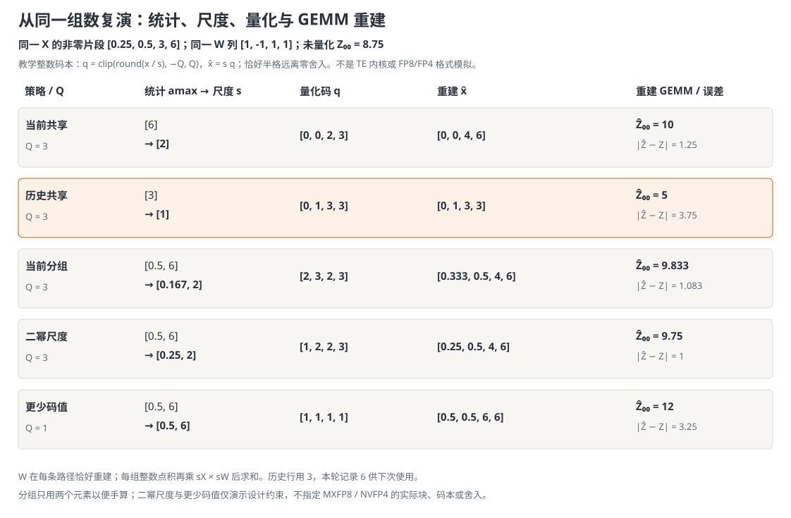
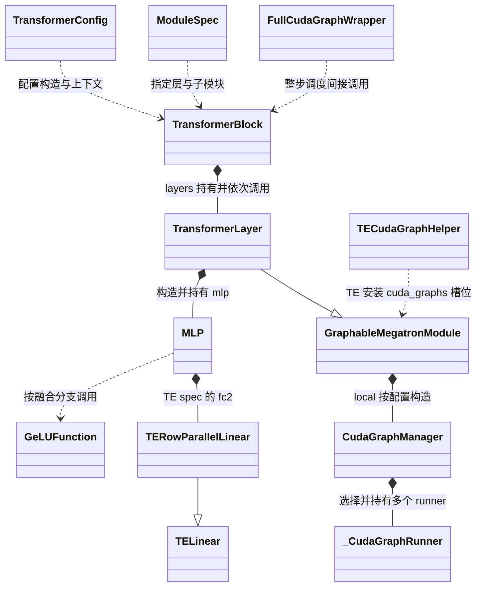
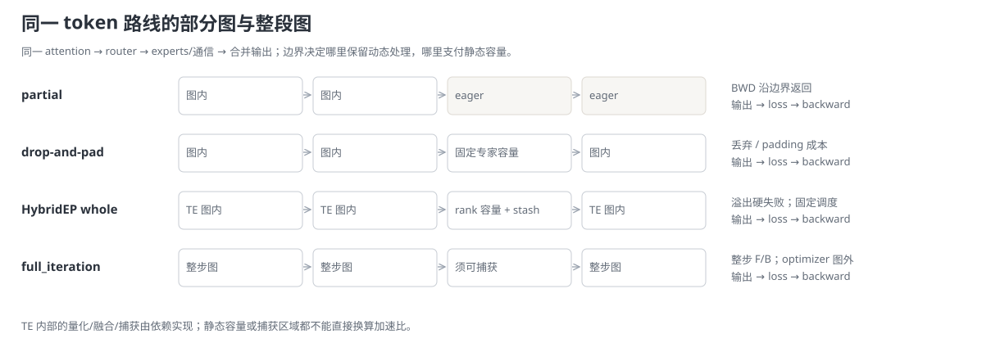

# Megatron-LM 算子性能优化：低精度、算子融合与 CUDA Graph

> **源码基线**：`NVIDIA/Megatron-LM@85902ef599ea4eb06ada7567a479c524b605767a`（`dev`，2026-09-01）
> **核心源码**：`megatron/core/fp8_utils.py`、`megatron/core/fp4_utils.py`、`megatron/core/transformer/cuda_graphs.py`、`megatron/core/full_cuda_graph.py`、`megatron/core/transformer/mlp.py`、`megatron/core/fusions/fused_bias_gelu.py`
> **中心结论**：低精度提高受支持的矩阵计算吞吐并压缩部分数据，融合减少中间张量读写，CUDA Graph 减少重复提交暴露的等待。三者分别作用于计算、数据移动和任务提交；只有命中当前瓶颈且节省超过附加成本，才能缩短训练迭代。
> **适用范围**：本页拥有精度选择、图捕获与融合交界，以及微批数如何约束图复用；单个融合算子的完整实现归 [[21_megatron_fusion_operators_analysis]]，参数分片通信归 [[16_megatron_distributed_optimizer_analysis]]。
> **最近更新**：2026-09-06。从同一 GEMM 的数值与成本推导出三种方案，再追踪模块装配、前后向与状态复用。

## 1. 为什么算子性能需要三种优化

训练一步的耗时不只来自模型做了多少次乘加。Transformer 的大矩阵乘法需要计算吞吐，bias、激活、归一化等操作需要搬运张量，CPU 还要不断向 GPU 提交工作；并行规模增大、单卡微批变小时，矩阵计算缩短，后两类开销就更容易暴露。Megatron 因而在三个位置优化同一段模型：让支持的矩阵乘法使用低精度操作数，让相邻算子在设备内部直接传递中间值，再让稳定的执行序列通过 CUDA Graph 重放。读者需要先区分这三种压力，才能理解为什么一种优化已经生效，另一种仍有必要。

| 维度 | 直接收益 | 必付成本或边界 |
|---|---|---|
| 低精度：改变用什么表示数据、用哪条计算路径 | 支持的 GEMM 可获得更高吞吐，选中的操作数与保存载荷变小 | 量化统计、格式/布局转换、缩放状态及数值误差；硬件与后端须支持 |
| 算子融合：改变中间值在哪里交给下一操作 | 减少中间张量写回和重读，通常也减少设备任务的启动次数 | 融合后的寄存器、共享内存、反向保存及实现约束；组合越大未必越快 |
| CUDA Graph：改变谁来重复提交执行序列 | 以图重放替代每次遍历主机执行路径，减少提交造成的 GPU 空隙 | 预热捕获、静态地址、输入输出复制与动态形状处理；图内计算和通信仍存在 |

三种方案作用于同一训练过程，所需状态也相互影响：低精度引入缩放与量化缓存，融合改变反向保存，图捕获要求这些对象可以按稳定的顺序再次使用。下面以 BF16 为基础方案，逐步加入 FP8/FP4、融合与 Graph；各融合 kernel 的完整推导由 [[21_megatron_fusion_operators_analysis|融合算子专题]] 维护。

## 2. 从同一段计算推导三种机制

先建立能对照的基础方案，再分别改变数据表示、中间存储和重复提交。三种机制可以叠加，但每一步都要重新确认剩余瓶颈。

### 2.1 基础方案：时间花在计算、搬运还是等待

只看单 rank 的一段 MLP：$X$ 是 `128×128` 的 BF16 输入，$W$ 是 `128×128` 的 BF16 权重，$b$ 是长度 128 的偏置。先算 $Z=XW$，再算 $A=\operatorname{GeLU}(Z+b)$，$A$ 交给下一线性层，最终参与损失 $L$。这里维度是教学输入，不是吞吐基准；一次 GEMM 按乘加计 2 FLOPs 的口径是 **4,194,304 FLOPs**。

反向收到 $G_A=\partial L/\partial A$ 后，要先求激活和偏置梯度，得到 $G_Z=\partial L/\partial Z$，再计算输入梯度 $G_X=G_ZW^\top$ 与权重梯度 $G_W=X^\top G_Z$。这已经解释了为什么“前向把 $X$ 变小”不等于“训练总显存按同一比例变小”：$X$、$W$ 的反向表示、梯度累加、优化器主参数以及后续模块的保存对象各有生命周期。

为判断时间会在哪里花掉，把一个设备 kernel 的工作量记为 $F$，HBM 实际读写字节数记为 $Q$，该实现可达到的计算吞吐与带宽分别记为 $P$、$\beta$。计算和访存可以重叠，因此下面用较慢的一侧作**理想下界**，不是把两项相加，也不是硬件实测预测：

$$
T_{\mathrm{kernel}}\gtrsim\max\left(\frac{F}{P},\frac{Q}{\beta}\right),\qquad I=\frac{F}{Q}.
$$

$I$ 是算术强度，单位为 FLOP/byte。$F/P$ 较大时，继续少搬一点数据可能无助于耗时；$Q/\beta$ 较大时，提高乘法峰值也可能闲置。实际还会受到 tile 利用率、指令依赖等约束。对于顺序依赖的一串 kernel，还要加上**未被设备工作掩盖的提交空隙** $G$：

$$
T_{\mathrm{segment}}\approx\sum_i T_{\mathrm{kernel},i}+G.
$$

这里的 $G$ 只指 CPU/运行时没有及时送来下一任务而暴露的等待。CPU 通常异步提交，不能把每次 API 调用耗时都串行加在 GPU 时间上；通信等待、流水线气泡也不能全部归到 $G$。这两个式子用于拆解本例，完整多流训练要看关键路径。

本例若假设 GEMM 对 $X,W$ 各读一次、对 BF16 的 $Z$ 写一次，最低载荷账为 **96 KiB**，算术强度约 **42.67 FLOP/byte**。这并不能单凭维度断言是计算瓶颈：若换成更大矩阵、较小的 decode batch 或不同硬件，$F/Q$ 与可达吞吐都会变。以下三节分别改变 $P,Q,G$，始终保留同一输入形状及输出/反向责任。

### 2.2 低精度：用数值误差与量化成本换取吞吐和载荷收益

低精度首先针对的是矩阵乘法本身：同样的乘加任务，支持低精度的 Tensor Core 路径可能提供更高 $P$；较窄的操作数也可能降低 $Q$。只给 BF16 GEMM 套 Graph 不会改变它的数学计算或操作数位宽，因此无法单独解决这类压力。实际能否兑现吞吐，仍由硬件、矩阵尺寸和后端实现决定。

BF16 基础方案直接把 $X,W$ 交给线性模块，由自动微分保存其反向所需对象。低精度方案先选定一组数共用的缩放因子 $s$，将它们映射到较窄的格式，再通过尺度恢复数值含义：

$$
q=\operatorname{cast}_{\mathrm{FP8}}(x/s),\qquad \widehat{x}=s q.
$$

这只是解释表示变化的数学模型；TE 可以保存逆缩放、融合量化到其他 kernel，并不保证真的生成一个独立的 $\widehat X$。GEMM 的乘加计数没有因此减少，改变的是操作数格式与受支持的执行路径。舍入、截断和缩放选择会使 $\widehat X\widehat W$ 不再与 BF16 结果完全相同。

**为何缩放和精度验证是机制的一部分？** FP8/FP4 可表示的数值范围与有效精度有限，直接转换可能让大值溢出或让小值失去分辨率。缩放把张量的主要数值范围放进可表示区间，却不能消除有限位数带来的误差。设量化后 $\widehat X=X+E_X$、$\widehat W=W+E_W$，暂不计累加舍入，则线性输出的误差为：

$$
\widehat Z-Z=E_XW+XE_W+E_XE_W.
$$

这说明误差还会受到另一个操作数影响，并经激活与反向传播；“某一份张量误差很小”不足以证明训练收敛保持不变。FP8 格式决定可表示数集合，缩放 recipe 决定哪些元素共用尺度、统计何时更新；首尾层保留 BF16、单独设置输出投影和高精度梯度路径，都是围绕数值敏感性划定使用范围。

#### 先按真实 FP8 格式编码同一组数

取本例 $X$ 第一行的非零片段为 `[0.25, 0.5, 3, 6]`，$W$ 第一列对应值为 `[1, -1, 1, 1]`，其余元素置零，则未量化的 $Z_{00}=8.75$。矩阵形状仍为 `128×128`，不启用稀疏执行，§2.1 的 FLOPs 口径保持不变。先固定两侧尺度均为 1，只观察真实浮点格式如何表示这些值，再讨论怎样选择尺度。

E4M3 用 1 位符号、4 位指数、3 位尾数，E5M2 则为 1、5、2 位；最大有限幅值分别为 448 与 57344。E5M2 扩大可表示范围，同时减少同一量级内的分辨率。这些稳定的格式事实见 [NVIDIA TE 2.3 FP8 primer](https://archive.docs.nvidia.com/deeplearning/transformer-engine-releases/release-2.3/user-guide/examples/fp8_primer.html#structure)；这里引用它解释格式，不把该版本的 TE 文档当作冻结 Megatron 后端内部执行的证明。

对本例的正规数，设符号位为 $\sigma$，指数域的整数值为 $E$，尾数域的整数值为 $j$，尾数位数为 $p$，指数偏置为 $\delta$，则值为 $(-1)^\sigma 2^{E-\delta}(1+j/2^p)$。E4M3、E5M2 的偏置分别为 7、15，见格式定义原论文 [FP8 Formats for Deep Learning，Table 1](https://arxiv.org/html/2209.05433v2#S3)。按该定义在 CPU 枚举正规数码本，得到下面的位串；三个字段依次是符号、指数、尾数。

| 原值 | E4M3 位串 | E4M3 重建值 | E5M2 位串 | E5M2 重建值 |
|---|---|---|---|---|
| 0.25 | `0 0101 000` | 0.25 | `0 01101 00` | 0.25 |
| 0.5 | `0 0110 000` | 0.5 | `0 01110 00` | 0.5 |
| 3 | `0 1000 100` | 3 | `0 10000 10` | 3 |
| 6 | `0 1001 100` | 6 | `0 10001 10` | 6 |

例如 E4M3 的 6 重建为 $2^{9-7}(1+4/8)=6$，E5M2 则为 $2^{17-15}(1+2/4)=6$。四个输入和权重的正负 1 都恰好可表示，所以在不额外模拟累加舍入的重建乘法中，两种格式都得到 **8.75**。但在 6 附近，E4M3 的相邻正数为 6、6.5，间隔 **0.5**；E5M2 为 6、7，间隔 **1**。因此精确表示这四个数，不表示任意扰动后仍然精确；尺度会改变原始张量中的哪些数落到这些可表示位置上。这是格式与乘法的 CPU 原理复演，未运行 TE 量化、累加或反向内核。

#### 再用同一组数复演尺度选择

接下来仍使用这组 $X,W$，把“共享、当前、历史、分组”逐一拆开。

这里**专门采用教学整数码本，不模拟 FP8/FP4 或 TE 内核**：可用码值是从 $-Q_c$ 到 $Q_c$ 的整数，恰好落在半格时向远离零的方向舍入。先从指定统计得到每组最大绝对值 $a_b$，再取 $s_b=a_b/Q_c$，最后量化与重建：

$$
q_i=\operatorname{clip}\left(\operatorname{round}(x_i/s_b),-Q_c,Q_c\right),\qquad
\widehat x_i=s_bq_i\quad(i\in b).
$$

权重四个非零值在本例恰好可表示：取 $s_W=1/Q_c$，得到 $q_W=Q_c[1,-1,1,1]$。各组先做整数点积，再乘对应的两侧尺度并相加，便能重建同一输出位置：

$$
\widehat Z_{00}=\sum_b s_b s_W\sum_{i\in b}q_iq_{W,i}.
$$

**基础的共享当前尺度**先扫描四个输入，得到最大值 6；$Q_c=3$ 时尺度为 2，量化码为 `[0, 0, 2, 3]`，重建输入变为 `[0, 0, 4, 6]`，输出为 10。它只需要一个输入尺度，代价是两个小值共用由大值决定的间隔，同时当前统计必须先于这次量化完成。

**改用历史尺度**改变统计时机：假定上一轮提供的最大值为 3，本次先以尺度 1 量化；6 会被截到最大码值 3，输出变为 5。本轮仍记录最大值 6，供下一轮选尺度使用。这样可以解除“必须先取得本轮统计才能选本轮尺度”的依赖，但增加跨轮历史，分布突然变化时也可能付出截断误差；历史并不意味着不再收集当前统计。

**再缩小共享范围**：把前两个数与后两个数各分一组，当前最大值分别为 0.5 和 6，尺度为 $1/6$ 与 2。两组整数点积为 -3 和 15，按尺度重建得到 $(-3)(1/6)(1/3)+15(2)(1/3)=9.833\ldots$。小值所在组的分辨率改善了，但后一组仍把 3 舍入为 4；代价是保存和读取两份尺度，并让乘法方向与分组布局匹配。这里每组两个元素只为了手算，不是实际 blockwise/MXFP8 的块尺寸。

**尺度表示和码值数量还可独立受约束**。若同样两组的尺度只能取不小于 $a_b/Q_c$ 的最小二次幂，就变成 0.25 和 2；另一项独立改动是只保留 -1、0、1 三个码值，再按当前分组取尺度，就变成 0.5 和 6。下面把五次运行并排列出；所有小数显示到三位，计算保留完整精度。

| 教学策略 | $Q_c$ | 用于选尺度的统计 | 尺度 | 量化码 | 重建输入 | 重建输出 | 输出绝对误差 |
|---|---|---|---|---|---|---|---|
| 当前共享 | 3 | `[6]` | `[2]` | `[0, 0, 2, 3]` | `[0, 0, 4, 6]` | 10 | 1.25 |
| 历史共享 | 3 | `[3]` | `[1]` | `[0, 1, 3, 3]` | `[0, 1, 3, 3]` | 5 | 3.75 |
| 当前分组 | 3 | `[0.5, 6]` | `[0.167, 2]` | `[2, 3, 2, 3]` | `[0.333, 0.5, 4, 6]` | 9.833 | 1.083 |
| 二幂尺度 | 3 | `[0.5, 6]` | `[0.25, 2]` | `[1, 2, 2, 3]` | `[0.25, 0.5, 4, 6]` | 9.75 | 1 |
| 更少码值 | 1 | `[0.5, 6]` | `[0.5, 6]` | `[1, 1, 1, 1]` | `[0.5, 0.5, 6, 6]` | 12 | 3.25 |



图中后两行分别展示尺度约束与更少码值的影响，不能把它们的数值当作 MXFP8、NVFP4 的结果。真正的浮点码本用指数表示量级、用尾数细分该量级：在正规数区间，间隔随指数升高而扩大，因此不是本例从小值到大值都相同的均匀整数间隔。FP8 的 E4M3、E5M2 对指数与尾数分配不同位数，FP4 的 E2M1 可用位数更少；格式决定可表示数集合，recipe 决定尺度策略，二者共同影响范围和舍入误差。实际格式组合、硬件支持与后端版本在 §3.2 和配置契约中核对；TE 的舍入、块形状、累加及保存策略没有在这里模拟。这组输入上误差降低，不构成对另一组输入或训练收敛的排序。

五种 FP8 recipe 中，`tensorwise`、`delayed`、`blockwise`、`mxfp8` 分别把当前整张量、历史、分块和微缩放策略交给后端，`custom` 允许自定义工厂；FP4 则有 `nvfp4` 与 `custom`。这些是同一设计空间中的不同选择，具体支持范围在 §3.2 对照源码，不能从上图给实际 recipe 填一个未经验证的误差数。

量化输出继续进入 bias、GeLU 和后续层，再由 loss 产生梯度。线性反向仍需要 $G_ZW^\top$ 和 $X^\top G_Z$，因此必须取得两个操作数在相应方向的可用表示；实现可以保存或重建低精度、转置及高精度对象。上面的重建等式只模拟前向乘法，**没有定义训练时对量化器求导的算法**，不能拿 clip 的数学导数替代 TE 的低精度反向契约。

**何时能赚回量化开销？** 令新增的统计、转换、布局等净成本为 $C_{\mathrm{quant}}$，在同一 GEMM 边界内比较：

$$
\begin{aligned}
T_{\mathrm{BF16}}&\approx\max(F/P_{\mathrm{BF16}},Q_{\mathrm{BF16}}/\beta),\\
T_{\mathrm{low}}&\approx C_{\mathrm{quant}}+\max(F/P_{\mathrm{low}},Q_{\mathrm{low}}/\beta).
\end{aligned}
$$

这是分析模型；$C_{\mathrm{quant}}$ 已扣除融合或复用隐藏的部分，不应把同一转换重复计费。只有第二式更小才有局部收益。大而规整、受支持的 GEMM 更有机会摊薄转换成本；很小的专家矩阵、严重 padding 或低复用权重可能被固定开销抵消。缓存可复用的权重量化表示有助于摊销，而激活随微批变化，不能照搬这一假设。

存储收益也需固定边界：若本例只把 $X,W$ 改为 FP8，仍写 BF16 的 $Z$，且假设量化操作数已经备好，GEMM 的上述最低载荷从 **96 KiB 降到 64 KiB**，仅为 **1.50 倍**的带宽侧理想比值，尚未计缩放与转换。每份输入位宽减半，并不意味着这段读写总量减半。训练峰值显存还需要统计同时存活的高精度副本和反向对象，见 §2.5 与 §4.1。

### 2.3 算子融合：让中间值在设备内部直接被消费

回到例子的 $Z$。未融合时先读 $Z$ 并写出 $U=Z+b$，再读取 $U$ 计算 $A$。若 $U$ 保持 BF16 且完整落入 HBM，它有 **32 KiB**，一次写回加一次读出是 **64 KiB**。这是理想化流量账本，未计 cache、偏置读取和 GEMM 本身。要把它用作纯融合对照，须先对齐同一种 GeLU 近似；此时融合的目标是免去这一轮中间往返，而不是免去反向保存。

在成功消除中间物化的融合模型中，一个线程或 tile 读入属于自己的 $Z$ 与 bias，在寄存器等片上存储中形成 $U$ 并立即计算 GeLU，最后只把 $A$ 写回。共享中间值的是这组操作，不要求把整个 `128×128` 张量一次塞进片上内存。以 $M_U$ 表示一个中间张量的字节数，忽略 bias 的广播与缓存，未融合的两操作读写为 $4M_U$（读 $Z$、写 $U$、读 $U$、写 $A$），理想融合为 $2M_U$（读 $Z$、写 $A$）。本例是 **128 KiB 降到 64 KiB**；节省来自少一次跨 kernel 的存储交接，而非 GeLU 数学消失。

这解释了融合对访存较重的逐元素链为何有效：相比仅提高 GEMM 吞吐，它直接压缩另一段 $Q$；相比单纯套 Graph，它还能改变设备内的数据路径。若这两操作完全受带宽限制、有效带宽相同且无其他成本，这一局部读写的理想加速比为 2。在只改变这段读写、其他耗时及重叠关系不变的假设下，加入 GEMM、反向与同步后，整层加速小于这个局部比值；实际 $U$ 命中 cache 时，HBM 节省也可能更少。

融合的上限来自片上资源与算法边界。更大的融合区域可能需要更多寄存器和共享内存，降低可同时驻留的线程块数量，甚至产生溢出读写；需要全局规约或通信的阶段也不能直接当成普通逐元素链连起来。因而“融合后 kernel 少了”只是路径变化的证据，还需核对设备耗时和读写流量。以上为成本推断，实际生成 kernel 取决于下面的后端选择。

这里的流量对照固定激活的数学定义。实际默认 GeLU 的 erf 公式和常见融合版本的 tanh 近似会有输出、梯度差异；§3.3 会指出 Megatron 的具体分支。因此既要验证融合有没有消除中间物化，也要验证所选近似的数值表现。融合反向仍须取得形成激活输入所需的 $Z,b$，随后把 $G_Z$ 交给线性反向。


图是在 GeLU 近似对齐前提下的**提交数量与中间载荷模型**：基础方案是 GEMM、bias、GeLU 共 **3 次设备操作提交**；假设 bias+GeLU 成功融合则为 **2 次**；把已选设备序列放入一张图后是 **1 次图提交**，图内仍有前面选定的设备工作。图不表示真实 kernel 数或耗时，量化本身可能增加、合并或替代 kernel；是否发生预期融合必须看实际编译产物/trace。

这个局部方案适用于相邻算子共享中间数据且后端能融合的场景。相比只给未融合序列套 Graph，融合还可能降低设备 HBM 流量；相比融合，Graph 还能降低包含 GEMM、通信在内的多操作提交成本，二者解决的剩余压力不同。寄存器用量、反向保存和编译开销则可能抵消融合收益，这是需要测量的代价推断。

### 2.4 CUDA Graph：复用执行结构，减少提交等待

即使已经选好低精度和融合，GPU 仍可能在两个短 kernel 之间等 CPU。eager 执行每次都要走相应的 Python、框架调度和运行时提交路径；当 GPU 做完上一项工作而下一项尚未到达时，§2.1 的 $G$ 才真正暴露。CUDA Graph 的思路是预先记录一段设备任务及其依赖，以后重放这个执行结构，减少每次重新组织与提交工作的成本。

对本例，假设 bias+GeLU 已经融合：

1. **准备与预热**：用规定形状的 $X$ 运行所选 GEMM 和激活路径，完成必要初始化，准备固定输入与可重放状态。
2. **捕获**：记录 GEMM→融合激活这组任务及依赖，确定它们访问的缓冲地址。捕获的是执行过程，不是缓存某次输出答案。
3. **重放前填入新数据**：把下一微批的 $X$ 写入固定缓冲；权重内容可以按训练更新，但被图访问的地址与执行契约须成立。
4. **重放并消费新结果**：提交这张图，GPU 再次完成 GEMM 和激活，写出新 $A$；后续 loss 的反向仍要执行相应梯度计算。主机从 replay 返回只证明已提交，消费结果须遵守流依赖或完成事件。

所以 Graph 可以让图内 kernel 之间的提交空隙缩短，却不会自动把 GEMM 和 GeLU 编译成一个 kernel，也不会自动去掉 $U$。§2.3 的图同时展示了两种改变：融合将教学序列的操作提交从 3 次变为 2 次；Graph 用一次图提交重放已选定的设备序列。图内仍有依赖和计算，不能按 3:1 推导吞吐。

**收益条件**是被去掉的主机路径和提交等待，大于 replay、边界复制、padding 等新增成本。在长时间重复的小 kernel 序列上，提交等待更可能显著；在连续大 GEMM 已占满设备、CPU 能提前送完任务时，$G$ 很小，图的稳态增益就可能很小。请求形状变化多、捕获次数多或训练很短时，还要考虑预热/捕获能否摊销。Graph 也不是用来消除 collective 网络时间的机制。

**静态约束为什么是代价？** 图复用的是已经确定的执行结构；若下一批要走不同分支、申请不同大小的缓冲或改变 kernel 参数形状，旧图就不再描述这次任务。为保持可重放性，Megatron 可以缩小捕获区域，把动态段放在图外，也可以提供固定容量与多个图档位。前者留下提交边界，后者支付 padding、容量和内存成本；§3.4 追踪捕获与重放，§4 说明微批、MoE 和推理如何满足这些约束。

### 2.5 组合成完整一层，收益才能进入整步账本

把 MLP 片段放回普通 pre-LN dense Transformer 层，主干是归一化 → QKV 投影 → attention → 输出投影 → 残差相加 → 归一化 → MLP → 残差相加。低精度先落在后端支持的 QKV、输出投影和 MLP GEMM；attention 内的点积计算及其输入输出是否采用低精度，还要单独选择受支持的 attention 路径。归一化、softmax 和残差继续遵守各自的精度契约。融合可以作用在归一化与线性层、激活以及 bias/dropout/残差等可融合交界；Graph 则重放所选 attention、MLP 或整层的可捕获序列。各投影有自己的矩阵形状和反向保存，前面的 64 KiB 只属于那个 MLP 中间值，不能作为全层各位置统一的节省量。

现在沿同一输入把三种方案连起来。第一次训练先确定数值格式和融合实现，以该实现准备量化表示、缩放状态和固定缓冲，再预热、捕获稳定序列。以后每个微批把新 $X$ 填入相应缓冲，选中的低精度 GEMM 产生 $Z$，融合激活在设备内消费 $Z+b$ 并交出 $A$；Graph 重放的是这套已经确定的工作，不能在重放时任意换 recipe 或激活公式。

后续层和 loss 生成 $G_A$，激活反向恢复其所需输入，线性反向形成输入梯度与权重梯度；图外消费者必须等相应计算和通信完成。优化器依据累加后的梯度更新主参数，若模型保存量化参数，还需重新量化、同步并补齐下次乘法所需布局。这才回到下一微批或下一步可使用的权重。融合没有取消反向输入，低精度没有取消主参数，Graph 的固定地址也没有取消权重内容更新。

三种优化因此按瓶颈叠加，而不构成版本升级链。先降低 GEMM 时间可能暴露原来被掩盖的搬运或提交等待；融合减少设备工作及启动次数后，也可能缩小 Graph 的额外收益。应在完整的前向、反向和参数更新边界内核算：

先为上述完整层建立乘法账。设当前层输入有 $B_\mu$ 条序列，每条长度为 $S$，总 token 数 $N=B_\mu S$，hidden size 为 $H$，MLP 中间宽度为 $M$。此处 $B_\mu$ 是本地微批的序列数，与 §4.3 的实际 global batch $B$ 区分。模型限定普通 MHA、非 GLU 的两层 MLP，按完整 $S\times S$ attention 乘法计数；不按因果三角跳过上半区，也不含 FlashAttention 或激活重计算导致的额外执行。

| 前向矩阵乘法 | 维度与乘加口径 | FLOPs | 与原片段一致的教学取值 |
|---|---|---|---|
| QKV 投影 | $[N,H][H,3H]$ | $6NH^2$ | 12,582,912 |
| attention 输出投影 | $[N,H][H,H]$ | $2NH^2$ | 4,194,304 |
| MLP fc1 | $[N,H][H,M]$ | $2NHM$ | 4,194,304 |
| MLP fc2 | $[N,M][M,H]$ | $2NMH$ | 4,194,304 |
| attention 的 QK 乘积 | 各 head 的 $[S,d][d,S]$，所有 head 宽度合计 $H$ | $2B_\mu S^2H$ | 4,194,304 |
| attention 的 PV 乘积 | 各 head 的 $[S,S][S,d]$ | $2B_\mu S^2H$ | 4,194,304 |

最后一列取 $B_\mu=1$、$S=N=H=M=128$，刻意保持原 fc1 的 $128\times128$ 权重，只作计算模型，不代表常用 FFN 扩展比例。六项相加得到前向主乘法量：

$$
F_{\mathrm{fwd}}=8NH^2+4NHM+4B_\mu S^2H.
$$

每个可训练乘法的反向都对两个输入各做一次相应形状的乘法，所以在这个常规数学口径下，$F_{\mathrm{bwd}}\approx2F_{\mathrm{fwd}}$，前后向合计约 $3F_{\mathrm{fwd}}$。教学取值分别为 **33,554,432**、**67,108,864** 和 **100,663,296 FLOPs**。这里尚未计 norm、softmax、激活、bias/dropout/残差的运算、梯度累加、通信及优化器，也没有由实际 fused kernel 的执行方式倒推 FLOPs。

这张表把三种优化放到了明确位置：四个投影是受支持低精度 GEMM 的主要候选；QK/PV 是否走低精度 core attention 仍需独立的后端与精度选择。融合主要消除逐元素链及受支持模块交界的写读，并不把上式的乘法数减半；Graph 压缩暴露的提交等待 $G$，也不消去这些矩阵乘法。

若用 §2.1 的理想下界估算一次层前反向，令 $i$ 遍历其实际执行的 GEMM，其他未被掩盖的逐元素与通信时间分别为 $T_{\mathrm{elem}}$、$T_{\mathrm{comm,exposed}}$，则可写成用于拆账的关键路径近似：

$$
\begin{aligned}
T_{\mathrm{layer}}\approx{}&\sum_i\max(F_i/P_i,Q_i/\beta)+T_{\mathrm{elem}}+T_{\mathrm{comm,exposed}}\\
&+G+C_{\mathrm{quant}}+C_{\mathrm{copy}}.
\end{aligned}
$$

低精度改变所覆盖项的 $P_i,Q_i$ 并增加净量化成本；融合减少中间 $Q_i$ 或逐元素阶段的流量；Graph 改变 $G$ 并可能增加边界复制 $C_{\mathrm{copy}}$。新增成本只计尚未包含在 kernel、融合或重叠中的部分，不能重复相加；多流并行也不能把所有通信时间都塞进暴露项。表中的 FLOPs 比例不等于时间比例，下面 Amdahl 模型的 $f$ 必须来自真实迭代关键路径的测量。

| 项目 | 本例能直接算出的量 | 全系统还必须支付的量 |
|---|---|---|
| 操作数载荷 | 每份 BF16 32 KiB；名义 FP8 16 KiB；packed FP4 8 KiB | scale/amax、padding、转置/列向表示、高精度副本、反向激活、梯度与主参数；custom 另算 |
| GEMM 工作 | 单次前向 4,194,304 FLOPs；dgrad/wgrad 各是一条相应 GEMM 路径 | 量化/反量化、布局变换及后端实际吞吐；FP8 不减少数学乘加数 |
| 局部融合 | 理想地免去一个 32 KiB 中间结果的一写一读，即 64 KiB | 编译、保存原始输入、反向计算与可能的寄存器压力；真实 HBM 流量需 profiling |
| 图提交 | 模型中的 3 次操作提交，融合后 2 次，一张图重放时 1 次图提交 | 捕获、warmup、图池、输入输出复制、同步、图外专家与 optimizer；不能按提交数直接换算加速比 |
| 通信 | 只有实际改成低精度的 payload 才能按位宽核算 | amax 规约、参数 all-gather 后处理、EP metadata/padding、图内外 collective；其重叠与 rank 同步由并行策略决定 |
| 槽位/覆盖 | §4.3 的四微批例子需要峰值 2 个存活槽位 | PP/VPP 拓扑改变上界；推理增加档位则增加捕获与内存成本，whole-MoE 有更严格容量边界 |

若要估计 Graph 的摊销，令相对 eager 新增的预热/捕获成本为 $C$，每次重放相对 eager 的净节省为 $\Delta t$，执行 $n$ 次才有 $n\Delta t>C$ 的收益条件；$\Delta t$ 已需扣掉新增复制与 padding。若设备计算本已饱和或 $\Delta t\le0$，减少主机提交也不能保证加速。这是成本模型推断，并非本基线的测量结果。

对整步训练，令某类可优化工作在原迭代关键路径中占比为 $f$，该部分局部加速为 $s$，新增成本占原迭代时间的比例为 $c$。只有其他工作及重叠关系不变时，才能用下面的近似估计总收益：

$$
S_{\mathrm{step}}\approx\frac{1}{(1-f)+f/s+c}.
$$

例如局部占 **40%**、局部加速 **2 倍**、新增成本占 **5%**，整步仅约 **1.18 倍**。若两倍来自一个低精度 GEMM，这不是低精度训练的实测成绩；它只说明为何必须同时报告覆盖比例和附加成本。前向更快后可能暴露通信，融合后剩余提交更少也可能缩小 Graph 增益；此时 $f$ 与重叠关系已经改变，三个单独加速比不能相乘。

同样，训练峰值显存是所有同时存活对象的合计，不能只看输入载荷：低精度表示可以与 BF16/FP32 副本共存，融合仍保存反向输入，图池还会保留固定地址。应分别记录活跃分配峰值、缓存保留内存和捕获峰值，不能把 allocator 的 reserved 变化直接解释为算法必要存储变化。

## 3. 方案如何落到模块装配与前后向执行

### 3.1 配置决定构造，模块持有可跨调用的状态

精度和融合先改变“构造什么模块”，图实现再改变“怎样调用这些模块”。`get_mlp_module_spec_for_backend` 从 backend provider 取得 fc1、fc2 与可选激活构造器：普通 dense 路径使用 `MLP`，op-fuser 条件成立时选择相应 TE fused MLP。TE provider 的列并行、行并行与 LayerNorm+Linear 分别返回对应包装器；所以把普通 `MLP.forward` 当成所有后端必经入口也会漏掉实际分支。

`TransformerBlock._build_layers` 根据 spec 构建层列表，`TransformerLayer` 再构建 attention、MLP 和残差接口。下面以普通 dense MLP 为中心表示职责：实心菱形表示持有，虚线表示构造选择或调用；标为“按配置”的关系只在相应分支成立。



`MLP` 持有两层线性模块；在 TE spec 下，fc1 可以是 `TELayerNormColumnParallelLinear` 或 `TEColumnParallelLinear`，fc2 是 `TERowParallelLinear`。包装器持有参数并把量化、GEMM 与自动微分交给 TE；融合激活的自动微分节点则保存原始 $Z,b$。这两种保存对象都从前向延续到反向，不属于图管理器自动接管的一份通用缓存。

图的所有权分三条路：local 模块持有 manager，manager 选择 runner，runner 持有固定表面和前后向图；TE helper 负责建图并把 callable 安装到层的槽位，后续由层调用；整步 wrapper 持有静态数据、训练/验证图与结果容器，并调用整个 forward/backward 调度。类之间的这层区别，决定了后面该从哪一个入口找状态的创建与释放。

### 3.2 精度：从参数构造到本次梯度，再到下次权重消费

#### 初始化与计算使用不同的上下文

`get_fp8_context` 依据 `fp8`、全局层号和 `first_last_layers_bf16` 决定是否进入 `fp8_autocast`；初始化时则依据 `fp8_param` 选择 `fp8_model_init`。因此“计算使用 FP8”和“参数主要存储使用 FP8”是两件事，偏置等参数不保证被转换。`params_dtype` 仍决定常规权重初始化 dtype；`fp16`/`bf16` 混合精度、`enable_autocast` 的 PyTorch 上下文也不是 TE recipe 的同义词。

层号必须是**全局层号**。`TransformerBlock._build_layers` 在本 PP/VPP chunk 的层号上加 offset，得到全局层号，并把减一后的编号传给 `get_fp8_context(..., is_init=True)` 或 FP4 对应入口；然后才在该上下文中构造模块。异构层先取得自己的 layer config，所以首尾 BF16 和参数量化初始化是在正确的层配置下作出的决定。

前向又有一项关键组织差别：`TransformerBlock.forward` 把 **delayed FP8 上下文放在整个层遍历之外**；其他 FP8 recipe 在遍历每层时建立 inner context，FP4 也总是逐层建立 inner context。full 重计算分支把同一个 inner-context 选择交给 `_checkpointed_forward`。delayed 禁止首尾逐层切换的原因正是 amax reduction 需要正确的上下文边界，而不是各层共用一个尺度。

**证据边界**：本页读到的是 Megatron 创建 recipe、传入量化上下文和管理 TE 张量的代码，未检出并验证 TE 内核实现。下表中 current、delayed、block/micro scaling 的语义来自本基线配置注释、包装器与所调用 recipe 的接口；真实缩放布局、累加精度、舍入策略、反向保存内容及硬件性能需在对应 TE 版本验证，不能从类名继续推演成已证实的内部执行。

#### recipe 选择怎样落实为依赖契约

§2.2 的教学复演区分了尺度覆盖范围、统计时机和码本约束。实际入口将这些设计选择交给不同 TE recipe；下面只断言包装器可核实的选择、传参和限制，不用教学码本推算 TE 的输出。

变体集合来自 `core/enums.py::Fp8Recipe` 与 `fp8_utils.py::get_fp8_recipe` 的实际分支：`delayed`、`tensorwise`、`blockwise`、`mxfp8`、`custom`。格式另由 `fp8` 选 `e4m3` 或 `hybrid`；按配置契约，后者对 FP8 激活/权重使用 E4M3，对 FP8 输出激活梯度使用 E5M2。格式轴不能替代缩放 recipe 轴。


图中每份 `128×128` 张量的 BF16 载荷是 **32 KiB**，名义 FP8 载荷是 **16 KiB**，打包 FP4 载荷是 **8 KiB**；低精度框外的 $S$ 表示未计入的缩放等状态。这些是按元素位宽计算的载荷，不是 TE 实际分配量，也不宣称 custom 必然采用对应位宽。每条路径仍以相同形状的 GEMM 输出交给激活函数，反向均必须重新取得 $G_ZW^\top$ 与 $X^\top G_Z$ 所需表示。

| recipe | 同一个 $X,W$ 如何进入计算及反向 | 解决的压力、增量成本与适用条件 |
|---|---|---|
| `delayed` | `TEDelayedScaling` 接收历史窗口、amax 选择方法与 margin；TE 用延迟缩放语义处理 $X,W$，并管理后续 amax/scale 更新。包装器把 `fp8_wgrad=False` 翻译成高精度 wgrad 覆盖 | 历史状态避免把当前张量统计作为所有量化的前置依赖，这是机制推断；代价是历史及规约状态需跨执行边界保持一致。旧 TE 分支只允许它；不支持首尾层 BF16 的逐层上下文切换 |
| `tensorwise` | 对同一 $X,W$ 选择 `Float8CurrentScaling`，使用当前整张量缩放语义；`fp8_dot_product_attention` 一并传入。TE 决定前向/反向的实际量化与保存 | 相比依赖旧历史，适用于需要当前张量尺度的场景；统计当前 amax 的工作与全张量动态范围是其成本/限制。要求 TE ≥ `2.2.0.dev0` |
| `blockwise` | 对同一 $X,W$ 选择 `Float8BlockScaling`；缩放随分块表达，输出仍是同一个线性变换的近似结果，反向不同方向的布局由 TE 处理 | 若整张量一个尺度难以兼顾局部数值范围，分块提供另一种选择；代价是更多尺度和布局处理。要求 TE ≥ `2.3.0.dev0`；本页不把旧稿的具体块形状或“生产首选”当作已验证结论 |
| `mxfp8` | 选择 `MXFP8BlockScaling`，并传入 DPA 开关；Megatron 的 GEMM 对齐接口对该 recipe 返回 32，其余 FP8 recipe 返回 16。反向/参数同步可能需要列向表示 | 微缩放服务于支持该格式的后端；配置说明限定 Blackwell。选择门槛为 TE ≥ `2.1.0`，并须满足实际硬件与尺寸要求；更细粒度不等于全模型必然更准或更快 |
| `custom` | `fp8_quantizer_factory` 指向可导入的 callable，包装成 TE `CustomRecipe(qfactory=...)`；同一 $X,W$ 的量化及反向契约由工厂与 TE 共同定义 | 用于内置策略表达不了的量化；须自行证明保存、数值与图兼容性，不能沿用固定载荷估算。导入失败、对象不可调用或缺少 CustomRecipe 都报错，后者提示 TE ≥ `2.9.0.dev0` |

这些分支是并列策略，不构成“粒度越细越先进”的升级链。源码明确反对的组合是 delayed scaling 配合 `first_last_layers_bf16`：逐层进出上下文会导致错误的 amax reduction；它没有说“所有层共享同一个 scale”。`get_fp8_context` 根据 `num_layers_at_start_in_bf16` / `num_layers_at_end_in_bf16` 与全局层号保留指定层，首尾精度保留是一项显式选择，而不是所有训练的固有事实。

#### FP4 与逐模块量化的装配边界

FP4 对应的枚举是 `Fp4Recipe.nvfp4` 与 `custom`，入口 `get_fp4_recipe` 先要求 TE ≥ `2.7.0.dev0`。`nvfp4` 把同一 $X,W$ 交给 `NVFP4BlockScaling`；配置注释说明面向 Blackwell+。本仓可直接验证的存储事实是 `get_nvfp4_rowwise_packed_shape` 把偶数的最后一维除以 2，以 `uint8` 保存两个 4-bit 值；因此例子中一份名义载荷为 8 KiB。其精度范围更窄，缩放与附加表示必须另计，不能把“相对 BF16 四分之一载荷”解释为四倍速度。

`quantize_nvfp4_param_shard` 把 FP32 主参数分片、偏移与 DP group 交给 TE 的 `quantize_master_weights`。该包装器 docstring 描述双层缩放、半字节精度的局部更新与 DP amax 协调；这是**委托契约**，不是本页对 TE 算法的运行验证。grouped NVFP4 的 rowwise 存储换址只移动 packed bytes，scale、amax、columnwise 缓冲仍由原张量持有，并刷新 member views。反向因此不能只凭这 8 KiB 还原完整执行状态。

FP4 `custom` 对同一输入改用 `fp4_quantizer_factory`，复用 CustomRecipe 的导入与版本检查；前向、反向及存储成本由工厂决定。它不应被隐藏在“FP4 只有 nvfp4”的旧注释之后。`get_fp4_context` 与 FP8 一样区分计算和参数初始化，也支持指定首尾层保留 BF16；TE 当前仍以名为 `fp8_autocast` 的接口承载 FP4 recipe。

除了统一设置精度，还可以逐模块选择：`quant_recipe` 按模块名匹配量化配置，TE 线性包装器可分别取训练/评估 recipe，覆盖 FP8、FP4、custom 或高精度路径。`get_quant_config_or_none` 容忍 `module_path=None`，避免无名称模块误匹配。`use_kitchen`、`use_kitchen_attention` 和 `kitchen_attention_backend` 则选择 Kitchen 的量化/attention 扩展；它们是另外的后端交接，不代表 TE 内置 recipe 又增加了三种。

#### 前向和反向在哪个边界交给后端

`TELinear.__init__` 还会按模块名寻找 `quant_recipe`，在对应初始化上下文中调用 TE 构造器。`TELinear.forward` 选择训练或评估用的模块 recipe，将 `is_first_microbatch` 交给 TE 以控制量化权重缓存；关闭缓存时该标志传空，正常调用后清掉首微批标志。输入每个微批都会变化，复用的是契约允许复用的权重表示，不能把缓存理解为复用上一微批的激活结果。

下面区分构造、普通前向、反向和下次权重准备；箭头标“间接”的位置省略模型转发、调度和梯度同步的中间包装。TE 侧的 GEMM、低精度反向与实际保存布局是依赖调用，不是此仓的 Python 实现。

```text
构造：TransformerBlock._build_layers
  -> 全局层号 / layer config -> get_fp8_context 或 get_fp4_context，is_init=True
  -> build_module -> TransformerLayer -> MLP 及线性包装器
  -> TE 模型参数初始化 [依赖]

前向：TransformerBlock.forward
  -> delayed FP8：外层 context -> 层遍历
  -> 其他 FP8 / FP4：层遍历 -> inner context
  -> TransformerLayer -> MLP -> TE 线性包装器.forward
  -> 模块级 recipe / 首微批标志 -> TE GEMM 与保存 [依赖]
  -> 激活 / 后续层 -> GPTModel._postprocess -> 输出投影与 loss

反向：训练 loss 的 backward [经调度间接调用]
  -> 后续层 -> 激活 backward -> TE linear backward [依赖]
  -> dgrad 返回前层，wgrad 累加 -> 梯度同步 / 主参数更新

下一次权重：DistributedOptimizer._copy_main_params_to_model_params
  -> 常规量化参数分支：quantize_param_shard / quantize_nvfp4_param_shard
  -> 参数 all-gather [间接] -> post_all_gather_processing
  -> 后处理或下一前向补齐方向布局 -> 下一次 TE GEMM

另一参数路径：MXFP8 复用梯度缓冲的 staging
  -> prepare_model_params_for_param_sync -> _copy_main_params_to_param_buffer
  -> 同步及量化后处理 -> 下一次 TE GEMM
```

loss 的实际入口还区分有无 labels：`GPTModel._postprocess` 在无 labels 时返回 logits；训练有 labels 时，选择普通输出投影后计算语言模型损失，或 fused linear cross-entropy 路径。无论输出头是否融合，训练都必须把 loss 的梯度送回前面的线性与激活节点。量化参数更新树只表示相应 distributed-optimizer 分支，precision-aware optimizer 和 Megatron-FSDP 有自己的 copy-back 路径；它们的分片所有权在 §4.1 交给专属专题。

LM head 是另一个独立消费者：`fp8_output_proj=True` 还需启用 FP8、选择 `mxfp8` 并存在 TE，`GPTModel` 才选 `TELMHeadColumnParallelLinear`。它把词表投影纳入 MXFP8，输出继续参与交叉熵及反向；并不由“最后几个 Transformer 层保留 BF16”自动决定。

### 3.3 融合：先选前向表达式，再保存对应的反向依赖

`MLP.forward` 先从 `linear_fc1` 得到输出与分离的 bias，再按 `use_te_activation_func`、`bias_activation_fusion`、激活种类及 GLU 条件选择实现。对本例，融合分支调用 `bias_gelu_impl`；未融合分支显式相加后调用 `self.activation_func`。**两条默认路径不只相差一次中间写读**：`TransformerConfig.activation_func` 默认是 `F.gelu`，其默认公式使用 erf；`bias_gelu_impl` 则固定采用 tanh 近似。因此切换融合可能同时改变前向输出与反向梯度的数值，不能默认逐值等价。若要隔离纯融合收益，测试应把未融合计算也写成相同的 tanh 近似，并另行比较误差；这不是声称 MLP 默认分支已经这样做。`GeLUFunction.forward` 保存原始 $Z,b$，`backward` 使用其前向 tanh 近似对应的导数，随后 fc1 的反向计算 $G_X,G_W$。因此避掉 $U$ 的物化并没有允许释放所有前向输入。

```text
构造：get_mlp_module_spec_for_backend -> MLP 或 TE fused MLP
普通 MLP.forward
  -> linear_fc1 -> Z 与分离 bias
  -> TE activation 分支 / 本地融合分支 / 普通 activation 分支
  -> 本例融合：bias_gelu_impl = GeLUFunction.apply
     -> forward：保存 Z、b -> bias_gelu 的 tanh 近似
  -> linear_fc2 -> 后续层 -> loss
loss.backward [间接]
  -> linear_fc2 backward -> G_A
  -> GeLUFunction.backward：取回 Z、b -> bias_gelu_back
  -> 返回输入与 bias 的梯度贡献 -> linear_fc1 backward -> G_X、G_W
```

`GeLUFunction.backward` 返回两个相同的逐元素梯度贡献；bias 的广播归约由相应自动微分/调用边界处理，不能把返回值误读为已独立实现一套并行 bias 规约。前后向的表达式均经 `jit_fuser` 编译选择，成功消除哪些临时写读仍需编译产物或 trace 证实。

本仓不仅选择外部内核，也实现运算：`fused_bias_gelu.py` 有前向与反向表达式，经 `jit_fuser` 进入 `torch.compile` 或兼容 JIT；其他融合包含本地 Triton 实现。相反，`FusedLayerNorm` 选择 Apex 的 persistent/普通 fused kernel，hidden size 或导入条件不满足时先尝试普通 fused 路径，两者都不可用则构造失败。这个类只接受 LayerNorm，不能从文件名推导它也实现 RMSNorm，更不能把它的失败策略推广到全部 fusion。

这三类模型操作各有自己的融合选择：

| 消费位置 | 输入、变换与输出 | 边界与对应专题 |
|---|---|---|
| MLP/残差/attention | bias+GeLU/GeGLU/SwiGLU，bias+dropout+残差，scale+mask+softmax，归一化 | 激活种类、GLU、bias 与 dtype 决定分支；反向保存逐算子不同。详细推导归 [[21_megatron_fusion_operators_analysis]] |
| 输出与模型专用路径 | `fused_cross_entropy` / `fused_linear_cross_entropy`，MLA YaRN RoPE、mHC、weighted squared-ReLU | 输入可能扩展到词表投影或残差流，不能拿本例的 64 KiB 当它们的收益；ScaledSReLU、Clamped-SwiGLU、DSv4 稀疏 attention 内核也见融合算子专题 |
| MoE 计算与数据重排 | `moe_grouped_gemm` 聚合本地专家 GEMM；`moe_router_fusion` 选择受支持的路由操作融合；`moe_permute_fusion` 融合置换/反置换；`moe_router_padding_for_fp8` 与 indices converter 处理量化对齐布局 | grouped GEMM 不等于整个路由投影、top-k、aux loss 都成为一个 kernel。token 的专家分配及反向归并归 [[14_megatron_ep_analysis]]，算子实现归 [[21_megatron_fusion_operators_analysis]] |

TE op-fuser 还可把 grouped MLP 的操作串交给一个融合执行器；`TEFusedDenseMLP` 的 CuTe GEMM-SwiGLU 路径受 SM100+、MXFP8 等条件约束，细节由融合算子专题维护。这些组合会改变量化发生的位置与中间保存对象，也会影响 Graph 的静态输入，所以本页不把三种优化称为互不影响的开关。

### 3.4 Graph：选择捕获所有者，再追踪固定地址的前后向

一次图重放必须重复捕获时的设备地址和执行结构；**调用者的新输入可以来自新地址**，前提是形状、dtype、device 等契约一致，并复制到图内固定缓冲。动态图景通常通过选图、padding 或把动态段留在图外处理，而不是让一张既有图任意改变形状。

`TransformerConfig.cuda_graph_impl` 枚举决定以下完整集合；另外两个字段分别决定训练捕获区域和推理所有权，不能省略：

| 实现 | 本例怎样执行、输出如何交给反向 | 直接成本与适用条件 |
|---|---|---|
| `none` | $X$ 直接进入当前量化/融合模块，普通自动微分走到 loss/backward | 不支付图捕获和静态池成本，仍逐次执行主机路径；是动态或尚不兼容图的基础路径 |
| `local` | `CudaGraphManager` 为模块选择 runner，记录首次前向/反向，之后固定输入缓冲并重放前后向图 | Megatron 管理边界拷贝、RNG、量化状态和图间复用；每层可有多个 runner/子图，并非恒定“一层一图” |
| `transformer_engine` | `TECudaGraphHelper` 提供模块、sample args、PP/VPP 顺序与量化设置给 `make_graphed_callables`，把返回 callable 装到各层槽位 | 可依 TE 优化捕获与内存；Megatron 的调度和输入构造可核实，TE 内部内存优化是依赖边界；需准备静态输入与足够的反向存活槽位 |
| `full_iteration` | `FullCudaGraphWrapper` 先把整步各微批数据填入静态缓冲，再捕获/重放 `forward_backward_func`，返回捕获结果容器 | 图覆盖整段前向—反向，**不含 optimizer step**；减少更多边界提交，但整步输入、通信与调度须可捕获，训练/验证各存图和结果 |

`cuda_graph_modules` 对 local/TE 选 `attn`、`mlp`、`moe`、`moe_router`、`moe_preprocess`、`mamba`；归一化后的空列表表示整层。`attn`/`mlp` 对应 attention 与 dense MLP 段，`moe` 对应整个 MoE，`moe_router` 捕获到路由前缀，`moe_preprocess` 要与 router 同用；不重叠的 shared expert 也可能属于 router 前缀。`full_iteration` 必须留空，`none` 下该字段无效果。local 会把 router/preprocess 补齐成一对。

`inference_cuda_graph_scope` 则是 `none`、`layer`、`block`：local 默认 `layer`，可选由 TransformerBlock/HybridBlock 持有的 `block`；其他 impl 只允许 `none`。旧 `cuda_graph_scope`、`enable_cuda_graph`、`external_cuda_graph` 和 `CudaGraphScope` 仅是兼容入口：`full` 归一化为空 modules，旧 `full_iteration` 迁到 impl，旧 `full_iteration_inference` 按迁移条件转推理 block；新旧输入冲突会被校验，不宜混写。

`GraphableMegatronModule.__call__` 是逐层图的分派点：local 调用 manager，TE 在捕获阶段走捕获函数、装好图后走槽位 replay；不满足图分支时回到普通模块调用。全局建图和实际重放是不同入口：

```text
training.train
|-- local：forward_backward_func -> pipeline schedules
|   |-- 模型调用 [间接] -> GraphableMegatronModule.__call__
|   |   -> CudaGraphManager -> runner.record_graph_capture / replay_graph_capture
|   |   -> 前向结果 -> loss -> _CudagraphReplayNode.backward -> main_grad / event
|   `-- schedule 尾部 create_cudagraphs -> 全局记录按 F/B 顺序捕获
|-- TE：预热后 TECudaGraphHelper.create_cudagraphs
|   -> sample args / PP 顺序 -> TE.make_graphed_callables [依赖]
|   -> 安装 layer.cuda_graphs -> 后续模型调用选择 callable -> loss / backward
`-- full_iteration：FullCudaGraphWrapper.__call__
    -> data_read -> StaticBufferLoader -> 捕获或重放 forward_backward_func
    -> 保存的 result -> 训练循环 optimizer.step -> 下一次参数准备
```

#### local 按首次执行顺序建立可复用表面


图中三条通路复用本例 `X[128,128]`，量化与激活近似保持同一选择。**local：固定输入复制 → 前向 surface/末层 clone → loss 梯度复制 → backward/main_grad/event**；**TE：sample slots → 依赖 callable → loss/backward → 梯度消费者**；**full_iteration：整步静态输入 → 图内 F/B → 图外 optimizer**。local 的事件只标记可供等待的 GPU 完成边界，不能替代梯度同步；TE 内部自动微分与缓存布局是图中显式标出的依赖边界。

考虑本例所在模块 A 的输出被模块 B 消费。第一次正常前向真正计算 $X\to A(X)$，`record_graph_capture` 给输入输出挂 `CudagraphBufferMetadata`，记录 `ArgMetadata`，并插入自动微分记录节点；第一次反向发生时再记录对应 backward。`_CudagraphGlobalRecord` 保存的是**执行顺序**，不是构造类的顺序。PP 调度器在 forward/backward 结束后调用 `create_cudagraphs()`，依记录逐张捕获。

这样做的理由在源码 docstring 中很具体：共享 mempool 的图必须按执行序捕获。即时、互不协调地给每个模块建图无法由这条全局顺序证明内存复用安全。捕获会预热、注册图安全 RNG、备份训练缓冲/梯度/量化状态并处理恢复，避免预热把路由统计或梯度当作真实训练结果累加。捕获开始前的同步和预热是真实启动成本，Graph 并不免费。

当 A 的输出就是 B 的输入，元数据记录消费者计数。`create_fwd_graph` 取得既有固定缓冲、递减 `capture_reuse_count`，必要时给多消费者分配缓冲；最后一个捕获消费者处理后清掉中间强引用。具备 TE weakref 支持时，图的输入输出张量引用可以不再把所有 Python tensor 强引用永久保留，但重放所需地址依然由图池保证。**当前实现是引用计数与弱引用协作，不存在旧稿中的 `TensorReusePool`**。`annotate_first_last_layer` 在建块时标注首尾层，也不再依赖旧 VP-chunk 判定函数。

重放时 `get_mismatch_errors` 先检查参数结构、张量形状/dtype/device 及非张量参数约束。新 $X$ 地址不同就复制到固定输入；只有 `can_skip_replay_copy` 的别名契约成立才省掉复制。前向末层输出会 clone，防止下一次重放覆盖外部还要用的值。loss 反向触发 `_CudagraphReplayNode.backward`：把新的输出梯度复制到静态 grad buffer，重放 backward，将 wgrad 累加进 `main_grad`，记录 `bwd_graph_replay_complete_event` 并挂到参数，供依赖方等待；GPU 提交返回不能当作所有梯度已同步完成。

#### TE 安装函数，整步 wrapper 缓存输入与结果

TE 路径先由训练循环预热，再在配置指定的步数调用 helper。它发现可捕获模块，构造每层/槽位静态输入，产生 PP/VPP 的前后向顺序，将 sample args、量化参数、mempool 等交给 TE；返回图后再按模型 chunk、层和槽位安装到 `layer.cuda_graphs`。因此 helper 返回的不是已经完成下一步训练的结果，而是后续调用可重放的函数。运行时仍须让 loss 的 backward 回到所选 callable，并按调度完成梯度同步。

`full_iteration` 则把 A、B 以及同一步其他微批的 forward/backward 一起包进图。`StaticBufferLoader` 按 training/validation 和 microbatch 缓存数据，复制流写入后当前流等待；顶层字典做浅拷贝，底层 tensor 仍共享静态缓冲。wrapper 预热后 barrier、清理 warmup 缓存、注册 RNG 并捕获，之后重放同一图并返回保存的结果结构。收益是减少层间主机边界，代价是整步静态输入及图池占用；optimizer 仍在 wrapper 外，可通过 `cuda_graph_use_single_mempool` 与相关优化器图共享池，不能因此把它说成同一张训练图。

## 4. 配套状态怎样保持可重放与可消费

核心执行已经闭合，剩下的问题是让它在分片参数、重计算、多个微批和动态请求中保持同样的输入输出契约。下面每种配套机制都在解决一个具体的存活、布局或容量边界。

### 4.1 量化参数同步：低精度载荷之外还要补齐表示

一次完整训练不能停在“GEMM 已使用 FP8”。前向上下文把 recipe 与 `parallel_state.get_amax_reduction_group(with_context_parallel=True, tp_only_amax_red=...)` 交给 TE；该 group 控制 amax 规约域，不能据此说 TP/EP 的激活通信都变为 FP8。损失反向产生输入梯度和权重梯度，梯度累加、缩放、溢出检查及 FP32 主参数更新交给 [[26_megatron_optimizer_step_internals_deepdive|优化器步内部机制]]。

若打开 `fp8_param` / `--fp8-param-gather` 或 `fp4_param` / `--fp4-param-gather`，主参数更新后还需量化分片、参数 all-gather 与后处理。`post_all_gather_processing` 会展开 grouped 量化成员并调用 TE；旧 TE 无此接口时，转置/列向数据延到下一次前向建立。后处理完成或前向补齐所需布局，才达到“下一次 GEMM 可消费参数”的边界。

这条路径可能减少**选中的参数载荷**，同时支付量化与转置表示成本。`reuse_grad_buf_for_mxfp8_param_ag` 的 staging、每 chunk 一次的 `prepare_model_params_for_param_sync()`、与 `overlap_param_gather_with_optimizer_step` 的互斥，以及评估时强制 all-gather 后处理，均保留在 [[16_megatron_distributed_optimizer_analysis|分布式优化器的参数同步]] / [[26_megatron_optimizer_step_internals_deepdive|优化器步与参数回拷]]。Megatron-FSDP 中 MXFP8 转置权重的非对称分片持久化也属于参数缓冲所有权，而非免费节省的一部分。EP dispatch 是否传低精度由 dispatcher 决定，见 [[14_megatron_ep_analysis|EP 的数据表示与通信边界]]。

NVFP4 grouped 参数也是同一个边界问题：只搬走 rowwise packed bytes 并没有搬走 scale、amax 或 columnwise 状态；参数缓存换址后仍须刷新成员视图。通信可以传较窄的有效载荷，但缩放规约与布局恢复仍在下一次矩阵消费的路径上。

### 4.2 RNG、量化历史与重计算必须恢复同一轮状态

`TransformerBlock.forward` 在 sequence-parallel 情况下进入 RNG tracker 的 fork，再建立量化上下文。重计算重新运行前向时，随机数与量化状态必须对应原来的逻辑执行，不能把重新统计当成一个新的真实训练微批；完整重计算的保存和恢复边界见 [[18_megatron_recompute_analysis|激活重计算的 TE 交接与精度边界]]。

量化在此处再次进入主线：delayed recipe 的 fp8 metadata 会接回当前规约组，反向后调用 TE 的 reduce/update；首层根据 `is_first_microbatch` 控制量化权重 cache 更新。重计算可能在反向重跑前向而丢失图缓冲元数据，`create_bwd_graph` 因此分配/复制额外缓冲。把 Graph、FP8、重计算独立相乘估收益，会漏掉这些交叉成本。

### 4.3 微批总数变化，需要证明槽位何时可复用

`cuda_graph_dynamic_microbatches=True` 只对 TE 路径有意义。它并不让一个槽位存放任意形状，而是允许微批总数变化时按槽位取模复用。安全条件是：某槽位上次前向对应的反向已经完成。helper 从 PP/VPP 顺序计算每 chunk 最大未完成微批数；例如 **`F0 F1 B0 F2 B1 F3 B2 B3` 的在途数为 `1,2,1,2,1,2,1,0`，峰值为 2，四个微批可复用 2 个槽位**。这个例子复现本基线 `TestDynamicMicrobatchSlots` 的顺序，不假定所有 PP 调度都只需两个槽位。


THD packing 还需静态 token 与 `cu_seqlens` 缓冲：`thd_max_packed_sequences` 为序列数上界，`pad_packed_seq_alignment` 约束 padding；动态 CP 的固定最大预算另有要求。helper 用 packing 上界和拓扑推导捕获需求，多捕获/多 padding 消耗内存和设备工作，不能把微批数变化直接当作“图支持动态形状”。

#### 全局 batch 如何影响图与梯度累加

微批计算把训练工作量连接到图缓冲需求：设实际运行 global batch 为 $B$，单 rank microbatch 为 $b$，DP 大小为 $D$，则 $m=B/(bD)$。`ConstantNumMicroBatchesCalculator` 要求整除且 $m\ge1$；若允许 `decrease_batch_size_if_needed`，先向下取到 $bD$ 的整数倍再算运行 batch。本基线的实际选择只有 constant 与 `StepBatchsizeNumMicroBatchesCalculator`：后者按已消费样本越过阈值切换 batch；指定 `seq_length` 时先将 token 阈值转换为样本阈值。旧 `rampup_batch_size` 参数在 `init_num_microbatches_calculator` / `reconfigure_num_microbatches_calculator` 中仅保留兼容签名，传入后被忽略并由 rank 0 告警；当前不存在独立 Rampup calculator。要表达 batch ramp-up，应使用 `step_batch_size_schedule`。输出 $m$ 被 PP 调度用于梯度累加与前后向排程，完整调度归 [[15_megatron_pp_schedulers_analysis]]。

因此改 global batch 不仅改变吞吐统计，还可能改变同时存活的激活/图槽位。TE dynamic slots 用实际存活上界复用；whole-MoE paged-stash 图明确要求固定调度；整步图缓存按微批准备的输入，不能把 ramp-up 视为与图完全无关的外部旋钮。

### 4.4 MoE：保留动态段，还是支付固定容量的成本

对带 MoE 的同一 MLP 段，动态专家 token 数把“重放前提”变成容量问题。当前可选部分捕获或整段捕获，后者又有不同容量实现，不能概括为 dropless 一律无法捕获：

| 方案 | 同一批 token 经过哪里、何时回到完整输出/反向 | 代价与准入 |
|---|---|---|
| 部分捕获 | attention 或 router/preprocess 前缀入图，随后恢复 experts/通信/合并等图外阶段；反向沿对应边界回到前缀图 | 保留动态图外处理，仍支付专家段主机提交、边界复制；`moe_preprocess` 若包含 DtoH 同步不能捕获，源码有配置 assert |
| drop-and-pad 整段 | 用 `moe_expert_capacity_factor` 与 `moe_pad_expert_input_to_capacity` 固定专家容量，token 映射、GEMM、合并在其允许范围内重放 | 超容量 token 的丢弃与未填满容量的 padding 都有语义/算力成本；实际路由与反向映射归 [[14_megatron_ep_analysis]] |
| sync-free HybridEP 整段 | TE whole-MoE 使用 rank 容量、paged stash 和 op-fuser 的静态分组表示容纳 token；按已捕获调度保存/取回反向激活 | 要求 TE impl、`flex` dispatcher、`hybridep` backend、`moe_expert_rank_capacity_factor`、`moe_paged_stash` 与 `use_transformer_engine_op_fuser` 同时成立；TE ≥ `2.19.0`、至少 2 次 warmup、固定微批调度；已捕获图静态容量溢出硬失败 |



`is_whole_moe_cuda_graph_scope` 把显式 `moe` **以及空 modules 的整层捕获**都算 whole-MoE，不能靠省略字段绕过校验。上述训练路径的约束也不应照搬成推理禁令：本基线测试明确允许 local inference block 的 dropless 配置，推理还会经过自己的后端、容量与图分档选择。

Hybrid/mHC 的兄弟路径进一步合并边界：attention-only 层可与后继 MoE 的可捕获前缀分成一组。`HyperConnectionHybridLayer._can_group_te_cuda_graph_with` 还检查 wrapper 类型、full/mHC-selective 重计算与首尾 BF16 的精度边界；并非任意相邻层都可合并。group tail 仍只在 `HybridStack.layers` 注册一次，`parameters()` 仅向 TE 暴露被图覆盖的 tail 前缀参数，避免改变 checkpoint keys。重放输出经 `_resume_partial_moe_cuda_graph` 续算图外 experts；它调整的是图函数暴露的参数集合，不是旧稿所谓“优化器原本会丢整层参数”。

### 4.5 推理：用图分档适配请求变化

推理没有训练 backward，真实完成边界是 logits/KV 或 Mamba 状态供下一轮生成消费。`DynamicInferenceContext` 按 token、prefill 请求数、decode 请求数组合建立候选图；`CUDAGraphBatchDimensionBuilder` 生成尺寸，`match_graph_config` 寻找能容纳真实 batch 的图，匹配不到返回 `None`。实际数据填进静态缓冲，padding 位置由相应长度/请求元数据隔离。EP 默认先对齐各 rank 的 batch 维度以选同图；支持内部处理各 rank token 差异的 dispatcher 可关闭外部 token-count 同步。

`InferenceSetupConfig.inference_cuda_graph_all_prefills` 映射为 `InferenceConfig.cuda_graph_all_prefills`（CLI `--inference-cuda-graph-all-prefills`）开启时，prefill/mixed 的捕获 token 上界扩到 `max_tokens`；否则由 `max_requests × (num_speculative_tokens+1)` 提供预算。decode-only 始终受后者限制，并独立生成档位。扩大覆盖会多建图或增加 padding 与静态池占用，收益取决于实际命中率；旧 `--inference-dynamic-batching-cuda-graph-max-tokens` 不是当前配置入口。详细推理请求/KV 生命周期归 [[31_megatron_inference_engine_analysis]]。

## 5. 按剩余瓶颈选择场景，并验证收益与失败边界

### 5.1 场景选择与有效的性能对照

下面是从机制推导的选择线索，不是该基线的性能测量，也不能仅凭一条现象直接下结论。

| 实际负载与观测 | 优先验证的机制及原因 | 让这一选择失效的条件 |
|---|---|---|
| 较大、规整的 GEMM 占主耗时，设备计算路径受限 | 低精度：确认受支持的矩阵吞吐是否提高 | 转换/padding 抵消收益，矩阵利用率低，或损失/梯度误差不可接受 |
| 大量逐元素操作之间读写完整张量，设备访存开销突出 | 融合：先找可消除的中间写读 | 中间结果必须外部消费或为反向保留，片上资源压力增大，已有后端早已融合 |
| 单卡微批小、重复形状多，短 kernel 之间存在主机供给空隙 | CUDA Graph：减少反复提交路径 | 空隙实际来自数据加载、通信或同步；边界复制、图外动态段仍主导 |
| MoE 每步专家 token 数不固定 | 比较部分图与静态容量整段图 | 整段要求的容量、dispatcher、stash、后端或固定调度不满足；padding/溢出成本过高 |
| 推理 decode 重复而 prefill 尺寸分散 | 按请求/token 分档评估图覆盖；分别分析 GEMM 与访存 | 图命中率低、padding 过多，或新增图占用影响可用 KV 容量 |
| 通信与流水线等待占主要关键路径 | 先复核并行布局与 [[20_megatron_comm_overlap_analysis|通信掩盖]]，再量化算子优化能覆盖多少 | 将全部 GPU 空白误算成 kernel 提交成本，会选错方案 |

有效的对照需要让**数学语义、实际工作量和计时边界一致**。固定模型、输入/序列分布、实际 global batch、并行布局、重计算和后端版本；先建立 BF16、无图的可复现基线，并记录已有融合状态。单独切换一种机制，再测组合；GeLU 比较须对齐近似，否则数值变化与融合变化混在一起。改变 batch 才装得下模型时，应另列容量收益，不能把增加工作量后的吞吐直接当成同一负载的加速。

每组至少同时记录稳态整步时间/有效 token 吞吐、相关设备 kernel 时间与提交空隙、峰值分配及保留内存；图另记捕获耗时、命中率和 padding，低精度另核对 loss、输入/权重梯度及持续训练的数值稳定性。GPU 异步执行要在同样的完成边界计时，分布式步长还需考虑最慢 rank，不能用 Python 函数返回时间代表梯度已就绪。先看较短设备时间来自哪个 $P,Q,G$ 的变化，再确认整步是否得到同样方向的改善。

本页能直接核算的是载荷、FLOPs、提交数量模型和槽位上界；未运行 GPU/TE 性能或收敛实验。性能测试需要实际硬件和依赖版本。若局部 kernel 已变快、整步仍不变，下一步应寻找新暴露的等待或额外状态成本，而不是据开关名认定优化无效。

### 5.2 进入优化路径前必须满足的硬约束

| 前提 | 源码边界 | 破坏后的行为 |
|---|---|---|
| FP8 格式、recipe、TE 版本匹配 | `fp8_utils.py::get_fp8_recipe`、`_get_custom_recipe` | 非 E4M3/HYBRID、版本不符或工厂无效时报错；不得以桩函数空上下文当作低精度训练成功 |
| delayed 不逐层切换首尾 BF16 | `fp8_utils.py::get_fp8_context` | assert，原因是 amax reduction 行为不正确 |
| full_iteration 关闭 loss/grad NaN 检查且 modules 空 | `training/arguments.py::validate_args` | assert；整步捕获路径不支持该检查，optimizer 在图外 |
| block 推理图的 FP8 组合受限 | `training/arguments.py::validate_args` | 必须 `transformer_impl='inference_optimized'` 且 `fp8_recipe='mxfp8'` |
| 图 RNG 和 allocator 条件满足 | `training/arguments.py::validate_args` | 必要时强制打开 `te_rng_tracker` 并告警；TE 图遇 expandable segments 且未设 `NCCL_GRAPH_REGISTER=0` 时 assert |
| 重放输入契约匹配、首次记录集合完整 | `_CudaGraphRunner.replay_graph_capture`、`_CudagraphGlobalRecord.create_cudagraphs` | mismatch assert；local 建图后出现新的训练记录请求也 assert |
| whole-MoE 满足容量与静态调度 | `cuda_graph_config.py::validate_moe_cuda_graph_support`、`TransformerConfig.__post_init__` | 不满足六项 HybridEP 条件、TE 版本、warmup 或固定调度要求则拒绝；已捕获后溢出由 `PagedStashRunner._raise_if_te_whole_moe_graph_overflow` 硬失败，无动态回退 |
| THD 静态缓冲完整 | `training/arguments.py::validate_args`、`TransformerConfig.__post_init__` | 缺 padding alignment 或 `thd_max_packed_sequences` 报错；动态 CP 对 alignment 有额外要求 |
| 融合算子的具体能力匹配 | `MLP.forward`、`FusedLayerNorm.__init__` | 不支持的激活融合抛 ValueError；persistent 不可用时尝试普通 fused LN，再无后端则构造失败 |

捕获期 GC 处理也有运行环境边界：`cuda_graphs.py::FREEZE_GC` 默认受 `CUDA_GRAPH_CAPTURE_FREEZE_GC` 控制，PyTorch ≥ `2.9.0a0` 自动关闭此 freeze-GC 兼容措施；`manual_gc` 是主机 GC 策略，不意味着 Graph 消除了全部 CPU 抖动。代码尚有重计算元数据导致额外复制与 LN 纯 PyTorch fallback 的 TODO；它们说明当前成本/缺口，不能据此宣称项目路线图或“Graph 的主战场已转向省显存”。

## 6. 配置契约与稳定源码路线

### 6.1 配置契约

先通过 §5.1 判断要解决的瓶颈，再用下表复核入口与组合条件。

#### ModelParallelConfig

| 字段 | 类型 | 默认 | 契约 |
|---|---|---|---|
| `fp16` | `bool` | `False` | 启用 FP16 混合精度训练；损失缩放、主参数更新由优化器路径处理，不等于启用 FP8 |
| `bf16` | `bool` | `False` | 启用 BF16 混合精度训练；可作为 TE 量化路径外围的高精度表示 |
| `params_dtype` | `torch.dtype` | `torch.float32` | 常规模型权重初始化 dtype；具体模块可进入独立量化初始化上下文 |
| `moe_grad_scale_func` | `Optional[Callable]` | `None` | 返回 MoE 辅助损失使用的缩放张量；未提供时回用 `grad_scale_func` |
| `enable_autocast` | `bool` | `False` | 将 forward-step 函数放入 PyTorch autocast 上下文 |
| `autocast_dtype` | `Optional[torch.dtype]` | `None` | PyTorch autocast 的目标 dtype；未指定时设为 `pipeline_dtype` |

该类共 74 个字段，本表收 6 项；其余字段归属见 `docs/coverage/megatron-lm.yaml`。来源：`megatron/core/model_parallel_config.py::ModelParallelConfig`。

#### TransformerConfig：精度与图状态配置

| 字段 | 类型 | 默认 | 契约 |
|---|---|---|---|
| `apply_query_key_layer_scaling` | `bool` | `False` | 将 QK 乘积按层号缩放以改善 FP16 数值稳定性，并强制 attention softmax 使用 FP32 |
| `attention_softmax_in_fp32` | `bool` | `True` | attention masking/softmax 使用 FP32；启用上一字段时必须为真 |
| `disable_bf16_reduced_precision_matmul` | `bool` | `False` | 设 `torch.backends.cuda.matmul.allow_bf16_reduced_precision_reduction=False`，禁止 BF16 matmul 使用低精度 reduction 累加路径 |
| `fp8_param` | `bool` | `False` | 在启用 FP8 时允许 TE 将主要 GEMM 权重存为 FP8；bias 等不保证转换，具体集合由 TE 决定 |
| `fp8_margin` | `int` | `0` | 传给 delayed recipe 的缩放计算 margin |
| `fp8_interval` | `int` | `1` | 兼容旧 TE 的缩放重算周期；TE ≥ 1.8.0 忽略，非默认值告警 |
| `fp8_amax_history_len` | `int` | `1` | delayed recipe 的 amax 历史窗口长度 |
| `fp8_amax_compute_algo` | `Literal['most_recent','max']` | `'most_recent'` | delayed recipe 从最近值或历史最大值选取 amax 来计算缩放 |
| `fp8_wgrad` | `bool` | `True` | 配置意图是允许 FP8 wgrad；本基线 delayed 构造分支明确把 False 传成高精度 wgrad 覆盖，其他 recipe 不接收这个参数，不能宣称所有分支都有同样覆盖 |
| `fp8_dot_product_attention` | `bool` | `False` | 请求 TE 的 FP8 DPA；delayed、tensorwise、mxfp8 与 nvfp4 包装器的传参按各分支执行 |
| `fp8_multi_head_attention` | `bool` | `False` | 请求 TE 的 FP8 MHA；本基线由 delayed 包装器按 TE 版本传入，不等于所有 recipe 的 attention 自动低精度 |
| `tp_only_amax_red` | `bool` | `False` | 把量化 amax reduction 限在 TP 或 TP-CP 域；影响缩放统计域，不直接规定激活通信 dtype |
| `num_layers_at_start_in_bf16` | `int` | `1` | `first_last_layers_bf16=True` 时，按全局层号保留开头指定数量层的 BF16 |
| `num_layers_at_end_in_bf16` | `int` | `1` | 同上，保留末尾指定数量层的 BF16；与独立 LM-head 输出投影开关区分 |
| `use_kitchen` | `bool` | `False` | 使用 Kitchen 扩展处理 Transformer 量化；后端实现另行交接 |
| `use_kitchen_attention` | `bool` | `False` | 选择 Kitchen attention 而非 TE attention |
| `kitchen_attention_backend` | `Literal['sdpa','fa']` | `'sdpa'` | Kitchen attention 启用时，分别选 `KitchenDotProductAttention` 或 `KitchenFlashAttention` |
| `fp4_recipe` | `Optional[Literal['nvfp4','custom']]` | `'nvfp4'` | 选择 NVFP4BlockScaling 或自定义工厂；当前分支支持 custom，配置旧注释的“只有 nvfp4”不足以描述实现 |
| `fp4_param` | `bool` | `False` | 配合 FP4 模式保存低精度参数，CLI 别名 `--fp4-param-gather`；bias 等保持原表示 |
| `fp4_quantizer_factory` | `Optional[str]` | `None` | FP4 custom recipe 所需的 callable Python 导入路径；无效路径或不可调用对象报错 |
| `enable_cuda_graph` | `bool` | `False` | 已弃用的启图入口，迁移到 `cuda_graph_impl`；不作为当前覆盖区域配置 |
| `cuda_graph_use_single_mempool` | `bool` | `True` | 仅 full_iteration：训练/验证的整步图与 optimizer 图捕获/重放共用图内存池 |
| `cuda_graph_retain_backward_graph` | `bool` | `False` | local 捕获 backward 时传 `retain_graph` 给 autograd；保留自动微分图可能增加内存，不是保留所有输出的 `.grad` |
| `cuda_graph_warmup_steps` | `int` | `3` | 图预热步数；TE whole-MoE paged stash 要求至少 2 步记录流水线调度 |
| `external_cuda_graph` | `bool` | `False` | 已弃用的外部图入口，由配置迁移到当前 graph API |
| `cuda_graph_dynamic_microbatches` | `bool` | `False` | TE 训练图按有界槽位允许运行微批数变化；THD 用 packing 上界；whole-MoE paged stash 禁止此模式 |
| `quant_recipe` | `Optional[RecipeConfig]` | `None` | 按模块配置量化策略，可区分训练/评估 recipe，交由匹配的模块包装器消费 |

该类共 266 个字段，本表收 27 项；下表补列实现与区域的选择字段，其他归属见 `docs/coverage/megatron-lm.yaml`。来源：`megatron/core/transformer/transformer_config.py::TransformerConfig`。

#### TransformerConfig：实现与区域选择

| 字段 | 类型 | 默认 | 契约 |
|---|---|---|---|
| `fp8` | `Optional[Literal['e4m3','hybrid']]` | `None` | 启用 TE FP8 计算并选格式；CLI `--fp8-format` |
| `fp8_recipe` | 可选的五种 recipe 字符串 | `'delayed'` | 选择 §3.2 中五条实现分支，受各自 TE 版本限制 |
| `fp8_quantizer_factory` | `Optional[str]` | `None` | FP8 custom 的 callable 导入路径 |
| `fp4` | `Optional[Literal['e2m1']]` | `None` | 启用 FP4 计算；CLI `--fp4-format`，recipe 另选 |
| `first_last_layers_bf16` | `bool` | `False` | 在启用低精度的模型中保留指定首尾层；FP8 delayed 不支持该组合 |
| `fp8_output_proj` | `bool` | `False` | 请求 MXFP8 LM head；需 FP8、mxfp8 和 TE 同时成立 |
| `cuda_graph_impl` | `Literal['none','local','transformer_engine','full_iteration']` | `'none'` | 选择 §3.4 的实现；full_iteration 不含 optimizer |
| `cuda_graph_modules` | 字符串/枚举或其列表 | `'full'` | 训练图区域；默认兼容值归一化为空列表，表示整层 |
| `inference_cuda_graph_scope` | `Optional[InferenceCudaGraphScope]` | `None` | 推理图所有权；local 默认 layer、可改 block，其他 impl 只能 none |
| `cuda_graph_scope` | 旧 scope 字符串/枚举或列表，可空 | `None` | 兼容字段，迁移到 modules/impl/inference scope 并校验冲突 |

`transformer_impl` 还决定 local/TE/inference_optimized 模块构造；`activation_func_fp8_input_store`、`bias_activation_fusion`、`persist_layer_norm` 等算子保存与融合字段在 [[21_megatron_fusion_operators_analysis]] 详解。推理 `cuda_graph_all_prefills` 与 token/request 预算、MoE 容量及分发字段在前文说明的对应专题维护；其完整配置契约由对应专题维护。

#### 其他配置类与相邻机制的接口

| 字段 | 类型 | 默认 | 契约 |
|---|---|---|---|
| `ModelParallelConfig.pad_packed_seq_alignment` | `Optional[Union[int,Literal['max']]]` | `None` | THD packing 后 token 张量填到正整数倍数，或以 `max` 填到 `max_seqlen_per_dp_cp_rank`；图路径还校验静态缓冲容量上界 |
| `TransformerConfig.moe_router_padding_for_fp8` | `Optional[bool]` | `False` | 兼容别名；启用时也打开当前 `moe_router_padding_for_quantization`，不只用于某一个 FP8 recipe |
| `TransformerConfig.moe_router_fusion` | `bool` | `False` | 请求 MoE TopK 路由与辅助损失计算融合，配置契约要求 TE ≥ 2.7.0；不承诺包括路由投影的整个链成为一个 kernel |
| `TransformerConfig.transformer_impl` | `Literal['local','transformer_engine','inference_optimized']` | `'transformer_engine'` | 选择模型模块实现；与 CUDA Graph impl 是不同轴，推理 block + FP8 有额外组合限制 |
| `RNGConfig.te_rng_tracker` | `bool` | `False` | 使用 TE 随机数跟踪器；图路径需要时由 CLI 校验强制打开并告警 |
| `TrainingConfig.manual_gc` | `bool` | `False` | 关闭阈值自动 GC、手动触发以对齐 rank 的收集时机；默认只在验证首尾执行，训练中触发由 `manual_gc_interval` 控制 |
| `InferenceSetupConfig.inference_cuda_graph_all_prefills` | `bool` | `False` | 映射到运行时 `cuda_graph_all_prefills`，将 prefill/mixed 覆盖扩到 max_tokens，decode 上界不随之扩大 |

上表来源分别为 `megatron/core/model_parallel_config.py`、`megatron/core/transformer/transformer_config.py` 与 `megatron/training/config/{common_config,training_config,inference_config}.py` 的同名配置类；字段所有权见 `docs/coverage/megatron-lm.yaml`，本页解释与三种优化直接相关的契约。

### 6.2 稳定源码阅读路线

下面每行给出一个机制的入口、状态变更和验证位置；不依赖易漂移的行号。量化误差与性能估算由本页假设推导，硬件执行与片上资源见 [[10_cuda_execution_model_guide|CUDA 执行模型]]，通用 Roofline 定义见 [[11_operator_optimization_guide|算子调优体系]] §2.1；本页的字节数只按 §2.1 声明的本例读写假设计算。

| 读者要复核什么 | 本冻结基线的锚点 |
|---|---|
| 模块装配与上下文作用域 | `megatron/core/models/gpt/gpt_layer_specs.py::get_mlp_module_spec_for_backend` → `megatron/core/extensions/transformer_engine_spec_provider.py::TESpecProvider`；`megatron/core/transformer/transformer_block.py::TransformerBlock._build_layers/forward/_checkpointed_forward` |
| 精度选择与委托 | `megatron/core/enums.py::Fp8Recipe/Fp4Recipe` → `megatron/core/fp8_utils.py::get_fp8_recipe/get_fp8_context`、`megatron/core/fp4_utils.py::get_fp4_recipe/get_fp4_context` → `megatron/core/extensions/transformer_engine.py::TEDelayedScaling/TELinear` |
| loss 与下一次参数消费 | `megatron/core/models/gpt/gpt_model.py::GPTModel._postprocess`；`megatron/core/optimizer/distrib_optimizer.py::DistributedOptimizer._copy_main_params_to_model_params/prepare_model_params_for_param_sync` → 参数同步与后处理 |
| 参数表示与下一步可用状态 | `megatron/core/fp8_utils.py::quantize_param_shard/post_all_gather_processing`、`megatron/core/fp4_utils.py::quantize_nvfp4_param_shard/modify_grouped_nvfp4_rowwise_storage` → TE 依赖；分布式消费见参数同步专题 |
| 融合例子的前后向 | `megatron/core/transformer/mlp.py::MLP.forward` → `megatron/core/fusions/fused_bias_gelu.py::GeLUFunction/bias_gelu_back`；后端选择 `megatron/core/jit.py::enable_jit_fuser`；LN 负例 `megatron/core/fusions/fused_layer_norm.py::FusedLayerNorm.__init__` |
| local 记录、固定地址与梯度事件 | `megatron/core/transformer/cuda_graphs.py::CudaGraphManager/_CudaGraphRunner/_CudagraphGlobalRecord/_CudagraphReplayNode` ；模块调用分派 `megatron/core/transformer/module.py::GraphableMegatronModule.__call__` → `megatron/core/pipeline_parallel/schedules.py` 的三个训练 schedule 尾部 `create_cudagraphs` |
| TE 顺序与槽位 | `megatron/training/training.py::train` → `megatron/core/transformer/cuda_graphs.py::TECudaGraphHelper._get_cuda_graph_input_data/create_cudagraphs/_get_required_num_microbatch_slots_from_order`；测试 `tests/unit_tests/transformer/test_thd_cuda_graph.py::TestDynamicMicrobatchSlots` |
| whole/partial MoE 与失败 | `megatron/core/transformer/cuda_graph_config.py::validate_moe_cuda_graph_support` → `megatron/core/transformer/transformer_config.py::TransformerConfig.__post_init__` → `megatron/core/transformer/moe/paged_stash.py::PagedStashRunner._raise_if_te_whole_moe_graph_overflow`；`tests/unit_tests/transformer/test_cuda_graphs.py` 中 whole-MoE 容量、版本、warmup、dynamic-microbatch 测试 |
| hybrid 成组与恢复 | `megatron/core/models/hybrid/hybrid_block.py::HyperConnectionHybridLayer._can_group_te_cuda_graph_with/parameters/_resume_partial_moe_cuda_graph` |
| 整步图与推理分档 | `megatron/core/full_cuda_graph.py::StaticBufferLoader/FullCudaGraphWrapper`；`megatron/core/inference/contexts/dynamic_context.py::DynamicInferenceContext.__init__` → `megatron/core/inference/batch_dimensions_utils.py::CUDAGraphBatchDimensionBuilder` |
| 微批数选择与更新 | `megatron/core/num_microbatches_calculator.py::init_num_microbatches_calculator` → `_configure_global_num_microbatches_calculator` → `_build_num_microbatches_calculator` → `ConstantNumMicroBatchesCalculator` / `StepBatchsizeNumMicroBatchesCalculator`；同文件 `update_num_microbatches/get_num_microbatches` 连接样本进度与调度器；旧 rampup 参数只告警并忽略 |
| 图的本页可执行模型 | `tools/figs/svg/megatron_precision_graph_figures.mjs`；`tools/figs/svg/lib/megatron_precision_graph_figures.test.mjs` 读取真实页面验证教学量化复演、载荷、提交计数与存活序列；不替代 GPU/TE 数值与性能测试 |

## Related Pages

- [[16_megatron_distributed_optimizer_analysis]] —— 参数分片、低精度 all-gather 与缓冲复用的所有权。
- [[26_megatron_optimizer_step_internals_deepdive]] —— 梯度 unscale、overflow、主参数更新及模型参数 copy-back。
- [[21_megatron_fusion_operators_analysis]] —— 每个融合算子的前后向、后端选择与量化交界。
- [[14_megatron_ep_analysis]] —— 专家 token 布局、容量限制及不同 dispatcher 的通信表示。
- [[18_megatron_recompute_analysis]] —— 重计算与量化状态、图缓冲及 RNG 的交接。
- [[10_pytorch_cuda_graphs_complete_guide]] —— CUDA Graph 通用机制，本页拥有 Megatron 的实际集成。
- [[02_engineering/02_train_frameworks/megatron-lm/index|Megatron-LM 知识地图]] —— 本域页面归属与阅读入口。
